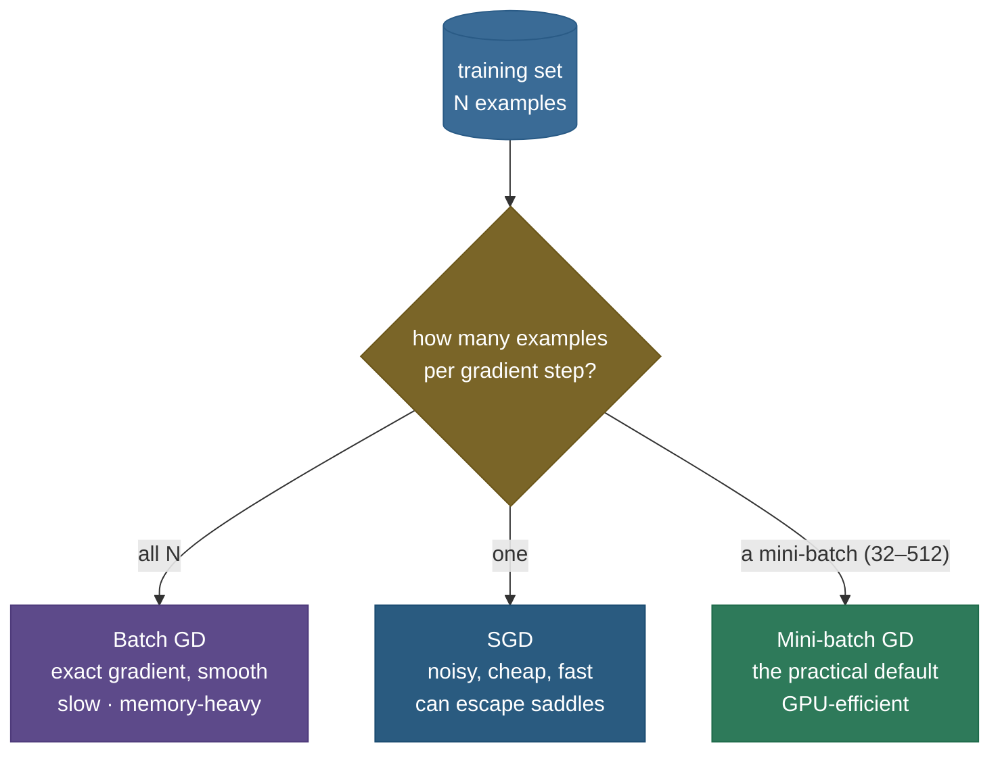

# Gradient descent: how almost every model learns

Strip away the architecture and almost every model — linear regression, a CNN, a 70-billion-parameter LLM — is trained by the same loop: compute how wrong you are, find the direction that reduces the error fastest, take a small step that way, repeat. That loop is **gradient descent**, and the one-line update $\theta \leftarrow \theta - \eta\,\nabla L(\theta)$ is, quite literally, the engine of modern machine learning. The idea is simple — roll downhill on the loss surface — but the *theory* is where interviews live: when does it converge and how fast, why the step size must respect the curvature, why an "ill-conditioned" loss crawls, and why training on noisy mini-batch gradients works at all (and even helps).

By the end of this page you'll be able to:

- explain why $-\nabla L$ is the **direction of steepest descent**, and write the update rule from scratch;
- reason about the **learning rate**: too small (crawl), too large (diverge), and the stability threshold $\eta < 2/L$;
- contrast **batch / mini-batch / SGD** and the noise-vs-cost trade-off;
- state the **convergence rates** — $O(1/k)$ for convex + smooth, **linear** for strongly convex — and the role of the **condition number** $\kappa$;
- explain why **SGD's noisy gradient still converges** (and helps escape saddle points), the real obstacle in high dimensions;
- demonstrate the stability threshold, the $\kappa$-driven slowdown, and SGD convergence in code.

Intuition and pictures first, then the theory (with sources), then runnable code.

> **Note:** gradient descent is *local* and *greedy* — it only knows the slope right where it's standing and always steps downhill. That's why the loss *surface* matters so much: on a friendly bowl it sails to the bottom; on a long narrow valley it zig-zags; near a saddle it stalls. Most of the theory below is really about how the **shape** of the loss controls this one simple rule.

---

## The problem: minimize a function you can't solve

Training is minimization: find parameters $\theta$ that make the loss $L(\theta)$ small. For a handful of cases (like linear regression) you can set the gradient to zero and solve in closed form — but with millions of parameters and a non-linear network, there's no formula for the minimum. So we minimize **iteratively**: start somewhere, and repeatedly take steps that decrease the loss. The only local information we have is the **gradient** $\nabla L(\theta)$ — the vector of partial derivatives — which tells us how the loss changes as we nudge each parameter. Gradient descent is the algorithm that turns that local slope into a global descent.

---

## The update rule, and why we step *against* the gradient

The gradient $\nabla L$ points in the direction of **steepest ascent** — the way that increases the loss fastest. We want to *decrease* it, so we step the opposite way:

$$\theta \leftarrow \theta - \eta\,\nabla L(\theta)$$

where $\eta$ is the **learning rate** (step size). Why is $-\nabla L$ the *steepest* descent direction? The change in loss for a small step $v$ is, to first order, the directional derivative $\nabla L \cdot v$. Among all unit directions $v$, the dot product $\nabla L \cdot v$ is *most negative* when $v$ points exactly opposite to $\nabla L$ (that's when $\cos$ of the angle between them is $-1$). So the negative gradient is, by definition, the locally fastest way down. Take that step, recompute the gradient at the new point, and repeat.

> *Where this comes from: gradient/steepest descent and its step-size rules are **Convex Optimization** (Boyd & Vandenberghe) §9.3, and **Mathematics for Machine Learning** (Deisenroth et al.) §7.1 — in the references.*

---

## The learning rate controls everything

The step size $\eta$ is the single most important hyperparameter, and the picture says it all:


- **Too small** — it converges, but agonizingly slowly (many steps, wasted compute).
- **Well-chosen** — fast, smooth descent to the minimum.
- **Too large** — it *overshoots* the minimum each step and **diverges**, the loss exploding.

There's a precise threshold. If the loss is **$L$-smooth** (its gradient doesn't change faster than a constant $L$ — the largest curvature), gradient descent is stable only when $\eta < 2/L$, and the safe choice is $\eta \le 1/L$. For $f(x) = x^2$, $L = 2$, so the threshold is $\eta < 1$ — which is *exactly* where the code flips from converging to diverging. Curvature sets the speed limit.

> *Where this comes from: the $\eta < 2/L$ stability condition and the role of the smoothness constant $L$ are standard results in **Convex Optimization** (Boyd & Vandenberghe) §9.3 and the SGD survey (Bottou, Curtis & Nocedal 2018) — references.*

---

## Batch, mini-batch, and stochastic

The gradient of the loss is an average over *all* training examples — but computing it over millions of examples for *every* step is wasteful. So we choose how many examples to use per step:



- **Batch GD** — full dataset per step: the *exact* gradient, smooth descent, but slow and memory-hungry.
- **Stochastic GD (SGD)** — one example per step: a **noisy** estimate of the gradient, very cheap, many updates per epoch.
- **Mini-batch GD** — a small batch (32–512) per step: the practical default, balancing low-noise gradients with GPU efficiency.

In practice "SGD" almost always means **mini-batch** SGD. The noise from sub-sampling isn't just tolerated — it's mildly *helpful* (next sections).

---

## Convergence: how fast, and on what

How quickly gradient descent reaches the minimum depends on the loss's shape:

- **Convex and $L$-smooth:** with $\eta \le 1/L$, the loss converges at rate $O(1/k)$ — after $k$ steps you're within $\sim 1/k$ of optimal.
- **Strongly convex** (curved in every direction, condition number $\kappa$): convergence is **linear** (geometric) — error shrinks by a constant factor each step, $O\!\big((\frac{\kappa-1}{\kappa+1})^k\big)$ — *exponentially* faster, but the factor worsens as $\kappa$ grows.
- **Non-convex** (real neural nets): no global guarantee, but gradient descent still reliably finds *good* minima in practice — one of deep learning's happy empirical surprises.

The headline is that **conditioning**, captured by the **condition number** $\kappa = L/\mu$ (ratio of largest to smallest curvature), governs the rate.

> *Where this comes from: the $O(1/k)$ convex and linear strongly-convex rates are **Convex Optimization** (Boyd & Vandenberghe) §9.3 and Nesterov's lectures; the large-scale/stochastic treatment is **Optimization Methods for Large-Scale Machine Learning** (Bottou, Curtis & Nocedal 2018) — references.*

---

## Conditioning: why narrow valleys crawl

Picture the loss as a bowl. If it's round (well-conditioned, $\kappa \approx 1$), the negative gradient points straight at the minimum and you arrive in a few steps. If it's a long, narrow valley (ill-conditioned, $\kappa \gg 1$), the gradient mostly points *across* the valley, not *along* it — so you **zig-zag**, taking tiny progress down the long axis while bouncing between the steep walls:


The code makes the cost concrete: condition numbers of 1, 10, 100 take roughly **1, 63, 653** steps — the number of iterations scales with $\kappa$. This is the entire motivation for **momentum** and **adaptive** methods (Adam): they damp the zig-zag and accelerate along the valley floor.

> **See it interactively:** Distill's [Why Momentum Really Works](https://distill.pub/2017/momentum/) lets you dial the condition number and watch gradient descent zig-zag — then watch momentum smooth it out. The best intuition pump for this section.

---

## Why SGD's noisy gradient still works (and helps)

If each step uses a noisy single-batch gradient, why doesn't training wander off? Because the mini-batch gradient is an **unbiased estimate** of the true gradient — on *average* it points the right way. With a **decaying** learning rate (the classic **Robbins–Monro** conditions: steps that shrink but not too fast), SGD provably converges *in expectation* to the minimum — the code shows it landing on the true mean despite never seeing a clean gradient.

And the noise is a feature, not just a bug:

- **Escaping saddle points** — random jitter knocks the iterate off saddles and plateaus where exact GD would stall.
- **Flatter minima** — SGD tends to settle in wide, flat basins that generalize better than the sharp minima full-batch GD can fall into.

> **Gotcha:** in high-dimensional deep nets, the obstacle is **not** local minima — it's **saddle points** (where some directions go up and others down), which are exponentially more common than true local minima (Dauphin et al. 2014). Most "bad" minima don't exist; the real challenge is plateaus and saddles, which is exactly where SGD's noise and momentum help.

---

## The path forward: momentum and adaptive methods

Plain gradient descent is the foundation, but the zig-zag and saddle problems motivated better update rules — **momentum** (accumulate a velocity to power through valleys and damp oscillation), **RMSProp/Adam** (per-parameter adaptive step sizes), and **learning-rate schedules**. They're all gradient descent with a smarter step; the theory here is what they're built to fix. See **[Optimizers](../../05.%20Deep_Learning/concepts/07-Optimizers.md)** for that next layer.

---

## Worked example: gradient descent on $f(x) = x^2$ by hand

$f(x) = x^2$, so $\nabla f = 2x$. Start at $x_0 = 2$ with $\eta = 0.4$:

- $x_1 = 2 - 0.4\cdot(2\cdot2) = 2 - 1.6 = 0.4$
- $x_2 = 0.4 - 0.4\cdot(2\cdot0.4) = 0.4 - 0.32 = 0.08$
- $x_3 = 0.08 - 0.4\cdot(0.16) = 0.016$

Each step multiplies $x$ by $(1 - 2\eta) = 0.2$, so it converges geometrically to $0$. Now try $\eta = 1$: $x_1 = 2 - 1\cdot4 = -2$, $x_2 = -2 - 1\cdot(-4) = 2$ — it **oscillates forever** between $\pm 2$, never converging. And $\eta = 1.05$ grows without bound. That's the $\eta < 1$ ($= 2/L$) threshold, by hand.

---

## Code: stability threshold, conditioning, and SGD

```python
"""Gradient descent: step-size stability, conditioning sets the rate, SGD converges.
Verified on ml-py312, CPU (numpy)."""
import numpy as np
rng = np.random.default_rng(0)

# (1) stability: GD on f(x)=x^2 (L=2) converges iff eta < 2/L = 1
def gd_1d(eta, steps=60, x=2.0):
    for _ in range(steps): x = x - eta * (2 * x)
    return abs(x)
for eta in [0.4, 0.9, 1.0, 1.05]:
    fx = gd_1d(eta); print(f"eta={eta:<5} |x| after 60 = {fx:.2e} -> {'converges' if fx < 1 else 'DIVERGES'}")

# (2) conditioning: steps-to-converge scale with the condition number kappa
def gd_quad(eigs, tol=1e-6):
    A = np.diag(eigs); x = np.ones(len(eigs)); eta = 1.0 / eigs.max()
    for k in range(100000):
        x = x - eta * (A @ x)
        if 0.5 * x @ A @ x < tol: return k + 1
for eigs in [np.array([1., 1.]), np.array([1., 10.]), np.array([1., 100.])]:
    print(f"kappa={eigs.max()/eigs.min():>5.0f} -> {gd_quad(eigs):>5d} steps  (ill-conditioned = slow)")

# (3) SGD: noisy single-sample gradients + decaying LR still reach the minimum
N, d = 1000, 5; data = rng.normal(size=d) + 0.5 * rng.normal(size=(N, d)); w = np.zeros(d)
for t in range(1, 8001):
    i = rng.integers(N); w = w - (0.2 / t**0.5) * 2 * (w - data[i])    # Robbins-Monro step
print(f"SGD: ||w - true_mean|| = {np.linalg.norm(w - data.mean(0)):.3f}  (-> 0)")
```

Output:

```
eta=0.4   |x| after 60 = 2.31e-42 -> converges
eta=0.9   |x| after 60 = 3.06e-06 -> converges
eta=1.0   |x| after 60 = 2.00e+00 -> DIVERGES
eta=1.05  |x| after 60 = 6.09e+02 -> DIVERGES
kappa=    1 ->     1 steps  (ill-conditioned = slow)
kappa=   10 ->    63 steps  (ill-conditioned = slow)
kappa=  100 ->   653 steps  (ill-conditioned = slow)
SGD: ||w - true_mean|| = 0.061  (-> 0)
```

> **Note:** three theory results, confirmed numerically. The step size flips from converging to diverging at exactly $\eta = 1 = 2/L$. The step count scales with the condition number ($1 \to 63 \to 653$ as $\kappa$ goes $1 \to 10 \to 100$) — that ~10× slowdown per 10× $\kappa$ is why ill-conditioning hurts. And SGD, never seeing a clean gradient, still converges to the true mean.

---

## Where gradient descent is used

- **Training every neural network** — mini-batch SGD (with momentum/Adam) is the universal training algorithm, from logistic regression to frontier LLMs.
- **Classical ML** — fitting linear/logistic regression, SVMs, matrix factorization at scale.
- **Beyond ML** — any large-scale continuous optimization (control, signal processing, physics-informed models).

> **Tip:** the practical workflow is built on this theory — you tune the **learning rate** first (it dominates), use **mini-batches** sized to the hardware, add **momentum/Adam** to handle conditioning, and apply a **schedule** (warmup + decay) so $\eta$ respects the Robbins–Monro intuition. Every one of those knobs traces back to a result on this page.

---

## Recap and rapid-fire

**If you remember nothing else:** gradient descent steps against the gradient, $\theta \leftarrow \theta - \eta\nabla L$, because $-\nabla L$ is the locally steepest way down. The **learning rate** must respect curvature ($\eta < 2/L$ or it diverges); **conditioning** ($\kappa$) sets how fast it converges (round bowls are fast, narrow valleys zig-zag); and **SGD's** noisy mini-batch gradients still converge in expectation while helping escape **saddle points** — the real high-dimensional obstacle.

**Quick-fire — say these out loud:**

- *The update rule?* $\theta \leftarrow \theta - \eta\nabla L(\theta)$.
- *Why the negative gradient?* It's the direction of steepest descent (most negative directional derivative).
- *What if the learning rate is too large?* Overshoot → oscillate → diverge (loss explodes); threshold $\eta < 2/L$.
- *Batch vs mini-batch vs SGD?* Exact-but-slow / practical default / noisy-but-cheap; "SGD" usually means mini-batch.
- *Convergence rate?* $O(1/k)$ convex+smooth; **linear** if strongly convex; no guarantee but works well non-convex.
- *What is the condition number and why care?* $\kappa = L/\mu$; large $\kappa$ → zig-zag → slow (steps scale with $\kappa$).
- *Why does SGD converge despite noise?* The mini-batch gradient is unbiased; with a decaying LR it converges in expectation (Robbins–Monro).
- *Real obstacle in high dimensions?* Saddle points and plateaus, not local minima — SGD's noise helps escape them.
- *How is the zig-zag fixed?* Momentum and adaptive methods (Adam) — see Optimizers.

---

## References and further reading

The curated link library for this topic — videos, courses, interactive/visual resources, articles, papers, books, and internal cross-links — lives in a companion file so it can be reused as a standalone reference list:

**→ [Gradient Descent — references and further reading](13-Gradient-Descent-Theory.references.md)**
