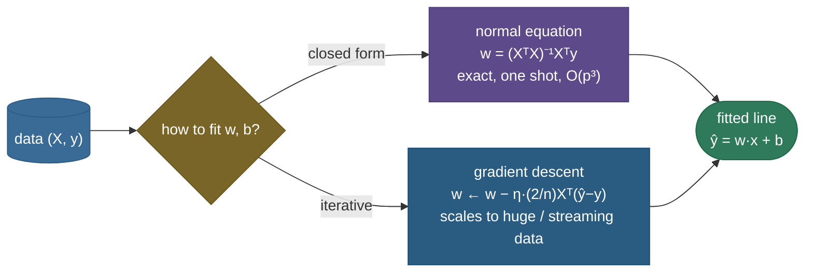

# Linear regression: the model everything else is built on

Linear regression is the "hello world" of machine learning, and it is far more important than its simplicity suggests. The idea is to predict a continuous target as a **weighted sum of the features** — $\hat y = w\cdot x + b$ — and to choose the weights that make the predictions as close as possible to the truth, measured by **squared error**. That's it: fit the straight line (or hyperplane) that passes through the cloud of data with the smallest total squared miss. Yet this one model is the foundation of an astonishing amount of what follows: [logistic regression](../02-Logistic-Regression/02-Logistic-Regression.md) is linear regression pushed through a sigmoid, [Ridge/Lasso](../03-Regularization-Linear-Models/03-Regularization-Linear-Models.md) is linear regression with a penalty, and **a single neuron with no activation function *is* linear regression trained by gradient descent**. Understand it to the bone — the least-squares objective, the closed-form solution, its geometry, the gradient-descent solution, and the probabilistic story underneath — and you've laid the groundwork for everything from classical statistics to a 100-layer network.

This page is the definitive treatment. We will *derive* every result rather than state it — the normal equation falls out of setting a gradient to zero; the squared loss falls out of a Gaussian likelihood; the gradient falls out of the chain rule — work **three** numeric examples of increasing complexity (a line through two points by hand → a least-squares balance of three points → a full normal-equation matrix trace with numbers), see the geometry as an orthogonal projection, and prove in runnable code that the closed form and gradient descent agree to machine precision and match scikit-learn.

By the end of this page you'll be able to:

- set up the **least-squares** objective and explain *why* we minimize *squared* error (three reasons, one of them deep);
- **derive** the **normal equation** $w = (X^\top X)^{-1}X^\top y$ by setting the gradient to zero, and read it as an **orthogonal projection**;
- **derive** the **MSE gradient** $\tfrac{2}{n}X^\top(\hat y - y)$ and run gradient descent down the convex bowl — knowing when to use it over the closed form;
- show that **minimizing MSE is maximum likelihood under Gaussian noise**, with the full derivation;
- state the **assumptions** (the **LINE** mnemonic) and how each one breaks;
- define and interpret **R²** and **adjusted R²**, diagnose **multicollinearity** (VIF), and write **Ridge's** closed form $w=(X^\top X+\lambda I)^{-1}X^\top y$;
- see linear regression as a **single neuron**, and fit it both ways from scratch — matching scikit-learn.

Intuition and pictures first, then the math (with sources), then runnable, verified code.

> **Note:** the whole model is one line of algebra, $\hat y = w\cdot x + b$, plus one choice of "best" — minimize the sum of squared residuals. Every richer model on this site is a variation on those *two* decisions: **change the prediction function** (sigmoid → logistic regression, a stack of layers → a neural net) or **change the loss/penalty** (add $\lVert w\rVert^2$ → Ridge, add $\lVert w\rVert_1$ → Lasso). Master the two decisions here and the rest is recombination.

---

## The problem: predict a number, draw the best line

You have features $x$ (one number, or a vector of $p$ of them) and a continuous target $y$, and you want a function that maps $x \mapsto y$. Linear regression makes the simplest possible choice for that function — an **affine** one, a line in 1-D and a hyperplane in higher dimensions:

$$\hat y = w_1 x_1 + w_2 x_2 + \dots + w_p x_p + b = w\cdot x + b.$$

Each weight $w_i$ is the **effect per unit** of feature $i$ ("how much does the prediction move when $x_i$ goes up by one, holding the rest fixed"), and $b$ is the intercept (the prediction when all features are zero). The modelling question is now sharp: **of all the infinitely many lines, which one is "best"?** We need a number that scores a candidate line, and linear regression's answer is the **sum of squared residuals** — the squared vertical gaps between the points and the line.

> **Tip:** absorb the intercept into the weights by appending a constant **1** to every feature vector (a "bias column" of ones in the data matrix). Then $\hat y = w\cdot x$ with no separate $b$, and the algebra below carries the intercept along for free. Every formula on this page assumes that bias column unless noted.

---

## Intuition: pinning a rigid ruler with springs

Here's a physical picture that makes least squares *feel* inevitable. Imagine laying a stiff ruler across your scatter of points, and from every data point attach a little **vertical spring** connecting the point to the ruler. A spring stores energy proportional to the **square** of how far it's stretched ($\tfrac12 k\,r^2$ — Hooke's law), so the *total* stored energy is exactly the **sum of squared residuals**. Let the ruler go and it settles into the position of **minimum total energy** — which is precisely the least-squares line. The springs pull hardest on the points that are farthest off (squared distance), which is why a lone outlier can drag the whole ruler toward it, and why the fit *balances* opposing pulls so the residuals sum to zero.

That single image carries three ideas you'll formalize below: **squared** error (spring energy), the **balance** of opposing residuals (mechanical equilibrium), and the disproportionate pull of **outliers** (energy grows with the square). Keep it in mind — every equation on this page is a precise statement about where that ruler comes to rest.

> **Tip:** the spring picture also explains *why a closed-form answer exists*. The energy is a **quadratic** (springs are squared distances), and a quadratic has exactly **one** lowest point with a flat tangent — set the slope (gradient) to zero and solve. That "flat tangent at the bottom of a bowl" is literally the normal equation, derived two sections down.

---

## The least-squares objective: why *squared* error

Define the **residual** of point $i$ as $r_i = \hat y_i - y_i$ (signed: positive means we over-predicted). Linear regression chooses the line that minimizes the **sum of squared residuals**, equivalently (dividing by $n$) the **mean squared error (MSE)**:

$$\min_{w,b}\; \sum_{i=1}^{n} (\hat y_i - y_i)^2 \;=\; \min_{w,b}\; \sum_{i=1}^{n} (w\cdot x_i + b - y_i)^2.$$


Why *squared* error and not, say, the sum of *absolute* residuals $\sum|\hat y_i - y_i|$? There are three reasons, and the third is the deep one:

1. **It's differentiable everywhere.** $r^2$ is smooth (a parabola); $|r|$ has a kink at zero. Smoothness lets us solve the minimization with calculus — set a gradient to zero and get a *closed-form* answer. Absolute error has no such clean solution.
2. **It penalizes large errors disproportionately.** A miss twice as big costs **four** times as much ($2^2$), so the fit works hard to avoid big outliers. (This is also a *weakness*: squared error is sensitive to outliers — one wild point can swing the line. If you want robustness, absolute error or Huber loss is the cure.)
3. **It is maximum likelihood under Gaussian noise.** Minimizing squared error is *exactly* the maximum-likelihood estimate when the data is line-plus-Gaussian-noise — derived in full below. This is what elevates least squares from "a convenient choice" to "the *principled* choice under a clear assumption."

> **Gotcha:** least squares minimizes the **vertical** distances (errors in $y$), **not** the perpendicular distance from each point to the line. That asymmetry is deliberate — we treat $x$ as known and only $y$ as noisy. If *both* axes are noisy you want **total least squares** (orthogonal regression / PCA-flavoured), which is a different model. Knowing this distinction is a classic interview tell.

---

## The closed-form solution: deriving the normal equation

Because the squared-error loss is **convex and quadratic** in the weights, it has a single global minimum we can find exactly with calculus — no iteration. Stack the data: let $X$ be the $n\times(p{+}1)$ **design matrix** (one row per observation, with a leading column of ones for the bias), $w$ the $(p{+}1)$ weight vector, and $y$ the target vector. The loss in matrix form is

$$L(w) = \lVert Xw - y\rVert^2 = (Xw - y)^\top (Xw - y).$$

Expand it: $L(w) = w^\top X^\top X\, w - 2\, y^\top X w + y^\top y$. Take the gradient with respect to $w$ (using $\nabla_w\, w^\top A w = 2Aw$ for symmetric $A=X^\top X$, and $\nabla_w\, c^\top w = c$):

$$\nabla_w L = 2X^\top X\, w - 2X^\top y.$$

Set it to zero — at the minimum the gradient vanishes — and the $2$'s cancel, leaving the **normal equations**:

$$\boxed{\,X^\top X\, w = X^\top y\,} \quad\Longrightarrow\quad w = (X^\top X)^{-1} X^\top y.$$

That's the entire closed-form solution: one matrix multiply, one solve. It is exact, deterministic, and needs no learning rate or stopping criterion.

> **Note:** they're called the *normal* equations because, rearranged as $X^\top(Xw - y) = 0$, they say the residual $r = Xw - y$ is **orthogonal ("normal") to every column of $X$** — each column's dot product with the residual is zero. That single fact *is* the geometry of the next section, and it's worth carrying around: **at the least-squares solution, the residual is perpendicular to the feature space.**

> **Gotcha:** never literally compute the inverse $(X^\top X)^{-1}$ in code — it's slower and numerically worse. **Solve the linear system** $X^\top X\, w = X^\top y$ directly (`np.linalg.solve`), or better, factor $X$ with **QR or SVD** (what `np.linalg.lstsq` and scikit-learn do), which is far more stable when $X^\top X$ is ill-conditioned. The boxed inverse is how you *derive* and *read* the answer, not how you *compute* it.

> *Where this comes from: least squares and the normal equations date to Gauss and Legendre around 1805–1809 (the priority dispute is told in **Stigler 1981**); the modern matrix derivation is **CS229 notes §1** and **ISLR Ch. 3**; the projection geometry and computational care are **ESL Ch. 3** — see references.*

---

## The geometry: least squares is an orthogonal projection

The normal equations have a beautiful geometric reading that makes the whole method click. Think of the target $y$ as a single point (vector) in $n$-dimensional space — one axis per observation. The set of *all possible predictions* $\hat y = Xw$, as $w$ ranges over everything, is the **column space of $X$**: the (at most $(p{+}1)$-dimensional) subspace spanned by the feature columns. We can only ever predict vectors that live in that subspace.

Least squares asks: *which point in the column space is closest to $y$* (in Euclidean / squared distance)? Geometry answers immediately — **the orthogonal projection of $y$ onto the subspace.** The fitted $\hat y$ is that projection, and the residual $y - \hat y$ is the leftover piece sticking *perpendicularly out* of the subspace:


This is *exactly* what $X^\top(Xw - y) = 0$ said algebraically — the residual is orthogonal to every column of $X$, i.e. to the whole subspace. So the normal equation and the projection picture are the same statement in two languages. Formally, $\hat y = X(X^\top X)^{-1}X^\top y = Hy$, where $H = X(X^\top X)^{-1}X^\top$ is the **hat matrix** (it "puts the hat on $y$"), the projection operator onto $\text{col}(X)$.

> **Note:** "closest point in the subspace = the orthogonal projection" is the **Pythagorean** reason squared error and projection coincide. Minimizing the *squared* length of the residual is minimizing its Euclidean distance, and the shortest segment from a point to a subspace is always the perpendicular one. Use a different loss (absolute error) and the "best fit" is no longer the orthogonal projection — another way to see how special squared error is.

> **Tip:** the projection view instantly explains two facts. (1) If $X$ has a **column of ones** (an intercept), the residuals **sum to zero** — the residual is orthogonal to the ones-column, i.e. $\sum r_i = 0$. (2) If two feature columns are **collinear**, the subspace is degenerate (lower-dimensional), the projection is non-unique, and $X^\top X$ is singular — the multicollinearity problem, seen geometrically.

---

## The gradient-descent solution (and the bridge to deep learning)

The normal equation is exact but requires forming and solving with the $(p{+}1)\times(p{+}1)$ matrix $X^\top X$, which costs $O(np^2 + p^3)$ — fine for hundreds or thousands of features, but a wall when $p$ is huge, when $X^\top X$ is singular, or when data arrives in a stream. Then you minimize the **same loss iteratively** with **gradient descent**: start anywhere, repeatedly step downhill.

We need the gradient. Differentiating $L(w)=\lVert Xw-y\rVert^2$ (and dividing by $n$ to use the *mean* squared error) gives the famous **error-times-input** form:

$$\nabla_w\,\text{MSE} = \frac{2}{n}X^\top(\hat y - y) = \frac{2}{n}X^\top(Xw - y).$$

Read it per weight: $\frac{\partial \text{MSE}}{\partial w_j} = \frac{2}{n}\sum_i (\hat y_i - y_i)\,x_{ij}$ — each weight's gradient is the **average residual weighted by that feature's value**. Then update $w \leftarrow w - \eta\,\nabla_w\text{MSE}$ for a learning rate $\eta$, and repeat until convergence.



Why is this guaranteed to work? Because the MSE is **convex** in $w$ — its Hessian is $\frac{2}{n}X^\top X$, which is positive semi-definite for *any* $X$ (every quadratic form $v^\top X^\top X v = \lVert Xv\rVert^2 \ge 0$). A convex function has **no local minima to get stuck in**: every downhill path leads to the one global minimum, the same point the normal equation computes. The loss surface is a single smooth bowl:


This **is** the bridge to deep learning. A linear regression fit by gradient descent on MSE is *exactly* a **single neuron with no activation function** — $\hat y = w\cdot x + b$ is the neuron's pre-activation, MSE is the loss, and $\frac{2}{n}X^\top(\hat y-y)$ is what backpropagation computes for that one unit. Stack neurons, add nonlinear activations between them, and you have a deep network trained by the *identical* loop: forward pass → loss → gradient → step. Everything you internalize here scales up unchanged. (The code below confirms gradient descent and the normal equation land on the same weights to $10^{-15}$.)

> **Gotcha:** gradient descent on **unstandardized** features is **ill-conditioned**. If one feature ranges 0–1 and another 0–10,000, the MSE bowl becomes a long, narrow ravine: the gradient points mostly across the ravine, so GD **zig-zags** slowly down its length (or diverges if $\eta$ is too large). The culprit is the **condition number** of $X^\top X$ — the ratio of its largest to smallest eigenvalue. **Standardize features** (subtract the mean, divide by the std) so all axes have comparable scale; this makes the bowl round and GD converge fast. The code does exactly this. (The normal equation is scale-robust because it doesn't *walk* the surface — but it pays $O(p^3)$ and still suffers if features are *collinear*.)

> **Tip:** the practical decision rule. **Few features, modest data → normal equation** (one line, exact, no tuning). **Many features, big or streaming data → (stochastic) gradient descent** (scales linearly, the engine behind every deep-learning library). That single tradeoff — exact-but-cubic vs iterative-but-scalable — is *why both methods exist*, and naming it crisply is what an interviewer wants.

> **Note:** the update above is **batch** gradient descent — it uses *all* $n$ points to compute each step, an exact gradient but an $O(np)$ cost per step. **Stochastic gradient descent (SGD)** estimates the gradient from a *single* random point, and **mini-batch SGD** from a small batch — each step is far cheaper and noisier, but the noise lets it scale to data that doesn't fit in memory and is what actually trains neural nets. The math is identical ($\frac{2}{|B|}X_B^\top(\hat y_B - y_B)$ over the batch $B$); only *how much data per step* changes.

---

## MSE is maximum likelihood under Gaussian noise

Here is *why* squared error is principled, not arbitrary — the derivation worth knowing cold. **Assume** the data is generated as the line plus independent Gaussian noise:

$$y_i = w\cdot x_i + b + \epsilon_i, \qquad \epsilon_i \sim \mathcal{N}(0, \sigma^2)\ \text{i.i.d.}$$

Then each target is Gaussian about the line, $y_i \mid x_i \sim \mathcal{N}(w\cdot x_i + b,\ \sigma^2)$, with density

$$p(y_i\mid x_i; w,b) = \frac{1}{\sqrt{2\pi\sigma^2}}\exp\!\left(-\frac{(y_i - (w\cdot x_i + b))^2}{2\sigma^2}\right).$$

By independence, the **likelihood** of all the data is the product, and the **log-likelihood** turns that product into a sum:

$$\log \mathcal{L}(w,b) = \sum_{i=1}^{n}\log p(y_i\mid x_i) = -\frac{1}{2\sigma^2}\sum_{i=1}^{n}\big(y_i - (w\cdot x_i + b)\big)^2 \;-\; \frac{n}{2}\log(2\pi\sigma^2).$$

The second term doesn't depend on $w,b$, and the first is $-\frac{1}{2\sigma^2}$ times the **sum of squared residuals**. So **maximizing the log-likelihood over $w,b$ is identical to *minimizing* the sum of squared residuals** — the $1/(2\sigma^2)$ is just a positive constant scaling. Least squares **is** the maximum-likelihood estimator when the noise is Gaussian:

$$\arg\max_{w,b}\ \log\mathcal{L}(w,b) \;=\; \arg\min_{w,b}\ \sum_i\big(y_i - (w\cdot x_i + b)\big)^2.$$

> **Note:** this is the principled answer to "why squared error?" — **it's the MLE under a Gaussian-noise model.** It also tells you *when squared error is the wrong choice*: if your noise is heavy-tailed (occasional huge errors), Gaussian is a bad model and the MLE changes — e.g. **Laplace** (double-exponential) noise gives the MLE as **least absolute deviations** ($\sum|r_i|$), which is exactly the robust loss. The loss you minimize is a statement about the noise you believe in. See [Loss Functions](../../05.%20Deep_Learning/04-Loss-Functions/04-Loss-Functions.md) for the broader map.

> **Tip:** the MLE of the noise variance falls out too: set $\partial\log\mathcal{L}/\partial\sigma^2=0$ and you get $\hat\sigma^2 = \frac{1}{n}\sum_i r_i^2$ — the mean squared residual. (Statisticians divide by $n-p-1$ instead of $n$ for an *unbiased* estimate, correcting for the degrees of freedom spent fitting the $p{+}1$ weights.)

> *Where this comes from: the MLE-under-Gaussian-noise derivation is **CS229 notes §1.3** (the "probabilistic interpretation") and **Bishop PRML §3.1** — references.*

---

## The assumptions, and how each one breaks

Linear regression's *predictions* are fairly forgiving, but its *inference* (coefficient confidence intervals, p-values, hypothesis tests) rests on a set of assumptions — and stating them is interview-standard. The classic mnemonic is **LINE**, plus one more about the features:

- **L — Linearity.** The true relationship is linear *in the parameters* (the features may be transformed). *Breaks* when the relationship curves; fix by adding polynomial or interaction terms, or splines. Diagnose with a **residuals-vs-fitted** plot — structure (a curve) there means non-linearity.
- **I — Independence.** Observations and their errors are independent. *Breaks* on **time series** (today's error correlates with yesterday's — autocorrelation) and clustered/grouped data; fix with time-aware models (ARIMA), GLS, or mixed-effects models. Diagnose with a Durbin–Watson test or by plotting residuals over time.
- **N — Normality of errors.** The residuals are approximately Gaussian. *Matters for inference* (confidence intervals, p-values), much less for point prediction. *Breaks* with skewed or heavy-tailed noise; diagnose with a **Q–Q plot** of residuals; mitigate by transforming $y$ (e.g. log) or using robust/bootstrap inference.
- **E — Equal variance (homoscedasticity).** The error variance is constant across $x$. *Breaks* as **heteroscedasticity** — residuals that *fan out* (e.g. larger spread at larger $\hat y$); the coefficients stay unbiased but their standard errors are wrong. Fix with weighted least squares, a variance-stabilizing transform, or robust ("sandwich") standard errors.
- **No (perfect) multicollinearity.** No feature is an exact linear combination of others. *Perfect* collinearity makes $X^\top X$ **singular** (no unique solution); *near* collinearity makes coefficients huge and unstable — its own section below.

> **Tip:** when asked "what are the assumptions of linear regression?", say **LINE — Linearity, Independence, Normality of errors, Equal variance (homoscedasticity)** — *plus* no perfect multicollinearity, and always **check the residual plots** (residuals-vs-fitted for linearity/homoscedasticity, Q–Q for normality). Naming the diagnostic for each assumption — not just the assumption — is what separates a textbook answer from a practitioner's.

> **Gotcha:** these assumptions govern **statistical inference**, not the fit itself. You can *always* compute the least-squares line — the normal equation doesn't care about Gaussian errors. The assumptions are what make the **standard errors, p-values, and confidence intervals** trustworthy. A model can predict well while badly violating them; conversely, perfect assumptions don't guarantee good prediction. Keep the two goals — **prediction** vs **inference** — separate in your head.

---

## R²: the fraction of variance explained

Once you have a fit, how good is it? The standard summary is **R² (the coefficient of determination)**, built from a clean **decomposition of variation**. Measure everything relative to the simplest baseline — always predicting the mean $\bar y$. Then:

- **Total sum of squares** $\text{TSS} = \sum_i (y_i - \bar y)^2$ — the variation to be explained (how much $y$ scatters about its mean).
- **Residual sum of squares** $\text{RSS} = \sum_i (y_i - \hat y_i)^2$ — the variation the model *failed* to explain (what least squares minimized).
- **Explained sum of squares** $\text{ESS} = \sum_i (\hat y_i - \bar y)^2$ — the variation the model *did* explain.

When the model has an intercept, these satisfy the exact identity $\text{TSS} = \text{ESS} + \text{RSS}$ (the cross-term vanishes precisely because the residual is orthogonal to the fitted values — the projection geometry again). **R²** is then the *explained share* of the total:

$$R^2 = \frac{\text{ESS}}{\text{TSS}} = 1 - \frac{\text{RSS}}{\text{TSS}} = 1 - \frac{\sum_i (y_i - \hat y_i)^2}{\sum_i (y_i - \bar y)^2}.$$


Read it as a fraction between 0 and 1: **R² = 1** is a perfect fit (zero residuals), **R² = 0** means the model is no better than predicting the mean, and the value is "the proportion of the target's variance the model accounts for" (here, 0.90 → the line explains 90% of the scatter). The figure shows each point's total gap from the mean splitting cleanly into an *explained* part (mean → line) and a *residual* part (line → point).

> **Gotcha:** plain R² **never decreases when you add a feature** — even a column of pure noise can only lower RSS (or leave it equal), so it nudges R² up. That makes R² useless for *comparing models of different size*; it will always favour the bigger one. The fix is **adjusted R²**, which penalizes added parameters:
>
> $$\bar R^2 = 1 - (1 - R^2)\frac{n - 1}{n - p - 1}.$$
>
> With $p$ features and $n$ observations, the factor $\frac{n-1}{n-p-1}$ grows as $p$ grows, so adjusted R² only rises if a new feature improves the fit **more than a random feature would** — it can (and should) go **down** when you add junk. Use adjusted R² (or held-out validation) to compare models with different numbers of features.

> **Tip:** R² is **relative to the mean baseline**, so it can be **negative** on held-out test data — that just means your model predicts *worse than a horizontal line at $\bar y$* (badly overfit or mis-specified). On the *training* set with an intercept, R² is pinned to $[0,1]$, but never assume that out of sample.

To *see* the gap, fit the same target on 3 real features, then add **30 pure-noise** columns and compare:

```
3 real features:  R2=0.9819  adjR2=0.9816  (p=3)
+30 noise feats:  R2=0.9841  adjR2=0.9810  (p=33)
```

Plain R² **rose** (+0.0023) — the noise columns can only lower RSS, so R² rewards junk. Adjusted R² **fell** (−0.0006) — its $\frac{n-1}{n-p-1}$ penalty correctly flags the 30 features as not worth their degrees of freedom. That is the entire reason adjusted R² exists, in two numbers.

---

## Multicollinearity and Ridge's closed form

The most common pathology in applied linear regression is **multicollinearity**: two or more features are highly correlated (or one is nearly a linear combination of others). Predictions can still be fine, but the *coefficients* go haywire — large in magnitude, wildly unstable, flipping sign with a tiny data change. The projection picture explains why: collinear columns nearly coincide, so the feature subspace is *almost* lower-dimensional, $X^\top X$ is *near-singular* (a tiny eigenvalue), and inverting it amplifies noise enormously. With **perfect** collinearity $X^\top X$ is exactly singular and there's *no unique* solution at all.

You detect it with the **Variance Inflation Factor (VIF)**. For feature $j$, regress it on all the *other* features and take $\text{VIF}_j = \frac{1}{1 - R_j^2}$, where $R_j^2$ is that regression's R². A VIF of 1 means feature $j$ is uncorrelated with the rest; **VIF > 5–10** flags serious collinearity (the feature is ~80–90% predictable from the others, so its coefficient's variance is inflated 5–10×).

The fix that *always* works is **L2 regularization (Ridge regression)**: add a penalty $\lambda\lVert w\rVert^2$ to the loss, shrinking the weights toward zero. Re-deriving the closed form is one line — the penalty adds $2\lambda w$ to the gradient, so setting $2X^\top(Xw - y) + 2\lambda w = 0$ gives:

$$\boxed{\,w = (X^\top X + \lambda I)^{-1}X^\top y\,}.$$

The $\lambda I$ term is the whole trick: it **adds $\lambda$ to every eigenvalue** of $X^\top X$, pushing the smallest (near-zero) one safely away from zero, so the inverse **always exists** even when $X^\top X$ alone is singular. Ridge trades a little bias for a large drop in variance — exactly the medicine for unstable, collinear coefficients. (Its cousin **Lasso**, an L1 penalty $\lambda\lVert w\rVert_1$, also shrinks but drives some weights to *exactly* zero, doing feature selection — see [Regularization](../03-Regularization-Linear-Models/03-Regularization-Linear-Models.md).)

> **Note:** Ridge has the same Gaussian-MLE story with a twist — it's the **MAP estimate** (maximum a posteriori) with a **Gaussian prior** $w \sim \mathcal{N}(0, \tau^2 I)$ on the weights, where $\lambda = \sigma^2/\tau^2$. The penalty *is* a prior belief that weights are small. (Lasso's L1 penalty corresponds to a **Laplace** prior.) So regularization isn't a hack — it's Bayesian inference in disguise, which is why the same $(X^\top X + \lambda I)$ keeps appearing.

> **Gotcha:** **standardize features before Ridge/Lasso.** The penalty $\lambda\lVert w\rVert^2$ treats all weights equally, but a weight's natural size depends on its feature's scale — a feature measured in millimetres gets a 1000× bigger coefficient than the same feature in metres, so an un-standardized penalty punishes them unequally and arbitrarily. Always center and scale first (and conventionally **don't penalize the intercept**).

---

## "Linear" means linear in the parameters, not in $x$

A persistent misconception is that linear regression can only fit straight lines. It can't fit a *curve in $x$* directly — but **"linear" refers to the parameters, not the features**. You are free to transform the inputs and feed the transformed columns into the *same* linear machinery. Want a parabola? Add $x^2$ as a feature:

$$\hat y = w_0 + w_1 x + w_2 x^2 + \dots + w_d x^d.$$

This is **polynomial regression**, and it is *still linear regression* — the model is linear in the weights $w_0,\dots,w_d$, so the **identical** normal equation and gradient apply, just with a wider design matrix $X = [\,1,\ x,\ x^2,\ \dots,\ x^d\,]$. The same trick covers **interaction terms** ($x_1 x_2$), **log/Box–Cox transforms** ($\log x$), **one-hot encoded categories**, and **splines/basis functions** — all are "just more columns" of $X$. So the linear model is far more expressive than it first appears: choose the right features and it fits curves, kinks, and category effects.

> **Gotcha:** high-degree polynomials **overfit** — a degree-15 polynomial will wiggle through every training point and explode between them (Runge's phenomenon at the edges). More features = lower training RSS and higher R², but worse *generalization*. This is the **bias–variance tradeoff** in microcosm: too few terms underfit (high bias), too many overfit (high variance). Control it with **regularization** (Ridge on the polynomial coefficients) and **cross-validation** to pick the degree — never the training R².

---

## Why OLS is "BLUE": the Gauss–Markov theorem

There's a deep reason least squares is *the* default among all the ways you could fit a line. The **Gauss–Markov theorem** says: if the errors have **zero mean, constant variance, and are uncorrelated** (note — *not* even requiring them to be Gaussian), then the ordinary-least-squares estimator is the **BLUE**: the **Best Linear Unbiased Estimator** — "best" meaning **lowest variance** among all *unbiased* estimators that are *linear* in $y$. No other linear, unbiased recipe gives more stable coefficients. That is the formal justification for reaching for OLS first.

Two caveats make this precise and connect back to earlier sections:

- It's "best" only within **linear, unbiased** estimators. **Ridge** is *biased* (it shrinks), so it escapes the theorem's scope — and that's exactly why Ridge can beat OLS in **mean-squared error** when multicollinearity makes OLS's (unbiased) variance huge. Trading a little bias for a big variance cut is the whole game.
- It needs **homoscedasticity** and **uncorrelated errors** (the *E* and *I* of LINE). Violate them and OLS is still unbiased but no longer minimum-variance — **generalized least squares (GLS)** reweights to recover BLUE.

> **Note:** Gauss–Markov is why "just use least squares" is a *theorem*, not a habit. Under mild, checkable conditions OLS is provably the most efficient unbiased linear fit — and the moments it stops being so (collinearity → Ridge; heteroscedasticity → GLS; non-linear truth → add features) are precisely the situations the rest of this page taught you to recognize.

---

## Worked example 1 (minimal): a line through two points, by hand

The simplest possible fit. Two points, $(1, 2)$ and $(3, 4)$. Two points determine a unique line, so least squares passes *exactly through both* — zero residual, the minimum possible (zero) squared error. By hand:

$$w = \frac{\Delta y}{\Delta x} = \frac{4 - 2}{3 - 1} = 1, \qquad b = y_1 - w x_1 = 2 - 1\cdot 1 = 1 \;\Rightarrow\; \hat y = x + 1.$$

Check: at $x=1$, $\hat y = 2$ ✓; at $x=3$, $\hat y = 4$ ✓. There's no *balancing* to do yet — with as many free parameters (slope, intercept) as constraints (two points), least squares interpolates. The next example adds a third point so the line *can't* hit them all and must compromise.

---

## Worked example 2 (the balance): three points, least squares compromises

Add a third point: $(1, 2)$, $(2, 5)$, $(3, 4)$. Now no straight line passes through all three (they're not collinear), so least squares **balances** the residuals — it picks the slope and intercept that minimize $\sum_i(\hat y_i - y_i)^2$. Set up the normal equation with $X = \begin{bmatrix}1&1\\1&2\\1&3\end{bmatrix}$ (bias column + $x$) and $y = (2,5,4)$:

$$X^\top X = \begin{bmatrix}3 & 6\\ 6 & 14\end{bmatrix}, \qquad X^\top y = \begin{bmatrix}11 \\ 24\end{bmatrix}.$$

Solving $X^\top X\,\begin{bmatrix}b\\w\end{bmatrix} = X^\top y$ gives $b = \tfrac{5}{3} \approx 1.667$ and $w = 1$, i.e. $\hat y = x + \tfrac{5}{3}$. The fitted values are $\hat y = (2.667,\ 3.667,\ 4.667)$, so the residuals are

$$r = \hat y - y = (0.667,\ -1.333,\ 0.667).$$

Three things to notice. (1) The residuals **sum to zero** ($0.667 - 1.333 + 0.667 = 0$) — guaranteed whenever there's an intercept (the residual is orthogonal to the ones-column). (2) The line is *pulled up* toward the high middle point $(2,5)$ but doesn't reach it — it splits the miss, exactly the "balance" the residual segments in the first figure depict. (3) The slope stayed at 1 here by the symmetry of this particular data, but the intercept rose from 1 to 1.667 to best-fit all three. This balancing of competing residuals — minimized in the squared sense — *is* least squares.

---

## Worked example 3 (full trace): the normal equation with two features

Now a complete matrix walkthrough with two real features, so you can do the normal equation end to end. Four observations arranged as a little $2\times 2$ grid of $(x_1, x_2)$ with targets that *almost* but not quite lie on a plane:

| $x_1$ | $x_2$ | $y$ |
|---|---|---|
| 1 | 1 | 3 |
| 2 | 1 | 5 |
| 1 | 2 | 5 |
| 2 | 2 | 8 |

The design matrix (with the bias column of ones) and target are $X = \begin{bmatrix}1&1&1\\1&2&1\\1&1&2\\1&2&2\end{bmatrix}$, $y=(3,5,5,8)$. Build the two ingredients:

$$X^\top X = \begin{bmatrix}4 & 6 & 6\\ 6 & 10 & 9\\ 6 & 9 & 10\end{bmatrix}, \qquad X^\top y = \begin{bmatrix}21 \\ 34 \\ 34\end{bmatrix}.$$

(Each entry of $X^\top X$ is a dot product of two feature columns — e.g. the top-left $4$ is the ones-column with itself $= n$; the $X^\top y$ entries are each feature column dotted with $y$.) Solving $X^\top X\,w = X^\top y$ (here $\det(X^\top X)=4 \ne 0$, so it's invertible) yields

$$w = (b,\ w_1,\ w_2) = (-2.25,\ 2.5,\ 2.5).$$

So $\hat y = -2.25 + 2.5\,x_1 + 2.5\,x_2$. The fitted values are $\hat y = (2.75,\ 5.25,\ 5.25,\ 7.75)$, giving residuals

$$r = y - \hat y = (0.25,\ -0.25,\ -0.25,\ 0.25), \qquad \text{RSS} = 4\times(0.25)^2 = 0.25.$$

No plane fits these four points exactly (the residuals are non-zero), so least squares returns the plane that **minimizes** the total squared miss — and again the residuals **sum to zero**. This is the full machinery: assemble $X^\top X$ and $X^\top y$ by dot products, solve the $3\times 3$ system, read off the weights, and the residuals come out orthogonal to the features by construction. Scale $n$ and $p$ up and *nothing changes* but the matrix sizes — that's the power of the closed form. (The code below reproduces every number here.)

> **Tip:** notice $X^\top X$ is **symmetric** (it always is — $(X^\top X)^\top = X^\top X$) and, here, **positive definite** (det > 0, positive on the diagonal). Those two properties are why a stable solver — a **Cholesky** factorization of $X^\top X$, or a **QR/SVD** of $X$ — is the right tool, and why the convex bowl has a unique bottom.

---

## Linear regression is a single neuron

Tie it to deep learning explicitly, because it's the cleanest on-ramp to neural networks. A single artificial neuron computes a **weighted sum of its inputs plus a bias**, then applies an **activation function**: $\hat y = \phi(w\cdot x + b)$. Choose the **identity** activation $\phi(z) = z$ and you get $\hat y = w\cdot x + b$ — *literally linear regression*. Train that neuron with the **MSE loss** and **gradient descent**, and the gradient backpropagation computes for its weights is exactly our $\frac{2}{n}X^\top(\hat y - y)$.

So linear regression is the **atom** of deep learning:

- swap the identity activation for a **sigmoid** → you get [logistic regression](../02-Logistic-Regression/02-Logistic-Regression.md) (a classifier);
- **stack** many such neurons in layers with **non-linear** activations between them → a deep network that can fit curves a single line never could;
- the **output layer** of a regression network is *still* a linear-regression neuron sitting on top of learned features.

Everything you've derived — the loss, the gradient, the convex bowl, the standardization gotcha — transfers directly. The only thing a neural net adds is *non-linearity between linear pieces*, which trades the convex bowl (one global minimum) for a bumpy landscape (many) — but the per-step machinery is identical.

> **Note:** this is why linear regression is the perfect first model to truly *understand* rather than memorize: it's simultaneously the foundation of classical statistics (Gauss, 1800s) **and** the simplest instance of the gradient-descent-on-a-loss paradigm that powers every modern network. The same handful of equations underlie both worlds.

---

## Pitfalls that actually bite

The mistakes that cost real models, distilled:

- **Inverting $X^\top X$ explicitly** → slow and numerically fragile. **Solve** the system, or use QR/SVD (`lstsq`); never `inv(X.T @ X)`.
- **Not standardizing before gradient descent** → an ill-conditioned ravine: GD zig-zags or diverges. Center and scale features (then the coefficients are in standardized units — un-scale to interpret).
- **Outliers swinging the line** → squared error squares the miss, so one wild point dominates. Plot the data, consider robust loss (Huber/LAD) or removing the outlier with cause.
- **Multicollinearity ignored** → unstable, sign-flipping coefficients you then over-interpret. Check **VIF**; regularize (Ridge) or drop/combine features. The *predictions* may look fine, masking the problem.
- **Trusting R² to compare models of different size** → it only ever goes up. Use **adjusted R²** or held-out validation.
- **Extrapolating beyond the training range** → the linear fit is only credible inside the data cloud; far outside, the line is a guess with no support.
- **Reporting p-values when LINE is violated** → heteroscedastic or autocorrelated errors make standard errors (and thus significance) wrong even though the coefficients are unbiased. Fix the errors (robust SEs, GLS) before trusting inference.
- **Confusing correlation with causation** → a coefficient is an *associational* "effect per unit," not a causal one, unless the design (randomization, controls, an identification strategy) earns the causal reading.

---

## Code: normal equation, gradient descent, R², and Ridge

```python
"""Linear regression from scratch: normal equation == gradient descent (to machine
precision), R^2 matches sklearn, the gradient vanishes at the optimum, and Ridge
rescues a singular X^T X. Verified on Python 3.12, CPU."""
import numpy as np
from sklearn.linear_model import LinearRegression
rng = np.random.default_rng(0); n = 200
Xraw = rng.uniform(0, 10, (n, 3))
y = Xraw @ np.array([1.5, -2.0, 0.7]) + 4.0 + rng.normal(0, 1.0, n)
X = (Xraw - Xraw.mean(0)) / Xraw.std(0)              # standardize -> well-conditioned for GD
Xb = np.c_[np.ones(n), X]                            # add bias column of ones

# 1) Normal equation: SOLVE X^T X w = X^T y  (never invert explicitly)
beta_closed = np.linalg.solve(Xb.T @ Xb, Xb.T @ y)

# 2) Gradient descent on the SAME loss: grad = (2/n) X^T (yhat - y)
beta = np.zeros(4); eta = 0.3
for _ in range(2000):
    beta -= eta * (2/n) * Xb.T @ (Xb @ beta - y)
print(f"normal eq vs gradient descent: max |diff| = {np.abs(beta - beta_closed).max():.2e}")

# 3) The gradient is ~0 at the closed-form optimum (the normal equation, verified)
grad_at_opt = (2/n) * Xb.T @ (Xb @ beta_closed - y)
print(f"gradient at the optimum: max |component| = {np.abs(grad_at_opt).max():.2e}")

# 4) R^2 from the variance decomposition, vs sklearn
yhat = Xb @ beta_closed
r2 = 1 - np.sum((y - yhat)**2) / np.sum((y - y.mean())**2)
print(f"R^2 = {r2:.4f}   sklearn R^2 = {LinearRegression().fit(X, y).score(X, y):.4f}")

# 5) Multicollinearity: a perfectly collinear feature makes X^T X singular; Ridge fixes it
Xc = np.c_[np.ones(5), [1,2,3,4,5], np.multiply([1,2,3,4,5], 2)]   # col3 = 2 * col2
yc = np.array([1., 2, 2, 3, 5])
try:
    np.linalg.solve(Xc.T @ Xc, Xc.T @ yc); print("OLS solved (unexpected)")
except np.linalg.LinAlgError:
    w_ridge = np.linalg.solve(Xc.T @ Xc + 1.0*np.eye(3), Xc.T @ yc)  # (X^T X + lambda I)^-1 X^T y
    print(f"OLS: singular X^T X (no unique solution)  ->  Ridge solves it: w = {np.round(w_ridge,3)}")
```

Output:

```
normal eq vs gradient descent: max |diff| = 3.55e-15
gradient at the optimum: max |component| = 8.46e-15
R^2 = 0.9819   sklearn R^2 = 0.9819
OLS: singular X^T X (no unique solution)  ->  Ridge solves it: w = [-0.023  0.175  0.35 ]
```

> **Note:** four claims from this page, all confirmed numerically. (1) The one-shot **normal equation** and iterative **gradient descent** land on the *same* weights to $3.6\times10^{-15}$ — machine precision — because the MSE bowl is convex with a single minimum. (2) The **gradient at that optimum is essentially zero** ($\sim10^{-15}$), which is *exactly* the normal equation $X^\top(Xw - y)=0$ holding. (3) **R² = 0.982** matches scikit-learn to four decimals — the model explains 98% of the variance. (4) A **perfectly collinear** feature makes $X^\top X$ **singular** so OLS has no unique solution, and **Ridge's $+\lambda I$** restores a well-defined answer — the multicollinearity story, run.

---

## Where linear regression is used

- **Baselines and quick insight** — almost always the *first* model to try; its coefficients are directly interpretable as "effect per unit of feature," which fancier models can't match. A linear baseline tells you whether a problem even has signal before you reach for anything heavier.
- **Forecasting and econometrics** — sales, demand, prices, returns, risk; the workhorse of applied statistics and quantitative finance, where the *interpretability* of coefficients (and their confidence intervals) is the whole point.
- **Feature/effect analysis (inference)** — quantifying and statistically *testing* the influence of variables (does this drug, price, or policy move the outcome, and by how much, with what uncertainty?). This is where the LINE assumptions earn their keep.
- **The foundation everything builds on** — logistic regression, GLMs, Ridge/Lasso/ElasticNet, and the output layer of neural networks are all linear regression with one piece swapped. Understanding it deeply pays off in every later model.

> **Tip:** the canonical interview is "**derive linear regression**." Walk the thread out loud: the model $\hat y = w\cdot x + b$ → least-squares loss $\lVert Xw - y\rVert^2$ → set the gradient to zero, $2X^\top(Xw - y)=0$ → the normal equation $w=(X^\top X)^{-1}X^\top y$ → "or gradient descent $w \leftarrow w - \eta\frac{2}{n}X^\top(\hat y - y)$ when $X^\top X$ is too big or singular" → "and minimizing MSE is **MLE under Gaussian noise**" → "R² measures variance explained; Ridge's $+\lambda I$ handles multicollinearity." That single thread covers optimization, linear algebra, geometry, and statistics at once — say it cleanly and you've shown mastery of half the syllabus.

---

## Recap and rapid-fire

**If you remember nothing else:** linear regression predicts $\hat y = w\cdot x + b$ and fits $w, b$ by minimizing **squared error**. Setting the gradient to zero gives the exact **normal equation** $w = (X^\top X)^{-1}X^\top y$ ($O(p^3)$, and geometrically the **orthogonal projection** of $y$ onto $\text{col}(X)$); for big or streaming data, **gradient descent** on the convex MSE bowl uses the gradient $\frac{2}{n}X^\top(\hat y - y)$ — the same engine as deep learning. Minimizing MSE is **maximum likelihood under Gaussian noise**, **R²** is the fraction of variance explained, and **Ridge** ($+\lambda I$) cures multicollinearity.

**Quick-fire — say these out loud:**

- *The model and loss?* $\hat y = w\cdot x + b$; minimize $\sum(\hat y - y)^2$ (least squares).
- *Why squared error?* Differentiable (closed form), penalizes big errors, and **= MLE under Gaussian noise**.
- *The closed-form solution, derived how?* Set $\nabla_w\lVert Xw-y\rVert^2 = 2X^\top(Xw-y) = 0$ → normal equation $w = (X^\top X)^{-1}X^\top y$.
- *Its geometry?* The **orthogonal projection** of $y$ onto the column space of $X$; the residual is perpendicular to every feature.
- *When use gradient descent instead?* When $X^\top X$ is too large to solve, singular, or data is streaming.
- *The MSE gradient?* $\frac{2}{n}X^\top(\hat y - y)$ — average residual times input.
- *Why standardize for GD?* Un-scaled features make $X^\top X$ ill-conditioned → a narrow ravine → slow zig-zag or divergence.
- *MSE ↔ which probabilistic model?* Maximum likelihood with **Gaussian** (normal) noise.
- *The assumptions?* **LINE** — Linearity, Independence, Normal errors, Equal variance — plus no perfect multicollinearity.
- *What is R²? And adjusted R²?* Fraction of variance explained ($1 - \text{RSS}/\text{TSS}$); adjusted R² penalizes added features so it can drop.
- *Multicollinearity — detect & fix?* Detect with **VIF (> 5–10)**; fix with **Ridge** $w=(X^\top X+\lambda I)^{-1}X^\top y$ (the $\lambda I$ makes the inverse exist).
- *Can it fit curves?* Yes — "linear" means **linear in the parameters**; add $x^2$, interactions, splines as columns (polynomial regression is still linear regression).
- *What does Gauss–Markov say?* Under zero-mean, constant-variance, uncorrelated errors, OLS is **BLUE** — the minimum-variance linear unbiased estimator.
- *Link to deep learning?* It's a **single neuron with no activation**, trained by gradient descent on MSE.

---

## References and further reading

The curated link library for this topic — videos, courses, interactive/visual resources, articles, papers, books, and internal cross-links — lives in a companion file so it can be reused as a standalone reference list:

**→ [Linear Regression — references and further reading](01-Linear-Regression.references.md)**
