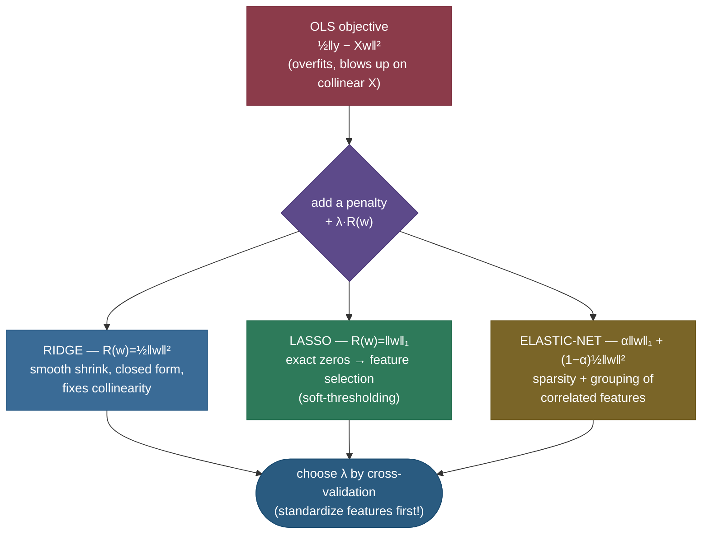
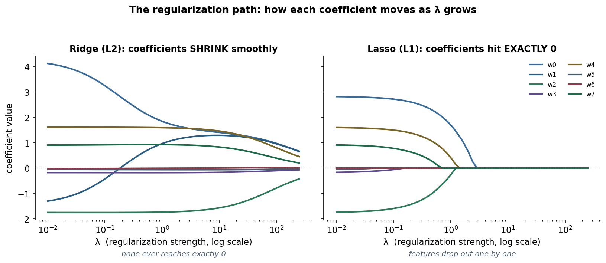
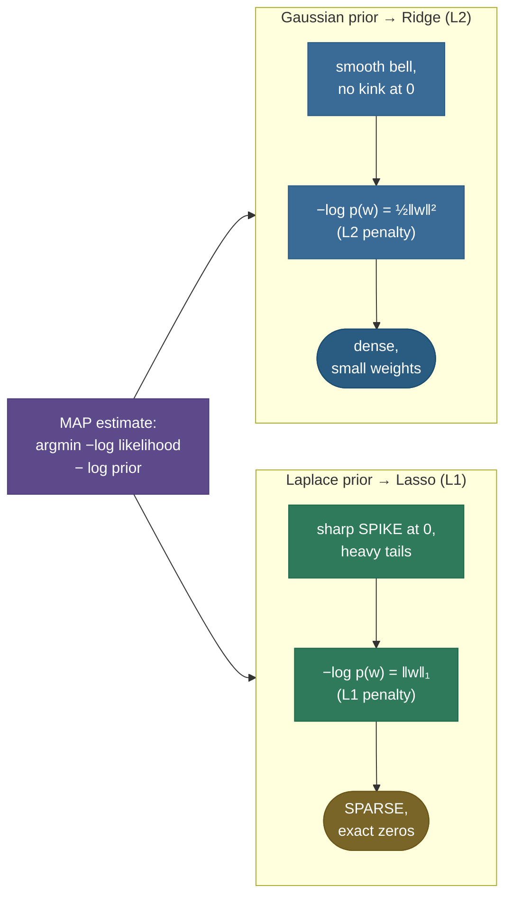

# Regularization for Linear Models: shrink the weights, fix the fit

Fit ordinary least squares to a small, noisy, or wide dataset and it does something subtly self-destructive: it makes the coefficients **as large as it needs to** to chase every wiggle in the training data — including the noise. Give it two correlated features and it cheerfully blows one up to $+10^6$ and the other down to $-10^6$, because their difference happens to fit a few training points. The line nails the training set and falls apart on new data. **Regularization** is the fix, and for linear models it is astonishingly simple: add a penalty on the *size* of the coefficients to the loss, so the model has to **earn** every unit of weight by paying for it in fit. Make the penalty the sum of squares (**Ridge / L2**) and weights shrink smoothly toward zero; make it the sum of absolute values (**Lasso / L1**) and some weights are driven to **exactly** zero, doing automatic feature selection; blend the two (**Elastic-Net**) and you get both at once. This one idea — *trade a little training fit for much smaller, more stable weights* — is the workhorse cure for overfitting and multicollinearity in every linear model you'll ever ship.

I'm going to teach this the way I'd actually derive it on a whiteboard for a teammate. We start with *why* unregularized least squares misbehaves (feel the disease), then write the penalized objective and its twin — the **constraint** view — and prove they're the same problem. Then we derive each method from its own first principle: **Ridge** from the closed-form normal equations (and *why* that $\lambda I$ term rescues a singular matrix), **Lasso** from the geometry of its constraint *and* from the subgradient that yields the **soft-thresholding** operator, and **Elastic-Net** from what goes wrong with Lasso on correlated features. We'll see the **Bayesian** reading (Ridge = Gaussian prior, Lasso = Laplace prior), nail the **bias–variance** mechanics, walk the **regularization path**, and finish with four worked numeric examples and runnable, verified code. By the end you'll be able to:

- write the **penalized objective** and its equivalent **constraint** form, and explain the Lagrangian duality between them;
- **derive** Ridge's closed form $w = (X^\top X + \lambda I)^{-1}X^\top y$ and explain *why* $\lambda I$ makes the problem solvable even under perfect multicollinearity;
- explain Ridge shrinkage in the **SVD basis** (each direction scaled by $d^2/(d^2+\lambda)$) — *why* it kills variance in the weak directions;
- explain **why L1 gives sparsity** two ways — the diamond-corner geometry **and** the soft-thresholding subgradient — and why L2 never does;
- explain why **Elastic-Net** exists (correlated-feature grouping) and when to reach for it;
- **derive** Ridge and Lasso as **MAP** estimates under a Gaussian and a Laplace prior;
- reason about the **bias–variance** trade regularization makes, why **standardization is mandatory**, and how to choose $\lambda$ by cross-validation (with the **one-standard-error rule**).

> **Note:** there's a sibling page on **[Regularization for deep nets](../../05.%20Deep_Learning/concepts/09-Regularization.md)** (L1/L2 as weight decay, dropout, early stopping, label smoothing). This page is the **linear-model** deep dive — Ridge, Lasso, Elastic-Net, with the closed forms and geometry that only linear models give you. The L2 idea reappears there as *weight decay*; here we can actually **solve it in closed form** and *see* the geometry, which is the whole reason linear regularization is the best place to learn the concept.

---

## The problem: least squares overfits and breaks under collinearity

To see why the penalty has to exist, you have to feel the two diseases it cures.

**Disease 1 — overfitting.** Ordinary least squares (OLS) minimizes only the residual sum of squares, $\lVert y - Xw\rVert^2$. With enough features relative to samples (high-dimensional, "wide" data: $p$ close to or above $n$), it has the freedom to fit the *noise*, not just the signal. Training error plummets, test error climbs — the classic high-**variance** failure. The model has memorized its sample.

**Disease 2 — multicollinearity.** Suppose two columns of $X$ are nearly identical (height in cm and height in inches; two sensors measuring the same thing). Then $X^\top X$ is nearly **singular** — its smallest eigenvalue is almost zero — and the OLS solution $w = (X^\top X)^{-1}X^\top y$ blows up: it can put a giant positive weight on one feature and a giant negative weight on its twin, because their *difference* fits a few training points while their effect nearly cancels. Tiny changes in the data swing those weights wildly. The estimates are **unstable** and uninterpretable, and the variance of $\hat w$ explodes.

> **Note:** these two diseases are the **same underlying problem** seen from two angles — too much *variance* in the estimator. Overfitting is variance over *resamples of the data*; collinearity is variance amplified by an *ill-conditioned* $X^\top X$. Regularization attacks both by the same mechanism: it stops the weights from getting large.

The cure, in one sentence: **add a term to the loss that grows with the size of the weights**, so the optimizer can no longer make them huge for free. That term is the penalty, and the rest of this page is about its two famous shapes.

---

## Intuition: a spending budget for weights

Here's the mental model I actually use. Think of the coefficients as a **shopping cart** and the penalty as a **budget**: every unit of weight you put on a feature *costs* something, and you only have so much to spend. OLS shops with an unlimited credit card — it loads up on whatever fits the training data, including the noise, and the bill (the weights) blows up. Regularization hands the optimizer a fixed budget, and now it has to **prioritize**: spend weight only on features that pay for themselves in fit.

The two methods are two different **pricing schemes** for that budget:

- **Ridge (L2)** charges by the *square* of the weight — the first few units are cheap, but each extra unit costs progressively more. So Ridge spreads its budget **thinly across all features** (no single weight grows large), and it *never* sets a price so high that buying zero of something is optimal — hence dense, small weights.
- **Lasso (L1)** charges a *flat rate* per unit of weight — the same price whether a coefficient is its 1st unit or its 100th. Under a flat rate, if a feature isn't clearly worth its cost, the cheapest move is to **buy none of it at all** — set it to exactly zero. That's why Lasso produces a sparse cart: it ruthlessly drops features that don't earn their flat fee.

> **Note:** this is the whole story in one image. *Squared* pricing (Ridge) discourages any weight from getting large but tolerates everyone being a little non-zero; *flat* pricing (Lasso) makes it cheap to zero out marginal features entirely. The geometry (diamond vs circle) and the math (soft-threshold vs scale) below are just this budget intuition made precise.

---

## The penalized objective — and its twin, the constraint

Every method here minimizes the same template: **fit + λ · penalty**.

$$\hat w \;=\; \arg\min_{w}\;\underbrace{\tfrac{1}{2}\lVert y - Xw\rVert_2^2}_{\text{fit (residual sum of squares)}} \;+\; \lambda\,\underbrace{R(w)}_{\text{penalty on weight size}}$$

- $X$ is the $n \times p$ design matrix (rows = samples, columns = features), $y$ the target, $w$ the coefficients.
- $R(w)$ is the **regularizer**: $R(w)=\tfrac12\lVert w\rVert_2^2$ for **Ridge**, $R(w)=\lVert w\rVert_1$ for **Lasso**.
- $\lambda \ge 0$ is the **regularization strength** (scikit-learn calls it `alpha`). At $\lambda=0$ you recover OLS; as $\lambda\to\infty$ every weight is crushed to zero.

> **Tip:** the intercept $b$ is **never** penalized. You don't want to punish the model for predicting a non-zero mean — shrinking $b$ would just bias every prediction toward zero. In practice you center $y$ (and the columns of $X$), fit the penalized weights, and recover the intercept separately. scikit-learn handles this for you when `fit_intercept=True`.

There is a second, equivalent way to write the exact same problem — the **constrained** form — and the relationship between the two is the single most illuminating fact in this topic:

$$\hat w \;=\; \arg\min_{w}\;\tfrac12\lVert y - Xw\rVert_2^2 \quad \text{subject to}\quad R(w) \le t.$$

Read it literally: *find the best least-squares fit, but you're only allowed a total weight "budget" of $t$.* These two forms — penalty $\lambda$ and budget $t$ — describe the **same set of solutions**; they are **Lagrangian duals**. The Lagrangian of the constrained problem is

$$\mathcal{L}(w,\lambda) = \tfrac12\lVert y - Xw\rVert_2^2 + \lambda\big(R(w) - t\big),$$

and minimizing it over $w$ is *identical* to the penalized objective (the $-\lambda t$ term doesn't depend on $w$). For every budget $t$ there's a $\lambda$ giving the same $\hat w$, and vice versa — a **large $\lambda$ ⟺ a small budget $t$** (strong regularization), a **small $\lambda$ ⟺ a generous budget** (weak regularization).

> **Note:** keep both pictures in your head, because they explain different things. The **penalty** form is what you *optimize* (just add a term to the loss and run the solver). The **constraint** form is what you *visualize* — the budget is a geometric region (a ball for L2, a diamond for L1), and the solution is where the loss contours first touch that region. That geometric picture is exactly how we'll explain Lasso's sparsity below.



---

## Ridge (L2): derive the closed form, and why λI rescues you

Ridge uses the squared-L2 penalty, $R(w)=\tfrac12\lVert w\rVert_2^2$. Its objective is fully differentiable, so we can **solve it exactly** — one of the few places in ML where you get a clean closed form. Write it out:

$$J(w) = \tfrac12\lVert y - Xw\rVert_2^2 + \tfrac{\lambda}{2}\lVert w\rVert_2^2.$$

Take the gradient with respect to $w$ and set it to zero (this is the whole derivation — follow each step):

$$\nabla_w J = -X^\top(y - Xw) + \lambda w = 0$$

$$\Longrightarrow \; X^\top X\,w + \lambda w = X^\top y \;\Longrightarrow\; (X^\top X + \lambda I)\,w = X^\top y$$

$$\boxed{\;\hat w_{\text{ridge}} = (X^\top X + \lambda I)^{-1} X^\top y\;}$$

Compare it to OLS, $\hat w_{\text{ols}} = (X^\top X)^{-1} X^\top y$. Ridge is **OLS with $\lambda I$ added to $X^\top X$** before inverting. That tiny change is the entire payoff.

**Why $\lambda I$ saves you.** $X^\top X$ is symmetric positive *semi*-definite — its eigenvalues are $\ge 0$, and under multicollinearity some are essentially $0$, making it singular (non-invertible) and the OLS solution undefined or explosive. Adding $\lambda I$ shifts **every** eigenvalue up by $\lambda$: if $X^\top X$ has eigenvalue $d_i^2$, then $X^\top X + \lambda I$ has eigenvalue $d_i^2 + \lambda > 0$ for all $i$. The matrix becomes **strictly positive definite — guaranteed invertible — for any $\lambda > 0$.** Ridge always has a unique solution, *even when there are more features than samples* and *even when columns are perfectly duplicated*. This is why Ridge is the textbook cure for collinearity: it conditions the very matrix that was blowing up.

> **Gotcha:** people memorize "Ridge handles multicollinearity" without knowing the mechanism — and it's the most common follow-up question. The mechanism is **eigenvalue shifting**: $\lambda I$ lifts the near-zero eigenvalues of $X^\top X$ off the floor, dropping its condition number from near-infinity to something finite. We measure exactly this in Worked Example 3.

**Shrinkage in the SVD basis — what Ridge *does*, geometrically.** Decompose $X = U D V^\top$ (singular value decomposition: $U, V$ orthonormal, $D$ diagonal with singular values $d_1 \ge d_2 \ge \dots \ge 0$). Substituting into the Ridge solution and simplifying, the fitted values are

$$X\hat w_{\text{ridge}} = \sum_{i} u_i \,\frac{d_i^2}{d_i^2 + \lambda}\, u_i^\top y.$$

The OLS version is the same sum with the factor replaced by $1$. So Ridge multiplies the $i$-th principal direction by a **shrinkage factor**

$$\frac{d_i^2}{d_i^2 + \lambda} \in (0, 1).$$

Read this carefully, because it's the deep insight: directions with **large** singular values $d_i$ (the high-variance, well-determined directions in the data) have factor $\approx 1$ and are barely touched; directions with **small** $d_i$ (the weak, noise-dominated directions — exactly the collinear ones) have factor $\approx 0$ and are **strongly shrunk**. Ridge doesn't shrink uniformly — it **shrinks hardest precisely where the data is least informative**, which is where OLS's variance was coming from. That's why it cuts variance so effectively.



> **Note:** the left panel above *is* Ridge's behavior: every coefficient curve glides toward zero as $\lambda$ grows but **none ever crosses it** — Ridge produces *small-but-dense* weights. The right panel is Lasso, which we'll explain next: its coefficients hit zero **exactly** and stay there. Same data, same axes — the contrast is the whole lesson.

---

## Lasso (L1): why it produces sparsity — two derivations

Lasso swaps the squared penalty for the **absolute-value** penalty, $R(w)=\lVert w\rVert_1 = \sum_j |w_j|$:

$$J(w) = \tfrac12\lVert y - Xw\rVert_2^2 + \lambda \sum_j |w_j|.$$

That one change has a dramatic effect: Lasso drives some coefficients to **exactly zero**, performing **automatic feature selection** — the model returns a sparse set of "selected" features and silently drops the rest. Ridge never does this. *Why?* There are two complementary explanations, and a strong answer gives both.

### Derivation 1 — the geometry (diamond corners vs. round ball)

Use the **constraint** view: minimize the least-squares loss subject to a budget $R(w)\le t$. The loss contours are **ellipses** centered at the (unconstrained) OLS optimum. The solution is the point where the *smallest* ellipse first touches the budget region. Now look at the shape of that region:

- **L2 (Ridge)** budget $\lVert w\rVert_2 \le t$ is a **circle/ball** — perfectly round, *no corners*. The first contact point is almost always **off the axes**, so both coefficients are non-zero (just small). Sparsity essentially never happens.
- **L1 (Lasso)** budget $\lVert w\rVert_1 \le t$ is a **diamond** (a rotated square) whose **corners sit exactly on the axes**. The corners *stick out*, so an expanding ellipse is very likely to hit the diamond **at a corner** — and a corner is a point where one coordinate is **exactly zero**. That's a sparse solution, produced by the geometry itself.


The picture *is* the proof: a diamond's pointy corners are on the axes, so contours tend to touch there → a coordinate is zeroed. A circle is smooth everywhere, so contours touch at a generic off-axis point → nothing is zeroed. In higher dimensions the diamond becomes a cross-polytope with corners, edges, and faces of every dimension; hitting a low-dimensional face means **many** coordinates are simultaneously zero. That's why Lasso scales as a feature selector.

To make "tends to touch at a corner" precise: at the optimum the negative loss gradient $-\nabla(\text{loss})$ must point **into** the budget region — it has to be a *normal* direction of the boundary at the contact point. On the **smooth** L2 circle, the normal direction varies *continuously* around the boundary, so for almost any gradient there's an off-axis point whose normal matches — contact is generically off-axis (dense). On the **non-smooth** L1 diamond, a **corner** has a whole *cone* of normal directions (a "kink" admits many normals at once), so a **range** of gradients all map to that same corner. A single point absorbing a positive-measure set of gradients is exactly why corners are hit with *positive probability* — the kink is mathematically what creates sparsity, not an accident of the drawing.

> **Gotcha:** the sparsity comes from the **non-smoothness** (the corner / the kink in $|w|$ at zero), not from "L1 being smaller." Any penalty with a kink at the origin induces sparsity; any smooth one (like L2) does not. If an interviewer asks "would $\lVert w\rVert_2$ — *not squared* — give sparsity?", the answer is **yes** (it has a kink at the origin) — it's the *squaring* that smooths Ridge and removes the corners.

### Derivation 2 — the subgradient and the soft-thresholding operator

The geometry shows *that* it happens; the **subgradient** shows the exact rule. Take the special, clean case where the features are orthonormal ($X^\top X = I$), so the problem decouples and we can solve **one coordinate at a time**. Let $z_j = (X^\top y)_j$ be the OLS coordinate. The per-coordinate objective is

$$J(w_j) = \tfrac12 (w_j - z_j)^2 + \lambda |w_j|.$$

$|w_j|$ isn't differentiable at $0$, so use the **subgradient**: $\partial |w_j| = \{\operatorname{sign}(w_j)\}$ for $w_j \ne 0$ and the whole interval $[-1, 1]$ at $w_j=0$. Setting $0 \in \partial J$ in each regime:

- If $w_j > 0$: $\;w_j - z_j + \lambda = 0 \Rightarrow w_j = z_j - \lambda$, valid only when $z_j > \lambda$.
- If $w_j < 0$: $\;w_j - z_j - \lambda = 0 \Rightarrow w_j = z_j + \lambda$, valid only when $z_j < -\lambda$.
- If $w_j = 0$: optimality needs $0 \in -z_j + \lambda[-1,1]$, i.e. $|z_j| \le \lambda$.

Stitch the three cases together and you get the **soft-thresholding operator**:

$$\boxed{\;w_j = S_\lambda(z_j) = \operatorname{sign}(z_j)\,\max\big(|z_j| - \lambda,\; 0\big)\;}$$

In words: **if the OLS coordinate is within $\lambda$ of zero, set it to exactly zero; otherwise pull it $\lambda$ closer to zero.** *That* is the sparsity mechanism, made explicit — there's a literal **dead zone** $[-\lambda, \lambda]$ that maps to $0$. Compare with Ridge's coordinate rule in the same orthonormal case, $w_j = z_j/(1+\lambda)$, which only **scales** $z_j$ — it shrinks toward zero but never *reaches* it, because there's no dead zone.


> **Note:** soft-thresholding isn't just a teaching device — it's the literal update inside **coordinate descent**, the algorithm scikit-learn's `Lasso` actually runs. It cycles through coordinates, computing each one's partial residual $z_j$ and applying $S_\lambda$. The "exact zeros" you see in the output are this $\max(\cdot, 0)$ clamping to zero, coordinate by coordinate.

### L1 vs L2 in one breath

| | **Ridge (L2)** | **Lasso (L1)** |
|---|---|---|
| Penalty | $\sum w_j^2$ (smooth) | $\sum \lvert w_j\rvert$ (kink at 0) |
| Effect on weights | small but **dense** (all non-zero) | **sparse** (many exactly 0) |
| Closed form? | **yes**, $(X^\top X+\lambda I)^{-1}X^\top y$ | no (non-smooth → iterative) |
| Coordinate rule (orthonormal) | scale: $z/(1+\lambda)$ | soft-threshold: $S_\lambda(z)$ |
| Feature selection | no | **yes** (built-in) |
| Correlated features | keeps **all**, splits weight evenly | arbitrarily **picks one**, drops the rest |
| Prior (Bayesian) | **Gaussian** | **Laplace** |

> **Tip:** the one-liner to remember — **L2 shrinks, L1 selects.** Reach for Ridge when you believe *many* features each contribute a little (dense signal, collinearity to tame); reach for Lasso when you believe *few* features matter and you want the model to find them (sparse signal, interpretability). When you're unsure or features are correlated, Elastic-Net — next — hedges between them.

---

## Elastic-Net: sparsity that handles correlated features

Lasso has a real weakness, and Elastic-Net exists to fix it. When two features are **highly correlated**, Lasso tends to **arbitrarily pick one and zero the other** — the choice is unstable, flipping between near-identical features as the data jitters. Worse, when $p > n$, Lasso can select **at most $n$** features before it saturates. Both are problems in genomics, text, and any wide, correlated dataset.

**Elastic-Net** (Zou & Hastie 2005) blends both penalties:

$$J(w) = \tfrac12\lVert y - Xw\rVert_2^2 + \lambda\Big(\alpha\lVert w\rVert_1 + \tfrac{1-\alpha}{2}\lVert w\rVert_2^2\Big),\qquad \alpha \in [0,1].$$

The mix parameter $\alpha$ (scikit-learn's `l1_ratio`) interpolates: $\alpha=1$ is pure Lasso, $\alpha=0$ is pure Ridge, and in between you get **both** behaviors. The L1 part still produces sparsity; the L2 part adds **strict convexity** back, which has a beautiful consequence — the **grouping effect**: correlated features get **similar coefficients** and tend to be **selected or dropped together as a group**, instead of one being arbitrarily kept. You also escape Lasso's "at most $n$ features" cap.

> **Note:** intuitively, the L2 term rounds off the diamond's corners *just enough* to break ties between correlated features **democratically** (share the weight) rather than **arbitrarily** (winner-take-all). You keep most of Lasso's sparsity but gain Ridge's stability under collinearity — which is exactly why Elastic-Net is the safe default when you want selection **and** have correlated predictors.

> *Where this comes from: **Ridge** is Hoerl & Kennard, "Ridge Regression: Biased Estimation for Nonorthogonal Problems" (Technometrics 1970) — they introduced the $\lambda I$ trick precisely to stabilize nonorthogonal (collinear) designs. **Lasso** is Tibshirani, "Regression Shrinkage and Selection via the Lasso" (JRSS-B 1996), which named it and proved the sparsity. **Elastic-Net** is Zou & Hastie, "Regularization and Variable Selection via the Elastic Net" (JRSS-B 2005), which diagnosed Lasso's correlated-feature failure and added the grouping effect. The unified textbook treatment — closed form, SVD shrinkage, geometry, and the Bayesian view — is **ESL** Ch. 3.4. All four are in the references.*

---

## The Bayesian view: regularization is a prior (MAP estimation)

There's a deeper reason these two penalties take these two shapes, and it's one of the most satisfying derivations in ML: **regularization is Bayesian maximum-a-posteriori (MAP) estimation, and the penalty *is* the negative log of a prior on the weights.**

Start from the probabilistic model of linear regression: $y_i = x_i^\top w + \varepsilon_i$ with Gaussian noise $\varepsilon_i \sim \mathcal{N}(0, \sigma^2)$. The likelihood is $p(y\mid w) \propto \exp\!\big(-\tfrac{1}{2\sigma^2}\lVert y - Xw\rVert^2\big)$. Now place a **prior** $p(w)$ on the weights and find the $w$ that maximizes the **posterior** $p(w\mid y) \propto p(y\mid w)\,p(w)$. Taking $-\log$ turns the product into the familiar sum:

$$\hat w_{\text{MAP}} = \arg\min_w\; \tfrac{1}{2\sigma^2}\lVert y - Xw\rVert^2 \;-\; \log p(w).$$

The prior's negative log-density is **exactly the penalty.** Two natural priors give the two methods:

- **Ridge = Gaussian prior.** Put $w_j \sim \mathcal{N}(0, \tau^2)$ on each weight. Then $-\log p(w) = \tfrac{1}{2\tau^2}\sum_j w_j^2 + \text{const}$ — the **L2 penalty**, with $\lambda = \sigma^2/\tau^2$. A Gaussian prior says "weights are probably small and near zero, smoothly" — and its smooth bell shape gives the smooth, dense shrinkage.

- **Lasso = Laplace prior.** Put $w_j \sim \text{Laplace}(0, b)$, density $\propto \exp(-|w_j|/b)$. Then $-\log p(w) = \tfrac{1}{b}\sum_j |w_j| + \text{const}$ — the **L1 penalty**, with $\lambda = \sigma^2/b$. The Laplace prior has a sharp **peak (a spike) at zero** and **heavier tails** than a Gaussian — it says "most weights are *exactly* zero, but a few can be large." That spike at the origin is the probabilistic source of sparsity, the dual of the diamond's corner.

The shape of the prior *is* the shape of the behavior — a picture makes the duality click:



> **Note:** this view pays off conceptually. **Stronger regularization = a tighter prior** ($\lambda \uparrow$ means $\tau^2$ or $b \downarrow$ — you believe weights are *more* concentrated at zero). It also explains the shapes: a Gaussian (smooth, no kink) → dense smooth shrinkage; a Laplace (sharp peak at 0) → sparsity. Elastic-Net corresponds to a **compromise prior** between Gaussian and Laplace. Same two pictures — geometry and probability — telling the same story.

> **Gotcha:** MAP gives a *point* estimate (the posterior mode), not the full posterior. If you want genuine uncertainty (credible intervals on the weights), you need full **Bayesian linear regression** — the same priors, but you keep the whole posterior instead of just its peak. Ridge/Lasso are the MAP shortcut.

---

## Bias–variance: what the penalty actually trades

Regularization is a **deliberate bias–variance trade**. OLS is **unbiased** (on average it recovers the true weights) but, under noise or collinearity, **high-variance** (it swings wildly across resamples). Adding a penalty **shrinks the weights toward zero**, which:

- **introduces bias** — the shrunk estimate is systematically pulled toward zero, so $\mathbb{E}[\hat w] \ne w_{\text{true}}$;
- **but slashes variance** — smaller, more constrained weights are far less sensitive to the particular training sample.

The expected test error is $\text{bias}^2 + \text{variance} + \text{irreducible noise}$. By accepting a *little* squared bias you can buy a *large* drop in variance, and the **sum** goes down. There's a sweet-spot $\lambda$ where the trade is optimal — too little and variance dominates (overfit), too much and bias dominates (underfit). That's the famous U-curve:


Notice the asymmetry in the plot: **training** error only ever *increases* with $\lambda$ (more constraint = worse training fit, always), while **test** error falls then rises. The gap between them is the variance you're paying for — and the minimum of the test curve is where regularization has bought you the most generalization. (For the full decomposition, see [Bias–Variance Tradeoff](12-Bias-Variance-Tradeoff.md).)

> **Note:** there's a famous theoretical guarantee underneath this picture (the **Stein** result): for $p \ge 3$ features, there *always* exists a $\lambda > 0$ whose shrunk estimator beats OLS on expected test error. Regularization isn't merely a heuristic — under squared loss, *some* shrinkage is provably better than none. The only question is *how much*, which is what cross-validation answers.

---

## The regularization path and standardization

**The path.** As you sweep $\lambda$ from $0$ (OLS) to $\infty$ (all-zero), each coefficient traces a curve — the **regularization path** (the side-by-side figure earlier). For Ridge the curves shrink smoothly; for Lasso they hit zero at specific $\lambda$ values and stay there, so reading the path tells you the **order** in which features drop out (the last to survive are the "strongest"). Lasso's path is **piecewise linear** in $\lambda$, which the **LARS** algorithm (Least Angle Regression; Efron et al. 2004) exploits to compute the *entire* path in roughly the cost of a single OLS fit — it walks from knot to knot where the active set changes, rather than re-solving at a grid of $\lambda$'s.

**Standardization is mandatory.** The penalty $\sum w_j^2$ or $\sum|w_j|$ treats every coefficient the same — but a coefficient's *size* depends on its feature's *units*. Measure a feature in **meters** vs **millimeters** and its natural coefficient shrinks by $1000\times$; the penalty would then barely touch it, while hammering a feature measured in small units. So you **must standardize** every feature to mean $0$, variance $1$ **before** fitting, or the penalty is applied unequally and arbitrarily. (The intercept is exempt — you center, don't penalize, it.)

> **Gotcha:** forgetting to standardize is the **#1 practical bug** with regularized linear models. The model still runs and returns numbers — they're just silently wrong, because the penalty fell unevenly across features with different scales. Always pipe `StandardScaler` → `Ridge/Lasso/ElasticNet`, and fit the scaler on the **training fold only** (inside cross-validation) to avoid leaking test statistics.

**Choosing λ by cross-validation.** $\lambda$ is a hyperparameter — you can't read it off the training loss (which always prefers $\lambda=0$). Use **k-fold cross-validation**: for each candidate $\lambda$, average the validation error across folds and pick the $\lambda$ that minimizes it (scikit-learn's `RidgeCV`, `LassoCV`, `ElasticNetCV` do this on a $\lambda$-grid efficiently). A refinement worth knowing — the **one-standard-error rule**: instead of the exact minimum, pick the **largest** $\lambda$ (the *simplest*, most-regularized model) whose CV error is within **one standard error** of the minimum. Since the CV estimate is itself noisy, this favors a simpler, more robust model that's statistically indistinguishable from the best — and it's the principled default in ESL. (See [Cross-Validation](13-Cross-Validation.md) for the mechanics.)

> **Tip:** in the U-curve figure the two vertical lines are exactly these: the green line is `argmin` (best CV error), the amber line is the one-SE-rule $\lambda$ — visibly stronger regularization (a simpler model) at no meaningful cost in error. When models tie, prefer the simpler one; that's the whole spirit of regularization, applied to choosing $\lambda$ itself.

---

## Five worked numeric examples

Nothing builds intuition like grinding the numbers by hand. Five examples, increasing in complexity — each one verified against scikit-learn in the code section.

### Example 1 — Ridge shrinkage of a single coefficient (by hand)

Take the simplest possible case: one standardized feature, orthonormal so $X^\top X = 1$, and suppose the OLS coefficient is $z = 4.0$. Ridge with $\lambda = 1$ solves $(1+\lambda)w = z$, so

$$w_{\text{ridge}} = \frac{z}{1+\lambda} = \frac{4.0}{1+1} = \mathbf{2.0}.$$

Double the regularization to $\lambda=3$: $w = 4/(1+3) = \mathbf{1.0}$. The coefficient **shrinks smoothly** — halved, then quartered — but **never hits zero** for any finite $\lambda$. That's Ridge: pure multiplicative shrinkage by the factor $1/(1+\lambda)$.

### Example 2 — Lasso soft-thresholding the same coefficient

Same setup ($z = 4.0$, orthonormal), now Lasso with $\lambda = 1$. Apply the soft-threshold operator:

$$w_{\text{lasso}} = S_\lambda(z) = \operatorname{sign}(z)\max(|z| - \lambda, 0) = \max(4.0 - 1, 0) = \mathbf{3.0}.$$

Lasso *subtracts* $\lambda$ rather than *scaling* by $1/(1+\lambda)$. Now suppose the OLS coordinate were small, $z = 0.6$, with $\lambda=1$: $S_1(0.6) = \max(0.6 - 1, 0) = \mathbf{0}$ — it falls inside the dead zone $[-1,1]$ and is **zeroed exactly**. Ridge on that same $z=0.6$ gives $0.6/2 = 0.3 \ne 0$. **There** is the sparsity, in two numbers: Lasso kills the small coefficient, Ridge only shrinks it.

### Example 3 — Ridge rescuing a singular (collinear) X⊤X (measured)

Construct a perfectly collinear design — two columns that are scalar multiples — so $X^\top X$ is **singular**:

$$X = \begin{bmatrix}1&1\\2&2\\3&3\\4&4\end{bmatrix},\qquad X^\top X = \begin{bmatrix}30&30\\30&30\end{bmatrix},\quad \det(X^\top X) = 30\cdot30 - 30\cdot30 = \mathbf{0}.$$

OLS is **undefined** — you can't invert a determinant-zero matrix (the code raises `LinAlgError`). Add $\lambda I$:

$$X^\top X + \lambda I = \begin{bmatrix}30+\lambda & 30\\30 & 30+\lambda\end{bmatrix},\quad \det = (30+\lambda)^2 - 30^2 = \lambda^2 + 60\lambda > 0 \;\text{ for } \lambda>0.$$

The determinant is **strictly positive** for any $\lambda>0$, so the matrix is invertible — Ridge has a unique solution where OLS had none. The measured **condition number** drops from $\infty$ (singular) to $601$ at $\lambda=0.1$ and $61$ at $\lambda=1.0$ — finite and well-behaved. *That* is "Ridge fixes multicollinearity," as an actual number.

### Example 4 — a Lasso path zeroing coefficients (measured)

Generate 120 samples with 8 standardized features where only 4 truly matter (true weights $[3, 0, -2, 0, 1.5, 0, 0, 0.8]$, the rest pure noise) and watch Lasso prune as $\lambda$ grows (measured in the code):

| $\lambda$ (`alpha`) | non-zero coefficients | what survives |
|---|---|---|
| $0.05$ | **5 / 8** | the 4 true + 1 spurious |
| $0.5$ | **4 / 8** | exactly the 4 true features |
| $1.5$ | **3 / 8** | only the 3 strongest |

At a well-chosen $\lambda$, Lasso recovers **exactly the four real features** and zeros the four noise features — automatic feature selection, measured. Push $\lambda$ higher and it gets greedy, dropping even the weakly-true feature ($0.8$). This is the path's right panel from the figure, read off as a table.

### Example 5 — the grouping effect: Elastic-Net vs Lasso on correlated features (measured)

The capstone, because it shows *why* Elastic-Net exists. Build a problem where two features are **near-duplicates** (correlation ≈ 1) and **both** carry the real signal ($y = 2\cdot f + \text{noise}$, with features 0 and 1 both copies of $f$), plus three pure-noise features. With $\lambda$ fixed, compare how Lasso and Elastic-Net split the weight across the correlated pair (measured in the code):

| Method | $w_0$ | $w_1$ | $\lvert w_0 - w_1\rvert$ | behavior |
|---|---|---|---|---|
| **Lasso** | $0.02$ | $1.60$ | $1.58$ | **winner-take-all** — dumps almost all weight on one twin, nearly zeros the other |
| **Elastic-Net** | $0.81$ | $0.82$ | $0.004$ | **grouping** — splits the signal nearly equally across the pair |

Both zero the three noise features (sparsity is preserved). But Lasso's choice between the identical twins is **arbitrary and unstable** — jitter the data and it flips which one it keeps — whereas Elastic-Net's L2 component makes correlated features share the weight, so they're selected (or dropped) **as a group** with stable, interpretable coefficients. That's the grouping effect, in two rows.

---

## Where it's used, and which to reach for

**Used:** everywhere a linear or generalized-linear model is fit on real data — Ridge/Lasso/Elastic-Net are the default regularizers for **linear and logistic regression**, in scikit-learn, statsmodels, glmnet, and every production tabular pipeline. The L2 idea generalizes far beyond: it's **weight decay** in deep nets (the [DL regularization page](../../05.%20Deep_Learning/concepts/09-Regularization.md)), the kernel-ridge penalty, and the prior in Bayesian regression.

**Which to choose:**

- **Ridge (L2)** — your default when you suspect *many* features each contribute a little, when features are **collinear** (Ridge tames it gracefully), or when you simply want lower variance and don't need feature selection. Keeps all features, dense small weights.
- **Lasso (L1)** — when you believe *few* features matter and want the model to **find and select** them (interpretability, sparse models, $p \gg n$). Be wary with correlated features (it picks one arbitrarily).
- **Elastic-Net** — the **safe hybrid**: you want sparsity **but** have correlated predictors or $p > n$. The grouping effect keeps correlated features together. A common default with `l1_ratio` ≈ 0.5 when unsure.

> **Tip:** the interview decision tree — *Need feature selection?* No → **Ridge**. Yes, and features roughly independent → **Lasso**. Yes, but features correlated or $p > n$ → **Elastic-Net**. And in **all** cases: **standardize first** and **cross-validate $\lambda$**.

---

## The same penalty in logistic regression and beyond

Everything above was written for *linear* regression with squared-error loss, but the penalty is the same in **logistic regression** — the most common place you'll actually use it. Logistic regression has **no closed form** even without a penalty (you solve it iteratively), so we add the penalty directly to its log-loss:

$$\hat w = \arg\min_w\; \sum_i \log\!\big(1 + e^{-y_i\, x_i^\top w}\big) \;+\; \lambda\, R(w),$$

with $R(w)=\tfrac12\lVert w\rVert_2^2$ for L2 or $\lVert w\rVert_1$ for L1. The geometry, the sparsity argument, the standardization requirement, and the Bayesian reading **all carry over unchanged** — only the *fit* term swapped from squared error to log-loss. The diamond still has corners, so L1 logistic regression still selects features; the L2 ball is still smooth, so L2 logistic regression still gives dense small weights.

> **Gotcha:** scikit-learn's `LogisticRegression` parameterizes strength by `C = 1/λ` — the **inverse**. A *small* `C` means *strong* regularization, the opposite of `alpha` in `Ridge`/`Lasso` (where *large* `alpha` is strong). It also regularizes by **default** (`C=1.0`), so an "un-regularized" logistic regression needs `C=1e9` or `penalty=None`. Two of the most common silent bugs in the library — know which knob you're turning.

This generalizes further: the **L2 penalty is everywhere** in ML — it's the $\lambda\lVert w\rVert^2$ in soft-margin **SVMs**, the **weight decay** term in every deep-net optimizer ([DL regularization](../../05.%20Deep_Learning/concepts/09-Regularization.md)), and the Gaussian prior in Bayesian models. Learn it once here, in closed form, and you recognize it everywhere.

---

## Effective degrees of freedom: how much complexity λ buys back

A subtle but interview-worthy idea: regularization doesn't just shrink weights, it **reduces the model's effective complexity**, and you can put a number on it. For Ridge, the **effective degrees of freedom** is

$$\text{df}(\lambda) = \operatorname{tr}\!\big[X(X^\top X + \lambda I)^{-1}X^\top\big] = \sum_i \frac{d_i^2}{d_i^2 + \lambda},$$

a sum of the **same SVD shrinkage factors** from the Ridge section. Read off the two limits: at $\lambda=0$ every factor is $1$, so $\text{df} = p$ — a full-complexity OLS model using all $p$ degrees of freedom. As $\lambda\to\infty$ every factor $\to 0$, so $\text{df}\to 0$ — the model collapses toward a constant. **$\lambda$ smoothly dials the effective number of parameters from $p$ down to $0$**, which is precisely why the bias–variance U-curve is continuous: you're continuously trading complexity for stability, not flipping a discrete switch.

> **Note:** this is the clean rebuttal to "Ridge keeps all $p$ features, so it doesn't simplify the model." It keeps all $p$ *coefficients* non-zero, but its **effective** degrees of freedom is $\text{df}(\lambda) < p$ — it really is a simpler model, just not a *sparser* one. Lasso reduces complexity by zeroing coefficients (sparsity); Ridge reduces it by shrinking them (smaller effective df). Two different routes to the same goal: lower variance.

---

## Common pitfalls

The places regularized linear models quietly go wrong — worth internalizing before they cost you a deployment or an interview:

- **Forgetting to standardize.** The penalty is scale-sensitive, so un-standardized features get regularized unequally. The model runs and returns plausible-looking numbers that are silently wrong. Always `StandardScaler` → estimator, fit on the **training fold only**.
- **Penalizing the intercept.** Shrinking $b$ biases every prediction toward zero. Center, don't penalize, the intercept (scikit-learn does this for you with `fit_intercept=True`).
- **Leaking the scaler across folds.** Fitting `StandardScaler` on the full dataset before cross-validation leaks test statistics into training, giving optimistic CV error. Put the scaler **inside** a `Pipeline` so it refits per fold.
- **Reading `alpha` and `C` the same way.** `Ridge`/`Lasso` use `alpha` (large = strong); `LogisticRegression`/`SVC` use `C = 1/λ` (small = strong). Mixing them up flips your regularization upside down.
- **Trusting Lasso's feature *choice* on correlated data.** Lasso picks one of a correlated group arbitrarily and the choice is unstable across resamples — fine for prediction, dangerous if you interpret "the selected features" as causal. Use Elastic-Net (grouping) or stability selection when interpretation matters.
- **Choosing $\lambda$ on the training loss.** Training loss always prefers $\lambda=0$ (least constraint). $\lambda$ *must* be chosen on held-out / cross-validation error — it's a hyperparameter, not a parameter.

---

## Application: a step-by-step playbook

The reasoning I'd actually run, end to end, given "fit a regularized linear model on this tabular dataset":

1. **Split first.** Hold out a test set *before* touching anything, so nothing leaks. All tuning happens inside the training set via cross-validation.
2. **Standardize inside a pipeline.** Wrap `StandardScaler` and the estimator in a `Pipeline` so the scaler refits on each CV fold's training data — no leakage, no scale bug.
3. **Pick the penalty from your belief about the signal.** Many small contributors or collinearity → **Ridge**. Few features matter and you want them named → **Lasso**. Want selection but features are correlated or $p>n$ → **Elastic-Net**.
4. **Cross-validate $\lambda$ on a log grid.** Use `RidgeCV` / `LassoCV` / `ElasticNetCV` over `np.logspace(-3, 3, ...)`. Plot the CV-error-vs-$\lambda$ U-curve to sanity-check that you bracketed the minimum (if it's still falling at the edge, widen the grid).
5. **Apply the one-standard-error rule.** Among $\lambda$'s within 1 SE of the best CV error, pick the **largest** (simplest) one — a more robust model at no real cost.
6. **Refit on all training data at the chosen $\lambda$, then report on the held-out test set** — once.
7. **Inspect the coefficients.** For Lasso/Elastic-Net, which features survived? Does that match domain knowledge? (Remember Lasso's choice among correlated features is unstable — don't over-read it.)

> **Tip:** if you only remember one line of the playbook: **`make_pipeline(StandardScaler(), RidgeCV(alphas=np.logspace(-3,3,50)))`** — that single object standardizes correctly, cross-validates $\lambda$, and refits, with no leakage. Swap `RidgeCV` for `LassoCV`/`ElasticNetCV` to change the penalty.

---

## Code: derive it, then verify against scikit-learn

This runs on CPU in a second and **proves** all four claims of the page: Ridge's closed form equals scikit-learn's `Ridge`; the soft-threshold values; Ridge rescuing a singular $X^\top X$; and Lasso zeroing coefficients.

```python
"""Regularization for linear models: closed-form Ridge, soft-thresholding,
collinearity rescue, and Lasso sparsity — each verified. Python 3.12, CPU."""
import numpy as np
from sklearn.linear_model import Ridge, Lasso
from sklearn.preprocessing import StandardScaler
np.set_printoptions(precision=4, suppress=True)

# 1) Ridge closed form  w = (XᵀX + λI)⁻¹ Xᵀy   ==  sklearn Ridge
rng = np.random.default_rng(0); n, p = 50, 4
X = rng.normal(size=(n, p)); X[:, 1] = X[:, 0] + 0.01*rng.normal(size=n)   # collinear pair
w_true = np.array([2.0, -1.0, 0.5, 3.0]); y = X @ w_true + rng.normal(0, 0.5, n)
Xc, yc, lam = X - X.mean(0), y - y.mean(), 5.0
w_closed  = np.linalg.solve(Xc.T @ Xc + lam*np.eye(p), Xc.T @ yc)
w_sklearn = Ridge(alpha=lam).fit(X, y).coef_
print("Ridge closed form :", w_closed)
print("Ridge sklearn     :", w_sklearn)
print("match             :", np.allclose(w_closed, w_sklearn, atol=1e-6))

# 2) Soft-thresholding operator  Sλ(z) = sign(z)·max(|z|−λ, 0)
soft = lambda z, l: np.sign(z) * np.maximum(np.abs(z) - l, 0.0)
print("\nSoft-threshold (λ=1):", {z: round(float(soft(z, 1.0)), 2) for z in (0.6, 1.0, 2.5, -3.0)})

# 3) Ridge rescues a SINGULAR (collinear) XᵀX
Xs = np.array([[1.,1.],[2.,2.],[3.,3.],[4.,4.]]); G = Xs.T @ Xs   # rank-1 → singular
print("\ndet(XᵀX)          :", round(np.linalg.det(G), 6), "(singular → OLS undefined)")
for l in (0.1, 1.0):
    print(f"cond(XᵀX + {l}I)   : {np.linalg.cond(G + l*np.eye(2)):.1f}  (finite → invertible)")

# 4) Lasso drives coefficients to EXACTLY zero (feature selection)
rng = np.random.default_rng(1)
X = rng.normal(size=(120, 8)); tw = np.array([3.,0.,-2.,0.,1.5,0.,0.,.8])
y = X @ tw + rng.normal(0, 1, 120); X = StandardScaler().fit_transform(X); y = y - y.mean()
for a in (0.05, 0.5, 1.5):
    c = Lasso(alpha=a, max_iter=20000).fit(X, y).coef_
    print(f"\nLasso α={a}: nonzero={int((np.abs(c) > 1e-8).sum())}/8  coefs={np.round(c, 3)}")

# 5) Grouping effect: Elastic-Net SHARES weight across correlated features; Lasso doesn't
from sklearn.linear_model import ElasticNet
rng = np.random.default_rng(7); n = 200; f = rng.normal(size=n)
X = np.column_stack([f, f + 0.01*rng.normal(size=n), rng.normal(size=(n, 3))])  # pair 0,1 correlated
y = 2.0*f + rng.normal(0, 0.3, n); X = StandardScaler().fit_transform(X); y = y - y.mean()
wl = Lasso(alpha=0.1, max_iter=50000).fit(X, y).coef_
we = ElasticNet(alpha=0.1, l1_ratio=0.5, max_iter=50000).fit(X, y).coef_
print(f"\nLasso      pair (w0,w1)=({wl[0]:.2f},{wl[1]:.2f})  |w0-w1|={abs(wl[0]-wl[1]):.3f}  (winner-take-all)")
print(f"ElasticNet pair (w0,w1)=({we[0]:.2f},{we[1]:.2f})  |w0-w1|={abs(we[0]-we[1]):.3f}  (shared → grouping)")
```

Output:

```
Ridge closed form : [0.4044 0.4104 0.6409 2.6789]
Ridge sklearn     : [0.4044 0.4104 0.6409 2.6789]
match             : True

Soft-threshold (λ=1): {0.6: 0.0, 1.0: 0.0, 2.5: 1.5, -3.0: -2.0}

det(XᵀX)          : 0.0 (singular → OLS undefined)
cond(XᵀX + 0.1I)   : 601.0  (finite → invertible)
cond(XᵀX + 1.0I)   : 61.0  (finite → invertible)

Lasso α=0.05: nonzero=5/8  coefs=[ 2.692 -0.    -1.772 -0.     1.43   0.     0.004  0.778]
Lasso α=0.5: nonzero=4/8  coefs=[ 2.351  0.    -1.337  0.     1.021  0.     0.     0.334]
Lasso α=1.5: nonzero=3/8  coefs=[ 1.587  0.    -0.405  0.     0.071  0.    -0.     0.   ]

Lasso      pair (w0,w1)=(0.02,1.60)  |w0-w1|=1.575  (winner-take-all)
ElasticNet pair (w0,w1)=(0.81,0.82)  |w0-w1|=0.004  (shared → grouping)
```

> **Note:** every headline of the page is in that output. The closed form **matches** scikit-learn bit-for-bit (`match: True`) — confirming the $(X^\top X+\lambda I)^{-1}X^\top y$ derivation. Soft-thresholding **zeroes** the small inputs ($0.6, 1.0$) and shifts the large ones toward zero by $\lambda$ ($2.5\to1.5$). Ridge turns a **singular** $X^\top X$ (det $=0$, OLS undefined) into a finitely-conditioned, invertible matrix. And Lasso recovers **exactly the true features** at the right $\lambda$, zeroing the noise — feature selection, measured.

> **Tip:** to see the full path interactively, sweep `alpha` over `np.logspace(-2, 2, 100)`, collect `Lasso(alpha=a).fit(X,y).coef_`, and plot each coefficient vs `alpha` on a log-x axis (that's exactly the path figure). Or just call `LassoCV()` / `RidgeCV()` and let scikit-learn pick `alpha` by cross-validation for you.

---

## Recap and rapid-fire

**If you remember nothing else:** regularizing a linear model means adding a penalty on weight size to the loss — **fit + λ·penalty** — equivalent to fitting under a weight **budget**. **Ridge (L2)** has the closed form $(X^\top X+\lambda I)^{-1}X^\top y$, where $\lambda I$ lifts every eigenvalue of $X^\top X$ off zero (fixing collinearity) and shrinks each SVD direction by $d^2/(d^2+\lambda)$ — small-but-dense weights. **Lasso (L1)** drives weights to **exactly zero** (feature selection) — provable two ways: the diamond's **corners** sit on the axes, and the **soft-threshold** $S_\lambda(z)$ has a dead zone. **Elastic-Net** blends them so correlated features are selected as a group. Bayesianly, Ridge is a **Gaussian** prior and Lasso a **Laplace** prior. Always **standardize** first and **cross-validate** $\lambda$ (one-SE rule for the simplest good model).

**Quick-fire — say these out loud:**

- *Why does L1 give sparsity but L2 doesn't?* The L1 budget is a **diamond** whose corners are on the axes (contours touch there → a coordinate is 0); the L2 ball is smooth, so contact is off-axis. Equivalently, L1's soft-threshold has a **dead zone**; L2 only scales.
- *Ridge closed form?* $w = (X^\top X + \lambda I)^{-1}X^\top y$ — OLS with $\lambda I$ added before inverting.
- *Why does $\lambda I$ fix multicollinearity?* It shifts every eigenvalue of $X^\top X$ up by $\lambda$, so the matrix is **strictly positive definite** and invertible even when columns are collinear or $p>n$.
- *Soft-threshold $S_1(0.6)$ and $S_1(2.5)$?* $0$ (inside the dead zone) and $1.5$ (shifted by $\lambda$).
- *Bayesian view?* Ridge = MAP with a **Gaussian** prior; Lasso = MAP with a **Laplace** prior (its spike at 0 → sparsity).
- *Why standardize first?* The penalty is scale-sensitive — un-standardized, it punishes features unequally based on their units.
- *Does regularization add bias?* Yes — it trades a little bias for a large drop in variance; the test-error U-curve has the sweet-spot $\lambda$.
- *When Elastic-Net over Lasso?* Correlated features or $p>n$ — its L2 part groups correlated features instead of arbitrarily picking one.
- *How do you pick $\lambda$?* Cross-validation; the **one-standard-error rule** picks the simplest model within 1 SE of the best.

---

## References and further reading

The curated link library for this topic — videos, courses, articles, papers, books, and internal cross-links — lives in a companion file so it can be reused as a standalone reference list:

**→ [Regularization for Linear Models — references and further reading](03-Regularization-Linear-Models.references.md)**
