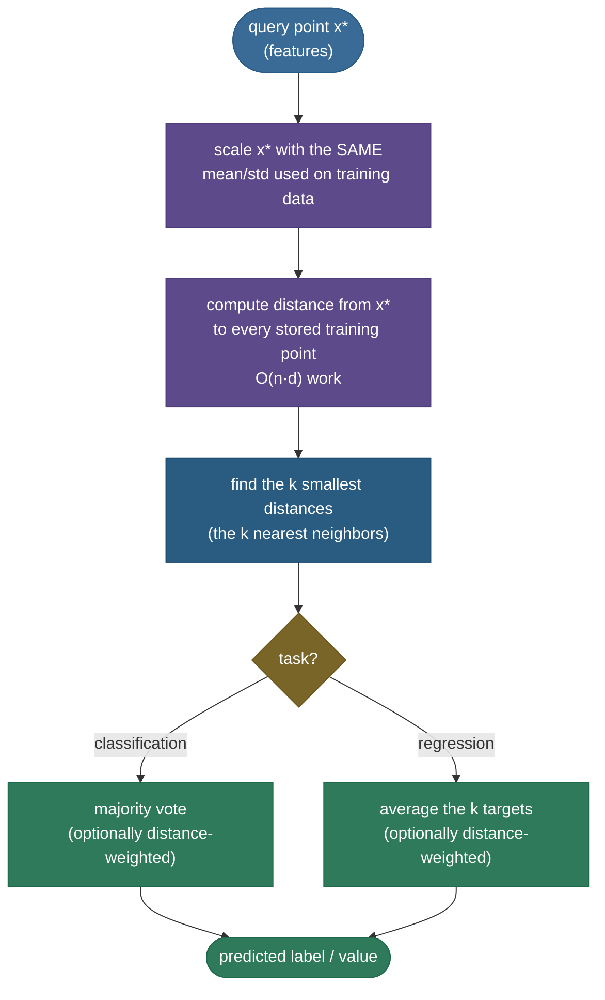
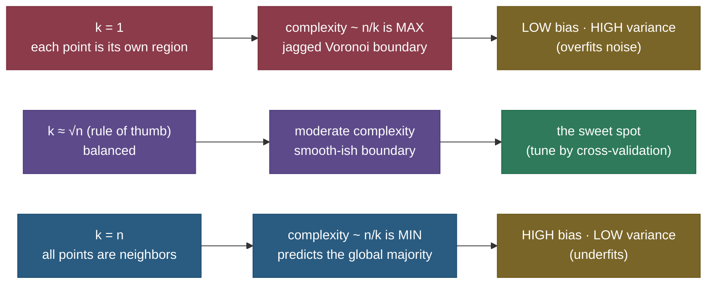
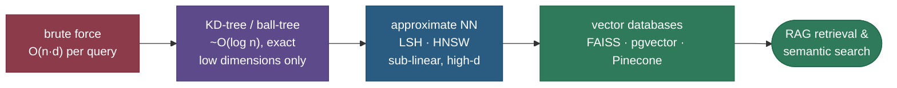

# k-Nearest Neighbors: let the data speak for itself

Most learning algorithms spend their effort *up front* — they fit parameters, build trees, descend gradients — and then throw the training data away, keeping only a compact summary (a weight vector, a set of splits). **k-Nearest Neighbors** does the exact opposite. It builds nothing. To classify a new point it simply looks at the **k closest examples it has already seen** and takes a vote (for regression, an average). There is no model in the usual sense — *the training set itself is the model*. That one design choice — defer all the work to query time — makes kNN the cleanest possible introduction to three ideas that run through the whole of machine learning: **distance**, the **bias–variance tradeoff**, and the **curse of dimensionality**.

I'm going to teach this the way I'd explain it to someone at a whiteboard who's about to be asked about it in an interview. We'll start with *why* a no-training algorithm is even appealing (and what it costs), then build the mechanics — distance metrics, the mandatory feature-scaling step, choosing k as a bias–variance dial — then the deep parts everyone gets wrong: why distances **concentrate** in high dimensions (with measured numbers), the Voronoi geometry of the decision boundary, and the index structures (KD-tree, ball-tree, **HNSW**) that turn kNN from a textbook toy into the retrieval engine behind modern **vector databases and RAG**. By the end you'll be able to:

- explain why kNN is a **lazy, non-parametric, instance-based** learner and the cost that buys;
- pick the right **distance metric** (Euclidean, Manhattan, Minkowski-p, cosine, Hamming) for the data;
- argue from numbers why **feature scaling is mandatory**, not optional;
- treat **k** as a bias–variance knob and reason about *effective complexity ≈ n/k*;
- **derive** why distances concentrate in high dimensions, so kNN degrades;
- state the **Cover & Hart** 1-NN ≤ 2× Bayes-error guarantee and what it means;
- name the **index structures** (KD-tree, ball-tree, LSH, HNSW) that make query time sub-linear, and connect them to vector search.

> **Note:** the one-line theory — kNN approximates the **Bayes-optimal classifier** by estimating $P(y \mid x)$ locally from the labels of nearby points. With enough data and a sensibly growing k, that local estimate converges to the truth. Everything hard about kNN (scaling, dimensionality, choosing k, search speed) is about making "nearby" *meaningful* and *fast*.

Intuition and pictures first, then the math (with sources), then runnable, verified code.

---

## The problem: what if we never train at all?

Every parametric model — linear regression, a neural net — commits to a **fixed functional form** with a fixed number of parameters, and learning means tuning those parameters to the data. That's powerful when the form is right, but it bakes in an assumption: linear regression *assumes* a line, logistic regression *assumes* a linear log-odds boundary. If the true boundary is a wiggly, local thing, a global parametric form fights it.

kNN throws that assumption away. It makes **no global assumption about the shape of the function** — it just says: *points that are close in feature space probably share a label.* That's the **smoothness assumption**, and it's the only one kNN makes. The price is that, having committed to nothing, kNN must keep *everything*: to answer a query it consults the raw training data directly. This makes it a **lazy learner** (no work at fit time, all work at query time), **instance-based** (it reasons from stored instances, not a summary), and **non-parametric** (its effective complexity grows with the data, not a fixed parameter count).

> **Tip:** "non-parametric" does **not** mean "no parameters." It means the number of effective parameters **grows with the data** rather than being fixed in advance. A kNN model trained on a million points carries a million points' worth of information; one trained on ten carries ten. Contrast linear regression, which has exactly $d+1$ parameters no matter how much data you feed it.

---

## What it is: the algorithm in five lines

Given a training set of labeled points $\{(x_i, y_i)\}_{i=1}^{n}$ and a query point $x^\star$:

1. **Scale** $x^\star$ using the *same* transform fitted on the training data (more on why this is non-negotiable below).
2. **Compute the distance** $d(x^\star, x_i)$ to every training point.
3. **Select** the $k$ smallest — the *k nearest neighbors*.
4. **Aggregate** their labels: **majority vote** for classification, **mean** for regression (optionally distance-weighted).
5. **Return** that as the prediction.



The "fit" step is almost a joke: it just **stores the data** (and maybe builds an index, below). All the computation lives in the query.

There's a deeper way to read step 4 that connects kNN to probability. The majority vote is really a **local estimate of the class posterior**: among the k nearest neighbors, the fraction belonging to class $c$ is an estimate of $P(y = c \mid x^\star)$,

$$\hat{P}(y = c \mid x^\star) = \frac{1}{k}\sum_{i \in \mathcal{N}_k(x^\star)} \mathbb{1}[y_i = c],$$

and predicting the majority class is just choosing the $c$ that maximizes this estimate — the same decision rule the **Bayes-optimal classifier** uses, but with the true (unknown) posterior replaced by a local empirical one. As the data grows dense and k grows slowly with it, that local estimate converges to the truth, which is *why* kNN is consistent (the formal statement is in the Cover & Hart / Stone results below). Everything kNN does is a finite-sample approximation to "predict the most probable class near here."

> **Gotcha:** this inverts the usual cost profile. Most models are **slow to train, fast to predict**; kNN is **instant to train, slow to predict**. A linear model answers a query with one dot product; a brute-force kNN answers it by scanning the *entire* training set. That asymmetry — cheap fit, expensive inference — is the single most important practical fact about kNN, and the reason half this page is about making the search faster.

---

## Intuition: how do you guess a stranger's taste?

You move to a new city and want to guess whether a stranger will like a film. The instance-based move is: find the **handful of people most similar to them** — same age, same favorite genres, same city — and check what *those* people thought. If 4 of the 5 most-similar people loved it, you predict they will too. You didn't build a theory of taste; you trusted that *similar people have similar preferences* and let their actual ratings vote. That is kNN exactly. The recommendation systems of the early 2000s were, quite literally, user-based and item-based kNN.

The only judgment calls are the two kNN also has to make: **how do you measure "similar"** (the distance metric) and **how many neighbors do you trust** (the value of k). Ask one super-similar person and you're at the mercy of their quirks (k=1, high variance); poll a thousand vaguely-similar people and you've washed out the signal into the city-wide average (k large, high bias). The art is the middle.

---

## Why it matters

- **It's a Swiss-army interview question.** A single kNN question probes whether you understand bias–variance, distance metrics, feature scaling, and the curse of dimensionality — which is exactly why interviewers love it as a warm-up that escalates.
- **It's the honest baseline.** Because it assumes almost nothing, a well-scaled kNN is a brutal sanity check: if your fancy model can't beat kNN, your fancy model is broken (or your features are).
- **It's the conceptual root of vector search.** "Find the nearest neighbors of this query vector" *is* what a vector database does for **RAG retrieval**, semantic search, and deduplication — at billion-vector scale, with approximate-NN indexes. Understanding kNN is understanding the retrieval half of modern LLM applications.

---

## The math: distance metrics, and choosing one

"Nearest" is meaningless until you fix a **distance**. A distance (metric) $d(a,b)$ is non-negative, zero only when $a=b$, symmetric, and obeys the triangle inequality. The choice encodes *what you mean by similar*, and it matters as much as k.

**Minkowski distance** is the general family that contains the two you'll use most. For two $d$-dimensional points $a, b$:

$$d_p(a, b) = \left( \sum_{j=1}^{d} |a_j - b_j|^p \right)^{1/p}.$$

The exponent $p$ is a dial:

- **$p = 2$ — Euclidean (L2).** Straight-line distance, $\sqrt{\sum_j (a_j - b_j)^2}$. The default; rotationally invariant; what you want for continuous, comparable features.
- **$p = 1$ — Manhattan (L1, taxicab).** $\sum_j |a_j - b_j|$. Distance along axes, as if walking a city grid. **More robust to outliers** (no squaring to amplify a single huge gap) and often better in higher dimensions, where L2's concentration bites harder.
- **$p \to \infty$ — Chebyshev.** $\max_j |a_j - b_j|$ — dominated by the single largest coordinate gap.

Two more metrics handle data Minkowski can't:

- **Cosine distance**, $1 - \dfrac{a \cdot b}{\lVert a \rVert\, \lVert b \rVert}$, measures the **angle** between vectors, ignoring magnitude. This is the right choice for **text embeddings, TF-IDF, and high-dimensional sparse data**, where *direction* (which features fire) matters more than *length* (how many times). It's the metric vector databases use for semantic search.
- **Hamming distance** counts positions where two equal-length strings/bit-vectors **differ** — the metric for categorical or binary features (DNA, one-hot codes).

> **Tip:** quick selector. Continuous comparable features → **Euclidean**. Many dimensions or outlier-prone → try **Manhattan**. Text/embeddings/sparse where magnitude is noise → **cosine**. Categorical/binary → **Hamming**. Mixed types → a weighted combination (e.g. Gower distance). And whatever you pick, **scale first** — which is the next, non-negotiable, section.

> **Note (formula provenance):** the metric inventory and its use in instance-based learning is **ESL Ch. 13.3** (Hastie, Tibshirani & Friedman) and **ISLR Ch. 2.2.3 / 3.5**; cosine similarity's role in high-dimensional retrieval is standard IR (Manning et al., *Intro to Information Retrieval*). Sources in the references.

There's one more metric worth knowing because it makes the *next* section's lesson disappear by construction. **Mahalanobis distance** measures distance in units of the data's own covariance $\Sigma$:

$$d_M(a, b) = \sqrt{(a - b)^\top \Sigma^{-1} (a - b)}.$$

It does two things at once: it **rescales each feature by its variance** (so a large-range feature can't dominate — exactly the scaling fix below) *and* **decorrelates** the features (so two redundant, correlated features don't double-count). Standardizing each feature independently is the special case where $\Sigma$ is diagonal. This is also the entry point to **metric learning** — methods like **LMNN** and **NCA** *learn* a $\Sigma$ (equivalently a linear transform of the space) so that points of the same class are pulled together and different classes pushed apart, before kNN ever runs. The lesson: the metric is not a fixed given — it's a modeling choice you can tune or learn.

---

## Why feature scaling is MANDATORY (with numbers)

This is the bug that silently wrecks more student kNN models than anything else, so let's *see* it, not just assert it. Distance sums contributions across features. If one feature has a **much larger numeric range** than the others, its differences dominate the sum and the small-range features become invisible — the metric effectively ignores them.

Take two features on wildly different scales: **height in metres** (range ~0.5) and **income in dollars** (range ~100,000). A query and two candidates:

| point | height (m) | income ($) |
|---|---|---|
| **query** $q$ | 1.60 | 61,000 |
| **A** (height-twin) | 1.55 | 95,000 |
| **B** (income-twin) | 1.95 | 60,000 |

Compute the **raw** Euclidean distance. The income term, squared, utterly swamps the height term ($0.05^2 = 0.0025$ is a rounding error next to $34{,}000^2$):

$$d(q, A) = \sqrt{0.05^2 + 34000^2} = 34{,}000.0, \qquad d(q, B) = \sqrt{0.35^2 + 1000^2} = 1{,}000.0.$$

So **raw kNN says B is the nearest neighbor** — purely because B's income is close. Height contributed *nothing*; the model is secretly 1-D (income only). Now **standardize** each feature to zero mean and unit variance (here height std ≈ 0.15, income std ≈ 28,000) and recompute distances in z-score space:

$$d_{\text{scaled}}(q, A) = \sqrt{\left(\tfrac{0.05}{0.15}\right)^2 + \left(\tfrac{34000}{28000}\right)^2} = 1.259, \qquad d_{\text{scaled}}(q, B) = \sqrt{\left(\tfrac{0.35}{0.15}\right)^2 + \left(\tfrac{1000}{28000}\right)^2} = 2.334.$$

After scaling, **A is the nearest neighbor** — the prediction *flipped*, because now both features get an equal say. Same data, same metric, opposite answer.


The figure shows the same effect at full scale: the raw nearest neighbors (left, green rings) string out horizontally along the dominating salary axis and out-vote the truth; standardized (right), they cluster tightly around the query and vote correctly.

> **Gotcha:** **always fit the scaler on the training data only**, then apply the *same* transform to queries. Fitting on the test/query data leaks information. In scikit-learn this is exactly why you wrap `StandardScaler` and `KNeighborsClassifier` in a `Pipeline` — the scaler's mean/std are learned on `fit` and reused on `predict`.

> **Tip:** `StandardScaler` (z-score) is the usual choice. Use `MinMaxScaler` if you want bounded [0,1] features, or `RobustScaler` (median/IQR) when outliers would distort the mean and std. The point is identical across all three: **put every feature on a comparable scale before measuring distance.**

---

## Choosing k: the bias–variance knob

k is the single hyperparameter, and it controls a clean **bias–variance tradeoff** — the cleanest illustration of that tradeoff in all of ML.

- **Small k (k=1).** The prediction is the label of the single closest point. It follows every wiggle and every noisy point exactly → **low bias, high variance**. The decision boundary is jagged; the model "memorizes" and overfits. A single mislabeled training point creates its own little region of wrong predictions.
- **Large k.** The prediction averages many neighbors, smoothing over individual noise → **low variance, high bias**. Push k all the way to $n$ and *every* query returns the **global majority class** — maximally biased, zero variance, useless.



**Effective complexity ≈ n/k.** Here's the argument. With $n$ training points and neighborhoods of size $k$, the input space is carved into roughly $n/k$ regions, each governed by a different local majority of $k$ points. The number of effectively-independent local decisions — the model's degrees of freedom — is therefore about $n/k$. So $k=1$ gives $\approx n$ degrees of freedom (one per point — maximal complexity), and $k=n$ gives $1$ (a single global decision). **Complexity moves *inversely* with k**, which is why the x-axis of a kNN bias–variance plot is often drawn as $n/k$ (increasing complexity), or equivalently k decreasing left-to-right. This is the standard ESL framing (Ch. 13.3).

You **can't read the best k off the training error** — at k=1 training error is *always* 0 (each point is its own nearest neighbor), which looks perfect and is pure overfitting. You must use a **held-out set or cross-validation**:


The boundary view makes the same point geometrically — k=1 chases noise into isolated islands; k=15 draws one clean, smooth frontier:


> **Tip:** a common starting heuristic is $k \approx \sqrt{n}$, but **always tune it by cross-validation** — the right k depends on the noise level and density of *your* data. Then refine around the CV optimum.

> **Gotcha:** for **binary** classification, pick an **odd** k so the vote can't tie. (For multi-class, ties are still possible; break them by smallest total distance, or by the nearest single neighbor among the tied classes — scikit-learn breaks ties by the order points appear, so don't rely on its default for a tie-sensitive application.)

---

## The decision boundary: Voronoi tessellation

For **1-NN**, the decision boundary has a beautiful exact description. Every training point "owns" the region of space closer to it than to any other training point — its **Voronoi cell**. The whole input space is partitioned into these cells (a **Voronoi tessellation**), each cell labeled with its owner's class. The 1-NN decision boundary is exactly the set of cell edges where adjacent cells have *different* classes. That's why 1-NN boundaries look like jagged polygonal mosaics: they *are* the borders of a Voronoi diagram. For $k>1$, the picture generalizes to *order-k* Voronoi regions (each region shares the same k nearest points), and the boundary smooths as k grows — the geometric face of the bias–variance story above.

> **Note:** this geometry is why 1-NN can represent *arbitrarily* complex boundaries (any partition the points allow) — maximal flexibility, hence low bias and high variance. It also makes 1-NN's behavior fully determined by the data points alone: no parameters, just geometry.

---

## Deriving the bias–variance of the kNN estimator

We can make "effective complexity ≈ n/k" quantitative for **kNN regression**, which turns the hand-wavy bias–variance story into algebra. Suppose the truth is $y = f(x) + \varepsilon$ with noise $\varepsilon$ of mean 0 and variance $\sigma^2$. The kNN estimate at $x^\star$ averages the k nearest neighbors' targets:

$$\hat{f}(x^\star) = \frac{1}{k}\sum_{i \in \mathcal{N}_k(x^\star)} y_i = \frac{1}{k}\sum_{i \in \mathcal{N}_k} \big(f(x_i) + \varepsilon_i\big).$$

Take expectations over the noise. The **variance** of the estimate is the variance of an average of k independent noise terms:

$$\operatorname{Var}\big[\hat{f}(x^\star)\big] = \frac{1}{k^2}\sum_{i \in \mathcal{N}_k}\operatorname{Var}[\varepsilon_i] = \frac{\sigma^2}{k}.$$

So variance falls as $\sigma^2 / k$ — **larger k, lower variance**, exactly $1/k$. The **bias** is the gap between the average of the true values at the neighbors and the true value at the query:

$$\operatorname{Bias}\big[\hat{f}(x^\star)\big] = \frac{1}{k}\sum_{i \in \mathcal{N}_k} f(x_i) - f(x^\star).$$

If $f$ is smooth, this is tiny when the neighbors are *close* to $x^\star$ — but as you grow k you're forced to reach out to **farther** neighbors where $f$ has drifted, so the bias **grows** with k. Putting the two together, the expected squared error is

$$\mathbb{E}\big[(\hat{f}(x^\star) - y)^2\big] = \underbrace{\Big(\tfrac{1}{k}\textstyle\sum_{i} f(x_i) - f(x^\star)\Big)^2}_{\text{bias}^2:\ \uparrow \text{ with } k} \;+\; \underbrace{\frac{\sigma^2}{k}}_{\text{variance}:\ \downarrow \text{ with } k} \;+\; \underbrace{\sigma^2}_{\text{irreducible}}.$$

This is the **bias–variance decomposition** with kNN's two terms moving in opposite directions in k — minimizing their sum gives the U-curve you measured in Example 3, and the variance term $\sigma^2/k$ is the precise sense in which complexity scales like $1/k$ (so $\approx n/k$ regions over the whole space). This is the ESL Ch. 13.3 / 7 argument; sources in the references.

> **Note:** the same $\sigma^2/k$ shows up in [Bagging](../08-Bagging/08-Bagging.md), where averaging $B$ models divides variance by up to $B$. kNN is "averaging k neighbors"; bagging is "averaging B models" — both are variance reduction by averaging, and both pay for it in a different currency (bias from distant neighbors here; correlation between models there).

---

## Distance-weighted kNN

Plain ("uniform") kNN gives every one of the k neighbors an equal vote — but a neighbor sitting right on top of the query surely deserves more say than the k-th one out at the edge of the neighborhood. **Distance-weighted kNN** weights each neighbor's vote by a decreasing function of its distance, commonly the inverse:

$$\hat{y}(x^\star) = \frac{\sum_{i \in \mathcal{N}_k} w_i\, y_i}{\sum_{i \in \mathcal{N}_k} w_i}, \qquad w_i = \frac{1}{d(x^\star, x_i) + \varepsilon},$$

(with a small $\varepsilon$ to avoid dividing by zero when a query coincides with a training point). Closer neighbors dominate; the result is a smoother, often more accurate predictor, and it **softens the choice of k** — distant neighbors contribute little even if k is large. In scikit-learn this is `weights='distance'` (vs the default `weights='uniform'`).

**A worked numeric case where weighting changes the answer.** Reuse Example 1's query $q=(2,3)$ and take $k=3$. The three nearest neighbors and their inverse-distance weights $w_i = 1/d_i$:

| neighbor | label | distance $d_i$ | weight $w_i = 1/d_i$ |
|---|---|---|---|
| $(1.5, 2.0)$ | A | 1.118 | 0.894 |
| $(3.0, 4.0)$ | B | 1.414 | 0.707 |
| $(1.0, 1.0)$ | A | 2.236 | 0.447 |

- **Uniform vote:** A, B, A → 2 vs 1 → **A** (here weighting agrees, but barely).
- **Weighted vote:** class A weight $= 0.894 + 0.447 = 1.341$; class B weight $= 0.707$ → **A** with a *much* clearer margin (1.341 vs 0.707), because the closest neighbor (an A, weight 0.894) counts most.

Now imagine the labels were A, A, B (the two closest are A, the farthest is B): uniform still says A, and weighting says A *emphatically* (the far B contributes only 0.447). The cases where they **disagree** are exactly when the closest neighbor's class is the minority among the k — then weighting can override a uniform majority of distant points. That's the whole value of distance weighting: it trusts proximity over headcount.

> **Tip:** distance weighting is the standard fix when uniform voting feels too crude and you don't want to hand-tune k. It also breaks many ties automatically (the closer side wins). Other kernels (Gaussian on distance, $w_i = e^{-d_i^2 / 2\tau^2}$) give the **Nadaraya–Watson** kernel regressor — kNN's continuous cousin, where the bandwidth $\tau$ plays k's role.

---

## The curse of dimensionality: derive why kNN breaks

This is the deep failure mode, and the most-tested. **In high dimensions, "nearest" stops meaning anything**, because *all* pairwise distances become nearly equal. Here is the argument, then the measurement.

**The geometric intuition.** Sample $n$ points uniformly in the unit cube $[0,1]^d$. To capture a fraction $r$ of the data in a neighborhood, you need a sub-cube whose edge length is $\ell = r^{1/d}$ (since volume scales as $\ell^d$). To grab just **1%** of your data ($r = 0.01$) in $d=10$ dimensions you need an edge of $0.01^{1/10} \approx 0.63$ — **63% of the full range of every feature**. The "local" neighborhood isn't local at all; it spans most of the space. By $d=100$, you'd need an edge of $0.01^{1/100} \approx 0.955$. There is no such thing as a small neighborhood in high dimensions.

**The concentration result.** More formally (Beyer et al. 1999), for points drawn i.i.d. in $d$ dimensions, the ratio of the **farthest** to the **nearest** distance from a query converges to 1 as $d \to \infty$:

$$\frac{d_{\max} - d_{\min}}{d_{\min}} \;\xrightarrow[d \to \infty]{}\; 0, \qquad\text{equivalently}\qquad \frac{d_{\min}}{d_{\max}} \;\xrightarrow[d \to \infty]{}\; 1.$$

Why? A squared Euclidean distance is a **sum of $d$ per-feature terms**. By the law of large numbers, that sum concentrates tightly around its mean ($\propto d$), with a standard deviation that grows only like $\sqrt{d}$. So the *spread* of distances grows like $\sqrt{d}$ while the *typical* distance grows like $d$ — and the **relative** spread (spread ÷ typical) shrinks like $1/\sqrt{d} \to 0$. Every point ends up at roughly the same distance from the query. The "nearest" neighbor is barely nearer than the farthest, so the neighbor vote is essentially random, and kNN degrades to noise.

We can **measure** exactly this. With 1000 uniform points and a random query, averaged over 40 queries:

| dimension $d$ | mean (nearest / farthest distance) |
|---|---|
| 2 | **0.014** (nearest is ~70× closer than farthest — very meaningful) |
| 10 | 0.260 |
| 100 | 0.695 |
| 1000 | **0.894** (nearest is almost as far as farthest — meaningless) |


> **Note:** the cures all attack the *effective* dimensionality. **Dimensionality reduction** (PCA, UMAP) or **embeddings** project to a lower-dimensional space where distances are meaningful again — which is exactly why you run vector search over *learned* embeddings (a few hundred dims that capture the signal), not raw high-dimensional one-hots. **Feature selection** drops noise dimensions. And **Manhattan (L1)** concentrates a little less brutally than Euclidean, so it's sometimes preferred in moderate dimensions.

> **Gotcha:** the curse is also why kNN needs **exponentially more data** as dimensions grow to keep neighborhoods truly local. Data requirements scale like $\sim k^d$ for a fixed neighborhood resolution — infeasible past a few dozen meaningful dimensions without reduction.

---

## kNN for regression

kNN isn't just a classifier. For **regression**, replace the vote with an **average**: the prediction is the mean (or distance-weighted mean) of the k nearest neighbors' target values,

$$\hat{y}(x^\star) = \frac{1}{k} \sum_{i \in \mathcal{N}_k(x^\star)} y_i.$$

It produces a **locally constant, piecewise prediction surface** (or piecewise-smooth with distance weighting) — a non-parametric regressor that adapts to local structure without assuming a global form. Same bias–variance story: small k → jumpy and overfit, large k → flat and oversmoothed; same scaling and dimensionality caveats. kNN regression is the discrete sibling of **kernel (Nadaraya–Watson) regression** and **LOESS**, which weight *all* points by a distance kernel instead of hard-cutting at the k-th neighbor.

**A tiny numeric trace.** Predict a house price from one feature, size (m²). Training: $(50, \$200\text{k})$, $(55, \$210\text{k})$, $(60, \$240\text{k})$, $(120, \$500\text{k})$. Query: a $58\text{ m}^2$ house, $k=3$. The three nearest by $|x - 58|$ are 60 (d=2), 55 (d=3), 50 (d=8):

- **Uniform 3-NN:** $\hat{y} = \tfrac{1}{3}(240 + 210 + 200) = \$216.7\text{k}$.
- **Distance-weighted** (weights $1/d$: $0.5, 0.333, 0.125$): $\hat{y} = \dfrac{0.5\cdot240 + 0.333\cdot210 + 0.125\cdot200}{0.5+0.333+0.125} = \$224.5\text{k}$ — pulled toward the closest (60 m², \$240k) house, which is the sensible bias.

Notice the $120\text{ m}^2$ outlier never enters the neighborhood, so kNN regression is **locally robust** to far-away points — unlike a global linear fit, which that outlier would tilt.

---

## The Cover & Hart guarantee: 1-NN ≤ 2× Bayes

A surprising theoretical gem, and a favorite "do you actually know kNN" question. The **Bayes error** $R^\star$ is the irreducible minimum error any classifier can achieve (it's nonzero whenever classes overlap). **Cover & Hart (1967)** proved that as $n \to \infty$, the error rate $R_{1\text{NN}}$ of the *simplest possible* classifier — **1-NN** — is bounded by

$$R^\star \;\le\; R_{1\text{NN}} \;\le\; 2R^\star\left(1 - \tfrac{c}{c-1}R^\star\right) \;\le\; 2R^\star,$$

where $c$ is the number of classes. **In words: 1-NN's asymptotic error is at most twice the best error any algorithm could ever achieve.** That a method which just memorizes the data and looks at *one* neighbor gets within a factor of two of the theoretical optimum is genuinely remarkable — it says the nearest-neighbor label carries at least half the available information about the true class. As $k \to \infty$ (with $k/n \to 0$), kNN's error converges all the way *down* to the Bayes error $R^\star$ itself, because the local label frequency becomes a consistent estimate of $P(y \mid x)$.

**Why the two conditions $k \to \infty$ and $k/n \to 0$?** They're the two halves of the bias–variance story, now stated as asymptotics. We need $k \to \infty$ so the local label *fraction* averages enough points to become a low-variance estimate of $P(y \mid x)$ (kill the variance). And we need $k/n \to 0$ so that, even as k grows, it grows *slower* than the data — keeping the k neighbors in an ever-shrinking ball around the query, so they're all genuinely near $x^\star$ and the estimate stays unbiased (kill the bias). Satisfy both — e.g. $k = \sqrt{n}$ gives $k \to \infty$ and $k/n = 1/\sqrt{n} \to 0$ — and kNN is **Bayes-consistent**: its error converges to the irreducible $R^\star$ for *any* underlying distribution, with no parametric assumption at all. That universality is the theoretical payoff for kNN's stubborn refusal to assume a model.

> **Note (provenance):** this is **Cover & Hart, "Nearest Neighbor Pattern Classification," IEEE Trans. Information Theory (1967)** — the foundational theorem of instance-based learning. The consistency of k-NN as $k,n \to \infty,\ k/n \to 0$ is **Stone (1977)**. Both in the references.

---

## kNN vs parametric models

| | **kNN (non-parametric, lazy)** | **Parametric (e.g. logistic regression)** |
|---|---|---|
| Training | trivial — store the data | fit parameters (gradient descent, etc.) |
| Prediction | expensive — scan/search the data | cheap — one formula evaluation |
| Memory | holds the **entire** training set | holds a **fixed** parameter vector |
| Assumptions | only **local smoothness** | a **global functional form** (e.g. linear boundary) |
| Decision boundary | arbitrarily flexible (Voronoi) | constrained to the model's form |
| Interpretability | "these k examples voted" (case-based) | weights / coefficients |
| Scaling sensitivity | **extreme** — must standardize | mild (matters for regularization/optimization) |
| High dimensions | **breaks** (curse of dimensionality) | degrades more gracefully |

The trade is **flexibility vs. cost and dimensionality**. kNN wins when the boundary is complex, the data is low-dimensional and plentiful, and query latency is acceptable. Parametric models win when you need fast predictions, small memory, and robustness to many dimensions.

It's worth placing kNN in the larger **taxonomy of classifiers**, because the contrast sharpens what kNN is:

- **Generative** (e.g. [Naive Bayes](../05-Naive-Bayes/05-Naive-Bayes.md)) — model how each class *generates* features, $P(x \mid y)$, then invert with Bayes' rule. Strong assumptions, very data-efficient, great with few samples.
- **Discriminative parametric** (e.g. logistic regression, linear SVM) — model the boundary $P(y \mid x)$ directly with a fixed functional form. Few parameters, fast, robust in high dimensions, but constrained in shape.
- **Discriminative non-parametric / instance-based** (**kNN**) — model $P(y \mid x)$ *locally* with no global form, letting the data shape the boundary. Maximally flexible, but hungry for data and fragile in high dimensions.

The same query — "what class is this point?" — gets answered three different ways: by a generative story, by a global formula, or by *the neighbors themselves*. kNN is the purest instance-based answer, and that purity is exactly its strength (no assumptions) and its weakness (no help when "nearby" stops meaning anything).

> **Note:** with **infinite** data, both a flexible kNN (with k growing slowly) and the right discriminative model converge to the **Bayes boundary**. The difference is *finite-sample* behavior: parametric models get there fast if their form is right and never if it's wrong; kNN gets there eventually for *any* boundary, but needs more data — and far more in high dimensions.

---

## Making it fast: from O(nd) brute force to vector search

Brute-force kNN costs **$O(nd)$ per query** — compute the distance to all $n$ points in $d$ dimensions, then a partial sort for the top k. At a million points that's a million distance computations *per query*. This is kNN's Achilles' heel, and there's a whole hierarchy of fixes:

- **KD-tree** (Friedman, Bentley & Finkel, 1977) — a binary space-partitioning tree that splits on one axis at a time. Query time drops to roughly **$O(\log n)$** in **low dimensions** ($d \lesssim 20$). Above that, the curse of dimensionality erodes the pruning and it degrades toward brute force.
- **Ball-tree** — partitions space into nested hyperspheres instead of axis-aligned boxes. Handles **higher dimensions and arbitrary metrics** better than a KD-tree, with the same logarithmic ambition. (scikit-learn auto-selects KD-tree vs ball-tree vs brute via `algorithm='auto'`.)
- **Approximate Nearest Neighbor (ANN)** — past a few dozen dimensions, *exact* search is hopeless, so we trade a little accuracy for enormous speed:
  - **LSH (Locality-Sensitive Hashing)** (Indyk & Motwani, 1998) — hash points so that *nearby* points collide in the same bucket with high probability; search only the query's bucket. Sub-linear query time with a tunable accuracy/speed knob.
  - **HNSW (Hierarchical Navigable Small World)** (Malkov & Yashunin, 2018) — a multi-layer "small-world" proximity graph you greedily traverse from coarse to fine. It's the **state of the art** for high-dimensional ANN and the default index in essentially every **vector database** (FAISS, Annoy, ScaNN, pgvector, Milvus, Pinecone, Weaviate).



**A scale sanity-check.** Say a RAG corpus has $n = 10^7$ chunks, each embedded to $d = 768$ dimensions, and you want the top-5 neighbors per query. **Brute force** costs $\approx n \cdot d = 7.7 \times 10^9$ multiply-adds *per query* — tens of milliseconds even vectorized, and it scales linearly with the corpus, so doubling the corpus doubles the latency. An **HNSW** index answers the same query by walking a graph and touching only a few thousand candidates — **milliseconds, near-constant in $n$** — at the cost of occasionally missing a true neighbor (typical recall 95–99%, tunable). That accuracy-for-speed trade is *why* every vector database ships an ANN index, not exact kNN: at $10^7$+ vectors, exact search is simply too slow for interactive retrieval.

> **Note:** this is the bridge from a textbook algorithm to production AI. When a **RAG** system "retrieves the most relevant chunks," it embeds your query and runs **approximate kNN (cosine distance) over millions of document embeddings** using an HNSW index. kNN never went away — it became the retrieval layer of the entire LLM-application stack.

The full complexity picture, side by side:

| method | build time | query time | memory | exact? | good for |
|---|---|---|---|---|---|
| brute force | $O(1)$ (store) | $O(nd)$ | $O(nd)$ | yes | small $n$, any $d$ |
| KD-tree | $O(nd\log n)$ | $\sim O(\log n)$ | $O(nd)$ | yes | low $d$ ($\lesssim 20$) |
| ball-tree | $O(nd\log n)$ | $\sim O(\log n)$ | $O(nd)$ | yes | moderate $d$, any metric |
| LSH | $O(nd)$ | sub-linear | $O(nd)$ + tables | no | high $d$, tunable recall |
| HNSW | $O(nd\log n)$ | $\sim O(\log n)$ | $O(nd \cdot M)$ | no | high $d$, best recall/speed |

> **Gotcha (memory).** kNN's other production cost is **RAM**: the model *is* the data, so you must keep every training point (and the index) resident to answer queries. A million 768-dim float32 embeddings is ~3 GB before the index. Parametric models don't have this problem — another reason kNN is reserved for moderate-sized reference sets or backed by a purpose-built vector store.

---

## Shrinking the data itself: condensed and edited NN

Indexes speed up *search* over a fixed dataset; a complementary idea is to **store fewer points** without losing accuracy — which cuts both query time and memory. Two classic prototype-selection methods:

- **Condensed Nearest Neighbor (CNN, Hart 1968)** — keep only the points needed to classify all the *others* correctly. Most training points sit deep inside a class region and never affect a decision; only the points near the boundary matter. CNN greedily discards the redundant interior points, often shrinking the set many-fold while leaving the 1-NN boundary almost unchanged.
- **Edited Nearest Neighbor (ENN, Wilson 1972)** — the opposite hygiene: *remove* points that their own neighbors disagree with (likely mislabeled or noisy), which **smooths the boundary and denoises** the reference set. Often run before CNN (Wilson editing → condensing).

> **Tip:** these are the pre-index way to make kNN practical, and they're still useful *with* an index (fewer vectors to build it over). The mental model: **ENN cleans, CNN compresses.** Both exploit that a kNN model's decisions are determined almost entirely by points near the class boundaries.

---

## Handling categorical features and missing values

kNN assumes you can compute a distance — which quietly assumes numeric, complete features. Two practical wrinkles:

- **Categorical features.** Euclidean distance on a raw integer encoding of categories is meaningless (it implies "category 3 is closer to 2 than to 7"). **One-hot encode** nominal categories and use **Hamming** distance on those columns, or combine a Hamming term for categoricals with a Euclidean term for numerics (a **Gower**-style mixed metric). Ordinal categories with a true order can be encoded numerically and scaled.
- **Missing values.** A distance can't sum over a missing coordinate. Either **impute first** (mean/median, or — fittingly — `KNNImputer`, which fills a value from the feature's own nearest neighbors), or use a distance that ignores missing pairs and rescales by the number of present features. Imputing inside the cross-validation loop (not before) avoids leakage.

> **Gotcha:** these steps interact with scaling. One-hot columns are 0/1 (range 1) while a raw numeric feature might span thousands — so even after encoding you must **scale**, or the numeric feature still dominates and the categorical columns vanish into the distance. Encode, *then* scale, every time.

---

## A practical playbook

Putting it together, here's the order of operations I'd actually run for a kNN model:

1. **Split first** — hold out a test set (and set up cross-validation folds) *before* touching the data, so nothing leaks.
2. **Encode** categoricals (one-hot nominal, ordinal-encode ordered) and decide on a missing-value strategy.
3. **Scale** inside a `Pipeline` (`StandardScaler` → `KNeighborsClassifier`) so the scaler is fit on train folds only.
4. **Tune** with `GridSearchCV` over `n_neighbors` (sweep a range around $\sqrt{n}$), `weights` (`uniform` vs `distance`), and `p` (1=Manhattan, 2=Euclidean) — cross-validated, never on training error.
5. **Check dimensionality** — if you have many features, run PCA / feature selection / embeddings first; high-dimensional raw kNN is a trap (curse of dimensionality).
6. **Pick the search backend** — brute force for small data, KD-tree/ball-tree (`algorithm='auto'`) for low-dimensional moderate data, an ANN index (FAISS/HNSW) for large or high-dimensional sets.
7. **Evaluate** on the untouched test set with the right metric (and watch class imbalance — weight votes or resample if one class swamps neighborhoods).

> **Tip:** steps 1–4 are the 90% that students skip and then wonder why kNN "doesn't work." A leaked scaler or a k tuned on training error will quietly hand you an over-optimistic model. The pipeline + cross-validation discipline is the whole game.

---

## Four worked examples, increasing in complexity

**Example 1 — 1-NN vs 3-NN by hand (Euclidean).** Training points and a query $q = (2, 3)$:

| point | label | $d(q, \cdot)$ |
|---|---|---|
| $(1.5, 2.0)$ | A | $\sqrt{0.5^2 + 1^2} = 1.118$ |
| $(3.0, 4.0)$ | B | $\sqrt{1^2 + 1^2} = 1.414$ |
| $(1.0, 1.0)$ | A | $2.236$ |
| $(3.5, 5.0)$ | B | $2.500$ |
| $(4.5, 5.0)$ | A | $3.202$ |
| $(5.0, 7.0)$ | B | $5.000$ |

- **1-NN:** nearest is $(1.5, 2.0)$ → predict **A**.
- **3-NN:** the three nearest are A, B, A → vote **2 A vs 1 B** → predict **A**.

Here both agree, but notice the 3-NN vote *survived* the second-nearest point being class B — smoothing in action. (Verified in code below: distances and votes match exactly.)

**Example 2 — unscaled features flip the neighbor** (the table from the scaling section, restated as a worked numeric trace). Query $q=(1.60\text{ m}, \$61{,}000)$, candidates A (height-twin) and B (income-twin):

- **Raw:** $d(q,A)=34{,}000$, $d(q,B)=1{,}000$ → **B is nearest** (the model is secretly income-only).
- **Standardized** (height std 0.15, income std 28,000): $d(q,A)=1.259$, $d(q,B)=2.334$ → **A is nearest**.

The nearest neighbor — and therefore the prediction — **flips** purely from scaling. This is why scaling is step 1, not an afterthought.

**Example 3 — a measured k-sweep (bias–variance on real data).** On `make_moons` (600 points, noise 0.30, 60/40 split):

| k | train acc | test acc |
|---|---|---|
| 1 | **1.000** | 0.896 |
| 5 | 0.908 | 0.917 |
| 15 | 0.894 | 0.929 |
| 31 | 0.892 | **0.938** |
| 101 | 0.864 | 0.900 |

Training accuracy is a **perfect 1.000 at k=1** (every point is its own neighbor) and *decreases* as k grows — so if you tuned on training accuracy you'd pick the *worst* k. Test accuracy is the U-curve: it rises to a peak around k=31 then falls as bias takes over. **5-fold cross-validation independently picks k≈35.** This is the bias–variance tradeoff, measured. (Numbers reproduced by the code below.)

**Example 4 — distance concentration, measured.** From the table above: in $d=2$, the nearest point is ~70× closer than the farthest (ratio 0.014) — a meaningful neighborhood. By $d=1000$ the ratio is **0.894** — the nearest and farthest neighbors are nearly the same distance away, so the "nearest" label is almost coin-flip noise. This is the curse of dimensionality you'll *feel* the moment you run kNN on raw high-dimensional data without reduction.

---

## Code: kNN from scratch, verified against scikit-learn

This runs all four examples end to end, builds a from-scratch kNN, and confirms it makes **bit-identical predictions** to scikit-learn's `KNeighborsClassifier`. It runs on CPU in seconds.

```python
"""kNN from scratch: worked examples + match scikit-learn. Verified on Python 3.12, CPU."""
import numpy as np, collections
from sklearn.datasets import make_moons, load_iris
from sklearn.neighbors import KNeighborsClassifier
from sklearn.model_selection import train_test_split, cross_val_score
from sklearn.preprocessing import StandardScaler

# --- Example 1: 1-NN vs 3-NN by hand (Euclidean) ---
train = np.array([[1.5,2.0],[3.0,4.0],[1.0,1.0],[3.5,5.0],[4.5,5.0],[5.0,7.0]])
labels = np.array(['A','B','A','B','A','B']); q = np.array([2.0,3.0])
d = np.sqrt(((train-q)**2).sum(1)); order = np.argsort(d)
print("1-NN ->", labels[order[0]], "| 3-NN votes ->", dict(collections.Counter(labels[order[:3]])))

# --- Example 2: unscaled feature dominates, scaling flips the nearest neighbor ---
A, B, qq = np.array([1.55,95000.]), np.array([1.95,60000.]), np.array([1.60,61000.])
s = np.array([0.15, 28000.])  # train stds
raw  = lambda p: np.sqrt(((qq-p)**2).sum())
scal = lambda p: np.sqrt((((qq-p)/s)**2).sum())
print(f"RAW   : A={raw(A):.0f} B={raw(B):.0f} -> nearest {'A' if raw(A)<raw(B) else 'B'}")
print(f"SCALED: A={scal(A):.3f} B={scal(B):.3f} -> nearest {'A' if scal(A)<scal(B) else 'B'} (flipped)")

# --- Example 3: k-sweep bias-variance + CV-chosen k ---
X,y = make_moons(n_samples=600, noise=0.30, random_state=3)
Xtr,Xte,ytr,yte = train_test_split(X,y,test_size=0.4,random_state=0)
for k in [1,5,15,31,101]:
    clf = KNeighborsClassifier(k).fit(Xtr,ytr)
    print(f"k={k:3d}: train={clf.score(Xtr,ytr):.3f} test={clf.score(Xte,yte):.3f}")
cv = {k: cross_val_score(KNeighborsClassifier(k), X, y, cv=5).mean() for k in range(1,60,2)}
print("CV best k =", max(cv, key=cv.get))

# --- Example 4: distance concentration ---
rng = np.random.default_rng(0)
for dim in [2,10,100,1000]:
    r = [ (lambda dd: dd.min()/dd.max())(
            np.sqrt(((rng.uniform(0,1,(1000,dim))-rng.uniform(0,1,(1,dim)))**2).sum(1)))
          for _ in range(50)]
    print(f"d={dim:4d}: mean nearest/farthest = {np.mean(r):.3f}")

# --- From-scratch kNN == sklearn (scaled iris) ---
Xi,yi = load_iris(return_X_y=True)
Xtr,Xte,ytr,yte = train_test_split(Xi,yi,test_size=0.3,random_state=1)
sc = StandardScaler().fit(Xtr); Xtr,Xte = sc.transform(Xtr), sc.transform(Xte)
def knn_scratch(Xtr,ytr,Xte,k):
    preds=[]
    for x in Xte:
        idx = np.argsort(np.sqrt(((Xtr-x)**2).sum(1)))[:k]
        vals,counts = np.unique(ytr[idx], return_counts=True); preds.append(vals[counts.argmax()])
    return np.array(preds)
for k in [1,5,11]:
    mine = knn_scratch(Xtr,ytr,Xte,k)
    skl  = KNeighborsClassifier(k).fit(Xtr,ytr).predict(Xte)
    print(f"k={k:2d}: scratch={ (mine==yte).mean():.3f} sklearn={(skl==yte).mean():.3f} identical={np.array_equal(mine,skl)}")
```

Output (reproducible):

```
1-NN -> A | 3-NN votes -> {'A': 2, 'B': 1}
RAW   : A=34000 B=1000 -> nearest B
SCALED: A=1.259 B=2.334 -> nearest A (flipped)
k=  1: train=1.000 test=0.896
k=  5: train=0.908 test=0.917
k= 15: train=0.894 test=0.929
k= 31: train=0.892 test=0.938
k=101: train=0.864 test=0.900
CV best k = 35
d=   2: mean nearest/farthest = 0.014
d=  10: mean nearest/farthest = 0.260
d= 100: mean nearest/farthest = 0.695
d=1000: mean nearest/farthest = 0.894
k= 1: scratch=0.956 sklearn=0.956 identical=True
k= 5: scratch=0.956 sklearn=0.956 identical=True
k=11: scratch=0.956 sklearn=0.956 identical=True
```

> **Note:** the headline checks all fire: the from-scratch kNN produces **bit-identical predictions to scikit-learn** (`identical=True`), training accuracy is a misleading **1.000 at k=1**, the scaling demo **flips the nearest neighbor**, and the concentration ratio climbs **0.014 → 0.894** as dimensions grow. Every number on this page is one of these printed values.

> **Tip:** in real projects, never hand-roll this — use `Pipeline([("scale", StandardScaler()), ("knn", KNeighborsClassifier())])` with `GridSearchCV` over `n_neighbors`, `weights`, and `p` (1=Manhattan, 2=Euclidean). The pipeline guarantees the scaler is fit on train folds only.

---

## Where kNN is used (and where it isn't)

**Used:**
- **Recommendation systems** — user-based / item-based collaborative filtering is literally kNN over a ratings matrix.
- **Vector search / RAG retrieval / semantic search** — approximate kNN (HNSW, cosine) over embeddings is the retrieval engine of modern LLM apps and search.
- **Anomaly detection** — a point whose k-th neighbor is unusually far is an outlier (LOF, k-distance methods).
- **Imputation** — scikit-learn's `KNNImputer` fills a missing value from the feature's neighbors.
- **A baseline** — the honest first model to beat, and a quick prototype when you have little time and moderate data.

**Avoid / be careful:**
- **High-dimensional raw data** — the curse of dimensionality; reduce or embed first.
- **Large training sets with tight latency** — brute-force query cost; needs an ANN index.
- **Unscaled or mixed-type features** — the metric breaks without careful scaling/encoding.
- **Imbalanced classes** — the majority class can dominate every neighborhood; weight votes or resample.

> **Tip:** in interviews, the kNN follow-ups are predictable. Be ready to (1) define lazy/non-parametric/instance-based, (2) explain k as bias–variance with *effective complexity ≈ n/k*, (3) insist on scaling with a numeric reason, (4) derive distance concentration in high dimensions, (5) name KD-tree → ball-tree → HNSW and connect to vector databases, and (6) state Cover & Hart's 1-NN ≤ 2× Bayes bound.

---

## Subtleties that trip people up

A handful of points that separate "I read the kNN tutorial" from "I understand kNN," each a real interview trap:

- **kNN ≠ nearest-centroid.** kNN compares the query to *individual* stored points; **nearest-centroid** compares it to each class's *mean*. kNN can carve a wiggly, multi-modal boundary (a class split into two clusters); nearest-centroid draws a single linear boundary per class pair. They're different algorithms with different bias.
- **There is no closed form and nothing to "learn."** kNN has no loss function, no optimization, no parameters fit by training. Its only "knobs" (k, metric, weighting) are **hyperparameters** chosen by validation — which is why "fit" is just storage. Don't say kNN "minimizes" anything at train time.
- **Class probabilities are coarse and need calibration.** With $k$ neighbors the estimated $P(y=c)$ can only take the values $0, 1/k, 2/k, \dots, 1$. For small k these are jumpy and poorly calibrated; if you need reliable probabilities (not just the argmax), use a larger k, distance weighting, or a calibration step (Platt/isotonic).
- **Duplicate and tied points matter.** Exact duplicates in the training set effectively give that location extra votes; near-duplicates skew neighborhoods. And the $k$-th nearest may be tied with the $(k{+}1)$-th at the same distance — implementations differ in how they break that tie, so a "k=5" model can subtly depend on data order. Deduplicate when it matters.
- **It is sensitive to irrelevant features, not just unscaled ones.** Even perfectly scaled, a handful of pure-noise features add their (random) distance contribution to *every* comparison, blurring the neighborhood — a milder cousin of the curse of dimensionality. Feature selection helps kNN more than it helps most models.
- **Lazy vs eager is a genuine tradeoff, not a flaw.** Lazy learning (kNN) wins when the data changes often (no retraining — just add the point) and when you want a different local model in different regions for free. Eager learning (a fitted parametric model) wins when prediction latency and memory are tight. Name the tradeoff; don't treat "lazy" as a synonym for "bad."

---

## Recap and rapid-fire

**If you remember nothing else:** kNN does **no training** — it stores the data and, at query time, predicts from the **k nearest** points (vote for classification, average for regression). "Nearest" demands a **distance metric** and **mandatory feature scaling**. **k is a bias–variance knob** (small k → low bias/high variance/jagged; large k → high bias/smooth; effective complexity ≈ n/k), tuned by **cross-validation**, never training error. It **breaks in high dimensions** because distances **concentrate** (nearest ≈ farthest), and its **$O(nd)$ query cost** is fixed by KD-trees, ball-trees, and approximate-NN indexes (**LSH, HNSW**) — the same machinery that powers **vector databases and RAG**.

**Quick-fire — say these out loud:**

- *What kind of learner is kNN?* Lazy, non-parametric, instance-based — no training, all work at query time.
- *Why must you scale features?* A large-range feature dominates the distance and the others become invisible — it flips the neighbors (height-vs-income example).
- *What does k control?* Bias–variance: small k = low bias/high variance (overfit, jagged); large k = high bias/low variance (underfit, smooth).
- *Effective complexity?* ≈ n/k — k=1 is maximal (≈ n regions), k=n is one global decision.
- *How do you pick k?* Cross-validation — never training error (which is 0 at k=1).
- *Why does kNN fail in high dimensions?* Distances concentrate — nearest/farthest → 1, so "nearest" carries no information.
- *1-NN's error guarantee?* Cover & Hart: asymptotically ≤ 2× the Bayes error.
- *Query cost and the fix?* O(nd) brute force → KD-tree/ball-tree (low-d, exact) → LSH/HNSW (high-d, approximate) → vector databases.
- *Odd or even k for binary?* Odd, so the vote can't tie.
- *kNN for regression?* Average the k neighbors' target values (optionally distance-weighted).

---

## References and further reading

The curated link library for this topic — start-here path, videos, interactive demos, courses, articles, papers, books, and internal cross-links — lives in a companion file so it can be reused as a standalone reference list:

**→ [k-Nearest Neighbors — references and further reading](04-k-Nearest-Neighbors.references.md)**
