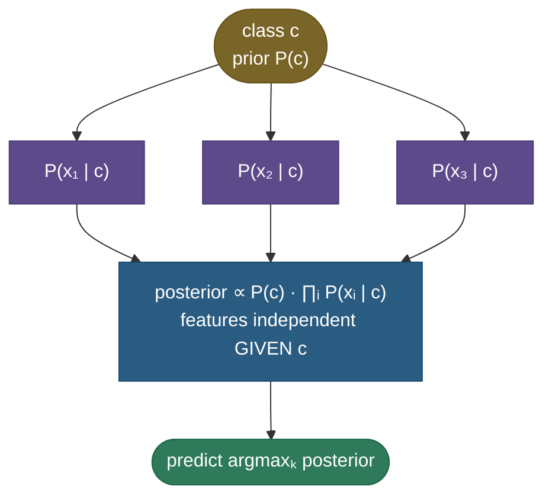
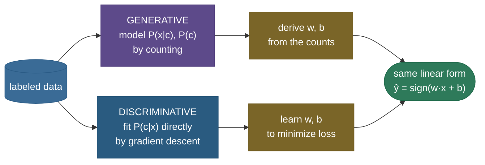

# Naive Bayes: a "wrong" assumption that classifies astonishingly well

Naive Bayes is the model that shouldn't work as well as it does. It applies Bayes' theorem under one deliberately false simplification — that, *given the class*, every feature is **independent** of every other. For a spam filter that means pretending the word "free" tells you nothing about whether "money" also appears, which is obviously wrong: spammy words travel in packs. Yet that "naive" lie is exactly what makes the model fast, data-efficient, and — the part that surprises everyone — a genuinely strong classifier, often the best simple baseline for **text** (spam, sentiment, topic, language ID). It is the canonical lesson of machine learning that **you do not need a *correct* model to make *correct* decisions** — you only need the *right answer to come out on top*, and Naive Bayes gets the ranking right even when its probabilities are nonsense.

This page is the definitive treatment. We'll build it from Bayes' theorem, *derive* every result (the count-based parameter estimates **via a full Lagrangian argument**, the smoothing, the fact that Naive Bayes is secretly a **linear classifier**, its place in the **exponential family**, and its exact kinship with logistic regression), work **four** numeric examples of increasing complexity — including a complete Multinomial document classification traced by hand — prove the from-scratch model matches scikit-learn, and confront the one thing it gets wrong (calibration) with measured numbers and a worked decision-theory argument for *why the wrong probabilities still classify right*.

By the end you'll be able to:

- state **Bayes' theorem** and the **conditional-independence** assumption, and derive the classifier end to end;
- **estimate the parameters** (priors and likelihoods) by maximum likelihood from counts — derived with the **Lagrangian** — and explain **log-space**;
- distinguish **Gaussian / Multinomial / Bernoulli / Complement** NB and exactly when each applies, and trace a **full Multinomial document classification** by hand;
- understand the **text features** (bag-of-words, TF, TF-IDF, n-grams, stop-words) that feed NB and how they change the model;
- derive why **Multinomial/Bernoulli NB is a *linear* classifier**, see it as a member of the **exponential family / log-linear** model class, and relate it to **logistic regression** (the generative–discriminative pair, Ng & Jordan);
- explain the **zero-probability** problem, **Laplace smoothing** as a **MAP/Dirichlet** prior, **Complement NB** for imbalance, and *why NB is accurate yet mis-calibrated* (Domingos & Pazzani) made concrete;
- implement it from scratch, reproduce scikit-learn, and know **when NB beats — and loses to — logistic regression and transformers** in production.

Intuition and pictures first, then the math (every step shown), then runnable, verified code.

> **Note:** Naive Bayes is a **generative** classifier — it models *how each class generates the features*, $P(x\mid c)$, then inverts that with Bayes' rule to get $P(c\mid x)$. That is the opposite of [logistic regression](02-Logistic-Regression.md), which models $P(c\mid x)$ **directly**. "Generative vs discriminative" is a recurring interview theme, and Naive Bayes is the textbook generative example — we'll prove later that the two estimate the *same shape* of decision boundary by different means.

---

## The problem: the joint distribution is astronomically large

We want $P(\text{class}\mid\text{features})$. Bayes' theorem (next section) turns that into needing $P(\text{features}\mid\text{class})$ — the **joint** distribution of *all* features together, per class. That joint is the wall we hit.

Count the parameters. With $d$ binary features, a class's joint distribution over feature *combinations* has $2^d - 1$ free parameters. For a tiny **30-word** vocabulary that's $2^{30} - 1 \approx 10^9$ probabilities to estimate **per class** — and a real text vocabulary has tens of thousands of words, giving more feature combinations than atoms in the universe. You could never see enough data to estimate even a sliver of them; almost every specific combination of words appears **zero** times in training. This is the curse of dimensionality in its purest form, and it makes the exact joint hopeless.

> **Tip:** the entire value of Naive Bayes is converting that $O(2^d)$ estimation problem into an $O(d)$ one. The independence assumption is the price; tractability (and, it turns out, strong accuracy) is what you buy.

---

## Bayes' theorem: flip the conditioning

We can't model $P(c\mid x)$ directly as a generative method, but we *can* model $P(x\mid c)$ — "what do the features look like for spam?" Bayes' theorem flips one into the other. From the product rule $P(c, x) = P(x\mid c)P(c) = P(c\mid x)P(x)$, solve for the posterior:

$$P(c \mid x) = \frac{P(x \mid c)\,P(c)}{P(x)}$$

Read it as **posterior $=$ (likelihood $\times$ prior) / evidence**: $P(c)$ is the **prior** (how common the class is), $P(x\mid c)$ is the **likelihood** (how well class $c$ explains these features), and $P(x)$ is the **evidence** (a normalizer). Crucially, $P(x)$ is the *same for every class*, so for **classification** — picking the most probable class — we can drop it and just compare the numerators:

$$P(c \mid x) \;\propto\; P(x \mid c)\,P(c)$$

> **Gotcha:** you only get to drop $P(x)$ because you're choosing the **argmax over classes** (the denominator cancels). If you need the actual **posterior probability** (not just the label), you must put $P(x) = \sum_{c'} P(x\mid c')P(c')$ back by normalizing — and even then, distrust the number (see calibration).

---

## The naive assumption, derived

The likelihood $P(x\mid c) = P(x_1, \dots, x_d\mid c)$ is still the intractable joint. To see *where* the factorization comes from, start from the **exact** chain rule (no assumption yet) — any joint factorizes as a product of conditionals:

$$P(x_1,\dots,x_d\mid c) = P(x_1\mid c)\,P(x_2\mid x_1, c)\,P(x_3\mid x_1,x_2,c)\cdots P(x_d\mid x_1,\dots,x_{d-1},c).$$

Every term after the first conditions on *all the previous features* — that's the intractable part, because $P(x_d\mid x_1,\dots,x_{d-1},c)$ is a high-dimensional table again. The **naive** step is one assumption applied to each term: *given the class, each feature is independent of the others*, so the conditioning on earlier features **drops out**, $P(x_i\mid x_1,\dots,x_{i-1},c) = P(x_i\mid c)$. Substitute that into the chain rule and the whole thing collapses to a product of one-dimensional marginals:

$$P(x_1, \dots, x_d \mid c) \;\overset{\text{cond. indep.}}{=}\; \prod_{i=1}^{d} P(x_i \mid c)$$

That single factorization is the whole algorithm: each $P(x_i\mid c)$ is a *one-dimensional* probability you can estimate from data, so the impossible $O(2^d)$ joint becomes $d$ easy estimates. As a graphical model it's a class node fanning out to conditionally-independent feature nodes (note the arrows point *from* the class *to* the features — NB is **generative**, modelling how the class produces each feature):



Putting it together, the classifier is:

$$\hat c \;=\; \arg\max_c \; P(c)\prod_{i=1}^{d} P(x_i \mid c)$$

> **Note:** "conditionally independent given the class" is subtler than "independent." Words *are* correlated overall ("New"/"York"), but Naive Bayes only assumes they're independent *once you fix the class*. That weaker assumption is still usually false, but far less false than full independence — part of why the model holds up.

> *Where this comes from: the bag-of-words Naive Bayes model and decision rule are derived cleanly in **Speech and Language Processing** (Jurafsky & Martin) Ch. 4; the generative-classifier framing is **CS229** notes (Generative Learning Algorithms) — references.*

---

## Intuition: a panel of one-eyed expert witnesses

Here's the mental model that makes the whole algorithm click. Imagine a court trying to decide a verdict (the **class**), and a panel of **expert witnesses**, one per feature. Each witness looks at exactly *one* clue — witness "free" only knows whether the word "free" appeared, witness "money" only knows about "money" — and reports how much that single clue favors each verdict: a **log-likelihood-ratio** vote. The judge (the classifier) simply **adds up all the votes** plus a prior leaning (how common each verdict is to begin with), and rules for whichever verdict has the highest total.

The "naive" part is that **the witnesses never confer.** Witness "New" and witness "York" both shout "this is about New York!" as if they'd discovered it independently — so their evidence gets **double-counted**, and the judge becomes *over-confident* in the total. But notice: even double-counted, the votes still mostly point the **right way**, so the *verdict* (the argmax) is usually correct even though the *confidence* (the probability) is inflated. That single picture — independent one-clue witnesses, votes summed, over-confident-but-usually-right — is the entire model, and it's exactly the running-sum the spam figure draws below. Everything else on this page is making that picture precise: *what each witness's vote is* (the likelihood model), *how to estimate it* (counting), and *why the over-confidence rarely flips the verdict* (decision theory).

---

## Estimating the parameters: maximum likelihood from counts (derived)

Where do $P(c)$ and $P(x_i\mid c)$ come from? **Maximum likelihood** — and for the multinomial (text) model it turns out to be just *counting*. That "obvious" result is worth deriving in full, because the same Lagrangian appears everywhere (softmax, language models, mixture weights) and interviewers love to ask *"prove the MLE of a categorical is the empirical frequency."*

**Set up the likelihood.** Treat a class's documents as one long bag of words, each word drawn i.i.d. from a **categorical** distribution over the vocabulary $V=\{w_1,\dots,w_{|V|}\}$ with parameters $\theta = (\theta_1,\dots,\theta_{|V|})$, where $\theta_w = P(w\mid c)$. If word $w$ occurs $n_w$ times in the class (with total $N=\sum_w n_w$), the probability of that exact multiset of counts is the multinomial likelihood

$$P(\text{counts}\mid\theta) = \frac{N!}{\prod_w n_w!}\prod_{w} \theta_w^{\,n_w}, \qquad \log L(\theta) = \text{const} + \sum_{w} n_w \log\theta_w .$$

The multinomial coefficient doesn't depend on $\theta$, so maximizing the log-likelihood means maximizing $\sum_w n_w \log\theta_w$ — but **not freely**: probabilities must sum to one, $\sum_w \theta_w = 1$. This is a constrained optimization, and the clean tool is a **Lagrange multiplier** $\lambda$.

**Form the Lagrangian** and take the stationary conditions:

$$\mathcal{L}(\theta,\lambda) = \sum_{w} n_w \log\theta_w + \lambda\Big(1 - \sum_{w}\theta_w\Big), \qquad \frac{\partial\mathcal{L}}{\partial\theta_w} = \frac{n_w}{\theta_w} - \lambda = 0 \;\Longrightarrow\; \theta_w = \frac{n_w}{\lambda}.$$

**Solve for $\lambda$ with the constraint.** Summing $\theta_w = n_w/\lambda$ over all words and forcing the total to one pins down the multiplier:

$$\sum_{w}\theta_w = \frac{1}{\lambda}\sum_{w} n_w = \frac{N}{\lambda} = 1 \;\Longrightarrow\; \lambda = N \;\Longrightarrow\; \boxed{\;\theta_w = \frac{n_w}{N} = \frac{\text{count}(w,c)}{\sum_{w'}\text{count}(w',c)}\;}$$

So the MLE of each word's probability is *exactly its empirical frequency in the class* — the Lagrange multiplier $\lambda$ turned out to be the total word count $N$, the natural normalizer. (The second-order condition holds: $\partial^2\mathcal{L}/\partial\theta_w^2 = -n_w/\theta_w^2 < 0$, so this stationary point is a maximum.) Applying the identical argument to the class indicator gives the prior, and the result is the obvious pair:

$$P(c) = \frac{\text{\# docs in class } c}{\text{\# docs}}, \qquad P(w \mid c) = \frac{\text{count}(w, c)}{\sum_{w'}\text{count}(w', c)}.$$

— the class prior is the class frequency, and each word's likelihood is its share of all word occurrences in that class. For **Gaussian** NB the same MLE principle (differentiate the Gaussian log-likelihood, set to zero) gives the per-class, per-feature **sample mean and variance** $\mu_{ci} = \frac{1}{n_c}\sum_{x\in c} x_i$ and $\sigma^2_{ci} = \frac{1}{n_c}\sum_{x\in c}(x_i-\mu_{ci})^2$. Training is therefore a **single pass of counting** — no iteration, no gradient descent — which is why Naive Bayes trains in milliseconds on data that would take logistic regression minutes.

> **Gotcha:** the constraint is what makes this non-trivial. Drop $\sum_w\theta_w=1$ and the "maximum" of $\sum_w n_w\log\theta_w$ is at $\theta_w\to\infty$ for every word — nonsense. The Lagrange multiplier is precisely the device that bakes "these are probabilities" into the optimization, and it falls out as the normalizing total $N$.

---

## The decision rule and why we work in log-space

The product $P(c)\prod_i P(x_i\mid c)$ multiplies many numbers in $(0,1)$. For a 200-word document that's 200 probabilities of, say, $\sim10^{-3}$ each — a product around $10^{-600}$, which **underflows to exactly 0.0** in float64 (whose smallest positive normal is $\sim10^{-308}$). Every class would score 0 and the argmax would be meaningless. The fix is to take **logs** — turning the product into a sum, which is both underflow-safe and faster:

$$\hat c = \arg\max_c \left[\log P(c) + \sum_{i=1}^{d} \log P(x_i \mid c)\right]$$

Because $\log$ is monotonic, the argmax is unchanged. This log-sum is exactly the "running tally" the spam figure below draws. If you need a normalized posterior back, use the **log-sum-exp** trick (subtract the max log-score before exponentiating) to renormalize without overflow.

> **Gotcha:** this underflow is not hypothetical — it's why *every* real Naive Bayes implementation (including scikit-learn) computes in log-space internally. Multiplying raw probabilities is a classic from-scratch bug that silently returns 0 for long documents.

---

## Complexity: why it's so cheap

The independence assumption doesn't just make NB *estimable* — it makes it astonishingly **fast**, which is half the reason it survives. Let $n$ = training documents, $d$ = features (vocabulary size), $K$ = classes, $L$ = words in a document to classify.

- **Training is $O(n\cdot \bar L)$** — a *single pass* over the data to accumulate counts (or per-class mean/variance for Gaussian), where $\bar L$ is the average document length. No iteration, no gradient descent, no matrix inversion. Add a new training document and you can **update the counts incrementally** in $O(\bar L)$ — NB is naturally an **online / streaming** learner, which logistic regression and trees are not.
- **The model is $O(K\cdot d)$ space** — just $K$ probability tables of size $d$ (a mean+variance table for Gaussian). For a 50,000-word vocabulary and 4 classes that's a few hundred thousand floats: tiny, embeddable, cache-friendly.
- **Prediction is $O(K\cdot L)$** — for each class, sum the log-probabilities of the document's words (only the words *present*, for Multinomial). Independent of vocabulary size; a few hundred additions per class. This is why NB filters can run inline on every email at wire speed.

Contrast logistic regression: same $O(K\cdot d)$ model and $O(K\cdot L)$ prediction, but training is **iterative** (many passes of gradient descent), so it's orders of magnitude slower to fit — exactly the trade the generative–discriminative section quantifies. NB buys its speed with the independence assumption; the question is always whether that bias costs you accuracy you care about.

> **Note:** the counting view also explains NB's **data efficiency**. Each parameter $P(w\mid c)$ is estimated from a *one-dimensional* marginal (how often $w$ occurs in class $c$), which needs far fewer examples to pin down than the high-dimensional interactions a correlation-aware model must learn. Fewer parameters, each estimated from more data per parameter → converges with very little data (Ng & Jordan).

> **Tip:** the incremental-update property is genuinely useful in production: a spam filter can **learn online** from every "mark as spam" click by bumping a handful of counts, with no retraining job — scikit-learn exposes exactly this via `MultinomialNB().partial_fit(...)`. Few classifiers update this cheaply, which is part of why Bayesian spam filters spread so fast.

---

## The four variants: it's all in how you model $P(x_i\mid c)$

The framework is fixed; only the per-feature likelihood changes with the feature type.

**Gaussian NB** — *continuous* features. Assume each feature is Gaussian within each class: $P(x_i\mid c) = \frac{1}{\sqrt{2\pi\sigma^2_{ci}}}\exp\!\big(-\frac{(x_i-\mu_{ci})^2}{2\sigma^2_{ci}}\big)$. You store one mean and variance per feature per class; the independence assumption makes the per-class density an **axis-aligned** Gaussian (a diagonal covariance):


**Multinomial NB** — *count* features; the default for **text** (bag-of-words / TF, or TF-IDF weights). $P(w\mid c)$ comes from word frequencies; a document is scored by summing per-word log-probabilities, the iconic spam-filter mechanic:


**Bernoulli NB** — *binary* features (word **present/absent**, not counts). It models each word as a coin flip, $P(x_i\mid c) = p_{ci}^{\,x_i}(1-p_{ci})^{1-x_i}$ with $x_i\in\{0,1\}$, so the likelihood for a document is $\prod_i p_{ci}^{\,x_i}(1-p_{ci})^{1-x_i}$ — the second factor is a term **for every word that is absent**, which Multinomial NB has no notion of. Concretely, if "viagra" appears in 80% of spam ($p=0.8$) and a message *doesn't* contain it, Bernoulli NB multiplies in $1-0.8=0.2$ as evidence *against* spam; Multinomial NB simply ignores the missing word. That explicit absent-word penalty is why Bernoulli often wins on **short** texts (where absence is informative) and loses on **long** ones (where it over-penalizes).

**Complement NB** — a twist for **imbalanced** text: it estimates each class from the *complement* (all other classes') statistics, which is more stable when one class dominates; often the best NB variant for skewed corpora.

The four side by side:

| variant | feature type | $P(x_i\mid c)$ model | absent words? | best for |
|---|---|---|---|---|
| **Gaussian** | continuous | Gaussian $\mathcal{N}(\mu_{ci},\sigma^2_{ci})$ | n/a | real-valued tabular features |
| **Multinomial** | counts / TF / TF-IDF | categorical over $V$, scored $\prod_w P(w\mid c)^{x_w}$ | ignored | text (the default) |
| **Bernoulli** | binary present/absent | Bernoulli per word, with absent-word term | **penalized** | short texts, where absence informs |
| **Complement** | counts (imbalanced) | estimated from the *complement* class | ignored | skewed corpora |

> **Tip:** the picker — **continuous features → Gaussian; word counts / TF-IDF → Multinomial; binary present/absent → Bernoulli; imbalanced text → Complement.** Multinomial NB on TF-IDF features is a famously strong, near-instant text-classification baseline. All four share the *exact same* Bayes-flip-and-argmax skeleton; only the boxed likelihood column changes.

---

## The features that feed Naive Bayes: from text to numbers

Naive Bayes never sees raw text — it sees a **feature vector**, and *how you turn a document into that vector* changes the model as much as the variant you pick. The standard text pipeline is **bag-of-words**: fix a vocabulary $V$, and represent a document as a length-$|V|$ vector where each entry is some function of how often that word appears. The choices along the way, in order of how much they change NB:

- **Bag-of-words (raw counts).** The vector entry for word $w$ is its **count** in the document; word order is thrown away (hence "bag"). This is the native input for **Multinomial NB** — the $\prod_w P(w\mid c)^{\,x_w}$ likelihood literally raises each word's probability to its count. Order-blindness is the second naive assumption hiding inside text NB: "New York" and "York New" look identical.
- **Binary (presence/absence).** Replace each count with $0/1$ for "does the word appear at all." This is the native input for **Bernoulli NB**, which *also* models the absent words. On **short** documents (tweets, titles) Bernoulli often beats Multinomial because a word appearing *once* vs *thrice* matters little, but its *absence* is informative.
- **Term frequency (TF) and TF-IDF.** Raw counts over-weight long documents and common words. **TF** normalizes by document length; **TF-IDF** multiplies TF by **inverse document frequency** $\log\frac{N_{\text{docs}}}{\text{df}(w)}$, down-weighting words that appear in *every* document (which carry no class signal) and boosting rare, discriminative ones. Feeding TF-IDF into Multinomial NB technically breaks the "counts are integers" generative story, but in practice it is one of the **strongest, fastest text baselines** there is — the weighting sharpens exactly the per-word log-probabilities that NB sums.
- **N-grams.** Instead of single words (unigrams), use **bigrams** ("not good") or trigrams as features. This smuggles a little word-order back in — "not good" becomes one feature, rescuing the cases where unigram NB fails (negation, "New York"). The cost is a vocabulary explosion, which makes **smoothing and feature selection** matter more.
- **Stop-word removal and lowercasing.** Dropping ultra-common words ("the", "is") and case-folding shrinks the vocabulary and removes near-uniform features that add noise to the product. (TF-IDF already down-weights these, so the two are partly redundant.)

> **Tip:** the practitioner's default for a text classifier is `TfidfVectorizer(stop_words="english", ngram_range=(1,2))` → **Multinomial (or Complement) NB**. It's three lines, trains in milliseconds, and is shockingly hard to beat as a first model — *change the featurization before you change the algorithm.*

> **Gotcha:** the **vocabulary is fixed at training time.** A word that never appears in any training document is simply **dropped** at test time (it isn't in $V$), so it contributes nothing — which is *different* from an in-vocabulary word that was unseen *in a particular class* (that's the zero-probability problem smoothing fixes). Out-of-vocabulary = ignored; unseen-in-class = smoothed.

---

## Naive Bayes is secretly a *linear* classifier

Here's a deep result that surprises people and is a favorite interview probe. For the two-class Multinomial/Bernoulli model, take the **log-posterior ratio** (the log-odds) between classes:

$$\log\frac{P(c_1\mid x)}{P(c_0\mid x)} = \log\frac{P(c_1)}{P(c_0)} + \sum_i x_i \log\frac{P(x_i\mid c_1)}{P(x_i\mid c_0)} = b + \sum_i w_i\,x_i = b + w\cdot x$$

The log-odds is **linear in the features** — with weights $w_i = \log\frac{P(x_i\mid c_1)}{P(x_i\mid c_0)}$ (each word's log-likelihood-ratio) and bias $b = \log\frac{P(c_1)}{P(c_0)}$ (the log prior-odds). So Multinomial/Bernoulli **Naive Bayes draws a *linear* decision boundary**, exactly like logistic regression and the SVM — it's the spam figure's "add a weight per word, threshold the sum" picture, made formal. The decision $\hat c = c_1 \iff w\cdot x + b > 0$ is a hyperplane.

**More than two classes? It's a softmax.** The two-class log-odds generalizes directly. For $K$ classes, each class $c$ gets its own linear score $s_c(x) = b_c + w_c\cdot x$ with $b_c = \log P(c)$ and per-feature weights $w_{ci} = \log P(x_i\mid c)$, and the posterior is the **softmax** of those scores:

$$P(c\mid x) = \frac{\exp\big(b_c + w_c\cdot x\big)}{\sum_{c'}\exp\big(b_{c'} + w_{c'}\cdot x\big)}.$$

That is *exactly* the form of **multinomial (softmax) logistic regression** — $K$ linear scores fed through a softmax. Multinomial NB and softmax regression therefore live in the same hypothesis class; the only difference, again, is that NB reads the weights off the counts while logistic regression fits them by gradient descent. The argmax over the $s_c(x)$ is all you compute to classify — the softmax normalization only matters if you want (the untrustworthy) posterior probabilities.

**Gaussian NB, by contrast, is quadratic — and here's the algebra.** Plug the Gaussian likelihood into the same two-class log-odds. For one feature, $\log P(x_i\mid c) = -\tfrac12\log(2\pi\sigma_{ci}^2) - \tfrac{(x_i-\mu_{ci})^2}{2\sigma_{ci}^2}$, so the per-feature contribution to the log-odds is

$$\log\frac{P(x_i\mid c_1)}{P(x_i\mid c_0)} = \tfrac12\log\frac{\sigma_{0i}^2}{\sigma_{1i}^2} - \frac{(x_i-\mu_{1i})^2}{2\sigma_{1i}^2} + \frac{(x_i-\mu_{0i})^2}{2\sigma_{0i}^2}.$$

Expanding the squared terms leaves an $x_i^2$ coefficient of $\tfrac12\big(\tfrac{1}{\sigma_{0i}^2} - \tfrac{1}{\sigma_{1i}^2}\big)$. So whenever the two classes have **different variances** for a feature, that quadratic term survives and the decision boundary $\sum_i[\dots] + b = 0$ is a **conic** (the curved boundary in the Gaussian figure). The instant the variances are **equal** ($\sigma_{0i}^2=\sigma_{1i}^2$), the $x_i^2$ coefficient is zero, every quadratic term cancels, and the boundary collapses to a **line**.

> **Note:** that equal-variance special case is exactly **Linear Discriminant Analysis (LDA)**; the general unequal-variance case is **Quadratic Discriminant Analysis (QDA)**. Gaussian NB sits inside the LDA/QDA family with the extra diagonal-covariance (independence) restriction — LDA/QDA allow a *full* covariance (correlated features), Gaussian NB forces it diagonal. So the hierarchy is: Gaussian NB ⊂ {LDA if shared variance, QDA otherwise}, all of them Bayes-with-Gaussians, differing only in how much covariance structure they permit.

---

## Why it's *always* linear-or-quadratic: the exponential-family view

The "Multinomial NB is linear, Gaussian NB is quadratic" results above aren't coincidences — they fall out of a single, deeper fact: **every Naive Bayes model whose per-feature likelihood is in the exponential family produces a log-posterior that is a simple function of the features.** This is the unifying lens, and it explains *why* the two derivations landed where they did.

A distribution is in the **exponential family** if its density can be written

$$P(x\mid\eta) = h(x)\,\exp\!\big(\eta^\top T(x) - A(\eta)\big),$$

with **natural parameter** $\eta$, **sufficient statistic** $T(x)$, base measure $h(x)$, and log-partition $A(\eta)$. The Bernoulli, categorical/multinomial, Gaussian, Poisson, and exponential distributions are all members — i.e. *all four NB variants use exponential-family likelihoods.* Now take the NB log-posterior and substitute that form:

$$\log P(c\mid x) = \log P(c) + \sum_i \log P(x_i\mid c) - \log P(x) = \underbrace{\log P(c) - A_c - \log P(x)}_{\text{constant in } x} + \sum_i \eta_{ci}^\top T(x_i).$$

The class-dependent part is **linear in the sufficient statistics $T(x_i)$**. So the *shape* of the boundary is decided entirely by what $T$ is:

- **Multinomial / Bernoulli:** the sufficient statistic of a count/indicator is the feature itself, $T(x_i)=x_i$. The log-posterior is **linear in $x$** → a **linear** (hyperplane) boundary. This is exactly the $b + w\cdot x$ we derived.
- **Gaussian:** the sufficient statistic is $T(x_i)=(x_i,\; x_i^2)$ — it includes the **square**. The log-posterior is linear in $(x, x^2)$, i.e. **quadratic in $x$** → a **conic** boundary, collapsing to linear only when the $x^2$ coefficient (the inverse-variance difference) cancels (shared variance = LDA).

> **Note:** this is the same reason a NB model is sometimes called a **log-linear model** in the features' sufficient statistics. It also makes the kinship with logistic regression precise: logistic regression *is* the log-linear/exponential-family model for $P(c\mid x)$ fit discriminatively, so it lands on the *same linear form* that exponential-family NB produces generatively — the subject of the next section.

> **Tip:** a crisp interview line: "Both Gaussian and Multinomial NB are exponential-family models, so the log-posterior is linear in the **sufficient statistics**. For counts the statistic is the feature itself (→ linear boundary); for a Gaussian it includes $x^2$ (→ quadratic boundary). That single fact predicts the boundary shape without re-deriving it each time."

---

## Generative vs discriminative: the same line, two ways to find it

We just showed Naive Bayes produces a **linear** log-odds, $w\cdot x + b$. But logistic regression *also* produces a linear log-odds, $\sigma(w\cdot x + b)$. So they fit the **same parametric form** for $P(c\mid x)$ — they differ only in **how they estimate the weights**:

- **Naive Bayes (generative):** estimate $P(x\mid c)$ and $P(c)$ by counting, then derive $w, b$ from those counts. It implicitly assumes the features are conditionally independent.
- **Logistic regression (discriminative):** optimize $w, b$ *directly* to maximize $P(c\mid x)$ on the training data, making **no** independence assumption.

The two routes to the *same* hyperplane:



| | Naive Bayes (generative) | Logistic Regression (discriminative) |
|---|---|---|
| **Models** | $P(x\mid c)$, then Bayes-flips | $P(c\mid x)$ directly |
| **Boundary form** | linear (Multinomial/Bernoulli) | linear |
| **Weights from** | per-feature counts (closed form) | iterative likelihood maximization |
| **Assumption** | features conditionally independent | none |
| **Data efficiency** | converges fast, with **little** data | needs **more** data |
| **Asymptotic error** | higher (capped by the assumption) | lower |
| **Training cost** | one counting pass (ms) | iterative (slower) |

Ng & Jordan's classic result: Naive Bayes reaches its (higher) error floor **much faster** — with far less data — while logistic regression starts worse but overtakes it as data grows. *With little data, prefer Naive Bayes; with plenty, logistic regression usually wins.*

> *Where this comes from: the generative–discriminative pairing and the "NB converges faster, LR is asymptotically better" result are **On Discriminative vs. Generative Classifiers** (Ng & Jordan, 2002) — references.*

---

## The zero-probability problem, and Laplace smoothing as a Bayesian prior

There's a catastrophic edge case in the count-based MLE. If a word never appeared in the *spam* training documents, then $P(\text{word}\mid\text{spam}) = 0$ — and because the score is a **product**, that single zero **annihilates the whole thing**, no matter how spammy every other word is. One never-before-seen word vetoes all the evidence.

The fix is **Laplace (add-α) smoothing**: pretend you saw every vocabulary word $\alpha$ extra times (usually $\alpha = 1$):

$$P(x_i \mid c) = \frac{\text{count}(x_i, c) + \alpha}{\text{count}(c) + \alpha\,|V|}$$

The $\alpha|V|$ in the denominator keeps it a valid distribution (it sums to 1 over the $|V|$ words). Now no probability is ever exactly zero — an unseen word merely *weakens* the score instead of zeroing it. This isn't an arbitrary hack: it is **exactly Bayesian MAP estimation** with a symmetric **Dirichlet($\alpha+1$) prior** on the word probabilities (a Beta prior in the two-outcome case). The "$+\alpha$ pseudo-counts" *are* the prior's contribution; $\alpha$ controls how strongly the prior pulls the estimates toward uniform, and you tune it on validation.

> **Gotcha:** without smoothing, Naive Bayes can be made to assign a long document **zero** probability under every class (any one out-of-vocabulary or unseen-in-class word does it) — the model then can't decide at all. Always smooth. scikit-learn's `MultinomialNB` defaults to `alpha=1.0` for this reason.

**Tuning $\alpha$ is a real knob, not a formality.** $\alpha$ trades off *trusting the counts* against *trusting the uniform prior*. Too **small** and a single rare word still nearly vetoes a class (under-smoothed, brittle); too **large** and every $P(w\mid c)$ is dragged toward $1/|V|$, washing out the class signal (over-smoothed, under-fit). The sweet spot is usually well below 1 for large vocabularies — and you find it on validation. Measured on a four-category slice of 20 Newsgroups, the curve is unmistakable:


The plateau on the left says NB is fairly *robust* to under-smoothing here (the counts are large enough), but the steep right-hand fall is the over-smoothing cliff — **don't just leave `alpha=1.0`; tune it.**

> **Tip:** scikit-learn also exposes `fit_prior` (estimate the class prior from data vs assume uniform) — set it to `False` only when you have a reason to ignore class frequencies. And there's a subtle `alpha=0` trap: it disables smoothing entirely and re-opens the zero-probability hole, so the library warns and clips it to a tiny positive value.

---

## Complement NB and class imbalance

Plain Multinomial NB has a quiet weakness on **imbalanced** corpora: the class with more training documents accumulates more total word counts, which biases the *prior* and skews the per-word estimates so that the **majority class wins by default**. Spam/ham at 95/5, or a one-vs-rest topic where the "rest" dwarfs the topic, are exactly where this bites.

**Complement Naive Bayes** (Rennie et al. 2003) flips the estimation around. Instead of estimating class $c$ from *its own* documents, it estimates the per-word weights for $c$ from the **complement** — *all the documents NOT in $c$* — and then assigns a document to the class whose complement it fits **worst**:

$$\hat\theta_{ci} = \frac{\alpha + \sum_{d\notin c} \text{count}(w_i, d)}{\alpha|V| + \sum_{d\notin c}\sum_{w'}\text{count}(w', d)}, \qquad \hat c = \arg\min_c \sum_i x_i \log\hat\theta_{ci}.$$

Why this helps with imbalance: the complement of a **small** class is a **large**, statistically rich pool, so its weight estimates are far more stable than the few documents inside the small class could provide. Empirically Complement NB closes much of the gap to discriminative models on skewed text and is often the **best NB variant** there — it's a one-line swap, `ComplementNB()` for `MultinomialNB()`.

**A concrete imbalance sketch.** Suppose 1,000 ham docs and 50 spam docs. The word "refinance" appears 40 times in spam (a strong spam signal) but, because spam has so few documents, Multinomial NB's spam estimates are noisy and the heavy ham prior ($\log\frac{1000}{1050}\approx-0.05$ vs $\log\frac{50}{1050}\approx-3.0$, a $-2.95$ head start for ham) makes borderline messages default to ham. Complement NB estimates the spam class from the **1,000 ham documents** (where "refinance" is rare), so the *contrast* "refinance is unexpected under not-spam" is estimated stably — and the decision sharpens toward spam where it should.

> **Tip:** the imbalance toolkit for NB: (1) try **Complement NB**; (2) **tune `alpha`** (small classes need careful smoothing); (3) consider adjusting the decision **threshold** rather than relying on the argmax (because NB's probabilities are mis-calibrated — see next), or set `class_prior` explicitly; (4) evaluate with **precision/recall/F1**, not accuracy, which a majority-class predictor games. See [Classification Metrics](14-Classification-Metrics.md).

---

## Why it works despite a wrong assumption — and where it doesn't (calibration)

Real features are emphatically *not* conditionally independent, so Naive Bayes' probability **estimates** are routinely terrible — typically wildly **over-confident**, because correlated features get **double-counted** as if each were fresh independent evidence. Twenty redundant words all saying "spam" get multiplied as twenty independent votes, slamming the posterior to 0.9999 when the truth is 0.7.

And yet **classification accuracy stays high**, because classification needs only the **argmax** to be right, not the probabilities. Even a posterior of 0.9999 vs a true 0.7 still ranks spam > ham, so the *label* is correct. Domingos & Pazzani proved this formally: the independence assumption can be violated arbitrarily and Naive Bayes can still be Bayes-optimal under 0-1 loss.

**A concrete two-feature case — watch the posterior skew but the argmax survive.** Take two classes with equal priors, $P(c_0)=P(c_1)=0.5$, and a single informative feature $x_1$ that is present with probability $0.7$ in class $c_1$ and $0.3$ in class $c_0$. Now **duplicate** it: $x_2$ is a *perfect copy* of $x_1$ (maximal correlation — the worst case for the independence assumption). You observe $x_1=1, x_2=1$.

- **The truth.** $x_2$ carries *no new information* (it's a copy), so the correct posterior uses the evidence once: $P(c_1\mid x) = \frac{0.5\cdot0.7}{0.5\cdot0.7 + 0.5\cdot0.3} = \mathbf{0.700}$.
- **What Naive Bayes computes.** It treats $x_1$ and $x_2$ as independent and **multiplies both likelihoods**, squaring the evidence: $P(c_1\mid x) \propto 0.5\cdot0.7\cdot0.7 = 0.245$ vs $P(c_0\mid x)\propto 0.5\cdot0.3\cdot0.3 = 0.045$, giving $\frac{0.245}{0.245+0.045} = \mathbf{0.845}$.

NB reports **0.845** where the truth is **0.700** — visibly *over-confident*, exactly the "double-counting" pathology. **But both still put $c_1$ on top**: $0.845 > 0.5$ and $0.700 > 0.5$ pick the same label. The correlation pushed the *number* away from the truth without flipping the *decision* — and that is the whole reason NB classifies well despite a false assumption. The decision only flips if double-counting is strong enough *and* points the wrong way, which is rare when the redundant features genuinely correlate with the correct class. (These exact numbers are reproduced in the verification code below.)

The over-confidence is real and measurable across many correlated features:


The figure (measured, with deliberately redundant features) shows it plainly: logistic regression's reliability curve tracks the diagonal; Naive Bayes' does not — it pushes probabilities toward 0 and 1.

> **Gotcha:** Domingos & Pazzani's optimality result is specifically under **0-1 loss** (you pay the same for any misclassification), where only the argmax matters. The moment your loss is **asymmetric or cost-sensitive** — a false-negative cancer screen costs far more than a false positive, so you threshold the *probability* at something other than 0.5 — NB's mis-calibration *does* bite, because you're now trusting the number, not just the ranking. In that regime, calibrate NB or use a discriminative model whose probabilities you can trust.

> **Tip:** the gold interview answer — "Naive Bayes is *accurate* but *mis-calibrated*: the independence assumption double-counts correlated features, so the probabilities are over-confident, but the **argmax is usually right** so classification holds up under 0-1 loss (Domingos & Pazzani). If you need *calibrated* probabilities — for thresholding, ranking by confidence, or expected-value/cost-sensitive decisions — wrap it in `CalibratedClassifierCV` (Platt/isotonic) or use logistic regression instead." Saying this unprompted signals real understanding.

---

## Worked example 1 (minimal): a single Bayes flip by hand

A medical test for a disease with **prevalence 1%** ($P(D)=0.01$). The test has 90% sensitivity ($P(+\mid D)=0.9$) and a 5% false-positive rate ($P(+\mid\neg D)=0.05$). You test positive — is the single "feature" enough to call you sick? Bayes:

$$P(D\mid +) = \frac{P(+\mid D)P(D)}{P(+\mid D)P(D) + P(+\mid\neg D)P(\neg D)} = \frac{0.9\cdot0.01}{0.9\cdot0.01 + 0.05\cdot0.99} = \frac{0.009}{0.009 + 0.0495} = 0.154$$

Only **15.4%** — the low prior dominates a single weak feature. This is the engine of Naive Bayes with one feature; the next examples add the *product over features* that makes it a classifier.

---

## Worked example 2 (realistic): the spam filter in log-space

Priors from training: $P(\text{spam})=0.4$, $P(\text{ham})=0.6$. Smoothed per-word likelihoods: $P(\text{"free"}\mid\text{spam})=0.30,\ P(\text{"free"}\mid\text{ham})=0.02$; $P(\text{"money"}\mid\text{spam})=0.20,\ P(\text{"money"}\mid\text{ham})=0.01$. Message: **"free money"**.

- **Spam numerator:** $0.4\times0.30\times0.20 = 0.024$.
- **Ham numerator:** $0.6\times0.02\times0.01 = 0.00012$.
- **In log-space** (how it's really computed): spam $= \log0.4 + \log0.30 + \log0.20 = -0.92 - 1.20 - 1.61 = -3.73$; ham $= \log0.6 + \log0.02 + \log0.01 = -0.51 - 3.91 - 4.61 = -9.03$. Spam's log-score is higher → **classify spam**.
- **Normalized posterior** (if you insist): $\frac{0.024}{0.024 + 0.00012} = 0.995$ — but treat that 0.995 with suspicion (calibration).

The 200× gap between the numerators is the running-sum the spam figure draws, one word at a time. To *see* that running sum, it's cleaner to track the **log-odds** $\log\frac{P(\text{spam}\mid x)}{P(\text{ham}\mid x)}$ — the cumulative sum of the per-word log-likelihood-ratios on top of the prior log-odds — because a single number crossing zero is the decision:

| step | term | log-LR contribution | running log-odds |
|---|---|---|---|
| prior | $\log\frac{0.4}{0.6}$ | $-0.41$ | $-0.41$ (leans ham) |
| "free" | $\log\frac{0.30}{0.02}$ | $+2.71$ | $+2.30$ (now leans spam) |
| "money" | $\log\frac{0.20}{0.01}$ | $+3.00$ | $+5.30$ (decisively spam) |

The total **$+5.30 > 0$** classifies spam. Notice the structure: we *start below zero* (the prior says spam is the minority), then each spammy word adds a positive jump and the sum climbs across the threshold — **this is exactly the curve the spam figure above plots**, one word at a time, and exactly the "panel of witnesses adding votes" intuition made arithmetic. A ham-leaning word (its log-LR negative) would pull the line back down. The final $+5.30$ in log-odds is the same evidence as the $200\times$ numerator gap, just on the additive scale Naive Bayes actually computes on.

---

## Worked example 3 (full trace): Gaussian NB on a 2-feature point

Two classes, two continuous features. Trained parameters: class A — $\mu_A=(1,1),\ \sigma^2_A=(1,1)$, prior $0.5$; class B — $\mu_B=(3,3),\ \sigma^2_B=(1,1)$, prior $0.5$. Classify $x=(2.2,\,1.8)$.

For each class, $\log P(c\mid x) = \log P(c) - \sum_i\big[\tfrac12\log(2\pi\sigma^2_{ci}) + \tfrac{(x_i-\mu_{ci})^2}{2\sigma^2_{ci}}\big]$. The constant $\tfrac12\log(2\pi)$ is shared, so compare the rest:

- **Class A:** $-\tfrac{(2.2-1)^2}{2} - \tfrac{(1.8-1)^2}{2} = -\tfrac{1.44}{2} - \tfrac{0.64}{2} = -0.72 - 0.32 = -1.04$.
- **Class B:** $-\tfrac{(2.2-3)^2}{2} - \tfrac{(1.8-3)^2}{2} = -\tfrac{0.64}{2} - \tfrac{1.44}{2} = -0.32 - 0.72 = -1.04$.

A **tie** — the point sits exactly on the decision boundary (equidistant from both Gaussian centers, with equal variance and priors). Nudge it to $x=(2.3,1.8)$ and class B's term becomes $-0.245-0.72=-0.965$ vs A's $-0.845-0.32=-1.165$, so **B wins**. Because the variances are equal here, the boundary is the **perpendicular bisector** of the two means (a line) — the LDA special case; unequal variances would bend it into a curve, as the Gaussian figure shows.

---

## Worked example 4 (full trace): Multinomial NB classifies a document

This is the one to be able to do start-to-finish on a whiteboard — the **complete** text-classification pipeline with every number. Two classes, **sports** vs **politics**, and a tiny six-word vocabulary $V=\{\text{goal, team, win, vote, law, tax}\}$.

**Step 1 — training counts.** Tally how many times each word occurs across each class's documents (say 3 sports docs, 2 politics docs):

| word | goal | team | win | vote | law | tax | **total $N_c$** | prior $P(c)$ |
|---|---|---|---|---|---|---|---|---|
| **sports** | 6 | 5 | 4 | 0 | 1 | 0 | **16** | $3/5 = 0.6$ |
| **politics** | 0 | 2 | 3 | 6 | 5 | 4 | **20** | $2/5 = 0.4$ |

**Step 2 — Laplace-smoothed likelihoods** ($\alpha=1$, $|V|=6$, so the denominators are $16+6=22$ and $20+6=26$). For example $P(\text{win}\mid\text{sports}) = \frac{4+1}{22} = 0.227$ and $P(\text{vote}\mid\text{sports}) = \frac{0+1}{22} = 0.045$ (note: smoothing rescued that zero):

| $P(w\mid c)$ | goal | team | win | vote | law | tax |
|---|---|---|---|---|---|---|
| **sports** | 0.318 | 0.273 | **0.227** | **0.045** | 0.091 | 0.045 |
| **politics** | 0.038 | 0.115 | **0.154** | **0.269** | 0.231 | 0.192 |

**Step 3 — score a test document** $d = $ *"win win vote vote"* (counts: win$\times2$, vote$\times2$; the other four words have count 0 and drop out of the product). In log-space, $\log P(c) + \sum_w \text{count}(w,d)\cdot\log P(w\mid c)$:

- **sports:** $\log 0.6 + 2\log 0.227 + 2\log 0.045 = -0.51 + (-2.96) + (-6.18) = \mathbf{-9.66}$.
- **politics:** $\log 0.4 + 2\log 0.154 + 2\log 0.269 = -0.92 + (-3.74) + (-2.62) = \mathbf{-7.28}$.

**Step 4 — decide.** $-7.28 > -9.66$, so **classify politics**. Normalizing via log-sum-exp gives $P(\text{politics}\mid d) = \frac{e^{-7.28}}{e^{-7.28}+e^{-9.66}} \approx \mathbf{0.91}$. The intuition is exactly right: "vote" screams politics ($0.269$ vs $0.045$, a $6\times$ ratio) and "win" leans politics here too, so two votes for each pile up decisively. The whole pipeline — count → smooth → log-score → decide — is one figure:


> **Tip:** notice the document is scored using **only the words it contains** — the four absent vocabulary words contribute nothing to Multinomial NB. This is why Multinomial NB is so fast: a document of length $L$ costs $O(L)$ additions, independent of vocabulary size.

**The same document under Bernoulli NB — see the absent-word penalty.** Switch to presence/absence and presence rates (say $P(\text{present}\mid c)$ for sports $=[\text{goal }0.80,\text{team }0.70,\text{win }0.60,\text{vote }0.05,\text{law }0.20,\text{tax }0.05]$ and for politics $=[0.05,0.40,0.50,0.85,0.75,0.70]$). Now the score sums a term for **every** word — $\log p$ if present, $\log(1{-}p)$ if absent:

- **sports:** $\log 0.6 + \underbrace{\log 0.60 + \log 0.05}_{\text{win, vote present}} + \underbrace{\log 0.20 + \log 0.40 + \log 0.95 + \log 0.95}_{\text{goal, team, law, tax ABSENT}} = \mathbf{-7.11}$.
- **politics:** $\log 0.4 + \underbrace{\log 0.50 + \log 0.85}_{\text{present}} + \underbrace{\log 0.95 + \log 0.60 + \log 0.25 + \log 0.30}_{\text{absent}} = \mathbf{-4.92}$.

Politics still wins, but for a *different* reason than Multinomial: a chunk of the gap comes from the **absent words** — "goal" and "team" being missing is mild evidence *against* sports (their $\log 0.20, \log 0.40$ penalties), which Multinomial NB never sees. That extra signal is exactly why Bernoulli edges ahead on **short** texts (absence is informative) and falls behind on **long** ones (too many absent-word penalties drown the present words). Same framework, different event model — pick by document length. (Numbers verified in the code repo's generator runs.)

---

## Code: Gaussian NB from scratch (matches scikit-learn) and the smoothing fix

```python
"""Naive Bayes: Gaussian NB from scratch (matches sklearn) + the Laplace fix
+ the Multinomial worked-example trace + the over-confidence proof.
Verified on Python 3.12, CPU."""
import numpy as np
from sklearn.naive_bayes import GaussianNB
from sklearn.datasets import make_classification

# --- 1. Gaussian NB from scratch reproduces sklearn EXACTLY ---
X, y = make_classification(n_samples=400, n_features=6, n_informative=4, n_classes=3,
                           n_clusters_per_class=1, random_state=0)
cls = np.unique(y)
prior = {c: np.mean(y == c) for c in cls}                  # MLE prior = class frequency
mu  = {c: X[y == c].mean(0) for c in cls}                  # MLE mean per feature per class
var = {c: X[y == c].var(0) + 1e-9 for c in cls}            # MLE variance (eps for stability)
# log N(x; mu, var) summed over features = the conditional-independence product, in log-space
log_gauss = lambda x, m, v: (-0.5*np.log(2*np.pi*v) - 0.5*(x-m)**2/v).sum(-1)
logpost = np.stack([np.log(prior[c]) + log_gauss(X, mu[c], var[c]) for c in cls], axis=1)
pred = cls[logpost.argmax(1)]
skl = GaussianNB().fit(X, y)
print(f"Gaussian NB from scratch acc = {(pred==y).mean():.3f}  sklearn = {skl.score(X, y):.3f}  "
      f"identical predictions = {(pred==skl.predict(X)).all()}")

# --- 2. the zero-probability problem: 'meeting' never seen in spam -> P=0 kills the product ---
vocab = ["free", "meeting", "winner", "hello"]; spam_counts = np.array([8, 0, 6, 1])
wp = lambda a: (spam_counts + a) / (spam_counts.sum() + a*len(vocab))   # Laplace add-a
print(f"P('meeting'|spam): no smoothing = {wp(0)[1]:.3f} (zeroes the product)   "
      f"Laplace a=1 = {wp(1)[1]:.3f} (safe)")
contains_meeting = np.array([1, 1, 0, 0])                  # words 'free' and 'meeting'
print(f"P(msg w/ 'meeting' | spam): no-smoothing = {np.prod(wp(0)[contains_meeting==1]):.4f} (dead)   "
      f"Laplace = {np.prod(wp(1)[contains_meeting==1]):.4f}")

# --- 3. the Multinomial-NB worked example, end to end (matches the figure & the hand trace) ---
V = ["goal","team","win","vote","law","tax"]
counts = {"sports": np.array([6,5,4,0,1,0]), "politics": np.array([0,2,3,6,5,4])}
priors = {"sports": 0.6, "politics": 0.4}; alpha = 1.0
doc = np.array([0,0,2,2,0,0])                              # "win win vote vote"
scores = {c: np.log(priors[c]) + (doc*np.log((n+alpha)/(n.sum()+alpha*len(V)))).sum()
          for c, n in counts.items()}
winner = max(scores, key=scores.get)
print(f"Multinomial trace  log-scores: sports={scores['sports']:.2f}  politics={scores['politics']:.2f}"
      f"  -> {winner.upper()}")

# --- 4. why the WRONG probabilities still classify right (duplicate feature) ---
p1, p0 = 0.7, 0.3                                          # P(x=1|c1), P(x=1|c0); equal priors
true = (0.5*p1) / (0.5*p1 + 0.5*p0)                        # x2 is a copy -> use evidence ONCE
nb   = (0.5*p1*p1) / (0.5*p1*p1 + 0.5*p0*p0)               # NB double-counts -> square it
print(f"correlated features: TRUE P(c1|x)={true:.3f}  NB P(c1|x)={nb:.3f}  "
      f"same argmax = {(true>0.5)==(nb>0.5)} (both pick c1)")
```

Output:

```
Gaussian NB from scratch acc = 0.925  sklearn = 0.925  identical predictions = True
P('meeting'|spam): no smoothing = 0.000 (zeroes the product)   Laplace a=1 = 0.053 (safe)
P(msg w/ 'meeting' | spam): no-smoothing = 0.0000 (dead)   Laplace = 0.0249
Multinomial trace  log-scores: sports=-9.66  politics=-7.28  -> POLITICS
correlated features: TRUE P(c1|x)=0.700  NB P(c1|x)=0.845  same argmax = True (both pick c1)
```

> **Note:** four results, four confirmations. **(1)** The from-scratch classifier — MLE priors, per-class per-feature Gaussians, sum of log-likelihoods, argmax — reproduces scikit-learn's `GaussianNB` **exactly** (identical predictions, 92.5%), confirming the derivation. **(2)** The smoothing lines show the failure mode and its cure: the unseen word "meeting" gives $P=0$, which would zero the whole posterior; Laplace makes it a small positive number ($0.053$) so the message stays scorable. **(3)** The Multinomial trace reproduces the worked example's $-9.66$ vs $-7.28 \to$ **politics**. **(4)** The duplicate-feature check confirms the decision-theory point: NB's posterior is over-confident ($0.845$ vs the true $0.700$) yet the **argmax is identical** — the wrong probability, the right label.

---

## Pitfalls that actually bite

- **Multiplying raw probabilities** → underflow to 0 on long documents. Always work in **log-space**.
- **No smoothing** → one unseen word zeroes a class. Always use Laplace (`alpha ≥ 0` to start, e.g. `1.0`), then **tune on validation** — the alpha curve above shows large $\alpha$ silently degrades accuracy.
- **Trusting the probabilities** → they're over-confident (correlated features double-counted). Calibrate if you need real probabilities.
- **Gaussian NB on non-Gaussian, correlated features** → the diagonal-Gaussian assumption is doubly wrong; consider discretizing, transforming features toward normality (log/Box-Cox), or using a different model.
- **Highly correlated / duplicated features** → double-counting hurts *most* here; de-duplicate features, or prefer logistic regression which handles correlation. (The duplicate-feature example above is the worst case in miniature.)
- **Imbalanced classes** → the majority class can win by default. Reach for **Complement NB**, tune `alpha`, adjust the threshold/`class_prior`, and score with **F1**, not accuracy.
- **Mismatched variant for the featurization** → counts into Bernoulli (which expects 0/1) or binary into Multinomial silently mis-models the data. Match the variant to the features (the picker above).
- **Negation and word order** → unigram bag-of-words can't tell "good" from "not good"; add **bigrams** when negation matters.

---

## Where Naive Bayes is used — and when to reach for something else

- **Text classification** — spam filtering, sentiment, topic and language ID: fast, scales to huge vocabularies, a strong baseline (Multinomial/Complement NB on TF-IDF). The modern statistical spam filter was popularized by **Paul Graham's 2002 essay *"A Plan for Spam,"*** a Bayesian per-word-probability classifier — essentially the model on this page — which kicked off the "Bayesian spam filter" era in real email clients (SpamAssassin, Mozilla, POPFile). Multinomial NB remains the canonical baseline on benchmarks like **20 Newsgroups** (the very dataset behind the alpha figure above), where a three-line TF-IDF + NB pipeline lands in the high-80s/low-90s accuracy in milliseconds.
- **Real-time / high-throughput** — training is one counting pass; prediction is a few additions in log-space, with a model that's just a couple of probability tables. Ideal when latency, memory, and retraining cost matter (embedded filters, streaming, on-device).
- **Small-data regimes** — its strong prior (independence) needs little data to estimate, so it converges fast and shines exactly where discriminative models overfit (Ng & Jordan).
- **A first baseline everywhere** — cheap to train and surprisingly hard to beat; the right thing to try *before* anything heavier, and a permanent sanity-check baseline for fancier models.

**When NB *beats* logistic regression and transformers:** very **little labeled data** (NB's bias is a feature here — it converges with tens of examples while LR/transformers overfit), extreme **latency/compute budgets**, a need to **train/retrain instantly** on streaming data, or as the **first baseline** that sets the bar. On clean, well-separated bag-of-words tasks it is often *within a point or two* of logistic regression at a fraction of the cost.

**When NB *loses*:** as labeled data grows, **logistic regression overtakes it** (it drops the independence assumption and models feature correlations — Ng & Jordan's asymptotic result), so with thousands of examples LR or linear SVM usually edges out NB. And whenever **meaning, order, and long-range context matter** — sarcasm, negation-heavy sentiment, anything semantic — a **fine-tuned transformer** (BERT and friends) decisively wins, because bag-of-words NB is order-blind and context-blind by construction. The honest production hierarchy for text: **NB (instant baseline) → logistic regression / linear SVM (more data, still cheap) → fine-tuned transformer (best accuracy, highest cost).** Start at the top, climb only when the metric justifies the cost.

> **Note:** the cost gap is enormous and worth feeling concretely. The NB pipeline trains in **well under a second** on a laptop CPU, ships as a few KB of probability tables, and classifies thousands of documents per second with no GPU. A fine-tuned BERT trains in **minutes to hours on a GPU**, is hundreds of MB, and needs accelerated inference to be fast. On a clean topic-classification task NB might land a few points below BERT; on a nuanced sentiment task with heavy negation, BERT might be 10+ points ahead. The engineering question is never "which is more accurate" in the abstract — it's "is the accuracy delta worth that 1000× cost on *this* task?", and surprisingly often, for a first cut, it isn't.

> **Tip:** for any text-classification interview the expected first answer is: "TF-IDF features → **Multinomial (or Complement) Naive Bayes with tuned Laplace smoothing**, computed in log-space — a fast, strong baseline; I'd then compare against logistic regression and, if accuracy justifies the cost, a fine-tuned transformer." Explaining *why* a wrong assumption still classifies well (Domingos & Pazzani), that NB and logistic regression are a generative–discriminative pair fitting the same linear boundary (Ng & Jordan), and *when each wins*, is what separates memorization from mastery.

---

## Applying it: a build-a-text-classifier playbook

Putting the whole page to work, here's the order of operations I'd actually follow to ship an NB text classifier — and *why* each step is where it is:

1. **Featurize first.** Start with `TfidfVectorizer(stop_words="english", ngram_range=(1,2), min_df=2)`. Featurization moves the needle more than the algorithm; bigrams buy you negation, `min_df` trims one-off noise words, TF-IDF down-weights uninformative common words. (Section: *the features that feed Naive Bayes*.)
2. **Pick the variant by feature type.** TF-IDF / counts → **Multinomial** (or **Complement** if classes are imbalanced); binary present/absent on short texts → **Bernoulli**; genuinely continuous features → **Gaussian**. (Section: *the four variants* + *Complement NB*.)
3. **Compute in log-space, always smoothed.** This is built into scikit-learn, but if you implement it, sum `log P(w|c)` and start from `alpha=1.0`. (Sections: *log-space*, *Laplace smoothing*.)
4. **Tune `alpha` on validation.** Grid-search it on a log scale (`1e-3 … 10`) with cross-validation; the alpha curve showed real accuracy on the line. (Section: *tuning $\alpha$*.)
5. **Score with the right metric.** Accuracy for balanced classes; **precision/recall/F1** for imbalanced ones (a spam filter cares about false positives differently than false negatives). (Cross-link: [Classification Metrics](14-Classification-Metrics.md).)
6. **Distrust the probabilities; calibrate if you ship them.** If you only need the *label*, NB's argmax is fine. If you threshold on confidence or rank by it, wrap in `CalibratedClassifierCV` or switch to logistic regression. (Section: *calibration*.)
7. **Set the baseline, then climb.** NB is your floor. Compare logistic regression / linear SVM next; reach for a fine-tuned transformer only when the metric (and the budget) justify it. (Section: *when NB beats / loses*.)

> **Tip:** in scikit-learn this whole pipeline is `make_pipeline(TfidfVectorizer(...), ComplementNB())` plus a `GridSearchCV` over `complementnb__alpha` — a handful of lines that trains in under a second and gives you a serious baseline. *Resist the urge to skip it and start with a transformer; you'll often find NB is close enough that the transformer isn't worth the cost.*

---

## A little history (why this old idea still matters)

The "naive Bayes" idea is old — its probabilistic-classification roots go back to work in the **1960s** (and the underlying Bayes' theorem to the 1700s) — and for decades it was the workhorse of **document retrieval and text categorization**, studied carefully in the 1990s (McCallum & Nigam's comparison of the multinomial vs Bernoulli event models, 1998; Domingos & Pazzani's optimality result, 1997). What made it famous outside academia was **email spam**: around 2002 **Paul Graham's *"A Plan for Spam"*** showed that a simple per-word Bayesian probability filter, trained on a user's own mail, could catch spam far better than the hand-written rule sets of the day — and "Bayesian spam filtering" shipped into real clients within a year.

That history is the point of the page: a model from before backpropagation, with an assumption everyone agrees is false, is *still* the first thing a careful practitioner reaches for on a new text problem in the transformer era — because it is instant, needs almost no data, and is shockingly hard to beat as a baseline. Understanding *why* a wrong model makes right decisions (the thread running through this whole page) is a lesson that long outlives Naive Bayes itself.

---

## Subtleties that separate memorization from mastery

A few finer points that interviewers probe and that practitioners trip over — each follows directly from the math above, but is worth stating sharply:

- **TF-IDF into Multinomial NB "shouldn't" work — but does.** The multinomial generative story assumes *integer counts*, and TF-IDF produces fractional weights, so you're feeding the model data it can't literally have generated. In practice it's one of the strongest baselines anyway, because the scoring is still "sum a weight per word" and TF-IDF just sharpens those weights toward the discriminative ones. This is a clean example of NB being a useful *discriminator* even when its *generative* assumptions are violated — the page's whole thesis, one more time.
- **Two naive assumptions hide in text NB, not one.** Conditional independence is the famous one; the second is **order-blindness** (bag-of-words throws away sequence). "Not good" and "good not" are identical to unigram NB. N-grams patch the second assumption a little; only a sequence model (RNN/transformer) truly removes it.
- **Out-of-vocabulary ≠ unseen-in-class.** A word absent from the *entire* training set is dropped at test time (not in $V$, contributes nothing). A word in $V$ but absent from a *particular class* gives that class $P=0$ — the zero-probability problem that **smoothing** fixes. Conflating these is a common bug.
- **Smoothing is a prior, so "more data" weakens it.** As class counts grow, the $+\alpha$ pseudo-counts become negligible relative to $n_w$, and the MAP estimate converges to the MLE. Smoothing matters most exactly where data is scarce — which is also where NB is most useful.
- **NB's confidence is not its accuracy.** Because the probabilities are over-confident, a high `predict_proba` does *not* mean the prediction is more likely correct than a lower one would for a calibrated model. Never threshold raw NB probabilities for an abstain/route decision without calibrating first.
- **Continuous features need a distribution choice.** Gaussian NB assumes normality per feature per class; if a feature is heavily skewed or multimodal, either transform it toward normality (log/Box-Cox), **discretize** it into bins and use Multinomial/Categorical NB, or pick a different model. Feeding raw skewed features into Gaussian NB is a silent accuracy leak.

> **Gotcha:** the single most common interview slip is claiming "Naive Bayes assumes the features are independent." It assumes they're **conditionally independent given the class** — a strictly weaker (and less wrong) statement. Features can be — and usually are — strongly correlated *marginally* while NB still works, because it only ever conditions within a class. (Example: "rain" and "umbrella" are marginally correlated, but conditioned on "it's a rainy day," knowing it's raining already explains both — much of the correlation washes out *within* the class, which is exactly the regime NB lives in.)

---

## Recap and rapid-fire

**If you remember nothing else:** Naive Bayes applies **Bayes' theorem** with the **naive** assumption that features are **conditionally independent given the class**, so the intractable $O(2^d)$ joint $P(x\mid c)$ factorizes into a product (a **sum of logs**) of simple per-feature terms estimated by **counting** — one cheap pass, no iteration. **Laplace smoothing** (a Dirichlet prior, tunable $\alpha$) stops an unseen feature from zeroing the product. Because the likelihoods are exponential-family, the log-posterior is linear in the sufficient statistics: Multinomial/Bernoulli NB is secretly a **linear classifier** (Gaussian NB a quadratic one) and a **generative twin of logistic regression**. Its probabilities are **over-confident** (correlated features double-counted) but its **argmax is usually right** (Domingos & Pazzani), making it a fast, data-efficient, strong **text** baseline — the first model to try, before climbing to logistic regression or a transformer.

**Quick-fire — say these out loud:**

- *The naive assumption?* Features are conditionally independent **given the class**.
- *Why make it?* It turns the $O(2^d)$ joint into $O(d)$ per-feature estimates.
- *The decision rule?* $\hat c=\arg\max_c\big[\log P(c)+\sum_i\log P(x_i\mid c)\big]$ (log-space to avoid underflow).
- *How are parameters estimated?* Maximum likelihood = counting (priors = class frequencies; likelihoods = feature frequencies / Gaussian mean+var).
- *Prove the count-MLE.* Maximize $\sum_w n_w\log\theta_w$ subject to $\sum_w\theta_w=1$; the Lagrangian gives $\theta_w=n_w/\lambda$ and the constraint fixes $\lambda=N$, so $\theta_w=n_w/N$ — the empirical frequency.
- *The four variants?* Gaussian (continuous), Multinomial (counts/text), Bernoulli (binary present/absent), Complement (imbalanced text).
- *What features feed it?* Bag-of-words / TF / TF-IDF / n-grams; featurization changes the model as much as the variant — TF-IDF + bigrams is the strong default.
- *Is the boundary linear?* Multinomial/Bernoulli → **yes** (linear log-odds); Gaussian → **quadratic** (linear only if classes share variance → LDA). Why? Exponential-family: log-posterior is linear in the **sufficient statistics** ($x$ for counts, $(x,x^2)$ for Gaussian).
- *Zero-probability problem & fix?* An unseen feature gives $P=0$ and zeroes the product; fix with **Laplace (add-α)** smoothing = a **Dirichlet** prior (MAP). Tune α — too large over-smooths and hurts accuracy.
- *Imbalanced classes?* Use **Complement NB** (estimate each class from its complement, a larger/more-stable pool), tune α, adjust threshold, score with F1.
- *Why accurate despite the wrong assumption?* Classification needs only the right **argmax**, not calibrated probabilities (Domingos & Pazzani). Duplicate-feature example: NB says 0.845 where truth is 0.700 — over-confident, same label.
- *NB vs logistic regression?* Same linear form; generative (counts, fast, little data, higher floor) vs discriminative (direct fit, more data, lower floor) — Ng & Jordan.
- *Are NB's probabilities trustworthy?* No — **over-confident / mis-calibrated** (correlated features double-counted); calibrate if you need real probabilities.
- *Best use case, and when to climb?* Text classification — fast, scalable, strong baseline; climb to logistic regression with more data, to a fine-tuned transformer when meaning/order/context decide the answer.

---

## References and further reading

The curated link library for this topic — videos, courses, interactive/visual resources, articles, papers, books, and internal cross-links — lives in a companion file so it can be reused as a standalone reference list:

**→ [Naive Bayes — references and further reading](05-Naive-Bayes.references.md)**
