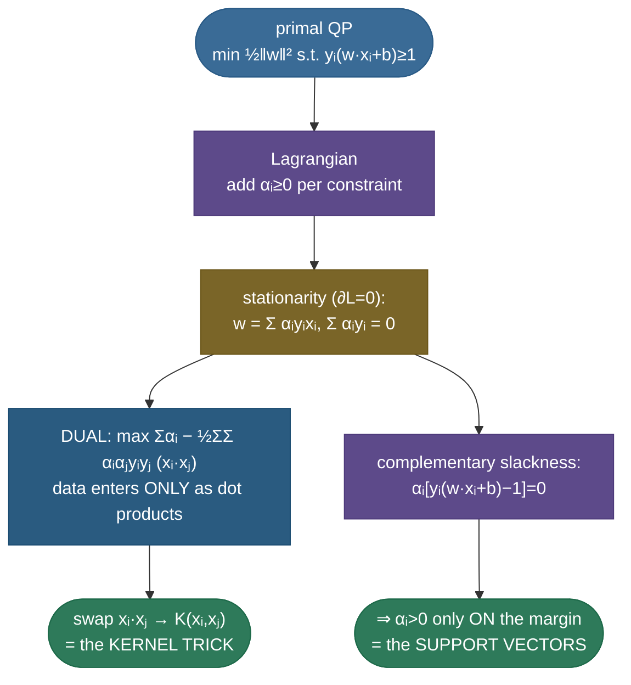
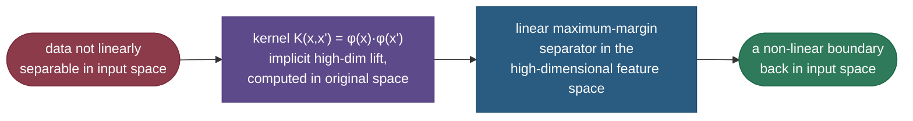
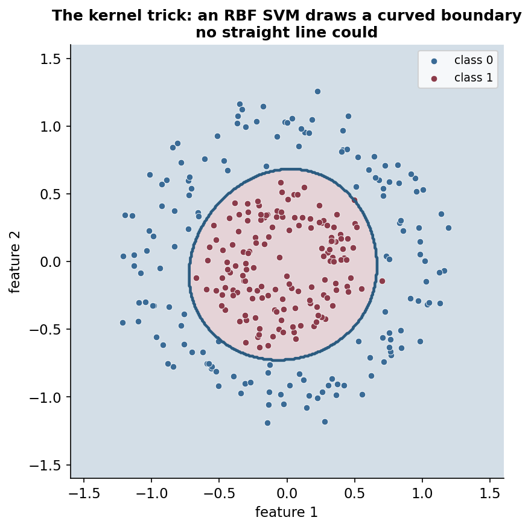

# Support vector machines: the widest street, and the kernel trick

When two classes are separable by a line, there are *infinitely many* lines that do the job — so which one should you pick? A perceptron returns whichever one it stumbled into; logistic regression returns the one that maximizes likelihood. A support vector machine answers with a principle that is both intuitive and theoretically deep: choose the boundary that leaves the **widest possible margin** — the broadest empty "street" between the classes. A boundary that barely squeaks between points is fragile; a tiny shift in the data flips a prediction. The one centered in the widest gap is the most robust to new data, and that intuition is backed by generalization theory. Remarkably, this boundary depends only on the handful of points sitting right on the edge of the street — the **support vectors** — and nothing else; delete every other point and the answer is identical. Then comes the masterstroke: the **kernel trick**, which lets the same linear max-margin machinery carve elaborately curved boundaries by *implicitly* working in a high-dimensional space, **without ever computing the high-dimensional coordinates**. SVMs were the dominant classifier of the 2000s and remain excellent on small-to-medium, high-dimensional data.

This page is the definitive treatment. We build the geometry from scratch, **derive** every result — the margin width $2/\lVert w\rVert$, the hard-margin quadratic program, the soft-margin slack formulation and its *exact* equivalence to hinge-loss + L2, the **Lagrangian dual** and the **KKT conditions** that reveal both why only support vectors matter *and* why the data appears only as dot products — then show how that last fact unlocks the kernel trick. We work **three** numeric examples of increasing complexity, contrast SVM with logistic regression, and prove every quantitative claim in runnable, verified code.

By the end you'll be able to:

- define the **margin**, derive its width $2/\lVert w\rVert$, and explain why maximizing it aids generalization;
- explain **support vectors** and *prove*, via KKT, why the boundary depends only on them;
- set up the **hard-** and **soft-margin** objectives, and **derive** the soft margin's equivalence to **hinge loss + L2**;
- derive the **Lagrangian dual**, show the data enters only as **dot products** $x_i\cdot x_j$, and explain the **kernel trick** (RBF, polynomial);
- reason about **C** and **gamma** (under/overfit), and contrast SVM with logistic regression (margin/hinge vs likelihood/log-loss; Platt scaling);
- fit linear and kernel SVMs and verify the margin, support-vector, and kernel behaviour in code.

Intuition and pictures first, then the math (every step shown, with sources), then runnable code.

> **Note:** two ideas carry the entire topic. (1) **Max-margin**: among all separating hyperplanes, pick the one with the widest buffer — it is the most robust, and it is determined by just the few boundary points. (2) **Kernels**: replace every dot product $x\cdot x'$ with a kernel $K(x,x')$ that secretly computes a dot product in a richer space, turning the linear method into a non-linear one *for free*. Everything else on this page is machinery connecting these two.

---

## The problem: which separating line?

Given two linearly separable classes, a perceptron or logistic regression will happily return *any* line that separates them — including ones that hug the data points and would misclassify a slightly-shifted new point. There is no built-in preference for a "good" separator over a "barely working" one. SVM adds exactly that selection principle: prefer the boundary that is **as far as possible from the nearest points of both classes**.

Why is that the right thing to want? Because the nearest points are where errors happen. A boundary jammed right up against a cluster has zero tolerance — move a test point a hair toward the line and it crosses. A boundary centered in a wide empty corridor can absorb a lot of noise before any point crosses it. Maximizing that clearance (the **margin**) is therefore a direct bet on robustness, and it is a **structural-risk-minimization** idea from statistical learning theory: a wider margin corresponds to a *simpler*, lower-capacity classifier (fewer hypotheses can realize a large margin on the data), and lower capacity generalizes better. The margin is a knob on the bias–variance trade-off, expressed geometrically.

> **Tip:** the one-sentence "why SVM" for an interview: *among infinitely many separators, the maximum-margin one is the most robust to perturbation and provably lower-capacity, so it generalizes best — and it is pinned down by only the closest points.* Say that and you have the whole motivation.

---

## Intuition: the widest plank you can slide between two crowds

Picture two crowds of people standing apart, and you want to lay a long straight **plank** on the floor between them so no one is touched. Many planks fit, but the *safest* one is the widest you can wedge in — laid right down the centre of the empty corridor, with equal clearance to both crowds. Push the plank toward either crowd and someone is soon brushed; keep it centred in the widest gap and a few people could shuffle around before anyone is hit. That centred, widest plank is the SVM's decision boundary, and the **margin** is the plank's width.

Two facts about the plank carry the whole topic. First, the plank is held in place by exactly the people it just barely touches on each side — the **support vectors**. Everyone standing further back could leave the room and the plank wouldn't move an inch; the boundary depends *only* on those few nearest people. Second, if the two crowds are **interleaved** so no straight plank can separate them, you can't fix it with a longer plank — but you *can* change the floor: lift the inner crowd onto a small hill (a higher-dimensional space) so that, viewed from the side, a flat plank slides cleanly between the raised inner group and the ground-level outer group. The **kernel trick** is the magic that builds that hill *implicitly* — it computes everything as if the crowds were on the hill, without ever physically raising anyone. Hold those two images — *widest centred plank, pinned by the nearest few; raise the floor to separate the inseparable* — and every equation below is just the bookkeeping.

---

## The margin and the support vectors

The SVM boundary is a hyperplane $w\cdot x + b = 0$ (in 2D, a line; in higher dimensions, a flat sheet). It is flanked by two parallel **margin** lines; the classes are pushed to opposite sides of the street between them:


The crucial fact, the source of the name, and the most-asked SVM interview point: **only the points on the margin — the support vectors — determine the boundary.** Move or delete any *other* point and the boundary doesn't budge at all; the entire model is defined by those few edge cases (in the fit above, just **2 of 80** points). We will *prove* this rigorously once we have the dual, but the geometric intuition is already clear: the widest street is wedged in place by the points it touches, exactly as the widest plank you can slide between two crowds is held by whoever it presses against — everyone standing further back is irrelevant.

> **Note:** "support vector" is literal — those points *support* (hold up) the separating street. They are the only training points with nonzero weight in the final model. This is why an SVM, after training, can throw away the vast majority of the data and reproduce its boundary exactly from the support vectors alone — it is a genuinely **sparse** model in the data.

> *Where this comes from: the maximum-margin classifier and support vectors are formalized in **Support-Vector Networks** (Cortes & Vapnik 1995); the applied build-up (maximal-margin classifier → support-vector classifier → SVM with kernels) is **ISLR** Ch. 9 — references.*

> **Note:** *why* a wide margin generalizes, in one sentence of theory: the set of hyperplanes that achieve margin $\rho$ on data of radius $R$ has **VC dimension bounded by $\min(d, \lceil R^2/\rho^2\rceil) + 1$** — so a *larger* margin $\rho$ caps the effective capacity *regardless of the ambient dimension $d$*. That is the formal reason kernel SVMs don't overfit even in infinite-dimensional feature spaces: it's the **margin**, not the dimension, that controls capacity. (Vapnik's margin bound — references.)

---

## The math: deriving the margin width

We need the width of the street in terms of $w$, because that is what we'll maximize. Start by **fixing the scale**. The hyperplane $w\cdot x + b = 0$ is unchanged if we multiply $w$ and $b$ by any positive constant, so we have one free scaling to spend. We spend it by *defining* the margin lines to be exactly

$$w\cdot x + b = +1 \quad\text{(positive margin)}, \qquad w\cdot x + b = -1 \quad\text{(negative margin)}.$$

This is the **canonical form**: the closest points of each class are forced to satisfy $w\cdot x + b = \pm 1$. Now compute the perpendicular distance between those two lines. Take a point $x_+$ on the positive line and step perpendicular to the boundary (i.e. along the unit normal $\hat w = w/\lVert w\rVert$) by an amount $m$ to land on the negative line at $x_- = x_+ - m\,\hat w$. Plug $x_-$ into the negative-line equation:

$$w\cdot\!\left(x_+ - m\tfrac{w}{\lVert w\rVert}\right) + b = -1 \;\;\Longrightarrow\;\; \underbrace{(w\cdot x_+ + b)}_{=\,+1} - m\,\frac{w\cdot w}{\lVert w\rVert} = -1.$$

Since $w\cdot w = \lVert w\rVert^2$, the middle term is $m\lVert w\rVert$, so $1 - m\lVert w\rVert = -1$, giving $m\lVert w\rVert = 2$, i.e.

$$\boxed{\;\text{margin width} \;=\; \frac{2}{\lVert w\rVert}\;}$$

That is the whole derivation: the street is $2/\lVert w\rVert$ wide. **Maximizing** the margin is therefore **minimizing** $\lVert w\rVert$ — and minimizing $\lVert w\rVert$ is equivalent to (and analytically nicer than) minimizing $\tfrac12\lVert w\rVert^2$. Subject to every point landing on the correct side of its own margin line ($y_i = +1$ points satisfy $w\cdot x_i + b \ge +1$; $y_i = -1$ points satisfy $w\cdot x_i + b \le -1$, which the labels fold into one inequality), the **hard-margin SVM** is:

$$\min_{w,\,b}\ \tfrac{1}{2}\lVert w\rVert^2 \quad\text{s.t.}\quad y_i\,(w\cdot x_i + b) \ge 1 \;\;\forall i.$$

This is a **convex quadratic program** (QP): a convex quadratic objective with linear inequality constraints. Convexity means **one global optimum**, found reliably — no local minima, unlike a neural net. (The code confirms the fitted margin is exactly $2/\lVert w\rVert = 2.64$, with the support vectors lying precisely on the $\pm 1$ lines.)

> **Note:** the factor $\tfrac12$ and the *square* are pure convenience — they make the gradient $\nabla_w(\tfrac12\lVert w\rVert^2) = w$ clean and the problem a textbook QP. They change *where* the optimum is by nothing; $\arg\min \tfrac12\lVert w\rVert^2 = \arg\min \lVert w\rVert$.

> **Gotcha:** the constraint is $y_i(w\cdot x_i + b) \ge 1$, **not** $\ge 0$. The "$\ge 1$" is what enforces the *margin* (the empty street), not merely correct classification. A perceptron is happy with $\ge 0$ (just be on the right side); the SVM demands a full unit of clearance in the canonical scaling, and *that* extra demand is the entire difference.

> *Where this comes from: the margin objective, its dual, and the KKT conditions below are derived in **CS229** lecture notes (SVMs, Ng) and **The Elements of Statistical Learning** Ch. 12 — references.*

---

## Soft margin: tolerating overlap with C, and the hinge connection

Real data isn't perfectly separable — classes overlap, and even when they don't, forcing a zero-error boundary chases noise and overfits. The **soft-margin** SVM relaxes the hard constraint with **slack variables** $\xi_i \ge 0$, one per point, that measure how far a point is *allowed* to intrude into (or across) its margin. The intrusion is penalized by a hyperparameter **C**:

$$\min_{w,\,b,\,\xi}\ \tfrac{1}{2}\lVert w\rVert^2 + C\sum_i \xi_i \quad\text{s.t.}\quad y_i(w\cdot x_i + b) \ge 1 - \xi_i,\;\; \xi_i \ge 0.$$

Read the slack: $\xi_i = 0$ means point $i$ is at or beyond its margin (fine); $0 < \xi_i < 1$ means it sits inside the street but still on the correct side; $\xi_i \ge 1$ means it has crossed the boundary and is **misclassified**. **C controls the trade-off**: large C heavily penalizes any slack → a narrow, near-hard margin that can overfit; small C tolerates slack cheaply → a wider, softer margin that may underfit. So C is a regularization dial, and — as we now derive — it is *exactly* the inverse of the usual regularization strength.

**Deriving the hinge-loss view.** At the optimum, each $\xi_i$ is pushed as small as the constraints allow (it only appears as a positive penalty, so the optimizer never makes it larger than necessary). The constraints are $\xi_i \ge 1 - y_i(w\cdot x_i + b)$ and $\xi_i \ge 0$, so the smallest feasible slack is

$$\xi_i = \max\bigl(0,\; 1 - y_i(w\cdot x_i + b)\bigr).$$

That expression *is* the **hinge loss**. Substitute it back and the constrained soft-margin QP becomes an unconstrained loss-plus-penalty objective:

$$\min_{w,\,b}\ \underbrace{\sum_i \max\bigl(0,\,1 - y_i(w\cdot x_i + b)\bigr)}_{\text{total hinge loss}} \;+\; \underbrace{\frac{1}{2C}\lVert w\rVert^2}_{\text{L2 penalty}}.$$

(Divide the whole soft-margin objective by $C$ to move the $\tfrac12\lVert w\rVert^2$ term's coefficient to $\tfrac1{2C}$; the $\arg\min$ is unchanged.) So **soft-margin SVM = hinge loss + L2 regularization**, and **C is an inverse-regularization knob**: large C → tiny $\tfrac1{2C}$ → weak regularization → tight fit; small C → large $\tfrac1{2C}$ → strong regularization → smooth fit (see [Regularization](../03-Regularization-Linear-Models/03-Regularization-Linear-Models.md)). This is one of the most illuminating facts in classical ML — the geometric "widest street" story and the statistical "minimize a robust loss with a penalty" story are *the same optimization* viewed from two angles.

> **Note:** the hinge $\max(0, 1 - y\cdot\text{score})$ is **flat at zero** once a point is correctly classified *with a full margin* (score $\ge 1$ for a positive). Points comfortably inside their class contribute **zero loss and zero gradient** — they don't pull on the boundary at all. *That* is the loss-function reason only boundary points matter: the hinge literally ignores everything past the margin. Logistic regression's log-loss, by contrast, is never exactly zero, so every point keeps a small pull — the precise distinction in the SVM-vs-logistic section below.

> **Gotcha:** "hard margin" is just "soft margin with $C \to \infty$" — an infinite penalty forbids any slack, recovering the original constraint $y_i(w\cdot x_i+b)\ge 1$. So in practice you **always** fit a soft-margin SVM and tune C; the hard margin is the limiting special case, and it is unusable on any real (non-separable) data because it has no feasible solution.

> *Where this comes from: soft-margin SVMs with slack variables are the core contribution of **Support-Vector Networks** (Cortes & Vapnik 1995); the loss-plus-penalty (hinge + L2) reformulation is **ESL** §12.3.2 — references.*

---

## The Lagrangian dual and KKT: where support vectors and dot products appear

This is the deepest part of the topic, and the one that unlocks kernels — so we derive it. The constrained QP can be attacked through its **Lagrangian dual**. Introduce a multiplier $\alpha_i \ge 0$ for each margin constraint (we use the hard-margin form for clarity; the soft-margin version is identical with an upper bound $\alpha_i \le C$):

$$\mathcal{L}(w, b, \alpha) = \tfrac12\lVert w\rVert^2 - \sum_i \alpha_i\bigl[y_i(w\cdot x_i + b) - 1\bigr].$$

To find the dual, minimize over the primal variables $w, b$ by setting the gradients to zero (the **stationarity** KKT conditions):

$$\nabla_w \mathcal{L} = w - \sum_i \alpha_i y_i x_i = 0 \;\Longrightarrow\; \boxed{\,w = \sum_i \alpha_i y_i x_i\,}, \qquad \frac{\partial\mathcal{L}}{\partial b} = -\sum_i \alpha_i y_i = 0 \;\Longrightarrow\; \sum_i \alpha_i y_i = 0.$$

The first equation is already remarkable: the optimal weight vector is a **linear combination of the training points**, weighted by $\alpha_i y_i$. Substitute both back into $\mathcal{L}$ (the algebra collapses $\tfrac12\lVert w\rVert^2$ and the linear term into a single double sum) to get the **dual problem**:

$$\max_{\alpha}\ \sum_i \alpha_i - \tfrac12\sum_i\sum_j \alpha_i \alpha_j\, y_i y_j\,\underbrace{(x_i\cdot x_j)}_{\textbf{dot product!}} \quad\text{s.t.}\quad \alpha_i \ge 0,\;\; \sum_i \alpha_i y_i = 0.$$

Two profound consequences fall out, and they are *the* reasons the rest of the field exists:

**1. The data appears only as dot products $x_i\cdot x_j$.** Nowhere in the dual objective (nor in the prediction $w\cdot x + b = \sum_i \alpha_i y_i (x_i\cdot x) + b$, after substituting $w$) do the raw coordinates appear — only **inner products between pairs of points**. This is the door the kernel trick walks through: replace every $x_i\cdot x_j$ with a kernel and you change spaces without touching the algorithm.

**2. Only support vectors have nonzero $\alpha_i$.** The **complementary-slackness** KKT condition says $\alpha_i\bigl[y_i(w\cdot x_i + b) - 1\bigr] = 0$ for every $i$. So for each point, *either* $\alpha_i = 0$ *or* the constraint is tight ($y_i(w\cdot x_i + b) = 1$, the point sits exactly on its margin). A point strictly outside the margin has $y_i(w\cdot x_i+b) > 1$, forcing $\alpha_i = 0$ — it contributes **nothing** to $w = \sum_i \alpha_i y_i x_i$. Only the points *on* the margin can have $\alpha_i > 0$. Those are precisely the **support vectors**, and we have now *proved* the earlier claim: the boundary is built from the support vectors alone, because everyone else carries weight zero.



> **Note:** the dual is also *why* SVMs train well in **high dimensions but limited samples** (text, genomics). The dual has one variable $\alpha_i$ **per data point**, not per feature — so a problem with 20,000 features and 500 samples is a 500-variable QP, indifferent to the feature count. Combined with the kernel trick (which never materializes the high-dimensional features), this is what lets SVMs operate in infinite-dimensional spaces on a laptop.

> *Where this comes from: the dual derivation, the KKT conditions, and the dot-product observation are worked through in full in **CS229** SVM notes (Ng) and **ESL** §12.2 — references.*

---

## The kernel trick: non-linear boundaries for free

Now the payoff. The dual showed the data enters **only** through dot products $x_i\cdot x_j$. Suppose your data isn't linearly separable in its native space, but *would* be if you first mapped it through some feature map $\phi$ into a higher-dimensional space — e.g. lifting 2D points onto a paraboloid so a flat plane can slice the inner cluster from the outer ring. To run an SVM there you'd need the dot products $\phi(x_i)\cdot\phi(x_j)$ — but, crucially, **you'd never need $\phi(x_i)$ itself**, only those inner products. A **kernel** is a function that computes them directly, in the *original* space, without ever building the high-dimensional vectors:

$$K(x, x') = \phi(x)\cdot\phi(x').$$

Replace every $x_i\cdot x_j$ in the dual (and in the prediction) with $K(x_i, x_j)$ and the *exact same* linear max-margin algorithm now finds a linear separator in $\phi$-space — which, mapped back, is a **curved** boundary in the original space. You get all the power of a high-dimensional (even infinite-dimensional) feature expansion for the cost of evaluating a simple kernel function.



The two workhorse kernels:

- **Polynomial** — $K(x,x') = (x\cdot x' + c)^d$. Corresponds to a feature map of all monomials up to degree $d$ (with $c$ trading off lower- vs higher-order terms). A degree-2 polynomial kernel on 2D inputs implicitly works in the space $\{1, x_1, x_2, x_1^2, x_2^2, x_1 x_2\}$ — you can *see* the lift, and it's finite-dimensional.
- **RBF (Gaussian)** — $K(x,x') = \exp(-\gamma\lVert x - x'\rVert^2)$. This is the default, and its $\phi$ is **infinite-dimensional** (a Taylor expansion of the exponential yields all polynomial degrees at once), yet $K$ is a one-line computation. It behaves like a **similarity** measure: $K \to 1$ for nearby points, $K \to 0$ for distant ones, with $\gamma$ setting how fast that falls off.

The result is a curved boundary a straight line could never draw:



The code makes the point quantitatively: a **linear** SVM on concentric circles scores ~58% (barely better than chance — no line can separate a disk from a ring), while the **RBF** SVM scores 99% — the *same algorithm*, just with the dot product swapped for a kernel.

> **Note:** what makes a function a valid kernel? It must be expressible as some $\phi(x)\cdot\phi(x')$, which (by **Mercer's theorem**) is exactly the condition that the kernel matrix $K_{ij} = K(x_i,x_j)$ is **symmetric positive semi-definite** for every dataset. You don't have to find $\phi$ — Mercer guarantees one exists. RBF, polynomial, and linear all satisfy this; you can even *build* new kernels (sums, products, and positive scalings of valid kernels are valid), which is the basis of kernel engineering for structured data (string kernels, graph kernels).

> **Gotcha:** the kernel trick is **not** "add polynomial features then fit a linear SVM." That would explicitly materialize the high-dimensional vectors (impossible for the infinite-dimensional RBF) and pay the full dimensional cost. The trick's whole point is to get the inner products $\phi(x_i)\cdot\phi(x_j)$ *without* ever forming $\phi(x)$ — which is why it scales to infinite-dimensional feature spaces that explicit expansion never could.

> *Where this comes from: the kernel trick, Mercer's condition, and the common kernels are covered in **ISLR** Ch. 9 and **ESL** §12.3; the original kernel-SVM construction is Cortes & Vapnik (1995) — references.*

**Seeing the implicit feature map.** The phrase "computes a dot product in a higher-dimensional space without going there" sounds like magic until you write out one example. Take the degree-2 polynomial kernel with $c = 0$ on 2D inputs, $K(x, x') = (x\cdot x')^2$, and expand it with $x = (x_1, x_2)$, $x' = (x_1', x_2')$:

$$K(x, x') = (x_1 x_1' + x_2 x_2')^2 = x_1^2 x_1'^2 + 2 x_1 x_2 x_1' x_2' + x_2^2 x_2'^2.$$

Now group those three terms as a dot product of two *new* vectors:

$$= \underbrace{(x_1^2,\ \sqrt{2}\,x_1 x_2,\ x_2^2)}_{\phi(x)} \cdot \underbrace{(x_1'^2,\ \sqrt{2}\,x_1' x_2',\ x_2'^2)}_{\phi(x')}.$$

So $K(x,x') = (x\cdot x')^2$ is **exactly** the ordinary dot product of $\phi(x) = (x_1^2, \sqrt{2}\,x_1 x_2, x_2^2)$ — a map into a 3D space of quadratic features. The kernel let us compute that 3D inner product by squaring a single 2D dot product — never building $\phi$. This is the whole trick made concrete: a curved (quadratic) boundary in the original 2D space *is* a flat (linear) boundary in this 3D feature space, and we reach it for the price of one scalar squaring. The RBF kernel is the same idea with an *infinite*-dimensional $\phi$ — which is precisely why you could never expand it explicitly, and why the trick is indispensable rather than merely convenient.

> **Tip:** the classic 1D picture to keep in your head: points $\{-2, -1, 1, 2\}$ on a line with the inner pair one class and the outer pair another are **not** linearly separable in 1D — no single threshold works. Lift each $x$ to $(x, x^2)$ and they fall onto a parabola where a *horizontal line* cleanly separates inner (low $x^2$) from outer (high $x^2$). That lift is a feature map; a kernel is the shortcut that computes inner products in such a lifted space without ever plotting the parabola.

**What a trained kernel SVM actually computes.** Substituting $w = \sum_i \alpha_i y_i \phi(x_i)$ into the prediction $\text{sign}(w\cdot\phi(x) + b)$ and applying the kernel gives the inference formula:

$$\hat y(x) = \text{sign}\Bigl(\sum_{i \in \text{SV}} \alpha_i\, y_i\, K(x_i, x) + b\Bigr).$$

Read it as a **weighted nearest-neighbour vote among the support vectors**: each support vector $x_i$ casts a vote for its own label $y_i$, weighted by its importance $\alpha_i$ and its kernel similarity $K(x_i, x)$ to the query. For the RBF kernel — where $K$ falls off with distance — this is almost literally "which support vectors is $x$ closest to, and what are their labels?" The sum runs **only over support vectors** (everyone else has $\alpha_i = 0$), so prediction cost scales with the number of support vectors, not the full training set — another payoff of the model's sparsity. This is also why a fitted `SVC` stores `support_vectors_` and `dual_coef_` (the $\alpha_i y_i$): they are literally all it needs to predict.

> **Gotcha:** because inference cost is proportional to the **number of support vectors**, an SVM that ends up with *most* of the training set as support vectors (a sign of too-small C or too-large gamma) is not only likely overfit — it's also **slow at prediction time**. The support-vector count is a joint diagnostic for both generalization *and* serving cost.

---

## Tuning C and gamma

For an RBF SVM the two key knobs interact, and together they trace the entire bias–variance trade-off:

- **C** (inverse regularization) — high C → penalize every slack heavily → fit training points tightly, narrow margin (risk **overfit**); low C → tolerate slack → smoother, wider, more forgiving boundary (risk **underfit**).
- **gamma** (RBF width, $\gamma$) — high gamma → each point's influence is very **local** (the Gaussian bump is narrow) → the boundary wiggles tightly around individual points (**overfit**); low gamma → broad influence → smooth, near-linear boundary (**underfit**).

The cleanest way to *see* this is to sweep both on one dataset and read the measured numbers off each fit:

![A 2x2 grid of RBF-SVM fits on the same two-moons data, sweeping C and gamma. Top-left (low C, low gamma) is a smooth, near-linear boundary that underfits (train accuracy 0.86, 133 of 220 points are support vectors). Top-right (moderate C and gamma) is a clean curved boundary that follows the two moons (0.94, 66 SVs). Bottom-left (high C) tightens the fit (0.95, 38 SVs). Bottom-right (high C, high gamma) overfits into isolated wiggly islands around individual points, memorizing the training set (1.00 train accuracy, 130 SVs).](../images/svm_C_gamma.png)

The grid is fully measured. Notice the story the numbers tell: **low C / low gamma** underfits (train accuracy 0.86) with a smooth boundary supported by *many* points (133 of 220 are support vectors — the soft margin is wide, so lots of points sit inside it). Crank **C and gamma high** and train accuracy hits a perfect 1.00 — but the boundary has fractured into little islands hugging individual points, the signature of memorizing noise. The sweet spot is the middle: a curved boundary that follows the true two-moon shape. You find it by **cross-validated grid search** over $(C, \gamma)$; **high C *and* high gamma together** is the classic overfitting corner to avoid.

> **Tip:** sklearn's default `gamma="scale"` sets $\gamma = 1/(n_{\text{features}}\cdot \text{Var}(X))$, which adapts to feature spread — a sane starting point. Always grid-search around it on a **log scale** (e.g. $C, \gamma \in \{10^{-2}, 10^{-1}, 1, 10, 10^2\}$), because both knobs act multiplicatively.

> **See it visually:** scikit-learn's [RBF SVM parameters](https://scikit-learn.org/stable/auto_examples/svm/plot_rbf_parameters.html) sweeps C and gamma across a finer grid, showing the boundary go from too-smooth (underfit) to too-wiggly (overfit) — the canonical picture of what these two knobs do.

> **Gotcha:** SVMs are **distance-based** — both the margin ($\lVert w\rVert$) and the RBF kernel ($\lVert x - x'\rVert$) depend on raw distances — so **feature scaling is mandatory**. An unscaled large-range feature (say income in dollars next to age in years) dominates every distance and the margin, and the model effectively ignores the small-range features. **Always standardize** (zero mean, unit variance) before an SVM. This is unlike decision trees, which are scale-invariant and don't care.

---

## SVM vs logistic regression

Both are linear classifiers (before kernels) drawing a hyperplane $w\cdot x + b = 0$, but they optimize different objectives, and the difference is instructive:

| | SVM | Logistic regression |
|---|---|---|
| **Objective** | maximize margin = minimize hinge + L2 | maximize likelihood = minimize log-loss |
| **Which points matter** | only **support vectors** (near the boundary) | **every** point pulls (log-loss never zero) |
| **Loss past the margin** | exactly **zero** (flat hinge) | small but nonzero, forever |
| **Native probabilities** | **no** (Platt scaling bolts them on) | **yes**, calibrated $\sigma(w\cdot x+b)$ |
| **Non-linear** | the kernel trick (RBF, poly) | explicit feature engineering |
| **Scales to huge data** | poorly ($O(n^2$–$n^3)$ training) | well (SGD on log-loss) |

The mechanistic distinction is the **loss shape**. Hinge loss is **flat at zero** for any point correctly classified beyond its margin, so those points exert *no* force — the boundary is determined entirely by the points near it (the support vectors). Log-loss is **always positive and decreasing**, so even a point far on the correct side keeps a small pull toward being even *more* confidently classified — every point votes. That is why logistic regression's boundary shifts (slightly) when you add a distant correctly-classified point and the SVM's does not.

Practically: SVM (with RBF) shines on **small/medium, high-dimensional** data with clear margins; logistic regression is faster, scales to huge datasets, and — the big one — outputs **calibrated probabilities** natively. SVMs produce only a signed *distance* (the decision function), not a probability; to get $P(y\mid x)$ you must fit **Platt scaling** (a logistic regression on the SVM's scores) or isotonic regression as a post-hoc calibration step.

> **Tip:** the gold interview line — "SVM and logistic regression are both linear classifiers, but the SVM minimizes **hinge loss + L2** (so only the *support vectors* near the boundary matter, and it has no native probabilities — you bolt on **Platt scaling**), while logistic regression minimizes **log-loss** (every point contributes, and it outputs **calibrated probabilities**). For small/medium high-dimensional data with a clear margin, especially non-linear via the RBF kernel, I reach for the SVM; for huge data or when I need probabilities, logistic regression." Saying *why* (the flat hinge vs the always-positive log-loss) signals real understanding.

---

## Probabilities: SVMs don't have them, and Platt scaling

A subtle but interview-relevant gap: the SVM's natural output is the **signed distance to the boundary**, $f(x) = w\cdot x + b$ (in kernel form, $\sum_i \alpha_i y_i K(x_i, x) + b$). That number tells you the *side* and a rough *confidence by distance*, but it is **not a probability** — it isn't bounded to $[0,1]$ and isn't calibrated to a true frequency. The whole training objective (max margin / hinge) never asked for probabilities, so it doesn't produce them.

**Platt scaling** retrofits them: fit a one-dimensional **logistic regression on the SVM's scores**, learning two parameters $A, B$ so that

$$P(y = 1 \mid x) = \frac{1}{1 + \exp\bigl(A\,f(x) + B\bigr)}.$$

This is what scikit-learn's `SVC(probability=True)` does under the hood (with internal cross-validation to avoid overfitting the scores). It is genuinely useful — but it has costs worth knowing.

> **Gotcha:** `probability=True` is **not free and not always consistent**. It runs an internal 5-fold cross-validation to fit the Platt parameters, so training is markedly slower; and because the probability model is fit separately, `predict_proba`'s argmax can **occasionally disagree** with `predict` (which uses the raw decision function). If you only need the *label*, leave `probability=False` and use `decision_function`. Turn on probabilities only when you actually need calibrated $P(y\mid x)$ — and validate the calibration (a reliability diagram) rather than trusting it blindly.

> **Tip:** an alternative to Platt scaling is **isotonic regression** (a non-parametric, monotonic fit), available via `CalibratedClassifierCV`. Isotonic is more flexible (no sigmoid-shape assumption) but needs more data to avoid overfitting; Platt's two-parameter sigmoid is the safer default on small datasets — exactly the regime where SVMs live.

---

## Multiclass SVM: one-vs-rest and one-vs-one

The whole derivation above is **binary** — the margin, the labels $y_i \in \{-1, +1\}$, the single hyperplane. SVMs have no native multiclass formulation, so $K$-class problems are reduced to a set of binary problems, and which reduction you use changes the cost:

- **One-vs-rest (OvR)** — train **$K$** classifiers, each separating one class from all the others; predict the class whose decision function is largest. Cheap ($K$ models), but each model trains on the *full* dataset, and the "rest" side is often imbalanced.
- **One-vs-one (OvO)** — train **$\binom{K}{2} = K(K{-}1)/2$** classifiers, one per *pair* of classes; predict by majority vote across all pairwise duels. More models, but each trains on only the two classes' data (smaller, balanced problems) — and since kernel-SVM training is **super-linear** in sample count, many small fits can be *faster* than $K$ full-dataset fits.

> **Note:** scikit-learn's `SVC` uses **one-vs-one** by default (it suits the super-linear kernel-SVM training cost), while `LinearSVC` uses **one-vs-rest**. For 10 classes that's $\binom{10}{2}=45$ pairwise models vs 10 OvR models — a real difference in model count and behaviour to be aware of when you read the `decision_function` shape.

---

## Worked example 1 (minimal): the margin width from w

A linear SVM has learned $w = [0.5,\, 0.5]$ and $b = -2$. The margin width is

$$\frac{2}{\lVert w\rVert} = \frac{2}{\sqrt{0.5^2 + 0.5^2}} = \frac{2}{\sqrt{0.5}} = \frac{2}{0.707} = \mathbf{2.828}.$$

So the street is 2.828 units wide. The decision boundary is the line $0.5x_1 + 0.5x_2 - 2 = 0$, i.e. $x_1 + x_2 = 4$. A test point $x = [3, 3]$ has score $w\cdot x + b = 0.5(3) + 0.5(3) - 2 = +1.0$ — it sits **exactly on the positive margin line** ($+1$), so it is a candidate **support vector**. A point with score $+3$ is well inside its class (far from the street — *not* a support vector, zero $\alpha$); a point with score $-0.2$ is on the wrong side of the boundary (misclassified, a margin violator with slack $\xi > 1$). This is the geometry of $2/\lVert w\rVert$ made concrete; the next example adds the *loss* a violator incurs.

---

## Worked example 2 (realistic): the hinge loss of a point

Same model, $w = [0.5, 0.5]$, $b = -2$. The hinge loss of a labeled point is $\max\!\bigl(0,\, 1 - y\,(w\cdot x + b)\bigr)$ — let's compute it across three cases to feel the kink:

- **Point on its margin:** $x = [3,3]$, true label $y = +1$. Score $= +1.0$, so margin term $y\cdot\text{score} = +1.0$, and hinge $= \max(0,\, 1 - 1.0) = \mathbf{0}$. A point exactly on (or beyond) its correct margin incurs **no loss** — it is at the hinge's elbow.
- **Misclassified point:** $x = [1,1]$, true label $y = +1$. Score $= 0.5 + 0.5 - 2 = -1.0$, so $y\cdot\text{score} = -1.0$, and hinge $= \max(0,\, 1 - (-1.0)) = \mathbf{2.0}$. It is on the wrong side *and* past the margin, so it pays a large, linearly-growing penalty (and would have slack $\xi = 2.0 > 1$).
- **Margin-interior but correct:** suppose a point scores $+0.4$ with $y = +1$. Then $y\cdot\text{score} = 0.4$ and hinge $= \max(0,\, 1 - 0.4) = \mathbf{0.6}$ — correctly classified, but it intruded into the street, so it pays a *partial* penalty ($0 < \xi < 1$).

The pattern is the whole soft margin in three numbers: **0 once you clear the margin, growing linearly as you intrude and cross it.** Summing this over all points (plus the $\tfrac1{2C}\lVert w\rVert^2$ penalty) *is* the soft-margin objective the optimizer minimizes.

---

## Worked example 3 (full): an RBF kernel value by hand

Now the kernel itself. The RBF kernel is $K(x, x') = \exp(-\gamma\lVert x - x'\rVert^2)$. Take $a = [1, 2]$, $b = [2, 0]$, and $\gamma = 0.5$. First the squared distance:

$$\lVert a - b\rVert^2 = (1-2)^2 + (2-0)^2 = 1 + 4 = 5.$$

Then the kernel:

$$K(a, b) = \exp(-0.5 \times 5) = e^{-2.5} = \mathbf{0.0821}.$$

Interpret it as a **similarity**: these two points are moderately far apart, so their similarity is a smallish 0.082 (on a scale where 1 is identical). Sanity checks that build intuition for what $\gamma$ does: a point with **itself**, $K(a,a) = \exp(-\gamma\cdot 0) = e^0 = \mathbf{1}$ — maximal similarity, always. A **far** pair with $\lVert a - b\rVert^2 = 20$ gives $K = e^{-0.5\cdot 20} = e^{-10} \approx \mathbf{0.0000454}$ — essentially zero; distant points barely "see" each other. **Raising $\gamma$ shrinks the reach**: at $\gamma = 2$, our original pair's kernel drops to $e^{-2\cdot 5} = e^{-10} \approx 0.0000454$ — the same near-zero, meaning higher $\gamma$ makes even the moderately-close pair look dissimilar, which is exactly why high $\gamma$ produces those tight, wiggly, overfit boundaries from the C/gamma grid: each point's influence collapses to its immediate neighborhood. The prediction $\sum_i \alpha_i y_i K(x_i, x) + b$ is just a weighted vote of the support vectors by how *similar* (per this kernel) the query is to each — and all three worked examples are reproduced exactly in the code below.

---

## Worked example 4 (full solve): a hyperplane by hand, end to end

Let's solve a complete tiny SVM by reasoning, then confirm it in code. Four points: positives at $(3, 1)$ and $(3, -1)$, negatives at $(1, 0)$ and $(0, 0)$. By symmetry about the $x_2$-axis, the optimal boundary must be **vertical** ($w$ points purely along $x_1$, so $w = (w_1, 0)$ and the boundary is $x_1 = $ const). The two classes are closest at $x_1 = 1$ (negative) and $x_1 = 3$ (positives), so the widest street sits **midway**, at $x_1 = 2$, with margin lines at $x_1 = 1$ and $x_1 = 3$.

Now pin the scale with the canonical condition $w\cdot x + b = \pm 1$ on those margin lines. With $w = (w_1, 0)$ and boundary $x_1 = 2$ we have $b = -2 w_1$, and the positive margin line $x_1 = 3$ must give $+1$:

$$w_1 \cdot 3 + b = w_1\cdot 3 - 2w_1 = w_1 = +1 \;\Longrightarrow\; w_1 = 1,\ b = -2.$$

So $w = (1, 0)$, $b = -2$, and the **margin width** is $2/\lVert w\rVert = 2/1 = \mathbf{2}$. Check the scores: $(3, \pm1)\to 3 - 2 = +1$ (on the positive margin), $(1,0)\to 1 - 2 = -1$ (on the negative margin), $(0,0)\to 0 - 2 = -2$ (correct, *outside* the margin — **not** a support vector, $\alpha = 0$). Three of the four points are support vectors; the origin carries zero weight, exactly as the KKT analysis predicts. The code below confirms $w \approx (1, 0)$, $b \approx -2$, margin $\approx 2$, and scores $\{+1, +1, -1, -2\}$ — a full SVM, solved by hand and verified.

---

## Code: margin, support vectors, the kernel trick (all verified)

```python
"""SVM: margin = 2/||w||, support vectors on the margin, the kernel trick,
and the four worked examples by hand. Verified on Python 3.12 (sklearn), CPU."""
import numpy as np
from sklearn.svm import SVC
from sklearn.datasets import make_blobs, make_circles

# --- margin and support vectors on a separable blob ---
X, y = make_blobs(n_samples=80, centers=2, cluster_std=1.05, random_state=6)
clf = SVC(kernel="linear", C=10).fit(X, y)
print(f"linear SVM: margin = 2/||w|| = {2/np.linalg.norm(clf.coef_):.3f}   "
      f"#support vectors = {len(clf.support_)} of {len(X)}")
print(f"support vectors lie on the margin? |decision_function| ~ 1: "
      f"{np.abs(clf.decision_function(clf.support_vectors_)).mean():.3f}")

# --- the kernel trick: concentric circles are NOT linearly separable ---
Xc, yc = make_circles(n_samples=300, factor=0.4, noise=0.12, random_state=0)
print("\nconcentric circles:")
print(f"  linear SVM accuracy = {SVC(kernel='linear', C=10).fit(Xc, yc).score(Xc, yc):.3f}  <- can't")
print(f"  RBF    SVM accuracy = {SVC(kernel='rbf', C=10, gamma=1).fit(Xc, yc).score(Xc, yc):.3f}  <- kernel lifts it")

# --- the three worked examples, by hand ---
w = np.array([0.5, 0.5]); b = -2.0
print(f"\nEx1 margin width 2/||w|| = {2/np.linalg.norm(w):.3f}")
hinge = lambda x, yt: max(0.0, 1 - yt * (w @ np.array(x) + b))
print(f"Ex2 hinge: on-margin x=[3,3] (y=+1) -> {hinge([3,3], 1):.1f}   "
      f"misclassified x=[1,1] (y=+1) -> {hinge([1,1], 1):.1f}")
rbf = lambda a, c, g: np.exp(-g * np.sum((np.array(a) - np.array(c))**2))
print(f"Ex3 RBF K([1,2],[2,0]; g=0.5) = {rbf([1,2],[2,0],0.5):.4f}   "
      f"K(a,a) = {rbf([1,2],[1,2],0.5):.4f}")

# --- Ex4: the full by-hand solve, confirmed ---
X4 = np.array([[3., 1.], [3., -1.], [1., 0.], [0., 0.]]); y4 = np.array([1, 1, -1, -1])
c4 = SVC(kernel="linear", C=1e6).fit(X4, y4)          # near-hard margin
print(f"Ex4 solve: w = {np.round(c4.coef_[0], 2) + 0.0}  b = {c4.intercept_[0]:.2f}  "
      f"margin = {2/np.linalg.norm(c4.coef_):.2f}  scores = {np.round(c4.decision_function(X4), 2)}")
```

Output:

```
linear SVM: margin = 2/||w|| = 2.640   #support vectors = 2 of 80
support vectors lie on the margin? |decision_function| ~ 1: 1.000

concentric circles:
  linear SVM accuracy = 0.580  <- can't
  RBF    SVM accuracy = 0.993  <- kernel lifts it

Ex1 margin width 2/||w|| = 2.828
Ex2 hinge: on-margin x=[3,3] (y=+1) -> 0.0   misclassified x=[1,1] (y=+1) -> 2.0
Ex3 RBF K([1,2],[2,0]; g=0.5) = 0.0821   K(a,a) = 1.0000
Ex4 solve: w = [1. 0.]  b = -2.00  margin = 2.00  scores = [ 1.  1. -1. -2.]
```

> **Note:** every claim, verified. The fitted margin is exactly $2/\lVert w\rVert = 2.640$, and the boundary rests on just **2 support vectors** out of 80 — delete the other 78 and nothing changes. Those 2 sit precisely on the $\pm 1$ margin (mean $|$score$| = 1.000$, the complementary-slackness condition made numerical). The kernel trick is decisive: a linear SVM is helpless on concentric circles (58%, ~chance) while the *same algorithm* with an RBF kernel nails it (99%). The four hand examples reproduce exactly: margin 2.828; hinge 0.0 / 2.0; $K = 0.0821$ with the self-kernel pinned at 1; and the full by-hand solve lands precisely on $w = (1, 0)$, $b = -2$, margin 2, with scores $\{+1, +1, -1, -2\}$ — the origin's score of $-2$ confirming it sits outside the margin as a non-support-vector.

---

## Where SVMs are used

- **Small/medium, high-dimensional data** — text classification, bioinformatics (gene-expression microarrays), where features ≫ samples and the dual's "one variable per *point*" makes the feature count almost free.
- **Clear-margin problems** — image classification (pre-deep-learning), handwriting (the famous MNIST results), face detection — anywhere a crisp separating gap exists.
- **A strong non-linear classifier without a neural net** — an RBF SVM is a powerful, low-tuning off-the-shelf model when you have hundreds-to-thousands of samples, not millions.
- **Novelty / outlier detection** — the one-class SVM learns a boundary around the "normal" data and flags points outside it.

> **Tip:** SVMs were *the* classifier before deep learning and remain an excellent default on tabular / high-dimensional data with limited samples — but they **scale poorly** (training is roughly $O(n^2)$ to $O(n^3)$ in samples, because the kernel matrix is $n\times n$) and don't give probabilities natively. For very large data, reach for **linear SVM via SGD** (`SGDClassifier(loss="hinge")`, which scales linearly) or **gradient boosting**; when you need calibrated probabilities, logistic regression or a calibrated classifier. The kernel SVM's sweet spot is the small-data, high-dimensional, clear-margin corner.

---

## Pitfalls that actually bite

- **Forgetting to scale features** → the single most common SVM bug. Distances (the margin, the RBF kernel) are dominated by the largest-range feature, so the model silently ignores the rest. Always wrap the SVM in a `Pipeline` with `StandardScaler` — and fit the scaler on **train only** to avoid leakage.
- **High C *and* high gamma together** → memorized, wiggly boundary (the bottom-right panel of the grid: 100% train accuracy, terrible test accuracy). Tune the two **jointly** by cross-validation, on a log scale; never push both high.
- **Reaching for a kernel SVM on huge data** → the $n\times n$ kernel matrix and $O(n^2$–$n^3)$ training make it intractable past ~$10^4$–$10^5$ samples. Switch to a **linear SVM** (`LinearSVC` / `SGDClassifier(loss="hinge")`) or another model; don't wait for it to never finish.
- **Trusting `decision_function` as a probability** → it's a signed distance, not a probability. If you need $P(y\mid x)$, use Platt scaling (`probability=True`) or `CalibratedClassifierCV` — and **validate the calibration**.
- **Class imbalance** → the margin objective can be dominated by the majority class. Use `class_weight="balanced"` (it scales C per class inversely to frequency) so the minority class isn't trampled.
- **Reading too much into support-vector count** → a *very high* fraction of points being support vectors is a smell: it usually means C is too small or gamma too high (an over-soft or over-local fit). It's a useful diagnostic, not just a curiosity.

---

## Recap and rapid-fire

**If you remember nothing else:** an SVM finds the **maximum-margin** separating hyperplane — the widest street between the classes, of width $2/\lVert w\rVert$ — so maximizing the margin is **minimizing $\lVert w\rVert$**, a convex QP with one global optimum. The boundary depends only on the points on the margin (**support vectors**), which the **KKT** complementary-slackness condition proves carry all the weight ($\alpha_i > 0$). The **soft margin** (hyperparameter **C**) tolerates violations and is **exactly hinge loss + L2** (C is inverse regularization). In the **dual**, the data appears only as dot products $x_i\cdot x_j$, so the **kernel trick** — swap $x_i\cdot x_j \to K(x_i,x_j) = \phi(x_i)\cdot\phi(x_j)$ (RBF, polynomial) — draws non-linear boundaries by implicitly working in a high-dimensional space, **without ever computing the features**.

**Quick-fire — say these out loud:**

- *What does an SVM maximize?* The margin — the distance from the boundary to the nearest points of each class.
- *Why maximize the margin?* A wider buffer is more robust and lower-capacity (SRM) → better generalization.
- *Margin width?* $2/\lVert w\rVert$ — derived from the canonical scaling $w\cdot x + b = \pm 1$ — so maximizing margin = minimizing $\lVert w\rVert$.
- *The hard-margin objective?* $\min \tfrac12\lVert w\rVert^2$ s.t. $y_i(w\cdot x_i + b)\ge 1$ — a convex QP, one global optimum.
- *What are support vectors?* The points on the margin; by KKT only they have $\alpha_i > 0$, so the boundary depends only on them.
- *What does C do?* Trades margin width against violations (soft margin); it's inverse regularization (high C → tight fit / overfit).
- *Soft margin = ?* Hinge loss + L2: $\sum\max(0, 1 - y_i(w\cdot x_i+b)) + \tfrac1{2C}\lVert w\rVert^2$ (derived from the slack variables).
- *Why does only the boundary matter?* The hinge is flat (zero) past the margin — distant correct points have zero loss and zero gradient.
- *What's special about the dual?* Data appears only as dot products $x_i\cdot x_j$; one variable per point (not per feature).
- *What is the kernel trick?* Replace $x_i\cdot x_j$ with $K(x,x') = \phi(x)\cdot\phi(x')$ for non-linear boundaries without the explicit high-dim map.
- *Common kernels?* RBF/Gaussian $\exp(-\gamma\lVert x-x'\rVert^2)$ (infinite-dim, most used), polynomial $(x\cdot x'+c)^d$, linear.
- *What does gamma do (RBF)?* Sets each point's reach; high gamma → local, wiggly (overfit); low → broad, smooth (underfit).
- *SVM vs logistic regression?* SVM maximizes margin (hinge, no native probabilities → Platt scaling); logistic maximizes likelihood (log-loss, calibrated probabilities).
- *How does an SVM give probabilities?* It doesn't natively — fit **Platt scaling** (a logistic regression on the decision-function scores), e.g. `probability=True`.
- *How does SVM do multiclass?* Reduce to binary: **one-vs-one** ($\binom{K}{2}$ models, sklearn's `SVC` default) or **one-vs-rest** ($K$ models, `LinearSVC`).
- *Need to scale features?* Yes — SVMs are distance-based; always standardize.

---

## References and further reading

The curated link library for this topic — videos, courses, interactive/visual resources, articles, papers, books, and internal cross-links — lives in a companion file so it can be reused as a standalone reference list:

**→ [Support Vector Machines — references and further reading](06-Support-Vector-Machines.references.md)**
