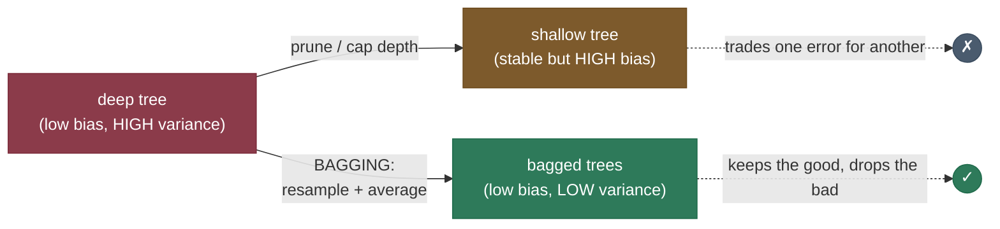
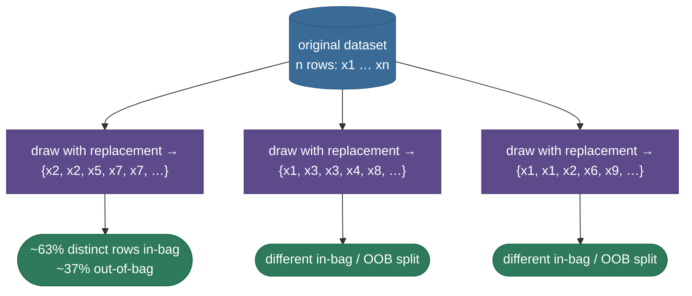
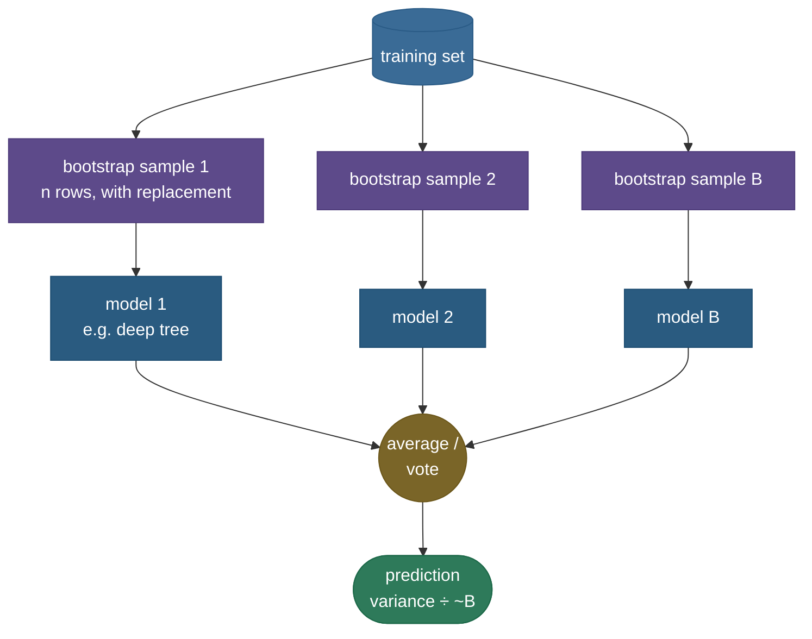
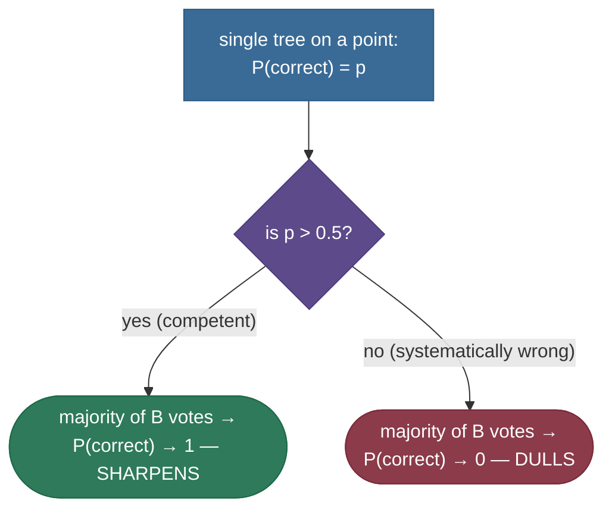
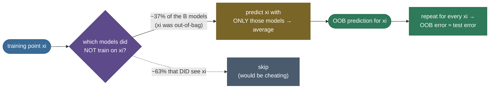
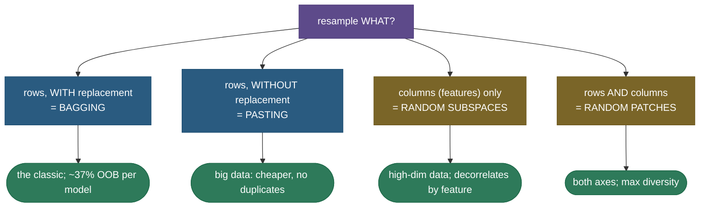
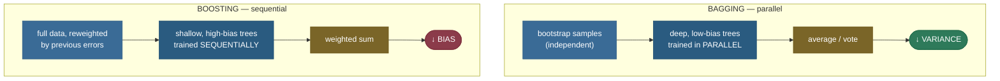

# Bagging: averaging away the variance

Imagine you ask one slightly-overcaffeinated expert to predict tomorrow's weather. They're brilliant — they can spot patterns no one else can (low **bias**) — but they're *jumpy*: show them yesterday's data with one day swapped out and their forecast lurches from "sunny" to "storm" (high **variance**). Now imagine you hire a *room* of such experts, give each a slightly different slice of the history, and average their forecasts. Each one still overreacts to their own slice's quirks — but they overreact in *different directions*, and the average smooths the lurches out. You keep the sharpness, you lose the jumpiness. That, in one paragraph, is **bagging**.

A deep [decision tree](07-Decision-Trees.md) is the textbook jumpy expert: train one on a slightly different sample and the greedy splits cascade into a wildly different tree, because it latches onto the particular noise in its training set. **Bagging** — short for **bootstrap aggregating** — is a beautifully simple cure: train many copies of the same unstable model, each on a different random resample of the data, then **average** their predictions (regression) or take a **majority vote** (classification). Each copy makes *different* mistakes on *different* examples, and averaging makes those independent mistakes **cancel**. The ensemble keeps the low bias of a single deep tree but enjoys far lower variance. Bagging is the variance-reduction half of ensemble learning, the cleanest live demonstration of the [bias–variance tradeoff](12-Bias-Variance-Tradeoff.md), and the direct parent of [random forests](09-Random-Forests.md).

I'm going to walk this the way I'd actually explain it to a teammate who just watched a single decision tree score 100% on training data and 71% on the test set. We'll start with *why* the problem exists (feel the instability), then the **bootstrap** that manufactures many datasets from one, then the **aggregation** rule, then the variance math — *derived*, not asserted — that proves why this works and *exactly when it doesn't*. By the end you'll be able to:

- explain the **bias–variance** motivation and *why you bag low-bias, high-variance learners*;
- derive the **bootstrap**'s ~63.2% in-bag / ~36.8% out-of-bag split from $(1-1/n)^n \to 1/e$;
- state the three **aggregation** rules (average, hard vote, soft vote) and when each applies;
- **derive** $\operatorname{Var}(\bar X) = \sigma^2/B$ for independent models and the correlated floor $\rho\sigma^2 + \frac{1-\rho}{B}\sigma^2$ — and read off *why the base learner must be unstable*;
- use **out-of-bag (OOB) error** as free cross-validation;
- place bagging against **random forests** (= bagging + feature subsampling) and **boosting** (variance vs bias, parallel vs sequential), and know the **pasting / random-subspaces / random-patches** variants;
- reproduce the variance reduction — and its *absence* on a stable model — in runnable code.

Intuition and pictures first, then the math (with sources), then runnable code.

> **Note:** the one-line theory to anchor everything else — averaging $B$ estimates of the same quantity divides the variance by up to $B$ (when they're independent) while **leaving the bias untouched**. So bagging is *purely* a variance-reduction tool: you point it at models that are already low-bias but high-variance, and it pulls the variance down to meet the bias. It cannot fix a biased model, and it does nothing to an already-stable one.

---

## The problem: unstable models waste their accuracy on noise

To see why bagging exists, you have to feel the instability it removes.

A fully-grown decision tree can represent almost any function — split deep enough and it can carve out a separate region for every training point. That flexibility is **low bias**: across many training sets, its *average* prediction is close to the truth. The price is **high variance**: any *single* tree is fragile. Resample the data slightly and the very first split might change (a different feature wins by a hair), and because every later split is conditioned on that first one, the whole tree reorganizes. Two trees grown on 95%-overlapping data can disagree dramatically on the same test point.

That instability is exactly **overfitting**: brilliant on training data, jumpy on new data. The tempting fix — prune the tree, cap its depth — trades the problem for a worse one: a shallow tree is *stable* but **biased** (it can't represent the true function), so it's reliably wrong instead of unreliably right. You haven't solved anything; you've moved along the bias–variance curve.



The bagging insight is that you don't *have* to make this trade. You can keep the deep tree's flexibility (its low bias) and **average the variance away separately** — *if* you can make the copies different enough that their errors are roughly independent. Manufacturing that difference is the bootstrap's job.

> **Note:** "bias" and "variance" here are statements about the *learning procedure across hypothetical training sets*, not about one fitted model. Bias = how far the *average* prediction (over many training sets) is from the truth; variance = how much one model's prediction *bounces around* that average as the training set changes. Bagging shrinks the second without moving the first. Keep that frame — every claim on this page is downstream of it.

---

## The bias–variance decomposition: what bagging actually attacks

Before the bootstrap, it's worth deriving the equation that tells us *which* part of the error bagging can touch — because it makes the "variance, not bias" claim precise instead of hand-wavy. Fix an input $x$ with true value $y = f(x) + \varepsilon$, where $\varepsilon$ is irreducible noise with mean 0 and variance $\sigma_\varepsilon^2$. Let $\hat f(x)$ be our model's prediction (random, since it depends on the random training set), with mean $\bar f(x) = \mathbb{E}[\hat f(x)]$. The expected squared error decomposes as:

$$\mathbb{E}\big[(y - \hat f(x))^2\big] = \underbrace{\big(f(x) - \bar f(x)\big)^2}_{\text{bias}^2} + \underbrace{\mathbb{E}\big[(\hat f(x) - \bar f(x))^2\big]}_{\text{variance}} + \underbrace{\sigma_\varepsilon^2}_{\text{irreducible}}.$$

The derivation is a single add-and-subtract trick: insert $\pm\bar f(x)$ inside the square and expand; the cross-terms vanish because $\mathbb{E}[\hat f(x) - \bar f(x)] = 0$ and $\varepsilon$ is independent of the model. (Full algebra lives on the [bias–variance](12-Bias-Variance-Tradeoff.md) page.) Three buckets, and only one is bagging's target:

- **Bias²** — error from the model class being too rigid to represent $f$. Bagging **cannot** touch this: we proved $\mathbb{E}[\bar f]$ is unchanged by averaging, so $\bar f(x)$ — and hence the bias — is the same as a single model's.
- **Variance** — error from the model bouncing around its own mean as the training set changes. This is **exactly** the term the $\sigma^2/B$ math below shrinks. It's bagging's entire job.
- **Irreducible noise** $\sigma_\varepsilon^2$ — the floor set by label noise; *nothing* removes it.

So the decomposition draws the boundary cleanly: a deep tree pushes **bias²** near zero (flexible) at the cost of a large **variance** term, and bagging deflates that variance term toward $\rho\sigma^2$ while leaving bias² and $\sigma_\varepsilon^2$ alone. That's why it's pointless to bag a high-bias model (you'd be shrinking an already-small variance term while the dominant bias² term sits untouched) and powerful to bag a high-variance one.

> **Gotcha:** the strict bias/variance split above is for **squared-error (regression)**. For 0-1 classification loss the decomposition is messier (the classic Domingos and Kong–Dietterich treatments), and bagging's effect is not a clean "variance only." The useful consequence: bagging can occasionally make a *systematically bad* classifier slightly worse near the decision boundary — see the 0-1-loss subtlety below. For the intuition, the regression decomposition is the right mental model; just don't claim it's literal for classification error.

---

## The bootstrap: many datasets from one

You have exactly one training set of $n$ rows, so how do you train many *different* models? You manufacture many datasets from the one you have. The **bootstrap** (Efron, 1979) does this by **sampling $n$ rows with replacement** from your $n$-row dataset. "With replacement" is the whole trick: after you draw a row you put it back, so the *same* row can be drawn again. Each bootstrap sample therefore has some rows appearing multiple times, some not at all — it's a slightly perturbed copy of the original, and a model trained on it is a slightly perturbed model.



### Deriving the 63.2% / 36.8% split

A famous, beautiful fact falls right out of "with replacement," and it's a near-certain interview ask, so let's derive it rather than memorize it. Consider one specific row — say $x_5$. On a **single** draw, the chance we pick $x_5$ is $1/n$, so the chance we **miss** it is $1 - 1/n$. A bootstrap sample makes $n$ such draws, each independent, so the probability $x_5$ is **never** chosen across all $n$ draws is

$$P(x_5 \text{ out-of-bag}) \;=\; \left(1 - \frac{1}{n}\right)^{n}.$$

Now take the limit as $n$ grows. Recall the classic identity $\displaystyle\lim_{n\to\infty}\left(1 + \frac{a}{n}\right)^{n} = e^{a}$. With $a = -1$:

$$\left(1 - \frac{1}{n}\right)^{n} \;\xrightarrow[n\to\infty]{}\; e^{-1} \;=\; \frac{1}{e} \;\approx\; 0.3679.$$

If you'd rather see it without quoting the identity, take logs: $\ln\!\left(1-\frac1n\right)^n = n\ln\!\left(1-\frac1n\right)$, and the Taylor expansion $\ln(1-u) = -u - \tfrac{u^2}{2} - \dots$ with $u = 1/n$ gives $n\left(-\frac1n - \frac{1}{2n^2} - \dots\right) = -1 - \frac{1}{2n} - \dots \to -1$, so the expression $\to e^{-1}$.

So **each row has a ~36.8% chance of being left out** of any given bootstrap sample. Equivalently, each bootstrap sample contains about $1 - 1/e \approx 63.2\%$ **distinct** rows (the rest of its $n$ slots are duplicates). The omitted ~36.8% are **out-of-bag (OOB)** for that model — and, as we'll see, they're free validation data.


The right panel confirms the algebra empirically: the OOB fraction is a bit above $1/e$ for tiny $n$ (e.g. $\approx 0.44$ at $n=2$) and settles onto $0.368$ as $n$ grows, exactly as $(1-1/n)^n$ predicts. By $n \approx 100$ the approximation is already excellent.

> **Note:** the convergence is *fast*. At $n=10$ the exact value is $0.9^{10} \approx 0.349$; at $n=100$ it's $0.99^{100} \approx 0.366$; at $n=1000$, $0.3677$. For any real dataset, "≈ 37% out-of-bag" is essentially exact — which is why people quote it as a constant.

> **Gotcha:** ~37% is the fraction of *rows left out*, **not** the fraction of the data a model never sees in some weaker sense, and **not** 50%. A common interview slip is "half the data is held out." It's $1/e$, ~37%, and you should be able to derive it on the spot from $(1-1/n)^n$.

> *Where this comes from: resampling with replacement to estimate sampling distributions is **Efron (1979)**, "Bootstrap Methods"; its use to build ensembles is **Bagging Predictors** (Breiman, 1996); the applied treatment is **ISLR** Ch. 5 (the bootstrap) & 8.2 (bagging) — references.*

---

## The aggregation: combine the copies

Train $B$ models, each on its own bootstrap sample, then **combine** them. The combination rule depends on the task:

- **Regression — average.** $\hat f_{\text{bag}}(x) = \frac{1}{B}\sum_{b=1}^{B} \hat f_b(x)$. Plain arithmetic mean of the $B$ predictions.
- **Classification — hard (majority) vote.** Each model casts one vote for a class; the ensemble predicts the class with the most votes. Ties broken arbitrarily (e.g. lowest class index).
- **Classification — soft vote.** Average the models' *predicted probabilities* per class, then take the argmax. Soft voting usually beats hard voting because it uses confidence, not just the top label — a model that's 0.51 sure and one that's 0.99 sure should not count equally.



Note the crucial parallelism: the $B$ models **never look at each other**. Each is trained from scratch on its own bootstrap sample, so you can train all $B$ on $B$ machines at once. That embarrassing parallelism is one of bagging's quiet operational virtues, and the sharpest structural contrast with [boosting](10-Gradient-Boosting-XGBoost.md), where model $b$ can't start until model $b-1$ finishes.

> **Tip:** majority vote has a nice probabilistic backbone — the **Condorcet jury theorem**. If each of $B$ independent voters is right with probability $p > 0.5$, the majority is right with probability that → 1 as $B$ grows. Bagging is that theorem applied to models: independent-ish learners that are each "better than a coin flip" combine into an ensemble that's far better than any of them. The catch — and the whole rest of this page — is the word *independent*.

---

## The algorithm, end to end

Stripped to pseudocode, the entire method is shockingly short — which is part of its charm. Given a training set $D$ of $n$ rows, a base learner, and an ensemble size $B$:

```
TRAIN(D, base_learner, B):
    models ← []
    for b = 1 … B:                       # ← embarrassingly parallel
        D_b ← sample n rows from D WITH replacement   # bootstrap sample
        m_b ← base_learner.fit(D_b)                   # train a deep, unpruned model
        models.append(m_b)
    return models

PREDICT(models, x):
    if regression:  return mean(   m(x) for m in models)        # average
    if classification (hard):  return mode(m(x) for m in models)   # majority vote
    if classification (soft):  return argmax(mean(m.proba(x) for m in models))

OOB_ERROR(D, models):                    # free validation, no extra training
    for each row x_i in D:
        voters ← models that did NOT train on x_i   (≈ 0.37·B of them)
        ŷ_i ← aggregate(v(x_i) for v in voters)
    return error(ŷ, y)                   # ≈ cross-validation error
```

Three design choices inside this skeleton matter:

- **Train each base model deep / unpruned.** You *want* the low bias; averaging will handle the variance. Pruning each tree would add bias the ensemble can't undo. (This inverts single-tree practice, where you prune to fight variance — bagging fights it a better way.)
- **Bootstrap size = $n$.** The standard draws exactly $n$ rows (giving the ~37% OOB fraction). Drawing fewer rows (subsampling) is the `max_samples < 1.0` knob — faster, slightly more biased per model, more decorrelated.
- **$B$ is a *budget*, not a tuning parameter.** Because more models only lower variance toward the floor, you don't "tune" $B$ for accuracy the way you tune depth — you set it as high as compute allows and watch the OOB curve flatten.

> **Tip:** the parallel `for b = 1 … B` loop is genuinely independent — no model depends on another — so bagging scales linearly across cores or machines with near-zero coordination. This is why `n_jobs=-1` in scikit-learn gives almost perfect speedups for bagging and forests, but *cannot* for boosting (whose rounds are inherently sequential).

---

## Why averaging cuts variance — the derivation

This is the mathematical heart of the page, and it's worth grinding through every step because the *conclusion you read off the algebra* is precisely "bag unstable learners, not stable ones."

### Step 1 — the independent case: sigma-squared over B

Model the $B$ bagged predictions at a fixed input $x$ as random variables $\hat f_1, \dots, \hat f_B$ (random because each depends on a random bootstrap sample). Suppose for now they are **independent and identically distributed (i.i.d.)**, each with mean $\mu$ and variance $\sigma^2$. The bagged prediction is their average $\bar f = \frac1B \sum_b \hat f_b$. Two facts:

**Bias is unchanged.** By linearity of expectation,

$$\mathbb{E}[\bar f] = \frac{1}{B}\sum_{b=1}^{B} \mathbb{E}[\hat f_b] = \frac{1}{B}\cdot B\mu = \mu.$$

The average has the *same center* as a single model — so whatever bias a single model has, the ensemble has it too. **Averaging never reduces bias.**

**Variance shrinks by $B$.** For independent variables, the variance of a sum is the sum of variances, and constants pull out squared:

$$\operatorname{Var}(\bar f) = \operatorname{Var}\!\left(\frac{1}{B}\sum_{b=1}^{B}\hat f_b\right) = \frac{1}{B^2}\sum_{b=1}^{B}\operatorname{Var}(\hat f_b) = \frac{1}{B^2}\cdot B\sigma^2 = \boxed{\frac{\sigma^2}{B}}.$$

So $B$ independent models cut the variance by a factor of $B$ while holding bias fixed. That is the entire promise of bagging in one line: **variance $\to \sigma^2/B$, bias unchanged.** Add models, drive variance toward zero, keep accuracy.

### Step 2 — the realistic case: the correlated floor

Here's the catch the dashed line in the figure exposes. Bootstrap samples *overlap* — two of them share ~63% of the original rows on average — so the models trained on them are **not independent**; they're **positively correlated**. We need the variance of an average of *correlated* identically-distributed variables. Let every pair have correlation $\rho$ (so $\operatorname{Cov}(\hat f_i, \hat f_j) = \rho\sigma^2$ for $i\neq j$). Expand the variance of the average:

$$\operatorname{Var}(\bar f) = \frac{1}{B^2}\left[\sum_{b}\operatorname{Var}(\hat f_b) + \sum_{i\neq j}\operatorname{Cov}(\hat f_i,\hat f_j)\right].$$

There are $B$ variance terms (each $\sigma^2$) and $B(B-1)$ covariance terms (each $\rho\sigma^2$):

$$\operatorname{Var}(\bar f) = \frac{1}{B^2}\Big[B\sigma^2 + B(B-1)\rho\sigma^2\Big] = \frac{\sigma^2}{B} + \frac{B-1}{B}\rho\sigma^2.$$

Tidy it into the form everyone quotes:

$$\boxed{\;\operatorname{Var}(\bar f) = \rho\sigma^2 + \frac{1-\rho}{B}\sigma^2\;}$$

Read this carefully — it's the single most important equation about ensembles of trees. As $B \to \infty$ the second term vanishes, but the **first term, $\rho\sigma^2$, does not**. It is a **floor** you cannot average past, no matter how many models you add:

$$\lim_{B\to\infty}\operatorname{Var}(\bar f) = \rho\sigma^2.$$

So adding trees pays off only down to $\rho\sigma^2$. Two sanity checks confirm the formula: set $\rho = 0$ (independent) and you recover Step 1's $\sigma^2/B$; set $\rho = 1$ (identical models) and you get $\sigma^2$ — averaging identical things changes nothing, exactly right.


The measured blue curve drops steeply, then flattens onto the red floor **far above** the dashed $1/B$ ideal — because bootstrapped trees, trained on overlapping data, are correlated, so $\rho\sigma^2 > 0$ caps the gain. That gap between the measured curve and the dashed ideal is *exactly* the inefficiency [random forests](09-Random-Forests.md) attack: they inject extra randomness (a random feature subset at each split) to **lower $\rho$**, dropping the floor.

> **Note:** notice the two levers in $\rho\sigma^2 + \frac{1-\rho}{B}\sigma^2$. Adding models ($B\uparrow$) only kills the *second* term. Lowering correlation ($\rho\downarrow$) lowers the *floor* itself. Plain bagging only turns the first knob; random forests turn the second. That single observation is the entire reason random forests exist — and a complete answer to "why isn't bagging enough?"

> *Where this comes from: the $\sigma^2/B$ argument and bagging's variance analysis are **The Elements of Statistical Learning** (Hastie–Tibshirani–Friedman) Ch. 8.7 and Breiman (1996); the correlated-average form $\rho\sigma^2 + \frac{1-\rho}{B}\sigma^2$ is **ESL** Ch. 15.2 — references.*

---

## Why the base learner MUST be unstable

Now read the consequence off the math, because this is the most-missed point and the one interviewers probe. Bagging's benefit lives in the gap between $\sigma^2$ (one model's variance) and the floor $\rho\sigma^2$ — i.e. in the term $(1-\rho)\sigma^2$ that averaging can remove. For that gap to be worth anything, **two things must hold**:

1. $\sigma^2$ must be **large** — the base learner must have meaningful variance to remove. (Bag a high-bias, low-variance model and there's nothing to take away.)
2. $\rho$ must be **well below 1** — resampling must actually *change* the model, so the copies decorrelate. This is the **instability** requirement.

A deep tree nails both: it's high-variance ($\sigma^2$ large) *and* unstable (a different bootstrap → a genuinely different tree, so $\rho < 1$). A **stable** learner fails #2 spectacularly. Take ordinary least-squares linear regression: its coefficients are a smooth, *averaging* function of the data, so a bootstrap (which only mildly reweights the rows) barely moves the fitted line. Every bootstrap produces nearly the *same* model, so $\rho \approx 1$, the floor $\rho\sigma^2 \approx \sigma^2$, and bagging buys you essentially **nothing**.


The code below confirms it numerically: bagging cuts the deep tree's variance by ~51%, but moves the linear model's by ~0 (a noisy +6%, within measurement noise). *Match the tool to the problem: bag unstable, high-variance learners.* This is why "bagging" in practice almost always means "bagging trees."

> **Gotcha:** the requirement is **instability**, not "being a tree." Bagging helps **deep** trees (unstable) but not **stumps** (depth-1 trees are nearly as stable as a constant, and high-bias to boot). It helps **k-NN with small k** somewhat but not much (k-NN is fairly stable). It does little for **linear/logistic regression**, **LDA**, or **naive Bayes** — all stable, low-variance learners. The mental test: *"if I resample the data, does my model change a lot?"* Only then does bagging pay.

> **Tip:** there's a subtle, often-quoted refinement. Bagging is most powerful for **unstable, low-bias** learners. It can even slightly *hurt* a stable learner, because each bootstrap model is trained on only ~63% distinct rows — effectively a smaller sample — which nudges its bias/variance the wrong way with no decorrelation benefit to compensate. So bagging a linear model is, at best, a wash and occasionally a tiny loss. Reserve it for the jumpy models.

---

## The classification subtlety: why voting can sharpen *or* dull

For regression, averaging is unambiguously a variance-reducer — the math above is exact. Classification by **majority vote** has a twist worth understanding, because it explains both why bagging is so reliable *and* the rare case where it backfires.

Think of each test point as having a true class. A single tree predicts the *correct* class with some probability $p$ (over the randomness of its training set). When you take a majority vote of $B$ independent trees, the ensemble is correct whenever *more than half* of them are correct — a binomial event. Two regimes follow:

- **If the base learner is good on this point ($p > 0.5$),** voting **sharpens** it: the probability the majority is correct rises toward 1 as $B$ grows (the Condorcet effect). A point that 70% of trees get right is gotten right by the ensemble almost always. Bagging *amplifies* a competent learner.
- **If the base learner is bad on this point ($p < 0.5$),** voting **dulls** it the same way — the majority is *wrong* almost always. Bagging *amplifies the mistake*. So a systematically poor classifier can come out of bagging slightly *worse* on its bad regions.



Why does this rarely bite in practice? Because a low-bias base learner like a deep tree is correct *on average* across most points — $p > 0.5$ where it matters — so voting overwhelmingly sharpens. The dulling only shows up if you bag a learner that's worse than chance on a region, which a sensible base learner isn't. This is the precise, honest version of "bagging can't reduce bias for classification": **voting amplifies whatever the base learner already is**, so you must bring it a learner that's already better than a coin flip.

> **Note:** this is also why **soft voting** (averaging probabilities) is usually preferred to **hard voting** for bagged trees: averaging the probabilities is closer to the smooth regression-style averaging the variance math loves, and it degrades more gracefully near the decision boundary than a hard binomial vote. When in doubt, average probabilities, not labels.

---

## Out-of-bag error: cross-validation for free

We derived that each model leaves ~37% of rows out-of-bag. Here's the elegant payoff. For **any** training point $x_i$, roughly 37% of the $B$ models never saw it during training — for *those* models, $x_i$ is genuinely held-out test data. So you can predict $x_i$ using **only the models that didn't train on it**, average those predictions, and compare to the truth. Do this for every training point and average the errors: you get the **out-of-bag (OOB) error**, an honest generalization estimate computed *for free*, with **no separate validation set and no extra training**.



Why does OOB approximate true test error so well? Because each OOB prediction for $x_i$ is made by models that treated $x_i$ as unseen — the defining property of a validation estimate. The one caveat is that each point is scored by only ~37% of the ensemble (≈ $0.37B$ models), so the OOB ensemble is *smaller* than the full one; with too few total models, some points may have **no** OOB predictors at all, and the estimate is noisy. With enough models it converges right onto the held-out test error:


At small $B$ the OOB error is higher and jumpier (few models per point); as $B$ grows it drops onto the green test-error line and tracks it. That convergence is OOB earning its keep: a validation curve you got *for free*, as a side effect of bootstrapping.

> **Tip:** OOB error is a real practical win, not just a curiosity. When asked *"how would you validate a bagged model or random forest cheaply?"*, answer **OOB** — it gives a near-CV-quality generalization estimate without holding out data or paying for k-fold retraining. In scikit-learn it's one flag: `oob_score=True`.

> **Gotcha:** OOB error is reliable only when $B$ is reasonably large (so most points have enough OOB predictors). With a handful of models, sklearn even warns "some inputs do not have OOB scores." Don't read an OOB number off a 5-tree ensemble and trust it — the curve above shows why it's noisy there.

---

## Bagging beyond trees, and the resampling variants

Bagging is *base-learner-agnostic by design* — Breiman's original paper bagged trees, but the recipe ("resample, retrain, aggregate") works on **any** high-variance learner. In practice it's overwhelmingly applied to trees because trees are the most usefully unstable common model, but you'll occasionally see **bagged neural networks** (each net trained on a bootstrap sample, predictions averaged — a cheap ensemble that reduces the variance from random initialization and data order) and historically **bagged regression trees** for tabular forecasting. The rule never changes: it helps in proportion to how unstable the base learner is.

There's also a small family of resampling variants that tweak *what* gets subsampled — rows, columns, or both:



- **Pasting** (Breiman, 1999) — sample rows **without** replacement (random subsets, no duplicates). Useful when the dataset is huge and even one bootstrap is expensive; you trade the OOB convenience for cheaper, duplicate-free subsamples.
- **Random subspaces** (Ho, 1998) — subsample **features (columns)**, not rows; each model sees all rows but a random subset of features. Decorrelates models by *which features they're even allowed to use* — especially effective in high dimensions.
- **Random patches** (Louppe & Geurts, 2012) — subsample **both** rows and features. Maximum diversity, lowest memory per model.

These all live under the same variance-reduction umbrella; bagging (rows, with replacement) is just the most common member. In scikit-learn they're all the *same* `BaggingClassifier`, toggled by `bootstrap`, `max_features`, and `bootstrap_features`.

> **Note:** spot the family resemblance to random forests. A random forest is *almost* "bagging + random subspaces," but with a crucial difference in *where* the feature randomness is applied: random subspaces fix one feature subset **per model**, whereas a random forest draws a fresh random feature subset **at every split of every tree**. That per-split resampling decorrelates far more aggressively — which is why forests beat plain bagging, and why feature randomness gets its full treatment on the [random forests](09-Random-Forests.md) page rather than here.

---

## From bagging to random forests, and vs boosting

Bagging sits at a junction between the two great ensemble families, so place it precisely:

- **Random forests = bagging + per-split feature randomness.** Plain bagging's trees are correlated (they all split on the same dominant features first), which pins the variance at the floor $\rho\sigma^2$ you derived above. [Random forests](09-Random-Forests.md) add **random feature subsampling at each split** ($m \approx \sqrt p$ candidate features), which forces trees to use different features, **decorrelates** them ($\rho\downarrow$), and lowers the floor. It's bagging's natural upgrade for trees — a one-line change to the tree-growing loop with outsized payoff. (The forests page derives the decorrelation; here, just hold "RF lowers the $\rho$ in the floor you derived.")
- **Bagging vs boosting** — the canonical contrast. Bagging trains models **in parallel** on independent resamples and averages to cut **variance**; [boosting](10-Gradient-Boosting-XGBoost.md) trains models **sequentially**, each one correcting the errors of the ensemble so far, to cut **bias**. They attack opposite terms of the error decomposition and have opposite failure modes (boosting can overfit by adding rounds; bagging essentially can't from count alone).



A side-by-side makes the contrast stick:

| axis | Bagging | Random Forest | Boosting |
|---|---|---|---|
| primary target | ↓ variance | ↓ variance (more) | ↓ bias |
| base learner | deep, low-bias, **unstable** | deep trees | shallow, high-bias, **weak** |
| training order | **parallel**, independent | parallel, independent | **sequential**, dependent |
| data per model | bootstrap rows | bootstrap rows | full data, **reweighted** by errors |
| feature randomness | none (or per-model subspace) | **per-split** random subset | none (per-split optional in some impls) |
| combine rule | average / vote | average / vote | weighted sum |
| more estimators | only helps (→ floor) | only helps (→ lower floor) | **can overfit** |
| free validation | OOB error | OOB error | none built-in |

> **Tip:** the clean framing to recite — **bagging reduces variance with parallel, independent learners; boosting reduces bias with sequential, dependent learners.** And the prerequisite for bagging to do *anything* is an **unstable** base learner (deep trees), whereas boosting deliberately uses **weak, stable** learners (stumps) and builds strength sequentially. Opposite philosophies on every axis.

> **Gotcha:** "more estimators always helps and never overfits" is true for **bagging** (and random forests) — adding models only drives variance toward the floor — but **false for boosting**, where each added round can fit more noise and *increase* test error. Don't transfer bagging's comforting "you can't overfit by adding trees" intuition to a boosted model; they're different mechanisms.

---

## Worked examples: four, increasing in complexity

Numbers make the variance math concrete. We escalate from a one-line plug-in to a measured reduction that matches the figures.

### Example 1 — the out-of-bag fraction by hand

How much data does one bootstrap model *not* see? For $n = 1000$ rows, the probability a specific row is left out is

$$\left(1 - \frac{1}{1000}\right)^{1000} = 0.999^{1000} \approx 0.3677 \;\approx\; \frac1e.$$

So ~**368 rows** are out-of-bag and ~**632 distinct rows** are in-bag (the other ~368 in-bag slots are duplicates of the 632). For $n=100$ it's $0.99^{100}\approx 0.366$; for $n=10$, $0.9^{10}\approx 0.349$. The fraction barely moves with $n$ — that's why "≈37% OOB" is stated as a constant. **Takeaway:** every bagged model trains on ~63% distinct data and validates on the other ~37%, for free.

### Example 2 — variance of B independent models

Suppose one deep tree's prediction at a point has variance $\sigma^2 = 0.09$ (it's jumpy). If you could train $B = 10$ **independent** trees and average them, the averaged prediction's variance would be

$$\operatorname{Var}(\bar f) = \frac{\sigma^2}{B} = \frac{0.09}{10} = 0.009,$$

a **10× reduction**, with the *same* expected prediction (no bias added). Push to $B=100$ and it's $0.0009$ — variance collapsing toward zero. This is the *ideal* (the dashed line in the variance figure): what you'd get if bootstrap trees were truly independent. They aren't, which is Example 3.

### Example 3 — the correlated floor

Now use the *realistic* formula. Keep $\sigma^2 = 0.09$, and say bootstrap trees are correlated at $\rho = 0.5$. With $B = 10$:

$$\operatorname{Var}(\bar f) = \rho\sigma^2 + \frac{1-\rho}{B}\sigma^2 = 0.5(0.09) + \frac{0.5}{10}(0.09) = 0.045 + 0.0045 = 0.0495.$$

Compare to Example 2's *independent* answer of $0.009$ at the same $B=10$ — correlation has stolen most of the gain. Worse, as $B\to\infty$ this bottoms out at the **floor** $\rho\sigma^2 = 0.5(0.09) = 0.045$ — you can *never* beat $0.045$ by adding trees. From $\sigma^2 = 0.09$ down to $0.045$ is still a **2× reduction**, but no more, *unless you lower $\rho$* (random forests). This single example is the whole "why bagging isn't enough" story in numbers.

### Example 4 — a measured single-tree vs bagged variance reduction

Now the rubber meets the road. The code below *measures* prediction variance across 60 resampled training sets for a single deep tree versus a 50-tree bagged ensemble (and repeats the experiment for a stable linear model). Measured results:

| base learner | single-model variance $\sigma^2$ | bagged variance (B=50) | change |
|---|---|---|---|
| deep tree (**unstable**) | 0.0907 | 0.0446 | **−51%** |
| linear model (**stable**) | 0.0093 | 0.0098 | +6% (≈ noise) |

The deep tree drops from $0.0907$ to $0.0446$ — almost exactly a **halving**, which back-solves to an effective correlation of $\rho \approx 0.0446 / 0.0907 \approx 0.49$ (matching Example 3's $\rho=0.5$ assumption — the figure's floor *is* $\rho\sigma^2$). The linear model barely moves, because it's stable ($\rho\approx 1$): every bootstrap fits nearly the same line, so there's no decorrelation to exploit. **Theory and measurement agree, and the contrast is the whole lesson.**

---

## Application: a step-by-step playbook

Putting it together, here's the reasoning I'd actually run when reaching for bagging:

1. **Diagnose the variance.** Train a single deep tree; if it scores far better on train than test (e.g. 100% vs 72%), you have a high-variance, low-bias model — the ideal bagging candidate.
2. **Confirm the learner is unstable.** Trees, yes. If you're tempted to bag a linear/logistic model or naive Bayes, stop — it won't help (Example 4); pick a different remedy (regularization, more data).
3. **Pick $B$.** More is strictly better for variance (it only approaches the floor), so use as many as your compute budget allows — commonly 100–500. Watch the **OOB error curve** and stop adding when it plateaus.
4. **Turn on OOB.** Set `oob_score=True` to get a free generalization estimate; use it instead of (or alongside) a held-out set.
5. **Consider the upgrade.** If the trees are correlated (they usually are), switch to a **random forest** to add per-split feature randomness and lower the variance floor — almost always a free win over plain bagging for trees.
6. **Tune lightly.** Bagging needs little tuning; the main knob is $B$ (more = lower variance, never overfits from count). Keep base trees deep — you *want* their low bias; averaging handles the variance.

---

## Code: variance reduction (and its absence on a stable model)

```python
"""Bagging: variance reduction for an UNSTABLE learner but not a STABLE one, + OOB.
Verified on Python 3.12 (scikit-learn 1.9, numpy 2.4), CPU."""
import numpy as np
from sklearn.tree import DecisionTreeRegressor, DecisionTreeClassifier
from sklearn.linear_model import LinearRegression
from sklearn.ensemble import BaggingRegressor, BaggingClassifier
from sklearn.datasets import make_moons
from sklearn.model_selection import train_test_split

def data(seed):                       # a different bootstrap-like resample per seed
    rng = np.random.default_rng(seed); x = rng.uniform(-3, 3, 120)
    return x[:, None], np.sin(1.5*x) + rng.normal(0, 0.3, 120)

def pred_var(make, x0, runs=60):      # variance of predictions across resampled fits
    return np.var([make().fit(*data(r)).predict(x0) for r in range(runs)], axis=0).mean()

x0 = np.linspace(-2.5, 2.5, 40)[:, None]
ts = pred_var(lambda: DecisionTreeRegressor(), x0)
tb = pred_var(lambda: BaggingRegressor(DecisionTreeRegressor(), n_estimators=50, random_state=0), x0)
ls = pred_var(lambda: LinearRegression(), x0)
lb = pred_var(lambda: BaggingRegressor(LinearRegression(), n_estimators=50, random_state=0), x0)
print(f"deep tree (UNSTABLE): single={ts:.4f} bagged={tb:.4f}  ({(1-tb/ts)*100:+.0f}% -> big drop)")
print(f"linear   (STABLE):    single={ls:.4f} bagged={lb:.4f}  ({(1-lb/ls)*100:+.0f}% -> ~nothing)")

# OOB error as free validation (classification on two-moons)
X, y = make_moons(n_samples=500, noise=0.3, random_state=0)
Xtr, Xte, ytr, yte = train_test_split(X, y, test_size=0.3, random_state=0)
bag = BaggingClassifier(DecisionTreeClassifier(), n_estimators=200, oob_score=True, random_state=0).fit(Xtr, ytr)
print(f"OOB score = {bag.oob_score_:.3f} ~ test acc = {bag.score(Xte, yte):.3f}  (free validation)")

# the ~37% out-of-bag fraction, by simulation: P(row never drawn in n draws) -> 1/e
n = 5000
oob = np.mean([1 - len(set(np.random.default_rng(s).integers(0, n, n)))/n for s in range(30)])
print(f"out-of-bag fraction = {oob:.3f}  (theory 1/e = {1/np.e:.3f})")
```

Output:

```
deep tree (UNSTABLE): single=0.0907 bagged=0.0446  (+51% -> big drop)
linear   (STABLE):    single=0.0093 bagged=0.0098  (-6% -> ~nothing)
OOB score = 0.857 ~ test acc = 0.873  (free validation)
out-of-bag fraction = 0.369  (theory 1/e = 0.368)
```

Four results, four lessons in four lines:

> **Note:** the contrast in the first two lines is the whole page. Bagging cuts the **deep tree's** variance roughly in half (+51% drop — the instability is exactly what averaging removes), but does **nothing** for the **linear model** (−6%, within noise) — it's already stable, so every bootstrap fits nearly the same line and there's no variance to average away. Line 3: **OOB (0.857) ≈ held-out test accuracy (0.873)** — validation for free. Line 4: the **out-of-bag fraction (0.369) ≈ 1/e (0.368)** — the derivation, confirmed.

> **Tip:** to reproduce the figures end-to-end, run `tools/gen_bagging_diagrams.py` (`python3 tools/gen_bagging_diagrams.py`). It re-measures every number on this page — the variance-vs-$B$ curve, the unstable-vs-stable bars, the bootstrap OOB convergence, and the OOB-vs-test curve — so nothing here is hand-drawn.

---

## Where bagging is used

- **As random forests** — bagging's overwhelmingly most common form (bagging + per-split feature randomness) is a default, low-maintenance model for **tabular data**.
- **Stabilizing any unstable learner** — bagged trees, and occasionally bagged neural nets, when you need lower variance without adding bias.
- **Uncertainty estimation** — the *spread* of the $B$ bagged predictions at a point is a cheap, model-agnostic uncertainty estimate (wide spread = the models disagree = low confidence).
- **Honest validation on a budget** — OOB error gives near-CV-quality generalization estimates for free, handy when data or compute is tight.
- **The conceptual foundation** — understanding bagging is the prerequisite for forests, for the bias–variance story, and for explaining *why* ensembles work at all.

Concretely, that plays out across domains wherever variance is the enemy and the data is tabular:

- **Credit scoring and fraud detection** — robust, low-variance tabular models that don't need feature scaling and tolerate mixed types; OOB gives a cheap honest score on imbalanced data.
- **Genomics and bioinformatics** — random-subspaces-style bagging shines in the "many features, few samples" regime, where decorrelating by feature subset is exactly the right move.
- **Remote sensing / land-cover classification** — bagged trees and forests are a long-standing default for pixel classification from satellite bands.
- **Quantitative finance** — bagged trees for noisy, non-stationary signals where a single tree would chase noise; the prediction *spread* doubles as an uncertainty/confidence signal for sizing.
- **AutoML baselines** — a bagged-tree / forest is the reflexive first model in nearly every AutoML pipeline because it's strong out of the box with almost no tuning.

> **Tip:** in interviews, bagging is almost always the *setup* for random forests. Be ready to (1) define bootstrap + aggregate, (2) **derive** that it cuts variance not bias (the $\sigma^2/B$ and $\rho\sigma^2$ formulas), (3) stress the **unstable-learner** requirement, (4) explain **OOB** and the $1/e$ fraction, and (5) pivot: "...and random forests add per-split feature randomness to **decorrelate** the trees, lowering the $\rho\sigma^2$ floor." That arc is a complete, senior-level answer.

---

## Pitfalls and how they bite

The theory is clean; the misuses are predictable. The ones that actually cost people accuracy or time:

- **Bagging a stable learner and expecting a win.** The #1 conceptual mistake — bagging logistic regression / LDA / naive Bayes and being surprised nothing improves. They're already low-variance; there's no variance to remove and a slight bias hit from the smaller effective sample. Diagnose instability *first* (Example 4's test).
- **Pruning the base trees.** Capping depth or `min_samples_leaf` on the base learner adds bias the ensemble can't average away. Keep base trees **deep**; let $B$ handle variance. Pruning each tree is fighting the wrong battle.
- **Trusting OOB from too few models.** With $B$ small, some points have no OOB voters and the estimate is noisy (sklearn literally warns). Use OOB only once $B$ is in the hundreds; the OOB-vs-test figure shows the small-$B$ region is unreliable.
- **Expecting bagging to fix underfitting.** If your single model *underfits* (high bias — e.g. a stump, or a too-simple model), bagging makes it *no better* and possibly slightly worse. The fix for bias is a more flexible model or boosting, not bagging.
- **Forgetting the cost multiplier.** Bagging multiplies training **and** inference cost by $B$ (you run $B$ models per prediction). For latency-sensitive serving, that $B$× inference cost is real — budget it, or distill the ensemble into a single model.
- **Stacking it on a deterministic, already-decorrelated method and double-counting.** Bagging *inside* a random forest is redundant emphasis — the forest already bootstraps. Don't bag a random forest expecting a second free lunch; the per-split feature randomness is doing the heavy lifting.

> **Gotcha:** the most expensive of these is the cost one. A 500-tree bag of deep trees can be 500× the inference cost of one tree for a *fraction* of the variance reduction past the first ~100 models (you're already near the floor). Read the variance-vs-$B$ curve: the marginal model past the knee buys almost nothing, so don't pay for 2,000 trees when 200 sit on the floor.

---

## Recap and rapid-fire

**If you remember nothing else:** bagging trains $B$ copies of an **unstable, low-bias/high-variance** model on **bootstrap samples** (rows drawn *with replacement*, ~37% out-of-bag each) and **averages** them (or votes). Averaging $B$ *independent* estimates cuts variance to $\sigma^2/B$ while leaving **bias** unchanged; because bootstrap models are *correlated*, the real variance bottoms out at the floor $\rho\sigma^2 + \frac{1-\rho}{B}\sigma^2 \to \rho\sigma^2$. So you bag deep trees (unstable, $\rho<1$), not linear models (stable, $\rho\approx 1$). You get **OOB** validation for free, and adding **per-split feature randomness** turns bagging into a **random forest** by lowering $\rho$.

**Quick-fire — say these out loud:**

- *What is bagging?* Train models on bootstrap resamples, then average/vote — **b**ootstrap **agg**regating.
- *What is a bootstrap sample?* $n$ rows drawn **with replacement** from $n$ rows (some repeat; ~37% omitted).
- *Why ~37% out-of-bag?* $(1-1/n)^n \to 1/e \approx 0.368$ — those rows give free OOB validation.
- *Does bagging reduce bias or variance?* Variance — averaging doesn't move the center (bias), only the spread.
- *Derive the variance drop.* Independent: $\operatorname{Var}(\bar f)=\sigma^2/B$. Correlated: $\rho\sigma^2+\frac{1-\rho}{B}\sigma^2\to\rho\sigma^2$ (a floor).
- *So what should you bag?* Low-bias, **high-variance, unstable** learners (deep trees) — not stable ones (linear, NB, LDA).
- *Why must the learner be unstable?* If resampling barely changes the model, $\rho\approx 1$, the floor ≈ $\sigma^2$, averaging does nothing.
- *Bagging vs random forest?* RF = bagging + **per-split** random feature subsampling — decorrelates trees (lowers $\rho$, lowers the floor).
- *Bagging vs boosting?* Bagging = parallel, independent, cut **variance**; boosting = sequential, dependent, cut **bias**.
- *Pasting / random subspaces / random patches?* Resample rows-without-replacement / features / both, respectively.
- *Can bagging overfit by adding models?* No — more $B$ only approaches the floor (unlike boosting, where rounds can overfit).

---

## References and further reading

The curated link library for this topic — videos, courses, interactive/visual resources, articles, papers, books, and internal cross-links — lives in a companion file so it can be reused as a standalone reference list:

**→ [Bagging — references and further reading](08-Bagging.references.md)**
