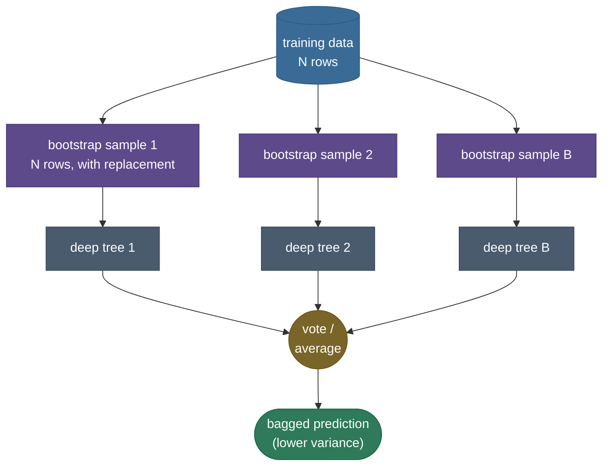
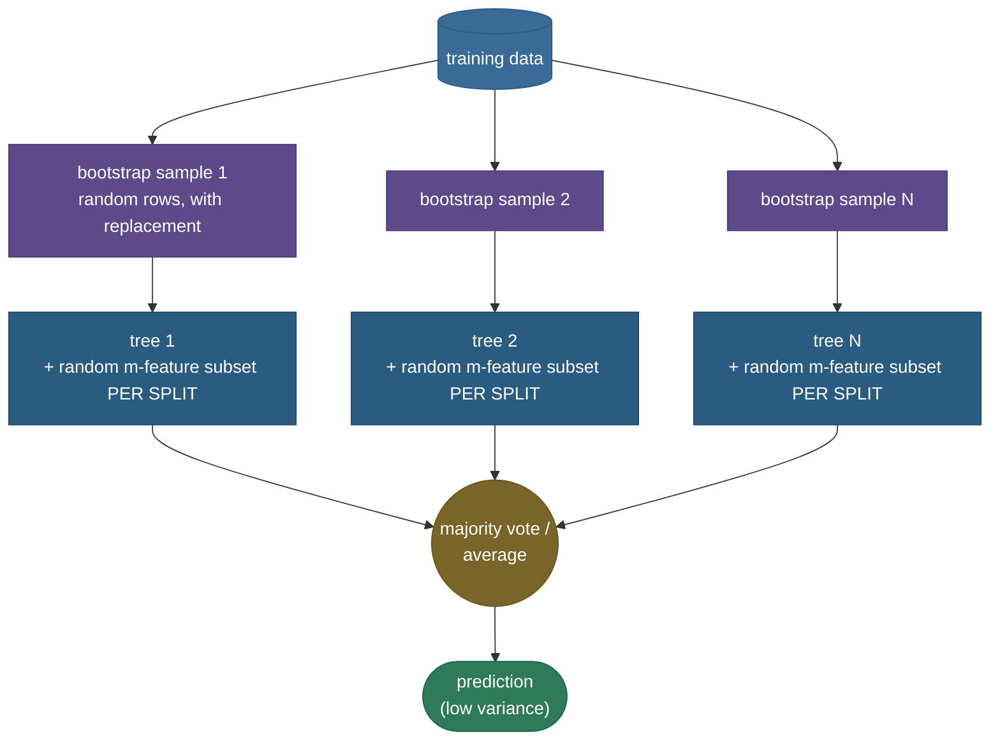
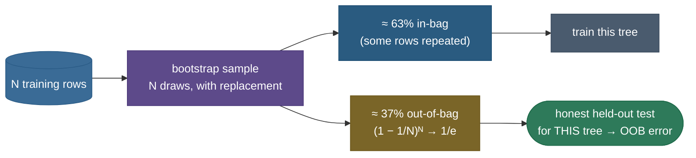

# Random forests: many decorrelated trees beat one

A single [decision tree](07-Decision-Trees.md), grown deep, is the most flexible cheap model you have — and the most unstable. It can carve the feature space into whatever shape the data demands (**low bias**), but train it on a slightly different sample of the same data and it can come out a *completely different tree*, splitting on different features in a different order, drawing a different boundary (**high variance**). One tree is a brilliant, opinionated expert who changes their mind every time you hand them a new newspaper. The fix is the oldest trick in statistics: **don't trust one expert — poll a crowd and average.** Average enough independent opinions and the idiosyncratic errors cancel while the signal survives.

But there is a subtlety that makes random forests genuinely *clever* rather than just "bagging with a nicer name," and it is the whole reason the algorithm exists. If you simply train many trees on resampled data (that is **bagging**), the trees come out **correlated** — they all latch onto the same one or two dominant features, split on them first, and therefore make the *same* mistakes. Averaging correlated mistakes barely helps. Random forests add one more dash of randomness — **at every split, each tree may only look at a random subset of the features** — which forces different trees to use different features, **decorrelating** them. And the variance of an average drops *far* faster when the things you average are decorrelated. That single one-line change to the tree-growing loop is what turns a good ensemble into the robust, near-default model for tabular data — and one of the most-asked algorithms in interviews.

By the end of this page you'll be able to:

- explain why a single deep tree is **low-bias / high-variance**, and why **averaging** is the right cure;
- recap **bagging** and **derive** why it alone isn't enough — the **correlation floor** in the variance-of-an-average formula;
- derive $\text{Var}\!\big(\bar T\big) = \rho\sigma^2 + \frac{1-\rho}{n}\sigma^2$ from scratch and read the $\rho\sigma^2$ floor off it;
- explain the **random-feature** twist ($m \approx \sqrt p$): how it lowers $\rho$, lowers the floor, and decorrelates the trees;
- state the **algorithm** end to end and what every hyperparameter does;
- derive the **out-of-bag (OOB)** ~37% via $(1-1/n)^n \to 1/e$, and why **OOB ≈ cross-validation for free**;
- reason about **feature importances** (impurity vs permutation) and the **high-cardinality bias**;
- contrast forests (**parallel, ↓variance**) with **gradient boosting** (**sequential, ↓bias**);
- work **three** numeric examples of increasing complexity and reproduce all of it in verified code.

Intuition and pictures first, then the math (every step shown, with sources), then runnable, verified code.

> **Note:** the one insight to carry away — **averaging reduces variance, but only as much as the things you average are uncorrelated.** Bagging makes trees *similar* (correlated); random forests make them *different* (decorrelated) by hiding features at each split. That is the entire conceptual payload of the algorithm; everything else (OOB, importances, the hyperparameters) follows from it.

---

## The problem: keep the tree's low bias, kill its variance

Start from the [bias–variance](12-Bias-Variance-Tradeoff.md) decomposition of expected test error:

$$\mathbb{E}\big[(y - \hat f(x))^2\big] = \underbrace{\big(\text{bias}[\hat f(x)]\big)^2}_{\text{systematic error}} + \underbrace{\text{Var}[\hat f(x)]}_{\text{instability}} + \underbrace{\sigma^2_{\text{noise}}}_{\text{irreducible}}$$

A deep decision tree sits at one extreme of this trade-off: by splitting until its leaves are nearly pure, it can fit almost any signal, so its **bias is tiny** — but each leaf rests on a handful of training points, so a small change in the data reshuffles the splits and the prediction swings wildly. Its **variance is large**. The naive way to cut that variance is to *prune* the tree — but pruning makes it simpler, which *raises bias*. You'd be trading one error term for another.

There is a better move. Notice that variance is the only term you can attack **without** touching bias, *if* you can average. For $n$ **independent** estimates $\hat f_1, \dots, \hat f_n$ of the same quantity, each unbiased with variance $\sigma^2$, the average $\bar f = \frac1n\sum_i \hat f_i$ has:

$$\mathbb{E}[\bar f] = \mathbb{E}[\hat f_i] \quad(\text{same bias, unchanged}), \qquad \text{Var}[\bar f] = \frac{\sigma^2}{n} \quad(\text{variance shrinks } \tfrac1n).$$

So averaging keeps the low bias of a deep tree and divides its variance by the number of trees — *exactly* the surgery we wanted. The catch is hidden in one word: **independent**. The whole rest of the page is about how close to independent we can actually get a forest of trees, and what it costs us when we can't.

> **Tip:** this is why the base learner in a random forest is grown **deep and un-pruned**. We *want* each tree to be low-bias (and therefore high-variance) and let the averaging clean up the variance. Boosting, as we'll see, does the opposite — it deliberately uses **weak, shallow** trees. The base-learner choice tells you which error term the ensemble is attacking.

---

## Recap: bagging (bootstrap aggregating)

**Bagging** is the averaging idea made concrete for unstable models like trees. Given a training set of $N$ rows, it does two things:

1. **Bootstrap.** Draw $B$ datasets, each by sampling $N$ rows *with replacement* from the original (so some rows appear several times, others not at all). Each bootstrap sample is a slightly different "alternate-universe" training set.
2. **Aggregate.** Train one deep tree per bootstrap sample, then combine: **majority vote** for classification, **mean** for regression.

Because the bootstrap samples differ, the trees differ, so their errors aren't identical — and averaging differing errors cuts variance. Bagging works for any high-variance learner, but it shines on trees precisely because trees are so unstable that resampling genuinely reshapes them.



> **Note:** bagging on its own is already a real algorithm (`sklearn`'s `BaggingClassifier`), and a random forest is *literally* "bagging of decision trees **plus** one extra rule." Keeping the two separate in your head — what bagging gives you, and the *one thing* the forest adds — is exactly the structure an interviewer is listening for.

---

## Why bagging alone isn't enough: the correlation floor

Here's the problem bagging can't fix by itself. Suppose one or two features are strongly predictive. Then *every* bootstrap sample still contains those features, so *every* tree splits on them first — and the trees end up **strongly correlated**. They don't just share the signal; they share the *same mistakes*. And averaging a pile of correlated mistakes barely cancels anything.

To see exactly how much this costs, derive the variance of an average of *correlated* variables. Let $T_1, \dots, T_n$ be the trees' predictions at a fixed point — identically distributed, each with variance $\text{Var}(T_i) = \sigma^2$, and with the **same pairwise correlation** $\text{Corr}(T_i, T_j) = \rho$ for $i \ne j$ (so $\text{Cov}(T_i, T_j) = \rho\sigma^2$). The variance of a sum expands into its own variances plus all the cross-covariances:

$$\text{Var}\!\left(\sum_{i=1}^n T_i\right) = \sum_{i} \text{Var}(T_i) + \sum_{i \ne j}\text{Cov}(T_i, T_j) = \underbrace{n\,\sigma^2}_{n \text{ diagonal terms}} + \underbrace{n(n-1)\,\rho\sigma^2}_{n(n-1)\text{ off-diagonal terms}}.$$

The average is $\bar T = \frac1n\sum_i T_i$, and $\text{Var}(aX) = a^2\text{Var}(X)$ with $a = 1/n$, so divide by $n^2$:

$$\text{Var}(\bar T) = \frac{1}{n^2}\Big[n\sigma^2 + n(n-1)\rho\sigma^2\Big] = \frac{\sigma^2}{n} + \frac{n-1}{n}\rho\sigma^2.$$

Rearranging into the form worth memorizing (split the $\frac{\sigma^2}{n}$ and group the $\rho$ terms):

$$\boxed{\;\text{Var}(\bar T) = \rho\,\sigma^2 + \frac{1 - \rho}{n}\,\sigma^2\;}$$

Now *read* this formula, because the whole algorithm lives in it. The **second term**, $\frac{1-\rho}{n}\sigma^2$, vanishes as $n \to \infty$ — that's the "add more trees" lever, and it's why more trees never hurt. But the **first term, $\rho\sigma^2$, has no $n$ in it.** It is a **floor** you cannot average away. Pour in a million trees and the variance still bottoms out at $\rho\sigma^2$.


The three curves tell the entire story. At $\rho = 0$ (perfectly independent trees) the floor is zero and variance decays all the way to nothing — but that's a fantasy, because real bagged trees on the same data are *not* independent. Plain bagging lands somewhere like the $\rho = 0.7$ curve: it slams into a **high floor** almost immediately, and the 50th tree is doing almost nothing the 5th tree didn't. The only way to push the floor down is to **lower $\rho$** — which is precisely the lever bagging doesn't have and random forests do.

> **Gotcha:** a common interview slip is "more trees reduce variance, so just add trees." Half-true. More trees drive the *second* term to zero but are **powerless against the $\rho\sigma^2$ floor.** Once you've added enough trees to kill the second term, the *only* remaining knob is $\rho$. State both halves and you've shown you actually understand the formula.

> *Where this comes from: bagging is **Bagging Predictors** (Breiman 1996); the correlated-average variance formula and the decorrelation argument are **The Elements of Statistical Learning** (Hastie, Tibshirani & Friedman) Ch. 15 §15.2 — both in the references.*

---

## The random-forest twist: decorrelate by hiding features

So we need to lower $\rho$. How do you make trees *disagree* more — split on different features, draw different boundaries — without making any one of them worse? Breiman's answer (2001) is almost embarrassingly simple:

> **At every split, restrict each tree to a random subset of $m$ features** (out of the $p$ total) when choosing the best split. Different splits see different candidate features, so trees are forced to use different features and stop all piling onto the same dominant one.

That is the **only** difference between a random forest and bagged trees. Typical defaults: $m \approx \sqrt p$ for **classification** and $m \approx p/3$ for **regression** (both tunable). With $m < p$, a tree at a given node sometimes *can't even see* the globally-dominant feature, so it's forced to find structure in the others — and across the forest, trees diversify. Their pairwise correlation $\rho$ drops, the $\rho\sigma^2$ floor falls, and the averaged forest is far more stable than plain bagging.



> **Note:** there are *two* sources of randomness in a forest, and people conflate them. **Row randomness** (the bootstrap) is what bagging already had; it gives modest decorrelation. **Column / feature randomness** (the per-split subset) is the *new* ingredient — and it's the stronger decorrelator, because it attacks the exact mechanism (everyone splitting on the same feature) that keeps bagged trees correlated. "Random forest = bagging + feature randomness" is the one-sentence definition to have ready.

> **Tip:** why $\sqrt p$ specifically? It's an empirical sweet spot, not a theorem: it's small enough that the globally-dominant feature is *absent* from most split candidate-sets (so trees genuinely diversify), yet large enough that each split still usually sees *some* informative feature (so individual trees aren't crippled). For $p = 100$ features that's $m = 10$ — at any node a dominant feature has only a ~10% chance of even being a candidate. Breiman found $\sqrt p$ robust across many datasets; sklearn defaults to it for classification ($p/3$ for regression, where signals are typically less concentrated). Treat it as a strong default and tune around it with OOB/CV — which is exactly what Worked Example 3 does.

The effect on the decision boundary is visible — and it *is* the variance reduction, drawn:


The single tree's boundary is jagged with little islands — it carved out individual noisy points (classic overfitting). The forest's boundary is smooth and follows the true moon shape, because averaging 200 decorrelated trees cancels each tree's idiosyncratic errors while their shared signal survives. In the verified code below, the forest's predictions come out about **6× lower variance** than a single tree's across resampled training sets — the formula's prediction, measured.

> **Gotcha:** decorrelation isn't free. Forcing each split to ignore some features means any *individual* tree is a bit **weaker** (slightly higher bias / variance on its own) than a fully-greedy bagged tree. The forest wins anyway because the *correlation reduction* shrinks the floor more than the individual-tree degradation costs you. Smaller $m$ → more decorrelation but weaker trees; that's the trade-off the `max_features` knob controls, and it's why the right $m$ is a sweet spot, not zero.

> *Where this comes from: the random-feature-subsampling algorithm, OOB error, and the importances are all introduced in **Random Forests** (Breiman 2001) — references. **Extremely Randomized Trees** (Geurts et al. 2006) push the idea further by randomizing the split *thresholds* too.*

---

## The algorithm, end to end

Putting it together, training a random forest of $B$ trees on $N$ rows and $p$ features:

**Train** — for $b = 1 \dots B$ (embarrassingly parallel — each tree is independent):
1. Draw a **bootstrap sample** $D_b$ of $N$ rows with replacement from the training set.
2. Grow a decision tree on $D_b$, but at **every** node: pick a **random subset of $m \le p$ features**, find the best split among only those, split, and recurse.
3. Grow **deep** — to pure leaves (or `min_samples_leaf`); **do not prune** (averaging, not pruning, controls variance).

**Predict** on a new $x$:
- **Classification** — each tree votes for a class; the forest returns the **majority** (or averages the trees' class-probability estimates, then takes the argmax — what sklearn actually does, and it's a touch smoother).
- **Regression** — average the trees' numeric predictions.

That's the whole algorithm. Two of its best properties — out-of-bag error and feature importances — fall out of the bootstrap *for free*, with no extra training. We take those next.

> **Tip:** because the trees are independent, training parallelizes perfectly across cores or machines (`n_jobs=-1` in sklearn). This is a real practical edge over **boosting**, where tree $k$ depends on tree $k{-}1$ and so *can't* be parallelized across the ensemble dimension. "Forests train in parallel; boosting is sequential" is both a systems fact and the tell for which one cuts variance vs bias.

> **Note:** a subtle but interview-worthy detail on aggregation: sklearn's `RandomForestClassifier` doesn't take a hard **majority vote** of the trees' *labels* — it **averages the trees' predicted class-probabilities** (each tree's leaf gives a class distribution) and takes the argmax of that average. **Soft** averaging is a touch smoother and better-calibrated than hard voting, because a tree that is "60/40 unsure" contributes proportionally rather than casting a full vote. For regression the two views coincide — averaging the per-tree means *is* the aggregation.

---

## Out-of-bag error: free validation, derived

Here is the property that makes practitioners love forests. Each tree is trained on a bootstrap sample, which — because it samples *with replacement* — **leaves some rows out**. A row not drawn for tree $b$ is **out-of-bag (OOB)** for that tree: the tree never saw it, so the tree's prediction on it is an honest, held-out prediction. Collect, for each row, the votes of only the trees that didn't train on it, and you get a generalization estimate **for free** — no separate validation set, no k-fold re-training.

**Why ~37%?** Derive the fraction of rows left out of a single bootstrap sample. Drawing $N$ rows with replacement, the probability that a *particular* row is **not** picked on one draw is $1 - \frac1N$. The draws are independent, so the probability it's missed on **all $N$** draws is:

$$P(\text{row is OOB for a tree}) = \left(1 - \frac{1}{N}\right)^{N}.$$

Take the limit as $N$ grows, using the standard identity $\big(1 + \frac{x}{N}\big)^N \to e^{x}$ (here $x = -1$):

$$\left(1 - \frac{1}{N}\right)^{N} \;\xrightarrow{\,N\to\infty\,}\; e^{-1} \;=\; \frac{1}{e} \;\approx\; 0.368.$$

So **about 37% of the rows are out-of-bag for any given tree** (and conversely ~63% are "in-bag"). The convergence is fast — even at $N = 100$ it's already 0.366. Each row is therefore OOB for roughly 37% of the *trees*, which (in a forest of a few hundred) is plenty of trees to vote on it. Aggregating those gives the **OOB error**, and it tracks cross-validation closely — in the code below the OOB score (0.879) lands right next to the held-out test accuracy (0.883).



> **Tip:** OOB error is a genuine practical perk — an honest generalization estimate **without** holding out data or running k-fold CV, which matters most when data is scarce. Set `oob_score=True` in sklearn and read `rf.oob_score_`. When an interviewer asks "how do you validate a random forest cheaply?", *out-of-bag error* is the answer they're fishing for.

> **Gotcha:** OOB error is reliable for *model assessment* but a little quirky as a *model-selection* signal. Each OOB prediction uses only ~37% of the trees, so for a small forest OOB is computed from a *smaller* ensemble than the final one — it can slightly **overestimate** error. With a few hundred trees the gap is negligible; with very few trees, trust k-fold CV instead.

---

## Feature importances — and their bias

A forest can rank which features matter, two different ways — and knowing the difference (and the trap) is a frequent interview probe.

**Impurity-based (MDI, "mean decrease in impurity").** Every split reduces node impurity (Gini / entropy for classification, variance for regression). Sum each feature's total impurity reduction across all the splits it makes, averaged over all trees. It's the **sklearn default** (`feature_importances_`) and essentially **free** — it's computed during training. But it has a notorious flaw.

**Permutation importance.** Take a *trained* forest and a held-out set; **shuffle one feature's column** (destroying its relationship to the target while keeping its marginal distribution) and measure how much accuracy drops. A big drop means the model relied on that feature. It's **model-agnostic, measured on held-out data, and far more honest** — but slower (a forward pass per feature per repeat).

The reason you need both is the **high-cardinality bias** of impurity importance, and it's worth *seeing*:

![Left panel: a measured bar chart comparing impurity importance (red) and permutation importance (green) for two features — a genuinely predictive binary feature and a PURE-NOISE continuous feature. Impurity importance assigns the pure-noise continuous feature a large importance (~0.4), nearly as much as the predictive one, because its many distinct values give it many chances to look helpful; permutation importance correctly assigns it ~0. Right panel: test and train accuracy versus the number of trees (log scale). Train accuracy pins at 1.0 immediately while test accuracy rises and then plateaus — it never turns down, showing that adding trees never causes overfitting.](../images/rf_importance.png)

The left panel is the whole lesson. A feature that is **pure random noise** but **continuous** (so it has many distinct values, hence many candidate split points) gets scored as *almost as important as the genuinely predictive feature* by impurity importance — because at each node it has more chances to *accidentally* reduce impurity a little, and those little reductions accumulate. Permutation importance isn't fooled: shuffle the noise feature and accuracy doesn't move, so it scores ~0. (The right panel is a bonus on hyperparameters, covered next.)

> **Gotcha:** impurity-based importance is **biased toward high-cardinality features** — continuous variables, and especially ID-like columns with many unique values — because more candidate split points means more chances to look useful. For trustworthy rankings, *especially* with mixed-type features or anything ID-like, prefer **permutation importance** computed on **held-out** data. This is one of the most reliable random-forest "gotchas" interviewers reach for; naming the mechanism (more split points → more spurious impurity drops) is what separates a memorized answer from an understood one.

> **Tip:** a second subtlety — when features are **correlated**, *both* importance methods spread the credit between them (or, for permutation, can *under*-state both, since shuffling one leaves a correlated twin to compensate). For correlated groups, consider **grouped/conditional** permutation importance or SHAP. Importances tell you what the *model used*, not ground-truth causal importance.

---

## Hyperparameters: which knob does what

Forests are famously low-maintenance — the defaults are strong — but knowing what each knob *does to the variance story* is exactly what gets tested.

- **`n_estimators` (number of trees).** More trees only **help** — they drive the $\frac{1-\rho}{n}\sigma^2$ term toward zero — and **never overfit from count alone.** Train accuracy can sit at 1.0 from very few trees while test accuracy keeps climbing and then *plateaus* (it doesn't turn back down). The right-hand panel of the figure above shows exactly this: train pinned at 1.0, test rising then flat. So you don't tune `n_estimators` for accuracy — you set it as high as your compute budget allows and stop when the OOB / test curve flattens. **More trees = more compute, not more overfitting.**

- **`max_features` ($m$).** **The decorrelation knob** — the single most important hyperparameter, and the one that *makes* it a forest. Smaller $m$ → more decorrelation (lower $\rho$, lower variance floor) but weaker individual trees; larger $m$ → stronger but more correlated trees (and at $m = p$ you're back to plain bagging). Defaults: $\sqrt p$ (classification), $p/3$ (regression). The verified code below *measures* the correlation dropping as $m$ shrinks — exactly the $\rho$ lever from the formula.

- **`max_depth` / `min_samples_leaf` / `min_samples_split`.** Usually left **deep / unconstrained** — forests rely on *averaging*, not pruning, to control variance. Lightly regularize these only on very noisy data or to bound memory/inference cost.

- **`bootstrap`.** On by default (it's what gives you OOB). Turn it off and you lose OOB scoring; set `max_samples` to subsample rows for speed on huge data.

> **Note:** the contrast with **boosting** is sharp here. In a random forest, `n_estimators` is a *safe* knob (more is never worse for generalization). In gradient boosting, the analogous count is a *dangerous* knob — too many boosting rounds **does** overfit, because each round actively reduces bias by fitting residuals, eventually chasing noise. "More trees never overfit a forest but *can* overfit boosting" captures the whole difference in one line.

---

## Random forests vs gradient boosting

This is the classic ensemble contrast, and the cleanest way to remember it is *which error term each one attacks*.

| | Random Forest | Gradient Boosting ([XGBoost](10-Gradient-Boosting-XGBoost.md)) |
|---|---|---|
| **Base trees** | **deep**, low-bias / high-variance | **shallow** ("stumps"), high-bias / low-variance |
| **How combined** | grown **in parallel**, then **averaged** | grown **sequentially**, each fits the previous residuals |
| **Attacks** | **variance** (averaging decorrelated trees) | **bias** (each round corrects the last) |
| **More trees** | never overfits — variance → floor | **can** overfit — needs early stopping / learning rate |
| **Tuning** | little needed; robust defaults | sensitive (depth, learning rate, regularization, rounds) |
| **Parallelism** | trivially parallel across trees | sequential across rounds |
| **Typical edge** | robustness, low effort, strong baseline | higher peak accuracy when carefully tuned |

The mechanism behind the table: a forest takes **low-bias, high-variance** trees and *averages the variance away*. Boosting takes **high-bias, low-variance** stumps and *adds up the bias away*, each new tree fitting what the running sum still gets wrong. They start from opposite corners of the bias–variance plane and walk toward the middle from different directions.

> **Tip:** the interview answer that lands: "Forests cut **variance** by averaging **decorrelated, deep** trees **in parallel**; boosting cuts **bias** by **sequentially** adding **shallow** trees that fix the residuals. Forests are the robust, low-tuning default; boosting usually wins peak accuracy but needs care (and can overfit with too many rounds)." If pressed for a default on tabular data: forest as a fast, hard-to-break baseline; gradient boosting (XGBoost/LightGBM) when you'll invest in tuning for the last few points of accuracy.

---

## Worked example 1 (minimal): the variance floor for given ρ, σ²

The simplest possible calculation — just plug into the boxed formula and *feel* the floor.

Say each tree's prediction at a point has variance $\sigma^2 = 1$. **Plain bagging** leaves the trees fairly correlated, $\rho = 0.6$. Even with **infinitely many** trees, the second term vanishes and the averaged variance bottoms out at the floor:

$$\text{Var}(\bar T)\Big|_{n\to\infty} = \rho\sigma^2 = 0.6 \times 1 = 0.6.$$

Now a **random forest** decorrelates the trees to $\rho = 0.2$ (feature subsampling). The floor drops to $\rho\sigma^2 = 0.2$ — **three times lower variance**, purely from hiding features at each split, no extra trees. And at a finite $n = 100$ trees with $\rho = 0.2$:

$$\text{Var}(\bar T) = \rho\sigma^2 + \frac{1-\rho}{n}\sigma^2 = 0.2(1) + \frac{1 - 0.2}{100}(1) = 0.2 + 0.008 = 0.208.$$

So 100 trees already sit at 0.208, a hair above the 0.2 floor — adding *more* trees can only buy you the last 0.008. The headline: **adding trees gets you to the floor; lowering $\rho$ moves the floor.** That is the formula in one sentence, and it's the whole reason `max_features` exists.

---

## Worked example 2 (realistic): the out-of-bag fraction

Now the OOB derivation, made numeric, so the "37%" stops being a magic number.

Suppose $N = 5$ rows and you draw a bootstrap sample of 5 with replacement. The chance a specific row — say row #3 — is missed on a *single* draw is $1 - \frac15 = 0.8$. Across all 5 independent draws:

$$P(\text{row 3 is OOB}) = \left(1 - \frac15\right)^5 = 0.8^5 = 0.328.$$

Scale up. At $N = 100$: $\big(1 - \frac1{100}\big)^{100} = 0.99^{100} = 0.366$. At $N = 5000$: $0.9998^{5000} = 0.368$. They march straight to the limit $1/e = 0.3679$:

| $N$ | $(1 - 1/N)^N$ |
|---|---|
| 5 | 0.328 |
| 100 | 0.366 |
| 1,000 | 0.368 |
| 5,000 | 0.368 |
| $\to\infty$ | $1/e \approx 0.3679$ |

So in a forest of, say, 300 trees, each row is left out of roughly $0.37 \times 300 \approx 111$ trees — a healthy sub-ensemble to vote on it. That's why the OOB estimate is stable enough to stand in for cross-validation. The verified code measures the empirical OOB fraction at $N=5000$ as **0.369**, sitting right on $1/e$.

> **Note:** the $1/e$ here is the *same* limit that shows up in the German-tank, coupon-collector, and hat-check problems — "the probability of being missed by every one of $N$ independent chances, each of size $1/N$." Recognizing it as a generic combinatorial constant (not a forest-specific fact) is a nice tell of mathematical maturity.

---

## Worked example 3 (full trace): how max_features changes the correlation ρ

The third example closes the loop: it shows the **mechanism** — that shrinking `max_features` actually *lowers the measured tree correlation $\rho$*, which is the lever the whole page hinges on. This isn't hand-waved; it's measured on a real dataset.

Take a classification problem with $p = 20$ features (a handful informative, the rest redundant or noise). Train a 100-tree forest at several values of `max_features`, and for each, measure the **mean pairwise correlation** between the trees' held-out probability predictions (centre each tree's predictions, then average the off-diagonal of the tree-by-tree correlation matrix). The verified code produces:

| `max_features` ($m$) | measured mean tree-corr $\rho$ | test accuracy |
|---|---|---|
| 1 | **0.21** | 0.856 |
| 2 | 0.35 | 0.873 |
| 4 ( = $\sqrt{20}$, default) | 0.48 | 0.871 |
| 20 ( = $p$, i.e. **plain bagging**) | **0.60** | 0.898 |

Read across the rows and you can *see* the formula's lever moving: as $m$ grows from 1 to $p$, the trees become **more correlated** ($\rho$: 0.21 → 0.60), because every tree increasingly gets to pick from (and split on) the same dominant features. At $m = p = 20$ the feature randomness is gone entirely — that row *is* plain bagging, and it has the **highest** correlation. Drop $m$ and you decorrelate the trees, lowering the $\rho\sigma^2$ floor — exactly as the formula predicts.

Notice the **sweet spot**, too: pushing $m$ all the way to 1 gives the lowest $\rho$ (0.21) but the trees get so weak that accuracy *dips* (0.856) — the decorrelation–strength trade-off (the earlier Gotcha) made numeric. On this particular dataset the largest $m$ happens to score highest because the informative features are strong and worth concentrating on, but the *general* lesson stands: **`max_features` is the $\rho$ dial, smaller decorrelates, and the best value is a problem-dependent middle.** Tune it (and use OOB or CV to choose), don't assume the default is optimal.

> **Tip:** this experiment *is* the best way to internalize `max_features`: it's the one hyperparameter that directly moves the $\rho$ in the variance formula. When you tune a forest and `max_features` barely matters, it usually means your trees were already weakly correlated (lots of independent signal); when it matters a lot, a few features were dominating and decorrelation was doing heavy lifting.

---

## Code: variance reduction, OOB, and the 1/e fraction

All three core claims of the page — the forest's ~6× variance reduction, OOB ≈ test accuracy, and the out-of-bag fraction ≈ $1/e$ — in one short, verified script.

```python
"""Random forests: variance reduction vs a single tree, OOB validation, ~37% OOB.
Verified on Python 3.12 (scikit-learn 1.x), CPU."""
import numpy as np
from sklearn.datasets import make_moons
from sklearn.tree import DecisionTreeClassifier
from sklearn.ensemble import RandomForestClassifier
from sklearn.model_selection import train_test_split

X, y = make_moons(n_samples=600, noise=0.32, random_state=0)
Xtr, Xte, ytr, yte = train_test_split(X, y, test_size=0.3, random_state=0)
rf = RandomForestClassifier(n_estimators=200, oob_score=True, random_state=0).fit(Xtr, ytr)
print(f"forest test acc = {rf.score(Xte, yte):.3f}   OOB score = {rf.oob_score_:.3f}  (free validation)")

# prediction variance across resampled training sets: single tree vs forest
def pred_var(make, x0, runs=40):
    P = [make().fit(*[a[idx] for a in (Xtr, ytr)]).predict_proba(x0)[:, 1]
         for r in range(runs) for idx in [np.random.default_rng(r).integers(0, len(Xtr), len(Xtr))]]
    return np.var(P, axis=0).mean()
vt = pred_var(lambda: DecisionTreeClassifier(random_state=0), Xte[:50])
vf = pred_var(lambda: RandomForestClassifier(n_estimators=100, random_state=0), Xte[:50])
print(f"prediction variance: tree={vt:.4f}  forest={vf:.4f}  (forest ~{vt/vf:.0f}x lower)")

# the ~37% out-of-bag fraction: P(never drawn in N draws) -> 1/e
n = 5000; covered = np.mean([len(set(np.random.default_rng(s).integers(0, n, n))) for s in range(20)]) / n
print(f"out-of-bag fraction = {1-covered:.3f}  (theory 1/e = {1/np.e:.3f})")
```

Output:

```
forest test acc = 0.883   OOB score = 0.879  (free validation)
prediction variance: tree=0.0298  forest=0.0049  (forest ~6x lower)
out-of-bag fraction = 0.369  (theory 1/e = 0.368)
```

> **Note:** three results, three claims confirmed. The **OOB score (0.879)** lands right next to the held-out **test accuracy (0.883)** — free, honest validation, exactly as the $1/e$ derivation promised. The headline is the variance line: the forest's predictions are **~6× more stable** than a single tree's across resampled data — that's decorrelated averaging working, and it's the smoother boundary you saw made quantitative. And the empirical **out-of-bag fraction is 0.369 ≈ $1/e$**, confirming the "37%."

And the `max_features` → $\rho$ experiment from Worked Example 3 (measuring tree correlation as the decorrelation knob turns):

```python
"""max_features is the decorrelation knob: smaller m -> lower measured tree correlation rho.
Verified on Python 3.12, CPU."""
import numpy as np
from sklearn.datasets import make_classification
from sklearn.ensemble import RandomForestClassifier
from sklearn.model_selection import train_test_split

X, y = make_classification(n_samples=1500, n_features=20, n_informative=6,
                           n_redundant=2, random_state=0)
Xtr, Xte, ytr, yte = train_test_split(X, y, test_size=0.3, random_state=0)

def mean_tree_corr(max_features, n=100):
    rf = RandomForestClassifier(n_estimators=n, max_features=max_features,
                                random_state=0).fit(Xtr, ytr)
    P = np.stack([t.predict_proba(Xte)[:, 1] for t in rf.estimators_])  # (n_trees, n_test)
    C = np.corrcoef(P)                                                  # tree-tree correlation
    return np.nanmean(C[np.triu_indices_from(C, k=1)]), rf.score(Xte, yte)

for mf in [1, 2, 4, 20]:               # 4 = sqrt(20) default; 20 = p = plain bagging
    rho, acc = mean_tree_corr(mf)
    print(f"max_features={mf:>2}  mean tree-corr rho={rho:.2f}  test acc={acc:.3f}")
```

Output:

```
max_features= 1  mean tree-corr rho=0.21  test acc=0.856
max_features= 2  mean tree-corr rho=0.35  test acc=0.873
max_features= 4  mean tree-corr rho=0.48  test acc=0.871
max_features=20  mean tree-corr rho=0.60  test acc=0.898
```

> **Note:** the correlation $\rho$ climbs monotonically (0.21 → 0.60) as `max_features` grows toward $p$, with the $m = p = 20$ row — **plain bagging** — the most correlated of all. This is the $\rho$ in $\rho\sigma^2 + \frac{1-\rho}{n}\sigma^2$, **measured**: feature subsampling is doing exactly what the math says it should.

---

## Where random forests are used

- **The default tabular model.** A strong, robust baseline that works out of the box with little tuning — frequently the *first* thing to try on a new tabular problem before reaching for anything heavier. Needs no feature scaling, tolerates mixed types.
- **Feature importance / selection.** A quick read on which features carry signal (with the permutation caveat above). Useful for pruning a wide feature set before a more expensive model.
- **Mixed-type, missing, or noisy data.** Inherits trees' tolerance for unscaled, mixed, and (with surrogate handling) missing features, and its averaging is robust to outliers and label noise.
- **When robustness beats peak accuracy.** Forests rarely overfit and need almost no babysitting — ideal when you want a dependable model fast, and you don't have the budget to tune boosting carefully.
- **Beyond prediction.** Forests also yield **proximities** (how often two points land in the same leaf), used for **imputation**, **outlier detection**, and unsupervised structure — see StatQuest Part 2 in the references.

> **Tip:** the interview arc is reliably: **single tree** (low bias, high variance) → **bagging** (average bootstrapped trees to cut variance) → **"why not just bagging?"** (correlated trees, the $\rho\sigma^2$ floor) → **random forests** (feature subsampling decorrelates → lowers the floor) → **OOB** (free $1/e$ validation) → **importances** (impurity bias → prefer permutation) → **forests vs boosting** (parallel/variance vs sequential/bias). Walk that ladder out loud and you've demonstrated mastery, not memorization.

---

## Pitfalls that actually bite

- **Trusting impurity importance.** It over-credits high-cardinality / ID-like features. Use **permutation importance on held-out data** for any decision that matters.
- **Tuning `n_estimators` for accuracy.** Pointless — more trees never overfit; set it high and stop when OOB/test plateaus. Spend your tuning budget on `max_features`.
- **Expecting forests to extrapolate.** Tree predictions are **piecewise-constant** (averages of training leaves), so a forest **cannot predict beyond the range of the training targets** — bad for trending time series or regression outside the training envelope. Use a model that extrapolates (or detrend first).
- **Huge, fast-inference deployments.** Hundreds of deep trees are **memory-heavy and slower at inference** than one boosted model or a linear model. If latency/footprint is tight, consider boosting (fewer, shallower trees) or distillation.
- **Assuming "more random = better."** Pushing `max_features` to 1 maximally decorrelates but can make trees too weak (Worked Example 3) — the best $m$ is a middle, chosen by OOB/CV.
- **Reading importances as causation.** They tell you what the *model used*, entangled with feature correlation — not ground-truth causal effect.

---

## Recap and rapid-fire

**If you remember nothing else:** a random forest is **bagging + random feature subsampling at each split.** Bagging averages bootstrapped deep trees to cut variance, but correlated trees hit a floor $\rho\sigma^2$ in $\text{Var}(\bar T) = \rho\sigma^2 + \frac{1-\rho}{n}\sigma^2$; feature subsampling ($m \approx \sqrt p$) **decorrelates** the trees (lowers $\rho$), dropping the floor and the variance further. You get **OOB error** for free (~37% = $1/e$ of rows are out-of-bag per tree, a built-in validation set), robust low-tuning performance, and feature importances (prefer **permutation** over the high-cardinality-biased impurity default). It cuts **variance** with **deep trees in parallel**, where boosting cuts **bias** with **shallow trees in sequence**.

**Quick-fire — say these out loud:**

- *Random forest vs bagging?* RF adds **random feature subsampling at each split**, which **decorrelates** the trees.
- *Why does decorrelation matter?* $\text{Var}(\bar T) = \rho\sigma^2 + \frac{1-\rho}{n}\sigma^2$; more trees kill the second term, but only **lowering $\rho$** lowers the $\rho\sigma^2$ **floor**.
- *What does `max_features` control?* The **decorrelation knob** — smaller → more decorrelated (lower $\rho$, lower variance) but weaker individual trees.
- *Does adding trees overfit?* **No** — more trees only reduce variance toward the floor; stop when OOB plateaus. (Boosting *can* overfit with too many rounds.)
- *What is OOB error?* Each tree leaves ~37% of rows out-of-bag; predict each row with the trees that didn't see it → **free** validation, ≈ cross-validation.
- *Why 37%?* $\big(1 - \frac1N\big)^N \to \frac1e \approx 0.368$.
- *Feature-importance caveat?* Impurity (MDI) importance is **biased toward high-cardinality** features; prefer **permutation** importance on held-out data.
- *Random forest vs boosting?* Forests = **deep trees in parallel**, cut **variance**; boosting = **shallow trees in sequence**, cut **bias**.
- *Do forests need feature scaling?* **No** (they're trees) — unlike SVM / KNN / linear models.
- *Default tree depth in a forest?* **Deep / un-pruned** — averaging, not pruning, controls variance.
- *Can a forest extrapolate?* **No** — piecewise-constant; it can't predict outside the training target range.

---

## References and further reading

The curated link library for this topic — videos, courses, interactive/visual resources, articles, papers, books, and internal cross-links — lives in a companion file so it can be reused as a standalone reference list:

**→ [Random Forests — references and further reading](09-Random-Forests.references.md)**
