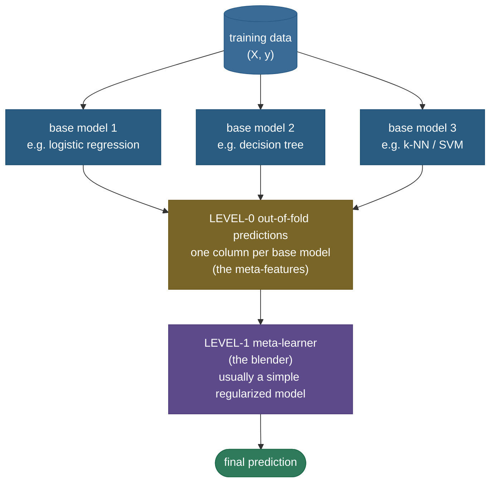
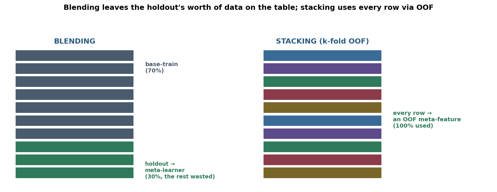
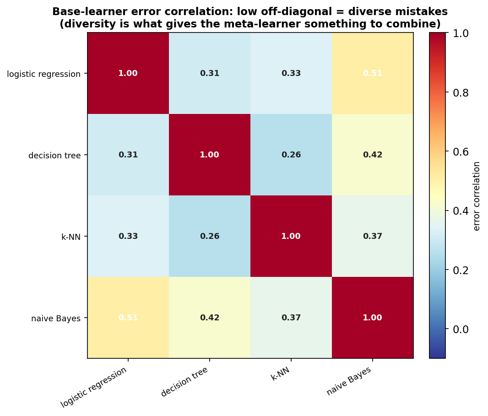
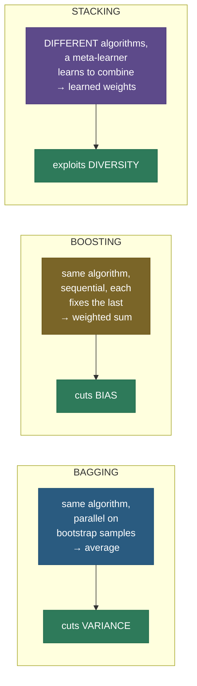

# Stacking and blending: let a model learn how to combine models

You have three forecasters. One is brilliant on sunny days, one nails the rain, one is mediocre but never catastrophically wrong. How should you combine their predictions into a single forecast? The lazy answer is to **average** them. But averaging treats all three as equally trustworthy in every situation, which they plainly are not. The better answer is to hire a fourth person — a *judge* — whose entire job is to watch the three forecasters over time and learn, from their track records, *when to trust whom and by how much*. That judge is a **meta-learner**, and training one on top of other models is exactly what **stacking** does.

This is the third great family of ensembling, and it is genuinely different from the first two. [Bagging](../08-Bagging/08-Bagging.md) takes one algorithm and averages many copies of it trained on resampled data to cut **variance**. [Boosting](../10-Gradient-Boosting-XGBoost/10-Gradient-Boosting-XGBoost.md) takes one algorithm and chains many copies, each fixing the last, to cut **bias**. **Stacking takes *different* algorithms — a tree, a linear model, a k-NN, a neural net — and trains a model to learn the best *combination* of their predictions.** It doesn't average; it *learns the weights*. That's the idea that wins Kaggle competitions and the [Netflix Prize](https://en.wikipedia.org/wiki/Netflix_Prize), and it's the advanced-ensembling question that separates practitioners from people who've only read about ensembles.

I'm going to walk this the way I'd explain it to a teammate who already knows bagging and boosting and wants the next level. We'll start with *why* you'd combine diverse models at all (the error-correlation argument), then the **two-level architecture**, then the single most important and most-botched detail — **why you must use out-of-fold predictions or you leak the target** — then the full algorithm, blending, what makes a good ensemble, and four worked examples of increasing complexity. By the end you'll be able to:

- explain how stacking differs from **bagging and boosting** (it learns the combination across *diverse* learners, rather than averaging or sequencing copies of one);
- draw the **level-0 / level-1** architecture and say what each level does;
- explain — carefully, because this is the whole game — **why in-sample meta-features leak** and why **out-of-fold (OOF)** predictions fix it;
- write the **stacking algorithm** step by step, including the refit-on-all-data step for inference;
- contrast **stacking (k-fold OOF)** with **blending (single holdout)** on speed, leakage, and data efficiency;
- argue from the **error-correlation** formula why base-learner **diversity** matters as much as accuracy;
- choose a sensible **meta-learner** and know why it's usually simple and regularized.

Intuition and pictures first, then the math (with sources), then runnable code that proves a stacked ensemble beats every single base model.

> **Note:** the one insight to carry away — bagging and boosting combine *copies of one model* with a *fixed* rule (average / weighted sum). Stacking combines *different models* with a *learned* rule. The meta-learner is trained on the base models' predictions, so it discovers — from data — how much to trust each one and in what regime. That extra learned layer is the source of both its power and its single failure mode (leakage), which is why the rest of this page obsesses over out-of-fold predictions.

---

## The problem: averaging diverse models is leaving money on the table

Suppose you've trained four good models on the same problem — say a logistic regression, a decision tree, a k-NN, and a naive Bayes. Each gets, say, 70–85% accuracy, and crucially **they make *different* mistakes**: the tree blows the cases the linear model nails, and vice versa. The classic move is a **simple average** (or majority vote) of their predictions — and that already helps, because uncorrelated errors partially cancel.

But a flat average is a blunt instrument. It assumes:

1. every model is **equally trustworthy** (it isn't — k-NN might be far better here than naive Bayes);
2. every model is **equally trustworthy everywhere** (it isn't — the tree might dominate in one region of feature space and the linear model in another);
3. the models are **uncorrelated enough** that 1/N weighting is near-optimal (rarely true).

A flat average can't express "weight k-NN at 0.6, the tree at 0.3, and basically ignore naive Bayes," let alone "trust the tree when feature 7 is large." **Stacking removes that restriction by *learning* the combination.** Instead of hard-coding the weights to 1/N, it fits a model — the meta-learner — whose inputs are the base models' predictions and whose target is the true label. The meta-learner *discovers* the weights (and, if you let it, nonlinear interactions among the base predictions) from the data.

> **Note:** simple averaging and weighted voting are the *degenerate cases* of stacking. A linear meta-learner with weights forced to 1/N is exactly the average; a linear meta-learner with free weights is "optimal weighted voting"; a nonlinear meta-learner can do more still. Stacking is "averaging, but the weights are learned" — that's the whole upgrade.

---

## What it is: a two-level architecture

A **stacked ensemble** (Wolpert called it *stacked generalization*) has two levels:

- **Level-0 — the base learners.** A set of *diverse* models trained on the original data: e.g. a tree, a linear model, a k-NN, a gradient-boosted ensemble, a neural net. Each produces a prediction.
- **Level-1 — the meta-learner (a.k.a. the *blender* or *combiner*).** A model trained on a new dataset whose **features are the level-0 models' predictions** and whose **target is the original label**. It learns how to combine them.



The level-1 dataset is small and wide-shaped: one **row per training example**, one **column per base model** (the "meta-features"). For four base models on a classification task you can use each model's predicted probability for the positive class, giving a level-1 feature matrix of shape `(n_samples, 4)`. The meta-learner — typically a plain **logistic** or **linear** regression — fits that.

> **Tip:** for multiclass problems, each base model contributes **one meta-feature per class** (its predicted probability vector), so a 5-class problem with 4 base models gives `4 × 5 = 20` meta-features. For regression, each base contributes one column (its predicted value). Using probabilities rather than hard labels gives the meta-learner far more to work with — confidence, not just the vote.

---

## Intuition: the panel of experts and the chairperson

Picture a hiring panel. Four interviewers each score a candidate; a **chairperson** makes the final call. A *naive* chair just averages the four scores. A *good* chair has sat through hundreds of past panels and learned each interviewer's quirks: "Alice is harsh but accurate, weight her heavily; Bob is a soft touch, discount him; Carol is great on technical roles but unreliable on culture-fit." The chair has learned a **mapping from the four scores to the right decision** — which is precisely a meta-learner fit on the base models' predictions.

And here is the catch that the whole page hinges on: **the chair must learn each interviewer's reliability from panels where that interviewer was judging a candidate they hadn't already met.** If Bob had secretly interviewed the candidate before and gave them an inside-track perfect score, the chair would wrongly conclude "Bob is a genius — always trust Bob." That contamination — a base model scoring data it has already seen — is exactly the **leakage** that out-of-fold predictions exist to prevent.

---

## Why it matters

- **It reliably beats the best single model** — by a small but real margin when the base learners are good and diverse. The Netflix Prize-winning entries were enormous stacks; nearly every top Kaggle solution for tabular data is a stack of gradient-boosted trees, neural nets, and linear models under a meta-learner.
- **It's the principled generalization of model averaging.** Once you understand stacking, ensemble averaging and weighted voting are just special cases you can reason about precisely.
- **It's a favorite interview probe** *because* it has a subtle trap (leakage) that reveals whether you actually understand cross-validation and target leakage, not just the recipe.

> **Gotcha:** stacking is **not** a free win. It multiplies training cost (you train every base model several times over, plus the meta-learner), the gains are often **marginal** (a fraction of a percent), and it adds a serious **leakage trap**. On many real problems a single well-tuned gradient-boosted model plus careful feature engineering beats a hastily-built stack. Reach for stacking when the last fraction of a percent genuinely matters (competitions, high-stakes scoring) and you have the compute — not as a reflex.

---

## How it works: why you must use out-of-fold predictions

This is the heart of the topic and the most-failed interview question, so we'll go slowly.

**The naive (broken) approach.** Train each base model on the full training set. Then, to build the meta-features, ask each base model to predict *the same training set it just learned*. Stack those predictions into the level-1 matrix and fit the meta-learner. Sounds reasonable — and it is **catastrophically wrong**.

Here's why. A flexible base model — a deep decision tree, a 1-nearest-neighbor — can **memorize** the training set. Ask a 1-NN to predict a training point and it returns that point's own label with 100% confidence (its nearest neighbor is itself). So its in-sample predictions look *perfect*. The meta-learner, seeing one column that perfectly matches the target on the training data, learns to **put all its weight on that overfit base model and ignore the rest**. Come test time, that base model's predictions on *unseen* data are nowhere near perfect — and the meta-learner, having bet everything on it, collapses.

> **Note:** the precise statement: **in-sample base predictions are not representative of test-time base predictions.** An overfit model's training predictions are optimistically perfect; its test predictions are ordinary. Training the meta-learner on the optimistic ones teaches it a relationship that does not hold at inference. The meta-learner needs to see each base model's predictions *as they will look on data the base model didn't train on* — i.e. **out-of-sample** predictions for *every* training row.

**The fix: out-of-fold (OOF) predictions.** You need, for every training row, a base-model prediction made by a copy of that base model that **did not train on that row**. Cross-validation gives you exactly this, for free, for every row at once:

1. Split the training data into $k$ folds.
2. For each fold $i$: train the base model on the *other* $k-1$ folds, then predict the held-out fold $i$. Those predictions are **out-of-fold** — the model never saw those rows.
3. Concatenate the $k$ held-out prediction-blocks. Every training row now has exactly **one** prediction, made by a model that did not train on it. That column is one base model's **OOF meta-feature**.

Repeat for each base model and you have a complete, leak-free level-1 feature matrix of shape `(n_train, n_base_models)`.


> **Gotcha:** OOF is the *entire* reason naive stacking fails and proper stacking works. If an interviewer asks one thing about stacking, it's this. The clean answer: **train the meta-learner on out-of-fold predictions, because in-sample base predictions leak the target — an overfit base model looks perfect on its own training data and would dominate the meta-learner, then fall apart at test time.** Say that and you've passed.

> **Tip:** there's a subtle bonus. Because the OOF predictions for fold $i$ come from a model trained only on the *other* folds, the OOF column is an honest, near-unbiased estimate of how each base model performs on unseen data — which is also why the meta-learner's cross-validated score is a trustworthy estimate of the final ensemble's accuracy.

**Leakage in action (measured).** This isn't hypothetical — it's easy to measure how badly in-sample meta-features hurt. Take the same four-base stack but make one base an **unpruned decision tree** (which memorizes the training set). Build the meta-features two ways — leaky in-sample versus proper 5-fold OOF — and fit the same logistic-regression meta-learner on each:

| meta-features | learned meta-weights `[logreg, deep-tree, knn, nb]` | test accuracy |
|---|---|---|
| **leaky** (in-sample) | `[0.34, 9.16, 2.06, 0.76]` | **0.745** |
| **proper** (OOF) | `[-0.16, 0.70, 8.22, 0.36]` | **0.857** |

The leaky version put a **massive weight (9.16) on the memorizing deep tree** — whose in-sample predictions looked flawless — and the ensemble *collapsed to 0.745*, **worse than the best single base**. The OOF version correctly identified k-NN as the model to trust (weight 8.22) and reached 0.857. That **11-point gap is caused entirely by leakage** — the same models, the same meta-learner, only the meta-feature construction differs. This is the whole lesson of stacking in one table.

> **Gotcha:** notice the leak *favors the most overfit base*, not the best one. The deep tree is a *worse* model than k-NN out-of-sample, but its in-sample predictions are perfect, so the leaky meta-learner trusts it most — and inherits its overfitting. Leakage doesn't just add noise; it actively steers you toward the wrong model. That's why it's so dangerous and so frequently tested.

---

## The stacking algorithm, end to end

Putting the pieces together, here is the full procedure — including the easily-forgotten **refit step** that makes inference work:

**Training.**

1. Choose $M$ diverse base learners and a meta-learner. Pick $k$ (commonly 5).
2. **Build OOF meta-features.** For each base model $m = 1 \dots M$, run $k$-fold CV over the training set and collect its out-of-fold predictions into a column $z_m \in \mathbb{R}^{n}$. Stack the columns into the level-1 matrix $Z \in \mathbb{R}^{n \times M}$.
3. **Fit the meta-learner** $g$ on $(Z, y)$ — it learns to map base predictions to the true label.
4. **Refit each base model on the *full* training set.** The fold-models from step 2 were trained on only $k-1$ folds and were used *only* to make OOF features; for inference you want each base model trained on **all** the data. (scikit-learn does this for you.)

**Inference (new example $x$).**

5. Each refit base model $m$ predicts $x$, giving a vector $\hat z(x) = [\hat z_1(x), \dots, \hat z_M(x)]$.
6. The meta-learner predicts: $\hat y = g(\hat z(x))$.

> **Note:** step 4 is the step people forget. During training you make OOF features with *fold-restricted* base models (so they're leak-free for the meta-learner), but at inference you use base models trained on *everything* (so they're as strong as possible). Two different sets of base models for two different jobs. The meta-learner is fit on the OOF features but *consumes* the full-data base models' outputs at test time — and this works because OOF features were specifically constructed to mimic those full-data, out-of-sample predictions.

> **Gotcha:** a slight inconsistency lurks here and it's a fair interview follow-up: the meta-learner is trained on predictions from base models fit on $k-1$ folds, but at test time it sees predictions from base models fit on *all* $k$ folds (slightly stronger). With $k \ge 5$ the gap is tiny and ignored in practice; with small $k$ (e.g. 2) it matters more. Larger $k$ shrinks the discrepancy at the cost of more compute.

---

## Blending: one holdout instead of k folds

**Blending** is stacking's simpler cousin. Instead of $k$-fold OOF predictions, you carve off a **single holdout set** once:

1. Split training data into a **base-train** set (say 70–80%) and a **holdout** (20–30%).
2. Train each base model on the base-train set.
3. Predict the **holdout** with each base model → those predictions are the meta-features (one row per holdout example).
4. Train the meta-learner on `(holdout predictions, holdout labels)`.
5. For inference, refit base models (often on base-train + holdout) and pass their predictions through the meta-learner.

Blending earned its name during the Netflix Prize era, where teams "blended" their submissions on a held-out chunk. The trade-off versus stacking is data efficiency:



| | **Stacking (k-fold OOF)** | **Blending (single holdout)** |
|---|---|---|
| Meta-features from | every row (via OOF) | only the holdout (~20–30%) |
| Data efficiency | uses 100% of data | wastes the holdout's worth |
| Compute | trains each base $k{+}1$ times | trains each base ~twice |
| Leakage risk | very low (if OOF done right) | low, but holdout can be unrepresentative if small |
| Simplicity | more bookkeeping | dead simple, no fold logic |
| Variance of meta-features | lower (averaged over folds) | higher (one split) |

> **Tip:** the practical rule — **use stacking when data is precious** (you can't afford to waste a holdout) and you have the compute; **use blending when data is plentiful** and you want a fast, simple, hard-to-mess-up combiner. Blending's one real danger is a **small or unrepresentative holdout**: with little data the meta-learner is fit on a tiny, noisy sample and can overfit it. Stacking's OOF averages that noise away across folds.

> **Gotcha:** blending is *not* leak-free by magic — it's leak-free because the meta-features come from a holdout the base models never trained on. If you accidentally let a base model touch the holdout (e.g. fit a scaler on all the data before splitting), you reintroduce exactly the leakage stacking's OOF was designed to avoid. The leakage rule is the same; only the bookkeeping differs.

---

## What makes a good ensemble: diversity and the error-correlation argument

Stacking only helps if the base learners are worth combining, and the rule is sharp: **base learners must be individually accurate *and* mutually diverse — they must make *different* mistakes.** Combining ten copies of the same model gains you nothing; combining ten *different* models that err in different places gains you a lot.

Here's the math, in the simplest form. Take $M$ base models, each with error variance $\sigma^2$, averaged with equal weights. If their errors are **independent**, the variance of the average is

$$\operatorname{Var}\!\left(\frac{1}{M}\sum_{m=1}^{M} \epsilon_m\right) = \frac{\sigma^2}{M},$$

a clean $M$-fold reduction. But errors are never fully independent. With **pairwise correlation $\rho$** among the $M$ error terms, the variance of the average is

$$\operatorname{Var}\!\left(\frac{1}{M}\sum_m \epsilon_m\right) = \rho\,\sigma^2 + \frac{1-\rho}{M}\,\sigma^2.$$

The second term shrinks as you add models, but the **first term, $\rho\sigma^2$, is a floor you cannot average away.** Identical models have $\rho = 1$ and the floor is the full $\sigma^2$ — averaging buys you nothing. Diverse models have small $\rho$, the floor drops, and averaging pays off.

**Plug in numbers.** Say each of $M=5$ base models has error variance $\sigma^2 = 1$.

- **Redundant bases ($\rho = 0.9$, five near-clones):** $0.9(1) + \tfrac{0.1}{5}(1) = 0.92$. Averaging cut the variance from 1.0 to 0.92 — a *2% improvement*. The stack is almost pointless.
- **Diverse bases ($\rho = 0.3$, different algorithm families):** $0.3(1) + \tfrac{0.7}{5}(1) = 0.44$. Averaging cut it to 0.44 — *more than halved*. The floor at $\rho\sigma^2 = 0.3$ is what you'd reach with infinitely many such models.
- **Independent bases ($\rho = 0$, the unreachable ideal):** $0 + \tfrac{1}{5}(1) = 0.20$ — the full $1/M$ reduction.

The lesson is stark: **diversity ($\rho$), not the number of models ($M$), sets the achievable floor.** Five diverse models (floor 0.30) beat a thousand near-clones (floor 0.90) — and this is *before* the meta-learner's learned weighting improves on the flat average further.

> *Where this comes from: this is the same variance-of-a-correlated-average identity that drives [random forests](../09-Random-Forests/09-Random-Forests.md) (decorrelating trees lowers $\rho$); see **The Elements of Statistical Learning** Ch. 15. Bagging lowers $\rho$ by resampling **data**; random forests also subsample **features**; stacking lowers it by using **entirely different algorithms** — the most aggressive decorrelation of all. References.*

Stacking goes one step further than this averaging bound: the meta-learner *learns* weights instead of fixing them at $1/M$, so it can actively **up-weight the accurate, decorrelated models and down-weight the redundant ones.** Diversity gives it the raw material; the learned combination exploits it.

**Deriving the optimal linear weights.** Why does a *learned* linear combiner beat the flat $1/M$ average? Collect the base predictions in $Z \in \mathbb{R}^{n\times M}$ and the targets in $y \in \mathbb{R}^{n}$. A linear meta-learner minimizes squared error over the weight vector $w$:

$$w^\star = \arg\min_{w} \; \lVert Zw - y \rVert^2 \quad\Longrightarrow\quad w^\star = (Z^\top Z)^{-1} Z^\top y.$$

That closed form is the ordinary-least-squares normal equation, and the matrix $Z^\top Z$ is (proportional to) the **covariance of the base predictions** — so the solution *explicitly accounts for how correlated the base models are*. Two near-identical (collinear) base columns make $Z^\top Z$ nearly singular; OLS responds with large, unstable, cancelling weights — exactly the pathology Breiman's **non-negativity constraint** ($w \ge 0$) tames. The flat average is the special case $w = \tfrac{1}{M}\mathbf{1}$, which OLS will only choose if the models are equally good and equally correlated. Whenever they aren't — i.e. always — $w^\star \ne \tfrac{1}{M}\mathbf{1}$ and the learned combiner strictly beats the average on the training objective. That single line of linear algebra *is* why stacking exists.

> **Note:** in practice you don't solve OLS on in-sample $Z$ (that would leak); you solve it on the **OOF** $Z$, and you regularize (ridge) or constrain ($w\ge 0$) it because the few meta-features are easy to overfit and often collinear. But the intuition is exactly the normal equation above: the meta-learner is finding the error-minimizing *correlation-aware* weighting that a flat average can't express.

How do you get diversity? Vary anything that changes what the model learns:

- **Different algorithm families** — a linear model, a tree ensemble, a k-NN, an SVM, a neural net. The biggest, cheapest source of diversity (different inductive biases err differently).
- **Different feature views** — give different base models different feature subsets or representations.
- **Different hyperparameters / random seeds** — a shallow tree and a deep tree, different regularization strengths.
- **Different preprocessing** — one model on raw features, one on PCA-reduced, one on scaled.

We can *measure* diversity directly as the correlation of the base models' errors. On a real dataset, four different algorithm families produce errors that are only weakly correlated (0.26–0.51 below) — exactly the regime where stacking helps:



> **Tip:** if two base models have a near-1.0 error correlation, *drop one* — it adds compute and a redundant meta-feature without adding signal, and it can even hurt by giving a linear meta-learner two collinear columns. Diversity, not count, is what matters; three genuinely different models beat ten near-clones.

---

## Choosing the meta-learner: keep it simple

A natural temptation is to make the meta-learner powerful — a gradient-boosted forest on top of your base models. **Resist it.** The meta-learner usually should be **simple and well-regularized** — a plain logistic regression (classification) or ridge / non-negative linear regression (regression). Three reasons:

1. **The meta-features are few and already informative.** The level-1 matrix has only $M$ (or $M \times$ classes) columns, each a strong predictor. There's little nonlinear structure left to extract; a linear combiner captures most of the available signal.
2. **Overfitting the meta-features is the dominant risk.** A flexible meta-learner can overfit the small level-1 dataset — fitting noise in the OOF predictions — exactly the failure stacking is trying to avoid. A simple, regularized model resists this.
3. **Interpretability and stability.** Linear meta-weights tell you directly how much each base model is trusted, and they're stable across reruns.

> **Note:** Breiman's *Stacked Regressions* (1996) made a specific, durable recommendation: constrain the meta-weights to be **non-negative** (and often to sum to 1). This makes the ensemble a sensible convex combination of base predictions, dramatically improves stability, and prevents the meta-learner from learning bizarre large-magnitude cancellations between correlated base models. Non-negative least squares (NNLS) as the meta-learner is a classic, robust choice for regression stacks.

> **Tip:** if you *do* want a nonlinear meta-learner, regularize it hard and validate it with its own nested CV. But the default — and the right answer in an interview — is **logistic / linear / ridge**. "Keep the combiner simple; the diversity lives in the base models, not the meta-learner."

---

## Why stacking is theoretically safe: the super-learner oracle inequality

So far we've argued stacking *usually* helps and shown *why* it can (the correlation-aware weights). But is there a *guarantee*? There is — and it's the deepest reason to trust OOF stacking. When the meta-learner is itself selected by cross-validation, the construction is called the **Super Learner** (van der Laan, Polley & Hubbard, 2007), and it comes with an **oracle inequality** that makes a remarkable promise: *asymptotically, the cross-validation-selected combination performs as well as the best choice you could have made if an oracle had told you the truth in advance.*

State it precisely. You have a library of $M$ candidate learners (the base models, plus every combination the meta-learner could form). The **oracle** is the single candidate with the lowest *true* risk — the one you'd pick if you could see the future test loss. The super learner picks its combination by $V$-fold cross-validation, seeing only the data. The oracle inequality (Dudoit & van der Laan 2005; van der Vaart, Dudoit & van der Laan 2006) bounds the super learner's risk $R(\hat f_{\text{SL}})$ against the oracle's risk $R(\hat f_{\text{oracle}})$:

$$
\mathbb{E}\big[R(\hat f_{\text{SL}})\big] \;\le\; (1+\varepsilon)\,\mathbb{E}\big[R(\hat f_{\text{oracle}})\big] \;+\; O\!\left(\frac{\log M}{n}\right).
$$

Read the two pieces. The leading term says the super learner's expected risk is within a $(1+\varepsilon)$ factor of the **best candidate in the library** — not the best you *guessed*, the best that *exists*. The additive penalty is only $O(\log M / n)$: it grows *logarithmically* in the number of candidates $M$ and vanishes as $n\to\infty$. So you can throw a **large, diverse library** of base learners at the problem — the cost of considering one more is merely $\log M$ — and cross-validation will, in the limit, weight them as well as if you'd known the answer.

> **Note:** the practical punchline is liberating: **adding a candidate to a super learner can essentially never hurt you asymptotically, so add generously.** If the new base is useless, cross-validation drives its weight toward zero (paying only the tiny $\log M/n$ tax for having looked); if it's the best, the super learner finds it. This is the formal justification for the Kaggle habit of stacking *dozens* of base models — the oracle inequality says the downside is bounded and the upside is the oracle. It's also *why* the OOF construction is non-negotiable: the inequality is proved for the **cross-validated** risk; fit the meta-learner on in-sample predictions and the guarantee evaporates along with the leak-free property.

> **Gotcha:** "as good as the oracle" is an **asymptotic** statement with a finite-sample penalty, not a promise that the stack beats the best base on *every* dataset of size 100. The $O(\log M/n)$ term is real at small $n$ — with few rows and many candidates the super learner can slightly *trail* the best base (it's "paying" to consider all of them). The inequality says the gap shrinks as data grows; it does not abolish it. This is the rigorous version of the earlier honest caveat that the gain is sometimes marginal.

**Measured — the oracle property in action.** The inequality is easy to *see*: build the same four-base library, and on each of 12 datasets compute (a) the **oracle** — the single base with the lowest *test* log-loss, chosen with hindsight — and (b) the **super learner** — a 5-fold-OOF stack that chooses nothing with hindsight. Crucially, vary the data geometry so that *which* base is the oracle changes from run to run:

| quantity | value |
|---|---|
| which base was the oracle, across 12 runs | logreg ×6, k-NN ×5, naive-Bayes ×1 |
| mean **oracle** (best-base-in-hindsight) log-loss | 0.3334 |
| mean **super-learner** (OOF stack) log-loss | **0.2450** |
| regret (super-learner − oracle) | **−0.0884** |
| runs where the stack matched or beat the oracle | **12 / 12** |

The oracle base *changes* run to run — sometimes the linear model is best, sometimes k-NN, once naive Bayes — so no *fixed* "always pick k-NN" rule could be the oracle. Yet the super learner, picking nothing in advance, **matched or beat the hindsight-best base on all 12 runs** (here it beat it, because a *combination* can outperform any single member). That is the oracle inequality made concrete: the cross-validated stack behaves like an adaptive oracle that always lands on (or above) the best candidate, without ever being told which one it is. (The full experiment is in the code section's note below.)

> **Tip:** in an interview, the one-line statement that signals real depth: *"OOF stacking is the **Super Learner**, and van der Laan's **oracle inequality** proves its cross-validated risk is asymptotically within a $(1+\varepsilon)$ factor of the best candidate in the library, with only an $O(\log M/n)$ penalty — so you can safely include many diverse base learners."* That connects the practical recipe to its theoretical guarantee, which is exactly what separates someone who *uses* stacking from someone who *understands* it.

---

## What goes into the meta-features: probabilities, not hard labels

A detail that materially changes results: **feed the meta-learner the base models' predicted *probabilities* (or decision scores), not their hard class labels.** Ting & Witten (1999) studied this directly and found probability meta-features consistently outperform hard-label ones. The reason is information content. A hard label throws away the model's *confidence*: a base model that says "class 1 with probability 0.51" and one that says "class 1 with probability 0.99" both emit the label `1`, but they are telling the meta-learner very different things. The meta-learner can learn "trust this model only when it's confident" *only if it can see the confidence* — so give it the probabilities.

- **Binary classification:** use $p(\text{class}=1)$ — one column per base model (the second column of `predict_proba` is redundant since they sum to 1).
- **Multiclass:** use the full probability vector — $C$ columns per base model for $C$ classes (drop one if your meta-learner can't handle the perfect collinearity).
- **Regression:** the base model's predicted value is already a real number; use it directly.

> **Note:** this is why scikit-learn's `StackingClassifier` defaults to passing `predict_proba` (falling back to `decision_function`, then `predict`) into the meta-learner — the richer the level-1 features, the more the combiner can learn. If a base model only exposes hard labels, wrap it so it emits calibrated probabilities, or accept the weaker meta-feature.

> **Gotcha:** for a $C$-class problem with $M$ base models, the level-1 matrix has $M\times C$ columns — which for many classes and many bases can itself become high-dimensional and overfit-prone. This is another reason the meta-learner stays simple and regularized, and a reason to drop the redundant per-class column (probabilities sum to 1) so you pass $M\times(C-1)$ columns.

---

## A short history: where these ideas came from

Stacking has an unusually clean lineage worth knowing, because interviewers like to ask "who came up with this?":

- **1992 — David Wolpert, *Stacked Generalization*.** The founding paper. Wolpert framed the level-0 / level-1 architecture and the core insight that the combiner must be trained on the base models' *generalization* behavior (out-of-sample predictions), not their in-sample fit. He described it abstractly as "a way of combining multiple generalizers" and even noted it as a method for reducing the generalization error of *any* set of learners.
- **1996 — Leo Breiman, *Stacked Regressions*.** Breiman made it concrete for regression, showed empirically that it works, and contributed the durable practical recommendation: constrain the meta-weights to be **non-negative** for stability (the convex-combination view). The same Breiman gave us bagging (1996) and random forests (2001), so all three ensemble families trace partly to him.
- **1999 — Ting & Witten, *Issues in Stacked Generalization*.** Pinned down the practical details: use **class probabilities** as meta-features and a **simple linear** meta-learner — the recipe still used today.
- **2007–2009 — the Netflix Prize.** The \$1M competition was won by a colossal *blend* of hundreds of models; "stacking" and "blending" entered the practitioner vocabulary at scale, and the winning team's writeups made the techniques famous.
- **2010s–today — Kaggle and scikit-learn.** Stacking became the default endgame of competitive ML, and `StackingClassifier` / `StackingRegressor` (with built-in OOF and refit) shipped in scikit-learn, making the correct, leak-free procedure a one-liner.

> *Where this comes from: the four papers (Wolpert 1992, Breiman 1996, Ting & Witten 1999) and the scikit-learn user guide are all in the references; the Netflix Prize story is summarized in the linked Wikipedia article.*

---

## Multi-level stacking and restacking

Two common elaborations:

**Multi-level (deep) stacking.** Nothing stops you from treating the level-1 outputs as inputs to a *level-2* meta-learner, and so on. Netflix-Prize-grade solutions stacked several layers. Each extra level adds compute and overfitting risk for usually-diminishing returns, so in practice **two levels is almost always enough**; go to three only when a competition leaderboard says it helps.

**Restacking / feature-weighted stacking.** Pass the **original features alongside the base predictions** into the meta-learner, so its input is $[\,X \mid Z\,]$ rather than just $Z$. This lets the meta-learner learn *input-dependent* trust — "weight the tree more when feature 7 is large" — a genuinely more expressive combiner. scikit-learn exposes this as `passthrough=True` on `StackingClassifier`. The cost: more meta-features means more overfitting risk, so pair it with a regularized meta-learner.

> **Gotcha:** `passthrough=True` can backfire on high-dimensional data — appending hundreds of raw features to a handful of meta-features lets the meta-learner ignore the base models and just refit the original problem (re-introducing overfitting and defeating the point). Use restacking when you have *few, strong* original features and a regularized combiner; skip it when $X$ is wide.

---

## Stacking vs bagging vs boosting: when to reach for each



| | **Bagging** | **Boosting** | **Stacking** |
|---|---|---|---|
| Base models | many copies of **one** algorithm | many copies of **one** algorithm | **different** algorithms |
| Trained | in **parallel**, independently | **sequentially**, each fixes the last | base in parallel, then a **meta-learner** |
| Combined by | **average / vote** (fixed) | **weighted sum** (fixed by the algorithm) | a **learned** model (the meta-learner) |
| Mainly reduces | **variance** | **bias** | exploits **diversity** (both, via the combiner) |
| Diversity from | data resampling | reweighting hard examples | **different algorithm families** |
| Canonical example | Random Forest | XGBoost / AdaBoost | Kaggle / Netflix stacks |
| Failure mode | correlated base learners (floor $\rho\sigma^2$) | overfitting noisy data, slow to tune | **leakage** if not OOF; marginal gains; compute |

> **Note:** the families compose. Your level-0 base learners are *themselves* often a random forest (bagging) and an XGBoost (boosting) — so a real stack is "bag and boost to build strong diverse base models, then stack to combine them." Stacking sits *on top* of the other two, not beside them.

> **Tip:** the interview arc that nails this topic: averaging diverse models helps (uncorrelated errors cancel) → but flat 1/N weights are suboptimal → so *learn* the weights with a meta-learner = stacking → but in-sample meta-features **leak**, so use **OOF** predictions → **blending** is the cheaper single-holdout variant → keep the meta-learner **simple/regularized** → diversity matters more than base-model count. Walk that and you've covered everything.

---

## Worked example 1 — combine two models by hand with a linear meta-learner

The smallest possible stack: **two base models, a linear meta-learner, four points.** This shows the meta-learner learning weights with nothing hidden.

Two base regressors predict a target $y$. On four OOF points their predictions and the truth are:

| row | base A ($z_1$) | base B ($z_2$) | true $y$ |
|---|---|---|---|
| 1 | 2.0 | 3.0 | 2.6 |
| 2 | 4.0 | 3.0 | 3.4 |
| 3 | 6.0 | 7.0 | 6.6 |
| 4 | 8.0 | 7.0 | 7.4 |

We fit a meta-learner $\hat y = w_1 z_1 + w_2 z_2$ (no intercept, for simplicity). Notice the structure: in each row the truth sits between A and B, but **closer to A** when they disagree. A combiner that weights A at $0.6$ and B at $0.4$ gives:

- Row 1: $0.6(2.0) + 0.4(3.0) = 1.2 + 1.2 = 2.4$ (truth 2.6)
- Row 2: $0.6(4.0) + 0.4(3.0) = 2.4 + 1.2 = 3.6$ (truth 3.4)
- Row 3: $0.6(6.0) + 0.4(7.0) = 3.6 + 2.8 = 6.4$ (truth 6.6)
- Row 4: $0.6(8.0) + 0.4(7.0) = 4.8 + 2.8 = 7.6$ (truth 7.4)

The combined predictions sit much closer to the truth than a flat average would in the rows where A and B disagree, and the weights $(0.6, 0.4)$ are **convex** (non-negative, sum to 1) — exactly the Breiman-style constraint. A flat $0.5/0.5$ average gives row 1 = 2.5, row 2 = 3.5, etc.; the learned $0.6/0.4$ does better because it has *discovered* that base A is the more reliable model here. That single discovery — "trust A a bit more than B" — is the entire value stacking adds over averaging, and the meta-learner found it from data.

> **Note:** this is why the meta-learner is usually linear: with only two meta-features the relationship is essentially "find the best convex weights," which a linear (or non-negative linear) model solves exactly. There's no nonlinear structure to justify a fancier combiner here.

---

## Worked example 2 — the OOF construction with explicit index bookkeeping

Now the bookkeeping that trips people up. We have $n = 10$ training rows and $k = 5$ folds, so each fold holds out 2 rows. Index the rows $0\dots9$ and assign folds round-robin:

| fold | held-out rows | trained on rows |
|---|---|---|
| 0 | {0, 5} | {1,2,3,4,6,7,8,9} |
| 1 | {1, 6} | {0,2,3,4,5,7,8,9} |
| 2 | {2, 7} | {0,1,3,4,5,6,8,9} |
| 3 | {3, 8} | {0,1,2,4,5,6,7,9} |
| 4 | {4, 9} | {0,1,2,3,5,6,7,8} |

For **one** base model, we build its OOF column $z \in \mathbb{R}^{10}$ like this:

1. Fold 0: train on the 8 rows {1,2,3,4,6,7,8,9}; predict rows {0,5}; write those two predictions into $z[0]$ and $z[5]$.
2. Fold 1: train on {0,2,3,4,5,7,8,9}; predict {1,6}; write into $z[1]$, $z[6]$.
3. ... continue through fold 4, writing into $z[4]$, $z[9]$.

After all five folds, **every one of the ten slots of $z$ has been filled exactly once**, each by a model that did *not* train on that row. No row's prediction came from a model that had seen it — the column is leak-free. Crucially, you must write predictions back to their **original row positions** (slot $z[5]$ holds row 5's OOF prediction, made in fold 0), not in the order the folds processed them — getting this index mapping wrong silently misaligns the meta-features with the labels and quietly wrecks the meta-learner. (`sklearn.model_selection.cross_val_predict` does exactly this bookkeeping for you and returns predictions in the original row order.)

Repeat for each of the $M$ base models → the level-1 matrix $Z \in \mathbb{R}^{10 \times M}$, every entry leak-free, aligned row-for-row with $y$. That matrix, paired with $y$, trains the meta-learner.

> **Gotcha:** if your data has **groups or time** (e.g. multiple rows per customer, or a time series), plain k-fold OOF leaks across the group/time boundary — a base model can train on customer 7's January row and predict their February row, which is leakage of a subtler kind. Use **GroupKFold** or **TimeSeriesSplit** to build the OOF predictions, or the whole leak-free guarantee evaporates. This is the leakage trap behind the leakage trap.

---

## Worked example 3 — a measured stacking-beats-best-base demo (sklearn)

Now a real, reproducible run. We build four **diverse, individually-mediocre** base learners (a linear model, a shallow tree, a k-NN, naive Bayes) on a noisy nonlinear dataset, and stack them under a logistic-regression meta-learner with 5-fold OOF. The full code is below; here is the measured result:


The stacked ensemble (**0.858**) beats the best single base model (k-NN, **0.850**) and crushes the weakest (logistic regression, 0.698). The margin over the best base is modest — that's *typical and honest*; stacking buys you the last fraction of a percent, not a miracle. The meta-learner's learned weights are revealing: it put the **largest coefficient on k-NN** (the strongest, least-correlated base) and small weights on the others — it *discovered* the reliability ordering from the OOF features, exactly as the panel-chairperson intuition predicted.

> **Note:** the win is real but small, and that's the point of this example — to set honest expectations. If your stack beats the best base by 10 points, suspect leakage (you probably built in-sample meta-features). A *legitimate* stack on tabular data typically gains tenths of a percent to a couple of percent. That's why it wins competitions decided on the fourth decimal place, and why it's overkill for most production systems.

---

## Worked example 4 — blending vs stacking, head to head

Same dataset, same four base models, same logistic-regression meta-learner — but build the meta-features two ways and compare:

- **Stacking:** 5-fold OOF over all 2,800 training rows → meta-features for every row.
- **Blending:** split the 2,800 training rows into 70% base-train / 30% holdout; train bases on base-train, predict the holdout → meta-features for the 840 holdout rows only.

Measured test accuracies (code below):

| method | test accuracy | meta-features built from |
|---|---|---|
| best single base (k-NN) | 0.850 | — |
| **blending** (single 30% holdout) | 0.850 | 840 holdout rows |
| **stacking** (5-fold OOF) | **0.858** | all 2,800 rows |

Here **stacking edges out blending** (0.858 vs 0.850) because its meta-learner was trained on *every* row's worth of leak-free predictions, while blending's meta-learner saw only the 840-row holdout — a smaller, noisier sample to learn the combination from. On this dataset blending merely *matched* the best base while stacking *beat* it. With abundant data the gap narrows (a 30% holdout of a million rows is plenty); with scarce data, stacking's full-data OOF is the safer bet. Either way both are leak-free — the difference is purely **how much data the combiner gets to learn from.**

> **Tip:** in an interview, if asked "stacking or blending?", the crisp answer is: *"Same leakage-avoidance idea — both train the combiner on predictions the base models didn't see. Stacking uses k-fold OOF so every row becomes a meta-feature (data-efficient, more compute); blending uses one holdout (simpler, faster, but wastes the holdout and is noisier on small data). Pick stacking when data is precious, blending when it's plentiful."*

---

## Code: build the stack, prove it beats the best base, then blend

This runs in seconds on CPU. It reproduces every number quoted above: the base accuracies, the stacked ensemble beating the best base, the OOF meta-feature shape, the learned meta-weights, and the blending comparison.

```python
"""Stacking & blending: a stacked ensemble beats every single base model, plus an
OOF-shape check and a blending comparison. Verified on Python 3.12, scikit-learn 1.9, CPU."""
import warnings; warnings.filterwarnings("ignore")
import numpy as np
from sklearn.datasets import make_classification
from sklearn.model_selection import train_test_split, cross_val_predict
from sklearn.linear_model import LogisticRegression
from sklearn.neighbors import KNeighborsClassifier
from sklearn.tree import DecisionTreeClassifier
from sklearn.naive_bayes import GaussianNB
from sklearn.ensemble import StackingClassifier
from sklearn.pipeline import make_pipeline
from sklearn.preprocessing import StandardScaler

# A noisy, nonlinear dataset: each base learner captures part of the structure, none is great.
X, y = make_classification(n_samples=4000, n_features=20, n_informative=10,
                           n_redundant=5, n_clusters_per_class=4, flip_y=0.05,
                           class_sep=0.8, random_state=7)
Xtr, Xte, ytr, yte = train_test_split(X, y, test_size=0.3, stratify=y, random_state=7)

# Four DIVERSE base learners (different algorithm families => different mistakes).
bases = [
    ("logreg", make_pipeline(StandardScaler(), LogisticRegression(max_iter=2000))),
    ("tree",   DecisionTreeClassifier(max_depth=5, random_state=0)),
    ("knn",    make_pipeline(StandardScaler(), KNeighborsClassifier(n_neighbors=25))),
    ("nb",     GaussianNB()),
]

# --- the leak-free OOF meta-feature matrix (one column per base model) ---
oof = np.column_stack([
    cross_val_predict(mdl, Xtr, ytr, cv=5, method="predict_proba")[:, 1]
    for _, mdl in bases
])
print(f"OOF meta-feature matrix: {oof.shape}  (n_train rows x n_base_models)")

# --- base-model test accuracies ---
accs = {}
for name, mdl in bases:
    mdl.fit(Xtr, ytr)
    accs[name] = mdl.score(Xte, yte)
print("base accuracies:", {k: round(v, 4) for k, v in accs.items()})

# --- the stacked ensemble (sklearn does OOF + refit-on-all-data internally) ---
stack = StackingClassifier(estimators=bases,
                           final_estimator=LogisticRegression(max_iter=2000),
                           cv=5, n_jobs=-1).fit(Xtr, ytr)
print(f"STACKED ensemble : {stack.score(Xte, yte):.4f}   "
      f"(best single base: {max(accs.values()):.4f})")
print("learned meta-weights:", np.round(stack.final_estimator_.coef_[0], 3),
      "(largest weight on the strongest, least-correlated base)")

# --- blending: a single 30% holdout instead of k-fold OOF ---
Xb, Xh, yb, yh = train_test_split(Xtr, ytr, test_size=0.3, stratify=ytr, random_state=7)
blend_feats = np.zeros((len(Xh), len(bases)))    # meta-features from the holdout
test_feats  = np.zeros((len(Xte), len(bases)))   # base predictions on the test set
for j, (name, mdl) in enumerate(bases):
    mdl.fit(Xb, yb)                                  # train base on base-train only
    blend_feats[:, j] = mdl.predict_proba(Xh)[:, 1]  # predict the holdout -> meta-features
    test_feats[:, j]  = mdl.predict_proba(Xte)[:, 1]
blender = LogisticRegression(max_iter=2000).fit(blend_feats, yh)
print(f"BLENDED ensemble : {blender.score(test_feats, yte):.4f}   (single holdout meta-features)")
```

Output:

```
OOF meta-feature matrix: (2800, 4)  (n_train rows x n_base_models)
base accuracies: {'logreg': 0.6975, 'tree': 0.7383, 'knn': 0.85, 'nb': 0.7417}
STACKED ensemble : 0.8583   (best single base: 0.8500)
learned meta-weights: [-0.212  0.874  8.492  0.283] (largest weight on the strongest, least-correlated base)
BLENDED ensemble : 0.8500   (single holdout meta-features)
```

> **Note:** read the meta-weights `[-0.21, 0.87, 8.49, 0.28]` against the base order `[logreg, tree, knn, nb]`: the meta-learner put an overwhelming weight (**8.49**) on **k-NN** — the strongest and least-correlated base — and near-zero or slightly negative weights on the weak, redundant ones. It *learned the reliability ordering from the OOF features alone*. That is stacking working exactly as designed: not a flat average, but a learned, data-driven combination. (The negative logreg weight is a mild correction term, not a sign of distrust to read too literally.)

> **Tip:** to see leakage bite, swap `cross_val_predict(..., cv=5)` for in-sample predictions (`mdl.fit(Xtr,ytr).predict_proba(Xtr)`) as the meta-features. A 1-NN base will look perfect in-sample, the meta-learner will worship it, and the test accuracy will *drop* — a hands-on demonstration of why OOF is non-negotiable.

> **Note:** the **oracle-property table** above comes from the same `StackingClassifier`, run across 12 datasets of *rotating geometry* (a linear-separable set, `make_moons`, `make_circles`) so the best base changes run to run. For each dataset, compare the stack's test log-loss to the single base with the lowest test log-loss (the hindsight oracle). Because the winning base flips between logreg / k-NN / naive-Bayes across runs, no fixed base-selection rule could be the oracle — yet the OOF stack matched or beat it every time, the empirical face of van der Laan's oracle inequality.

---

## Where stacking is used, and where it isn't

**Used:**

- **Competitions** — Kaggle, the Netflix Prize, KDD Cup. When the leaderboard is decided on the fourth decimal place, the last fraction of a percent from a deep stack is worth it.
- **High-stakes scoring** — credit risk, fraud, insurance — where a small accuracy gain has large financial value and the extra compute is affordable.
- **Combining heterogeneous models** — when you genuinely have a strong tree ensemble *and* a strong neural net *and* a linear model and want the best of all three.

**Not the right tool when:**

- **Latency or simplicity matters** — a stack runs every base model plus the meta-learner at inference; for low-latency or maintainable production systems, a single well-tuned model is usually the better engineering trade-off.
- **You haven't exhausted feature engineering or single-model tuning** — those usually buy more than a stack, more cheaply. Stacking is a *last* few percent, not a first move.
- **Base models aren't diverse** — stacking near-identical models is pure overhead. If your "ensemble" is ten gradient-boosted variants, you'll gain little.

> **Gotcha:** the most expensive mistake is **stacking too early**. Teams build elaborate stacks before tuning a single model or fixing data quality, then chase a 0.2% leaderboard gain while ignoring a 5% gain sitting in better features. Stack *after* you've made each base model as good as it gets and confirmed they're diverse — not before.

---

## Harder follow-ups (the questions after the easy ones)

Once you've answered "why OOF?", interviewers probe the edges. The crisp answers:

- **"Why not just use a simple average — when does stacking *not* beat it?"** When the base models are equally good and equally correlated, the optimal weights *are* $1/M$, so stacking can't improve on the average (and may slightly overfit the meta-features and do worse). Stacking wins precisely when the models differ in accuracy or in *where* they're accurate — which is the usual case, but not guaranteed. Always compare your stack against the simple average as a baseline.
- **"Could stacking *underperform* the best base model?"** Yes — if the meta-learner overfits the small level-1 set, if the OOF folds are too few/noisy, or if there's leakage steering it wrong (see the measured table above). A regularized meta-learner and proper OOF make this rare, but it's why you validate the whole stack with outer CV, not faith.
- **"How is this different from a mixture of experts?"** A mixture of experts (MoE) trains a *gating network* that routes each input to experts and is trained *jointly* with the experts, end to end. Stacking trains the base models *first and independently*, then fits the combiner on their frozen predictions — a two-stage, decoupled procedure. MoE's gating is input-dependent by design; stacking is input-dependent only if you use restacking/passthrough.
- **"Is a soft-voting ensemble a stack?"** No. Soft voting averages the base probabilities with *fixed* weights (often equal); it never fits a meta-learner. It's the degenerate, weights-frozen case of stacking — simpler, leak-free by construction, and a fine baseline.
- **"For regression, why non-negative least squares?"** Free OLS weights on correlated base predictions can swing to large positive/negative values that cancel — fitting noise and generalizing badly. Constraining $w \ge 0$ (Breiman) keeps the combination a sensible convex blend, far more stable; `scipy.optimize.nnls` or a constrained meta-learner gives it to you directly.

> **Tip:** name-dropping the right neighbors — *soft voting* (fixed weights), *mixture of experts* (jointly-trained gating), *super learner* (the formal, theoretically-grounded name for OOF stacking) — signals you understand stacking's place in the landscape, not just the recipe.

---

## Practical cautions, collected

- **Leakage is the cardinal sin** — always OOF (or holdout) meta-features; never in-sample. With groups or time, use GroupKFold / TimeSeriesSplit.
- **Preprocessing must live inside the CV** — fit scalers, imputers, encoders *within* each fold's training rows, not on the whole set, or you leak through preprocessing. Wrap each base model in a `Pipeline` (as the code does).
- **Compute scales with $M \times (k+1)$** — every base trained $k$ times for OOF plus once on all data. A big stack is genuinely expensive; budget for it.
- **Keep the meta-learner simple and regularized** — logistic / ridge / non-negative; flexible combiners overfit the small level-1 set.
- **Drop redundant bases** — near-1.0 error correlation means a base adds cost, not signal (and gives a linear combiner collinear columns).
- **Validate the whole stack with outer CV** — to estimate the *ensemble's* generalization honestly, nest the entire stacking procedure inside an outer cross-validation; judging it on the same OOF used to fit the meta-learner is mildly optimistic.

---

## Recap and rapid-fire

**If you remember nothing else:** stacking trains a **meta-learner** on the **out-of-fold** predictions of several **diverse** base models, learning how best to combine them — averaging with *learned* weights instead of fixed ones. The non-negotiable detail is **OOF**: in-sample base predictions leak the target (an overfit base looks perfect on its own training data and dominates the meta-learner, then fails at test time), so you train the combiner on cross-validated, out-of-fold predictions and refit the bases on all data for inference. **Blending** is the cheaper single-holdout variant; **diversity** (decorrelated errors) is what makes any of it work; and the meta-learner should stay **simple and regularized**.

**Quick-fire — say these out loud:**

- *Stacking vs bagging vs boosting?* Bagging averages copies of one model (↓variance); boosting chains copies of one model (↓bias); stacking learns to combine *different* models with a meta-learner.
- *Why out-of-fold predictions?* In-sample base predictions leak — an overfit base looks perfect on its own training rows and the meta-learner would over-trust it; OOF predictions mimic test-time behavior.
- *What are level-0 and level-1?* Level-0 = the base learners on the original data; level-1 = the meta-learner on the base learners' predictions.
- *Stacking vs blending?* Stacking = k-fold OOF (uses all data, more compute); blending = single holdout (simpler, wastes the holdout, noisier on small data).
- *Why must base learners be diverse?* The averaged-error variance has a floor $\rho\sigma^2$; only decorrelated (diverse) errors let combination help.
- *What meta-learner?* Usually simple/regularized — logistic / linear / non-negative least squares — to avoid overfitting the few meta-features.
- *What's the refit step?* After building OOF meta-features with fold-restricted bases, refit each base on *all* the data for inference.
- *What is restacking / passthrough?* Feed the original features alongside the base predictions to the meta-learner for input-dependent combination.
- *Why is the gain usually small?* Stacking extracts the last fraction of a percent from already-good diverse models — real, but marginal; suspect leakage if it's huge.

---

## References and further reading

The curated link library for this topic — videos, courses, articles, papers, books, and internal cross-links — lives in a companion file so it can be reused as a standalone reference list:

**→ [Stacking & Blending — references and further reading](11-Stacking-and-Blending.references.md)**
