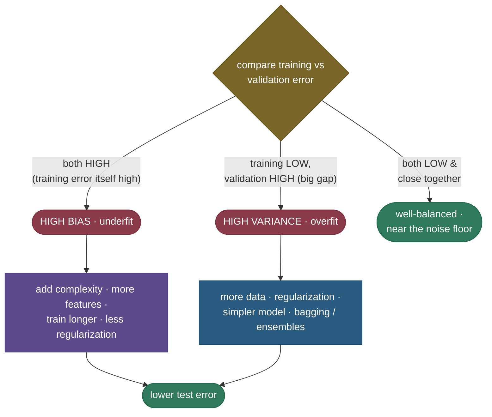

# The bias–variance tradeoff: why a model that fits perfectly can still fail

Here is the question that sits underneath all of supervised learning: *why doesn't fitting the training data perfectly give a perfect model?* You hand the algorithm a dataset, it drives the training error to zero, and then it falls flat on the very next example it sees. The answer — the single most clarifying idea in the field — is that a model's expected error on **new** data splits into two competing forces that you cannot minimize at the same time. **Bias** is error from a model being too simple to capture the real pattern: it makes the same wrong assumption every time, so it is *consistently* off. **Variance** is error from a model being too sensitive to the particular training set it happened to see: it learns the noise, so it would give wildly different answers if you had sampled different data. The cruel part is that these two pull in *opposite* directions — making a model more flexible reduces bias but increases variance, and making it simpler does the reverse. You can't drive both to zero, so the whole game of machine learning is finding the sweet spot between them.

This is the master lens for reasoning about underfitting, overfitting, regularization, ensembles, model selection, and even the strange behaviour of giant neural networks — and a near-guaranteed interview question. By the end of this page you'll be able to:

- write and **derive from scratch** the decomposition $\mathbb{E}[(y - \hat f)^2] = \text{Bias}^2 + \text{Variance} + \sigma^2$, including *why* every cross-term vanishes;
- separate the **three** sources of error — bias, variance, and **irreducible noise** — and say which you can and cannot fix;
- explain the **dartboard** intuition and map bias/variance precisely onto **underfitting/overfitting**;
- read the **U-shaped** test-error curve and find the complexity sweet spot — and explain why training error alone can't find it;
- derive the bias/variance behaviour of **concrete models**: kNN ($\propto 1/k$), linear vs polynomial degree, tree depth, and regularization strength $\lambda$;
- **diagnose** high bias vs high variance from train/validation error and pick the right fix every time;
- connect it to **more data, regularization, more features, and ensembles** (bagging cuts variance, boosting cuts bias) — and say *how each lever moves the trade-off*;
- explain the modern **double-descent** wrinkle: why over-parameterized models generalize past the interpolation threshold (Belkin et al. 2019);
- reproduce all of it in runnable code: four worked numeric examples of increasing complexity, where the measured numbers confirm the algebra.

Intuition and pictures first, then the algebra (derived, with sources), then four runnable decompositions.

> **Note:** "bias" and "variance" here are *not* the colloquial meanings, and not the "bias term" $b$ in $wx+b$ either. **Bias** = how far off your model is *on average*, across many hypothetical training sets; **variance** = how much your model *jumps around* as the training set changes. A model can be right on average yet useless because it is wildly unstable (high variance) — or rock-steady yet always wrong (high bias). Hold these two definitions precisely; almost every confusion downstream comes from blurring them.

---

## The problem: training error is not what you care about

You fit a model by minimizing error on the training set, but what you actually want is low error on **unseen** data drawn from the same distribution. These two quantities differ — sometimes enormously — and the reason is the source of everything that follows.

Your training set is a **random sample** of size $n$ from the true data distribution, and the labels carry **noise**. A flexible-enough model will fit not just the signal but that specific sample's noise: it scores beautifully on the training points and poorly on new ones, because the noise it memorized won't repeat. So training error is a *biased-downward, optimistic* estimate of test error — and the gap between them grows with model flexibility. Two different random training sets of the same size will yield two different fitted models; a model that is very sensitive to *which* sample it got is, by definition, high-variance.

To reason about expected performance rather than the luck of one particular dataset, we take the expectation over **two** sources of randomness at once: (1) the random draw of the training set $\mathcal{D}$, which determines the fitted $\hat f$, and (2) the random label noise $\epsilon$ at the test point. That double expectation is what makes the clean three-way decomposition possible.

> **Gotcha:** a low *training* error tells you almost nothing on its own. A 1-nearest-neighbour model has **zero** training error always (every point is its own nearest neighbour) yet can have terrible test error. Training error measures fit, not generalization. The bias–variance decomposition is precisely the tool that connects the two by averaging over training sets.

---

## What it is, in one breath

The **bias–variance tradeoff** is the statement that the expected generalization error of a model, under squared-error loss, is the **sum of three non-negative terms** — the squared bias, the variance, and an irreducible noise floor — and that **bias and variance move in opposite directions as you change model complexity**, so minimizing total error means *balancing* them rather than driving either to zero. It is simultaneously a precise theorem (the decomposition you'll derive below) and a practical philosophy (every knob you turn is a point on a U-curve).

The reason it deserves its central place: almost every other concept in supervised learning — regularization, cross-validation, ensembles, early stopping, feature selection, model capacity, even why deep nets work — is a *strategy for navigating this one trade-off*. Learn it once and the rest of the field reads like commentary on it.

---

## Intuition: the two ways a student fails an exam

The fastest way to feel bias and variance is to picture two students preparing for an exam from a textbook (the training set), then sitting a *different* exam on the same subject (the test set).

- The **lazy** student learns one blunt rule of thumb — "always pick C" — and applies it to everything. They're stable (you can predict exactly what they'll do) but *systematically wrong*. That's **high bias**: a model too simple to capture the real structure, making the same mistake every time. More study material won't help; the rule is just too crude.
- The **over-eager** student memorizes the textbook's exact problems and answers, including its typos and the quirks of its specific examples. Hand them the *same* problems and they ace it; hand them slightly different ones and they fall apart, because they learned the noise, not the concept. That's **high variance**: a model so flexible it fits the training set's accidents, so it would behave completely differently if it had studied a *different* textbook.

The student you want studied enough to grasp the underlying concepts (low bias) but didn't over-index on one book's idiosyncrasies (low variance). And the **irreducible noise** is the part of the exam that's just bad luck — an ambiguous question no amount of studying could nail — the floor on anyone's score.

> **Note:** the same data that *teaches* a model also *misleads* it, because real data is signal **plus** noise. Bias is failing to learn the signal; variance is mistaking the noise for signal. The whole craft is extracting as much signal as the data supports without starting to chase the noise — and the bias–variance decomposition is the equation that says exactly where that line is.

---

## Three sources of error, made concrete

Before the algebra, fix the setup we will use everywhere on this page. There is a true function $f$ we wish we knew, and the world hands us **noisy** observations of it:

$$y = f(x) + \epsilon, \qquad \mathbb{E}[\epsilon] = 0, \qquad \text{Var}(\epsilon) = \sigma^2.$$

The noise $\epsilon$ is the part of $y$ that *no* function of $x$ could ever predict — measurement error, unobserved variables, genuine randomness. We train a model $\hat f$ on a random dataset $\mathcal{D}$ and evaluate it at a fixed test point $x$. The error there decomposes into exactly three pieces:

- **Bias²** — how far the *average* model $\mathbb{E}[\hat f(x)]$ (averaged over all possible training sets) sits from the truth $f(x)$. This is structural: a straight line fit to a curve is biased no matter how much data you throw at it. Reducible by **more flexibility**.
- **Variance** — how much $\hat f(x)$ wobbles around its own average as the training set changes, $\mathbb{E}[(\hat f(x) - \mathbb{E}[\hat f(x)])^2]$. This is instability. Reducible by **less flexibility, more data, or averaging**.
- **Irreducible noise** $\sigma^2$ — the variance of $\epsilon$ itself. **No model can beat it**, ever; it is a floor on test error set by the problem, not the model.

> **Tip:** the quickest way to internalize the three is to ask, for any error you observe, "would more data fix it?" More data shrinks **variance** toward zero. It does **not** touch **bias** (a line stays a line) and it does **not** touch **noise** (the floor is the floor). That single question — *would more data help?* — is a fast field diagnostic for which term dominates.

---

## The decomposition, derived step by step

This derivation is short, and being able to produce it on a whiteboard is the difference between knowing the formula and understanding it. We want the expected squared error at a point $x$, averaged over both the training set (which makes $\hat f$ random) and the label noise $\epsilon$:

$$\mathbb{E}\big[(y - \hat f(x))^2\big].$$

**Step 1 — substitute the data model.** Replace $y$ with $f(x) + \epsilon$ and regroup so the noise sits by itself:

$$\mathbb{E}\big[(f(x) + \epsilon - \hat f(x))^2\big] = \mathbb{E}\big[\big((f(x) - \hat f(x)) + \epsilon\big)^2\big].$$

**Step 2 — expand the square.** Writing $u = f(x) - \hat f(x)$, the square is $u^2 + 2u\epsilon + \epsilon^2$:

$$= \mathbb{E}\big[(f(x) - \hat f(x))^2\big] + 2\,\mathbb{E}\big[(f(x) - \hat f(x))\,\epsilon\big] + \mathbb{E}[\epsilon^2].$$

**Step 3 — kill the noise cross-term.** The test-point noise $\epsilon$ is zero-mean and **independent** of the training set (and hence of $\hat f$, which was fit on *other* data) and of the fixed truth $f(x)$. Independence lets the expectation factor, and $\mathbb{E}[\epsilon]=0$ finishes it:

$$2\,\mathbb{E}\big[(f - \hat f)\,\epsilon\big] = 2\,\mathbb{E}[f - \hat f]\cdot\underbrace{\mathbb{E}[\epsilon]}_{=\,0} = 0.$$

And $\mathbb{E}[\epsilon^2] = \text{Var}(\epsilon) + (\mathbb{E}[\epsilon])^2 = \sigma^2 + 0 = \sigma^2$. So far:

$$\mathbb{E}\big[(y - \hat f)^2\big] = \mathbb{E}\big[(f - \hat f)^2\big] + \sigma^2.$$

**Step 4 — the bias–variance split.** Now decompose the remaining $\mathbb{E}[(f - \hat f)^2]$ by the classic *add-and-subtract-the-mean* trick. Insert $\mathbb{E}[\hat f]$ (the average prediction over training sets) with a $+$ and a $-$:

$$\mathbb{E}\big[(f - \hat f)^2\big] = \mathbb{E}\Big[\big((f - \mathbb{E}[\hat f]) + (\mathbb{E}[\hat f] - \hat f)\big)^2\Big].$$

**Step 5 — expand again.** With $a = f - \mathbb{E}[\hat f]$ (a **constant** — neither $f$ nor $\mathbb{E}[\hat f]$ depends on the particular training set) and $b = \mathbb{E}[\hat f] - \hat f$:

$$= \underbrace{\mathbb{E}[a^2]}_{a^2} + 2\,\mathbb{E}[ab] + \mathbb{E}[b^2].$$

**Step 6 — kill the second cross-term.** Pull the constant $a$ out of the cross-term; what remains is $\mathbb{E}[b] = \mathbb{E}[\mathbb{E}[\hat f] - \hat f] = \mathbb{E}[\hat f] - \mathbb{E}[\hat f] = 0$:

$$2\,\mathbb{E}[ab] = 2a\,\mathbb{E}\big[\mathbb{E}[\hat f] - \hat f\big] = 2a\cdot 0 = 0.$$

**Step 7 — read off the three terms.** What's left is exactly the decomposition:

$$\boxed{\;\mathbb{E}\big[(y - \hat f(x))^2\big] = \underbrace{\big(f(x) - \mathbb{E}[\hat f(x)]\big)^2}_{\text{Bias}^2} + \underbrace{\mathbb{E}\big[(\hat f(x) - \mathbb{E}[\hat f(x)])^2\big]}_{\text{Variance}} + \underbrace{\sigma^2}_{\text{irreducible noise}}\;}$$

Three terms, two of which you can trade against each other and one you cannot touch. Both cross-terms vanished for the **same structural reason**: one factor was zero-mean (the noise in Step 3; the centered prediction in Step 6), so its expectation killed the product.

> **Note:** the decomposition is **pointwise** — it holds at each $x$. The expected test error reported in practice is this quantity *averaged over the test distribution of $x$*, i.e. $\int [\text{Bias}^2(x) + \text{Var}(x)]\,p(x)\,dx + \sigma^2$. The shape of the story (bias falls, variance rises, noise is a floor) is identical; the integral just sums the per-point terms. Our code below averages over a grid of test points, which is the discrete version of this.

> **Gotcha:** this clean three-way split is special to **squared-error** loss. For 0–1 classification loss the analogue is messier — bias and variance interact *multiplicatively* in places, and a high-variance vote can sometimes *correct* a biased base learner (Domingos 2000 has the general treatment). The intuition (simple→bias, complex→variance) carries over; the exact additive algebra does not. Say "for squared loss" when you write the formula in an interview.

> *Where this comes from: the decomposition entered ML through **Neural Networks and the Bias/Variance Dilemma** (Geman, Bienenstock & Doursat 1992); the textbook derivations are **The Elements of Statistical Learning** §2.9 and §7.3, and **An Introduction to Statistical Learning** §2.2 — all in the references.*

---

## The dartboard: meaning made visual

The classic picture makes all three terms tangible at once. The bullseye is the true value $f(x)$, and each dart is the prediction $\hat f(x)$ from a model trained on a *different* random dataset. Run the thought experiment many times and you get a *pattern* of darts, and that pattern's geometry **is** the bias and variance.


- **Bias** is how far the *cluster's center* sits from the bullseye. A biased model is systematically off — its darts cluster around the wrong spot.
- **Variance** is how *spread out* the darts are. A high-variance model's darts are scattered, even if their average lands on target.
- You want the **top-left**: a tight cluster *on* the bullseye. **Underfitting** is the bottom-left (high bias — consistently off, low scatter); **overfitting** is the top-right (low bias — right on average — but high scatter, so any *single* model you actually ship is unreliable).

> **Tip:** the top-right quadrant is the one people misread. "Low bias, high variance" sounds good because the *average* is correct — but you never get to ship the average; you ship **one** model trained on **one** dataset, which is **one** scattered dart. That is why an overfit model with great cross-validated *mean* behaviour can still be fragile in production: you deployed a single draw from a high-variance distribution.

---

## The complexity trade-off and the U-curve

Model complexity is the master dial that trades bias for variance. A **too-simple** model (a straight line for a curvy function) has **high bias, low variance** — it underfits, missing the pattern the same way every time. A **too-complex** model (a high-degree polynomial through a few noisy points) has **low bias, high variance** — it overfits, chasing every wiggle of the training noise and swinging wildly between the points it was forced through. Plotting the three terms against complexity gives the iconic shape of supervised learning:


This is a **real bootstrap measurement** (reproduced in the code below, not a cartoon): bias² falls monotonically with complexity, variance rises (gently at first, then explosively), and their sum — the total test error sitting on the irreducible-noise floor — bottoms out at an intermediate **sweet spot**, then shoots up as the high-degree model overfits. The minimum of that U is the best bias–variance balance: not where either term is individually smallest, but where their **sum** is.

The contrast that makes this actionable: **training error falls monotonically** with complexity (a more flexible model always fits the training data at least as well), while **test error is U-shaped**. The growing *gap* between them is exactly the variance you are paying for. This is why training error alone can never locate the sweet spot — it only ever points "more complex," straight off the cliff.

> **See it interactively:** [MLU-Explain: The Bias–Variance Tradeoff](https://mlu-explain.github.io/bias-variance/) lets you drag the model-complexity slider and watch bias, variance, and total error move in real time — the live version of this exact figure.

---

## Bias and variance of concrete models

"Complexity" is abstract; in practice it is a specific hyperparameter on a specific model. Here is how the trade-off shows up in the four you will be asked about.

**kNN — complexity is $1/k$.** A $k$-nearest-neighbours regressor averages the $k$ closest labels. With $k=1$ it copies the single nearest point — maximally flexible, near-zero bias, but huge variance (one noisy neighbour swings the prediction). As $k$ grows it averages more neighbours, which **smooths** the prediction: variance falls (averaging $k$ values cuts variance roughly by $\sigma^2/k$), but bias rises because distant, dissimilar points get pulled into the average. At the extreme $k=n$ it predicts the global mean everywhere — minimum variance, maximum bias. So **effective complexity is $\propto 1/k$**: small $k$ = complex, large $k$ = simple.


**Linear vs polynomial degree.** Plain linear regression is high-bias for nonlinear truths (a plane can't bend) but very low-variance (only $p+1$ coefficients to estimate). Each extra polynomial degree adds flexibility: bias drops, variance climbs — the U-curve figure above *is* a polynomial-degree sweep.

**Decision trees — complexity is depth.** A depth-1 stump is a single threshold: high bias, low variance. A tree grown to pure leaves memorizes the training set: near-zero bias, very high variance (resample the data and you get a wholly different tree). Depth (and `min_samples_leaf`) is the bias–variance dial — which is exactly why a single deep tree is unstable and why [random forests](../09-Random-Forests/09-Random-Forests.md) average many of them.

**Regularization strength $\lambda$.** Ridge/Lasso add a penalty $\lambda \lVert w \rVert$ that shrinks coefficients toward zero. At $\lambda = 0$ you recover the unregularized fit (low bias, high variance); as $\lambda \to \infty$ the model is forced flat (high bias, low variance). $\lambda$ is a **continuous** complexity dial — and uniquely, you can tune it on a single model without changing its functional form.

> **Note:** these are all the *same* dial wearing different clothes. "More complex" means: smaller $k$, higher degree, deeper tree, smaller $\lambda$, more features, more parameters, longer training. Recognizing that every model-selection knob is secretly the bias–variance dial is what lets you reason about an unfamiliar model on sight.

### A closed form: linear regression variance grows with p/n

Linear regression is the one case where you can *derive* the variance in closed form, and it reveals the deepest practical lesson — the curse of dimensionality. For the model $y = X\beta + \epsilon$ with $\text{Var}(\epsilon)=\sigma^2$, the OLS estimator is $\hat\beta = (X^\top X)^{-1}X^\top y$, and a standard result is that the **average prediction variance over the training points** is:

$$\frac{1}{n}\sum_{i=1}^{n}\text{Var}(\hat f(x_i)) = \sigma^2\,\frac{p}{n},$$

where $p$ is the number of parameters and $n$ the number of training points. (It follows from $\text{Var}(\hat f) = \sigma^2\,x^\top(X^\top X)^{-1}x$ and the trace identity $\text{tr}(H)=p$ for the hat matrix $H=X(X^\top X)^{-1}X^\top$.) Read what $\sigma^2 p/n$ says:

- **More parameters $p$ → more variance**, linearly. Every coefficient you add is one more noisy quantity to estimate. This *is* the U-curve's rising-variance arm, made exact.
- **More data $n$ → less variance**, as $1/n$. Doubling the dataset halves the variance contribution — the precise statement of "more data fixes variance."
- The ratio $p/n$ is the real driver. When $p \approx n$ the variance **explodes** (and $X^\top X$ becomes near-singular) — exactly the interpolation-threshold spike you'll see in double descent. When $p \ll n$, variance is small and bias dominates.

> **Note:** $\sigma^2 p/n$ is the cleanest one-line summary of the whole trade-off for linear models: **bias falls as you add features (larger $p$), variance rises as $\sigma^2 p/n$, and total error is their sum.** It's also why high-dimensional problems ($p$ comparable to or exceeding $n$) demand regularization — ridge replaces $(X^\top X)^{-1}$ with $(X^\top X + \lambda I)^{-1}$, shrinking the variance at the cost of a little bias, which is precisely Example 4.

---

## The estimate vs the model: two levels of variance

A subtlety worth pinning down, because it trips people up: there are *two* distinct things whose bias and variance you might be discussing, and conflating them causes confusion.

1. **The model's predictions** $\hat f(x)$ — the quantity in the decomposition above. Its bias and variance are about how the *function* the algorithm outputs varies across training sets, evaluated at a test input. This is what "bias–variance tradeoff" almost always refers to.
2. **The parameter estimates** $\hat\theta$ themselves — the fitted coefficients/weights. An estimator $\hat\theta$ of a true $\theta$ has its own bias $\mathbb{E}[\hat\theta] - \theta$ and variance $\text{Var}(\hat\theta)$, and its mean-squared error decomposes the same way: $\text{MSE}(\hat\theta) = \text{Bias}(\hat\theta)^2 + \text{Var}(\hat\theta)$ (no noise term — $\theta$ is a fixed constant, not a noisy observation).

These are linked but not identical. Worked Example 1 below is a *parameter*-level decomposition (estimating a single scalar $\theta$); Examples 2–4 are *prediction*-level (the function's error over a test set). The shrinkage story is the same at both levels — accept some bias to cut variance — which is exactly why ridge regression (a biased *coefficient* estimator) produces a lower-error *prediction* function. Recognizing which level a question is about keeps the algebra straight: the prediction MSE carries the $+\sigma^2$ noise floor; the parameter MSE does not.

> **Gotcha:** the famous statistical result that the **ordinary least squares estimator is BLUE** (Best Linear *Unbiased* Estimator, Gauss–Markov) is about minimizing variance *among unbiased* estimators. The bias–variance tradeoff says you can often do *better* on total MSE by leaving the unbiased class entirely — which is precisely what ridge/Lasso do. "Unbiased" is not the same as "best"; an interviewer who asks "if OLS is BLUE, why ever use ridge?" is testing exactly this point.

---

## Diagnosing it in practice

The framework earns its keep because **train vs validation error** tells you *which* problem you have — and therefore which knob to turn. This is the single most useful debugging loop in applied ML.



- **High bias (underfitting):** training error *itself* is high, and validation error is similar (small gap). The model can't even fit the data it has seen → **add capacity** (more features/complexity, train longer, reduce regularization). More data will **not** help here.
- **High variance (overfitting):** training error is low but validation error is much higher (a **big gap**). The model memorized noise → **reduce variance** (more data, [regularization](../03-Regularization-Linear-Models/03-Regularization-Linear-Models.md), a simpler model, or ensembles).
- **Both low and close:** you're near the irreducible floor — there may be little left to win, and chasing it risks overfitting the validation set.

> **Tip:** this is the **Andrew-Ng diagnostic loop**. The order matters: *first* drive **training** error down to an acceptable level (that fixes bias), *then* close the **train/val gap** (that fixes variance). Reversing it wastes effort — treating an underfitting problem (high train error) by *adding data*, or an overfitting problem (big gap) by *adding capacity*, makes things worse. Look at the floor vs the gap and the right knob is obvious.

> **Gotcha:** a **learning curve** (error vs training-set size) disambiguates the two even faster. High variance: train and val curves are far apart but **converging** as you add data — so more data helps. High bias: the curves have already **met at a high error** and flattened — more data is useless; you need a better model. If your two curves have plateaued together well above the noise floor, stop collecting data and add capacity.

### Finding the sweet spot: cross-validation estimates the U-curve

The U-curve is a *theoretical* object — you can't see the true bias and variance in production because you don't know $f$. **Cross-validation** is the practical machine that estimates it. For each candidate complexity (degree, $\lambda$, depth, $k$), $k$-fold CV trains on $k-1$ folds and scores on the held-out fold, $k$ times, and averages — giving an (approximately) unbiased estimate of test error at that complexity. Plot the CV score against the hyperparameter and you have a **measured U-curve**; its minimum is your sweet spot.

The connection back to bias–variance is direct: the **mean** CV score traces the total-error U; the **spread** of scores across folds is a proxy for the model's variance (a high-variance model gives wildly different scores on different folds). And CV itself has a bias–variance trade in its *fold count*: large $k$ (e.g. leave-one-out) is nearly unbiased but high-variance and expensive; small $k$ (e.g. 5-fold) is slightly pessimistically biased but lower-variance and cheap — which is why **5- or 10-fold** is the standard compromise. See [Cross-Validation](../13-Cross-Validation/13-Cross-Validation.md) for the full treatment.

> **Tip:** the **one-standard-error rule** is a bias–variance-aware refinement: among models within one standard error of the best CV score, pick the **simplest** one. You give up a statistically-insignificant bit of CV accuracy to buy a lower-variance, more robust model — explicitly trading toward the bias side because the CV estimate of the minimum is itself noisy.

---

## The levers, and how each moves the trade-off

Every common technique is a move along the bias–variance trade-off. Knowing *which term each one attacks* turns the framework into a checklist.

| Lever | Bias | Variance | When to reach for it |
|---|---|---|---|
| **More training data** | — (unchanged) | **↓↓** | High variance (big train/val gap) |
| **Regularization** (L1/L2, dropout, early stopping) | ↑ (a little) | **↓↓** | High variance |
| **More features / higher complexity** | **↓↓** | ↑ | High bias (underfitting) |
| **Fewer features / lower complexity** | ↑ | ↓ | High variance |
| **Bagging** (random forests) | — | **↓↓** | High-variance base learner |
| **Boosting** (gradient boosting) | **↓↓** | ↑ (a little) | High-bias base learner |

- **More training data** lowers **variance** (each sample matters less, so $\hat f$ depends less on the luck of the draw) and leaves bias untouched — a line fit to a million points is still a line.
- **Regularization** deliberately *adds a little bias* (shrinking coefficients pulls the model away from the unconstrained best fit) to *buy a large variance reduction*. The λ-sweep example below shows this numerically: variance drops far faster than bias² rises.
- **More features / complexity** lowers **bias** (the model can express more) at the cost of variance — the U-curve's left-to-right.
- **Bagging** averages many high-variance, low-bias models trained on bootstrap samples. Averaging $B$ independent estimates cuts variance by up to $B$× while leaving the (already low) bias alone — it attacks **variance** directly. ([Random forests](../09-Random-Forests/09-Random-Forests.md) go further by *decorrelating* the trees so the averaging pays off more.)
- **Boosting** sequentially fits weak, high-bias learners, each correcting the last's residuals, assembling a low-bias committee — it attacks **bias** (while a small learning rate and shrinkage keep variance in check).

> **Note:** the interview one-liner to have ready: **bagging attacks variance, boosting attacks bias.** Bagging takes low-bias/high-variance trees and averages the variance away in parallel; boosting takes high-bias/low-variance stumps and drives the bias down sequentially. Same ensemble idea, opposite ends of the trade-off.

### Why averaging reduces variance (the bagging math)

It is worth seeing *why* bagging is a variance lever, because the formula explains both its power and its ceiling. Average $B$ models, each a prediction with variance $\sigma^2$ and **pairwise correlation** $\rho$ between any two. The variance of the average is:

$$\text{Var}\!\left(\frac{1}{B}\sum_{i=1}^{B} \hat f_i\right) = \rho\,\sigma^2 + \frac{1 - \rho}{B}\,\sigma^2.$$

Read the two terms. The second, $\frac{1-\rho}{B}\sigma^2$, **vanishes as $B \to \infty$** — adding more models drives it to zero. But the first term, $\rho\sigma^2$, is a **floor** you cannot average away: if the models are perfectly correlated ($\rho = 1$) the variance stays $\sigma^2$ and averaging does *nothing*; if they're independent ($\rho = 0$) it falls all the way to $\sigma^2/B$. Bagging trains each model on a bootstrap resample to *decorrelate* them (lower $\rho$), and [random forests](../09-Random-Forests/09-Random-Forests.md) go further, randomizing the features at each split to push $\rho$ lower still. Averaging leaves the (already low) bias of each deep tree untouched while collapsing the variance toward the floor — which is the whole reason an ensemble of high-variance trees beats any single one.

> **Tip:** this formula is *why* "more trees never overfit a random forest" — extra trees only shrink the second term toward zero; they can't add variance. The way to win further is to lower $\rho$ (decorrelate), not to add trees past the point where the second term is already negligible. The full treatment lives on the [Random Forests](../09-Random-Forests/09-Random-Forests.md) page.

---

## Irreducible noise: the floor you can't cross

The $\sigma^2$ term is easy to wave past, but it carries real practical weight. It is the variance of $\epsilon$ — the part of the label $y$ that is **not a function of the inputs $x$ you have**. It comes from measurement error, from genuine randomness in the process, and crucially from **unobserved variables**: features that influence $y$ but that you didn't (or couldn't) record. No model, however clever or large, can predict that part, because the information simply isn't in $x$.

This sets a hard ceiling on achievable accuracy — sometimes called the **Bayes error** for classification — and it has three consequences that matter in practice:

- **It tells you when to stop.** If your test error has reached the noise floor, the remaining error is irreducible; further model tuning is wasted effort, and you should suspect overfitting if you "improve" past it (you're now fitting noise).
- **It can be lowered — but only by changing the problem, not the model.** Adding a genuinely informative *feature* moves variance that was "irreducible" (because it lived in an unobserved variable) into the reducible bias/variance budget. So "the floor" is relative to your feature set: better data, not a better fit, is the only way down.
- **It's why a perfect training fit is a red flag.** Driving training error to zero means the model has explained even the noise — which by definition won't generalize. A model that *can't* reach zero training error on noisy data may simply be respecting the floor.

> **Gotcha:** people sometimes report a model that "beats the Bayes error" on a benchmark. That's almost always **label leakage** (a feature secretly encodes the answer) or **test-set contamination**, not a miracle — the irreducible floor is irreducible *by definition* given the features. If you're under the floor, audit your pipeline before celebrating.

---

## The modern wrinkle: double descent

The classic U-curve says "past the sweet spot, more complexity always hurts." Modern deep learning broke that intuition, and the break is now well understood. As you keep adding parameters *past* the point where the model can perfectly fit — **interpolate** — the training data, test error first **spikes** (the classic story: maximal variance right at the interpolation threshold $P = n$), and then, surprisingly, **descends again**. This is **double descent**.


The figure is a **real measurement** (random-feature ridgeless regression, in the code): the classical U on the left, a violent variance spike exactly at $P = n$, and then a second descent that bottoms out *below* the classical minimum. Why does the over-parameterized regime generalize? Past the threshold there are *many* zero-training-error solutions, and the **least-norm** (minimum-complexity) one that gradient descent / the pseudoinverse naturally finds is *smooth* — an **implicit regularization**. More parameters give it more room to find a smooth interpolant, so variance falls again. This is why massively over-parameterized networks (far more parameters than data points) generalize well, seemingly violating the classic picture.

> **Note:** double descent does **not** repeal the bias–variance decomposition — the algebra above is always exact. It says the **complexity axis is richer than a single U** once you go past interpolation: variance peaks at the threshold and then *falls* again because the inductive bias of the least-norm solution kicks in. The classic regime (left of the peak) is still where most non-deep models live and where the U-curve advice holds.

> **Gotcha:** don't over-generalize "bigger is always better." Double descent appears under specific conditions (near-interpolation, least-norm/implicitly-regularized solutions, often label noise). In the *under*-parameterized regime you can still badly overfit, and even in the modern regime explicit regularization and early stopping usually still help. The lesson is "the U isn't the whole story for huge models," not "throw out regularization."

> *Where this comes from: **Reconciling Modern Machine-Learning Practice and the Bias–Variance Trade-off** (Belkin et al. 2019) named and demonstrated double descent; **Deep Double Descent** (Nakkiran et al. 2019) showed it for real deep networks and added *epoch-wise* double descent — references.*

---

## Worked example 1: bias and variance of a tiny estimator

Start with the smallest possible case — estimating a single number — because here you can compute every term by hand and watch regularization trade bias for variance. The true value is $\theta = 1$. We observe $n = 5$ noisy samples $y_i = \theta + \epsilon_i$ with $\sigma^2 = 4$, and compare two estimators:

- the **sample mean** $\hat\theta_{\text{mean}} = \bar y$ — unbiased, with variance $\sigma^2/n = 4/5 = 0.8$;
- a **shrinkage** estimator $\hat\theta_\lambda = \frac{n}{n+\lambda}\,\bar y$ — it pulls the estimate toward $0$, deliberately adding bias to cut variance (the scalar analogue of ridge regression).

Sweeping $\lambda$ (Monte-Carlo over 400k draws confirms the algebra):

| $\lambda$ | shrink factor | bias² | variance | **MSE** |
|---|---|---|---|---|
| 0 (mean) | 1.000 | 0.000 | 0.800 | 0.800 |
| 1 | 0.833 | 0.027 | 0.555 | 0.583 |
| 2 | 0.714 | 0.081 | 0.408 | 0.489 |
| 3 | 0.625 | 0.140 | 0.312 | 0.452 |
| 5 | 0.500 | 0.249 | 0.200 | **0.449** |

The unbiased mean is *not* the best estimator by MSE. As $\lambda$ grows, **variance falls faster than bias² rises**, and total error drops from 0.800 to 0.449 — a 44% reduction — purely by accepting some bias. This is the entire justification for regularization in one tiny example: when the signal is weak relative to the noise, a *biased* estimator beats the unbiased one. (This is also the seed of the James–Stein paradox — shrinkage dominating the sample mean.)

```python
"""Example 1: bias-variance of a scalar estimator; shrinkage trades bias for variance.
Verified on Python 3.12, CPU (numpy)."""
import numpy as np
rng = np.random.default_rng(0)
theta, sig2, n = 1.0, 4.0, 5
runs = 400_000
ybars = theta + rng.normal(0, np.sqrt(sig2), (runs, n)).mean(1)   # sample means over draws
print("lambda  shrink   bias^2   variance     MSE")
for lam in [0, 1, 2, 3, 5]:
    est = (n / (n + lam)) * ybars                                 # shrink toward 0
    bias2 = (est.mean() - theta) ** 2
    var = est.var()
    print(f"{lam:5d}   {n/(n+lam):.3f}   {bias2:.3f}    {var:.3f}    {bias2+var:.3f}")
```

Output:

```
lambda  shrink   bias^2   variance     MSE
    0   1.000   0.000    0.800    0.800
    1   0.833   0.027    0.555    0.583
    2   0.714   0.081    0.408    0.489
    3   0.625   0.140    0.312    0.452
    5   0.500   0.249    0.200    0.449
```

> **Note:** at $\lambda=0$ the variance is **0.800 = σ²/n = 4/5**, matching the textbook formula for the variance of a sample mean. That single check — measured variance equals $\sigma^2/n$ — is how you know the simulation is faithful before trusting the rest.

---

## Worked example 2: the polynomial decomposition, measured

Now a realistic regression. Fit polynomials of varying degree to a noisy $\sin$ curve, with $\sigma^2 = 0.0625$ (so $\sigma = 0.25$). For each degree we **bootstrap** hundreds of training sets, compute the average prediction (for bias²) and the spread of predictions (for variance), and check that bias² + variance + σ² equals the directly-measured test error:

| degree | bias² | variance | + σ² | = sum | reads as |
|---|---|---|---|---|---|
| 1 (underfit) | **0.485** | 0.069 | 0.062 | **0.616** | bias-dominated |
| 3 (good) | 0.089 | 0.088 | 0.062 | **0.239** | balanced — lowest total |
| 9 (overfit) | 238 | **49 130** | 0.062 | **49 369** | variance-dominated |

Two things to read off. First, the decomposition **holds exactly**: bias² + variance + σ² reproduces the measured test error in every row. Second, the *story*: degree 1 is dominated by **bias** (a line can't bend to a sine — it's underfit), degree 9 by **variance** (a stunning 49,130, because a degree-9 polynomial through 18 noisy points swings violently between them and explodes at the edges), and degree 3 balances the two for the lowest total. **The sweet spot is where the two are traded off best — not where either is individually minimized.**

```python
"""Example 2: bias-variance decomposition by bootstrap (polynomial degree).
total test error = bias^2 + variance + noise. Verified on Python 3.12, CPU (numpy)."""
import numpy as np
rng = np.random.default_rng(0)
f = lambda x: np.sin(1.5 * x); noise = 0.25            # sigma^2 = 0.0625
xt = np.linspace(-3, 3, 80); fx = f(xt)

def decompose(degree, runs=400, n=18):
    preds = []
    for _ in range(runs):                              # each run = a fresh training set
        xtr = rng.uniform(-3, 3, n); ytr = f(xtr) + rng.normal(0, noise, n)
        preds.append(np.polyval(np.polyfit(xtr, ytr, degree), xt))
    preds = np.array(preds)
    bias2 = ((preds.mean(0) - fx) ** 2).mean()         # (avg prediction - truth)^2
    var = preds.var(0).mean()                          # spread across training sets
    return bias2, var

for d, tag in [(1, "underfit"), (3, "good"), (9, "overfit")]:
    b2, v = decompose(d)
    print(f"degree {d}: bias^2={b2:8.3f}  variance={v:11.3f}  total={b2+v+noise**2:11.3f}  ({tag})")
```

Output:

```
degree 1: bias^2=   0.485  variance=      0.069  total=      0.616  (underfit)
degree 3: bias^2=   0.089  variance=      0.088  total=      0.239  (good)
degree 9: bias^2= 238.429  variance=  49130.419  total=  49368.911  (overfit)
```

> **Note:** the magnitude of the degree-9 variance (tens of thousands) isn't a bug — it's the whole point. Free, high-degree polynomials forced through a few noisy points develop enormous swings (Runge's phenomenon at the interval edges), so a tiny change in the training data sends predictions to wildly different places. That instability *is* variance.

---

## Worked example 3: a kNN k-sweep

Same noisy $\sin$ target, but now sweep the kNN neighbour count $k$ to see complexity-as-$1/k$ directly. This is the measurement behind the kNN figure above:

| k | bias² | variance | total | reads as |
|---|---|---|---|---|
| 40 | 0.257 | 0.012 | 0.332 | over-smoothed (high bias) |
| 12 | 0.028 | 0.016 | 0.106 | approaching balance |
| 5 | 0.003 | 0.017 | **0.083** | **sweet spot** |
| 1 | 0.001 | 0.064 | 0.128 | noisy (high variance) |

As $k$ shrinks from 40 to 1, **bias² collapses** (0.257 → 0.001 — the average prediction tracks the truth ever more closely) while **variance grows** (0.012 → 0.064 — fewer neighbours to average means more sensitivity to noise). The minimum total sits at $k = 5$. Note the variance for $k=1$ is small in absolute terms here only because the target is smooth and dense; on real data $k=1$ is famously jumpy.

```python
"""Example 3: kNN bias-variance vs k (complexity = 1/k), by bootstrap.
Verified on Python 3.12, CPU (numpy)."""
import numpy as np
rng = np.random.default_rng(3)
f = lambda x: np.sin(1.5 * x); noise = 0.25
xt = np.linspace(-2.6, 2.6, 50)[:, None]; fx = f(xt[:, 0]); n = 80

for k in [40, 12, 5, 1]:
    preds = []
    for _ in range(160):                               # bootstrap training sets
        xtr = rng.uniform(-2.6, 2.6, n); ytr = f(xtr) + rng.normal(0, noise, n)
        order = np.argsort(np.abs(xtr[None, :] - xt), axis=1)[:, :k]   # k nearest by |x - x'|
        preds.append(ytr[order].mean(1))               # kNN regression = mean of k labels
    preds = np.array(preds)
    b2 = ((preds.mean(0) - fx) ** 2).mean(); v = preds.var(0).mean()
    print(f"k={k:2d}: bias^2={b2:.3f}  variance={v:.3f}  total={b2+v+noise**2:.3f}")
```

Output:

```
k=40: bias^2=0.257  variance=0.012  total=0.332
k=12: bias^2=0.028  variance=0.016  total=0.106
k= 5: bias^2=0.003  variance=0.017  total=0.083
k= 1: bias^2=0.001  variance=0.064  total=0.128
```

> **Tip:** the averaging-cuts-variance intuition is exact for kNN: predicting the mean of $k$ roughly-independent labels each with noise $\sigma^2$ gives variance $\approx \sigma^2/k$. Doubling $k$ roughly halves the variance contribution — at the price of pulling in more distant, dissimilar neighbours, which is where the rising bias comes from.

---

## Worked example 4: a regularization-λ sweep

The most practical lever: fix a **deliberately over-flexible** model (a degree-9 polynomial) and tame it with ridge regularization, sweeping $\lambda$. This shows regularization moving the model *along* the trade-off without changing its form — the continuous version of model selection.

| λ | bias² | variance | total | reads as |
|---|---|---|---|---|
| 0 (no reg.) | 27.96 | **7466** | 7494 | unregularized degree-9 explodes |
| 0.01 | 0.010 | 0.557 | 0.630 | most of the variance already gone |
| 0.1 | 0.022 | 0.223 | **0.308** | **sweet spot** |
| 1.0 | 0.161 | 0.181 | 0.405 | starting to over-smooth |
| 10.0 | 0.264 | 0.077 | 0.403 | high bias (too rigid) |

At $\lambda = 0$ the unregularized degree-9 fit is a disaster — variance 7466, the same overfitting blow-up as Example 2. A *tiny* penalty ($\lambda = 0.01$) collapses the variance from 7466 to 0.557 while barely touching bias. Pushing further trades a little more bias for a little less variance until, past the sweet spot at $\lambda \approx 0.1$, the model over-smooths and bias takes over. **Regularization buys a huge variance reduction for a small bias cost** — exactly the trade the table makes visible.

```python
"""Example 4: ridge regularization-lambda sweep, bias-variance by bootstrap.
Verified on Python 3.12, CPU (numpy + scikit-learn)."""
import numpy as np
from sklearn.preprocessing import PolynomialFeatures, StandardScaler
from sklearn.linear_model import Ridge
from sklearn.pipeline import make_pipeline
rng = np.random.default_rng(5)
f = lambda x: np.sin(1.5 * x); noise = 0.25
xt = np.linspace(-3, 3, 60)[:, None]; fx = f(xt[:, 0]); n = 22

for lam in [0.0, 0.01, 0.1, 1.0, 10.0]:
    preds = []
    for _ in range(200):                               # bootstrap training sets
        xtr = rng.uniform(-3, 3, n)[:, None]; ytr = f(xtr[:, 0]) + rng.normal(0, noise, n)
        m = make_pipeline(PolynomialFeatures(9), StandardScaler(), Ridge(alpha=lam))
        m.fit(xtr, ytr); preds.append(m.predict(xt))
    preds = np.array(preds)
    b2 = ((preds.mean(0) - fx) ** 2).mean(); v = preds.var(0).mean()
    print(f"lambda={lam:6.2f}: bias^2={b2:7.3f}  variance={v:9.3f}  total={b2+v+noise**2:9.3f}")
```

Output:

```
lambda=  0.00: bias^2= 27.959  variance= 7466.123  total= 7494.144
lambda=  0.01: bias^2=  0.010  variance=    0.557  total=    0.630
lambda=  0.10: bias^2=  0.022  variance=    0.223  total=    0.308
lambda=  1.00: bias^2=  0.161  variance=    0.181  total=    0.405
lambda= 10.00: bias^2=  0.264  variance=    0.077  total=    0.403
```

> **Gotcha:** the same degree-9 polynomial is a catastrophe at $\lambda=0$ (Example 2) and excellent at $\lambda=0.1$. The lesson interviewers love: **complexity and regularization are two knobs on one trade-off** — a high-capacity model is fine as long as you regularize it. "Make it big, then regularize" is the modern recipe, and double descent is its asymptotic justification.

---

## Application: the diagnose-and-fix playbook

Putting it together, here's the loop a practitioner actually runs when a model underperforms — the bias–variance framework as a debugging checklist.

1. **Split honestly.** Hold out a validation set (or set up $k$-fold CV) that the model never trains on. Without this you can't measure the gap that drives the whole diagnosis.
2. **Read the two numbers.** Compare **training error** and **validation error** against the achievable floor (human/expert performance or the known noise level).
   - Training error **high** (and val close to it) → **high bias / underfitting**.
   - Training error **low**, validation **much higher** (big gap) → **high variance / overfitting**.
   - Both low and close → you're near the floor; consider stopping.
3. **Plot a learning curve** if the picture is ambiguous: error vs training-set size. Converging-but-far-apart curves ⇒ variance (more data helps); met-and-flat-but-high ⇒ bias (more data won't).
4. **Fix bias first, then variance** (the order matters):
   - *Bias fixes:* add features, increase model capacity/depth/degree, reduce regularization, train longer, use a more expressive model class.
   - *Variance fixes:* gather more data, increase regularization, simplify the model, do feature selection, add an ensemble (bagging/forests), use early stopping.
5. **Re-measure and iterate.** Each fix moves you along the U-curve; re-read the two numbers and repeat until validation error sits near the floor with a small gap.
6. **Lock the choice with CV**, and apply the **one-standard-error rule** to prefer the simpler model when several are statistically tied — a small lean toward robustness.

> **Tip:** the discipline that separates strong practitioners is **changing one knob at a time and re-reading the gap**. Throwing five fixes at a model at once tells you nothing about which trade-off you were actually on. Diagnose, apply the *matching* fix, measure, repeat.

---

## Where this matters

- **Every model-selection decision** — choosing model complexity, regularization strength, tree depth, kNN $k$, or network size is, underneath, choosing a point on this trade-off. Cross-validation is the tool that estimates the U-curve so you can find its minimum.
- **Debugging a model** — "is it underfitting or overfitting?" is the first diagnostic question, answered immediately by the train/val gap and the learning curve.
- **Understanding ensembles** — *why* random forests (bagging) and gradient boosting work, and which to reach for, is entirely a bias–variance story (variance vs bias).
- **Modern deep learning** — double descent explains why huge over-parameterized models generalize, reshaping (but not overturning) the classic picture, and underwriting the "scale + regularize" paradigm.
- **Data strategy** — knowing that more data fixes variance but not bias tells you whether to spend on labeling (variance problem) or on a better model/features (bias problem) — a real budget decision.

> **Tip:** the bias–variance lens is *the* mental model interviewers probe. Be ready to (1) **write and derive** the decomposition, (2) **map** it to under/overfitting via the dartboard, (3) **diagnose** from train/val error and the learning curve, (4) **prescribe** the right fix (and explain why the wrong fix wastes effort), and (5) mention **double descent** as the modern caveat. Walking that arc cleanly signals real understanding.

---

## Common pitfalls and misconceptions

A short list of the traps that catch people — each is a frequent interview "gotcha."

- **"Unbiased is best."** No — total MSE, not bias, is what you minimize, and a *biased* estimator (ridge, shrinkage, a slightly-too-simple model) often wins by trading bias for a larger variance cut. Gauss–Markov optimality is only *within the unbiased class*.
- **"More data always helps."** It cuts **variance**, not **bias** or **noise**. If you're underfitting (high train error, small gap), a million more rows leave you exactly as wrong; you need a better model or features.
- **"High variance means the predictions have high spread on the test set."** The variance in the decomposition is across **training sets**, not across test points. It's how much the *fitted model* would change if you re-drew the data — a single test set can't show it directly; you need resampling (bootstrap/CV) to estimate it.
- **"Zero training error is the goal."** Zero training error usually means you've fit the noise. The goal is low *test* error, which for noisy data is bounded below by $\sigma^2 > 0$.
- **"Regularization just prevents overfitting."** More precisely, it **adds bias to remove variance**. If you're *underfitting*, more regularization makes things worse — turn it *down*.
- **"Bigger models always overfit."** Pre-double-descent intuition. Past the interpolation threshold, a bigger (over-parameterized) model with implicit regularization can generalize *better*. Capacity alone doesn't determine overfitting; the effective complexity of the *learned solution* does.
- **"Bias and variance can both be driven to zero."** Not for a fixed dataset and model family — that's the whole point. You navigate the trade-off; you don't escape it. (Only *more informative data* or a *better hypothesis class* shifts the whole frontier.)

> **Note:** the cleanest mental compression of all of these: **bias is about the model, variance is about the data sensitivity, noise is about the problem.** Tag any error symptom to one of those three and the right fix follows.

---

## Recap and rapid-fire

**If you remember nothing else:** expected test error = **bias² + variance + irreducible noise**. **Bias** is being wrong *on average* (too simple → underfit); **variance** is being *unstable* across training sets (too complex → overfit); **noise** is the floor no model can beat. Complexity trades bias for variance, giving a **U-shaped** test-error curve with a sweet spot in the middle. Diagnose with the **train/validation gap** (and the learning curve), and fix **bias** by adding capacity, **variance** by adding data / regularization / ensembles. Past the interpolation threshold, **double descent** lets over-parameterized models generalize again.

**Quick-fire — say these out loud:**

- *The decomposition?* $\mathbb{E}[(y-\hat f)^2] = \text{Bias}^2 + \text{Variance} + \sigma^2$ (for squared-error loss).
- *Why do the cross-terms vanish in the derivation?* Each contains a zero-mean factor — the test noise ($\mathbb{E}[\epsilon]=0$) and the centered prediction ($\mathbb{E}[\hat f - \mathbb{E}\hat f]=0$) — so its expectation is 0.
- *Bias vs variance in words?* Bias = wrong on average (underfit); variance = unstable across training sets (overfit).
- *What's irreducible?* The noise $\sigma^2$ — the floor; no model can beat it.
- *Would more data fix it?* More data cuts **variance**, not bias and not noise — a fast field diagnostic for which term dominates.
- *High bias symptoms & fix?* High *training* error (small gap) → add complexity/features, train longer, less regularization.
- *High variance symptoms & fix?* Low train but high val error (big gap) → more data, regularization, simpler model, ensembles.
- *Why is the test-error curve U-shaped?* Bias falls and variance rises with complexity; their sum dips then climbs.
- *kNN complexity?* $\propto 1/k$ — small $k$ = low bias/high variance; large $k$ = high bias/low variance.
- *Does regularization change bias or variance?* Increases bias a little, decreases variance a lot.
- *Bagging vs boosting?* Bagging cuts **variance** (average many models); boosting cuts **bias** (sequentially correct a weak learner).
- *What is double descent?* Past the interpolation threshold ($P=n$), test error spikes then *descends again* — the least-norm solution's implicit regularization is why over-parameterized models generalize.

---

## References and further reading

The curated link library for this topic — videos, courses, interactive/visual resources, articles, papers, books, and internal cross-links — lives in a companion file so it can be reused as a standalone reference list:

**→ [Bias–Variance Tradeoff — references and further reading](12-Bias-Variance-Tradeoff.references.md)**
