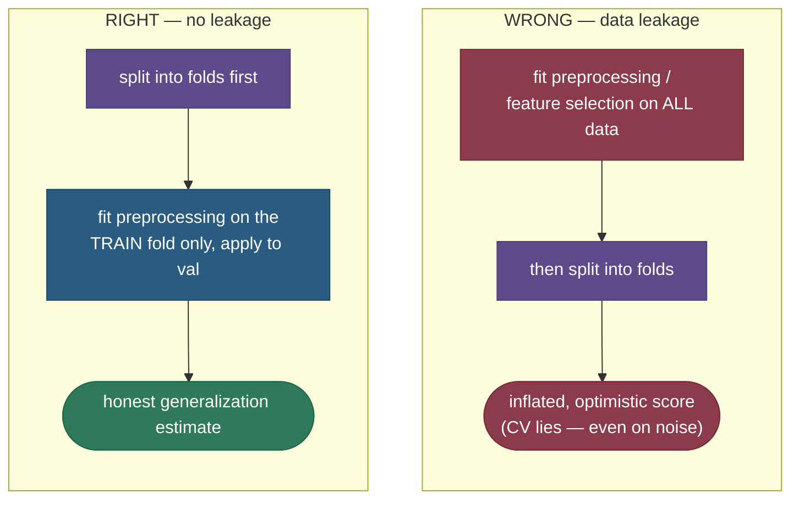
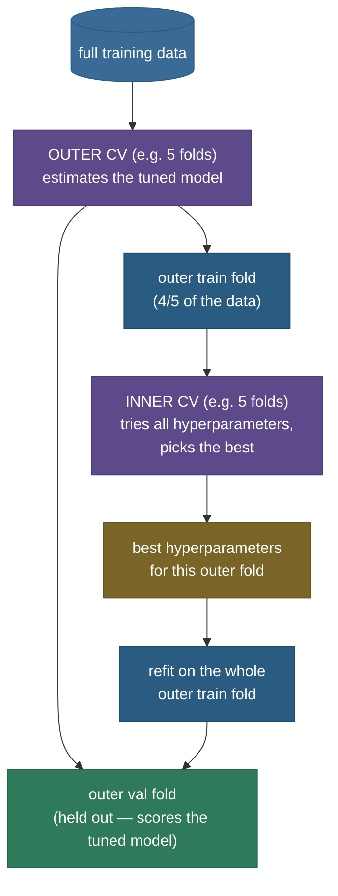
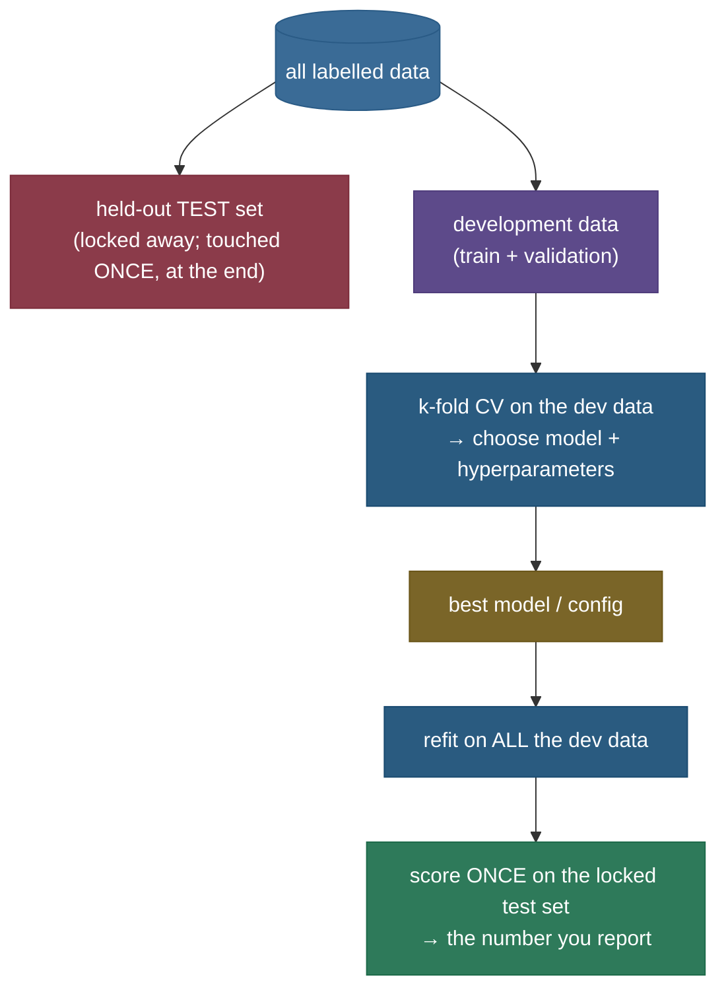

# Cross-validation: an honest estimate of how your model will generalize

You've trained a model and it scores 92% on your data. Wonderful — except you have no idea whether that number means anything, because the model has *seen* that data. The question that actually matters is: **how well will it do on data it has never seen?** That number — the **generalization error** — is the only one a stakeholder cares about, and the entire discipline of model evaluation exists to estimate it honestly.

The obvious first attempt is to hold out a slice of data the model never trains on, and score there. That's a **single train/test split**, and it's better than nothing, but it has two quiet flaws. First, the score depends on *which rows landed in the test slice* — an easy slice flatters the model, a hard one maligns it, and you'll never know which one you got. Second, you've **thrown away** a quarter of your data: the test rows never help the model learn, and the training rows are never used to evaluate. On small or medium datasets, both flaws bite hard.

**Cross-validation** fixes both with one elegant idea: don't pick *one* test slice — pick *every* slice, in turn. Split the data into $k$ equal **folds**; train on $k-1$ of them and validate on the one held out; then **rotate** which fold is held out and repeat, $k$ times, so every fold serves as the validation set exactly once. Average the $k$ validation scores and you have an estimate where **every data point has been used for both training and validation**, and the average is far steadier than any single split could be. Cross-validation is the engine underneath nearly all model selection and hyperparameter tuning — and it is also the single place where one subtle mistake (**data leakage**) can turn your reported score into a complete fabrication, reporting high accuracy on data that is literally random noise. We will reproduce exactly that disaster, in code, and then fix it.

By the end of this page you'll be able to:

- explain *precisely why* a **single train/test split** is a high-variance estimate of generalization error (and wastes data), and how **k-fold** repairs both;
- reason about the **bias–variance of the CV estimate itself** as a function of $k$, and choose $k$ from first principles — including **LOOCV** and its famous hat-matrix shortcut;
- pick the right variant — **stratified, grouped, time-series** — for data that isn't exchangeable;
- explain, demonstrate, and avoid the **leakage trap**: preprocessing and feature-selection must live *inside* the CV loop, or CV lies;
- use **nested CV** to estimate a *tuned* model without optimistic bias, and apply the **one-standard-error rule** for model selection;
- back every claim with runnable, reproducible code.

Intuition and pictures first, then the reasoning (with sources and derivations), then runnable code.

> **Note:** keep two things straight from the start. CV estimates the **generalization error** — the expected error on new data drawn from the same distribution. It does **not** replace a final, untouched **test set**. You cross-validate *on your training data* to choose, tune, and compare models; you report the headline number *once*, on data that was never involved in any of those decisions. Mixing those two roles is the most common way an honest-looking pipeline starts lying.

---

## The problem: one split is a coin flip

Let's make the flaw in a single split quantitative, because "it's noisy" is too vague to act on.

Suppose the true generalization accuracy of your model is some fixed number $\mu$ (say 0.77). When you hold out a test set of $m$ examples and score on it, you are estimating $\mu$ from a **finite sample**. If each test example is correct with probability $\mu$ independently, the number correct is Binomial$(m, \mu)$, and your estimated accuracy $\hat\mu$ has

$$\operatorname{Var}(\hat\mu) = \frac{\mu(1-\mu)}{m}, \qquad \text{std}(\hat\mu) = \sqrt{\frac{\mu(1-\mu)}{m}}.$$

With $\mu = 0.77$ and a test set of $m = 75$ examples (a 25% holdout from 300 rows), that's a standard deviation of $\sqrt{0.77 \cdot 0.23 / 75} \approx 0.049$ — so a single split can easily report anywhere from ~0.72 to ~0.82 purely by luck of the draw. **That's a five-point swing from nothing but which rows you happened to hold out.** And this binomial floor *understates* the real spread, because the *training* set also changes with each split, adding model-to-model variance on top.

There's a second, separate cost. In a 75/25 split, the **held-out 25% never contributes to training** (so your model is weaker than it could be), and the **75% is never evaluated** (so you learn nothing about how the model does on those rows). On a small dataset, sacrificing a quarter of it to a one-shot, high-variance measurement is a poor trade. Cross-validation recovers both: every point trains the model in $k-1$ of the folds *and* gets validated in exactly one.

> **Note:** the two flaws are distinct and worth naming separately in an interview — **(1) high variance** of the estimate (it depends on the lucky/unlucky split), and **(2) data inefficiency** (each role uses only part of the data). k-fold attacks both at once: rotation averages away (1), and reuse cures (2).

> **Gotcha:** a bigger test set shrinks the variance ($\propto 1/m$) but makes flaw (2) worse — you're now starving the training set even more. There's no single-split sweet spot that escapes the trade. CV sidesteps it by letting *every* point play both roles across the rotation.

---

## Intuition: grading a student with five different exams

Imagine you must estimate how well a student has learned a subject, and you have a pool of 100 questions. The single-split approach is to set aside 25 questions as "the exam" and teach from the other 75. But your estimate of the student's ability now hinges on *which* 25 questions you happened to pick — pick five they revised and they look brilliant; pick five they skipped and they look hopeless. One exam is a noisy verdict.

Cross-validation is the fairer scheme: split the 100 questions into five exams of 20. Teach from four exams' worth of material, test on the fifth; then **rotate** which exam is the test, five times, so every question is on the test exactly once and is taught from four times. Average the five exam scores and you have a verdict that doesn't hinge on any single lucky exam — *and* the spread of the five scores tells you how consistent the student is (a tight spread = a reliable grade; a wide one = "it depends what you ask"). That rotation-and-average is exactly k-fold, and the spread-as-reliability is the per-fold standard deviation.

The analogy also makes the **leakage trap** vivid: if you let the student see all 100 questions (including the test ones) while choosing what to study, every exam score is inflated — they've seen the answers. That's preprocessing fit on the full data before CV: the "test" questions leaked into the "studying," and the grade is a fiction. We'll watch that fiction happen, on pure noise, in the code.

---

## Why it matters

Cross-validation isn't an academic nicety — it's the difference between a model you can trust and a number that will embarrass you. Three concrete stakes:

- **Every tuning decision rides on it.** When you compare two feature sets, five learning rates, or three model families, you're comparing their CV scores. If those scores are noisy (single split) or inflated (leakage), you pick the *wrong* model — and you won't find out until production. CV's stability is what makes model selection reliable rather than a coin flip dressed up as science.
- **It's the difference between "92% offline" and a failed launch.** The classic disaster — a model that scored beautifully in evaluation and flopped live — is almost always a CV that didn't mirror deployment: leakage, grouped rows split across folds, or training on the future. Getting CV right is *the* guard against that specific, expensive failure.
- **It quantifies trust, not just performance.** The per-fold std tells you whether 0.90 means "reliably about 0.90" or "somewhere between 0.80 and 1.00 depending on luck." That uncertainty is exactly what a stakeholder needs to decide whether to ship — and a single split simply cannot provide it.

In short, CV is the instrument that turns "the model seems good" into "here is an honest estimate of how good, and how sure we are." Almost every other evaluation tool — `GridSearchCV`, stacking, threshold tuning, learning curves — is built on top of it.

---

## k-fold cross-validation

Partition the data into $k$ roughly equal folds. For each fold $i$ in turn, train on the other $k-1$ folds and validate on fold $i$; the cross-validation estimate is the average of the $k$ validation scores:

$$\widehat{\text{CV}}_k = \frac{1}{k} \sum_{i=1}^{k} \mathcal{L}\!\left(\text{model trained on all folds but } i,\ \text{fold } i\right),$$

where $\mathcal{L}$ is your metric (accuracy, MSE, AUC, …) measured on the held-out fold.


Because the validation fold rotates, **every point is validated exactly once** and is trained on $k-1$ times. Averaging the $k$ scores cancels the luck of any single split, and the **standard deviation** across the $k$ fold scores gives you a free read on how *reliable* the estimate is:


The figure is a real measurement (the code is below). Across 300 random single splits the score ranges over ~25 points — so a single split could mislead you badly in either direction. The 5-fold CV estimate is one stable number with a tighter spread; in the code its standard deviation is about **1.4× smaller** than the single-split spread, and unlike a single split it *also hands you* that spread as a reliability signal.

> **Tip:** report CV results as **mean ± std across folds**, not just the mean. The std is the part that tells you whether to trust the mean. A 5-fold result of $0.77 \pm 0.02$ is solid; $0.77 \pm 0.10$ is a warning that performance swings wildly with the split — usually a sign of too little data, an unstable model, or non-exchangeable rows (read on for the variants that fix the last one).

> **Note:** why does averaging help, and by how much? If the $k$ fold scores each estimate $\mu$ with variance $\sigma^2$, their average has variance $\sigma^2/k$ *only if the folds were independent*. They aren't — the training sets overlap heavily (any two of them share $k-2$ folds), so the fold scores are **positively correlated**. With pairwise correlation $\rho$, the variance of the average is $\operatorname{Var}(\bar s) = \frac{\sigma^2}{k} + \frac{k-1}{k}\rho\sigma^2 = \rho\sigma^2 + \frac{1-\rho}{k}\sigma^2$ — the same correlated-average formula that governs [random forests](../09-Random-Forests/09-Random-Forests.md). The $\rho\sigma^2$ floor is the part averaging *cannot* remove, and as $k\to n$ the training sets become near-identical so $\rho\to 1$ and the floor dominates — which is exactly why LOOCV's variance can be high. This correlation is what makes the *choice of $k$* a bias–variance trade-off in its own right — the subject of the next section.

> *Where this comes from: the empirical case for **10-fold** CV as the default is **A Study of Cross-Validation and Bootstrap** (Kohavi 1995); the estimators and their bias–variance are **ISLR** Ch. 5 and **ESL** Ch. 7.10; the definitive modern survey is **Arlot & Celisse (2010)** — all in the references.*

---

## How it works: the loop, step by step

It helps to see the exact mechanics, because every variant and every pitfall is a modification of this one loop. Given a dataset of $n$ rows, an estimator (model + any preprocessing), and a fold count $k$:

1. **Shuffle and partition.** Optionally shuffle the rows (with a fixed seed for reproducibility), then split the indices $\{1,\dots,n\}$ into $k$ disjoint folds $F_1,\dots,F_k$ of roughly $n/k$ rows each. The partition is fixed for the whole run.
2. **For each fold $i = 1\dots k$:**
   a. **Form the split** — validation set = $F_i$; training set = everything else, $\bigcup_{j\ne i} F_j$.
   b. **Fit from scratch on the training set.** Crucially, this means *re-fitting every data-dependent step* — the scaler, the imputer, the feature selector, the model — using **only** these training rows. A fresh, independent model each fold.
   c. **Score on the validation fold** $F_i$ with your metric, and record the number $s_i$.
3. **Aggregate.** Report the mean $\bar s = \frac{1}{k}\sum_i s_i$ as the CV estimate and $\text{std}(s_i)$ as its reliability. (For a final deliverable model, *refit once on all $n$ rows* — the CV was only to estimate; the shipped model uses all the data.)

The two load-bearing words are **"from scratch"** in step 2b. If any preprocessing was fitted *before* this loop (on all $n$ rows), step 2b is silently violated and the estimate leaks — exactly the cardinal sin a few sections down. A scikit-learn `Pipeline` is just a way to guarantee 2b mechanically: pass the *whole pipeline* to the CV routine and every step refits per fold.

> **Note:** the model is **discarded** after each fold — CV produces a *number* (an estimate of generalization error), not a model. This trips people up: "which of the $k$ models do I deploy?" None of them. You deploy a fresh model refit on all $n$ rows; the $k$ fold-models existed only to produce the estimate.

> **Gotcha:** "fit from scratch each fold" also means CV's cost is $k$ *full* training runs. For a model that takes an hour to train, 10-fold is a 10-hour job — which is why large deep-learning models usually use a single large held-out validation set rather than k-fold, and reserve CV for cheaper classical models or smaller data where the variance reduction is worth the compute.

---

## Choosing k: the bias–variance of the *estimate*

Here is the subtlety that separates someone who memorized "use 10 folds" from someone who understands CV: **the number of folds is itself a bias–variance trade-off — but on the *estimate of error*, not on the model.** Two competing effects:

**1. Bias of the estimate (from train-set size).** In $k$-fold, each model is trained on only $\frac{k-1}{k}$ of the data. A model trained on less data is *worse*, so CV measures the error of a slightly handicapped model and tends to **overestimate** the error of the model you'll actually ship (which trains on 100% of the data). This **pessimistic bias** is large when $k$ is small (at $k=2$, each model sees only half the data) and shrinks as $k$ grows (at $k=n$, each model sees all but one point — essentially the full model).

**2. Variance of the estimate (from fold correlation and test-fold size).** As $k\to n$ (LOOCV), the $n$ training sets are nearly identical — they differ by one point each — so the $n$ models are **highly correlated**, and averaging correlated quantities reduces variance far less than averaging independent ones. The classical result (ISLR §5.1.4, ESL §7.10) is that **LOOCV often has *higher* variance** than 10-fold despite its lower bias, because of this near-perfect correlation between the leave-one-out models. Small $k$ has the opposite profile: more-different training sets, lower correlation, lower variance — at the cost of the pessimistic bias above.

**3. Cost.** $k$-fold costs $k$ model fits. LOOCV costs $n$ fits — potentially thousands — which is why it's reserved for small $n$ (or models with the closed-form shortcut below).

To make effect 2 concrete: plug the fold-correlation $\rho$ into $\operatorname{Var}(\bar s) = \rho\sigma^2 + \frac{1-\rho}{k}\sigma^2$ from the earlier note. At small $k$, the training sets share little, $\rho$ is small, and the $\frac{1-\rho}{k}\sigma^2$ term genuinely shrinks the variance. At LOOCV the $n$ training sets differ by a single row, so $\rho$ is very close to 1, the floor $\rho\sigma^2$ swallows nearly all the variance, and adding more "folds" can no longer average it away — that's the precise mechanism behind LOOCV's reputation for *higher* variance despite its lower bias. There is also a classification-specific wrinkle: with a single held-out point, each LOOCV fold score is just $0$ or $1$ (right or wrong), a maximally coarse per-fold signal — another reason to prefer 10 folds of 0/1-rich validation sets for classifiers.

Putting it together: small $k$ is **cheap, pessimistically biased, lower variance**; large $k$/LOOCV is **expensive, nearly unbiased, often higher variance**. The empirically-validated sweet spot is **$k = 5$ or $10$** — small enough to keep cost and variance down, large enough that the pessimistic bias is negligible.


The left (red) axis is a **real measurement**: for each $k$, the CV error minus the true error of a model trained on *all* the data, averaged over many datasets. The pessimistic bias is largest at $k=2$ (where folds train on only half the data) and has **collapsed to near zero by $k\approx10$**. The right (blue) axis is the unavoidable cost: $k$ model fits, climbing to $n$ at LOOCV. The green band is the sweet spot — bias already gone, cost still cheap. That picture *is* the answer to "what $k$?"

> **Tip:** the crisp interview answer: **"5 or 10 — it's the bias–variance-of-the-estimate sweet spot. Smaller $k$ trains on too little data (pessimistic bias); LOOCV is nearly unbiased but the leave-one-out models are so correlated that its variance is often *higher*, and it costs $n$ fits. 10-fold gets you near-zero bias at modest cost and variance — which is exactly why Kohavi's study made it the default."** Saying *why* LOOCV's variance can be high is the part that signals depth.

> **Gotcha:** the intuition "more folds is always more accurate" is wrong, and interviewers probe it. More folds reduces *bias* but does **not** monotonically reduce the *variance* of the estimate — past $k\approx10$ you're mostly buying cost, and at LOOCV you may even buy *more* variance. The curve is not monotone in "goodness."

> **Tip:** always **fix the random seed** for the fold partition (e.g. `KFold(shuffle=True, random_state=…)`) so a CV run is reproducible and two models are compared on the *same* folds — comparing models on different partitions adds partition noise to the comparison and can flip the winner. Comparing on identical folds is a cleaner, lower-variance comparison (it's a paired test).

---

## LOOCV and its hat-matrix shortcut (why it's not always expensive)

LOOCV — leave-one-out, $k=n$ — sounds prohibitively expensive: $n$ model fits, one per held-out point. For most models it is. But for **linear models fit by least squares**, there's a beautiful closed form that computes the *exact* LOOCV error from a **single fit** — no refitting at all.

Let $\mathbf{X}$ be the $n\times p$ design matrix and fit $\hat{\boldsymbol\beta} = (\mathbf{X}^\top\mathbf{X})^{-1}\mathbf{X}^\top\mathbf{y}$. The **hat matrix** $\mathbf{H} = \mathbf{X}(\mathbf{X}^\top\mathbf{X})^{-1}\mathbf{X}^\top$ maps the observed targets to the fitted values ($\hat{\mathbf{y}} = \mathbf{H}\mathbf{y}$ — it "puts the hat on $\mathbf{y}$"). Write $h_{ii}$ for its $i$-th diagonal entry, the **leverage** of point $i$. Then the leave-one-out residual for point $i$ equals the full-model residual *inflated* by $1/(1 - h_{ii})$:

$$\boxed{\ \text{LOOCV MSE} \;=\; \frac{1}{n}\sum_{i=1}^{n}\left(\frac{y_i - \hat{y}_i}{1 - h_{ii}}\right)^2\ }$$

where $\hat y_i$ is the fitted value from the model trained on **all** the data. One fit, $n$ corrections — instead of $n$ fits.

**Why does this hold?** (Sketch of the derivation, ESL §7.10.) Removing point $i$ and refitting changes the solution in a way the Sherman–Morrison rank-one update captures exactly. Working it through, the refit's prediction at $x_i$ differs from the full-fit prediction by a factor involving the leverage $h_{ii} = x_i^\top(\mathbf{X}^\top\mathbf{X})^{-1}x_i$ — the amount point $i$ "pulls" its own fitted value toward itself. The algebra collapses the leave-one-out residual to $\hat e_i^{(-i)} = (y_i - \hat y_i)/(1 - h_{ii})$. High-leverage points (large $h_{ii}$, near 1) get the largest inflation — sensibly, since the model leaned on them most, so removing them changes the fit most. Replacing each $h_{ii}$ with their average $\bar h = p/n$ (the trace of $\mathbf{H}$ over $n$) gives **generalized cross-validation (GCV)**, a common ridge/spline tuning criterion. The code below confirms the shortcut matches brute-force LOOCV to machine precision.

**A tiny leverage intuition.** In simple linear regression, the leverage of point $i$ is $h_{ii} = \frac{1}{n} + \frac{(x_i - \bar x)^2}{\sum_j (x_j - \bar x)^2}$ — it's $\frac{1}{n}$ for a point at the mean and grows the farther $x_i$ sits from $\bar x$, summing to $p = 2$ across all points (intercept + slope). So an outlier in $x$ has high leverage, near 1, and its LOOCV residual gets inflated by $1/(1-h_{ii})$ — a large factor — because the full-data fit was bent toward that point and removing it changes the prediction there a lot. Points in the comfortable middle have $h_{ii}\approx 1/n$, essentially no inflation. The formula is, in one line, "trust the residual less where the model leaned on the point more."

> **Note:** this shortcut is *why* LOOCV survives at all in practice — for ridge regression, smoothing splines, and kernel ridge, the analogous formula tunes the regularization parameter almost for free (generalized cross-validation, GCV, is the version that replaces each $h_{ii}$ with the average $\bar h$). Outside the linear-model family (trees, boosting, neural nets) there's no such shortcut, and LOOCV reverts to $n$ honest refits, which is usually why you reach for 10-fold instead.

---

## Variants: match the split to the data

Plain $k$-fold makes a hidden assumption: that rows are **exchangeable** — any row is as likely as any other to be in any fold, and a row's fold-membership leaks no information. When that assumption breaks, plain $k$-fold produces an estimate that is *confidently wrong*. Three common breakages, each with its fix:

![Four split schemes drawn as colored strips over twenty ordered samples. Panel 1 (plain k-fold): four contiguous color blocks — the class ratio drifts across folds and time order is ignored. Panel 2 (stratified): colors interleave so each fold keeps the ~30% positive class ratio, with positives marked. Panel 3 (grouped): samples are tagged by group g0–g4, and each whole group is a single color — a group never spans two folds. Panel 4 (time-series, forward-chaining): four stacked rows where each trains on an expanding navy prefix of the past, validates the next red block, and ignores the grey future.](../images/cv_variants.png)

**Stratified k-fold — for class imbalance.** If 8% of your rows are positive, a random fold might by chance contain *zero* positives, making its validation score meaningless (and its training fold class-skewed). **Stratified** $k$-fold partitions *within each class* so every fold preserves the overall class proportions. It is scikit-learn's **default** for classifiers via `cross_val_score`, and you should essentially always use it for classification — the cost is nil and it removes a real source of fold-to-fold noise.

**Grouped k-fold — to stop within-group leakage.** When rows cluster into groups that share information — multiple visits from the **same patient**, several clicks from the **same user**, frames from the **same video**, augmentations of the **same image** — plain $k$-fold can put one group's rows in *both* train and validation. The model then "recognizes" the entity rather than generalizing to new ones, and the score is inflated. **Grouped** $k$-fold (`GroupKFold`) keeps every group entirely within a single fold, so validation always measures generalization to *unseen groups*. This is the right tool whenever the deployment question is "how well does it do on a **new** patient/user/device it has never seen?"

**Time-series CV — never train on the future.** For temporally ordered data, the deployment reality is that you predict the *future* from the *past*. Plain $k$-fold shatters this: a random fold mixes past and future, letting the model train on data that is *later* than what it validates on — **look-ahead leakage** that inflates the score and never reproduces in production. **Time-series CV** uses **forward-chaining**: each validation fold is strictly *later* than its training data, with an expanding (or rolling) window, as in the bottom panel above. scikit-learn's `TimeSeriesSplit` implements it. The rule is absolute: **a model evaluated on time series must never, at any fold, train on a timestamp later than the one it predicts.**

> **Gotcha:** these aren't mutually exclusive luxuries — they're *correctness* requirements for their data type. Using plain $k$-fold on grouped or temporal data doesn't give you a slightly-off estimate; it gives you a *systematically optimistic* one that collapses in production. When you see a too-good-to-be-true CV score, the first suspects are (a) preprocessing leakage (next section) and (b) the wrong splitter for grouped/temporal data.

**Purged and embargoed CV — the advanced temporal case.** Even forward-chaining can leak when a label depends on a *window* of future data (e.g. "did the price rise over the next 5 days?"). A validation label computed from days $t{+}1\dots t{+}5$ overlaps training rows at $t{+}1\dots t{+}5$, so information bleeds across the boundary. **Purged k-fold** (de Prado, *Advances in Financial Machine Learning*) drops training rows whose label-window overlaps the validation fold, and an **embargo** removes a few rows immediately after the validation block to kill residual autocorrelation. It's the standard in quantitative finance and any setting with overlapping, look-forward labels — a sharper instance of the same "never let the future touch training" rule.

> **Tip:** a quick decision table — **imbalanced classes → stratified**; **repeated entities (patient/user/device) → grouped**; **time order matters → TimeSeriesSplit**; **overlapping look-forward labels → purged + embargoed**; **plain exchangeable rows → ordinary KFold**. Stratified-grouped variants (`StratifiedGroupKFold`) exist for when you need both stratification and grouping at once.

---

## The leakage trap (the cardinal sin)

This is the mistake that silently inflates an enormous number of reported scores, in papers and production alike — and the one whose *name*, said unprompted, signals real experience. The error: doing **any data-dependent preprocessing — scaling, imputation, feature selection, target encoding, PCA, oversampling — on the *whole* dataset *before* cross-validating.**

The trap is seductive because it feels efficient ("fit the scaler once, then CV the model"). But when you fit *anything* on the full data, information from the validation folds has leaked into the training process: the scaler saw the validation rows' statistics, the feature selector chose features using the validation labels. CV then validates on data that already influenced the pipeline, and reports an **optimistic, wrong** number.



**How bad is it?** The famous ESL §7.10.2 demonstration — which the code below reproduces exactly — is deliberately brutal. Take **pure noise**: 1000 random features and random binary labels, with no relationship whatsoever, so the true accuracy *must* be 50%. Now, *using all the data*, select the 20 features most correlated with the labels, and cross-validate a classifier on those 20. The result: **CV reports ~80% accuracy on data that is literally random noise.** The selection step found 20 features that *happen* to correlate with the labels in this particular sample — and because it used the validation rows' labels to find them, those features look predictive on exactly the rows CV then "tests" on. Do the *identical* selection **inside** the CV loop (refit per fold, using only the training fold's labels) and the score correctly drops to ~chance. The number 80% versus 50% is the entire lesson: leakage doesn't nudge your score, it **manufactures a result from nothing**.

**Why does selection-on-all-data inflate so much?** It's not bad luck — it's a near-certainty driven by the *number* of features. With 1000 pure-noise features and 80 rows, the sample correlation of each feature with the labels is random, centered at 0, but with 1000 draws the **maximum** of those correlations is reliably large (the expected max of $p$ standard draws grows like $\sqrt{2\ln p}$). So "the 20 most correlated features" are exactly the 20 that *most overfit this particular sample's labels* — including the validation rows' labels. When CV then tests on those rows, the features were hand-picked to predict them. The more features you screen over, the more extreme the spurious correlations, and the bigger the inflation: the trap gets *worse* with wide data, precisely the regime (genomics, text, high-dimensional tabular) where feature selection is most tempting.

The fix is mechanical and total: **wrap every data-dependent step in a scikit-learn `Pipeline`** and pass the *pipeline* to `cross_val_score` / `GridSearchCV`. The Pipeline refits each step on each training fold only, so the validation fold is never touched by any fitting. There is no situation in which leak-then-CV is acceptable; the Pipeline costs you nothing and removes the entire failure mode.

> **Gotcha:** the leaking step is often invisible because it ran in an earlier cell or an earlier script. A scaler `.fit` on the full frame, a `SelectKBest` on all the data, a `SMOTE` oversample before the split, a target-encoding computed globally — all of them leak, and all of them are "innocent" lines that ran before the CV call. The audit question for any pipeline: **"did anything see the validation rows before they were validated?"** If yes, the number is suspect.

> *Where this comes from: the "right way to cross-validate" with feature selection inside the loop is **ESL §7.10.2** (the noise example reproduced below); scikit-learn's **"Common pitfalls"** guide covers the practical Pipeline fix — both in the references.*

---

## Nested CV: an unbiased estimate of a *tuned* model

There's a more subtle leakage that survives even a perfect Pipeline. Suppose you use CV not just to *report* a score but to **choose hyperparameters** — you try 50 values of $C$ and keep the one with the best CV score. By selecting the *maximum* over 50 noisy estimates, you've **optimized against the validation folds**, and the winning CV score is **optimistically biased**: it's the best of 50 lucky draws, not an honest estimate of the chosen model.

**Nested CV** separates *tuning* from *estimating* with two loops:

- the **inner** CV loop, run within each outer training fold, **selects hyperparameters** (e.g. via `GridSearchCV`);
- the **outer** CV loop **estimates performance** of the whole tune-then-fit procedure on data the inner loop never saw.



Because every outer validation fold is scored by a model whose hyperparameters were chosen *without seeing it*, the outer average is an **unbiased** estimate of the full tune-and-fit procedure. The code below measures the gap: reporting the tuned `best_score_` (the optimistic way) gives **0.893**, while honest nested CV gives **0.868** — a **+0.025 optimism gap** that you would have shipped as real if you'd reported the tuning score.

> **Tip:** you don't *always* need nested CV. If you tune with CV and then report the headline number on a **separate, untouched test set**, a single (non-nested) CV for tuning is fine — the test set provides the unbiased estimate. Nested CV is the tool when you have **no spare held-out set** (small data) but still need an unbiased estimate of the *tuned* model. Its cost is $k_{\text{outer}}\times k_{\text{inner}}\times|\text{grid}|$ fits — real, so reserve it for when an honest tuned-model number is the deliverable.

---

## The one-standard-error rule: prefer the simpler model

CV doesn't just rank models — its **standard error** lets you choose *wisely* among near-ties. When several models have CV scores within noise of each other, picking the literal maximum is overfitting the model-selection step (you're chasing $\pm$ noise). The **one-standard-error rule** (ESL §7.10) says: compute the standard error of the CV estimate, $\text{SE} = \text{std}_{\text{folds}}/\sqrt{k}$; find the best CV score; then choose the **simplest** model whose CV score is within **one SE** of that best.

The payoff is robustness: among statistically indistinguishable models you deliberately pick the *more regularized / simpler* one (smaller tree, stronger penalty, fewer features), which generalizes more reliably and is less likely to be a lucky peak. It's the principled version of "don't chase the last 0.2% — take the simpler model that's just as good." Sklearn bakes a version of this into `LassoCV`/spline selection, and you can apply it by hand to any `cv_results_` table.

> **Note:** the rule needs the **standard error**, which is *only available because CV gives you per-fold scores*. A single split gives you one number and no SE — another reason CV is the right tool for model selection, not just a steadier point estimate.

---

## Where CV sits in the workflow: train, validate, test

It's easy to conflate cross-validation with "the test set." They play **different roles**, and keeping them separate is what makes a reported number trustworthy. The clean mental model is three tiers:



**CV lives entirely inside the development data** — it's how you *choose and tune* among models without burning the test set. The **test set is locked away** and scored exactly once, at the very end, on the final refit model; the moment you make *any* decision based on the test score, it stops being a test set and becomes another (now-contaminated) validation set. On small data where you can't spare a test set at all, **nested CV** stands in for that final unbiased estimate — the outer loop *is* the "test."

> **Gotcha:** the cardinal discipline — **every modelling decision (features, hyperparameters, model family, threshold) is made using CV on the dev data; the test set informs zero decisions.** Peeking at the test set to pick anything — even "which of two models to submit" — leaks it. If you've looked at the test score and changed course, you no longer have an honest test estimate.

---

## Repeated k-fold: squeezing more stability from the same data

A single 5-fold run still depends on *one* random partition into folds — a different shuffle gives slightly different fold scores. **Repeated k-fold** runs the entire k-fold procedure $r$ times with different shuffles and averages all $r\times k$ scores. The partition-to-partition noise averages out, giving an estimate noticeably steadier than one k-fold run, at $r\times$ the cost. scikit-learn exposes it as `RepeatedKFold` / `RepeatedStratifiedKFold`.

When is it worth it? On **small datasets**, where a single partition is itself a meaningful source of variance, repeated CV (e.g. $5\times$ 10-fold) measurably tightens the estimate and is a common competition and small-data practice. On **large datasets**, the partition barely matters and the extra compute buys little — a single k-fold is fine. The rule of thumb: repeat when the *fold partition* is a non-negligible part of your variance budget (small $n$, unstable model), skip it when it isn't.

> **Tip:** repeated CV reduces the variance from the *choice of partition*, but it does **not** reduce the variance from the *finite dataset* — re-shuffling the same 200 rows can't tell you what a fresh 200 rows would do. If your fold scores swing wildly, repeated CV will report a steadier average but the real cure is more data or a more stable (more regularized) model.

> **Gotcha:** don't confuse *repeated k-fold* (re-partition the same data several times) with *increasing k* (more folds of one partition). They reduce different noise sources: more folds trades bias for cost/variance per the earlier curve; repeated folds averages out partition luck at fixed bias. They compose — $5\times$ 10-fold is both.

---

## What to score, and how to aggregate it

CV is agnostic to the metric, but the metric choice changes what the estimate *means* — and a few aggregation traps lurk here.

- **Classification:** use **stratified** folds and a metric matched to the problem. Accuracy is fine for balanced classes; for imbalance prefer **F1, ROC-AUC, or PR-AUC**, scored per fold. Pass `scoring="roc_auc"` (or a list) to `cross_validate`.
- **Regression:** common choices are **MSE / RMSE, MAE, or $R^2$**. (scikit-learn reports *negative* MSE so that "higher is better" holds uniformly — a frequent source of sign confusion.)
- **Aggregation — average the per-fold scores, don't pool predictions blindly.** For decomposable metrics (accuracy, MSE) averaging per-fold scores and pooling all out-of-fold predictions give nearly the same number. But for **non-decomposable** metrics like AUC, the two differ: AUC computed on pooled out-of-fold predictions is *not* the average of per-fold AUCs, and mixing scores across folds with different positive rates can mislead. Decide deliberately: report the **mean ± std of per-fold metrics** for a reliability signal, or compute the metric **once on pooled out-of-fold predictions** when you want a single ranking-based number — and don't silently switch between them.

> **Tip:** for multi-metric runs use `cross_validate(estimator, X, y, scoring=["accuracy", "roc_auc", "f1"], cv=...)` — it returns all metrics plus fit/score times in one pass, far cleaner than calling `cross_val_score` three times.

There's also a subtle **per-fold-metric vs pooled-metric** choice. Suppose two folds each have AUC 0.80 but very different score *scales*; the AUC computed on the *pooled* out-of-fold predictions can differ from the average of the two per-fold AUCs, because AUC depends on the global ranking across all predictions, not on any single fold's threshold. For a *reliability* read (mean ± std) you want per-fold metrics; for a *single ranking number* you may prefer the pooled out-of-fold AUC — but state which you're reporting, because they are genuinely different quantities and quietly switching between them is a way to make results look better than they are.

> **Gotcha:** scoring must be computed **per fold on that fold's held-out rows** — never compute a global metric on out-of-fold predictions that were generated under *leaked* preprocessing. The metric is only as honest as the splits feeding it; a clean metric on a leaky pipeline is still a lie.

---

## Cross-validation vs the bootstrap

CV's cousin for estimating generalization is the **bootstrap**: resample $n$ rows *with replacement* to form a training set (≈63% of unique rows appear, the rest are out-of-bag), fit, and evaluate on the out-of-bag rows. Both estimate generalization error by reusing data; they differ in the bias–variance of the estimate.

- **k-fold CV** holds out *disjoint* folds; its estimate is roughly unbiased (with the small pessimistic bias discussed) and has moderate variance. It's the default for **model selection and reporting**.
- **The basic bootstrap** has *lower variance* but a *larger optimistic bias*, because the ~37% out-of-bag test rows overlap across resamples and the training resamples share many rows. The **.632 and .632+ bootstrap** estimators (Efron & Tibshirani) correct this bias by blending the optimistic resubstitution error with the pessimistic out-of-bag error.

Where does the **63%** come from? In a bootstrap resample of $n$ rows drawn with replacement, the probability a given row is *never* drawn is $(1 - 1/n)^n \to e^{-1} \approx 0.368$, so on average $\approx 36.8\%$ of rows are out-of-bag and $\approx 63.2\%$ are in the training resample. That single fact ($1 - 1/e$) is the engine of both bootstrap validation and random-forest OOB error — the same constant, doing the same job, in two places.

In practice, **k-fold (5/10) is the go-to** for choosing and reporting models; the bootstrap shines for **quantifying uncertainty** (confidence intervals on a metric, the stability of feature importances) and underlies **out-of-bag error** in [random forests](../09-Random-Forests/09-Random-Forests.md) — where the same 63%/37% split gives free validation without a separate CV loop.

> **Note:** the connection to bagging is direct — a random forest's **OOB error** *is* a bootstrap estimate of generalization, computed for free as a by-product of training. When asked "how do you validate a forest cheaply?", OOB is the answer, and it's the bootstrap doing the work that k-fold does elsewhere.

---

## Worked examples

Four examples of increasing complexity. The first is a hand calculation; the rest are measured in the code that follows, and the numbers here match it exactly.

**Example 1 — averaging fold scores (the basic computation).** A 5-fold CV of a classifier returns fold accuracies $[0.78,\ 0.74,\ 0.81,\ 0.76,\ 0.77]$.

- **Estimate (mean):** $(0.78+0.74+0.81+0.76+0.77)/5 = 0.772$.
- **Reliability (std):** deviations from the mean are $[+0.008, -0.032, +0.038, -0.012, -0.002]$; their squares average to $\approx 5.7\times10^{-4}$, so $\text{std}\approx 0.024$. Report **0.77 ± 0.02**.
- **Standard error of the estimate:** $\text{SE} = 0.024/\sqrt{5} \approx 0.011$ — the spread of the *mean* itself, which is what the one-SE rule uses.

A tight std means the estimate is trustworthy; a wide one (say ±0.10) warns that performance depends heavily on the split. A single split would have handed you exactly *one* of those five numbers, with no sense of the spread at all.

**Example 2 — single split vs k-fold variance (measured).** On a 300-row classification set, 200 random single splits give accuracy **0.750 ± 0.046**, while 5-fold CV gives **0.767 ± 0.033** — the CV estimate's spread is **~1.4× tighter** than the single-split spread, and it came with the std for free. The single-split histogram (the figure earlier) spans ~25 points; the CV estimate is one steadier number. This is the entire practical case for k-fold in one measurement.

**Example 3 — the leakage demo on pure noise (measured).** 1000 random features, 80 random labels, true accuracy = 0.50. Selecting the 20 best features *outside* the CV loop (using all the data) → CV reports **0.800** — 30 points of pure fiction. The *identical* selection done *inside* a Pipeline (refit per fold) → **0.388**, i.e. ~chance (the slight dip below 0.5 is small-sample noise on 80 rows). The gap between **0.800 and 0.50** is the cost of one leaked preprocessing step.

**Example 4 — nested CV outline (measured).** Tuning an SVM's $C$ over $\{0.01, 0.1, 1, 10, 100\}$ on 400 rows. Reporting the tuned `best_score_` (tuning and reporting on the same folds) gives an optimistic **0.893**; nested CV — inner 5-fold to tune, outer 5-fold to estimate — gives the honest **0.868**. The **+0.025 optimism gap** is exactly the selection bias nested CV removes. As an outline: *for each outer fold → run an inner GridSearchCV on its training portion → refit the best config → score the held-out outer fold → average the outer scores.*

**Example 5 — a complete 5-fold trace, fold by fold (measured).** To see the whole loop produce a number, here is an actual stratified 5-fold run of logistic regression on a 200-row, balanced (50% positive) dataset. Each fold trains on 160 rows and validates on the held-out 40:

| Fold | Train rows | Val rows | Val positive-rate | Val accuracy |
|---|---|---|---|---|
| 1 | 160 | 40 | 0.50 | 0.825 |
| 2 | 160 | 40 | 0.50 | 0.900 |
| 3 | 160 | 40 | 0.50 | 0.950 |
| 4 | 160 | 40 | 0.50 | 0.900 |
| 5 | 160 | 40 | 0.50 | 0.925 |

Stratification kept every fold at exactly the 0.50 positive-rate (no fold got a skewed class mix). The five validation accuracies are $[0.825, 0.900, 0.950, 0.900, 0.925]$:

- **CV estimate (mean):** $\bar s = (0.825+0.900+0.950+0.900+0.925)/5 = \mathbf{0.900}$.
- **Reliability (std):** $\text{std} \approx \mathbf{0.042}$ — so report **0.90 ± 0.04**.
- **Standard error of the estimate:** $\text{SE} = 0.042/\sqrt{5} \approx \mathbf{0.019}$ — used by the one-SE rule when comparing this model to others.

Notice the single-fold spread: fold 1 alone would have reported 0.825 and fold 3 alone 0.950 — a **12.5-point swing** depending on which split you'd happened to take as your one test set. The average, 0.900, is the steadier verdict, and the ±0.04 std is your honest read on how much to trust it.

---

## Application: setting up CV for a real problem

Here's the reasoning I'd actually walk through, end to end, given a fresh dataset and "give me an honest estimate and a tuned model":

1. **Lock a test set first.** Before anything else, carve off a held-out test set (or commit to nested CV if data is too small to spare one). It does not exist for the rest of the workflow.
2. **Pick the splitter from the data, not habit.** Imbalanced labels → `StratifiedKFold`. Repeated entities (user/patient/device) → `GroupKFold` keyed to the entity. Time order → `TimeSeriesSplit`. Otherwise plain `KFold` (shuffled, seeded). Need two at once → `StratifiedGroupKFold`.
3. **Choose $k$.** Default to 10 (or 5 for expensive models); use repeated stratified CV on small data; reserve LOOCV for tiny $n$ or linear models with the hat-matrix shortcut.
4. **Build the whole estimator as a `Pipeline`.** Every transform — scaling, imputation, encoding, selection, resampling, dimensionality reduction — goes *inside* the pipeline so it refits per fold. Nothing data-dependent runs before the CV call.
5. **Pick the metric to match the goal** and pass it (or several) to `cross_validate` — AUC/F1/PR-AUC for imbalance, RMSE/MAE/$R^2$ for regression — and report **mean ± std** across folds.
6. **Tune with CV, estimate honestly.** Use `GridSearchCV`/`RandomizedSearchCV` (which CV internally) to tune; estimate the *tuned* model's performance with **nested CV** if there's no spare test set, otherwise the locked test set.
7. **Select with the one-SE rule** among near-ties — prefer the simpler/ more-regularized model within one SE of the best.
8. **Refit on all the development data** for the model you ship, then score the **locked test set exactly once** for the number you report.

Every step is either "match the split to the data" or "keep fitting inside the loop." That's the whole job.

> **Tip:** the single most valuable habit from this list is step 4 — *the Pipeline*. It makes the leakage trap structurally impossible rather than a thing you have to remember not to do, and it's why experienced practitioners reach for `Pipeline` reflexively even for a one-line scaler.

---

## Code: stability, leakage, the LOOCV shortcut, and nested CV

All four results above, reproducibly. The script runs on CPU in a few seconds.

```python
"""Cross-validation: k-fold stability, the leakage trap, the LOOCV hat-matrix shortcut,
and nested CV. Verified on Python 3.12 (scikit-learn), CPU."""
import numpy as np
from sklearn.linear_model import LogisticRegression
from sklearn.feature_selection import SelectKBest, f_classif
from sklearn.pipeline import Pipeline
from sklearn.model_selection import (cross_val_score, train_test_split, GridSearchCV,
                                     StratifiedKFold)
from sklearn.datasets import make_classification
from sklearn.svm import SVC

# --- 1) single-split (noisy) vs 5-fold (steadier) -------------------------------
X, y = make_classification(n_samples=300, n_features=20, n_informative=6,
                           class_sep=0.8, random_state=0)
single = [LogisticRegression(max_iter=1000)
          .fit(*train_test_split(X, y, test_size=.25, random_state=s)[::2])
          .score(*train_test_split(X, y, test_size=.25, random_state=s)[1::2])
          for s in range(200)]
cv = cross_val_score(LogisticRegression(max_iter=1000), X, y, cv=5)
print(f"single split: {np.mean(single):.3f} ± {np.std(single):.3f}   "
      f"5-fold CV: {cv.mean():.3f} ± {cv.std():.3f}   "
      f"(std ratio {np.std(single)/cv.std():.2f}x)")

# --- 2) leakage on PURE NOISE (true accuracy = 0.50) ----------------------------
rng = np.random.default_rng(0)
Xn = rng.standard_normal((80, 1000)); yn = rng.integers(0, 2, 80)
sel = SelectKBest(f_classif, k=20).fit(Xn, yn)                 # uses ALL data -> LEAK
wrong = cross_val_score(LogisticRegression(max_iter=1000), sel.transform(Xn), yn, cv=5).mean()
pipe = Pipeline([("sel", SelectKBest(f_classif, k=20)),
                 ("clf", LogisticRegression(max_iter=1000))])
right = cross_val_score(pipe, Xn, yn, cv=5).mean()            # selection refit per fold
print(f"pure noise: selection OUTSIDE CV = {wrong:.3f} (inflated!)   "
      f"INSIDE CV = {right:.3f} (~chance)")

# --- 3) LOOCV hat-matrix shortcut for least squares: n fits in ONE ---------------
rng = np.random.default_rng(3); n, p = 60, 4
Xr = np.c_[np.ones(n), rng.standard_normal((n, p))]
yr = Xr @ rng.standard_normal(p + 1) + 0.5 * rng.standard_normal(n)
H = Xr @ np.linalg.inv(Xr.T @ Xr) @ Xr.T                       # hat matrix
h, yhat = np.diag(H), H @ yr
loocv_fast = np.mean(((yr - yhat) / (1 - h)) ** 2)            # closed form, ONE fit
loocv_brute = np.mean([(yr[i] - Xr[i] @ np.linalg.lstsq(
    Xr[np.arange(n) != i], yr[np.arange(n) != i], rcond=None)[0]) ** 2 for i in range(n)])
print(f"LOOCV MSE  shortcut(1 fit) = {loocv_fast:.6f}   brute(n fits) = {loocv_brute:.6f}   "
      f"match: {np.allclose(loocv_fast, loocv_brute)}")

# --- 4) nested CV (inner tunes, outer estimates) vs the optimistic tuning score --
Xc, yc = make_classification(n_samples=400, n_features=20, n_informative=8,
                             class_sep=0.6, random_state=1)
gs = GridSearchCV(SVC(), {"C": [0.01, 0.1, 1, 10, 100]},
                  cv=StratifiedKFold(5, shuffle=True, random_state=1))
optimistic = gs.fit(Xc, yc).best_score_                       # tune & report on same folds
nested = cross_val_score(gs, Xc, yc,                          # outer loop never seen by tuning
                         cv=StratifiedKFold(5, shuffle=True, random_state=2)).mean()
print(f"nested CV: optimistic best_score_ = {optimistic:.3f}   "
      f"honest nested = {nested:.3f}   optimism gap = {optimistic - nested:+.3f}")
```

Output:

```
single split: 0.750 ± 0.046   5-fold CV: 0.767 ± 0.033   (std ratio 1.38x)
pure noise: selection OUTSIDE CV = 0.800 (inflated!)   INSIDE CV = 0.388 (~chance)
LOOCV MSE  shortcut(1 fit) = 0.244815   brute(n fits) = 0.244815   match: True
nested CV: optimistic best_score_ = 0.893   honest nested = 0.868   optimism gap = +0.025
```

> **Note:** four lessons in four lines. **(1)** The 5-fold estimate (±0.033) is **1.38× steadier** than a single split (±0.046) — *and* hands you the spread. **(2)** The alarming one — selecting features on the **full data** before CV makes it report **80% accuracy on pure random noise** (true = 50%); the *same* selection **inside** a Pipeline reports ~chance. *This is why every transform goes inside a Pipeline.* **(3)** The LOOCV hat-matrix shortcut matches brute-force LOOCV **to the digit** (0.244815) from a single fit — $n$-fold accuracy at 1-fit cost for linear models. **(4)** Reporting a tuned `best_score_` is optimistic by **+0.025** versus honest nested CV — the selection bias nested CV removes.

> **Tip:** in production, prefer `Pipeline` + `GridSearchCV`/`cross_validate` over hand-rolled loops — they refit transforms per fold *for you*, return per-fold scores and timings, support `scoring=[...]` for multiple metrics, and parallelize across folds with `n_jobs`. Hand-rolling the loop is exactly where leakage sneaks back in.

---

## Where cross-validation is used

- **Model selection & hyperparameter tuning** — `GridSearchCV` / `RandomizedSearchCV` score every candidate by CV; it is the default mechanism for comparing models and settings on a fixed dataset.
- **Honest performance estimates** — especially on small/medium data where a single split is too noisy to trust.
- **Stacking / blending** — *out-of-fold* CV predictions are the inputs to a meta-model; using out-of-fold (not in-sample) predictions is what keeps stacking honest (see [Stacking & Blending](../11-Stacking-and-Blending/11-Stacking-and-Blending.md)).
- **Threshold and calibration tuning** — choosing a decision threshold or a calibration map on out-of-fold predictions, never on the training fold.
- **Detecting overfitting** — a large train-vs-CV gap flags it; CV *is* how you measure where you sit on the [bias–variance](../12-Bias-Variance-Tradeoff/12-Bias-Variance-Tradeoff.md) curve.
- **Learning curves** — CV scores plotted against training-set size show whether you're data-limited (curve still rising → get more data) or capacity-limited (curve plateaued well below target → get a better model); each point on a learning curve is a CV estimate at that sample size.

How does a grid search *use* CV? `GridSearchCV(estimator, param_grid, cv=5)` runs, for **every** point in the grid, a full 5-fold CV and records the mean validation score; it then refits the best-scoring configuration on all the data. So a grid of 50 configurations is 250 model fits — which is why the grid, the fold count, and the model's per-fit cost together set the wall-clock, and why `RandomizedSearchCV` (sample the grid) or `HalvingGridSearchCV` (successive halving — give more folds/data only to promising configs) exist for large search spaces. The CV is the inner machinery; the search is just "score every candidate with CV, keep the best."

> **Tip:** the interview checklist, in order — (1) k-fold averages out single-split noise *and* gives you a reliability std; (2) 5/10 folds is the bias–variance-of-the-estimate sweet spot, LOOCV is low-bias / often-high-variance / expensive (but has the hat-matrix shortcut for linear models); (3) **stratify** for imbalance, **group** for repeated entities, **time-series split** for temporal data — these are correctness, not taste; (4) **all preprocessing inside the loop (Pipeline)**, or CV lies — *it'll report high accuracy on pure noise*; (5) **nested CV** for an unbiased *tuned*-model estimate, and the **one-SE rule** to prefer the simpler near-tie. Naming the leakage trap unprompted signals real experience.

---

## When k-fold is the wrong tool

CV is the default, but it isn't universal — and knowing when *not* to reach for it is part of the skill:

- **Large deep-learning models.** When one training run costs hours and you have hundreds of thousands of examples, $k$-fold's $k$ full retrains are prohibitive *and* unnecessary — a single large held-out validation set is statistically plenty (the variance from a 50k-row validation set is tiny). Deep learning almost always uses one train/val/test split, not k-fold.
- **Truly massive datasets.** Once $n$ is in the millions, a single split's variance is already negligible ($\propto 1/m$), so k-fold's variance reduction buys almost nothing for $k\times$ the compute. Reserve CV for the small/medium regime where it actually moves the needle.
- **Strong temporal or hierarchical structure that k-fold can't honor cheaply.** Sometimes a carefully designed *single* forward-chaining split that mirrors the real deployment cadence is more honest than forcing the data into k-fold.
- **When a held-out test set already exists and is large.** If you have a generous, representative test set, you may tune on a single validation split and report on the test set — CV's main value (variance reduction on small data) is moot.

The throughline: **use k-fold when the variance of a single split is a real problem (small/medium data, cheap model). When the split is already low-variance or each fit is expensive, a single well-designed split wins.**

> **Note:** even when you skip k-fold for the *final* estimate, the leakage and split-design rules still apply to your single validation split — preprocessing inside the fit, groups not spanning the split, no training on the future. Those are correctness rules, independent of how many folds you use.

---

## Where it goes wrong in practice

CV is where a surprising number of "great offline, terrible in production" stories begin. The failure is almost always a mismatch between *how you split* and *how the model is actually deployed*:

- **Preprocessing leakage.** The most common one, covered above — a scaler/selector/encoder fit on all the data before CV. Symptom: a CV score that's suspiciously high and a production score that's much lower. Fix: wrap everything in a `Pipeline`.
- **Group leakage.** Same patient/user/listing in both train and validation under plain k-fold. Symptom: stellar CV, mediocre performance on genuinely new entities. Fix: `GroupKFold` keyed to the entity id.
- **Temporal leakage.** Training on data later than the validation timestamp (plain k-fold on time series, or a feature that secretly encodes the future — e.g. a "total lifetime spend" column computed across the whole history). Symptom: backtest that never reproduces live. Fix: `TimeSeriesSplit` *and* an audit that every feature is computable at prediction time.
- **Tuning-then-reporting on the same folds.** Reporting a tuned `best_score_` as the model's performance — optimistically biased by the selection. Fix: nested CV, or a final untouched test set.
- **Distribution shift between CV and deployment.** CV estimates generalization to the *same distribution*; if production data drifts (new geography, new season, new user mix), even a flawless CV under-predicts the real error. CV is necessary, not sufficient — pair it with live monitoring.
- **Tiny folds with rare classes.** With severe imbalance and small $n$, even stratified folds can have one or two positives, making per-fold metrics jumpy. Fix: fewer folds, repeated stratified CV, or a metric robust to small positives.

> **Tip:** the one-line diagnostic for almost all of these — **"does each validation fold look like the data the deployed model will actually face, with nothing from it having leaked into training?"** If the answer is no for groups, time, or preprocessing, the CV number is optimistic regardless of how careful the rest of the pipeline is.

---

## Common misconceptions

A few beliefs that sound right and trip up even experienced practitioners:

- **"CV produces a model I can deploy."** No — CV produces an *estimate of error*. The $k$ fold-models are discarded; you ship a fresh model refit on all the data. CV's output is a number (and a std), not an artifact.
- **"More folds is always better."** No — more folds lowers the pessimistic bias but costs $k$ fits and, at the LOOCV extreme, can *increase* the variance of the estimate via fold correlation. Past $k\approx10$ you mostly buy compute. 5–10 is the sweet spot, not "as many as you can afford."
- **"I scaled the data, so I'm fine."** The question isn't *whether* you scaled but *where* — scaling fit on the full data **before** CV leaks. Inside a Pipeline it's correct; outside it's the cardinal sin.
- **"Stratification is only nice-to-have."** For imbalanced classification it's a correctness fix — without it a fold can contain zero positives and produce a meaningless score. It's also sklearn's classifier default precisely because it should be on by default.
- **"CV handles temporal data."** Plain k-fold actively *breaks* on time series by training on the future. Temporal data needs `TimeSeriesSplit` (or purged CV); ordinary CV gives a confidently wrong, optimistic number.
- **"A high CV score means I'll do well in production."** Only if production data matches the CV distribution. CV estimates generalization to the *same* distribution; under drift it under-predicts the real error. CV is necessary, not sufficient — pair it with monitoring.
- **"Nested CV is overkill; one CV is enough."** If you tune *and* report on the same CV, the reported number is optimistically biased (the +0.025 gap we measured). One CV is fine for tuning *only* when a separate test set provides the final number; otherwise nest.

> **Note:** every one of these reduces to the two invariants of honest CV — **(1) the split must mirror deployment** (stratify/group/time as needed), and **(2) nothing data-dependent may touch a validation fold before it's validated** (Pipeline, nested tuning). Internalize those two and the misconceptions dissolve.

---

## Recap and rapid-fire

**If you remember nothing else:** cross-validation estimates generalization by rotating the validation fold across $k$ splits and averaging, so every point is used for both training and validation and the estimate is far steadier than one split — *and you get a reliability std for free*. **$k = 5$ or $10$** is the bias–variance-of-the-*estimate* sweet spot (small $k$ → pessimistic bias; LOOCV → low bias but often high variance, expensive — though linear models have the hat-matrix shortcut). Use **stratified** for imbalance, **grouped** for repeated entities, **time-series** for temporal data; *always* fit preprocessing **inside** the loop (Pipeline) or CV will report high accuracy on pure noise; and use **nested CV** + the **one-standard-error rule** to choose and report tuned models honestly.

**Quick-fire — say these out loud:**

- *Why not a single train/test split?* High-variance estimate ($\text{std}\approx\sqrt{\mu(1-\mu)/m}$, depends on the lucky split) and it wastes data — each point plays only one role.
- *What is k-fold CV?* Split into $k$ folds, rotate which is held out, average the $k$ validation scores; every point validated exactly once.
- *How to choose k?* 5 or 10 — the bias–variance-of-the-estimate sweet spot; LOOCV ($k=n$) is low-bias but often high-variance and expensive.
- *Bias–variance of the estimate?* Small $k$ → smaller train folds → **pessimistic bias**, lower variance; LOOCV → ~unbiased but the leave-one-out models are highly correlated → often **higher** variance.
- *LOOCV shortcut for linear models?* $\frac{1}{n}\sum_i\big((y_i-\hat y_i)/(1-h_{ii})\big)^2$ with $h_{ii}$ the hat-matrix leverage — exact LOOCV from one fit.
- *Stratified CV — when?* Imbalanced classification, to keep class ratios in every fold (sklearn's default for classifiers).
- *Grouped / time-series CV — when?* Repeated entities (same user/patient/device) → grouped; temporal data → time-series forward-chaining (never train on the future).
- *The #1 CV mistake?* Leakage — preprocessing/feature-selection on all data before CV; it inflates the score (**80% on pure noise**). Fix: Pipeline, fit per fold.
- *Nested CV — why?* Unbiased estimate of a *tuned* model (inner loop tunes, outer loop estimates); a single CV used to both tune and report is optimistic.
- *One-standard-error rule?* Among models within one SE of the best CV score, pick the simplest — robust model selection.
- *What does the fold std tell you?* How reliable the estimate is (tight = trustworthy; wide = split-dependent), and it powers the one-SE rule.

---

## References and further reading

The curated link library for this topic — videos, courses, interactive/visual resources, articles, papers, books, and internal cross-links — lives in a companion file so it can be reused as a standalone reference list:

**→ [Cross-Validation — references and further reading](13-Cross-Validation.references.md)**
