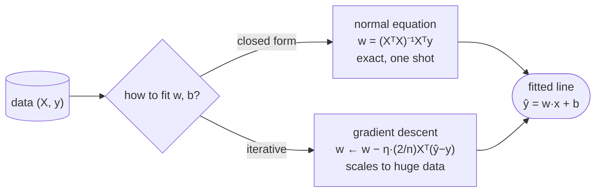

# Linear regression: the model everything else is built on

Linear regression is the "hello world" of machine learning, and it is far more important than its simplicity suggests. The idea is to predict a continuous target as a **weighted sum of the features** — $\hat y = w \cdot x + b$ — and to choose the weights that make the predictions as close as possible to the truth, measured by **squared error**. That's it: fit the straight line (or hyperplane) that passes through the data with the smallest total squared miss. Yet this one model is the foundation of an astonishing amount: [logistic regression](02-Logistic-Regression.md) is linear regression pushed through a sigmoid, [regularization](03-Regularization-Linear-Models.md) (Ridge/Lasso) is linear regression with a penalty, and a single neuron with no activation function *is* linear regression. Understand it deeply — the least-squares objective, the closed-form solution, the gradient-descent solution, and the probabilistic interpretation — and you've laid the groundwork for everything from classical statistics to deep learning.

By the end of this page you'll be able to:

- set up the **least-squares** objective and explain why we minimize *squared* error;
- **derive** the **normal equation** $w = (X^\top X)^{-1}X^\top y$, and know when to use it vs **gradient descent**;
- connect **MSE to maximum likelihood** under Gaussian noise;
- state the **assumptions** (linearity, independence, homoscedasticity, normal errors) and what breaks them;
- interpret **R²**, handle **multicollinearity**, and see linear regression as a **single neuron**;
- fit it both ways from scratch and verify they agree (and match scikit-learn).

Intuition and pictures first, then the math (with sources), then runnable code.

> **Note:** the whole model is one line of algebra, $\hat y = w\cdot x + b$, plus one choice of "best" — minimize the sum of squared residuals. Every richer model on this site (logistic regression, neural nets, ridge/lasso) is a variation on those two decisions: change the prediction function, or change the loss/penalty.

---

## The problem and the least-squares objective

You have features $x$ and a continuous target $y$, and you want a function that predicts $y$ from $x$. Linear regression restricts that function to a **line/hyperplane**, $\hat y = w\cdot x + b$, and defines "best" as the line that minimizes the **sum of squared residuals** (the vertical gaps between the points and the line):

$$\min_{w,b}\; \sum_i (\hat y_i - y_i)^2 = \min_{w,b}\; \sum_i (w\cdot x_i + b - y_i)^2$$


Why *squared* error and not, say, absolute error? Three reasons: it's **differentiable everywhere** (so we can solve it with calculus), it **penalizes large errors disproportionately** (a 2× bigger miss costs 4× more, pulling the line toward outliers), and — most fundamentally — minimizing it is **equivalent to maximum likelihood under Gaussian noise** (below). The squared loss makes the math clean and the solution unique.

---

## The closed-form solution: the normal equation

Because the squared-error loss is **convex and quadratic** in $w$, we can find the exact minimum with calculus — no iteration needed. Stack the data into a matrix $X$ (with a column of 1s for the bias). The loss is $\lVert Xw - y\rVert^2$; setting its gradient to zero, $\nabla_w \lVert Xw - y\rVert^2 = 2X^\top(Xw - y) = 0$, gives the **normal equation**:

$$X^\top X\,w = X^\top y \quad\Longrightarrow\quad w = (X^\top X)^{-1} X^\top y$$

This is a one-shot, exact solution. It's perfect for small/medium problems — but it requires **inverting (or solving with) the $p\times p$ matrix $X^\top X$**, which is $O(p^3)$ and breaks down when $p$ is huge or when features are collinear (making $X^\top X$ singular). Then you turn to gradient descent.

> *Where this comes from: least squares and the normal equation date to Gauss (Stigler 1981 on the history); the modern derivation is **CS229** notes §1 and **ISLR** Ch. 3; the geometry (projection onto the column space of $X$) is **ESL** Ch. 3 — references.*

---

## The gradient-descent solution (and the bridge to deep learning)

When you can't or won't invert $X^\top X$ — too many features, too much data, or streaming — you minimize the same loss **iteratively** with gradient descent. The gradient of the MSE is the familiar error-times-input form:

$$\nabla_w \,\text{MSE} = \frac{2}{n}X^\top(\hat y - y)$$



The MSE surface is a **convex bowl**, so gradient descent slides straight to the same minimum the normal equation computes — no local optima:


This **is** the bridge to deep learning: a linear regression fit by gradient descent on MSE is exactly a **single neuron with no activation**, trained with the same machinery (loss → gradient → step) as a 100-layer network. Everything you learn here scales up. (The code confirms gradient descent and the normal equation agree to machine precision.)

> **Gotcha:** gradient descent on **unstandardized** features is ill-conditioned — features on very different scales make the MSE bowl a long, narrow valley that GD zig-zags down slowly (or diverges if the learning rate is too big). **Standardize your features** before gradient descent (the code does). The normal equation is scale-robust but $O(p^3)$; GD scales but needs scaling and a tuned learning rate. That tradeoff is the whole reason both methods exist.

---

## MSE is maximum likelihood under Gaussian noise

Here's *why* squared error is principled. Assume the data is generated as $y = w\cdot x + b + \epsilon$ with Gaussian noise $\epsilon \sim \mathcal{N}(0, \sigma^2)$. The likelihood of the observed targets is a product of Gaussians, and taking its negative log turns the product into a **sum of squared residuals** (plus constants). So **minimizing MSE = maximizing the likelihood** of the data under a Gaussian-noise model — least squares isn't an arbitrary choice, it's the maximum-likelihood estimator when errors are normal (see [Loss Functions](../../05.%20Deep_Learning/concepts/04-Loss-Functions.md)).

> *Where this comes from: the MLE-under-Gaussian-noise derivation is **CS229** notes §1.3 and Bishop PRML §3.1 — references.*

---

## Assumptions (and what breaks them)

Linear regression's *inference* (coefficient significance, confidence intervals) rests on assumptions; its *prediction* is more forgiving, but knowing them is interview-standard:

- **Linearity** — the relationship is actually linear in the features (add polynomial/interaction terms if not).
- **Independence** — observations (and errors) are independent (violated by time series → use time-aware methods).
- **Homoscedasticity** — constant error variance across $x$ (fanning-out residuals = heteroscedasticity).
- **Normal errors** — residuals are roughly Gaussian (matters for inference, less for prediction).
- **No perfect multicollinearity** — features aren't linearly dependent (makes $X^\top X$ singular and coefficients unstable).

> **Tip:** when asked "what are the assumptions of linear regression," the mnemonic is **LINE**: **L**inearity, **I**ndependence, **N**ormality of errors, **E**qual variance (homoscedasticity) — plus no multicollinearity. Always check **residual plots** to validate them.

---

## R², multicollinearity, and regularization

- **R² (coefficient of determination)** = the fraction of the target's variance the model explains: $R^2 = 1 - \frac{\sum(y-\hat y)^2}{\sum(y-\bar y)^2}$. 1.0 = perfect, 0 = no better than predicting the mean. (Use **adjusted R²** when comparing models with different numbers of features, since plain R² never decreases as you add features.)
- **Multicollinearity** — correlated features make $X^\top X$ near-singular, so coefficients become huge and unstable (high variance) even when predictions are fine. Detect with **VIF**; fix with regularization or by dropping/combining features.
- **Regularization** — adding an L2 penalty (**Ridge**) shrinks coefficients and stabilizes multicollinearity; L1 (**Lasso**) also does feature selection (see [Regularization](03-Regularization-Linear-Models.md)). Ridge even has a closed form: $w = (X^\top X + \lambda I)^{-1}X^\top y$ — the $\lambda I$ makes the inverse always exist.

---

## Worked example: fit a line by least squares

Two points: $(1, 2)$ and $(3, 4)$. The least-squares line through exactly two points is the line *through* them (zero residual): slope $w = \frac{4-2}{3-1} = 1$, intercept $b = 2 - 1\cdot1 = 1$, so $\hat y = x + 1$. With a third point $(2, 5)$ added, no line passes through all three, so least squares **balances** the residuals: it finds the slope/intercept minimizing $(\hat y_1-2)^2 + (\hat y_2-5)^2 + (\hat y_3-4)^2$ — the normal equation solves this in one step, returning the line that makes the *sum* of squared misses smallest (here, slope 1, intercept ≈ 2.33, splitting the difference). That balancing is exactly what the residual segments in the first figure show.

---

## Code: normal equation, gradient descent, and R²

```python
"""Linear regression: normal equation, gradient descent, and R^2 all agree (and
match sklearn). Verified on ml-py312, CPU."""
import numpy as np
from sklearn.linear_model import LinearRegression
rng = np.random.default_rng(0); n = 200
Xraw = rng.uniform(0, 10, (n, 3))
y = Xraw @ np.array([1.5, -2.0, 0.7]) + 4.0 + rng.normal(0, 1.0, n)
X = (Xraw - Xraw.mean(0)) / Xraw.std(0)              # standardize -> well-conditioned for GD
Xb = np.c_[np.ones(n), X]                            # add bias column

beta_closed = np.linalg.solve(Xb.T @ Xb, Xb.T @ y)   # normal equation: (X^T X)^-1 X^T y
beta = np.zeros(4); eta = 0.3                         # gradient descent
for _ in range(2000):
    beta -= eta * (2/n) * Xb.T @ (Xb @ beta - y)     # grad = (2/n) X^T (yhat - y)
print(f"normal eq vs gradient descent: max diff = {np.abs(beta - beta_closed).max():.2e}")

yhat = Xb @ beta_closed
r2 = 1 - np.sum((y - yhat)**2) / np.sum((y - y.mean())**2)
print(f"R^2 = {r2:.4f}   sklearn R^2 = {LinearRegression().fit(X, y).score(X, y):.4f}")
```

Output:

```
normal eq vs gradient descent: max diff = 3.55e-15
R^2 = 0.9819   sklearn R^2 = 0.9819
```

> **Note:** the two solution methods — the one-shot normal equation and iterative gradient descent — land on the **same** weights to machine precision ($10^{-15}$), because the MSE surface is convex with a single minimum. And R² = 0.98 matches scikit-learn exactly: the model explains 98% of the target's variance. (The features are standardized so gradient descent is well-conditioned; the coefficients are then in standardized units.)

---

## Where linear regression is used

- **Baselines and quick insight** — the first model to try; its coefficients are directly interpretable as "effect per unit of feature."
- **Forecasting and econometrics** — sales, demand, prices, risk; and the workhorse of applied statistics.
- **Feature/effect analysis** — quantifying and testing the influence of variables (with the inference machinery).
- **The foundation** — logistic regression, GLMs, ridge/lasso, and the output layer of neural nets all build on it.

> **Tip:** the canonical interview is "derive linear regression." Walk: the model $\hat y = w\cdot x + b$ → least-squares loss → set the gradient to zero → normal equation $w = (X^\top X)^{-1}X^\top y$ → "or gradient descent when $X^\top X$ is too big" → "and minimizing MSE is MLE under Gaussian noise." That single thread covers optimization, linear algebra, and statistics at once.

---

## Recap and rapid-fire

**If you remember nothing else:** linear regression predicts $\hat y = w\cdot x + b$ and fits $w, b$ by minimizing **squared error**. The exact solution is the **normal equation** $w = (X^\top X)^{-1}X^\top y$ ($O(p^3)$, exact); for big/streaming data use **gradient descent** on the convex MSE bowl (the same engine as deep learning). Minimizing MSE is **maximum likelihood under Gaussian noise**, R² measures variance explained, and Ridge/Lasso regularize it.

**Quick-fire — say these out loud:**

- *The model and loss?* $\hat y = w\cdot x + b$; minimize $\sum(\hat y - y)^2$ (least squares).
- *Why squared error?* Differentiable, penalizes big errors, and = MLE under Gaussian noise.
- *The closed-form solution?* The normal equation $w = (X^\top X)^{-1}X^\top y$.
- *When use gradient descent instead?* When $X^\top X$ is too large to invert, singular, or data is streaming.
- *The MSE gradient?* $\frac{2}{n}X^\top(\hat y - y)$ — error times input.
- *MSE ↔ which probabilistic model?* Maximum likelihood with Gaussian (normal) noise.
- *The assumptions?* Linearity, Independence, Normal errors, Equal variance (LINE) + no multicollinearity.
- *What is R²?* Fraction of variance explained (1 = perfect, 0 = mean baseline); use adjusted R² across model sizes.
- *Multicollinearity — problem & fix?* Unstable, huge coefficients; fix with Ridge (or drop/combine features).
- *Link to deep learning?* It's a single neuron with no activation, trained by gradient descent on MSE.

---

## References and further reading

The curated link library for this topic — videos, courses, interactive/visual resources, articles, papers, books, and internal cross-links — lives in a companion file so it can be reused as a standalone reference list:

**→ [Linear Regression — references and further reading](01-Linear-Regression.references.md)**
