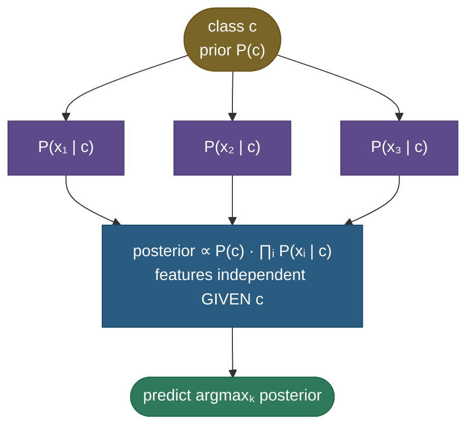

# Naive Bayes: a "wrong" assumption that classifies astonishingly well

Naive Bayes is the model that shouldn't work as well as it does. It applies Bayes' theorem under one deliberately false simplification — that, *given the class*, every feature is **independent** of every other. For a spam filter that means pretending the word "free" tells you nothing about whether "money" also appears, which is obviously wrong: spammy words travel in packs. Yet that "naive" lie is exactly what makes the model fast, data-efficient, and — the part that surprises everyone — a genuinely strong classifier, often the best simple baseline for **text** (spam, sentiment, topic, language ID). It is the canonical lesson of machine learning that **you do not need a *correct* model to make *correct* decisions** — you only need the *right answer to come out on top*, and Naive Bayes gets the ranking right even when its probabilities are nonsense.

This page is the definitive treatment. We'll build it from Bayes' theorem, *derive* every result (the count-based parameter estimates, the smoothing, the fact that Naive Bayes is secretly a **linear classifier**, and its exact kinship with logistic regression), work **three** numeric examples of increasing complexity, prove the from-scratch model matches scikit-learn, and confront the one thing it gets wrong (calibration) with measured numbers.

By the end you'll be able to:

- state **Bayes' theorem** and the **conditional-independence** assumption, and derive the classifier end to end;
- **estimate the parameters** (priors and likelihoods) by maximum likelihood from counts, and explain **log-space**;
- distinguish **Gaussian / Multinomial / Bernoulli / Complement** NB and exactly when each applies;
- derive why **Multinomial/Bernoulli NB is a *linear* classifier** and how it relates to **logistic regression** (the generative–discriminative pair, Ng & Jordan);
- explain the **zero-probability** problem, **Laplace smoothing** as a **MAP/Dirichlet** prior, and why NB is **accurate but mis-calibrated**;
- implement it from scratch and reproduce scikit-learn.

Intuition and pictures first, then the math (every step shown), then runnable, verified code.

> **Note:** Naive Bayes is a **generative** classifier — it models *how each class generates the features*, $P(x\mid c)$, then inverts that with Bayes' rule to get $P(c\mid x)$. That is the opposite of [logistic regression](02-Logistic-Regression.md), which models $P(c\mid x)$ **directly**. "Generative vs discriminative" is a recurring interview theme, and Naive Bayes is the textbook generative example — we'll prove later that the two estimate the *same shape* of decision boundary by different means.

---

## The problem: the joint distribution is astronomically large

We want $P(\text{class}\mid\text{features})$. Bayes' theorem (next section) turns that into needing $P(\text{features}\mid\text{class})$ — the **joint** distribution of *all* features together, per class. That joint is the wall we hit.

Count the parameters. With $d$ binary features, a class's joint distribution over feature *combinations* has $2^d - 1$ free parameters. For a tiny **30-word** vocabulary that's $2^{30} - 1 \approx 10^9$ probabilities to estimate **per class** — and a real text vocabulary has tens of thousands of words, giving more feature combinations than atoms in the universe. You could never see enough data to estimate even a sliver of them; almost every specific combination of words appears **zero** times in training. This is the curse of dimensionality in its purest form, and it makes the exact joint hopeless.

> **Tip:** the entire value of Naive Bayes is converting that $O(2^d)$ estimation problem into an $O(d)$ one. The independence assumption is the price; tractability (and, it turns out, strong accuracy) is what you buy.

---

## Bayes' theorem: flip the conditioning

We can't model $P(c\mid x)$ directly as a generative method, but we *can* model $P(x\mid c)$ — "what do the features look like for spam?" Bayes' theorem flips one into the other. From the product rule $P(c, x) = P(x\mid c)P(c) = P(c\mid x)P(x)$, solve for the posterior:

$$P(c \mid x) = \frac{P(x \mid c)\,P(c)}{P(x)}$$

Read it as **posterior $=$ (likelihood $\times$ prior) / evidence**: $P(c)$ is the **prior** (how common the class is), $P(x\mid c)$ is the **likelihood** (how well class $c$ explains these features), and $P(x)$ is the **evidence** (a normalizer). Crucially, $P(x)$ is the *same for every class*, so for **classification** — picking the most probable class — we can drop it and just compare the numerators:

$$P(c \mid x) \;\propto\; P(x \mid c)\,P(c)$$

> **Gotcha:** you only get to drop $P(x)$ because you're choosing the **argmax over classes** (the denominator cancels). If you need the actual **posterior probability** (not just the label), you must put $P(x) = \sum_{c'} P(x\mid c')P(c')$ back by normalizing — and even then, distrust the number (see calibration).

---

## The naive assumption, derived

The likelihood $P(x\mid c) = P(x_1, \dots, x_d\mid c)$ is still the intractable joint. The **naive** step assumes the features are **conditionally independent given the class**. By the definition of conditional independence, a joint of independent variables factorizes into a product of marginals:

$$P(x_1, \dots, x_d \mid c) \;\overset{\text{cond. indep.}}{=}\; \prod_{i=1}^{d} P(x_i \mid c)$$

That single factorization is the whole algorithm: each $P(x_i\mid c)$ is a *one-dimensional* probability you can estimate from data, so the impossible joint becomes $d$ easy estimates. As a graphical model it's a class node fanning out to conditionally-independent feature nodes:



Putting it together, the classifier is:

$$\hat c \;=\; \arg\max_c \; P(c)\prod_{i=1}^{d} P(x_i \mid c)$$

> **Note:** "conditionally independent given the class" is subtler than "independent." Words *are* correlated overall ("New"/"York"), but Naive Bayes only assumes they're independent *once you fix the class*. That weaker assumption is still usually false, but far less false than full independence — part of why the model holds up.

> *Where this comes from: the bag-of-words Naive Bayes model and decision rule are derived cleanly in **Speech and Language Processing** (Jurafsky & Martin) Ch. 4; the generative-classifier framing is **CS229** notes (Generative Learning Algorithms) — references.*

---

## Estimating the parameters: maximum likelihood from counts

Where do $P(c)$ and $P(x_i\mid c)$ come from? **Maximum likelihood** — and for the multinomial (text) model it's just *counting*, which we can derive. Treat a class's documents as draws from a categorical distribution over the vocabulary. The log-likelihood of the observed word counts, maximized subject to $\sum_w \theta_{w} = 1$ (probabilities sum to one), is a constrained optimization; setting up the Lagrangian $\sum_w n_w \log\theta_w + \lambda(1 - \sum_w\theta_w)$ and solving $\partial/\partial\theta_w = 0$ gives $\theta_w \propto n_w$. So the MLE is the obvious thing:

$$P(c) = \frac{\text{\# docs in class } c}{\text{\# docs}}, \qquad P(w \mid c) = \frac{\text{count}(w, c)}{\sum_{w'}\text{count}(w', c)}$$

— the class prior is the class frequency, and each word's likelihood is its share of all word occurrences in that class. For **Gaussian** NB the same MLE principle gives the per-class, per-feature **sample mean and variance** $\mu_{ci}, \sigma^2_{ci}$. Training is therefore a **single pass of counting** — no iteration, which is why Naive Bayes trains in milliseconds on data that would take logistic regression minutes.

---

## The decision rule and why we work in log-space

The product $P(c)\prod_i P(x_i\mid c)$ multiplies many numbers in $(0,1)$. For a 200-word document that's 200 probabilities of, say, $\sim10^{-3}$ each — a product around $10^{-600}$, which **underflows to exactly 0.0** in float64 (whose smallest positive normal is $\sim10^{-308}$). Every class would score 0 and the argmax would be meaningless. The fix is to take **logs** — turning the product into a sum, which is both underflow-safe and faster:

$$\hat c = \arg\max_c \left[\log P(c) + \sum_{i=1}^{d} \log P(x_i \mid c)\right]$$

Because $\log$ is monotonic, the argmax is unchanged. This log-sum is exactly the "running tally" the spam figure below draws. If you need a normalized posterior back, use the **log-sum-exp** trick (subtract the max log-score before exponentiating) to renormalize without overflow.

> **Gotcha:** this underflow is not hypothetical — it's why *every* real Naive Bayes implementation (including scikit-learn) computes in log-space internally. Multiplying raw probabilities is a classic from-scratch bug that silently returns 0 for long documents.

---

## The four variants: it's all in how you model $P(x_i\mid c)$

The framework is fixed; only the per-feature likelihood changes with the feature type.

**Gaussian NB** — *continuous* features. Assume each feature is Gaussian within each class: $P(x_i\mid c) = \frac{1}{\sqrt{2\pi\sigma^2_{ci}}}\exp\!\big(-\frac{(x_i-\mu_{ci})^2}{2\sigma^2_{ci}}\big)$. You store one mean and variance per feature per class; the independence assumption makes the per-class density an **axis-aligned** Gaussian (a diagonal covariance):


**Multinomial NB** — *count* features; the default for **text** (bag-of-words / TF, or TF-IDF weights). $P(w\mid c)$ comes from word frequencies; a document is scored by summing per-word log-probabilities, the iconic spam-filter mechanic:


**Bernoulli NB** — *binary* features (word **present/absent**, not counts). It models $P(\text{word appears}\mid c)$ **and** explicitly penalizes words that are *absent* (a term for each missing word), which differs from Multinomial NB on short texts.

**Complement NB** — a twist for **imbalanced** text: it estimates each class from the *complement* (all other classes') statistics, which is more stable when one class dominates; often the best NB variant for skewed corpora.

> **Tip:** the picker — **continuous features → Gaussian; word counts / TF-IDF → Multinomial; binary present/absent → Bernoulli; imbalanced text → Complement.** Multinomial NB on TF-IDF features is a famously strong, near-instant text-classification baseline.

---

## Naive Bayes is secretly a *linear* classifier

Here's a deep result that surprises people and is a favorite interview probe. For the two-class Multinomial/Bernoulli model, take the **log-posterior ratio** (the log-odds) between classes:

$$\log\frac{P(c_1\mid x)}{P(c_0\mid x)} = \log\frac{P(c_1)}{P(c_0)} + \sum_i x_i \log\frac{P(x_i\mid c_1)}{P(x_i\mid c_0)} = b + \sum_i w_i\,x_i = b + w\cdot x$$

The log-odds is **linear in the features** — with weights $w_i = \log\frac{P(x_i\mid c_1)}{P(x_i\mid c_0)}$ (each word's log-likelihood-ratio) and bias $b = \log\frac{P(c_1)}{P(c_0)}$ (the log prior-odds). So Multinomial/Bernoulli **Naive Bayes draws a *linear* decision boundary**, exactly like logistic regression and the SVM — it's the spam figure's "add a weight per word, threshold the sum" picture, made formal. The decision $\hat c = c_1 \iff w\cdot x + b > 0$ is a hyperplane.

> **Note:** Gaussian NB is **not** generally linear — plugging the Gaussian likelihood into the same log-ratio leaves a quadratic term $(x-\mu)^2/\sigma^2$, so the boundary is **quadratic** (a conic), which is why the Gaussian figure's boundary curves. The special case where both classes **share the same variance** ($\sigma^2_{0i} = \sigma^2_{1i}$) cancels the quadratic term and the boundary becomes **linear** — that is precisely **Linear Discriminant Analysis (LDA)**; the general unequal-variance case is **Quadratic Discriminant Analysis (QDA)**. Gaussian NB sits inside the LDA/QDA family with the extra diagonal-covariance (independence) restriction.

---

## Generative vs discriminative: the same line, two ways to find it

We just showed Naive Bayes produces a **linear** log-odds, $w\cdot x + b$. But logistic regression *also* produces a linear log-odds, $\sigma(w\cdot x + b)$. So they fit the **same parametric form** for $P(c\mid x)$ — they differ only in **how they estimate the weights**:

- **Naive Bayes (generative):** estimate $P(x\mid c)$ and $P(c)$ by counting, then derive $w, b$ from those counts. It implicitly assumes the features are conditionally independent.
- **Logistic regression (discriminative):** optimize $w, b$ *directly* to maximize $P(c\mid x)$ on the training data, making **no** independence assumption.

| | Naive Bayes (generative) | Logistic Regression (discriminative) |
|---|---|---|
| **Models** | $P(x\mid c)$, then Bayes-flips | $P(c\mid x)$ directly |
| **Boundary form** | linear (Multinomial/Bernoulli) | linear |
| **Weights from** | per-feature counts (closed form) | iterative likelihood maximization |
| **Assumption** | features conditionally independent | none |
| **Data efficiency** | converges fast, with **little** data | needs **more** data |
| **Asymptotic error** | higher (capped by the assumption) | lower |
| **Training cost** | one counting pass (ms) | iterative (slower) |

Ng & Jordan's classic result: Naive Bayes reaches its (higher) error floor **much faster** — with far less data — while logistic regression starts worse but overtakes it as data grows. *With little data, prefer Naive Bayes; with plenty, logistic regression usually wins.*

> *Where this comes from: the generative–discriminative pairing and the "NB converges faster, LR is asymptotically better" result are **On Discriminative vs. Generative Classifiers** (Ng & Jordan, 2002) — references.*

---

## The zero-probability problem, and Laplace smoothing as a Bayesian prior

There's a catastrophic edge case in the count-based MLE. If a word never appeared in the *spam* training documents, then $P(\text{word}\mid\text{spam}) = 0$ — and because the score is a **product**, that single zero **annihilates the whole thing**, no matter how spammy every other word is. One never-before-seen word vetoes all the evidence.

The fix is **Laplace (add-α) smoothing**: pretend you saw every vocabulary word $\alpha$ extra times (usually $\alpha = 1$):

$$P(x_i \mid c) = \frac{\text{count}(x_i, c) + \alpha}{\text{count}(c) + \alpha\,|V|}$$

The $\alpha|V|$ in the denominator keeps it a valid distribution (it sums to 1 over the $|V|$ words). Now no probability is ever exactly zero — an unseen word merely *weakens* the score instead of zeroing it. This isn't an arbitrary hack: it is **exactly Bayesian MAP estimation** with a symmetric **Dirichlet($\alpha+1$) prior** on the word probabilities (a Beta prior in the two-outcome case). The "$+\alpha$ pseudo-counts" *are* the prior's contribution; $\alpha$ controls how strongly the prior pulls the estimates toward uniform, and you tune it on validation.

> **Gotcha:** without smoothing, Naive Bayes can be made to assign a long document **zero** probability under every class (any one out-of-vocabulary or unseen-in-class word does it) — the model then can't decide at all. Always smooth. scikit-learn's `MultinomialNB` defaults to `alpha=1.0` for this reason.

---

## Why it works despite a wrong assumption — and where it doesn't (calibration)

Real features are emphatically *not* conditionally independent, so Naive Bayes' probability **estimates** are routinely terrible — typically wildly **over-confident**, because correlated features get **double-counted** as if each were fresh independent evidence. Twenty redundant words all saying "spam" get multiplied as twenty independent votes, slamming the posterior to 0.9999 when the truth is 0.7.

And yet **classification accuracy stays high**, because classification needs only the **argmax** to be right, not the probabilities. Even a posterior of 0.9999 vs a true 0.7 still ranks spam > ham, so the *label* is correct. Domingos & Pazzani proved this formally: the independence assumption can be violated arbitrarily and Naive Bayes can still be Bayes-optimal under 0-1 loss. But the over-confidence is real and measurable:


The figure (measured, with deliberately redundant features) shows it plainly: logistic regression's reliability curve tracks the diagonal; Naive Bayes' does not — it pushes probabilities toward 0 and 1.

> **Tip:** the gold interview answer — "Naive Bayes is *accurate* but *mis-calibrated*: the independence assumption double-counts correlated features, so the probabilities are over-confident, but the **argmax is usually right** so classification holds up. If you need *calibrated* probabilities — for thresholding, ranking by confidence, or expected-value decisions — wrap it in `CalibratedClassifierCV` (Platt/isotonic) or use logistic regression instead." Saying this unprompted signals real understanding.

---

## Worked example 1 (minimal): a single Bayes flip by hand

A medical test for a disease with **prevalence 1%** ($P(D)=0.01$). The test has 90% sensitivity ($P(+\mid D)=0.9$) and a 5% false-positive rate ($P(+\mid\neg D)=0.05$). You test positive — is the single "feature" enough to call you sick? Bayes:

$$P(D\mid +) = \frac{P(+\mid D)P(D)}{P(+\mid D)P(D) + P(+\mid\neg D)P(\neg D)} = \frac{0.9\cdot0.01}{0.9\cdot0.01 + 0.05\cdot0.99} = \frac{0.009}{0.009 + 0.0495} = 0.154$$

Only **15.4%** — the low prior dominates a single weak feature. This is the engine of Naive Bayes with one feature; the next examples add the *product over features* that makes it a classifier.

---

## Worked example 2 (realistic): the spam filter in log-space

Priors from training: $P(\text{spam})=0.4$, $P(\text{ham})=0.6$. Smoothed per-word likelihoods: $P(\text{"free"}\mid\text{spam})=0.30,\ P(\text{"free"}\mid\text{ham})=0.02$; $P(\text{"money"}\mid\text{spam})=0.20,\ P(\text{"money"}\mid\text{ham})=0.01$. Message: **"free money"**.

- **Spam numerator:** $0.4\times0.30\times0.20 = 0.024$.
- **Ham numerator:** $0.6\times0.02\times0.01 = 0.00012$.
- **In log-space** (how it's really computed): spam $= \log0.4 + \log0.30 + \log0.20 = -0.92 - 1.20 - 1.61 = -3.73$; ham $= \log0.6 + \log0.02 + \log0.01 = -0.51 - 3.91 - 4.61 = -9.03$. Spam's log-score is higher → **classify spam**.
- **Normalized posterior** (if you insist): $\frac{0.024}{0.024 + 0.00012} = 0.995$ — but treat that 0.995 with suspicion (calibration).

The 200× gap between the numerators is the running-sum the spam figure draws, one word at a time.

---

## Worked example 3 (full trace): Gaussian NB on a 2-feature point

Two classes, two continuous features. Trained parameters: class A — $\mu_A=(1,1),\ \sigma^2_A=(1,1)$, prior $0.5$; class B — $\mu_B=(3,3),\ \sigma^2_B=(1,1)$, prior $0.5$. Classify $x=(2.2,\,1.8)$.

For each class, $\log P(c\mid x) = \log P(c) - \sum_i\big[\tfrac12\log(2\pi\sigma^2_{ci}) + \tfrac{(x_i-\mu_{ci})^2}{2\sigma^2_{ci}}\big]$. The constant $\tfrac12\log(2\pi)$ is shared, so compare the rest:

- **Class A:** $-\tfrac{(2.2-1)^2}{2} - \tfrac{(1.8-1)^2}{2} = -\tfrac{1.44}{2} - \tfrac{0.64}{2} = -0.72 - 0.32 = -1.04$.
- **Class B:** $-\tfrac{(2.2-3)^2}{2} - \tfrac{(1.8-3)^2}{2} = -\tfrac{0.64}{2} - \tfrac{1.44}{2} = -0.32 - 0.72 = -1.04$.

A **tie** — the point sits exactly on the decision boundary (equidistant from both Gaussian centers, with equal variance and priors). Nudge it to $x=(2.3,1.8)$ and class B's term becomes $-0.245-0.72=-0.965$ vs A's $-0.845-0.32=-1.165$, so **B wins**. Because the variances are equal here, the boundary is the **perpendicular bisector** of the two means (a line) — the LDA special case; unequal variances would bend it into a curve, as the Gaussian figure shows.

---

## Code: Gaussian NB from scratch (matches scikit-learn) and the smoothing fix

```python
"""Naive Bayes: Gaussian NB from scratch (matches sklearn) + the Laplace fix.
Verified on ml-py312, CPU."""
import numpy as np
from sklearn.naive_bayes import GaussianNB
from sklearn.datasets import make_classification

X, y = make_classification(n_samples=400, n_features=6, n_informative=4, n_classes=3,
                           n_clusters_per_class=1, random_state=0)
cls = np.unique(y)
prior = {c: np.mean(y == c) for c in cls}                  # MLE prior = class frequency
mu  = {c: X[y == c].mean(0) for c in cls}                  # MLE mean per feature per class
var = {c: X[y == c].var(0) + 1e-9 for c in cls}            # MLE variance (eps for stability)
# log N(x; mu, var) summed over features = the conditional-independence product, in log-space
log_gauss = lambda x, m, v: (-0.5*np.log(2*np.pi*v) - 0.5*(x-m)**2/v).sum(-1)
logpost = np.stack([np.log(prior[c]) + log_gauss(X, mu[c], var[c]) for c in cls], axis=1)
pred = cls[logpost.argmax(1)]
skl = GaussianNB().fit(X, y)
print(f"Gaussian NB from scratch acc = {(pred==y).mean():.3f}  sklearn = {skl.score(X, y):.3f}  "
      f"identical predictions = {(pred==skl.predict(X)).all()}")

# the zero-probability problem: 'meeting' never seen in spam -> P=0 kills the product
vocab = ["free", "meeting", "winner", "hello"]; spam_counts = np.array([8, 0, 6, 1])
wp = lambda a: (spam_counts + a) / (spam_counts.sum() + a*len(vocab))   # Laplace add-a
print(f"P('meeting'|spam): no smoothing = {wp(0)[1]:.3f} (zeroes the product)   "
      f"Laplace a=1 = {wp(1)[1]:.3f} (safe)")
msg = np.array([1, 0, 0, 1])                               # contains 'free' and 'hello'... plus 'meeting'
contains_meeting = np.array([1, 1, 0, 0])
print(f"P(msg w/ 'meeting' | spam): no-smoothing = {np.prod(wp(0)[contains_meeting==1]):.4f} (dead)   "
      f"Laplace = {np.prod(wp(1)[contains_meeting==1]):.4f}")
```

Output:

```
Gaussian NB from scratch acc = 0.925  sklearn = 0.925  identical predictions = True
P('meeting'|spam): no smoothing = 0.000 (zeroes the product)   Laplace a=1 = 0.053 (safe)
P(msg w/ 'meeting' | spam): no-smoothing = 0.0000 (dead)   Laplace = 0.0026
```

> **Note:** the from-scratch classifier — MLE priors, per-class per-feature Gaussians, sum of log-likelihoods, argmax — reproduces scikit-learn's `GaussianNB` **exactly** (identical predictions, 92.5%), confirming the derivation. And the smoothing lines show the failure mode and its cure: the unseen word "meeting" gives $P=0$, which would zero the whole posterior; Laplace makes it a small positive number so the message stays scorable.

---

## Pitfalls that actually bite

- **Multiplying raw probabilities** → underflow to 0 on long documents. Always work in **log-space**.
- **No smoothing** → one unseen word zeroes a class. Always use Laplace (`alpha ≥ 1` to start), tune on validation.
- **Trusting the probabilities** → they're over-confident (correlated features double-counted). Calibrate if you need real probabilities.
- **Gaussian NB on non-Gaussian, correlated features** → the diagonal-Gaussian assumption is doubly wrong; consider discretizing, transforming features toward normality, or using a different model.
- **Highly correlated / duplicated features** → double-counting hurts *most* here; de-duplicate features, or prefer logistic regression which handles correlation.

---

## Where Naive Bayes is used

- **Text classification** — spam filtering, sentiment, topic and language ID: fast, scales to huge vocabularies, a strong baseline (Multinomial NB on TF-IDF). The modern statistical spam filter was popularized by Paul Graham's 2002 essay *"A Plan for Spam,"* a Bayesian word-probability classifier — essentially the model on this page; and Multinomial NB remains a standard baseline on benchmarks like **20 Newsgroups**.
- **Real-time / high-throughput** — training is one counting pass; prediction is a few additions in log-space. Ideal when latency and retraining cost matter.
- **Small-data regimes** — its strong prior (independence) needs little data to estimate, so it shines exactly where discriminative models struggle.
- **A first baseline everywhere** — cheap to train and surprisingly hard to beat; the right thing to try before anything heavier, and a sanity-check baseline for fancier models.

> **Tip:** for any text-classification interview the expected first answer is: "bag-of-words / TF-IDF features → **Multinomial Naive Bayes with Laplace smoothing**, computed in log-space — a fast, strong baseline; I'd then compare against logistic regression and a transformer." Explaining *why* a wrong assumption still classifies well, and that NB and logistic regression are a generative–discriminative pair fitting the same linear boundary, is what separates memorization from mastery.

---

## Recap and rapid-fire

**If you remember nothing else:** Naive Bayes applies **Bayes' theorem** with the **naive** assumption that features are **conditionally independent given the class**, so the intractable joint $P(x\mid c)$ factorizes into a product (a **sum of logs**) of simple per-feature terms estimated by counting. **Laplace smoothing** (a Dirichlet prior) stops an unseen feature from zeroing the product. Multinomial/Bernoulli NB is secretly a **linear classifier** and a **generative twin of logistic regression**; its probabilities are **over-confident** (correlated features double-counted) but its **argmax is usually right**, making it a fast, strong **text** baseline.

**Quick-fire — say these out loud:**

- *The naive assumption?* Features are conditionally independent **given the class**.
- *Why make it?* It turns the $O(2^d)$ joint into $O(d)$ per-feature estimates.
- *The decision rule?* $\hat c=\arg\max_c\big[\log P(c)+\sum_i\log P(x_i\mid c)\big]$ (log-space to avoid underflow).
- *How are parameters estimated?* Maximum likelihood = counting (priors = class frequencies; likelihoods = feature frequencies / Gaussian mean+var).
- *The four variants?* Gaussian (continuous), Multinomial (counts/text), Bernoulli (binary present/absent), Complement (imbalanced text).
- *Is the boundary linear?* Multinomial/Bernoulli → **yes** (linear log-odds); Gaussian → **quadratic** (linear only if classes share variance → LDA).
- *Zero-probability problem & fix?* An unseen feature gives $P=0$ and zeroes the product; fix with **Laplace (add-α)** smoothing = a **Dirichlet** prior (MAP).
- *Why accurate despite the wrong assumption?* Classification needs only the right **argmax**, not calibrated probabilities (Domingos & Pazzani).
- *NB vs logistic regression?* Same linear form; generative (counts, fast, little data, higher floor) vs discriminative (direct fit, more data, lower floor) — Ng & Jordan.
- *Are NB's probabilities trustworthy?* No — **over-confident / mis-calibrated**; calibrate if you need real probabilities.
- *Best use case?* Text classification — fast, scalable, strong baseline.

---

## References and further reading

The curated link library for this topic — videos, courses, interactive/visual resources, articles, papers, books, and internal cross-links — lives in a companion file so it can be reused as a standalone reference list:

**→ [Naive Bayes — references and further reading](05-Naive-Bayes.references.md)**
