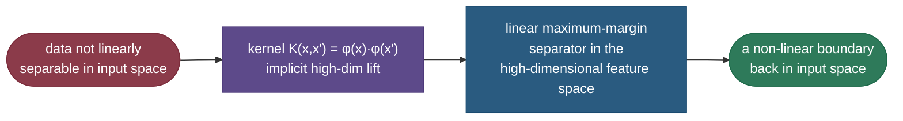

# Support vector machines: the widest street, and the kernel trick

When two classes are separable by a line, there are *infinitely many* lines that do the job — so which one should you pick? A support vector machine answers with a principle that's both intuitive and theoretically deep: choose the boundary that leaves the **widest possible margin** — the broadest empty "street" between the classes. A boundary that barely squeaks between points is fragile; the one centered in the widest gap is the most robust to new data, and that intuition is backed by generalization theory. Remarkably, this boundary depends only on the handful of points sitting right on the edge of the street — the **support vectors** — and nothing else. Then comes the masterstroke: the **kernel trick**, which lets the same linear max-margin machinery carve elaborately curved boundaries by *implicitly* working in a high-dimensional space, without ever computing the high-dimensional coordinates. SVMs were the dominant classifier of the 2000s and remain excellent on small-to-medium, high-dimensional data.

By the end of this page you'll be able to:

- define the **margin** and explain why maximizing it aids generalization;
- explain **support vectors** and why the boundary depends only on them;
- set up the **hard-** and **soft-margin** objectives and the role of **C**;
- explain the **kernel trick** (RBF, polynomial) — non-linear boundaries without the explicit feature map;
- reason about **C** and **gamma**, and contrast SVM with logistic regression;
- fit linear and kernel SVMs and verify the margin and kernel behaviour in code.

Intuition and pictures first, then the math (with sources), then runnable code.

> **Note:** two ideas carry the entire topic. (1) **Max-margin**: among all separating hyperplanes, pick the one with the widest buffer — it's the most robust, and it's determined by just the boundary points. (2) **Kernels**: replace every dot product $x\cdot x'$ with a kernel $K(x,x')$ that secretly computes a dot product in a richer space, turning the linear method into a non-linear one for free.

---

## The problem: which separating line?

Given linearly separable classes, a perceptron or logistic regression will happily return *any* line that separates them — including ones that hug the data points and would misclassify a slightly-shifted new point. SVM adds a selection principle: prefer the boundary that is **as far as possible from the nearest points of both classes**. Maximizing that distance (the margin) is what makes SVMs robust, and it's a structural-risk-minimization idea — a wider margin corresponds to a simpler, lower-capacity classifier that generalizes better.

---

## The margin and the support vectors

The SVM boundary is a hyperplane $w\cdot x + b = 0$, flanked by two parallel **margin** lines; the classes are pushed to opposite sides of the street:


The crucial fact: only the points **on the margin** — the **support vectors** — determine the boundary. Move or delete any *other* point and the boundary doesn't change at all; the model is defined entirely by those few edge cases (in the code, just 2 of 80 points). That's what makes SVMs compact and is the source of their name.

> *Where this comes from: the maximum-margin classifier and support vectors are formalized in **Support-Vector Networks** (Cortes & Vapnik 1995); the applied build-up (maximal-margin → support-vector classifier → SVM) is **ISLR** Ch. 9 — references.*

---

## The math: maximize the margin

Scale $w, b$ so the margin lines are $w\cdot x + b = \pm 1$. The distance between them — the **margin width** — works out to $\frac{2}{\lVert w\rVert}$. So *maximizing* the margin is *minimizing* $\lVert w\rVert$, subject to every point being on the correct side of its margin:

$$\min_{w,b} \tfrac{1}{2}\lVert w\rVert^2 \quad\text{s.t.}\quad y_i\,(w\cdot x_i + b) \ge 1 \;\;\forall i$$

This is a **convex quadratic program** — one global optimum, solvable reliably. (The code confirms the fitted margin is exactly $2/\lVert w\rVert = 2.64$, with the support vectors lying exactly on the $\pm 1$ margin lines.)

> *Where this comes from: the margin objective, its dual, and the KKT conditions are derived in **CS229** lecture notes (SVMs) and **The Elements of Statistical Learning** Ch. 12 — references.*

---

## Soft margin: tolerating overlap with C

Real data isn't perfectly separable (and forcing it to be would overfit). The **soft-margin** SVM adds **slack variables** $\xi_i \ge 0$ that allow some points to violate their margin, penalized by a hyperparameter **C**:

$$\min_{w,b,\xi} \tfrac{1}{2}\lVert w\rVert^2 + C\sum_i \xi_i \quad\text{s.t.}\quad y_i(w\cdot x_i + b) \ge 1 - \xi_i,\;\; \xi_i \ge 0$$

**C controls the tradeoff**: large C heavily penalizes violations → a narrow, hard margin that can overfit; small C tolerates violations → a wider, softer margin that may underfit. Equivalently, this is **hinge loss + L2 regularization** — $\sum \max(0, 1 - y_i(w\cdot x_i+b)) + \frac{1}{2C}\lVert w\rVert^2$ — so **C is an inverse-regularization knob** (see [Regularization](03-Regularization-Linear-Models.md)).

> *Where this comes from: soft-margin SVMs with slack variables are the core contribution of **Support-Vector Networks** (Cortes & Vapnik 1995); the loss+penalty (hinge) view is **ESL** §12.3 — references.*

---

## The kernel trick: non-linear boundaries for free

Here's the elegant part. When you solve the SVM's **dual** form, the data appears *only* as **dot products** $x_i \cdot x_j$. So if you want a non-linear boundary, you could map the data through some feature map $\phi$ into a higher-dimensional space where it *is* linearly separable — but you'd never actually need $\phi(x)$, only the dot products $\phi(x_i)\cdot\phi(x_j)$. A **kernel** $K(x, x') = \phi(x)\cdot\phi(x')$ computes exactly those dot products **directly, in the original space**, without ever building the high-dimensional vectors:



The two workhorses: the **polynomial** kernel $K(x,x') = (x\cdot x' + c)^d$ and the **RBF (Gaussian)** kernel $K(x,x') = \exp(-\gamma\lVert x - x'\rVert^2)$ — the latter corresponds to an *infinite*-dimensional feature space, yet is a one-line computation. The result is a curved boundary that a straight line could never draw:


The code makes the point quantitatively: a **linear** SVM on concentric circles scores ~58% (barely better than chance), while the **RBF** SVM scores 99% — same algorithm, just a kernelized dot product.

> *Where this comes from: the kernel trick and common kernels are covered in **ISLR** Ch. 9 and **ESL** Ch. 12; the original kernel-SVM idea is in Cortes & Vapnik (1995) — references.*

---

## Tuning C and gamma

For an RBF SVM the two key knobs interact:

- **C** (regularization) — high C → fit training points tightly (risk overfit); low C → smoother, more tolerant boundary.
- **gamma** (RBF width) — high gamma → each point's influence is very local → wiggly boundary that can overfit; low gamma → broad influence → smoother, near-linear boundary.

You tune them together by cross-validation (grid search). High C *and* high gamma is the classic overfitting combination.

> **See it visually:** scikit-learn's [RBF SVM parameters](https://scikit-learn.org/stable/auto_examples/svm/plot_rbf_parameters.html) sweeps C and gamma across a grid, showing the boundary go from too-smooth (underfit) to too-wiggly (overfit) — the clearest picture of what these two knobs do.

> **Gotcha:** SVMs are **distance-based**, so **feature scaling is mandatory** — an unscaled large-range feature dominates the kernel and the margin. Always standardize features before an SVM (unlike decision trees, which don't care).

---

## SVM vs logistic regression

Both are linear classifiers (before kernels), but they optimize different things: SVM **maximizes the margin** (hinge loss — cares only about points near the boundary), while [logistic regression](02-Logistic-Regression.md) **maximizes likelihood** (log loss — every point contributes, and it outputs calibrated probabilities). Practically: SVM (with RBF) shines on **small/medium, high-dimensional** data and clear margins; logistic regression is faster, gives **probabilities**, and scales better to huge datasets. SVMs don't natively output probabilities (Platt scaling is bolted on).

---

## Worked example: the margin

A linear SVM learns $w = [0.5, 0.5]$ and $b = -2$. The margin width is $\frac{2}{\lVert w\rVert} = \frac{2}{\sqrt{0.5^2 + 0.5^2}} = \frac{2}{0.707} = 2.83$. A point $x = [3, 3]$ has score $w\cdot x + b = 0.5\cdot3 + 0.5\cdot3 - 2 = 1.0$ — it sits *exactly* on the positive margin line ($+1$), so it's a **support vector**. A point with score $+3$ is well inside its class (far from the street, not a support vector); a point with score $-0.2$ is on the wrong side of the boundary (misclassified, a margin violator with slack).

---

## Code: margin, support vectors, and the kernel trick

```python
"""SVM: margin = 2/||w||, support vectors on the margin, and the kernel trick.
Verified on ml-py312, CPU."""
import numpy as np
from sklearn.svm import SVC
from sklearn.datasets import make_blobs, make_circles

X, y = make_blobs(n_samples=80, centers=2, cluster_std=1.05, random_state=6)
clf = SVC(kernel="linear", C=10).fit(X, y)
print(f"linear SVM: margin = 2/||w|| = {2/np.linalg.norm(clf.coef_):.3f}   "
      f"#support vectors = {len(clf.support_)} of {len(X)}")
print(f"support vectors lie on the margin? |decision_function| ~ 1: "
      f"{np.abs(clf.decision_function(clf.support_vectors_)).mean():.3f}")

# the kernel trick: concentric circles are NOT linearly separable
Xc, yc = make_circles(n_samples=300, factor=0.4, noise=0.12, random_state=0)
print(f"\nconcentric circles:")
print(f"  linear SVM accuracy = {SVC(kernel='linear', C=10).fit(Xc, yc).score(Xc, yc):.3f}  <- can't")
print(f"  RBF    SVM accuracy = {SVC(kernel='rbf', C=10, gamma=1).fit(Xc, yc).score(Xc, yc):.3f}  <- kernel lifts it")
```

Output:

```
linear SVM: margin = 2/||w|| = 2.640   #support vectors = 2 of 80
support vectors lie on the margin? |decision_function| ~ 1: 1.000
concentric circles:
  linear SVM accuracy = 0.580  <- can't
  RBF    SVM accuracy = 0.993  <- kernel lifts it
```

> **Note:** every claim, verified. The fitted margin is exactly $2/\lVert w\rVert$, and the boundary rests on just **2 support vectors** out of 80 — delete the rest and nothing changes. The support vectors sit precisely on the $\pm 1$ margin (mean $|$score$| = 1.000$). And the kernel trick is decisive: a linear SVM is helpless on concentric circles (58%, ~chance) while the *same algorithm* with an RBF kernel nails it (99%).

---

## Where SVMs are used

- **Small/medium, high-dimensional data** — text classification, bioinformatics (gene expression), where features ≫ samples and SVMs excel.
- **Clear-margin problems** — image classification (pre-deep-learning), handwriting, face detection.
- **When you need a strong non-linear classifier without a neural net** — RBF SVMs are powerful off-the-shelf models.
- **Novelty/outlier detection** — one-class SVMs.

> **Tip:** SVMs were *the* classifier before deep learning and are still a great default on tabular/high-dimensional data with limited samples — but they scale poorly to very large datasets (training is roughly quadratic-to-cubic in samples) and don't give probabilities natively. For huge data or when you need calibrated probabilities, reach for logistic regression or gradient boosting.

---

## Recap and rapid-fire

**If you remember nothing else:** an SVM finds the **maximum-margin** separating hyperplane — the widest street between the classes — which depends only on the boundary points (**support vectors**). The **soft margin** (hyperparameter **C**) tolerates some violations (= hinge loss + L2), and the **kernel trick** ($K(x,x') = \phi(x)\cdot\phi(x')$, e.g. RBF) gives non-linear boundaries by implicitly working in a high-dimensional space — without ever computing the features.

**Quick-fire — say these out loud:**

- *What does an SVM maximize?* The margin — the distance from the boundary to the nearest points of each class.
- *Why maximize the margin?* A wider buffer is more robust / lower-capacity → better generalization.
- *What are support vectors?* The points on the margin; the boundary depends only on them.
- *Margin width?* $2/\lVert w\rVert$ — so maximizing margin = minimizing $\lVert w\rVert$.
- *What does C do?* Trades margin width against violations (soft margin); it's inverse regularization (high C → overfit).
- *What is the kernel trick?* Replace dot products with $K(x,x') = \phi(x)\cdot\phi(x')$ to get non-linear boundaries without the explicit high-dim map.
- *Common kernels?* RBF/Gaussian (infinite-dim, most used), polynomial, linear.
- *What does gamma do (RBF)?* Controls each point's reach; high gamma → local, wiggly (overfit); low → smooth.
- *SVM vs logistic regression?* SVM maximizes margin (hinge, no probabilities); logistic maximizes likelihood (log loss, calibrated probabilities).
- *Need to scale features?* Yes — SVMs are distance-based; always standardize.

---

## References and further reading

The curated link library for this topic — videos, courses, interactive/visual resources, articles, papers, books, and internal cross-links — lives in a companion file so it can be reused as a standalone reference list:

**→ [Support Vector Machines — references and further reading](06-Support-Vector-Machines.references.md)**
