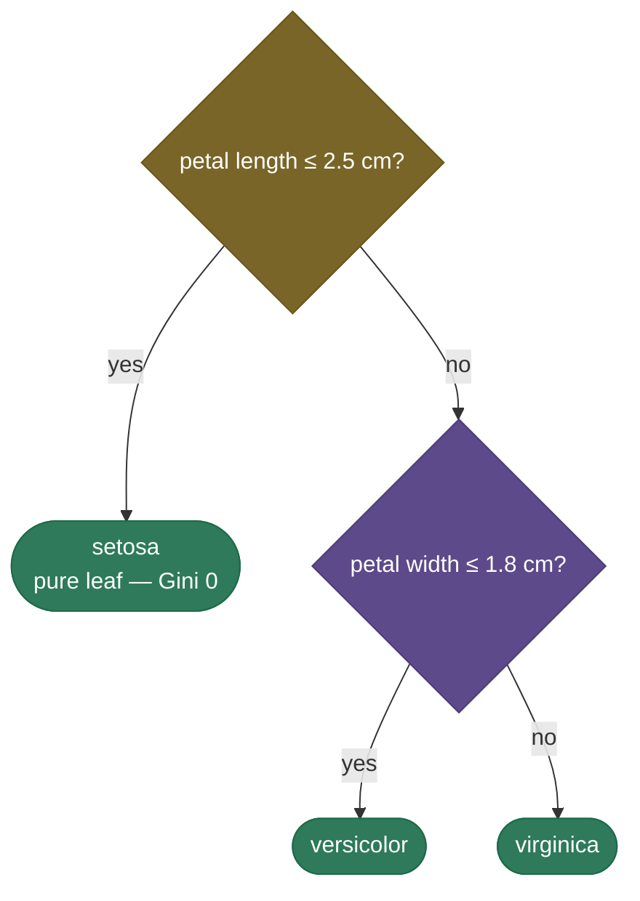
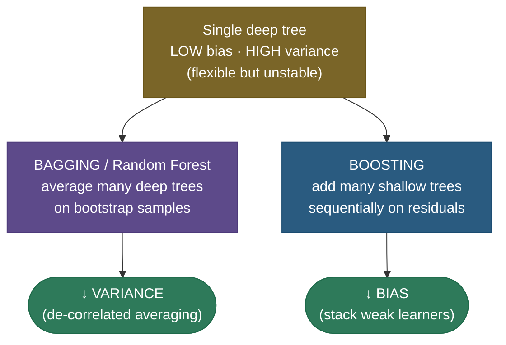

# Decision trees: learning by asking the right questions

A decision tree is the machine-learning version of the game *20 Questions*. To classify something, it asks a series of simple yes/no questions about its features — "is age ≤ 40?", "is income ≤ \$50k?" — and walks down the branches until it reaches a leaf that holds the answer. Each question splits the data into two cleaner groups, and the tree *learns* which questions to ask, and in what order, by greedily picking at every step the split that most reduces **impurity** (how mixed the labels are). The result is a model you can literally read as a flowchart — the most **interpretable** model in mainstream ML — that needs no feature scaling, handles numbers and categories together, and captures non-linear patterns. On its own a single tree is a bit fragile, but it is the fundamental building block of the algorithms that still dominate tabular data: **random forests** and **gradient boosting**.

This page is the definitive treatment. We will build the tree from one idea — *recursive binary splitting* — and **derive** every result rather than state it: why the globally-optimal tree is NP-hard (so we go greedy), what Gini and entropy actually measure and how they differ, the **information-gain** objective derived as parent-minus-weighted-children impurity, regression trees as **variance reduction** (derived), the axis-aligned "staircase" boundary and why a rotation breaks a tree, *why* trees overfit and the exact knobs that stop them (including **cost-complexity pruning**, derived), the **bias–variance** reason a single tree is high-variance and why that *motivates* ensembles, the CART vs ID3/C4.5 lineage, and how **feature importance** is computed (and biased). We work **three** numeric examples of increasing complexity, then prove the from-scratch split selection matches scikit-learn and reproduce the overfitting curve in real numbers.

By the end you will be able to:

- explain **recursive binary splitting** and why finding the globally optimal tree is **NP-hard** (so trees are grown greedily);
- compute **Gini impurity** and **entropy**, contrast them, and **derive information gain** as the split objective;
- derive **regression trees** as **variance / MSE reduction**, and explain the leaf-mean prediction;
- explain the axis-aligned **staircase** boundary and why a feature **rotation** changes a tree;
- explain *why* trees overfit and how **max_depth, min_samples_leaf, and cost-complexity pruning** (derived) control it;
- give the **bias–variance** reason a single deep tree is **high-variance**, and why **bagging cuts variance** and **boosting cuts bias**;
- distinguish **CART (Gini)** from **ID3 / C4.5 (entropy, gain ratio)**;
- compute **feature importance** two ways (impurity-decrease and permutation) and explain the **high-cardinality bias**;
- build the splitting logic from scratch and reproduce the overfitting curve in numbers.

Intuition and pictures first, then the math (with sources), then runnable, verified code.

> **Note:** the whole algorithm is one idea applied recursively — *find the single question that best separates the labels, split on it, and repeat on each side until the groups are pure enough.* Everything else (Gini vs entropy, pruning, regression vs classification, feature importance) is a detail of "best separates" or "pure enough." Hold that sentence and the rest of the page hangs off it.

---

## The problem: a flexible, readable model for tabular data

You want a model that captures non-linear structure, handles **mixed feature types** (age, zip code, blood type) without preprocessing, needs **no normalization**, copes with missing values, and — crucially — that a human can **inspect and trust**. Linear and logistic models give interpretability but only straight boundaries; kernel SVMs and neural nets are flexible but opaque, and they demand scaling and careful tuning. Decision trees hit a sweet spot: arbitrary **axis-aligned** regions, learned greedily from the data, expressed as a flowchart anyone can follow. That readability — you can point at the exact path that produced a decision — is why they remain a default in medicine, credit scoring, fraud, and operations, where a model that *can't* explain itself is often a non-starter.

> **Tip:** the interview framing is "interpretable, non-parametric, scale-free, mixed-type — but unstable as a single model." Everything good and bad about trees flows from one design choice: they ask **threshold questions on one feature at a time**. That buys interpretability and scale-invariance; it costs you smooth boundaries and stability.

---

## The model: recursive binary splitting

A tree is grown **top-down and greedily**. At the root, the whole dataset sits in one node. The learner considers **every feature and every candidate threshold**, scores each split "feature $j \le t$?" by how much it reduces impurity, picks the single best one, sends the data left (yes) and right (no), and **recurses** on each child — stopping when a node is pure (all one class), too small to split, or a stopping rule fires. Each leaf predicts the **majority class** (classification) or the **mean target** (regression) of the training samples that land in it.



To **classify** a new point you walk it down the tree following the answers — $O(\text{depth})$ comparisons, with **no arithmetic on the feature values themselves** beyond comparing each to a threshold (hence no scaling needed; a monotone transform of a feature, like $\log$, leaves every split unchanged).

**For a numeric feature**, the candidate thresholds are the **midpoints between adjacent sorted values** — between two consecutive distinct values every threshold gives the identical partition, so you only need one per gap. With $n$ samples that's $O(n)$ thresholds per feature, $O(nd)$ candidate splits per node; sorting once dominates the cost. **For a categorical feature**, CART considers subset splits (which categories go left vs right); for a $K$-category feature there are $2^{K-1}-1$ non-trivial binary partitions, so high-cardinality categoricals are expensive (and, as we'll see, a source of bias).

> **Note:** the search is **greedy** — at each node it picks the *locally* best split without looking ahead, then never revisits that choice. It does this because finding the **globally optimal** tree (the one that, over all possible trees of a given size, minimizes error) is **NP-hard** (Laurent & Rivest, 1976): the number of trees explodes combinatorially with features and thresholds, so exhaustive search is intractable. Greedy is a heuristic that works very well in practice but is *not* guaranteed optimal — it can miss a split that only pays off **after** a later split (an XOR pattern is the classic trap: neither feature alone reduces impurity, so a greedy root split sees no gain, even though two splits together separate the classes perfectly).

> **Gotcha:** "the tree found the best split" almost never means the best *tree*. In an interview, say it precisely: *each node's split is locally optimal under a one-step impurity criterion; the overall tree is a greedy heuristic because the global problem is NP-hard.* That single sentence separates people who memorized "trees are greedy" from people who know *why*.

---

## How a split is chosen: impurity and information gain

"Best split" means the one that makes the children **purest** — least mixed in their labels. We need a number for "mixed," and there are two standard choices for classification. Writing $p_c$ for the fraction of class $c$ in a node:

$$\text{Gini}(node) = \sum_c p_c(1-p_c) = 1 - \sum_c p_c^2 \qquad \text{Entropy}(node) = -\sum_c p_c \log_2 p_c$$

Both are **0 when a node is pure** (one class has $p=1$, the rest $0$) and **maximal when classes are evenly mixed**. For two classes: Gini peaks at $1-(0.5^2+0.5^2)=0.5$, entropy at $-(0.5\log_2 0.5 + 0.5\log_2 0.5)=1$ bit. Plotting them against the class proportion $p$ shows the shapes are nearly identical — both smooth, both concave — while a third measure, **misclassification error** $1-\max_c p_c$, is only piecewise-linear:


A split's quality is its **information gain** — the parent's impurity minus the **weighted average** impurity of the two children, where the weights are the fraction of samples going each way:

$$\text{Gain} = I(\text{parent}) - \underbrace{\left(\frac{n_L}{n}\,I(\text{left}) + \frac{n_R}{n}\,I(\text{right})\right)}_{\text{weighted child impurity}}$$

The tree tries every (feature, threshold) pair and keeps the split with the **highest gain**. Because $I(\text{parent})$ is a constant for the node, **maximizing gain is identical to minimizing the weighted child impurity** — that's the quantity scikit-learn actually compares across candidate splits.

**Why the weighting matters:** without it, you could "improve" a node by carving off a tiny pure sliver and leaving a huge mixed remainder. The $n_L/n$ and $n_R/n$ weights make the objective honest — a child only helps in proportion to how many samples it actually cleans up. When entropy is the impurity, this exact quantity is the classic **information gain** of decision-tree induction; with Gini it's the **Gini gain** (CART). They are the same formula with a different $I$.

**Why not misclassification error as the split criterion?** Because it's insensitive to *within-node* improvements. Suppose a node is 80/20 (error $0.2$) and a split makes one child 100/0 and the other 60/40. Misclassification of the children: $0$ and $0.4$, weighted (say 50/50) $= 0.2$ — **no improvement**, error says don't split. But the split clearly purified one side! Gini and entropy, being strictly concave, **reward that move toward purity**, which is exactly the annotated point in the figure above. Misclassification is fine for **pruning** (where you care about final error) but a poor criterion for **growing**.

> **Note:** **Gini vs entropy** barely changes the resulting tree in practice — they agree on the chosen split the vast majority of the time. Gini is slightly cheaper (no logarithms) and is scikit-learn's **CART** default; entropy is Quinlan's **ID3 / C4.5** choice and has a clean "bits of information" interpretation. Pick Gini for speed, entropy if you want the information-theoretic story; don't agonize over it.

> *Where this comes from: information-gain (entropy) tree induction is **Induction of Decision Trees** (Quinlan 1986, ID3) and its successor **C4.5** (Quinlan 1993); the Gini-based **CART** is Breiman, Friedman, Olshen & Stone, *Classification and Regression Trees* (1984). The unified textbook treatment is **The Elements of Statistical Learning** Ch. 9.2 and **ISLR** Ch. 8.1 — all in the references.*

---

## Regression trees: variance reduction, derived

For **regression** (continuous target $y$), "impurity" becomes **variance** (equivalently, mean squared error). A leaf predicts a single constant $\hat y$; the natural impurity is the within-node MSE around that constant:

$$I(\text{node}) = \frac{1}{n}\sum_{i \in \text{node}} (y_i - \hat y)^2.$$

We can **derive** the best constant. Minimize $\sum_i (y_i - \hat y)^2$ over $\hat y$: take the derivative and set it to zero,

$$\frac{d}{d\hat y}\sum_i (y_i-\hat y)^2 = -2\sum_i(y_i-\hat y) = 0 \;\Longrightarrow\; \hat y = \frac{1}{n}\sum_i y_i.$$

So **the optimal leaf prediction is the mean** of the targets in that leaf, and the resulting minimum impurity is exactly the **variance** $\frac1n\sum_i (y_i-\bar y)^2$. A split is then chosen to minimize the weighted child variance $\frac{n_L}{n}\text{Var}(L) + \frac{n_R}{n}\text{Var}(R)$ — i.e. to **maximize variance reduction**, the regression analogue of information gain. The fitted function is therefore **piecewise-constant**: a staircase of flat segments, one per leaf, each at its interval's mean.


> **Note:** a regression tree can only output **values it has seen averaged in training** — it is piecewise-constant, so it **cannot extrapolate** beyond the range of the training targets, and it produces visible "steps" rather than a smooth line. That blockiness is exactly what **gradient boosting** smooths out by summing many small trees, and what a forest softens by averaging.

> **Tip:** classification and regression trees are the *same algorithm* with a different impurity: swap Gini/entropy for variance, and majority-vote for mean. If you can explain one, you can explain the other by naming the substitution — a clean thing to say in an interview.

---

## What a tree computes: axis-aligned regions and the staircase

Because every split is "feature $\le$ threshold," a tree carves the feature space into **axis-aligned hyper-rectangles** (boxes whose faces are perpendicular to the axes), predicting one label or value per box:


The tell-tale **staircase** boundary is a direct consequence of axis-aligned splits — a single tree can only cut **perpendicular to an axis**, so a diagonal or curved boundary is approximated by many little steps, each step a separate split. This has two important consequences:

- **A 45° rotation of the data changes the tree.** Rotate the features and a boundary that *was* axis-aligned (cheap — one split) becomes diagonal (expensive — a staircase of many splits), and vice versa. Trees are **not** rotation-invariant, unlike, say, a linear SVM whose boundary's *shape* is unchanged by rotation. This is also the reason a PCA rotation can sometimes help (or hurt) a tree, and why "oblique" trees that split on linear combinations of features exist.
- **Interactions are captured automatically.** Because a child split happens *within* the region carved by its parent, a tree naturally models "if A and B then…" interactions with no manual feature engineering — a big part of why trees and tree ensembles are so strong on messy tabular data.

> **Gotcha:** "trees need no feature scaling" is true and a common interview point — but be ready for the follow-up: *they are scale-invariant but **not** rotation-invariant.* Monotone per-feature transforms (scaling, $\log$) leave every threshold split unchanged; a rotation that mixes features does not, and can dramatically change the tree's complexity.

---

## Why trees overfit, and how to stop them

Keep splitting and a tree will eventually isolate **every** training point in its own pure leaf — a leaf per sample, zero training error, but it has **memorized the data, including its noise**. Training accuracy hits 100% while test accuracy peaks early and then *falls*:


The cure is to **limit complexity** — pre-pruning (stop early) or post-pruning (grow full, then cut back):

- **`max_depth`** — cap how deep the tree may grow. The most direct complexity knob.
- **`min_samples_leaf` / `min_samples_split`** — require a minimum number of samples to *be* a leaf or to *make* a split, so the tree can't split down to single noisy points.
- **`max_leaf_nodes` / `min_impurity_decrease`** — cap the number of leaves, or refuse splits whose gain is below a threshold (don't split for a trivial improvement).
- **Cost-complexity (weakest-link) pruning** — grow a full tree, then prune back the subtrees that don't earn their keep, chosen by cross-validation. This is CART's principled post-pruning; we derive it next.

### Cost-complexity pruning, derived

Pre-pruning is greedy and can stop too early (it can't see a good split hiding *behind* a weak one). **Cost-complexity pruning** avoids that by growing the full tree $T_0$ first, then defining, for any subtree $T$, a penalized cost that trades training error against the **number of leaves** $|\widetilde T|$:

$$R_\alpha(T) = R(T) + \alpha\,|\widetilde T|,$$

where $R(T)$ is the tree's training error (misclassification rate, or total leaf impurity) and $\alpha \ge 0$ is a **complexity penalty per leaf**. At $\alpha = 0$ the full tree wins (lowest training error). As $\alpha$ grows, each leaf must "pay rent" $\alpha$, so over-elaborate subtrees become net-negative and get collapsed. The elegant result (Breiman et al.) is that as $\alpha$ increases continuously from $0$ to $\infty$, you get a **finite, nested sequence of optimal subtrees** $T_0 \supset T_1 \supset \dots \supset \{\text{root}\}$ — each step prunes the "weakest link," the internal node whose subtree gives the smallest error increase per leaf removed. You then pick the $\alpha$ (hence the subtree) with the best **cross-validated** error. In scikit-learn this is the `ccp_alpha` hyperparameter, and `cost_complexity_pruning_path` returns the sequence of $\alpha$ breakpoints.

> **Note:** the per-leaf penalty $\alpha$ is the tree analogue of $\lambda$ in ridge/lasso regularization: it buys lower variance at the cost of a little bias. $\alpha = 0$ → full, high-variance tree; large $\alpha$ → a stump that's all bias. Cross-validation finds the sweet spot — the same sweet spot the overfitting figure shows as the peak of the test curve.

> **Gotcha:** a single overgrown tree pruned by CV is *better* than an arbitrary `max_depth`, but it's still **one tree** — high-variance by nature. Pruning controls overfitting; it does **not** make a single tree stable. For stability you ensemble (next section). Don't oversell pruning as the fix for variance.

---

## The bias–variance reason ensembles exist

A single decision tree is the textbook **low-bias, high-variance** model. Grown deep, it can fit almost any training set arbitrarily well (**low bias** — it's flexible enough to carve out any region). But it is **unstable**: change a handful of training points and the greedy root split can flip to a different feature, and because every descendant split is conditioned on its ancestors, **that one change cascades into a completely different tree** (**high variance**). Two bootstrap samples of the same data can produce trees that look nothing alike yet both fit well — that instability *is* the variance.

That high variance is exactly what ensembles attack, in two complementary ways:

- **Bagging / Random Forests cut variance.** [Bagging](08-Bagging.md) trains many deep trees on **bootstrap resamples** and **averages** them; averaging $B$ roughly-independent estimators divides variance by up to $B$. [Random forests](09-Random-Forests.md) go further by also sampling a random subset of features at each split, **de-correlating** the trees so the averaging is more effective. Each tree stays low-bias; the ensemble's variance collapses.
- **Boosting cuts bias.** [Gradient boosting](10-Gradient-Boosting-XGBoost.md) does the opposite: it adds many **shallow** (high-bias, low-variance) trees **sequentially**, each correcting the residual errors of the running sum. Stacking weak learners drives bias down while keeping variance controlled.

Decision trees are the base learner of choice *precisely because* they're flexible but high-variance — they give the ensemble something to tame. (See [Bias–Variance Tradeoff](12-Bias-Variance-Tradeoff.md) for the decomposition.)



> **Tip:** "why not just use one big tree?" → it's high-variance and unstable. The interview-grade continuation: *that's exactly why **random forests** (bagging → ↓variance) and **gradient boosting** (→ ↓bias) exist — they're built on trees specifically to fix the single tree's weakness.* The whole tree-ensemble family is one answer to "the single tree has too much variance."

---

## CART vs ID3 / C4.5: the family tree of trees

"Decision tree" names a family with a few distinct algorithms; interviewers like to check you know which is which:

- **ID3** (Quinlan, 1986) — the original. Splits on **information gain (entropy)**, handles only **categorical** features, makes a **multi-way** split (one branch per category value), and does no pruning. Simple and historically important, but it **favors high-cardinality features** (more values → more apparent gain) and overfits.
- **C4.5** (Quinlan, 1993) — ID3's successor. Uses **gain ratio** (information gain normalized by the split's own entropy) to fix the high-cardinality bias, handles **continuous** features via thresholds and **missing values**, and adds **post-pruning**. The workhorse of 1990s symbolic ML.
- **CART** (Breiman et al., 1984) — uses **Gini** (classification) or **variance** (regression), always makes **binary** splits, and prunes with **cost-complexity**. It does both classification *and* regression, which is why it's the basis of essentially every modern implementation, **including scikit-learn**.

> **Note:** when you use `DecisionTreeClassifier` or `DecisionTreeRegressor` in scikit-learn, you are using a **CART** variant — **binary** splits, **Gini** by default (or entropy if you ask), cost-complexity pruning via `ccp_alpha`. ID3/C4.5's multi-way splits and gain ratio are not in scikit-learn; if someone says "the tree split into three branches," they're describing ID3/C4.5, not CART.

---

## Categorical features and missing values

Two practical wrinkles that interviewers probe and that bite in practice.

**Categorical features.** A native CART finds the best **subset** split — which categories go left vs right — by trying partitions of the $K$ values. For an *unordered* $K$-category feature there are $2^{K-1}-1$ candidate binary splits, which is exponential, so high-cardinality categoricals are both expensive and prone to overfit (each rare category can be carved into its own branch). A useful shortcut: for a *binary* target, sort the categories by their **mean target value** and treat them as ordered — Fisher (1958) proved this reduces the search from exponential to **linear** while still finding the optimal split. **scikit-learn's trees do not accept raw strings**: you must encode first. **One-hot encoding** is safe but explodes a high-cardinality feature into many sparse columns (and biases splits toward it); **ordinal / target encoding** keeps it compact but imposes an order. LightGBM and CatBoost handle categoricals natively and are usually the better choice when you have many high-cardinality ones.

**Missing values.** A tree must still route a sample with a missing split-feature down *some* branch. Classic strategies: **surrogate splits** (CART) — at each node, learn a backup feature that best mimics the primary split, and use it when the primary is missing; or simply **send missing to whichever child reduces impurity more** (the LightGBM/XGBoost default, learned per split). Because the model decides routing *per node*, trees tolerate missingness far more gracefully than linear models, which need imputation up front. scikit-learn's `DecisionTree*` added native NaN handling (it routes missing to the better side) — but historically you imputed first.

> **Gotcha:** one-hot encoding a high-cardinality categorical for a tree is a quiet performance killer — it both **fragments** the feature into many weak binary columns (so the tree can't see the category as a whole) and **biases** MDI importance toward the resulting many columns. For trees specifically, prefer native categorical handling (LightGBM/CatBoost) or target encoding over naive one-hot.

---

## Feature importance — and its high-cardinality bias

A big selling point of trees is telling you **which features mattered**. There are two ways to measure it, and they disagree in an important way.

**Mean decrease in impurity (MDI / "Gini importance").** For each feature, sum the impurity decrease (weighted by samples reaching the node) over **every split that used that feature**, across the tree (or the forest), then normalize. It's free — computed during training — and is scikit-learn's `feature_importances_`. Its flaw: it is **biased toward high-cardinality features** (many unique values: continuous features, IDs, zip codes). Such features offer **more candidate thresholds**, so by sheer chance one of them often yields a small spurious impurity decrease, inflating their importance — even a **random unique ID** can look important under MDI.

**Permutation importance.** Train the model, measure validation accuracy, then **shuffle one feature's column** and measure how much accuracy drops; the drop is that feature's importance. It's **model-agnostic**, measures importance on **held-out** data, and **doesn't suffer the cardinality bias** (a useless ID column, when shuffled, changes nothing, so it correctly scores ~0). The cost is that it requires extra passes over the data and is sensitive to **correlated features** (shuffling one of two correlated features barely hurts, so both can look unimportant).

> **Gotcha:** never trust raw MDI / `feature_importances_` for a feature-selection or "what drives the model" claim when you have high-cardinality features (IDs, timestamps, free-text categories). It will rank a meaningless unique key near the top. Use **permutation importance** (or SHAP) on a **held-out** set instead — this is a favorite "gotcha" interview question and a real production footgun.

---

## Strengths and weaknesses

- **Strengths:** **interpretable** — a readable flowchart with an explicit decision path; **no feature scaling** (scale-invariant); handles **numeric + categorical** features and (in some implementations) **missing values**; captures **non-linearities and interactions** automatically; **fast to predict** ($O(\text{depth})$); gives free **feature importances**.
- **Weaknesses:** **high variance / unstable** as a single model; **greedy** (no lookahead, can miss XOR-style structure); **axis-aligned only** (struggles with diagonal boundaries; not rotation-invariant); **biased toward high-cardinality features** in both splitting and MDI importance; **prone to overfit** without depth control or pruning; can be **biased on imbalanced classes** (use class weights); regression trees **can't extrapolate** (piecewise-constant).

---

## Worked example 1 (minimal): the Gini of a 50/50 node

Start with the simplest possible node: 10 samples, 5 of class 0 and 5 of class 1 — maximally mixed. With $p_0 = p_1 = 0.5$:

$$\text{Gini} = 1 - (p_0^2 + p_1^2) = 1 - (0.5^2 + 0.5^2) = 1 - 0.5 = \mathbf{0.5}.$$

Entropy on the same node: $-(0.5\log_2 0.5 + 0.5\log_2 0.5) = -(0.5\cdot(-1) + 0.5\cdot(-1)) = \mathbf{1\ \text{bit}}$. Both are at their **maximum** — a 50/50 binary node is the most impure a node can be, and matches the peak of the impurity figure at $p=0.5$. A pure node (10/0) would give Gini $= 1 - (1^2 + 0^2) = 0$ and entropy $= -(1\log_2 1 + 0) = 0$. This is the anchor for everything: splits try to move nodes **from 0.5 toward 0**.

---

## Worked example 2 (realistic): a full information-gain split

Now do a real split end to end. A parent node has **14 samples: 9 class-1 ("yes"), 5 class-0 ("no")** — the classic "play tennis" setup. Parent impurity:

$$p_1 = \tfrac{9}{14} \approx 0.643,\quad p_0 = \tfrac{5}{14} \approx 0.357,\qquad \text{Gini}_{\text{parent}} = 1 - (0.643^2 + 0.357^2) = 1 - (0.413 + 0.128) = \mathbf{0.459}.$$

A candidate split on "outlook" sends the data into two children:

- **Left child** ($n_L = 8$): 6 class-1, 2 class-0. $\;\text{Gini}_L = 1 - \big((6/8)^2 + (2/8)^2\big) = 1 - (0.5625 + 0.0625) = 0.375$.
- **Right child** ($n_R = 6$): 3 class-1, 3 class-0 (a 50/50 node). $\;\text{Gini}_R = 1 - (0.5^2 + 0.5^2) = 0.5$.

Weighted child impurity (the quantity the tree actually minimizes):

$$\frac{n_L}{n}\text{Gini}_L + \frac{n_R}{n}\text{Gini}_R = \frac{8}{14}(0.375) + \frac{6}{14}(0.5) = 0.2143 + 0.2143 = \mathbf{0.4286}.$$

Information (Gini) gain:

$$\text{Gain} = \text{Gini}_{\text{parent}} - 0.4286 = 0.459 - 0.4286 = \mathbf{0.031}.$$

A small positive gain — this split helps a little (it purified the left child) but leaves a 50/50 mess on the right. The tree would compare this **0.031** against the gain of every other feature and threshold and keep the largest. **Contrast with a perfect split:** if some threshold sent all 9 class-1 left and all 5 class-0 right, both children would be pure (Gini 0), weighted child impurity $= 0$, and gain $= 0.459 - 0 = 0.459$ — the **maximum possible** (the full parent impurity), and the tree would obviously prefer it.

> **Note:** the gain can never exceed the parent's impurity (the best you can do is drive the children to 0), and a **useless** split — one where each child has the *same* class proportions as the parent — yields gain exactly **0**. That zero is why a tree won't split on a feature that carries no information about the label.

---

## Worked example 3 (full trace): a regression variance-reduction split

Now the regression analogue, traced fully. Six points with targets $y = [1, 1, 2, 8, 9, 9]$ at sorted feature values $x = [1, 2, 3, 6, 7, 8]$. The parent leaf would predict the mean $\bar y = \frac{1+1+2+8+9+9}{6} = 5$, with variance

$$\text{Var}_{\text{parent}} = \tfrac16\big[(1-5)^2 + (1-5)^2 + (2-5)^2 + (8-5)^2 + (9-5)^2 + (9-5)^2\big] = \tfrac16[16+16+9+9+16+16] = \tfrac{82}{6} = \mathbf{13.67}.$$

Try the split **$x \le 4.5$** (the natural gap between $x=3$ and $x=6$):

- **Left** ($y = [1,1,2]$, $n_L=3$): mean $= \tfrac{4}{3} = 1.333$. $\;\text{Var}_L = \tfrac13[(1-1.333)^2 + (1-1.333)^2 + (2-1.333)^2] = \tfrac13[0.111+0.111+0.444] = 0.222$.
- **Right** ($y = [8,9,9]$, $n_R=3$): mean $= \tfrac{26}{3} = 8.667$. $\;\text{Var}_R = \tfrac13[(8-8.667)^2 + (9-8.667)^2 + (9-8.667)^2] = \tfrac13[0.444+0.111+0.111] = 0.222$.

Weighted child variance:

$$\frac{3}{6}(0.222) + \frac{3}{6}(0.222) = \mathbf{0.222}.$$

Variance reduction (the regression "gain"):

$$\Delta = \text{Var}_{\text{parent}} - 0.222 = 13.67 - 0.222 = \mathbf{13.44}.$$

A massive reduction — this split cleanly separates the low group ($\approx 1.3$) from the high group ($\approx 8.7$), and each leaf predicts its own mean. Any other threshold (say $x \le 2.5$, splitting $[1,1]$ from $[2,8,9,9]$) leaves a high-variance right child and a smaller $\Delta$, so the tree picks $x \le 4.5$. This is variance reduction doing exactly what information gain does for classification — and the leaf predictions $1.333$ and $8.667$ are the two flat steps of the regression staircase.

> **Tip:** the three examples are the whole arc in miniature: **(1)** measure impurity of one node (Gini of 50/50 = 0.5), **(2)** score a classification split (parent − weighted children = information gain), **(3)** score a regression split (parent − weighted children = variance reduction). Same template three times; only the impurity changes.

---

## Code: split selection from scratch, and overfitting

This reproduces Worked Example 2's information-gain split from scratch, then runs the depth sweep that *is* the overfitting figure in numbers.

```python
"""Gini / information-gain split selection from scratch + the overfitting curve.
Verified on Python 3.12, CPU."""
import numpy as np
from sklearn.datasets import make_moons
from sklearn.tree import DecisionTreeClassifier
from sklearn.model_selection import train_test_split

def gini(y):
    if len(y) == 0: return 0.0
    p = np.bincount(y) / len(y); return 1 - (p**2).sum()

def info_gain(y, mask):
    yl, yr = y[mask], y[~mask]
    w = len(yl) / len(y)
    return gini(y) - (w*gini(yl) + (1-w)*gini(yr))

# A perfectly-separable 50/50 node: 5 class-0 (x in 1..3), 5 class-1 (x in 6..9)
y = np.array([0,0,0,0,0, 1,1,1,1,1]); x = np.array([1,2,2,3,3, 6,7,7,8,9])
print(f"parent Gini = {gini(y):.3f}  (50/50, max impurity)")
best = max(np.unique(x), key=lambda t: info_gain(y, x <= t))
print(f"best split: feature <= {best}  ->  info-gain = {info_gain(y, x<=best):.3f}  (perfect split)")

# Worked Example 2 by hand: parent 9 'yes' / 5 'no', split -> (6/2) and (3/3)
parent = np.array([1]*9 + [0]*5)
left, right = np.array([1]*6 + [0]*2), np.array([1]*3 + [0]*3)
g_parent = gini(parent)
weighted = (len(left)/len(parent))*gini(left) + (len(right)/len(parent))*gini(right)
print(f"\nWorked Ex.2: parent Gini={g_parent:.3f}  weighted children={weighted:.4f}  "
      f"gain={g_parent-weighted:.3f}")

# The overfitting curve: train -> 100%, test peaks then drops
X, Y = make_moons(n_samples=400, noise=0.35, random_state=1)
Xtr, Xte, ytr, yte = train_test_split(X, Y, test_size=0.5, random_state=1)
print("\ndepth sweep (overfitting):")
for d in [2, 4, 8, 15]:
    clf = DecisionTreeClassifier(max_depth=d, random_state=0).fit(Xtr, ytr)
    print(f"  max_depth={d:>2}: train={clf.score(Xtr,ytr):.3f}  test={clf.score(Xte,yte):.3f}")
```

Output:

```
parent Gini = 0.500  (50/50, max impurity)
best split: feature <= 3  ->  info-gain = 0.500  (perfect split)

Worked Ex.2: parent Gini=0.459  weighted children=0.4286  gain=0.031

depth sweep (overfitting):
  max_depth= 2: train=0.915  test=0.830
  max_depth= 4: train=0.920  test=0.815
  max_depth= 8: train=0.995  test=0.795
  max_depth=15: train=1.000  test=0.800
```

> **Note:** the from-scratch numbers match the derivations exactly: the perfectly-separable node gives information gain **0.500** = the full parent Gini, and **Worked Example 2 reproduces 0.459 → 0.4286 → gain 0.031** by hand. The depth sweep is the overfitting figure in numbers: at depth 2, train and test are close (0.915 / 0.830); by depth 15, train is **perfect (1.000)** while test has **dropped** (0.800) — the tree memorized the noise. *Limiting depth is the single knob standing between you and that 1.000/0.800 gap.*

### Cost-complexity pruning and the importance bias, measured

Two more things worth seeing in real numbers: **pruning a full tree by cross-validated `ccp_alpha`** actually *improves* the test score, and **MDI importance is fooled by a high-cardinality noise column** while permutation importance is not.

```python
"""Cost-complexity pruning (it improves test acc) + the MDI high-cardinality bias.
Verified on Python 3.12, CPU."""
import numpy as np
from sklearn.datasets import make_moons
from sklearn.tree import DecisionTreeClassifier
from sklearn.inspection import permutation_importance
from sklearn.model_selection import train_test_split, cross_val_score

# --- 1. Cost-complexity pruning: grow full, then prune by CV-chosen alpha ---
X, Y = make_moons(n_samples=400, noise=0.35, random_state=1)
Xtr, Xte, ytr, yte = train_test_split(X, Y, test_size=0.5, random_state=1)
full = DecisionTreeClassifier(random_state=0).fit(Xtr, ytr)
alphas = full.cost_complexity_pruning_path(Xtr, ytr).ccp_alphas    # nested-subtree breakpoints
best_a = max(alphas, key=lambda a:
             cross_val_score(DecisionTreeClassifier(random_state=0, ccp_alpha=a), Xtr, ytr, cv=5).mean())
pruned = DecisionTreeClassifier(random_state=0, ccp_alpha=best_a).fit(Xtr, ytr)
print(f"full   : leaves={full.get_n_leaves():2d}  train={full.score(Xtr,ytr):.3f}  test={full.score(Xte,yte):.3f}")
print(f"pruned : leaves={pruned.get_n_leaves():2d}  train={pruned.score(Xtr,ytr):.3f}  test={pruned.score(Xte,yte):.3f}"
      f"  (ccp_alpha={best_a:.4f})")

# --- 2. MDI is biased toward a high-cardinality (many-valued) noise feature ---
rng = np.random.default_rng(0); n = 2000
informative = rng.integers(0, 2, size=n).astype(float)            # 2 values -> few thresholds
y = ((informative == 1) ^ (rng.random(n) < 0.30)).astype(int)     # weak, noisy signal
rand_id = rng.uniform(size=n)                                     # ~unique -> many thresholds, PURE NOISE
Xb = np.column_stack([informative, rand_id])
Xb_tr, Xb_te, yb_tr, yb_te = train_test_split(Xb, y, test_size=0.5, random_state=0)
clf = DecisionTreeClassifier(random_state=0).fit(Xb_tr, yb_tr)
print(f"\nMDI importance  : informative={clf.feature_importances_[0]:.3f}  random_id={clf.feature_importances_[1]:.3f}")
pi = permutation_importance(clf, Xb_te, yb_te, n_repeats=20, random_state=0).importances_mean
print(f"Permutation imp.: informative={pi[0]:.3f}  random_id={pi[1]:.3f}")
```

Output:

```
full   : leaves=27  train=1.000  test=0.800
pruned : leaves= 7  train=0.940  test=0.850  (ccp_alpha=0.0090)

MDI importance  : informative=0.169  random_id=0.831
Permutation imp.: informative=0.066  random_id=-0.004
```

> **Note:** pruning the 27-leaf full tree down to **7 leaves** *raised* test accuracy from 0.800 to **0.850** while training fell from 1.000 to 0.940 — variance traded for a little bias, exactly as the $R_\alpha = R + \alpha|\widetilde T|$ derivation predicts. And the importance demo is the high-cardinality trap in numbers: **MDI ranks the pure-noise `random_id` at 0.831** (far above the real signal's 0.169) purely because its many distinct values offer more thresholds to luck into, while **permutation importance** correctly pins it at ≈0. If you ever feature-select from `feature_importances_`, this is why you can be badly misled.

---

## Where decision trees are used

- **The base learner for ensembles** — random forests and gradient boosting (XGBoost / LightGBM / CatBoost) are *the* go-to for tabular data and dominate Kaggle. You almost never deploy a lone tree, but it's the atom they're built from.
- **Interpretable / regulated decisions** — credit approval, medical triage, eligibility and fraud rules, where a readable decision path is legally or operationally required. A shallow tree *is* the documentation.
- **Feature exploration** — a shallow tree quickly surfaces the most informative features and their interactions, a fast first look at a new dataset.
- **Rule extraction** — converting a fitted tree into human-readable if-then rules for a rules engine or a domain expert to review.

> **Tip:** the interview arc is almost always: **split criterion (Gini/entropy/info-gain) → overfitting & pruning → "so why a forest?" (variance) → boosting (bias) → feature-importance gotcha.** Knowing *why* a single tree is high-variance, and that ensembles exist to fix exactly that, is what they're checking. Trees are rarely the destination; they're the on-ramp to the ensemble questions.

---

## Pitfalls that actually bite

- **Deploying a single unpruned tree** → it overfits and is high-variance. Always either prune (`ccp_alpha` by CV) / cap depth, or — far better — use a **forest / boosting** ensemble.
- **Trusting `feature_importances_` (MDI)** with high-cardinality features → it inflates noisy many-valued columns (a random ID can top the chart). Use **permutation importance** or SHAP on a **held-out** set.
- **Expecting a regression tree to extrapolate** → it's piecewise-constant and clamps to the training range; it cannot predict above/below values it saw. Use a boosted model or a different family if extrapolation matters.
- **Assuming rotation-invariance** → trees are scale-invariant but **not** rotation-invariant; a diagonal boundary becomes an expensive staircase. Consider feature engineering (e.g. a sum/ratio) for known diagonal structure.
- **Ignoring class imbalance** → the majority class can dominate the impurity criterion; set `class_weight="balanced"` (or resample) so minority splits are valued.
- **Reading too much into one tree's structure** → because trees are unstable, a "the model says feature X is the root cause" story can flip on a slightly different sample. Aggregate importances over a forest, and validate stability.

---

## Recap and rapid-fire

**If you remember nothing else:** a decision tree **recursively splits** the feature space with axis-aligned "feature ≤ t?" questions, **greedily** choosing each split to maximize **information gain** = parent impurity − weighted child impurity (**Gini/entropy** for classification, **variance** for regression). The globally-optimal tree is **NP-hard**, so growth is greedy. The boundary is an axis-aligned **staircase** (scale-invariant but *not* rotation-invariant). A single deep tree is **low-bias / high-variance** and **overfits**, controlled by depth, min-samples, and **cost-complexity pruning** — and that high variance is exactly why **random forests** (↓variance via de-correlated averaging) and **boosting** (↓bias via stacked weak learners) ensemble trees.

**Quick-fire — say these out loud:**

- *How does a tree choose a split?* The feature/threshold with the highest **information gain** = parent impurity − weighted child impurity (largest impurity reduction).
- *Gini vs entropy?* Both measure impurity (0 = pure, max at 50/50); Gini = $1-\sum p_c^2$ (cheaper, CART default), entropy = $-\sum p_c\log_2 p_c$ (ID3/C4.5); results nearly identical.
- *Why not misclassification error to grow?* It's piecewise-linear and insensitive to within-node purification; Gini/entropy are concave and reward it.
- *Regression trees?* Split to maximize **variance reduction**; each leaf predicts the **mean** (derived by minimizing within-leaf squared error). Piecewise-constant; **can't extrapolate**.
- *Why no feature scaling?* Splits are per-feature threshold comparisons — monotone transforms don't change them. (But trees are **not** rotation-invariant.)
- *Why do trees overfit?* They split until leaves are pure, memorizing noise; control with max_depth / min_samples_leaf / **cost-complexity pruning** ($R_\alpha = R + \alpha|\widetilde T|$).
- *Why is a single tree high-variance?* Greedy splits are unstable — a small data change flips the root and cascades into a different tree.
- *What does the boundary look like?* Axis-aligned rectangles — a "staircase."
- *Is the optimal tree found?* No — greedy, locally-best splits; the global problem is **NP-hard**.
- *CART vs ID3/C4.5?* CART = binary splits, Gini/variance, both tasks, cost-complexity pruning (scikit-learn); ID3/C4.5 = entropy/gain-ratio, multi-way, categorical-first.
- *Feature-importance gotcha?* MDI (`feature_importances_`) is **biased toward high-cardinality** features (even a random ID looks important); use **permutation importance** on held-out data.
- *Why do ensembles use trees?* Trees are flexible but high-variance; **bagging/forests cut variance**, **boosting cuts bias**.

---

## References and further reading

The curated link library for this topic — videos, courses, interactive/visual resources, articles, papers, books, and internal cross-links — lives in a companion file so it can be reused as a standalone reference list:

**→ [Decision Trees — references and further reading](07-Decision-Trees.references.md)**
