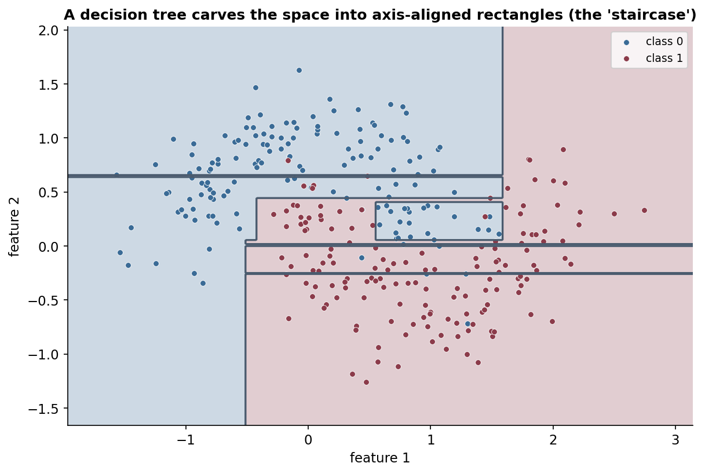
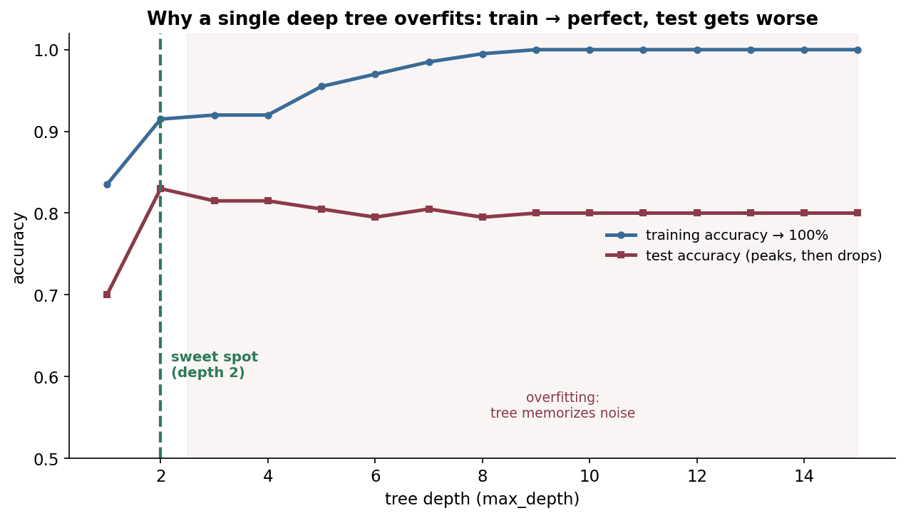

# Decision trees: learning by asking the right questions

A decision tree is the machine-learning version of the game *20 Questions*. To classify something, it asks a series of simple yes/no questions about its features — "is age ≤ 40?", "is income ≤ \$50k?" — and follows the branches down until it reaches a leaf that holds the answer. Each question splits the data into two cleaner groups, and the tree *learns* which questions to ask, and in what order, by greedily picking at every step the split that most reduces **impurity** (how mixed the labels are). The result is a model you can literally read as a flowchart — the most **interpretable** model in mainstream ML — that needs no feature scaling, handles numbers and categories together, and captures non-linear patterns. On its own a single tree is a bit fragile, but it's the fundamental building block of the algorithms that still dominate tabular data: **random forests** and **gradient boosting**.

By the end of this page you'll be able to:

- explain **recursive binary splitting** and how a tree partitions the feature space;
- compute **Gini impurity**, **entropy**, and **information gain**, and explain how a split is chosen;
- explain **regression trees** (variance reduction) vs **classification trees**;
- explain *why* trees overfit and how **pruning / max_depth / min_samples_leaf** control it;
- give the **bias–variance** reason a single deep tree is high-variance (and why ensembles fix it);
- build the splitting logic from scratch and reproduce the overfitting curve.

Intuition and pictures first, then the math (with sources), then runnable code.

> **Note:** the whole algorithm is one idea applied recursively — *find the single question that best separates the labels, split on it, and repeat on each side until the groups are pure enough.* Everything else (Gini vs entropy, pruning, regression vs classification) is a detail of "best separates" or "pure enough."

---

## The problem: a flexible, readable model for tabular data

You want a model that captures non-linear structure, handles mixed feature types (age, zip code, blood type), needs no normalization, and — crucially — that a human can **inspect and trust**. Linear models give interpretability but only straight boundaries; neural nets are flexible but opaque. Decision trees hit a sweet spot: arbitrary axis-aligned regions, learned greedily, expressed as a flowchart anyone can follow. That readability is why they remain a default in medicine, credit, and operations.

---

## The model: recursive binary splitting

A tree is grown top-down. At each node, consider every feature and every threshold, pick the split "feature ≤ t?" that best reduces impurity, send the data left/right, and recurse — stopping when a node is pure (all one class) or a stopping rule fires. Each leaf predicts the **majority class** (classification) or the **mean** (regression) of the samples that land in it.


To classify a new point you just walk it down the tree following the answers — $O(\text{depth})$ comparisons, no arithmetic on the features themselves (hence no scaling needed).

> **Note:** the search is **greedy** — it picks the locally best split at each node without looking ahead, because finding the globally optimal tree is NP-hard. Greedy works well in practice but means a tree can miss a split that would only pay off after a *later* split.

---

## How a split is chosen: impurity and information gain

"Best split" means the one that makes the children **purest**. Impurity is measured two common ways for classification (with class proportions $p_c$):

$$\text{Gini} = 1 - \sum_c p_c^2 \qquad \text{Entropy} = -\sum_c p_c \log_2 p_c$$

Both are 0 when a node is pure (one class) and maximal when classes are evenly mixed (for two classes: Gini 0.5, entropy 1 bit). A split's quality is its **information gain** — the parent's impurity minus the *weighted average* impurity of the two children:

$$\text{Gain} = I(\text{parent}) - \left(\frac{n_L}{n}\,I(\text{left}) + \frac{n_R}{n}\,I(\text{right})\right)$$

The tree tries all features and thresholds and takes the split with the **highest gain**. (In the code, a feature that perfectly separates a 50/50 node has gain = 0.5 = the full parent Gini — both children become pure.) **Gini vs entropy** barely matters in practice — Gini is slightly cheaper (no logs) and is scikit-learn's CART default; entropy is Quinlan's ID3/C4.5 choice. For **regression trees**, impurity is **variance** (or MSE), so splits minimize the within-leaf variance and each leaf predicts the mean.

> *Where this comes from: information-gain tree induction is **Induction of Decision Trees** (Quinlan 1986, ID3); the Gini-based **CART** is Breiman, Friedman, Olshen & Stone (1984); the textbook treatment is **The Elements of Statistical Learning** Ch. 9.2 and **ISLR** Ch. 8.1 — references.*

---

## What a tree computes: axis-aligned regions

Because every split is "feature ≤ threshold," a tree carves the feature space into **axis-aligned rectangles**, predicting one label per rectangle:



The tell-tale **staircase** boundary is a direct consequence of axis-aligned splits — a tree can only cut perpendicular to an axis, so a diagonal boundary is approximated by many little steps. (This is also why a feature rotation can change a tree's behaviour, while it wouldn't change, say, a logistic regression boundary's shape.)

---

## Why trees overfit, and how to stop them

Keep splitting and a tree will eventually isolate **every** training point in its own pure leaf — memorizing the data, including its noise. Training accuracy hits 100% while test accuracy falls:



The fix is to **limit complexity**:

- **`max_depth`** — cap how deep the tree can grow.
- **`min_samples_leaf` / `min_samples_split`** — require a minimum number of samples to make a leaf/split (no splitting down to single points).
- **Cost-complexity pruning** — grow a full tree, then prune back the splits that don't earn their keep (penalize the number of leaves), choosing the penalty by cross-validation.

The figure's sweet spot (a shallow tree) generalizes best; deeper only memorizes.

---

## The bias–variance reason ensembles exist

A single decision tree is **low bias, high variance**: deep enough, it can fit almost anything (low bias), but it's **unstable** — change a few training points and the greedy splits can cascade into a completely different tree (high variance). That high variance is exactly what [bagging](08-Bagging.md) attacks: **random forests** average many de-correlated trees to cut variance, and **gradient boosting** sequentially adds shallow (high-bias) trees to cut bias. Decision trees are the base learner precisely *because* they're flexible but high-variance — ensembling tames them. (See [Bias–Variance Tradeoff](12-Bias-Variance-Tradeoff.md).)

> **Tip:** "why not just use one big tree?" → it's high-variance and unstable. The interview-grade answer continues: that's *why* random forests (bagging, ↓variance) and boosting (↓bias) exist — they're built on trees specifically to fix the single tree's weakness.

---

## Strengths and weaknesses

- **Strengths:** interpretable (a readable flowchart); no feature scaling; handles numeric + categorical and missing values; captures non-linearities and interactions automatically; fast to predict.
- **Weaknesses:** high variance / unstable as a single model; greedy (no lookahead); axis-aligned only (struggles with diagonal boundaries); can be biased toward features with many split points; prone to overfit without depth control.

---

## Worked example: choosing a split by Gini

A node has 10 samples, 5 of class 0 and 5 of class 1 — maximal impurity: $\text{Gini} = 1 - (0.5^2 + 0.5^2) = 0.5$ (entropy = 1 bit). Suppose a feature threshold sends all five class-0 points left and all five class-1 points right:

- **Left child:** 5/0 → pure → Gini $= 1 - 1^2 = 0$.
- **Right child:** 0/5 → pure → Gini $= 0$.
- **Weighted child impurity:** $\frac{5}{10}\cdot 0 + \frac{5}{10}\cdot 0 = 0$.
- **Information gain:** $0.5 - 0 = 0.5$ — the maximum possible (a perfect split). The tree would pick exactly this threshold.

A useless split (each child still 50/50) would give gain $0.5 - 0.5 = 0$ — no improvement, so the tree wouldn't choose it.

---

## Code: split selection from scratch, and overfitting

```python
"""Gini/entropy/information-gain split selection from scratch + the overfitting curve.
Verified on ml-py312, CPU."""
import numpy as np
from sklearn.datasets import make_moons
from sklearn.tree import DecisionTreeClassifier
from sklearn.model_selection import train_test_split

def gini(y):
    if len(y) == 0: return 0.0
    p = np.bincount(y) / len(y); return 1 - (p**2).sum()

def info_gain(y, mask):
    yl, yr = y[mask], y[~mask]; w = len(yl) / len(y)
    return gini(y) - (w*gini(yl) + (1-w)*gini(yr))

y = np.array([0,0,0,0,0, 1,1,1,1,1]); x = np.array([1,2,2,3,3, 6,7,7,8,9])
print(f"parent Gini = {gini(y):.3f}  (50/50, max impurity)")
best = max(np.unique(x), key=lambda t: info_gain(y, x <= t))
print(f"best split: feature <= {best}  ->  info-gain = {info_gain(y, x<=best):.3f}  (perfect split)")

X, Y = make_moons(n_samples=400, noise=0.35, random_state=1)
Xtr, Xte, ytr, yte = train_test_split(X, Y, test_size=0.5, random_state=1)
for d in [2, 4, 8, 15]:
    clf = DecisionTreeClassifier(max_depth=d, random_state=0).fit(Xtr, ytr)
    print(f"max_depth={d:>2}: train={clf.score(Xtr,ytr):.3f}  test={clf.score(Xte,yte):.3f}")
```

Output:

```
parent Gini = 0.500  (50/50, max impurity)
best split: feature <= 3  ->  info-gain = 0.500  (perfect split)
max_depth= 2: train=0.915  test=0.830
max_depth= 4: train=0.920  test=0.815
max_depth= 8: train=0.995  test=0.795
max_depth=15: train=1.000  test=0.800
```

> **Note:** the from-scratch split selection finds the threshold (feature ≤ 3) that perfectly separates the classes, with information gain 0.5 = the full parent impurity. And the depth sweep is the overfitting figure in numbers: at depth 2, train and test are close (0.92 / 0.83); by depth 15, train is **perfect (1.000)** while test has **dropped** (0.80) — the tree memorized the noise.

---

## Where decision trees are used

- **The base learner for ensembles** — random forests and gradient boosting (XGBoost/LightGBM) are *the* go-to for tabular data and dominate Kaggle.
- **Interpretable / regulated decisions** — credit approval, medical triage, eligibility rules, where a readable decision path is required.
- **Feature exploration** — a shallow tree quickly reveals the most informative features and interactions.
- **Rule extraction** — converting a model into human-readable if-then rules.

> **Tip:** you rarely deploy a *single* tree (too high-variance), but you must understand it cold, because it's the atom of the tree ensembles that win on tabular data. The interview arc is almost always: split criterion → overfitting/pruning → "so why a forest?" (variance) → boosting (bias).

---

## Recap and rapid-fire

**If you remember nothing else:** a decision tree recursively splits the feature space with axis-aligned "feature ≤ t?" questions, greedily choosing each split to maximize **information gain** (reduce **Gini/entropy** impurity for classification, **variance** for regression). It's interpretable and needs no scaling, but a single deep tree **overfits / is high-variance**, which is controlled by depth/pruning — and is exactly why **random forests** (↓variance) and **boosting** (↓bias) ensemble trees.

**Quick-fire — say these out loud:**

- *How does a tree choose a split?* The feature/threshold with the highest **information gain** (largest impurity reduction).
- *Gini vs entropy?* Both measure impurity (0 = pure); Gini is cheaper (no logs, CART default), entropy is ID3's; results are similar.
- *Regression trees?* Split to minimize within-leaf **variance**; each leaf predicts the mean.
- *Why no feature scaling?* Splits are threshold comparisons per feature — monotone transforms don't change them.
- *Why do trees overfit?* They keep splitting until leaves are pure, memorizing noise; control with max_depth / min_samples_leaf / pruning.
- *Why is a single tree high-variance?* Greedy splits are unstable — small data changes cascade into a different tree.
- *What does the boundary look like?* Axis-aligned rectangles (a "staircase").
- *Why do ensembles use trees?* Trees are flexible but high-variance; bagging/forests cut variance, boosting cuts bias.
- *Is the optimal tree found?* No — greedy (locally best splits); the global optimum is NP-hard.

---

## References and further reading

The curated link library for this topic — videos, courses, interactive/visual resources, articles, papers, books, and internal cross-links — lives in a companion file so it can be reused as a standalone reference list:

**→ [Decision Trees — references and further reading](07-Decision-Trees.references.md)**
