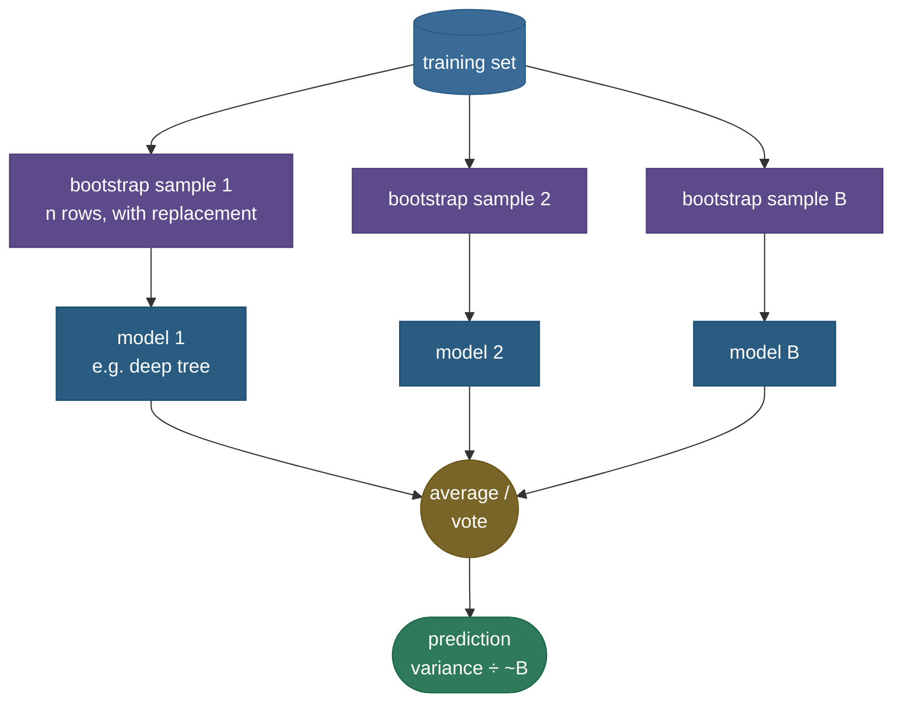

# Bagging: averaging away the variance

Some models — a deep [decision tree](07-Decision-Trees.md) is the classic example — are **unstable**: train one on a slightly different sample of the data and you can get a wildly different model, because they latch onto the particular noise in their training set. They have low bias (they can fit anything) but high **variance** (they're jumpy). **Bagging** — short for **bootstrap aggregating** — is a beautifully simple cure: train many copies of the same unstable model, each on a different random resample of the data, then **average** their predictions (or take a majority vote). Each copy makes different mistakes on different examples, and averaging makes those independent mistakes **cancel out** — so the ensemble has the same low bias but much lower variance than any single model. Bagging is the variance-reduction half of ensemble learning, the cleanest demonstration of the bias–variance tradeoff in action, and the direct parent of [random forests](09-Random-Forests.md).

By the end of this page you'll be able to:

- explain the **bootstrap** (resampling with replacement) and why ~37% of points are **out-of-bag**;
- explain *why* bagging reduces **variance** but not **bias**, and what to bag because of it;
- explain why the base learner **must be unstable** for bagging to help;
- describe **out-of-bag (OOB)** error as free validation;
- relate bagging to **random forests** (it adds feature subsampling) and contrast it with **boosting**;
- demonstrate the variance reduction — and its absence on a stable model — in code.

Intuition and pictures first, then the math (with sources), then runnable code.

> **Note:** the one-line theory — averaging $B$ estimates of the same thing divides the variance by up to $B$ (if they're independent) while **leaving the bias unchanged**. So bagging is purely a variance-reduction tool: you apply it to models that are already low-bias but high-variance, and it brings the variance down to meet them.

---

## The problem: unstable models waste their accuracy on noise

A deep decision tree can represent almost any function (low bias), but it's fragile — resample the data and the greedy splits cascade into a different tree (high variance). That instability shows up as overfitting: great on training data, jumpy on new data. You don't want to make the tree *simpler* (that adds bias); you want to keep its flexibility but **stabilize** it. Averaging many trees does exactly that — if you can make the trees *different enough* that their errors are roughly independent.

---

## The bootstrap: many datasets from one

You only have one training set, so how do you train many *different* models? The **bootstrap**: draw a sample of $n$ rows **with replacement** from your $n$-row dataset. Some rows appear multiple times, some not at all, so each bootstrap sample is a slightly different dataset — and a model trained on it is slightly different.

A useful fact falls out: the probability a given row is **never** picked in $n$ draws is $(1 - 1/n)^n \to 1/e \approx 0.37$. So each bootstrap sample omits about **37%** of the data — those omitted rows are **out-of-bag** for that model and give free validation (below).

> *Where this comes from: the bootstrap is Efron (1979); its use for ensembling is **Bagging Predictors** (Breiman 1996); the applied treatment is **ISLR** Ch. 5 & 8.2 — references.*

---

## The aggregation: average to cut variance

Train $B$ models, each on its own bootstrap sample, and combine them — **average** the predictions for regression, **majority vote** for classification:



The variance math is the point: averaging $B$ **independent** estimates each with variance $\sigma^2$ gives an average with variance $\sigma^2 / B$ — variance falls toward zero as you add models, while the bias (the average's center) is unchanged. In practice the bootstrap models aren't fully independent, so the variance hits a **floor** above the $1/B$ ideal:


The measured curve drops steeply then levels off **above** the dashed $1/B$ ideal — because bootstrapped trees, trained on overlapping data, are **correlated**, and correlated estimates can't average all their variance away. (That gap is exactly what random forests close, below.)

> *Where this comes from: the $\sigma^2/B$ variance-of-average argument and bagging's analysis are **The Elements of Statistical Learning** Ch. 8.7 and Breiman (1996) — references.*

---

## Why it only reduces variance — and what that means

Averaging changes the *spread* of predictions, not their *center*, so bagging reduces **variance** but leaves **bias** essentially untouched. Two consequences:

1. **Bag low-bias, high-variance models.** Deep trees are perfect — they have the flexibility (low bias) you want to keep, and the instability (high variance) you want to average away. Bagging a high-bias model (a stump, a linear fit) doesn't help, because there's no variance to remove and the bias stays.

2. **The base learner must be *unstable*.** This is the crucial, often-missed point: bagging only helps if resampling actually *changes* the model. For an **unstable** learner (deep tree), different bootstraps give different models → averaging helps a lot. For a **stable** learner (linear regression), every bootstrap gives nearly the same model → averaging does nothing:


Bagging halves the deep tree's variance but is **useless** on the linear model — because the linear model barely changes across bootstrap samples (the code confirms: −51% for the tree, ≈0 for the linear model). *Match the tool to the problem: bag unstable learners.*

---

## Out-of-bag error: free validation

Since each model omits ~37% of the data (its out-of-bag rows), you can predict each training point using only the models that **didn't** see it — yielding an **out-of-bag (OOB) error** estimate that closely matches cross-validation, with no separate validation set and no extra training. (The code shows OOB score ≈ test accuracy.) It's one of bagging's quiet practical wins.

---

## From bagging to random forests, and vs boosting

- **Random forests = bagging + feature randomness.** Plain bagging's trees are correlated (they all split on the same dominant features), which caps the variance reduction at that floor you saw. [Random forests](09-Random-Forests.md) add **random feature subsampling at each split**, which **decorrelates** the trees and lowers the floor — bagging's natural upgrade for trees.
- **Bagging vs boosting.** Bagging trains models **in parallel** on resamples and averages to cut **variance**; [boosting](10-Gradient-Boosting-XGBoost.md) trains models **sequentially**, each correcting the last, to cut **bias**. Two opposite ensemble philosophies — know both.

> **Tip:** the clean framing — **bagging reduces variance (parallel, independent learners); boosting reduces bias (sequential, dependent learners)**. And the prerequisite for bagging to do anything is an **unstable** base learner.

---

## Worked example: averaging cuts variance

Suppose one deep tree's prediction at a point has variance $\sigma^2 = 0.09$ (it's jumpy). If you could train $B = 10$ **independent** trees and average them, the averaged prediction's variance would be $\sigma^2/B = 0.09/10 = 0.009$ — a 10× reduction, with the *same* expected prediction (no bias added). In reality the bootstrap trees are correlated (say $\rho = 0.5$), so the floor is $\rho\sigma^2 = 0.045$ — still a 2× reduction, and exactly the ~50% drop the figure and code show. The remaining correlation is what random forests attack.

---

## Code: variance reduction (and its absence on a stable model)

```python
"""Bagging: variance reduction for an UNSTABLE learner but not a STABLE one, + OOB.
Verified on ml-py312, CPU."""
import numpy as np
from sklearn.tree import DecisionTreeRegressor, DecisionTreeClassifier
from sklearn.linear_model import LinearRegression
from sklearn.ensemble import BaggingRegressor, BaggingClassifier
from sklearn.datasets import make_moons
from sklearn.model_selection import train_test_split

def data(seed):
    rng = np.random.default_rng(seed); x = rng.uniform(-3, 3, 120)
    return x[:, None], np.sin(1.5*x) + rng.normal(0, 0.3, 120)
def pred_var(make, x0, runs=60):
    return np.var([make().fit(*data(r)).predict(x0) for r in range(runs)], axis=0).mean()

x0 = np.linspace(-2.5, 2.5, 40)[:, None]
ts = pred_var(lambda: DecisionTreeRegressor(), x0)
tb = pred_var(lambda: BaggingRegressor(DecisionTreeRegressor(), n_estimators=50, random_state=0), x0)
ls = pred_var(lambda: LinearRegression(), x0)
lb = pred_var(lambda: BaggingRegressor(LinearRegression(), n_estimators=50, random_state=0), x0)
print(f"deep tree (UNSTABLE): single={ts:.4f} bagged={tb:.4f}  ({(1-tb/ts)*100:+.0f}% -> big drop)")
print(f"linear   (STABLE):    single={ls:.4f} bagged={lb:.4f}  ({(1-lb/ls)*100:+.0f}% -> ~nothing)")

X, y = make_moons(n_samples=500, noise=0.3, random_state=0)
Xtr, Xte, ytr, yte = train_test_split(X, y, test_size=0.3, random_state=0)
bag = BaggingClassifier(DecisionTreeClassifier(), n_estimators=200, oob_score=True, random_state=0).fit(Xtr, ytr)
print(f"OOB score = {bag.oob_score_:.3f} ~ test acc = {bag.score(Xte, yte):.3f}  (free validation)")
```

Output:

```
deep tree (UNSTABLE): single=0.0907 bagged=0.0446  (+51% -> big drop)
linear   (STABLE):    single=0.0093 bagged=0.0098  (-6% -> ~nothing)
OOB score = 0.857 ~ test acc = 0.873  (free validation)
```

> **Note:** the contrast is the whole lesson. Bagging cuts the **deep tree's** variance roughly in half (the instability is exactly what averaging removes), but does **nothing** for the **linear model** — it's already stable, so every bootstrap fits nearly the same line and there's no variance to average away. And OOB (0.857) tracks the held-out test accuracy (0.873) — validation for free.

---

## Where bagging is used

- **As random forests** — bagging's overwhelmingly most common form (bagging + feature randomness) is a default tabular model.
- **Stabilizing any unstable learner** — bagged trees, and occasionally bagged neural nets, when you need lower variance.
- **Uncertainty estimation** — the spread of the bagged models' predictions is a cheap uncertainty estimate.
- **The conceptual foundation** — understanding bagging is the prerequisite for forests and the bias–variance story.

> **Tip:** in interviews bagging is usually the setup for random forests. Be ready to (1) define bootstrap + aggregate, (2) explain it cuts **variance not bias**, (3) stress the **unstable-learner** requirement, (4) mention OOB, and (5) pivot to "and random forests add feature randomness to decorrelate the trees."

---

## Recap and rapid-fire

**If you remember nothing else:** bagging trains many copies of an **unstable, low-bias/high-variance** model on **bootstrap samples** (resampled with replacement) and **averages** them. Averaging independent estimates cuts **variance** (toward $\sigma^2/B$) while leaving **bias** unchanged — so you bag deep trees, not linear models. You get **OOB** validation for free (~37% out-of-bag per model), and adding **feature randomness** turns bagging into a **random forest**.

**Quick-fire — say these out loud:**

- *What is bagging?* Train models on bootstrap resamples, then average/vote — bootstrap **agg**regating.
- *What is a bootstrap sample?* $n$ rows drawn **with replacement** from the $n$-row data (some repeat, ~37% omitted).
- *Does bagging reduce bias or variance?* Variance — averaging doesn't change the center (bias), only the spread.
- *So what should you bag?* Low-bias, **high-variance, unstable** learners (deep trees) — not stable ones (linear).
- *Why must the learner be unstable?* If resampling barely changes the model, averaging copies does nothing.
- *Why ~37% out-of-bag?* $(1-1/n)^n \to 1/e \approx 0.37$ — those rows give free OOB validation.
- *Bagging vs random forest?* RF = bagging + random feature subsampling per split (decorrelates the trees).
- *Bagging vs boosting?* Bagging = parallel, cut **variance**; boosting = sequential, cut **bias**.

---

## References and further reading

The curated link library for this topic — videos, courses, interactive/visual resources, articles, papers, books, and internal cross-links — lives in a companion file so it can be reused as a standalone reference list:

**→ [Bagging — references and further reading](08-Bagging.references.md)**
