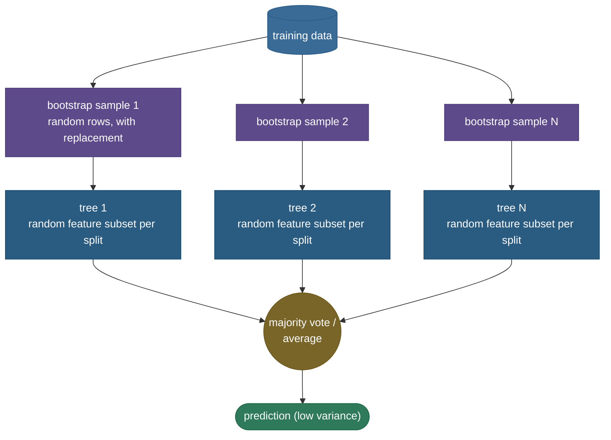

# Random forests: many decorrelated trees beat one

A single [decision tree](07-Decision-Trees.md) is flexible but **high-variance** — train it on a slightly different sample and you can get a wildly different tree. The fix is an ensemble: grow *many* trees and average their votes, so the idiosyncrasies cancel out. But there's a subtlety that makes random forests cleverer than plain averaging. If you just train many trees on bootstrap samples (that's **bagging**), the trees end up **correlated** — they all latch onto the same one or two dominant features and make similar mistakes, which limits how much averaging can help. Random forests add one more dash of randomness: **at every split, each tree may only consider a random subset of the features.** That forces different trees to use different features, **decorrelating** them — and the variance of an average of *decorrelated* predictions drops far faster than correlated ones. The result is a robust, low-maintenance, near-default model for tabular data, and one of the most-asked algorithms in interviews.

By the end of this page you'll be able to:

- explain how a random forest differs from plain **bagging** (random **feature** subsampling per split);
- explain *why* **decorrelation** is the whole point, via the variance-of-an-average formula;
- describe the **algorithm** end to end and what **max_features / n_estimators** do;
- explain **out-of-bag (OOB)** error and why it's free validation (and the 1/e fraction);
- reason about **feature importances** and their high-cardinality bias;
- contrast forests (parallel, ↓variance) with boosting (sequential, ↓bias).

Intuition and pictures first, then the math (with sources), then runnable code.

> **Note:** the one insight to carry away — averaging reduces variance, but only as much as the trees are *independent*. Bagging makes trees *similar* (correlated); random forests make them *different* (decorrelated) by hiding features at each split, which is why a forest beats plain bagging. It's a one-line change to the tree-growing loop with an outsized payoff.

---

## The problem: keep the tree's low bias, kill its variance

A deep decision tree has **low bias** (it can fit almost anything) but **high variance** (it's unstable). You don't want to make it simpler — that would add bias. Instead you want to *average away* the variance while keeping the bias low. Averaging many independent estimates of the same quantity reduces variance without touching bias — which is exactly the [bias–variance](12-Bias-Variance-Tradeoff.md) move an ensemble of trees makes. The question is how to get the trees independent enough for averaging to pay off.

---

## Bagging, and why it isn't enough

**Bagging** (bootstrap aggregating) trains each tree on a **bootstrap sample** — a random draw of $n$ rows *with replacement* from the training set — and averages their predictions (or takes a majority vote). Bootstrap samples differ, so the trees differ somewhat, and averaging cuts variance. But there's a ceiling: if one or two features are very predictive, *every* bootstrapped tree will split on them first, so the trees are **correlated** — they make correlated errors that averaging can't remove.

The variance of an average of $n$ identically-distributed variables, each with variance $\sigma^2$ and pairwise correlation $\rho$, is:

$$\text{Var}\!\left(\frac{1}{n}\sum_i T_i\right) = \rho\,\sigma^2 + \frac{1-\rho}{n}\,\sigma^2$$

The second term vanishes as $n\to\infty$, but the **first term, $\rho\sigma^2$, is a floor** you can't average away:


So adding more trees only helps down to the floor $\rho\sigma^2$ — and the way to lower that floor is to **lower $\rho$**. That is precisely what random forests do.

> *Where this comes from: bagging is **Bagging Predictors** (Breiman 1996); the variance-of-correlated-average formula and the decorrelation argument are **The Elements of Statistical Learning** Ch. 15 — references.*

---

## The random-forest twist: decorrelate by hiding features

A random forest is bagging **plus** one rule: **at each split, only a random subset of $m$ features (typically $m \approx \sqrt{p}$ of $p$ features) is considered as split candidates.** Different trees are forced to use different features, so they stop all splitting on the same dominant feature — they **decorrelate** ($\rho$ drops), the variance floor falls, and the averaged forest is far more stable than plain bagging.



The effect on the decision boundary is visible — and is *why* forests generalize so well:


The single tree's boundary is jagged (it memorized noise); the forest's is smooth, because averaging 200 decorrelated trees cancels each tree's idiosyncratic errors. In the code, the forest's predictions are about **6× lower variance** than a single tree's across resampled training sets.

> *Where this comes from: the random-feature-subsampling algorithm, OOB error, and importances are **Random Forests** (Breiman 2001) — references.*

---

## Out-of-bag error: free validation

Because each tree is trained on a bootstrap sample, on average about **37%** of the rows are *left out* of any given tree (they're "out-of-bag"). Why 37%? The probability a particular row is *never* picked in $n$ draws with replacement is $(1 - 1/n)^n \to 1/e \approx 0.368$. So each row is out-of-bag for ~37% of the trees, and you can predict it using only those trees — giving an **out-of-bag (OOB) error** estimate that's nearly identical to cross-validation **for free**, no separate validation set needed (the code shows OOB score ≈ test accuracy).

> **Tip:** OOB error is a genuine practical perk — you get an honest generalization estimate without holding out data or running k-fold CV. Mention it when asked "how do you validate a random forest cheaply?"

---

## Feature importances (and their bias)

Forests rank features two ways: **impurity-based importance** (total impurity reduction a feature contributes across all splits, averaged over trees — fast, the sklearn default) and **permutation importance** (shuffle a feature's values and measure the accuracy drop — slower but more honest). 

> **Gotcha:** the default impurity-based importance is **biased toward high-cardinality features** (continuous variables and IDs with many possible split points get more chances to look important). For trustworthy rankings — especially with mixed-type features — use **permutation importance** (on held-out data) instead. This is a frequent interview "gotcha."

---

## Hyperparameters, and forests vs boosting

- **n_estimators** — more trees only helps (variance keeps dropping toward the floor) and never overfits from count alone; you stop when the OOB curve plateaus. More trees = more compute, not more overfitting.
- **max_features** — *the* decorrelation knob; smaller → more decorrelated (lower variance) but each tree weaker. $\sqrt{p}$ (classification) / $p/3$ (regression) are good defaults.
- **max_depth / min_samples_leaf** — usually left deep (forests rely on averaging, not pruning, to control variance).

**Random forest vs gradient boosting** is the classic contrast: forests grow **deep trees in parallel and average** them to cut **variance**; [boosting](10-Gradient-Boosting-XGBoost.md) grows **shallow trees sequentially**, each correcting the last, to cut **bias**. Forests are more robust and need little tuning; boosting often wins accuracy but needs more care.

---

## Worked example: the variance floor

Say each tree's prediction has variance $\sigma^2 = 1$. **Plain bagging** makes trees fairly correlated, $\rho = 0.6$. Even with infinitely many trees, the averaged variance floor is $\rho\sigma^2 = 0.6$. Now a **random forest** decorrelates them to $\rho = 0.2$ — the floor drops to $0.2$, **three times lower variance**, just from feature subsampling. With $n = 100$ trees at $\rho = 0.2$: $\text{Var} = 0.2\cdot1 + \frac{0.8}{100}\cdot1 = 0.208$. Adding more trees can only get you to $0.2$; lowering $\rho$ is what moves the floor.

---

## Code: variance reduction, OOB, and the 1/e fraction

```python
"""Random forests: variance reduction vs a single tree, OOB validation, ~37% OOB.
Verified on ml-py312, CPU."""
import numpy as np
from sklearn.datasets import make_moons
from sklearn.tree import DecisionTreeClassifier
from sklearn.ensemble import RandomForestClassifier
from sklearn.model_selection import train_test_split

X, y = make_moons(n_samples=600, noise=0.32, random_state=0)
Xtr, Xte, ytr, yte = train_test_split(X, y, test_size=0.3, random_state=0)
rf = RandomForestClassifier(n_estimators=200, oob_score=True, random_state=0).fit(Xtr, ytr)
print(f"forest test acc = {rf.score(Xte, yte):.3f}   OOB score = {rf.oob_score_:.3f}  (free validation)")

# prediction variance across resampled training sets: tree vs forest
def pred_var(make, x0, runs=40):
    P = [make().fit(*[a[idx] for a in (Xtr, ytr)]).predict_proba(x0)[:, 1]
         for r in range(runs) for idx in [np.random.default_rng(r).integers(0, len(Xtr), len(Xtr))]]
    return np.var(P, axis=0).mean()
vt = pred_var(lambda: DecisionTreeClassifier(random_state=0), Xte[:50])
vf = pred_var(lambda: RandomForestClassifier(n_estimators=100, random_state=0), Xte[:50])
print(f"prediction variance: tree={vt:.4f}  forest={vf:.4f}  (forest ~{vt/vf:.0f}x lower)")

# the ~37% out-of-bag fraction: P(never drawn in n draws) -> 1/e
n = 5000; covered = np.mean([len(set(np.random.default_rng(s).integers(0, n, n))) for s in range(20)]) / n
print(f"out-of-bag fraction = {1-covered:.3f}  (theory 1/e = {1/np.e:.3f})")
```

Output:

```
forest test acc = 0.883   OOB score = 0.879  (free validation)
prediction variance: tree=0.0298  forest=0.0049  (forest ~6x lower)
out-of-bag fraction = 0.369  (theory 1/e = 0.368)
```

> **Note:** the **OOB score (0.879)** lands right next to the held-out **test accuracy (0.883)** — free, honest validation. The headline is the variance line: the forest's predictions are **~6× more stable** than a single tree's across resampled data — that's the decorrelated averaging working, exactly the smoother boundary you saw. And the out-of-bag fraction is **0.369 ≈ 1/e**, confirming where the "37%" comes from.

---

## Where random forests are used

- **The default tabular model** — a strong, robust baseline that works well out of the box with little tuning; often the first thing to try.
- **Feature importance / selection** — quick read on which features matter (with the permutation caveat).
- **Mixed-type, missing, or noisy data** — inherits trees' tolerance for unscaled, mixed, and missing features.
- **When robustness beats peak accuracy** — forests rarely overfit and need little babysitting, unlike boosting.

> **Tip:** the interview arc is reliably: single tree (high variance) → bagging (average to cut variance) → "why not just bagging?" (correlated trees, $\rho\sigma^2$ floor) → random forests (feature subsampling decorrelates, lowers the floor) → OOB (free validation) → forests vs boosting (variance vs bias). Walk that and you've nailed it.

---

## Recap and rapid-fire

**If you remember nothing else:** a random forest is **bagging + random feature subsampling at each split**. Bagging averages bootstrapped trees to cut variance, but correlated trees hit a floor $\rho\sigma^2$; feature subsampling **decorrelates** the trees (lowers $\rho$), dropping the floor and the variance further. You get **OOB error** for free (~37% of rows are out-of-bag per tree), robust low-tuning performance, and feature importances — cutting **variance** in parallel, where boosting cuts **bias** sequentially.

**Quick-fire — say these out loud:**

- *Random forest vs bagging?* RF adds random **feature subsampling at each split**, which decorrelates the trees.
- *Why does decorrelation matter?* $\text{Var of average} = \rho\sigma^2 + \frac{1-\rho}{n}\sigma^2$; lowering $\rho$ lowers the floor.
- *What does max_features control?* The decorrelation knob — smaller → more decorrelated (lower variance), weaker individual trees.
- *Does adding trees overfit?* No — more trees only reduces variance toward the floor; you stop when OOB plateaus.
- *What is OOB error?* Each tree leaves ~37% of rows out-of-bag; predict those with the trees that didn't see them → free validation.
- *Why 37%?* $(1-1/n)^n \to 1/e \approx 0.368$.
- *Feature-importance caveat?* Impurity-based importance is biased toward high-cardinality features; prefer permutation importance.
- *Random forest vs boosting?* Forests = parallel deep trees, cut **variance**; boosting = sequential shallow trees, cut **bias**.
- *Do forests need feature scaling?* No (they're trees) — unlike SVM/KNN.

---

## References and further reading

The curated link library for this topic — videos, courses, interactive/visual resources, articles, papers, books, and internal cross-links — lives in a companion file so it can be reused as a standalone reference list:

**→ [Random Forests — references and further reading](09-Random-Forests.references.md)**
