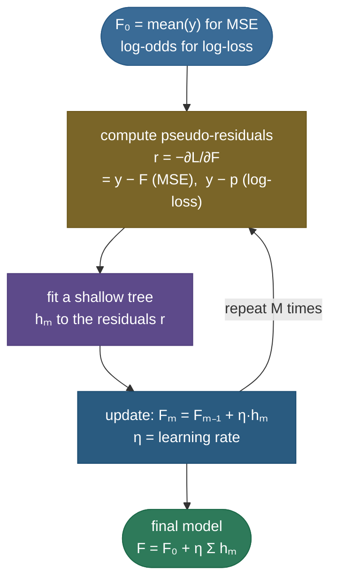

# Gradient boosting: turning weak trees into the champion of tabular ML

Imagine you're forecasting house prices. You build a crude first model — just predict the average price for everyone — and of course it's wrong. But it's wrong in a *structured* way: it overshoots the cheap houses and undershoots the mansions. So you build a second little model whose only job is to predict that *error* — "+\$80k if it's a mansion, −\$40k if it's a shack" — and add it on top. Now the combined model is better, but it *still* makes errors, just smaller ones. So you build a third model to predict *those* errors, add it on, and keep going. Each model is weak on its own, but each one chips away at whatever mistakes are left, and the sum of them becomes formidable. **That is gradient boosting**, and when you implement it carefully — **XGBoost**, **LightGBM**, **CatBoost** — it is the reigning champion of tabular data and the single most common winning model on Kaggle.

This is the mirror image of how [random forests](09-Random-Forests.md) work. A forest builds many deep trees *in parallel*, each on a different bootstrap sample, and **averages** them — that cancels the trees' independent errors and reduces **variance**. Boosting builds shallow trees *sequentially*, each one trained to fix the residual error the current ensemble still makes — that steadily reduces **bias**. Same building block (a decision tree), opposite ensemble philosophy. The deep insight, which we'll derive in full, is that "fit the residuals" is *exactly* **gradient descent — but in function space**: each tree approximates the *negative gradient* of the loss, so boosting descends the loss by adding functions instead of adjusting parameters.

I'll walk this the way I'd actually teach it: feel the *why* (reduce bias by correcting errors), then build the additive model, then derive what the "gradient" really is (the pseudo-residual = negative-gradient identity, proven for both MSE and log-loss), then the shrinkage/early-stopping machinery, then **XGBoost's second-order objective derived from scratch** (the leaf-weight and split-gain formulas every interviewer asks about), then LightGBM and CatBoost, four worked numeric examples of increasing complexity, and runnable code that proves every claim. By the end you'll be able to:

- explain how boosting differs from bagging/forests (**sequential bias-reduction** vs **parallel variance-reduction**), and why boosting *can* overfit while forests can't;
- define the **additive model** $F_m = F_{m-1} + \eta\,h_m$ and explain shrinkage and the learning-rate ↔ n_estimators trade;
- explain what the **"gradient"** means — **derive** that the pseudo-residual is exactly $y - F$ for squared error and $y - p$ for log-loss, and explain "gradient descent in function space";
- **derive** XGBoost's regularized second-order objective, the optimal leaf weight $w^*_j = -G_j/(H_j+\lambda)$, and the split-gain formula — and compute them on real numbers;
- say how **LightGBM** (histograms + leaf-wise + GOSS/EFB) and **CatBoost** (ordered boosting + native categoricals) differ;
- implement gradient boosting from scratch and verify the residual = negative-gradient identity to machine zero.

Intuition and pictures first, then the math (with sources), then runnable code.

> **Note:** the name trips everyone up. "Gradient" isn't about gradients *inside* a tree (trees aren't trained by gradient descent). It's that **each tree approximates the negative gradient of the loss with respect to the model's current predictions $F(x_i)$**. For squared error that gradient is just the residual $y - F$, so "fit the residuals" *is* "fit the negative gradient." For other losses (log-loss, etc.) you fit the corresponding gradient — same recipe — which is why it's called *gradient* boosting.

---

## The problem: reduce bias by correcting errors

Recall the [bias–variance decomposition](12-Bias-Variance-Tradeoff.md). A single shallow tree — a "stump" or a depth-3 tree — is a **weak learner**: it can only carve the input into a handful of regions, so it **underfits**. It has **high bias, low variance**. A deep tree is the opposite: **low bias, high variance** (it can memorize the training set).

Now here's the key strategic question. If your model has too much **variance**, you average many of them — that's [bagging](08-Bagging.md), and it's exactly why [random forests](09-Random-Forests.md) average deep trees. But averaging does **nothing** for **bias**: the average of many underfit stumps is still an underfit stump. So how do you *reduce bias*?

You make the weak learners **collaborate sequentially**. Each new tree looks at the examples the ensemble currently gets wrong and focuses its limited capacity *there*. The first tree captures the broad trend; the second captures what the first missed; the third captures what the first two missed together. The *combined* model steadily reduces bias and ends up fitting complex patterns that no single shallow tree could express. That is a fundamentally different ensemble philosophy from bagging — and it's the reason boosting and bagging sit at opposite ends of the bias–variance spectrum.

> **Note:** this is also why boosting uses **shallow** trees and bagging uses **deep** ones. Boosting needs each learner to be *weak* (so the ensemble adds complexity gradually and controllably); bagging needs each learner to be *strong but high-variance* (so averaging has variance to cancel). Swapping the depths breaks both: deep trees in boosting overfit almost immediately; stumps in a forest underfit no matter how many you average.

---

## A bit of history: AdaBoost → gradient boosting

Boosting didn't start with gradients. The first practical boosting algorithm was **AdaBoost** (Freund & Schapire, 1997), and seeing it first makes gradient boosting click. AdaBoost also builds weak learners sequentially, but instead of fitting residuals it **re-weights the training examples**: after each weak learner, it *increases the weight* on the examples that learner got wrong and *decreases* the weight on the ones it got right, so the next learner is forced to focus on the hard cases. The final prediction is a weighted vote of the learners, where more-accurate learners get a larger say.

For years AdaBoost looked like a clever heuristic with no obvious loss function. Then Friedman, Hastie & Tibshirani (2000) showed the punchline: **AdaBoost is exactly forward stagewise additive modeling under the exponential loss** $L(y, F) = e^{-yF}$ (with labels $y \in \{-1, +1\}$). The example re-weighting falls out of that loss's gradient — the "hard" examples are precisely the ones with the largest gradient. Once you see that, the generalization is obvious: **swap the exponential loss for any differentiable loss, and fit each learner to that loss's negative gradient.** That generalization *is* gradient boosting (Friedman 2001). AdaBoost is the special case "gradient boosting with exponential loss"; the residual-fitting GBM you're learning here is "gradient boosting with squared-error (or log-) loss."

> **Note:** the practical reason gradient boosting won over AdaBoost: the exponential loss is very sensitive to **outliers and label noise** (a badly-misclassified point gets an exponentially huge weight and can dominate). Log-loss (deviance) grows only linearly in the margin for badly-wrong points, so gradient boosting with log-loss is far more **robust** — which is one reason it became the default. Same skeleton, gentler loss.

---

## The idea: fit the residuals, round after round

Start the model at a constant — for regression, the mean of $y$ (the constant that minimizes squared error). Then repeat the same three steps, $M$ times:

1. **Look at the errors.** Compute the **residuals** $r_i = y_i - F(x_i)$ — what the current model gets wrong, per example.
2. **Fit a small tree to the errors.** Train a shallow tree $h_m$ to predict those residuals (not the original targets — the *residuals*).
3. **Add a shrunken version in.** Update $F \leftarrow F + \eta\, h_m$, where $\eta \in (0,1]$ is the **learning rate** that scales down each tree's contribution.


The **additive model** after $M$ rounds is

$$F_M(x) = F_0(x) + \eta\sum_{m=1}^{M} h_m(x),$$

where $F_0$ is the initial constant, each $h_m$ is a tree fit to the *current* residuals, and $\eta$ is the learning rate. The figure shows the ensemble converging from a crude step (1 tree) to a faithful fit (50 trees) — each tree chipping away at the remaining error. Notice the model never re-touches earlier trees; it only ever **adds** a new correction on top. That additivity is what makes the math clean, and it's why boosting is sometimes called a **forward stagewise additive model**: at each stage you greedily add the one new term that most reduces the loss, and you never go back and re-fit the terms you already placed.

We can watch the residuals themselves shrink. Each round, the new tree fits the *current* residual, and after adding it the leftover residual is smaller:


The RMS of the residual falls 0.392 → 0.304 → 0.231 over just three rounds. That shrinking residual is the whole engine of boosting — and, as we're about to derive, that residual *is* the negative gradient of the loss.

---

## The "gradient": descent in function space

Here's why it's *gradient* boosting, and it's worth slowing down because it's the conceptual heart of the topic — and a classic interview question.

So far we said "fit the residuals." That works perfectly for squared-error loss, but boosting handles *any* differentiable loss (log-loss for classification, Huber for robust regression, ranking losses, …). The general recipe is: instead of fitting the raw residuals, fit the **negative gradient of the loss** with respect to the current predictions. We call those the **pseudo-residuals**:

$$r_{im} = -\left[\frac{\partial L(y_i, F(x_i))}{\partial F(x_i)}\right]_{F = F_{m-1}}.$$

Read that carefully: the derivative is with respect to the **prediction $F(x_i)$ itself**, not with respect to any tree parameter. We treat the model's output at each point as a "knob" and ask: *which way should I nudge the prediction at this point to most decrease the loss?* The answer is the negative gradient — and we fit a tree to approximate it. Let's prove what that gradient actually is in the two cases that matter.

**Case 1 — squared-error loss (regression).** Take $L(y, F) = \tfrac{1}{2}(y - F)^2$ (the $\tfrac12$ is just to make the algebra clean). Differentiate with respect to $F$:

$$\frac{\partial L}{\partial F} = \frac{\partial}{\partial F}\,\tfrac{1}{2}(y - F)^2 = -(y - F).$$

So the negative gradient is

$$r = -\frac{\partial L}{\partial F} = +(y - F),$$

**which is exactly the ordinary residual.** "Fit the residuals" and "fit the negative gradient" are *literally the same thing* for squared error. The code below confirms this identity to machine zero.

**Case 2 — log-loss / binomial deviance (binary classification).** Here the model outputs a **log-odds** score $F$, and the probability is $p = \sigma(F) = \frac{1}{1+e^{-F}}$ (the [sigmoid](02-Logistic-Regression.md)). The per-example loss is the negative log-likelihood

$$L(y, F) = -\big[\,y\log p + (1-y)\log(1-p)\,\big], \qquad p = \sigma(F).$$

Differentiating w.r.t. the score $F$ (using the standard result $\frac{\partial}{\partial F}[-y\log\sigma(F) - (1-y)\log(1-\sigma(F))] = \sigma(F) - y$, exactly as in [logistic regression](02-Logistic-Regression.md)):

$$\frac{\partial L}{\partial F} = \sigma(F) - y = p - y \quad\Longrightarrow\quad r = -\frac{\partial L}{\partial F} = y - p.$$

So for classification **the pseudo-residual is $y - p$** — the gap between the true label (0 or 1) and the predicted probability. Same recipe, different loss: each tree fits $y - p$ instead of $y - F$. (For multiclass it generalizes to $y_k - p_k$ per class via the softmax — the same form you saw in the [softmax + cross-entropy](../../05.%20Deep_Learning/concepts/04-Loss-Functions.md) gradient.)



Now the punchline. Ordinary gradient descent updates a *parameter vector* $\theta$ by stepping against the gradient: $\theta \leftarrow \theta - \eta\,\nabla_\theta L$. Gradient boosting updates a **function** $F$ by stepping against the *functional* gradient: $F \leftarrow F - \eta\,\nabla_F L$, where $\nabla_F L$ is the per-point gradient $\partial L/\partial F(x_i)$. The catch is that $-\nabla_F L$ is only defined at the training points — so we **fit a tree to it** to get a function we can evaluate everywhere, then take a step of size $\eta$ in that direction. That's the Friedman insight, and it's worth saying out loud:

> **Note:** **gradient boosting is gradient descent in function space.** Each tree is one approximate negative-gradient step; the learning rate $\eta$ is the step size; the "parameter" being optimized is the entire function $F$. Everything you know about gradient descent — step size matters, too-big steps overshoot, you take many small steps — transfers directly, which is exactly why shrinkage (a small $\eta$) and "many rounds" work the way they do.

> *Where this comes from: gradient boosting as function-space gradient descent is **Greedy Function Approximation: A Gradient Boosting Machine** (Friedman 2001); the gentle visual derivation is Parr & Howard's "How to explain gradient boosting" — both in the references.*

> **Gotcha:** because we *fit a tree* to the negative gradient rather than using it directly, each step is only an **approximate** gradient step — the tree can't represent the gradient perfectly, especially a shallow one. That approximation is a feature, not a bug: it's a form of regularization (the step is a smoothed, low-capacity version of the true gradient), which is part of why shallow trees generalize better here than deep ones.

**Why fit the gradient with *least squares*, specifically?** A natural question: the gradient lives in the loss we care about, so why train the tree with plain squared error against the pseudo-residuals, regardless of the actual loss? The answer is geometric. In function space the negative gradient $-\nabla_F L$ is the *direction of steepest descent*, and the tree we add should point **as close to that direction as possible**. "As close as possible" in the natural inner product means **minimizing the squared distance** between the tree's output and the negative gradient — i.e. a least-squares fit to the pseudo-residuals. So the tree is the best constrained (piecewise-constant) approximation to the steepest-descent direction; then the per-leaf line search (step c below) rescales each piece to actually minimize the true loss along that direction. **Fit the direction by least squares, set the step by the true loss** — that two-stage split is the design of every gradient-boosting machine.

---

## The algorithm, step by step

Putting the pieces together, here is the full gradient-boosting algorithm (Friedman's "Algorithm 1") for $M$ rounds:

1. **Initialize** with the constant that minimizes the loss: $F_0(x) = \arg\min_c \sum_i L(y_i, c)$. For squared error that's the **mean** $\bar y$; for log-loss it's the **log-odds of the base rate** $\log\frac{\bar y}{1 - \bar y}$.
2. **For** $m = 1, 2, \dots, M$:
   - a. **Pseudo-residuals.** Compute $r_{im} = -\big[\partial L(y_i, F(x_i))/\partial F(x_i)\big]_{F = F_{m-1}}$ for every example $i$.
   - b. **Fit a tree.** Train a regression tree $h_m$ to the targets $\{(x_i, r_{im})\}$, partitioning the input into leaf regions $R_{jm}$.
   - c. **Leaf values (line search).** For each leaf $j$, choose the output $\gamma_{jm}$ that minimizes the *actual* loss over the examples in that leaf: $\gamma_{jm} = \arg\min_\gamma \sum_{x_i \in R_{jm}} L\big(y_i,\, F_{m-1}(x_i) + \gamma\big)$. (For squared error this is just the mean residual in the leaf; for other losses it's a one-dimensional optimization — a "line search" per leaf.)
   - d. **Update.** $F_m(x) = F_{m-1}(x) + \eta \sum_j \gamma_{jm}\,\mathbb{1}[x \in R_{jm}]$.
3. **Output** $F_M$.

> **Tip:** step (c) is a subtle but important refinement people often miss. The tree in step (b) is fit to the negative gradient (a *least-squares* fit), but the leaf *values* are then reset by minimizing the *true* loss within each leaf. For squared error these coincide (the mean residual minimizes squared error), so it's invisible — but for log-loss the gradient is $y - p$ while the optimal leaf value involves the **Hessian** too, giving the Newton-style update $\gamma = \frac{\sum (y_i - p_i)}{\sum p_i(1-p_i)}$. That "use the gradient to grow, the loss to set leaf values" split is exactly what XGBoost formalizes with its second-order objective below.

---

## Boosting for classification, end to end

The same machine does classification — you just switch the loss and read the output through a sigmoid. It's worth walking the full loop because the **log-odds bookkeeping** trips people up.

1. **Initialize in log-odds space.** With a base rate $\bar y$ (fraction of positives), start at the constant log-odds $F_0 = \log\frac{\bar y}{1-\bar y}$ — the score whose sigmoid is the base rate. (For a balanced dataset $\bar y = 0.5$, so $F_0 = 0$.)
2. **Each round, predict probabilities.** Compute $p_i = \sigma(F(x_i))$ for every example.
3. **Pseudo-residuals are $y_i - p_i$** (derived above). Fit a regression tree to those — note it's a **regression** tree even though the task is classification, because it's fitting a continuous gradient.
4. **Newton leaf values.** Set each leaf's value to $\gamma = \frac{\sum_{i \in \text{leaf}}(y_i - p_i)}{\sum_{i \in \text{leaf}} p_i(1-p_i)}$ (the Tip above) and update $F \leftarrow F + \eta\,\gamma$ in log-odds space.
5. **Final prediction.** After $M$ rounds, $p = \sigma(F_M(x))$, and you threshold at 0.5 (or wherever your precision/recall tradeoff wants — see [Classification Metrics](14-Classification-Metrics.md)).

So a boosted classifier accumulates **log-odds** across trees and squashes the total through the sigmoid at the end — exactly like adding up the contributions of many [logistic-regression](02-Logistic-Regression.md) terms, but the terms are trees. For **multiclass**, you run $K$ parallel boosting series (one score $F_k$ per class), turn the scores into probabilities with the **softmax**, and each tree fits the per-class residual $y_{ik} - p_{ik}$ — the multiclass cross-entropy gradient, the same form as a neural net's softmax output layer.

> **Gotcha:** the trees output **log-odds increments**, not probabilities. A common confusion is to expect a leaf value like 0.7 to mean "70% probability" — it doesn't; it's an additive bump to the score $F$, and only $\sigma(\sum \text{bumps})$ is a probability. This is also why boosted-tree probabilities can be **miscalibrated** (over-confident) and often benefit from a post-hoc calibration step (Platt scaling or isotonic regression) if you need trustworthy probabilities, not just rankings.

---

## Shallow trees + shrinkage: why slow is better

Two design choices are what make boosting **generalize** rather than memorize:

- **Shallow trees** (depth 3–6, or a capped leaf count) — each is a *weak* learner that captures only a little structure, so the ensemble builds up complexity gradually instead of memorizing in one shot. Depth also controls **interaction order**: a depth-$d$ tree can model interactions among up to $d$ features, so depth-1 stumps give a purely additive model, depth-2 allows pairwise interactions, and so on.
- **Learning rate / shrinkage** ($\eta$, e.g. 0.1) — scale down each tree's contribution before adding it. A smaller $\eta$ means each gradient step is tinier, so you need *more* trees to reach the same fit — but the model generalizes better and overfits more gracefully.


This is the central tradeoff: **`learning_rate` and `n_estimators` together control the fit, and they trade off against each other.** Halve the learning rate and you roughly need to double the number of trees to reach the same training fit — but the lower-and-slower path usually lands at a *better* test error, because each small step is less likely to overshoot. The large learning rate ($\eta=1.0$) overshoots and overfits after just a few trees; the small one ($\eta=0.1$) takes many small steps to a much lower test error. The standard recipe is therefore a **small learning rate, many trees, and early stopping** on a validation set.

> **Gotcha:** unlike random forests, **more trees CAN overfit** a gradient-boosting model. Each tree keeps reducing *training* error (it's literally fitting the residual), so eventually the ensemble starts fitting the **noise** — training error keeps falling while validation error turns back up. That's why you tune `n_estimators` with **early stopping**: stop when validation error stops improving (or has not improved for `early_stopping_rounds` rounds). A forest, by contrast, *cannot* overfit from tree count — adding trees only drives the average toward its variance floor.


The figure makes the contrast concrete: boosting's **train** error marches to zero (solid red) while its **test** error bottoms out and then *climbs* (dashed red) — overfitting in action. The bagged forest's curves (navy) both flatten and stay put: more trees never hurt. This single picture is the reason "use early stopping with boosting, but not with forests" is a real rule and not folklore.

> **Tip:** other regularizers stack on top of shrinkage and depth: **subsampling rows** (`subsample` < 1, a.k.a. *stochastic gradient boosting* — fit each tree on a random fraction of the data) and **subsampling columns** (`colsample_bytree`) both inject randomness that reduces overfitting and speeds training. XGBoost adds explicit **L1/L2 penalties on leaf weights** and a **per-leaf complexity cost** $\gamma$ (derived below). The practical recipe interviewers like to hear: *small learning rate (~0.05–0.1), many trees, early stopping, shallow depth (3–6), and row/column subsampling.*

---

## XGBoost: the regularized second-order objective, derived

Plain gradient boosting fits each tree to the first-order gradient (the residual) and uses a per-leaf line search for the values. **XGBoost** ([Chen & Guestrin 2016](https://arxiv.org/abs/1603.02754)) sharpens this in two ways that, together, are most of why it wins: it uses a **second-order Taylor expansion** of the loss (both the gradient *and* the Hessian), and it bakes an explicit **regularization** term into the objective. Let's derive the famous leaf-weight and split-gain formulas — this is the derivation interviewers ask for by name.

**The regularized objective.** At round $t$ we add a new tree $f_t$. The objective over all $n$ examples is the loss plus a complexity penalty on the *new* tree:

$$\mathcal{L}^{(t)} = \sum_{i=1}^{n} L\big(y_i,\; F_{t-1}(x_i) + f_t(x_i)\big) \;+\; \Omega(f_t), \qquad \Omega(f) = \gamma T + \tfrac{1}{2}\lambda \sum_{j=1}^{T} w_j^2.$$

Here $T$ is the number of leaves, $w_j$ is the output value (weight) of leaf $j$, $\gamma$ penalizes adding leaves (a per-leaf cost), and $\lambda$ is an L2 penalty on the leaf weights. The regularization term is explicit and *part of the objective* — that's the first big difference from plain GBM.

**Second-order Taylor expansion.** We can't optimize over an arbitrary tree $f_t$ directly, so we approximate the loss around the current prediction $F_{t-1}(x_i)$. Define the per-example **gradient** and **Hessian**:

$$g_i = \frac{\partial L(y_i, F)}{\partial F}\bigg|_{F = F_{t-1}(x_i)}, \qquad h_i = \frac{\partial^2 L(y_i, F)}{\partial F^2}\bigg|_{F = F_{t-1}(x_i)}.$$

A second-order Taylor expansion of each loss term in $f_t(x_i)$ gives

$$L\big(y_i, F_{t-1}(x_i) + f_t(x_i)\big) \approx L\big(y_i, F_{t-1}(x_i)\big) + g_i\,f_t(x_i) + \tfrac{1}{2}h_i\,f_t(x_i)^2.$$

Dropping the constant $L(y_i, F_{t-1})$ (it doesn't depend on the new tree), the objective becomes

$$\tilde{\mathcal{L}}^{(t)} = \sum_{i=1}^{n}\Big[\,g_i\,f_t(x_i) + \tfrac{1}{2}h_i\,f_t(x_i)^2\,\Big] + \gamma T + \tfrac{1}{2}\lambda\sum_{j=1}^{T} w_j^2.$$

**Group by leaf.** A tree assigns every example to exactly one leaf, and every example in leaf $j$ gets the *same* output $w_j$. So sum the per-example terms within each leaf. Let $I_j = \{ i : x_i \in \text{leaf } j\}$, and define the **leaf gradient and Hessian sums**

$$G_j = \sum_{i \in I_j} g_i, \qquad H_j = \sum_{i \in I_j} h_i.$$

Then, since $f_t(x_i) = w_j$ for all $i \in I_j$:

$$\tilde{\mathcal{L}}^{(t)} = \sum_{j=1}^{T}\Big[\,G_j\,w_j + \tfrac{1}{2}(H_j + \lambda)\,w_j^2\,\Big] + \gamma T.$$

**Solve for the optimal leaf weight.** The objective is now a sum of independent quadratics, one per leaf. Differentiate one term and set it to zero:

$$\frac{\partial}{\partial w_j}\Big[\,G_j w_j + \tfrac{1}{2}(H_j+\lambda)w_j^2\,\Big] = G_j + (H_j + \lambda)\,w_j = 0 \;\;\Longrightarrow\;\; \boxed{\,w_j^* = -\frac{G_j}{H_j + \lambda}\,}.$$

That is the **optimal leaf weight**. It's beautifully interpretable: the leaf's total gradient divided by its total Hessian (plus $\lambda$ for regularization) — a Newton step per leaf. The $\lambda$ in the denominator **shrinks** weights toward zero, which is exactly how it regularizes.

**The structure score.** Substitute $w_j^*$ back into the objective to get the best achievable value for a *given tree structure* (the "quality" of that tree shape):

$$\tilde{\mathcal{L}}^{(t)}(\text{structure}) = -\frac{1}{2}\sum_{j=1}^{T}\frac{G_j^2}{H_j + \lambda} + \gamma T.$$

(Plug $w_j^* = -G_j/(H_j+\lambda)$ into $G_j w_j + \tfrac12(H_j+\lambda)w_j^2$: the first term is $-G_j^2/(H_j+\lambda)$, the second is $+\tfrac12 G_j^2/(H_j+\lambda)$, summing to $-\tfrac12 G_j^2/(H_j+\lambda)$.) Lower is better, so a tree structure is good when each leaf has a large $G_j^2/(H_j+\lambda)$.

**The split gain.** Now: should we split a leaf into two? Splitting replaces one leaf (with sums $G = G_L + G_R$, $H = H_L + H_R$) with two leaves $L$ and $R$. The reduction in the objective from the split — the **gain** — is the parent's structure score minus the children's, minus the cost $\gamma$ of the extra leaf:

$$\boxed{\;\text{Gain} = \frac{1}{2}\left[\frac{G_L^2}{H_L + \lambda} + \frac{G_R^2}{H_R + \lambda} - \frac{(G_L+G_R)^2}{H_L + H_R + \lambda}\right] - \gamma\;}$$

XGBoost scans candidate split points and **picks the one with the largest gain**; if the best gain is negative (the bracket is smaller than $\gamma$), it **prunes** — it doesn't make the split. This is the exact analogue of information gain / Gini reduction in a [plain decision tree](07-Decision-Trees.md), but derived from the *loss* via $g$ and $h$, with regularization built in.

> *Where this comes from: this entire derivation — regularized objective, second-order Taylor expansion, optimal leaf weight, structure score, and split gain — is **XGBoost: A Scalable Tree Boosting System** (Chen & Guestrin 2016, §2); StatQuest's "XGBoost Part 3" video walks the same algebra. Both in the references.*

> **Note:** for **squared error**, $g_i = -(y_i - F_i)$ and $h_i = 1$, so $H_j$ is just the **count** of examples in the leaf and $w_j^* = -G_j/(n_j + \lambda) = \frac{\sum(y_i - F_i)}{n_j + \lambda}$ — the (regularized) mean residual. So XGBoost's leaf weight *reduces to plain gradient boosting's leaf value* for MSE, but with the $\lambda$ shrinkage added. For log-loss, $h_i = p_i(1-p_i)$, so the Hessian sum naturally **down-weights confident predictions** (where $p(1-p) \to 0$) — XGBoost is doing per-leaf Newton steps for free.

> **Note:** the two regularizers in $\Omega$ play distinct roles. **$\lambda$** (L2 on leaf weights) sits in the denominator of $w^*$ and the gain — it *shrinks* leaf outputs and damps gains, smoothing the model. **$\gamma$** (the per-leaf cost) is a hard *pruning threshold*: a split is only kept if its bracketed gain exceeds $\gamma$. Concretely, in Worked example 3 the bracket was $0.837$; set $\gamma = 0.9$ and the gain goes negative, so XGBoost **prunes** that split. Raising $\gamma$ thus yields shallower, more conservative trees — a clean complexity dial that plain GBM lacks. (XGBoost also adds L1 via `reg_alpha` for sparse leaf weights.)

> **Tip:** XGBoost adds two more practical wins on top of the math. **Sparsity-aware split finding** learns a *default direction* per split for missing values, so it handles NaNs natively (and exploits sparse one-hot features) without imputation. And its **system engineering** — cache-aware access, blocked column storage, out-of-core computation, and an *approximate* split finder using feature **histograms** of weighted quantiles — is what makes it fast enough to win at scale. The 2nd-order objective is the *statistical* edge; the engineering is the *speed* edge.

---

## LightGBM and CatBoost: the other two champions

XGBoost, LightGBM, and CatBoost share the same boosting core; they differ in how they build trees and handle data. Knowing the distinction is a guaranteed follow-up.

**LightGBM** (Microsoft, [Ke et al. 2017](https://papers.nips.cc/paper/6907-lightgbm-a-highly-efficient-gradient-boosting-decision-tree.pdf)) is built for speed on large data, with three ideas:

- **Histogram-based splits.** Instead of sorting continuous features and scanning every possible threshold (expensive), it **bins** each feature into ~255 discrete buckets once, then finds splits over the histogram. This turns split-finding from $O(\#\text{data} \times \#\text{features})$ into $O(\#\text{bins} \times \#\text{features})$ — dramatically faster and more memory-efficient. (XGBoost later added a histogram mode too.)
- **Leaf-wise (best-first) growth.** XGBoost classically grows trees **level-wise** (split every node at a depth before going deeper). LightGBM grows **leaf-wise**: always split the *one leaf* with the largest loss reduction, wherever it is. This reaches lower loss with fewer leaves but grows unbalanced trees, so you must cap `num_leaves` / `max_depth` to avoid overfitting.
- **GOSS and EFB.** *Gradient-based One-Side Sampling* keeps all the large-gradient (poorly-fit) examples and randomly subsamples the small-gradient ones — focusing compute where the error is. *Exclusive Feature Bundling* bundles mutually-exclusive sparse features (like one-hot columns) into one, shrinking the effective feature count.

**CatBoost** (Yandex, [Prokhorenkova et al. 2018](https://arxiv.org/abs/1706.09516)) targets a subtle correctness bug and a usability pain:

- **Ordered boosting.** Standard boosting computes each example's residual using a model that was *trained on that same example* — a form of **target leakage** ("prediction shift") that biases the residuals and slightly overfits. CatBoost fixes this by computing each example's residual with a model trained only on examples that came *before* it in a random permutation — so an example's residual never depends on its own label. This unbiased-residual trick is its namesake idea.
- **Native categorical handling.** It encodes categorical features with **ordered target statistics** (a leakage-safe target encoding computed over the same permutations), so you feed raw categories — no manual one-hot or label encoding — and it builds powerful category-aware splits automatically. It also uses symmetric (oblivious) trees, which are fast to evaluate.

> **Tip:** the rough field guide: **LightGBM** when data is large and you want the fastest training; **CatBoost** when you have many categorical features (or want strong out-of-the-box defaults with minimal tuning); **XGBoost** as the battle-tested default with the most ecosystem support. On most tabular problems all three land within a hair of each other once tuned — the choice is usually about data shape and engineering convenience, not raw accuracy.

> **Note:** all three support **monotonic constraints** — you can force the model to be monotonically increasing (or decreasing) in a feature, which matters in regulated settings (e.g. "risk must not *decrease* as debt rises," "price must rise with square footage"). The constraint is enforced during split-finding by rejecting splits that would violate the required ordering of child leaf values. Several also support **interaction constraints** (restrict which features may appear together in a tree path). These knobs are part of why boosted trees survive in domains that demand auditable, sane behavior — capabilities a black-box net can't easily offer.

> *Where this comes from: **LightGBM** (Ke et al. 2017) for histograms / leaf-wise / GOSS / EFB, and **CatBoost** (Prokhorenkova et al. 2018) for ordered boosting and categorical handling — both in the references.*

---

## Reading the model: feature importance and SHAP

A big part of why boosted trees are loved in industry is that they're not black boxes — you can ask *which features mattered*. Tree ensembles expose several importance measures, and knowing the difference matters:

- **Gain** (the default, and the most meaningful) — the total split gain (the formula above) attributed to each feature, summed over every split that used it across all trees. "How much did this feature reduce the loss overall?"
- **Cover** — the total number of examples (weighted by Hessian) the splits on a feature touched. "How much data did this feature route?"
- **Frequency / weight** — how often a feature was used as a split. Cheap to compute but misleading: a feature can be used in many low-gain splits and look important when it isn't.

> **Gotcha:** these built-in importances are **biased toward high-cardinality and continuous features** (which offer more candidate split points) and are **unstable** under correlated features (two correlated features split the credit arbitrarily). For trustworthy attributions, prefer **permutation importance** (shuffle a feature, measure the accuracy drop) or **SHAP values** — and remember importance is *not* causation.

**SHAP** (SHapley Additive exPlanations) is the modern gold standard for boosted-tree interpretation: it assigns each feature a signed contribution to *each individual prediction*, with a fast exact algorithm (**TreeSHAP**) for tree ensembles. It answers "why did *this* customer get this score?" — local explanations that sum to the prediction — and aggregating the magnitudes gives a robust global importance. For any boosted model that drives a real decision (credit, risk, medicine), SHAP is usually how you explain it.

---

## In practice: a real XGBoost model with early stopping

Here's what the workflow actually looks like with the real library — fit with early stopping, let it pick the tree count, and read out the gain importances:

```python
"""Real XGBoost: early stopping picks the tree count; read gain importances.
Verified on Python 3.12 (xgboost 2.x), CPU."""
import numpy as np, xgboost as xgb
from sklearn.datasets import make_classification
from sklearn.model_selection import train_test_split
from sklearn.metrics import roc_auc_score

X, y = make_classification(n_samples=4000, n_features=12, n_informative=5,
                           random_state=0)
Xtr, Xval, ytr, yval = train_test_split(X, y, test_size=0.25, random_state=0)

model = xgb.XGBClassifier(
    n_estimators=2000,          # an UPPER BOUND — early stopping picks the real count
    learning_rate=0.05,         # small lr + many trees + early stopping = the recipe
    max_depth=4, subsample=0.8, colsample_bytree=0.8,
    reg_lambda=1.0, reg_alpha=0.0,   # L2 (lambda) and L1 (alpha) on leaf weights
    eval_metric="auc", early_stopping_rounds=50, random_state=0)
model.fit(Xtr, ytr, eval_set=[(Xval, yval)], verbose=False)

print(f"best_iteration (early-stopped) = {model.best_iteration}")  # << 2000
auc = roc_auc_score(yval, model.predict_proba(Xval)[:, 1])
print(f"validation AUC = {auc:.3f}")
imp = model.get_booster().get_score(importance_type="gain")
top = sorted(imp.items(), key=lambda kv: -kv[1])[:3]
print("top-3 features by gain:", [f"{k}={v:.0f}" for k, v in top])
```

Output (xgboost 3.x):

```
best_iteration (early-stopped) = 564
validation AUC = 0.985
top-3 features by gain: ['f6=18', 'f9=7', 'f5=6']
```

The point isn't the exact numbers (they depend on the random data and version) — it's the **shape of the workflow**: set `n_estimators` to a large upper bound (2000), use a small `learning_rate`, pass an `eval_set`, and let `early_stopping_rounds` find `best_iteration` for you (here 564, not 2000). The gain importances surface the informative features (`make_classification` planted 5 of them). That's the production recipe in a handful of lines.

> **Tip:** a sane tuning order, most-impactful first: (1) fix a **small `learning_rate`** (0.05–0.1) and a **large `n_estimators`** and let **early stopping** set the count; (2) tune **tree complexity** (`max_depth` 3–8, or `num_leaves` / `min_child_weight`); (3) tune **subsampling** (`subsample`, `colsample_bytree` around 0.7–0.9); (4) tune **regularization** (`reg_lambda`, `reg_alpha`, `gamma`); (5) only then, if you have budget, lower the learning rate further and re-fit. Random/Bayesian search beats grid search for the later steps because the parameters interact.

---

## Histogram split-finding: why modern boosters are fast

The single biggest speedup in modern boosting (and a likely follow-up) is the move from **exact** to **histogram-based** split finding — so it's worth a few lines.

The naive (exact) way to find the best split on a continuous feature is to sort its values and evaluate the gain at every possible threshold — $O(\#\text{data} \times \log \#\text{data})$ to sort, then a linear scan, *per feature, per node*. On millions of rows that dominates training time. The histogram trick (LightGBM's headline, later adopted by XGBoost's `hist` and `gpu_hist`, and the basis of sklearn's `HistGradientBoostingClassifier`):

1. **Bin once.** Before training, discretize each continuous feature into a fixed number of bins (e.g. 256) using quantiles. A feature now takes one of 256 integer values.
2. **Build per-node histograms.** For the examples at a node, accumulate the summed gradient $G$ and Hessian $H$ into each of the 256 bins — one $O(\#\text{data})$ pass per feature.
3. **Scan bins, not rows.** Evaluate the split gain only at the ~255 bin boundaries instead of every distinct value. Split-finding cost drops from "number of rows" to "number of bins."
4. **Histogram subtraction.** A child node's histogram = parent's histogram − sibling's, so you only ever build the histogram for the *smaller* child and subtract for the larger — roughly halving the work again.

The cost is a tiny accuracy loss from binning (usually negligible — the bins are fine), in exchange for an order-of-magnitude speedup and far lower memory (integers, not floats). This is why LightGBM trains so fast on large data, and why histogram mode is now the default in most boosters.

> **Tip:** if you're on scikit-learn and want fast boosting without a separate dependency, reach for **`HistGradientBoostingClassifier` / `HistGradientBoostingRegressor`** — they're the histogram-based, LightGBM-inspired estimators, handle missing values natively, and are dramatically faster than the classic `GradientBoostingClassifier` on anything bigger than a toy dataset.

---

## The bias–variance view, made precise

It's worth tying every knob back to the [bias–variance tradeoff](12-Bias-Variance-Tradeoff.md), because that's the lens that makes the hyperparameters stop feeling arbitrary.

- **Each round reduces bias.** Every tree fits the current residual, so the ensemble's *training* error (a proxy for bias on the training distribution) falls monotonically. This is the engine: more rounds → less bias.
- **But each round also adds a little variance.** A tree fit to residuals is itself a noisy estimate; stacking many of them lets the ensemble start tracking the noise. So as rounds increase, **bias keeps falling but variance creeps up** — and the *test* error, which is (roughly) bias² + variance + irreducible noise, traces a **U-shape**: down, then up. The minimum of that U is what early stopping finds.
- **Learning rate trades the depth of the U for its width.** A small $\eta$ makes each round's bias reduction *and* variance increase tiny, so the U is shallow and wide — you descend slowly to a *lower* minimum and it's hard to overshoot. A large $\eta$ makes a deep, narrow U — fast descent, but you blow past the minimum into overfitting within a few rounds. That's precisely the `gb_lr.png` picture.
- **Depth sets per-tree capacity.** Deeper trees cut bias faster (each captures more structure and higher-order interactions) but inject more variance per round — so deep trees in boosting overfit almost immediately. Shallow trees keep each step's variance small, which is why boosting wants weak learners.
- **Subsampling rows/columns attacks variance directly.** Fitting each tree on a random subset *decorrelates* the trees (a bagging-like effect *inside* boosting), trimming the variance term — which is why stochastic gradient boosting often generalizes better than the deterministic version.

> **Note:** this is the deep reason forests and boosting feel like mirror images. A forest **starts** at low bias / high variance (deep trees) and uses averaging to push *variance* down toward a floor — so more trees only ever help. Boosting **starts** at high bias / low variance (shallow trees) and uses sequential fitting to push *bias* down — but that same process slowly *raises* variance, so there's an optimal number of trees. One ensemble is climbing down the variance axis, the other down the bias axis.

---

## Boosting vs bagging/forests

The defining contrast — and a guaranteed interview question:

| | Random forest (bagging) | Gradient boosting |
|---|---|---|
| **How trees combine** | parallel, independent, **averaged** | **sequential**, each corrects the last |
| **Trees** | deep (low bias, high variance) | shallow (high bias, low variance) |
| **What it reduces** | **variance** | **bias** |
| **Fit target per tree** | the original labels (on a bootstrap) | the **negative gradient** (residuals) |
| **More trees** | never overfits (→ variance floor) | **can overfit** (use early stopping) |
| **Parallelizable** | yes (trees are independent) | no across rounds (each needs the last); splits within a tree parallelize |
| **Key hyperparameters** | n_estimators, max_features | learning_rate, n_estimators, max_depth, subsample |
| **Tuning** | minimal, robust | more sensitive (lr × depth × n_trees interact) |
| **Typical accuracy** | strong baseline | often state-of-the-art on tabular |

Forests are the safe, low-tuning default; boosting squeezes out more accuracy but needs care. The one-liner to memorize: **bagging reduces variance by averaging independent trees in parallel; boosting reduces bias by adding corrective trees in sequence.**

A useful mental model: a forest is a **committee of experts voting at once** — independent opinions averaged to cancel individual mistakes — while boosting is an **apprenticeship**, where each new learner studies exactly where the current team falls short and specializes in fixing it. Both build on the same [decision tree](07-Decision-Trees.md), and the [bias–variance tradeoff](12-Bias-Variance-Tradeoff.md) is the single lens that explains why each one is configured the way it is (deep-and-many for forests, shallow-and-shrunk for boosting). If you can hold those two pictures side by side, you understand tree ensembles.

---

## Worked example 1 — one boosting round by hand

Three points with targets $y = [3,\ 5,\ 4]$. Start $F_0 = \bar y = 4$ (the mean), so current predictions are $[4,\ 4,\ 4]$.

- **Pseudo-residuals** (MSE, so $r = y - F$): $r = [\,3-4,\ 5-4,\ 4-4\,] = [-1,\ +1,\ 0]$.
- **Fit a tree** to those residuals; suppose it learns the pattern and predicts $h_1 = [-1,\ +1,\ 0]$.
- **Update** with learning rate $\eta = 0.5$: $F_1 = F_0 + 0.5\,h_1 = [\,4-0.5,\ 4+0.5,\ 4\,] = [3.5,\ 5.5,\ 4]$.
- **New residuals:** $y - F_1 = [-0.5,\ +0.5,\ 0]$ — **half** the size of the originals.

Each round the residuals (the negative gradient) shrink — the model descends the loss, one tree at a time. With $\eta = 0.5$, the squared-error loss on point 1 went from $\tfrac12(3-4)^2 = 0.5$ to $\tfrac12(3-3.5)^2 = 0.125$ — a 4× drop. Run a few more rounds and the residuals approach zero.

---

## Worked example 2 — the pseudo-residual = −gradient identity, both losses

Let's verify the two derivations with concrete numbers.

**MSE.** One point, $y = 5$, current prediction $F = 4$. Loss $L = \tfrac12(5-4)^2 = 0.5$. Gradient $\frac{\partial L}{\partial F} = -(y - F) = -(5-4) = -1$. Negative gradient $= +1 = y - F$. ✓ The residual *is* the negative gradient.

**Log-loss.** One point, true label $y = 1$, current log-odds score $F = 0.4$. Then $p = \sigma(0.4) = \frac{1}{1+e^{-0.4}} = 0.599$. Loss $L = -\log p = -\log 0.599 = 0.513$. Gradient $\frac{\partial L}{\partial F} = p - y = 0.599 - 1 = -0.401$. Negative gradient $= +0.401 = y - p$. ✓ The pseudo-residual is $y - p$.

So a positive example the model is unsure about ($p = 0.6$) produces a pseudo-residual of $+0.4$ — a clear "push the score *up*" signal — and the next tree fits exactly that. As $p \to 1$ the pseudo-residual $\to 0$: the model stops correcting examples it already gets right. (The code below confirms both identities to machine zero.)

---

## Worked example 3 — an XGBoost leaf weight and split gain

Five samples sit at a node. We're considering a split that sends samples {1,2} **left** and {3,4,5} **right**. Their gradients and Hessians (for squared error, $h_i = 1$) are:

| sample | $g_i$ | $h_i$ |
|---|---|---|
| 1 | $-0.8$ | $1$ |
| 2 | $-0.6$ | $1$ |
| 3 | $+0.5$ | $1$ |
| 4 | $+0.7$ | $1$ |
| 5 | $+0.9$ | $1$ |

Take $\lambda = 1$, $\gamma = 0$. Compute the leaf sums:

- **Left leaf:** $G_L = -0.8 - 0.6 = -1.4$, $H_L = 2$. Optimal weight $w_L^* = -\frac{G_L}{H_L + \lambda} = -\frac{-1.4}{2+1} = +0.47$.
- **Right leaf:** $G_R = 0.5 + 0.7 + 0.9 = +2.1$, $H_R = 3$. Optimal weight $w_R^* = -\frac{2.1}{3+1} = -0.53$.
- **Parent (no split):** $G = -1.4 + 2.1 = +0.7$, $H = 5$. Weight $w_P^* = -\frac{0.7}{5+1} = -0.12$.

Now the **gain** from making the split:

$$\text{Gain} = \tfrac12\Big[\tfrac{(-1.4)^2}{2+1} + \tfrac{(2.1)^2}{3+1} - \tfrac{(0.7)^2}{5+1}\Big] - 0 = \tfrac12\big[0.653 + 1.103 - 0.082\big] = \mathbf{0.837}.$$


The gain is **positive** (0.837), so the split lowers the regularized loss and XGBoost keeps it. Notice the split makes sense: the negative-gradient examples (1,2 — the model is under-predicting them) go one way with a positive leaf weight, and the positive-gradient examples (3,4,5 — over-predicting) go the other with a negative weight. The Hessian in each denominator and the $\lambda$ shrink the weights and discount the gain — exactly the regularization the derivation built in. (Had $\gamma$ exceeded 0.837, the gain would go negative and XGBoost would *prune* this split.)

---

## Worked example 4 — a learning-rate / early-stopping trace

Suppose you boost with $\eta = 0.1$ and log the validation loss each round:

| round | train loss | val loss | note |
|---|---|---|---|
| 10 | 0.182 | 0.190 | both falling |
| 30 | 0.121 | 0.138 | both falling |
| 60 | 0.094 | 0.121 | val still improving |
| 80 | 0.081 | **0.118** | val minimum |
| 100 | 0.072 | 0.121 | val rising — overfitting begins |
| 130 | 0.061 | 0.129 | train keeps dropping, val worse |

With `early_stopping_rounds = 20`, training watches the validation loss and stops when it hasn't improved for 20 consecutive rounds. The minimum is at round **80** (val = 0.118); by round 100 it has been 20 rounds without improvement, so training **halts and rolls back** to the round-80 model (`best_iteration = 80`). Note the **train** loss kept falling the whole time (0.081 → 0.061) — that's the tell-tale boosting overfit: training error decreasing while validation error climbs. Had you instead used $\eta = 0.05$ (half the rate), the minimum would land at roughly **160 rounds** (about double) at a similar-or-slightly-lower val loss — the learning-rate ↔ n_estimators trade in action. This is exactly the curve the `gb_lr.png` figure shows, and exactly why the recipe is *small `lr`, large `n_estimators`, and let early stopping pick the actual count.*

> **Gotcha:** always early-stop on a **held-out validation set**, never on training loss (which never stops falling) and never on the *test* set you'll report (that leaks and inflates your numbers). And keep the **best_iteration** model, not the last one — the final round is past the overfitting point.

---

## Worked example 5 — one classification round in log-odds space

To make the classification loop concrete, trace one round on three points with labels $y = [1,\ 0,\ 1]$ and base rate $\bar y = 2/3$.

- **Initialize.** $F_0 = \log\frac{\bar y}{1 - \bar y} = \log\frac{2/3}{1/3} = \log 2 = 0.693$ for all three points.
- **Probabilities.** $p_i = \sigma(0.693) = 0.667$ for each — the model starts by predicting the base rate, exactly as it should.
- **Pseudo-residuals** $r_i = y_i - p_i$: $[\,1 - 0.667,\ 0 - 0.667,\ 1 - 0.667\,] = [+0.333,\ -0.667,\ +0.333]$. The two positives get a "push up" signal, the negative a "push down" — proportional to how wrong the probability is.
- **Newton leaf value** for a leaf holding all three (Hessian $h_i = p_i(1-p_i) = 0.667 \cdot 0.333 = 0.222$): $\gamma = \frac{\sum(y_i - p_i)}{\sum p_i(1-p_i)} = \frac{0.333 - 0.667 + 0.333}{3 \cdot 0.222} = \frac{0}{0.667} = 0$. (Here the residuals cancel, so a single leaf can't help — a real tree would *split* the positives from the negative, which is the whole point of fitting a tree to the residual.)

If instead the tree splits {point 2} into its own leaf, that leaf's value is $\gamma = \frac{-0.667}{0.222} = -3.0$ in log-odds — a strong push of point 2's score downward, and after the shrunken update $F \leftarrow F + \eta\gamma$ its probability drops toward 0, which is correct. This is the log-odds bookkeeping from the classification section, on actual numbers: residuals are $y - p$, leaf values are Newton steps, and everything accumulates in score space before the final sigmoid.

---

## Code: gradient boosting from scratch, and the gradient identities

```python
"""Gradient boosting from scratch: pseudo-residual = -gradient (MSE AND log-loss),
error drops each round, XGBoost leaf weights/gain, matches sklearn. Python 3.12, CPU."""
import numpy as np
from sklearn.tree import DecisionTreeRegressor
from sklearn.ensemble import GradientBoostingRegressor
rng = np.random.default_rng(0)
x = np.sort(rng.uniform(-3, 3, 200)); y = np.sin(1.5*x) + rng.normal(0, 0.2, 200); X = x[:, None]

# --- 1. boost from scratch (MSE): residual = -gradient, error falls each round ---
F = np.full_like(y, y.mean()); lr = 0.3                  # init = mean(y) (the MSE minimizer)
for m in range(1, 41):
    resid = y - F                                        # = -gradient of ½(y-F)²
    tree = DecisionTreeRegressor(max_depth=3, random_state=0).fit(X, resid)
    F = F + lr * tree.predict(X)                          # add a shrunken tree
    if m in (1, 5, 10, 40):
        print(f"round {m:>2}: train MSE = {np.mean((y-F)**2):.4f}")

# --- 2. the pseudo-residual IS the negative gradient — both losses ---
yv, Fv = 5.0, 4.0                                        # MSE:  -grad = y-F
print(f"MSE     : -grad = {-(-(yv-Fv)):+.4f}   y-F = {yv-Fv:+.4f}   match={np.isclose(-(-(yv-Fv)), yv-Fv)}")
yc, Fc = 1.0, 0.4; p = 1/(1+np.exp(-Fc))                 # log-loss: -grad = y-p
print(f"log-loss: -grad = {-(p-yc):+.4f}   y-p = {yc-p:+.4f}   match={np.isclose(-(p-yc), yc-p)}")

# --- 3. XGBoost leaf weight & split gain from g, h (Worked example 3) ---
g = np.array([-0.8,-0.6, 0.5, 0.7, 0.9]); h = np.ones(5); lam, gamma = 1.0, 0.0
Li, Ri = [0,1], [2,3,4]
GL, HL, GR, HR = g[Li].sum(), h[Li].sum(), g[Ri].sum(), h[Ri].sum(); G, H = g.sum(), h.sum()
wL, wR = -GL/(HL+lam), -GR/(HR+lam)
gain = 0.5*(GL**2/(HL+lam) + GR**2/(HR+lam) - G**2/(H+lam)) - gamma
print(f"XGB leaf weights: wL={wL:+.2f}  wR={wR:+.2f}   split gain={gain:.3f}")

# --- 4. regression from-scratch matches scikit-learn ---
gbr = GradientBoostingRegressor(n_estimators=40, learning_rate=0.3, max_depth=3, random_state=0).fit(X, y)
print(f"from-scratch train MSE = {np.mean((y-F)**2):.4f}   sklearn GBR = {np.mean((y-gbr.predict(X))**2):.4f}")

# --- 5. CLASSIFICATION from scratch (y-p residuals + Newton leaf values) matches sklearn ---
from sklearn.datasets import make_classification
from sklearn.ensemble import GradientBoostingClassifier
from sklearn.metrics import log_loss
Xc, yc = make_classification(n_samples=600, n_features=6, n_informative=4, random_state=0)
sig = lambda z: 1/(1+np.exp(-z))
base = yc.mean(); Fc = np.full(len(yc), np.log(base/(1-base)))      # init = base-rate log-odds
for m in range(1, 51):
    p = sig(Fc); resid = yc - p                                    # pseudo-residual = y - p
    t = DecisionTreeRegressor(max_depth=3, random_state=0).fit(Xc, resid)
    leaf = t.apply(Xc); upd = np.zeros(len(yc))
    for lf in np.unique(leaf):                                     # Newton leaf value Σ(y-p)/Σ p(1-p)
        idx = leaf == lf
        upd[idx] = resid[idx].sum() / (p[idx]*(1-p[idx])).sum()
    Fc = Fc + 0.3 * upd                                            # accumulate in log-odds space
gbc = GradientBoostingClassifier(n_estimators=50, learning_rate=0.3, max_depth=3, random_state=0).fit(Xc, yc)
print(f"from-scratch log-loss = {log_loss(yc, sig(Fc)):.4f}   sklearn GBC = {log_loss(yc, gbc.predict_proba(Xc)[:,1]):.4f}")
```

Output:

```
round  1: train MSE = 0.3100
round  5: train MSE = 0.0632
round 10: train MSE = 0.0295
round 40: train MSE = 0.0123
MSE     : -grad = +1.0000   y-F = +1.0000   match=True
log-loss: -grad = +0.4013   y-p = +0.4013   match=True
XGB leaf weights: wL=+0.47  wR=-0.53   split gain=0.837
from-scratch train MSE = 0.0123   sklearn GBR = 0.0123
from-scratch log-loss = 0.0154   sklearn GBC = 0.0154
```

> **Note:** every claim on this page is confirmed in those few lines. The train MSE **falls every round** (0.31 → 0.012) as each shallow tree fits the leftover residual — bias reduction in action. The pseudo-residual equals the negative gradient **exactly** for *both* MSE ($y-F$) and log-loss ($y-p$) — the heart of "gradient" boosting. The XGBoost leaf weights and split gain match Worked example 3 to the penny ($w_L=+0.47$, $w_R=-0.53$, gain $=0.837$). The from-scratch **regression** ensemble reaches the **same** train MSE (0.0123) as scikit-learn's `GradientBoostingRegressor`, and the from-scratch **classifier** (with $y-p$ residuals and Newton leaf values) reaches the **same** log-loss (0.0154) as `GradientBoostingClassifier` — confirming both the regression and classification algorithms end to end.

---

## Where gradient boosting is used

- **The default for tabular data.** XGBoost/LightGBM/CatBoost win the large majority of structured-data competitions and power countless production systems — credit risk, fraud, demand forecasting, insurance pricing, churn. On heterogeneous tabular data (mixed numeric + categorical, non-trivial interactions, moderate size) they routinely beat deep nets.
- **Learning to rank.** Search and recommendation ranking is dominated by boosted trees — **LambdaMART** (boosted trees with a ranking-aware gradient) underlies many production rankers.
- **Click-through / conversion prediction.** Large-scale ad and recommendation systems use boosted trees (often as feature transformers feeding a linear/NN layer).
- **Anywhere a forest isn't quite accurate enough.** When you can afford the tuning, boosting usually edges out a random forest — at the cost of more hyperparameter care.

**Why it still beats deep learning on tabular data.** Despite years of "tabular deep learning" research (TabNet, FT-Transformer, SAINT, and others), gradient-boosted trees remain the thing to beat on real-world tabular benchmarks. Several careful studies (e.g. Grinsztajn et al. 2022, "Why do tree-based models still outperform deep learning on tabular data?") trace it to properties trees handle naturally and nets struggle with: tabular features are often **non-smooth** (sharp thresholds, which axis-aligned splits capture exactly but smooth nets blur), **heterogeneous** (mixed scales and types, no useful spatial/sequential structure for a net to exploit), and contain **uninformative features** (trees ignore them via low gain; nets can be distracted). Trees are also rotation-*non*-invariant in a way that *matches* tabular data, where individual columns are meaningful. So the honest interview answer is: on images/text/audio, deep nets; on tabular data with meaningful columns, boosted trees — and that's not changing soon.

> **Tip:** when *not* to reach for boosting: on **very high-dimensional sparse** data (raw text, raw pixels) or perceptual tasks, deep nets win — boosted trees shine on *tabular* data with meaningful features. And for a quick, robust baseline with almost no tuning, a [random forest](09-Random-Forests.md) is often the smarter first move; bring out boosting when you're optimizing for peak accuracy.

---

## Production pitfalls and gotchas

The math is clean, but boosted trees fail in a handful of predictable ways. Knowing these is what separates "I ran XGBoost" from "I run XGBoost in production."

- **Overfitting from too many trees.** The headline failure mode (and the one forests don't have). The fix is non-negotiable: **early stopping on a validation set**, and keep `best_iteration`, not the final round. If you tune `n_estimators` by hand without a validation curve, you *will* overfit.
- **Target leakage masquerading as a great model.** A feature computed using the label (or future information) gives a suspiciously high validation score that collapses in production. Boosting is *especially* good at exploiting leaks because it greedily chases any signal. Audit your top gain-importance features for leakage before trusting them.
- **They cannot extrapolate.** A tree's prediction is constant outside the range of the training data — boosted trees **flatline beyond the data's bounds**. For a feature with a clear trend that will exceed historical ranges (time, growing counts), a tree ensemble will systematically under/over-predict on new extremes. Linear models or explicit detrending handle this; trees don't.
- **Miscalibrated probabilities.** As noted, boosted-tree probabilities are often over-confident (pushed toward 0/1). If you need *calibrated* probabilities (not just rankings), apply Platt scaling or isotonic regression on held-out data.
- **Slow, sequential training.** Trees within a round parallelize, but **rounds are inherently sequential** (each needs the previous model's residuals), so you can't parallelize across boosting rounds the way you can across a forest's independent trees. On very large data this matters — it's why LightGBM's histograms and GOSS exist.
- **Importance is biased and unstable.** Built-in `gain`/`frequency` importances favor high-cardinality features and split credit arbitrarily among correlated features. Use permutation importance or SHAP for decisions, and never read importance as causation.
- **Determinism caveats.** Results can vary with thread count and hardware (floating-point summation order, approximate split finders). Pin `random_state`, `n_jobs`, and `tree_method` if you need bit-reproducible models.

> **Gotcha:** the single most common interview trap is conflating boosting and bagging behavior. Say it precisely: **a random forest never overfits from adding trees; gradient boosting can and does** — because every forest tree is an independent estimate of the *same* target (averaging reduces variance toward a floor), while every boosting tree fits the *residual* of the previous ensemble (so the ensemble keeps reducing training error until it fits noise). That one distinction explains early stopping, the learning-rate trade, and the whole bias-vs-variance framing.

---

## Recap and rapid-fire

**If you remember nothing else:** gradient boosting builds shallow trees **sequentially**, each fitting the **negative gradient of the loss** (the pseudo-residuals — for MSE just the residual $y - F$, for log-loss $y - p$) and adding it with a small **learning rate**. It's **gradient descent in function space**: it reduces **bias** (vs forests' variance), it **can overfit** with too many trees (use early stopping), and the modern implementations dominate tabular ML — **XGBoost** (regularized 2nd-order objective, $w^*_j = -G_j/(H_j+\lambda)$, split-gain pruning), **LightGBM** (histograms + leaf-wise + GOSS/EFB for speed), **CatBoost** (ordered boosting + native categoricals).

**Quick-fire — say these out loud:**

- *Boosting vs bagging?* Sequential, each tree corrects the last (reduces **bias**) vs parallel averaging of independent trees (reduces **variance**).
- *What does the "gradient" mean?* Each tree fits the **negative gradient of the loss w.r.t. the current predictions** — that's the pseudo-residual.
- *Pseudo-residual for MSE? for log-loss?* $y - F$ (the residual); $y - p$ for classification. (Derive both from $\partial L/\partial F$.)
- *Why "function space"?* You step the *function* $F$ against its functional gradient, fitting a tree to that gradient — gradient descent where the parameter is the whole function.
- *Why shallow trees + small learning rate?* Weak learners + small steps add complexity gradually and generalize; you trade more trees for a lower test error (lr ↔ n_estimators).
- *Can boosting overfit with more trees?* **Yes** (unlike forests) — train error keeps falling while val error turns up; use early stopping and keep `best_iteration`.
- *What does XGBoost add?* 2nd-order Taylor objective (gradient **and** Hessian), explicit regularization ($\lambda$, $\gamma$), the closed-form leaf weight $-G/(H+\lambda)$ and split-gain pruning, sparsity-aware splits, and fast engineering.
- *Derive the XGBoost leaf weight.* Minimize $\sum_j[G_j w_j + \tfrac12(H_j+\lambda)w_j^2] + \gamma T$ over $w_j$ → $w_j^* = -G_j/(H_j+\lambda)$; substitute back for the structure score and split gain.
- *LightGBM vs CatBoost?* LightGBM = histogram + **leaf-wise** growth + GOSS/EFB (fast on big data); CatBoost = **ordered boosting** (leakage-safe residuals) + native categorical handling.
- *How does AdaBoost relate?* It's gradient boosting under the **exponential loss** $e^{-yF}$ (its example re-weighting *is* that loss's gradient); log-loss is the more outlier-robust default.
- *What do $\lambda$ and $\gamma$ do in XGBoost?* $\lambda$ shrinks leaf weights (L2, in the denominator); $\gamma$ is a hard per-leaf cost that *prunes* splits whose gain doesn't clear it.
- *Can boosted trees extrapolate?* **No** — predictions flatline outside the training data's range (it's piecewise-constant); use a linear model or detrend for trending features.
- *Are the probabilities calibrated?* Often over-confident — calibrate (Platt/isotonic) if you need trustworthy probabilities, not just rankings.
- *How do you explain a boosted model?* `gain` importance for a quick global view; **SHAP / TreeSHAP** for reliable per-prediction and global attributions (built-in importances are biased and unstable).
- *Boosting or forest by default?* Forest for a robust low-tuning baseline; boosting for peak accuracy when you can tune.

---

## References and further reading

The curated link library for this topic — videos, courses, interactive/visual resources, articles, papers, books, and internal cross-links — lives in a companion file so it can be reused as a standalone reference list:

**→ [Gradient Boosting — references and further reading](10-Gradient-Boosting-XGBoost.references.md)**
