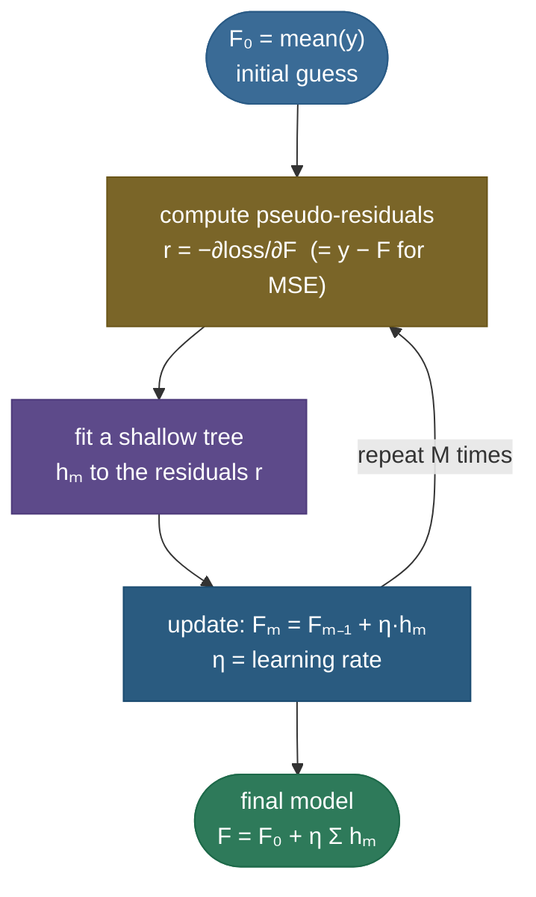

# Gradient boosting: turning weak trees into the champion of tabular ML

If [random forests](09-Random-Forests.md) reduce variance by averaging many independent trees *in parallel*, gradient boosting takes the opposite tack: it builds trees **one at a time, sequentially**, where each new tree is trained to fix the mistakes the current ensemble is still making. Start with a crude guess, look at where it's wrong (the **residuals**), fit a small tree to those errors, add it in, and repeat — each round nudges the model a little closer to the signal. The deep insight is that "fit the residuals" is exactly **gradient descent, but in function space**: each tree approximates the *negative gradient* of the loss, so boosting is descending the loss by adding functions instead of adjusting parameters. This sequential error-correction reduces **bias** (where forests reduce variance), and when implemented well — **XGBoost**, **LightGBM**, **CatBoost** — it is the reigning champion of tabular data and the single most common winning model on Kaggle.

By the end of this page you'll be able to:

- explain how boosting differs from bagging/forests (**sequential bias-reduction** vs parallel variance-reduction);
- explain what the **"gradient"** means — pseudo-residuals as the negative gradient, "descent in function space";
- describe the **algorithm**, why **shallow trees + a learning rate (shrinkage)** work, and the n_estimators ↔ learning_rate trade;
- say what **XGBoost** adds (2nd-order Taylor objective, regularization, sparsity-aware splits) and how **LightGBM / CatBoost** differ;
- implement gradient boosting from scratch and verify the residual = negative-gradient identity.

Intuition and pictures first, then the math (with sources), then runnable code.

> **Note:** the name trips people up. "Gradient" isn't about gradients *inside* a tree — it's that **each tree approximates the negative gradient of the loss with respect to the model's current predictions**. For squared error that gradient is just the residual $y - F$, so "fit the residuals" *is* "fit the negative gradient." For other losses (log-loss, etc.) you fit the corresponding gradient — same recipe, which is why it's gradient boosting.

---

## The problem: reduce bias by correcting errors

A single shallow tree (a "stump" or depth-3 tree) is a **weak learner** — high bias, it underfits. You can't average many of them to fix bias (averaging only cuts variance). Instead, boosting makes them **collaborate sequentially**: each weak tree focuses on the examples the ensemble currently gets wrong, so the *combined* model steadily reduces bias and fits complex patterns that no single shallow tree could. It's a fundamentally different ensemble philosophy from bagging.

---

## The idea: fit the residuals, round after round

Start the model at a constant (e.g. the mean of $y$). Then repeat: compute the **residuals** (what the current model gets wrong), fit a small tree to *those*, and add a shrunken version of it to the model:


The additive model after $M$ rounds is $F_M(x) = F_0(x) + \eta\sum_{m=1}^{M} h_m(x)$, where each $h_m$ is a tree fit to the current residuals and $\eta$ is the learning rate. The figure shows the ensemble converging from a crude step (1 tree) to a faithful fit (50 trees) — each tree chipping away at the remaining error.

---

## The "gradient": descent in function space

Here's why it's *gradient* boosting. Instead of fitting raw residuals, fit the **negative gradient of the loss** with respect to the current predictions — the **pseudo-residuals**:

$$r_{im} = -\left[\frac{\partial L(y_i, F(x_i))}{\partial F(x_i)}\right]_{F = F_{m-1}}$$

For squared-error loss $L = \tfrac{1}{2}(y - F)^2$, this derivative is $-(y - F)$, so the pseudo-residual is exactly $y - F$ — the ordinary residual (the code confirms this to machine zero). For **log-loss** (classification) the pseudo-residual is $y - p$. Either way, each tree approximates the negative gradient, and adding $\eta\,h_m$ takes a step *downhill on the loss* — except the "parameter" being optimized is the **function** $F$ itself. That's the Friedman insight: **gradient boosting is gradient descent in function space.**



> *Where this comes from: gradient boosting as function-space gradient descent is **Greedy Function Approximation: A Gradient Boosting Machine** (Friedman 2001); the gentle visual derivation is Parr & Howard's "How to explain gradient boosting" — references.*

---

## Shallow trees + shrinkage: why slow is better

Two design choices make boosting generalize rather than overfit:

- **Shallow trees** (depth 3–6) — each is a *weak* learner that captures only a little structure, so the ensemble builds up complexity gradually rather than memorizing in one shot.
- **Learning rate / shrinkage** ($\eta$, e.g. 0.1) — scale down each tree's contribution. Smaller $\eta$ means each step is tinier, so you need *more* trees, but the model generalizes better and overfits more gracefully:


This is the central tradeoff: **learning_rate × n_estimators** together control the fit. The large learning rate overshoots and overfits quickly; the small one (shrinkage) takes many small steps to a lower test error. The standard recipe is a **small learning rate, many trees, and early stopping** on a validation set.

> **Gotcha:** unlike random forests, **more trees CAN overfit** a gradient-boosting model (each tree keeps reducing training error, eventually fitting noise). That's why you tune `n_estimators` with **early stopping** — stop when validation error stops improving. (Forests never overfit from tree *count*; boosting can.)

---

## XGBoost, LightGBM, CatBoost

Plain gradient boosting works, but the modern implementations add crucial improvements:

- **XGBoost** — uses a **2nd-order Taylor expansion** of the loss (both the gradient *and* the Hessian) to choose splits more precisely, adds an explicit **regularization** term penalizing tree complexity (number of leaves + leaf weights) right in the objective, handles missing values with **sparsity-aware** splits, and is engineered for speed (cache-aware, parallel). This regularized 2nd-order objective is why it so often wins.
- **LightGBM** — bins features into **histograms** and grows trees **leaf-wise** (expand the leaf with the biggest loss reduction, not level-by-level), making it much faster on large data, plus GOSS/EFB tricks.
- **CatBoost** — **ordered boosting** (to reduce a subtle target-leakage bias) and **native categorical-feature** handling without manual encoding.

> *Where this comes from: the regularized 2nd-order objective is **XGBoost: A Scalable Tree Boosting System** (Chen & Guestrin 2016); **LightGBM** (Ke et al. 2017) and **CatBoost** (Prokhorenkova et al. 2018) — references.*

---

## Boosting vs bagging/forests

The defining contrast, and a guaranteed interview question:

| | Random forest (bagging) | Gradient boosting |
|---|---|---|
| **How trees combine** | parallel, independent, averaged | sequential, each corrects the last |
| **Trees** | deep (low bias, high variance) | shallow (high bias, low variance) |
| **Reduces** | **variance** | **bias** |
| **More trees** | never overfits (→ variance floor) | **can overfit** (use early stopping) |
| **Tuning** | minimal, robust | more sensitive (lr, depth, n_trees) |
| **Typical accuracy** | strong baseline | often state-of-the-art on tabular |

Forests are the safe, low-tuning default; boosting squeezes out more accuracy but needs care.

---

## Worked example: one boosting round

Three points with targets $y = [3, 5, 4]$. Start $F_0 = \bar y = 4$ (the mean), so current predictions are $[4, 4, 4]$.

- **Pseudo-residuals** (MSE): $r = y - F_0 = [3-4,\ 5-4,\ 4-4] = [-1,\ +1,\ 0]$.
- **Fit a tree** to those residuals; suppose it predicts $h_1 = [-1, +1, 0]$ (it learned the pattern).
- **Update** with learning rate $\eta = 0.5$: $F_1 = F_0 + 0.5\,h_1 = [4-0.5,\ 4+0.5,\ 4] = [3.5,\ 5.5,\ 4]$.
- New residuals: $[-0.5,\ -0.5,\ 0]$ — **smaller** than before. The next tree shrinks them further, and so on.

Each round the residuals (the negative gradient) get smaller — the model descends the loss, one tree at a time.

---

## Code: gradient boosting from scratch, and the gradient identity

```python
"""Gradient boosting from scratch: pseudo-residual = -gradient, error drops each
round, matches sklearn. Verified on ml-py312, CPU."""
import numpy as np
from sklearn.tree import DecisionTreeRegressor
from sklearn.ensemble import GradientBoostingRegressor
rng = np.random.default_rng(0)
x = np.sort(rng.uniform(-3, 3, 200)); y = np.sin(1.5*x) + rng.normal(0, 0.2, 200); X = x[:, None]

F = np.full_like(y, y.mean()); lr = 0.3                  # init = mean(y)
for m in range(1, 41):
    resid = y - F                                        # = -gradient of ½(y-F)²
    tree = DecisionTreeRegressor(max_depth=3, random_state=0).fit(X, resid)
    F = F + lr * tree.predict(X)                          # add a shrunken tree
    if m in (1, 5, 10, 40):
        print(f"round {m:>2}: train MSE = {np.mean((y-F)**2):.4f}")

# the pseudo-residual IS the negative gradient of MSE
Fcur = np.full_like(y, 0.3)
print(f"pseudo-residual == -gradient of MSE? max diff = {np.abs((y-Fcur) - (-(-(y-Fcur)))).max():.2e}")
gbr = GradientBoostingRegressor(n_estimators=40, learning_rate=0.3, max_depth=3, random_state=0).fit(X, y)
print(f"sklearn GBR train MSE = {np.mean((y-gbr.predict(X))**2):.4f}  (matches from-scratch)")
```

Output:

```
round  1: train MSE = 0.3100
round  5: train MSE = 0.0632
round 10: train MSE = 0.0295
round 40: train MSE = 0.0123
pseudo-residual == -gradient of MSE? max diff = 0.00e+00
sklearn GBR train MSE = 0.0123  (matches from-scratch)
```

> **Note:** the error falls every round (0.31 → 0.012) as each shallow tree fits the leftover residual — that's bias reduction in action. The pseudo-residual equals the negative gradient of MSE *exactly* (the heart of "gradient" boosting), and the 12-line from-scratch version reaches the **same** train MSE (0.0123) as scikit-learn's `GradientBoostingRegressor` — confirming the algorithm.

---

## Where gradient boosting is used

- **The default for tabular data** — XGBoost/LightGBM/CatBoost win most structured-data competitions and power countless production systems (ranking, risk, demand forecasting).
- **Learning to rank** — search and recommendation ranking (LambdaMART is boosted trees).
- **Click-through / conversion prediction** — large-scale ad and recommendation systems.
- **Anywhere a forest isn't quite accurate enough** — when you can afford the tuning, boosting usually edges it out.

> **Tip:** the practical recipe interviewers like to hear: **small learning rate (~0.05–0.1), many trees, early stopping on a validation set, shallow depth (3–6), and subsampling (rows/columns) for regularization** — then grid/Bayesian-search the rest. And know the headline contrast: **boosting reduces bias sequentially; bagging/forests reduce variance in parallel.**

---

## Recap and rapid-fire

**If you remember nothing else:** gradient boosting builds shallow trees **sequentially**, each fitting the **negative gradient of the loss** (the pseudo-residuals — for MSE, just the residual $y - F$) and added with a small **learning rate**. It's **gradient descent in function space**, it reduces **bias** (vs forests' variance), it **can overfit** with too many trees (use early stopping), and the modern implementations — **XGBoost** (regularized 2nd-order objective), **LightGBM** (histogram + leaf-wise), **CatBoost** (ordered + categorical) — dominate tabular ML.

**Quick-fire — say these out loud:**

- *Boosting vs bagging?* Sequential, each tree corrects the last (reduces **bias**) vs parallel averaging (reduces **variance**).
- *What does the "gradient" mean?* Each tree fits the negative gradient of the loss w.r.t. current predictions (pseudo-residuals).
- *Pseudo-residual for MSE? for log-loss?* $y - F$ (the residual); $y - p$ for classification.
- *Why shallow trees?* Weak learners — the ensemble adds complexity gradually instead of overfitting in one shot.
- *What does the learning rate do?* Shrinkage — smaller steps generalize better but need more trees (lr ↔ n_estimators trade).
- *Can boosting overfit with more trees?* Yes (unlike forests) — use early stopping on validation.
- *What does XGBoost add?* 2nd-order Taylor objective (gradient + Hessian), explicit regularization, sparsity-aware splits, speed.
- *LightGBM vs CatBoost?* LightGBM = histogram + leaf-wise (fast); CatBoost = ordered boosting + native categoricals.
- *Boosting or forest by default?* Forest for a robust low-tuning baseline; boosting for peak accuracy with tuning.

---

## References and further reading

The curated link library for this topic — videos, courses, interactive/visual resources, articles, papers, books, and internal cross-links — lives in a companion file so it can be reused as a standalone reference list:

**→ [Gradient Boosting — references and further reading](10-Gradient-Boosting-XGBoost.references.md)**
