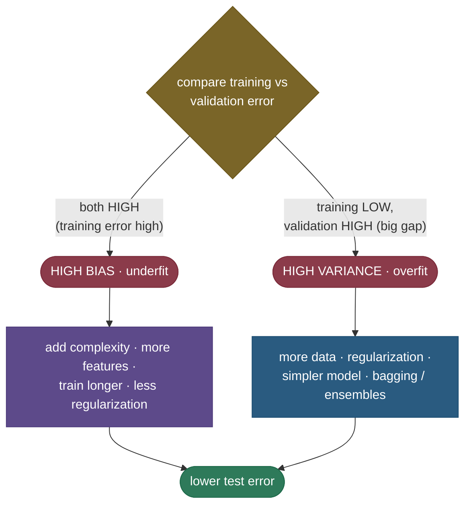

# The bias–variance tradeoff: why a model that fits perfectly can still fail

Here is the question that sits underneath all of supervised learning: *why doesn't fitting the training data perfectly give a perfect model?* The answer is that a model's expected error on **new** data splits into two competing forces. **Bias** is error from a model being too simple to capture the real pattern — it makes the same wrong assumption every time. **Variance** is error from a model being too sensitive to the particular training set — it learns the noise, so it would give wildly different answers if you'd sampled different data. The cruel part is that these two pull in *opposite* directions: making a model more flexible reduces bias but increases variance, and vice versa. You can't drive both to zero, so the whole game of machine learning is finding the sweet spot between them. This is the single most important lens for reasoning about underfitting, overfitting, regularization, and ensembles — and a near-guaranteed interview question.

By the end of this page you'll be able to:

- write and **derive** the decomposition $\mathbb{E}[(y - \hat f)^2] = \text{Bias}^2 + \text{Variance} + \sigma^2$;
- explain the **dartboard** intuition and map bias/variance onto **underfitting/overfitting**;
- read the **U-shaped** test-error curve and find the complexity sweet spot;
- **diagnose** high bias vs high variance from train/validation error and pick the right fix;
- connect it to **regularization, more data, and ensembles** (bagging cuts variance, boosting cuts bias);
- explain the modern **double-descent** wrinkle.

Intuition and pictures first, then the algebra (with sources), then a runnable decomposition.

> **Note:** "bias" and "variance" here are *not* the colloquial meanings. **Bias** = how far off your model is *on average* (across many training sets); **variance** = how much your model *jumps around* as the training set changes. A model can be right on average yet useless because it's wildly unstable (high variance) — or rock-steady yet always wrong (high bias).

---

## The problem: training error is not what you care about

You fit a model by minimizing error on the training set, but what you actually want is low error on **unseen** data. These differ because the training set is a *random sample* with noise, and a flexible enough model will fit that noise — scoring great on training and poorly on new data. To reason about expected performance, we decompose the **expected test error** (averaged over the randomness in the training set and the label noise) into interpretable pieces.

---

## The decomposition (derived)

For a true function $f$, noisy labels $y = f(x) + \epsilon$ with $\mathbb{E}[\epsilon] = 0$ and $\text{Var}(\epsilon) = \sigma^2$, and a model $\hat f$ trained on a random dataset, the expected squared error at a point $x$ is:

$$\mathbb{E}\big[(y - \hat f(x))^2\big] = \underbrace{\big(\mathbb{E}[\hat f(x)] - f(x)\big)^2}_{\text{Bias}^2} + \underbrace{\mathbb{E}\big[(\hat f(x) - \mathbb{E}[\hat f(x)])^2\big]}_{\text{Variance}} + \underbrace{\sigma^2}_{\text{irreducible noise}}$$

The derivation is short and worth knowing. Write $y - \hat f = (f + \epsilon) - \hat f$. Expand the square and take expectations; the cross-terms involving $\epsilon$ vanish because $\epsilon$ is zero-mean and independent of $\hat f$, leaving $\mathbb{E}[(f - \hat f)^2] + \sigma^2$. Now add and subtract $\mathbb{E}[\hat f]$ inside the first term: $\mathbb{E}[(f - \mathbb{E}[\hat f] + \mathbb{E}[\hat f] - \hat f)^2]$. Expanding, the cross-term again cancels (since $\mathbb{E}[\mathbb{E}[\hat f] - \hat f] = 0$), giving exactly $(f - \mathbb{E}[\hat f])^2 + \mathbb{E}[(\hat f - \mathbb{E}[\hat f])^2] = \text{Bias}^2 + \text{Variance}$. Three terms, two of which you can trade and one you can't.

> *Where this comes from: the decomposition entered ML through **Neural Networks and the Bias/Variance Dilemma** (Geman, Bienenstock & Doursat 1992); the textbook derivations are **The Elements of Statistical Learning** §7.3 and **An Introduction to Statistical Learning** §2.2 — all in the references.*

---

## The dartboard: meaning made visual

The classic picture: the bullseye is the true answer, and each dart is the model trained on a different random dataset.


**Bias** is how far the *cluster center* sits from the bullseye; **variance** is how *spread out* the darts are. You want the bottom-left of nothing and the top-left of everything: tight and centered. Underfitting is high bias (consistently off); overfitting is high variance (right on average but all over the place).

---

## The complexity trade-off and the U-curve

Model complexity is the dial that trades bias for variance. A **too-simple** model (a line for a curvy function) has **high bias, low variance** — it underfits. A **too-complex** model (a high-degree polynomial) has **low bias, high variance** — it overfits, chasing every wiggle of the training noise. Plotting error against complexity gives the iconic **U-shaped** test-error curve:


This is a *real* bootstrap measurement (in the code): bias² falls with complexity, variance rises, and their sum — the total test error — bottoms out at an intermediate "sweet spot," then shoots up as the high-degree model overfits. **Training error**, by contrast, falls monotonically (a more complex model always fits the training data better) — which is exactly why training error alone can't tell you where the sweet spot is.

> **See it interactively:** [MLU-Explain: The Bias–Variance Tradeoff](https://mlu-explain.github.io/bias-variance/) lets you drag the model-complexity slider and watch bias, variance, and total error move in real time — the live version of this figure.

---

## Diagnosing it in practice

The whole framework is actionable because **train vs validation error** tells you which problem you have:



- **High bias (underfitting):** training error *itself* is high (and validation error is similar). The model can't even fit the data → **add capacity** (more features/complexity, train longer, reduce regularization).
- **High variance (overfitting):** training error is low but validation error is much higher (a big gap). The model memorized noise → **reduce variance** (more data, [regularization](03-Regularization-Linear-Models.md), a simpler model, or ensembles).

> **Tip:** this is the Andrew-Ng diagnostic loop. *First* drive training error down (fix bias), *then* close the train/val gap (fix variance). Treating an overfitting problem (gap) by adding capacity, or an underfitting problem (high train error) by adding data, wastes effort — the gap vs the floor tells you which knob to turn.

---

## The levers, and how ensembles fit in

Each common technique moves you along the trade-off:

- **More training data** → lowers **variance** (the model is less sensitive to any one sample); doesn't help bias.
- **Regularization** (L1/L2, dropout, early stopping) → raises bias a little, lowers **variance** a lot.
- **More features / complexity** → lowers **bias**, raises variance.
- **Bagging** (random forests) → averages many high-variance models to **cut variance** — the dartboard's scatter shrinks toward its center.
- **Boosting** (gradient boosting) → sequentially corrects errors of a weak (high-bias) model to **cut bias**.

That last pair is a favourite interview point: **bagging attacks variance, boosting attacks bias.**

---

## The modern wrinkle: double descent

The classic U-curve says "past the sweet spot, more complexity always hurts." Modern deep learning broke that intuition. As you keep adding parameters *past* the point where the model can perfectly fit (interpolate) the training data, test error — surprisingly — starts **descending again**. This **double descent** is why massively over-parameterized networks (far more parameters than data points) generalize well, seemingly violating the classic story.

> *Where this comes from: **Reconciling Modern Machine-Learning Practice and the Bias–Variance Trade-off** (Belkin et al. 2019) — references. The classic decomposition still holds; double descent shows the *complexity axis* is richer than the simple U suggests once you go past interpolation.*

---

## Worked example: the decomposition, measured

Fitting polynomials of three degrees to a noisy $\sin$ curve (bootstrap over many training sets, $\sigma^2 = 0.0625$ — the code reproduces this):

| degree | bias² | variance | + σ² | = sum | measured test error |
|---|---|---|---|---|---|
| 1 (underfit) | **0.485** | 0.069 | 0.062 | 0.616 | 0.619 |
| 3 (good) | 0.082 | 0.066 | 0.062 | **0.211** | 0.211 |
| 9 (overfit) | 0.069 | **1897** | 0.062 | 1897 | 1897 |

Two things to read off. First, the decomposition **holds exactly**: bias² + variance + σ² matches the directly-measured test error in every row. Second, the *story*: degree 1 is dominated by **bias** (underfit), degree 9 by **variance** (overfit — a stunning 1897 because high-degree polynomials swing wildly between training points), and degree 3 balances them for the lowest total. The sweet spot is where the two are traded off best — not where either is individually minimized.

---

## Code: bias-variance decomposition by bootstrap

```python
"""Bias-variance decomposition: total test error = bias^2 + variance + noise.
Verified on ml-py312, CPU (numpy)."""
import numpy as np
rng = np.random.default_rng(0)
f = lambda x: np.sin(1.5 * x); noise = 0.25            # sigma^2 = 0.0625
xt = np.linspace(-3, 3, 80); fx = f(xt)

def decompose(degree, runs=400, n=18):
    preds = []
    for _ in range(runs):                              # each run = a fresh training set
        xtr = rng.uniform(-3, 3, n); ytr = f(xtr) + rng.normal(0, noise, n)
        preds.append(np.polyval(np.polyfit(xtr, ytr, degree), xt))
    preds = np.array(preds)
    bias2 = ((preds.mean(0) - fx) ** 2).mean()         # (avg prediction - truth)^2
    var = preds.var(0).mean()                          # spread across training sets
    return bias2, var

for d, tag in [(1, "underfit"), (3, "good"), (9, "overfit")]:
    b2, v = decompose(d)
    print(f"degree {d}: bias^2={b2:7.3f}  variance={v:10.3f}  total={b2+v+noise**2:10.3f}  ({tag})")
```

Output:

```
degree 1: bias^2=  0.485  variance=     0.069  total=     0.616  (underfit)
degree 3: bias^2=  0.082  variance=     0.066  total=     0.211  (good)
degree 9: bias^2=  0.069  variance=  1897.233  total=  1897.365  (overfit)
```

> **Note:** the numbers tell the whole story. The **underfit** model (degree 1) has large bias² and small variance; the **overfit** model (degree 9) has tiny bias² but enormous variance; the **good** model (degree 3) balances them for the lowest total error. The total in each row equals bias² + variance + the irreducible σ² — the decomposition, confirmed.

---

## Where this matters

- **Every model-selection decision** — choosing model complexity, regularization strength, tree depth, or network size is choosing a point on this trade-off.
- **Debugging a model** — "is it underfitting or overfitting?" is the first diagnostic question, answered by the train/val gap.
- **Understanding ensembles** — why random forests (bagging) and boosting work, and when to use which.
- **Modern deep learning** — double descent explains why huge models generalize, reshaping the classic picture.

> **Tip:** the bias–variance lens is *the* mental model interviewers probe. Be ready to (1) write the decomposition, (2) map it to under/overfitting, (3) diagnose from train/val error, and (4) prescribe a fix — and to mention double descent as the modern caveat.

---

## Recap and rapid-fire

**If you remember nothing else:** expected test error = **bias² + variance + irreducible noise**. Bias is being wrong *on average* (too simple → underfit); variance is being *unstable* across training sets (too complex → overfit). Complexity trades one for the other, giving a **U-shaped** test-error curve with a sweet spot in the middle. Diagnose with the **train/validation gap**, and fix bias by adding capacity, variance by adding data/regularization/ensembles.

**Quick-fire — say these out loud:**

- *The decomposition?* $\mathbb{E}[(y-\hat f)^2] = \text{Bias}^2 + \text{Variance} + \sigma^2$.
- *Bias vs variance in words?* Bias = wrong on average (underfit); variance = unstable across training sets (overfit).
- *What's irreducible?* The noise $\sigma^2$ — no model can beat it.
- *High bias symptoms & fix?* High *training* error → add complexity/features, train longer, less regularization.
- *High variance symptoms & fix?* Low train but high val error (big gap) → more data, regularization, simpler model, ensembles.
- *Why is the test-error curve U-shaped?* Bias falls and variance rises with complexity; their sum dips then climbs.
- *Bagging vs boosting?* Bagging cuts **variance** (average many models); boosting cuts **bias** (sequentially correct a weak learner).
- *Does regularization change bias or variance?* Increases bias slightly, decreases variance.
- *What is double descent?* Past the interpolation threshold, test error *descends again* — why over-parameterized models generalize.

---

## References and further reading

The curated link library for this topic — videos, courses, interactive/visual resources, articles, papers, books, and internal cross-links — lives in a companion file so it can be reused as a standalone reference list:

**→ [Bias–Variance Tradeoff — references and further reading](12-Bias-Variance-Tradeoff.references.md)**
