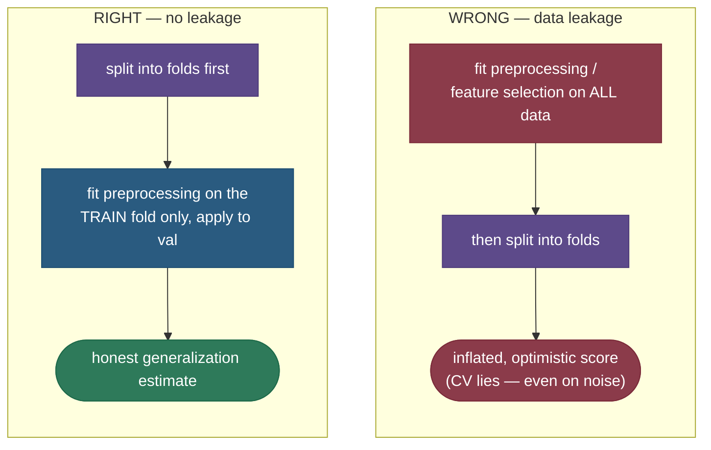

# Cross-validation: an honest estimate of how your model will generalize

You've trained a model. How well will it do on data it hasn't seen? You can't use the training error (it's optimistic — the model has seen that data), and a single held-out test split gives a *noisy* answer that depends on which lucky or unlucky rows happened to land in the test set. **Cross-validation** solves both problems with a simple, powerful idea: split the data into $k$ **folds**, and rotate which fold is held out — train on $k-1$ folds, validate on the remaining one, repeat $k$ times so every fold serves as validation exactly once, then **average** the $k$ scores. Now every data point is used for both training and validation, and the averaged score is far steadier than any single split. Cross-validation is the engine behind almost all model evaluation and hyperparameter tuning — and the place where one subtle mistake (**leakage**) can make your reported score a complete lie.

By the end of this page you'll be able to:

- explain why a **single train/test split** is a noisy estimate, and how **k-fold** fixes it;
- reason about the **bias–variance of the CV estimate** and how to choose $k$ (including **LOOCV**);
- pick the right variant — **stratified, grouped, time-series** — for the data;
- explain and avoid the **leakage trap**: preprocessing/feature-selection must live *inside* the CV loop;
- use **nested CV** to tune hyperparameters without optimistic bias;
- demonstrate CV's stability and the leakage disaster in code.

Intuition and pictures first, then the reasoning (with sources), then runnable code.

> **Note:** keep straight *what* CV estimates — the **generalization error** (expected error on new data) — and *what it doesn't replace*: a final, untouched **test set**. You cross-validate on your training data to choose and tune the model; you report the real number on data that was never involved in any of those decisions.

---

## The problem: one split is a coin flip

The naïve approach is a single train/test split: train on 75%, score on 25%. But that 25% is a random sample, so the score swings depending on which rows you got — an easy test fold flatters the model, a hard one maligns it. You're estimating a quantity from *one* small sample, which is **high-variance**. You also **waste data**: the held-out 25% never contributes to training, and the model never gets evaluated on the 75%. Cross-validation reuses every point for both roles.

---

## k-fold cross-validation

Partition the data into $k$ equal folds. For each fold in turn, train on the other $k-1$ and validate on it; the CV score is the average of the $k$ validation scores:


Because the validation fold rotates, **every point is validated exactly once** and trained on $k-1$ times. Averaging the $k$ scores cancels the luck of any single split, giving a much steadier estimate — and a **standard deviation** across folds that tells you how *reliable* the estimate is:


The figure (real measurement) shows the danger of trusting one split: across 300 random splits the score ranges over ~25 points, so a single split could mislead you badly. The 5-fold CV estimate is one stable number with a smaller spread (the code: ~1.4× smaller std).

> *Where this comes from: the empirical case for **10-fold** CV as the default is **A Study of Cross-Validation and Bootstrap** (Kohavi 1995); the estimators and analysis are **ISLR** Ch. 5 and **ESL** Ch. 7.10 — references.*

---

## Choosing k: the bias–variance of the estimate

The number of folds is itself a bias–variance trade *on the estimate*:

- **Small $k$** (e.g. 5) — each training set is notably smaller than the full data, so CV slightly **overestimates** error (a bit of pessimistic bias), but the folds overlap less and the estimate has **lower variance**; it's also cheap ($k$ fits).
- **Large $k$ / LOOCV** ($k = n$, leave-one-out) — each training set is almost the full data, so **low bias**, but the $n$ models are nearly identical and their errors highly correlated, giving **high variance**; and it costs $n$ fits (expensive).
- **The sweet spot is $k = 5$ or $10$** — empirically the best bias–variance trade for the estimate, which is why 10-fold is the field default.

> **Tip:** "what $k$?" → 5 or 10 for the bias–variance sweet spot and reasonable cost; LOOCV only for very small datasets where you can't afford to hold much out (accepting its higher-variance, expensive estimate).

---

## Variants: match the split to the data

Plain k-fold assumes rows are exchangeable. When they're not, you need a smarter split:

- **Stratified k-fold** — preserve the class proportions in every fold. Essential for **imbalanced** classification (otherwise a fold might contain *no* positives). It's scikit-learn's default for classifiers.
- **Grouped k-fold** — keep rows that share a group (same patient, user, or device) entirely within one fold. Prevents **leakage** from near-duplicate rows of the same entity landing in both train and validation.
- **Time-series CV** — never train on the future to predict the past. Use forward-chaining (expanding/rolling windows) so each validation fold is *later* in time than its training data. Plain k-fold on time series leaks future information and lies.

---

## The leakage trap (the cardinal sin)

Here is the mistake that silently inflates countless reported scores: doing **any data-dependent preprocessing — scaling, imputation, feature selection, target encoding — on the whole dataset *before* cross-validating.** When you do that, information from the validation folds leaks into the training process, and CV reports an **optimistic, wrong** number.



How bad is it? The code runs the classic demonstration: take **pure noise** (random features, random labels — true accuracy must be 50%), select the 20 features most correlated with the labels *using all the data*, then cross-validate → CV reports **80% accuracy on noise**. Do the *exact same* selection **inside** the CV loop (refit per fold) and it correctly reports ~chance. The fix is mechanical: **wrap every preprocessing step in a `Pipeline`** so scikit-learn refits it on each training fold only.

> *Where this comes from: the "right way to cross-validate" with feature selection inside the loop is **ESL** §7.10.2 (the famous noise example); scikit-learn's "common pitfalls" guide covers it in practice — references.*

---

## Nested CV for tuning

If you use CV both to **tune** hyperparameters and to **report** performance, you've optimized against your validation folds — the reported score is optimistic. **Nested CV** separates the two: an **inner** CV loop selects hyperparameters within each outer training fold, and the **outer** CV loop estimates performance on data the tuning never touched. Use it whenever you need an *unbiased* estimate of a tuned model (otherwise a single CV is fine for tuning alone, with a final held-out test set for reporting).

---

## Worked example

5-fold CV of a classifier returns fold accuracies $[0.78,\ 0.74,\ 0.81,\ 0.76,\ 0.77]$.

- **Estimate:** mean $= (0.78+0.74+0.81+0.76+0.77)/5 = 0.772$.
- **Reliability:** standard deviation $\approx 0.024$, so you'd report **0.77 ± 0.02**.

That spread is the useful part: a tight std means the estimate is trustworthy; a wide one (say ±0.10) warns that performance depends heavily on the split — often a sign of too little data or an unstable model. A single split would have given you just *one* of those five numbers, with no sense of the spread.

---

## Code: k-fold stability, and the leakage disaster

```python
"""Cross-validation: k-fold stability, and the leakage trap (selection outside the
CV loop inflates the score — even on pure noise). Verified on ml-py312, CPU."""
import numpy as np
from sklearn.linear_model import LogisticRegression
from sklearn.feature_selection import SelectKBest, f_classif
from sklearn.pipeline import Pipeline
from sklearn.model_selection import cross_val_score, train_test_split
from sklearn.datasets import make_classification

X, y = make_classification(n_samples=300, n_features=20, n_informative=6, class_sep=0.8, random_state=0)
single = [LogisticRegression(max_iter=1000).fit(*train_test_split(X, y, test_size=.25, random_state=s)[::2])
          .score(*train_test_split(X, y, test_size=.25, random_state=s)[1::2]) for s in range(200)]
cv = cross_val_score(LogisticRegression(max_iter=1000), X, y, cv=5)
print(f"single split: {np.mean(single):.3f} ± {np.std(single):.3f}   5-fold CV: {cv.mean():.3f} ± {cv.std():.3f}")

# leakage on PURE NOISE (true accuracy = 0.50): select features OUTSIDE vs INSIDE the CV loop
rng = np.random.default_rng(0); Xn = rng.standard_normal((80, 1000)); yn = rng.integers(0, 2, 80)
sel = SelectKBest(f_classif, k=20).fit(Xn, yn)                                   # uses ALL data -> leak
wrong = cross_val_score(LogisticRegression(max_iter=1000), sel.transform(Xn), yn, cv=5).mean()
pipe = Pipeline([("sel", SelectKBest(f_classif, k=20)), ("clf", LogisticRegression(max_iter=1000))])
right = cross_val_score(pipe, Xn, yn, cv=5).mean()                               # selection per fold
print(f"pure noise: selection OUTSIDE CV = {wrong:.3f} (inflated!)   INSIDE CV = {right:.3f} (~chance)")
```

Output:

```
single split: 0.750 ± 0.046   5-fold CV: 0.767 ± 0.033
pure noise: selection OUTSIDE CV = 0.800 (inflated!)   INSIDE CV = 0.388 (~chance)
```

> **Note:** two lessons. First, the 5-fold estimate (± 0.033) is steadier than a single split (± 0.046). Second — the alarming one — selecting features on the **full data** before CV makes CV report **80% accuracy on data that is literally random noise** (true = 50%). Doing the identical selection **inside** the loop reports ~chance, the honest answer. *This is why every transform goes inside a `Pipeline`.*

---

## Where cross-validation is used

- **Model selection & hyperparameter tuning** — `GridSearchCV` / `RandomizedSearchCV` score every candidate by CV.
- **Honest performance estimates** — especially on small/medium data where a single split is too noisy.
- **Stacking / blending** — out-of-fold CV predictions are the inputs to a meta-model (see [Stacking & Blending](11-Stacking-and-Blending.md)).
- **Detecting overfitting** — a large train-vs-CV gap flags it; CV *is* how you measure where you sit on the [bias–variance](12-Bias-Variance-Tradeoff.md) curve.

> **Tip:** the interview checklist — (1) k-fold averages out single-split noise; (2) 5/10 folds is the sweet spot, LOOCV is low-bias/high-variance/expensive; (3) stratify for imbalance, group/time-series to avoid leakage; (4) **all preprocessing inside the loop (Pipeline)**; (5) nested CV for unbiased tuned estimates. Naming the leakage trap unprompted signals real experience.

---

## Recap and rapid-fire

**If you remember nothing else:** cross-validation estimates generalization by rotating the validation fold across $k$ splits and averaging, so every point is used for both training and validation and the estimate is far steadier than one split. **$k = 5$ or $10$** is the bias–variance sweet spot (LOOCV = low bias, high variance, expensive). Use **stratified** for imbalance, **grouped/time-series** to prevent leakage — and *always* fit preprocessing **inside** the loop, or CV will lie to you (it'll report high accuracy on pure noise).

**Quick-fire — say these out loud:**

- *Why not a single train/test split?* It's a high-variance estimate (depends on the lucky split) and wastes data.
- *What is k-fold CV?* Split into k folds, rotate which is held out, average the k validation scores.
- *How to choose k?* 5 or 10 (bias–variance sweet spot); LOOCV (k=n) is low-bias but high-variance and expensive.
- *Bias–variance of the estimate?* Small k → smaller train sets → slight pessimistic bias, lower variance; LOOCV → low bias, high variance.
- *Stratified CV — when?* Imbalanced classification, to keep class ratios in every fold.
- *Grouped / time-series CV — when?* Correlated groups (same user/patient) / temporal data (never train on the future).
- *The #1 CV mistake?* Leakage — preprocessing/feature-selection on all data before CV; it inflates the score (even on noise). Fix: Pipeline, fit per fold.
- *Nested CV — why?* Unbiased performance estimate of a *tuned* model (inner loop tunes, outer loop estimates).
- *What does the fold std tell you?* How reliable the estimate is (tight = trustworthy; wide = split-dependent).

---

## References and further reading

The curated link library for this topic — videos, courses, interactive/visual resources, articles, papers, books, and internal cross-links — lives in a companion file so it can be reused as a standalone reference list:

**→ [Cross-Validation — references and further reading](13-Cross-Validation.references.md)**
