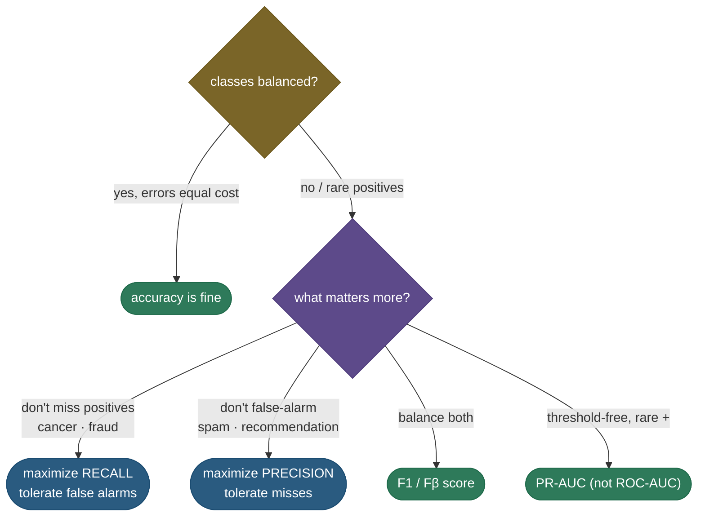

# Classification metrics: why accuracy lies, and what to use instead

Build a model to detect a disease that affects 1% of patients, predict "healthy" for *everyone*, and you'll score **99% accuracy** — while catching exactly zero sick patients. That single example is why "accuracy" is one of the most dangerous numbers in machine learning: on **imbalanced** data it can be sky-high and completely useless. Real evaluation starts from the **confusion matrix** — the four-way breakdown of right and wrong predictions — and the metrics built on it: **precision** (of the cases you flagged, how many were right), **recall** (of the cases that mattered, how many you caught), their harmonic mean **F1**, and the threshold-free summaries **ROC-AUC** and **PR-AUC**. Knowing the formulas is table stakes; the real skill — and what interviews probe — is choosing the *right* metric for the problem, because optimizing the wrong one ships a model that fails in exactly the way that matters.

By the end of this page you'll be able to:

- read the **confusion matrix** and derive **precision** and **recall** from it;
- explain the **precision–recall tradeoff** and pick the right side (cancer screening vs spam filtering);
- explain why **accuracy is misleading** under class imbalance, and what **F1 / Fβ** add;
- define **ROC-AUC** (and its ranking interpretation) and explain why **PR-AUC** is better for rare positives;
- reason about the decision **threshold** and **multiclass averaging**;
- compute all of these from scratch and verify the AUC ranking identity.

Intuition and pictures first, then the formulas (with sources), then runnable code.

> **Note:** every metric on this page answers a different question about the *same* predictions. Accuracy asks "how often am I right overall?" (misleading when classes are skewed); precision asks "when I say positive, am I right?"; recall asks "did I find the positives?"; F1 balances those two; AUC asks "do I *rank* positives above negatives?" There is no single best metric — only the one that matches what your application actually cares about.

---

## The problem: the accuracy paradox

**Accuracy** = (correct predictions) / (total). It's intuitive and fine when classes are balanced and errors are equally costly. But when one class is rare — fraud, disease, defects, clicks — accuracy is dominated by the easy majority class. A model can ignore the rare class entirely and still look excellent:

- 1% of transactions are fraud → "never flag fraud" scores **99% accuracy** and catches **no fraud**.

The metric is technically correct and practically worthless. You need numbers that look at the rare class directly — which all come from the confusion matrix.

---

## The confusion matrix

Every prediction falls into one of four cells: **True Positive** (predicted +, actually +), **False Positive** (predicted +, actually −), **False Negative** (predicted −, actually +), **True Negative** (predicted −, actually −):


The two key metrics are just two ways of slicing the positives:

$$\text{Precision} = \frac{TP}{TP + FP} \qquad \text{Recall} = \frac{TP}{TP + FN}$$

- **Precision** — read *down the predicted-positive column*: of everything you **flagged** as positive, how many were actually positive? (Penalizes false alarms.)
- **Recall** (sensitivity, TPR) — read *across the actual-positive row*: of all the **real** positives, how many did you catch? (Penalizes misses.)

> *Where this comes from: precision/recall/F1 are derived cleanly from a text-classification angle in **Speech and Language Processing** (Jurafsky & Martin) Ch. 4, and in the scikit-learn user guide — references.*

---

## The precision–recall tradeoff

Here's the tension: a classifier outputs a *score*, and you pick a **threshold** above which you call something positive. Lower the threshold and you flag more cases — **recall goes up** (you catch more positives) but **precision goes down** (more false alarms). Raise it and the reverse happens. You can almost never have both, so you choose based on the *cost of each error*:

- **Cancer screening / fraud detection** → favour **recall**. Missing a real case (false negative) is catastrophic; a false alarm just triggers a follow-up test. You accept lower precision to catch nearly everything.
- **Spam filtering / recommendations** → favour **precision**. A false positive (a real email in spam, a bad recommendation) is costly; missing some spam is tolerable. You accept lower recall to avoid mistakes.

> **Tip:** the interview framing is always *"what's the cost of a false positive vs a false negative?"* If a miss is worse → optimize recall. If a false alarm is worse → optimize precision. Naming the asymmetry is the whole answer.

---

## F1 and Fβ: one number for both

Often you want a single score balancing precision and recall. **F1** is their **harmonic mean**:

$$F_1 = 2 \cdot \frac{\text{precision} \cdot \text{recall}}{\text{precision} + \text{recall}}$$

Why harmonic and not arithmetic? Because the harmonic mean is **dominated by the smaller value** — it punishes a lopsided classifier. A model with precision 1.0 and recall 0.0 has arithmetic mean 0.5 (looks okay) but F1 = 0 (correctly useless). To weight one more than the other, use **Fβ**: $\beta > 1$ favours recall, $\beta < 1$ favours precision (F2 for screening, F0.5 when precision matters more).

---

## ROC-AUC and PR-AUC: threshold-free summaries

Picking one threshold throws away information. **Curves** sweep *all* thresholds:

- **ROC curve** plots **True Positive Rate (recall)** vs **False Positive Rate** as the threshold varies; **ROC-AUC** is the area under it. AUC has a beautiful interpretation: **it's the probability that a random positive is scored higher than a random negative** — a pure measure of ranking quality, from 0.5 (random) to 1.0 (perfect). The code verifies this identity exactly.
- **PR curve** plots **Precision vs Recall**; **PR-AUC** is the area under it.

The two can tell very different stories on imbalanced data:


This is the crucial lesson: **ROC-AUC can look great on imbalanced data while the model is actually weak**, because the False Positive Rate has a huge denominator (all the easy negatives), so even many false positives barely move it. The **PR curve uses precision**, which *does* feel those false positives, so it tells the truth. For **rare positives, prefer PR-AUC**.

> *Where this comes from: the ROC/AUC tutorial is **An Introduction to ROC Analysis** (Fawcett 2006); the result that **PR curves are more informative than ROC under class imbalance** is **The Relationship Between Precision-Recall and ROC Curves** (Davis & Goadrich 2006) — references.*

---

## Choosing the metric



> **See it interactively:** [MLU-Explain: ROC & AUC](https://mlu-explain.github.io/roc-auc/) and [Precision & Recall](https://mlu-explain.github.io/precision-recall/) let you drag the threshold and watch the confusion matrix, the curves, and every metric respond live — the best way to *feel* the tradeoff.

---

## Multiclass averaging

With more than two classes you compute precision/recall per class and **average**:

- **Macro** — unweighted mean across classes; every class counts equally (good when rare classes matter).
- **Micro** — pool all TP/FP/FN globally; dominated by frequent classes (equals accuracy for single-label).
- **Weighted** — mean weighted by each class's support.

The choice matters under imbalance: macro surfaces poor performance on rare classes that micro would hide.

---

## Worked example

A spam classifier on 1,000 emails (100 spam) flags 110 as spam, of which 80 are truly spam (the figure's numbers): $TP=80,\ FP=30,\ FN=20,\ TN=870$.

- **Precision** $= 80/(80+30) = 80/110 = 0.73$ — of flagged emails, 73% were really spam.
- **Recall** $= 80/(80+20) = 80/100 = 0.80$ — caught 80% of all spam.
- **F1** $= 2 \cdot \frac{0.73 \cdot 0.80}{0.73 + 0.80} = 0.76$.
- **Accuracy** $= (80+870)/1000 = 0.95$ — high, but that's mostly the 870 easy true negatives; it hides the 20 missed spams and 30 false alarms. Precision/recall tell the real story.

---

## Code: the accuracy trap and the AUC ranking identity

```python
"""Classification metrics on imbalanced data: the accuracy trap and AUC as ranking.
Verified on Python 3.12, CPU (numpy)."""
import numpy as np
rng = np.random.default_rng(0)
Npos, Nneg = 50, 950                                       # 5% positive
scores = np.concatenate([rng.normal(1.0, 1.0, Npos), rng.normal(0.0, 1.0, Nneg)])
y = np.concatenate([np.ones(Npos), np.zeros(Nneg)]).astype(int)

print(f"'always predict negative' accuracy = {(y==0).mean():.2%}  (recall = 0, useless)")

pred = (scores > 0.5).astype(int)                          # threshold the scores
TP = int(((pred==1)&(y==1)).sum()); FP = int(((pred==1)&(y==0)).sum())
FN = int(((pred==0)&(y==1)).sum()); TN = int(((pred==0)&(y==0)).sum())
precision, recall = TP/(TP+FP), TP/(TP+FN)
print(f"at thr 0.5: precision={precision:.3f}  recall={recall:.3f}  "
      f"F1={2*precision*recall/(precision+recall):.3f}  accuracy={(TP+TN)/len(y):.3f}")

# AUC = P(random positive scored above random negative): pair-count vs rank formula
pos, neg = scores[y==1], scores[y==0]
auc_pairs = (pos[:,None] > neg[None,:]).sum() / (len(pos)*len(neg))
ranks = scores.argsort().argsort() + 1
auc_rank = (ranks[y==1].sum() - len(pos)*(len(pos)+1)/2) / (len(pos)*len(neg))
print(f"ROC-AUC: pair-count={auc_pairs:.4f}  rank-formula={auc_rank:.4f}  match={np.isclose(auc_pairs,auc_rank)}")
```

Output:

```
'always predict negative' accuracy = 95.00%  (recall = 0, useless)
at thr 0.5: precision=0.117  recall=0.720  F1=0.201  accuracy=0.713
ROC-AUC: pair-count=0.8130  rank-formula=0.8130  match=True
```

> **Note:** three lessons in three lines. The trivial model gets **95% accuracy** while being useless. At a real threshold, **precision is only 0.117** — the imbalance means most flagged cases are false alarms (this is exactly what the PR curve showed). And ROC-AUC computed two ways agrees to the digit (0.8130), confirming **AUC = the probability a random positive outranks a random negative** — the ranking interpretation that makes AUC threshold-free.

---

## Where these metrics matter

- **Any imbalanced problem** — fraud, disease, defect, churn, click prediction: accuracy is a trap; use precision/recall/F1/PR-AUC.
- **Setting operating thresholds** — the ROC/PR curve picks the threshold that matches your cost tradeoff.
- **Model comparison** — AUC ranks models independent of threshold; F1/PR-AUC for skewed data.
- **Information retrieval / NLP** — precision/recall/F1 are the standard for search, NER, and classification.

> **Tip:** before reporting *any* classification result, ask **"are the classes balanced, and what does a false positive vs false negative cost?"** Those two answers select the metric. Reporting accuracy on a 1%-positive problem is the classic interview red flag.

---

## Recap and rapid-fire

**If you remember nothing else:** accuracy lies on imbalanced data, so evaluate from the **confusion matrix**: **precision** (of flagged, how many right) and **recall** (of actual, how many caught) trade off via the threshold — favour recall when misses are costly (cancer), precision when false alarms are costly (spam). **F1** (harmonic mean) gives one balanced number; **ROC-AUC** measures ranking (P that a positive outranks a negative) but flatters imbalanced data, so use **PR-AUC** for rare positives.

**Quick-fire — say these out loud:**

- *Why not accuracy?* On imbalanced data it's dominated by the easy majority class (99% by predicting all-negative).
- *Precision vs recall?* Precision = TP/(TP+FP) (of flagged, how many right); recall = TP/(TP+FN) (of actual, how many caught).
- *Precision–recall tradeoff?* Lowering the threshold raises recall, lowers precision (and vice versa).
- *When favour recall? precision?* Recall when a miss is costly (cancer/fraud); precision when a false alarm is costly (spam).
- *Why is F1 the harmonic mean?* It's dominated by the smaller of precision/recall, punishing lopsided models.
- *What does ROC-AUC mean?* P(a random positive scores higher than a random negative); 0.5 = random, 1 = perfect.
- *ROC-AUC vs PR-AUC under imbalance?* ROC flatters (FPR's denominator is huge); PR-AUC uses precision and tells the truth — prefer it for rare positives.
- *Multiclass averaging?* Macro (equal per class), micro (pooled/global), weighted (by support).
- *What moves all of these?* The decision threshold on the model's score.

---

## References and further reading

The curated link library for this topic — videos, courses, interactive/visual resources, articles, papers, books, and internal cross-links — lives in a companion file so it can be reused as a standalone reference list:

**→ [Classification Metrics — references and further reading](14-Classification-Metrics.references.md)**
