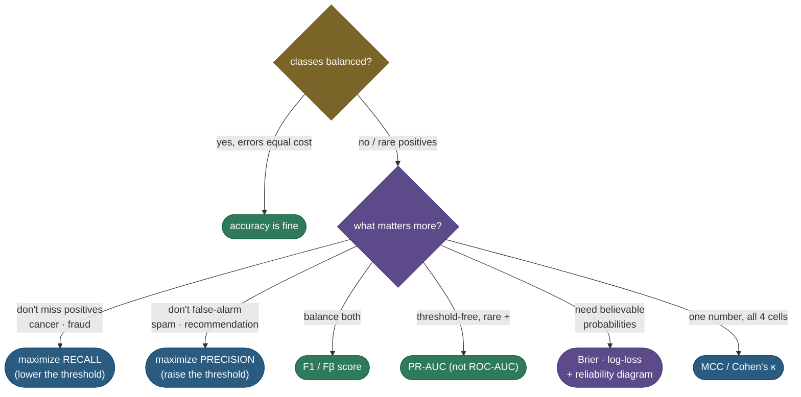

# Classification metrics: why accuracy lies, and what to use instead

Build a model to detect a disease that affects 1% of patients, predict "healthy" for *everyone*, and you'll score **99% accuracy** — while catching exactly zero sick patients. That single example is why "accuracy" is one of the most dangerous numbers in machine learning: on **imbalanced** data it can be sky-high and completely useless. Real evaluation starts from the **confusion matrix** — the four-way breakdown of right and wrong predictions — and the family of metrics built on it: **precision** (of the cases you flagged, how many were right), **recall** (of the cases that mattered, how many you caught), their harmonic mean **F1**, the threshold-free summaries **ROC-AUC** and **PR-AUC**, and — a level deeper — whether the model's probabilities are **calibrated** at all. Knowing the formulas is table stakes; the real skill, and what interviews probe, is choosing the *right* metric for the problem, because optimizing the wrong one ships a model that fails in exactly the way that matters.

I'm going to teach this the way I'd actually walk a teammate through "why is our fraud model 99% accurate and still useless?" We start by *feeling* the accuracy paradox, then build everything — precision, recall, specificity, F1, Fβ, the curves, calibration, MCC, kappa — from the **four cells of the confusion matrix**, deriving each result rather than stating it. By the end you'll be able to:

- read the **confusion matrix** and derive **precision, recall, specificity, and FPR** from it;
- explain the **precision–recall tradeoff** through the **threshold**, and pick the right side (cancer screening vs spam filtering);
- explain why **accuracy is misleading** under class imbalance, and *why* **F1 is a harmonic mean** (derive that it's dominated by the smaller term) and how **Fβ** weights recall β² as much as precision;
- define **ROC-AUC** and prove its **ranking interpretation** — that AUC equals the probability a random positive outranks a random negative (the Mann–Whitney U statistic) — **two ways that agree**;
- explain why **PR-AUC beats ROC-AUC under imbalance** (the FPR denominator is huge), per Davis & Goadrich;
- reason about the **operating point**, **multiclass averaging** (macro / micro / weighted — derive how each pools), **calibration** (Brier, log-loss, reliability), and **MCC / Cohen's kappa**;
- compute all of these from scratch and verify the AUC ranking identity in runnable code.

Intuition and pictures first, then the formulas (with sources), then runnable code that reproduces every number on the page.

> **Note:** every metric here answers a *different question* about the *same* predictions. Accuracy asks "how often am I right overall?" (misleading when classes are skewed); precision asks "when I say positive, am I right?"; recall asks "did I find the positives?"; F1 balances those two; AUC asks "do I *rank* positives above negatives?"; calibration asks "are my probabilities *believable as probabilities*?" There is no single best metric — only the one that matches what your application actually cares about.

---

## The problem: the accuracy paradox

**Accuracy** is the fraction of predictions that are correct:

$$\text{Accuracy} = \frac{TP + TN}{TP + TN + FP + FN}.$$

It's intuitive, and it's fine when classes are balanced and errors are equally costly. But when one class is rare — fraud, disease, defects, clicks, churn — accuracy is *dominated by the easy majority class*, and a model can ignore the rare class entirely while still looking excellent. Put numbers on it:

- 1% of transactions are fraud. The trivial rule "**never flag fraud**" is right on all 99% of legitimate transactions and wrong only on the 1% of fraud → **99% accuracy**, **0% of fraud caught**.
- 5% of patients have the disease. "**Everyone is healthy**" scores **95% accuracy** and provides exactly **zero** clinical value.

The metric is technically correct and practically worthless, because it rewards the model for being right about the easy cases you didn't need help with. Worse, accuracy *hides* the two kinds of mistake that matter — it lumps "missed a fraud" and "false-alarmed a clean transaction" into one undifferentiated error count, even though their costs are wildly different. You need numbers that look at the rare class **directly** and **separate the two error types** — and all of them come from the confusion matrix.

> **Gotcha:** a high accuracy number on its own is meaningless until you know the **base rate** (the positive class's prevalence). "92% accurate" is great on balanced data and terrible on a 95%-negative problem (where you beat it by predicting all-negative). Always ask for the class balance before believing an accuracy figure — this is the single most common interview red flag.

---

## The confusion matrix: the four cells everything is built from

Pick a positive class (the thing you're trying to detect: fraud, disease, spam). Every prediction then falls into exactly one of four cells, named by *(is the prediction right?) (what did it predict?)*:

- **True Positive (TP)** — predicted +, actually + (a hit).
- **False Positive (FP)** — predicted +, actually − (a false alarm; "Type I error").
- **False Negative (FN)** — predicted −, actually + (a miss; "Type II error").
- **True Negative (TN)** — predicted −, actually − (a correct all-clear).


Every metric on this page is just a **ratio of these four numbers**. The two most important slice the positives two different ways:

$$\text{Precision} = \frac{TP}{TP + FP} \qquad\qquad \text{Recall} = \frac{TP}{TP + FN}$$

- **Precision** — read *down the predicted-positive column*: of everything you **flagged** as positive, how many were actually positive? It penalizes **false alarms** (the FP in the denominator). Precision answers *"when I raise my hand, am I right?"*
- **Recall** (a.k.a. **sensitivity**, **true positive rate**) — read *across the actual-positive row*: of all the **real** positives, how many did you **catch**? It penalizes **misses** (the FN in the denominator). Recall answers *"of everything I should have caught, how much did I?"*

Two more come straight off the *negative* row and complete the picture:

$$\text{Specificity (TNR)} = \frac{TN}{TN + FP} \qquad\qquad \text{FPR} = \frac{FP}{FP + TN} = 1 - \text{Specificity}$$

- **Specificity** (true negative rate) — of the real negatives, how many did you correctly clear? It's recall *for the negative class*.
- **False Positive Rate (FPR)** — of the real negatives, how many did you wrongly flag? It's the complement of specificity, and it is the x-axis of the ROC curve below.

> **Note:** precision and recall **never look at the TN cell**. That's the whole reason they survive imbalance: on a 99%-negative problem the TN count is enormous and dominates accuracy, but precision and recall ignore it entirely and focus on the positives you actually care about. Specificity and FPR *do* use TN — which, foreshadowing, is exactly why ROC-AUC (built on FPR) gets flattered by imbalance while PR-AUC (built on precision) does not.

> **Gotcha:** "sensitivity = recall = TPR" and "1 − specificity = FPR" trip people up constantly because the same quantity wears three names depending on the field (medicine says sensitivity/specificity; ML says recall/FPR; signal detection says TPR/FPR). They're the same numbers. Learn the synonyms once so a question phrased in any vocabulary is the same question.

> *Where this comes from: precision/recall/F1 are derived cleanly from a text-classification angle in **Speech and Language Processing** (Jurafsky & Martin) Ch. 4, and tabulated in the scikit-learn user guide — references.*

---

## Intuition: the fishing-net analogy

If the formulas feel abstract, picture a fisher with a net trying to catch a particular species of fish in a lake. The net comes up holding *some* of those fish plus some bycatch (other species), and *some* of the target fish swam right past the net.

- **Precision** = of everything *in the net*, what fraction is the target species? A net that scoops the whole lake has terrible precision (mostly bycatch); a tiny, carefully-placed net has great precision.
- **Recall** = of *all the target fish in the lake*, what fraction did the net catch? The whole-lake net has perfect recall (it caught them all); the tiny net has poor recall (most got away).
- The **threshold** is **net size**. A bigger net → catch more target fish (recall ↑) but more bycatch too (precision ↓). A smaller net → cleaner catch (precision ↑) but you miss more (recall ↓). You can't maximize both with one net — exactly the precision–recall tradeoff.
- **F1** asks for a net that's good on *both* counts at once; **AUC** ignores net size entirely and asks a deeper question: *if you ranked every fish by how likely your sonar thinks it's the target, do the real targets float to the top of the list?*

That single picture — net contents (precision), fish caught of all that exist (recall), net size (threshold) — carries every metric on this page.

---

## The precision–recall tradeoff: the threshold is the dial

Here's the tension that makes metric choice non-trivial. A classifier doesn't output a hard label — it outputs a **score** (a probability or a logit), and *you* pick a **threshold** above which you call something positive. That threshold is a dial, and turning it trades precision against recall:

- **Lower the threshold** → you flag more cases → you catch more real positives (**recall ↑**) but also more false alarms (**precision ↓**).
- **Raise the threshold** → you flag only the most confident cases → fewer false alarms (**precision ↑**) but you let borderline positives slip through (**recall ↓**).

You can almost never have both at once, so you choose based on the **cost of each error type**:


The picture is the whole story: precision and recall move in **opposite directions** as you slide the threshold, and F1 (their balance, below) peaks somewhere in the middle. Which side you pick is a business decision, not a statistical one:

- **Cancer screening / fraud detection** → favour **recall**. A **false negative** (missing a real case) is catastrophic; a **false positive** just triggers a cheap follow-up test or a review. You deliberately *lower* the threshold, accepting worse precision to catch nearly everything.
- **Spam filtering / recommendations / search** → favour **precision**. A **false positive** (a real email lost to the spam folder, a bad recommendation surfaced) is what users punish you for; missing some spam is tolerable. You *raise* the threshold, accepting worse recall to avoid mistakes.

> **Tip:** the interview framing is always *"what's the cost of a false positive vs a false negative?"* If a **miss** is worse → optimize **recall** (lower the threshold). If a **false alarm** is worse → optimize **precision** (raise it). Naming the asymmetry, then naming the threshold move it implies, is the entire answer.

> **Gotcha:** the default threshold of **0.5 is almost never optimal** on imbalanced data. A model trained on 5%-positive data will rarely predict above 0.5 for *anything*, so a 0.5 cutoff buries recall. Tune the threshold on a validation set against your actual cost tradeoff (or the F1/Fβ peak) — don't inherit 0.5 from the library default.

---

## Balanced accuracy, G-mean, and Youden's J: balancing both classes

Precision/recall focus on the *positive* class. Sometimes you want a single number that weights **both classes' recall equally** regardless of imbalance — the natural fix to the accuracy paradox that *keeps* accuracy's "overall correctness" flavour. Three close relatives, all built from recall (sensitivity) and specificity:

- **Balanced accuracy** — the **mean of recall and specificity**: $\tfrac{1}{2}(\text{recall} + \text{specificity})$. Where plain accuracy is a *support-weighted* average of the two class recalls (so the majority dominates), balanced accuracy gives each class **equal weight**. The all-negative classifier — recall 0, specificity 1 — scores exactly **0.5**, the chance level, no matter how skewed the data. That's the accuracy paradox dissolved with one line.
- **Geometric mean (G-mean)** — $\sqrt{\text{recall} \times \text{specificity}}$. Like F1's harmonic mean, the *geometric* mean is **dominated by the smaller term**, so G-mean is high only when the model does well on *both* classes at once — popular in the imbalanced-learning literature for exactly that reason.
- **Youden's J statistic** — $J = \text{recall} + \text{specificity} - 1 = \text{TPR} - \text{FPR}$. It ranges from 0 (chance) to 1 (perfect) and has a lovely geometric meaning: **J is the vertical distance from the ROC curve up to the diagonal** at a given threshold, so the threshold that *maximizes J* is the point on the ROC curve furthest from the no-skill line — the classic "optimal cutoff" when false positives and false negatives are weighted equally.

> **Note:** notice the recurring trick across this whole page — whenever you want a single number that *refuses to be fooled by one strong axis*, you reach for a **non-arithmetic mean**: **harmonic** (F1, of precision & recall) or **geometric** (G-mean, of recall & specificity). Both are pulled toward their smaller input, which is precisely the property "don't let a great majority-class score hide a terrible minority-class score" demands. The plain arithmetic mean (accuracy, balanced accuracy) does not have it.

---

## F1 and Fβ: collapsing two numbers into one — and why *harmonic*

Often you want a single score that balances precision and recall (to rank models, to early-stop, to set the threshold). **F1** is their **harmonic mean**:

$$F_1 = 2 \cdot \frac{\text{precision} \cdot \text{recall}}{\text{precision} + \text{recall}} = \frac{2TP}{2TP + FP + FN}.$$

**Why the harmonic mean and not the simple average?** Because the harmonic mean is **dominated by the smaller of its inputs** — it refuses to let a great score on one axis paper over a terrible score on the other. Here's the algebra that proves it. Write $P$ and $R$ for precision and recall. The harmonic mean is the reciprocal of the average of the reciprocals:

$$F_1 = \frac{2}{\frac{1}{P} + \frac{1}{R}}.$$

If one term is tiny — say $R \to 0$ — then $\frac{1}{R} \to \infty$, so the denominator blows up and $F_1 \to 0$, **regardless of how large $P$ is**. The arithmetic mean has no such property: it just averages, so a lopsided model can hide behind one good number. Concretely, take a model with **precision 1.0 and recall 0.0** (it flags exactly one case, gets it right, and misses everything else):

| | precision | recall | arithmetic mean | F1 (harmonic) |
|---|---|---|---|---|
| lopsided model | 1.0 | 0.0 | **0.50** (looks okay) | **0.00** (correctly useless) |
| balanced model | 0.6 | 0.6 | 0.60 | **0.60** |

The arithmetic mean rates the lopsided model *almost as well* as the balanced one; F1 correctly calls it worthless. That intolerance of imbalance between P and R is precisely why F1 — not the average — is the standard one-number summary.

**Fβ: when you don't want them weighted equally.** F1 treats precision and recall as equally important. Often they aren't (this whole section is about asymmetric error costs). The generalized **Fβ score** lets you tilt the balance:

$$F_\beta = (1 + \beta^2) \cdot \frac{\text{precision} \cdot \text{recall}}{\beta^2 \cdot \text{precision} + \text{recall}}.$$

The parameter β controls the tilt, and the cleanest way to read it: **β says recall is β times as important as precision.** Look at where the weight lands — the $\beta^2$ multiplies *precision* in the denominator, so a *larger* β *down-weights* precision and *up-weights* recall. The standard choices:

- **β = 1** → F1, equal weight (the $\beta^2$ terms reduce to 1).
- **β = 2** → **F2**, recall weighted **4× (= β²)** as heavily as precision — for screening, where misses hurt.
- **β = 0.5** → **F0.5**, precision weighted **4× (= 1/β²)** as heavily as recall — for spam/recommendations, where false alarms hurt.

**Where the β² comes from (the derivation).** Fβ is a *weighted* harmonic mean of precision and recall. A weighted harmonic mean with weights $w_P$ on precision and $w_R$ on recall is

$$F = \frac{w_P + w_R}{\frac{w_P}{P} + \frac{w_R}{R}}.$$

Van Rijsbergen defined the weighting so that the metric is at a point where the user "attaches β times as much importance to recall as precision." Working that condition through (set $w_P = 1$, $w_R = \beta^2$) gives

$$F_\beta = \frac{1 + \beta^2}{\frac{1}{P} + \frac{\beta^2}{R}} = (1+\beta^2)\,\frac{P\cdot R}{\beta^2 P + R}.$$

So the **weight on recall is β², not β** — the "β times as important" is stated in terms of a tradeoff ratio whose closed form lands on the *square*. That's why F2 weights recall **4×** and F0.5 weights precision **4×**. You don't need to reproduce van Rijsbergen on the spot, but knowing the weight is $\beta^2$ — and *why* (it's a weighted harmonic mean) — is the strong answer to the favourite follow-up "why β-squared?".

> **Note:** the quick mnemonic, in case the derivation slips: **β > 1 leans recall, β < 1 leans precision, and the weighting is β² not β.** F2 for screening (catch everything), F0.5 for spam (don't false-alarm).

> **Gotcha:** F1 (and any Fβ) **ignores true negatives entirely** — it's built only from TP, FP, FN. That's a feature on imbalanced data (it can't be inflated by the easy majority), but it also means F1 is **not symmetric between the classes**: relabel which class is "positive" and you get a different F1. If both classes matter equally, report **macro-F1** (below) or **MCC** (which *does* use all four cells), not a single positive-class F1.

We compute F1, F2, and F0.5 on a real matrix in **Worked example 3** below.

---

## ROC-AUC and PR-AUC: threshold-free summaries

Picking one threshold throws away information — it tells you about one operating point and nothing about the others. **Curves** fix that by sweeping *every* threshold and tracing how the metrics move.

**The ROC curve** plots **True Positive Rate (recall)** on the y-axis against **False Positive Rate** on the x-axis, as the threshold slides from +∞ (flag nothing, bottom-left) down to −∞ (flag everything, top-right). A perfect model hugs the top-left corner (TPR=1, FPR=0); a random model sits on the diagonal. **ROC-AUC** is the area under that curve, from 0.5 (random) to 1.0 (perfect).

AUC has a beautiful, exact interpretation that we will *prove* below:

> **ROC-AUC = the probability that a uniformly random positive is scored higher than a uniformly random negative.**

It is a pure measure of **ranking quality** — how well the model *orders* positives above negatives — with no threshold anywhere in it. This is the same quantity as the normalized **Mann–Whitney U statistic** from non-parametric statistics, which is why it can be computed from ranks (we show both formulas agree, exactly, in code).

**The PR curve** plots **Precision** (y) against **Recall** (x) across the same threshold sweep, and **PR-AUC** (a.k.a. average precision) is the area under *it*. Its no-skill baseline is the horizontal line at the positive rate (a random model with precision = prevalence), not the 0.5 diagonal.

The two curves can tell **completely different stories** on the same predictions when the data is imbalanced:


This is the crucial lesson, and it is *derivable* from the formulas. **ROC-AUC can look great on imbalanced data while the model is actually weak.** Why? Look at the FPR denominator: $\text{FPR} = FP / (FP + TN)$. When negatives are 95% of the data, $TN$ is **huge**, so even a large number of false positives barely moves FPR — the ROC curve stays pinned near the left edge and the area stays high. The **PR curve uses precision**, $TP / (TP + FP)$, whose denominator is *just the cases you flagged* — so those same false positives crater precision and the curve collapses. PR tells the truth that ROC hides.

The mechanism in one line: **ROC's x-axis (FPR) is diluted by the easy negatives; PR's y-axis (precision) is not.** Davis & Goadrich (2006) made this rigorous — a curve that dominates in ROC space dominates in PR space and vice versa, but the *visual scale* of PR exposes weakness that ROC's huge-denominator FPR conceals. **For rare positives, prefer PR-AUC.**

> **Tip:** the clean interview answer: *"On imbalanced data, ROC-AUC is optimistic because FPR's denominator includes all the easy true negatives, so false positives barely register. PR-AUC uses precision, whose denominator is only the predicted-positives, so it actually feels the false alarms. Report PR-AUC (average precision) for rare-positive problems."*

> **Gotcha:** **ROC-AUC is prevalence-invariant; PR-AUC is not.** That cuts both ways. ROC-AUC's stability across base rates is genuinely useful when you want to compare a model's *intrinsic ranking ability* independent of the deployment class balance. But it's a liability when you need to know how the model will behave *at your actual prevalence* — there, PR-AUC (which shifts its baseline with the positive rate) is the honest summary. Know which question you're answering.

> *Where this comes from: the ROC/AUC tutorial is **An Introduction to ROC Analysis** (Fawcett 2006); the equivalence of AUC and the Mann–Whitney U / Wilcoxon statistic is classical (Hanley & McNeil 1982); the result that **PR curves are more informative than ROC under class imbalance** is **The Relationship Between Precision-Recall and ROC Curves** (Davis & Goadrich 2006) — references.*

---

## Deriving the AUC ranking identity

This identity is asked often enough — *"what does AUC actually mean?"* — that it's worth seeing *why* it's true, two ways, so you can reconstruct it on a whiteboard.

**Way 1 — geometric (area = average TPR over the negatives).** Sort all examples by score, descending, and walk down the list. Each time you pass a **negative**, you take one step **right** along the FPR axis (of width $1/N$, where $N$ is the negative count). Each time you pass a **positive**, you step **up** along TPR (height $1/P$). The area under the ROC curve is the sum, over each negative's rightward step, of the TPR height at that point. But the TPR height when you're at a given negative is exactly *the fraction of positives already seen* — i.e. the fraction of positives that scored **higher** than that negative. Averaging that fraction over all negatives gives:

$$\text{AUC} = \frac{1}{P \cdot N}\sum_{i \in \text{pos}}\sum_{j \in \text{neg}} \mathbf{1}[\,s_i > s_j\,] = \Pr(s_{\text{pos}} > s_{\text{neg}}).$$

That double sum **counts the ordered (positive, negative) pairs in which the positive outscores the negative**, divided by the total number of such pairs $P \cdot N$ — which is, by definition, the probability that a random positive outranks a random negative.

**Way 2 — the rank formula (Mann–Whitney U).** You don't need a double loop. Rank all $P+N$ scores from 1 (lowest) to $P+N$ (highest). Let $\sum R_{\text{pos}}$ be the sum of the ranks held by the positives. Each positive's rank counts how many examples (positive *or* negative) score at or below it; subtracting off the positives-below-positives bookkeeping term $\frac{P(P+1)}{2}$ leaves exactly the count of (positive, negative) pairs the positives win:

$$\text{AUC} = \frac{\sum_{i\in\text{pos}} R_i - \frac{P(P+1)}{2}}{P \cdot N}.$$

This is the normalized **Mann–Whitney U** statistic. The two formulas compute the *same number* by construction — the rank formula is just the pair-count done in $O(n \log n)$ (a sort) instead of $O(P \cdot N)$ (all pairs). The code below evaluates both on the same data and they agree to the digit (**0.8130**), which is the cleanest possible proof of the ranking interpretation.

**Ties.** Strictly, a tie ($s_i = s_j$ between a positive and a negative) should count as **half a win** — the pair-count uses $\mathbf{1}[s_i > s_j] + \tfrac12\,\mathbf{1}[s_i = s_j]$, and the rank formula handles it by assigning **average ranks** to tied scores. This is exactly why a trivial all-equal-scores model gets AUC = 0.5 (every pair is a tie, each worth ½): a model with no discrimination sits at chance, as it should. Our example uses continuous scores with no ties, so the strict-`>` version and the half-credit version coincide.

> **Note:** because AUC is built purely from the *ordering* of scores, it is **invariant to any monotonic transform** of those scores — squash them through a sigmoid, take logs, add a constant: AUC doesn't move. This is the same fact as "AUC measures discrimination, not calibration" (the calibration section), and it's why a model can have a perfect AUC of 1.0 while emitting wildly miscalibrated probabilities.

---

## How the curves are actually built (and how PR-AUC is computed)

Both curves come from **one sort** of the scores, descending, then a single walk down the list — this is worth seeing once, because it demystifies the area computations and explains a subtle PR-AUC quirk.

Sort all $n$ examples by score, highest first. Now imagine sweeping the threshold from "above everything" (flag nothing) down past each example in turn. Each example you cross becomes "predicted positive," so:

- crossing a **true positive** increments $TP$ → TPR and recall step **up**;
- crossing a **false positive** increments $FP$ → FPR steps **right**, and precision dips.

Running cumulative sums of TP and FP down the sorted list give you $TPR = TP/P$, $FPR = FP/N$, and $\text{precision} = TP/(TP+FP)$ at *every* threshold in one pass — that's exactly the `_curves` routine in the diagram generator. The **ROC-AUC** is then the trapezoidal area under (FPR, TPR), and the curves figure was drawn precisely this way.

**PR-AUC has a wrinkle.** The PR curve is *not* monotonic — precision can jump up and down as recall increases (cross a TP and precision rises; cross an FP and it drops), so the curve is jagged. Two ways to summarize its area:

- **Average Precision (AP)** — a weighted sum, $\text{AP} = \sum_k (R_k - R_{k-1})\, P_k$, treating the curve as a step function (precision held constant between recall increments). This is scikit-learn's `average_precision_score` and the recommended PR summary — it does **not** interpolate optimistically.
- **Trapezoidal PR-AUC** — straight trapezoid integration of the jagged curve. It can be *optimistically biased* because linear interpolation between PR points doesn't correspond to any achievable classifier (Davis & Goadrich show the correct PR interpolation is non-linear). Prefer **AP** unless you have a reason not to.

> **Gotcha:** "PR-AUC" is ambiguous — it can mean **average precision** (the step-sum, what you usually want) or **trapezoidal area** (slightly optimistic). When you report it, say which, and prefer **average precision** (`average_precision_score`). This nuance — that naive trapezoid interpolation in PR space overstates performance — is a classic Davis & Goadrich follow-up.

---

## Choosing the metric

Putting the decision logic on one diagram — this is the flowchart I run in my head before reporting any classification number:



> **See it interactively:** [MLU-Explain: ROC & AUC](https://mlu-explain.github.io/roc-auc/) and [Precision & Recall](https://mlu-explain.github.io/precision-recall/) let you drag the threshold and watch the confusion matrix, the curves, and every metric respond live — the best way to *feel* the tradeoff before you trust the formulas.

---

## Multiclass averaging: macro, micro, weighted

With more than two classes there's no single positive class, so you compute precision/recall **per class** (treating each class as positive vs all the rest — "one-vs-rest") and then **pool** them into one number. The three pooling strategies differ in *what they pool*, and the choice changes the story dramatically under imbalance.

- **Macro** — compute the metric *per class*, then take the **unweighted mean** across classes. Every class counts equally, no matter how rare. A class with 10 examples and a class with 10,000 each get a $1/K$ vote. This **surfaces poor performance on rare classes** — they can't hide.

  $$\text{macro-}P = \frac{1}{K}\sum_{k=1}^{K} P_k$$

- **Micro** — pool the raw TP/FP/FN counts across *all* classes first, then compute one global metric. Because the pooled counts are dominated by the frequent classes, micro is dominated by them too. For single-label multiclass, **micro-precision = micro-recall = accuracy** (every example contributes one TP-or-error to the global pool).

  $$\text{micro-}P = \frac{\sum_k TP_k}{\sum_k (TP_k + FP_k)}$$

- **Weighted** — like macro, but each class's metric is weighted by its **support** (its number of true instances). It's a compromise: it accounts for class sizes (unlike macro) but still computes per-class metrics first (unlike micro). It **also tends to hide rare-class failure**, because the rare class gets a small weight.

  $$\text{weighted-}P = \frac{\sum_k n_k \, P_k}{\sum_k n_k}, \qquad n_k = \text{support of class } k$$

The divergence is the whole point. **Worked example 4** below runs three classes where the model is great on the common class and terrible on a rare one; macro-recall comes out at **0.57** (it *feels* the rare-class failure) while micro-recall is **0.74** (it doesn't). If you report only micro/accuracy on an imbalanced multiclass problem, you can ship a model that's silently failing every minority class.

> **Tip:** the rule of thumb: **macro** when every class matters equally (especially rare ones you care about — medical sub-types, minority intents); **micro/accuracy** when you care about overall correctness and frequent classes dominate the use case; **weighted** when you want a single headline number that respects class sizes. When in doubt on imbalanced data, *report macro* — it's the one that can't be gamed by the majority.

**Why micro = accuracy (single-label).** It's a one-line argument worth keeping. In single-label multiclass, every example has exactly one true class and gets exactly one predicted class. If the prediction is right, it's a TP for that class and contributes nothing else; if it's wrong, it's simultaneously **one FP** (for the class it wrongly predicted) and **one FN** (for the class it should have predicted). So summed over all classes, $\sum_k FP_k = \sum_k FN_k = (\text{number of mistakes})$, and $\sum_k TP_k = (\text{number correct})$. Then micro-precision $= \frac{\sum TP}{\sum TP + \sum FP} = \frac{\text{correct}}{\text{correct} + \text{mistakes}} = \text{accuracy}$, and identically micro-recall = accuracy, so micro-F1 = accuracy. The symmetry ($\sum FP = \sum FN$) is exactly why all three collapse to one number.

> **Gotcha:** "micro-F1 = accuracy" only holds for **single-label** classification (each example has exactly one true class). In **multi-label** settings (an example can belong to several classes at once) the pooled counts differ ($\sum FP \neq \sum FN$ in general) and micro-F1 ≠ accuracy — don't carry the shortcut across that boundary.

---

## Calibration: discrimination is not the whole story

Everything so far measures **discrimination** — can the model *separate* positives from negatives (rank them, threshold them)? But a probability has a second job: **being believable as a probability.** If your model says "0.8" for a batch of cases, do roughly **80% of them** turn out positive? A model can have flawless discrimination (AUC = 1.0) and still be badly **miscalibrated** — its "0.8" might empirically mean 0.55. For anything where the *number* matters (expected-value decisions, risk thresholds, downstream cost models, showing a probability to a doctor), calibration matters as much as ranking.

The picture is a **reliability diagram**: bin predictions by their stated probability and plot, per bin, the **observed frequency** of positives against the **mean predicted probability**. Perfect calibration is the diagonal.


The two models in the figure have **identical AUC** (same ranking — the red one is just a monotonic stretch of the green one's scores), yet the red one is over-confident: when it says 0.9, the true rate is lower; when it says 0.1, the true rate is higher. Discrimination can't see this; calibration metrics can. Three quantify it:

- **Brier score** — the mean squared error between predicted probability $p_i$ and the 0/1 outcome $y_i$:

  $$\text{Brier} = \frac{1}{n}\sum_{i=1}^{n}(p_i - y_i)^2.$$

  Lower is better (0 is perfect). It's a **proper scoring rule** — it's minimized *in expectation* only by reporting the true probabilities, so you can't game it by being over-confident. It also **decomposes** (Murphy) into three interpretable pieces:

  $$\text{Brier} = \underbrace{\text{uncertainty}}_{\bar y(1-\bar y)} - \underbrace{\text{resolution}}_{\text{how much bins differ from }\bar y} + \underbrace{\text{reliability}}_{\text{gap to the diagonal}}.$$

  **Reliability** is the calibration error (the gap to the diagonal — what the reliability diagram shows); **resolution** is discrimination (do your bins separate?); **uncertainty** is the irreducible base-rate variance. So a single Brier score silently mixes calibration *and* discrimination — which is why you still plot the reliability diagram to see *which* part is bad.

- **Log-loss (cross-entropy)** — $-\frac{1}{n}\sum_i [\,y_i \log p_i + (1-y_i)\log(1-p_i)\,]$. Also a **strictly proper** scoring rule, but it punishes *confident-and-wrong* far more harshly than Brier (the $\log$ goes to $\infty$ as a confident prediction is contradicted). This is exactly why it's the **training loss** for logistic regression and neural classifiers: it strongly rewards well-calibrated confidence and savagely penalizes confident mistakes.

- **Expected Calibration Error (ECE)** — the single-number summary of "how far off the diagonal is the reliability curve." Bin the predictions into $M$ bins by confidence; in each bin compare the **mean predicted probability** (confidence) to the **observed positive rate** (accuracy); ECE is the **support-weighted average** of those gaps:

  $$\text{ECE} = \sum_{m=1}^{M} \frac{|B_m|}{n}\,\big|\,\text{acc}(B_m) - \text{conf}(B_m)\,\big|.$$

  ECE = 0 means every bin lands on the diagonal. It's the standard headline number for neural-net calibration (modern deep nets are notoriously over-confident, with large ECE — Guo et al. 2017), and the reliability diagram above is its picture: the green curve has near-zero ECE, the red curve's S-shape has a large one.

> **Note:** **discrimination (AUC) and calibration are orthogonal.** AUC only depends on the *order* of scores (it's invariant to monotonic transforms), so it is completely blind to calibration; Brier/log-loss depend on the *values*, so they feel it. A model can be (good AUC, bad calibration), (bad AUC, good calibration — e.g. always predicting the base rate), or any combination. **Report both** when probabilities will be used as probabilities. In **Worked example** terms: the code below shows two models with the *same* AUC (0.834) but Brier 0.166 vs 0.176 and log-loss 0.499 vs 0.556 — the metrics that see the values catch the over-confidence the AUC misses.

> **Tip:** if a model ranks well (good AUC) but is miscalibrated, you usually **don't retrain** — you **recalibrate** the scores with a cheap post-hoc map fit on a validation set: **Platt scaling** (fit a logistic on the scores) or **isotonic regression** (a monotonic step function, more flexible, needs more data). Both *preserve the ranking* (so AUC is unchanged) while bending the probabilities back onto the diagonal. For modern neural nets, **temperature scaling** (divide logits by a single learned scalar T) is the standard one-parameter fix (Guo et al. 2017).

---

## MCC and Cohen's kappa: single numbers that respect imbalance

F1 is the popular one-number summary, but it ignores TN and is asymmetric between classes. Two alternatives use **all four cells** and explicitly correct for chance — making them more trustworthy single numbers on imbalanced data.

**Matthews Correlation Coefficient (MCC)** is, literally, the **Pearson correlation between the predicted and actual binary labels**:

$$\text{MCC} = \frac{TP\cdot TN - FP\cdot FN}{\sqrt{(TP+FP)(TP+FN)(TN+FP)(TN+FN)}}.$$

It ranges from **−1** (perfectly wrong) through **0** (no better than random) to **+1** (perfect). Because it multiplies the two diagonal cells against the two off-diagonal cells and normalizes by all four marginals, it's **high only when the model does well on both classes at once** — you can't earn a good MCC by acing the majority and ignoring the minority. The all-negative classifier that scores 90–99% accuracy gets **MCC = 0** (its numerator $TP\cdot TN - FP\cdot FN = 0\cdot TN - 0\cdot FN = 0$), correctly flagging it as worthless. That single property — collapsing the accuracy paradox to a 0 — is why many practitioners reach for MCC as the default binary summary on skewed data.

**Cohen's kappa** measures agreement between predictions and labels **corrected for the agreement you'd expect by chance**:

$$\kappa = \frac{p_o - p_e}{1 - p_e},$$

where $p_o$ is the observed accuracy and $p_e$ is the accuracy a random classifier with the same marginals would get by luck. It answers *"how much better than coin-flipping-with-the-right-base-rate is this?"* — so a 95%-accurate all-negative classifier (whose $p_e$ is also ~95%) scores $\kappa \approx 0$.

> **Note:** in **Worked example 4's** spam matrix (TP=80, FP=30, FN=20, TN=870), accuracy is a rosy **0.95**, but **MCC = 0.735** and **κ = 0.734** — both far lower, because they discount the 870 easy true negatives and the chance agreement those imply. When accuracy and MCC/kappa diverge that much, **trust MCC/kappa** — the gap *is* the imbalance illusion, quantified.

> **Tip:** if an interviewer asks "you have one number to report on an imbalanced binary problem — which?", a strong answer is **MCC** (or **PR-AUC** if you're threshold-free): name it, and say *why* (uses all four cells, corrects for chance, can't be fooled by predicting the majority). It signals you've been burned by the accuracy paradox in practice.

---

## How the metrics relate: one map

It helps to see the whole family as **different ratios of the same four cells**, plus a couple of cross-field aliases. Which cells a metric uses tells you instantly how it behaves under imbalance:

| metric | formula | cells used | uses TN? | robust to imbalance? |
|---|---|---|---|---|
| Accuracy | $(TP+TN)/n$ | all 4 | yes | **no** — dominated by TN |
| Precision | $TP/(TP+FP)$ | TP, FP | no | yes |
| Recall = Sensitivity = TPR | $TP/(TP+FN)$ | TP, FN | no | yes |
| Specificity = TNR | $TN/(TN+FP)$ | TN, FP | yes | n/a (negative-class recall) |
| FPR | $FP/(FP+TN)$ | FP, TN | yes | — (diluted by TN) |
| F1 | $2TP/(2TP+FP+FN)$ | TP, FP, FN | **no** | yes |
| Balanced accuracy | $\tfrac12(\text{TPR}+\text{TNR})$ | all 4 | yes | yes (equal class weight) |
| MCC | (correlation) | **all 4** | yes | yes (best single number) |
| ROC-AUC | rank-based | ordering | yes (via FPR) | prevalence-*invariant* |
| PR-AUC | rank-based | TP, FP, FN | no | yes (shifts with base rate) |

Two equivalences worth knowing because they appear under other names:

- **F1 = Dice coefficient.** The F1 score is *identical* to the **Dice–Sørensen coefficient** used in image segmentation ($2|A\cap B|/(|A|+|B|)$): treat the predicted-positive set and the actual-positive set as $A$ and $B$, and $2TP/(2TP+FP+FN)$ is exactly the Dice overlap. Segmentation papers reporting "Dice" and classification papers reporting "F1" are computing the same thing. (The closely related **Jaccard / IoU** = $TP/(TP+FP+FN)$ is the same overlap without the doubling — monotonically related to Dice.)
- **Recall, sensitivity, TPR, and hit rate** are four names for one number; **FPR, fall-out, and (1 − specificity)** are three names for another. The map collapses a lot of vocabulary onto a few cells.

> **Note:** the single most useful reading of this table: **the "uses TN?" column predicts imbalance behaviour.** Metrics that lean on the TN cell (accuracy, FPR, and thus ROC-AUC's x-axis) get *diluted* by a large easy-negative majority; metrics that avoid TN (precision, recall, F1, PR-AUC) stay honest. MCC and balanced accuracy use all four cells but *normalize* by the class marginals, so they stay honest too. That one column is why the rare-positive recommendation is always "PR-AUC, F1, MCC — not accuracy or ROC-AUC."

---

## Worked example 1: precision, recall, F1, accuracy by hand

Start with the simplest case — read everything off one confusion matrix. A spam classifier on **1,000 emails (100 are truly spam)** flags **110** as spam, of which **80** are really spam. That fixes all four cells (these are the figure's numbers): $TP = 80,\ FP = 30,\ FN = 20,\ TN = 870$.

- **Precision** $= \dfrac{TP}{TP+FP} = \dfrac{80}{80+30} = \dfrac{80}{110} = \mathbf{0.727}$ — of the 110 emails flagged, ~73% were really spam.
- **Recall** $= \dfrac{TP}{TP+FN} = \dfrac{80}{80+20} = \dfrac{80}{100} = \mathbf{0.800}$ — caught 80% of all spam.
- **F1** $= 2\cdot\dfrac{0.727 \cdot 0.800}{0.727 + 0.800} = \dfrac{2\cdot 0.582}{1.527} = \mathbf{0.762}$ — note it sits *below* the arithmetic mean (0.764), pulled toward the smaller of the two values (precision).
- **Specificity** $= \dfrac{TN}{TN+FP} = \dfrac{870}{870+30} = \mathbf{0.967}$ — correctly cleared 97% of legit mail.
- **Accuracy** $= \dfrac{TP+TN}{1000} = \dfrac{80+870}{1000} = \mathbf{0.950}$ — high, but it's **mostly the 870 easy true negatives**; it hides the 20 missed spams and 30 false alarms. Precision/recall tell the real story.

This is the move to internalize: **the same matrix gives a 0.95 accuracy and a 0.73 precision** — the gap is the imbalance, and the per-class metrics are where the truth lives.

---

## Worked example 2: AUC as ranking, computed two ways

Now verify the ranking identity *numerically* on the 5%-positive dataset (50 positives, 950 negatives, scores drawn so positives average higher). We compute AUC two independent ways and check they match:

- **Pair-count** — over all $50 \times 950 = 47{,}500$ (positive, negative) pairs, count the fraction where the positive's score exceeds the negative's: this is the literal $\Pr(s_{\text{pos}} > s_{\text{neg}})$.
- **Rank formula** — rank all 1,000 scores, sum the positives' ranks, subtract $\frac{P(P+1)}{2} = \frac{50\cdot 51}{2} = 1275$, divide by $P\cdot N = 47{,}500$.

The code below returns **0.8130 from both** — exact agreement, confirming the two derivations describe one number. The geometric area under the ROC curve, the pair-counting probability, and the Mann–Whitney rank statistic are **the same thing**.

---

## Worked example 3: Fβ at β = 2 vs β = 0.5

Take the same spam matrix from Example 1 ($P = 0.727$, $R = 0.800$) and ask: how does the single-number summary shift when we *care more about one axis*? Plug into $F_\beta = (1+\beta^2)\frac{PR}{\beta^2 P + R}$:

- **F1** (β = 1): $\dfrac{2\cdot 0.727\cdot 0.800}{0.727 + 0.800} = \mathbf{0.762}$ — the balanced number.
- **F2** (β = 2, recall weighted 4×): $\dfrac{5\cdot 0.727\cdot 0.800}{4\cdot 0.727 + 0.800} = \mathbf{0.784}$ — **rises toward recall (0.800)**, because recall is the higher of the two and β > 1 leans on it. This is the screening number.
- **F0.5** (β = 0.5, precision weighted 4×): $\dfrac{1.25\cdot 0.727\cdot 0.800}{0.25\cdot 0.727 + 0.800} = \mathbf{0.741}$ — **falls toward precision (0.727)**, the lower value, because β < 1 leans on precision. This is the spam-filter number.

The pattern to remember: **Fβ slides between precision and recall, landing nearer whichever axis β favours.** F2 > F1 > F0.5 here precisely because recall (0.800) > precision (0.727), so tilting toward recall raises the score and tilting toward precision lowers it. The code confirms 0.784 / 0.762 / 0.741.

---

## Worked example 4: macro vs micro on a 3-class problem

The most instructive example — show how the *averaging choice* hides or reveals rare-class failure. Three classes with one-vs-rest counts $(TP, FP, FN)$, where the model is strong on common class **A**, decent on **B**, and **bad on the rare class C** (only 20 true Cs exist, it catches 3):

| class | TP | FP | FN | precision | recall |
|---|---|---|---|---|---|
| A (common) | 90 | 10 | 10 | 0.900 | 0.900 |
| B (medium) | 40 | 15 | 20 | 0.727 | 0.667 |
| C (rare)   | 3  | 2  | 17 | 0.600 | **0.150** |

Now pool three ways:

- **Macro recall** $= \frac{1}{3}(0.900 + 0.667 + 0.150) = \mathbf{0.572}$. The disastrous **0.150** on class C drags the average down — *the rare-class failure is visible.*
- **Micro recall** $= \frac{\sum TP}{\sum (TP+FN)} = \frac{90+40+3}{(90+10)+(40+20)+(3+17)} = \frac{133}{180} = \mathbf{0.739}$. The 133 pooled hits are dominated by the 90 from class A — *the failure on C is invisible.*
- **Weighted recall** (by support $n_A{=}100, n_B{=}60, n_C{=}20$) $= \frac{100\cdot 0.900 + 60\cdot 0.667 + 20\cdot 0.150}{180} = \mathbf{0.739}$ — same as micro here, and like micro it buries C under its tiny weight.

The headline: **macro (0.572) and micro (0.739) disagree by 17 points, and macro is the honest one** when you care about the rare class. Report micro/accuracy on this problem and you'd never know class C is broken. The code reproduces all three.

---

## Choosing the operating threshold: a playbook

Curves and AUC summarize *every* threshold, but to *ship* a classifier you must pick **one** — the operating point that turns scores into decisions. Here's the reasoning I actually run, end to end:

1. **Hold out a calibration/validation split** the model never trained on. Thresholds tuned on the training set are optimistic; pick the cutoff on fresh data.
2. **Decide the objective from the costs.** Three common cases:
   - *Equal error costs, balanced-ish data* → maximize **Youden's J** (TPR − FPR), the point on the ROC curve furthest from the diagonal, or maximize **balanced accuracy**.
   - *Want one balanced number on the positive class* → maximize **F1** (the peak of the green curve in the threshold-sweep figure).
   - *Asymmetric costs* ($c_{FP}$ for a false alarm, $c_{FN}$ for a miss) → minimize **total expected cost** $c_{FP}\!\cdot\!FP + c_{FN}\!\cdot\!FN$ over the threshold. The optimal cutoff satisfies a likelihood-ratio condition; in practice you just sweep thresholds and pick the cost-minimizing one.
3. **Or fix one axis by a hard requirement.** Many real systems specify *"recall must be ≥ 0.95"* (catch 95% of fraud) or *"precision must be ≥ 0.90"* (≤ 10% of flagged emails may be real) — then pick the threshold that meets the constraint and is best on the other axis.
4. **Lock the threshold and re-measure on a final test set**, reporting the confusion matrix at that operating point alongside the threshold-free AUC/PR-AUC. Both matter: the curve shows the model's *potential*, the operating point shows what you *deployed*.

> **Tip:** a frequent interview prompt is *"your fraud model has AUC 0.95 — what threshold do you deploy?"* The trap is that **AUC says nothing about the threshold** (it's threshold-free by construction). The right answer names the cost asymmetry, then the rule: maximize F1, or hit a recall floor, or minimize expected cost — *on a held-out set* — and re-measure. Saying "AUC is great so we're done" misses the entire deployment step.

> **Gotcha:** **class weighting / resampling changes the threshold, not the metric you should report.** Training with `class_weight="balanced"` or oversampling the minority shifts the score distribution (so the *useful* threshold moves, often well below 0.5), but you still evaluate with precision/recall/PR-AUC at the operating point. Don't let resampling during training quietly inflate your *reported* metrics by also resampling the test set — evaluate on the **real** class distribution.

---

## Common metric mistakes (the ones that ship broken models)

Like most evaluation machinery, this is where a surprising number of "the offline numbers looked great but production was a disaster" stories begin. The recurring mistakes, worth knowing before they bite:

- **Reporting accuracy on imbalanced data.** The original sin. 99% accuracy on 1%-positive data is the all-negative classifier. Always pair accuracy with the base rate, and prefer precision/recall/PR-AUC/MCC.
- **Tuning the threshold on the test set.** Picking the F1-maximizing cutoff on the same data you report on leaks information and inflates the number. Tune on validation, report on a separate test set.
- **Using ROC-AUC for a needle-in-a-haystack problem.** At 0.1% positives, even a model flagging 100× too many false positives keeps a great ROC-AUC (FPR barely moves), while precision is hopeless. Use **PR-AUC / average precision**.
- **Comparing F1 across datasets with different base rates.** F1 depends on prevalence (its denominator includes FP and FN, which scale with the class mix), so "our F1 beats the paper's" is meaningless unless the positive rates match. AUC is more comparable across base rates; MCC is more robust than F1.
- **Ignoring calibration when the probability is used downstream.** A model with great AUC but over-confident probabilities will systematically over- or under-bid in any expected-value decision. Check the reliability diagram; recalibrate if needed.
- **Resampling the test set.** Oversampling the minority is a *training* trick to fix the learning signal — do it on the **train** split only. Evaluating on a rebalanced test set reports metrics for a world that doesn't exist.
- **Averaging metrics the wrong way across folds.** Compute the confusion matrix per fold and aggregate counts (or average the metric), but don't average ratios of tiny denominators naively — a fold with 2 positives can produce a wild precision that distorts the mean.

---

## Code: the accuracy trap, the AUC identity, and calibration

Everything above, runnable. It reproduces the accuracy trap, the AUC ranking identity computed two ways, Fβ, and the discrimination-vs-calibration gap:

```python
"""Classification metrics on imbalanced data: accuracy trap, AUC as ranking, calibration.
Verified on Python 3.12, CPU (numpy)."""
import numpy as np
rng = np.random.default_rng(0)
Npos, Nneg = 50, 950                                       # 5% positive
scores = np.concatenate([rng.normal(1.0, 1.0, Npos), rng.normal(0.0, 1.0, Nneg)])
y = np.concatenate([np.ones(Npos), np.zeros(Nneg)]).astype(int)

print(f"'always predict negative' accuracy = {(y==0).mean():.2%}  (recall = 0, useless)")

pred = (scores > 0.5).astype(int)                          # threshold the scores
TP = int(((pred==1)&(y==1)).sum()); FP = int(((pred==1)&(y==0)).sum())
FN = int(((pred==0)&(y==1)).sum()); TN = int(((pred==0)&(y==0)).sum())
precision, recall = TP/(TP+FP), TP/(TP+FN)
print(f"at thr 0.5: precision={precision:.3f}  recall={recall:.3f}  "
      f"F1={2*precision*recall/(precision+recall):.3f}  accuracy={(TP+TN)/len(y):.3f}")

# --- AUC = P(random positive scored above random negative): pair-count vs rank formula ---
pos, neg = scores[y==1], scores[y==0]
auc_pairs = (pos[:,None] > neg[None,:]).sum() / (len(pos)*len(neg))     # all P*N pairs
ranks = scores.argsort().argsort() + 1                                  # Mann-Whitney U
auc_rank = (ranks[y==1].sum() - len(pos)*(len(pos)+1)/2) / (len(pos)*len(neg))
print(f"ROC-AUC: pair-count={auc_pairs:.4f}  rank-formula={auc_rank:.4f}  match={np.isclose(auc_pairs,auc_rank)}")

# --- Fbeta on the spam matrix: beta>1 leans recall, beta<1 leans precision ---
P, R = 80/110, 80/100
fbeta = lambda P,R,b: (1+b**2)*P*R / (b**2*P + R)
print(f"spam matrix P={P:.3f} R={R:.3f}: F1={fbeta(P,R,1):.3f}  F2={fbeta(P,R,2):.3f}  F0.5={fbeta(P,R,0.5):.3f}")

# --- discrimination vs calibration: SAME ranking, different probabilities ---
pt = rng.uniform(0,1,20000); yb = (rng.uniform(0,1,20000) < pt).astype(int)
po = 1/(1+np.exp(-1.9*np.log((pt+1e-9)/(1-pt+1e-9))))      # over-confident: monotone stretch
brier = lambda p: np.mean((p-yb)**2)
auc = lambda p: ((p.argsort().argsort()+1)[yb==1].sum() - yb.sum()*(yb.sum()+1)/2)/(yb.sum()*(len(yb)-yb.sum()))
print(f"calibrated   : AUC={auc(pt):.3f}  Brier={brier(pt):.3f}")
print(f"over-confident: AUC={auc(po):.3f}  Brier={brier(po):.3f}   (same AUC, worse Brier)")
```

Output:

```
'always predict negative' accuracy = 95.00%  (recall = 0, useless)
at thr 0.5: precision=0.117  recall=0.720  F1=0.201  accuracy=0.713
ROC-AUC: pair-count=0.8130  rank-formula=0.8130  match=True
spam matrix P=0.727 R=0.800: F1=0.762  F2=0.784  F0.5=0.741
calibrated   : AUC=0.834  Brier=0.166
over-confident: AUC=0.834  Brier=0.176   (same AUC, worse Brier)
```

> **Note:** five lessons in a handful of lines. The trivial model gets **95% accuracy** while being useless. At a real threshold, **precision is only 0.117** — the imbalance means most flagged cases are false alarms (exactly what the PR curve showed). ROC-AUC computed two ways agrees to the digit (**0.8130**), proving **AUC = P(a random positive outranks a random negative)**. **Fβ** slides as derived: F2 (0.784) > F1 > F0.5 (0.741), leaning toward whichever axis β favours. And the last pair has **identical AUC (0.834) but different Brier (0.166 vs 0.176)** — discrimination is blind to the over-confidence that calibration metrics catch.

> **Tip:** in practice, don't hand-roll these — `sklearn.metrics` has `classification_report` (precision/recall/F1 with macro/micro/weighted in one call), `roc_auc_score`, `average_precision_score` (PR-AUC), `matthews_corrcoef`, `cohen_kappa_score`, `brier_score_loss`, `log_loss`, and `calibration_curve`. The from-scratch versions above are for *understanding* what those functions compute — and for the interview whiteboard.

---

## Where these metrics matter

- **Any imbalanced problem** — fraud, disease, defect, churn, click/conversion prediction: accuracy is a trap; use precision/recall/F1, PR-AUC, and MCC.
- **Setting operating thresholds** — the ROC/PR curve (and the threshold-sweep plot) picks the operating point that matches your false-positive-vs-false-negative cost tradeoff.
- **Model comparison** — ROC-AUC ranks models' intrinsic separability independent of threshold *and* prevalence; PR-AUC/F1 for skewed data where you care about behaviour at the real base rate.
- **Risk and decision systems** — anywhere the *probability itself* feeds a downstream decision (credit risk, medical risk scores, expected-value bidding): calibration (Brier, log-loss, reliability) is as important as discrimination.
- **Information retrieval / NLP** — precision/recall/F1 are the standard for search, NER, retrieval, and document classification; mean average precision (PR-AUC) for ranked retrieval.
- **Computer vision / segmentation** — the **Dice coefficient (= F1)** and **IoU / Jaccard** are the standard overlap metrics for semantic segmentation and detection, where the "positives" are pixels or boxes.

A quick domain-to-metric cheat sheet, because the right choice is so context-dependent:

| domain | typical balance | primary metric | why |
|---|---|---|---|
| Cancer / disease screening | rare positive | **recall (sensitivity)**, F2 | a missed case is catastrophic |
| Fraud / anomaly detection | very rare positive | **PR-AUC**, recall at a precision floor | huge negative majority dilutes ROC/accuracy |
| Spam filtering | moderate | **precision**, F0.5 | a lost real email is the costly error |
| Information retrieval / search | rare relevant | **MAP / PR-AUC**, precision@k | users see the top results only |
| Medical risk scoring | varies | **calibration** (Brier, reliability) + AUC | the probability drives a clinical decision |
| Balanced benchmark (e.g. ImageNet) | balanced | **accuracy** / top-k | classes equal, errors symmetric |
| Multi-class with rare classes | imbalanced | **macro-F1**, per-class report | macro surfaces minority-class failure |

> **Tip:** before reporting *any* classification result, ask the two questions that select the metric: **"are the classes balanced?"** and **"what does a false positive vs a false negative cost?"** Their answers pick precision-vs-recall, F1-vs-Fβ, ROC-vs-PR, and whether you also need calibration. Reporting bare accuracy on a 1%-positive problem is the classic interview red flag.

---

## Putting it together: evaluating a real imbalanced classifier

Here's the full reasoning I'd actually run, end to end, given *"we built a fraud detector — is it any good, and how do we ship it?"* (2% fraud, the probability feeds an automated hold-the-transaction decision):

1. **Refuse to look at accuracy first.** At 2% positive, the all-negative baseline is 98%. Whatever the model's accuracy, it tells me almost nothing — I note the base rate and move on.
2. **Read the threshold-free summaries.** Compute **ROC-AUC** *and* **average precision (PR-AUC)**. ROC-AUC tells me the model's intrinsic ranking ability; the gap between a healthy ROC-AUC (say 0.92) and a much lower PR-AUC (say 0.35) is the imbalance signature — there *is* signal, but precision will be hard. I trust PR-AUC for the "how will it behave at 2%?" question.
3. **Pick the operating point from costs.** A false negative (missed fraud) costs the chargeback; a false positive (held a legit transaction) costs a customer-service ticket and friction. If a miss is ~10× costlier, I minimize expected cost $c_{FP}\!\cdot\!FP + c_{FN}\!\cdot\!FN$ over the threshold on a **validation** split — landing on a cutoff well below 0.5 that leans toward recall.
4. **Report the deployed confusion matrix.** At that threshold, on a held-out **test** set at the *real* 2% prevalence, I report precision, recall, F2 (recall-leaning), and **MCC** (the honest single number) — not just one figure.
5. **Check calibration**, because the probability drives an automated decision. Plot the reliability diagram; if the model is over-confident, apply **isotonic/Platt** recalibration on validation data (ranking — and thus AUC — unchanged) so the held-transaction threshold means what it says.
6. **Watch it in production.** Class balance drifts (fraud patterns change), so re-measure PR-AUC and recalibrate on a schedule; a model sized from last quarter's prevalence silently degrades.

Every step is one idea from this page — base rate → curves → cost-driven threshold → operating-point metrics → calibration → drift. That's the whole job.

---

## Recap and rapid-fire

**If you remember nothing else:** accuracy lies on imbalanced data (predict all-negative for 95%+), so evaluate from the **confusion matrix**. **Precision** (TP/(TP+FP), of flagged how many right) and **recall** (TP/(TP+FN), of actual how many caught) trade off through the **threshold** — favour recall when misses cost (cancer), precision when false alarms cost (spam). **F1** is the *harmonic* mean (dominated by the smaller term, so it punishes lopsided models); **Fβ** weights recall β² as much as precision. **ROC-AUC** measures *ranking* — P(a positive outranks a negative), the Mann–Whitney U — but **flatters imbalanced data** (FPR's denominator is huge), so use **PR-AUC** for rare positives. Discrimination (AUC) is *not* calibration: a model can rank perfectly yet emit unbelievable probabilities — check **Brier / log-loss / reliability**. For one honest number on skewed data, reach for **MCC** or **Cohen's kappa** (they use all four cells and correct for chance).

**Quick-fire — say these out loud:**

- *Why not accuracy?* On imbalanced data it's dominated by the easy majority class (95–99% by predicting all-negative); it also hides the FP-vs-FN split.
- *Precision vs recall?* Precision = TP/(TP+FP) (of flagged, how many right); recall = TP/(TP+FN) (of actual, how many caught).
- *Specificity and FPR?* Specificity = TN/(TN+FP) (recall for negatives); FPR = 1 − specificity = the ROC x-axis.
- *Precision–recall tradeoff?* Lowering the threshold raises recall and lowers precision (and vice versa); 0.5 is rarely optimal on skewed data.
- *When favour recall? precision?* Recall when a miss is costly (cancer/fraud); precision when a false alarm is costly (spam/recs).
- *Why is F1 the harmonic mean?* It's dominated by the smaller of precision/recall (P=1, R=0 → F1=0), punishing lopsided models the arithmetic mean would forgive.
- *What does β do in Fβ?* Recall is weighted β² as much as precision: β=2 → F2 (screening, leans recall); β=0.5 → F0.5 (spam, leans precision).
- *What does ROC-AUC mean?* P(a random positive scores higher than a random negative) = normalized Mann–Whitney U; 0.5 random, 1 perfect; invariant to monotonic score transforms.
- *ROC-AUC vs PR-AUC under imbalance?* ROC flatters (FPR's denominator includes all the easy TN); PR-AUC uses precision and tells the truth — prefer it for rare positives.
- *Multiclass averaging?* Macro (equal per class — surfaces rare-class failure), micro (pooled/global = accuracy for single-label), weighted (by support — also hides rare classes).
- *Discrimination vs calibration?* AUC sees only ranking (blind to calibration); Brier/log-loss see the probability values; recalibrate post-hoc (Platt/isotonic/temperature) without changing AUC.
- *One number on imbalanced data?* MCC (Pearson correlation of predictions vs labels, uses all four cells, all-negative → 0) or Cohen's kappa (chance-corrected agreement).
- *Balanced accuracy / G-mean / Youden's J?* Mean (or geometric mean) of recall & specificity; J = TPR − FPR maximizes the distance from the ROC diagonal — equal-weight-both-classes alternatives to accuracy.
- *F1 by another name?* The **Dice coefficient** (segmentation) is exactly F1; **IoU / Jaccard** = TP/(TP+FP+FN) is the un-doubled cousin.
- *PR-AUC: average precision or trapezoid?* Prefer **average precision** (step-sum); trapezoidal PR-AUC is optimistically biased (Davis & Goadrich).
- *How do you pick a deployment threshold?* On a held-out set: maximize F1/Youden's J, hit a recall/precision floor, or minimize expected cost — AUC alone doesn't give you a threshold.
- *What moves all of these (except the curves/AUC)?* The decision threshold on the model's score.

---

## References and further reading

The curated link library for this topic — videos, courses, interactive/visual resources, articles, papers, books, and internal cross-links — lives in a companion file so it can be reused as a standalone reference list:

**→ [Classification Metrics — references and further reading](14-Classification-Metrics.references.md)**
