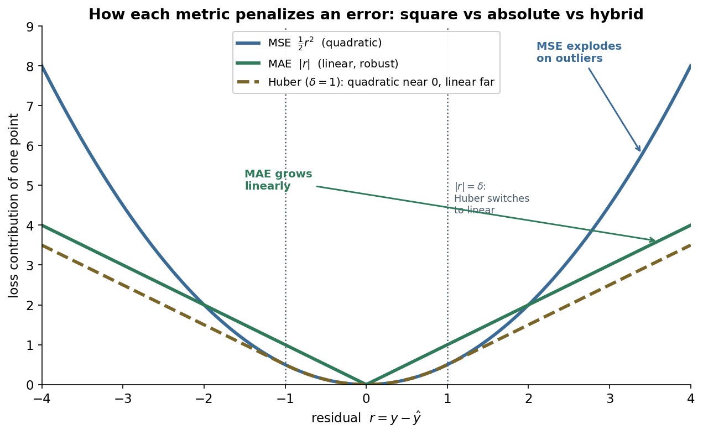
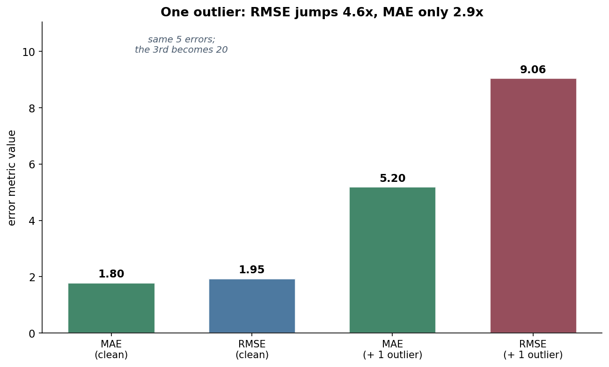
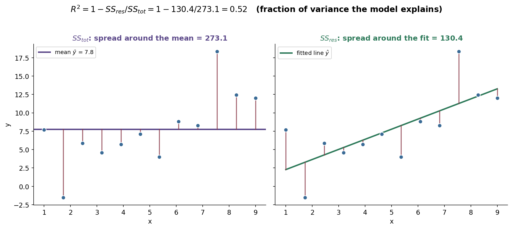
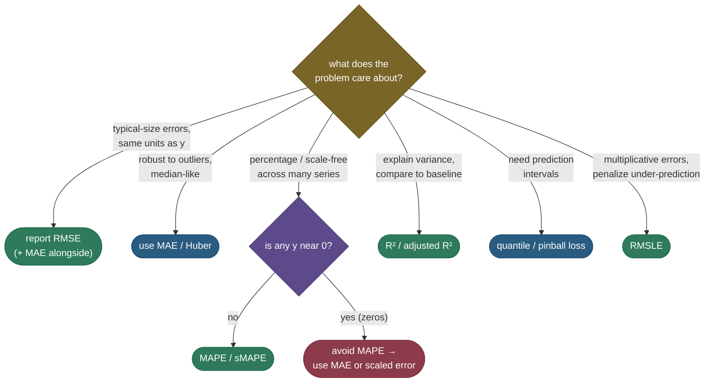

# Regression metrics: how wrong is a number, and which "wrong" do you care about?

Classification asks a yes/no question, so its errors are countable — you got it right or you didn't. Regression predicts a *continuous* number — a house price, a delivery time, tomorrow's demand — and a prediction of \$420,000 for a \$430,000 house is neither "right" nor "wrong"; it's **off by \$10,000**. The entire job of a regression metric is to turn a vector of those misses, the **residuals** $r_i = y_i - \hat{y}_i$, into a single honest number. The trap is that *there is no single honest number* — squaring the misses (MSE/RMSE) punishes a few big mistakes ferociously; taking their absolute value (MAE) treats every dollar of error equally; reporting the fraction of variance explained (R²) tells you nothing about the units. Pick the wrong one and you'll optimize a model that's excellent at the thing you didn't mean to ask for.

This page builds every common regression metric from its residuals, **derives** the results interviewers love to probe (why the mean minimizes MSE but the **median** minimizes MAE; why R² can go **negative**; why it never *decreases* as you add features), and makes the outlier story concrete with numbers you can check. By the end you'll be able to:

- compute **MSE, RMSE, MAE** from a residual vector and explain why RMSE shares units with $y$ but MSE doesn't;
- explain — and *derive* — why **squared error is pulled toward the mean** and **absolute error toward the median**, which is the whole reason RMSE and MAE disagree on outliers;
- read **R²** as the fraction of variance explained, derive it from the $SS_{tot} = SS_{reg} + SS_{res}$ decomposition, and explain its two traps (negative on bad fits, inflating with features → **adjusted R²**);
- choose between **MAPE/sMAPE, MSLE/RMSLE, Huber, and pinball loss** by matching the metric to the cost structure of the problem;
- reproduce every number in runnable code, including the proof that **R² == `sklearn.r2_score`** and that the **median minimizes MAE**.

Intuition and pictures first, then the math (derived, with sources), then runnable code.

> **Note:** every metric here scores the *same* residuals — they only differ in how they **weight** a miss. MSE/RMSE weight by the square (big misses dominate); MAE weights linearly (every miss counts the same); MAPE weights by *percentage* (a \$10 miss on a \$20 item matters more than on a \$2,000 one); pinball weights *asymmetrically* (under- and over-prediction cost differently). The skill is naming which weighting your application actually wants.

---

## The raw material: residuals

A trained regressor produces a prediction $\hat{y}_i$ for each true target $y_i$. The **residual** is the signed miss:

$$r_i = y_i - \hat{y}_i.$$

A positive residual means the model **under-predicted** (truth was higher); negative means it **over-predicted**. Every metric on this page is a function of the residual vector $\mathbf{r} = (r_1, \dots, r_n)$ — they are just different ways to collapse $n$ signed numbers into one. The reason there are so many is that "collapse" hides a choice: do you average the *squares*, the *absolute values*, the *percentages*, or something asymmetric? That single choice is the metric.

> **Tip:** before reporting any aggregate, *plot the residuals* (we return to this under residual analysis). A single number can hide a model that's biased in one region, fans out at large $y$ (heteroscedasticity), or is dragged around by two outliers. The aggregate is the summary; the residual plot is the truth.

### Intuition: the archery target

Picture a class of students each shooting a quiver of arrows at a target whose bullseye is the true value. The residuals are how far each arrow lands from center. Now ask three different questions about the same arrows:

- *"How bad is the typical shot?"* — **MAE** averages the miss distances; a wild arrow that lands in the next field counts as exactly its distance, no more.
- *"How bad are the worst shots?"* — **MSE/RMSE** square the distances first, so that one arrow in the next field dominates the score; this metric is *terrified* of any single catastrophic miss.
- *"How much better is this shooter than someone who just aims at the average of where everyone hit?"* — **R²** compares your spread to the spread you'd get from the dumb "aim at the mean" strategy.

Same arrows, three numbers, three completely different judgments — and the right one depends entirely on whether one arrow in the next field is a disaster (use RMSE) or just one of many shots (use MAE). That choice, not the formula, is the skill.

And there's a fourth question the target makes vivid: *"how much of the spread is the shooter's fault vs the wind?"* Even a perfect archer can't beat a gusty day — that floor is the **irreducible noise** $\sigma^2$ we'll meet in the bias–variance decomposition. No metric can drive error below it, which is why a *perfect* score is usually a sign of a mistake (a leak), not a triumph.

---

## MSE and RMSE: square the misses

The **Mean Squared Error** averages the squared residuals:

$$\text{MSE} = \frac{1}{n}\sum_{i=1}^{n}(y_i - \hat{y}_i)^2.$$

Squaring does two things. First, it makes every term positive, so over- and under-predictions don't cancel. Second — and this is the whole personality of MSE — it makes a miss of 10 contribute **100** while a miss of 1 contributes **1**: large errors are penalized *quadratically*, so MSE is dominated by the worst predictions. A model trained to minimize MSE will bend over backwards to avoid any single large error, even at the cost of many small ones.

The one awkwardness: MSE is in **squared units**. Predict house prices in dollars and MSE comes out in *dollars-squared*, which is meaningless to a human. The fix is the **Root Mean Squared Error** — just take the square root:

$$\text{RMSE} = \sqrt{\text{MSE}} = \sqrt{\frac{1}{n}\sum_{i=1}^{n}(y_i - \hat{y}_i)^2}.$$

RMSE is back in the **same units as $y$** (dollars, minutes, °C), so "RMSE = \$12,000" is directly interpretable as a typical error magnitude. It keeps MSE's quadratic, outlier-sensitive character — it's a *root-mean-square*, so it's always $\ge$ MAE and is pulled up by the biggest residuals.

> **Note:** RMSE is the **standard deviation of the residuals** when the model is unbiased (mean residual ≈ 0). That's the cleanest one-line intuition: it's the spread of the misses, in the target's own units.

> **Gotcha:** RMSE and MAE are reported in the same units, so people compare them directly — but **RMSE ≥ MAE always**, with equality only when every residual has the same magnitude. A large RMSE/MAE *gap* is itself a signal: it means a few residuals are much bigger than the rest (the variance of $|r|$ is high). Seeing RMSE ≫ MAE should make you go look for outliers.

### MSE is the Gaussian maximum-likelihood loss

MSE isn't an arbitrary choice — it falls out of a probabilistic assumption. Suppose the targets are the model's prediction plus **Gaussian noise**: $y_i = f(x_i) + \varepsilon_i$ with $\varepsilon_i \sim \mathcal{N}(0, \sigma^2)$ i.i.d. The likelihood of the data is

$$\mathcal{L} = \prod_{i=1}^{n} \frac{1}{\sqrt{2\pi\sigma^2}} \exp\!\left(-\frac{(y_i - \hat{y}_i)^2}{2\sigma^2}\right).$$

Take the log, drop constants that don't depend on the model, and the negative log-likelihood becomes

$$-\log \mathcal{L} = \frac{1}{2\sigma^2}\sum_{i=1}^{n}(y_i - \hat{y}_i)^2 + \text{const}.$$

**Minimizing squared error is exactly maximizing Gaussian likelihood.** So when you choose MSE you're implicitly assuming the errors are Gaussian — symmetric, light-tailed. When they're *not* (heavy tails, asymmetry), MSE's quadratic penalty over-weights the tail, which is precisely when you should reach for MAE or Huber instead.

> *Where this comes from: the squared-error ⇄ Gaussian-MLE equivalence is the standard derivation in **ESL** (Hastie, Tibshirani & Friedman, §2.6) and **ISLR** Ch. 3 — both in the references.*

### The bias–variance–noise decomposition of MSE

There's a second reason MSE is the metric the theory loves: its **expectation decomposes into three interpretable pieces**, which is *the* mathematical statement of the bias–variance tradeoff. Fix a test point $x$ with true value $y = f(x) + \varepsilon$, where $\varepsilon$ is irreducible noise with mean $0$ and variance $\sigma^2$. Train your model on a random training set $D$, giving a (random) prediction $\hat{f}(x)$. The **expected** squared error at $x$, over the randomness of both the noise and the training set, is

$$\mathbb{E}\big[(y - \hat{f}(x))^2\big] = \underbrace{\big(\mathbb{E}[\hat{f}(x)] - f(x)\big)^2}_{\text{Bias}^2} + \underbrace{\mathbb{E}\big[(\hat{f}(x) - \mathbb{E}[\hat{f}(x)])^2\big]}_{\text{Variance}} + \underbrace{\sigma^2}_{\text{irreducible noise}}.$$

**Deriving it** is a single add-and-subtract trick. Let $\bar{f} = \mathbb{E}[\hat{f}(x)]$ be the average prediction over training sets. Insert $\pm\bar{f}$ and $\pm f(x)$, then expand. Two cross terms vanish: $\mathbb{E}[\varepsilon] = 0$ makes the noise independent of everything, and $\mathbb{E}[\hat{f} - \bar{f}] = 0$ by definition of $\bar{f}$. What survives is exactly the three squared terms above:

- **Bias²** — how far the *average* model is from the truth. High for models too simple to capture $f$ (underfitting).
- **Variance** — how much the model *wiggles* as the training set changes. High for models flexible enough to chase noise (overfitting).
- **Irreducible noise $\sigma^2$** — the floor. No model, however good, can beat $\sigma^2$ because $y$ itself is random; this is the best achievable MSE.

This is why squared error is the natural lens for the bias–variance story: only the *squared* loss splits this cleanly, and it tells you that lowering test MSE means trading bias against variance while $\sigma^2$ sits underneath as a hard floor.

> **Note:** the floor $\sigma^2$ is also why a "perfect" R² of 1.0 is usually a red flag, not a triumph — real targets have noise, so $SS_{res}$ can't reach zero on held-out data. An R² of exactly 1 on test data almost always means a leak (the target snuck into the features). See the bias–variance page for the full tradeoff.

---

## MAE: average the absolute misses

The **Mean Absolute Error** averages the *absolute* residuals — the L1 counterpart to MSE's L2:

$$\text{MAE} = \frac{1}{n}\sum_{i=1}^{n}\lvert y_i - \hat{y}_i\rvert.$$

Now a miss of 10 contributes **10**, not 100: large errors are penalized only *linearly*. So MAE is **robust** — one wild outlier moves it far less than it moves RMSE. It's also directly interpretable ("on average we're off by \$8,000") and, like RMSE, lives in the target's units. Its one rough edge: $\lvert\cdot\rvert$ isn't differentiable at zero, which complicates gradient-based optimization (the subgradient is fine in practice, and Huber below smooths it away).

There's an optimization angle to the L1/L2 split worth a sentence. The **gradient of squared error is proportional to the residual itself** ($\partial_{\hat y}\tfrac12 r^2 = -r$): big misses produce big gradients, so MSE training corrects large errors aggressively — great for fast convergence, dangerous when the "large error" is an outlier you didn't want to chase. The **gradient of absolute error is a constant sign** ($\partial_{\hat y}\lvert r\rvert = -\text{sign}(r)$): every point pushes with the *same* magnitude regardless of how far off it is, which is exactly why MAE is robust but also why it can be slow and jittery near the optimum (the gradient never shrinks, and it's undefined at $r=0$). Huber, below, is engineered to get the best of both gradients.

The three loss shapes side by side make the personalities obvious — quadratic vs linear vs the hybrid we'll meet next:



---

## Why RMSE and MAE disagree: mean vs median

Here is the deepest idea on the page, and the one interviews reward. **MSE is minimized by the mean; MAE is minimized by the median.** That single fact explains *everything* about why the two metrics rank models differently and why RMSE is outlier-sensitive while MAE is robust.

### MSE is minimized by the mean

Ask: what single constant $c$ minimizes the mean squared error to a set of points $\{y_i\}$? Minimize $g(c) = \sum_i (y_i - c)^2$. Differentiate and set to zero:

$$g'(c) = \sum_{i=1}^{n} -2(y_i - c) = 0 \;\;\Longrightarrow\;\; \sum_i y_i = nc \;\;\Longrightarrow\;\; c^\star = \frac{1}{n}\sum_i y_i = \bar{y}.$$

The squared-error-minimizing constant is the **mean**. And the mean is famously *not* robust: drag one point to infinity and the mean follows it. That's why RMSE chases outliers — it's built on the same quadratic that the mean optimizes.

### MAE is minimized by the median

Now the same question for absolute error: minimize $h(c) = \sum_i \lvert y_i - c\rvert$. Its (sub)derivative counts how many points lie above vs below $c$:

$$h'(c) = \sum_{i: y_i > c}(-1) + \sum_{i: y_i < c}(+1) = \#\{y_i < c\} - \#\{y_i > c\}.$$

This is zero exactly when the number of points below $c$ equals the number above — i.e. when $c$ is the **median**. Moving $c$ a little only changes the loss by (points on one side − points on the other), so any value with equal counts on both sides is optimal; the median is the canonical choice. And the median *ignores how far away* the outlier is — only which side it's on — so it's robust. That robustness is inherited directly by MAE.

> **Note:** put the two derivations together and the rule writes itself. **Train on MSE → your model predicts conditional means; train on MAE → it predicts conditional medians.** On skewed targets (income, prices, waiting times) these differ a lot, and the choice of loss silently chooses which one you ship. This is not a metric footnote — it's a modeling decision.

> **Gotcha:** because they target different central tendencies, **MSE and MAE can rank two models in opposite orders.** Model A might have lower RMSE (it nails the bulk and tolerates a couple of big misses) while Model B has lower MAE (it's consistently close but blows one prediction). Neither is "better" in the abstract — *better for what?* is the only question.

---

## The outlier contrast, with numbers

Let's make "robust" concrete. Take five residuals of modest size and watch what one corrupted prediction does to each metric. Start with errors $\{0.5, -0.5, -1.0, 1.0, -0.5\}$, then corrupt one prediction so a single residual jumps to **13**:

| | MAE | RMSE |
|---|---|---|
| clean (5 small errors) | 0.70 | 0.74 |
| after one outlier (residual = 13) | 3.10 | 5.84 |
| **multiplier** | **4.4×** | **7.9×** |

One bad prediction nearly **8×**'d the RMSE but only **4.4×**'d the MAE. The squared term in RMSE feels that 13 as a $169$; the absolute term in MAE feels it as a $13$. (These are the exact numbers the code at the bottom reproduces; a separate measured demo with a cleaner 5-vector shows the same effect.)



> **Tip:** the interview phrasing is *"your RMSE looks terrible but MAE is fine — what's going on?"* Answer: **a few large residuals (outliers).** RMSE's square amplifies them; MAE doesn't. The follow-up — *"which should you report?"* — is "both, and then decide by the cost of a big miss: if one huge error is catastrophic (e.g. mispricing a loan), optimize RMSE; if all errors cost proportionally, MAE."

---

## R²: the fraction of variance explained

RMSE and MAE answer "how big are the errors?" in absolute units — but \$12,000 of error is great for mansions and catastrophic for bicycles. **R²** (the *coefficient of determination*) rescales the error into a unitless 0-to-1 score by comparing your model against the dumbest reasonable baseline: **always predict the mean $\bar{y}$.**

### Deriving R² from the sum-of-squares decomposition

Define three sums of squares:

$$\underbrace{SS_{tot} = \sum_i (y_i - \bar{y})^2}_{\text{total variance in } y} \qquad \underbrace{SS_{res} = \sum_i (y_i - \hat{y}_i)^2}_{\text{variance the model leaves unexplained}} \qquad \underbrace{SS_{reg} = \sum_i (\hat{y}_i - \bar{y})^2}_{\text{variance the model explains}}$$

For an OLS fit (which includes an intercept), these obey the clean identity $SS_{tot} = SS_{reg} + SS_{res}$. Why? Expand $SS_{tot}$ by inserting $\pm\hat{y}_i$:

$$SS_{tot} = \sum_i \big[(y_i - \hat{y}_i) + (\hat{y}_i - \bar{y})\big]^2 = SS_{res} + SS_{reg} + 2\underbrace{\sum_i (y_i - \hat{y}_i)(\hat{y}_i - \bar{y})}_{\text{cross term}}.$$

The cross term **vanishes for OLS**: the residuals $(y_i - \hat{y}_i)$ are orthogonal to the fitted values by the normal equations (least squares projects $y$ onto the column space of the features, leaving the residual perpendicular to it). So $SS_{tot} = SS_{reg} + SS_{res}$, and **R²** is the fraction of the total variance the model accounts for:

$$R^2 = \frac{SS_{reg}}{SS_{tot}} = 1 - \frac{SS_{res}}{SS_{tot}}.$$

The second form ($1 - SS_{res}/SS_{tot}$) is the one to memorize, because it's the *definition* used everywhere (including scikit-learn) and it stays meaningful even when the decomposition identity doesn't hold (on test data, or for non-OLS models). Reading it: $R^2 = 1$ means zero residual error (perfect); $R^2 = 0$ means your model is no better than predicting the mean; and — crucially — it can go **below zero**.



> **Note:** the picture *is* the formula. $SS_{tot}$ is how badly the flat mean line fits (left); $SS_{res}$ is how badly your sloped fit leaves things (right). R² is one minus their ratio — *the fraction of the mean line's error your model removed.*

Reading the measured numbers off that figure: the flat mean line leaves $SS_{tot} = 273.1$ of squared error; the fitted line cuts that to $SS_{res} = 130.4$. So the model removed $273.1 - 130.4 = 142.7$ of error — about **52%** of what the mean line left — which is exactly $R^2 = 1 - 130.4/273.1 = 0.52$. A model that fit *perfectly* would drive $SS_{res} \to 0$ and $R^2 \to 1$; a model no better than the mean would leave $SS_{res} = SS_{tot}$ and score $R^2 = 0$.

### Why R² can be negative

On the **training set** of an OLS model with an intercept, $0 \le R^2 \le 1$ — the fit can always at least match the mean. But on **test data**, or for any model not fit by least squares on that exact data, $SS_{res}$ can *exceed* $SS_{tot}$: your predictions can be worse than just guessing $\bar{y}$. Then $SS_{res}/SS_{tot} > 1$ and $R^2 < 0$. A negative R² is not a bug — it's the metric correctly telling you **your model is worse than a constant.** (The code below shows a model that predicts a fixed wrong value scoring a deeply negative R².)

> **Gotcha:** because R² compares to *that dataset's* mean, you **cannot compare R² across datasets** with different target variance. An R² of 0.6 on an easy, low-variance problem may be unimpressive, while 0.3 on a noisy one may be excellent. R² measures variance *explained relative to this data's spread* — it is not an absolute quality scale.

### Why R² never decreases when you add a feature — and adjusted R²

Add *any* feature to a least-squares model — even pure noise — and R² **cannot go down** on the training set. The reason is geometric: more features enlarge the column space you project onto, so the projection can only get *closer* to $y$ (or stay put), never farther; $SS_{res}$ can only shrink, so R² can only rise. A model can therefore inflate its training R² toward 1 just by piling on junk features, which is overfitting dressed up as progress.

**Adjusted R²** fixes this by charging a penalty for each feature. With $n$ observations and $p$ predictors:

$$R^2_{adj} = 1 - \frac{SS_{res}/(n - p - 1)}{SS_{tot}/(n - 1)} = 1 - (1 - R^2)\,\frac{n-1}{n-p-1}.$$

The trick is the **degrees-of-freedom** correction: instead of dividing by $n$, the numerator divides by $n - p - 1$, which *shrinks* as you add predictors. A useless feature lowers $SS_{res}$ a little but costs a degree of freedom, so adjusted R² *drops* unless the new feature earns its keep. It rises only when a feature explains more variance than chance would predict — which makes it a far better guide for feature selection than raw R².

> **Tip:** report **adjusted R²** whenever you're comparing models with different numbers of features (or doing forward/backward selection). Raw R² will happily reward you for adding garbage; adjusted R² won't. (Cross-validated error is even better — see the cross-validation page — but adjusted R² is the cheap in-sample guardrail.)

### Two R² facts worth knowing

Two relationships come up often enough to memorize:

- **R² is the squared correlation — but only for simple linear regression.** When you fit a single feature with OLS, $R^2 = r^2$, the square of the Pearson correlation between $y$ and $\hat{y}$ (and between $y$ and $x$). This is where the *name* "R-squared" comes from. The identity **breaks** for multiple regression and non-linear models, where the safe definition is always $1 - SS_{res}/SS_{tot}$ — not "correlation squared."
- **R² vs the explained-variance score.** scikit-learn also exposes `explained_variance_score`, which divides by the *variance of the residuals* rather than their raw sum of squares. The two are **identical when the residuals have mean zero** (true for OLS with an intercept), but **differ when the model is biased** (a non-zero mean residual). R² penalizes that systematic bias; explained-variance does not. If they disagree, your model has a constant offset — go fix it.

---

## Scale-free metrics: MAPE and sMAPE

Sometimes you forecast many series of wildly different magnitudes — sales of a \$5 item and a \$5,000 item — and you want errors on a common *percentage* scale. The **Mean Absolute Percentage Error** divides each absolute error by the truth:

$$\text{MAPE} = \frac{100\%}{n}\sum_{i=1}^{n}\left\lvert\frac{y_i - \hat{y}_i}{y_i}\right\rvert.$$

"MAPE = 8%" means the model is off by 8% on average — interpretable to anyone, scale-free across series. But MAPE has two ugly failure modes. First, it **blows up as $y_i \to 0$**: dividing by a near-zero truth sends a single term to infinity, so MAPE is unusable for series that pass through or near zero (demand that sometimes is zero, sensor readings around the origin). Second, it's **asymmetric**: it penalizes over-prediction more lightly than under-prediction. For a fixed truth $y$, an over-prediction's percentage error is *unbounded* while an under-prediction's is capped at 100% (predict 0 and you're 100% off, no worse), so models trained to minimize MAPE systematically **under-forecast** — biasing predictions low looks cheaper to the metric.

**Symmetric MAPE (sMAPE)** tries to patch the asymmetry by putting the *average* of truth and prediction in the denominator:

$$\text{sMAPE} = \frac{100\%}{n}\sum_{i=1}^{n}\frac{\lvert y_i - \hat{y}_i\rvert}{(\lvert y_i\rvert + \lvert\hat{y}_i\rvert)/2}.$$

It bounds the per-term error (to 200%) and is less biased — but it still misbehaves when *both* $y$ and $\hat{y}$ approach zero, and it's only "symmetric" in name (it's still not perfectly even). Both are forecasting staples; both need a hard look at whether your targets ever get near zero.

**See the asymmetry in two numbers.** Truth $y = 100$. Over-predict to $\hat{y} = 150$: MAPE term $= \lvert 100-150\rvert/100 = 50\%$. Now *under*-predict to $\hat{y} = 50$: term $= \lvert 100-50\rvert/100 = 50\%$ as well — looks even. But push the over-prediction further, to $\hat{y} = 300$: term $= 200\%$, unbounded as $\hat{y}\to\infty$; the *worst possible* under-prediction ($\hat{y} = 0$) caps at $100\%$. So MAPE can never punish under-prediction by more than 100% but punishes over-prediction without limit — which, perversely, makes a MAPE-minimizer lean toward **under**-forecasting because that side is cheaper to the metric. (Be careful: the *bias direction* depends on which side the unboundedness sits; the practical takeaway is simply that MAPE is **not** an even-handed loss.)

> **Gotcha:** never reach for MAPE on data with zeros or sign changes — one tiny denominator dominates the whole average. For intermittent demand, use a **scaled error** (e.g. MASE, which normalizes by a naive forecast's error) instead — it's defined even at zero and is the metric the forecasting literature actually recommends (Hyndman & Koehler, in the references).

---

## MSLE and RMSLE: penalize under-prediction and multiplicative error

When the target spans orders of magnitude (1, 10, 1,000, 1,000,000) and you care about **relative** rather than absolute error, take the log before squaring. The **Mean Squared Logarithmic Error** and its root:

$$\text{MSLE} = \frac{1}{n}\sum_{i=1}^{n}\big(\log(1 + y_i) - \log(1 + \hat{y}_i)\big)^2, \qquad \text{RMSLE} = \sqrt{\text{MSLE}}.$$

Because $\log a - \log b = \log(a/b)$, RMSLE measures the **ratio** of prediction to truth, not the difference — being off by a factor of 2 costs the same whether the truth is 10 or 10,000. Two consequences make it popular (it's the default in many demand/price forecasting competitions): it **dampens the influence of large targets** (a \$1M house's error doesn't dwarf a \$100k one), and it is **asymmetric in a useful direction** — because $\log(1+\hat{y})$ grows slowly, **under-prediction is penalized more than over-prediction.** When under-forecasting is the expensive mistake (you'll stock out, you'll under-provision capacity), RMSLE bakes that asymmetry right into the metric.

**Where the under-prediction penalty comes from, in numbers.** RMSLE is roughly symmetric in *ratio* terms — being off by a factor of 2 either way costs the same: for $y = 1000$, over-predicting to $2000$ gives $(\log\tfrac{2001}{1001})^2 \approx 0.480$ and under-predicting to $500$ gives $(\log\tfrac{1001}{501})^2 \approx 0.479$. The asymmetry appears when you compare against a fixed **additive** error. Take $y = 1000$ and a miss of $\pm 500$: over-predict to $\hat{y} = 1500$ → $(\log\tfrac{1501}{1001})^2 \approx (0.405)^2 \approx 0.164$; under-predict to $\hat{y} = 500$ → $(\log\tfrac{1001}{501})^2 \approx (0.692)^2 \approx 0.479$. **Same \$500 miss, but the under-prediction costs ~2.9× more log-distance** — because halving is a bigger ratio change than adding 50%. That additive-vs-multiplicative gap is exactly why RMSLE leans against under-prediction in count and demand settings.

> **Note:** the $1+$ inside the log is there so the metric is defined at $y = 0$ (and avoids $\log 0 = -\infty$). RMSLE requires non-negative targets — it's for counts, prices, demand, durations, not for quantities that can go negative.

---

## Huber loss: quadratic where it's calm, linear where it's wild

MSE is smooth (easy to optimize) but outlier-sensitive; MAE is robust but kinked at zero. **Huber loss** is the engineered compromise — quadratic for small residuals, linear for large ones, stitched together to be continuous *and* smooth:

$$L_\delta(r) = \begin{cases} \tfrac{1}{2}r^2 & \text{if } \lvert r\rvert \le \delta \\[4pt] \delta\big(\lvert r\rvert - \tfrac{1}{2}\delta\big) & \text{if } \lvert r\rvert > \delta \end{cases}$$

The threshold $\delta$ marks where "small" ends. Below it, you get MSE's smooth parabola (clean gradients, mean-like behaviour where the data is well-behaved); above it, you get MAE's linear penalty (so a far-flung outlier contributes its distance, not its distance *squared*). The two pieces are chosen so the loss and its first derivative **match at $\lvert r\rvert = \delta$** — verify: at $r = \delta$ the quadratic gives $\tfrac12\delta^2$ and the linear gives $\delta(\delta - \tfrac12\delta) = \tfrac12\delta^2$ (continuous), and the derivative is $r = \delta$ on the left and $\delta$ on the right (smooth). That smoothness is the point: Huber is everywhere differentiable, so gradient methods are happy, while still refusing to let one outlier dominate. The amber dashed curve in the loss-shapes figure above is exactly this — hugging MSE near the origin, then peeling off to run parallel to MAE.

**Huber in numbers ($\delta = 1$).** A small residual $r = 0.5$ contributes $\tfrac12(0.5)^2 = 0.125$ — identical to MSE there. A large residual $r = 10$ contributes $\delta(\lvert r\rvert - \tfrac12\delta) = 1\cdot(10 - 0.5) = 9.5$ — *linear*, far below MSE's $\tfrac12(10)^2 = 50$ but above MAE's $10/2$ scaling. So the outlier that would have contributed 50 to a squared loss contributes only 9.5 to Huber: the catastrophe is capped, exactly like MAE, while small residuals keep MSE's smooth, fast-converging behaviour. That's the whole trick in two numbers.

> *Where this comes from: the loss is **Huber (1964)**, "Robust Estimation of a Location Parameter" — the founding paper of robust statistics, in the references.*

> **Tip:** $\delta$ is a knob, not a constant. Small $\delta$ → behaves like MAE (robust, treats most points as "outliers"); large $\delta$ → behaves like MSE (smooth, treats most points as "normal"). A common default is to set $\delta$ near the noise scale of the inliers (e.g. a multiple of the residual MAD). Scikit-learn's `HuberRegressor` and the **Smooth L1 / Huber** loss in PyTorch are this, ready-made.

---

## Quantile (pinball) loss: predict an interval, not just a point

Every metric so far scores a single point prediction. But often you want a **range** — "90% of delivery times fall under X" — which means predicting a *quantile*, not the mean. The **quantile (pinball) loss** for target quantile $\tau \in (0,1)$ is an asymmetric absolute error:

$$L_\tau(r) = \begin{cases} \tau\, r & \text{if } r \ge 0 \;\;(\text{under-prediction}) \\[3pt] (\tau - 1)\, r & \text{if } r < 0 \;\;(\text{over-prediction}) \end{cases} \qquad r = y - \hat{y}.$$

It's a V with **different slopes on each side**: $\tau$ for under-prediction, $1-\tau$ for over-prediction. Set $\tau = 0.5$ and both slopes are $\tfrac12$ — it reduces to (half) MAE, targeting the median. Set $\tau = 0.9$ and under-prediction is penalized **9× harder** than over-prediction, so the loss-minimizing prediction sits high — at the 90th percentile.


### Deriving that pinball loss targets the τ-quantile

Why does minimizing $\mathbb{E}[L_\tau(y - \hat{y})]$ land $\hat{y}$ on the $\tau$-quantile? Write the expected loss as a function of the prediction $q = \hat{y}$:

$$\mathbb{E}[L_\tau(y - q)] = \tau\!\int_{q}^{\infty}(y - q)\,f(y)\,dy + (1-\tau)\!\int_{-\infty}^{q}(q - y)\,f(y)\,dy.$$

Differentiate with respect to $q$ (Leibniz rule — the boundary terms cancel because the integrand is zero at $y = q$):

$$\frac{d}{dq}\mathbb{E}[L_\tau] = -\tau\!\int_{q}^{\infty}\! f(y)\,dy + (1-\tau)\!\int_{-\infty}^{q}\! f(y)\,dy = -\tau\big(1 - F(q)\big) + (1-\tau)F(q).$$

Set it to zero: $-\tau + \tau F(q) + F(q) - \tau F(q) = 0 \Rightarrow F(q) = \tau$. So the optimal $q$ satisfies $F(q) = \tau$ — it is **exactly the $\tau$-quantile** of the distribution. Fit one model at $\tau = 0.05$ and another at $\tau = 0.95$ and you have a calibrated **90% prediction interval**, learned directly from data. This is the engine behind quantile regression and gradient-boosting's quantile objective.

> *Where this comes from: quantile regression and the pinball (check) loss are **Koenker & Bassett (1978)**, "Regression Quantiles" — the founding paper, in the references.*

> **Note:** the asymmetry is a *feature you choose*, identical in spirit to the precision/recall threshold in classification. If under-stocking costs you a lost sale but over-stocking costs you cheap storage, train at a high $\tau$ so the model deliberately predicts high. The metric encodes the business cost.

---

## Residual analysis: the picture behind the number

A scalar metric can be a great score on a bad model. The cure is to **plot the residuals** $r_i$ against the fitted values $\hat{y}_i$ (or against time, or a feature) and look for structure. For a well-specified model the residual plot should be a **structureless cloud** centered on zero. Pathologies and what they mean:

- **A curve or U-shape** → the model is *misspecified* (e.g. a line where a curve was needed). The mean of the residuals depends on $\hat{y}$ — you're systematically off in some regions. Fix: add nonlinearity (polynomial terms, a different model).
- **A funnel / fan shape** → **heteroscedasticity**: the residual variance grows with $\hat{y}$. The point predictions may be fine, but the *uncertainty* isn't constant, which breaks the constant-noise assumption behind MSE-as-MLE and makes naive confidence intervals wrong. Fix: transform $y$ (log), use weighted least squares, or model the variance (quantile loss).
- **A few points far from the cloud** → outliers / high-leverage points. These are exactly what inflate RMSE relative to MAE; decide whether they're errors to remove or real tail events to model.
- **Drift over time / autocorrelation** → residuals trend or cluster when ordered by time. Common in forecasting; the i.i.d. assumption is violated.

> **Tip:** the single most useful diagnostic in applied regression is the **residuals-vs-fitted scatter**. It catches misspecification and heteroscedasticity that *no aggregate metric will show you* — RMSE can look great while the residual plot screams "you're using the wrong model."

---

## Weighted and grouped evaluation

Two refinements matter in production. First, **sample weights**: when some observations matter more (recent data, high-value customers, reliable sensors), every metric here generalizes by replacing the plain average with a weighted one — e.g. weighted MSE $= \sum_i w_i (y_i - \hat{y}_i)^2 / \sum_i w_i$. The mean/median logic carries over: weighted MSE is minimized by the *weighted* mean, weighted MAE by the *weighted* median. Second, **grouped (macro) evaluation**: a single global RMSE is dominated by whichever group has the most rows or the largest target magnitude. If you serve many segments (regions, products, users) and care about each, compute the metric *per group and then average* — the regression analog of macro-averaging in classification. A model with a great global RMSE can be quietly terrible on every small segment, exactly hidden by the big one; per-group metrics surface it.

> **Gotcha:** a strong *aggregate* metric can mask systematic failure on an important sub-population — the regression version of the accuracy paradox. Always slice your error by the segments you care about before declaring a model good.

---

## Choosing the metric for the problem

There is no default — the right metric is dictated by the cost structure of the task:



Concretely, by problem type:

- **House / asset valuation** → RMSE (a few large mispricings are very costly, so you *want* the quadratic penalty), reported in dollars, with MAE alongside as the robust sanity check.
- **Demand forecasting across many products** → a scale-free metric (sMAPE or, better, **MASE**) so a \$5 SKU and a \$5,000 SKU are weighted fairly, plus **RMSLE** when under-stocking is the expensive error.
- **Anything with heavy-tailed noise or known outliers** → **MAE or Huber**, not RMSE — you don't want two data-entry typos to dominate model selection.
- **Capacity / SLA planning** → **quantile loss** at the percentile you must guarantee (e.g. p95 latency), to predict the *tail* you actually provision for.
- **Communicating to stakeholders / model comparison on one dataset** → **R²** (and adjusted R² when feature counts differ) for the intuitive "variance explained" story.

> **Tip:** the strongest interview answer to *"which regression metric?"* is never a single name — it's **"what does a big error cost relative to a small one, and are there outliers or near-zero targets?"** That question selects the metric: quadratic cost → RMSE; linear/robust → MAE/Huber; percentage across scales → sMAPE/MASE; asymmetric cost → quantile or RMSLE; variance story → R².

---

## An end-to-end evaluation playbook

Here's the reasoning I'd actually do, start to finish, when handed "evaluate this house-price model and tell me if it's good enough to ship":

1. **Compute the absolute error in the target's units.** Report **RMSE and MAE in dollars.** RMSE = \$28k, MAE = \$19k tells me the typical miss is ~\$19k and that a few larger misses pull RMSE up to \$28k. The *gap* (RMSE ≫ MAE) is my first flag to go hunt for outliers.
2. **Compute R² for the relative story.** R² = 0.86 means the model explains 86% of price variance — a number a product manager understands. If features differ across candidate models, use **adjusted R²** so I'm not fooled by added junk.
3. **Plot residuals vs fitted.** This is non-negotiable. A funnel shape (heteroscedasticity — errors grow with price) tells me the dollar error isn't uniform, so I might switch to **RMSLE** (relative error) or log-transform the target. A curve tells me the model is misspecified.
4. **Match the metric to the business cost.** If under-pricing a listing loses a sale but over-pricing just delays it, the costs are asymmetric → I'd add a **quantile** model at the τ that reflects that cost, or report RMSLE which already leans against under-prediction.
5. **Validate honestly.** All of the above on a **held-out / cross-validated** split, never training error — a negative test R² would instantly tell me the model is worse than guessing the mean (see the cross-validation page).
6. **Report two-plus numbers, never one.** Ship the decision on RMSE *and* MAE *and* R², plus the residual plot. Any single metric can flatter a model that the others (or the plot) expose.

Every step is just one metric from this page plus the question "what does the error cost?" That's the whole job.

---

## Worked examples by hand

Four examples of increasing depth — every number is reproduced by the code in the next section.

### Example 1 — MSE/RMSE/MAE on a tiny vector, and the outlier effect

Truths $y = [3, 5, 2, 8, 7]$, predictions $\hat{y} = [2.5, 5.5, 3.0, 7.0, 7.5]$. Residuals $r = y - \hat{y} = [0.5, -0.5, -1.0, 1.0, -0.5]$.

- $\text{MAE} = \tfrac{1}{5}(0.5 + 0.5 + 1.0 + 1.0 + 0.5) = \tfrac{3.5}{5} = \mathbf{0.70}$.
- $\text{MSE} = \tfrac{1}{5}(0.25 + 0.25 + 1.0 + 1.0 + 0.25) = \tfrac{2.75}{5} = 0.55 \Rightarrow \text{RMSE} = \sqrt{0.55} = \mathbf{0.742}$.

Now corrupt the 4th prediction from 7.0 to $-5.0$, so its residual jumps from $1.0$ to $13.0$:

- $\text{MAE} = \tfrac{1}{5}(0.5 + 0.5 + 1.0 + 13.0 + 0.5) = \tfrac{15.5}{5} = \mathbf{3.10}$ — **4.4×** the clean MAE.
- $\text{MSE} = \tfrac{1}{5}(0.25 + 0.25 + 1.0 + 169 + 0.25) = \tfrac{170.75}{5} = 34.15 \Rightarrow \text{RMSE} = \mathbf{5.84}$ — **7.9×** the clean RMSE.

The square turns that lone 13 into a 169 that swamps everything. **That is outlier sensitivity, in five numbers.**

### Example 2 — R² from $SS_{res}$ and $SS_{tot}$

Same clean $y = [3, 5, 2, 8, 7]$, $\hat{y} = [2.5, 5.5, 3.0, 7.0, 7.5]$. Mean $\bar{y} = 25/5 = 5.0$.

- $SS_{res} = \sum (y - \hat{y})^2 = 0.25 + 0.25 + 1.0 + 1.0 + 0.25 = 2.75$.
- $SS_{tot} = \sum (y - \bar{y})^2 = 4 + 0 + 9 + 9 + 4 = 26.0$.
- $R^2 = 1 - \dfrac{2.75}{26.0} = 1 - 0.1058 = \mathbf{0.894}$.

The model explains ~89% of the variance in $y$. To see a **negative** R², predict the constant 20 for every point: $SS_{res} = (3-20)^2 + \dots = 289 + 225 + 324 + 144 + 169 = 1151$, so $R^2 = 1 - 1151/26 = \mathbf{-43.3}$ — far worse than just predicting the mean. (The code confirms both against `sklearn.r2_score`.)

### Example 3 — the median-minimizes-MAE / mean-minimizes-MSE check

Take a deliberately skewed set $\{1, 2, 2, 3, 100\}$ (one outlier). Its **mean** is $\tfrac{108}{5} = 21.6$; its **median** is $2$. Now scan every constant $c$ and find which minimizes each loss:

- The constant minimizing $\sum_i (x_i - c)^2$ comes out at $c^\star = 21.6$ — **the mean**, dragged way up by the 100.
- The constant minimizing $\sum_i \lvert x_i - c\rvert$ comes out at $c^\star = 2$ — **the median**, completely unmoved by the 100.

This is the whole mean-vs-median story in one dataset: squared error chases the outlier (mean = 21.6), absolute error ignores it (median = 2). The code verifies both by brute-force grid search — and it matches the calculus exactly: setting the MSE derivative $\sum(x_i - c) = 0$ gives $c = \bar{x} = 21.6$, and the MAE subderivative is zero where the counts of points below and above balance, i.e. at the median $c = 2$ (two points below, two above, with the third sitting on it). The grid search and the derivation agree to the digit.

### Example 4 — quantile-loss asymmetry

Predict $\hat{y} = 50$ with target quantile $\tau = 0.9$. Compute the pinball loss for an **under**-prediction (true $y = 60$, so $r = +10$) vs an **over**-prediction (true $y = 40$, so $r = -10$):

- Under ($r = +10 \ge 0$): $L = \tau \cdot r = 0.9 \times 10 = \mathbf{9.0}$.
- Over ($r = -10 < 0$): $L = (\tau - 1)\cdot r = (-0.1)\times(-10) = \mathbf{1.0}$.

Same magnitude of miss, **9× the penalty** for under-predicting — which is exactly why minimizing this loss pushes the prediction up to the 90th percentile. Fit at $\tau = 0.1$ instead and the asymmetry flips, pulling the prediction down to the 10th percentile; together they bracket an 80% interval.

### Example 5 — raw vs adjusted R² when you add a noise feature

Suppose a model on $n = 50$ observations with $p = 3$ real features achieves $R^2 = 0.80$. You add **2 pure-noise features** ($p = 5$), and — because R² can only rise — training $R^2$ nudges up to, say, $0.81$. Did the model get better? Run both through adjusted R²:

- With 3 features: $R^2_{adj} = 1 - (1 - 0.80)\dfrac{50-1}{50-3-1} = 1 - 0.20 \times \dfrac{49}{46} = 1 - 0.213 = \mathbf{0.787}$.
- With 5 features: $R^2_{adj} = 1 - (1 - 0.81)\dfrac{50-1}{50-5-1} = 1 - 0.19 \times \dfrac{49}{44} = 1 - 0.2116 = \mathbf{0.788}$.

Adjusted R² barely moved ($0.787 \to 0.788$) — the 0.01 gain in raw R² was almost entirely the noise features' free ride, and the df-penalty clawed it back. Had the noise added *nothing* to raw R², adjusted R² would have visibly *dropped*. That's the guardrail: **raw R² rewards every feature; adjusted R² only rewards features that beat chance.**

---

## A side-by-side summary

| Metric | Formula (per point, then averaged) | Units | Outliers | Minimized by | Best for |
|---|---|---|---|---|---|
| **MSE** | $(y-\hat y)^2$ | $y^2$ | very sensitive | mean | training loss; Gaussian noise |
| **RMSE** | $\sqrt{\text{MSE}}$ | $y$ | very sensitive | mean | reporting typical error; big misses costly |
| **MAE** | $\lvert y-\hat y\rvert$ | $y$ | robust | median | heavy tails / outliers |
| **Huber** | quad. then linear at $\delta$ | $y$ | robust + smooth | (mean-like inside $\delta$) | robust *and* differentiable training |
| **MAPE** | $\lvert (y-\hat y)/y\rvert$ | % | sensitive | (biased low) | scale-free, **no zeros** |
| **RMSLE** | $(\log\tfrac{1+y}{1+\hat y})^2$ | log-ratio | dampened | — | multiplicative error; punish under-prediction |
| **R²** | $1 - SS_{res}/SS_{tot}$ | unitless | sensitive (via $SS_{res}$) | — | variance-explained story |
| **Pinball** | asymmetric $\lvert y-\hat y\rvert$ | $y$ | robust | **τ-quantile** | prediction intervals |

> **Gotcha:** the "minimized by" column is the one to internalize — it's *why* the metrics disagree. Two of them target the mean (MSE/RMSE), one the median (MAE), one an arbitrary quantile (pinball). Choosing a metric is choosing which statistic of $p(y\mid x)$ your model will learn.

And the family tree connecting them all is small once you see the axes:

- **Squared (L2) vs absolute (L1).** MSE/RMSE are L2 (mean-targeting, outlier-sensitive); MAE is L1 (median-targeting, robust). **Huber** interpolates between them, and **pinball** is L1 made asymmetric.
- **Absolute vs relative scale.** MSE/RMSE/MAE live in the target's units (absolute); **MAPE/sMAPE** and **RMSLE** are relative/percentage (good across scales, fragile near zero).
- **Point vs interval.** Everything except **pinball** scores a single point estimate; pinball is what you reach for when you need a *range*.
- **Raw error vs variance-explained.** RMSE/MAE report error magnitude; **R²** reports the *fraction* of variance removed — the only one that's unitless and baseline-relative.

Pick a leaf of that tree by answering three questions: *squared or absolute cost? absolute or relative scale? point or interval?* Those three choices land you on exactly one metric.

---

## Code: reproduce every number

This script computes MAE/MSE/RMSE (with the outlier effect), R² (matched to scikit-learn, including a negative case), the median-minimizes-MAE / mean-minimizes-MSE check, and the quantile-loss asymmetry — exactly the four worked examples above. Runs on CPU in under a second.

```python
"""Regression metrics from scratch, verified against scikit-learn.
Verified on Python 3.12 (numpy, scikit-learn), CPU."""
import numpy as np
from sklearn.metrics import mean_absolute_error, mean_squared_error, r2_score

# --- Example 1: MAE / MSE / RMSE, and what one outlier does ---
y    = np.array([3.0, 5.0, 2.0, 8.0, 7.0])
yhat = np.array([2.5, 5.5, 3.0, 7.0, 7.5])
e = y - yhat
mae, mse, rmse = np.mean(np.abs(e)), np.mean(e**2), np.sqrt(np.mean(e**2))
print(f"clean   : MAE={mae:.3f}  MSE={mse:.3f}  RMSE={rmse:.3f}"
      f"  (sklearn MAE={mean_absolute_error(y,yhat):.3f}, RMSE={mean_squared_error(y,yhat)**0.5:.3f})")

yhat_o = yhat.copy(); yhat_o[3] = -5.0                 # corrupt one prediction -> residual 13
eo = y - yhat_o
mae_o, rmse_o = np.mean(np.abs(eo)), np.sqrt(np.mean(eo**2))
print(f"outlier : MAE {mae:.2f}->{mae_o:.2f} ({mae_o/mae:.1f}x)   "
      f"RMSE {rmse:.2f}->{rmse_o:.2f} ({rmse_o/rmse:.1f}x)   <- RMSE moves far more")

# --- Example 2: R^2 from SS_res/SS_tot, matched to sklearn (+ a negative case) ---
ybar = y.mean()
ss_res, ss_tot = np.sum((y-yhat)**2), np.sum((y-ybar)**2)
r2 = 1 - ss_res/ss_tot
print(f"\nR2      : SS_res={ss_res:.2f} SS_tot={ss_tot:.2f}  R2={r2:.4f}"
      f"  sklearn={r2_score(y,yhat):.4f}  match={np.isclose(r2, r2_score(y,yhat))}")
yhat_bad = np.full_like(y, 20.0)
print(f"R2<0    : predict 20 everywhere -> R2={r2_score(y,yhat_bad):.2f}  (worse than the mean)")

# --- Example 3: median minimizes MAE, mean minimizes MSE ---
data = np.array([1.0, 2.0, 2.0, 3.0, 100.0])           # one outlier
c = np.linspace(-10, 110, 120001)
mae_c = np.mean(np.abs(data[None,:] - c[:,None]), axis=1)
mse_c = np.mean((data[None,:] - c[:,None])**2,      axis=1)
print(f"\nlocation: median={np.median(data):.2f}  argmin-MAE c*={c[mae_c.argmin()]:.2f}   (match)")
print(f"          mean  ={np.mean(data):.2f}  argmin-MSE c*={c[mse_c.argmin()]:.2f}   (match)")

# --- Example 4: quantile (pinball) loss asymmetry, and it targets the tau-quantile ---
def pinball(y, q, tau):
    r = y - q
    return np.mean(np.where(r >= 0, tau*r, (tau-1)*r))
print(f"\npinball : tau=0.9, under-predict (y=60,yhat=50): {pinball(np.array([60.]),50,0.9):.1f}")
print(f"          tau=0.9, over-predict  (y=40,yhat=50): {pinball(np.array([40.]),50,0.9):.1f}"
      f"   -> under-prediction costs 9x more")
rng = np.random.default_rng(7); s = rng.normal(50, 10, 5000)
for tau in (0.1, 0.5, 0.9):
    g = np.linspace(20, 80, 601)
    q_star = g[np.argmin([pinball(s, gi, tau) for gi in g])]
    print(f"          tau={tau}: argmin q*={q_star:.1f}  vs empirical quantile={np.quantile(s,tau):.1f}")
```

Output:

```
clean   : MAE=0.700  MSE=0.550  RMSE=0.742  (sklearn MAE=0.700, RMSE=0.742)
outlier : MAE 0.70->3.10 (4.4x)   RMSE 0.74->5.84 (7.9x)   <- RMSE moves far more

R2      : SS_res=2.75 SS_tot=26.00  R2=0.8942  sklearn=0.8942  match=True
R2<0    : predict 20 everywhere -> R2=-43.27  (worse than the mean)

location: median=2.00  argmin-MAE c*=2.00   (match)
          mean  =21.60  argmin-MSE c*=21.60   (match)

pinball : tau=0.9, under-predict (y=60,yhat=50): 9.0
          tau=0.9, over-predict  (y=40,yhat=50): 1.0   -> under-prediction costs 9x more
          tau=0.1: argmin q*=37.1  vs empirical quantile=37.1
          tau=0.5: argmin q*=49.7  vs empirical quantile=49.7
          tau=0.9: argmin q*=62.5  vs empirical quantile=62.5
```

> **Note:** four claims, verified in one run. The outlier **7.9×**'s RMSE but only **4.4×**'s MAE; our hand-derived R² **equals `r2_score` to the digit** and goes deeply **negative** for a worse-than-mean model; the **mean** (21.6) minimizes squared error while the **median** (2.0) minimizes absolute error on the same skewed data; and minimizing pinball loss lands the prediction on the empirical **τ-quantile** every time (37.1, 49.7, 62.5 for τ = 0.1, 0.5, 0.9), with under-prediction penalized 9× at τ = 0.9.

> **Tip:** in practice you'd never hand-roll these — `sklearn.metrics` has `mean_absolute_error`, `mean_squared_error` (take its root for RMSE, or use `root_mean_squared_error`), `r2_score`, `mean_absolute_percentage_error`, `mean_squared_log_error`, and `mean_pinball_loss`. The from-scratch versions exist to prove you know what each one *is*.

For quick reference, here's the metric → scikit-learn mapping (each also accepts `sample_weight=`):

| Metric | scikit-learn |
|---|---|
| MAE | `mean_absolute_error` |
| MSE | `mean_squared_error` |
| RMSE | `root_mean_squared_error` (or `mean_squared_error(...)**0.5`) |
| R² | `r2_score` |
| Adjusted R² | (compute by hand — not built in) |
| MAPE | `mean_absolute_percentage_error` |
| RMSLE | `mean_squared_log_error(...)**0.5` (or `root_mean_squared_log_error`) |
| Pinball | `mean_pinball_loss(..., alpha=tau)` |

> **Gotcha:** in cross-validation and `GridSearchCV`, scikit-learn maximizes the score, so error metrics are exposed as **negated** strings — `"neg_mean_squared_error"`, `"neg_mean_absolute_error"`, etc. A "score" of $-12.3$ for `neg_root_mean_squared_error` just means RMSE $= 12.3$. R² is already higher-is-better, so it's plain `"r2"`.

---

## Where these metrics matter

- **Model selection & hyperparameter tuning** — the metric you put in the objective (or in cross-validation) silently decides which model wins; MSE picks the mean-fitter, MAE the median-fitter.
- **Forecasting** — demand, prices, traffic, energy: scale-free (sMAPE/MASE) and asymmetric (RMSLE, quantile) metrics dominate because errors there have very different costs and magnitudes.
- **Neural-net regression** — MSE and MAE (and Smooth L1 / Huber) are the standard training losses for continuous-output networks, with the same mean/median/robustness tradeoffs.
- **Uncertainty & risk** — quantile loss produces the prediction intervals that capacity planning, finance, and safety-critical systems actually act on.
- **Reporting to humans** — R² ("how much variance we explain") and RMSE/MAE (in real units) are the two numbers stakeholders understand; pick R² for the relative story, RMSE/MAE for the absolute one.

---

## Common traps and how to avoid them

The mistakes that show up in real projects (and interview follow-ups) almost always trace back to a metric mismatch:

- **Optimizing MSE, then judging on MAE (or vice-versa).** If your loss and your reporting metric target different statistics (mean vs median), the model you select isn't the one you scored. Train and evaluate on the *same* metric, or at least know they'll disagree on skewed data.
- **Reporting R² without a baseline.** R² is *defined* relative to the mean predictor, so it already has a baseline — but people forget it's dataset-specific. "R² = 0.7" means nothing without knowing the target's variance and the task's difficulty. Always pair it with RMSE/MAE in real units.
- **Trusting a high training R² from many features.** Raw R² can be pushed toward 1 with junk features; the honest numbers are **adjusted R²** in-sample and **cross-validated** error out-of-sample.
- **Using MAPE on data that touches zero.** A single near-zero target makes MAPE explode and dominates the average. Switch to MAE or a scaled error.
- **Forgetting the units.** MSE is in squared units — never report "MSE = 144" to a stakeholder as if it were dollars. Report RMSE = 12 (dollars) instead.
- **Letting one outlier pick your model.** RMSE-based model selection can be flipped by two data-entry typos. Inspect the residuals; consider MAE or Huber if the tail is noise rather than signal.
- **Confusing "low error" with "good model."** A great RMSE on a *biased* model (systematic residual structure) is still a bad model. The residual plot, not the scalar, is the final word.

> **Tip:** the meta-lesson across all of these: **a single number is a summary, and summaries hide things.** Report at least two complementary metrics (one absolute like RMSE/MAE, one relative like R²) *and* look at the residual plot before you believe any of them.

---

## Recap and rapid-fire

**If you remember nothing else:** every regression metric collapses the residual vector differently. **RMSE/MSE** square the misses (outlier-sensitive, minimized by the **mean**, = Gaussian MLE); **RMSE** is in the target's units, MSE is in squared units. **MAE** takes absolute values (robust, minimized by the **median**), so a big RMSE/MAE gap signals outliers. **R² = 1 − SS_res/SS_tot** is the fraction of variance explained — it can go **negative** (worse than the mean) and never *decreases* as you add features, which is why you compare with **adjusted R²**. For special costs reach for **MAPE/sMAPE** (percentage, but breaks near zero), **RMSLE** (multiplicative, penalizes under-prediction), **Huber** (robust + smooth), or **pinball loss** (prediction intervals — minimized at the **τ-quantile**).

**Quick-fire — say these out loud:**

- *MSE vs RMSE?* RMSE = √MSE — same number, but RMSE is in the target's units (MSE is in squared units).
- *Why is RMSE outlier-sensitive but MAE robust?* RMSE squares the residual; MAE doesn't. The square amplifies large misses.
- *What does each metric's optimum predict?* MSE → the conditional **mean**; MAE → the conditional **median** (derived from setting the derivative to zero).
- *MSE's probabilistic meaning?* Minimizing MSE = maximizing likelihood under i.i.d. Gaussian noise.
- *Define R².* $1 - SS_{res}/SS_{tot}$ — the fraction of variance the model explains vs always predicting the mean.
- *Can R² be negative?* Yes — on test data a model worse than the mean gives $SS_{res} > SS_{tot}$, so R² < 0.
- *Why adjusted R²?* Raw R² never decreases when you add features (even noise); the df-penalty in adjusted R² makes a useless feature *lower* it.
- *When NOT to use MAPE?* When any target is at or near zero — the division blows up; use MAE or a scaled error (MASE).
- *What is Huber loss?* Quadratic for $|r| \le \delta$, linear beyond — robust like MAE, smooth like MSE.
- *What does pinball loss at τ give you?* The model that predicts the **τ-quantile** — fit two and you have a prediction interval.
- *Decompose MSE.* $\text{Bias}^2 + \text{Variance} + \sigma^2$ (irreducible noise) — the bias–variance tradeoff, and why R² = 1 on test data is suspicious.
- *Is R² the squared correlation?* Only for simple (one-feature) linear regression; in general use $1 - SS_{res}/SS_{tot}$.
- *What is RMSLE for?* Multiplicative / relative error on non-negative targets that span orders of magnitude; it leans against under-prediction.
- *How do you pick a regression metric?* By the cost of a big error vs a small one, and whether there are outliers / near-zero targets.

---

## References and further reading

The curated link library for this topic — videos, courses, articles, papers, books, and internal cross-links — lives in a companion file so it can be reused as a standalone reference list:

**→ [Regression Metrics — references and further reading](15-Regression-Metrics.references.md)**
