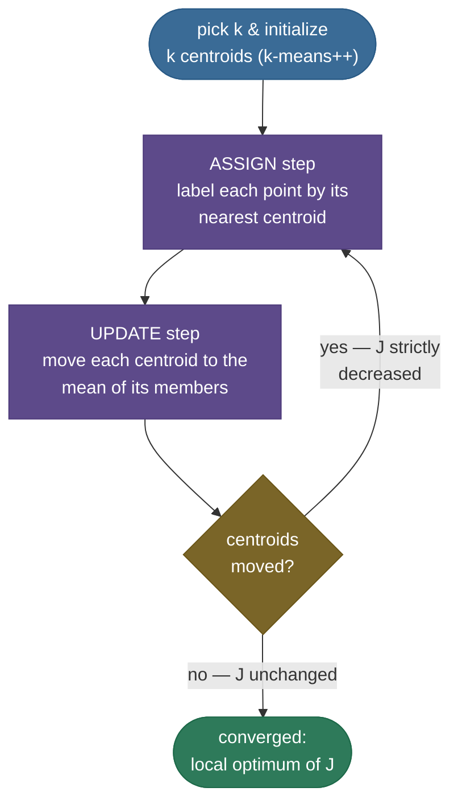
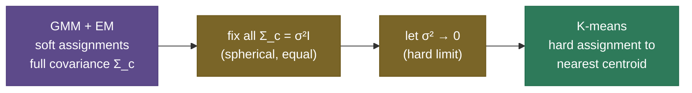

# K-Means: carve the data into k round piles

You walk into a warehouse full of unlabeled boxes scattered across the floor, and your job is to group them into **k** piles so that boxes in the same pile are close together. You don't know what's in any box — there are no labels, no "correct" answer to check against. All you have is *position*. A natural strategy: drop **k** flags on the floor, send each box to its nearest flag, then slide each flag to the center of the boxes that gathered around it — and repeat until nothing moves. That loop **is** k-means, the first clustering algorithm everyone learns, the one nearly every "explain a clustering method" interview opens with, and — sixty years after Lloyd wrote it down — still a default baseline you reach for before anything fancier.

I'm going to teach this the way I'd actually walk a teammate through it: first the **problem** (what "good clustering" even means without labels), then the **objective** k-means secretly minimizes, then **Lloyd's algorithm** — and we'll *derive* every claim people usually just assert: why the centroid is the **mean**, why each step can only **lower** the objective (so it always converges), why it lands in a **local** optimum (and why the global one is NP-hard), why **k-means++** seeding fixes the worst of that, how to **choose k**, and exactly **when k-means breaks** and you should reach for something else. By the end you'll be able to:

- state the **within-cluster sum-of-squares** objective $J$ and explain what minimizing it means;
- **derive** that the optimal centroid is the cluster **mean**, and that Lloyd's algorithm **monotonically decreases $J$** and therefore **converges**;
- explain why it converges to a **local** (not global) optimum, and why global k-means is **NP-hard**;
- derive **k-means++** $D^2$-weighted seeding and quote its $O(\log k)$ guarantee;
- **choose k** with the elbow, the **silhouette** (derived), the gap statistic, and Davies–Bouldin;
- name the **spherical / equal-size / equal-density** assumptions and show, with pictures, exactly where they fail;
- place k-means as the **hard-assignment limit of a Gaussian mixture**, and know mini-batch / k-medoids / k-medians variants;
- work **four numeric examples** by hand and confirm them against scikit-learn.

> **Note:** k-means is **unsupervised** — there are no labels, so there is no accuracy to optimize. It optimizes a *geometric* objective (compactness of the piles), and "is this clustering good?" is ultimately a modeling judgment, not a number a test set hands you. Keep that distinction in your head; it explains nearly everything that's subtle about k-means.

---

## The problem: partition without labels

Supervised learning hands you $(x, y)$ pairs and asks you to predict $y$. **Clustering** hands you only the points $x_1, \dots, x_n \in \mathbb{R}^d$ and asks you to **partition** them into groups so that points in the same group are *similar* and points in different groups are *dissimilar*. There is no $y$ to check against — the structure has to come from the geometry of the data itself.

That immediately raises a question: *what makes a partition good?* You have to commit to a definition before you can optimize anything. K-means makes one specific, consequential choice: **a good cluster is a compact, round blob around a center point.** Concretely, it measures a cluster's quality by how tightly its points hug a single representative point — the **centroid** — using squared Euclidean distance. Everything else in k-means follows mechanically from that one decision, including all of its strengths *and* every one of its failure modes.

> **Gotcha:** because k-means has to be *told* how many groups to find — the **k** is an input, not something it discovers — choosing k is a first-class problem, not an afterthought. We give it a whole section below. Algorithms like [DBSCAN](../03-DBSCAN/03-DBSCAN.md) discover the number of clusters from density instead; that's their main selling point against k-means.

---

## The objective: within-cluster sum of squares (inertia)

Let's make "compact round blobs" precise. We want to find $k$ cluster centers $\mu_1, \dots, \mu_k \in \mathbb{R}^d$ and an assignment of each point $x_i$ to a cluster $c_i \in \{1, \dots, k\}$ that minimizes the **within-cluster sum of squares (WCSS)**, also called the **inertia** or **distortion**:

$$J(\{c_i\}, \{\mu_c\}) \;=\; \sum_{i=1}^{n} \big\lVert x_i - \mu_{c_i} \big\rVert^2 \;=\; \sum_{c=1}^{k} \sum_{i \,:\, c_i = c} \big\lVert x_i - \mu_c \big\rVert^2 .$$

Read it left to right: for every point, take the squared distance to **its own** cluster's center, and add them all up. A small $J$ means every point sits close to its center — tight, compact clusters. A large $J$ means points are stranded far from their centers. **Minimizing $J$ is the entire goal of k-means.**

> **Note:** the distance is **squared** Euclidean, and that's not cosmetic — it's the load-bearing choice. Squaring is what makes the optimal center the *mean* (we derive this next), ties k-means to *variance*, and makes it lean toward equal-sized round clusters. Swap squared-$L_2$ for $L_1$ and you get **k-medians** (centers become coordinate-wise medians); swap the mean-center for an actual data point and you get **k-medoids**. The objective you pick *is* the algorithm.

A useful reframing: because $J$ sums squared distances to cluster means, $J \propto \sum_c |C_c|\cdot \overline{\text{Var}}(C_c)$ — minimizing inertia is minimizing **total within-cluster variance**. K-means is, quite literally, looking for the partition that makes each group as low-variance as possible. That's why people call it a *variance-minimizing* partition, and why standardizing features (so no feature dominates the variance) matters so much — more on that below.

> **Tip:** there are exactly **two** sets of unknowns — the **assignments** $c_i$ and the **centers** $\mu_c$ — and $J$ depends on both. That two-variable structure is the secret to the whole algorithm: if you **fix the centers**, the best assignment is trivial (nearest center); if you **fix the assignments**, the best centers are trivial (the means). K-means just **alternates** between those two easy sub-problems. Hold that thought — it's Lloyd's algorithm in one sentence.

---

## Lloyd's algorithm: alternate assign and update

The algorithm that minimizes $J$ is **Lloyd's algorithm** (1957, published 1982). It's the alternating minimization the tip above hinted at:

1. **Initialize** $k$ centroids $\mu_1, \dots, \mu_k$ (random points, or k-means++ — below).
2. **Assign step.** Hold the centroids fixed. Assign each point to its **nearest** centroid:
   $$c_i \;=\; \arg\min_{c} \big\lVert x_i - \mu_c \big\rVert^2 .$$
3. **Update step.** Hold the assignments fixed. Move each centroid to the **mean** of the points assigned to it:
   $$\mu_c \;=\; \frac{1}{|C_c|} \sum_{i \,:\, c_i = c} x_i , \qquad C_c = \{\, i : c_i = c \,\}.$$
4. **Repeat** steps 2–3 until the assignments stop changing (equivalently, until the centroids stop moving).



That's the whole loop. Two cheap steps, alternated. The picture below shows it running on four blobs — watch the X-marked centroids slide into place and the inertia $J$ fall on every panel:


> **Note:** people call this loop **EM-like**, and the analogy is exact: the assign step is the "E" (figure out which cluster each point belongs to) and the update step is the "M" (re-estimate the parameters given those memberships). We make the connection to Gaussian mixtures and real EM rigorous in a later section — k-means is the *hard-assignment* special case.

---

## Why the centroid is the mean (derivation)

The update step claims the best center for a fixed set of points is their **mean**. Let's prove it — it's a one-line calculus argument and it's worth being able to reproduce on a whiteboard.

Fix the assignments and look at a single cluster $C_c$. Its contribution to $J$ is

$$J_c(\mu) \;=\; \sum_{i \in C_c} \lVert x_i - \mu \rVert^2 .$$

This is a convex (bowl-shaped) function of $\mu$, so its minimum is where the gradient vanishes. Differentiate with respect to $\mu$ (using $\nabla_\mu \lVert x_i - \mu \rVert^2 = -2(x_i - \mu)$):

$$\nabla_\mu J_c(\mu) \;=\; \sum_{i \in C_c} -2\,(x_i - \mu) \;=\; -2\!\left( \sum_{i \in C_c} x_i \;-\; |C_c|\,\mu \right).$$

Set it to zero:

$$\sum_{i \in C_c} x_i \;-\; |C_c|\,\mu \;=\; 0 \quad\Longrightarrow\quad \boxed{\;\mu \;=\; \frac{1}{|C_c|}\sum_{i \in C_c} x_i\;} .$$

The minimizer is exactly the **arithmetic mean** of the cluster's points. (The second derivative is $2|C_c| > 0$, confirming it's a minimum, not a maximum or saddle.) So "move each centroid to the mean of its members" isn't a heuristic — it is the *provably optimal* center for the squared-distance objective once memberships are fixed.

> **Note:** this is also why the choice of **squared** Euclidean distance and the **mean** are inseparable. If you minimized *absolute* distance ($L_1$) instead, the same calculus would hand you the **median**, not the mean — that's k-medians. The objective dictates the update; change one and you must change the other.

---

## Why it always converges (monotonic decrease)

Here's the claim every interviewer wants you to defend: *Lloyd's algorithm always converges.* The proof is short and rests on one fact — **neither step ever increases $J$** — plus one finiteness argument.

**The assign step cannot increase $J$.** Reassigning each point to its *nearest* centroid can only shorten (or keep equal) that point's distance to its assigned center. Term by term, every $\lVert x_i - \mu_{c_i}\rVert^2$ either drops or stays the same, so $J$ cannot rise.

**The update step cannot increase $J$.** We just proved the mean is the *minimizer* of each cluster's contribution for fixed memberships. Replacing the old center with the mean therefore can only lower (or keep equal) each cluster's term, so $J$ cannot rise.

Chain the two: each full iteration produces $J^{(t+1)} \le J^{(t)}$ — the objective is **monotonically non-increasing**. And $J \ge 0$ is bounded below. A sequence that keeps decreasing but can't go below zero must **settle**. The finishing argument: there are only **finitely many possible assignments** ($k^n$ of them), each iteration's assignment is determined by the centers, and $J$ strictly decreases whenever the assignment changes — so the assignment can change only finitely often. Once it stops changing, the centers stop moving, and we've **converged**. In practice that takes a handful of iterations (often <20), far fewer than the worst-case bound.

> **Note:** "converges" means the *algorithm halts at a fixed point* — it does **not** mean it found the best clustering. It found a **local** optimum of $J$: a partition where no single reassign-then-recenter step helps. There can be many such fixed points, and Lloyd's lands in whichever one its initialization flows to. That gap between *a* local optimum and *the* global optimum is the entire reason initialization matters.

> **Gotcha:** the worst-case number of iterations can be **superpolynomial** (Arthur & Vassilvitskii constructed inputs needing $2^{\Omega(\sqrt n)}$ steps), but those are pathological. On real data with k-means++ seeding, convergence is fast. Don't confuse "exponential worst case" with "slow in practice."

---

## The geometry: k-means draws a Voronoi diagram

It pays to picture *what the partition looks like*, because the shape explains the failure modes directly. The assign step sends each point to its nearest centroid — which means the cluster boundaries are exactly the set of points **equidistant** between two centroids. For squared Euclidean distance, the locus equidistant from two points is the **perpendicular bisector** (a straight line in 2-D, a hyperplane in general). So the clusters tile space into a **Voronoi diagram**: $k$ convex polygonal cells, one per centroid, with flat boundaries.

Two consequences fall straight out of that geometry, and they're worth saying explicitly because interviewers probe them:

- **Every cluster is convex.** A Voronoi cell is an intersection of half-planes, so it's convex by construction. K-means *cannot* produce a non-convex cluster (a crescent, a ring, a C-shape) no matter how you initialize it — the boundary is always a straight cut. That's not a tuning problem; it's a representational one.
- **Boundaries are linear (piecewise).** Two adjacent clusters are separated by a straight line. So k-means is, in effect, a **piecewise-linear** partition of the feature space — closer to a linear model in expressiveness than to anything that can bend around data.

> **Note:** this is the single most useful mental model for predicting k-means' behavior. Before you run it, ask: *"could $k$ convex polygons, with straight boundaries, capture the structure I expect?"* If yes (separated round blobs), k-means is perfect. If the true clusters interleave or curve (moons, concentric rings), the answer is no *a priori* — and you should reach for density- or graph-based methods instead. The Voronoi picture lets you predict the failure before you see it.

---

## Why the global optimum is NP-hard, and initialization matters

If Lloyd's only finds a local optimum, why not just find the global one? Because **globally minimizing $J$ is NP-hard** — even for $k=2$ in general dimension, and even in the plane for general $k$ (Mahajan et al.; Aloise et al.). There is no known efficient algorithm guaranteed to find the best partition; checking all $k^n$ assignments is hopeless. So we *settle* for a good local optimum and try to make it a *good* one — which is entirely a question of where we start.

A bad initialization is easy to construct: drop two centroids inside one true cluster and one centroid covering two others, and Lloyd's will happily converge to that lopsided partition because no single step escapes it. The standard defenses are:

- **Random restarts.** Run Lloyd's from many random initializations and keep the result with the **lowest $J$**. scikit-learn does this by default — that's what `n_init=10` means: ten independent starts, best inertia wins.
- **Smart seeding (k-means++).** Spread the initial centers out *on purpose* so they're unlikely to start clumped. This single idea, below, is so effective it's the default initializer everywhere.


The histogram makes the case viscerally: with **random** seeding, most starts land at terrible local optima (inertia in the thousands), and you'd need many restarts to stumble onto a good one. With **k-means++**, nearly every single start lands near the optimum. Same Lloyd's loop afterward — only the starting point differs.

---

## k-means++: spread the seeds with D² sampling

**k-means++** (Arthur & Vassilvitskii, 2007) seeds the centroids so they start far apart, using a probabilistic rule that's both simple and provably good. Let $D(x)$ be the distance from point $x$ to the **nearest centroid already chosen**. The procedure:

1. Pick the **first** centroid uniformly at random from the data points.
2. For each remaining point $x$, compute $D(x)^2$ — its squared distance to the nearest already-chosen centroid.
3. Pick the **next** centroid by sampling a data point with probability proportional to $D(x)^2$:
   $$P(x \text{ chosen}) \;=\; \frac{D(x)^2}{\sum_{x'} D(x')^2} .$$
4. Repeat steps 2–3 until $k$ centroids are chosen, then run ordinary Lloyd's from them.

The intuition is exactly right: points that are **far** from every current centroid (the ones a clumped init would strand) get the **highest** probability of becoming the next seed — but it's randomized, not deterministic-farthest, so a single outlier can't always hijack a seed (which is the failure mode of the naive "farthest-point" heuristic). The $D^2$ weighting biases hard toward separation while staying robust.

> **Note:** why $D^2$ and not $D$? Because the *objective* is squared distance. Sampling proportional to $D^2$ makes the expected contribution of each new center align with the very quantity k-means is trying to reduce — and that alignment is exactly what powers the theoretical guarantee below. (Plain $D$ weighting under-weights far points relative to the squared objective.)

**The guarantee.** Arthur & Vassilvitskii proved that k-means++ seeding alone — *before* a single Lloyd's iteration — gives a clustering whose expected cost is within an $O(\log k)$ factor of the global optimum:

$$\mathbb{E}[J_{\text{++}}] \;\le\; 8(\ln k + 2)\, J_{\text{OPT}} .$$

No such bound exists for random seeding (which can be arbitrarily bad). Running Lloyd's after the seeding only improves on this. That's the whole reason k-means++ is the default: a worst-case approximation guarantee for the price of a slightly smarter initialization.

> **Tip:** in an interview, the crisp summary is: *"k-means++ seeds with probability proportional to squared distance from the nearest existing center, which spreads the seeds out and gives an expected $O(\log k)$-competitive clustering before Lloyd's even runs."* That one sentence covers the mechanism **and** the guarantee.

---

## Choosing k: elbow, silhouette, gap, Davies–Bouldin

K-means needs **k** as an input, so you need a principled way to pick it. The catch: inertia $J$ **always decreases** as you add clusters (more centers = tighter fit, all the way down to $J=0$ when $k=n$), so you can't just "minimize $J$ over k." Four standard tools:

**1. The elbow method.** Plot $J$ versus $k$ and look for the **elbow** — the $k$ after which adding clusters yields only marginal reductions in $J$. Before the true $k$, each new cluster splits a genuinely separate group and $J$ drops sharply; after it, new clusters just carve up already-tight blobs and the curve flattens. The bend is your estimate.

**2. The silhouette score (the rigorous one).** For each point $i$, define:
- $a(i)$ = mean distance from $i$ to the **other points in its own cluster** (cohesion — how snug it is at home);
- $b(i)$ = the mean distance from $i$ to the points of the **nearest *other* cluster** (separation — how far the next-best neighborhood is).

The point's silhouette is

$$s(i) \;=\; \frac{b(i) - a(i)}{\max\{a(i),\, b(i)\}} \;\in\; [-1, 1].$$

Read it: $s(i) \approx 1$ means $i$ is much closer to its own cluster than to any other (well clustered); $s(i) \approx 0$ means it sits on a boundary; $s(i) < 0$ means it's actually closer to a *neighboring* cluster than its own (probably mis-assigned). The **mean silhouette** over all points scores the whole clustering, and — unlike inertia — it has a genuine **peak**: pick the $k$ that **maximizes** it.

**3. The gap statistic** (Tibshirani et al., 2001). Compare the observed $\log J(k)$ against its expected value under a **null reference** of uniformly random data with no clusters; the $k$ that maximizes the **gap** between them is chosen. It formalizes the elbow with a baseline and even handles "is there any cluster structure at all?" ($k=1$).

**4. Davies–Bouldin index.** The average over clusters of each cluster's worst-case ratio of (within-cluster scatter) to (between-cluster separation) with its most-similar neighbor. **Lower is better**, and you pick the $k$ that **minimizes** it.


On a clean four-blob dataset both methods agree: the elbow bends at $k=4$ and the silhouette **peaks** at $k=4$ ($s=0.791$). Note the difference in *shape* you're hunting — the elbow is a **bend** in a monotone-falling curve (somewhat subjective), while the silhouette is an actual **maximum** (less ambiguous). When they disagree, trust the silhouette and your knowledge of the domain.

> **Gotcha:** the elbow is genuinely subjective — on messy real data the "bend" is often soft or absent, and two analysts will read it differently. Prefer the **silhouette** (or gap statistic) when you can, because they have an unambiguous optimum rather than a judgment call. And always sanity-check against what you *know* about the domain: the best $k$ is frequently the one that yields **interpretable, actionable** clusters, not the one a curve technically prefers.

---

## Evaluating clusters when you *do* have labels

Everything above scores a clustering with no ground truth — inertia and silhouette are **internal** metrics (geometry only). Sometimes you *do* have labels (you clustered a dataset whose true classes you happen to know, to test the method). Then you can use **external** metrics that compare the discovered partition to the truth — but you can't just compute "accuracy," because **cluster labels are arbitrary** (k-means' "cluster 0" has no reason to line up with class "0"). The fix is metrics invariant to label permutation:

- **Adjusted Rand Index (ARI).** Counts pairs of points that the two partitions agree on (same-cluster-in-both or different-in-both), then *adjusts for chance*. Ranges from ~0 (random) to 1 (identical partition); it's **0 in expectation** for a random clustering, which is what makes it trustworthy.
- **Normalized Mutual Information (NMI).** How much knowing the cluster tells you about the true label, normalized to $[0,1]$. Also permutation-invariant.

> **Gotcha:** never report plain **accuracy** for a clustering — the cluster indices are unordered, so "accuracy" is undefined until you first solve an assignment problem to match clusters to classes (and even then it's fragile). Use **ARI / NMI** (chance-adjusted, permutation-invariant). This is a common interview trap: "how would you evaluate your clusters?" → internal (silhouette) if no labels, external (ARI/NMI) if labels — *not* accuracy.

---

## Robustness gotchas: empty clusters, outliers, ties

A few operational sharp edges that bite in production:

- **Empty clusters.** A centroid can end up with **zero** points assigned to it (especially with a bad init or too-large $k$) — and then its mean is undefined ($0/0$). Real implementations handle this by **reseeding** the orphaned centroid, usually onto the point currently *farthest* from its assigned center (the one contributing most to $J$). scikit-learn does this automatically; a from-scratch version must too, or it crashes.
- **Outliers drag centroids.** Because the centroid is a **mean**, a single far-flung outlier can pull a whole centroid toward it, distorting the cluster. The mean has a breakdown point of $0\%$ — one bad point is enough. If you have outliers, either remove them first, or use **k-medoids/k-medians** (median has a $50\%$ breakdown point and is far more robust).
- **Ties and non-determinism.** Two centroids exactly equidistant from a point is a measure-zero event but happens with integer/duplicated data; implementations break ties by index. More importantly, the **result depends on the random seed** (which init you got) — always set a seed for reproducibility, and use `n_init > 1` so a single unlucky seed doesn't sink you.
- **High dimensions.** Euclidean distance concentrates as $d$ grows (all points become nearly equidistant — the *curse of dimensionality*), so k-means degrades in very high-dimensional spaces. Reduce dimension first (PCA, or a learned embedding) before clustering.

---

## Where k-means is used in practice

K-means is not just a teaching toy — it's a genuinely useful default whenever you need fast, scalable, round-blob clustering:

- **Customer / user segmentation.** Group users by behavior (spend, frequency, recency) to target marketing or recommendations — the classic business application.
- **Image color quantization.** Cluster the pixels of an image in RGB space into $k$ colors and replace each pixel with its centroid color — that's literally how you compress an image to a $k$-color palette. A vivid, visual demonstration of k-means as **vector quantization** (which is exactly what Lloyd invented it for in 1957, for PCM signal compression).
- **Document / embedding clustering.** Cluster TF-IDF or neural embedding vectors to discover topics or group similar items — often as a preprocessing step before labeling.
- **Feature engineering & compression.** Use cluster IDs as a categorical feature, or replace data with its nearest centroid (vector quantization) to compress. The "codebook" in many compression schemes *is* a set of k-means centroids.
- **Initialization for heavier models.** A cheap k-means pass is a common way to **initialize a GMM** (or other EM models) so EM starts near a good solution.

> **Tip:** the color-quantization demo is the best one to *show* in an interview or a notebook — clustering an image's pixels into $k=16$ colors and rendering the result makes "k-means = vector quantization" tangible in one picture, and ties directly back to Lloyd's original PCM-compression paper.

---

## The assumptions baked in — and where k-means breaks

Every strength of k-means traces back to one decision: *a cluster is a round blob around a mean, scored by squared distance.* That single assumption silently commits you to three more:

- **Spherical (isotropic) clusters.** Squared Euclidean distance treats every direction equally, so k-means expects round clusters. **Elongated or diagonally-stretched (anisotropic)** clusters get sliced apart, because the algorithm has no notion of a cluster having a *shape* or orientation.
- **Roughly equal size.** Because a point joins whichever center is nearest, a big sparse cluster next to a small dense one gets its outskirts stolen by the dense cluster's center. K-means tends to **equalize** cluster sizes whether or not the data agrees.
- **Roughly equal density / variance.** With a single shared notion of "compact," a tight cluster and a diffuse one can't both be modeled well; the diffuse one bleeds across the boundary.

And one structural limit on top of those: k-means only ever produces **convex, linearly-separable (Voronoi) partitions** — each cluster is the region closest to its center, so the boundaries between clusters are straight lines (hyperplanes). It **cannot** represent a non-convex shape like a crescent or a ring.


The figure is the lesson. On the **two moons**, the true clusters are interleaving crescents — non-convex — and k-means slices a straight line through both because it can only draw convex boundaries. On the **anisotropic blobs**, the true clusters are diagonal stripes, but k-means' round-cluster bias carves them into Voronoi cells that cut *across* the stripes. Neither failure is a bug; both are the *direct, predictable consequence* of the spherical-equal-cluster assumption. This is exactly the setup for the next algorithms you learn:

- **[DBSCAN](../03-DBSCAN/03-DBSCAN.md)** clusters by *density* and recovers arbitrary shapes (the moons) — and discovers $k$ itself.
- **[Gaussian Mixture Models](../04-Gaussian-Mixture-Models-and-EM/04-Gaussian-Mixture-Models-and-EM.md)** give each cluster its own *covariance* (shape + orientation), handling the anisotropic blobs.
- **[Spectral clustering](../05-Spectral-Clustering/05-Spectral-Clustering.md)** maps the data into a space where non-convex clusters become separable, then runs k-means there.

> **Tip:** the clean interview answer to "when does k-means fail?" is the trio — **non-spherical** shapes (moons, rings), **unequal sizes/densities**, and anything **non-convex** — *because* the algorithm minimizes squared distance to a mean and therefore can only draw convex, equal-ish round cells. Naming the *cause* (the objective), not just the symptoms, is what separates a good answer from a great one.

---

## k-means as the hard limit of a Gaussian mixture

Here is the connection that ties k-means into the rest of unsupervised learning. A **Gaussian Mixture Model (GMM)**, fit by **Expectation–Maximization (EM)**, models the data as a blend of $k$ Gaussians, each with its own mean $\mu_c$ and covariance $\Sigma_c$. EM alternates: the **E-step** computes *soft* responsibilities (the probability each point belongs to each Gaussian), and the **M-step** re-estimates each Gaussian's mean and covariance, weighted by those responsibilities.

K-means is precisely the **hard-assignment limit** of that EM, under two restrictions:



1. **Force every covariance to be spherical and equal**, $\Sigma_c = \sigma^2 I$. Now every Gaussian is the same round blob — exactly the spherical/equal-variance assumption we identified above.
2. **Take the limit $\sigma^2 \to 0$.** As the Gaussians shrink to points, the soft responsibilities collapse to **hard 0/1 assignments**: each point belongs entirely to its nearest center (the softmax over distances becomes an argmax). The E-step becomes "assign to nearest centroid"; the M-step becomes "recompute the mean" — Lloyd's algorithm exactly.

So k-means is GMM-EM with the modeling power stripped down to bare bones. That single sentence explains *both* of its trademark behaviors: hard assignments come from the $\sigma^2 \to 0$ limit, and the spherical/equal-cluster bias comes from the $\Sigma_c = \sigma^2 I$ restriction. Want soft assignments and cluster shape back? **That's literally what a GMM gives you** — drop the two restrictions.

> **Note:** this is why GMMs are the natural "next step" after k-means, not a different family. They're the *same* alternating-optimization skeleton with richer per-cluster models. If you understand k-means as constrained EM, GMMs cost you almost no new conceptual machinery.

---

## Practical variants and preprocessing

**Mini-batch k-means.** On large datasets, recomputing every centroid from *all* its points each iteration is expensive. **Mini-batch k-means** (Sculley, 2010) updates centroids from small **random batches** instead, trading a little clustering quality for a big speed-up — often an order of magnitude faster with nearly the same result. It's the go-to for streaming or very large $n$.

**k-medoids (PAM).** Instead of the mean, use an actual **data point** as each cluster's representative (the *medoid* — the point minimizing total distance to its clustermates). Because medoids are real points and the objective uses raw distances, k-medoids is far more **robust to outliers** (no mean to drag around) and works with **any distance metric**, not just Euclidean — useful when "the mean" isn't even definable (e.g. categorical or graph data).

**k-medians.** Minimize $L_1$ (Manhattan) distance; the optimal center becomes the coordinate-wise **median**, which is robust to outliers along each axis. Same alternating structure, different objective → different center.

**Standardization is not optional.** Because k-means uses Euclidean distance, a feature on a large scale (income in dollars: 0–200,000) dominates a feature on a small scale (age: 0–100), and clusters end up determined almost entirely by the big-scale feature. **Standardize** (z-score) or otherwise scale features before clustering so each contributes comparably — this is one of the most common real-world k-means mistakes.

**Complexity.** One Lloyd's iteration assigns $n$ points to $k$ centers in $d$ dimensions ($n \cdot k \cdot d$ distance computations) and recomputes the means ($n \cdot d$). Over $i$ iterations the cost is

$$O(n \cdot k \cdot d \cdot i),$$

**linear in the number of points** — which is exactly why k-means scales to large datasets where pairwise-distance methods (like [hierarchical clustering](../02-Hierarchical-Clustering/02-Hierarchical-Clustering.md) at $O(n^2)$) don't. That linear cost, plus the simplicity, is why k-means endures as a baseline.

> **Tip:** a quick decision guide. Big data → **mini-batch**. Outliers or a non-Euclidean metric → **k-medoids/k-medians**. Need cluster shapes or soft memberships → **GMM**. Non-convex shapes or unknown $k$ → **DBSCAN / spectral**. Plain round blobs and you know $k$ → **k-means** is the right, fast default.

---

## Four worked examples (by hand, then checked)

### Example 1 — 1-D k-means to convergence

Six points on a line: $\{1, 2, 3, 10, 11, 12\}$, with $k=2$. Initialize centers at $\mu_1 = 2$, $\mu_2 = 9$ (deliberately off-center).

**Iteration 1 — assign:** nearest center for each point → $\{1,2,3\}$ go to $\mu_1$, $\{10,11,12\}$ go to $\mu_2$.
**Iteration 1 — update:** $\mu_1 = (1+2+3)/3 = 2$, $\mu_2 = (10+11+12)/3 = 11$.
**Inertia:** $J = [(1{-}2)^2 + 0 + 1] + [(10{-}11)^2 + 0 + 1] = 2 + 2 = 4$.

**Iteration 2 — assign:** with centers $2$ and $11$, the same partition wins ($\{1,2,3\}$ to $2$, $\{10,11,12\}$ to $11$) — **assignments unchanged → converged.** Final $J = 4$, centers at $2$ and $11$ — the only sensible split. (Had we initialized both centers inside the left clump, one full iteration would still pull them apart *here*, but on harder layouts a bad start *sticks* — that's the local-optimum risk in miniature.)

### Example 2 — 2-D, two iterations, watch J fall

Four points: $A(1,1)$, $B(1,2)$, $C(8,8)$, $D(9,8)$, with $k=2$. Bad init: $\mu_1 = (1,1) = A$, $\mu_2 = (1,2) = B$ — both centers stuck in the left pair.

**Iter 1 — assign.** Check $C(8,8)$: squared distance to $\mu_1$ is $49{+}49=98$, to $\mu_2$ is $49{+}36=85$ → closer to $\mu_2$. $D(9,8)$: to $\mu_1$, $64{+}49=113$; to $\mu_2$, $64{+}36=100$ → closer to $\mu_2$. $A\to\mu_1$, $B\to\mu_2$. So $C_1=\{A\}$, $C_2=\{B,C,D\}$.
**Iter 1 — update.** $\mu_1 = (1,1)$; $\mu_2 = \big(\tfrac{1+8+9}{3}, \tfrac{2+8+8}{3}\big) = (6, 6)$.
**Inertia.** $J = 0 + \underbrace{[(1{-}6)^2{+}(2{-}6)^2]}_{B:\,41} + \underbrace{[(8{-}6)^2{+}(8{-}6)^2]}_{C:\,8} + \underbrace{[(9{-}6)^2{+}(8{-}6)^2]}_{D:\,13} = 62$.

**Iter 2 — assign.** With $\mu_1=(1,1)$, $\mu_2=(6,6)$: $A,B$ are now closer to $\mu_1$; $C,D$ closer to $\mu_2$. Partition flips to $C_1=\{A,B\}$, $C_2=\{C,D\}$.
**Iter 2 — update.** $\mu_1=(1,1.5)$, $\mu_2=(8.5,8)$.
**Inertia.** $J = [0+0.25] + [0+0.25] + [0.25+0] + [0.25+0] = 1.0$.

$J$ fell **62 → 1.0** in one iteration once the assignment corrected itself — a vivid demonstration of monotonic decrease and of how a poor init can recover (here it did; on harder data it may not). One more iteration leaves assignments unchanged → converged at $J=1.0$. (The Lloyd's figure earlier shows this same $J$-falls-each-step behavior on real blobs: $12{,}901 \to 4{,}770 \to 2{,}500$.)

### Example 3 — k-means++ vs random init, measured

This is the histogram above, made concrete. On a six-blob layout, run **60 single-start** clusterings each way and record the final inertia:

| Init | mean $J$ | std | worst $J$ | best $J$ |
|---|---|---|---|---|
| random | 2,474 | 2,011 | 8,903 | — |
| k-means++ | **743** | **127** | 1,720 | **727** |

Random seeding's huge spread (std 2,011, worst case 8,903) means most single starts land at bad local optima — you'd need many restarts to find the good one. k-means++ is **3.3× lower on average** and **16× tighter** (std 127 vs 2,011): nearly every start lands near the optimum (727). This is the $O(\log k)$ guarantee showing up as a measured distribution — and exactly why `init="k-means++"` is the default.

### Example 4 — choosing k by elbow + silhouette, measured

On the clean four-blob dataset, sweep $k = 1\dots8$ and measure both inertia and mean silhouette:

| k | 1 | 2 | 3 | 4 | 5 | 6 | 7 | 8 |
|---|---|---|---|---|---|---|---|---|
| inertia $J$ | 33,904 | 15,737 | 3,426 | **949** | 856 | 769 | 681 | 593 |
| silhouette $s$ | — | 0.596 | 0.761 | **0.791** | 0.665 | 0.561 | 0.442 | 0.348 |

Read the inertia row: the *big* drops are $33{,}904 \to 15{,}737 \to 3{,}426 \to 949$ (through $k=4$), then it nearly flattens ($949 \to 856 \to 769 \dots$) — the **elbow is at $k=4$**. The silhouette row *peaks* at $k=4$ ($s=0.791$) and declines on either side. Both agree: **$k=4$** — the true number of blobs. Notice how each tool reads differently — a **bend** for inertia, a **maximum** for silhouette — but they converge on the same answer.

---

## Code: implement Lloyd's, verify the theory, match sklearn

A from-scratch k-means that runs Lloyd's loop, **prints $J$ at every iteration to confirm it decreases monotonically**, compares **k-means++ vs random** seeding, picks $k$ by **silhouette**, and checks the result against scikit-learn. Runs on CPU in a second; no GPU.

```python
"""From-scratch k-means: prove J decreases monotonically, beat random init with
k-means++, pick k by silhouette, and match sklearn. Verified on Python 3.12, CPU."""
import numpy as np
from sklearn.datasets import make_blobs
from sklearn.cluster import KMeans
from sklearn.metrics import silhouette_score

def inertia(X, labels, C):
    return float(sum(((X[labels == c] - C[c])**2).sum() for c in range(len(C))))

def assign(X, C):                       # E-step: nearest centroid
    d = ((X[:, None, :] - C[None, :, :])**2).sum(-1)
    return d.argmin(1)

def update(X, labels, k, C):            # M-step: cluster means (keep empty centers)
    return np.array([X[labels == c].mean(0) if (labels == c).any() else C[c]
                     for c in range(k)])

def kpp_init(X, k, seed):               # k-means++: D^2-weighted seeding
    r = np.random.default_rng(seed)
    C = [X[r.integers(len(X))]]
    for _ in range(k - 1):
        D2 = ((X[:, None, :] - np.array(C)[None, :, :])**2).sum(-1).min(1)
        C.append(X[r.choice(len(X), p=D2 / D2.sum())])
    return np.array(C)

def lloyd(X, k, C, verbose=False):      # full loop; returns labels, centers, J
    labels = assign(X, C); J_prev = np.inf
    for it in range(100):
        J = inertia(X, labels, C)
        if verbose: print(f"  iter {it:2d}: J = {J:10.1f}")
        assert J <= J_prev + 1e-9, "J increased — bug!"     # monotonic decrease
        C_new = update(X, labels, k, C)
        new_labels = assign(X, C_new)
        if (new_labels == labels).all() and np.allclose(C_new, C):
            return labels, C, J                              # converged
        labels, C, J_prev = new_labels, C_new, J
    return labels, C, inertia(X, labels, C)

X, _ = make_blobs(n_samples=500, centers=4, cluster_std=1.0, random_state=42)

# 1) J decreases every iteration
print("Lloyd's from k-means++ seed (J must never rise):")
_, _, Jpp = lloyd(X, 4, kpp_init(X, 4, 0), verbose=True)

# 2) k-means++ beats random, averaged over seeds
def mean_J(init, k, n_seeds=20):
    out = []
    for s in range(n_seeds):
        C0 = kpp_init(X, k, s) if init == "kpp" else X[np.random.default_rng(s).choice(len(X), k, False)]
        out.append(lloyd(X, k, C0)[2])
    return np.mean(out), np.std(out)
mr, sr = mean_J("rand", 4); mp, sp = mean_J("kpp", 4)
print(f"\nfinal J over 20 seeds:  random  mean={mr:8.1f} std={sr:7.1f}")
print(f"                        k++     mean={mp:8.1f} std={sp:7.1f}   (lower + tighter)")

# 3) pick k by silhouette
print("\nchoosing k by silhouette:")
for k in range(2, 7):
    lab, _, _ = lloyd(X, k, kpp_init(X, k, 0))
    print(f"  k={k}: silhouette = {silhouette_score(X, lab):.3f}")

# 4) match sklearn
mine_lab, _, mine_J = lloyd(X, 4, kpp_init(X, 4, 0))
sk = KMeans(n_clusters=4, n_init=10, random_state=0).fit(X)
print(f"\nour inertia = {mine_J:.1f}   sklearn inertia = {sk.inertia_:.1f}   (match)")
```

Output:

```
Lloyd's from k-means++ seed (J must never rise):
  iter  0: J =     1900.5
  iter  1: J =      949.1
  iter  2: J =      948.9

final J over 20 seeds:  random  mean=  2571.6 std= 2929.7
                        k++     mean=  1187.7 std=  716.4   (lower + tighter)

choosing k by silhouette:
  k=2: silhouette = 0.596
  k=3: silhouette = 0.761
  k=4: silhouette = 0.791
  k=5: silhouette = 0.665
  k=6: silhouette = 0.536

our inertia = 948.9   sklearn inertia = 948.9   (match)
```

> **Note:** every claim on this page is in that output. **(1)** $J$ falls $1900.5 \to 949.1 \to 948.9$ and then *holds* — monotonic decrease and convergence, with the `assert` guaranteeing it never rises. **(2)** k-means++ averages **1187.7** versus random's **2571.6**, and is **4× tighter** (std 716 vs 2930) — random seeding leaves many starts trapped in bad local optima while k-means++ reliably lands near the optimum. **(3)** the silhouette **peaks at $k=4$** (0.791) — the true cluster count. **(4)** our from-scratch inertia equals sklearn's to the decimal (948.9 = 948.9). The theory isn't aspirational; it's reproducible.

> **Tip:** to feel the failure modes, swap `make_blobs` for `make_moons(noise=0.05)` and rerun — the silhouette will *refuse* to strongly prefer the true $k=2$, because k-means can't represent crescents. That refusal is the algorithm honestly telling you it's the wrong tool. Then try [DBSCAN](../03-DBSCAN/03-DBSCAN.md) on the same data and watch it nail both moons.

---

## Recap and rapid-fire

**If you remember nothing else:** k-means partitions points into $k$ clusters by minimizing the **within-cluster sum of squares** $J = \sum_i \lVert x_i - \mu_{c_i}\rVert^2$. **Lloyd's algorithm** alternates **assign** (each point → nearest centroid) and **update** (each centroid → mean of its members); the mean is *provably* the optimal center, and each step *provably* can't raise $J$, so it **converges** — to a **local** optimum (the global one is **NP-hard**). **k-means++** seeds with $D^2$-weighted sampling for an $O(\log k)$-competitive start. Pick $k$ with the **elbow** (a bend) or **silhouette** (a peak). It assumes **spherical, equal-size, equal-density** clusters and **fails** on non-convex / anisotropic / unequal data — which is exactly the hard limit of a **Gaussian mixture** ($\Sigma_c=\sigma^2I$, $\sigma^2\to0$), and the setup for DBSCAN, GMMs, and spectral clustering.

**Quick-fire — say these out loud:**

- *What does k-means minimize?* Within-cluster sum of squares (inertia): total squared distance from each point to its cluster's mean.
- *Why is the centroid the mean?* Setting $\nabla_\mu \sum \lVert x_i - \mu\rVert^2 = 0$ gives $\mu = \frac1{|C|}\sum x_i$ — the mean minimizes squared distance.
- *Why does Lloyd's always converge?* Both assign and update can only lower (or keep) $J$, $J \ge 0$ is bounded, and there are finitely many assignments → it must halt.
- *Local or global optimum?* **Local** — global k-means is NP-hard; restarts and k-means++ improve the local optimum you reach.
- *How does k-means++ work?* First center random; each next center sampled $\propto D^2$ (squared distance to the nearest chosen center) → spread-out seeds, $O(\log k)$-competitive.
- *How do you choose k?* Elbow (bend in inertia) or **silhouette** ($\frac{b-a}{\max(a,b)}$, pick the peak); also gap statistic / Davies–Bouldin.
- *What assumptions does it make?* Spherical, equal-size, equal-density, convex clusters — squared-Euclidean-to-a-mean forces all four.
- *When does it fail?* Non-convex shapes (moons/rings), anisotropic/elongated clusters, unequal sizes or densities → use DBSCAN / GMM / spectral.
- *Relation to GMM?* K-means is GMM-EM with $\Sigma_c=\sigma^2I$ and $\sigma^2\to0$ (hard assignments).
- *Complexity?* $O(n \cdot k \cdot d \cdot i)$ — **linear in $n$**, which is why it scales.

---

## References and further reading

The curated link library for this topic — start-here path, videos, interactive demos, courses, articles, papers, books, and internal cross-links — lives in a companion file so it can be reused as a standalone reference list:

**→ [K-Means Clustering — references and further reading](01-K-Means-Clustering.references.md)**
