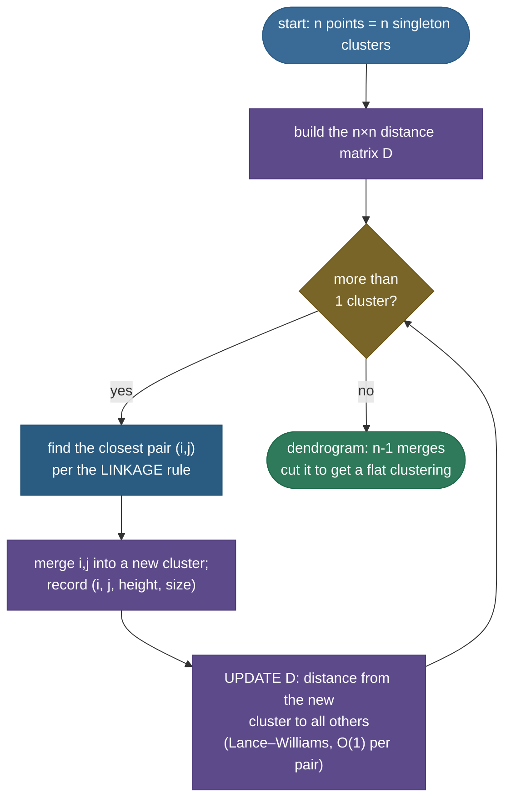
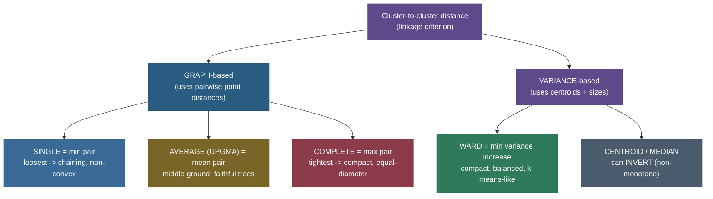

# Hierarchical Clustering: build the whole tree, then choose where to cut

Most clustering algorithms make you commit to a number up front. K-means asks "how many clusters?" before it has seen a single merge; you guess $k=3$, it hands you three blobs, and if you wanted five you re-run the whole thing. Hierarchical clustering refuses that bargain. Instead of producing *one* partition, it produces **all of them at once** — a nested family of clusterings from "every point is its own cluster" all the way up to "everything is one cluster" — and arranges them in a tree called a **dendrogram**. You read off the tree, slide a horizontal line up or down, and the number of clusters falls out of *where you cut*. No $k$ in advance; the structure decides.

That single idea — **don't choose $k$, build the hierarchy and choose a cut** — is why hierarchical clustering is the method of choice for taxonomies (the tree of life), gene-expression heatmaps, document organization, and anywhere the data is genuinely *nested* rather than flat. It is also the cleanest place to learn that the **distance between points is not the same as the distance between clusters**: the rule you pick for the latter — the **linkage criterion** — quietly determines the shape of everything that comes out.

By the end of this page you'll be able to:

- explain **agglomerative** (bottom-up merging) vs **divisive** (top-down splitting) and why agglomerative dominates in practice;
- state the four linkage criteria precisely — **single, complete, average, Ward** — and *derive* Ward's variance-increase cost;
- write the **Lance–Williams recurrence** and show it specializes to all four linkages, giving an $O(1)$ proximity update per pair;
- **read a dendrogram** — what merge order and merge heights mean, how cutting yields a flat clustering, and what an **inversion** is;
- compute the **cophenetic distance** and the **cophenetic correlation coefficient** that measure how faithfully the tree preserves the original distances;
- reason about the $O(n^2)$–$O(n^3)$ cost and **why it doesn't scale** to millions of points;
- choose the number of clusters from the **largest gap**, the **inconsistency coefficient**, or the **silhouette**;
- contrast it cleanly with **k-means, DBSCAN, and GMM**, and trace the whole thing by hand on real numbers.

Intuition and pictures first, then the linkage math (with sources), then four worked numeric examples and runnable code.

> **Note:** the one-line theory — hierarchical clustering computes a **whole tree of nested partitions** by greedily merging the closest pair of clusters (or splitting the loosest), where "closest" is defined by a **linkage criterion** over a **distance matrix**. You get *every* $k$ at once and pick one by **cutting the tree at a height**. It is deterministic, needs no $k$ upfront, works with any distance metric — and costs $O(n^2)$ memory, which caps it at small-to-medium $n$.

---

## The problem: you don't always know k, and the data is often nested

[K-means](01-K-Means-Clustering.md) is fast and excellent — when you know $k$ and your clusters are roughly spherical blobs of similar size. But two things break that bargain constantly:

1. **You don't know $k$.** In exploratory work — a new gene-expression dataset, a fresh customer base, an unlabeled corpus — the *number* of natural groups is exactly what you're trying to discover. Re-running k-means for every candidate $k$ and squinting at an elbow plot is a workaround, not an answer.
2. **The structure is a hierarchy, not a partition.** Biological taxa nest (species → genus → family → order). Documents nest (a sub-topic inside a topic inside a field). A flat list of $k$ clusters throws that nesting away. You want the *tree*.

Hierarchical clustering targets both. It never asks for $k$; it builds the full nested structure and lets you choose the granularity afterward — even *multiple* granularities from the *same* tree. That's the niche, and it's a large one.

### Intuition: organizing a messy bookshelf

Picture a shelf of unlabeled books and a librarian who has never seen them. K-means is the librarian who is *told* "make exactly three sections" and forces every book into one of three piles, even the oddballs. The **agglomerative** librarian works differently: she starts with **every book as its own pile**, then repeatedly walks the shelf and pushes together the **two piles that are most alike** — two cookbooks, then those plus a third cookbook, then the cookbook stack near the gardening stack, and so on — until everything is one giant pile. She writes down *the order in which she merged things* and *how different the two piles were each time she joined them*. That logbook **is** the dendrogram. Afterward, anyone can say "I want roughly five sections" and she just reads back to the moment there were five piles — no re-sorting. The librarian never needed to know the number of sections in advance; she discovered the whole nested structure and let you pick the resolution at the end. The one judgment call she makes over and over — *"which two piles are most alike?"* — is the **linkage criterion**, and (as we'll see) changing that rule changes the whole library.

> **Tip:** the interview framing is almost always **"k-means vs hierarchical."** The crisp answer: use k-means when you know $k$ and want speed at scale; use hierarchical when you *don't* know $k$, want a **nested** view, need a **non-Euclidean** distance, or want a **deterministic** result. The cost is $O(n^2)$ memory, so hierarchical is for small-to-medium $n$.

---

## What it is: two directions to build one tree

There are two ways to build the hierarchy, and they run in opposite directions.

- ***Agglomerative*** (**bottom-up**, "AGNES"). Start with $n$ clusters — every point alone. Repeatedly find the **closest pair of clusters** and **merge** them. After $n-1$ merges everything is one cluster, and the sequence of merges *is* the tree. This is the version everyone means by "hierarchical clustering."
- ***Divisive*** (**top-down**, "DIANA"). Start with one cluster containing everything. Repeatedly pick a cluster and **split** it into two. After $n-1$ splits every point is alone.

Both produce a binary tree of nested partitions; they just trace it from opposite ends.

```mermaid
graph TD
    subgraph AG["Agglomerative (bottom-up) — the common one"]
    A1["n singletons<br/>{a}{b}{c}{d}{e}"]:::data --> A2["merge closest pair<br/>{a,b}{c}{d}{e}"]:::process
    A2 --> A3["merge again<br/>{a,b}{c}{d,e}"]:::process
    A3 --> A4["… n-1 merges …"]:::process
    A4 --> A5["one cluster<br/>{a,b,c,d,e}"]:::out
    end
    subgraph DV["Divisive (top-down)"]
    B1["one cluster<br/>{a,b,c,d,e}"]:::out --> B2["split worst cluster"]:::danger
    B2 --> B3["… n-1 splits …"]:::danger
    B3 --> B4["n singletons"]:::data
    end

    classDef data fill:#3A6B96,stroke:#2A5B86,color:#fff
    classDef process fill:#5D4A8A,stroke:#4D3A7A,color:#fff
    classDef out fill:#2E7A5A,stroke:#1E6A4A,color:#fff
    classDef danger fill:#8B3B4A,stroke:#7B2B3A,color:#fff
```



> **Note:** **agglomerative dominates** because the merge step is cheap and well-defined — "find the closest of the existing clusters." Divisive's split step is the opposite: to split one cluster optimally you face an exponential number of 2-partitions, so divisive needs its own heuristic (often a mini k-means or a max-diameter split) at every node. Agglomerative is greedy but tractable; divisive is greedy *and* needs a sub-routine. Unless told otherwise, "hierarchical clustering" = **agglomerative**.

> **Gotcha:** both directions are **greedy and irreversible**. Agglomerative never *un*-merges; divisive never *re*-joins. A merge that looked best locally at step 3 is permanent even if it's globally wrong — there is no backtracking. This is the deepest structural weakness of the method, and the reason a single noisy bridge point can chain two real clusters together for good (we'll see exactly this with single linkage).

---

## The agglomerative loop, precisely

Here is the whole algorithm. Everything else on this page is a detail of one line: *how do you measure the distance between two clusters?*



The merge sequence on a tiny 2-D set looks like this — singletons progressively absorb their nearest neighbours until only the requested number of clusters remain:


> **Note:** the merge produces $n-1$ rows — exactly the contents of SciPy's **linkage matrix** $Z$. Each row is `[i, j, height, size]`: the two clusters merged, the linkage **distance at which they merged** (the *height*), and the size of the resulting cluster. That matrix *is* the dendrogram; `dendrogram(Z)` just draws it and `fcluster(Z, …)` just cuts it.

---

## Point distance vs cluster distance: the linkage criterion

Here is the crux of the entire method. To start, you have a **distance metric** $d(x, y)$ between two *points* — Euclidean, Manhattan, cosine, correlation, whatever fits your data. But the loop above asks for the distance between two *clusters*, which are sets of points. How far apart are the set $\{a, b\}$ and the set $\{c, d, e\}$? There is no single answer — there's a *choice*, and that choice is the **linkage criterion** $D(C_i, C_j)$. The four canonical ones:

| Linkage | Definition $D(C_i, C_j)$ | Effect | Failure mode |
|---|---|---|---|
| **Single** | $\min_{x \in C_i,\, y \in C_j} d(x,y)$ — nearest pair | follows **non-convex** shapes; finds "threads" | **chaining**: one bridge point welds clusters |
| **Complete** | $\max_{x \in C_i,\, y \in C_j} d(x,y)$ — farthest pair | **compact**, roughly equal-diameter balls | breaks large/elongated clusters apart |
| **Average (UPGMA)** | $\frac{1}{|C_i||C_j|}\sum_{x \in C_i}\sum_{y \in C_j} d(x,y)$ — mean pairwise | a compromise between single & complete | less interpretable; mild metric assumptions |
| **Ward** | minimize the **increase in within-cluster variance** from merging | tight, **spherical**, similar-size clusters | needs Euclidean; behaves like k-means |

A taxonomy of the choices, with where each falls on the "loose ↔ tight" spectrum:



> **Note:** **single** asks "are the two clusters touching *anywhere*?" — one short edge is enough to merge. **Complete** asks "are they close *everywhere*?" — the worst-case pair must be close. They sit at opposite extremes; **average** and **Ward** live in between. This is why the *same data at the same $k$* gives different clusterings under different linkages:


On these interleaving crescents, **single linkage recovers the true moons** (it follows the thin curved shape), while **complete and Ward carve compact blobs** straight across them — because compactness, not connectivity, is what they optimize. Neither is "right"; they encode different notions of what a cluster *is*. Choosing the linkage *is* choosing your definition of a cluster.

> **Gotcha — single-linkage chaining.** Single linkage's superpower is also its curse. Because one short edge merges two clusters, a thin "chain" of intermediate points — or a single noisy bridge — can **link two genuinely separate clusters into one**. On clean non-convex data (the moons) this is exactly what you want; on noisy blobs it's a disaster. *Single linkage is fragile to noise precisely because it is sensitive to single points.*

---

## Deriving Ward's criterion: minimize the variance you add

Ward's method (Ward, 1963) is the modern default and the one worth deriving, because it connects hierarchical clustering directly to k-means' objective. Ward says: **merge the pair whose merger increases the total within-cluster variance the least.**

Define the within-cluster **sum of squared errors** (SSE, or inertia) of a cluster $C$ with centroid $\mu_C = \frac{1}{|C|}\sum_{x \in C} x$:

$$\text{SSE}(C) \;=\; \sum_{x \in C} \lVert x - \mu_C \rVert^2 .$$

When we merge $C_i$ and $C_j$ into $C_{i \cup j}$, the total SSE rises (a bigger cluster has a farther-flung centroid). Ward's merge cost is exactly that rise:

$$\Delta_{\text{Ward}}(C_i, C_j) \;=\; \text{SSE}(C_{i \cup j}) - \text{SSE}(C_i) - \text{SSE}(C_j).$$

The beautiful part is that this telescopes into a closed form depending **only on the two centroids and the two sizes** — you never need the individual points:

$$\boxed{\;\Delta_{\text{Ward}}(C_i, C_j) \;=\; \frac{|C_i|\,|C_j|}{|C_i| + |C_j|}\, \lVert \mu_{C_i} - \mu_{C_j} \rVert^2\;}$$

*Derivation sketch.* Expand $\text{SSE}(C_{i\cup j}) = \sum_{x\in C_i}\lVert x-\mu\rVert^2 + \sum_{y\in C_j}\lVert y-\mu\rVert^2$ where $\mu = \frac{n_i\mu_i + n_j\mu_j}{n_i+n_j}$ is the merged centroid (with $n_i = |C_i|$). Using the identity $\sum_{x\in C}\lVert x-\mu\rVert^2 = \sum_{x\in C}\lVert x-\mu_i\rVert^2 + n_i\lVert\mu_i-\mu\rVert^2$ for each part and substituting $\mu_i - \mu = \frac{n_j}{n_i+n_j}(\mu_i-\mu_j)$, the $\text{SSE}(C_i)$ and $\text{SSE}(C_j)$ terms cancel and the cross terms collapse to the boxed expression. (Full algebra in ESL §14.3.12.)

> **Note:** read the boxed formula. The cost grows with the **squared centroid distance** (far clusters cost more to merge) and with the **harmonic-mean-like size factor** $\frac{n_i n_j}{n_i + n_j}$ — merging two *big* clusters costs more than merging a big one with a singleton, even at the same centroid distance. That size penalty is what makes Ward produce clusters of **similar size**, and why it behaves so much like k-means (both minimize within-cluster variance — Ward greedily, k-means iteratively).

> **Tip:** for **two singletons**, $n_i = n_j = 1$, so $\Delta_{\text{Ward}} = \frac{1}{2}\lVert x - y\rVert^2$ — half the squared Euclidean distance. SciPy reports Ward heights as $\sqrt{2\,\Delta}$ so that the first merges line up with ordinary distances; don't be surprised the dendrogram heights aren't literally $\Delta$.

---

## The Lance–Williams recurrence: update the matrix in O(1) per pair

After every merge you must recompute the distance from the **new** cluster $C_{i \cup j}$ to every other cluster $C_k$. Done naively — re-scanning all the member points — that's expensive. **Lance & Williams (1967)** showed that for *all* the standard linkages, the new distance is a fixed linear combination of three numbers you **already have**: $d(C_i, C_k)$, $d(C_j, C_k)$, and $d(C_i, C_j)$. One formula, $O(1)$ per pair:

$$D(C_{i\cup j},\, C_k) \;=\; \alpha_i\, D(C_i, C_k) \;+\; \alpha_j\, D(C_j, C_k) \;+\; \beta\, D(C_i, C_j) \;+\; \gamma\, \lvert D(C_i, C_k) - D(C_j, C_k)\rvert .$$

Plug in the coefficients and you recover each linkage exactly (let $n_i = |C_i|$, etc.):

| Linkage | $\alpha_i$ | $\alpha_j$ | $\beta$ | $\gamma$ |
|---|---|---|---|---|
| **Single** | $\tfrac12$ | $\tfrac12$ | $0$ | $-\tfrac12$ |
| **Complete** | $\tfrac12$ | $\tfrac12$ | $0$ | $+\tfrac12$ |
| **Average (UPGMA)** | $\tfrac{n_i}{n_i+n_j}$ | $\tfrac{n_j}{n_i+n_j}$ | $0$ | $0$ |
| **Ward** | $\tfrac{n_i+n_k}{n_i+n_j+n_k}$ | $\tfrac{n_j+n_k}{n_i+n_j+n_k}$ | $\tfrac{-n_k}{n_i+n_j+n_k}$ | $0$ |

> **Note:** check the elegance. Single and complete use the *same* $\alpha,\beta$ and differ only in the **sign of $\gamma$**: $\tfrac12(a+b) - \tfrac12|a-b| = \min(a,b)$ (single), and $\tfrac12(a+b) + \tfrac12|a-b| = \max(a,b)$ (complete). The identity $\min(a,b) = \frac{a+b-|a-b|}{2}$ *is* the single-linkage update. Average drops the $|{\cdot}|$ term entirely and weights by size. Ward adds the third-cluster size $n_k$ into the mix — the only one whose coefficients depend on the *other* cluster.

> **Tip:** Lance–Williams is *why* agglomerative clustering is tractable at all. Without it, each of the $n-1$ merges would rescan member points; with it, a merge only touches the $O(n)$ remaining clusters, each in $O(1)$. It turns a naive $O(n^3)$-ish update into the $O(n^2 \log n)$ priority-queue algorithm and underlies fast implementations (Müllner 2011).

---

## The dendrogram: reading the tree

The output is a **dendrogram** — a binary tree where each leaf is a data point and each internal node is a merge, drawn at a **height equal to the linkage distance** at which that merge happened. It is the single most information-dense object in clustering:


Read it like this:

- **Leaves** (bottom) = individual points. **Internal nodes** = merges. The **height** of a node = the distance at which its two children merged.
- **Merge order** runs bottom-up: the lowest joins happened first (closest clusters), the root last (the two most-dissimilar super-clusters).
- **A tall vertical link before a merge** = those two clusters stayed apart for a long time = they are very dissimilar. **Big vertical gaps** between successive merges signal a *natural* number of clusters.
- **Cutting** the tree with a horizontal line at height $h$ severs every link that crosses it; each resulting subtree below the line is one **flat cluster**. The line at $h = 11$ above crosses four links → **four clusters**. Slide it up → fewer, bigger clusters; slide it down → more, smaller ones. *One tree, every $k$.*

> **Note:** this is the payoff of building the whole hierarchy: you don't re-cluster to change $k$, you just **move the cut line**. Cut at $h=11$ for 4 clusters, at $h=40$ for 2, at $h=2$ for a dozen — all from the *same* linkage matrix, instantly.

> **Gotcha — inversions.** A dendrogram normally has **monotonically increasing** merge heights (each merge is at least as costly as the last). **Single, complete, and average** linkage guarantee this. **Centroid** and **median** linkage do **not**: a later merge can occur at a *lower* height than an earlier one, producing an **inversion** (a downward "U" in the tree) that is visually confusing and makes the cut ill-defined. Ward is monotone *as scipy implements it*. If your dendrogram looks tangled, suspect centroid/median linkage. (This is why centroid linkage is rarely the default.)

---

## Cophenetic distance: how faithful is the tree?

A dendrogram **compresses** the full $n \times n$ distance matrix into a tree, and any compression loses information. The **cophenetic distance** $d_C(x, y)$ between two points is the **height at which they first land in the same cluster** — the height of their lowest common ancestor in the dendrogram. It's the distance the *tree* claims they are apart.

How well does that tree-distance agree with the *original* point distances $d(x,y)$? Measure it with the **cophenetic correlation coefficient** — the Pearson correlation between the two flattened distance lists (all $\binom{n}{2}$ pairs):

$$c \;=\; \frac{\sum_{i<j}\bigl(d(i,j) - \bar d\bigr)\bigl(d_C(i,j) - \bar d_C\bigr)}{\sqrt{\sum_{i<j}\bigl(d(i,j)-\bar d\bigr)^2}\,\sqrt{\sum_{i<j}\bigl(d_C(i,j)-\bar d_C\bigr)^2}} .$$

A value near **1** means the dendrogram preserves the original geometry faithfully; a low value means the tree is a poor summary of the real distances.

> **Tip:** the cophenetic correlation is a clean, **linkage-selection** tool: build the tree under single / complete / average / Ward, compute $c$ for each, and prefer the linkage whose tree most faithfully represents your data. On Iris (measured below) average linkage scores highest ($c \approx 0.877$), narrowly above Ward — a quantitative way to choose, instead of eyeballing.

> **Gotcha:** a high cophenetic correlation means the tree faithfully encodes the **distances** — it does **not** mean the clusters you get by cutting are "good" or match any ground truth. Faithful representation and useful partition are different questions; check both (e.g. also look at silhouette on the cut).

---

## Complexity: why it doesn't scale to millions

The cost is the method's hard ceiling, and interviewers love it:

- **Memory: $O(n^2)$.** You hold the full pairwise distance (or proximity) matrix. For $n = 100{,}000$ points that's $\sim 10^{10}$ floats $\approx$ **40 GB** — already infeasible. This, not time, is usually what stops you.
- **Time: $O(n^3)$ naive** — each of $n-1$ merges scans the $O(n^2)$ matrix for the minimum. With a **priority queue / heap** of candidate distances it drops to $O(n^2 \log n)$. For single and complete linkage there are exact $O(n^2)$ algorithms (**SLINK** for single, **CLINK** for complete; Müllner's `nearest-neighbor chain` for the others).

| Algorithm / regime | Time | Memory |
|---|---|---|
| Naive agglomerative | $O(n^3)$ | $O(n^2)$ |
| Priority-queue / heap | $O(n^2 \log n)$ | $O(n^2)$ |
| SLINK (single) / CLINK (complete) | $O(n^2)$ | $O(n)$ |
| Nearest-neighbor chain (Ward, average, complete) | $O(n^2)$ | $O(n^2)$ |

Put concrete numbers on the memory wall (one float = 8 bytes; the condensed matrix stores only the $\binom{n}{2}$ upper triangle, so $\approx 4n^2$ bytes):

| $n$ | distance-matrix memory | feasible? |
|---|---|---|
| $1{,}000$ | $\sim 4$ MB | trivially |
| $10{,}000$ | $\sim 400$ MB | yes, comfortably |
| $50{,}000$ | $\sim 10$ GB | borderline (needs a big box) |
| $100{,}000$ | $\sim 40$ GB | no, on most machines |
| $1{,}000{,}000$ | $\sim 4$ TB | hopeless |

> **Note:** the practical takeaway: hierarchical clustering is a **small-to-medium-$n$** method — thousands to low tens of thousands of points. Past that, the **$O(n^2)$ memory** wall hits first. For large $n$ you either (a) cluster a **sample** and assign the rest, (b) use **mini-batch k-means** / **BIRCH** (which builds a compact summary tree in one pass), or (c) use **HDBSCAN** (a density-based, hierarchical cousin that scales far better). Knowing this ceiling — and these escape hatches — is a frequent interview follow-up.

---

## Choosing the number of clusters

You still have to pick *where* to cut. Three standard tools, in increasing rigor:

1. **Largest gap (the "elbow" of the dendrogram).** Find the biggest vertical jump between consecutive merge heights and cut **inside that gap**. Big gap = the two groups it joins are far more dissimilar than anything merged below it, so they're "naturally" separate. Eyeball-able straight off the tree.
2. **Inconsistency coefficient.** For each merge, compare its height to the **mean and standard deviation** of the merge heights just below it: $\text{incons} = \frac{h - \bar h_{\text{below}}}{s_{\text{below}}}$. A merge that is *much* taller than its descendants (high inconsistency) is a good place to cut. SciPy's `fcluster(Z, t, criterion='inconsistent')` automates this; it's a local, data-driven version of the gap heuristic.
3. **Silhouette / Davies–Bouldin / gap statistic.** Cut at several $k$, score each flat clustering with an external validity index (the **silhouette** is the usual pick — mean of $\frac{b-a}{\max(a,b)}$ per point, where $a$ = intra-cluster, $b$ = nearest-other-cluster distance), and take the best. This *evaluates the partition*, not just the tree, so it's the most defensible.

A measured warning that these heuristics can *disagree with ground truth*. Cutting Ward's Iris tree and scoring each $k$ by silhouette:

```
Ward on Iris - silhouette by cut:
  k=2: silhouette = 0.687   <- highest
  k=3: silhouette = 0.554
  k=4: silhouette = 0.489
  k=6: silhouette = 0.359
```

The silhouette **peaks at $k=2$**, not the biologically correct $k=3$ — because *versicolor* and *virginica* overlap so much that, geometrically, they look like *one* cluster plus the well-separated *setosa*. The largest dendrogram gap agrees ($k\approx 2$). Both heuristics are "right" about the geometry and "wrong" about the species: the data simply doesn't *contain* three cleanly separable groups. This is the honest limit of unsupervised cluster-count selection — it finds geometric structure, which need not equal your labels.

> **Tip:** combine them — use the **largest gap** to propose a couple of candidate cuts, then **silhouette** to choose between them. The dendrogram gives you a shortlist; the silhouette breaks the tie. Don't trust a single heuristic blindly.

> **Gotcha:** as the Iris result shows, the "best" $k$ by an internal index can differ from the "true" number of classes whenever clusters overlap. Internal validity (silhouette, gap, inconsistency) measures **separation in feature space**, *not* agreement with labels. When you do have labels, validate against them (ARI, NMI); when you don't, report the structure you found and the $k$ it suggests — and don't claim it's the ground truth.

---

## Hierarchical vs k-means vs DBSCAN vs GMM

Where it sits among the clustering families:

| | **Hierarchical (agglomerative)** | **[K-means](01-K-Means-Clustering.md)** | **[DBSCAN](03-DBSCAN.md)** | **[GMM / EM](04-Gaussian-Mixture-Models-and-EM.md)** |
|---|---|---|---|---|
| **Pick $k$ upfront?** | **No** — cut the tree after | Yes | No ($\varepsilon$, minPts instead) | Yes |
| **Cluster shape** | depends on linkage (Ward→spherical, single→arbitrary) | spherical, equal-ish size | arbitrary, density-defined | ellipsoidal (full covariance) |
| **Handles noise/outliers?** | poorly (esp. single linkage) | poorly | **yes** — labels noise points | softly (low responsibility) |
| **Output** | a **tree** of nested partitions | a flat partition | a flat partition + noise | soft (probabilistic) assignment |
| **Deterministic?** | **yes** (no random init) | no (k-means++ seeding) | yes | no (EM init) |
| **Complexity** | $O(n^2)$ time/mem | $O(nki)$ — **scales** | $O(n\log n)$ with index | $O(nkdi)$ |
| **Best when** | small $n$, unknown $k$, nested structure, any metric | large $n$, known $k$, round blobs | arbitrary shapes + noise, unknown $k$ | overlapping, elliptical, want soft labels |

> **Note:** the clean mental map — **k-means**: fast, flat, spherical, needs $k$. **Hierarchical**: a *tree* (every $k$), deterministic, any metric, but $O(n^2)$. **DBSCAN**: density + noise, arbitrary shapes, no $k$. **GMM**: soft, elliptical, probabilistic. Hierarchical and DBSCAN both free you from choosing $k$; hierarchical gives you the *nested* view that the others can't.

---

## Worked example 1: a 5-point trace by hand (single vs complete)

Nothing cements this like doing it by hand. Five points in 2-D:

$$A=(1,1),\quad B=(1.5,1.5),\quad C=(5,5),\quad D=(3,4),\quad E=(4,4).$$

**Step 0 — the Euclidean distance matrix** (symmetric; diagonal 0):

| | A | B | C | D | E |
|---|---|---|---|---|---|
| **A** | 0 | 0.71 | 5.66 | 3.61 | 4.24 |
| **B** | 0.71 | 0 | 4.95 | 2.92 | 3.54 |
| **C** | 5.66 | 4.95 | 0 | 2.24 | 1.41 |
| **D** | 3.61 | 2.92 | 2.24 | 0 | 1.00 |
| **E** | 4.24 | 3.54 | 1.41 | 1.00 | 0 |

**Agglomerative trace.** Always merge the global minimum each step. (For singletons, $\min$ = $\max$ = the point distance, so single and complete share the first two merges.)

1. **Smallest entry is $d(A,B)=0.71$** → merge **{A,B}** at height **0.71**.
2. **Next smallest is $d(D,E)=1.00$** → merge **{D,E}** at height **1.00**.

Now the linkages diverge, because we must measure cluster-to-cluster distance. Remaining clusters: $\{A,B\}$, $\{C\}$, $\{D,E\}$.

3. **Single linkage** uses the *nearest* pair. $D(\{C\},\{D,E\}) = \min(d(C,D), d(C,E)) = \min(2.24, 1.41) = \mathbf{1.41}$, and $D(\{A,B\},\{D,E\}) = \min(3.61, 4.24, 2.92, 3.54) = 2.92$. The smallest is **1.41** → merge **{C} into {D,E}** → $\{C,D,E\}$ at height **1.41**.
   - **Complete linkage** uses the *farthest* pair. $D(\{C\},\{D,E\}) = \max(2.24, 1.41) = \mathbf{2.24}$, still the smallest available → merge **{C,D,E}** at height **2.24** (higher than single's 1.41, because complete measures the worst-case pair).
4. **Last merge** joins $\{A,B\}$ with $\{C,D,E\}$.
   - **Single:** $\min$ over all cross pairs $= d(B,D) = 2.92$ → root height **2.92**.
   - **Complete:** $\max$ over all cross pairs $= d(A,C) = 5.66$ → root height **5.66**.

**Result.** Both linkages give the *same partition* at a $k=2$ cut: $\{A,B\}$ vs $\{C,D,E\}$. But the **dendrograms differ**: single's {C,D,E} forms at height **1.41** and the root sits at **2.92**; complete's {C,D,E} forms at **2.24** and the root at **5.66**. Complete linkage's heights are uniformly **taller** because it always charges the worst-case pair — its tree is "stretched" and its internal gaps are wider. SciPy confirms every number:

```
single   linkage:  {A,B}@0.707  {D,E}@1.000  {C,D,E}@1.414  root@2.915
complete linkage:  {A,B}@0.707  {D,E}@1.000  {C,D,E}@2.236  root@5.657
```

> **Note:** even when the *labels* agree, the *heights* carry information: complete's much larger root-to-subtree gap ($5.66$ vs $2.92$) makes the two-cluster structure look more decisive. On noisier or chain-shaped data the labels themselves would diverge — single would chain, complete would stay compact (exactly the moons figure above, and the Iris run in Example 4 where single produces a degenerate split).

---

## Worked example 2: Ward's merge cost, by the formula

Take the first merge from the trace, $\{A\}$ and $\{B\}$, and price it with the boxed Ward formula. Both are singletons, so $n_i = n_j = 1$ and $\mu_{C_i}=A$, $\mu_{C_j}=B$:

$$\Delta_{\text{Ward}}(\{A\},\{B\}) = \frac{1 \cdot 1}{1+1}\,\lVert A - B\rVert^2 = \tfrac12\bigl[(1{-}1.5)^2 + (1{-}1.5)^2\bigr] = \tfrac12(0.25+0.25) = \mathbf{0.25}.$$

Now compare merging a singleton into a *pair* vs into another singleton at the **same centroid distance**, to see the size penalty bite. Suppose cluster $C_i$ has size 1 and $C_j$ has size 4, centroids 2 units apart:

$$\Delta = \frac{1\cdot 4}{1+4}\,(2^2) = \frac{4}{5}\cdot 4 = 3.2,\qquad\text{vs two singletons 2 apart: } \frac{1\cdot1}{2}\,(2^2)=2.0.$$

Same geometry, **but merging into the bigger cluster costs more** (3.2 > 2.0). That size-weighting is precisely what pushes Ward toward **balanced, similar-sized** clusters. (SciPy reports the height as $\sqrt{2\Delta}$; for $\{A\},\{B\}$ that's $\sqrt{0.5}=0.707$ — matching the trace.)

---

## Worked example 3: one Lance–Williams update, with numbers

We just merged $\{A\}$ and $\{B\}$ from Example 1. Update the distance from the **new cluster $\{A,B\}$** to $\{C\}$ using Lance–Williams — *without* touching the original points, only the three numbers we already have: $d(A,C)=5.66$, $d(B,C)=4.95$, $d(A,B)=0.71$.

**Single** ($\alpha_i=\alpha_j=\tfrac12,\ \beta=0,\ \gamma=-\tfrac12$):
$$D(\{A,B\},C) = \tfrac12(5.66) + \tfrac12(4.95) + 0 - \tfrac12|5.66-4.95| = 5.305 - 0.355 = \mathbf{4.95} = \min(5.66, 4.95).\ \checkmark$$

**Complete** (same but $\gamma=+\tfrac12$):
$$D(\{A,B\},C) = 5.305 + 0.355 = \mathbf{5.66} = \max(5.66, 4.95).\ \checkmark$$

The recurrence reproduces $\min$ and $\max$ exactly — and it cost three multiplies and an absolute value, *not* a rescan of cluster members. That $O(1)$ update, applied to the $O(n)$ surviving clusters per merge, is the whole efficiency story. (SciPy verifies: the LW single update returns 4.950, complete 5.657.)

---

## Worked example 4: cophenetic correlation on real data (Iris)

Now a *measured* run. Cluster the 150-sample, 4-feature **Iris** dataset under each linkage, compute the **cophenetic correlation** of each tree, and cut at $k=3$:

```
iris single   : cophenetic corr = 0.864   k=3 cluster sizes = [50,  2, 98]
iris complete : cophenetic corr = 0.727   k=3 cluster sizes = [72, 28, 50]
iris average  : cophenetic corr = 0.877   k=3 cluster sizes = [50, 36, 64]
iris ward     : cophenetic corr = 0.873   k=3 cluster sizes = [50, 36, 64]
```

Three lessons fall straight out: (1) **average linkage** preserves Iris's geometry best ($c=0.877$) — a quantitative reason to prefer it here. (2) **Single linkage chains** — its $k=3$ cut produces a degenerate $[50, 2, 98]$ split (one near-empty cluster, two giant ones), the chaining pathology in numbers. (3) **Ward and average** both recover the clean $[50, 36, 64]$ structure (Iris has 50 of each species; the 36/64 split reflects the genuine overlap of *versicolor* and *virginica*, which no unsupervised method separates perfectly). The full reproducible run is in the code below.

---

## Code: trace it, measure it, cut it

Everything above, verified end to end — the linkage matrices, the cophenetic correlations, the single-vs-complete-vs-Ward comparison, and a dendrogram cut. Runs on CPU in a second; no GPU.

```python
"""Hierarchical clustering, end to end: linkage matrices, cophenetic correlation,
single vs complete vs Ward, and an fcluster cut. Verified on Python 3.12
(scipy 1.17, scikit-learn 1.9), CPU."""
import numpy as np
from scipy.cluster.hierarchy import linkage, fcluster, cophenet, dendrogram
from scipy.spatial.distance import pdist, squareform
from sklearn.datasets import load_iris

# --- Example 1: the 5-point hand trace ---
names = ["A", "B", "C", "D", "E"]
X = np.array([[1, 1], [1.5, 1.5], [5, 5], [3, 4], [4, 4]], float)
D = squareform(pdist(X))
print("distance matrix (rounded):")
print(np.round(D, 2))

for method in ("single", "complete", "ward"):
    Z = linkage(X, method=method)                       # the (n-1) x 4 linkage matrix
    print(f"\n{method:8s} merges  [idxA idxB height size]:")
    for r in Z:
        print(f"   {int(r[0]):2d} {int(r[1]):2d}  h={r[2]:6.3f}  size={int(r[3])}")
    print("   k=2 labels:", dict(zip(names, fcluster(Z, t=2, criterion="maxclust"))))

# --- Example 2: Ward merge cost of two singletons {A},{B} (closed form) ---
a, b = X[0], X[1]
ward_cost = (1 * 1 / (1 + 1)) * np.sum((a - b) ** 2)
print(f"\nWard SSE increase merging A,B = {ward_cost:.3f}  (scipy height = sqrt(2*cost) = {np.sqrt(2*ward_cost):.3f})")

# --- Example 3: one Lance-Williams update for d({A,B}, C) ---
dac, dbc, dab = D[0, 2], D[1, 2], D[0, 1]
single_lw = 0.5 * dac + 0.5 * dbc - 0.5 * abs(dac - dbc)
complete_lw = 0.5 * dac + 0.5 * dbc + 0.5 * abs(dac - dbc)
print(f"Lance-Williams d(AB,C): single={single_lw:.3f} (=min), complete={complete_lw:.3f} (=max)")

# --- Example 4: cophenetic correlation + k=3 cut on real Iris data ---
Xi = load_iris().data
print("\niris cophenetic correlation and k=3 cluster sizes:")
for method in ("single", "complete", "average", "ward"):
    Z = linkage(Xi, method=method)
    c, _ = cophenet(Z, pdist(Xi))                       # tree faithfulness in [0, 1]
    sizes = np.bincount(fcluster(Z, t=3, criterion="maxclust"))[1:]
    print(f"   {method:9s}: cophenetic corr = {c:.3f}   sizes = {sizes.tolist()}")

# single vs complete vs ward give DIFFERENT partitions on Iris -> confirm
labs = {m: fcluster(linkage(Xi, method=m), t=3, criterion="maxclust") for m in ("single", "complete", "ward")}
print("\nsingle != complete labels:", not np.array_equal(labs["single"], labs["complete"]))
print("complete != ward labels:  ", not np.array_equal(labs["complete"], labs["ward"]))
```

Output:

```
distance matrix (rounded):
[[0.   0.71 5.66 3.61 4.24]
 [0.71 0.   4.95 2.92 3.54]
 [5.66 4.95 0.   2.24 1.41]
 [3.61 2.92 2.24 0.   1.  ]
 [4.24 3.54 1.41 1.   0.  ]]

single   merges  [idxA idxB height size]:
    0  1  h= 0.707  size=2
    3  4  h= 1.000  size=2
    2  6  h= 1.414  size=3
    5  7  h= 2.915  size=5
   k=2 labels: {'A': 1, 'B': 1, 'C': 2, 'D': 2, 'E': 2}

complete merges  [idxA idxB height size]:
    0  1  h= 0.707  size=2
    3  4  h= 1.000  size=2
    2  6  h= 2.236  size=3
    5  7  h= 5.657  size=5
   k=2 labels: {'A': 1, 'B': 1, 'C': 2, 'D': 2, 'E': 2}

ward     merges  [idxA idxB height size]:
    0  1  h= 0.707  size=2
    3  4  h= 1.000  size=2
    2  6  h= 2.082  size=3
    5  7  h= 6.401  size=5
   k=2 labels: {'A': 1, 'B': 1, 'C': 2, 'D': 2, 'E': 2}

Ward SSE increase merging A,B = 0.250  (scipy height = sqrt(2*cost) = 0.707)
Lance-Williams d(AB,C): single=4.950 (=min), complete=5.657 (=max)

iris cophenetic correlation and k=3 cluster sizes:
   single   : cophenetic corr = 0.864   sizes = [50, 2, 98]
   complete : cophenetic corr = 0.727   sizes = [72, 28, 50]
   average  : cophenetic corr = 0.877   sizes = [50, 36, 64]
   ward     : cophenetic corr = 0.873   sizes = [50, 36, 64]

single != complete labels: True
complete != ward labels:   True
```

> **Note:** every claim on the page is in that output: the hand-trace heights (single root 2.915 vs complete 5.657), the Ward cost 0.250 → height 0.707, the Lance–Williams $\min$/$\max$ reproduction, the four cophenetic correlations, the chaining `[50, 2, 98]` degenerate split, and the proof that **single, complete, and Ward give genuinely different partitions** on real data. The dendrograms and linkage-comparison figures come from `tools/gen_hierarchical_diagrams.py`, fully reproducible with the same library versions.

> **Tip:** to *see* it, run `scipy.cluster.hierarchy.dendrogram(Z)` on any `Z` above and `fcluster(Z, t=h, criterion="distance")` to cut at a chosen height instead of a chosen $k$. The two `criterion` modes — `maxclust` (give me exactly $k$) and `distance` (cut at height $h$) — are the two ways to read a tree.

---

## Single-linkage chaining vs Ward, in one picture

The chaining gotcha is worth seeing once more on harder data. On two interleaving moons, **single linkage follows the crescents** (chaining is exactly the right behaviour for a thin, connected, non-convex shape), while **Ward — wanting compact blobs — slices the moons vertically**, putting half of each moon in each cluster:


> **Gotcha:** this is the whole linkage trade-off in one image. Single linkage's connectivity bias is a *feature* on clean non-convex data and a *bug* the instant noise bridges two real clusters. Ward's compactness bias is the opposite. Neither is universally correct — **match the linkage to the geometry you expect**, and when in doubt, build a couple of trees and compare their cophenetic correlations and silhouettes.

---

## Divisive clustering in practice, and connectivity constraints

Two practical wrinkles that come up the moment you leave the textbook.

**Divisive, done tractably.** We said the optimal split at each divisive node is exponential, so nobody does it exactly. In practice **divisive = recursive 2-means** (often called **bisecting k-means**): at each node, run k-means with $k=2$ to split the cluster in two, recurse on each child, and stop at the desired depth or size. This gives a top-down tree in $O(n \log n)$-ish time — *much* cheaper than agglomerative's $O(n^2)$ — at the cost of inheriting k-means' spherical bias and randomness. It's the reason divisive survives at all: not as the pure DIANA algorithm, but as bisecting k-means in large-scale text and recommendation pipelines where you want a coarse hierarchy fast.

> **Note:** the trade is clean. **Agglomerative**: exact greedy merges, any linkage/metric, $O(n^2)$ — best for small $n$ and faithful structure. **Divisive (bisecting k-means)**: heuristic splits, k-means-shaped, near-linear — best when $n$ is large and you only need a *coarse* top-of-tree. They are not interchangeable; they make opposite cost/fidelity bets.

**Connectivity constraints.** A second, very practical lever: you can forbid merges between points that aren't *neighbors* in some external graph. scikit-learn's `AgglomerativeClustering(connectivity=…)` takes a sparse adjacency (e.g. a $k$-nearest-neighbor graph, or pixel adjacency for an image) and only allows a merge if the two clusters are connected in it. Two payoffs: (1) it **encodes spatial/structural priors** — segmenting an image, you only merge touching regions, so clusters are contiguous; (2) it **slashes the cost**, because the proximity matrix becomes sparse and you skip the vast majority of cluster pairs. With Ward + a connectivity graph, agglomerative clustering scales to far larger $n$ than the dense $O(n^2)$ bound suggests.

> **Tip:** connectivity-constrained Ward is the standard way to do **agglomerative image/mesh segmentation**: build the pixel-adjacency graph, run Ward, cut the tree — you get contiguous regions for free, and the sparse graph keeps it fast. It's the one routine where hierarchical clustering comfortably handles hundreds of thousands of items.

---

## Where it's used, and when not to

**Used:**

- **Bioinformatics** — gene-expression heatmaps are *defined* by a hierarchical clustering of rows and columns (the dendrograms on the margins); phylogenetics builds trees of species. The nested output *is* the science.
- **Taxonomy & document/topic organization** — anywhere the natural structure is a tree (catalogs, ontologies, a corpus of documents into nested topics).
- **Exploratory analysis on modest data** — when $n$ is in the thousands, you don't know $k$, and you want to *see* the merge structure before committing.
- **Any custom distance** — because it only needs a distance *matrix*, it clusters things k-means can't: strings (edit distance), sequences (DTW), graphs, correlation-based gene distances.

**Avoid it when:**

- **$n$ is large** (≳ tens of thousands) — the $O(n^2)$ memory wall. Sample-then-assign, BIRCH, or HDBSCAN instead.
- **You have heavy noise/outliers** — especially with single linkage (chaining). DBSCAN/HDBSCAN handle noise explicitly.
- **You need soft/probabilistic assignments** — use GMM.

> **Gotcha:** like every distance-based method, hierarchical clustering is **acutely sensitive to feature scaling**. A feature measured in thousands (income) will dominate the Euclidean distance over one measured in units (age), and the tree will cluster on income alone. **Standardize (or otherwise scale) your features first** — and pick a distance metric that matches your data (cosine for text/embeddings, correlation for gene expression). The linkage and the metric together define "similar"; choose both deliberately.

---

## Application: a hierarchical-clustering playbook

The reasoning I'd actually run, given a fresh dataset and "find the natural groups":

1. **Scale.** Standardize features (or choose a scale-free metric). Distance-based, so this is not optional.
2. **Pick a metric.** Euclidean for general numeric data; cosine for text/embeddings; correlation for gene expression; a custom distance for structured objects.
3. **Pick a linkage — and justify it.** **Ward** as the default (compact, balanced, k-means-like) for clean numeric data; **average** for a faithful general-purpose tree; **single** *only* when you specifically want to follow non-convex/connected shapes and the data is clean; **complete** when you want tight, equal-diameter clusters and can tolerate splitting big ones.
4. **Build the tree** (`scipy.linkage`), **plot the dendrogram**, and **eyeball the largest gap** for a candidate $k$.
5. **Validate the linkage** with the **cophenetic correlation**; if it's low, try another linkage/metric.
6. **Cut** at the chosen height/$k$ (`fcluster`), then **score** the flat partition with the **silhouette** across a few candidate cuts and pick the best.
7. **Sanity-check** the clusters against domain knowledge; if single-linkage gave one giant cluster + slivers, that's chaining — switch linkage.

Every step is one of the ideas above; the playbook is just their order.

---

## Subtleties that trip people up

A few finer points that separate a textbook answer from a real understanding:

- **UPGMA vs WPGMA (two "average" linkages).** What we called *average* is **UPGMA** — *un*-weighted pair-group method, where the cluster-pair distance weights every *point* equally (so a big cluster pulls more). Its sibling **WPGMA** weights every *cluster* equally regardless of size (the Lance–Williams $\alpha_i = \alpha_j = \tfrac12$ form). UPGMA is the usual default and is what scikit-learn/scipy call `average`; WPGMA is `weighted`. The distinction matters in phylogenetics, where unequal clade sizes are common.
- **Ward needs squared Euclidean.** Ward's derivation rests on variance, which is defined via squared Euclidean distance — so feeding scipy a *precomputed* non-Euclidean distance matrix with `method='ward'` is a **category error** (the variance interpretation breaks, even if it returns numbers). If your metric isn't Euclidean, use single/complete/average, not Ward.
- **Monotonicity is a guarantee, not a coincidence.** Single, complete, and average linkage are **reducible** (a Lance–Williams condition: $\gamma \ge -\min(\alpha_i,\alpha_j)$ and $\alpha_i+\alpha_j+\beta\ge 1$), which *guarantees* merge heights never decrease — no inversions, ever. Centroid and median violate it, which is exactly why they can invert. This is *why* the well-behaved linkages are well-behaved, not luck.
- **The dendrogram leaf order is not unique.** At each merge, which child is drawn left vs right is a free choice; scipy picks an ordering to minimize crossings, but a different valid dendrogram of the *same* tree can look quite different. Don't over-interpret left/right adjacency of distant leaves — only the *nesting* (who shares a low ancestor) is meaningful.
- **"Cut at a height" vs "cut for $k$ clusters" can disagree.** `fcluster(Z, t, criterion='distance')` and `criterion='maxclust'` answer different questions. A single horizontal height may yield a different count than asking for exactly $k$, because with near-tied merge heights the maxclust cut isn't a clean horizontal line. Know which you want.

> **Gotcha:** a subtle but common mistake — clustering on **correlated, unscaled** features. Hierarchical clustering trusts the distance matrix completely; if two of your features are nearly the same measurement, that direction is double-counted in Euclidean distance and silently dominates the tree. Decorrelate (PCA-whiten) or down-weight redundant features, the same way you'd scale them. The metric *is* the model here — garbage distances in, garbage tree out.

---

## Recap and rapid-fire

**If you remember nothing else:** hierarchical clustering builds a **whole tree of nested partitions** (agglomerative = bottom-up merging of the closest pair; divisive = top-down splitting), so you **never pick $k$ upfront** — you **cut the dendrogram** at a height instead. The merge rule is the **linkage criterion** over a **distance matrix**: **single** (min → chaining, non-convex), **complete** (max → compact), **average** (UPGMA), **Ward** (minimize the variance increase $\frac{n_i n_j}{n_i+n_j}\lVert\mu_i-\mu_j\rVert^2$). The **Lance–Williams** recurrence updates the matrix in $O(1)$ per pair and specializes to all four. The tree's faithfulness is the **cophenetic correlation**. It's deterministic and metric-agnostic but costs **$O(n^2)$ memory**, so it's a small-to-medium-$n$ method.

**Quick-fire — say these out loud:**

- *Agglomerative vs divisive?* Bottom-up merge the closest pair vs top-down split; agglomerative is the common one (the split step is exponential).
- *What is linkage?* The rule for cluster-to-cluster distance: single (min), complete (max), average (mean), Ward (variance increase).
- *Why does single linkage chain?* One short edge merges two clusters, so a bridge of points welds them — great on clean non-convex data, fragile to noise.
- *Derive Ward's cost?* The SSE increase $= \frac{n_i n_j}{n_i+n_j}\lVert\mu_i-\mu_j\rVert^2$ — far + big clusters cost more, so clusters come out balanced and spherical.
- *What does Lance–Williams buy you?* An $O(1)$ proximity update after each merge (it specializes to all linkages), turning a rescan into three multiplies.
- *How do you read merge height?* It's the linkage distance at which two clusters joined; big gaps = natural cluster boundaries.
- *How do you get a flat clustering?* Cut the dendrogram with a horizontal line; each subtree below is one cluster.
- *What is the cophenetic correlation?* Correlation between original pairwise distances and the tree's lowest-common-ancestor heights — how faithfully the tree preserves the data.
- *What's an inversion?* A merge at a *lower* height than an earlier one (only centroid/median linkage); breaks monotonicity.
- *Why doesn't it scale?* $O(n^2)$ memory for the distance matrix (and $O(n^2\log n)$ time) — sample, or use BIRCH/HDBSCAN, past tens of thousands.
- *vs k-means?* Hierarchical: a tree (every $k$), deterministic, any metric, $O(n^2)$. K-means: flat, fast, spherical, needs $k$.
- *vs DBSCAN?* DBSCAN clusters by density and labels noise; hierarchical gives a nested tree and (single linkage aside) handles noise poorly.
- *Why is Ward like k-means?* Both minimize within-cluster variance (inertia) — Ward greedily merging, k-means iteratively reassigning — so Ward's clusters look spherical and balanced.
- *Can you use a non-Euclidean metric?* Yes for single/complete/average (they only need a distance matrix); **no for Ward**, whose variance objective assumes squared Euclidean.
- *Why must you scale features?* Distance-based: a large-magnitude feature dominates Euclidean distance and the tree clusters on it alone — standardize first.
- *Divisive in practice?* Recursive 2-means (bisecting k-means) — near-linear and top-down, the only tractable way to go divisive at scale.
- *What does a connectivity constraint do?* Forbids merges between non-neighbors (a graph), encoding spatial priors and sparsifying the matrix so it scales (e.g. image segmentation).
- *UPGMA vs WPGMA?* Average linkage weighting *points* equally (UPGMA, the default) vs *clusters* equally (WPGMA).

---

## References and further reading

The curated link library for this topic — the suggested learning path, videos, courses, articles, papers, books, and internal cross-links — lives in a companion file so it can be reused as a standalone reference list:

**→ [Hierarchical Clustering — references and further reading](02-Hierarchical-Clustering.references.md)**
