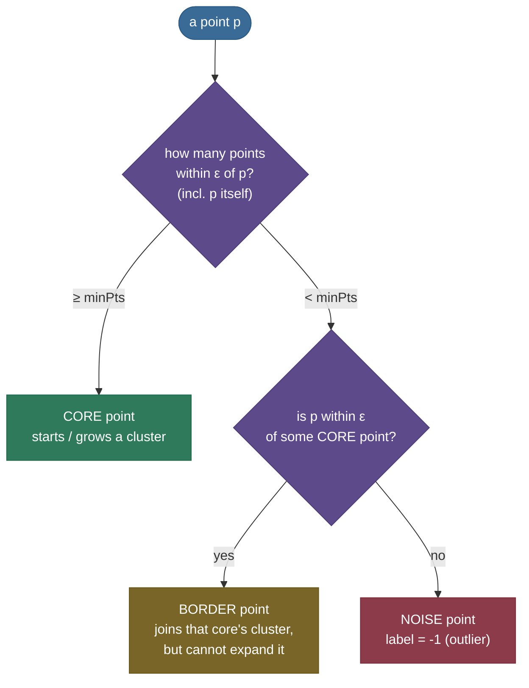
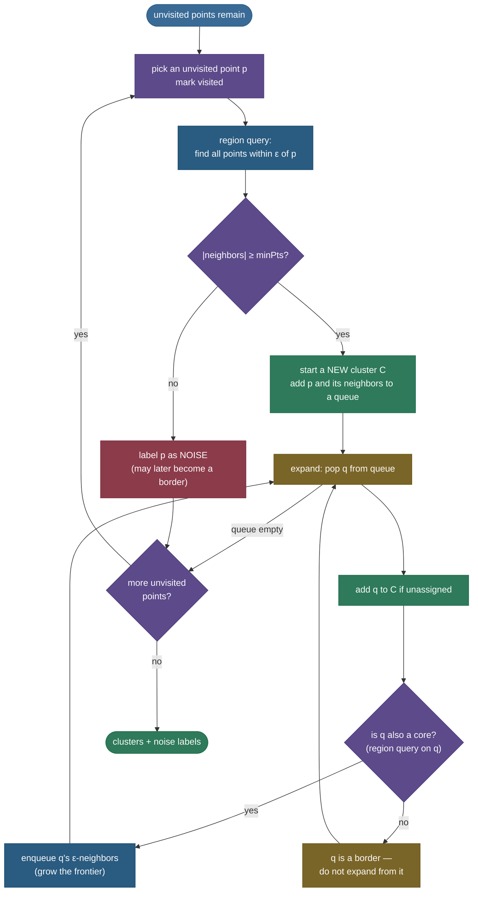

# DBSCAN: clustering by density, not by distance to a center

Hand [k-means](../01-K-Means-Clustering/01-K-Means-Clustering.md) a dataset shaped like two interlocking crescents and it will confidently slice a straight line through both of them — because the only thing it knows how to find is a *round blob around a center*. It must also be **told** how many clusters to look for, and it has nowhere to put a point that belongs to no cluster at all: every point, including the obvious outlier sitting alone in a corner, gets dragged into the nearest group. **DBSCAN** — *Density-Based Spatial Clustering of Applications with Noise* — throws out the "blob around a center" idea entirely and replaces it with a single, more physical question: *where are the points packed densely together?* A cluster, in DBSCAN's view, is just a **connected region of high density**, however weird its shape, surrounded by **low-density** regions; anything in those sparse regions is labelled **noise** and left out. No `k`, arbitrary shapes, outliers handled natively — that is the whole pitch, and it is why DBSCAN is the canonical answer to "why *not* k-means here?"

I'm going to build this the way I'd actually teach it at a whiteboard: first *feel* what breaks in k-means so you know what DBSCAN is for, then the two knobs (`ε` and `minPts`) and the three kinds of point they create, then the **formal density definitions** that turn "packed together" into precise math, then the algorithm step by step, then how you actually *choose* the parameters from a k-distance plot, then complexity, then the honest weaknesses (varying density, high dimensions) and the successors built to fix them (HDBSCAN, OPTICS). Four worked numeric examples — by-hand and measured — run throughout. By the end you'll be able to:

- explain what DBSCAN optimizes for (**density-connected regions**) and why that beats centroids on non-convex data;
- define `ε` and `minPts` and classify any point as **core / border / noise** by hand;
- state the three formal relations — **directly density-reachable, density-reachable, density-connected** — and how a cluster is built from them;
- run the algorithm in your head (region queries → expand from core points → BFS the neighborhood graph);
- **pick `ε`** from the k-distance elbow and **pick `minPts`** from the dimensionality heuristic;
- reason about its $O(n^2)$ vs $O(n \log n)$ cost and why it degrades in high dimensions;
- explain precisely **where it fails** (varying density) and why **HDBSCAN** fixes it.

> **Note:** DBSCAN is **not** an optimizer minimizing a loss the way k-means minimizes inertia. There's no objective function being descended, no centroids, no iteration to convergence. It's a **single sweep** that grows clusters outward from dense seeds (its core and noise labels are fully determined by the data; only a handful of *border* points can depend on traversal order — more on that below). That difference in *kind* is why it can find shapes k-means provably cannot.

---

## The problem: why k-means (and its assumptions) break

K-means is fast and famous, but it bakes in three assumptions that quietly decide what it *can* find:

1. **Clusters are convex, roughly spherical blobs.** Because each point is assigned to the *nearest centroid*, the decision boundary between two clusters is always a straight hyperplane (a Voronoi cell). A crescent, a ring, a spiral — any non-convex shape — gets cut by those straight boundaries.
2. **Clusters have similar size and spread.** Inertia (sum of squared distances to the centroid) is minimized by balanced, equal-variance blobs; a tight cluster next to a diffuse one gets mangled.
3. **Every point belongs to some cluster, and you know how many.** You must supply `k`, and there is **no concept of an outlier** — a lone anomalous point is forced into whichever centroid is least far, distorting that centroid.

DBSCAN drops all three. It needs **no `k`** (the number of clusters falls out of the data), it finds **arbitrarily shaped** clusters (because it grows them by local connectivity, not by distance to a center), and it has a first-class **noise** label for points that live in sparse regions. The price is that you trade `k` for two *different* knobs — a neighborhood radius `ε` and a density threshold `minPts` — and you inherit a new failure mode (varying density) that we'll meet later.

> **Tip:** the interview framing to memorize — *k-means partitions space by **proximity to a center**; DBSCAN partitions it by **local density connectivity**.* Centroid methods answer "which center is nearest?"; density methods answer "is this point in a crowded neighborhood, and is that crowd connected to another crowd?"

Here is the contrast in one picture — the same two datasets, clustered both ways:


DBSCAN recovers the crescents and the rings exactly (adjusted Rand index ≈ 0.97 against the true labels on two-moons), while k-means with the *correct* `k=2` still scores ≈ 0.23 — it simply cannot bend its boundary around a non-convex shape. *Same data, same `k`; the difference is entirely in what each method is allowed to call a cluster.*

**Why it matters (and why interviewers ask it).** DBSCAN is the textbook "why not k-means?" answer, so it's a frequent probe of whether you actually understand the *assumptions* behind clustering methods rather than just their APIs. A strong answer hits five things, all on this page: the two hyperparameters (`ε`, `minPts`) and how they define density; the **core / border / noise** taxonomy; the formal **density-reachability** definitions; how you pick `ε` from a **k-distance plot**; and the **varying-density** weakness that motivates **HDBSCAN**. Beyond interviews, the *practical* reason it matters is that real-world clusters — GPS hotspots, LiDAR objects, fraud rings — are rarely tidy spheres and almost always come mixed with junk that should be labelled, not absorbed.

---

## What it is: two parameters and three kinds of point

DBSCAN has exactly **two hyperparameters**, and everything else is derived from them:

- **`ε` (epsilon)** — a **radius**. The *ε-neighborhood* of a point `p` is the set of all points within distance `ε` of `p` (Euclidean by default, but any metric works). This is your definition of "nearby."
- **`minPts`** — a **count**. The minimum number of points (including `p` itself) that must lie in `p`'s ε-neighborhood for that neighborhood to count as **dense**.

Together they define a single notion of density: *a point is in a dense region if at least `minPts` points sit within radius `ε` of it.* From that one test, every point in the dataset falls into one of three categories:

- **Core point** — has **≥ `minPts`** points within its ε-neighborhood (counting itself). It sits in the *interior* of a dense region and is what *grows* clusters.
- **Border point** — has **< `minPts`** neighbors itself (so it is *not* core), **but** lies within `ε` of some core point. It's on the *edge* of a cluster: it joins a cluster but cannot extend it.
- **Noise point** — neither core nor border: it has too few neighbors **and** is not in any core point's neighborhood. It belongs to no cluster and gets label **`-1`**.

![A measured 2-D point set at epsilon=1.0, minPts=4. A dense cluster of points labelled p0 through p5 sits at lower-left; an isolated point p6 sits far away at upper-right. The number in parentheses by each point is how many points lie within epsilon of it including itself. p0 with 5, p1 with 4, p2 with 4 are CORE (blue, at least minPts). p3 with 3, p4 with 2, p5 with 2 are BORDER (amber, in a core's epsilon but sparse themselves). p6 with 1 is NOISE (red X). A filled blue disk shows one core's epsilon-neighborhood; a dashed amber circle shows a border point's epsilon-neighborhood, which contains too few points to be core.](../images/dbscan_taxonomy.png)

Read the picture against the counts: `p0` has 5 points within `ε` (itself + 4 neighbors) ≥ minPts=4, so it's **core**. `p3` has only 3, so it is *not* core — but it sits within `ε` of core `p0`, so it's a **border** point that joins `p0`'s cluster. `p6` is alone (count = 1, just itself) and near no core, so it's **noise**. That single classification — run for every point — is the entire conceptual core of DBSCAN.

> **Gotcha:** conventions differ on whether the ε-neighborhood **includes the point itself** when counting against `minPts`. scikit-learn's `min_samples` **counts the point itself**, so `min_samples=4` means "3 other neighbors + itself." The original paper's `MinPts` also includes the point. Be consistent — an off-by-one here silently changes which points are core. (Throughout this page, the count includes the point itself.)

> **Note:** `minPts` is doing two jobs at once. It's the **density threshold** (how crowded is "crowded?") *and*, because noise is "fewer than `minPts` neighbors and not near a core," it's also the **smoothing / outlier-sensitivity** knob — raise it and more points get demoted to noise. `ε` sets the *scale* of "near"; `minPts` sets *how many* near things make a crowd.

---

## Intuition: spreading a stain through a crowd

Picture a crowd in a plaza photographed from above. Pick any person. Draw a circle of radius `ε` around them. If at least `minPts` people fall inside that circle, this person is standing in a **crowd** (a core point) — and we declare everyone in their circle to be in the same group. Now repeat from each of *those* people who are *also* in a crowd, drawing their circles, absorbing whoever falls in. The group **spreads like a stain** through every densely-packed region, hopping from one crowded person to the next, stopping only where the crowd thins out (people whose circles are too empty — borders, at the fringe) or where there's open space (lone individuals — noise). When the spreading stops, you've outlined one cluster — of *whatever shape* the crowd happened to form. Start the stain again from any not-yet-grouped person standing in a crowd, and you get the next cluster.

That "spread the stain through connected crowds" picture is exactly the algorithm, and it's why DBSCAN finds banana shapes and rings: the stain follows the **local connectivity** of the dense region, never caring about a global center.

A second mental model that some people find sharper: **contagion**. A core point is "infectious" — it can pass the cluster label to everyone within `ε`. A border point catches the infection (it's within `ε` of an infected core) but is **not infectious itself** (too few contacts to spread further). A noise point is isolated — it never gets near an infected core, so it stays "healthy" (unclustered). One outbreak = one cluster; it spreads through the densely-connected population and dies out at the sparse edges. Both analogies capture the same two facts that *make* DBSCAN: **only dense (core) points propagate**, and the cluster is **whatever connected dense region the propagation reaches** — any shape at all.

> **Tip:** the reason a **border** point "joins but can't expand" maps cleanly onto the analogy: a person on the *edge* of the crowd is swept into the group (they're inside someone's circle), but their *own* circle is too empty to pull in anyone new — so the stain doesn't spread *from* them. Only core points (people genuinely inside the crowd) propagate the cluster.

---

## The math: density-reachability, made precise

"Spread the stain through connected crowds" is the intuition; the 1996 paper turns it into three precise relations. They sound formal but each is a one-line idea, and understanding them is what separates a hand-wavy answer from a correct one in an interview. Fix `ε` and `minPts`. Let $N_\varepsilon(p)$ denote the ε-neighborhood of `p`.

**1. Directly density-reachable.** A point `q` is *directly density-reachable* from `p` if:
- `q` lies in `p`'s ε-neighborhood: $q \in N_\varepsilon(p)$, **and**
- `p` is a **core point**: $|N_\varepsilon(p)| \ge \texttt{minPts}$.

In words: *`q` is right next to `p`, and `p` is dense enough to recruit it.* Note this is **asymmetric** — a core `p` can directly reach a border `q`, but the border `q` (not being core) cannot directly reach `p` back.

**2. Density-reachable.** A point `q` is *density-reachable* from `p` if there is a **chain** of points $p = p_1, p_2, \dots, p_n = q$ where each $p_{i+1}$ is *directly* density-reachable from $p_i$. This is the **transitive closure** of the direct relation: the stain hopping core → core → core → … → finally a border. It's how a cluster reaches points many steps away from where it started. Still asymmetric (each hop requires the *source* to be core).

**3. Density-connected.** Two points `p` and `q` are *density-connected* if there exists a core point `o` such that **both** `p` and `q` are density-reachable from `o`. This relation **is symmetric** — it's the one that actually defines cluster membership, because two border points on opposite fringes of the same cluster aren't reachable *from each other* (neither is core), but they *are* both reachable from a common core in the middle.

With those three relations, the cluster definition is exactly:

> **A cluster is a maximal set of density-connected points.** Formally, a non-empty subset $C$ of the data is a cluster if (i) *maximality*: if $p \in C$ and $q$ is density-reachable from $p$, then $q \in C$; and (ii) *connectivity*: every pair $p, q \in C$ is density-connected. Everything not in any such cluster is **noise**.



> *Where this comes from: directly-density-reachable, density-reachable, density-connected, and the maximal-density-connected-set definition of a cluster are Definitions 1–5 of **Ester, Kriegel, Sander & Xu, "A Density-Based Algorithm for Discovering Clusters" (KDD 1996)** — the paper that won the SIGKDD Test-of-Time Award. See references.*

> **Note:** why three relations instead of one? Because density-reachability is **asymmetric** (only cores reach), it can't directly serve as "are these in the same cluster?" — you'd get contradictions at the borders. Density-*connectedness* (reachable from a common core) restores the **symmetry** you need for a well-defined cluster. The whole formal apparatus exists to make borders behave.

> *A bit of history: DBSCAN was published at **KDD 1996** by Martin Ester, Hans-Peter Kriegel, Jörg Sander, and Xiaowei Xu — a database-systems group at the University of Munich whose original motivation was clustering large **spatial databases** efficiently with an R\*-tree index (hence the "Spatial" in the name). In **2014** it received the **SIGKDD Test-of-Time Award**, and the same authors published a 2017 retrospective ("DBSCAN Revisited, Revisited") clearing up two decades of misconceptions about its parameters and complexity. The same lineage produced **OPTICS** (1999) and seeded the ideas behind **HDBSCAN** (Sander was a co-author of both DBSCAN and HDBSCAN) — a remarkably durable research thread, all from one group.*

---

## How it works: the algorithm

The algorithm is a single pass that visits every point once and grows a cluster whenever it lands on an unvisited core point. The two primitives are a **region query** (find all points within `ε` of a given point) and a **frontier expansion** (a BFS/DFS over the graph where edges connect points within `ε`).

```text
DBSCAN(D, ε, minPts):
    label every point UNVISITED
    C = 0                                  # cluster counter
    for each point p in D:
        if p is VISITED: continue
        mark p VISITED
        Neighbors ← regionQuery(p, ε)      # all points within ε of p
        if |Neighbors| < minPts:
            label p as NOISE               # provisional — may become a border later
        else:
            C ← C + 1                      # start a new cluster
            expandCluster(p, Neighbors, C, ε, minPts)
    return labels

expandCluster(p, Neighbors, C, ε, minPts):
    assign p to cluster C
    queue ← Neighbors                      # seed the frontier (BFS)
    while queue not empty:
        q ← pop(queue)
        if q is labelled NOISE:            # a previously-seen non-core point...
            assign q to cluster C          # ...is actually a BORDER of this cluster
        if q is VISITED: continue
        mark q VISITED
        assign q to cluster C
        qNeighbors ← regionQuery(q, ε)
        if |qNeighbors| ≥ minPts:          # q is itself a core → keep spreading
            queue ← queue ∪ qNeighbors     # enqueue its neighbors (grow frontier)
        # else q is a border → added, but we do NOT expand from it
```

Walk it once and the three rules of behavior become obvious:

1. **You only ever *expand* from core points.** A non-core point reached during expansion gets *added* to the cluster (it's a border) but its neighbors are **not** enqueued — the stain doesn't spread from the fringe.
2. **A "noise" label is provisional.** A point flagged noise early can later be reached as a *border* of a cluster discovered afterward (the `if q is labelled NOISE` line catches this). Only points that finish the run still labelled noise are true outliers.
3. **Each point is visited once; each does one region query.** That's why the cost is dominated by *n* region queries.



> **Gotcha — the one source of non-determinism.** A **border point that lies within `ε` of two different clusters' cores** is assigned to **whichever cluster reaches it first**, which depends on the order points are processed. So DBSCAN's border assignments are *not* fully deterministic across point orderings — the *cores* and the *noise* are always the same, but a handful of borders can flip clusters. (HDBSCAN and the "DBSCAN\*" variant sidestep this by treating borders as noise; see below.) Interviewers love this detail.

### A note on determinism and DBSCAN\*

Pin down *what* is deterministic, because the nuance matters:

- **Always reproducible, regardless of order:** the set of **core points** (a purely local property — does this point have ≥ `minPts` within `ε`?) and the set of **true noise points** (near no core). These never depend on traversal order.
- **Possibly order-dependent:** a **border point equidistant-ish from two clusters'** cores joins whichever core's expansion reaches it first. Different point orderings (or scikit-learn's parallelism) can flip such a border between the two clusters. It never changes *whether* it's clustered — only *which* cluster.

The clean fix is **DBSCAN\*** (Campello et al.): redefine clusters as connected components of **core points only**, and label **every** non-core point — borders included — as noise. That removes the ambiguity entirely (no border to fight over) at the cost of a slightly more conservative clustering. HDBSCAN is built on the DBSCAN\* definition, which is one reason its output is order-stable.

> **Tip:** if asked "is DBSCAN deterministic?", the precise answer is *"cores and noise: yes; the cluster a multiply-reachable **border** lands in: no — and DBSCAN\* / HDBSCAN remove even that by treating borders as noise."* That nuance reads as genuine understanding.

---

## Choosing the parameters

This is where DBSCAN lives or dies in practice. You're not picking `k`; you're picking a **scale** (`ε`) and a **density floor** (`minPts`).

First, build intuition for **which way each knob turns the result** — this is what lets you debug a bad run by inspection:

| change | effect on clustering |
|---|---|
| **`ε` ↑** (bigger radius) | neighborhoods grow → more points become core → **fewer, larger** clusters, **less noise**; too big merges distinct clusters into one. |
| **`ε` ↓** (smaller radius) | neighborhoods shrink → fewer cores → **more, smaller** clusters, **more noise**; too small shatters clusters and labels most points noise. |
| **`minPts` ↑** (stricter density) | harder to be core → **more noise**, only the densest regions survive as clusters; more robust to spurious links. |
| **`minPts` ↓** (looser density) | easier to be core → **fewer noise** points, more (and flimsier) clusters; `minPts`=1 makes *every* point its own core (no noise at all — degenerate). |

The two knobs trade off: raising `ε` and raising `minPts` push in **opposite** directions on noise, which is why you pin `minPts` from dimensionality and then move only `ε`. Now the two concrete recipes:

### Picking `minPts` — the dimensionality heuristic

`minPts` controls how many neighbors make a "crowd." Rules of thumb from the literature:

- **`minPts ≥ d + 1`** where `d` is the data's dimensionality — the bare minimum so a neighborhood is more than a line.
- **`minPts = 2·d`** is the common default starting point (so `minPts = 4` for 2-D, which is the original paper's suggestion and scikit-learn's spirit).
- **Larger `minPts`** for noisy data or large datasets → more points demoted to noise, more robust clusters; **smaller** → more permissive, more (and smaller) clusters.

> **Tip:** fix `minPts` *first* (from dimensionality / noise tolerance), then tune `ε`. They interact — both define density — but `minPts` is the one you can set from first principles, so pin it and sweep `ε`.

### Picking `ε` — the k-distance elbow

The standard recipe: for `k = minPts`, compute every point's distance to its **k-th nearest neighbor**, **sort** those distances ascending, and plot them. Points *inside* clusters have small k-distances (they're surrounded); points in sparse regions or noise have large ones. The curve therefore stays low and flat, then **bends sharply upward** at the boundary between "in a cluster" and "noise." That **knee/elbow** is a natural value for `ε`: set `ε` to the k-distance at the bend, and points below it become core/border while points above become noise.


The elbow here lands at `ε ≈ 0.38`. That's a **starting point**, not a verdict: at exactly that `ε` (minPts=4) this dataset over-segments slightly (6 clusters, 35 noise) because its blobs have *unequal* spread — a preview of the varying-density problem. You'd nudge `ε` up a touch to merge the over-split pieces. The k-distance plot gets you into the right *neighborhood* of `ε`; a little iteration finishes the job.

> **Gotcha:** there's rarely a *single* sharp elbow on real data — you'll see a *region* of bend, or several. Pick `ε` near the start of the steep rise (smaller `ε` is safer: it errs toward calling ambiguous points noise rather than fusing clusters). And **always standardize/scale your features first** — `ε` is a single radius applied to all dimensions, so it's meaningless if feature 1 ranges 0–1 and feature 2 ranges 0–10,000.

### Why scaling isn't optional — a concrete failure

Make the scaling point unmissable with numbers. Suppose two features, *age* (years, range ~20–80) and *income* (dollars, range ~20,000–200,000), and two records:

- A = (age 30, income 50,000), B = (age 31, income 50,000) — *one year apart, same income; obviously "near."*
- The Euclidean distance is $\sqrt{(31-30)^2 + (50000-50000)^2} = \sqrt{1} = 1$.
- Now C = (age 30, income 51,000) — *same age, 1,000 dollars apart; also obviously "near."*
- Distance $= \sqrt{0^2 + 1000^2} = 1000$.

To DBSCAN, B is **1,000× closer** to A than C is — purely because income is measured in bigger units. Any `ε` you pick is essentially *only* a constraint on income; age contributes nothing. After **standardizing** each feature to zero mean and unit variance (`StandardScaler`), a one-standard-deviation move in *either* feature counts the same, and `ε` finally means "near" in a balanced sense. *This is the single most common reason a DBSCAN run produces one giant blob or all-noise:* unscaled features. Standardize first, every time.

---

## Complexity and the high-dimensional wall

The cost structure is easy to derive from the algorithm. The outer loop visits each of `n` points once; the expensive operation inside is the **region query** (and each point triggers at most one — it's cached/skipped once visited). So total cost ≈ `n` × (cost of one region query), and *everything* hinges on how fast a region query is. The work is dominated by **one region query per point**. The cost of a region query is where the spatial data structure matters:

- **Naive (compute all pairwise distances):** each region query scans all `n` points → $O(n^2)$ total. Materializing the full distance matrix is $O(n^2)$ memory too — avoid it on large `n`; a streaming scan keeps memory at $O(n)$ at the same time cost.
- **With a spatial index** (KD-tree, ball-tree, or R-tree — the original paper used an R\*-tree): a region query is $O(\log n)$ on average in **low** dimensions, giving DBSCAN its famous **$O(n \log n)$** average complexity. This is the number quoted in interviews — but note the precondition.

> **Gotcha:** the $O(n \log n)$ is **average-case in low dimensions only**. Spatial indices degrade as dimensionality grows (the **curse of dimensionality**): a KD-tree query touches more and more of the tree until, somewhere around 10–20 dimensions, it's no faster than a linear scan and DBSCAN reverts to $O(n^2)$. Worst case (e.g. all points within `ε` of each other) is $O(n^2)$ regardless of index.

The curse of dimensionality hurts DBSCAN twice over. Beyond slowing the index, it **erodes the very notion of density** the algorithm relies on: in high dimensions distances **concentrate** — the nearest and farthest neighbors of a point become almost equidistant — so the contrast between "dense" and "sparse" that `ε` is supposed to separate collapses, and the k-distance plot loses its elbow. *DBSCAN is a low-to-moderate-dimensional method;* in high dimensions, reduce dimensionality first (PCA / UMAP) or use a density method designed for it.

> **Tip:** scikit-learn's `DBSCAN` defaults to `algorithm='auto'`, which picks a KD-/ball-tree when it can and falls back to brute force otherwise. For big data, **HDBSCAN** (below) is usually the better engineering choice — it's not slower and removes the `ε` guesswork.

---

## Strengths and weaknesses, honestly

**Strengths:**

- **Finds arbitrarily shaped clusters** — crescents, rings, spirals — because it grows by local connectivity, not distance to a center. (This is the headline.)
- **No need to pre-specify the number of clusters** — `k` emerges from the data.
- **Robust to outliers** — noise is a first-class label, so anomalies don't distort clusters. (DBSCAN's "noise" output is itself a respected **outlier-detection** method.)
- **Only needs a notion of density** — works with any distance metric (Euclidean, Manhattan, cosine, precomputed, even graph distances).

**Weaknesses:**

- **Varying density defeats a single global `ε`** (the big one — next section).
- **Curse of dimensionality** — slows the index *and* flattens the density contrast (above).
- **Two parameters that interact** and can be fiddly; `ε` especially is data-dependent and requires the k-distance ritual + scaling.
- **Border non-determinism** — borders reachable from two clusters depend on processing order (above).

### The varying-density failure — why a global `ε` can't win

DBSCAN applies **one** radius `ε` and **one** density floor `minPts` to the *entire* dataset. If your data has a **dense** cluster next to a **sparse** one, no single `ε` works:

![Two panels, same dataset: a tight dense cluster of 150 points on the left and a loose sparse cluster of 80 points on the right. Left panel at epsilon=0.35: the dense cluster is recovered cleanly as one cluster, but the sparse cluster is shattered — most of its points become noise (red X) with a few tiny spurious sub-clusters, 49 noise total. Right panel at epsilon=1.1: the sparse cluster is now captured, but epsilon is so large it merges the dense and sparse clusters into a single green cluster, 1 noise. Title: varying density breaks DBSCAN, no single epsilon fits a dense AND a sparse cluster, arrow to HDBSCAN.](../images/dbscan_varying.png)

- **Small `ε` (0.35)** — tuned to the dense cluster, recovers it perfectly, but the sparse cluster's points are too far apart to be "dense" at this radius, so **49 of them become noise** (and a few fragment into spurious mini-clusters).
- **Large `ε` (1.10)** — now the sparse cluster holds together, but `ε` is so big it bridges the gap and **merges both clusters into one**.

There is *no* `ε` in between that captures both — the densities are simply different, and DBSCAN has only one knob for all of them. This single limitation is the entire reason **HDBSCAN** was created.

> **Note:** this is the most important weakness to be able to articulate. The clean statement: *DBSCAN assumes clusters have **similar density**; when densities vary widely, a global `ε` either shatters the sparse clusters (too small) or merges the dense ones (too large), with no good value between.* That's the cue to reach for HDBSCAN.

---

## DBSCAN as an outlier detector

The **noise** label is not a consolation prize — it's a genuine, widely-used **unsupervised outlier detector**, and it's worth understanding *why* it works as one. An outlier, intuitively, is a point in a **low-density** region; that is *exactly* DBSCAN's definition of noise (too few neighbors within `ε`, and not adjacent to any dense region). So running DBSCAN and reading off the `-1` points is a principled "find the points that don't belong to any dense group" detector — no labels needed.

Its character as a detector: it is **global and binary** (a point either is or isn't noise; there's no continuous outlier *score* in vanilla DBSCAN), and it inherits DBSCAN's strengths and weaknesses — robust to weird-shaped inlier regions, but fooled by **varying density** (a point that's an outlier relative to a dense cluster but normal-density for a sparse one is hard to call with one global `ε`). When you need a *graded* outlier score rather than a yes/no, reach for **LOF** (Local Outlier Factor, from the same Breunig/Kriegel group) or HDBSCAN's **GLOSH** score — both compare a point's local density to its neighbors' and return a number, which is more useful for ranking and thresholding anomalies. But for a quick, shape-agnostic "what doesn't fit?", DBSCAN's noise label is often the first thing to try.

> **Tip:** the connection to recite — *DBSCAN clusters and detects outliers in the same pass: clusters are the dense regions, outliers are the noise (`-1`) in the sparse gaps. For a continuous outlier **score**, use LOF or HDBSCAN's GLOSH instead of the binary noise flag.*

---

## The successors: HDBSCAN and OPTICS

Two algorithms generalize DBSCAN to **varying density**, and you should be able to name both.

### HDBSCAN (Campello, Moulavi & Sander, 2013)

**HDBSCAN** — *Hierarchical DBSCAN* — removes the `ε` knob entirely by running DBSCAN's idea at **all density levels at once** and then extracting the most stable clusters. The high-level idea, in three moves:

1. **Mutual reachability distance.** Define each point's **core distance** = the distance to its `minPts`-th neighbor (a local density estimate). Then the *mutual reachability distance* between `a` and `b` is $\max\!\big(\text{core\_dist}(a),\ \text{core\_dist}(b),\ d(a,b)\big)$ — it inflates distances *into* low-density regions, pushing sparse points apart so they don't bridge clusters. This is the key trick: it makes the metric **density-aware** instead of using one global `ε`.
2. **Condensed cluster tree.** Build a minimum spanning tree on the mutual-reachability graph, then sweep a threshold from large to small — equivalent to running DBSCAN for *every* `ε` simultaneously — producing a **hierarchy** of clusters that appear and split as the threshold drops. Condense this tree by collapsing splits that merely shave off a few points (controlled by `min_cluster_size`).
3. **Extract the most stable clusters.** Choose, from the hierarchy, the clusters that **persist** over the widest range of density thresholds (most "stable"). A dense cluster and a sparse cluster each get picked at *their own* natural density level — exactly what a single `ε` couldn't do.

**A tiny mutual-reachability calculation.** To make the key trick concrete, take three 1-D points $a=0$, $b=1$, $c=5$ with `minPts=2`, so each point's **core distance** is the distance to its 2nd-nearest neighbor (i.e. its single nearest other point):

- $\text{core\_dist}(a) = d(a,b) = 1$ (b is a's nearest), $\text{core\_dist}(b) = d(b,a) = 1$, $\text{core\_dist}(c) = d(c,b) = 4$ (c is isolated, so its core distance is *large* — that's the local-density signal).

Now the **mutual reachability** $d_{mr}(x,y) = \max(\text{core\_dist}(x), \text{core\_dist}(y), d(x,y))$:

- $d_{mr}(a,b) = \max(1, 1, 1) = 1$ — the tight pair stays close.
- $d_{mr}(b,c) = \max(1, 4, 4) = 4$ — the link to the isolated point $c$ is **inflated to its core distance**, pushing the sparse point even farther from the dense pair.

That inflation is the whole idea: distances *into* low-density regions get stretched, so when HDBSCAN sweeps a single threshold, the dense pair $\{a,b\}$ merges long before $c$ joins — and $c$ can be recognized as belonging to its *own* (sparser) level rather than being forced in or dropped. One metric, all densities, no global `ε`.

The payoff: **no `ε` to choose**, it handles **varying density**, and its main knob (`min_cluster_size`) is far more intuitive than `ε`. In practice HDBSCAN is the modern default — reach for it the moment DBSCAN's single `ε` struggles.

> **Note:** HDBSCAN also uses the **DBSCAN\*** convention — it treats **border points as noise** (only cores belong to clusters), which removes the border non-determinism quirk and makes the hierarchy clean. A small but meaningful definitional difference from classic DBSCAN.

### OPTICS (Ankerst, Breunig, Kriegel & Sander, 1999)

**OPTICS** — *Ordering Points To Identify the Clustering Structure* — predates HDBSCAN and attacks the same problem differently: instead of committing to one `ε`, it produces an **ordering** of the points plus a **reachability distance** for each, which you plot as a **reachability plot**. Valleys in that plot are clusters; the *depth* of a valley reflects density, so dense and sparse clusters show up as valleys at different depths. You can then extract a DBSCAN-like clustering at any `ε` (or extract clusters from the valley structure with the `ξ` method). It's the conceptual bridge from DBSCAN to HDBSCAN: *don't pick `ε` — compute a structure that contains the answer for all `ε` at once.*

How to *read* a reachability plot: the x-axis is the OPTICS point ordering (which keeps cluster members adjacent), and the y-axis is each point's reachability distance. Walk left to right — when you're inside a cluster, consecutive points are close, so the bars stay **low** (a valley); when you step from one cluster across a sparse gap to the next, reachability **spikes up** (a wall between valleys). A **deep, wide valley** is a dense cluster; a **shallow** valley is a sparser cluster. Drawing a horizontal line at height `ε` and cutting wherever the curve pokes above it reproduces *exactly* the DBSCAN clustering for that `ε` — which is precisely why OPTICS is "DBSCAN for every `ε` at once, drawn as one picture." HDBSCAN then automates the "which valleys are real?" decision via cluster stability, removing the need to eyeball a cut line at all.

> **Tip:** the lineage to recite — **DBSCAN (1996): one `ε`, one density. OPTICS (1999): an ordering across all `ε` (the reachability plot). HDBSCAN (2013): a hierarchy across all `ε`, auto-extract the stable clusters.** All three are density-based and trace back to the same Kriegel/Sander research group.

---

## DBSCAN vs k-means vs GMM vs hierarchical

| | **k-means** | **DBSCAN** | **GMM (EM)** | **Hierarchical (agglomerative)** |
|---|---|---|---|---|
| **Cluster model** | spherical blob around a centroid | dense, density-connected region | mixture of Gaussians (soft) | nested merges by linkage |
| **Number of clusters** | you supply `k` | **emerges** from `ε`, `minPts` | you supply `k` | cut the dendrogram |
| **Cluster shape** | convex / spherical only | **arbitrary** | ellipsoidal (per-component covariance) | linkage-dependent |
| **Outliers / noise** | none — all points assigned | **first-class noise label** | low-probability points (soft) | none (all merged) |
| **Assignment** | hard | hard (+ noise) | **soft** (probabilities) | hard |
| **Varying density** | poor | **poor** (single `ε`) | better (per-component scale) | linkage-dependent |
| **Complexity** | $O(nki)$ | $O(n\log n)$–$O(n^2)$ | $O(nki)$ per EM step | $O(n^2\log n)$–$O(n^3)$ |
| **Main parameter** | `k` | `ε`, `minPts` | `k`, covariance type | linkage, cut height |
| **Determinism** | depends on init | cores/noise yes, borders no | depends on init | deterministic |

> **Tip:** the cheat-sheet for "which clustering algorithm?": **round, balanced blobs and you know `k`** → [k-means](../01-K-Means-Clustering/01-K-Means-Clustering.md). **Weird shapes + outliers, don't know `k`** → DBSCAN. **Overlapping clusters, want soft/probabilistic membership or elliptical clusters** → [GMM](../04-Gaussian-Mixture-Models-and-EM/04-Gaussian-Mixture-Models-and-EM.md). **Want a full hierarchy / dendrogram or small `n`** → [agglomerative](../02-Hierarchical-Clustering/02-Hierarchical-Clustering.md). **Weird shapes + *varying* density** → HDBSCAN.

**Why exactly does k-means fail on the moons?** It's worth being precise, because "k-means assumes spheres" is true but vague. K-means assigns each point to the **nearest centroid**, so the boundary between two clusters is the set of points equidistant from the two centroids — a **straight line** (a hyperplane in higher dimensions). No matter where the two centroids land on the two-moons data, that straight bisector slices through *both* crescents, because each crescent wraps around so that its own far tip is closer to the *other* crescent's centroid than to its own. There is literally no pair of centroids whose straight bisector can separate two interlocking C-shapes. DBSCAN has **no centroid and no global boundary** — it only ever asks "is my neighbor within `ε`, and is this region dense?", so it threads each crescent along its own length. *The shapes k-means can find are exactly the ones a Voronoi diagram can carve; DBSCAN is free of that constraint entirely.* GMM relaxes the straight boundary to a **quadratic** one (ellipses, via per-component covariance), which helps with elongated blobs but still can't bend around a crescent — only a density/connectivity method can.

---

## Worked examples

Four examples, increasing in complexity — the first two by hand, the last two measured in code. (All numbers are reproduced by the verification script below.)

### Example 1 — classify a tiny point set by hand (`ε = 1.0`, `minPts = 4`)

Seven 2-D points (the figure above): `p0=(2.0, 2.0)`, `p1=(2.6, 2.2)`, `p2=(2.3, 2.7)`, `p3=(1.6, 2.6)`, `p4=(1.7, 1.6)`, `p5=(3.3, 2.5)`, `p6=(6.0, 5.0)`.

First, *why* the counts come out as they do — compute a few Euclidean distances from `p0` by hand (recall $d = \sqrt{(\Delta x)^2 + (\Delta y)^2}$, and we accept a neighbor when $d \le \varepsilon = 1.0$):

- $d(p_0, p_1) = \sqrt{(2.6-2.0)^2 + (2.2-2.0)^2} = \sqrt{0.36 + 0.04} = \sqrt{0.40} \approx 0.63 \le 1.0$ ✓
- $d(p_0, p_2) = \sqrt{0.3^2 + 0.7^2} = \sqrt{0.09 + 0.49} = \sqrt{0.58} \approx 0.76 \le 1.0$ ✓
- $d(p_0, p_3) = \sqrt{0.4^2 + 0.6^2} = \sqrt{0.16 + 0.36} = \sqrt{0.52} \approx 0.72 \le 1.0$ ✓
- $d(p_0, p_4) = \sqrt{0.3^2 + 0.4^2} = \sqrt{0.09 + 0.16} = \sqrt{0.25} = 0.50 \le 1.0$ ✓
- $d(p_0, p_5) = \sqrt{1.3^2 + 0.5^2} = \sqrt{1.69 + 0.25} = \sqrt{1.94} \approx 1.39 > 1.0$ ✗
- $d(p_0, p_6) = \sqrt{4.0^2 + 3.0^2} = \sqrt{16 + 9} = \sqrt{25} = 5.0 > 1.0$ ✗

So `p0`'s ε-neighborhood is $\{p_0, p_1, p_2, p_3, p_4\}$ — count 5. Doing the same for every point gives the table:

| point | neighbors within ε=1.0 (incl. self) | count | ≥ minPts=4? | type |
|---|---|---|---|---|
| p0 | p0, p1, p2, p3, p4 | **5** | yes | **core** |
| p1 | p1, p0, p2, p5 | **4** | yes | **core** |
| p2 | p2, p0, p1, p3 | **4** | yes | **core** |
| p3 | p3, p0, p2 | 3 | no | **border** (in core p0's ε) |
| p4 | p4, p0 | 2 | no | **border** (in core p0's ε) |
| p5 | p5, p1 | 2 | no | **border** (in core p1's ε) |
| p6 | p6 | 1 | no | **noise** (near no core) |

So **3 cores, 3 borders, 1 noise** → one cluster `{p0,p1,p2,p3,p4,p5}` and one outlier `{p6}`. The verification script confirms `core=[0,1,2]`, `border=[3,4,5]`, `noise=[6]`, and that scikit-learn's `DBSCAN(eps=1.0, min_samples=4)` returns labels `[0,0,0,0,0,0,-1]` with `core_sample_indices_ = [0,1,2]` — an exact match to the hand calculation.

### Example 2 — trace cluster expansion from a seed core

Run the algorithm on Example 1's points, processing in index order. Start at `p0`: region query returns `{p0,p1,p2,p3,p4}` (count 5 ≥ 4) → **core**, so open **cluster 0** and seed the frontier with those 5.

- Pop `p1`: assign to cluster 0; region query → `{p1,p0,p2,p5}` (4 ≥ 4) → core → **enqueue** its neighbors (adds `p5` to the frontier).
- Pop `p2`: assign; region query → 4 ≥ 4 → core → enqueue (no new points; all already queued).
- Pop `p3`: assign; region query → 3 < 4 → **border** → add but **don't** enqueue its neighbors.
- Pop `p4`: assign; 2 < 4 → border → add, don't expand.
- Pop `p5` (added when we expanded `p1`): assign to cluster 0; 2 < 4 → border → don't expand.
- Frontier empty → cluster 0 = `{p0,p1,p2,p3,p4,p5}` is closed.

Continue the outer loop: `p6` is unvisited; region query → count 1 < 4, and it's near no core → stays **noise**. Done. *Notice how the stain spread core→core→core (`p0`→`p1`→`p2`) and stopped dead at every border — and how `p5`, never in `p0`'s own neighborhood, was still pulled in because `p1` (a core) reached it.* That last point is density-reachability (the transitive chain) doing its job.

**The "provisional noise → border" twist.** Now suppose the processing order had started at the fringe point `p5` instead of `p0`. The very first region query is on `p5`: count 2 < 4, so `p5` is labelled **noise** immediately — it has no idea a cluster is coming. The loop moves on, eventually reaches `p0`, opens cluster 0, expands, and when it pops `p5` from `p1`'s frontier, the algorithm's `if q is labelled NOISE: assign q to cluster C` line **rescues** `p5` — its earlier noise label is overwritten and it becomes a **border** of cluster 0. This is exactly why the pseudocode calls early noise labels *provisional*: a point can be flagged noise before the cluster that owns it has been discovered, and only points still labelled noise at the *end* are true outliers. *Same final answer regardless of order — but the order changes whether a border was ever momentarily mislabelled.*

### Example 3 — the k-distance elbow picks `ε` (measured)

On 300 points from four Gaussian blobs (`cluster_std=0.6`), with `k = minPts = 4`: compute each point's distance to its 4th-nearest neighbor, sort, and find the knee.

*The mechanics, concretely.* For each point you find its 4 nearest neighbors and keep the **4th** distance (the farthest of the four) — that single number is the point's "k-distance," a local density proxy: small means "tightly surrounded," large means "out in the open." Sorting all 300 of these ascending gives the curve in the figure. A point deep inside a blob might have a 4th-NN distance of ~0.15; a noise point on the fringe might be ~0.7 — so the sorted curve stays low (the in-cluster points) and then ramps up steeply (the sparse/noise tail). The **knee** is where it transitions.

To locate the knee automatically, use the **maximum-distance-from-the-chord** method: draw the straight line from the curve's first point $(0, k_0)$ to its last $(n{-}1, k_{n-1})$, and pick the curve point with the greatest perpendicular distance from that chord — geometrically, the "most bent" point. The script reports the knee at sorted-index **239 → `ε ≈ 0.376`** — exactly the bend you can see in the k-distance figure. Running `DBSCAN(eps=0.38, min_samples=4)` then yields 6 clusters with 35 noise points: the four blobs, slightly over-segmented because their spreads differ. Bumping `ε` up a little merges the over-split pieces back to four — illustrating that the elbow gives a **principled starting `ε`**, finished with light iteration.

### Example 4 — DBSCAN wins on two-moons, then loses on varying density (measured)

*Where DBSCAN wins:* on **two interleaving moons** (300 points, noise 0.09), `DBSCAN(eps=0.18, min_samples=5)` finds exactly **2 clusters, 0 noise**, scoring an **adjusted Rand index of 0.973** against the true crescents. **k-means with the correct `k=2`** scores only **0.234** — its straight Voronoi boundary cuts both crescents in half. This is the canonical "DBSCAN beats k-means" demonstration.

*Where DBSCAN loses:* on the **dense + sparse** dataset (150 tight points + 80 loose points), no single `ε` works — `ε=0.35` recovers the dense cluster but shatters the sparse one into **49 noise** points; `ε=1.10` holds the sparse cluster together but **merges both** into one cluster. The measured cluster/noise counts (4 clusters & 49 noise vs. 2 clusters & 1 noise) are exactly the two failure halves in the varying-density figure. *This is the case that motivates HDBSCAN.*

---

## Where DBSCAN is used

- **Spatial / geographic data** — its home turf: clustering GPS pings, points of interest, crime or disease hotspots, sensor readings — anywhere clusters are irregular blobs on a map and stray readings should be noise.
- **Anomaly / outlier detection** — the **noise** label *is* an outlier detector: points DBSCAN can't place are your anomalies (network-intrusion, fraud, defect detection). See [Anomaly / Outlier Detection](../09-Anomaly-Outlier-Detection/09-Anomaly-Outlier-Detection.md).
- **Image / point-cloud segmentation** — grouping pixels or LiDAR points into objects of arbitrary shape; common in robotics and autonomous-driving perception.
- **Preprocessing & de-duplication** — collapsing near-duplicate records or embeddings into density clusters before downstream work.
- **As the baseline that motivates HDBSCAN** — in modern pipelines you'll often start with DBSCAN to explain the idea, then ship **HDBSCAN** for the varying-density robustness.

> **Tip:** in an interview, the moment the prompt mentions **non-spherical clusters, an unknown number of clusters, or outliers that must be excluded**, say "DBSCAN" — and be ready to add "and HDBSCAN if the densities vary." That pairing signals you know both the tool and its limit.

**Choosing the right metric matters as much as `ε`.** Because DBSCAN only needs a *distance*, you can — and often should — swap Euclidean for a metric that fits the data:

- **Geographic (lat/long):** use the **Haversine** (great-circle) distance, *not* Euclidean — a degree of longitude is not the same number of kilometres everywhere on Earth. scikit-learn supports `metric='haversine'` (with inputs in radians); then `ε` is an actual distance on the sphere (e.g. set `ε` to *500 m / earth-radius* in radians).
- **Text / embeddings:** use **cosine** distance, where "near" means "similar direction" regardless of magnitude — the right notion for TF-IDF vectors or sentence embeddings. (`metric='cosine'`.)
- **Mixed categorical/numeric:** use a custom distance (e.g. Gower) via `metric='precomputed'` with a distance matrix you build yourself.

The point: `ε` is only meaningful **relative to the metric**, so picking the metric is the first modelling decision, and the k-distance plot must be computed in that same metric.

---

## Application: a step-by-step playbook

Here's the actual workflow I'd run on a new dataset, end to end — the sequence that turns "I have points" into "I have clusters I trust."

1. **Scale the features.** Standardize every feature (`StandardScaler`) so `ε` means the same thing in all directions. Skip this and nothing else matters (see the scaling failure above). For genuinely high-dimensional data, **reduce dimensions first** (PCA/UMAP) so density still has contrast and the spatial index stays fast.
2. **Set `minPts` from first principles.** Start at `minPts = 2·d` (so 4 in 2-D); raise it if the data is noisy or large (more robust, more aggressive noise labelling), lower it only if clusters are genuinely tiny. Pin it before touching `ε`.
3. **Pick `ε` from the k-distance plot.** With `k = minPts`, compute each point's distance to its `k`-th neighbor, sort ascending, plot, and read `ε` off the **knee**. Lean toward the *smaller* side of the bend — too-small `ε` over-segments (recoverable by merging); too-large `ε` fuses distinct clusters (information lost).
4. **Run DBSCAN and read the output.** Inspect the number of clusters, the **noise fraction** (`mean(labels == -1)`), and the cluster sizes. A huge noise fraction → `ε` too small or `minPts` too high; one giant cluster swallowing everything → `ε` too large or features unscaled.
5. **Sanity-check, then iterate `ε`.** If 2-D, *plot it* — the eye catches over/under-segmentation instantly. Nudge `ε` and re-run; this is a fast loop. (No ground truth? Use a density-aware internal metric like the silhouette **only on the clustered, non-noise points**, or just visual inspection.)
6. **If varying density bites, switch to HDBSCAN.** The moment you can't find an `ε` that fits both a dense and a sparse cluster, stop tuning and run **HDBSCAN** with a sensible `min_cluster_size` — it removes `ε` entirely and is rarely slower.
7. **Use the noise label.** Don't discard `-1` reflexively — those points *are* your outliers and are often the most interesting output (anomalies, errors, novel events).

> **Tip:** the whole loop is "scale → set `minPts` → `ε` from the k-distance knee → check noise fraction → iterate → escalate to HDBSCAN if density varies." Memorize that and you can tune DBSCAN on anything.

**How do you know it worked?** Clustering is unsupervised, so evaluation is subtler than accuracy:

- **With ground-truth labels** (a held-out benchmark): use **Adjusted Rand Index (ARI)** or **Adjusted Mutual Information (AMI)** — both compare your clustering to the truth up to relabelling and correct for chance. On two-moons above, DBSCAN's ARI of 0.973 vs k-means' 0.234 is the quantitative version of "DBSCAN got the shapes right."
- **Without labels** (the usual case): use an **internal** metric. The **silhouette score** is the common one — but compute it **only on the clustered (non-noise) points**, because the `-1` noise label isn't a cluster and including it corrupts the metric. Density-aware internal indices (e.g. **DBCV**, designed specifically for density-based clusters) are better suited to DBSCAN than silhouette, which itself assumes convex-ish clusters.
- **Always, in 2-D/3-D:** *plot it.* The single most reliable check for a clustering you can visualize is your own eyes — over-segmentation, fused clusters, and a too-high noise fraction all jump out instantly.

> **Gotcha:** don't grade DBSCAN with a metric that assumes round clusters. The silhouette score *rewards* compact, well-separated convex blobs — exactly the assumption DBSCAN was built to escape — so it can score a *correct* crescent clustering poorly. Prefer **DBCV** (or ground-truth ARI when available) for density-based methods, and trust a plot over any single number.

---

## Code: run it, verify against scikit-learn

This script reproduces all four worked examples end-to-end on CPU in a couple of seconds — the two-moons win, the by-hand core/border/noise classification (checked against scikit-learn), the k-distance elbow, and the varying-density failure.

```python
"""DBSCAN: shapes, the point taxonomy, the k-distance elbow, and the varying-density
failure — all measured and cross-checked against scikit-learn. Verified on Python 3.12."""
import numpy as np
from sklearn.cluster import DBSCAN, KMeans
from sklearn.datasets import make_moons, make_blobs
from sklearn.neighbors import NearestNeighbors
from sklearn.metrics import adjusted_rand_score

# 1) Two moons: DBSCAN recovers the shapes + noise; k-means cuts them straight.
X, y = make_moons(n_samples=300, noise=0.09, random_state=0)
db = DBSCAN(eps=0.18, min_samples=5).fit(X)
km = KMeans(n_clusters=2, n_init=10, random_state=0).fit(X)
n_clust = len(set(db.labels_)) - (1 if -1 in db.labels_ else 0)
print(f"two-moons  DBSCAN: clusters={n_clust} noise={(db.labels_==-1).sum()} "
      f"ARI={adjusted_rand_score(y, db.labels_):.3f}")
print(f"two-moons  k-means(k=2): ARI={adjusted_rand_score(y, km.labels_):.3f}  (cuts the moons)")

# 2) Tiny by-hand point set: core / border / noise at eps=1.0, minPts=4.
pts = np.array([[2,2],[2.6,2.2],[2.3,2.7],[1.6,2.6],[1.7,1.6],[3.3,2.5],[6,5]], float)
neigh = NearestNeighbors(radius=1.0).fit(pts).radius_neighbors(pts, return_distance=False)
counts = np.array([len(n) for n in neigh])                     # includes self
is_core = counts >= 4
is_border = np.array([(not is_core[i]) and any(is_core[j] for j in neigh[i] if j != i)
                      for i in range(len(pts))])
is_noise = ~is_core & ~is_border
print("counts:", counts.tolist(),
      "| core:", np.where(is_core)[0].tolist(),
      "border:", np.where(is_border)[0].tolist(),
      "noise:", np.where(is_noise)[0].tolist())
dbt = DBSCAN(eps=1.0, min_samples=4).fit(pts)                  # cross-check
print("sklearn labels:", dbt.labels_.tolist(), "core idx:", dbt.core_sample_indices_.tolist())

# 3) k-distance elbow picks eps (k = minPts = 4 on four blobs).
Xb, _ = make_blobs(n_samples=300, centers=4, cluster_std=0.60, random_state=0)
d, _ = NearestNeighbors(n_neighbors=4).fit(Xb).kneighbors(Xb)
kd = np.sort(d[:, -1]); n = len(kd)
p1, p2 = np.array([0, kd[0]]), np.array([n-1, kd[-1]]); line = (p2-p1)/np.linalg.norm(p2-p1)
P = np.stack([np.arange(n), kd], 1) - p1
knee = int(np.argmax(np.linalg.norm(P - np.outer(P @ line, line), axis=1)))
print(f"k-distance knee at idx {knee} -> eps ~= {kd[knee]:.3f}")

# 4) Varying density: one global eps cannot fit a dense AND a sparse cluster.
rng = np.random.default_rng(1)
Xv = np.vstack([rng.normal([0, 0], 0.30, (150, 2)), rng.normal([4.5, 0], 1.05, (80, 2))])
for eps in (0.35, 1.10):
    L = DBSCAN(eps=eps, min_samples=5).fit(Xv).labels_
    print(f"varying eps={eps}: clusters={len(set(L))-(1 if -1 in L else 0)} noise={(L==-1).sum()}")
```

Output:

```
two-moons  DBSCAN: clusters=2 noise=0 ARI=0.973
two-moons  k-means(k=2): ARI=0.234  (cuts the moons)
counts: [5, 4, 4, 3, 2, 2, 1] | core: [0, 1, 2] border: [3, 4, 5] noise: [6]
sklearn labels: [0, 0, 0, 0, 0, 0, -1] core idx: [0, 1, 2]
k-distance knee at idx 239 -> eps ~= 0.376
varying eps=0.35: clusters=4 noise=49
varying eps=1.1: clusters=2 noise=1
```

> **Note:** every claim on this page is in that output. DBSCAN nails two-moons (ARI 0.973) where k-means flails (0.234); the hand-computed `core/border/noise` matches scikit-learn's labels and `core_sample_indices_` exactly; the k-distance knee lands at `ε ≈ 0.38`; and the varying-density split (4-clusters-49-noise vs 2-clusters-1-noise) shows there's no single `ε` that fits both densities.

> **Tip:** to *see* DBSCAN grow clusters live, play with **Naftali Harris's interactive visualizer** (in the references) — set `ε` and `minPts` with sliders and watch the stain spread through the crowd and leave noise behind. It's the fastest way to build the intuition this page formalizes.

---

## Practical pitfalls (and how to avoid them)

The same handful of mistakes account for almost every "DBSCAN gave me garbage" report:

- **Unscaled features** → one feature's units dominate the distance, so `ε` effectively constrains only that feature. *Fix:* `StandardScaler` (or domain-appropriate scaling) **before** clustering — see the worked failure above. This is the #1 cause of "one giant cluster" or "everything is noise."
- **`ε` from intuition instead of the k-distance plot** → wildly over- or under-clustered. *Fix:* always draw the sorted k-distance curve (`k = minPts`) and read `ε` near the knee, then iterate a little.
- **Forgetting noise is `-1`, not a cluster** → downstream code treats label `-1` as "cluster #-1" and corrupts metrics. *Fix:* mask out `labels == -1` (or handle it explicitly) when scoring or counting clusters.
- **Varying-density data** → no single `ε` works (the dense-vs-sparse failure). *Fix:* switch to **HDBSCAN**; don't keep fighting `ε`.
- **High dimensionality** → distances concentrate, the elbow vanishes, the index slows to brute force. *Fix:* reduce dimensions first (PCA/UMAP), or pick a metric where density still has contrast.
- **Reading too much into border assignments** → a border flipping clusters between runs looks like instability. *Fix:* remember only borders are order-dependent (cores/noise are stable); use **DBSCAN\*** / HDBSCAN if you need fully deterministic membership.
- **Expecting balanced cluster sizes** → DBSCAN happily returns one cluster of 10,000 and one of 12; that's a feature (it follows density), not a bug.

> **Gotcha:** a subtle one — DBSCAN has **no `predict`** for new points the way k-means does (there's no centroid to compare against). scikit-learn's `DBSCAN` is fit-only. To classify a new point, you either re-run, or assign it to the cluster of its nearest **core** point within `ε` (this is what HDBSCAN's `approximate_predict` does). Don't reach for a `.predict()` that isn't there.

---

## Recap and rapid-fire

**If you remember nothing else:** DBSCAN defines a cluster as a **maximal set of density-connected points** — dense regions (≥ `minPts` neighbors within `ε`) grown outward from **core** points, absorbing **border** points at the fringe, and labelling everything in the sparse gaps as **noise**. It needs **no `k`**, finds **arbitrary shapes**, and handles **outliers** natively — the antidote to k-means' spherical assumption. Its Achilles' heel is **varying density**: one global `ε` either shatters sparse clusters or merges dense ones, which is exactly why **HDBSCAN** (density-aware, hierarchical, no `ε`) exists.

**Quick-fire — say these out loud:**

- *What's the cluster model?* A maximal set of **density-connected** points — dense regions separated by sparse ones. No centroids.
- *The two parameters?* `ε` (neighborhood radius) and `minPts` (min neighbors, incl. self, to be dense).
- *Core vs border vs noise?* Core = ≥ minPts in its ε; border = < minPts but inside a core's ε; noise = neither.
- *Directly density-reachable vs density-reachable?* Direct = in a core's ε (one hop); reachable = a chain of such hops (transitive).
- *Why density-connected (not just reachable)?* Reachability is asymmetric (only cores reach); connectedness (reachable from a common core) is symmetric, so it can define cluster membership including borders.
- *How do you pick `ε`?* The **k-distance elbow** — sort each point's distance to its `minPts`-th neighbor and read `ε` off the knee (after scaling features).
- *How do you pick `minPts`?* `≥ d+1`, commonly `2·d` (so 4 in 2-D); larger → more noise / more robust.
- *Complexity?* $O(n\log n)$ average with a spatial index in low dimensions; $O(n^2)$ naive or in high dimensions.
- *Biggest weakness?* **Varying density** — a single global `ε` can't fit a dense and a sparse cluster at once → use **HDBSCAN**.
- *DBSCAN vs k-means?* k-means: spherical, needs `k`, no outliers; DBSCAN: any shape, finds `k` itself, has a noise label.
- *Why exactly can't k-means do the moons?* Its boundary is the straight bisector between two centroids; no straight line separates two interlocking crescents.
- *Is DBSCAN deterministic?* Cores and noise: yes (local properties). A border reachable from two clusters: no (order-dependent). DBSCAN\*/HDBSCAN fix it by calling borders noise.
- *Must you scale features?* Yes — `ε` is one radius for all dimensions, so an unscaled large-range feature dominates the distance. Standardize first.
- *How do you evaluate it?* ARI/AMI with ground truth; silhouette **on non-noise points only**, or density-aware **DBCV**, without; and always plot it in 2-D.
- *What's the HDBSCAN trick?* **Mutual reachability** distance ($\max$ of the two core distances and the raw distance) makes the metric density-aware, so a hierarchy across all `ε` can pick each cluster at its own density.
- *Does DBSCAN have `predict`?* No — no centroids. Re-fit, or assign a new point to its nearest **core** within `ε` (HDBSCAN's `approximate_predict`).

---

## References and further reading

The curated link library for this topic — videos, courses, interactive explainers, articles, the founding papers (Ester 1996, OPTICS 1999, HDBSCAN 2013), and internal cross-links — lives in a companion file so it can be reused as a standalone reference list:

**→ [DBSCAN — references and further reading](03-DBSCAN.references.md)**
