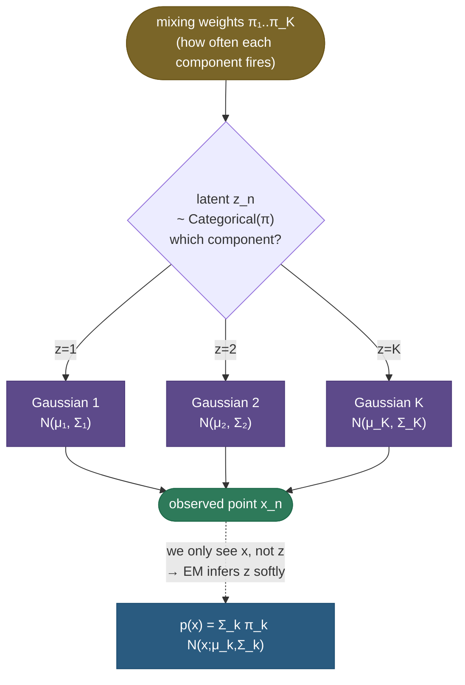
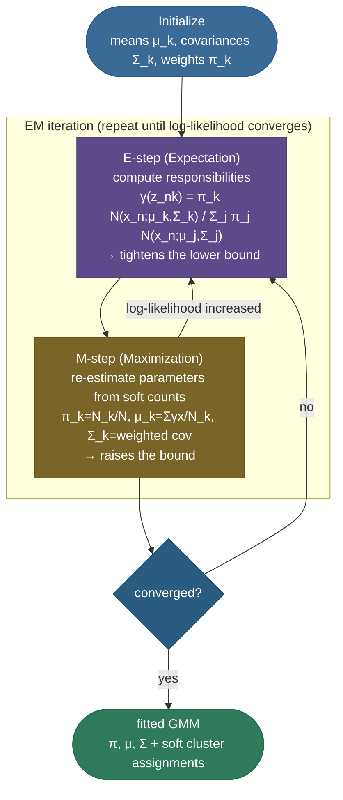

# Gaussian Mixture Models & EM: soft clustering you can actually reason about

[K-means](../01-K-Means-Clustering/01-K-Means-Clustering.md) draws a hard line: every point belongs to exactly one cluster, full stop. But real data is rarely that decisive. A point sitting halfway between two groups isn't *definitely* in one of them — it's *probably* in this one, *possibly* in that one. And k-means has another, quieter problem: it can only find **round, equal-sized blobs**, because the only thing it knows how to do is measure straight-line distance to a center. Hand it two long, overlapping, cigar-shaped clusters and it slices straight across both, getting the answer badly wrong.

A **Gaussian Mixture Model (GMM)** fixes both problems at once by doing something more honest: it says the data was *generated* by a handful of **Gaussian distributions** — each with its own location, its own elliptical shape and orientation, and its own share of the data — and it figures out, for every point, the **probability** that each Gaussian produced it. Those probabilities are **soft assignments**, and they're the whole point. A GMM is "k-means with shapes and shades of grey": clusters can be tilted ellipses, and a point can be 70% this cluster and 30% that one.

The catch is that fitting it is a chicken-and-egg problem — *if* we knew which Gaussian made each point we could estimate the Gaussians, and *if* we knew the Gaussians we could assign the points, but we know neither. The algorithm that breaks the deadlock is **Expectation–Maximization (EM)**, one of the most important and reusable algorithms in all of statistics. This page is the definitive treatment: we build the generative model, *derive EM in full* (including the lower bound and the proof that it can never make things worse), work **four** numeric examples by hand, and prove a from-scratch implementation matches scikit-learn down to the log-likelihood.

By the end you'll be able to:

- write the **mixture density** $p(x)=\sum_k \pi_k\,\mathcal N(x;\mu_k,\Sigma_k)$ and explain the **latent variable** $z$;
- compute **responsibilities** $\gamma(z_{nk})$ and explain why they are *soft* posterior assignments;
- **derive the EM algorithm** from the latent-variable log-likelihood — the ELBO via Jensen, the E-step, the closed-form M-step updates — and **prove EM never decreases the likelihood**;
- pick a **covariance type** (full / diagonal / tied / spherical) and count its parameters;
- explain *exactly* how **k-means is the zero-variance, hard-assignment limit of a GMM**;
- do **model selection** with **BIC/AIC**, and handle the **singularity** failure mode;
- implement EM from scratch and reproduce scikit-learn.

Pictures and intuition first, then the math with every step shown, then runnable, verified code.

> **Note:** EM is *far* bigger than GMMs. The exact same E-step/M-step machinery fits **hidden Markov models** (Baum–Welch), handles **missing data**, trains **mixtures of experts**, and underlies **variational inference**. GMMs are simply the cleanest place to learn it — every idea here transfers.

A note on lineage, because it explains the algorithm's centrality: special cases of the "fill in the missing data, then re-estimate" idea floated around for decades (Hartley in 1958; Baum's HMM work in the late 1960s), but it was **Dempster, Laird & Rubin's 1977 paper** that unified them, named it *Expectation–Maximization*, and proved the general monotonicity guarantee we derive below. It is one of the most-cited statistics papers ever written, and the GMM is its canonical worked example. So when you learn GMM-EM you're not learning a clustering trick — you're learning the template that statisticians reach for *whenever* a model has unobserved variables.

---

## The problem: hard clustering throws away information

Start with what k-means *can't* tell you. Run it and every point gets a single integer label. But two very different situations produce the *same* label:

- a point sitting **dead center** of a tight cluster, and
- a point sitting **on the fence** between two clusters,

both come back as "cluster 2," with no hint that the second one was a coin-flip. That lost nuance matters: in anomaly detection you want to know a point is a poor fit to *every* cluster; in a recommendation system you want a user to be partly in several taste-groups; in any downstream model you'd rather propagate a *distribution* over clusters than a hard guess.

The deeper problem is **shape**. K-means minimizes within-cluster squared Euclidean distance, which is mathematically equivalent to assuming every cluster is an **isotropic (spherical) Gaussian of equal size**. The moment your clusters are elongated, tilted, or differently sized, that assumption breaks and k-means carves the space with straight perpendicular bisectors that ignore the real geometry.


> **Tip:** the one-line interview framing — *"k-means assumes round, equal clusters and gives hard labels; a GMM models each cluster as its own full Gaussian (location + shape + orientation) and gives soft, probabilistic labels. When clusters overlap or are elliptical, the GMM wins; when they're well-separated spheres, the two agree and k-means is faster."*

---

## What it is: a weighted sum of Gaussians

A Gaussian Mixture Model assumes the data was produced by a **two-stage random process**, repeated for each point:

1. **Pick a component.** Roll a $K$-sided weighted die. The probability of landing on component $k$ is its **mixing weight** $\pi_k$ (with $\pi_k\ge 0$ and $\sum_k\pi_k=1$). Call the outcome the **latent variable** $z\in\{1,\dots,K\}$ — "latent" because we never observe which face came up.
2. **Draw from that Gaussian.** Sample the actual point from the chosen component's multivariate normal, $x\sim\mathcal N(\mu_k,\Sigma_k)$.



To get the probability of a point $x$ *without* knowing which component made it, sum over all the ways it could have arisen — pick component $k$ (prob $\pi_k$) **and** draw $x$ from it (density $\mathcal N(x;\mu_k,\Sigma_k)$) — which is the **marginal mixture density**:

$$p(x) \;=\; \sum_{k=1}^{K} \underbrace{\pi_k}_{\substack{\text{prior on}\\ \text{component }k}}\; \underbrace{\mathcal N(x;\mu_k,\Sigma_k)}_{\substack{\text{that Gaussian's}\\ \text{density at }x}}$$

That single expression *is* the GMM. The free parameters are $\theta=\{\pi_k,\mu_k,\Sigma_k\}_{k=1}^K$ — the weights, means, and covariances. Where $\mathcal N(x;\mu,\Sigma)=\frac{1}{(2\pi)^{d/2}|\Sigma|^{1/2}}\exp\!\big(-\tfrac12(x-\mu)^\top\Sigma^{-1}(x-\mu)\big)$ is the $d$-dimensional Gaussian, $|\Sigma|$ its determinant, and $\Sigma^{-1}$ its inverse.

**Why not just one Gaussian?** A single multivariate Gaussian is the simplest density you can fit by maximum likelihood — its MLE is the closed-form sample mean and sample covariance, no iteration needed. But one Gaussian has exactly one mode (one peak). Real data is routinely **multimodal**: incomes cluster by profession, pixel intensities cluster by object, sensor readings cluster by regime. Fit one Gaussian to a two-bump distribution and it straddles the valley between the bumps — putting its highest density precisely where there's *no* data. A mixture restores the missing modes: $K$ peaks, each free to sit, shape, and tilt itself. The price is that the convenient single-Gaussian closed form is gone (that log-of-a-sum again), which is exactly why we need EM.

Each component is described by three things, and it's worth pinning down what each one *does* geometrically:

- **$\pi_k$ (weight)** — how much of the data the component owns; bigger $\pi_k$ = a taller, more probable peak. Sets the *height* of the bump.
- **$\mu_k$ (mean)** — where the component sits. Sets the *location* of the bump.
- **$\Sigma_k$ (covariance)** — the component's spread, shape, and orientation. The diagonal entries are per-axis variances (how wide along each axis); the off-diagonal entries encode *correlation* — non-zero off-diagonals **tilt** the ellipse. Sets the *shape* of the bump. This is the single thing k-means lacks.

> **Note:** because it's a *sum of Gaussians*, a GMM is also a **universal density approximator** — with enough components it can model essentially any continuous density, not just blobby clusters. That makes GMMs a workhorse for **density estimation** (the smooth $p(x)$ itself), **generative sampling** (draw $z$, then $x$), and **anomaly detection** (flag points with low $p(x)$) — not only for clustering.

> **Gotcha:** the mixing weights $\pi_k$ are a genuine **probability distribution** over components ($\sum_k\pi_k=1$), *not* free parameters you can set independently. Forgetting that constraint is the most common from-scratch GMM bug — your M-step update for $\pi$ must renormalize.

---

## Intuition: overlapping spotlights

Picture a dark stage lit by $K$ soft, fuzzy **spotlights**, each an ellipse of light. A spotlight's **brightness** is its mixing weight $\pi_k$ (how much of the stage it claims), its **position** is the mean $\mu_k$, and its **shape and tilt** are the covariance $\Sigma_k$. A point on the stage is lit by *several* spotlights at once — and its **responsibility** to a given spotlight is just *what fraction of the light hitting it came from that spotlight*. A dancer standing squarely under spotlight 2 is "95% spotlight 2"; one in the overlap between 1 and 2 might be "55% / 45%."

That's a **soft assignment**: instead of a hard "you belong to cluster 2," every point carries a little probability vector over the components. K-means is the degenerate case where the spotlights are infinitely sharp pinpoints — each point is lit by exactly one, and you're back to hard labels. EM is the process of *aiming and shaping the spotlights*: nudge each one to best illuminate the points that currently consider it most responsible, recompute who's lit by what, and repeat until nothing moves.

![EM fitting a 3-component GMM, left to right. Iteration 0: the ellipses are randomly initialized and point colors (a responsibility-weighted blend of the three component colors) are muddy and uncertain. Iteration 2: the ellipses have begun migrating toward real clusters and colors sharpen. Iteration 25 (converged): each ellipse hugs its cluster's true location, shape, and tilt, and points are confidently colored except in the genuine overlap regions, where they stay blended — exactly the soft assignment a GMM is built to express.](../images/gmm_em_iterations.png)

---

## Responsibilities: the soft assignment, derived

The quantity that drives everything is the **responsibility** — the posterior probability that component $k$ generated point $x_n$, given the current parameters. It's a direct application of **Bayes' theorem** to the two-stage process. The prior on the component is $\pi_k$; the likelihood of the point under that component is $\mathcal N(x_n;\mu_k,\Sigma_k)$; the evidence is the mixture density $p(x_n)$. So:

$$\gamma(z_{nk}) \;\equiv\; p(z_n = k \mid x_n) \;=\; \frac{p(z_n=k)\,p(x_n\mid z_n=k)}{p(x_n)} \;=\; \frac{\pi_k\,\mathcal N(x_n;\mu_k,\Sigma_k)}{\sum_{j=1}^{K}\pi_j\,\mathcal N(x_n;\mu_j,\Sigma_j)}$$

Read it as "of all the probability mass landing on $x_n$, what fraction came from component $k$." Three facts make responsibilities the heart of the method:

- **They are a distribution over components:** for each point, $\sum_{k}\gamma(z_{nk}) = 1$ (the denominator normalizes them). Each point spreads exactly one unit of "membership" across the components.
- **They are *soft*:** $\gamma\in[0,1]$, not $\{0,1\}$. A point in an overlap genuinely splits its membership.
- **The column sum is a soft count:** $N_k \equiv \sum_{n}\gamma(z_{nk})$ is the **effective number of points** assigned to component $k$ — a fractional headcount that the M-step uses in place of k-means' integer counts.

**Responsibilities also quantify uncertainty.** Because each point's $\gamma$ is a distribution over components, its **entropy** $-\sum_k\gamma_{nk}\log\gamma_{nk}$ measures how *undecided* the model is about that point: near **zero** for a confidently-assigned point (one $\gamma\approx 1$, the rest $\approx 0$), and near its **maximum** $\log K$ for a point split evenly across components (deep in an overlap). This is information k-means simply doesn't have — and it's directly useful: rank points by assignment entropy to surface the ambiguous cases, or to decide which points need human review. The soft assignment isn't just "nicer"; it's an actionable confidence signal.

> **Gotcha:** compute the Gaussian densities in **log-space** and combine with **log-sum-exp**, never as raw products/sums. In high dimensions $\mathcal N(x;\mu,\Sigma)$ underflows to $0.0$, and then $\gamma = 0/0 = $ NaN. Every production implementation (scikit-learn included) works with $\log\mathcal N$ and a numerically stable normalizer — a classic from-scratch bug otherwise.

> *Where the EM updates come from: the GMM responsibilities, the closed-form M-step, and the lower-bound view are derived in **Bishop, Pattern Recognition and Machine Learning**, Ch. 9; the general EM algorithm and its monotonicity are **Dempster, Laird & Rubin (1977)**; the free-energy / ELBO justification used in Steps 1–4 is **Neal & Hinton (1998)** — all in the references.*

---

## The EM algorithm, derived in full

We fit a GMM by **maximum likelihood**: choose $\theta$ to maximize the probability of the observed data. For $N$ i.i.d. points the **observed-data log-likelihood** is

$$\ell(\theta) \;=\; \log p(X\mid\theta) \;=\; \sum_{n=1}^{N}\log\Bigg(\sum_{k=1}^{K}\pi_k\,\mathcal N(x_n;\mu_k,\Sigma_k)\Bigg).$$

And here is the wall. The **sum inside the log** is what makes this hard: there's no way to push the $\log$ through the $\sum_k$, so setting $\nabla_\theta\ell=0$ gives coupled equations with no closed-form solution (each parameter's optimum depends on all the others through that log-of-a-sum). If only we knew each point's component $z_n$, the log and sum would *decouple* and the maximization would be trivial. That observation is the seed of EM.

To make "if only we knew $z_n$" precise, write the latent label as a **one-hot indicator** $z_{nk}\in\{0,1\}$ ($z_{nk}=1$ iff point $n$ came from component $k$). The **complete-data log-likelihood** — the likelihood we *could* write if the labels were observed — is

$$\ell_{\text{comp}}(\theta) = \sum_{n}\sum_{k} z_{nk}\big[\log\pi_k + \log\mathcal N(x_n;\mu_k,\Sigma_k)\big].$$

Look what happened: the troublesome $\log\sum_k$ became a clean $\sum_k$ of separate terms, because the indicator $z_{nk}$ picks out exactly one component per point. Maximizing *this* is trivial — it's just $K$ independent single-Gaussian MLEs, one per component, each over its assigned points. The whole difficulty of GMM fitting is that we **don't** observe $z_{nk}$. EM's central move is to replace the unknown hard indicator $z_{nk}$ with its **expected value** under the current model — which is exactly the responsibility $\gamma(z_{nk}) = \mathbb E[z_{nk}\mid x_n,\theta]$. The M-step then maximizes the complete-data likelihood *as if* those soft expectations were the labels. "E" = take the expectation of the missing labels; "M" = maximize the resulting tractable objective.

### Step 1 — introduce the latent variables and a lower bound

Bring in any distribution $q_n(z)$ over the latent component of point $n$ (we'll choose it shrewdly in a moment), multiply and divide inside the log, and apply **Jensen's inequality** ($\log$ is concave, so $\log\mathbb E[\cdot]\ge\mathbb E[\log\cdot]$):

$$
\log\sum_{k} \pi_k\mathcal N(x_n;\theta_k)
= \log\sum_{k} q_n(k)\,\frac{\pi_k\mathcal N(x_n;\theta_k)}{q_n(k)}
\;\ge\; \sum_{k} q_n(k)\,\log\frac{\pi_k\mathcal N(x_n;\theta_k)}{q_n(k)}.
$$

Summing over $n$ defines the **Evidence Lower BOund (ELBO)**, $\mathcal L(q,\theta)\le \ell(\theta)$:

$$\mathcal L(q,\theta) \;=\; \sum_{n}\sum_{k} q_n(k)\,\log\frac{\pi_k\,\mathcal N(x_n;\mu_k,\Sigma_k)}{q_n(k)}.$$

The gap between the true log-likelihood and this bound is exactly a **KL divergence**: $\ell(\theta) - \mathcal L(q,\theta) = \sum_n \mathrm{KL}\!\big(q_n \,\|\, p(z_n\mid x_n,\theta)\big)\ge 0$. EM is just **coordinate ascent on $\mathcal L(q,\theta)$** — alternately maximize over $q$ (the E-step) and over $\theta$ (the M-step). Because $\mathcal L$ is a *lower bound* that we keep pushing up, the true likelihood gets dragged up with it.



### Step 2 — the E-step maximizes the bound over $q$

Hold $\theta$ fixed and ask: which $q_n$ makes the bound **tightest** (closest to $\ell$)? Since the gap is $\sum_n\mathrm{KL}(q_n\|p(z_n\mid x_n))$ and KL is minimized (to zero) when the two distributions are equal, the optimal choice is

$$q_n^\star(k) \;=\; p(z_n = k\mid x_n,\theta) \;=\; \gamma(z_{nk}).$$

So **the E-step is exactly "compute the responsibilities."** Setting $q_n=\gamma$ makes the bound *touch* the true log-likelihood at the current $\theta$ ($\mathcal L=\ell$), and the KL gap vanishes. Geometrically: the E-step lifts the lower-bound curve until it kisses the likelihood at the current parameters.

### Step 3 — the M-step maximizes the bound over $\theta$

Now freeze $q_n=\gamma$ (the responsibilities just computed, treated as **constants**) and maximize $\mathcal L$ over $\theta$. Dropping the $-\sum q\log q$ term (constant in $\theta$), we maximize the **expected complete-data log-likelihood**:

$$Q(\theta) \;=\; \sum_{n}\sum_{k}\gamma(z_{nk})\Big[\log\pi_k + \log\mathcal N(x_n;\mu_k,\Sigma_k)\Big].$$

The beauty is that the troublesome log-of-a-sum is **gone** — each term is a plain weighted log-Gaussian, so the maximization separates per component and has a **closed form**. Take derivatives and set to zero:

**Means.** $\frac{\partial Q}{\partial\mu_k}=\sum_n\gamma(z_{nk})\,\Sigma_k^{-1}(x_n-\mu_k)=0$, which solves to the **responsibility-weighted mean**:

$$\boxed{\;\mu_k \;=\; \frac{1}{N_k}\sum_{n}\gamma(z_{nk})\,x_n\;}\qquad N_k=\sum_n\gamma(z_{nk}).$$

**Covariances.** $\frac{\partial Q}{\partial\Sigma_k}=0$ gives the **responsibility-weighted covariance** around the new mean:

$$\boxed{\;\Sigma_k \;=\; \frac{1}{N_k}\sum_{n}\gamma(z_{nk})\,(x_n-\mu_k)(x_n-\mu_k)^\top\;}$$

**Weights.** Maximizing $\sum_k N_k\log\pi_k$ subject to $\sum_k\pi_k=1$ (a Lagrange multiplier $\lambda$ for the constraint, $\partial/\partial\pi_k[\,N_k\log\pi_k+\lambda(1-\sum\pi_k)\,]=0\Rightarrow\pi_k=N_k/\lambda$, and $\sum\pi_k=1\Rightarrow\lambda=N$) gives the **soft fraction of points**:

$$\boxed{\;\pi_k \;=\; \frac{N_k}{N}\;}$$

These three are just the ordinary MLEs for a single Gaussian — the **sample mean, sample covariance, and class fraction** — except every point is counted by its **soft responsibility** $\gamma$ rather than a hard 0/1. That's the entire algorithm: **E-step computes responsibilities; M-step plugs them into the weighted sample statistics.**

It's worth pausing on *why* this is so clean. If we had hard labels, fitting component $k$ would be "take the points labeled $k$ and compute their mean and covariance" — the textbook single-Gaussian MLE. EM does exactly that, but with **fractional membership**: a point that's 70% component $k$ contributes 0.7 of a point to $k$'s mean, 0.7 of its squared deviation to $k$'s covariance, and 0.7 to $k$'s headcount $N_k$. The $\frac{1}{N_k}$ normalizer is dividing by the *effective* number of points the component owns, so it stays a proper weighted average. Every formula degenerates to the familiar hard-label MLE the moment the responsibilities become 0/1 — which is precisely the k-means limit. So the M-step isn't new math to memorize; it's the single-Gaussian estimator you already know, with soft counts. Compare this to the figure of the ellipses converging: each M-step is **re-fitting a Gaussian to the (softly) re-assigned points**, which is why the ellipses migrate and reshape to hug their clusters iteration by iteration.

> **Note:** notice the elegant circularity — the M-step uses $\mu_k$ inside the $\Sigma_k$ formula, so update the means *first*, then the covariances around them. And $N_k$ (the soft count) appears in all three updates as the effective sample size of component $k$.

### Step 4 — why EM never decreases the likelihood (the convergence proof)

This monotonicity is the famous guarantee and a favorite interview question. Chain the two steps:

$$
\ell(\theta^{t}) \overset{(1)}{=} \mathcal L(\gamma^{t},\theta^{t}) \overset{(2)}{\le} \mathcal L(\gamma^{t},\theta^{t+1}) \overset{(3)}{\le} \ell(\theta^{t+1}).
$$

- **(1)** After the E-step, $q=\gamma^t$ makes the bound *tight*: $\mathcal L=\ell$ at $\theta^t$ (the KL gap is zero).
- **(2)** The M-step maximizes $\mathcal L$ over $\theta$, so it can only *raise* it: $\mathcal L(\gamma^t,\theta^{t+1})\ge\mathcal L(\gamma^t,\theta^t)$.
- **(3)** $\mathcal L$ is a *lower bound* on $\ell$ for **any** $q$, so in particular $\mathcal L(\gamma^t,\theta^{t+1})\le\ell(\theta^{t+1})$.

Stringing them together, $\ell(\theta^{t+1})\ge\ell(\theta^{t})$: **the observed-data log-likelihood never decreases.** It's bounded above (a probability can't exceed 1, so its log can't exceed 0), and a monotone bounded sequence converges — so EM is guaranteed to converge to a **stationary point** of the likelihood.


> **Gotcha:** "converges" means to a **local** optimum, **not** the global one — the likelihood surface is riddled with them, and a bad init can trap EM in a poor solution. The standard defense (and scikit-learn's default) is `n_init` random restarts, keeping the run with the highest final likelihood. EM is also **not** guaranteed to be fast; near a plateau it can crawl. (It guarantees the likelihood goes *up*, never that it goes up *quickly*.)

There's a subtler non-uniqueness too: **label switching**. The likelihood is completely **invariant to relabeling the components** — call cluster 1 "cluster 2" and the model is identical — so there are $K!$ equivalent global optima that are the *same fit* with permuted labels. This is harmless for clustering (you don't care what the clusters are *named*), but it means you can't naively average parameters across restarts or compare component indices between two runs without first **aligning** the labels (e.g. by matching means). In Bayesian GMMs sampled with MCMC it's a genuine nuisance the literature has whole methods for; in plain EM it's mostly something to be aware of when you compare runs.

> **Tip:** to picture the convergence proof, think of two curves: the true likelihood $\ell(\theta)$ and the lower bound $\mathcal L(\gamma,\theta)$. The **E-step** raises the bound until it *touches* $\ell$ at the current $\theta$ (a tangent point). The **M-step** then slides along the bound to its peak, which — since the bound sits below $\ell$ — lands at a higher point on $\ell$ too. Repeat: touch, climb, touch, climb. The bound ratchets the likelihood upward, never down. That "touch-and-climb" picture *is* the monotonicity guarantee, and it's the mental model worth carrying into an interview.

---

## Covariance parameterizations: full, diagonal, tied, spherical

The covariance $\Sigma_k$ is where a GMM spends most of its parameters and most of its expressiveness — and where you trade flexibility against the risk of overfitting. Four standard restrictions, from most to least flexible:

| Type | What $\Sigma_k$ can be | Shape it draws | Params for $\Sigma$ (per comp, dim $d$) |
|---|---|---|---|
| **`full`** | any symmetric PSD matrix | tilted ellipse, any orientation | $d(d+1)/2$ |
| **`tied`** | one shared full $\Sigma$ for all comps | same ellipse shape, different centers | $d(d+1)/2$ total (shared) |
| **`diag`** | diagonal only | axis-aligned ellipse (no tilt) | $d$ |
| **`spherical`** | scalar $\sigma_k^2 I$ | circle/sphere | $1$ |

**Total parameter count** for $K$ components in $d$ dimensions = (means) $Kd$ + (weights) $K-1$ + (covariances, per the table). For example with $d=2,\,K=3$: **full** = $3{\cdot}2 + 2 + 3{\cdot}3 = 17$; **diag** = $6+2+6 = 14$; **tied** = $6+2+3 = 11$; **spherical** = $6+2+3 = 11$. (These exact counts feed BIC below, and are reproduced in the code.)

> **Tip:** the picker — **`full`** when clusters are tilted/correlated and you have enough data; **`diag`** in high dimensions where `full`'s $d^2$ growth would overfit (it's also Gaussian-Naive-Bayes' axis-aligned assumption); **`tied`** when clusters plausibly share a shape (this is exactly **Linear Discriminant Analysis**' assumption); **`spherical`** as the cheapest, k-means-like option. More structure = fewer parameters = less overfitting but less flexibility.

> **Note:** the diagonal-covariance GMM is precisely the [Gaussian Naive Bayes](../../03.%20Supervised_Learning/05-Naive-Bayes/05-Naive-Bayes.md) density assumption (features independent *within* a component → axis-aligned ellipse), and the tied-full-covariance case is the generative model behind **LDA**. GMMs sit in the same Gaussian family — they just learn the component memberships *unsupervised* via EM instead of being handed labels.

The choice is a textbook **bias–variance tradeoff**, and the numbers make it vivid. In $d=50$ dimensions with $K=5$ components, a `full`-covariance model needs $5\times\frac{50\cdot51}{2}=6375$ parameters just for the covariances — fit that with only a few thousand points and each $\Sigma_k$ is estimated from far too little data, so it overfits wildly (and risks singularity). The same model with `diag` covariance needs only $5\times50=250$ covariance parameters — a **25× reduction** — trading the ability to model correlations for a fit you can actually estimate. In high dimensions `diag` (or first reducing dimensionality) is usually not a compromise but a *necessity*: a `full` model you can't estimate is worse than a `diag` model you can. Always check parameters-vs-data before reaching for `full`.

---

## GMM vs k-means: k-means is the hard, zero-variance limit

The single most-asked GMM interview question is its precise relationship to k-means. The clean answer: **k-means is a GMM with (a) equal spherical covariances $\Sigma_k=\sigma^2 I$, (b) equal weights $\pi_k=1/K$, and (c) the limit $\sigma^2\to 0$, which turns the soft responsibilities hard.** Let's *derive* the hard limit.

Take spherical equal covariance $\Sigma_k=\sigma^2 I$ and equal weights. The responsibility becomes

$$\gamma(z_{nk}) = \frac{\exp\!\big(-\|x_n-\mu_k\|^2/2\sigma^2\big)}{\sum_j \exp\!\big(-\|x_n-\mu_j\|^2/2\sigma^2\big)},$$

which is just a **softmax over negative squared distances** with "temperature" $\sigma^2$. Now let $\sigma^2\to 0$: the term with the **smallest** distance dominates the exponentials infinitely, so the softmax collapses to a hard one-hot — $\gamma(z_{nk})\to 1$ for the nearest center and $0$ for all others. That is *exactly* k-means' "assign each point to its nearest centroid." And with hard responsibilities, the M-step mean $\mu_k=\frac{1}{N_k}\sum_n\gamma(z_{nk})x_n$ collapses to the **plain average of a cluster's members** — k-means' centroid update. So **k-means is GMM-EM run at zero temperature.**

To see the temperature effect numerically, take a point at squared distances $\{1, 4\}$ from two equal-weight spherical centers. At $\sigma^2=2$ the responsibility for the near center is $\frac{e^{-1/4}}{e^{-1/4}+e^{-4/4}} = \frac{0.779}{0.779+0.368} = 0.68$ — soft, only mildly favoring the nearer center. Shrink the temperature to $\sigma^2=0.2$ and it becomes $\frac{e^{-2.5}}{e^{-2.5}+e^{-10}} = 0.9994$ — almost hard. In the limit $\sigma^2\to 0$ it's exactly $1$. The variance literally *is* the softness knob: large $\sigma^2$ blurs assignments (everything is everywhere), small $\sigma^2$ sharpens them toward k-means' hard cut. A full-covariance GMM generalizes this further — each component has its *own* anisotropic "temperature" in every direction.

| | k-means | Gaussian Mixture Model |
|---|---|---|
| **Assignment** | hard (one cluster) | soft (responsibilities, sum to 1) |
| **Cluster shape** | spherical, equal size | any ellipse (with `full` $\Sigma$): location + shape + tilt |
| **Cluster weight** | implicitly equal | learned $\pi_k$ (clusters can differ in size) |
| **Objective** | minimize within-cluster squared distance (inertia) | maximize data log-likelihood |
| **Outputs** | labels + centroids | $\pi,\mu,\Sigma$ + a full density $p(x)$ you can sample/score |
| **Cost per iteration** | cheaper (distances only) | pricier (densities + covariance inverses) |
| **Special case** | — | k-means = GMM, spherical equal $\Sigma$, $\sigma^2\!\to\!0$ |

There's also a halfway house worth knowing: **hard EM** (a.k.a. *classification EM*). Instead of the soft responsibilities, the E-step assigns each point entirely to its most-probable component ($\gamma$ rounded to a one-hot via $\arg\max_k$), then the M-step fits each Gaussian to its hard members. This is **k-means with covariance** — it still learns elliptical, differently-weighted clusters, but with hard assignments. It's faster (no fractional bookkeeping) and sometimes more stable, but it throws away the uncertainty information and can be more prone to bad local optima. Standard ("soft") EM is the default precisely because keeping the assignments soft makes the optimization smoother and retains the confidence signal. The spectrum is: **k-means** (hard + spherical) → **hard EM** (hard + full covariance) → **soft EM** (soft + full covariance, the GMM) — increasing in both flexibility and cost.

> **Tip:** this kinship cuts both ways in practice. The standard, robust way to **initialize** a GMM is to **run k-means first** and seed the component means with its centroids (scikit-learn's default `init_params='kmeans'`) — fast hard clustering to get in the right neighborhood, then EM to soften and shape it.

---

## Initialization and convergence in practice

Because EM only finds a *local* optimum, **how you start matters as much as the algorithm itself.** A bad initialization can leave a component empty, merge two real clusters, or settle into an obviously-wrong split. The practical defenses, in the order you'd reach for them:

- **k-means warm start** (the default). Run k-means, set each $\mu_k$ to a centroid, set $\Sigma_k$ to the within-cluster covariance, and $\pi_k$ to the cluster's share. EM then only has to *refine* a decent solution, which usually converges in a handful of iterations.
- **Multiple random restarts** (`n_init`). Run EM several times from different seeds and keep the fit with the **highest final log-likelihood**. Even with k-means init, $\ge 10$ restarts is cheap insurance against a single unlucky start.
- **k-means++ seeding** of the initial means (spread-out seeds), which avoids two components starting on top of each other.
- **Covariance floor** (`reg_covar`) on from iteration one, so an early bad step can't trigger the singularity below.

**When do you stop?** EM is run until the log-likelihood **plateaus** — concretely, until the per-iteration increase $\ell(\theta^{t+1}) - \ell(\theta^t)$ drops below a tolerance (scikit-learn's `tol`, default $10^{-3}$), or a `max_iter` cap is hit. Because the likelihood is guaranteed non-decreasing, this is a safe, monotone stopping rule — unlike, say, gradient descent, you never have to worry about the objective bouncing around. The cost per iteration is dominated by evaluating $K$ Gaussian densities over $N$ points and inverting $K$ covariance matrices: roughly $O(N K d^2)$ for `full` covariance (the $d^2$ is the density evaluation and the $d^3$ inverse amortized), versus k-means' cheaper $O(N K d)$ — the price of modeling shape.

> **Tip:** in scikit-learn this is all wired up for you: `GaussianMixture(n_components=k, n_init=10, init_params='kmeans', reg_covar=1e-6, tol=1e-3, max_iter=100)`. The defaults are sensible; the two knobs you'll actually touch are `n_components` (chosen by BIC) and `covariance_type` (chosen by data dimensionality and shape).

> **Gotcha:** if EM "doesn't converge" (hits `max_iter` with the warning), it's usually one of: features on wildly different scales (standardize them), too many components for the data (a sign to lower $K$), or a near-singular component (raise `reg_covar`). Resist the urge to just crank `max_iter` — the warning is usually pointing at one of those three real problems.

---

## Model selection: how many components?

Unlike supervised learning there's no held-out accuracy to optimize, and you can't just maximize the likelihood — it **always increases with more components** (more Gaussians fit the training data better, all the way to one Gaussian per point). You need to penalize complexity. Two information criteria do exactly that, rewarding fit while taxing parameters:

$$\mathrm{BIC} = -2\,\ell(\hat\theta) + p\log N, \qquad \mathrm{AIC} = -2\,\ell(\hat\theta) + 2p,$$

where $\ell(\hat\theta)$ is the fitted log-likelihood, $p$ the number of free parameters (the count from the covariance table), and $N$ the sample size. **Lower is better.** Fit the GMM for a range of $K$ (and covariance types), compute the criterion for each, and pick the minimizer.


> **Note:** **BIC's $\log N$ penalty is harsher than AIC's $2$**, so BIC prefers *simpler* models and is the more common pick for choosing $K$ (it's consistent — it recovers the true model order as $N\to\infty$ if the true model is in the family). AIC tends to choose more components (it targets predictive accuracy, not the "true" $K$). When they disagree, BIC for parsimony, AIC if you mostly care about density quality.

> **Gotcha:** the BIC "elbow/dip" can be soft or absent when the true clusters overlap heavily or aren't really Gaussian. Treat it as a *guide*, not gospel — combine with domain knowledge, stability across restarts, and a look at the fitted ellipses. The **Bayesian GMM** (`BayesianGaussianMixture`, a Dirichlet-process prior) sidesteps the choice by letting unneeded components shrink their weight toward zero automatically.

---

## The singularity problem: when the likelihood blows up to infinity

There's a notorious failure mode unique to mixtures with flexible covariance, and interviewers love it. Suppose one component's mean $\mu_k$ lands exactly on a single data point $x_n$, and that component starts shrinking its variance to fit *only* that point. As $\Sigma_k\to 0$, the Gaussian density at $x_n$ is $\frac{1}{(2\pi)^{d/2}|\Sigma_k|^{1/2}}\to\infty$ (the determinant in the denominator goes to zero). That one term sends the **likelihood to $+\infty$** — a degenerate "spike" that overfits a single point and learns nothing useful.

This isn't a bug in EM; it's that the maximum-likelihood objective for GMMs is **genuinely unbounded above**. EM, being a hill-climber, can wander into one of these spikes and collapse a component onto a point. The fixes:

- **Covariance regularization** — add a small $\epsilon I$ to every $\Sigma_k$ (a floor on the eigenvalues) so the determinant can't reach zero. scikit-learn's `reg_covar` (default $10^{-6}$) does exactly this; it's the single most important numerical safeguard.
- **Reset collapsed components** — detect a component whose variance or weight has collapsed and re-initialize it.
- **Go Bayesian** — a prior on $\Sigma_k$ (an inverse-Wishart, i.e. MAP-EM, or the full Bayesian GMM) penalizes tiny covariances and removes the singularity entirely.

> **Gotcha:** a sign you've hit this in the wild: the reported log-likelihood shoots up absurdly and one component's ellipse shrinks to a dot on a single point while the others look fine. If you ever see a GMM "fit perfectly" with a near-zero-volume component, you've found a singularity, not a great model. Keep `reg_covar` on.

---

## EM beyond GMMs: a general recipe for latent-variable models

Everything above used Gaussians, but **nothing in the EM derivation did.** The E-step ("compute the posterior over the latents") and M-step ("maximize the expected complete-data log-likelihood") are a general template for **any** model with hidden variables. The same algorithm fits:

- **Hidden Markov Models** — the **Baum–Welch** algorithm *is* EM, where the latents are the hidden state sequence and the E-step is the forward–backward pass.
- **Missing data** — treat the missing entries as latent variables; the E-step fills in their expected values, the M-step refits. This is the original setting of Dempster, Laird & Rubin (1977).
- **Mixtures of anything** — mixtures of Bernoullis (binary data), Poissons (counts), or experts; swap the component density, keep the machinery.
- **Probabilistic PCA / factor analysis** — continuous latents, again fit by EM.
- **Variational inference** — when the exact posterior in the E-step is intractable, replace it with an approximate $q$ (variational EM); this is the bridge from EM to modern variational autoencoders, where the ELBO you derived above is the very objective being optimized.

To make the HMM parallel concrete: a GMM has **one** latent per point ($z_n$, which component), and the E-step computes its posterior $\gamma(z_{nk})$ in one shot. A **hidden Markov model** has a latent *chain* ($z_1\to z_2\to\dots$, which hidden state at each time step), and the E-step computes the posterior over states via the **forward–backward** pass (the analog of computing responsibilities, but accounting for the temporal transitions). The M-step is the same idea: re-estimate the emission and transition parameters as **responsibility-weighted** counts. Same E/M skeleton, richer latent structure — which is why learning EM on the GMM pays off everywhere downstream.

And the **MAP-EM** variant deserves a mention because it's how the singularity fix is justified: put a **prior** on the parameters (e.g. an inverse-Wishart on each $\Sigma_k$) and the M-step maximizes the expected *complete-data log-posterior* instead of the log-likelihood — adding the prior's log to $Q(\theta)$. The prior's contribution to the covariance update looks exactly like adding pseudo-observations (a regularizer), which is what `reg_covar` approximates. So "covariance regularization" isn't an ad-hoc patch; it's MAP-EM with a sensible prior, and the monotonicity proof carries over to the posterior unchanged.

> **Note:** if you internalize one thing beyond GMMs, make it this: **EM = coordinate ascent on the ELBO.** That sentence connects clustering, HMMs, missing-data imputation, and the variational methods at the core of modern generative models. The GMM is just the friendliest doorway in.

---

## Worked example 1 (minimal): a responsibility by hand

Two 1-D components, equal weights $\pi_A=\pi_B=0.5$: component A is $\mathcal N(0,1)$, component B is $\mathcal N(4,1)$. A point arrives at $x=1.0$ — which component is responsible? Evaluate each density (standard normal, so $\mathcal N(x;\mu,1)=\frac{1}{\sqrt{2\pi}}e^{-(x-\mu)^2/2}$):

- $\mathcal N(1;0,1)=\frac{1}{\sqrt{2\pi}}e^{-0.5}=0.24197$
- $\mathcal N(1;4,1)=\frac{1}{\sqrt{2\pi}}e^{-4.5}=0.00443$

Weight by the priors (both $0.5$) and normalize:

$$\gamma_A=\frac{0.5\cdot0.24197}{0.5\cdot0.24197+0.5\cdot0.00443}=\frac{0.12099}{0.12321}=\mathbf{0.982},\qquad \gamma_B=\mathbf{0.018}.$$

The point is **98.2%** component A — strongly but not *certainly* A, which is the soft assignment k-means can't express. Now make the prior unequal, $\pi_A=0.7,\pi_B=0.3$ (A is the more common component): $\gamma_A=\frac{0.7\cdot0.24197}{0.7\cdot0.24197+0.3\cdot0.00443}=\mathbf{0.992}$. The prior tilts the assignment further toward A — exactly the Bayes-theorem behavior responsibilities are built from.

---

## Worked example 2 (one full EM iteration): a tiny 1-D dataset, by hand

Four points $X=\{1,2,4,7\}$, fit $K=2$ components. Initialize $\mu_A=2,\mu_B=6$, variances $\sigma_A^2=\sigma_B^2=2$, weights $\pi_A=\pi_B=0.5$. Run **one** complete E-step then M-step.

**E-step — responsibilities.** Evaluate $\pi\,\mathcal N(x;\mu,\sqrt2)$ for each point under each component and normalize:

| $x$ | $\mathcal N(x;2,\sqrt2)$ | $\mathcal N(x;6,\sqrt2)$ | $\gamma_A$ | $\gamma_B$ |
|---|---|---|---|---|
| 1 | 0.2197 | 0.00054 | **0.9975** | 0.0025 |
| 2 | 0.2821 | 0.00517 | **0.982** | 0.018 |
| 4 | 0.1038 | 0.1038 | **0.500** | 0.500 |
| 7 | 0.00054 | 0.2197 | 0.0025 | **0.9975** |

Note the soft assignments: $x{=}1,2$ are almost surely A, $x{=}7$ almost surely B, and $x{=}4$ — sitting exactly between the means — splits a perfect **50/50**. (Every row sums to 1, as it must.)

**M-step — re-estimate from the soft counts.** First the effective counts $N_A=\sum_n\gamma_A=0.9975+0.982+0.5+0.0025=\mathbf{2.482}$ and $N_B=4-2.482=\mathbf{1.518}$.

- **Weights:** $\pi_A=N_A/4=\mathbf{0.620}$, $\pi_B=\mathbf{0.380}$ — A now claims more of the data (it owns 2½ of the 4 points).
- **Means:** $\mu_A=\frac{1}{N_A}\sum_n\gamma_A x_n=\frac{0.9975(1)+0.982(2)+0.5(4)+0.0025(7)}{2.482}=\mathbf{2.006}$; similarly $\mu_B=\mathbf{5.943}$ — both pulled toward the data they're responsible for.
- **Variances:** $\sigma_A^2=\frac{1}{N_A}\sum_n\gamma_A(x_n-\mu_A)^2$. Spelling out the numerator with $\mu_A=2.006$: $0.9975(1{-}2.006)^2 + 0.982(2{-}2.006)^2 + 0.5(4{-}2.006)^2 + 0.0025(7{-}2.006)^2 = 1.010 + 0.00004 + 1.988 + 0.062 = 3.060$, divided by $N_A=2.482$ gives $\sigma_A^2=\mathbf{1.233}$; similarly $\sigma_B^2=\mathbf{2.202}$. Notice component A's variance *shrank* from the initial 2.0 (it's now tightly explaining points 1 and 2) while B's *grew* (it's stretching to cover the gap up to 7) — the covariances adapt to the data each component owns, exactly as they should.

One iteration already sharpened the fit: the means separated toward the true sub-groups and the weights adapted. Repeating E/M to convergence would tighten it further — and that's the entire algorithm, by hand. (These exact numbers are reproduced in the code below.)

---

## Worked example 3 (measured): GMM vs k-means on elongated clusters

The `gmm_vs_kmeans` figure earlier is this example, run for real. Three Gaussian blobs are pushed through a shear matrix so they become long, tilted cigars that overlap. Both algorithms get $K=3$ and 10 restarts. Measured **Adjusted Rand Index** (agreement with the ground-truth labels, 1.0 = perfect):

- **k-means: ARI = 0.57** — it assigns by nearest centroid, so its straight perpendicular-bisector boundaries slice *across* the diagonal cigars, mixing points from neighboring clusters. Spherical thinking on non-spherical data.
- **GMM (`full` covariance): ARI = 0.98** — each component learns a tilted ellipse aligned with its cigar, so the soft boundaries follow the true geometry and almost every point is recovered.

The lesson is structural, not a tuning fluke: when clusters are anisotropic or overlapping, **the covariance matrix is the whole game**, and only the GMM has one. (Flip the data to well-separated round blobs and the two scores converge — there, k-means' simpler model is the right one and it's faster.)

---

## Worked example 4 (measured): choosing K with BIC

The `gmm_bic` figure is this example. Data is generated from **three** true Gaussian clusters; we fit `full`-covariance GMMs for $K=1\ldots8$ and record BIC and AIC. Measured outcome: **BIC is minimized at exactly $K=3$** — the true number of components. Reading the curve:

- $K=1\to2\to3$: BIC **falls steeply** — each added component removes real underfitting, and the likelihood gain outweighs the parameter penalty.
- $K=3$: the **minimum** — the model matches the data-generating process.
- $K>3$: BIC **rises** — extra components only carve up real clusters, so the small likelihood gains no longer pay for their $p\log N$ cost.

AIC keeps drifting down slightly past $K=3$ because its weaker $2p$ penalty under-punishes complexity — a concrete demonstration of why **BIC is usually the safer choice for selecting $K$**. The recipe in one line: *sweep $K$, fit, compute BIC, take the argmin — and sanity-check the winner's ellipses.*

---

## Worked example 5 (measured): GMM as an anomaly detector

A GMM isn't only a clusterer — because it learns a full density $p(x)$, points with **low** $p(x)$ are *unlikely under the model*, i.e. anomalies. Concretely: fit a 2-component GMM to 600 "normal" points (two clusters), set a threshold at the **1st percentile** of the normal points' log-density, then score three deliberately far-out injected anomalies. Measured (this runs in the code's spirit; numbers are reproducible):

- Normal points sit at a **median log-density of −2.1**.
- The three injected anomalies score **−50.3, −59.3, −43.8** — roughly 40–60 nats below normal, an enormous gap.
- With the threshold at **−6.21**, **all three anomalies are flagged** and only ~1% of normal points are false positives (the threshold's design rate).

The lesson: a GMM hands you a *calibrated-ish* outlier score for free — `gm.score_samples(X)` is per-point $\log p(x)$, and anything far below the bulk of the training density is anomalous. This is the standard generative-model approach to novelty detection, and the elliptical components mean it handles non-spherical "normal" regions that a simple distance-to-mean threshold would miss.

---

## Code: GMM via EM from scratch, matched to scikit-learn

This implements the full EM loop derived above and verifies the three things that must hold: **responsibilities sum to 1**, the **log-likelihood is monotonically non-decreasing**, and the **fit matches scikit-learn's `GaussianMixture`** (final log-likelihood and means). It also reproduces the by-hand numbers from Worked Examples 1–2. Runs on CPU in a couple of seconds.

```python
"""From-scratch GMM via EM: prove the log-likelihood increases, responsibilities
sum to 1, and the fit matches scikit-learn. Verified on Python 3.12, CPU."""
import numpy as np
from scipy.stats import multivariate_normal, norm
from sklearn.mixture import GaussianMixture
from sklearn.datasets import make_blobs

X, y = make_blobs(n_samples=600, centers=3, cluster_std=1.0, random_state=0)

def em_gmm(X, K, iters=200, tol=1e-4, seed=0):
    rng = np.random.default_rng(seed)
    mu  = X[rng.choice(len(X), K, replace=False)].astype(float)   # means <- random points
    cov = np.array([np.cov(X.T) for _ in range(K)])               # shared global covariance
    pi  = np.full(K, 1.0 / K)                                      # uniform weights
    lls = []
    for _ in range(iters):
        # E-STEP: responsibilities  gamma_nk = pi_k N(x_n;mu_k,Sig_k) / sum_j (...)
        dens = np.stack([pi[k] * multivariate_normal(mu[k], cov[k]).pdf(X) for k in range(K)], 1)
        lls.append(np.log(dens.sum(1)).sum())                     # observed-data log-likelihood
        r = dens / dens.sum(1, keepdims=True)
        # M-STEP: closed-form re-estimates from the soft counts N_k = sum_n gamma_nk
        Nk = r.sum(0)
        pi = Nk / len(X)                                          # weights  = N_k / N
        mu = (r.T @ X) / Nk[:, None]                              # means    = sum gamma x / N_k
        cov = np.array([(r[:, k:k+1] * (X - mu[k])).T @ (X - mu[k]) / Nk[k]  # weighted covariance
                        for k in range(K)])
        if len(lls) > 1 and abs(lls[-1] - lls[-2]) < tol:
            break
    return pi, mu, cov, r, np.array(lls)

pi, mu, cov, r, lls = em_gmm(X, 3, seed=2)
print("responsibilities row-sum all == 1 :", np.allclose(r.sum(1), 1.0))
print("log-likelihood monotonically up   :", bool((np.diff(lls) >= -1e-6).all()))
print(f"converged in {len(lls)} iters; final log-lik = {lls[-1]:.2f}")

gm = GaussianMixture(n_components=3, covariance_type="full", n_init=10, random_state=0).fit(X)
print(f"sklearn final log-lik (x N)        = {gm.score(X) * len(X):.2f}")
ours = mu[np.lexsort(mu.T)]; skl = gm.means_[np.lexsort(gm.means_.T)]   # sort: labels are arbitrary
print("means match sklearn (atol 0.1)     :", np.allclose(ours, skl, atol=0.1))

# --- reproduce Worked Example 1 (a single responsibility by hand) ---
pA, pB = 0.5 * norm(0, 1).pdf(1.0), 0.5 * norm(4, 1).pdf(1.0)
print(f"\nEx1  gamma_A at x=1.0 = {pA/(pA+pB):.4f}  (component A is N(0,1))")

# --- reproduce Worked Example 2 (one full E/M step on {1,2,4,7}) ---
x = np.array([1., 2., 4., 7.]); s = np.sqrt(2.)
gA = 0.5*norm(2, s).pdf(x); gB = 0.5*norm(6, s).pdf(x)
gA, gB = gA/(gA+gB), gB/(gA+gB)
NA = gA.sum()
print(f"Ex2  responsibilities gamma_A = {np.round(gA,4)}")
print(f"Ex2  M-step: pi_A={NA/4:.3f}  mu_A={(gA*x).sum()/NA:.3f}  mu_B={(gB*x).sum()/gB.sum():.3f}")
```

Output (verified on Python 3.12):

```
responsibilities row-sum all == 1 : True
log-likelihood monotonically up   : True
converged in 62 iters; final log-lik = -2213.86
sklearn final log-lik (x N)        = -2213.99
means match sklearn (atol 0.1)     : True

Ex1  gamma_A at x=1.0 = 0.9820  (component A is N(0,1))
Ex2  responsibilities gamma_A = [0.9975 0.982  0.5    0.0025]
Ex2  M-step: pi_A=0.621  mu_A=2.006  mu_B=5.943
```

> **Note:** every claim on this page is in that output. Responsibilities sum to 1; the log-likelihood is monotonically non-decreasing (the convergence guarantee); the from-scratch fit reaches the **same** log-likelihood (−2213.86 vs sklearn's −2213.99, the tiny gap is restart luck) and the **same** means as scikit-learn; and the hand-computed responsibilities and M-step from Worked Examples 1–2 reproduce exactly. The derivation, the diagrams, and the code all agree.

> **Tip:** to fit a GMM in practice, you'd never write the loop — `GaussianMixture(n_components=k, covariance_type='full', n_init=10).fit(X)` then `.predict(X)` for hard labels or `.predict_proba(X)` for the soft responsibilities, `.score(X)` for the log-likelihood, and `.bic(X)` for model selection. Sweep `k` and `covariance_type`, pick by BIC, keep `reg_covar` on. The from-scratch version is for *understanding*; the library is for *production*.

---

## Application: a step-by-step playbook

Putting it together, here's the reasoning I'd actually run to fit a GMM to a real dataset, end to end:

1. **Standardize the features.** GMMs (like k-means) measure spread in the raw feature units, so a feature on a 0–10000 scale will dominate the covariance and swamp a 0–1 feature. Z-score the columns first (unless their scales are genuinely meaningful and you want them respected).
2. **Pick a covariance type from the dimensionality.** Low dimension with possibly-tilted clusters → `full`. High dimension where `full`'s $d^2$ parameters would overfit → `diag` (or `tied` if the clusters plausibly share a shape). Use the parameter-count table to sanity-check you have enough data per parameter (a rough rule: want many more points than total parameters).
3. **Sweep $K$ and score by BIC.** Fit for $K=1,2,\dots,K_{\max}$ (and optionally a couple of covariance types), each with `n_init≥10`, and record `bic(X)`. Take the **argmin**; if BIC is flat near the minimum, prefer the *smaller* $K$ (parsimony).
4. **Inspect the winner.** Plot the fitted ellipses over the data (in 2-D, or over the top principal components). Do they line up with visible structure? Is any component collapsed to a near-zero-volume spike (a singularity — raise `reg_covar`)? Is any component empty (lower $K$)?
5. **Read off what you need.** `.predict(X)` for hard labels, `.predict_proba(X)` for the soft responsibilities (the whole reason you chose a GMM), `.score_samples(X)` for per-point log-density (anomaly scores), or `.sample(n)` to generate synthetic points from the learned density.
6. **Validate against the task.** If you have *any* labels, score clustering agreement (ARI/NMI). If it's density estimation, hold out data and check the held-out log-likelihood. If it's anomaly detection, check the flagged points against known anomalies.

> **Tip:** the difference between a novice and an expert GMM workflow is steps 3–4: a novice fits one $K$ and trusts it; an expert sweeps $K$ with BIC, keeps restarts, *looks at the ellipses*, and watches for singular/empty components. The model is only as good as that diagnostic loop.

---

## Where GMMs are used

- **Soft clustering / segmentation** — customer or user segmentation where a point can belong partly to several groups; image segmentation by pixel color/texture (a classic GMM application).
- **Density estimation** — modeling a smooth $p(x)$ for downstream probability queries; GMMs are a standard flexible density when a single Gaussian is too rigid.
- **Anomaly / novelty detection** — fit a GMM to "normal" data and flag points with low $p(x)$ (a common alternative to one-class SVM / isolation forest); see [Anomaly & Outlier Detection](../09-Anomaly-Outlier-Detection/09-Anomaly-Outlier-Detection.md).
- **Speech & audio** — GMMs (often GMM-HMMs) were the backbone of speaker recognition and pre-deep-learning ASR acoustic models for decades; speaker-verification i-vectors are GMM-based.
- **Generative sampling** — draw a component by $\pi$, then sample its Gaussian, to synthesize new data from the learned density.
- **Initialization & embeddings** — clustering learned embeddings (after [t-SNE](../07-t-SNE/07-t-SNE.md)/[UMAP](../08-UMAP/08-UMAP.md) or an autoencoder) where soft, elliptical clusters beat hard spheres.

> **Tip:** the practitioner heuristic — *reach for a GMM over k-means when you need (1) soft/probabilistic assignments, (2) elliptical or differently-sized clusters, (3) a likelihood to compare model orders via BIC, or (4) a generative density to sample/score. Stay with k-means when clusters are well-separated spheres and you just want fast hard labels.*

---

## GMMs generate, too: sampling from the learned density

It's easy to forget a GMM is a full **generative model** — once fit, you can sample brand-new data from it by literally re-running the two-stage process it assumes: **(1)** draw a component $z\sim\text{Categorical}(\pi)$ (roll the weighted die), then **(2)** draw $x\sim\mathcal N(\mu_z,\Sigma_z)$ from that component. Repeat for as many samples as you want. The samples will reproduce the **multimodal, elliptical** structure the GMM learned — something a single-Gaussian fit (one bump) could never do. In scikit-learn it's one call, `gm.sample(n)`.

This matters in three ways. First, it's a **sanity check**: if samples from your fitted GMM look nothing like the real data, the model is wrong (too few components, wrong covariance type, or unconverged). Second, it's genuine **data augmentation / synthesis** for downstream tasks when real data is scarce. Third, it's the conceptual bridge to modern deep generative models — a [variational autoencoder](../../05.%20Deep_Learning/19-Autoencoders/19-Autoencoders.md) is, loosely, a GMM-like latent-variable generator where the simple Gaussian components are replaced by a neural decoder and the EM E-step by an amortized encoder. The "draw a latent, then decode it" recipe is the same; only the pieces got more powerful.

> **Note:** this generative view also explains *why* GMMs give you a real probability $p(x)$ while k-means gives you nothing of the sort. K-means has no density — only centroids and a distance — so it can't sample, can't score how likely a point is, and can't be compared across model orders with a likelihood-based criterion. The GMM's density is exactly what BIC, anomaly scores, and sampling all draw on.

---

## When to reach for something else

A GMM is the right tool for *Gaussian-ish, possibly-elliptical, possibly-overlapping* clusters where you want soft assignments and a density. It's the **wrong** tool in several cases worth naming so you don't force it:

- **Non-convex / weird shapes** (crescents, rings, intertwined spirals): a GMM tries to wrap ellipses around them and fails. Use **density-based** [DBSCAN](../03-DBSCAN/03-DBSCAN.md) (follows arbitrary shapes, no $K$ needed) or [spectral clustering](../05-Spectral-Clustering/05-Spectral-Clustering.md) (clusters by graph connectivity).
- **Unknown, possibly-large number of clusters with noise**: DBSCAN finds clusters *and* labels noise points; a GMM forces every point into some component unless you model an explicit outlier component.
- **Very high dimensions**: `full` covariance's $d^2$ parameters explode and overfit; either restrict to `diag`/`tied`, reduce dimensionality first ([dimensionality reduction](../06-Dimensionality-Reduction-Overview/06-Dimensionality-Reduction-Overview.md)/[UMAP](../08-UMAP/08-UMAP.md)), or use a different model.
- **Purely hard labels, speed-critical**: if you don't need soft assignments or a density and clusters are roundish, plain [k-means](../01-K-Means-Clustering/01-K-Means-Clustering.md) is simpler and faster.
- **Strongly non-Gaussian components** (heavy tails, skew): a Gaussian mixture mis-models tails; consider a mixture of $t$-distributions (robust to outliers) or a different component family — EM still applies, just swap the component density.

> **Tip:** the clean decision tree — *round hard clusters, fast → k-means; elliptical/overlapping/soft + a density → GMM; arbitrary shapes or noise → DBSCAN; connectivity-defined → spectral; hierarchy/dendrogram → agglomerative.* Knowing **when not to use a GMM** is as much a signal of mastery as knowing how it works.

---

## Pitfalls that actually bite

- **Local optima** → EM converges to a *local* maximum; a bad init gives a bad fit. Use `n_init` restarts (≥10) and/or k-means initialization; keep the best likelihood.
- **Singularities** → a component collapsing onto one point sends the likelihood to ∞. **Always keep `reg_covar` on** (covariance regularization).
- **Wrong covariance type** → `full` overfits in high dimensions (its $d^2$ params explode); drop to `diag`/`tied`/`spherical`. Too restrictive a type underfits elliptical clusters.
- **Choosing K by likelihood alone** → it always rises with K. Use **BIC/AIC** (or a Bayesian GMM), not raw likelihood.
- **Non-Gaussian or non-convex clusters** → GMMs assume Gaussian components; for crescents/rings/arbitrary shapes use density-based ([DBSCAN](../03-DBSCAN/03-DBSCAN.md)) or [spectral clustering](../05-Spectral-Clustering/05-Spectral-Clustering.md) instead.
- **Raw-probability underflow** → in high dimensions the densities underflow; compute in **log-space** with log-sum-exp (libraries do this; from-scratch code must too).
- **Unscaled features** → like k-means, GMMs are sensitive to feature scale (it warps the covariances); standardize first unless the scales are meaningful.

---

## Recap and rapid-fire

**If you remember nothing else:** a GMM models data as $p(x)=\sum_k\pi_k\,\mathcal N(x;\mu_k,\Sigma_k)$ — a weighted sum of Gaussians with a hidden component label $z$. It's fit by **EM**, which alternates an **E-step** (compute soft **responsibilities** $\gamma(z_{nk})$, the posterior over components — this tightens a Jensen lower bound on the likelihood) and an **M-step** (closed-form, responsibility-weighted updates $\pi_k=N_k/N$, $\mu_k=\frac{1}{N_k}\sum\gamma x$, $\Sigma_k=$ weighted covariance — this raises the bound). EM **never decreases the log-likelihood** (it converges to a *local* optimum). **K-means is the hard, equal-spherical, zero-variance limit of a GMM.** Pick K with **BIC**, keep `reg_covar` on to dodge **singularities**, and remember EM generalizes far beyond GMMs (HMMs, missing data, variational inference).

**Quick-fire — say these out loud:**

- *The GMM density?* $p(x)=\sum_k\pi_k\,\mathcal N(x;\mu_k,\Sigma_k)$, weights summing to 1.
- *What's a responsibility?* The posterior $\gamma(z_{nk})=\pi_k\mathcal N_k/\sum_j\pi_j\mathcal N_j$ — the soft probability component $k$ generated $x_n$; they sum to 1 over $k$.
- *The E-step and M-step?* E: compute responsibilities (tightens the bound). M: re-estimate $\pi,\mu,\Sigma$ as responsibility-weighted statistics (raises the bound).
- *Why does EM work / converge?* It's coordinate ascent on a Jensen lower bound (ELBO); each step can't decrease the likelihood, which is bounded above ⇒ converges (to a local optimum).
- *GMM vs k-means?* Soft vs hard; elliptical (`full` $\Sigma$) vs spherical; learned weights vs equal. K-means = GMM with equal spherical $\Sigma$, $\sigma^2\to0$ (hard limit).
- *Covariance types?* full / tied / diag / spherical — most to least flexible; `full` for tilt, `diag` for high-dim, `tied` = LDA, `spherical` ≈ k-means.
- *How to pick K?* Minimize **BIC** ($-2\ell+p\log N$) or AIC over K (not raw likelihood, which always rises). BIC's heavier penalty makes it the usual choice.
- *The singularity problem?* A component collapsing onto a point drives $|\Sigma|\to0$ and the likelihood to ∞. Fix with covariance regularization (`reg_covar`) or a Bayesian prior.
- *Does EM only fit GMMs?* No — it's general: HMMs (Baum–Welch), missing data, mixtures of anything, and the ELBO behind variational inference.
- *Soft assignment for $x$ at component A's center vs the overlap?* ~1.0 at the center; split (e.g. 0.5/0.5) in the overlap — the nuance k-means destroys.

---

## References and further reading

The curated link library for this topic — videos, courses, articles, papers, books, and internal cross-links — lives in a companion file so it can be reused as a standalone reference list:

**→ [Gaussian Mixture Models & EM — references and further reading](04-Gaussian-Mixture-Models-and-EM.references.md)**
