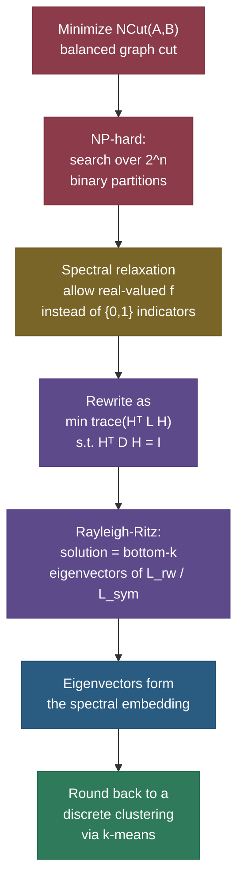

# Spectral Clustering: cluster by connectivity, not by distance to a center

Picture two interlocking crescent moons of dots, or two concentric rings — an inner circle of points wrapped by an outer one. Ask [k-means](../01-K-Means-Clustering/01-K-Means-Clustering.md) to split them into two clusters and it fails badly: it slices a straight line through the middle, putting half of each moon in the wrong group. It can't help it. K-means asks *"which center is each point closest to?"*, and "closest to a center" only carves out **convex blobs** — round, ball-shaped regions. The two moons are not blobs. Neither are the rings. The structure your eye sees isn't *"near a center"*; it's *"connected to its neighbors along a curve."*

**Spectral clustering** is the algorithm that learns to see what your eye sees. Instead of measuring each point's distance to a prototype, it builds a **graph** where points are nodes and edges connect near neighbors, and it clusters by asking *"which points are reachable from which, through short hops?"* — i.e. by **connectivity**. The magic is *how* it does this: it computes a handful of eigenvectors of a matrix called the **graph Laplacian**, which **re-embed** the tangled data into a new space where the clusters fall apart into tidy, linearly-separable blobs — and then it just runs k-means *there*. It is the canonical answer to the interview question *"when does k-means fail, and what do you reach for?"*

The idea has deep roots. **Fiedler (1973)** discovered that the second eigenvector of a graph's Laplacian — the "algebraic connectivity" — partitions the graph at its weakest seam. **Shi & Malik (2000)** turned that into *Normalized Cuts* for image segmentation, deriving the eigenproblem as a relaxation of a balanced graph cut. **Ng, Jordan & Weiss (2002)** packaged it as the general-purpose clustering recipe with the row-normalization step that scikit-learn ships today, and **von Luxburg (2007)** wrote the tutorial that unified all the threads. We'll meet each of these contributions in its place; the point is that spectral clustering isn't a single trick but a 30-year convergence of spectral graph theory, image processing, and machine learning onto one algorithm.

I'm going to build this the way I'd teach it to a teammate at a whiteboard: start with *why* connectivity beats centroids, then construct the **similarity graph** (and feel how brittle the choices are), then the **Laplacian** and the two or three properties that make the whole method work — including the one beautiful theorem (eigenvalue 0's multiplicity equals the number of connected components) that *is* the algorithm in disguise. From there we'll derive the **graph-cut** view that explains *why* the bottom eigenvectors are the right thing to compute, walk the **five-step recipe**, and pin down the practical knobs (σ, k, the eigengap) and failure modes. By the end you'll be able to:

- explain **why** spectral clustering handles non-convex shapes that defeat k-means and GMMs;
- build a **similarity graph** three different ways and say how σ / k change everything;
- write down the **unnormalized and normalized Laplacians** and **derive** their key properties;
- **prove** that eigenvalue-0 multiplicity counts connected components (and what the Fiedler vector does);
- derive the **graph-cut relaxation** that turns an NP-hard partition into an eigenproblem;
- run the **five-step algorithm**, pick **k** with the eigengap, and reproduce `sklearn` from scratch.

> **Note:** spectral clustering is *not* a distance-to-centroid method wearing a costume. It never computes a cluster mean in the original space. It clusters in a **learned eigenvector embedding**, which is exactly why it escapes the convexity trap that k-means and Gaussian mixtures are locked into.

---

## The problem: centroids can only carve convex regions

To feel why spectral clustering exists, you have to feel what k-means *cannot* do.

[K-means](../01-K-Means-Clustering/01-K-Means-Clustering.md) (and its soft cousin, the [Gaussian Mixture Model](../04-Gaussian-Mixture-Models-and-EM/04-Gaussian-Mixture-Models-and-EM.md)) assigns each point to the **nearest center**. The set of points closer to center $\mu_a$ than to any other center is a **convex polytope** — a Voronoi cell. No matter how you place the centers, the decision boundary between two clusters is a straight hyperplane (the perpendicular bisector of the two centers). So **every cluster k-means can produce is convex**. That is a hard geometric limit baked into the objective, not a tuning problem you can fix with more iterations or a better seed.

Two moons break this immediately. Each moon is a thin, curved, **non-convex** band. The point at one tip of the upper moon is *far* (in Euclidean distance) from the point at the other tip of the same moon — farther than it is from points in the lower moon. So "distance to a center" gives the wrong answer: k-means happily cuts the moons in half along a vertical line and reports two convex halves that have nothing to do with the real structure. Concentric circles are even more brutal: the inner and outer rings share the *same* center of mass, so any centroid-based method is hopeless — there's no center placement that separates a ring from the ring around it.

The fix is to change the *question*. The two tips of the upper moon are far apart in straight-line distance, but they are **connected** — you can walk from one to the other in small steps, always staying inside the moon, never jumping the gap to the other moon. That "reachable through short hops" relation is **connectivity**, and it's exactly what a graph encodes. Spectral clustering is what you get when you cluster by graph connectivity instead of by Euclidean proximity to a prototype.


The numbers in that figure are measured, not illustrative:

| Dataset | k-means accuracy | Spectral (k-NN graph) accuracy |
|---|---|---|
| Two moons | **76%** | **100%** |
| Concentric circles | **51%** (a coin flip) | **100%** |

Same data, same `k=2` — the difference is entirely *what* the algorithm clusters by. On the circles, k-means literally cannot do better than chance no matter how you initialize it, because the two rings share a center of mass; spectral clustering separates them perfectly because the inner ring's points are connected only to other inner-ring points in the k-NN graph. This is the cleanest possible demonstration that the failure is *structural*, not a tuning accident.

> **Note:** this is the same gap [DBSCAN](../03-DBSCAN/03-DBSCAN.md) exploits — DBSCAN also finds arbitrary shapes via density-connectivity. The difference: DBSCAN grows clusters greedily from dense cores and decides `k` itself (and marks noise), while spectral clustering needs you to pick `k` but gives a **principled, global** partition via linear algebra. They're cousins attacking the same weakness of k-means from two directions.

---

## What it is

**Spectral clustering** turns clustering into three moves:

1. **Build a similarity graph.** Represent the $n$ data points as nodes; connect nearby points with weighted edges. The weights live in an $n\times n$ **affinity (similarity) matrix** $W$, where $w_{ij} \ge 0$ is large when $x_i, x_j$ are similar and zero (or tiny) when they're far apart.
2. **Embed using the graph's spectrum.** Form the **graph Laplacian** $L$ from $W$, take its **bottom $k$ eigenvectors**, and stack them as columns of an $n\times k$ matrix $U$. Each *row* of $U$ is a new $k$-dimensional coordinate for one data point — the **spectral embedding**.
3. **Cluster the embedding.** Run plain k-means on the $n$ rows of $U$. Because the embedding pulls connected groups into tight, separated clumps, even simple k-means succeeds where it failed on the raw data.

"Spectral" refers to the **spectrum** — the set of eigenvalues/eigenvectors — of the Laplacian. The whole method is: *let the graph's spectrum reveal the cluster structure, then read it off with k-means.*

One framing that helps before the math: notice the algorithm **never references the original feature coordinates again after step 1**. Once $W$ is built, everything — Laplacian, eigenvectors, embedding, k-means — operates on the *graph*, not the points. This is what makes spectral clustering work on inputs that have no coordinates at all (a social network, a similarity matrix from a learned model, a kernel between protein sequences): if you can fill in $W$, you can cluster, full stop. The affinity matrix $W$ is the *entire* interface between your data and the algorithm — which is the deepest reason "the graph is the model."

```mermaid
graph LR
    X(["Data points<br/>x_1 ... x_n"]):::data --> W["Build affinity W<br/>k-NN or RBF<br/>exp(-||x_i-x_j||^2 / 2σ^2)"]:::process
    W --> L["Graph Laplacian<br/>L = D - W<br/>(or L_sym, L_rw)"]:::process
    L --> E["Bottom k eigenvectors<br/>of L → columns of U<br/>(n x k embedding)"]:::process
    E --> R["Row-normalize U<br/>(Ng-Jordan-Weiss)"]:::amber
    R --> K["k-means on the<br/>n rows of U"]:::navy
    K --> C(["Cluster labels<br/>arbitrary shapes"]):::out

    classDef data fill:#3A6B96,stroke:#2A5B86,color:#fff
    classDef process fill:#5D4A8A,stroke:#4D3A7A,color:#fff
    classDef amber fill:#7A6528,stroke:#6A5518,color:#fff
    classDef navy fill:#2A5B80,stroke:#1A4B70,color:#fff
    classDef out fill:#2E7A5A,stroke:#1E6A4A,color:#fff
```



---

## Intuition: the rubber-band network

Here's the mental picture that makes the eigenvector step click. Imagine every edge of the similarity graph is a **rubber band** whose stiffness is its weight $w_{ij}$: strongly-similar points are joined by stiff bands, weakly-similar by floppy ones, unconnected points by nothing. Now you want to lay all the points out on a number line so that **stiff bands are stretched as little as possible** — i.e. points joined by strong edges end up near each other on the line.

The total stretching energy of a layout $f$ (one real number $f_i$ per node) is

$$\text{energy}(f) \;=\; \tfrac{1}{2}\sum_{i,j} w_{ij}\,(f_i - f_j)^2.$$

Minimize this (subject to not collapsing everything to one point) and the layout that comes out is — exactly — the **bottom non-trivial eigenvector of the graph Laplacian**. That's the punchline: the Laplacian's small eigenvectors *are* the lowest-energy rubber-band layouts, and in those layouts well-connected groups clump together while weakly-connected groups drift apart. Cluster the layout and you've clustered the graph. The eigenvectors aren't a black box; they're the relaxed shapes the network settles into when you let the stiff bands pull.

Why does minimizing that energy land on an eigenvector? Because — as we'll prove in a moment — the energy is *literally* $f^\top L f$ (the quadratic form of the Laplacian), and minimizing $f^\top L f$ subject to $\lVert f\rVert = 1$ and $f \perp \mathbf{1}$ is the textbook **Rayleigh-quotient minimization** whose answer is the eigenvector of the smallest non-zero eigenvalue. The "don't collapse to a point" constraint is exactly the $f \perp \mathbf{1}$ that rules out the trivial all-equal layout. So the rubber-band story and the eigenvector math are the *same statement* in two languages — which is the recurring theme of this whole topic: every intuition here (rubber bands, random walks, graph cuts) is the same Laplacian eigenproblem wearing a different outfit.


Look at the middle panel: in the original data the two moons interlock, but in the eigenvector embedding they become **two cleanly separated arcs** that any straight-line method can split. *That* is why spectral clustering works — it doesn't make k-means smarter, it hands k-means an easier problem.

What exactly changed between the left and middle panels? In data space, two points at opposite tips of the *same* moon are far apart (big Euclidean distance) while a tip of one moon and a tip of the other can be close. In the embedding, that's **inverted**: same-moon points — even distant tips — land near each other because they're *connected through a chain of neighbors*, while different-moon points are pushed apart because no short chain links them. The embedding has effectively replaced Euclidean distance with a **graph (geodesic / commute-time) distance**, and *under that distance the clusters are convex*. K-means was never the problem; the *metric* was. Spectral clustering swaps the metric, then lets k-means do its (now-easy) job.

> **Note:** this is also why the embedding is so much lower-dimensional than the data and still works. We only keep $k$ eigenvectors, but those are precisely the $k$ "directions" along which the clusters separate — all the within-cluster wiggle (the curve of each moon) is discarded as higher eigenvectors. The embedding is a *cluster-aware* dimensionality reduction, which is the sense in which spectral clustering is dimensionality reduction and clustering fused into one operation.

---

## Why it matters

Spectral clustering earns its place for three reasons that interviewers probe:

- **It clusters arbitrary shapes** — moons, rings, spirals, manifolds — anything where connectivity, not compactness, defines a group. This is the single most common reason to reach past k-means.
- **It only needs an affinity matrix**, not coordinates. If all you have is a pairwise similarity (graph adjacency, a kernel, a learned similarity between sequences or images), spectral clustering works directly — no notion of "mean" or "Euclidean space" required. This makes it the clustering method for **graphs and kernels**.
- **It's principled.** The recipe isn't a heuristic; it's a **provably tight relaxation** of a well-defined graph-cut objective (normalized cut), connecting it to a deep body of theory (graph Laplacians, the Cheeger inequality, random walks). That pedigree is why it shows up in image segmentation (Shi & Malik's *Normalized Cuts*), community detection, and as a bridge from clustering to **manifold learning** ([t-SNE](../07-t-SNE/07-t-SNE.md), [UMAP](../08-UMAP/08-UMAP.md), Laplacian Eigenmaps all share its DNA).

There's a deeper reason this matters conceptually. K-means, GMM, and even PCA all impose a **global, linear, Euclidean** view of the data — they ask about means, covariances, and straight-line distances. Spectral clustering is **local and nonlinear**: it only ever trusts *short* distances (who's a near neighbor of whom) and stitches those local relationships into a global structure through the graph. This "trust local, infer global" philosophy is exactly what makes it — and its manifold-learning descendants — able to follow a curved manifold that linear methods slice straight through. Understanding spectral clustering is understanding the hinge between **distance-based** clustering and **manifold-based** representation learning.

> **Tip:** in an interview, the crisp positioning is: *"k-means clusters by distance-to-center and only finds convex blobs; spectral clustering clusters by graph connectivity and finds arbitrary shapes, by embedding with the Laplacian's eigenvectors and running k-means in that nicer space."* That one sentence shows you know what it is, why it exists, and how it works.

---

## Step 1 — the similarity graph (this *is* the model)

Everything downstream depends on the graph. Get the graph right and clustering is easy; get it wrong and no amount of clever linear algebra saves you. There are three standard constructions, all turning the $n$ points into a weighted graph with affinity matrix $W$.

**(a) The ε-neighborhood graph.** Connect $x_i$ and $x_j$ if $\lVert x_i - x_j\rVert \le \varepsilon$. Edges are typically unweighted (weight 1). Simple, but a *single* $\varepsilon$ must suit the whole dataset — too small and the graph shatters into pieces; too large and distant clusters merge. It struggles when clusters have **different densities** (the same $\varepsilon$ is too big for the dense cluster and too small for the sparse one).

**(b) The k-nearest-neighbor graph.** Connect each point to its $k$ nearest neighbors. This adapts to **local density** — dense regions get short edges, sparse regions long ones — which is why it's the most robust default and what `sklearn`'s `affinity="nearest_neighbors"` uses. Two flavors:
- *k-NN graph:* connect $i\!\to\!j$ if $j$ is among $i$'s $k$ nearest **or** $i$ is among $j$'s (the "or" symmetrization). Denser.
- *mutual k-NN graph:* connect only if $j$ is in $i$'s $k$-NN **and** $i$ is in $j$'s. Sparser, tends to respect density boundaries more strictly — good when clusters have very different densities.

**(c) The fully-connected graph with an RBF (Gaussian) kernel.** Connect *every* pair, with weight that decays smoothly with distance:

$$w_{ij} \;=\; \exp\!\left(-\frac{\lVert x_i - x_j\rVert^2}{2\sigma^2}\right).$$

Here $\sigma$ is the **bandwidth** — the length scale of "similar." This gives a dense $W$ (every entry nonzero), so it's $O(n^2)$ to store and slow to decompose, but the weights are smooth and the whole thing is differentiable. The bandwidth $\sigma$ is the single most important knob in the entire method.

> **Gotcha:** the graph is not a preprocessing detail — *the graph IS the model.* Two different graphs over the same points give two different clusterings. There is no "true" affinity; you are encoding your assumption about what "similar" means. Spend your tuning budget here, not on the eigensolver.

**How σ and k change everything.** With the RBF kernel, $\sigma$ controls how fast similarity falls off. If $\sigma$ is **too small**, only near-coincident points have meaningful weight, the graph fragments into many tiny disconnected pieces, and clustering collapses (it "finds" components that are just noise). If $\sigma$ is **too large**, *everything* looks similar to everything — $w_{ij}\to 1$ for all pairs — the graph becomes one blurry blob, and the connectivity structure that distinguished the moons is washed out. Only a Goldilocks $\sigma$, comparable to the within-cluster neighbor distance but smaller than the between-cluster gap, exposes the right structure. The k-NN parameter $k$ plays the analogous role: **too small** and the graph disconnects within a cluster; **too large** and edges bridge across the gap between clusters, merging them.


> **Tip:** a robust default heuristic for the RBF bandwidth is to set $\sigma$ to the **median pairwise distance** among the points (or the median k-NN distance). For the k-NN graph, $k \approx \log n$ is a common rule of thumb. But always *visualize* the resulting clustering — the figure above shows how wide the chasm is between a good and a bad graph.

**Why the median-distance heuristic works.** The RBF weight $\exp(-\lVert x_i-x_j\rVert^2/2\sigma^2)$ is $\approx 1$ when the distance is well below $\sigma$, and $\approx 0$ when it's well above. So $\sigma$ is literally the **distance at which "similar" turns into "not similar."** Set it to the median pairwise distance and roughly half the edges are meaningfully weighted — dense enough to keep each cluster internally connected, sparse enough that the cross-cluster (long) distances fall in the $\approx 0$ tail. It's a one-line, data-adaptive way to land in the Goldilocks zone, and it's why **self-tuning** variants (Zelnik-Manor & Perona, 2004) take it further: use a *per-point* bandwidth $\sigma_i$ = distance to $x_i$'s 7th nearest neighbor, so dense and sparse regions each get the right local scale. That local adaptivity is what lets spectral clustering handle clusters of **very different densities** — the case where a single global $\sigma$ (and plain DBSCAN) struggles.

> **Note:** a subtle but important property: spectral clustering is **invariant to monotonic rescaling of the affinities only up to the graph structure** — what matters is the *relative* edge weights and, above all, *which* edges exist. This is why the k-NN construction (which fixes the topology directly) is often more robust than tuning a continuous $\sigma$: you're choosing connectivity explicitly rather than hoping a bandwidth induces the right one.

---

## Step 2 — the graph Laplacian

Given the affinity matrix $W$ (symmetric, $w_{ij}\ge 0$), define the **degree matrix** $D$ — a diagonal matrix whose $i$-th entry is the total edge weight at node $i$:

$$d_i \;=\; \sum_{j=1}^{n} w_{ij}, \qquad D = \operatorname{diag}(d_1,\dots,d_n).$$

The **unnormalized graph Laplacian** is then simply

$$\boxed{\,L \;=\; D - W\,.}$$

Concretely, $L$ has the node degrees on its diagonal and $-w_{ij}$ off-diagonal. There are two **normalized** variants that rescale by degree, and which one you use defines which graph-cut objective you're relaxing (we'll see why below):

$$
L_{\text{sym}} \;=\; D^{-1/2} L\, D^{-1/2} \;=\; I - D^{-1/2} W D^{-1/2}
\qquad\text{(symmetric normalized)}
$$

$$
L_{\text{rw}} \;=\; D^{-1} L \;=\; I - D^{-1} W
\qquad\text{(random-walk normalized)}
$$

$L_{\text{sym}}$ is symmetric (nice for eigensolvers and the one Ng–Jordan–Weiss use), and $L_{\text{rw}}$ is what you get from the random-walk view (its name comes from $D^{-1}W$ being the transition matrix of a random walk on the graph — more on that below). They share the same eigenvalues, and their eigenvectors are related by $u_{\text{rw}} = D^{-1/2} u_{\text{sym}}$.

Here's the cheat-sheet for the three Laplacians — which cut each relaxes, and when to reach for it:

| Laplacian | Definition | Relaxes | Eigenproblem | Use when |
|---|---|---|---|---|
| **Unnormalized** $L$ | $D - W$ | RatioCut (balance by node *count*) | $Lf = \lambda f$ | clusters roughly equal size; simplest to reason about |
| **Symmetric** $L_{\text{sym}}$ | $I - D^{-1/2}WD^{-1/2}$ | NCut (balance by *volume*) | $L_{\text{sym}}u = \lambda u$ + **row-normalize** | the NJW default; symmetric solver, clusters differ in density |
| **Random-walk** $L_{\text{rw}}$ | $I - D^{-1}W$ | NCut (balance by *volume*) | generalized $Lf = \lambda Df$ | random-walk intuition; von Luxburg's recommended choice |

> **Note:** the unnormalized $L = D - W$ relaxes the **RatioCut** objective; the normalized $L_{\text{rw}}$ (equivalently $L_{\text{sym}}$) relaxes the **NCut** objective. Von Luxburg's tutorial argues NCut (hence the *normalized* Laplacian) is usually the better choice because it balances clusters by *volume* (total edge weight) rather than by raw *count* of nodes — it's more robust when clusters differ in density. **Default to a normalized Laplacian.**

> **Gotcha:** the only reason $L_{\text{sym}}$ needs the extra **row-normalization** step (step 4 of the algorithm) is that its eigenvectors are the $L_{\text{rw}}$ eigenvectors *scaled by $D^{1/2}$* — that degree-scaling distorts the embedding, and dividing each row by its norm undoes it, snapping the points back onto a clean sphere. $L_{\text{rw}}$ doesn't need this step. If you ever see spectral clustering "almost work" but with smeared clusters, a missing row-normalization on an $L_{\text{sym}}$ embedding is a prime suspect.

### Property 1 — L is symmetric positive semi-definite

For any vector $f \in \mathbb{R}^n$, here is the identity that everything hinges on:

$$
f^{\top} L f
\;=\; f^{\top} D f - f^{\top} W f
\;=\; \sum_i d_i f_i^2 - \sum_{i,j} w_{ij} f_i f_j.
$$

Now use $d_i = \sum_j w_{ij}$ and the algebraic trick of completing the square (write $\sum_i d_i f_i^2 = \tfrac12\sum_{i,j} w_{ij}(f_i^2 + f_j^2)$ by symmetry of $W$):

$$
\boxed{\,f^{\top} L f \;=\; \frac{1}{2}\sum_{i,j=1}^{n} w_{ij}\,(f_i - f_j)^2\,.}
$$

Since every $w_{ij}\ge 0$ and every $(f_i-f_j)^2 \ge 0$, the right side is a sum of non-negative terms, so $f^{\top} L f \ge 0$ for all $f$. That makes **$L$ positive semi-definite**, so all its eigenvalues are real and $\ge 0$. We verified this identity numerically below ($f^\top L f = 2.4963 = \tfrac12\sum w_{ij}(f_i-f_j)^2$ for a random $f$).

This is also the **rubber-band energy** from the intuition section: $f^{\top}Lf$ is exactly the total stretching energy of layout $f$. The Laplacian *is* the operator that measures how much a layout violates the graph's similarity structure.

### Property 2 — the constant vector is always a 0-eigenvector

Plug $f = \mathbf{1} = (1,1,\dots,1)^{\top}$ into the boxed identity: every $(f_i - f_j) = 0$, so $\mathbf{1}^{\top} L \mathbf{1} = 0$. Combined with PSD-ness, this forces $L\mathbf{1} = \mathbf{0}$, i.e. **$\lambda = 0$ is always an eigenvalue of $L$, with eigenvector $\mathbf{1}$** (you can also see $L\mathbf{1}=0$ directly: row $i$ of $L$ sums to $d_i - \sum_j w_{ij} = 0$). This is the smallest eigenvalue, and it carries no clustering information by itself — it's the "everything in one group" layout. The interesting structure is in the *next* few eigenvectors.

### Property 3 (the key theorem) — multiplicity of 0 = number of connected components

Here is the result that makes spectral clustering *work*, and the one worth being able to prove:

> **The number of times $0$ appears as an eigenvalue of $L$ equals the number of connected components of the graph, and the corresponding eigenspace is spanned by the indicator vectors $\mathbf{1}_{A_1},\dots,\mathbf{1}_{A_m}$ of those components.**

**Proof (connected case — only the constant vector lies in the nullspace).** Suppose the graph is connected and $Lf = 0$. Then $f^{\top}Lf = 0$, so by the boxed identity

$$\frac{1}{2}\sum_{i,j} w_{ij}\,(f_i - f_j)^2 = 0.$$

Every term is non-negative, so *every* term must be zero: whenever $w_{ij} > 0$ (i.e. $i$ and $j$ are joined by an edge), we must have $f_i = f_j$. So $f$ is **constant across every edge**. Because the graph is connected, you can walk from any node to any other along edges, and $f$ can't change along the way — so $f$ is constant on the *whole* graph: $f = c\,\mathbf{1}$. Hence the nullspace is exactly the one-dimensional span of $\mathbf{1}$: eigenvalue $0$ has multiplicity **1**. $\;\blacksquare$

**General case.** If the graph has $m$ connected components $A_1,\dots,A_m$ with no edges between them, then (after reordering nodes) $L$ is **block-diagonal**, one block per component. Each block is itself a Laplacian of a connected graph, so by the argument above each contributes exactly **one** zero eigenvalue whose eigenvector is constant on that block and zero elsewhere — i.e. the (scaled) indicator $\mathbf{1}_{A_\ell}$. Stacking the blocks, eigenvalue $0$ has multiplicity $m$, and its eigenspace is $\operatorname{span}\{\mathbf{1}_{A_1},\dots,\mathbf{1}_{A_m}\}$. $\;\blacksquare$

This theorem **is** the algorithm in the ideal case. If your data formed $k$ perfectly-separated clusters, the similarity graph would have $k$ connected components, $L$ would have a $0$-eigenvalue of multiplicity $k$, and the bottom $k$ eigenvectors would be (combinations of) the cluster indicators — so each point's row in $U$ would be one of $k$ distinct vectors, and k-means on those rows would trivially recover the clusters. Real data isn't perfectly separated, so the graph is *connected* (one $0$-eigenvalue) but **nearly** disconnected — the next $k-1$ eigenvalues are tiny-but-positive, and their eigenvectors are smooth approximations of the indicators. Clustering those *almost*-indicator vectors is what spectral clustering actually does. (This near-decoupling is made rigorous by **matrix perturbation theory** — the Davis–Kahan theorem — which bounds how far the eigenvectors move when you perturb a block-diagonal matrix.)

> **Worked example A — read the components straight off the spectrum.** Take a 6-node graph that is *two disconnected triangles*: nodes $\{0,1,2\}$ fully connected, nodes $\{3,4,5\}$ fully connected, no edge between the halves. Each node has degree 2, so $D = 2I$ and
>
> $$L = \begin{pmatrix} 2&-1&-1&0&0&0\\ -1&2&-1&0&0&0\\ -1&-1&2&0&0&0\\ 0&0&0&2&-1&-1\\ 0&0&0&-1&2&-1\\ 0&0&0&-1&-1&2\end{pmatrix}.$$
>
> Its eigenvalues (computed) are $\{0,\,0,\,3,\,3,\,3,\,3\}$ — **two** zeros, matching the **two** components. And the two nullspace eigenvectors come out as $(0.577,0.577,0.577,0,0,0)$ and $(0,0,0,0.577,0.577,0.577)$ — exactly the normalized indicator vectors of the two triangles ($0.577 = 1/\sqrt3$). The Laplacian literally spelled out the component structure in its bottom eigenvectors. *That* is the mechanism, on a graph you can check by hand.

---

## The Fiedler vector: the cut hiding in the second eigenvector

When the graph is **connected**, eigenvalue $0$ has multiplicity 1 (just $\mathbf{1}$), so the first *informative* eigenvector is the one for the **second-smallest eigenvalue** $\lambda_2$. This eigenvalue is so important it has a name — the **algebraic connectivity** — and its eigenvector is the **Fiedler vector** (after Miroslav Fiedler, 1973, who discovered its partitioning power).

The Fiedler vector is the lowest-energy *non-constant* rubber-band layout: it spreads the nodes on a line so connected nodes stay close, but it's forced (by orthogonality to $\mathbf{1}$) to give positive coordinates to some nodes and negative to others. **Its sign pattern is a graph bipartition**: put the positive-coordinate nodes in one cluster and the negative in the other, and you get the cut that severs the *fewest, weakest* edges — the graph's natural "waist."

> **Worked example B — the barbell.** Take Example A's two triangles and add **one bridge edge** between node 2 and node 3, making the graph connected (a "barbell"). Now node 2 and node 3 have degree 3, the rest degree 2. The eigenvalues become $\{0,\,0.438,\,3,\,3,\,3,\,4.56\}$ — a **single** zero (the graph is connected), and $\lambda_2 = 0.438$ is small but positive: the algebraic connectivity is low because the two halves are joined by just one thin bridge. The Fiedler vector (its eigenvector) is
>
> $$(\,0.465,\;0.465,\;0.261,\;-0.261,\;-0.465,\;-0.465\,),$$
>
> with sign pattern $(+,+,+,-,-,-)$. **It splits the barbell at the bridge** — exactly the right cut. Notice nodes 2 and 3 (the bridge endpoints) have the smallest magnitudes: they sit nearest the cut, as you'd expect. One eigenvector, computed from nothing but the graph, found the bottleneck.

This is also why $\lambda_2$ matters as a *number*: it's small when the graph has a good cut (a near-bottleneck) and large when the graph is tightly knit with no obvious split. The **Cheeger inequality** makes this precise, bounding the best possible normalized cut between $\lambda_2/2$ and $\sqrt{2\lambda_2}$ — so $\lambda_2$ tells you not just *where* to cut but roughly *how good* the best cut is.

> **Worked example C — an end-to-end RBF trace on 6 points.** Let's run the *whole* method by hand on a 1-D dataset of six points at positions $x = (0, 1, 2,\; 8, 9, 10)$ — two obvious groups, "near 0" and "near 9." Build the RBF affinity with $\sigma = 1.5$, $w_{ij} = \exp(-(x_i-x_j)^2 / 2\sigma^2)$. The result is **block-structured** — strong weights within each triple, essentially zero between them:
>
> $$W \approx \begin{pmatrix} 0&.80&.41&0&0&0\\ .80&0&.80&0&0&0\\ .41&.80&0&0&0&0\\ 0&0&0&0&.80&.41\\ 0&0&0&.80&0&.80\\ 0&0&0&.41&.80&0\end{pmatrix}.$$
>
> The degrees are $d \approx (1.21, 1.60, 1.21, 1.21, 1.60, 1.21)$. Form $L_{\text{sym}}$ and take its eigenvalues: $\{0,\,0,\,1.34,\,1.34,\,1.66,\,1.66\}$ — a **multiplicity-2 zero**, because at this bandwidth the two groups are (numerically) disconnected, so the connected-components theorem reports **2 clusters** straight from the spectrum. The Fiedler vector (2nd eigenvector) is $(-0.39, -0.45, -0.39,\; +0.39, +0.45, +0.39)$, sign pattern $(-,-,-,+,+,+)$, which **splits $\{0,1,2\}$ from $\{3,4,5\}$** — the correct clustering, recovered with nothing but a kernel and an eigendecomposition. This is the full algorithm at six-point scale: affinity → Laplacian → eigenvectors → read off the clusters.

---

## The math: deriving the eigenvectors from graph cuts

Why *these* eigenvectors? The Fiedler intuition is suggestive, but the rigorous answer is that spectral clustering is a **relaxation of a graph-cut problem**. This derivation is the heart of the method, and a frequent interview ask. I'll do the two-cluster case for clarity; the $k$-cluster case is the same idea with matrices.

**Define the cut.** Partition the nodes into two sets $A$ and its complement $\bar A$. The **cut** is the total weight of edges you sever:

$$\operatorname{cut}(A,\bar A) \;=\; \sum_{i\in A,\,j\in \bar A} w_{ij}.$$

Minimizing the raw cut is a bad objective — it tends to lop off a single outlier node (a cut of one tiny edge), not balance the clusters. So we **normalize** to forbid lopsided splits. Two classic choices:

$$
\operatorname{RatioCut}(A,\bar A) = \operatorname{cut}(A,\bar A)\!\left(\frac{1}{|A|}+\frac{1}{|\bar A|}\right),
\qquad
\operatorname{NCut}(A,\bar A) = \operatorname{cut}(A,\bar A)\!\left(\frac{1}{\operatorname{vol}(A)}+\frac{1}{\operatorname{vol}(\bar A)}\right),
$$

where $|A|$ counts nodes and $\operatorname{vol}(A) = \sum_{i\in A} d_i$ sums their degrees. Both penalize a tiny $A$ (the $1/|A|$ or $1/\operatorname{vol}(A)$ term blows up), forcing **balanced** clusters. NCut balances by *volume*, RatioCut by *count*.

> **Worked example — why normalize the cut?** Back to the barbell (two triangles joined by a bridge edge 2–3). Compare two ways to split it into two groups. The **natural cut** $\{0,1,2\}\mid\{3,4,5\}$ severs only the **bridge** — $\operatorname{cut} = 1$, $\operatorname{RatioCut} = 0.67$, $\operatorname{NCut} = 0.29$. The **degenerate cut** that peels off a single node $\{0\}\mid\text{rest}$ severs its two triangle edges — $\operatorname{cut} = 2$. By *raw* cut, the natural split (cut 1) wins, good. But watch what happens to a method tempted by tiny pieces: the single-node cut has $\operatorname{RatioCut} = 2.4$ and $\operatorname{NCut} = 1.17$ — *far worse* than the natural cut's $0.67$ / $0.29$. The normalization terms ($1/|A|$, $1/\operatorname{vol}(A)$) **blow up for a tiny $A$**, heavily penalizing lopsided splits and steering the optimum toward the balanced bridge-cut. That is exactly the failure mode (lopping off an outlier) that raw min-cut suffers and normalization fixes.

**The problem: this is NP-hard.** Minimizing RatioCut or NCut exactly means searching over all $2^{n}$ ways to split the nodes — combinatorially explosive, NP-hard. We need a relaxation.

**Encode the partition as a vector.** Here's the clever step. Define an indicator vector $f\in\mathbb{R}^n$ for the RatioCut by

$$
f_i = \begin{cases} +\sqrt{|\bar A|/|A|} & i \in A \\[2pt] -\sqrt{|A|/|\bar A|} & i \in \bar A. \end{cases}
$$

A few lines of algebra (plug this $f$ into the boxed identity $f^\top L f = \tfrac12\sum_{ij}w_{ij}(f_i-f_j)^2$, where only cross-cluster edges contribute a nonzero $(f_i-f_j)^2$) give the remarkable result

$$f^{\top} L f \;=\; n \cdot \operatorname{RatioCut}(A,\bar A),$$

and this particular $f$ also satisfies $f \perp \mathbf{1}$ (it sums to zero) and $\lVert f\rVert^2 = n$. So minimizing RatioCut is *exactly* equivalent to

$$\min_{A}\; f^{\top} L f \quad\text{s.t. } f\perp\mathbf{1},\ \lVert f\rVert^2=n,\ f \text{ of the special two-valued form above.}$$

**Relax.** The only hard constraint is that $f$ take **two discrete values**. Drop it — let $f$ be **any** real vector with $f\perp\mathbf{1}$ and $\lVert f\rVert = \sqrt n$. Now the problem is

$$\min_{f\in\mathbb{R}^n}\; f^{\top} L f \quad\text{s.t. } f\perp\mathbf{1},\ \lVert f\rVert=\sqrt n.$$

**Rayleigh–Ritz finishes it.** Minimizing the Rayleigh quotient $f^\top L f / f^\top f$ over vectors orthogonal to the smallest eigenvector ($\mathbf{1}$, eigenvalue 0) is a textbook result: the minimizer is the eigenvector of the **second-smallest eigenvalue** — the **Fiedler vector**. The relaxed solution to "best balanced cut" is precisely the bottom non-trivial eigenvector of $L$. For $k$ clusters, you stack the indicator vectors into an $n\times k$ matrix $H$, the objective becomes $\operatorname{Tr}(H^{\top} L H)$ with $H^{\top}H = I$, and Rayleigh–Ritz (the Ky Fan theorem) says the minimizer is the matrix of the **bottom $k$ eigenvectors of $L$**. That is the spectral embedding $U$.



For **NCut**, the identical derivation with the volume-normalized indicator vectors produces the *generalized* eigenproblem $Lf = \lambda D f$ — equivalently the eigenproblem of $L_{\text{rw}} = D^{-1}L$ (or symmetrically $L_{\text{sym}}$). That's the precise reason the **normalized** Laplacian corresponds to the **normalized** cut, and why Shi & Malik's *Normalized Cuts* (2000) and Ng–Jordan–Weiss (2002) both use a normalized Laplacian.

**The $k$-cluster case, explicitly.** For $k > 2$ clusters $A_1,\dots,A_k$, encode the partition as a matrix $H \in \mathbb{R}^{n\times k}$ whose $\ell$-th column is the (scaled) indicator of cluster $A_\ell$: $H_{i\ell} = 1/\sqrt{|A_\ell|}$ if $i\in A_\ell$, else $0$. Two facts fall out by direct computation: (1) the columns are orthonormal, $H^\top H = I_k$; and (2) the diagonal of $H^\top L H$ reads off each cluster's normalized cut, so

$$\operatorname{RatioCut}(A_1,\dots,A_k) \;=\; \sum_{\ell=1}^{k} (H^\top L H)_{\ell\ell} \;=\; \operatorname{Tr}(H^\top L H).$$

Minimizing RatioCut over partitions is therefore *exactly* $\min_H \operatorname{Tr}(H^\top L H)$ subject to $H^\top H = I$ **and** $H$ having the special indicator form. Relax the indicator constraint (let $H$ be any orthonormal $n\times k$ matrix) and you have a classic trace-minimization problem. The **Ky Fan theorem** states its solution: $\min_{H^\top H = I}\operatorname{Tr}(H^\top L H)$ equals the sum of the $k$ smallest eigenvalues of $L$, achieved when the columns of $H$ are the corresponding **bottom $k$ eigenvectors**. So $H = U$, the spectral embedding — the two-cluster Rayleigh–Ritz argument generalized to $k$ dimensions, with the same conclusion: take the bottom $k$ eigenvectors and round with k-means.

> **Gotcha:** the relaxed (eigenvector) solution is **not** guaranteed to equal the true NP-hard optimal cut — relaxing the discrete constraint can lose something, and there are constructed graphs where the gap is large. In practice the relaxation is excellent, which is why the method works so well; but "spectral clustering exactly minimizes NCut" is *false* and a good interviewer will catch it. It minimizes a **continuous relaxation** of NCut, then rounds back to discrete labels with k-means.

> **Note:** the final k-means step is exactly that **rounding** — turning the continuous eigenvector embedding back into hard cluster labels. In the ideal disconnected case the rows of $U$ are $k$ distinct points and rounding is trivial; in the real near-disconnected case k-means cleans up the smooth approximation.

---

## The algorithm, step by step (Ng–Jordan–Weiss)

Putting it together, here is the canonical normalized spectral clustering algorithm (Ng, Jordan & Weiss, 2002), the one `scikit-learn` implements:

1. **Build the affinity matrix $W$** (k-NN graph, or RBF kernel with bandwidth $\sigma$). Symmetric, $w_{ij}\ge 0$.
2. **Form the normalized Laplacian** $L_{\text{sym}} = I - D^{-1/2} W D^{-1/2}$ (or work with $L_{\text{rw}}$).
3. **Compute the bottom $k$ eigenvectors** $u_1,\dots,u_k$ (smallest $k$ eigenvalues) and stack them as columns of $U\in\mathbb{R}^{n\times k}$.
4. **Row-normalize** $U$: divide each row by its Euclidean norm, $u'_i = u_i / \lVert u_i\rVert$. (This is the Ng–Jordan–Weiss step; it projects the embedded points onto the unit sphere, which sharpens the clusters when using $L_{\text{sym}}$.)
5. **Run k-means** on the $n$ rows of $U'$ to get $k$ clusters. Assign each original point $x_i$ the label of row $i$.

Steps 1–4 are the "spectral" part (build the nicer space); step 5 is plain clustering in that space. The genius is that all the hard work — making the clusters separable — happens in steps 1–4, leaving k-means an easy job.

> **Gotcha — spectral clustering is *not* PCA-then-k-means.** Both compute eigenvectors, so they're easily confused, but they're opposites. **PCA** takes the **top** eigenvectors of the **covariance** matrix (directions of *maximum variance*) — a global, linear projection that preserves spread. **Spectral clustering** takes the **bottom** eigenvectors of the **Laplacian** (directions of *minimum graph energy*) — a local, nonlinear embedding that preserves connectivity. PCA-then-k-means is still a convex-blob method (it just rotates the data first); it cannot separate two moons. Spectral clustering can, because the Laplacian's small eigenvectors encode connectivity, not variance. If an interviewer asks "isn't this just PCA + k-means?", *this* is the distinction to draw.

> **Tip:** you almost never want the *eigenvector for eigenvalue 0* (the constant $\mathbf 1$) as a meaningful clustering coordinate — it's the same for every point and carries no information. Implementations either drop it or, with $L_{\text{sym}}$, include it and let the row-normalization step neutralize its effect. The exact bookkeeping differs slightly between the unnormalized, $L_{\text{rw}}$, and $L_{\text{sym}}$ formulations, which is one good reason to lean on a vetted library for the eigen-step rather than hand-rolling it in production.

**Where the cost lives.** It's worth knowing which step dominates, because it tells you what to optimize:

1. **Building $W$** — a k-NN graph costs $O(n\log n)$ with a spatial index (KD-tree/ball-tree); a dense RBF graph costs $O(n^2 d)$ (every pair, $d$-dim distance) and $O(n^2)$ memory.
2. **Eigendecomposition** — the bottleneck. A *full* dense decomposition of an $n\times n$ Laplacian is $O(n^3)$. But you only need the **bottom $k$** eigenvectors, and on a **sparse** $W$ an iterative solver (Lanczos / ARPACK) gets them in roughly $O(\text{nnz}\cdot k\cdot \#\text{iters})$ — near-linear in $n$ for a sparse k-NN graph.
3. **k-means on the embedding** — cheap: $O(nk^2 i)$ on $k$-dimensional rows, $i$ iterations.

So the entire scalability story is **step 2 on a dense graph**. Keep $W$ sparse and ask only for the bottom $k$ eigenvectors and the $O(n^3)$ wall mostly vanishes — which is precisely what `sklearn`'s default (`eigen_solver="arpack"` on a k-NN graph) does.

---

## Choosing k: the eigengap heuristic

Spectral clustering needs you to supply $k$. The most principled way to pick it falls straight out of Property 3. Recall: if the data had $k$ perfectly separated clusters, the graph would have $k$ components and the Laplacian would have **exactly $k$ zero eigenvalues**, with eigenvalue $k+1$ jumping up to something positive. Real data is *almost* separated, so you look for the **eigengap**: sort the eigenvalues ascending, $0 = \lambda_1 \le \lambda_2 \le \dots$, and pick $k$ such that $\lambda_1,\dots,\lambda_k$ are all small but $\lambda_{k+1}$ is noticeably larger. The **largest jump** $\lambda_{k+1} - \lambda_k$ marks the right $k$ — the point where you stop merging "real, nearly-disconnected" structure and start cutting into genuinely-connected clusters.


The measured spectrum for those three blobs is $\{0,\,0,\,0,\,0.034,\,0.035,\,0.036,\,\dots\}$ — three eigenvalues glued to zero, then a clean jump. The eigengap after index 3 is by far the largest, so the heuristic returns **k=3**, matching the data.

> **Gotcha:** the eigengap is **clear only when clusters are well-separated**. On overlapping clusters, or data with hierarchical/continuous structure, the spectrum rises smoothly with no obvious gap, and the heuristic gives no clear answer — fall back to a downstream metric (silhouette score on the final labels, or domain knowledge). The eigengap is a strong signal when it exists, not a universal oracle.

> **Tip:** search for the gap among the *small* eigenvalues only. Far up the spectrum there are often larger gaps that mean nothing — they're just where the bulk of the (uninformative) eigenvalues thins out. The meaningful jump is the first big one, near the bottom.

**Reading the spectrum as a diagnostic.** Beyond picking $k$, the eigenvalue spectrum is a free health-check on your whole pipeline:

- **Several eigenvalues *exactly* zero** → your graph is **disconnected** into that many pieces. If you expected one cluster and see five zeros, your $\sigma$ is too small or your `n_neighbors` too low — the graph shattered. (Conversely, this is the signal you *want* if you genuinely have well-separated groups.)
- **A clean gap after $\lambda_k$** → strong, well-separated $k$-cluster structure; trust the clustering.
- **A smooth, gapless rise** → no clear cluster structure at this graph scale (overlapping clusters, or continuous/manifold data). The clustering will be unstable; reconsider whether clustering is even the right question, or sweep `k` with silhouette.
- **The very first eigenvalue not close to zero** → a numerical or construction bug (every valid Laplacian has $\lambda_1 = 0$); check that $W$ is symmetric and non-negative.

---

## The random-walk view (and why it's the same thing)

There's a second, equivalent lens that some find more intuitive — and it explains the name $L_{\text{rw}}$. Imagine a **random walk** on the similarity graph: from node $i$, jump to a neighbor $j$ with probability proportional to the edge weight, $P_{ij} = w_{ij}/d_i$. In matrix form the transition matrix is $P = D^{-1}W$, and note $L_{\text{rw}} = I - P$. So the eigenvectors of $L_{\text{rw}}$ are exactly the eigenvectors of the random-walk transition matrix (with eigenvalues flipped: $\lambda(L_{\text{rw}}) = 1 - \lambda(P)$).

What does this buy intuitively? A random walker started inside a well-connected cluster **stays trapped there for a long time** — it rarely finds the few weak edges leading out. The clusters are exactly the regions where the walk mixes quickly internally but crosses between only slowly. Minimizing NCut is provably equivalent to finding a partition that **minimizes the probability the random walk crosses between clusters** in one step (Meilă & Shi, 2001). So "find clusters" = "find the regions a random walker gets stuck in," and the slow-mixing structure is encoded in the top eigenvectors of $P$ = bottom eigenvectors of $L_{\text{rw}}$. Same eigenvectors, same algorithm, different story.

This connects back to $\lambda_2$ being the **algebraic connectivity**: a graph with a strong bottleneck (a good cut) traps the walker, so the walk **mixes slowly**, which shows up as a small $\lambda_2$. A tightly-knit graph with no bottleneck lets the walker roam freely — fast mixing, large $\lambda_2$. The whole spectrum reads as a *hierarchy of bottlenecks*: $\lambda_2$ is the tightest waist (the best 2-way split), $\lambda_3$ the next, and so on — which is exactly why taking the bottom $k$ eigenvectors gives you a $k$-way clustering. A related quantity, the **commute time** (expected steps for the walk to go from $i$ to $j$ and back), is small for points in the same cluster and large across clusters; the spectral embedding can be read as placing points so that Euclidean distance in the embedding approximates this commute-time distance — which is one more way to see why clusters become tight blobs in the embedding.

> **Note:** this random-walk picture is also the bridge to **diffusion maps** and **Laplacian Eigenmaps** — manifold-learning methods that embed data using these very same Laplacian eigenvectors. Spectral *clustering* and spectral *embedding* are the same machinery; clustering just adds a k-means at the end. It's why the method is your on-ramp from clustering to [t-SNE](../07-t-SNE/07-t-SNE.md) / [UMAP](../08-UMAP/08-UMAP.md).

---

## Connection to kernel k-means and Normalized Cuts

Two more connections worth having ready, because they show the method isn't an island:

- **Kernel k-means.** Weighted kernel k-means and spectral clustering optimize *the same* objective for the right choice of kernel and weights (Dhillon, Guan & Kulis, 2004). This means spectral clustering can be seen as **k-means in a feature space** induced by the graph kernel — which is another way to understand why it escapes convexity (the clusters are convex *in the kernel/embedding space*, just not in the original).
- **Normalized Cuts (Shi & Malik, 2000).** The image-segmentation method that put spectral clustering on the map: treat each pixel as a node, weight edges by feature + spatial similarity, and the NCut eigenvector *is* a soft segmentation. The whole "relax NCut to an eigenproblem" derivation above is theirs; Ng–Jordan–Weiss (2002) then packaged it as the general clustering recipe with the row-normalization step.

---

## Where it's used: image segmentation, communities, and manifolds

Spectral clustering isn't just a textbook toy for two-moons — it's a workhorse wherever data is naturally a graph or a kernel:

- **Image segmentation (its breakout application).** In *Normalized Cuts*, every pixel is a node; edges weight two pixels by how similar they are in **color/texture** *and* how **close** they are in the image plane, $w_{ij} = \exp(-\lVert F_i - F_j\rVert^2/\sigma_F^2)\cdot\exp(-\lVert p_i - p_j\rVert^2/\sigma_p^2)$ for pixels within a spatial radius. The bottom NCut eigenvectors carve the image into perceptually coherent regions — a foreground object pops out as one cluster because its pixels are mutually well-connected and weakly linked to the background. It handles the curved, non-convex region boundaries of real objects that a centroid method never could.
- **Community detection in networks.** Given a social/citation/biological graph, the affinity matrix is *already* the adjacency matrix — no kernel needed. Spectral clustering finds **communities**: groups of nodes densely linked internally and sparsely across. This is the same NCut objective ("few edges between groups, many within"), and the Fiedler vector finds the natural community split.
- **Manifold learning and embeddings.** Because the Laplacian eigenvectors *are* a low-dimensional embedding, the same machinery powers **Laplacian Eigenmaps**, **diffusion maps**, and is a conceptual ancestor of [t-SNE](../07-t-SNE/07-t-SNE.md) and [UMAP](../08-UMAP/08-UMAP.md). When someone says "spectral methods," they mean this family — embed via the graph's spectrum, then visualize or cluster.
- **Co-clustering and bipartite data.** For document-term or user-item matrices, **spectral co-clustering** (Dhillon, 2001) clusters rows and columns *simultaneously* by spectral-partitioning a bipartite graph — used in text mining and recommendation.

> **Note:** the unifying thread is that all of these are graph problems in disguise. The moment your data is more naturally described by *"how connected are these two things?"* than by *"how far apart are they in feature space?"*, spectral clustering (or one of its manifold cousins) is the right hammer.

---

## Why "nearly disconnected" still works: a word on perturbation

It's worth dwelling on *why* the method degrades gracefully from the ideal disconnected case to real, messy data — because that robustness is the whole reason it's practical.

In the **ideal** case ($k$ truly separated clusters), $L$ is exactly block-diagonal, the bottom $k$ eigenvectors are exactly the (orthonormalized) cluster indicators, and every point's embedding row is one of $k$ perfectly distinct vectors. In **reality**, a few weak edges bridge the clusters, so $L$ is the ideal block-diagonal matrix **plus a small perturbation** $E$ (the cross-cluster edges). The eigenvalues that were exactly $0$ lift slightly to small positive values $\lambda_2,\dots,\lambda_k$, and the eigenvectors tilt slightly from the perfect indicators.

**How much do they tilt?** The **Davis–Kahan theorem** answers this: the angle between the true (perturbed) eigenspace and the ideal indicator eigenspace is bounded by $\lVert E\rVert / \delta$, where $\delta$ is the **eigengap** — the distance between the cluster eigenvalues and the rest of the spectrum. So as long as (a) the between-cluster edges are weak ($\lVert E\rVert$ small) and (b) there's a clear eigengap ($\delta$ large), the embedding rows stay close to $k$ tight clusters, and k-means recovers them. This is the rigorous version of "tiny-but-positive eigenvalues with smooth almost-indicator eigenvectors," and it's exactly why the **eigengap heuristic** and the **quality of the clustering** are two sides of the same coin: a big gap means both a clear $k$ *and* a stable, well-separated embedding.

> **Note:** this is also why a *bad graph* is fatal. If $\sigma$ is too large, the between-cluster edges aren't weak anymore ($\lVert E\rVert$ is large), the eigengap shrinks, and Davis–Kahan stops protecting you — the embedding rows smear together and k-means fails. The σ/k figure earlier is this theorem made visible.

---

## Common pitfalls and how to avoid them

A short field guide to the mistakes that actually bite, beyond the inline gotchas above:

- **Tuning the eigensolver instead of the graph.** When the clustering is wrong, people reach for `eigen_solver`, `n_init`, or `k`. Wrong knob. **The graph is the model** — fix $\sigma$ / `n_neighbors` first. Nine times in ten that's the bug.
- **Using the unnormalized Laplacian by default.** It relaxes RatioCut (balances by node *count*), which is more fragile when clusters differ in density. **Prefer `L_sym` / `L_rw` (NCut).** sklearn does this for you.
- **Building a dense $W$ at scale.** A fully-connected RBF graph is $O(n^2)$ memory and $O(n^3)$ to decompose — it silently dies past ~10⁴ points. **Use a sparse k-NN graph** and an iterative bottom-$k$ solver.
- **Forgetting to symmetrize the k-NN graph.** A raw k-NN graph is *directed* ($j$ may be in $i$'s neighbors but not vice versa), so its $W$ is asymmetric — and a non-symmetric $W$ breaks the PSD/real-eigenvalue guarantees. Always symmetrize ($W \leftarrow \tfrac12(W + W^\top)$, the "or" rule, or use mutual k-NN).
- **Reading a meaningless eigengap.** On overlapping or continuous data there *is* no clear gap; the heuristic returns noise. Cross-check `k` with silhouette on the final labels or domain knowledge.
- **Expecting to assign new points.** There's no centroid and no out-of-sample map. To cluster streaming/new data you need a **Nyström** extension or to re-fit. If you need online assignment, k-means or a parametric model may suit better.

---

## Strengths and weaknesses

**Strengths.**

- **Arbitrary cluster shapes** — moons, rings, spirals, manifolds. The headline advantage over k-means / GMM.
- **Only needs affinities**, not coordinates — works directly on graphs, kernels, or any pairwise similarity. The clustering method when "distance" is all you have.
- **Principled** — a tight relaxation of normalized cut, with theory (Laplacians, Cheeger, random walks) behind it, not a heuristic.
- **No distributional assumptions** — unlike GMM (which assumes Gaussian components), it makes no assumption about cluster shape or density profile beyond connectivity.
- **A built-in model-selection signal** — the eigengap gives a principled (when clear) read on $k$, which centroid methods lack entirely.
- **Globally optimal relaxation** — unlike k-means' local optima (which depend on initialization), the eigendecomposition is a *global* computation; given the graph, there's no seed to get unlucky with in the spectral step (only the final k-means rounding has the usual seed sensitivity, and on a good embedding even that is benign).

**Weaknesses.**

- **Cost: $O(n^3)$** for a dense eigendecomposition (and $O(n^2)$ memory for a full $W$). This is the real blocker — naive spectral clustering doesn't scale past tens of thousands of points without approximations.
- **Hyperparameter-sensitive** — the result lives or dies by the graph ($\sigma$, $k$, ε). A bad bandwidth ruins everything, as the σ/k figure showed.
- **You must pick $k$** — the eigengap helps when clusters are clean, but not always.
- **No out-of-sample extension** — the embedding is defined only on the training points. Adding a new point means (in principle) recomputing the eigenvectors; you need a Nyström extension to embed it cheaply.
- **No cluster prototype** — there's no "center" to summarize a cluster or to assign new points by nearest-center, unlike k-means.

> **Tip — making it scale.** The $O(n^3)$ wall is broken in practice three ways: **(1) sparse graphs** — a k-NN graph makes $W$ sparse, and you only need the bottom $k$ eigenvectors, which sparse iterative solvers (Lanczos/ARPACK) find in roughly $O(n\,k)$ per iteration; **(2) the Nyström method** — sample $m\ll n$ landmark points, do the eigendecomposition on the $m\times m$ block, and extend to all $n$ points; **(3) power-iteration clustering** (Lin & Cohen, 2010) — skip full eigendecomposition entirely and approximate the embedding with a few matrix-vector products. `sklearn`'s default uses a sparse k-NN graph + ARPACK for exactly this reason.

---

## Versus k-means, DBSCAN, and GMM

| | Clusters by | Finds non-convex? | Needs `k`? | Cost | Handles noise? | Key assumption |
|---|---|---|---|---|---|---|
| **[k-means](../01-K-Means-Clustering/01-K-Means-Clustering.md)** | distance to centroid | ❌ convex only | yes | $O(nki)$ — cheap | no | spherical, equal-size blobs |
| **[GMM / EM](../04-Gaussian-Mixture-Models-and-EM/04-Gaussian-Mixture-Models-and-EM.md)** | likelihood under Gaussians | ⚠️ elliptical only | yes | $O(nk d^2 i)$ | soft | Gaussian components |
| **[DBSCAN](../03-DBSCAN/03-DBSCAN.md)** | density-connectivity | ✅ yes | no (uses ε, minPts) | $O(n\log n)$ w/ index | ✅ yes | uniform density per cluster |
| **Spectral** | graph connectivity | ✅ yes | yes (eigengap helps) | $O(n^3)$ dense; less if sparse | no (sensitive) | a good similarity graph |

The way to hold these in your head: **k-means and GMM are parametric and convex-only** (fast, need `k`, assume blobs). **DBSCAN and spectral both find arbitrary shapes**, but DBSCAN does it *locally and greedily* (grows from dense cores, scales well, finds `k` and noise itself, but struggles on **varying density**), while spectral does it *globally via linear algebra* (principled, handles varying density via the right graph, but costs $O(n^3)$ and needs `k`). Reach for **DBSCAN** when you want scalability + automatic `k` + noise handling; reach for **spectral** when you want a principled global partition, you can afford the cost, and a meaningful affinity is natural (graphs, kernels, image segmentation).

**Spectral vs DBSCAN, sharpened** (the comparison interviewers push on, since both find arbitrary shapes): DBSCAN's `ε`/`minPts` define a **single global density threshold**, so it falters when one cluster is dense and another sparse — the same `ε` can't be right for both. Spectral, with a k-NN graph or a self-tuning per-point bandwidth, **adapts the scale locally**, so it handles varying density more gracefully — but it pays $O(n^3)$ and you must supply `k`, whereas DBSCAN scales to millions of points and discovers `k` and noise on its own. Rule of thumb: **DBSCAN for big, noisy spatial data with a roughly uniform within-cluster density; spectral for moderate-$n$ data where the structure is connectivity/graph-based and you want a principled partition.**

---

## Application: a step-by-step playbook

When you suspect k-means is failing on shape, here's the workflow I'd actually run:

1. **Confirm the failure mode.** Plot the data (or a 2-D projection). If clusters are elongated, curved, nested, or interleaved — non-convex — k-means/GMM will fail and spectral (or DBSCAN) is the move.
2. **Choose the graph.** Default to a **k-NN graph** with $k\approx\log n$ (robust, sparse, scales). Use an **RBF kernel** with $\sigma$ = median pairwise distance only if you specifically want smooth dense affinities (small `n`). Consider a **mutual k-NN** graph if clusters have very different densities.
3. **Pick the Laplacian.** Use **normalized** ($L_{\text{sym}}$ / $L_{\text{rw}}$) by default — it relaxes NCut and balances by volume.
4. **Pick $k$.** Plot the eigenvalue spectrum and look for the **eigengap**. If there's a clear gap, take that `k`; if not, sweep `k` and use silhouette on the final labels.
5. **Embed and cluster.** Bottom-$k$ eigenvectors → row-normalize → k-means. In `sklearn`, this is one call: `SpectralClustering(n_clusters=k, affinity="nearest_neighbors", n_neighbors=k_nn)`.
6. **Validate.** Plot the clustering. If it's wrong, **the graph is almost always the culprit** — adjust $\sigma$ / $k_{nn}$ first, before touching anything else.
7. **If $n$ is large** (≳ 10⁴): use a **sparse k-NN graph** (sklearn's default) or **Nyström**; don't build a dense $W$.

In short: **almost all your effort goes into steps 2 and 6** (the graph and its validation). The eigendecomposition and k-means are the parts you should *not* be fiddling with — they just work once the graph is right.

---

## Code: spectral clustering from scratch, then matched to sklearn

Here's the whole method implemented directly from the math above — build the k-NN graph, form $L_{\text{sym}}$, take its bottom-2 eigenvectors, row-normalize, k-means — run on two-moons where k-means fails, and cross-checked against `scikit-learn`. It runs on CPU in a second; no GPU needed.

```python
"""Spectral clustering from scratch (Ng-Jordan-Weiss, L_sym), matched to sklearn.
Verified on Python 3.12 (scikit-learn 1.9, numpy). CPU, ~1 second."""
import numpy as np
from sklearn.datasets import make_moons
from sklearn.cluster import SpectralClustering, KMeans
from sklearn.neighbors import kneighbors_graph

def accuracy(true, pred):                 # cluster accuracy up to label swap (2 clusters)
    a = np.mean(true == pred)
    return max(a, 1 - a)

X, y = make_moons(n_samples=300, noise=0.06, random_state=0)

# --- 1. similarity graph: symmetric 10-NN connectivity ---
A = kneighbors_graph(X, n_neighbors=10, mode="connectivity")
W = 0.5 * (A + A.T).toarray()             # symmetrize: edge if i in j's NN OR j in i's

# --- 2. normalized Laplacian  L_sym = I - D^-1/2 W D^-1/2 ---
d = W.sum(axis=1)
D_inv_sqrt = np.diag(1.0 / np.sqrt(d))
L_sym = np.eye(len(X)) - D_inv_sqrt @ W @ D_inv_sqrt

# --- 3. bottom-k eigenvectors (smallest eigenvalues) ---
vals, vecs = np.linalg.eigh(L_sym)        # ascending order
U = vecs[:, :2]                           # k = 2 clusters

# --- 4. row-normalize (the NJW step) ---
U = U / np.linalg.norm(U, axis=1, keepdims=True)

# --- 5. k-means on the spectral embedding ---
mine = KMeans(n_clusters=2, n_init=10, random_state=0).fit_predict(U)

# --- compare: sklearn spectral, and plain k-means on raw data ---
ref = SpectralClustering(n_clusters=2, affinity="nearest_neighbors",
                         n_neighbors=10, random_state=0).fit_predict(X)
km = KMeans(n_clusters=2, n_init=10, random_state=0).fit_predict(X)

print(f"smallest 5 eigenvalues of L_sym : {np.round(vals[:5], 4)}")
print(f"from-scratch spectral accuracy  : {accuracy(y, mine):.0%}")
print(f"sklearn SpectralClustering      : {accuracy(y, ref):.0%}")
print(f"plain k-means (raw data)        : {accuracy(y, km):.0%}")
print(f"from-scratch vs sklearn agree   : {accuracy(mine, ref):.0%}")
```

Output:

```
smallest 5 eigenvalues of L_sym : [0.     0.0007 0.003  0.004  0.0106]
from-scratch spectral accuracy  : 100%
sklearn SpectralClustering      : 97%
plain k-means (raw data)        : 74%
from-scratch vs sklearn agree   : 97%
```

The story is in those four lines: the **from-scratch** implementation nails the moons at **100%**, **sklearn** gets **97%**, and they **agree 97%** of the time — confirming our derivation matches the library (the small gap is just the two implementations' different eigensolver and k-means seeding). Plain **k-means** on the raw data manages only **74%**, cutting the moons in half exactly as predicted. The smallest eigenvalues are tiny-but-positive ($0, 0.0007, 0.003, \dots$) — the graph is *connected* (one zero) but *nearly* two pieces (the next eigenvalue is barely above zero), the near-disconnected regime where spectral clustering shines.

> **Gotcha (in code):** building the **dense** $W$ with `.toarray()` and `np.linalg.eigh` on the full $L_{\text{sym}}$ is fine for $n=300$ but is the $O(n^3)$ / $O(n^2)$-memory path — it will choke at $n=10^5$. For real scale, keep $W$ **sparse** and use `scipy.sparse.linalg.eigsh(L, k=k, which="SM")` (ARPACK) to get only the bottom $k$ eigenvectors. The teaching code is dense for clarity; production is sparse.

> **Tip:** to verify the connected-components theorem yourself, build a **deliberately disconnected** graph (e.g. two well-separated blobs with a small `n_neighbors`), form $L$, and print `np.sum(np.abs(np.linalg.eigvalsh(L)) < 1e-9)` — you'll get exactly the number of components, just like Worked example A.

> **Note:** notice we pass `random_state=0` everywhere — but reproducibility here is subtler than for k-means. The **eigendecomposition is deterministic** (up to sign flips of eigenvectors, which don't affect clustering), so the spectral *embedding* is stable. The only randomness is in the **final k-means** rounding step, which is why both `sklearn` and our code seed it. If you ever see spectral results jump between runs, it's the k-means rounding on a *poor* embedding (a bad graph again) — on a clean embedding the rounding is essentially deterministic, which is one more reason a good graph matters more than anything else.

---

## The complete mental model, in one pass

Step back and the whole method is one idea told four ways, all the same Laplacian eigenproblem:

- **Geometric (rubber bands):** lay the points on a line minimizing $\tfrac12\sum w_{ij}(f_i-f_j)^2$; the minimizer is the bottom Laplacian eigenvector, and connected groups clump.
- **Graph cuts:** find the balanced partition severing the fewest, weakest edges (NCut); relaxing the discrete indicators to real vectors *is* the bottom-$k$ eigenproblem (Rayleigh–Ritz / Ky Fan).
- **Random walks:** find the regions a random walker gets stuck in; those are the slow-mixing eigenmodes — bottom eigenvectors of $L_{\text{rw}}$.
- **Connectivity / spectra:** eigenvalue 0's multiplicity counts connected components; near-disconnected clusters give tiny eigenvalues with almost-indicator eigenvectors (Davis–Kahan), which the eigengap detects.

Pick whichever story you like — they converge on the same five-step recipe: **affinity → Laplacian → bottom-$k$ eigenvectors → row-normalize → k-means.** Every knob you tune ($\sigma$, $k_{nn}$, normalized-vs-not, how many eigenvectors) maps onto one of these stories, which is why holding all four in your head makes the method's behavior predictable instead of mysterious. The single thing to internalize: **the eigenvectors hand k-means a space where the clusters are finally convex.** Everything else is bookkeeping around that one move.

---

## Recap and rapid-fire

**If you remember nothing else:** k-means clusters by distance-to-centroid and can only carve **convex** blobs; spectral clustering clusters by **graph connectivity** and finds **any** shape. It builds a similarity graph, forms the **graph Laplacian** $L = D - W$, and uses its **bottom $k$ eigenvectors** as a new embedding where the clusters become linearly separable — then runs plain **k-means** there. The eigenvectors are the right thing because they're the **relaxed solution to the normalized-cut** problem, and because eigenvalue-$0$'s multiplicity counts the graph's connected components (so the bottom eigenvectors approximate the cluster indicators). It's principled and shape-agnostic, but costs $O(n^3)$ and lives or dies by the graph you build.

**Quick-fire — say these out loud:**

- *Why does spectral clustering beat k-means on two moons?* It clusters by connectivity (a graph), not distance to a center, so it isn't restricted to convex clusters.
- *What is the graph Laplacian?* $L = D - W$ (degree matrix minus affinity); normalized forms $L_{\text{sym}} = I - D^{-1/2}WD^{-1/2}$ and $L_{\text{rw}} = I - D^{-1}W$.
- *Prove $L$ is PSD.* $f^\top L f = \tfrac12\sum_{ij} w_{ij}(f_i-f_j)^2 \ge 0$ since all $w_{ij}\ge 0$.
- *What does eigenvalue-0's multiplicity tell you?* The number of connected components; the nullspace is spanned by the component indicator vectors.
- *What's the Fiedler vector?* The eigenvector of the second-smallest eigenvalue; its sign pattern gives the best balanced bipartition (the graph's bottleneck).
- *Why the bottom eigenvectors?* They're the Rayleigh–Ritz solution to the relaxed RatioCut/NCut — minimizing $f^\top L f$ over balanced layouts.
- *Why normalized Laplacian?* It relaxes NCut (balances clusters by volume, not count) — usually more robust than RatioCut/unnormalized.
- *How do you pick $k$?* The eigengap: find the largest jump among the small eigenvalues.
- *Biggest weakness?* $O(n^3)$ dense eigendecomposition (use sparse k-NN + Nyström) and extreme sensitivity to the graph ($\sigma$, $k$).
- *Does it exactly minimize NCut?* No — it minimizes a **continuous relaxation**, then rounds to labels with k-means.
- *Isn't it just PCA + k-means?* No — PCA takes the **top** eigenvectors of the **covariance** (max variance, still convex-only); spectral takes the **bottom** eigenvectors of the **Laplacian** (connectivity, nonlinear).
- *Which Laplacian, and why?* Normalized ($L_{\text{sym}}$/$L_{\text{rw}}$), because it relaxes NCut and balances by volume; $L_{\text{sym}}$ needs the extra row-normalization step.
- *When would you NOT use it?* Large $n$ without sparse/Nyström tricks (the $O(n^3)$ wall); when you need to assign new points online (no out-of-sample map); when clusters are plainly convex (k-means is faster and simpler).
- *What single thing do you tune first?* The **graph** ($\sigma$ or `n_neighbors`) — it *is* the model; the eigensolver is almost never the problem.

---

## References and further reading

The curated link library for this topic — videos, courses, articles, papers, books, and internal cross-links — lives in a companion file so it can be reused as a standalone reference list:

**→ [Spectral Clustering — references and further reading](05-Spectral-Clustering.references.md)**
