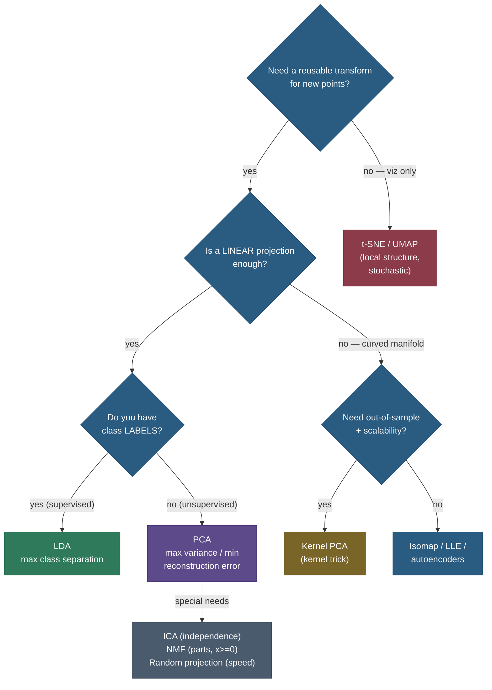

# Dimensionality Reduction: keeping what matters, dropping the rest

Picture a cloud of points floating in a high-dimensional room — say a thousand photographs, each described by a million pixel values. That cloud almost never fills the room. Real data lives on a thin, lower-dimensional **sheet** crumpled inside that huge space: the pixels are wildly correlated (neighbouring pixels move together), most directions carry only noise, and the *intrinsic* number of knobs that actually vary is tiny compared to the ambient dimension. **Dimensionality reduction** is the art of finding that sheet and laying it flat — re-expressing each point in far fewer coordinates while throwing away as little of what matters as possible.

This page is the **map of the whole area**, and its centrepiece is **PCA** — Principal Component Analysis — the single most-asked dimensionality-reduction topic in interviews and the workhorse of applied ML. We will build PCA from the ground up, **derive it three different ways and watch them collapse into the same answer**, then zoom out to the full taxonomy (linear vs non-linear, supervised vs unsupervised, deterministic vs stochastic) so you know exactly which tool to reach for and why. By the end you'll be able to:

- explain **why** we reduce dimensions — the curse of dimensionality, visualization, denoising, compression, speed, multicollinearity;
- **derive PCA three ways** — maximize projected variance, minimize reconstruction error, and the truncated SVD — and prove they coincide;
- compute the **explained-variance ratio** and choose $k$ with a scree/elbow plot or a cumulative-variance threshold;
- explain **whitening**, the **standardization** requirement (covariance vs correlation matrix), and how to read **loadings**;
- state PCA's **limitations** precisely and reach for **kernel PCA** or a manifold method when linearity fails;
- place every major method — **LDA, ICA, NMF, random projection, t-SNE, UMAP, Isomap, LLE, autoencoders** — on one comparison table and pick correctly.

Intuition and pictures first, then the math (derived, with sources), then runnable, verified code.

> **Note:** "dimensionality reduction" is an umbrella over two quite different jobs. **Feature *projection*** (PCA, t-SNE, autoencoders) builds *new* synthetic coordinates that are combinations of the originals. **Feature *selection*** keeps a subset of the *original* columns. This page is about projection; the two are often confused in interviews — projection gives you uninterpretable-but-compact axes, selection gives you interpretable-but-coarser ones.

---

## The problem: why high dimensions hurt

Adding features feels free — more information, surely a better model. It is not. As dimension $d$ grows, several pathologies appear at once, collectively the **curse of dimensionality**:

- **Volume explodes; data evaporates.** To cover the unit cube at fixed density you need $\propto r^d$ points. In 1-D, ten points per unit gives fine coverage; in 100-D you'd need $10^{100}$ to match it. Real datasets are therefore unimaginably **sparse** in high-D — every point is alone in a vast emptiness.
- **Distances stop discriminating.** The ratio $(\text{dist}_{\max} - \text{dist}_{\min}) / \text{dist}_{\min} \to 0$ as $d \to \infty$ for many distributions: the nearest and farthest neighbours become **nearly equidistant**, so distance-based methods ([k-NN](../../03.%20Supervised_Learning/04-k-Nearest-Neighbors/04-k-Nearest-Neighbors.md), k-means, kernels) lose their footing.
- **Overfitting and multicollinearity.** More features than you can support means a model can memorize noise; highly **correlated** columns make linear-model coefficients unstable (the matrix $X^\top X$ becomes near-singular).
- **Cost.** Storage, compute, and human attention all scale with $d$. You cannot *plot* 64-D data; you can plot 2-D.

So we reduce dimensions for five concrete payoffs, and it's worth being able to name them on demand:

1. **Visualization** — squash to 2-D/3-D to actually *see* structure (the headline use of t-SNE/UMAP).
2. **Denoising** — small-variance directions are often pure noise; dropping them cleans the signal.
3. **Compression** — store $k \ll d$ coordinates per point instead of $d$ (PCA is a classic lossy codec).
4. **Speed & regularization** — downstream models train faster and generalize better on fewer, decorrelated inputs.
5. **Decorrelation** — kill multicollinearity so linear models and covariance estimates behave.

The distance collapse is easy to *measure*. For random points in the unit cube, track the **relative contrast** $(\text{dist}_{\max} - \text{dist}_{\min}) / \text{dist}_{\min}$ from a query point — how much the nearest and farthest neighbours differ — as dimension grows:

| dimension $d$ | 2 | 5 | 10 | 50 | 100 | 500 | 1000 |
|---|---|---|---|---|---|---|---|
| relative contrast | 94.5 | 8.1 | 3.1 | 0.66 | 0.43 | 0.17 | 0.12 |

In 2-D the farthest point is ~95× as far as the nearest — distances are richly informative. By 1000-D that ratio has collapsed to ~0.12: nearest and farthest are almost the same distance, and "nearest neighbour" stops meaning anything. *This* is why k-NN, k-means, and kernel methods quietly degrade in high dimensions, and why reducing first so often rescues them.

Two more facts make the strangeness vivid. First, in a high-dimensional ball **almost all the volume sits in a thin shell near the surface**: the fraction of an $n$-ball's volume within the outer 10% of its radius is $1 - 0.9^n$, which is 99.997% at $n=100$ — the "interior" is essentially empty, so your data clusters at the boundary. Second, a unit hypercube's **diagonal** has length $\sqrt{d}$ while its edges stay length 1, so the corners stretch infinitely far from the centre as $d$ grows — a "cube" in high-D is mostly spiky corners, nothing like the compact box your 3-D intuition pictures. Both facts say the same thing: **high-dimensional space is mostly empty, and your geometric intuition is actively misleading there.**

> **Gotcha:** dimensionality reduction is *not* always helpful. If your features are already few, independent, and informative, projecting them can only *lose* signal. Reach for it when $d$ is large, features are correlated, you need to visualize, or a downstream model is starving for samples-per-feature. Measure — don't reduce on reflex.

> **Note:** the reason any of this *works* is the **manifold hypothesis**: real high-dimensional data (images, audio, text embeddings) concentrates near a low-dimensional manifold. Dimensionality reduction is the attempt to recover the coordinates *on* that manifold. PCA assumes the manifold is a flat **linear subspace**; the non-linear methods drop that assumption.

---

## Intuition: the best camera angle on a cloud

Before any math, hold this picture. You have a flat, elongated swarm of fireflies hanging in a dark room, and you must photograph it with a single 2-D camera so the photo loses as little as possible. Point the camera down the *long* axis of the swarm and the fireflies pile on top of each other — the photo is a useless blob. Point it broadside, perpendicular to the long axis, and the swarm spreads across the whole frame — every firefly distinct. **PCA is the search for that best camera angle.** The direction that spreads the data out the most — the most *variance* — is PC1; the best perpendicular direction is PC2; and so on. "Keep the directions of greatest spread, discard the flat ones" is the entire idea, and the [Setosa interactive explainer](https://setosa.io/ev/principal-component-analysis/) lets you literally drag the cloud and watch the axes rotate to follow it.

The same picture explains *why* it equals reconstruction: shining a flashlight along the camera's viewing direction casts each firefly's **shadow** onto the photo plane, and the "blur" you lost is the firefly's distance off the plane. Choosing the camera angle that spreads the swarm widest is the *same* choice as the angle whose plane the swarm hugs most closely — maximize the spread in the photo, minimize the blur out of it. That single duality is **View A = View B**, derived formally below.

> **Tip:** carry the firefly camera into the interview. "What is PCA?" → *"Finding the camera angle that spreads the data out the most — equivalently, the plane the data sits closest to. Those directions are the top eigenvectors of the covariance matrix."* That sentence is a complete, correct answer.

---

## PCA: the centerpiece

PCA answers one question: **what is the best low-dimensional linear subspace to project my data onto?** "Best" can mean two things that turn out to be the same thing, and both connect to a third object — the SVD. Let's set up the notation once, then derive all three.

We have $n$ data points $\mathbf{x}_1, \dots, \mathbf{x}_n \in \mathbb{R}^d$, stacked as rows of a matrix $X \in \mathbb{R}^{n \times d}$. **Always center first**: subtract the mean $\bar{\mathbf{x}}$ from every row so the cloud is centred at the origin (PCA is about directions of *spread*, which only make sense around the centre). Call the centred matrix $X$ from here on. The **sample covariance matrix** is

$$\Sigma \;=\; \frac{1}{n-1} X^\top X \;\in\; \mathbb{R}^{d \times d},$$

a symmetric, positive-semidefinite matrix whose $(i,j)$ entry is the covariance between features $i$ and $j$.

```mermaid
graph TD
    X["Centered data X<br/>(n samples x d features)"]:::data
    X --> A["View A — maximize VARIANCE<br/>max w&#x1D40;&Sigma;w  s.t. ||w||=1"]:::purple
    X --> B["View B — minimize RECONSTRUCTION<br/>min &Sigma;||x - projection||&sup2;"]:::purple
    X --> C["View C — the SVD<br/>X = U&Sigma;V&#x1D40;"]:::purple
    A --> EIG["Top eigenvectors of &Sigma;<br/>&Sigma;w = &lambda;w"]:::amber
    B --> EIG
    C --> EIG
    EIG --> PC(["Principal components<br/>directions = V, scores = U&Sigma;<br/>variance = &lambda;&#7522; = &sigma;&#7522;&sup2;/(n-1)"]):::out

    classDef data fill:#3A6B96,stroke:#2A5B86,color:#fff
    classDef purple fill:#5D4A8A,stroke:#4D3A7A,color:#fff
    classDef amber fill:#7A6528,stroke:#6A5518,color:#fff
    classDef out fill:#2E7A5A,stroke:#1E6A4A,color:#fff
```



### View A — maximize projected variance

The first principal component is the **unit direction $\mathbf{w}$ along which the projected data has the largest variance**. Projecting point $\mathbf{x}_i$ onto $\mathbf{w}$ gives the scalar $\mathbf{w}^\top \mathbf{x}_i$. Because the data is centred, the variance of these projections is

$$\operatorname{Var}(\mathbf{w}^\top \mathbf{x}) \;=\; \frac{1}{n-1}\sum_i (\mathbf{w}^\top \mathbf{x}_i)^2 \;=\; \mathbf{w}^\top \left(\frac{1}{n-1}X^\top X\right)\mathbf{w} \;=\; \mathbf{w}^\top \Sigma\, \mathbf{w}.$$

We want to maximize this — but without a constraint we'd just scale $\mathbf{w}$ to infinity, so we fix $\|\mathbf{w}\| = 1$. This is a constrained optimization, solved with a **Lagrange multiplier** $\lambda$:

$$\mathcal{L}(\mathbf{w}, \lambda) \;=\; \mathbf{w}^\top \Sigma\, \mathbf{w} \;-\; \lambda\,(\mathbf{w}^\top \mathbf{w} - 1).$$

Set the gradient with respect to $\mathbf{w}$ to zero (using $\nabla_{\mathbf{w}}\,\mathbf{w}^\top \Sigma \mathbf{w} = 2\Sigma\mathbf{w}$ for symmetric $\Sigma$):

$$\frac{\partial \mathcal{L}}{\partial \mathbf{w}} \;=\; 2\Sigma\mathbf{w} - 2\lambda\mathbf{w} \;=\; \mathbf{0} \quad\Longrightarrow\quad \boxed{\;\Sigma\,\mathbf{w} \;=\; \lambda\,\mathbf{w}\;}$$

That is **exactly the eigenvalue equation.** The stationary points of "projected variance" are the **eigenvectors of the covariance matrix**, and at such a point the variance itself is $\mathbf{w}^\top \Sigma \mathbf{w} = \mathbf{w}^\top (\lambda \mathbf{w}) = \lambda$. So **the variance captured along an eigenvector equals its eigenvalue.** To maximize variance you pick the eigenvector with the **largest eigenvalue** — that's PC1. The second PC maximizes variance *subject to being orthogonal to the first*; the same Lagrangian argument hands you the second-largest eigenvector, and so on. The principal components are the eigenvectors of $\Sigma$ ranked by eigenvalue.

> **Note:** because $\Sigma$ is symmetric and positive-semidefinite, the **spectral theorem** guarantees its eigenvectors are real, mutually **orthogonal**, and its eigenvalues are real and $\geq 0$. That orthogonality is why the principal components form a clean new coordinate system — the PCs are *uncorrelated* by construction.

> *Where this comes from: PCA as variance maximization is **Hotelling (1933)**; the original "lines and planes of closest fit" view is **Pearson (1901)**. The clean modern derivation is **Mathematics for ML**, Ch. 10, and **Shlens' "A Tutorial on PCA"** — both in the references.*

### View B — minimize reconstruction error

Now forget variance. Ask instead: **which $k$-dimensional subspace lets me reconstruct the data with the smallest squared error?** Represent the subspace by an orthonormal basis $W = [\mathbf{w}_1, \dots, \mathbf{w}_k]$ ($W^\top W = I_k$). Project a point onto it and lift it back: the reconstruction is $\hat{\mathbf{x}} = W W^\top \mathbf{x}$. We minimize the total squared reconstruction error:

$$J(W) \;=\; \sum_{i=1}^{n} \big\|\mathbf{x}_i - W W^\top \mathbf{x}_i\big\|^2.$$

Expand a single term using $W^\top W = I$ and the fact that $WW^\top$ is a projection (so $(WW^\top)^2 = WW^\top$):

$$\|\mathbf{x} - WW^\top\mathbf{x}\|^2 = \|\mathbf{x}\|^2 - \mathbf{x}^\top WW^\top \mathbf{x} = \|\mathbf{x}\|^2 - \|W^\top \mathbf{x}\|^2.$$

Summed over the data, $\sum_i \|\mathbf{x}_i\|^2$ is a **constant** (it doesn't depend on $W$), so **minimizing reconstruction error is identical to maximizing $\sum_i \|W^\top \mathbf{x}_i\|^2 = (n-1)\operatorname{trace}(W^\top \Sigma W)$ — the total projected variance.** Minimizing what you *throw away* is the same as maximizing what you *keep*. So View B lands on the **same eigenvectors** as View A. The theorem that the top-$k$ eigenvectors give the optimal rank-$k$ subspace is **Eckart-Young** (1936).

> **Tip:** this equivalence is the crispest one-liner for an interview: *"PCA simultaneously maximizes retained variance and minimizes reconstruction error — they're the same optimization because total variance is fixed, so keeping the most is dropping the least."*

### View C — the SVD connection

You rarely compute $\Sigma$ and eigendecompose it in practice — you take the **singular value decomposition** of the (centred) data matrix directly:

$$X \;=\; U \Sigma_{\text{svd}} V^\top,$$

where $U \in \mathbb{R}^{n \times r}$ and $V \in \mathbb{R}^{d \times r}$ have orthonormal columns and $\Sigma_{\text{svd}} = \operatorname{diag}(\sigma_1 \geq \sigma_2 \geq \dots)$ holds the singular values. Substitute into the covariance:

$$\Sigma = \frac{1}{n-1} X^\top X = \frac{1}{n-1} V \Sigma_{\text{svd}}^\top U^\top U \Sigma_{\text{svd}} V^\top = V \left(\frac{\Sigma_{\text{svd}}^2}{n-1}\right) V^\top.$$

This is **literally the eigendecomposition** of $\Sigma$: the **right singular vectors $V$ are the principal directions (eigenvectors)**, and each eigenvalue is $\lambda_i = \sigma_i^2/(n-1)$. The **scores** (data in the new coordinates) are $X V = U \Sigma_{\text{svd}}$. So:

| PCA object | Via covariance eigendecomp | Via SVD of $X$ |
|---|---|---|
| Principal directions | eigenvectors of $\Sigma$ | columns of $V$ |
| Variance along PC $i$ | eigenvalue $\lambda_i$ | $\sigma_i^2 / (n-1)$ |
| Scores (projected data) | $XW$ | $U\Sigma_{\text{svd}}$ |

> **Gotcha:** prefer the **SVD route** numerically. Forming $X^\top X$ *squares the condition number*, amplifying round-off; the SVD works on $X$ directly and is far more stable. This is exactly why scikit-learn's `PCA` runs an SVD under the hood, not an eigendecomposition of the covariance.

> **Note:** all three views are not three approximations that happen to be close — they are **the same computation** seen from three angles (variance, geometry, linear algebra). We verify this numerically below: covariance eigenvectors, SVD's $V$, and sklearn's components agree to **machine precision** (max difference $\sim 10^{-14}$, i.e. floating-point round-off — they are the same object).

### The geometry: PCA diagonalizes the variance ellipse

Here is the picture that ties the algebra to something you can see. For data with covariance $\Sigma$, the set of points at constant Mahalanobis distance, $\{\mathbf{x} : \mathbf{x}^\top \Sigma^{-1}\mathbf{x} = 1\}$, is an **ellipse** (an ellipsoid in higher dimensions) — the natural "1-sigma contour" of the cloud. The eigenvectors of $\Sigma$ are the **principal axes of that ellipse**, and the axis half-lengths are the $\sqrt{\lambda_i}$. So PCA is, geometrically, *finding the axes of the data's variance ellipse and rotating your coordinate system to align with them.* In the new coordinates the covariance is **diagonal** — $\operatorname{diag}(\lambda_1, \dots, \lambda_d)$ — which is the precise sense in which the principal components are "uncorrelated." Truncating to the top $k$ keeps the longest $k$ axes of the ellipsoid and flattens the rest.

> **Tip:** this is why an "elongated, tilted" cloud is the canonical PCA picture: PC1 points along the ellipse's long axis (largest $\sqrt{\lambda}$), PC2 along the next, all mutually perpendicular. If the ellipse were a perfect circle ($\Sigma = \sigma^2 I$, all eigenvalues equal), **every direction would be equally good** and PCA would have nothing to latch onto — there'd be no preferred axis to keep.

---

## Explained variance and choosing k

Because the eigenvalue $\lambda_i$ *is* the variance captured by PC $i$, and the eigenvalues sum to the total variance ($\sum_i \lambda_i = \operatorname{trace}(\Sigma) = $ total variance), the fraction of variance each component explains is simply

$$\text{explained-variance ratio}_i \;=\; \frac{\lambda_i}{\sum_{j} \lambda_j}.$$

To choose how many components $k$ to keep, you have three standard tools:

- **Cumulative-variance threshold.** Keep the smallest $k$ whose cumulative ratio crosses a target — "enough to explain 90% (or 95%, 99%) of the variance." This is the most defensible, goal-driven choice.
- **Scree plot / elbow.** Plot $\lambda_i$ against $i$ and look for the **elbow** where the curve flattens — past it, each new component buys little.
- **Kaiser rule** (on the correlation matrix): keep components with $\lambda_i > 1$, i.e. those that explain more than a single standardized feature. A rough heuristic, not a law.

On the 64-dimensional **digits** dataset (8×8 images), the scree plot has a clear early drop and a long flat tail; reaching 90% of the variance needs $k = 31$ components and 95% needs $k = 40$ — measured below:


> **Tip:** "how many components?" has no universal answer — it depends on the *job*. For **visualization** you're forced to $k=2$ or $3$. For **compression/denoising** pick a variance target. For a **downstream model**, treat $k$ as a hyperparameter and cross-validate it against the metric you actually care about (accuracy, not variance).

A fourth, more principled option deserves its own mention. Instead of eyeballing an elbow, **let the downstream task choose $k$**: sweep $k$, run cross-validation of the final model on the $k$-component representation, and pick the $k$ at the **knee** of the accuracy-vs-$k$ curve — the point past which more components stop helping. Example 4 below is exactly this experiment, and it shows the knee for digits sits around $k \approx 20$–$30$ (accuracy plateaus there). When PCA is preprocessing, this is the only choice that optimizes what you actually care about. For pure *unsupervised* use (no downstream metric), there are statistical rules too — the **broken-stick** model and Horn's **parallel analysis** compare your eigenvalues against those expected from random/uncorrelated data and keep only the components that exceed the noise baseline.

> **Gotcha:** a high explained-variance ratio does **not** mean you kept the *useful* directions — only the *high-variance* ones. Variance and predictive value are different things (see Limitations). A direction can carry tiny variance yet be exactly the one that separates your classes.

---

## Standardization: covariance vs correlation

PCA is run on **either** the covariance matrix **or** the correlation matrix, and choosing wrong silently ruins the result. The covariance matrix is **scale-dependent**: a feature measured in *millimetres* has $1000^2$ times the variance of the same feature in *metres*, so it would dominate every principal component purely because of its units. Two fixes:

- **Standardize** each feature to zero mean and unit variance (z-score) *before* PCA. Then $\Sigma$ becomes the **correlation matrix**, and every feature contributes on equal footing. This is the default when features have **different units or wildly different scales**.
- Use raw **covariance** PCA only when all features are already in the **same meaningful units** (e.g. pixel intensities, or a spectrum) and their relative variances are themselves the signal.

> **Note:** "PCA on the correlation matrix" and "standardize then PCA on the covariance matrix" are **the same procedure** — standardizing turns covariances into correlations. So the real question is just: *should every feature get equal weight (standardize) or should louder features count more (don't)?*

> **Gotcha:** the most common PCA mistake in practice is forgetting to standardize mixed-unit data. If one column is "annual income in dollars" and another is "age in years," income's variance is millions of times larger — PC1 will be essentially "income," and the analysis is meaningless. **When in doubt, standardize.**

---

## Whitening, loadings, and interpretation

**Whitening** goes one step past projection: after rotating onto the principal axes, **rescale each axis by $1/\sqrt{\lambda_i}$** so every component has unit variance. The transformed data then has the **identity covariance matrix** — fully decorrelated *and* equal-variance ("white" like white noise). Whitening is useful as preprocessing for algorithms that assume isotropic inputs (some ICA pipelines, certain neural-net initializations).

> **Gotcha:** whitening **amplifies the low-variance directions** (you divide by a small $\sqrt{\lambda_i}$), which are often the noisiest. It can hurt as easily as help — use it only when a downstream method genuinely needs isotropic features, and consider whitening only the top components.

**Loadings** are how you *interpret* a principal component. The entries of an eigenvector $\mathbf{w}$ are the **weights** of the original features in that PC; a large-magnitude loading means that feature drives the component. (Strictly, "loadings" often refers to $\mathbf{w}_i \sqrt{\lambda_i}$ — the eigenvector scaled by the component's standard deviation, which equals the correlation between the feature and the PC for standardized data.) Reading loadings is how analysts attach meaning — "PC1 is essentially overall size; PC2 contrasts width against height."

---

## Limitations: where PCA breaks

PCA is a hammer, and not everything is a nail. Know its failure modes cold:

- **Linear only.** PCA can only find **flat** subspaces. Data on a curved manifold — a Swiss roll, an S-curve, the digit manifold — cannot be unrolled by a linear projection. The two-PC view of the digits below is a smeared blob precisely because the classes live on a curved manifold that a plane can't separate.
- **Variance ≠ importance.** PCA keeps high-*variance* directions, which may be irrelevant to your task, and discards low-variance ones that might be exactly the discriminative signal. For *supervised* separation, **LDA** (which uses the labels) is the right tool.
- **Assumes roughly Gaussian / second-order structure.** PCA only looks at the covariance — first and second moments. If the interesting structure is non-Gaussian (heavy tails, multimodality, independence rather than decorrelation), PCA misses it; **ICA** targets that.
- **Sensitive to scaling and outliers.** A single gross outlier can swing a principal axis toward itself (squared error is outlier-hungry); robust PCA variants exist for this.
- **Components can be hard to interpret.** A PC is a dense linear combination of *all* features; **sparse PCA** trades a little variance for components that load on only a few features.


> **Note:** PCA capturing only ~22% of the variance in two components on digits is *not* a failure of PCA — it's telling you the digit manifold is **genuinely high-dimensional and curved**. The honest reading: "no flat 2-D shadow can separate these; use a non-linear method for the *picture*, but PCA-to-~30-D is still a great *preprocessing* step." (We confirm that below: a classifier on 30 PCA dims nearly matches the full 64-D one.)

---

## Kernel PCA: nonlinearity via the kernel trick

When the structure is non-linear but you still want a PCA-like, **out-of-sample-capable** transform, the fix is the **kernel trick**. Imagine mapping each point through a non-linear feature map $\phi(\mathbf{x})$ into a (possibly infinite-dimensional) space where the data *is* linearly separable, then doing ordinary PCA there. You never form $\phi$ explicitly — you only need **inner products** $\phi(\mathbf{x}_i)^\top \phi(\mathbf{x}_j)$, which a **kernel function** $k(\mathbf{x}_i, \mathbf{x}_j)$ computes directly (e.g. the RBF kernel $k(\mathbf{x},\mathbf{y}) = \exp(-\gamma\|\mathbf{x}-\mathbf{y}\|^2)$).

Mechanically: build the $n \times n$ **kernel matrix** $K_{ij} = k(\mathbf{x}_i, \mathbf{x}_j)$, **center it** in feature space, and **eigendecompose $K$** instead of the covariance. The principal components live in feature space and are recovered through the eigenvectors of $K$. The result is curved principal components in the original space — PCA that can follow a manifold.

The textbook picture is **two concentric circles** — an inner ring of one class, an outer ring of another. No straight line through the origin separates them, so *linear* PCA's components are useless: project onto any line and the two rings overlap. But map the points through an RBF kernel and the first kernel-PCA component becomes essentially the **radius** — a curved coordinate that places the inner ring at one end and the outer ring at the other, separating them perfectly. That is the whole promise of the kernel trick: a non-linear coordinate (here, "distance from centre") that a linear method in the original space could never have found.

> **Gotcha:** kernel PCA's cost scales with the **number of samples** ($n \times n$ kernel matrix, $O(n^3)$ eigendecomposition), not the feature count — the opposite of ordinary PCA. It also introduces a kernel hyperparameter (the bandwidth $\gamma$) you must tune, and the components are no longer cheap to interpret. It's powerful but not a free upgrade.

> *Where this comes from: **Schölkopf, Smola & Müller (1998)**, "Nonlinear Component Analysis as a Kernel Eigenvalue Problem" — the original kernel-PCA paper, in the references.*

### Practical variants of PCA you should know

Plain PCA has a handful of variants for the cases where it strains, and naming them signals fluency:

- **Randomized / truncated SVD PCA** — when you only want the top $k$ of a huge matrix, a randomized SVD finds them in roughly $O(ndk)$ instead of a full $O(nd^2)$ decomposition. This is `svd_solver="randomized"` in scikit-learn and how PCA scales to large $d$.
- **Incremental PCA** — fits in **mini-batches** so the data never has to live in memory at once; essential for datasets larger than RAM or streaming data.
- **Sparse PCA** — adds an $\ell_1$ penalty so each component loads on only a **few** original features, trading a little variance for **interpretable** components (you can name what each PC "is").
- **Robust PCA** — decomposes the data as a **low-rank** part plus a **sparse** part, isolating gross outliers/corruptions into the sparse term so they don't swing the principal axes. The fix for PCA's outlier sensitivity.
- **Kernel PCA** (above) — the non-linear variant via the kernel trick.

> **Tip:** in scikit-learn these are one import each (`PCA`, `IncrementalPCA`, `SparsePCA`, `KernelPCA`, `TruncatedSVD`), and `TruncatedSVD` is the one to use on **sparse** matrices (text TF-IDF) because it does **not** center — centering would destroy sparsity. That "TruncatedSVD for sparse, PCA for dense" distinction is a frequent practical gotcha.

The canonical stress-test for non-linearity is the **Swiss roll**: a 2-D sheet rolled up into 3-D. Euclidean distance is misleading there — two points on opposite layers of the roll are *close* in 3-D but *far* along the sheet. **Isomap** fixes this by building a $k$-nearest-neighbour graph and measuring **geodesic** distance (shortest path *along* the manifold) instead of straight-line distance, then doing classical multidimensional scaling on those geodesics — and it unrolls the Swiss roll into a flat rectangle, which no linear method can do. **LLE** takes a different route: it assumes each point is a linear combination of its near neighbours and finds a low-D embedding that preserves those local reconstruction weights. Both are "spectral" methods (they reduce to an eigenproblem), both target manifolds, and both predate t-SNE/UMAP as the classic non-linear toolbox.

> **Note:** kernel PCA, Isomap, and LLE all ultimately **eigendecompose some $n \times n$ matrix** (a kernel, a geodesic-distance Gram matrix, or a local-weight matrix). That shared structure is why they scale poorly with sample count and why t-SNE/UMAP — which optimize an embedding directly rather than solving one giant eigenproblem — took over for large-scale visualization.

---

## The taxonomy of dimensionality reduction

PCA is one node in a larger family. The first split is **linear vs non-linear**; the second cuts are *supervised vs unsupervised*, *deterministic vs stochastic*, and *does it give a reusable transform for new points*. Here is the decision tree, then the full comparison table.



The **linear** family — fast, transparent, reusable transforms:

- **PCA** — unsupervised; directions of max variance. The default.
- **LDA** (Linear Discriminant Analysis) — **supervised**; finds the directions that best *separate the labelled classes* (maximize between-class over within-class scatter). At most $C-1$ components for $C$ classes. Use it when you have labels and want projection for classification.
- **Factor Analysis** — a probabilistic cousin of PCA: models observed features as linear combinations of a few latent factors **plus per-feature noise**. Better than PCA when noise levels differ across features.
- **ICA** (Independent Component Analysis) — finds directions that are **statistically independent**, not merely uncorrelated. The tool for **blind source separation** (the "cocktail party problem" — unmixing overlapping audio).
- **NMF** (Non-negative Matrix Factorization) — factorizes a **non-negative** matrix into non-negative parts, giving **additive, parts-based** components (face = eyes + nose + mouth). Ideal for counts, intensities, topic models.
- **Random projection** — multiply by a random matrix. Sounds reckless, but the **Johnson-Lindenstrauss lemma** guarantees that projecting $n$ points to $O(\log n / \epsilon^2)$ dimensions preserves all pairwise distances within $(1\pm\epsilon)$. Astonishingly cheap and data-independent; great as a fast first cut before expensive methods.

The **non-linear / manifold** family — bend to the data's shape, mostly for visualization:

- **t-SNE** — preserves *local* neighbourhoods, produces clean clusters for **visualization only**; stochastic, no reusable transform. (See the dedicated page: **[t-SNE](../07-t-SNE/07-t-SNE.md)**.)
- **UMAP** — faster, scales to millions, preserves more *global* structure, and **can transform new points**. (See the dedicated page: **[UMAP](../08-UMAP/08-UMAP.md)**.)
- **Isomap** — preserves **geodesic** (along-the-manifold) distances via a neighbour graph; unrolls a Swiss roll correctly.
- **LLE** (Locally Linear Embedding) — preserves each point's reconstruction from its local neighbours.
- **Autoencoders** — a neural net that compresses through a bottleneck and reconstructs; the **learned, non-linear** generalization of PCA (a linear autoencoder with squared loss *recovers* the PCA subspace).

| Method | Linear? | Supervised? | Deterministic? | New-point transform? | Best for |
|---|---|---|---|---|---|
| **PCA** | yes | no | yes | yes | general compression, denoising, preprocessing |
| **LDA** | yes | **yes** | yes | yes | supervised projection for classification |
| **ICA** | yes | no | ~ (random init) | yes | source separation, independent signals |
| **NMF** | yes | no | no | yes | parts-based, non-negative data, topics |
| **Random projection** | yes | no | no (random) | yes | very fast first cut, JL distance preservation |
| **Kernel PCA** | **no** | no | yes | yes | non-linear, smaller $n$, reusable transform |
| **Isomap / LLE** | **no** | no | yes | limited | unrolling known manifolds |
| **t-SNE** | **no** | no | **no** (stochastic) | **no** | visualization (local structure) |
| **UMAP** | **no** | no | ~ (seedable) | **yes** | visualization + preprocessing, scalable |
| **Autoencoders** | **no** | no | no | yes | learned non-linear compression, large data |

A few of these deserve a sharper distinction, because interviewers probe exactly where they differ from PCA:

- **Factor Analysis vs PCA.** Both find a low-dimensional linear structure, but PCA explains **total variance** (signal *and* noise lumped together) while FA explicitly models **shared latent factors plus per-feature noise** ($\mathbf{x} = W\mathbf{z} + \boldsymbol\mu + \boldsymbol\epsilon$, with diagonal noise covariance). When features have *unequal* noise levels, FA correctly down-weights the noisy ones; PCA naively lets a high-variance noisy feature dominate a component. FA is the probabilistic, generative cousin.
- **ICA vs PCA.** PCA produces **uncorrelated** components (orthogonal, second-order); ICA produces **independent** ones (a strictly stronger condition that uses higher-order statistics). The canonical use is the **cocktail-party problem**: two microphones record two overlapping speakers; PCA can't unmix them (the sources aren't orthogonal in the right way), but ICA recovers the individual voices. ICA needs the sources to be **non-Gaussian** — for Gaussian sources, uncorrelated already implies independent and there's nothing extra to find.
- **Autoencoders vs PCA.** An autoencoder is a neural net `encoder → bottleneck (k units) → decoder` trained to reconstruct its input. With **linear** activations and squared-error loss it provably spans the **same subspace as PCA** — so the autoencoder is literally the non-linear *generalization* of PCA. Add non-linear activations and depth and it can follow a curved manifold that PCA never could, at the cost of training, non-determinism, and lost interpretability.

> **Tip:** the interviewer's favourite contrast is **PCA vs LDA**: both are linear projections, but PCA is **unsupervised** (max variance, ignores labels) and LDA is **supervised** (max class separation, uses labels). On data where the discriminative direction is *not* the high-variance direction, PCA can actively hurt classification while LDA helps.

> **Note:** the cleanest mental model — **PCA, LDA, ICA, NMF differ only in what they optimize on the same linear-projection template**: PCA maximizes variance, LDA maximizes class separation, ICA maximizes statistical independence, NMF enforces non-negativity. Same machine, different objective.

### PCA vs LDA, with the math

Because the PCA-vs-LDA contrast is asked so often, it earns its own derivation. LDA (for classification) seeks the projection $\mathbf{w}$ that **separates the class means while shrinking the within-class scatter**. Define the **within-class scatter** $S_W = \sum_{c}\sum_{i \in c}(\mathbf{x}_i - \boldsymbol\mu_c)(\mathbf{x}_i - \boldsymbol\mu_c)^\top$ and the **between-class scatter** $S_B = \sum_c n_c(\boldsymbol\mu_c - \boldsymbol\mu)(\boldsymbol\mu_c - \boldsymbol\mu)^\top$. LDA maximizes the **Rayleigh quotient**

$$J(\mathbf{w}) \;=\; \frac{\mathbf{w}^\top S_B\, \mathbf{w}}{\mathbf{w}^\top S_W\, \mathbf{w}},$$

whose stationary points solve the **generalized** eigenproblem $S_B \mathbf{w} = \lambda S_W \mathbf{w}$. Compare term-by-term with PCA, which maximizes $\mathbf{w}^\top \Sigma \mathbf{w}$ subject to $\|\mathbf{w}\|=1$ → $\Sigma \mathbf{w} = \lambda \mathbf{w}$: PCA's objective is **total variance** (one scatter matrix, labels ignored); LDA's is **between-over-within scatter** (two scatter matrices, labels essential). The classic failure picture: two cigar-shaped classes whose long axis (high variance) runs *parallel*, so PC1 points along the cigars and projecting onto it **collapses the two classes together** — exactly the wrong axis — while LDA picks the short axis *across* the cigars and separates them cleanly. LDA also has a hard ceiling: $S_B$ has rank at most $C-1$, so you get **at most $C-1$ components** for $C$ classes (one axis for two classes, etc.).

> **Gotcha:** LDA needs $S_W$ to be invertible, which fails when features outnumber samples ($d > n$) — common in genomics or text. The standard fix is to run **PCA first** to shrink $d$ below $n$, then LDA — a two-stage pipeline you should be ready to name.

---

## When to use which

A short playbook for the decision you'll actually face:

1. **Default to PCA** for compression, denoising, decorrelation, and as a preprocessing step before clustering or a classifier. Standardize first if units differ; pick $k$ by a cumulative-variance target or by cross-validating downstream.
2. **Have labels and want projection for classification?** Use **LDA** — it targets separation, not variance.
3. **Need a 2-D *picture* of clusters?** Use **t-SNE** or **UMAP** (UMAP if you also need speed, scale, or to embed new points). Never read cluster sizes/distances off these literally.
4. **Data on a curved manifold, need a reusable transform?** **Kernel PCA** (smaller $n$) or an **autoencoder** (large $n$, learned).
5. **Independent sources mixed together** (audio, EEG)? **ICA**. **Non-negative, parts-based** (text counts, spectra)? **NMF**.
6. **Just need to go fast on enormous $d$?** **Random projection** first, then a fancier method on the smaller representation.

> **Gotcha:** for **visualization vs preprocessing**, don't confuse the jobs. t-SNE/UMAP make beautiful *pictures* but their embeddings are poor *features* (distorted distances, no global geometry). PCA is a mediocre picture but an excellent *preprocessing* transform. Pick the method for the job, not the prettiness.

---

## The PCA playbook, step by step

When you actually run PCA on a real dataset, this is the seven-step recipe — and the order matters:

1. **Center** the data: subtract each feature's mean. (Non-negotiable — PCA is about spread around the centre.)
2. **Standardize** *if* features have different units/scales: divide by each feature's standard deviation. (Skip only when units are already comparable.)
3. **Compute** the SVD of the centred (standardized) matrix $X = U\Sigma_{\text{svd}}V^\top$ — never form $X^\top X$.
4. **Inspect** the explained-variance ratio $\sigma_i^2 / \sum_j \sigma_j^2$; plot the scree and cumulative curves.
5. **Choose $k$** by a variance target (90/95/99%), the scree elbow, or cross-validation against a downstream metric.
6. **Project**: keep the first $k$ right singular vectors as components; scores are $U_{:,:k}\Sigma_{\text{svd},:k}$ (or `pca.transform(X)`).
7. **Fit the transform on TRAIN only**, then apply it to validation/test. (See the leakage gotcha below.)

> **Gotcha:** the most dangerous PCA bug in a modelling pipeline is **data leakage** — fitting PCA (or the standardizer) on the *whole* dataset before splitting. The mean, scales, and components then carry information from the test set into training, inflating your score. **Fit on train, transform train and test** — wrap PCA in a scikit-learn `Pipeline` so cross-validation does this correctly for free.

> **Tip:** PCA is also a clean **denoiser**. Project to the top $k$ components (capturing the signal) and reconstruct: the discarded low-variance directions were mostly noise, so the reconstruction is a cleaned version of the input. This is the same machinery as compression — the only difference is whether you keep the reduced codes (compression) or the reconstruction (denoising).

---

## Where it shows up in practice

PCA is not a textbook curiosity — it is load-bearing across applied ML:

- **Eigenfaces** — PCA on face images; the top components are ghostly "average faces," and a face is a few coefficients. One of the first practical face-recognition systems (Turk & Pentland, 1991).
- **Genomics** — the top PCs of SNP data recover **geographic ancestry** ("genes mirror geography"); PCA is a standard population-structure control.
- **Finance** — PCA of bond yields across maturities recovers the famous **level / slope / curvature** factors as PC1/PC2/PC3.
- **Preprocessing & whitening** — decorrelating inputs before clustering, or whitening before ICA and some neural-net pipelines.
- **Compression & denoising** — lossy image/signal compression and noise removal, as above.
- **Anomaly detection** — points with large **reconstruction error** under a low-rank PCA model don't fit the normal subspace and are flagged as outliers.

> **Note:** the same SVD that powers PCA also underlies **latent semantic analysis** (LSA) for text and classic **recommender** systems (low-rank matrix factorization of the user–item matrix) — different framing, identical linear-algebra core. PCA is one face of "find the best low-rank approximation," the most reused idea in applied linear algebra.

---

## Worked examples, increasing in complexity

### Example 1 — a 2×2 covariance, eigendecomposed by hand

Take the covariance matrix $\Sigma = \begin{bmatrix} 4 & 2 \\ 2 & 3 \end{bmatrix}$. The eigenvalues solve $\det(\Sigma - \lambda I) = 0$:

$$(4-\lambda)(3-\lambda) - (2)(2) = \lambda^2 - 7\lambda + 8 = 0 \;\Longrightarrow\; \lambda = \frac{7 \pm \sqrt{49-32}}{2} = \frac{7 \pm \sqrt{17}}{2}.$$

So $\lambda_1 \approx 5.5616$ and $\lambda_2 \approx 1.4384$. The top eigenvector solves $(\Sigma - \lambda_1 I)\mathbf{w} = \mathbf{0}$, i.e. $(4-5.5616)w_1 + 2w_2 = 0 \Rightarrow w_2 = 0.7808\,w_1$; normalizing gives $\mathbf{w}_1 \approx [0.788,\, 0.615]^\top$. **PC1 captures $\lambda_1/(\lambda_1+\lambda_2) = 5.56/7.0 = 79.4\%$ of the variance.** The geometry: PC1 is the long axis of the data ellipse, PC2 the short axis orthogonal to it, and the arrow lengths in the picture below are $\sqrt{\lambda_i}$ (one standard deviation).


### Example 2 — a full end-to-end projection trace on four points

Now run the *entire* pipeline by hand on a tiny set so every number is visible. Take the four points $X = \{(1,1),(2,1),(3,3),(4,5)\}$.

**Center.** The mean is $\bar{\mathbf{x}} = (2.5, 2.5)$, so the centred rows are $\{(-1.5,-1.5),(-0.5,-1.5),(0.5,0.5),(1.5,2.5)\}$.

**Covariance.** $\Sigma = \frac{1}{n-1}X_c^\top X_c = \begin{bmatrix} 1.667 & 2.333 \\ 2.333 & 3.667 \end{bmatrix}$.

**Eigendecompose.** $\lambda_1 = 5.205,\ \lambda_2 = 0.128$, so PC1 explains $5.205/5.333 = 97.6\%$ of the variance; the unit top eigenvector is $\mathbf{w}_1 = [0.550,\, 0.835]^\top$.

**Project (scores).** $\mathbf{z} = W^\top(\mathbf{x}-\bar{\mathbf{x}})$ gives PC1 coordinates $[-2.078,\,-1.528,\,0.693,\,2.913]$ — each 2-D point collapsed to a single number along the long axis.

**Reconstruct from PC1 only** ($\hat{\mathbf{x}} = \bar{\mathbf{x}} + z_1 \mathbf{w}_1$) and measure the error: total squared reconstruction error $= 0.384$. And here is **Eckart-Young made arithmetic**: the dropped eigenvalue times $(n-1)$ is $0.128 \times 3 = 0.384$ — *exactly* the reconstruction error. The variance you throw away **is** the error you incur, to the decimal. Keeping one of two dimensions cost only 2.4% of the spread because these points are almost collinear. The figure above shows the same idea on a larger cloud: project onto the red arrow (PC1), keep most of the structure; discard the green direction (PC2), lose only the small perpendicular scatter.

### Example 3 — scree and explained variance on a real dataset (measured)

On the 64-dimensional **digits** dataset (standardized), the top five components explain `[12.0, 9.6, 8.4, 6.5, 4.9]%` of the variance — no single component dominates, because the digit manifold is genuinely high-dimensional. The cumulative curve reaches **90% at $k=31$** and **95% at $k=40$** (the scree figure above). So even a "small" 8×8 image needs about half its dimensions to retain 90% of variance — a useful reality check against the intuition that "a couple of components is always enough." The exact numbers come from the verification run below.

### Example 4 — reconstruction error vs k, and PCA-then-classifier (measured)

Two payoffs in one experiment. First, **reconstruction error falls monotonically as $k$ grows** and hits exactly **zero at $k=64$** (full rank — perfect reconstruction). Measured mean squared reconstruction error on digits:

| $k$ | 1 | 2 | 5 | 10 | 20 | 30 | 64 |
|---|---|---|---|---|---|---|---|
| mean SSE | 1022.6 | 858.9 | 546.7 | 314.5 | 127.0 | 49.2 | 0.00 |

This curve is exactly **Eckart-Young** in action: the residual at rank $k$ equals the sum of the *dropped* squared singular values — which we verify matches the empirical error to the decimal (565183.40 = 565183.40 at $k=10$). The reconstructed digit visibly sharpens as $k$ climbs:


Second, **PCA as preprocessing barely costs accuracy while halving the dimensions.** Training logistic regression on PCA-reduced digits in a leakage-safe pipeline (5-fold CV accuracy — the exact code is in the next section):

| Representation | dims | 5-fold accuracy |
|---|---|---|
| PCA, $k=10$ | 10 / 64 | 0.840 |
| PCA, $k=20$ | 20 / 64 | 0.899 |
| PCA, $k=30$ | 30 / 64 | 0.907 |
| **raw (no PCA)** | 64 | **0.920** |

Thirty PCA components — less than half the original dimensions — reach **0.907** accuracy versus **0.920** on the full 64: a $\sim$1.3-point drop for a $2\times$ smaller, decorrelated, faster representation. That trade is the everyday case for PCA as a preprocessing step.

---

## Code: derive PCA three ways and prove they coincide

This runs in a few seconds on CPU and demonstrates the whole page: by-hand eigendecomposition, the three-views equivalence to machine precision, the explained-variance ratio summing to 1, the SVD-scores match, and the monotone reconstruction curve.

```python
"""PCA from three angles, all coinciding. Verified on Python 3.12 (numpy 2.4, scikit-learn 1.9)."""
import numpy as np
from sklearn.datasets import load_iris, load_digits
from sklearn.decomposition import PCA

# --- 1) A 2x2 covariance, eigendecomposed by hand vs numpy ---
S = np.array([[4.0, 2.0], [2.0, 3.0]])
w, V = np.linalg.eigh(S)                       # ascending
print("eigenvalues (desc):", w[::-1].round(4))                       # [5.5616 1.4384]
print("PC1 variance share:", round(w[-1] / w.sum() * 100, 2), "%")   # 79.45 %

# --- 2) PCA three ways on real data: covariance-eig == sklearn == SVD ---
X = load_iris().data
Xc = X - X.mean(0)
n = X.shape[0]

C = np.cov(Xc, rowvar=False)                   # (a) covariance eigendecomposition
evals, evecs = np.linalg.eigh(C)
order = np.argsort(evals)[::-1]; evals, evecs = evals[order], evecs[:, order]

pca = PCA().fit(X)                             # (b) sklearn

U, s, Vt = np.linalg.svd(Xc, full_matrices=False)   # (c) SVD: X = U S V^T
svd_eval = s**2 / (n - 1)

align = lambda a, b: a * np.sign((a * b).sum(0))     # match arbitrary eigenvector sign
print("cov eigenvalues :", evals.round(4))
print("sklearn vars    :", pca.explained_variance_.round(4))
print("SVD s^2/(n-1)   :", svd_eval.round(4))
print(f"max |cov_vec - sklearn| : {np.abs(align(evecs, pca.components_.T) - pca.components_.T).max():.1e}")
print(f"max |SVD_V - sklearn|   : {np.abs(align(Vt.T, pca.components_.T) - pca.components_.T).max():.1e}")
scores_svd = align(U * s, pca.transform(X))
print(f"max |U*S - sklearn scores|: {np.abs(scores_svd - pca.transform(X)).max():.1e}")
print("explained_variance_ratio_ sum:", round(pca.explained_variance_ratio_.sum(), 6))

# --- 3) reconstruction error decreases with k (digits) ---
Xd = load_digits().data; Xdc = Xd - Xd.mean(0)
pcd = PCA().fit(Xd); Sc = Xdc @ pcd.components_.T
for k in (1, 10, 30, 64):
    rec = Sc[:, :k] @ pcd.components_[:k]
    print(f"k={k:>2}  mean reconstruction SSE = {np.mean(np.sum((Xdc-rec)**2,1)):9.2f}")
```

Output (reproduced exactly from the verification run):

```
eigenvalues (desc): [5.5616 1.4384]
PC1 variance share: 79.45 %
cov eigenvalues : [4.2282 0.2427 0.0782 0.0238]
sklearn vars    : [4.2282 0.2427 0.0782 0.0238]
SVD s^2/(n-1)   : [4.2282 0.2427 0.0782 0.0238]
max |cov_vec - sklearn| : 1.3e-14
max |SVD_V - sklearn|   : 1.1e-14
max |U*S - sklearn scores|: 2.5e-14
explained_variance_ratio_ sum: 1.0
k= 1  mean reconstruction SSE =   1022.57
k=10  mean reconstruction SSE =    314.51
k=30  mean reconstruction SSE =     49.16
k=64  mean reconstruction SSE =      0.00
```

> **Note:** the three headline `max | … | : ~1e-14` lines are the whole point of the page made literal — at floating-point round-off, **the covariance eigenvectors, the SVD's right singular vectors, and scikit-learn's components are the identical object** (once you fix the arbitrary sign of each eigenvector). And `explained_variance_ratio_ sum: 1.0` confirms the eigenvalues partition the total variance exactly.

> **Tip:** the **sign of a principal component is arbitrary** — $\mathbf{w}$ and $-\mathbf{w}$ describe the same axis and capture the same variance. Different libraries (or runs) may flip signs; never compare components without first aligning their signs, as the `align` lambda above does. This trips up a lot of "PCA gives different answers" bug reports.

And the applied version — PCA as a **leakage-safe preprocessing step** inside a cross-validated pipeline, the way you'd actually use it before a classifier:

```python
"""PCA as preprocessing, done correctly (fit inside each CV fold). Python 3.12, scikit-learn 1.9."""
from sklearn.datasets import load_digits
from sklearn.decomposition import PCA
from sklearn.preprocessing import StandardScaler
from sklearn.linear_model import LogisticRegression
from sklearn.pipeline import make_pipeline
from sklearn.model_selection import cross_val_score

X, y = load_digits(return_X_y=True)
for k in (10, 20, 30):
    pipe = make_pipeline(StandardScaler(), PCA(n_components=k),
                         LogisticRegression(max_iter=5000))   # scaler+PCA fit per train fold
    print(f"PCA k={k:>2}: 5-fold accuracy = {cross_val_score(pipe, X, y, cv=5).mean():.4f}")
raw = make_pipeline(StandardScaler(), LogisticRegression(max_iter=5000))
print(f"raw 64-D : 5-fold accuracy = {cross_val_score(raw, X, y, cv=5).mean():.4f}")
```

```
PCA k=10: 5-fold accuracy = 0.8403
PCA k=20: 5-fold accuracy = 0.8993
PCA k=30: 5-fold accuracy = 0.9065
raw 64-D : 5-fold accuracy = 0.9204
```

> **Note:** wrapping the scaler and PCA in a `Pipeline` is what makes this **leakage-free** — `cross_val_score` re-fits them on each training fold and applies them to the held-out fold, so test data never touches the PCA fit. These are the honest numbers behind Example 4's table: thirty decorrelated components land within ~1.4 points of the full 64-D model, at half the dimensionality.

---

## Common pitfalls

The mistakes that turn PCA from a help into a quiet liability — worth a checklist before you ship it:

- **Forgetting to standardize mixed-unit data.** PC1 becomes "whichever feature has the biggest raw numbers." Standardize unless units are already comparable.
- **Data leakage.** Fitting PCA/scaler on the full dataset before the train/test split smuggles test information into training and inflates the metric. Fit on train only; use a `Pipeline`.
- **Confusing variance with importance.** A 99%-variance projection can still discard the one low-variance direction that separates your classes. If labels exist and the task is separation, use LDA — or validate $k$ against the downstream metric, not against variance.
- **PCA before a tree-based model.** Random forests and gradient boosting are invariant to monotonic feature transforms and handle correlated features fine; rotating into dense PCA combinations usually *hurts* their interpretability and rarely helps accuracy. PCA pays off most for **linear and distance-based** models.
- **Reading t-SNE/UMAP geometry literally.** Cluster sizes and inter-cluster distances in those embeddings are *not* faithful — never conclude "class A is twice as spread as class B" from a t-SNE plot.
- **Over-reducing.** Squeezing to too few components throws away signal; the reconstruction-error and downstream-accuracy curves (Example 4) tell you where the knee is — respect it.

> **Gotcha:** PCA is **unsupervised** — it never sees your labels — so it optimizes for *describing* the data, not for *predicting* the target. Treat the number of components as a hyperparameter and let the downstream task's cross-validated score, not the explained-variance number, make the final call.

---

## Recap and rapid-fire

**If you remember nothing else:** dimensionality reduction re-expresses data in fewer coordinates to fight the curse of dimensionality and to visualize, denoise, compress, and speed up. **PCA** is the linear workhorse — it finds orthogonal axes of maximum variance, which are the **top eigenvectors of the covariance matrix** (= the **right singular vectors** of the data, = the directions of **minimum reconstruction error** — all the same thing). Keep $k$ components by a cumulative-variance target or a scree elbow. When the data is curved, variance isn't importance, or you just need a picture, leave PCA for **LDA** (labels), **kernel PCA / autoencoders** (non-linear transform), or **t-SNE / UMAP** (visualization).

**Quick-fire — say these out loud:**

- *Derive PC1.* Maximize $\mathbf{w}^\top \Sigma \mathbf{w}$ s.t. $\|\mathbf{w}\|=1$; the Lagrangian gives $\Sigma\mathbf{w}=\lambda\mathbf{w}$ — the top eigenvector of the covariance.
- *Why is max-variance the same as min-reconstruction-error?* Total variance is fixed, so keeping the most variance is dropping the least — same eigenvectors (Eckart-Young).
- *PCA via SVD?* $X=U\Sigma V^\top$: components are $V$, scores are $U\Sigma$, eigenvalue $=\sigma_i^2/(n-1)$. Numerically preferred (no $X^\top X$).
- *How do you choose k?* Cumulative explained-variance threshold (e.g. 95%), scree elbow, or cross-validate downstream.
- *Covariance vs correlation matrix?* Standardize (→ correlation) when features have different units; raw covariance only when units are comparable.
- *PCA vs LDA?* Both linear; PCA is unsupervised (max variance), LDA is supervised (max class separation).
- *When does PCA fail?* Curved manifolds, variance≠importance, non-Gaussian/independent structure, outliers — reach for kernel PCA, autoencoders, ICA, or t-SNE/UMAP.
- *Why is a PC's sign arbitrary?* $\mathbf{w}$ and $-\mathbf{w}$ are the same axis with the same variance.

---

## References and further reading

The curated link library for this topic — videos, courses, articles, papers, books, and internal cross-links (including the non-linear siblings **t-SNE** and **UMAP**) — lives in a companion file so it can be reused as a standalone reference list:

**→ [Dimensionality Reduction — references and further reading](06-Dimensionality-Reduction-Overview.references.md)**
