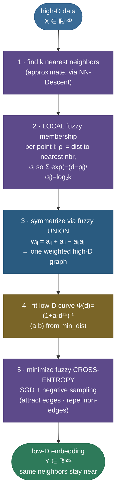
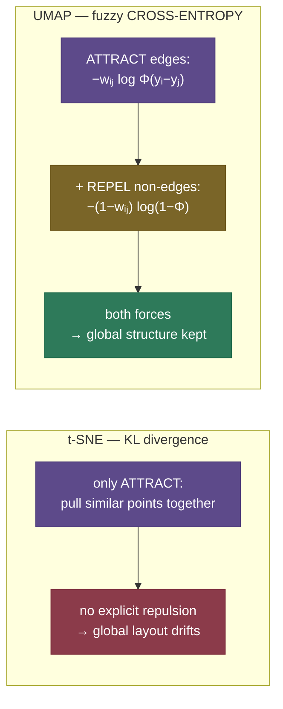

# UMAP: build the neighbor graph, then lay it out

Most dimensionality-reduction methods you meet first are *linear*: [PCA](06-Dimensionality-Reduction-Overview.md) finds the few straight-line directions of greatest variance and projects onto them. That works beautifully when the data really does live near a flat subspace — but real data rarely does. Digits, faces, single cells, and word embeddings live on a **curved, tangled manifold** folded inside a high-dimensional space, and flattening it with a linear projection smears the structure together. The non-linear methods exist to *unfold* that manifold instead of slicing it.

**UMAP** — Uniform Manifold Approximation and Projection — is the one that, since 2018, has become the default for this. Its recipe is disarmingly simple to state and surprisingly deep underneath: **build a graph of who-is-near-whom in high dimensions, then lay that same graph out in 2-D so the same neighbors stay near each other.** That is the entire idea. Everything technical — fuzzy simplicial sets, Riemannian geometry, cross-entropy, negative sampling — is machinery in service of making "near" mathematically precise and the layout fast.

I'm going to teach this the way I'd explain it at a whiteboard to someone who already knows [t-SNE](07-t-SNE.md) and is about to be asked "so why UMAP?" We'll start with the intuition (the graph and the layout), then build the theory in three honest layers — the **local fuzzy neighborhood**, the **fuzzy-union symmetrization**, and the **low-D cross-entropy layout** — deriving each formula and defining every symbol. Then the two knobs (`n_neighbors`, `min_dist`) you'll actually turn, the strengths and the honest caveats, a thorough UMAP-vs-t-SNE-vs-PCA comparison, and five worked examples ending in a *measured* run with `transform()` on held-out data. By the end you'll be able to:

- explain the **two-stage** algorithm — fuzzy neighbor graph → low-D layout — and why it generalizes both t-SNE and Laplacian-eigenmap methods;
- write the **local membership** formula with its per-point $\rho_i$ (local connectivity) and $\sigma_i$ (the $\log_2 k$ normalizer, UMAP's "perplexity");
- derive the **fuzzy-union symmetrization** $w_{ij} = a_{ij} + a_{ji} - a_{ij}a_{ji}$ and say *why* it's a union;
- explain the low-D curve $\Phi(d) = (1 + a\,d^{2b})^{-1}$, where $(a,b)$ come from `min_dist`, and the **cross-entropy** objective — and contrast its **repulsive** term with t-SNE's KL;
- reason about why **SGD with negative sampling** makes UMAP fast and scalable;
- turn `n_neighbors` and `min_dist` correctly, and read a UMAP plot **responsibly**;
- state, with numbers, where UMAP beats t-SNE and PCA — and where it still lies to you.

> **Note:** the one-line theory — UMAP assumes the data is **uniformly distributed on a Riemannian manifold** that is **locally connected**, builds a **fuzzy topological representation** (a weighted neighbor graph) of that manifold, and then finds a low-D layout whose own fuzzy graph is **as close as possible** (in cross-entropy) to the high-D one. The two "uniform" and "locally connected" assumptions are exactly what the per-point $\rho_i$ and $\sigma_i$ enforce. Everything below is that sentence, unpacked.

Intuition and pictures first, then the math (with sources), then runnable, verified code.

---

## The problem: non-linear reduction that also scales and transforms

[t-SNE](07-t-SNE.md) solved the *visualization* problem beautifully — model pairwise similarities as probabilities, minimize the KL divergence between high-D and low-D, and out come strikingly clean clusters. But it carries three practical pains that became more acute as datasets grew:

- **Speed and scale.** Classic t-SNE is $O(n^2)$; even Barnes-Hut t-SNE ($O(n \log n)$) crawls on hundreds of thousands of points, and chokes on millions. Modern data — millions of cells in a genomics experiment, millions of image or text embeddings — needs something faster.
- **Weak global structure.** t-SNE optimizes a purely *attractive* objective (pull similar points together) with the repulsion coming only implicitly from normalization. The result: the *within*-cluster picture is gorgeous, but the *between*-cluster distances and the overall arrangement are largely arbitrary — two clusters drawn far apart may actually be neighbors.
- **No out-of-sample transform.** t-SNE produces an embedding of *exactly the points you gave it*. There's no learned function, so you cannot embed a **new** point without re-running the whole optimization. That rules t-SNE out as a reusable preprocessing step in a production pipeline.

UMAP was designed to keep t-SNE's clean local clusters while fixing all three: it is **dramatically faster and scales to millions of points**, it **preserves more of the global structure**, and it learns a reusable mapping so you can `transform()` new points. And — unlike t-SNE — it isn't *only* a visualization tool: because it produces a genuine low-dimensional **embedding**, it doubles as a general-purpose feature reducer (often to 10–50 dimensions, not just 2) you can feed into clustering or a downstream model.

Where do these methods fit relative to the other non-linear option, **autoencoders**? An autoencoder *learns* a non-linear compression by training a neural network to reconstruct its input through a bottleneck — powerful, but it needs training data, an architecture, and an optimization budget, and its bottleneck is tuned for *reconstruction*, not for *neighbor preservation*. UMAP occupies a sweet spot between PCA (linear, instant, faithful-but-blunt) and autoencoders (learned, flexible, heavy): it is non-linear and neighbor-preserving like the latter, but unsupervised, fast, and parameter-light like the former. That niche — "non-linear manifold structure, cheaply, with a reusable transform" — is precisely the gap UMAP fills.

> **Note:** UMAP did *not* make t-SNE obsolete. For a one-off, publication-quality 2-D plot of a few thousand points where you only care about local clusters, t-SNE is still excellent and its caveats are well-charted (the Distill "Misread t-SNE" guide). Reach for UMAP when you need **scale**, **global structure**, a **reusable transform**, or an **embedding to feed downstream** — the four things t-SNE can't give you.

> **Gotcha:** "preserves more global structure" is a *relative* claim — UMAP is better than t-SNE here, not faithful in absolute terms. Inter-cluster distances in a UMAP plot are **more** trustworthy than in t-SNE but still **not** to be read literally. We'll return to this honesty in "Reading UMAP responsibly." The mistake to avoid is swapping t-SNE's caveats for blind faith in UMAP's geometry.

---

## Intuition: a graph of neighbors, relaxed into 2-D

Forget the topology for a moment. Here is UMAP in two human steps.

**Step 1 — build the neighbor graph (high-D).** For each point, find its $k$ nearest neighbors and draw an edge to each, with a **weight** that's strong for the closest neighbor and fades for the farther ones. Do this for every point and you get a weighted graph that captures the local shape of the data: who sits next to whom, and how tightly. Think of it as a web of springs — short, stiff springs between close points; long, slack springs between distant ones.

**Step 2 — lay the graph out (low-D).** Now drop all those points randomly onto a 2-D canvas and let the springs pull. Edges with high weight (close in high-D) pull their endpoints **together**; pairs with no edge gently push **apart**. Let the system relax, and points that were neighbors in high-D end up neighbors on the canvas — the manifold has been unfolded onto the page.

That spring-graph picture is not just an analogy: UMAP's optimization is *literally* a force-directed graph layout, with attractive forces along edges and repulsive forces between sampled non-edges. The whole reason it's fast is that it does this with stochastic gradient descent and **negative sampling** — it never has to compute all $n^2$ repulsions, only a handful of random ones per edge.

> **Tip:** the spring intuition also explains the two knobs before we even reach the math. `n_neighbors` is *how many springs* each point gets — few springs see only the local neighborhood (local detail), many springs reach across the data (global shape). `min_dist` is *how short the stiff springs are allowed to pull points* — short springs let a cluster collapse into a tight knot, longer ones hold points apart into an even spread. Hold this and the formal definitions later will just be making "spring" precise.


The image above is a *real* UMAP run on the digits dataset (the code is at the bottom). Sixty-four-dimensional pixel vectors became a 2-D map where each digit forms its own island — and the islands aren't placed entirely at random: visually-confusable digits tend to sit closer together, which is the global-structure payoff over t-SNE.

> **Tip:** the cleanest mental contrast with t-SNE: t-SNE thinks in **probabilities** (a point's neighbors form a probability distribution; match distributions via KL). UMAP thinks in **graphs and fuzzy sets** (a point's neighbors form a fuzzy membership; match graphs via cross-entropy). They reach similar-looking clusters from different mathematics — and that different mathematics is exactly why UMAP gets repulsion, speed, and a reusable transform almost for free.

---

## Why it matters

- **It's the modern default, so it's the t-SNE follow-up.** "You used t-SNE — why not UMAP?" is a standard interview escalation. The strong answer names the three wins (speed/scale, global structure, out-of-sample `transform`) *and* keeps the humility (the geometry still isn't literal).
- **It's a workhorse far beyond pretty pictures.** UMAP is the standard visualization in **single-cell genomics** (every modern scRNA-seq paper has a UMAP), in **embedding inspection** for NLP and vision (project your model's representations and *see* what it learned), and as a **preprocessing step** that reduces to 10–50 dimensions before clustering — its author, Leland McInnes, also wrote **HDBSCAN**, and UMAP→HDBSCAN is a canonical clustering pipeline.
- **It forces you to learn the honest caveats.** Knowing *when not to trust* a UMAP plot — cluster sizes are not densities, gaps are not distances, and a bad `n_neighbors` can manufacture clusters that aren't there — is exactly the maturity interviewers and reviewers look for.
- **It's how you *see* what a model learned.** Take the embeddings a language or vision model produces — word vectors, sentence embeddings, image features, even an LLM's intermediate activations — and UMAP them to 2-D, and you get a literal picture of the model's internal geometry: which concepts cluster, which classes separate, where the representation is confused. For anyone building or debugging embedding-based systems (search, RAG retrieval, classification heads), UMAP is the standard lens for inspecting the representation space.

---

## How it works: two stages, five steps

UMAP is two stages. **Stage 1** constructs a single weighted graph (a "fuzzy topological representation") of the data in high-D. **Stage 2** optimizes a low-D layout whose own graph matches it. Concretely:



The five steps map onto the three pieces of theory we now build: steps 1–2 are the **local fuzzy neighborhood**, step 3 is the **symmetrization**, and steps 4–5 are the **low-D layout**. Let's take them in turn — this is the heart of the page.

---

## The math, part 1: the local fuzzy neighborhood

UMAP's deepest idea is that the right way to describe "is point $j$ a neighbor of point $i$?" is not yes/no but a **fuzzy membership** $a_{ij} \in [0,1]$ — a smooth degree of belonging that is 1 for the closest neighbor and decays toward 0 for far ones. This comes from the theory of **fuzzy simplicial sets**, but the formula is concrete. For point $i$ and a neighbor $j$ at distance $d(x_i, x_j)$:

$$a_{ij} \;=\; \exp\!\left(-\,\frac{\max\!\big(0,\; d(x_i, x_j) - \rho_i\big)}{\sigma_i}\right).$$

Two per-point quantities make this work, and they are exactly UMAP's "uniform" and "locally connected" assumptions turned into numbers:

**$\rho_i$ — local connectivity (the manifold assumption).** $\rho_i$ is the distance from $i$ to its **nearest** neighbor:

$$\rho_i \;=\; \min_{\,j \,\in\, \mathcal{N}(i)} d(x_i, x_j).$$

The subtraction $d - \rho_i$ (clamped at 0 by the $\max$) means the membership is **exactly 1** for the nearest neighbor and only starts decaying *beyond* it. This guarantees every point is connected to at least one other — the **locally connected** assumption — so no point is ever stranded as an island, even in a sparse region. It's also why UMAP doesn't suffer t-SNE's "lonely points fly off" pathology: $\rho_i$ adapts the radius to the *local* density.

**$\sigma_i$ — the local scale (the uniformity normalizer).** $\sigma_i$ is the per-point bandwidth that controls how fast membership decays, chosen so that the **total fuzzy degree** of point $i$ hits a fixed target tied to $k = $ `n_neighbors`:

$$\sum_{j \,\in\, \mathcal{N}(i)} a_{ij} \;=\; \sum_{j} \exp\!\left(-\,\frac{\max(0,\, d(x_i,x_j) - \rho_i)}{\sigma_i}\right) \;=\; \log_2(k).$$

We solve for the $\sigma_i$ that makes this hold (a 1-D root-find — binary search — per point). This is UMAP's analogue of t-SNE's **perplexity**: just as perplexity fixes the *effective number of neighbors* by normalizing a probability distribution, the $\log_2 k$ constraint fixes each point's total membership, which **uniformizes** the graph — dense regions get a small $\sigma_i$ (membership decays fast), sparse regions get a large $\sigma_i$ (membership reaches farther), so every point contributes the same total "neighborness." That's the "uniform distribution on the manifold" assumption made real: by adapting $\sigma_i$ to local density, UMAP *pretends* the data is uniformly spread and corrects the metric to match.

> **Note (formula provenance):** the membership formula, the $\rho_i$ local-connectivity term, and the $\sum_j a_{ij} = \log_2 k$ normalization are Definitions/Eqs. in **McInnes, Healy & Melville, "UMAP" (2018, arXiv:1802.03426), §2–3**, and are laid out in plain language in the author's **["How UMAP Works"](https://umap-learn.readthedocs.io/en/latest/how_umap_works.html)**. Sources in the references.

> **Tip:** notice the membership is asymmetric: $a_{ij} \neq a_{ji}$ in general, because $i$'s neighborhood scale $\sigma_i$ and connectivity $\rho_i$ differ from $j$'s. Point $i$ might consider $j$ a strong (0.9) neighbor while $j$, sitting in a denser region with a tighter $\sigma_j$, considers $i$ only a weak (0.2) one. The next step reconciles this disagreement.

---

## The math, part 2: symmetrization via the fuzzy union

We now have a *directed*, asymmetric graph: edge $i \to j$ has weight $a_{ij}$, edge $j \to i$ has weight $a_{ji}$, and they disagree. UMAP combines the two directions into a single **undirected** weight $w_{ij}$ using the **fuzzy-set union**, whose operator is the **probabilistic t-conorm** (also called the probabilistic sum):

$$w_{ij} \;=\; a_{ij} + a_{ji} - a_{ij}\,a_{ji}.$$

This is exactly the **union of two fuzzy sets** — equivalently, $1 - (1 - a_{ij})(1 - a_{ji})$, which reads as *"the probability that **at least one** direction considers them neighbors,"* treating $a_{ij}$ and $a_{ji}$ as independent membership probabilities. It's the fuzzy generalization of the OR of two boolean edges. Properties worth feeling:

- It is **symmetric**: $w_{ij} = w_{ji}$ — we now have an undirected graph.
- It is **at least the larger** of the two and **at most 1**: $\max(a_{ij}, a_{ji}) \le w_{ij} \le 1$. A strong vote in *either* direction makes the edge strong; the disagreement is reconciled toward inclusion, not toward the minimum.
- If both directions agree it's a neighbor ($a_{ij} = a_{ji} = 1$), $w_{ij} = 1$; if both say no ($=0$), $w_{ij} = 0$.

> **Note:** why *union* and not, say, the average or the t-SNE-style symmetrization $(p_{ij} + p_{ji})/2$? Because UMAP's framework treats each directed membership as evidence *for* an edge, and the topologically correct way to merge two fuzzy simplicial sets is their union. Practically, the union is more **inclusive** — it preserves an edge that *either* endpoint considers important — which keeps the graph well-connected and is part of why UMAP holds onto global structure better than the averaging t-SNE uses.

The result of part 2 is a single weighted, undirected graph — UMAP's **fuzzy topological representation** of the high-D data. Call its edge weights $\{w_{ij}\}$. Everything in high-D is now distilled into these numbers; the original coordinates are never used again.

> **Gotcha:** because the graph is built from **approximate** k-NN (via the **NN-Descent** algorithm, not exact search), UMAP is fast on huge datasets but its graph — and therefore its embedding — is **stochastic**. Two runs differ unless you fix `random_state`. Set it for reproducible figures; never over-interpret a single un-seeded run.

---

## A short detour: why "fuzzy simplicial sets" at all?

You can use UMAP perfectly well from the two stages above without ever touching the topology, but the name and the paper lean hard on **fuzzy simplicial sets** and **Riemannian geometry**, and a sentence of grounding makes the rest less mysterious — and is exactly the kind of "do you actually understand it" probe a senior interviewer enjoys.

The starting problem is geometric: real data is sampled *non-uniformly* from a manifold, but the tools that would let us reconstruct the manifold's shape (like the **Vietoris–Rips complex** from topological data analysis — connect points within a fixed radius $\varepsilon$, building a graph, then triangles, then higher simplices) assume a *uniform* sample and a *single* radius. On non-uniform data a single $\varepsilon$ is wrong everywhere: too large in dense regions (everything connects), too small in sparse ones (points strand). UMAP's fix is the per-point $\rho_i$ and $\sigma_i$ — they amount to giving **each point its own local metric**, in which the data *looks* uniform. That is the "uniform distribution on a Riemannian manifold" assumption: don't assume the data is uniform, assume there's a per-point distortion of distance that *makes* it uniform, and bake that distortion into the membership.

The catch is that each point's local metric disagrees with its neighbors' (point $i$ thinks $j$ is distance 0.3 away in *its* units; $j$ disagrees in *its* units). A **fuzzy simplicial set** is the bookkeeping device that **merges all these locally-inconsistent views into one global structure** — and the merge operation is precisely the fuzzy **union** from part 2. So the chain is: *per-point local metrics* (the $\rho_i, \sigma_i$ membership) → *one fuzzy simplicial set* (the union-symmetrized graph) → *find a low-D set that matches it* (the cross-entropy layout).

> **Note:** the "simplicial" part — triangles and higher simplices, not just edges — is what makes the framework *topological* rather than merely a weighted graph, and it's the formal justification for calling UMAP a manifold-approximation method. In the shipped algorithm, however, **only the 1-simplices (edges) drive the optimization**; the higher simplices are theoretical scaffolding. This is one reason critiques (in the references) say the *practice* is a graph-layout algorithm wearing topological clothes — true, and it works regardless.

> **Tip:** the one-sentence takeaway: fuzzy simplicial sets are how UMAP **stitches together each point's private, density-adapted view of "who's nearby" into a single consistent graph** — the per-point metrics are the manifold/Riemannian part, and the stitching is the fuzzy-union part. You don't need the category theory to use UMAP, but you do need *this* to explain why it's not "just t-SNE with a different kernel."

---

## The math, part 3: the low-D layout and cross-entropy

Now we lay the graph out in low dimensions (usually 2-D for plots). Each high-D point $x_i$ gets a low-D position $y_i \in \mathbb{R}^2$, initialized (by default) from a fast spectral embedding of the graph. We need (a) a low-D notion of edge weight, and (b) an objective that pulls the low-D graph toward the high-D one.

**(a) The low-D membership curve.** In low-D, the "membership" of the pair $(i,j)$ is a smooth, decreasing function of their low-D distance $d_{ij} = \lVert y_i - y_j \rVert$:

$$\Phi(d_{ij}) \;=\; \big(1 + a\,d_{ij}^{\,2b}\big)^{-1}.$$

This is a flexible heavy-tailed curve (a generalization of t-SNE's Student-t, which is the special case $a = b = 1$). The two parameters $(a, b)$ are **fit once** by least-squares so that $\Phi$ approximates the piecewise target *"membership 1 up to distance `min_dist`, then decay"* — i.e. **`min_dist` sets the shape of $\Phi$.** A small `min_dist` makes $\Phi$ flat-topped near 0, so points in the same cluster are allowed to pile up extremely tightly; a large `min_dist` makes $\Phi$ start decaying immediately, forcing points to spread out evenly.


The figure is generated with UMAP's actual `find_ab_params` fitter — the measured $(a,b)$ values appear in Example 3 below.

> **Note:** there is a third, rarely-touched knob here: `spread`, the overall *scale* of the embedding (the distance over which $\Phi$ transitions), which `find_ab_params(spread, min_dist)` takes alongside `min_dist`. The constraint is `min_dist < spread`; raising `spread` zooms the whole layout out, raising `min_dist` flattens the curve's top. Almost everyone leaves `spread=1.0` and only turns `min_dist` — but knowing the two together control the $(a,b)$ fit explains why `min_dist` alone can't make points spread *arbitrarily* far: that's `spread`'s job.

**(b) The objective: fuzzy cross-entropy.** UMAP positions the $y_i$ to minimize the **cross-entropy** between the high-D edge weights $w_{ij}$ and the low-D weights $\Phi(d_{ij})$, summed over all pairs:

$$\mathcal{L} \;=\; \sum_{i \neq j} \Big[\; \underbrace{w_{ij}\,\log \frac{w_{ij}}{\Phi(d_{ij})}}_{\text{attractive: edges}} \;+\; \underbrace{(1 - w_{ij})\,\log \frac{1 - w_{ij}}{1 - \Phi(d_{ij})}}_{\text{repulsive: non-edges}} \;\Big].$$

Drop the constant terms (those not depending on the $y_i$) and the gradient has two opposing parts:

- The **attractive** term $-\,w_{ij}\log \Phi(d_{ij})$ is large when a strong high-D edge ($w_{ij}$ near 1) is stretched far apart in low-D ($\Phi$ small). Minimizing it **pulls connected points together**.
- The **repulsive** term $-\,(1 - w_{ij})\log\big(1 - \Phi(d_{ij})\big)$ is large when a *non*-edge ($w_{ij}$ near 0) sits too close in low-D ($\Phi$ near 1). Minimizing it **pushes unrelated points apart**.

This is the single most important contrast with t-SNE, and the reason UMAP keeps global structure:



t-SNE minimizes **KL divergence**, $\sum_{ij} p_{ij}\log(p_{ij}/q_{ij})$, which only has the *attractive* $p_{ij}\log q_{ij}$ structure — its repulsion sneaks in indirectly through the normalization $Z$ of the low-D distribution. UMAP's cross-entropy has an **explicit, second repulsive term** $(1 - w_{ij})\log(1 - \Phi)$ for *every* non-edge. That extra term penalizes putting unrelated clusters too close, so the optimizer spaces the clusters out by their actual dissimilarity — which is precisely the global structure t-SNE loses.

**(c) The forces, concretely.** It helps to see the actual gradient that SGD descends — it makes "attract along edges, repel between non-edges" literal. Writing the low-D weight with the fitted $(a,b)$ as $\Phi(d) = (1 + a\,d^{2b})^{-1}$ where $d = \lVert y_i - y_j \rVert$, the gradient of the cross-entropy with respect to a point's position $y_i$ splits into the two named pieces. The **attractive** force from a high-D edge $w_{ij}$ pulls $y_i$ toward $y_j$:

$$\frac{\partial \mathcal{L}}{\partial y_i}\bigg|_{\text{attract}} \;\propto\; \frac{-2ab\,d^{\,2(b-1)}}{1 + a\,d^{2b}}\; w_{ij}\,(y_i - y_j),$$

and the **repulsive** force from a sampled non-edge pushes $y_i$ away from $y_j$:

$$\frac{\partial \mathcal{L}}{\partial y_i}\bigg|_{\text{repel}} \;\propto\; \frac{2b}{(\varepsilon + d^2)\,(1 + a\,d^{2b})}\;(1 - w_{ij})\,(y_i - y_j),$$

with a small $\varepsilon$ to keep the repulsion finite when two points coincide. You don't need to memorize these, but two features are worth seeing: the attraction is scaled by the high-D weight $w_{ij}$ (stronger edges pull harder), and the repulsion is scaled by $(1 - w_{ij})$ (non-edges push) and *blows up as $d \to 0$* (the $1/(\varepsilon + d^2)$ term) — that singular repulsion is exactly what prevents unrelated points from collapsing on top of each other, and what t-SNE's purely-attractive KL lacks an explicit version of.

**(d) Why it's fast: SGD with negative sampling.** Computing all $\binom{n}{2}$ pairwise repulsions every step would be $O(n^2)$ and ruin the speed. UMAP instead borrows the **negative sampling** trick from word2vec: each optimization step picks a high-weight **edge** at random and applies its attraction, then samples a small fixed number of **random non-edges** ("negative samples," typically 5) and applies their repulsion. Over many steps this stochastically approximates the full gradient, but each step is $O(1)$ in the data size, so an epoch is $O(\lvert E \rvert)$ — linear in the number of edges, which is $O(nk)$. Combined with approximate k-NN for the graph, that's why UMAP runs in roughly **$O(n^{1.14})$** in practice and scales to **millions** of points where t-SNE cannot.

> **Note:** there's one more efficiency trick — UMAP samples each edge for an attraction update *proportionally to its weight $w_{ij}$* (strong edges are visited more often), rather than multiplying the update by $w_{ij}$ each time. Over an epoch the expected pull is the same, but the per-step work is constant. This "sample, don't weight" pattern is the same idea negative sampling uses on the repulsion side, and together they are why UMAP's optimizer is so cheap per step.

> **Note (provenance):** the low-D curve, the cross-entropy objective, and the SGD-with-negative-sampling optimization are **McInnes et al. (2018), §3–4**; the negative-sampling idea traces to **Mikolov et al., word2vec (2013)**. The empirical $O(n^{1.14})$ scaling is reported in the UMAP paper's benchmarks. All in the references.

> **Tip:** a clean way to hold the whole algorithm: **part 1** decides *who* are neighbors and how strongly (local membership), **part 2** agrees on one undirected graph (fuzzy union), **part 3** drops that graph onto a canvas and lets attraction-along-edges and repulsion-between-non-edges relax it (cross-entropy by SGD). Three sentences, three pieces of math.

---

## The two knobs: n_neighbors and min_dist

UMAP has two hyperparameters you'll actually tune, and they control **different** things. Getting these right is 90% of using UMAP well.

**`n_neighbors` — local vs global structure.** This is $k$: how many neighbors enter each point's local graph. It sets the **scale** at which UMAP looks at the data.

- **Small `n_neighbors` (e.g. 5)** — each point sees only its immediate neighbors, so UMAP captures **fine local detail** and fragments the data into many small clusters. It can over-fragment and even manufacture clusters that aren't real.
- **Large `n_neighbors` (e.g. 100–200)** — each point's graph reaches across the data, so UMAP emphasizes the **big-picture global structure** at the expense of fine detail; clusters merge into broader continents.

**`min_dist` — how tightly points pack.** This sets the shape of the low-D curve $\Phi$ (the $(a,b)$ fit above), i.e. the **minimum distance** apart that points are allowed to be in the embedding.

- **Small `min_dist` (e.g. 0.0–0.1)** — points in the same cluster are allowed to pile up extremely tightly, giving **dense, clumpy** clusters — best for *seeing* cluster membership.
- **Large `min_dist` (e.g. 0.5–0.99)** — points are forced to spread out evenly, giving a **looser, more uniform** layout that shows the broad topology — best for seeing overall shape, worse for tight clusters.


The figure is a *real* sweep — same data, only the knob changes per panel. Read the top row left-to-right as "zoom from local to global," and the bottom row as "from tight clumps to even spread."

> **Tip:** the practitioner default is `n_neighbors=15, min_dist=0.1`, and it's a good start. Tune `n_neighbors` when you care about local-vs-global balance (raise it if the plot looks shattered into too many specks; lower it to resolve fine sub-structure). Tune `min_dist` purely for *aesthetics/readability* of the clusters — lower for crisp clumps in a figure, higher to see the connective tissue between groups. They are **orthogonal**: change one without disturbing the other.

> **Gotcha:** because small `n_neighbors` looks only at tiny neighborhoods, it can **invent clusters** — split a single genuine group into shards that look like distinct populations. This is the UMAP analogue of t-SNE's "don't trust the number of clusters." Always sweep `n_neighbors` and check that your clusters are stable before you claim them as real.

> **Note:** the map back to t-SNE: `n_neighbors` is the rough analogue of t-SNE's **perplexity** (both set the effective neighborhood size / local-vs-global scale), while `min_dist` has **no t-SNE equivalent** — t-SNE has no knob for how tightly points pack, because its Student-t tail is fixed ($a = b = 1$). The $(a,b)$ fit is UMAP's extra degree of freedom, and it's why UMAP plots can look either tightly clumped or evenly spread from the *same* graph.

There's a useful third lever, `n_components`, that isn't a tuning knob so much as a **mode switch**. Set it to 2 (or 3) for a plot; set it to 10–50 to use UMAP as a **feature reducer** whose output feeds a clusterer or model. The same algorithm serves both jobs — the only change is the dimensionality of the layout space — which is a large part of why UMAP, unlike t-SNE, is a general-purpose tool and not just a plotting one.

---

## Reading UMAP responsibly

UMAP is more global-structure-faithful than t-SNE, but it is **not** a faithful metric embedding, and the same discipline that protects you from misreading t-SNE applies here. The honest rules:

- **Cluster sizes are not densities.** UMAP packs clusters by the $\Phi$ curve, not by their true spread. A big blob is not a more-variable group; a tight blob is not necessarily denser. Don't compare cluster *areas*.
- **Distances between clusters are only loosely meaningful.** UMAP's repulsion makes inter-cluster gaps *more* informative than t-SNE's, but a gap twice as wide does **not** mean twice as dissimilar. Treat between-cluster geometry as a hint, not a measurement.
- **The axes mean nothing.** UMAP 1 and UMAP 2 have no units and no interpretation; the embedding is only defined up to rotation, reflection, and scale.
- **Hyperparameters reshape the map.** A different `n_neighbors` can split or merge clusters; a different `random_state` rotates and jiggles them. A conclusion that depends on one specific setting is not a conclusion.
- **Apparent clusters can be artifacts.** Especially at small `n_neighbors`, UMAP can produce well-separated blobs from data that is actually continuous. Verify structure against the original space (e.g. with clustering metrics or known labels) before believing it.

A concrete misread to internalize: suppose a UMAP shows two clusters, **A and B touching** on the left and a **third cluster C far to the right**. The tempting story is "A and B are similar; C is very different." But UMAP's repulsion only guarantees that *non-neighbors are pushed apart* — the *amount* of separation is set by the optimization dynamics and the random initialization, not by a calibrated distance. C might be only marginally more different from A than B is; the dramatic gap is partly an artifact of how the layout relaxed. The defensible claim is **"A, B, C are three groups"** (the partition is usually trustworthy) — not **"C is twice as far, so twice as different"** (the metric is not). Make claims about *membership*, not about *distance*.

> **Note:** the definitive treatment of these caveats is **Coenen & Pearce, ["Understanding UMAP"](https://pair-code.github.io/understanding-umap/) (Google PAIR)** — an interactive explainer that lets you turn the knobs and watch the map lie. It is the single best read after this page; in the references.

> **Tip:** a practical safety habit from genomics, where UMAPs are published constantly: treat UMAP as a tool for **generating** hypotheses ("these cells might be a distinct type"), never for **confirming** them. Confirm with the original high-D data, statistical tests, or a clustering done in the *reduced-but-not-2-D* space (UMAP to ~30-D, cluster there, then UMAP to 2-D only for display).

---

## UMAP vs t-SNE vs PCA

The three sit on a clear spectrum: PCA is linear, fast, and faithful-but-limited; t-SNE and UMAP are non-linear and cluster-revealing, with UMAP winning on speed, global structure, and reusability. The thorough comparison:

| | **PCA** | **t-SNE** | **UMAP** |
|---|---|---|---|
| Type | linear projection | non-linear, manifold | non-linear, manifold |
| Objective | maximize variance (= min reconstruction error) | minimize **KL** divergence | minimize fuzzy **cross-entropy** |
| Speed / scale | very fast, $O(nd\min(n,d))$ | slow, $O(n\log n)$ (Barnes-Hut) | fast, ~$O(n^{1.14})$; **scales to millions** |
| Global structure | **faithful** (it's literally the top variance directions) | poor (clusters' relative positions arbitrary) | **better** than t-SNE (explicit repulsion), still not literal |
| Local structure | weak (linear) | **excellent** | **excellent** |
| Out-of-sample `transform` | **yes** (a fixed linear map) | **no** | **yes** (learned mapping) |
| Determinism | deterministic | stochastic | stochastic (fix `random_state`) |
| Distances meaningful? | **yes**, in the projected space | no | loosely (better than t-SNE, not literal) |
| Main knobs | `n_components` | `perplexity` | `n_neighbors`, `min_dist` |
| General-purpose embedding? | yes (any dim) | viz only (2–3D) | **yes** (reduce to 10–50D for downstream use) |
| Theory | linear algebra (SVD/eigen) | probability + KL | Riemannian geometry + fuzzy simplicial sets |
| Typical use | first-pass reduction, denoising, decorrelation | publication-quality 2-D cluster plots | scalable viz **and** preprocessing for clustering |


The figure is a *measured* head-to-head on identical data. The takeaways, in order: **PCA can't separate the classes** (linear projection overlaps them), **both non-linear methods can**, and **UMAP keeps more of the inter-class arrangement** while running fast.

> **Gotcha:** the speed comparison deserves honesty. On a *small* dataset like digits (1,797 points), UMAP and t-SNE finish in comparable wall-clock time — UMAP's dramatic advantage is **asymptotic**, appearing at tens of thousands to millions of points where t-SNE's $O(n\log n)$ and larger constant factors dominate. Don't claim "UMAP is faster" from a tiny benchmark; claim "UMAP **scales** better," which is the real and load-bearing difference.

> **Tip:** a common and powerful pipeline uses **all three**: PCA first (reduce 10,000-D to ~50-D, cheaply removing noise and decorrelating), then UMAP on the PCA output (the non-linear unfolding, now fast and less noisy), for the 2-D plot. PCA-then-UMAP is the standard preprocessing in single-cell genomics for exactly this reason.

---

## Where UMAP sits in the manifold-learning family

UMAP didn't appear from nowhere — it's the latest in a lineage of **manifold-learning** methods, all sharing the premise "the data lives on a low-D manifold; recover it from local neighborhoods." Placing UMAP among its ancestors clarifies what's genuinely new:

- **Isomap** (Tenenbaum et al., 2000) — build a neighbor graph, then preserve **geodesic** (along-the-manifold) distances via classical MDS. Famous for unrolling the "Swiss roll." Global but $O(n^2)$–$O(n^3)$ and brittle to graph errors.
- **Locally Linear Embedding (LLE)** (Roweis & Saul, 2000) — reconstruct each point as a linear combination of its neighbors, then find low-D coordinates preserving those weights. Local, elegant, but fragile.
- **Laplacian Eigenmaps** (Belkin & Niyogi, 2003) — build a weighted neighbor graph, embed via the **eigenvectors of the graph Laplacian** (spectral embedding). UMAP's default *initialization* is essentially this — it then refines it with the cross-entropy SGD.
- **t-SNE** (van der Maaten & Hinton, 2008) — the probabilistic neighbor-embedding that made clean 2-D cluster plots routine, and UMAP's direct predecessor in spirit.

UMAP's contribution is to take the **graph-construction rigor** of the spectral/topological methods (the density-adaptive fuzzy graph), pair it with a **scalable, repulsive, force-directed optimizer** (negative-sampling SGD), and ship a **reusable `transform`**. It is, in one view, "Laplacian-eigenmap initialization + a t-SNE-like repulsive refinement, made fast and out-of-sample-capable." That synthesis — not any single new idea — is why it took over.

The **spectral initialization** detail is worth dwelling on, because it's a quiet reason UMAP beats t-SNE on global structure. Classic t-SNE starts from a *random* layout, so the big-picture arrangement is whatever the optimization happens to settle into — different every run. UMAP (and modern t-SNE implementations that copied this) instead starts from the **graph Laplacian's eigenvectors**, a deterministic embedding that already captures the data's coarse global shape *before* the cross-entropy refinement begins. The refinement then sharpens local clusters without destroying that global scaffold. So part of UMAP's "better global structure" isn't the cross-entropy at all — it's that it *starts* from a globally-sensible position and the repulsion *keeps* it sensible. (You can pass `init='random'` to see the difference: the local clusters survive, the global arrangement gets worse.)

> **Note:** all of these (Isomap, LLE, Laplacian eigenmaps) are in scikit-learn's `manifold` module and its [side-by-side comparison example](https://scikit-learn.org/stable/auto_examples/manifold/plot_compare_methods.html) — running them on the same data is the fastest way to *feel* why the local/global/speed trade-offs differ. Linked in the references.

> **Gotcha:** setting `random_state` makes UMAP reproducible **but disables its internal parallelism** (the multithreaded code paths are non-deterministic), so a seeded run is slower than an unseeded one on the same data. For exploration, leave it unseeded and fast; for a figure or a shipped pipeline, seed it and accept the speed hit. Don't seed-then-wonder-why-it-got-slower.

---

## Scaling, in numbers

The "UMAP scales, t-SNE doesn't" claim deserves concrete figures, because *where* the crossover happens is exactly what an interviewer or a capacity-planning decision turns on. Two cost terms dominate:

- **Stage 1 (the graph)** is approximate k-NN via **NN-Descent**, empirically about **$O(n^{1.14})$** in the number of points — sub-quadratic, which is the whole game. Memory is $O(nk)$ for the sparse graph (you store $\sim nk$ edges, not an $n \times n$ matrix).
- **Stage 2 (the layout)** is `n_epochs` passes of negative-sampling SGD, each $O(\lvert E \rvert) = O(nk)$. UMAP even **auto-reduces `n_epochs`** as $n$ grows (200 for large data, 500 for small), because more points means more gradient signal per epoch.

What this means in practice, on a single modern CPU (order-of-magnitude, from the paper's and community benchmarks):

| dataset size $n$ | UMAP (approx.) | Barnes-Hut t-SNE (approx.) |
|---|---|---|
| ~2,000 (digits) | ~3–7 s | ~3 s (comparable — *no* UMAP win here) |
| ~70,000 (MNIST) | ~1–2 min | ~10–30 min |
| ~1,000,000 | minutes | hours (often impractical) |
| ~10,000,000+ | feasible (GPU: seconds–minutes) | not practical |

The pattern is the headline: **at small $n$ they tie; the gap opens with scale.** This is why the figure earlier shows comparable times on 1,797 digits, yet single-cell papers with hundreds of thousands of cells, or NLP embedding sets in the millions, reach for UMAP without hesitation. There is also a **GPU UMAP** (NVIDIA RAPIDS `cuml.UMAP`) that embeds millions of points in seconds — the practical tool when $n$ is genuinely large.

> **Tip:** the interview-ready version: "UMAP's graph build is ~$O(n^{1.14})$ and its layout is linear in edges with negative sampling, so it stays usable into the **millions** of points; t-SNE's Barnes-Hut is $O(n\log n)$ with a much larger constant and degrades past ~$10^5$. On a few thousand points they're the same speed — the win is *asymptotic*, and there's a GPU implementation when you need more."

> **Gotcha:** "scales to millions" is about *number of points* $n$, not *number of dimensions* $D$. UMAP's distance computations are still $O(D)$ per pair, so on raw high-$D$ data (tens of thousands of features) it slows down and the metric degrades — which is exactly why the standard recipe runs **PCA to ~50-D first**, then UMAP. Reduce $D$ with PCA; let UMAP handle $n$.

---

## Strengths and weaknesses

**Strengths.**

- **Speed and scale** — approximate k-NN + negative-sampling SGD make it roughly $O(n^{1.14})$; it handles **millions** of points where t-SNE stalls.
- **Better global structure** — the explicit repulsive cross-entropy term spaces clusters by dissimilarity, so the overall arrangement is more trustworthy than t-SNE's.
- **Out-of-sample `transform()`** — it learns a reusable mapping; embed new points without re-fitting. This makes it usable as a fixed preprocessing step in a production pipeline.
- **General-purpose, not viz-only** — reduce to any target dimension (10–50 is common before clustering), not just 2-D.
- **Supervised & metric variants** — UMAP can use labels (`y=`) to sharpen class separation (**supervised UMAP**), align multiple datasets (**AlignedUMAP**), or learn with a custom metric — flexibility t-SNE lacks.

**Weaknesses.**

- **Still distorts distances and densities** — cluster sizes and inter-cluster gaps are not literal; the geometry is a hint, not a measurement.
- **Stochastic** — different runs (and different approximate-kNN draws) differ; fix `random_state` and never over-read one run.
- **Hyperparameter-sensitive** — `n_neighbors` in particular reshapes the map and can over-fragment.
- **Can manufacture false clusters** — especially at small `n_neighbors`; apparent gaps may be artifacts.
- **Theory-heavy** — the fuzzy-simplicial-set / Riemannian foundations are intimidating, and some claimed theoretical guarantees have been questioned (the *practical algorithm* is well-understood and well-tested even where the *topological justification* is debated).

> **Note:** a thoughtful critique (Damrich & Hamprecht, 2021; and Böhm, Berens & Kobak's "attraction–repulsion spectrum" work) shows that UMAP's *effective* loss differs from the stated cross-entropy and that t-SNE and UMAP sit on a continuum controlled by the **balance of attraction vs repulsion** — UMAP simply leans more repulsive. This doesn't make UMAP wrong; it clarifies *why* it looks different from t-SNE (more repulsion → more spread-out, more global structure). Worth knowing for a senior-level discussion; sources in the references.

---

## Where UMAP is used

- **Single-cell genomics** — the standard 2-D view of scRNA-seq / cytometry data; **Becht et al. (2019)** popularized UMAP for visualizing cell populations, and it's now in essentially every single-cell paper (usually PCA → UMAP → cluster). The pipeline is concrete: a cell-by-gene matrix (tens of thousands of genes) → PCA to ~50 components → UMAP to 2-D for the figure (and often to ~10-D for clustering with Leiden/HDBSCAN). The colored "islands" you see in these papers *are* UMAP embeddings — which is exactly why the **Chari & Pachter** critique (in the references) about over-reading them matters so much here.
- **Embedding & feature visualization** — project the hidden representations of a neural net (word/sentence embeddings, image features, LLM activations) to 2-D to *see* what the model learned and how classes separate.
- **Preprocessing for clustering** — reduce to 10–50 dims with UMAP, then run **HDBSCAN** (same author) or k-means; the non-linear reduction makes density-based clustering work where it failed in the raw high-D space.
- **General dimensionality reduction** — anywhere you'd reach for a non-linear reducer with a reusable transform: anomaly detection front-ends, retrieval/index preprocessing, exploratory data analysis at scale.

---

## The UMAP family: supervised, parametric, densMAP, aligned

A under-appreciated strength is that UMAP is a *family*, not a single algorithm. Knowing the variants signals real familiarity and unlocks the right tool for several common problems:

- **Supervised UMAP.** Pass labels with `.fit(X, y)` and UMAP blends the label information into the graph (it builds the fuzzy structure partly from class membership), pulling same-class points together and pushing classes apart **far more cleanly** than the unsupervised version. The payoff is a `transform()` that projects *new, unlabeled* points into that class-aware space — effectively a non-linear, learned feature extractor. (Use a *fraction* of label weight, not full, or you just memorize the labels.) **Metric learning** flavor: you can also supply a custom `target_metric`.
- **Parametric UMAP.** Replace the per-point coordinate optimization with a **neural network** $f_\theta$ that maps high-D → low-D, trained on the same cross-entropy. Now the embedding is a *differentiable function* you can apply to streaming data at inference speed, save as model weights, fine-tune, or plug into a larger network — at the cost of training an encoder. This is the bridge from UMAP-as-visualization to UMAP-as-a-layer.
- **densMAP.** Standard UMAP deliberately *discards* density (recall: cluster sizes aren't densities). **densMAP** adds a term that tries to **preserve local density**, so a genuinely tight cluster *renders* tight and a diffuse one renders spread — restoring some of the density information the base method throws away. Reach for it when relative density is part of the story (e.g. distinguishing a compact, homogeneous cell population from a variable one).
- **AlignedUMAP.** Embed **several related datasets into a shared, comparable space** (e.g. the same assay across time points or batches), with constraints that keep corresponding points aligned across embeddings — so you can watch structure *evolve* rather than re-rotate arbitrarily per dataset.

> **Tip:** the decision shortcut. Have labels and want sharper separation + a reusable projector → **supervised UMAP**. Need an embedding *function* for streaming/inference or as a network component → **parametric UMAP**. Care about showing true density → **densMAP**. Comparing multiple related datasets → **AlignedUMAP**. Plain `umap.UMAP()` covers the other 80% of cases.

---

## Five worked examples, increasing in complexity

**Example 1 — a local fuzzy membership by hand.** Point $i$ has $k=4$ neighbors at distances $\{1.0,\ 1.7,\ 2.5,\ 4.0\}$. First, $\rho_i = \min = 1.0$ (local connectivity). The target total membership is $\log_2(4) = 2.0$. We binary-search the bandwidth $\sigma_i$ so that $\sum_j \exp(-\max(0, d_j - \rho_i)/\sigma_i) = 2.0$; it lands at $\sigma_i \approx 1.302$. Then the four memberships are

$$a = \Big[\,e^{-0/\sigma},\; e^{-0.7/\sigma},\; e^{-1.5/\sigma},\; e^{-3.0/\sigma}\,\Big] = [\,1.000,\ 0.584,\ 0.316,\ 0.100\,], \quad \textstyle\sum a = 2.000.$$

The nearest neighbor gets membership **exactly 1** (the $\rho_i$ subtraction), the rest decay smoothly, and the total hits the $\log_2 k$ target by construction. (Reproduced exactly in code below.)

**Example 2 — fuzzy-union symmetrization by hand.** Suppose the directed memberships disagree: $i \to j$ is strong, $a_{ij} = 0.9$, but $j \to i$ is weak, $a_{ji} = 0.2$ (because $j$ lives in a denser region with a tighter $\sigma_j$). The undirected edge weight is the fuzzy union:

$$w_{ij} = a_{ij} + a_{ji} - a_{ij}a_{ji} = 0.9 + 0.2 - (0.9)(0.2) = 1.1 - 0.18 = \mathbf{0.920}.$$

Note $w_{ij} = 0.920 \ge \max(0.9, 0.2)$ and $\le 1$ — the union keeps the edge **strong** because *one* endpoint strongly votes for it. A simple average would have given $0.55$, badly under-weighting a connection $i$ considers important; the union's inclusiveness is what keeps the graph well-connected.

**Example 3 — `min_dist` → $(a,b)$, the curve effect, measured.** UMAP's `find_ab_params(spread=1, min_dist)` fits the $(a,b)$ of $\Phi(d) = (1 + a\,d^{2b})^{-1}$. Measured:

| `min_dist` | $a$ | $b$ | $\Phi(0.1)$ | distance where $\Phi=0.5$ |
|---|---|---|---|---|
| 0.0 | 1.933 | 0.790 | 0.952 | 0.659 |
| 0.1 | 1.577 | 0.895 | 0.975 | 0.775 |
| 0.5 | 0.583 | 1.334 | 0.999 | 1.224 |
| 0.99 | 0.119 | 1.916 | 1.000 | 1.741 |

As `min_dist` grows, the curve's **plateau widens** ($\Phi$ stays near 1 out to a larger distance — the $\Phi=0.5$ point moves from 0.66 to 1.74) and $b$ rises, so the membership stays high over a broader range and the optimizer is happy to spread points out. Small `min_dist` ⇒ a curve that falls off quickly past 0 ⇒ tight clumps; large `min_dist` ⇒ a wide plateau ⇒ even spread. This is the algebra behind the bottom row of the knobs figure. (These exact numbers come from UMAP's own fitter, in the code below.)

**Example 4 — a measured UMAP fit, with `transform()` on held-out data.** This is the capability t-SNE simply does not have. On the digits dataset, split 70/30 (stratified): fit UMAP on the **train** half only, then `transform()` the **held-out** 540 points through the *learned* mapping (no re-fitting). To check that new points land where they should, fit a 1-NN classifier on the 2-D train embedding and score the held-out 2-D points:

```
fit 5.47s on 1257 points; transform 1995ms on 540 NEW points
1-NN accuracy on held-out points IN the 2-D UMAP space = 0.974
held-out embedding shape = (540, 2)
```

The held-out points, embedded purely through the learned transform, land in the **right** clusters **97.4%** of the time — UMAP generalized the layout to data it never saw during fitting. That is what makes UMAP a *reusable* preprocessing step, not just a one-off picture. (Full code below.)

**Example 5 — a tiny end-to-end graph build (all three stages at once).** To see parts 1–3 connect, take five points on a line: $x = [0,\ 1,\ 2,\ 3.5,\ 8]$, with $k=3$ neighbors each (target sum $\log_2 3 = 1.585$). Focus on point 2 (at $x=2$). Its three nearest neighbors are $x{=}1$ (distance 1), $x{=}3.5$ (distance 1.5), and $x{=}0$ (distance 2), so $\rho_2 = 1$, and solving for $\sigma_2$ gives the **directed** memberships:

$$a_{2,\cdot} = [\,a_{2\to0},\ a_{2\to1},\ a_{2\to3}\,] = [\,0.171,\ 1.000,\ 0.414\,], \qquad \textstyle\sum = 1.585 = \log_2 3.$$

The nearest neighbor ($x{=}1$) gets membership exactly 1, the next ($x{=}3.5$) 0.414, the farthest in-graph ($x{=}0$) 0.171 — and the **outlier at $x{=}8$ gets no edge at all** (it isn't among point 2's three nearest). Now symmetrize with the fuzzy union. Points 1 and 2 each consider the other their nearest neighbor ($a_{1\to2} = a_{2\to1} = 1$), so $w_{12} = 1 + 1 - 1 = 1$ — a maximally strong, mutual edge. But the outlier's only connection, $w_{0,4} = 0$: point 0 never reaches $x{=}8$ and vice versa, so the graph correctly **isolates the outlier** with no spurious edge. Lay this graph out and the four close points (0,1,2,3) form a tight chain while point 4 drifts off alone — the manifold structure, recovered from nothing but the fuzzy neighbor graph. (All numbers reproduced in the code's optional extension; the key values printed are point 2's memberships and the union weights.)

---

## Code: the worked examples, verified end to end

This runs all five worked examples — the hand membership, the fuzzy union, the `min_dist`→$(a,b)$ fit, a real UMAP fit + `transform()` on held-out digits, and the tiny end-to-end graph build — using the actual `umap-learn` API. It runs on CPU in well under a minute.

```python
"""UMAP worked examples, verified. Real umap-learn API. Python 3.12, CPU."""
import warnings; warnings.filterwarnings("ignore")
import numpy as np, time
import umap                              # umap-learn
from umap.umap_ import find_ab_params
from sklearn.datasets import load_digits
from sklearn.model_selection import train_test_split
from sklearn.neighbors import KNeighborsClassifier

# --- Example 1: LOCAL fuzzy membership; sigma so sum = log2(k) ---
nbr = np.array([1.0, 1.7, 2.5, 4.0])          # k=4 neighbor distances
rho = nbr.min()                               # local connectivity
target = np.log2(len(nbr))                    # = 2.0
def fuzzy_sum(s): return np.sum(np.exp(-np.maximum(nbr - rho, 0) / s))
lo, hi = 1e-3, 100.0                          # binary-search sigma (fuzzy_sum increases with s)
for _ in range(60):
    mid = (lo + hi) / 2
    lo, hi = (lo, mid) if fuzzy_sum(mid) > target else (mid, hi)
sigma = (lo + hi) / 2
memb = np.exp(-np.maximum(nbr - rho, 0) / sigma)
print(f"E1  rho={rho:.3f} target=log2(4)={target:.3f} sigma*={sigma:.4f}")
print(f"E1  memberships={np.round(memb,4).tolist()} sum={memb.sum():.4f}")

# --- Example 2: fuzzy-set UNION (probabilistic t-conorm) ---
a_ij, a_ji = 0.9, 0.2
w = a_ij + a_ji - a_ij * a_ji
print(f"E2  union w = {a_ij}+{a_ji}-{a_ij}*{a_ji} = {w:.3f}  (>= max={max(a_ij,a_ji)}, <=1)")

# --- Example 3: min_dist -> (a,b) curve ---
for md in [0.0, 0.1, 0.5, 0.99]:
    a, b = find_ab_params(spread=1.0, min_dist=md)
    d50 = ((1/0.5 - 1)/a)**(1/(2*b))
    print(f"E3  min_dist={md:<4} a={a:.3f} b={b:.3f} Phi(0.1)={1/(1+a*0.1**(2*b)):.3f} d@0.5={d50:.3f}")

# --- Example 4: fit + transform() on held-out digits (t-SNE cannot do this) ---
X, y = load_digits(return_X_y=True)
Xtr, Xte, ytr, yte = train_test_split(X, y, test_size=0.3, random_state=0, stratify=y)
t0 = time.perf_counter()
reducer = umap.UMAP(n_neighbors=15, min_dist=0.1, random_state=42).fit(Xtr)
fit_t = time.perf_counter() - t0
emb_tr = reducer.embedding_
t0 = time.perf_counter(); emb_te = reducer.transform(Xte); tr_t = time.perf_counter() - t0
acc = KNeighborsClassifier(1).fit(emb_tr, ytr).score(emb_te, yte)
print(f"E4  fit {fit_t:.2f}s on {len(Xtr)}; transform {tr_t*1000:.0f}ms on {len(Xte)} NEW points")
print(f"E4  1-NN accuracy on held-out points in 2-D UMAP space = {acc:.3f}")
print(f"E4  transform() output shape = {emb_te.shape}")

# --- Example 5: tiny end-to-end graph build (membership -> fuzzy union) ---
P = np.array([0., 1., 2., 3.5, 8.]); nP = len(P); k5 = 3
Dm = np.abs(P[:, None] - P[None, :]); tgt = np.log2(k5)
Adir = np.zeros((nP, nP))
for i in range(nP):
    nb = np.argsort(Dm[i])[1:1+k5]; dd = Dm[i, nb]; r = dd.min()
    lo, hi = 1e-3, 100.
    for _ in range(80):
        m = (lo + hi) / 2
        lo, hi = (lo, m) if np.sum(np.exp(-np.maximum(dd - r, 0) / m)) > tgt else (m, hi)
    for j, d in zip(nb, dd): Adir[i, j] = np.exp(-max(d - r, 0) / ((lo + hi) / 2))
Wsym = Adir + Adir.T - Adir * Adir.T
m2 = [float(round(Adir[2, j], 3)) for j in (0, 1, 3)]
print(f"E5  point2 memberships (to x=0,1,3.5) = {m2} sum={Adir[2].sum():.3f}")
print(f"E5  union edges: w(1,2)={Wsym[1,2]:.3f}  w(2,3)={Wsym[2,3]:.3f}  w(0,4)={Wsym[0,4]:.3f} (outlier isolated)")
```

Output (reproducible):

```
E1  rho=1.000 target=log2(4)=2.000 sigma*=1.3021
E1  memberships=[1.0, 0.5841, 0.316, 0.0999] sum=2.0000
E2  union w = 0.9+0.2-0.9*0.2 = 0.920  (>= max=0.9, <=1)
E3  min_dist=0.0  a=1.933 b=0.790 Phi(0.1)=0.952 d@0.5=0.659
E3  min_dist=0.1  a=1.577 b=0.895 Phi(0.1)=0.975 d@0.5=0.775
E3  min_dist=0.5  a=0.583 b=1.334 Phi(0.1)=0.999 d@0.5=1.224
E3  min_dist=0.99 a=0.119 b=1.916 Phi(0.1)=1.000 d@0.5=1.741
E4  fit 5.47s on 1257; transform 1995ms on 540 NEW points
E4  1-NN accuracy on held-out points in 2-D UMAP space = 0.974
E4  transform() output shape = (540, 2)
E5  point2 memberships (to x=0,1,3.5) = [0.171, 1.0, 0.414] sum=1.585
E5  union edges: w(1,2)=1.000  w(2,3)=1.000  w(0,4)=0.000 (outlier isolated)
```

> **Note:** every number on this page is one of these printed values. The membership sums to **exactly** the $\log_2(4)=2.0$ target; the fuzzy union gives **0.920**; the $(a,b)$ pairs trace the plateau widening with `min_dist`; and — the headline — `transform()` embeds **540 brand-new points** through the learned mapping and they land in the right clusters **97.4%** of the time. t-SNE has no `transform` to call.

> **Tip:** in a real project, don't reduce straight to 2-D for downstream tasks. Use `umap.UMAP(n_components=30).fit(X)` to get a denoised 30-D embedding, cluster *there* (e.g. with HDBSCAN), and only run a separate 2-D UMAP for the picture. Pass `y` to `.fit(X, y)` for **supervised UMAP**, which uses labels to sharpen separation when you have them.

---

## A practical playbook

Putting it together, here is the order of operations I'd actually run to use UMAP well — and the order that avoids the common foot-guns:

1. **Scale / normalize first.** UMAP works on a distance, so the same scaling discipline as [k-NN](../../03.%20Supervised_Learning/concepts/04-k-Nearest-Neighbors.md) applies — standardize features (or L2-normalize and use cosine for text/embeddings) so one large-range feature can't dominate the neighbor graph.
2. **Reduce with PCA first if very high-dimensional.** For thousands of raw dimensions, run PCA to ~50 components before UMAP. It denoises, decorrelates, and *speeds up the k-NN search* — and it's the standard genomics recipe (PCA → UMAP).
3. **Start at the defaults** `n_neighbors=15, min_dist=0.1`, and **fix `random_state`** for reproducibility.
4. **Sweep `n_neighbors`** across, say, `{5, 15, 50, 200}` and check cluster **stability** — clusters that appear and vanish as you change the knob are *not* trustworthy. This is your guard against manufactured clusters.
5. **Tune `min_dist` for readability** only — lower for crisp clumps in a figure, higher to see connective structure. It doesn't change *what* the clusters are, only how they're packed.
6. **For downstream clustering, don't go to 2-D.** Embed to `n_components≈10–50`, cluster *there* (HDBSCAN pairs naturally with UMAP), and reserve a separate 2-D embedding for display only.
7. **Use `transform()` correctly.** Fit on a representative training set, then `transform()` new data through the *frozen* mapping — never re-fit per batch (that would give incomparable, re-rotated coordinates).
8. **Pick the right `metric`.** UMAP isn't tied to Euclidean — set `metric='cosine'` for text/embeddings (where direction matters more than magnitude), `'manhattan'` in moderate dimensions, `'hamming'` for binary features, or a custom callable. The metric defines what "neighbor" means, so choosing it well matters as much as `n_neighbors`; this is the same metric-choice discipline as [k-NN](../../03.%20Supervised_Learning/concepts/04-k-Nearest-Neighbors.md), and for the same reason (UMAP *is* a k-NN graph underneath).
9. **Validate against the source space.** Before reporting any cluster as real, confirm it with the original high-D data, labels, or a clustering metric — never from the 2-D picture alone.

> **Tip:** steps 1, 2, 4, and 8 are the ones people skip and then misread the result. A leaked/unscaled metric, an un-swept `n_neighbors`, or a conclusion drawn straight off the 2-D plot are the three ways a UMAP analysis goes quietly wrong.

---

## How `transform()` actually works (and its limits)

The reusable transform is UMAP's signature capability over t-SNE, so it's worth knowing what it *does* — and where it's only an approximation. When you call `reducer.transform(X_new)`, UMAP does **not** rebuild the whole graph and re-optimize. Instead it:

1. finds each new point's nearest neighbors **among the original training points** (using the index built during `fit`);
2. computes that new point's fuzzy memberships to those training neighbors (the same $\rho, \sigma$ machinery);
3. initializes the new point at a **weighted average of its neighbors' frozen low-D positions**;
4. runs a **short** optimization that nudges the new point into place **while the training embedding stays fixed**.

So `transform()` is fast (no full re-fit) and deterministic given the fitted model — but it carries an assumption: **new points must come from the same distribution as the training data.** If you `transform()` a point that lands in a region the training set never covered, step 1 finds *spurious* neighbors and the point is placed misleadingly — UMAP has no way to know it's extrapolating. This is the embedding analogue of any model's out-of-distribution problem.

> **Gotcha:** because the training embedding is frozen during `transform()`, the geometry of new points is only as good as the original fit. If your production data drifts, the old UMAP model silently degrades — the new points still get *a* position, just an increasingly wrong one. Re-fit periodically on fresh data, exactly as you'd retrain any model, and never assume a months-old UMAP projector is still calibrated.

> **Note:** this is also why supervised/parametric UMAP are attractive for pipelines: **parametric UMAP**'s neural-network mapping generalizes more gracefully to nearby-but-unseen inputs than the neighbor-lookup transform, and it's a single differentiable function you can monitor and version like any other model artifact.

---

## Subtleties that trip people up

A handful of points that separate "I ran `umap.UMAP()`" from "I understand UMAP" — each a real interview or code-review trap:

- **UMAP is not deterministic by default.** Even with a fixed `random_state` the result can shift slightly across UMAP/numba versions or with parallelism, and *without* a seed every run differs (approximate k-NN + SGD). Pin the seed and the version for any figure you publish.
- **`min_dist` and `n_neighbors` are not interchangeable.** A surprising number of people turn `min_dist` hoping to merge or split clusters — that's `n_neighbors`'s job (the *scale* of the graph). `min_dist` only changes how tightly points pack *within* the layout the graph already implies.
- **Cluster *sizes* and *gaps* are not data.** This bears repeating because it's the most common misread: a bigger blob is not a more-variable group, and a wider gap is not a larger difference. UMAP is better than t-SNE here but still not a metric embedding.
- **Supervised UMAP can leak.** If you fit supervised UMAP on all your data (labels included) and then evaluate a classifier in that space, you've baked the labels into the features — train/test leakage. Fit the reducer on the **training split only**.
- **It is not a clustering algorithm.** UMAP *reduces*; it does not *cluster*. The visible blobs are a side effect of the layout, not a partition. To get cluster assignments, run an actual clusterer (HDBSCAN, k-means) — ideally in the reduced-but-not-2-D space.
- **Distances in the embedding can't be fed to a metric-sensitive method naively.** Because UMAP warps distance, downstream methods that assume meaningful Euclidean distance (e.g. another k-NN *for prediction*) work *empirically* on the embedding but aren't using "real" distances — fine for exploration, risky if you need calibrated geometry. Prefer clustering/labels over distance arithmetic on UMAP output.

---

## Recap and rapid-fire

**If you remember nothing else:** UMAP **builds a fuzzy k-NN graph in high-D** (each point's neighbors get a smooth membership, normalized so the total is $\log_2 k$, with a per-point $\rho_i$ guaranteeing local connectivity), **symmetrizes it with the fuzzy union** $w_{ij}=a_{ij}+a_{ji}-a_{ij}a_{ji}$, and then **lays that graph out in 2-D by minimizing the fuzzy cross-entropy** between high-D and low-D edge weights, via SGD with negative sampling. Versus t-SNE it is **faster and scales to millions**, keeps **more global structure** (an *explicit* repulsive term, where t-SNE's KL only attracts), and uniquely offers a reusable **`transform()`**. The two knobs are **`n_neighbors`** (local↔global) and **`min_dist`** (tight↔spread). And like t-SNE, the embedding's **distances and densities are not literal** — read it responsibly.

The honest one-paragraph summary for an interview: *"UMAP turns the data into a density-adaptive fuzzy neighbor graph, then relaxes that graph into low-D with attraction along edges and repulsion between non-edges, optimized cheaply by negative-sampling SGD from a spectral initialization. It beats t-SNE on speed-at-scale, global structure, and out-of-sample transform — but the geometry is still a hint, not a metric, so I'd claim cluster *membership* from a UMAP, never cluster *distance*."*

**Quick-fire — say these out loud:**

- *UMAP in one sentence?* Build a fuzzy neighbor graph in high-D, then lay it out in low-D so neighbors stay near, via cross-entropy minimization.
- *Why is UMAP faster than t-SNE?* Approximate k-NN for the graph + SGD with **negative sampling** for the layout → ~$O(n^{1.14})$, linear-ish in edges.
- *The two knobs?* `n_neighbors` (local↔global structure) and `min_dist` (how tightly points pack).
- *What is $\rho_i$ for?* The distance to the nearest neighbor — guarantees local connectivity (membership = 1 for the closest, so no point is stranded).
- *What does $\sigma_i$ do?* Per-point bandwidth set so each point's total membership = $\log_2 k$ — UMAP's "perplexity," uniformizing the graph across densities.
- *Why fuzzy union for symmetrization?* It's the OR of two fuzzy edges — inclusive ($w \ge \max$), keeps the graph connected, better global structure than averaging.
- *Cross-entropy vs t-SNE's KL?* Cross-entropy adds an **explicit repulsive** term for non-edges → clusters spaced by dissimilarity → more global structure.
- *What can UMAP do that t-SNE can't?* `transform()` new (out-of-sample) points; reduce to >2 dims as general-purpose features; use labels (supervised UMAP).
- *Can you trust cluster sizes / gaps?* No — sizes aren't densities, gaps aren't distances; better than t-SNE but still not literal.
- *One pipeline to remember?* PCA → UMAP(→30-D) → HDBSCAN, then a 2-D UMAP just for the plot.

---

## References and further reading

The curated link library for this topic — start-here path, videos, interactive demos, courses, articles, papers, books, and internal cross-links — lives in a companion file so it can be reused as a standalone reference list:

**→ [UMAP — references and further reading](08-UMAP.references.md)**
