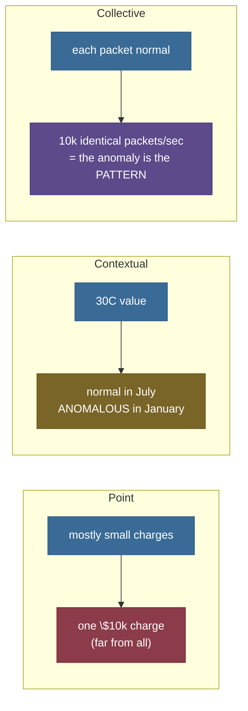
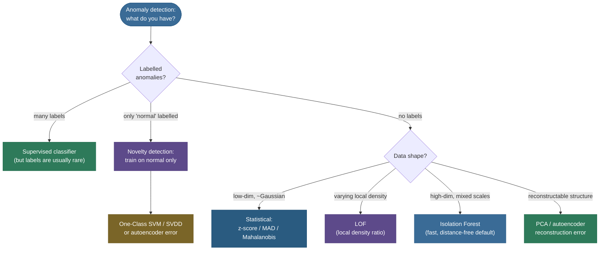

# Anomaly / Outlier Detection: finding the points that don't belong

A bank processes ten million card transactions a day. A few hundred are fraud. Nobody labelled them — by the time a chargeback comes back, the money is gone, and the fraudster has already changed tactics. You are handed the ten million points and asked to *flag the suspicious ones before they clear.* That is anomaly detection in one sentence: **find the rare points that don't conform to the bulk of the data**, usually with **few or no labels** to learn from.

The same shape recurs everywhere. A jet engine streams temperature and vibration; one bearing is about to fail and you have never seen *that specific* failure before. A datacenter emits a billion log lines; one is the start of an intrusion. A camera scans a thousand circuit boards a minute; one has a hairline solder crack.

In every case the **positives are rare** (often <1%), **the labels are scarce or absent**, and **the "anomaly" is whatever doesn't look like normal** — a definition by *negation*, not by a positive template. You can enumerate what "normal" looks like; you cannot enumerate all the ways a thing can go wrong, because the next anomaly is, by definition, one you haven't seen. That negation is what makes the problem its own discipline rather than a special case of classification — you're modelling the *complement* of a fuzzy, evolving "normal."

I'm going to teach this the way I'd walk a teammate through it before they pick a library.

We'll start with *what counts as an anomaly* and the three label-regimes that completely change your options. Then we'll build the **six method families** — statistical, distance/density, isolation, reconstruction, boundary, clustering — **deriving the math of each** so you understand *why* it flags what it flags, not just which `sklearn` class to import. Finally we'll cover the part everyone gets wrong: **evaluation under extreme imbalance**, where accuracy is a lie and PR-AUC is the truth.

By the end you'll be able to:

- distinguish **point**, **contextual**, and **collective** anomalies, and pick the right **label regime** (supervised / semi-supervised / unsupervised);
- derive and apply the **robust** statistics — the **modified z-score via MAD** and the **Mahalanobis distance** with its χ² threshold — and explain *why* they beat the naïve mean/σ;
- derive **LOF** from reachability distance → local reachability density → the density *ratio*, and say *why a ratio catches local anomalies a global threshold misses*;
- derive the **Isolation Forest** score from expected path length and the BST normalizer `c(n)`;
- explain **reconstruction** (PCA / autoencoder) and **boundary** (one-class SVM / SVDD) detectors;
- **evaluate** correctly under 1% base rates with **precision@k**, **ROC-AUC**, and especially **PR-AUC**, and set a threshold via **contamination**;
- choose a method from a decision table — and defend the choice.

> **Note:** "outlier detection" and "novelty detection" are *not* synonyms, and interviewers love the distinction. **Outlier detection** is unsupervised: the training set is *contaminated* with the anomalies you want to find, and you assume they're few and different. **Novelty detection** is semi-supervised: you train on a *clean* set of normal data only, then flag anything that deviates at test time. Same algorithms, different contract — and `sklearn` exposes it as the `novelty=True/False` flag on `LocalOutlierFactor`.

---

## Why it matters

Anomaly detection is one of the few unsupervised problems that is *directly* a business product, not a preprocessing step. Fraud prevention, intrusion detection, predictive maintenance, manufacturing quality control, medical monitoring, and infrastructure observability are all, underneath, "score every point by how unusual it is and act on the top of the list." That makes it a perennial interview topic — and a deceptively deep one, because the naïve framing ("just train a classifier") collapses the moment you notice you have **no labels** and a **1-in-10,000 base rate**.

The interview value is in *the framing*. The strong candidate doesn't reach for a method first; they ask three questions in order:

1. **What kind of anomaly** — point, contextual, or collective — because that decides whether a point scorer even applies, or whether you need a sequence/graph model.
2. **What label regime** — supervised, one-class, or fully unsupervised — because that decides the entire toolbox you're allowed to use.
3. **How will it be evaluated** — which, under extreme imbalance, immediately rules out accuracy and forces PR-AUC and precision@k.

Only *after* those three answers do you pick Isolation Forest vs LOF vs a statistical test — and you justify the pick from the data's geometry, not from habit. A candidate who names a library before asking these questions has skipped the actual job.

This page is organized to build exactly that reasoning chain: the anomaly *types*, the label *regimes*, the six *method families* with their math, the *evaluation* trap, and a *decision table* to tie it together. Master the chain and the specific algorithm almost picks itself.

---

## What counts as an anomaly: three flavours

Before any method, be precise about *what kind* of anomaly you're hunting — because a detector tuned for one is blind to another.

- **Point anomaly** — a single instance that is far from the rest, full stop. A \$10,000 charge on a card that never exceeds \$200. This is the default case, the simplest to reason about, and what *most* of the methods on this page target directly.
- **Contextual anomaly** — a point that is *only* anomalous **in context**. 30°C is normal in July and a five-sigma event in January; the value is identical, and it's the *context* (the month) that flips the verdict. You detect these by **conditioning on the context variable** — model "temperature *given* month" and score the deviation — rather than scoring the raw value in isolation.
- **Collective anomaly** — *individually* normal points that are anomalous **as a group**. A single packet to a server is unremarkable; ten thousand identical packets in one second is a DDoS attack. No single point is an outlier; the *pattern* — the correlation, the burst, the sequence — is. These need **sequence- or graph-aware** methods, not point scorers, which is why mis-framing one as a point problem is a classic failure.



> **Gotcha:** if you frame a *contextual* problem as a *point* problem — feeding the raw temperature to an Isolation Forest with no month feature — you will miss every January warm spell (the value is "normal" in the marginal distribution) and flag every July afternoon (a hot day looks extreme if you forgot it's summer). The fix is **feature engineering**: give the model the context (`month`, `hour`, `device_id`) so that "anomalous *given* the context" becomes an ordinary point anomaly in the *augmented* feature space. The model can't condition on context it can't see.

---

## The label regimes: what you have decides what you can do

The single biggest fork in the road is **how much labelling you have**, because it changes the whole toolbox.

- **Supervised** — you have labels for both normal *and* anomalous points. Now it's a (badly) imbalanced **classification** problem: train a classifier, evaluate with PR-AUC, handle imbalance with class weights / resampling / focal loss. This is the *best* regime when you can get there.

  But in practice anomaly labels are rare, **stale** (yesterday's fraud isn't today's), and **incomplete** (you only ever labelled the frauds you *caught* — the survivorship bias is brutal). So you rarely actually live here, and a model trained on it can be blind to novel attack patterns it never saw labelled.
- **Semi-supervised / one-class (novelty detection)** — you have a clean sample of **normal** data only, and *no* anomaly labels. You learn a model of "normal" and flag deviations.

  This is the sweet spot for **monitoring** a healthy system — a working engine, a fraud-free account history, a known-good network baseline — and is where **One-Class SVM**, **SVDD**, and **autoencoder reconstruction error** shine. The contract is "I know what healthy looks like; tell me when it stops."
- **Unsupervised** — **no labels at all.** You assume only two things: anomalies are **few** (a small fraction of the data) and **different** (they sit in low-density / easily-isolated regions).

  Everything else — Isolation Forest, LOF, statistical scores, DBSCAN noise — lives here. It's the most common real *starting* point (you almost always begin with no labels) and the focus of this page.

> **Tip:** the two assumptions of the unsupervised regime — *few* and *different* — are load-bearing. If anomalies are **not rare** (say 30% of your data), you don't have anomalies, you have **two clusters**, and you should be clustering. If they're rare but **not different** (they look statistically identical to normal points), no unsupervised method on earth can find them — you need a label or a better feature.

---

## Family 1: Statistical methods — model "normal", flag the tails

The oldest and still the first thing to try when your data is low-dimensional and roughly unimodal: **fit a distribution to "normal", then flag points in its tails.**

### The z-score and why it breaks

The textbook move is the **z-score**: standardize each point by the sample mean and standard deviation,

$$z_i = \frac{x_i - \bar{x}}{s}, \qquad \bar{x} = \frac{1}{n}\sum_i x_i, \quad s = \sqrt{\frac{1}{n}\sum_i (x_i - \bar{x})^2},$$

and flag $|z_i| > 3$ (roughly the 99.7% point of a Gaussian). Clean, fast, and **dangerously fragile**, because *the outlier you're hunting corrupts the very statistics you're using to find it.*

Watch the corruption happen. The mean $\bar{x}$ is pulled *toward* the outlier, so the numerator $x_i - \bar{x}$ shrinks. The standard deviation $s$ is *inflated* by the outlier (it's a squared deviation — the outlier contributes enormously), so the denominator grows. Both effects push the outlier's own z-score *down*, toward the threshold it's supposed to blow past.

With *several* outliers this compounds into **masking**: they collectively inflate $s$ so much that none of them crosses the threshold, and they effectively hide each other behind the spread they themselves created.

Here is the failure, by hand. Take $x = \{10, 11, 12, 10, 11, 13, 12, 11, 60, 58\}$ — two obvious outliers at 60 and 58. Then $\bar{x} = 20.8$ and $s = 19.12$, so the z-score of 60 is

$$z_{60} = \frac{60 - 20.8}{19.12} = \mathbf{2.05} \;<\; 3.$$

**The classic rule misses it.** The 58 and 60 inflated $s$ to 19, and now neither is "3 sigma" from a mean they themselves dragged up to 20.8. This is not a contrived edge case; it is what *always* happens when outliers cluster.

### The robust fix: the modified z-score via MAD

The cure is to replace the **non-robust** mean and standard deviation with **robust** estimators that the outliers can't corrupt: the **median** (its breakdown point is 50% — half the data must be bad before it moves) and the **MAD**, the **median absolute deviation**:

$$\text{MAD} = \operatorname{median}_i\big(\,|x_i - \operatorname{median}(x)|\,\big).$$

MAD is the median of the absolute distances to the median — a spread measure that ignores the tails entirely. To use it like a standard deviation, we need to rescale it, and here the magic constant **0.6745** appears. For data that is *normal*, the MAD converges to $\sigma \cdot \Phi^{-1}(0.75)$, where $\Phi^{-1}$ is the inverse normal CDF. Why 0.75? Because the MAD is, by construction, the value $m$ such that **half** the probability mass lies within $m$ of the median — i.e. it's the **0.75 quantile of the absolute deviation**, splitting the upper half. For a standard normal, $\Phi^{-1}(0.75) = 0.6745$, so $\text{MAD} \approx 0.6745\,\sigma$, hence $\sigma \approx \text{MAD}/0.6745$. The **modified z-score** (Iglewicz & Hoaglin) bakes that conversion in:

$$M_i = \frac{0.6745\,(x_i - \operatorname{median}(x))}{\text{MAD}}, \qquad \text{flag } |M_i| > 3.5.$$

Run it on the same data: $\operatorname{median} = 11.5$, $\text{MAD} = 1.0$, so

$$M_{60} = \frac{0.6745\,(60 - 11.5)}{1.0} = \mathbf{32.71} \;\gg\; 3.5.$$

The robust score is **33** where the classic score was **2** — a 16× difference, all because the median and MAD refused to be dragged around by the very points we wanted to catch. Side by side:

| Statistic | Classic (mean / σ) | Robust (median / MAD) |
|---|---|---|
| Centre | mean = 20.8 (pulled up by 60, 58) | median = 11.5 (unmoved) |
| Spread | σ = 19.12 (inflated by outliers) | MAD = 1.0 (ignores tails) |
| Score of 60 | z = **2.05** (< 3 → **missed**) | modified-z = **32.71** (≫ 3.5 → **flagged**) |
| Breakdown point | 0% (one bad point corrupts it) | 50% (half must be bad) |

**This is the single most useful 1-D anomaly idea**: when in doubt, go robust. The mean and σ have a **breakdown point of 0%** — a *single* arbitrarily-large point can drag them anywhere — while the median and MAD have a breakdown point of **50%**, the theoretical maximum: you'd need to corrupt *half* the data before they move meaningfully. For finding the few bad points among many good ones, that robustness is exactly the property you want.

> **Note:** the 0.6745 is *only* the right constant under a normal model. The principle generalizes — divide the MAD by the appropriate quantile of *your* assumed distribution — but in practice the normal-derived 0.6745 is used almost universally because it's a scale factor, and getting it slightly wrong just shifts your threshold, not your ranking.

> **Tip:** **Grubbs' test** is the formal, hypothesis-test version of the z-score outlier rule: it computes $G = \max_i |x_i - \bar{x}| / s$ and compares it to a critical value derived from the $t$-distribution, giving you a *p-value* for "the most extreme point is an outlier." It's principled for **one** outlier in approximately-normal data but inherits the z-score's masking weakness for multiple outliers — which is exactly why robust methods exist.

### Going multivariate: the Mahalanobis distance

In one dimension "far from the mean" is unambiguous. In many dimensions, **Euclidean distance lies**, because features have different scales *and are correlated*.

Imagine height and weight. A 2-metre person weighing 60 kg is anomalous not because either number is extreme on its own — there are 2-metre people and there are 60 kg people — but because the *combination* breaks the height–weight correlation (tall people are almost never that light). Euclidean distance, which treats the axes as independent and equally scaled, is blind to that correlation; it would happily call a 2 m / 60 kg point "normal" if both values are individually within range.

The **Mahalanobis distance** fixes both at once by measuring distance **in units of the data's own covariance**:

$$D_M(x) = \sqrt{(x - \mu)^{\top}\, \Sigma^{-1}\, (x - \mu)},$$

where $\mu$ is the mean vector and $\Sigma$ the covariance matrix. The $\Sigma^{-1}$ does the work: it **whitens** the space — rotating onto the principal axes and rescaling each to unit variance — so that "one unit" of Mahalanobis distance means "one standard deviation *along that direction of the data's spread*." A step along the correlation ridge costs little; the same-length step *across* it costs a lot. (If $\Sigma = I$, $D_M$ collapses back to plain Euclidean distance — Euclidean is the special case where you *assume* uncorrelated, unit-variance features.)

The payoff is a **principled threshold** — and this is where Mahalanobis beats every ad-hoc distance cutoff. If the normal data is multivariate Gaussian, then the *squared* Mahalanobis distance $D_M^2$ follows a **chi-square distribution with $d$ degrees of freedom**, where $d$ is the number of features. (Intuitively: after whitening, $D_M^2$ is a sum of $d$ independent squared standard-normals, which is the textbook definition of a $\chi^2_d$.)

That gives you a threshold with a *meaning*: pick a false-positive rate, look up the matching $\chi^2_d$ quantile, and flag any point above it. For $d = 2$ at the 95% level, $\chi^2_{2,\,0.95} = 5.991$, so you flag $D_M^2 > 5.991$, i.e. $D_M > \sqrt{5.991} = 2.45$ — and you *know* this nominally lets through 5% of normal points, rather than guessing at a raw distance cutoff.

The diagram below shows *why this matters*. Two test points sit at the **same Euclidean distance** (3.20) from the mean of a correlated cloud. The one **along** the correlation ridge has $D_M = 1.38$ — comfortably inside the 95% ellipse, a normal point. The one **across** the ridge has $D_M = 4.13$ — far outside it, a clear anomaly. Same Euclidean distance, opposite verdicts. That's the whole reason to whiten.


Let's see the χ² verdict come out of the algebra by hand. Take the covariance from the figure, $\Sigma = \left[\begin{smallmatrix}3.0 & 2.4\\ 2.4 & 3.0\end{smallmatrix}\right]$, centred at the origin. Its inverse is

$$\Sigma^{-1} = \frac{1}{\det \Sigma}\begin{pmatrix}3.0 & -2.4\\ -2.4 & 3.0\end{pmatrix} = \frac{1}{3.24}\begin{pmatrix}3.0 & -2.4\\ -2.4 & 3.0\end{pmatrix} = \begin{pmatrix}0.926 & -0.741\\ -0.741 & 0.926\end{pmatrix},$$

since $\det\Sigma = 3.0^2 - 2.4^2 = 9 - 5.76 = 3.24$. Now take the **across-axis** point $x = (2.263,\,-2.263)$ (Euclidean distance $3.20$ from the origin). The squared Mahalanobis distance expands as

$$D_M^2 = x^\top \Sigma^{-1} x = 0.926\,(x_1^2 + x_2^2) - 2(0.741)\,x_1 x_2 = 0.926(10.24) - 1.482(-5.12) = \mathbf{17.07},$$

so $D_M = \sqrt{17.07} = 4.13$. The cross term $-1.482\,x_1 x_2$ is the whole story: because $x_1$ and $x_2$ have *opposite* signs (the point cuts *across* the positive correlation), that term is **positive and large**, inflating the distance. The **along-axis** point $(2.263,\,2.263)$ has the same $x_1^2 + x_2^2$ but a *negative* cross term ($x_1 x_2 > 0$), which *cancels* most of the distance, giving $D_M^2 = 1.90$, $D_M = 1.38$. Compare each to the 95% χ² boundary $D_M^2 > 5.991$: the across point (17.07) is flagged, the along point (1.90) is not — **identical Euclidean distance, opposite verdicts**, falling straight out of the sign of one cross term.

> **Gotcha:** the *sample* $\mu$ and $\Sigma$ are themselves wrecked by outliers (same corruption problem as the mean and σ). For honest multivariate detection, estimate them **robustly** — `sklearn`'s `EllipticEnvelope` uses the **Minimum Covariance Determinant (MCD)** estimator, which finds the tightest subset of points and fits the covariance to *them*, ignoring the contamination. Plain Mahalanobis with sample covariance has the same masking failure as the plain z-score, one dimension up.

---

## Family 2: Distance and density — outliers live where it's empty

Statistical methods assume a *global* shape. Distance and density methods drop that assumption and ask a purely local question: **how crowded is this point's neighbourhood?**

### k-NN distance

The simplest density proxy: a point's anomaly score is its **distance to its $k$-th nearest neighbour** (or the average distance to its $k$ nearest). Points deep inside a cluster have tiny $k$-NN distances; isolated points in empty regions have large ones. Rank by that distance, flag the top fraction, done.

It's intuitive, needs only a distance metric, and works well **when all your normal clusters have *similar* density.** But that assumption is precisely where it breaks — and that failure is the entire reason LOF was invented. Let's see exactly how it fails.

### Why a global threshold fails: the local-density problem

Suppose your normal data has **two clusters of different density** — a tight one and a loose one. Think of a busy downtown and a rural area: both are legitimately populated, just at different densities, and a point in either is perfectly normal.

Now place a point in the *fringe* of the tight cluster. It's clearly anomalous *relative to its dense neighbourhood* — it's a gap in the crowd. Yet its absolute $k$-NN distance can be **smaller** than that of a perfectly normal point sitting inside the loose rural cluster, where everyone is naturally far apart.

**Any single global distance threshold is now impossible.** Set it low enough to catch the local outlier and you drown in false positives from the legitimately-sparse cluster (every rural point looks "isolated"). Set it high enough to spare the sparse cluster and the local outlier sails right through. There is *no* global cutoff that separates them — the information you need is *local contrast*, and a single number can't carry it.

The measured figure makes this concrete with real numbers.

The "local outlier" (red star) sits just outside a dense cluster; its nearest-neighbour distance is **0.62**. A perfectly normal point sitting inside the *sparse* cluster has a nearest-neighbour distance of **0.87** — *larger* than the outlier's.

So a global distance threshold low enough to flag the 0.62 outlier would *also* flag the 0.87 inlier, and every other sparse-cluster point besides. Global distance is simply the wrong ruler for this data — it has no way to express "unusual *for around here*."


### LOF: the local outlier factor, derived

**LOF** (Breunig, Kriegel, Ng & Sander, 2000) solves the local-density problem with one decisive move: make the score a **ratio** instead of an absolute distance. The question it asks is *"how much sparser is this point's neighbourhood than its neighbours' neighbourhoods?"* — and because it's a ratio, the absolute density of the region cancels out, leaving only the *local contrast* that the global threshold couldn't capture.

It's built in three layers, each defined in terms of the last. Let's derive them in order.

**Step 1 — reachability distance.** Define the **$k$-distance** of a point $b$, written $d_k(b)$, as the distance from $b$ to its $k$-th nearest neighbour. Then the **reachability distance** of $a$ *from* $b$ is

$$\text{reach-dist}_k(a, b) = \max\big(\,d_k(b),\; d(a, b)\,\big).$$

It's the true distance $d(a,b)$, **floored** at $b$'s own $k$-distance. Why floor it?

To **smooth out statistical noise.** If $a$ happens to be one of $b$'s very close neighbours, using the raw tiny distance would make $b$'s density estimate jump around wildly — one near-duplicate point could spike the apparent density. Flooring every distance at $d_k(b)$ stabilizes the estimate: all points inside $b$'s $k$-neighbourhood are treated as "at least $k$-distance away," so the density depends on the *neighbourhood scale*, not on the luck of one very-close point.

(Note the floor makes reach-dist deliberately *asymmetric*: reach-dist$(a,b) \ne$ reach-dist$(b,a)$ in general, because it uses $b$'s $k$-distance, not $a$'s. This asymmetry is intentional and correct — density is being measured *from the perspective of* $b$.)

**Step 2 — local reachability density (lrd).** The density at $a$ is the **inverse of the average reachability distance** from $a$ to its $k$ neighbours $N_k(a)$:

$$\text{lrd}_k(a) = \left( \frac{1}{|N_k(a)|} \sum_{b \in N_k(a)} \text{reach-dist}_k(a, b) \right)^{-1}.$$

Read it plainly: if $a$'s neighbours are *far* (big average reach-dist), lrd is *small* — sparse neighbourhood. If they're close, lrd is large — dense neighbourhood. It's a density estimate, nothing more.

**Step 3 — LOF, the density ratio.** Finally, the LOF of $a$ is the **average ratio of its neighbours' density to its own**:

$$\text{LOF}_k(a) = \frac{1}{|N_k(a)|} \sum_{b \in N_k(a)} \frac{\text{lrd}_k(b)}{\text{lrd}_k(a)}.$$

This is the whole trick. If $a$ is **as dense as its neighbours**, the ratios are ≈1 and $\text{LOF} \approx 1$ — normal. If $a$ sits in a **relatively sparse pocket** while its neighbours are in denser regions, then $\text{lrd}_k(b) \gg \text{lrd}_k(a)$, the ratios blow up, and $\text{LOF} \gg 1$ — flagged.

Because it's a *ratio*, the absolute density of the region **divides out**. A point in a sparse-but-uniform cluster has LOF ≈ 1 — its neighbours are equally sparse, so the contrast is zero. A point that is *locally* anomalous gets a high LOF *regardless* of whether it lives in the dense or the sparse region, because the comparison is always against its *own* neighbourhood. **That is precisely what "local" means**, and it's exactly what a single global distance threshold could never do — the global threshold has no notion of "relative to *here*."

The price of this locality is **two parameters and a cost**. The neighbourhood size $k$ (`n_neighbors`) sets the scale of "local" — too small and LOF reacts to single-point noise, too large and it blurs back toward a global view. And computing the $k$ nearest neighbours for every point is $O(n^2)$ naïvely (or $O(n \log n)$ with a spatial index that degrades in high dimensions), so LOF doesn't scale to millions of points the way Isolation Forest does. LOF is the precision instrument for *local-density* problems at moderate $n$; it is not the default sledgehammer.

> **Note:** the rule of thumb is **LOF ≈ 1 → inlier, LOF substantially > 1 (say > 1.5) → outlier**, but there's no universal cutoff — LOF gives you a *ranked score*, and you set the threshold from your contamination budget. The cleanest interpretation is a *ratio*: "this point's neighbourhood is 2.3× sparser than its neighbours'."

### LOF by hand on a tiny set

Let's compute it on five 1-D points so the algebra is fully visible, with nothing hidden behind a library call. The points: $A{=}0,\ B{=}1,\ C{=}2$ form a tight trio, and $D{=}5,\ E{=}6$ form a looser pair off to the side. We use $k = 2$ neighbours throughout.

First the $k$-distances — each point's distance to its 2nd nearest neighbour: $d_2(A){=}2,\ d_2(B){=}1,\ d_2(C){=}2,\ d_2(D){=}3,\ d_2(E){=}4$.

Now the local reachability densities, using reach-dist floored at each neighbour's $k$-distance:

- $A$'s 2 nearest are $B,C$: reach-dist$(A,B)=\max(1,1)=1$, reach-dist$(A,C)=\max(2,2)=2$; avg $=1.5$, so $\text{lrd}(A)=0.667$.
- By the same arithmetic $\text{lrd}(B)=0.5$, $\text{lrd}(C)=0.667$, $\text{lrd}(D)=0.286$, $\text{lrd}(E)=0.286$.

Then LOF as the neighbour-density ratio:

- $\text{LOF}(A) = \tfrac{1}{2}\big(\tfrac{\text{lrd}(B)}{\text{lrd}(A)} + \tfrac{\text{lrd}(C)}{\text{lrd}(A)}\big) = \tfrac{1}{2}\big(\tfrac{0.5}{0.667}+\tfrac{0.667}{0.667}\big) = \mathbf{0.875}$ — inlier.
- $\text{LOF}(D) = \tfrac{1}{2}\big(\tfrac{\text{lrd}(C)}{\text{lrd}(D)}+\tfrac{\text{lrd}(E)}{\text{lrd}(D)}\big) = \tfrac{1}{2}\big(\tfrac{0.667}{0.286}+\tfrac{0.286}{0.286}\big) = \mathbf{1.667}$ — flagged.

$D$ scores 1.667 because its neighbour $C$ (sitting in the dense trio) is **2.3× denser** than $D$ is — the bridge point between the two clusters is exposed as locally anomalous, even though in *absolute* terms $D$ isn't the most isolated point in the set. The dense trio members $A$ and $C$ score **0.875** (< 1), correctly read as comfortable inliers.

These hand numbers match `sklearn`'s `LocalOutlierFactor` to three decimals (verified in the code section below — the library computes exactly this). That is LOF, end to end, with nothing hidden: $k$-distance → reachability distance → local reachability density → the neighbour-density ratio.

---

## Family 3: Isolation — anomalies are easy to separate

LOF and friends *model density*, which is expensive in high dimensions (the curse of dimensionality wrecks distances) and needs a metric. **Isolation Forest** (Liu, Ting & Zhou, 2008) throws all of that out with a beautifully contrarian idea: **don't model normal at all — just measure how hard each point is to isolate with random cuts.**

### The intuition: isolation depth

Build a tree by repeatedly picking a **random feature** and a **random split value** between that feature's min and max, partitioning the points, and recursing — until every point is alone in its own leaf. Now ask: how many splits did it take to isolate a given point?

**Anomalies isolate fast.** A point far from the pack gets fenced off by the first one or two random cuts, because there's lots of empty space around it for a random split to land in. A normal point buried in a dense cluster needs *many* cuts to carve out, because every random split has lots of neighbours to keep on the same side as it.

**Shorter expected path length ⇒ more anomalous.** That's the entire principle — and notice what it *doesn't* need: no distance metric, no density estimate, no assumption about the shape of "normal." It scales linearly in the number of points and, counter-intuitively, gets *better* in high dimensions, where there's even more empty space for anomalies to hide in and thus more room for a random split to isolate them quickly. This is the exact opposite of LOF's curse-of-dimensionality problem, and it's why Isolation Forest is the high-dimensional default.

The measured figure proves it directly.

A planted outlier is isolated in an average of **2.1** random splits across 400 trees. A point at the centre of the normal cloud needs **12.1** splits to fence off. That **6× gap** in isolation depth is the raw signal; the score (below) just normalizes it into a bounded number. No distances were computed anywhere — only random cuts and counting.


### Deriving the score

The raw path length $h(x)$ — the number of edges from root to the point's leaf — isn't directly comparable across datasets of different size: a tree built on a million points is naturally deeper than one built on a hundred, so "depth 8" means different things in each.

To make the score scale-free, we **normalize the path length by the expected path length of an unsuccessful search in a binary search tree.** This is the right yardstick because an isolation tree *is* structurally a random BST — points partition into left/right subtrees by random splits — so its average leaf depth grows the same way a random BST's does. That expected depth for $n$ points is

$$c(n) = 2H(n-1) - \frac{2(n-1)}{n},$$

where $H(i) = \ln(i) + \gamma$ is the $i$-th harmonic number ($\gamma \approx 0.5772$, the Euler–Mascheroni constant). The first term $2H(n-1)$ is the classic expected unsuccessful-search depth in a random BST; the second corrects for the tree's finite size. $c(n)$ is the *yardstick*: "this is how deep an average point sits in a tree of $n$ points."

The anomaly score for a point is then

$$s(x, n) = 2^{-\,\dfrac{E[h(x)]}{c(n)}},$$

where $E[h(x)]$ is the path length **averaged over all the trees** in the forest. Read the exponent: it's the point's actual depth measured *in units of* the average depth. The negative exponent and base-2 give a clean, bounded interpretation:

- $E[h(x)] \to 0$ (isolated almost immediately) ⇒ exponent $\to 0$ ⇒ $s \to 2^0 = \mathbf{1}$ — **definitely an anomaly.**
- $E[h(x)] = c(n)$ (exactly average depth) ⇒ exponent $= -1$ ⇒ $s = 2^{-1} = \mathbf{0.5}$ — **borderline.**
- $E[h(x)] \to n$ (very hard to isolate) ⇒ $s \to \mathbf{0}$ — **definitely normal.**

So $s$ near **1** is anomalous, near **0.5** is ambiguous, near **0** is normal — a single, dataset-independent scale. (`sklearn` returns the *negated, shifted* version via `score_samples`/`decision_function`, where higher = more normal, but it's the same quantity underneath.)

Let's put numbers on it for the default subsample size $n = 256$. The harmonic number $H(255) = \ln(255) + 0.5772 = 6.12$, so

$$c(256) = 2(6.12) - \frac{2 \cdot 255}{256} = 12.24 - 1.99 = \mathbf{10.24}.$$

That 10.24 is the *average* leaf depth in a 256-point isolation tree. Now score three points by their measured average depth $E[h(x)]$:

- a point isolated in **3** splits → $s = 2^{-3/10.24} = 2^{-0.293} = \mathbf{0.816}$ — well above 0.5, **anomaly**.
- a point at exactly average depth **10.24** → $s = 2^{-1} = \mathbf{0.500}$ — borderline, by construction.
- a deep interior point at depth **12** → $s = 2^{-12/10.24} = \mathbf{0.444}$ — below 0.5, **normal**.

The 6× depth gap from the measured diagram (2.1 vs 12.1) maps directly onto this scale: the shallow point lands near 0.8 (clearly flagged), the deep one near 0.44 (clearly normal), with no dataset-specific tuning of the *scale* — only the *cut* (contamination) is yours to set.

> **Tip:** each tree is built on a **subsample** (default 256 points), not the whole dataset. This isn't just for speed — small subsamples *reduce* two pathologies called **swamping** (normal points wrongly flagged because a huge dense region makes everything look shallow) and **masking** (a clump of anomalies hiding each other). Subsampling keeps each tree's view of "normal" tight, so anomalies stand out. It's why Isolation Forest is **sub-linear per tree** and embarrassingly parallel.

> **Note:** the original Isolation Forest cuts **axis-parallel** (one feature at a time), which can leave "blind spots" along diagonals. **Extended Isolation Forest** (Hariri et al., 2019) cuts with random *hyperplanes* of arbitrary orientation, removing that bias — worth knowing as the modern refinement.

---

## Families 4–6: reconstruction, boundary, and clustering

Three more families round out the toolbox. None is the universal default, but each is the *clearly correct* answer in a specific situation — reconstruction for learnable high-dimensional structure, boundary methods for clean one-class novelty, clustering for when you're already clustering. Knowing *which situation* is the skill.

### Reconstruction error (PCA, autoencoders)

The idea in one line: **learn to compress and rebuild *normal* data, then flag whatever rebuilds badly.**

Fit a model that maps $x \to \hat{x}$ through a **bottleneck** narrow enough that it can only capture the dominant structure of normal data — it's forced to throw away detail and keep only the patterns that recur. Normal points, made of those recurring patterns, survive the round-trip intact. Anomalies, which *don't* share that structure, come back distorted. The anomaly score is simply the **reconstruction error** $\lVert x - \hat{x}\rVert^2$.

- **PCA** is the linear version: project onto the top-$k$ principal components (the directions of greatest variance in normal data) and reconstruct. A normal point lies near that subspace and reconstructs well; an anomaly has large variance in the *discarded* components and reconstructs poorly. The squared reconstruction error is exactly the point's distance to the principal subspace.

  There's a lovely connection here: PCA reconstruction error and Mahalanobis distance are two views of the same idea. Mahalanobis whitens *all* directions and measures total distance; PCA reconstruction error measures distance only in the *minor* (discarded, low-variance) directions — which are exactly where anomalies that "break the correlation structure" stick out. Both ask "how much does this point violate the covariance of normal data?", just with different weightings.
- **Autoencoders** are the non-linear version: a neural network with an encoder $x \to z$ (a low-dimensional latent) and a decoder $z \to \hat{x}$, trained to minimize reconstruction loss **on normal data only**. Because it only ever learned to rebuild normal patterns, it fumbles anomalies, and the error spikes. This is the workhorse for **high-dimensional, structured** data — images, sensor multivariate time series, network flows — where a linear subspace is too crude.

> **Gotcha:** reconstruction detectors are **semi-supervised** by nature — they assume the training data is (mostly) clean normal. If your training set is contaminated with anomalies, the model *learns to reconstruct them too*, and they stop being anomalous. Either clean the training set or accept that you're doing contaminated outlier detection, not novelty detection. Also: a sufficiently large autoencoder can learn the identity function and reconstruct *everything* well — the bottleneck (or regularization, like a denoising or variational objective) is what forces it to learn *structure* rather than copy.

### Boundary methods: One-Class SVM and SVDD

Instead of *modelling density* (how crowded is it here?), boundary methods take a more direct route: **wrap a tight boundary around the entire normal region and flag whatever falls outside it.** You don't need to estimate a density everywhere — you only need to learn where "normal" ends.

- **One-Class SVM** (Schölkopf et al., 2001) generalizes the SVM to the unlabelled case. It finds a hyperplane — in a kernel-induced feature space — that separates the normal data from the **origin** with maximum margin. The kernel (usually RBF) lets that flat separator in feature space correspond to a curved, tight boundary in the original input space, wrapping the normal region.

  Its hyperparameter $\nu \in (0,1]$ is elegantly doubly-meaningful: it simultaneously **upper-bounds the fraction of training points allowed to be outliers** and **lower-bounds the fraction that become support vectors**. So you set $\nu$ directly to your expected contamination rate — it *is* the contamination knob. The RBF $\gamma$ then controls how tightly the boundary hugs the data: too high and it overfits, drawing a bubble around each point; too low and it's a loose, useless blob.
- **SVDD** (Support Vector Data Description, Tax & Duin, 2004) is the close cousin. Instead of separating the data from the origin, it finds the **smallest hypersphere** (in kernel feature space) that encloses the normal data, and flags anything falling outside the sphere. With the RBF kernel the two formulations turn out to be essentially equivalent.

  SVDD's mental model is the cleaner one to carry into an interview: *fit the tightest possible bubble around "normal"; anything outside the bubble is an anomaly.* It's One-Class SVM described geometrically rather than as a margin from the origin.

### The One-Class SVM dual, and where the ν-property comes from

The doubly-meaningful $\nu$ isn't magic — it falls straight out of the optimization, and deriving it is the kind of thing that distinguishes a deep answer. Schölkopf's **primal** problem maps each point to feature space via $\phi(\cdot)$ and finds the maximum-margin hyperplane $w^\top \phi(x) = \rho$ separating the data from the origin, allowing slack $\xi_i \ge 0$ for points on the wrong side:

$$
\min_{w,\,\rho,\,\xi}\ \frac{1}{2}\lVert w\rVert^2 \;+\; \frac{1}{\nu n}\sum_{i=1}^{n}\xi_i \;-\; \rho
\qquad\text{s.t.}\quad w^\top\phi(x_i) \ge \rho - \xi_i,\ \ \xi_i \ge 0.
$$

Read the objective: maximize the margin $\rho/\lVert w\rVert$ from the origin (the $-\rho$ term pushes $\rho$ up, $\tfrac12\lVert w\rVert^2$ regularizes), while the $\frac{1}{\nu n}\sum \xi_i$ penalty buys forgiveness for the $\xi_i > 0$ points that fall **outside** the margin — the ones we'll call outliers. The constant $\frac{1}{\nu n}$ is where $\nu$ enters.

Forming the Lagrangian and eliminating the primal variables gives the **dual** — a clean quadratic program in multipliers $\alpha_i$, with the kernel $K(x_i,x_j)=\phi(x_i)^\top\phi(x_j)$ replacing every inner product (the kernel trick):

$$
\min_{\alpha}\ \frac{1}{2}\sum_{i,j}\alpha_i\alpha_j K(x_i,x_j)
\qquad\text{s.t.}\quad \mathbf{0 \le \alpha_i \le \tfrac{1}{\nu n}},\ \ \sum_i \alpha_i = 1.
$$

The two constraints are the whole story. The **box constraint** $0 \le \alpha_i \le \frac{1}{\nu n}$ caps how much any single point can pull on the boundary, and the **equality** $\sum_i \alpha_i = 1$ forces the multipliers to sum to one. Now count:

- A point **strictly outside** the margin (a margin error, $\xi_i > 0$) is pinned at the cap $\alpha_i = \frac{1}{\nu n}$. Since the $\alpha_i$ sum to 1 and each capped point contributes $\frac{1}{\nu n}$, there can be **at most $\nu n$** such points — so the **fraction of outliers is $\le \nu$**.
- A point **strictly inside** the boundary has $\alpha_i = 0$ and is *not* a support vector. Every point that *is* a support vector ($\alpha_i > 0$) is either on or outside the margin, and the same sum-to-one arithmetic forces **at least $\nu n$** of them — so the **fraction of support vectors is $\ge \nu$**.

That is the celebrated **ν-property**, derived: $\nu$ is *simultaneously* an upper bound on the outlier fraction and a lower bound on the support-vector fraction. It's not a heuristic — it's a counting consequence of the box constraint $\frac{1}{\nu n}$ and the normalization $\sum\alpha_i=1$. (SVDD's dual is the same QP up to a constant when the kernel is translation-invariant like the RBF, $K(x,x)=1$ — which is *why* the two methods coincide for the RBF kernel, as claimed above.)

**Measured — the ν-property is tight.** Fit a One-Class SVM (RBF) on 1,000 clean 2-D normal points and sweep $\nu$:

| $\nu$ | fraction flagged outside (margin errors) | fraction that are support vectors |
|---|---|---|
| 0.01 | 0.020 | 0.023 |
| 0.05 | 0.049 | 0.055 |
| 0.10 | 0.098 | 0.103 |
| 0.20 | 0.199 | 0.203 |

Exactly as the derivation predicts: the **outlier fraction sits just below $\nu$** (the upper bound) and the **support-vector fraction just above $\nu$** (the lower bound), bracketing it tightly at every setting. This is *why* you set $\nu$ directly to your contamination budget — it controls the flagged fraction almost exactly. (Reproduced in the code section's note.)

> **Note:** One-Class SVM is **acutely sensitive to feature scaling** — it's a distance-based kernel method, so always standardize first — and to its $\nu$ and $\gamma$ hyperparameters. It also scales poorly, roughly quadratic in $n$, and tends to be **outperformed by Isolation Forest** on large, high-dimensional data. That combination is why Isolation Forest is the modern default and One-Class SVM is now mostly reserved for *smaller, clean, one-class novelty* problems where its tight kernel boundary shines and the $n^2$ cost is affordable.

### Clustering-based

If you've already clustered the data, anomalies fall out as a by-product:

- **DBSCAN noise points.** DBSCAN labels points in low-density regions as **noise** (label `-1`), and *that label is itself anomaly detection.* A point that joins no dense cluster is, by DBSCAN's own definition, an outlier — you get the anomaly flag for free as a by-product of the clustering, with no separate scoring step. (See the [DBSCAN page](../03-DBSCAN/03-DBSCAN.md) for how the noise label is derived from `eps` and `min_samples`.)
- **Distance to nearest centroid.** After K-Means, score each point by its distance to its assigned centroid; the far-from-any-centroid points are candidates. Cheap, but inherits K-Means' assumptions (spherical, similar-size clusters) and its sensitivity to the outliers it's trying to find.

---

## Putting them side by side: the measured comparison

Theory is cheap; let's *measure* it.

The figure below runs **Isolation Forest, LOF, and One-Class SVM** on the **same** 2-D dataset — two normal Gaussian blobs plus 20 uniformly-scattered planted outliers — and draws each method's learned boundary around "normal" (the solid contour). Because the outliers are *planted*, we know the ground truth and can score each detector honestly. The number that matters is the **PR-AUC** at recovering those planted outliers (the next section derives *why* PR-AUC and not accuracy).


On this particular dataset the scores come out **LOF 0.800, One-Class SVM 0.753, Isolation Forest 0.738** — all far above the random baseline of 0.083 (the positive rate), and close enough that *the choice between them is dataset-dependent, not absolute.*

LOF edges ahead *here* because the two blobs have slightly different densities and the planted outliers are genuinely *local* relative to them — exactly LOF's home turf. Change the geometry and the ranking changes: on higher-dimensional data with no reliable metric, LOF's distances concentrate and Isolation Forest pulls ahead; on a clean single-mode normal set, One-Class SVM's tight boundary can win.

**So the lesson isn't "LOF wins."** It's "**measure on *your* data with PR-AUC**, because the ranking flips with the geometry — and when in doubt, ensemble all three." Anyone who tells you one detector is universally best hasn't run this experiment on enough datasets.

---

## Evaluation under extreme imbalance: why accuracy is a lie

This is the part interviewers probe hardest, because it's where naïve practitioners faceplant.

**With a 1% anomaly rate, a model that predicts "normal" for everything scores 99% accuracy** — and catches exactly zero anomalies. That degenerate model would pass any accuracy-based bar with flying colours while being completely worthless. Accuracy is not merely unhelpful here; it is *actively misleading*, because it rewards the model for ignoring the only points you care about. The 99% looks like an A-grade and means an F. Throw accuracy out for imbalanced detection and never look back.

What to use instead, and *why*:

- **Precision and recall**, not accuracy. **Recall** (a.k.a. detection rate / true-positive rate) = of the true anomalies, how many did we catch? **Precision** = of the points we flagged, how many were really anomalies?

  These two trade off against each other, and the right balance is a **business decision**, not a statistical one. Missing fraud (low recall) costs money directly; false alarms (low precision) burn analyst hours and erode trust in the system. A medical screen wants high recall (don't miss a tumour); a costly-to-investigate fraud queue wants high precision (don't waste analysts). Pick the operating point deliberately and own the trade-off.
- **Precision@k.** In most real deployments a human (or a downstream automated action) can only handle the **top $k$** alerts a day — analysts are finite. So the metric that matches operational reality is **precision@k**: of your $k$ highest-scored points, how many are genuinely anomalous?

  It answers the only question your operations team actually asks: *"is my alert queue worth working through?"* A detector with mediocre overall recall but excellent precision@50 can be far more valuable than a high-recall detector that buries the real hits under noise.
- **ROC-AUC** summarizes the recall-vs-false-positive-rate trade-off across all thresholds. It's threshold-free and genuinely useful for *ranking* — but it has a **trap under heavy imbalance**. The false-positive *rate* is $\text{FP}/(\text{FP}+\text{TN})$, and with a huge normal class the denominator is enormous, so even *thousands* of false alarms barely nudge it. ROC-AUC can read a flattering 0.95 while your actual alert queue is 95% false positives. The metric is computed on a quantity (FPR) your operations team doesn't experience.
- **PR-AUC (average precision)** is the one to lead with under imbalance. The precision-recall curve plots precision against recall, and the crucial difference is the denominator: **precision is $\text{TP}/(\text{TP}+\text{FP})$ — its denominator is the points you *flagged*, not the giant normal class.** So every false positive *directly* lowers precision; the metric *feels* the garbage in your queue.

  And the PR baseline isn't a fixed 0.5 — it's the **positive rate** itself (0.083 in our comparison, ~0.01 in real fraud), so even a small PR-AUC can be a large *lift over baseline*. When positives are rare, **PR-AUC is the honest scoreboard**, because it measures exactly the question operations cares about: *when we raise an alert, are we usually right?*

> **Tip:** the relationship to remember in an interview: **ROC-AUC answers "can the model rank a random anomaly above a random normal?"; PR-AUC answers "when the model raises an alert, is it usually right?"** Under 1% prevalence the second question is the one your business is actually asking. (This connects directly to the [Classification Metrics page](../../03.%20Supervised_Learning/14-Classification-Metrics/14-Classification-Metrics.md), which derives the ROC vs PR contrast in the supervised setting.)

### Contamination and the threshold

Every unsupervised scorer outputs a *continuous* anomaly score; turning it into a yes/no decision needs a **threshold**, and that's what the **contamination** parameter sets. `contamination=0.05` tells `sklearn` "assume ~5% of the data is anomalous," and it places the threshold at the corresponding percentile of the scores so that ~5% of points are flagged.

The key insight is that **contamination does not change the ranking** — every method already produced a total order over points by anomaly score; contamination only chooses *where to cut* that order. So you can decouple the two concerns: trust the model's *ranking* (validate it with PR-AUC, which is threshold-free), then set the *cut* from a business constraint.

Set the cut from one of three things: a **prior** (your historical fraud rate), a **budget** (how many alerts can a human investigate per day?), or by **sweeping** it and reading the precision-recall curve to pick an operating point. Get it wrong and you either flood analysts with false positives (too high) or silently miss anomalies (too low) — but because the ranking is robust, fixing it is just moving the cut, not retraining.

**Measured — calibrating the cut, and precision@k in practice.** Let's turn this into numbers on the planted-outlier dataset (480 inliers + 20 outliers, a 4% true rate), scoring with Isolation Forest. First, **precision@k** — the operational metric — read straight off the ranked scores:

| $k$ (top scored) | precision@k |
|---|---|
| 10 | **1.000** |
| 20 | 0.700 |
| 40 | 0.450 |

The top **10** flagged points are *all* genuine outliers (precision 1.0); by $k=20$ precision drops to 0.70 (we've started reaching into the inliers), and by $k=40$ to 0.45. This is the curve your operations team lives on: *"if my analysts can work 10 alerts, every one is real; if I push them to 40, more than half are noise."* The right $k$ is a **staffing decision**, and precision@k makes the trade-off explicit.

Now the same scores cut by a **contamination budget** (flag the top fraction), showing how the percentile threshold trades precision against recall:

| contamination | threshold | # flagged | precision | recall |
|---|---|---|---|---|
| 0.02 | $+0.693$ | 10 | **1.000** | 0.500 |
| 0.04 | $+0.573$ | 20 | 0.700 | 0.700 |
| 0.08 | $+0.528$ | 40 | 0.450 | **0.900** |

Set contamination to **0.02** (below the true 4% rate) and you flag only the 10 most-extreme points — perfect precision (1.0) but you catch only half the outliers (recall 0.5). Set it to **0.08** (above the true rate) and recall climbs to 0.90 but precision collapses to 0.45 — you've cast a wide net and hauled in inliers. Setting it *at* the true rate (0.04) balances them (0.70/0.70). The lesson is exactly the decoupling claimed above: **the ranking is fixed; contamination only slides you along this precision–recall trade-off** — so you pick the row that matches your budget without ever retraining. (All three tables are reproduced in the code section's note.)

> **Gotcha:** contamination is the most common foot-gun in production anomaly detection. People set it once and forget it, then the base rate drifts (a new fraud wave, a sensor recalibration) and the fixed percentile threshold silently over- or under-fires. Treat the threshold as a **monitored, re-tunable** quantity, not a constant. The table above shows *why* drift bites: if the true rate moves from 4% to 8% but contamination stays at 0.04, you keep flagging only 20 points and your recall silently halves.

---

## Application: a deployment playbook

Here's the sequence I'd actually run when handed an unlabelled dataset and asked to "find the anomalies," start to finish:

1. **Frame it.** Point, contextual, or collective? If contextual, engineer the context features first (`hour`, `device`, `season`) so it becomes a point problem. If collective, you need a sequence/graph model, not a point scorer — stop and reframe.
2. **Establish the regime.** Any labels at all? A clean normal set? If you have a clean normal sample, prefer **novelty detection** (one-class / autoencoder). If not, you're doing **unsupervised outlier detection** on contaminated data, and you accept that assumption.
3. **Standardize and clean features.** Distance/kernel/density methods are scale-sensitive — z-score or robust-scale every feature. Drop or impute missing values deliberately (a missing value can itself be an anomaly signal — keep a missingness indicator).
4. **Start with Isolation Forest** as the baseline: it's fast, distance-free, has one main knob (`contamination`), and needs no scaling assumptions. Get a ranked score out the door.
5. **Add LOF and a statistical detector**, then **ensemble** their rank-normalized scores. Disagreements are informative; consensus anomalies are high-confidence.
6. **Evaluate with PR-AUC and precision@k**, never accuracy. If you have *any* labelled anomalies (even a handful from past incidents), use them as a held-out validation set to tune `contamination` and `n_neighbors`.
7. **Set the threshold from a budget**, not a default. How many alerts can a human triage per day? That's your $k$; cut the score there and report the expected precision@k.
8. **Monitor the base rate.** The threshold is a percentile of a *drifting* score distribution — re-tune it on a schedule, and alert on the alert *rate* itself (a sudden spike in flags often means drift, not a real anomaly wave).
9. **Close the loop.** Feed analyst verdicts back as labels. Over time this can graduate you from unsupervised → semi-supervised → supervised, which is strictly better if you can get there.

> **Tip:** resist the urge to over-engineer step 4. A standardized Isolation Forest with sensible `contamination` is a *remarkably* strong baseline that beats most hand-rolled rules and many deep models on tabular data. Ship it, measure it with PR-AUC, and only add complexity where the curve says you need it.

---

## A note on time-series anomalies

Streaming and time-series data add a wrinkle the methods above don't directly handle: the anomaly is often **temporal** — a *spike*, a *level shift*, a *changed seasonal pattern*, or a *trend break* — and "normal" itself drifts over time. A value of "30°C" or "200 requests/sec" isn't anomalous in isolation; it's anomalous *given where the series was a moment ago and what time of year it is.*

Three standard moves handle this:

- **Decompose** the series into trend + seasonality + residual (e.g. STL) and run a point detector on the **residual** — after stripping the expected trend and seasonal pattern, what's left should be noise, and a spike in the residual is a real anomaly.
- **Forecast** with a model (ARIMA, Prophet, or a deep sequence model) and flag any point whose actual value falls far outside the model's **prediction interval** — the model encodes "expected," the interval encodes "how surprised should I be."
- Use **windowed** statistics — a rolling robust z-score over the last $w$ points — so the "normal" baseline *adapts* as the series drifts.

The key difference from the i.i.d. case is that **order matters** and the baseline is **non-stationary**, so you're scoring *deviation from an expectation that itself moves* — which is also exactly why a **contextual** framing (Section 1) is the right lens: the time/season *is* the context.

---

## Choosing a method: the decision table

There's no universally best detector — the right choice depends on your labels, your dimensionality, the volume of data, and the *kind* of anomaly you're hunting. Anyone selling you a single "best" method hasn't met enough datasets.

Here's the playbook I'd actually use, as a lookup table:

| Situation | Reach for | Why |
|---|---|---|
| Labels for both classes | **Supervised classifier** (+ imbalance handling) | If you can label, classification + PR-AUC beats any unsupervised method |
| Clean "normal" only, want a monitor | **One-Class SVM / SVDD** or **autoencoder error** | Novelty detection: learn the normal manifold, flag deviations |
| Low-dim, ~unimodal, 1-D | **Modified z-score (MAD)** / **Grubbs** | Robust, interpretable, trivially cheap |
| Low-dim, correlated, ~Gaussian | **Mahalanobis** (+ robust MCD covariance) | Accounts for scale + correlation; principled χ² threshold |
| Varying *local* density | **LOF** | The density ratio catches local outliers a global threshold misses |
| High-dim, mixed scales, large $n$, no metric | **Isolation Forest** | Fast, distance-free, thrives in high dimensions; the modern default |
| High-dim with learnable structure (images, sensors) | **Autoencoder reconstruction error** | Non-linear manifold of "normal"; anomalies rebuild badly |
| Already clustering / spatial data | **DBSCAN noise** | The noise label *is* outlier detection, for free |
| Streaming / time series | **Decompose + residual detector** or **forecast intervals** | Order matters and the baseline drifts; score deviation from a moving expectation |

The selection logic, as a decision tree:



> **Tip:** in practice, **don't pick one — ensemble.** Average the (rank-normalized) scores of Isolation Forest + LOF + a statistical detector. They fail in different ways, so their consensus is far more robust than any single scorer, and a point flagged by all three is a *very* confident anomaly. This is the basis of methods like the PyOD library's combination operators.

---

## Code: derive it, then verify against sklearn

This runs on CPU in a couple of seconds. **Part 1** reproduces the masking failure and the robust fix; **Part 2** runs all three detectors and scores them with PR-AUC and ROC-AUC, matching the measured diagrams above.

```python
"""Anomaly detection: robust z-score (MAD) + a three-detector comparison.
Verified on Python 3.12, scikit-learn 1.x, CPU."""
import numpy as np
from sklearn.ensemble import IsolationForest
from sklearn.neighbors import LocalOutlierFactor
from sklearn.svm import OneClassSVM
from sklearn.metrics import average_precision_score, roc_auc_score

# --- Part 1: robust z-score (MAD) catches what mean/std miss ---
x = np.array([10, 11, 12, 10, 11, 13, 12, 11, 60, 58])   # two outliers: 60, 58
z    = (x - x.mean()) / x.std()
med  = np.median(x)
mad  = np.median(np.abs(x - med))
modz = 0.6745 * (x - med) / mad                          # 0.6745 = Phi^-1(0.75)
print("classic z-score of 60 :", round(z[-2], 2), "(< 3   -> MISSED: the two outliers")
print("                                               inflate std and mask each other)")
print("modified z of 60      :", round(modz[-2], 2), "(>> 3.5 -> FLAGGED)")

# --- Part 2: three detectors on planted 2-D outliers, scored by PR-AUC ---
rng = np.random.default_rng(7)
inliers  = np.vstack([rng.normal([-2, -2], 0.6, (110, 2)),
                      rng.normal([2.2, 2], 0.7, (110, 2))])
outliers = rng.uniform(-6, 6, (20, 2))
X = np.vstack([inliers, outliers])
y = np.r_[np.zeros(len(inliers)), np.ones(len(outliers))]    # 1 = true outlier

detectors = {
    "IsolationForest": IsolationForest(n_estimators=300, contamination=0.13, random_state=0),
    "LOF":             LocalOutlierFactor(n_neighbors=20, contamination=0.13, novelty=True),
    "OneClassSVM":     OneClassSVM(nu=0.13, gamma=0.10),
}
print(f"\n{'detector':16}  PR-AUC   ROC-AUC")
for name, det in detectors.items():
    det.fit(X)
    score = -det.score_samples(X)                            # higher = more anomalous
    print(f"{name:16}  {average_precision_score(y, score):.3f}    {roc_auc_score(y, score):.3f}")
print("\nbaseline PR-AUC (random) = positive rate =", round(y.mean(), 3))
```

Output:

```
classic z-score of 60 : 2.05 (< 3   -> MISSED: the two outliers
                                               inflate std and mask each other)
modified z of 60      : 32.71 (>> 3.5 -> FLAGGED)

detector          PR-AUC   ROC-AUC
IsolationForest   0.738    0.891
LOF               0.800    0.889
OneClassSVM       0.753    0.874

baseline PR-AUC (random) = positive rate = 0.083
```

Two things to read off this output.

First, **the robust modified-z score (33) flags an outlier the classic z-score (2) completely misses** — masking caught in the act, and fixed for free by swapping the mean and σ for the median and MAD.

Second, **all three detectors crush the 0.083 random baseline** (PR-AUC 0.74–0.80), with LOF narrowly ahead on this density-varying data. And notice the warning sign: **ROC-AUC (0.87–0.89) reads uniformly rosier than PR-AUC (0.74–0.80)** on the *same predictions* — exactly the flattery the imbalance section predicted, because ROC's false-positive-rate denominator is dominated by the large normal class. When the two disagree like this, the PR number is the honest one. Lead with PR-AUC.

> **Note:** to reproduce the LOF-by-hand numbers from earlier, fit `LocalOutlierFactor(n_neighbors=2)` on the five points `[[0],[1],[2],[5],[6]]` and read `-lof.negative_outlier_factor_` — you'll get `[0.875, ..., 1.667, ...]`, matching the hand derivation to three decimals. The math in this page *is* the library.

> **Note:** the **ν-property table** comes from fitting `OneClassSVM(nu=ν, gamma=0.25)` on 1,000 clean normal points and reading two fractions: `(oc.predict(X) == -1).mean()` (margin errors, which lands just below ν) and `len(oc.support_)/len(X)` (support vectors, just above ν) — the bound made tight at every ν ∈ {0.01, 0.05, 0.10, 0.20}. The **precision@k and contamination tables** rank the planted-outlier scores with `np.argsort(-score)`, take `y[order[:k]].mean()` for precision@k, and for each contamination budget set `thr = np.quantile(score, 1-contam)` and report the precision/recall of `score >= thr` — reproducing precision@10 = 1.0 and the 0.02→1.0/0.5, 0.08→0.45/0.90 precision–recall slide.

---

## Production failure modes

Anomaly detectors fail in characteristic, repeatable ways — knowing them is half the job:

- **The masking trap.** Multiple outliers inflate the spread estimate (σ, sample covariance, or even a contaminated Isolation-Forest subsample) until they hide each other and *none* crosses threshold. The fix is robust estimation (median/MAD, MCD covariance) and small subsamples.
- **The swamping trap.** The opposite: a tight, huge dense region makes *normal* points on its edge look relatively sparse, so they get flagged. Subsampling and locality (LOF's ratio) mitigate it; a global distance threshold makes it worse.
- **Scale and units.** A distance/kernel/density method run on un-standardized features lets the largest-range feature dominate the distance — "income in dollars" swamps "age in years," and your anomalies are just high earners. **Always standardize** before any distance-based detector.
- **Curse of dimensionality.** In high dimensions, distances *concentrate* — every pair of points becomes roughly equidistant — so LOF and k-NN density degrade and Euclidean intuition fails. This is *why* Isolation Forest (which uses random splits, not distances) and reconstruction methods (which use learned structure) win in high-$d$.
- **Contaminated "normal" training set.** Novelty methods (one-class SVM, autoencoder) assume clean training data; if anomalies leak in, the model learns to call them normal. Either clean the set or switch to a contaminated-outlier framing.
- **Threshold drift.** A fixed contamination percentile silently mis-fires as the base rate moves. Monitor the alert rate and re-tune.
- **The evaluation lie.** Reporting accuracy (or even ROC-AUC) on a 1%-positive problem. Both look great while the alert queue is useless. Report PR-AUC and precision@k.
- **No ground truth to tune on.** Fully unsupervised, you have *nothing* to validate against, so hyperparameters are guesses. Mine *any* historical labelled incidents — even a dozen — to anchor `contamination` and `n_neighbors`; a tiny validation set beats none.

> **Gotcha:** the most expensive failure is the silent one — a detector that *looks* fine on a dashboard (high ROC-AUC, low alert volume) while quietly missing the anomalies that matter. Guard against it by tracking **precision@k on investigated alerts** and by periodically **injecting known synthetic anomalies** to confirm the detector still catches them after data drift.

---

## Recap and rapid-fire

**If you remember nothing else:** anomaly detection finds the **rare, different** points with **few labels**, so your first question is always *what label regime am I in?* — supervised → classify; clean-normal-only → novelty/one-class; no labels → unsupervised.

Then match the method to the geometry: **robust stats (MAD, Mahalanobis)** for low-dim, **LOF** for varying local density, **Isolation Forest** for high-dim/large/no-metric, **autoencoders** for learnable structure.

And **never trust accuracy** — under 1% prevalence it rewards predicting "normal" forever and scores 99% while catching nothing. **PR-AUC and precision@k** are the honest scoreboards, and **contamination** sets the cut without changing the ranking.

**Quick-fire — say these out loud:**

- *Why does the plain z-score fail on outliers?* The outlier inflates the std and pulls the mean, shrinking its own z — and multiple outliers **mask** each other. Fix: median + **MAD** (modified z, the 0.6745 constant).
- *What does Mahalanobis add over Euclidean?* It whitens by $\Sigma^{-1}$ — accounting for **scale and correlation** — and gives a principled **χ²** threshold ($\chi^2_2 = 5.99$ at 95%).
- *Why is LOF a ratio?* So absolute density **cancels** and only *local contrast* remains — that's how it catches a local outlier whose raw distance is smaller than a normal sparse-cluster point's.
- *Why are anomalies isolated faster?* Empty space around them means a random split fences them off in **few cuts**; the score is $s = 2^{-E[h(x)]/c(n)}$ — near **1** = anomaly, near **0** = normal.
- *Outlier vs novelty detection?* Outlier = contaminated training set (unsupervised); novelty = clean-normal-only training (semi-supervised). Same algorithms, different contract.
- *Why not accuracy?* 99% by predicting "normal" at 1% prevalence. Use **PR-AUC** (baseline = positive rate) and **precision@k**.
- *What is contamination?* The assumed anomaly fraction — it sets the **threshold percentile**, not the score ranking.
- *Default unsupervised method?* **Isolation Forest** — linear, distance-free, high-dim-friendly; ensemble it with LOF + a stat detector for robustness.

---

## References and further reading

The curated link library for this topic — videos, courses, articles, papers, books, and internal cross-links — lives in a companion file so it can be reused as a standalone reference list:

**→ [Anomaly / Outlier Detection — references and further reading](09-Anomaly-Outlier-Detection.references.md)**
