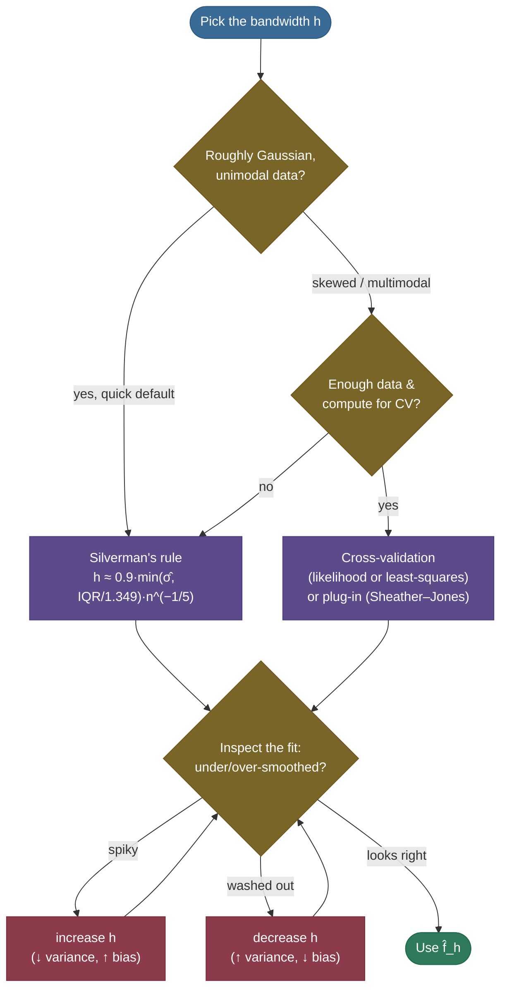
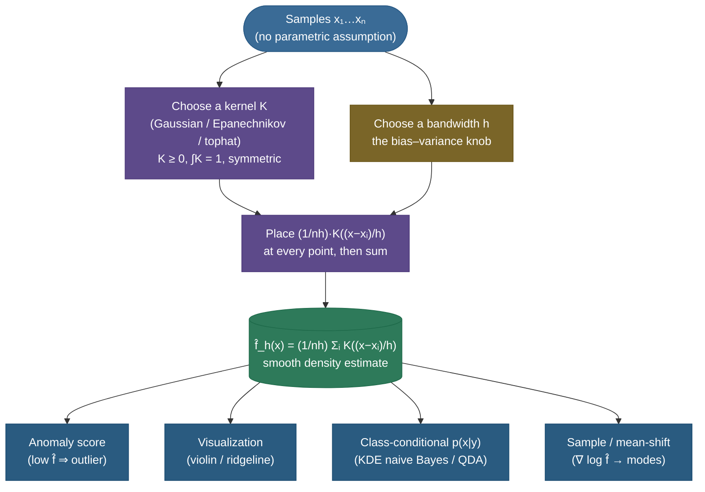

# Kernel Density Estimation: a histogram that forgot its bins

Suppose someone hands you 200 measurements — reaction times, sensor readings, gene expression levels — and asks the deceptively simple question: *what is the probability density that produced these numbers?* Not "what's the mean," not "fit me a Gaussian," but the whole shape: where the mass piles up, whether there are one bump or two, how heavy the tails are. If you already believed the data were Gaussian you'd estimate a mean and a variance and be done. If you believed they came from a handful of Gaussians you'd fit a [Gaussian mixture](04-Gaussian-Mixture-Models-and-EM.md). But what if you *refuse to assume any parametric form at all* and want the data to speak for itself?

That refusal is the entire premise of **Kernel Density Estimation (KDE)** — the workhorse **non-parametric** density estimator. Its idea is almost embarrassingly simple: **drop a small smooth bump on top of every data point, then add the bumps up.** Where points cluster, the bumps overlap and pile into a peak; where points are sparse, the bumps are thin and the estimate sags toward zero. The result is a smooth curve that traces the data's shape without ever committing to a formula for it. KDE is the smooth, bin-free descendant of the humble histogram, and the engine behind density-based anomaly scoring, violin plots, mean-shift clustering, and naive-Bayes class densities.

I'm going to build this the way I'd actually teach it: start from the histogram (KDE's crude ancestor) and *feel* why it's unsatisfying, then write down the estimator and see that it's literally "average a bump per point." Then we'll spend most of our time on the one parameter that matters — the **bandwidth** $h$ — deriving from scratch *why* it trades bias against variance, *what* its optimal value is (Silverman's rule and the AMISE), and *how* to pick it from data. We'll hit the **curse of dimensionality** that quietly kills KDE in high dimensions, the **boundary bias** that bites at the edges of bounded data, and four fully worked numeric examples. By the end you'll be able to:

- write the KDE estimator and explain **why it's just averaged kernels**, and what the kernel must satisfy;
- explain why the **bandwidth dominates** and the **kernel shape barely matters**;
- **derive** the asymptotic bias, variance, and AMISE, and minimize it to get the optimal $h^* \propto n^{-1/5}$;
- compute **Silverman's rule** and a cross-validated bandwidth by hand and in code;
- explain the **curse of dimensionality** ($n^{-4/(4+d)}$ convergence) and **boundary bias**;
- place KDE against histograms and GMMs, and know where each wins.

> **Note:** KDE is a **density estimator**, not a clustering or classification method by itself — but it's a building block for both. Mean-shift clustering climbs the gradient of a KDE; a naive-Bayes/QDA classifier can use a per-class KDE as $p(x \mid y)$; an anomaly detector flags points where the KDE is low. Learn the density and these fall out.

**Why it matters (and why interviewers ask it):** KDE is the canonical *non-parametric density* question — the cleanest test of whether you understand the bias–variance trade-off as a *tunable knob* rather than an abstraction. A strong answer nails four things: (1) the estimator is just "average a kernel per point," and *why* it's a valid density; (2) the **bandwidth** is the whole game (kernel choice is a rounding error), and small-vs-large $h$ maps exactly onto overfit-vs-underfit; (3) you can name a bandwidth rule (Silverman) and a principled selector (cross-validation / Sheather–Jones); (4) you know KDE's **failure mode** — the curse of dimensionality — and when to reach for a GMM instead. Getting those four right signals you understand density estimation, not just memorized a formula.

---

## Intuition: a crowd of soft spotlights

Here is the mental picture I keep. Imagine each data point holds a small flashlight pointed straight up, casting a soft circle of light on a screen above. One point alone makes one faint blob. But where many points stand close together, their circles **overlap and reinforce** into a bright pool; where a lone point stands far from the rest, its circle stays dim. Now read the brightness across the screen — *that brightness profile is the kernel density estimate.* Bright = high density (lots of overlapping points), dim = low density.

The **bandwidth** is the **width of each flashlight's beam.** Narrow beams (small $h$): each point lights only a tiny spot, so you see a bumpy, spiky landscape with a bright pinprick at every observation — you can see *exactly* where each point is, but the overall shape is lost in the speckle. Wide beams (large $h$): each point floods a huge region, the pools all merge into one broad wash, and any fine structure (a second cluster, a dip) is smeared away. The art is choosing a beam width that's wide enough to merge nearby points into a coherent shape but narrow enough to keep real features apart.

This is also exactly why the **kernel shape barely matters**: whether your flashlight casts a soft-edged Gaussian glow or a hard-edged circle, once you sum hundreds of overlapping beams the boundary detail of any single one washes out — only the *width* survives in the total. And it's why KDE is "non-parametric": you never told the flashlights what shape to make. You just put one on each point and let the data's own arrangement draw the density.

---

## The problem: estimate a density with no parametric assumption

Formally, we observe i.i.d. samples $x_1, \dots, x_n$ drawn from an unknown density $f$, and we want an estimate $\hat f$ of the *whole function* $f$ — its value at every point $x$, not just a few summary statistics.

The **parametric** route assumes $f$ belongs to a known family $f(x \mid \theta)$ — a single Gaussian $\mathcal N(\mu, \sigma^2)$, or a mixture of $k$ of them — and estimates the finite parameter vector $\theta$ by maximum likelihood. This is wonderfully efficient *when the assumption is right*: a handful of numbers captures the whole density, and you can extrapolate into the tails. But it is catastrophic when the assumption is wrong. Fit a single Gaussian to clearly bimodal data and you get a fat unimodal bump centered in the empty valley *between* the two real modes — a density that is confidently, precisely wrong.

The **non-parametric** route makes no such commitment. It lets the number of "effective parameters" grow with the data and asks only mild smoothness of $f$. The price is that you need more data and you cannot extrapolate beyond where you have samples; the reward is that you can recover *any* shape — one mode, three modes, skew, heavy tails — without knowing it in advance.

> **Tip:** the parametric-vs-non-parametric choice is the bias–variance trade-off at the level of *model class*. A single Gaussian is low-variance but high-bias (rigid); KDE is low-bias but high-variance (flexible, data-hungry). GMM sits in between: more flexible than one Gaussian, more constrained (and more data-efficient) than KDE. We'll see this same trade-off return *inside* KDE as the bandwidth.

---

## The histogram: KDE's crude ancestor (and its flaws)

The oldest non-parametric density estimator is the **histogram**: chop the line into bins of width $h$, count how many samples land in each bin, and divide by $n h$ so the bars integrate to 1. It *is* a density estimate — and a surprisingly good first cut — but it has four flaws that KDE was invented to fix.

**1. It depends on the bin width.** Narrow bins give a spiky, jagged estimate dominated by sampling noise; wide bins blur real structure into a featureless block. This is a genuine bias–variance knob, and KDE inherits it as the bandwidth.

**2. It depends on the bin *origin*.** Two analysts who choose the same bin width but start their bins at slightly different places get *different-shaped* histograms from the *same data* — a mode can appear, split, or vanish purely from where the grid happens to fall. This is an embarrassing artifact: the estimate depends on an arbitrary choice that has nothing to do with the data.

**3. It is discontinuous.** A histogram is a staircase of flat-topped bars with jumps at every bin edge. Densities of real-valued quantities are almost always smooth, so the staircase is a poor model — and its derivative (which you'd need for, say, finding modes) is zero almost everywhere and undefined at the edges.

**4. It scales terribly with dimension.** In $d$ dimensions you need bins covering a $d$-dimensional grid; to keep a few points per bin the number of bins — and hence the data — explodes exponentially. (KDE softens but does not escape this; see the curse of dimensionality below.)


KDE fixes flaws 1–3 directly: it replaces the hard bin-counting with a smooth kernel, so the estimate is **continuous and differentiable**, and — crucially — it **has no bins and therefore no bin origin**, killing the arbitrary-grid dependence entirely. Think of it as a histogram where, instead of dropping each point into a rigid box, you drop a soft *bump* centered exactly on the point.

---

## What KDE is: the estimator

The **kernel density estimator** with kernel $K$ and bandwidth $h > 0$ is

$$\hat f_h(x) \;=\; \frac{1}{n h} \sum_{i=1}^{n} K\!\left(\frac{x - x_i}{h}\right).$$

Read it left to right and the whole method is in the formula. For each data point $x_i$, the term $K\!\big((x - x_i)/h\big)$ is a **bump centered at $x_i$**: it's large when $x$ is near $x_i$ and decays as $x$ moves away, at a rate set by $h$. The $1/h$ stretches or squeezes the bump's width; the $1/n$ averages over all $n$ points so the total integrates to 1. **That's it: place a scaled copy of $K$ at every sample and average them.**

> *Where this comes from: **Rosenblatt (1956)** wrote down the first non-parametric density estimator (a moving-window count — effectively a tophat kernel); **Parzen (1962)** generalized it to smooth kernels and proved its consistency, which is why KDE is also called the **Parzen-window** estimator. The bias/variance/AMISE analysis and the bandwidth rule below are from **Silverman's 1986 monograph** "Density Estimation"; data-driven selection from **Sheather & Jones (1991)**; the multivariate treatment from **Scott (1992)** — all in the references.*


**What $K$ must satisfy.** For $\hat f_h$ to be a legitimate density (non-negative, integrating to 1) the kernel needs:

- **Non-negativity:** $K(u) \ge 0$ for all $u$, so $\hat f_h(x) \ge 0$ everywhere.
- **Integrates to one:** $\int_{-\infty}^{\infty} K(u)\,du = 1$. Combined with the $1/(nh)$ scaling, this guarantees $\int \hat f_h(x)\,dx = 1$ — each bump contributes exactly $1/n$ of total mass.
- **Symmetry (almost always):** $K(-u) = K(u)$, i.e. $\int u\,K(u)\,du = 0$. A symmetric kernel makes the estimator's leading bias vanish to first order (we'll use this in the derivation), which is why every standard kernel is symmetric.

> **Note:** notice the kernel is itself a probability density. So $\hat f_h$ is a uniform mixture of $n$ densities, one centered on each data point. This is the cleanest way to see the link to GMM: a **GMM is a mixture of $k$ Gaussians with learned means, covariances, and weights**; a **Gaussian KDE is a mixture of $n$ Gaussians with means fixed at the data points, equal weights $1/n$, and one shared bandwidth $h$.** KDE is the extreme "one component per point" mixture — maximally flexible, zero learned structure.

---

## Kernel choices — and why the shape barely matters

Any function meeting the requirements above is a valid kernel. The standard menu:

| Kernel | $K(u)$ | Support | Efficiency vs Epanechnikov |
|---|---|---|---|
| **Gaussian** | $\frac{1}{\sqrt{2\pi}} e^{-u^2/2}$ | $(-\infty, \infty)$ | 95.1% |
| **Epanechnikov** | $\frac{3}{4}(1 - u^2)$ for $\lvert u\rvert \le 1$ | $[-1, 1]$ | 100% (optimal) |
| **Tophat / uniform** | $\frac{1}{2}$ for $\lvert u\rvert \le 1$ | $[-1, 1]$ | 92.9% |
| **Triangular** | $(1 - \lvert u\rvert)$ for $\lvert u\rvert \le 1$ | $[-1, 1]$ | 98.6% |
| **Cosine** | $\frac{\pi}{4}\cos\!\big(\frac{\pi}{2}u\big)$ for $\lvert u\rvert \le 1$ | $[-1, 1]$ | 99.9% |

The **Epanechnikov** kernel is *MISE-optimal*: among all kernels it minimizes the asymptotic integrated error, which is why it's the theoretical default and scikit-learn's recommended choice for speed (its finite support means only nearby points contribute). But look at the "efficiency" column: every reasonable kernel is within a few percent of optimal. The Gaussian is 95% as efficient as the best possible kernel — meaning you'd need only ~5% more data to match Epanechnikov's accuracy. In practice that gap is negligible, and the Gaussian's infinite smoothness (it has derivatives of all orders, useful for mean-shift and for a strictly positive estimate everywhere) makes it the most common choice.

> **Note:** the single most important empirical fact about KDE: **the choice of kernel matters far less than the choice of bandwidth.** Swap Gaussian for Epanechnikov for tophat at the *same* bandwidth and the estimates are nearly indistinguishable; change the bandwidth by 2× and the estimate transforms completely. Spend your effort on $h$, not on $K$.


> **Gotcha:** the **tophat (uniform) kernel produces a non-smooth, ragged estimate** — it's a sum of step functions, so the KDE jumps as points enter and leave each box. It's the closest kernel to a histogram and shares some of its discontinuity. If you want a smooth curve (e.g. to differentiate it), use a smooth kernel like the Gaussian or Epanechnikov, not the tophat.

---

## The bandwidth: the bias–variance knob (derived)

Everything important about KDE lives in the bandwidth $h$. It is the *width* of each bump, and it controls how much the estimate smooths the data:

- **Small $h$** → narrow bumps → the estimate hugs each point, producing a **spiky** curve with a peak at (nearly) every observation. It has **low bias** (it follows the data closely) but **high variance** (it follows the *noise* too — a different sample gives a wildly different curve). This is **undersmoothing / overfitting**.
- **Large $h$** → wide bumps → the estimate blurs everything into a broad, **flat** curve. It has **low variance** (stable across samples) but **high bias** (it washes out real structure — two modes merge into one). This is **oversmoothing / underfitting**.


To make "bias" and "variance" precise — and to find the *optimal* $h$ — we derive their asymptotic forms. This is the one derivation worth knowing cold for an interview.

**Bias.** The expected estimate at a point $x$ is

$$\mathbb E\big[\hat f_h(x)\big] = \frac{1}{h}\,\mathbb E\!\left[K\!\Big(\frac{x - X}{h}\Big)\right] = \frac{1}{h}\int K\!\Big(\frac{x - t}{h}\Big) f(t)\, dt.$$

Substitute $u = (x - t)/h$, so $t = x - h u$ and $dt = -h\,du$:

$$\mathbb E\big[\hat f_h(x)\big] = \int K(u)\, f(x - h u)\, du.$$

Now Taylor-expand $f(x - h u)$ around $x$ for small $h$:

$$f(x - hu) = f(x) - h u\, f'(x) + \tfrac{1}{2} h^2 u^2 f''(x) + O(h^3).$$

Plug in and use the kernel's three properties — $\int K = 1$, $\int u K\, du = 0$ (symmetry), and write $\sigma_K^2 = \int u^2 K(u)\, du$ for the kernel's variance:

$$\mathbb E\big[\hat f_h(x)\big] = f(x)\underbrace{\textstyle\int K}_{=1} - h f'(x)\underbrace{\textstyle\int u K}_{=0} + \tfrac{1}{2}h^2 f''(x)\underbrace{\textstyle\int u^2 K}_{=\sigma_K^2} + \cdots$$

so the **leading bias** is

$$\boxed{\ \operatorname{Bias}\big[\hat f_h(x)\big] \approx \tfrac{1}{2}\, h^2\, \sigma_K^2\, f''(x).\ }$$

Read off the physics: bias grows like $h^2$ (bigger bumps smooth more), is proportional to the curvature $f''(x)$ (peaks and valleys — high curvature — are blurred most; flat regions barely), and the symmetry of $K$ killed the $O(h)$ term, which is *why* we insist on symmetric kernels.

**Variance.** Since $\hat f_h(x) = \frac{1}{n}\sum_i \frac{1}{h}K\!\big(\frac{x-x_i}{h}\big)$ is an average of $n$ i.i.d. terms, $\operatorname{Var}[\hat f_h(x)] = \frac{1}{n}\operatorname{Var}\!\big[\frac1h K(\frac{x-X}{h})\big] = \frac{1}{n}\Big(\mathbb E\big[\tfrac1{h^2}K^2\big] - \mathbb E\big[\tfrac1h K\big]^2\Big)$. The second term is just $\frac1n(f(x)+O(h^2))^2$, which is $O(1/n)$ and negligible next to the first. For the first term, the same $u=(x-t)/h$ substitution gives $\mathbb E\big[\tfrac1{h^2}K^2\big] = \frac1h\int K(u)^2 f(x-hu)\,du \approx \frac{f(x)}{h}\int K(u)^2\,du$. Putting it together,

$$\boxed{\ \operatorname{Var}\big[\hat f_h(x)\big] \approx \frac{f(x)\, R(K)}{n h},\qquad R(K) = \int K(u)^2\, du.\ }$$

Here $R(K)$ is the kernel's "roughness." Variance shrinks like $1/(nh)$: more data ($n\uparrow$) or wider bumps ($h\uparrow$) both stabilize the estimate, because each estimate then averages over more points. Notice the tension with bias already: shrinking $h$ helped bias ($\propto h^2$) but *hurts* variance ($\propto 1/h$) — the same knob, opposite directions.

> **Note:** stare at the two boxes and the trade-off is undeniable. **Bias $\uparrow$ with $h$; variance $\downarrow$ with $h$.** You cannot make both small at once by tuning $h$ — increasing $h$ trades variance for bias and vice versa. The best you can do is *balance* them, which is what minimizing the total error does next.

**Combine into the (A)MISE.** The natural global error is the **Mean Integrated Squared Error**, $\mathrm{MISE} = \mathbb E\int (\hat f_h - f)^2$. Since $\mathbb E[(\hat f - f)^2] = \operatorname{Bias}^2 + \operatorname{Var}$, integrating over $x$ gives the **Asymptotic MISE**:

$$\mathrm{AMISE}(h) = \underbrace{\tfrac{1}{4} h^4 \sigma_K^4\, R(f'')}_{\text{integrated bias}^2} \;+\; \underbrace{\frac{R(K)}{n h}}_{\text{integrated variance}},\qquad R(f'') = \int f''(x)^2\, dx.$$

The two terms pull in opposite directions in $h$ — bias$^2$ rises as $h^4$, variance falls as $1/h$ — so their sum is a **U-shaped** curve with a unique minimum. Differentiate and set to zero:

$$\frac{d}{dh}\,\mathrm{AMISE} = h^3 \sigma_K^4 R(f'') - \frac{R(K)}{n h^2} = 0 \;\Longrightarrow\; h^5 = \frac{R(K)}{\sigma_K^4\, R(f'')\, n},$$

giving the **optimal bandwidth**

$$\boxed{\ h^* = \left[\frac{R(K)}{\sigma_K^4\, R(f'')\, n}\right]^{1/5} \;\propto\; n^{-1/5}.\ }$$

Three things to take from this. (1) The optimal bandwidth shrinks with sample size as $n^{-1/5}$ — *slowly* (you need 32× more data to halve $h$), reflecting how data-hungry density estimation is. (2) It depends on $R(f'')$, the roughness of the *unknown* truth — wigglier densities (large $\lvert f''\rvert$) need a smaller $h$. The circularity (you need $f$ to choose $h$ to estimate $f$) is exactly what bandwidth-selection methods resolve. (3) Plugging $h^*$ back in shows the best achievable error decays as $\mathrm{AMISE}(h^*) \propto n^{-4/5}$ — slower than the parametric $n^{-1}$ rate, the price of making no assumptions.

> **Tip:** the $n^{-1/5}$ and $n^{-4/5}$ rates are worth memorizing as a pair: **optimal bandwidth $\propto n^{-1/5}$, optimal error $\propto n^{-4/5}$** (in 1-D). They generalize to $n^{-1/(d+4)}$ and $n^{-4/(d+4)}$ in $d$ dimensions — the curse of dimensionality, below, is just that exponent degrading.

---

## Silverman's rule of thumb (and the robust variant)

The optimal $h^*$ needs $R(f'')$, which we don't know. **Silverman's rule** breaks the circularity with a pragmatic shortcut: *assume the truth is Gaussian just to pick $h$*, plug $f = \mathcal N(\mu, \sigma^2)$ into $R(f'')$, and use a Gaussian kernel.

For a normal reference, $R(f'') = \frac{3}{8\sqrt\pi\,\sigma^5}$, and the Gaussian kernel has $\sigma_K^2 = 1$, $R(K) = \frac{1}{2\sqrt\pi}$. Substituting into $h^*$:

$$h^* = \left[\frac{1/(2\sqrt\pi)}{1 \cdot \frac{3}{8\sqrt\pi\,\sigma^5}\cdot n}\right]^{1/5} = \left[\frac{4}{3}\right]^{1/5}\sigma\, n^{-1/5} \approx 1.06\,\sigma\, n^{-1/5}.$$

Estimating $\sigma$ by the sample standard deviation $\hat\sigma$ gives the textbook **Silverman rule of thumb**:

$$\boxed{\ h_{\text{Silverman}} \approx 1.06\,\hat\sigma\, n^{-1/5}.\ }$$

> **Gotcha:** the $1.06$ rule **over-smooths multimodal or heavy-tailed data**, because it assumed a single Gaussian — exactly the assumption we were trying to avoid. For bimodal data it can merge the modes (you saw it lean that way in the bandwidth figure). The standard fix is the **robust variant**, which replaces $\hat\sigma$ with the smaller of the standard deviation and a scaled interquartile range (the IQR is insensitive to outliers and to a second mode):

$$h_{\text{robust}} = 0.9\,\min\!\left(\hat\sigma,\ \frac{\mathrm{IQR}}{1.349}\right) n^{-1/5}.$$

The $1.349$ converts an IQR into the standard deviation of a Gaussian ($\Phi^{-1}(0.75) - \Phi^{-1}(0.25) \approx 1.349$); the $0.9$ is Silverman's slightly-undersmoothing tweak. This robust form is the default in most libraries and a sensible *starting point* you then refine.

A close cousin is **Scott's rule**, $h \approx \hat\sigma\, n^{-1/(d+4)}$ (in $d$ dimensions), which drops Silverman's constant and is scipy's other built-in default. Both are "normal-reference" rules — same $n^{-1/(d+4)}$ scaling, slightly different constants — and both over-smooth non-Gaussian data for the same reason. They differ only in the multiplier, which (recall) matters far less than getting the order of magnitude right.

> **Tip:** treat Silverman as a **first guess, not the answer.** It's a one-line default that gets you in the right ballpark; for anything you care about, refine with cross-validation (next) and *look at the resulting fit* against the data.

---

## Data-driven bandwidth selection

When the rule of thumb isn't good enough — skewed, multimodal, or otherwise non-Gaussian data — let the data choose $h$ directly.

**Likelihood (leave-one-out) cross-validation.** Pick the $h$ that best predicts held-out points. Leave each $x_i$ out, build the KDE from the rest, and score how much density it assigns to the omitted point; maximize the total leave-one-out log-likelihood over $h$:

$$\mathrm{CV}(h) = \sum_{i=1}^{n} \log \hat f_{h}^{(-i)}(x_i),\qquad \hat f_h^{(-i)}(x) = \frac{1}{(n-1)h}\sum_{j\ne i} K\!\Big(\frac{x - x_j}{h}\Big).$$

Too small an $h$ and the held-out point falls in a gap between the spikes (low likelihood); too large and the density is washed out (also low likelihood) — so $\mathrm{CV}(h)$ has an interior maximum at a well-chosen $h$. This is what scikit-learn's `GridSearchCV` over `KernelDensity` does.

**Least-squares (unbiased) cross-validation.** Instead of likelihood, directly estimate the MISE's data-dependent part $\int \hat f_h^2 - 2\int \hat f_h f$ from the sample and minimize it. It targets squared error rather than likelihood and is less sensitive to outliers in the tails, but can be noisy.

**Plug-in / Sheather–Jones.** Rather than cross-validate, *estimate the unknown $R(f'')$ itself* (with a pilot KDE) and plug it into the optimal-$h$ formula. The **Sheather–Jones** method is the gold-standard plug-in selector — generally more reliable and less variable than cross-validation, and the recommended default in much of the statistics literature. Concretely: build a pilot KDE, differentiate it twice to estimate $R(f'') = \int f''(x)^2\,dx$ (the one functional $h^*$ needs), and substitute into $h^* = [R(K)/(\sigma_K^4 R(f'') n)]^{1/5}$. SJ refines this with a clever self-consistent pilot-bandwidth choice, but the core move is "estimate $R(f'')$, then plug in."

**Measured — the selectors on a hard (bimodal) density.** This is where the difference between "normal-reference" rules and data-driven selectors becomes concrete. Take $n=400$ points from a clearly **bimodal** truth (two well-separated Gaussians) and run all four selectors, scoring each bandwidth by the total log-likelihood it assigns the data (higher = the data is better explained):

| selector | chosen $h$ | total log-likelihood |
|---|---|---|
| Silverman (normal-reference) | 0.693 | $-714.0$ |
| Scott (normal-reference) | 0.770 | $-727.5$ |
| **plug-in (Sheather–Jones-style)** | **0.341** | $\mathbf{-667.3}$ |
| likelihood cross-validation | 0.208 | $-656.0$ |

The two **normal-reference rules over-smooth badly** — by assuming a single Gaussian they pick $h \approx 0.7$–$0.8$, wide enough to start merging the two modes, and score the worst log-likelihoods ($-714$, $-727$). The **plug-in selector**, having *estimated* the true roughness $R(f'') = 0.152$ from a pilot fit instead of assuming Gaussianity, correctly pulls the bandwidth down to $0.341$ and fits far better ($-667$). Likelihood-CV goes a touch further still ($0.208$, $-656$) — it directly optimizes held-out fit, so it resolves the valley most aggressively, at the cost of being noisier run-to-run. The ordering is exactly SJ's reputation: **it lands between the over-smoothing normal rules and the (lower-bias but higher-variance) cross-validation**, usually closer to the right answer than either extreme on its own. (All four numbers are reproduced by the selector snippet in the code section's note.)

> **Note:** all of these resolve the circularity of $h^*$ (which needed the unknown $f$) in different ways: cross-validation sidesteps $f$ by predicting held-out data; plug-in estimates the one functional of $f$ ($R(f'')$) that $h^*$ actually needs. In practice: **Silverman to get started, Sheather–Jones or CV to finish, eyeball to confirm.** The table above is *why* that order exists — the normal-reference start is fast but biased on non-Gaussian data, and the data-driven finish corrects it.



---

## The curse of dimensionality

KDE is a 1-D and 2-D hero and a high-dimensional cautionary tale. The reason is in the convergence rate. In $d$ dimensions the optimal MISE decays as

$$\mathrm{MISE}(h^*) \;\propto\; n^{-\frac{4}{4 + d}}.$$

In 1-D ($d=1$) that's the $n^{-4/5}$ we derived. But the exponent shrinks toward zero as $d$ grows, so convergence slows dramatically. Equivalently: to keep the error fixed as you add dimensions, the sample size must grow **exponentially**. If $n$ samples give a certain accuracy in 1-D, matching it in $d$ dimensions needs roughly $n^{(4+d)/5}$ samples:

| Dimension $d$ | Samples to match $n=100$ at $d=1$ |
|---|---|
| 1 | 100 |
| 2 | ~251 |
| 3 | ~631 |
| 5 | ~3,981 |
| 10 | ~398,107 |

By $d=10$ you need ~400,000 points to match what 100 bought you in 1-D — and real high-dimensional data is rarely that abundant. The deeper geometric reason is that in high dimensions **almost all of the volume is in the tails**: a fixed-bandwidth bump captures a vanishing fraction of the space, your nearest neighbors are far away, and the local averaging KDE relies on has almost no points to average. The same emptiness that hurts $k$-NN and distance-based methods hurts KDE.

> **Gotcha:** as a rule of thumb, **KDE is excellent up to ~2–3 dimensions, usable to maybe 5–6 with lots of data, and unreliable beyond that.** Past that point, switch to a *parametric* model (a GMM, a normalizing flow), reduce dimension first (PCA/UMAP) and KDE in the reduced space, or use a method built for high dimensions. Don't KDE a 50-dimensional embedding and trust the result.

---

## Boundary bias and multivariate KDE

**Boundary bias.** If the data live on a bounded domain — a density on $[0, \infty)$ (waiting times, counts) or $[0, 1]$ (proportions) — KDE is biased *near the boundary*. A bump centered at a point just inside the edge spills its mass *across the boundary* into the forbidden region, so the estimate near the edge is pulled down (it "leaks" mass to where no data can be). The standard fixes:

- **Reflection:** mirror the data across the boundary (add the reflected points), estimate, then keep only the in-domain half — the leaked mass is reflected back in.
- **Transformation:** map the bounded variable to the whole line (e.g. $\log$ for $[0,\infty)$, logit for $[0,1]$), KDE in the unbounded space, and transform the density back with the Jacobian.
- **Boundary kernels:** use special asymmetric kernels near the edge that don't integrate mass past it.

> **Gotcha:** boundary bias is a *silent* error — the curve looks smooth and plausible but systematically underestimates the density near a hard edge. If your variable is non-negative or otherwise bounded, **don't KDE it raw**; reflect or transform first. A classic symptom is a KDE of strictly-positive data that assigns visible density to negative values.

**Multivariate KDE.** In $d$ dimensions, replace the scalar bandwidth with a **bandwidth matrix** $H$ (a $d \times d$ symmetric positive-definite matrix), and use a multivariate kernel:

$$\hat f_H(\mathbf x) = \frac{1}{n} \sum_{i=1}^{n} K_H(\mathbf x - \mathbf x_i),\qquad K_H(\mathbf u) = \lvert H\rvert^{-1/2}\, K\!\big(H^{-1/2}\mathbf u\big).$$

A *diagonal* $H$ gives a different bandwidth per axis (good when features have different scales — and you should **standardize** features first regardless, since a single scalar $h$ treats all axes equally). A *full* $H$ lets the bumps be tilted ellipses aligned with the data's correlations, at the cost of $O(d^2)$ parameters to choose. The same bias–variance and curse-of-dimensionality story applies, only harder.

**Worked example — a 2-D bandwidth-matrix KDE by hand.** The formula above is opaque until you push numbers through it once. Take **three points** $\{(0,0), (2,0), (1,2)\}$, a **full** (correlated) bandwidth matrix $H = \left[\begin{smallmatrix}1 & 0.5\\ 0.5 & 1\end{smallmatrix}\right]$, and evaluate the density at $x = (1, 0.5)$.

First the normalizer. With $d=2$, $\det H = 1 - 0.25 = 0.75$, so each Gaussian bump carries the constant $\frac{1}{(2\pi)^{d/2}\sqrt{\det H}} = \frac{1}{2\pi\sqrt{0.75}} = 0.18378$. The exponent for each point is the **squared Mahalanobis distance in the $H$-metric**, $(x-x_i)^\top H^{-1}(x-x_i)$, with $H^{-1} = \frac{1}{0.75}\left[\begin{smallmatrix}1 & -0.5\\ -0.5 & 1\end{smallmatrix}\right]$:

| point $x_i$ | $(x-x_i)^\top H^{-1}(x-x_i)$ | $K_H(x-x_i) = 0.18378\,e^{-\frac12(\cdot)}$ |
|---|---|---|
| $(0,0)$ | $1.0000$ | $0.111466$ |
| $(2,0)$ | $2.3333$ | $0.057229$ |
| $(1,2)$ | $3.0000$ | $0.041006$ |

Average the three kernel values: $\hat f_H(x) = \tfrac{1}{3}(0.111466 + 0.057229 + 0.041006) = \mathbf{0.069900}$. (Verified against an independent vectorized computation below — exact match.) The nearest point $(0,0)$ dominates the estimate, exactly as in 1-D; the only new machinery is that "distance" is now measured through $H^{-1}$, which *tilts and stretches* each bump along the bandwidth matrix's axes.

The off-diagonal of $H$ is doing real work. Re-run with a **diagonal** $H = I$ (axis-aligned, uncorrelated bumps) and the same query gives $\hat f_I(x) = 0.074016$ — a different density, because the correlated $H$ orients each bump along the $(1,1)$ diagonal, changing how much mass reaches $x$. That difference *is* the value of a full bandwidth matrix: it lets the bumps follow the data's correlation structure instead of assuming the axes are independent. (The price, again, is the $O(d^2)$ entries of $H$ to choose, which is why a diagonal $H$ on standardized features is the usual practical compromise.)

> **Gotcha:** in $d$ dimensions the per-bump normalizer is $\lvert H\rvert^{-1/2}$, *not* $h^{-d}$ unless $H = h^2 I$. Forgetting the $\sqrt{\det H}$ (or using a scalar $h$ when features are correlated) silently mis-normalizes the density — it still looks like a plausible surface but no longer integrates to 1, and the relative heights are wrong wherever the correlation matters. Always whiten or standardize first, and let $H$ (or at least a diagonal $H$) carry the per-axis scale.

---

## Adaptive bandwidth and the k-NN connection

A single fixed $h$ is a compromise: the same beam width is used in the dense center (where you'd want it *narrow* — there's plenty of data, so resolve fine detail) and in the sparse tails (where you'd want it *wide* — few points, so smooth more to control variance). A fixed $h$ that's good for the peak is too noisy in the tails; one that's good for the tails over-smooths the peak. **Adaptive (variable-bandwidth) KDE** fixes this by letting $h$ vary:

- **Balloon estimator:** the bandwidth depends on the *evaluation point* $x$ — typically $h(x)$ proportional to the distance to its $k$-th nearest data point, so the beam widens automatically in sparse regions.
- **Sample-smoothing (Abramson) estimator:** each *data point* gets its own bandwidth $h_i \propto \hat f(x_i)^{-1/2}$ — points in low-density regions get wider bumps. This is the more common variant and gives a strictly valid density.

This leads directly to the **$k$-nearest-neighbour density estimator**, the variable-bandwidth method taken to its logical end. Instead of fixing a bump width and counting how much kernel mass lands near $x$, fix a *count* $k$ and ask **how big a ball around $x$ you must grow to capture $k$ neighbours**:

$$\hat f_{k\text{NN}}(x) = \frac{k}{n\, V_d\, r_k(x)^d},$$

where $r_k(x)$ is the distance from $x$ to its $k$-th nearest sample and $V_d r_k^d$ is the volume of that ball. Dense regions have small $r_k$ (small ball, high density); sparse regions have large $r_k$ (low density). It's the dual of KDE — KDE fixes the *width* and measures the *mass*; $k$-NN fixes the *mass* ($k$ points) and measures the *width*.

> **Gotcha:** the raw $k$-NN density estimator is **not a proper density** — it doesn't integrate to 1 (it has heavy, non-integrable tails because $r_k \to$ large slowly). It's fine as a *relative* density (e.g. for anomaly scoring or as the basis of the **Local Outlier Factor**), but don't treat it as a normalized probability. Adaptive KDE keeps the normalization that $k$-NN throws away — that's the trade.

> **Tip:** if your data has a sharp peak *and* long tails (common for incomes, file sizes, inter-arrival times), a single global bandwidth will fail one or the other. Reach for an **adaptive-bandwidth KDE** or work in a transformed (e.g. log) space — don't just keep nudging one global $h$.

---

## A note on computation: KDE isn't free

Evaluating $\hat f_h$ at one point sums over all $n$ data points, so evaluating it at $m$ query points is **$O(nm)$** naively — and drawing a smooth curve or scoring a large test set makes $m$ large too. For big $n$ this is the bottleneck. The standard accelerations:

- **Tree-based** ($k$-d tree / ball tree): group distant points and approximate their bumps in bulk; scikit-learn's `KernelDensity` uses this. Works well in low dimensions, degrades with $d$.
- **Binning + FFT:** bin the data onto a grid, then the KDE is a *convolution* of the binned counts with the kernel — computable in $O(N_{\text{grid}} \log N_{\text{grid}})$ via the FFT. This is how fast 1-D/2-D KDE (e.g. R's `density`, KDEpy) works, and it's dramatically faster for large $n$.
- **Finite-support kernels** (Epanechnikov, tophat): only points within $h$ of the query contribute, so with a spatial index you skip most of the sum entirely — another reason Epanechnikov is the speed default.

> **Note:** the convolution view is worth holding onto: a KDE is literally the empirical distribution (a sum of spikes at the data) **convolved with the kernel**. "Smoothing" is convolution; the bandwidth is the convolution kernel's width. That's the same operation as blurring an image — KDE blurs a set of points into a density.

---

## Worked example 1 — evaluate the KDE by hand at one point

The fastest way to internalize the formula is to plug numbers into it once. Take **three points** $\{2, 3, 5\}$, a **Gaussian kernel**, and **bandwidth $h = 1$**. Estimate the density at **$x = 4$**.

For each point, compute the standardized distance $u_i = (x - x_i)/h$ and the Gaussian kernel $K(u) = \frac{1}{\sqrt{2\pi}}e^{-u^2/2}$:

| $x_i$ | $u_i = (4 - x_i)/1$ | $K(u_i)$ |
|---|---|---|
| 2 | $+2$ | $0.053991$ |
| 3 | $+1$ | $0.241971$ |
| 5 | $-1$ | $0.241971$ |

Sum the kernel values: $0.053991 + 0.241971 + 0.241971 = 0.537932$. Then divide by $n h = 3 \times 1 = 3$:

$$\hat f_1(4) = \frac{1}{3 \times 1}\,(0.537932) = \mathbf{0.179311}.$$

The points one unit away ($x=3$ and $x=5$) each contributed the most ($0.242$); the far point at $x=2$ (two units away) contributed only $0.054$. That distance-weighted averaging *is* the kernel estimate. Verified against `sklearn.neighbors.KernelDensity` (which returns `exp(score_samples)`): it gives `0.179311` — an exact match.

> **Tip:** this is the most likely KDE interview ask: *"evaluate the KDE at a point."* The recipe is exactly the table above — standardize each distance by $h$, apply $K$, sum, divide by $nh$. Do it slowly and out loud and you can't get it wrong.

---

## Worked example 2 — Silverman's bandwidth for a small sample

Take the seven values $\{1, 2, 2, 3, 4, 7, 9\}$ and compute Silverman's bandwidth.

First the spread statistics: the sample standard deviation is $\hat\sigma = 2.944$, the quartiles are $Q_1 = 2$, $Q_3 = 5.5$ so $\mathrm{IQR} = 3.5$, and $\mathrm{IQR}/1.349 = 2.594$. The robust rule takes the **smaller** of the two scale estimates, $A = \min(2.944, 2.594) = 2.594$ (the IQR-based one is smaller here, which is the point — it discounts the long right tail). Then

$$h_{\text{robust}} = 0.9 \times 2.594 \times 7^{-1/5} = 0.9 \times 2.594 \times 0.6759 = \mathbf{1.582}.$$

For comparison, the plain $1.06\,\hat\sigma\, n^{-1/5}$ rule gives $1.06 \times 2.944 \times 0.6759 = 2.114$ — noticeably wider, because it used the outlier-inflated $\hat\sigma$ instead of the robust IQR scale. (scipy's `gaussian_kde(..., bw_method='silverman')` uses the simple variant and reproduces $\approx 2.11$.) All three numbers were verified in code.

> **Note:** the gap between $1.58$ (robust) and $2.11$ (plain) on just seven points shows why the robust variant exists: the two large values $\{7, 9\}$ inflate $\hat\sigma$ and push the plain rule to over-smooth, while the IQR shrugs them off. On clean unimodal data the two would nearly coincide.

---

## Worked example 3 — the bias–variance trade-off, numerically

Let's watch the AMISE U-shape directly. Take the truth to be a **standard normal** $f = \mathcal N(0,1)$ and a Gaussian kernel, with $n = 200$. For this case $R(K) = \frac{1}{2\sqrt\pi} = 0.2821$, $\sigma_K^2 = 1$, and $R(f'') = \frac{3}{8\sqrt\pi} = 0.2116$. The AMISE is $\frac14 h^4 R(f'') + \frac{R(K)}{nh}$. Tabulating:

| $h$ | integrated bias$^2$ ($\frac14 h^4 \sigma_K^4 R(f'')$) | integrated variance ($\frac{R(K)}{nh}$) | AMISE |
|---|---|---|---|
| 0.10 | $5.3\times10^{-6}$ | $1.41\times10^{-2}$ | $1.411\times10^{-2}$ |
| 0.20 | $8.5\times10^{-5}$ | $7.05\times10^{-3}$ | $7.137\times10^{-3}$ |
| **0.367** | $9.6\times10^{-4}$ | $3.84\times10^{-3}$ | $\mathbf{4.803\times10^{-3}}$ |
| 0.60 | $6.9\times10^{-3}$ | $2.35\times10^{-3}$ | $9.206\times10^{-3}$ |
| 1.00 | $5.3\times10^{-2}$ | $1.41\times10^{-3}$ | $5.430\times10^{-2}$ |

Read the columns: as $h$ grows the **bias$^2$ term climbs steeply** (it's $\propto h^4$) while the **variance term falls** (it's $\propto 1/h$). Their sum bottoms out in the middle. The optimal-$h$ formula predicts the minimum at $h^* = \left[\frac{R(K)}{\sigma_K^4 R(f'') n}\right]^{1/5} = 0.367$ — and indeed the AMISE column is smallest there ($4.80\times10^{-3}$), confirming the derivation. This $0.367$ also equals the Silverman value $1.06 \times 1 \times 200^{-1/5}$ exactly, as it must for a Gaussian truth.

Pointwise, at $x=0$ (where $f(0)=0.399$, $f''(0)=-0.399$) the trade is just as visible: at $h=0.1$ the bias is a negligible $-0.002$ but the variance is $5.6\times10^{-3}$; at $h=1.0$ the variance collapses to $5.6\times10^{-4}$ but the bias balloons to $-0.199$ (the estimate is pulled half-way to zero at the peak — gross over-smoothing). The middle $h$ balances them.

> **Tip:** this table is the cleanest answer to *"what does the bandwidth do?"* — point at the two columns moving in opposite directions and the single $h$ that minimizes their sum. That **is** the bias–variance trade-off, made arithmetic.

---

## Worked example 4 — measured KDE vs histogram, several bandwidths

The first three examples were hand calculations; this one is the picture you actually ship. Take a real 200-point sample from a **bimodal** truth and overlay several bandwidths. Refer back to the bandwidth figure earlier: $h = 0.12$ is spiky (it invents wiggles from noise), $h = 1.40$ is a single washed-out hump (the two modes have merged — a serious error, since "is this distribution bimodal?" is often the whole question), and Silverman's $h = 0.70$ recovers the two modes cleanly against the dashed truth.

Crucially, run a likelihood cross-validation on this same kind of data and it picks $h_{\text{CV}} = 0.293$ — *smaller* than Silverman's $0.611$ — precisely because Silverman's Gaussian-reference assumption over-smooths the bimodal shape, while CV, which only cares about predicting held-out points, prefers the sharper estimate that resolves the valley. (Both numbers verified in the code below.) And recall the histogram figure: the KDE was smooth and stable while the histogram's bars *jumped* when the bin origin shifted by a quarter unit. Same data, same goal; the KDE is the estimate you'd trust.

> **Gotcha:** when the question is *"how many modes are there?"*, the bandwidth **is the answer you're choosing** — over-smooth and you'll report one mode, under-smooth and you'll report ten. Never claim a mode count from a single arbitrary $h$; check that it survives a sensible range of bandwidths (this is the idea behind Silverman's *critical bandwidth* test for multimodality).

---

## Where KDE is used

KDE is less a standalone "model" than a versatile primitive. The main uses:

- **Non-parametric density estimation** — the direct job: estimate $p(x)$ when you won't assume a form. Used in econometrics, signal processing, astronomy (luminosity functions), and anywhere a smooth empirical density is wanted.
- **Anomaly / novelty detection** — fit a KDE to "normal" data; a new point with **low estimated density** is an outlier or novelty. This is a density-based detector, complementary to the isolation/distance methods in [Anomaly / Outlier Detection](09-Anomaly-Outlier-Detection.md). scikit-learn's `KernelDensity.score_samples` is a standard novelty scorer; thresholding it flags rare points.
- **Data visualization** — the smooth alternative to the histogram. **Violin plots** are mirrored KDEs; **ridgeline (joyplot)** plots stack KDEs; 2-D KDEs draw the smooth contour clouds you see in scatter overlays. This is probably KDE's most common everyday appearance.
- **Generative sampling** — because a Gaussian KDE *is* an equal-weight mixture of Gaussians, you can sample from it directly: pick a data point uniformly, then draw from $\mathcal N(x_i, h^2)$. This is exactly the **smoothed bootstrap** — resampling with a little Gaussian jitter.
- **Class-conditional densities for classification** — fit a separate KDE per class to model $p(x \mid y)$, combine with class priors via Bayes' rule, and you have a **non-parametric naive Bayes / QDA** classifier (Jake VanderPlas's "KDE Bayesian classifier"). No Gaussian-per-class assumption needed.
- **Mean-shift clustering** — climbs the **gradient of a KDE** ($\nabla \log \hat f$) from each point to the nearest density mode; the bandwidth is the only parameter, and it implicitly sets the number of clusters. The modes of the KDE *are* the cluster centers.



> **Note:** the term **Parzen window** is a synonym for KDE you'll meet in the pattern-recognition literature (after Parzen's 1962 paper). When people say "Parzen-window density estimate" they mean exactly $\hat f_h$ above. The "window" is the kernel; the "window width" is the bandwidth.

> **Tip:** there's a clean conceptual bridge to the [kernel trick](../../../AI-ML-intuition/Module_1_Representation/1.16_The_Kernel_Trick.md) in SVMs/Gaussian processes — both place a similarity kernel between a query point and the data. But they answer different questions: KDE's kernel sums to an *unnormalized density* (how much data is near $x$?), while the SVM kernel computes an *inner product in feature space* (how similar are two points?). Same Gaussian bump, different jobs — don't conflate them.

---

## Application: KDE as a novelty detector (step by step)

The most common production use of KDE is **density-based novelty detection**, and it's worth seeing the full playbook because the steps generalize:

1. **Fit a KDE to the "normal" training data.** This learns $\hat f$ — high where normal data is dense, low elsewhere. (Standardize features first so one scalar bandwidth is sensible across axes.)
2. **Choose the bandwidth by cross-validation**, not by eye — novelty scores are sensitive to over/under-smoothing.
3. **Score by log-density.** Use `kde.score_samples(x)`, which returns $\log \hat f(x)$. A *low* log-density means "far from where normal data lives" → a candidate anomaly.
4. **Set a threshold from the training scores**, e.g. the 1st percentile of training log-densities — flag anything below it. This calibrates the alarm rate to a chosen false-positive budget.
5. **Score new points** against that threshold.

```python
import numpy as np
from sklearn.neighbors import KernelDensity
from sklearn.model_selection import GridSearchCV

rng = np.random.default_rng(42)
Xtrain = rng.normal(0, 1, size=(500, 2))                      # "normal" data
kde = GridSearchCV(KernelDensity(kernel="gaussian"),          # 2. CV bandwidth
                   {"bandwidth": np.linspace(0.2, 1.5, 20)}, cv=5).fit(Xtrain).best_estimator_
thr = np.percentile(kde.score_samples(Xtrain), 1)             # 4. 1st-pctile threshold

Xtest = np.array([[0.2, -0.3], [1.0, 0.5], [-0.8, 0.4],       # 3 normal, 2 outliers
                  [5.0, 5.0], [-6.0, 1.0]])
for x, s in zip(Xtest, kde.score_samples(Xtest)):            # 5. score vs threshold
    print(f"  point {x}  log-density={s:7.2f}  -> {'ANOMALY' if s < thr else 'normal'}")
```

Output:

```
  point [ 0.2 -0.3]  log-density=  -2.07  -> normal
  point [ 1.   0.5]  log-density=  -2.45  -> normal
  point [-0.8  0.4]  log-density=  -2.39  -> normal
  point [ 5.   5. ]  log-density= -36.35  -> ANOMALY
  point [-6.   1. ]  log-density= -32.40  -> ANOMALY
```

The two far-off points score a log-density around $-33$ to $-36$, dozens of nats below the normal points (~$-2$) and far under the threshold ($-5.7$) — flagged cleanly. This is the same idea behind density-based detectors in [Anomaly / Outlier Detection](09-Anomaly-Outlier-Detection.md); KDE supplies the density, the threshold supplies the decision.

> **Gotcha:** this works beautifully in 2-D as shown — and degrades in high dimensions for exactly the curse-of-dimensionality reason. A KDE novelty detector on a 100-D feature vector will assign *everything* a near-zero density (all points are in the empty tails), so the scores stop discriminating. For high-D novelty detection, reduce dimension first or use isolation/one-class methods built for it.

---

## KDE vs histogram vs GMM

It helps to place KDE between its crude ancestor and its parametric cousin.

**KDE vs histogram** — same bias–variance trade-off, but KDE wins on smoothness and the bin-origin artifact:

| | Histogram | KDE |
|---|---|---|
| Output | step function (bars) | smooth, differentiable curve |
| Smoothing knob | bin width | bandwidth $h$ |
| Arbitrary choices | bin width **and bin origin** | bandwidth (no origin) |
| Continuity | discontinuous at edges | continuous |
| Each point contributes | a count to one bin | a smooth bump everywhere |
| Cost | $O(n)$, then $O(1)$ lookup | $O(n)$ per query point (naive) |

**KDE vs GMM** — the non-parametric-vs-parametric contrast, the most-asked comparison:

| | Gaussian KDE | Gaussian Mixture (GMM) |
|---|---|---|
| Components | $n$ — one Gaussian per data point | $k$ — a chosen, small number |
| Parameters | one bandwidth $h$ (shared) | means, covariances, weights for $k$ components (learned by EM) |
| Fitting | none — just store the data | iterative EM |
| Flexibility | any shape (very flexible) | up to $k$ bumps |
| Data efficiency | low (needs many points) | high (few parameters) |
| Interpretability | low (no "clusters") | high ($k$ named components) |
| Cost to evaluate | $O(n)$ per query | $O(k)$ per query |
| High dimensions | poor (curse) | far better (parametric) |
| Extrapolation | none beyond data | yes (smooth tails) |

> **Note:** the one-line summary: **KDE is a GMM with one component per data point, equal weights, and a single shared bandwidth instead of learned means and covariances.** GMM *learns where the bumps go and how wide each is* (and uses few of them); KDE *fixes the bumps on the data and uses all of them*. Use KDE when you want maximum flexibility in low dimensions with no fitting; use a GMM when you want a compact, interpretable, data-efficient model that scales to higher dimensions. They are the two ends of the density-estimation spectrum, and [GMM/EM](04-Gaussian-Mixture-Models-and-EM.md) is the natural next page.

---

## Common pitfalls

A short field guide to the mistakes that actually bite, most of which are restatements of points above — collected here because they're the difference between a KDE you can trust and one you can't:

- **Trusting a single arbitrary bandwidth.** The fastest way to be wrong about the *shape* (and especially the *number of modes*). Always sweep a range of $h$ and confirm a feature survives; don't report "bimodal" off one default.
- **Forgetting to standardize before multivariate KDE.** A single scalar $h$ treats all axes as comparable; if one feature is in dollars and another in fractions, the bandwidth is meaningful for at most one of them. Standardize (or use a diagonal/full bandwidth matrix).
- **KDE-ing bounded data raw.** Boundary bias silently under-estimates the density near a hard edge and can leak mass past it (a KDE of strictly-positive data showing density at negative values). Reflect or transform first.
- **Using KDE in high dimensions.** Past ~5–6 dimensions the curse makes the estimate uninformative (everything is in the empty tails). Reduce dimension or switch to a parametric model; don't trust a 50-D KDE.
- **Over-trusting Silverman/Scott on non-Gaussian data.** Normal-reference rules over-smooth multimodal and heavy-tailed densities by construction. Treat them as a starting point; finish with cross-validation or a plug-in selector.
- **Reading the tails too literally.** A fixed-bandwidth KDE is noisiest exactly where data is sparse — the tails. Don't over-interpret wiggles far from the bulk; that's variance, not signal. (Adaptive bandwidth helps.)
- **Confusing density with probability.** $\hat f_h(x)$ is a *density*, not a probability — it can exceed 1, and only its *integral* over a region is a probability. A density of 2.3 at a point is fine.

> **Tip:** the meta-rule behind every pitfall above: **KDE has essentially one knob and a few failure modes, and all of them are visible if you plot the estimate against the data and sweep the bandwidth.** Density estimation is one of the few places where eyeballing the result is not just allowed but mandatory.

---

## Code: verify the formula, then select a bandwidth

This runs the full set of claims end to end: a from-scratch KDE that matches `scipy` and `sklearn` to machine precision, Silverman's rule, the AMISE-optimal $h$, and a cross-validated bandwidth. Runs on CPU in a second; no GPU needed. Verified on Python 3.12 (numpy, scipy, scikit-learn).

```python
"""Kernel Density Estimation from scratch + library cross-checks.
Verified on Python 3.12 (numpy 2.x, scipy 1.x, scikit-learn 1.x), CPU."""
import numpy as np
from sklearn.neighbors import KernelDensity
from sklearn.model_selection import GridSearchCV

# ---- from-scratch Gaussian KDE -------------------------------------------------
def gaussian_kernel(u):
    return np.exp(-0.5 * u ** 2) / np.sqrt(2 * np.pi)

def kde(grid, data, h):                       # f_hat_h(x) = (1/nh) sum_i K((x-x_i)/h)
    u = (grid[:, None] - data[None, :]) / h   # (G, n) standardized distances
    return gaussian_kernel(u).sum(axis=1) / (len(data) * h)

# (1) hand value matches sklearn exactly
data = np.array([2.0, 3.0, 5.0]); h = 1.0
ours = kde(np.array([4.0]), data, h)[0]
sk = np.exp(KernelDensity(kernel="gaussian", bandwidth=h)
            .fit(data.reshape(-1, 1)).score_samples([[4.0]]))[0]
print(f"(1) KDE(4)  ours={ours:.6f}  sklearn={sk:.6f}  match={np.isclose(ours, sk)}")

# (2) Silverman's robust bandwidth
s = np.array([1.0, 2.0, 2.0, 3.0, 4.0, 7.0, 9.0]); n = len(s)
sd = s.std(ddof=1); iqr = np.subtract(*np.percentile(s, [75, 25]))
A = min(sd, iqr / 1.349)
h_silver = 0.9 * A * n ** (-1 / 5)
print(f"(2) Silverman h = 0.9*min({sd:.3f},{iqr/1.349:.3f})*{n}^-0.2 = {h_silver:.4f}")

# (3) AMISE-optimal h for a standard-normal truth, Gaussian kernel
RK, sigK2, Rfpp = 1 / (2 * np.sqrt(np.pi)), 1.0, 3 / (8 * np.sqrt(np.pi))
for N in (50, 200, 1000):
    hstar = (RK / (sigK2 ** 2 * Rfpp * N)) ** (1 / 5)
    print(f"(3) n={N:4d}: AMISE-optimal h* = {hstar:.4f} "
          f"(= 1.059*n^-0.2 = {(4/3)**0.2 * N**-0.2:.4f})")

# (4) likelihood cross-validated bandwidth on bimodal data
rng = np.random.default_rng(0)
X = np.concatenate([rng.normal(-2, 0.8, 150),
                    rng.normal(2, 1.0, 150)]).reshape(-1, 1)
gs = GridSearchCV(KernelDensity(kernel="gaussian"),
                  {"bandwidth": np.linspace(0.1, 1.5, 30)}, cv=5).fit(X)
sd4 = X.std(ddof=1); iqr4 = np.subtract(*np.percentile(X, [75, 25]))
h_sil4 = 0.9 * min(sd4, iqr4 / 1.349) * len(X) ** (-1 / 5)
print(f"(4) CV-optimal h = {gs.best_params_['bandwidth']:.4f}  "
      f"vs Silverman h = {h_sil4:.4f}  (CV smaller: bimodal truth)")
```

Output:

```
(1) KDE(4)  ours=0.179311  sklearn=0.179311  match=True
(2) Silverman h = 0.9*min(2.944,2.594)*7^-0.2 = 1.5823
(3) n=  50: AMISE-optimal h* = 0.4844 (= 1.059*n^-0.2 = 0.4844)
(3) n= 200: AMISE-optimal h* = 0.3671 (= 1.059*n^-0.2 = 0.3671)
(3) n=1000: AMISE-optimal h* = 0.2661 (= 1.059*n^-0.2 = 0.2661)
(4) CV-optimal h = 0.2931  vs Silverman h = 0.6111  (CV smaller: bimodal truth)
```

> **Note:** the headline is line (1): **`match=True`** — our three-line `kde()` reproduces scikit-learn's optimized estimator exactly, because there is no hidden machinery; KDE really is "average a kernel per point." Line (4) is the practical lesson: **Silverman over-smoothed the bimodal data (0.61) and cross-validation correctly pulled the bandwidth down (0.29)** to resolve the two modes — the [bias–variance](../../03.%20Supervised_Learning/concepts/12-Bias-Variance-Tradeoff.md) story playing out on real data.

> **Tip:** for production density estimation, prefer `scipy.stats.gaussian_kde` (quick, auto-bandwidth) or `sklearn.neighbors.KernelDensity` (multiple kernels, tree-accelerated, integrates with `GridSearchCV`). The from-scratch version above is for understanding; the libraries handle large $n$, multiple dimensions, and bandwidth selection for you.

> **Note:** two further results in the page come from short, self-contained snippets. The **2-D bandwidth-matrix** value ($\hat f_H(1,0.5) = 0.069900$) is just $\frac{1}{n}\sum_i \frac{1}{2\pi\sqrt{\det H}}\exp(-\tfrac12 (x-x_i)^\top H^{-1}(x-x_i))$ evaluated over the three points — one `np.einsum('ij,jk,ik->i', diff, inv(H), diff)` for the squared $H$-metric distances, then average. The **selector-comparison table** fits a pilot Gaussian KDE, estimates $R(f'') = \int f''^2$ on a fine grid (using $f'' = \frac{1}{nh^3}\sum_i(u_i^2-1)\phi(u_i)$, the second derivative of the Gaussian kernel), and plugs it into $h^* = [R(K)/(\sigma_K^4 R(f'') n)]^{1/5}$ for the SJ-style value, alongside `GridSearchCV` for the CV value — reproducing $h = 0.341$ (plug-in) vs $0.208$ (CV) vs $0.693$ (Silverman) on the bimodal data.

---

## Recap and rapid-fire

**If you remember nothing else:** KDE estimates a density by **dropping a smooth kernel bump on every data point and averaging them** — $\hat f_h(x) = \frac{1}{nh}\sum_i K\!\big(\frac{x-x_i}{h}\big)$. It is the smooth, bin-free, origin-free descendant of the histogram. The **bandwidth $h$ is the bias–variance knob** — small $h$ overfits (spiky, high variance), large $h$ underfits (flat, high bias) — and its optimal value $h^* \propto n^{-1/5}$ falls out of minimizing the AMISE. The **kernel shape barely matters**; the bandwidth is everything. KDE shines in 1–2 dimensions and **dies of the curse of dimensionality** ($n^{-4/(4+d)}$) beyond a handful. It's a GMM with one fixed bump per point.

**Quick-fire — say these out loud:**

- *What is a KDE?* A normalized sum of kernel bumps, one per data point — a smooth histogram with no bins.
- *Evaluate it at a point?* Standardize each distance by $h$, apply $K$, sum, divide by $nh$. (For $\{2,3,5\}$, $h=1$, Gaussian, at $x=4$: $\approx 0.179$.)
- *What does the bandwidth do?* Bias $\uparrow$ with $h$, variance $\downarrow$ with $h$; small = spiky/overfit, large = flat/underfit.
- *Optimal bandwidth?* $h^* \propto n^{-1/5}$; Silverman's rule $h \approx 1.06\,\hat\sigma\,n^{-1/5}$ (robust: $0.9\min(\hat\sigma, \mathrm{IQR}/1.349)\,n^{-1/5}$).
- *Kernel or bandwidth — which matters more?* The **bandwidth**, by far; kernel choice changes the estimate by a few percent.
- *Why does KDE fail in high dimensions?* The curse: error $\propto n^{-4/(4+d)}$, so required data grows exponentially; space is empty, nothing to average.
- *KDE vs GMM?* Non-parametric ($n$ fixed bumps, no fitting, very flexible, data-hungry) vs parametric ($k$ learned Gaussians via EM, compact, interpretable, scales).
- *How to pick $h$ in practice?* Silverman to start, cross-validation or Sheather–Jones plug-in to refine, then *look at the fit*.
- *A bounded variable?* Watch for boundary bias — reflect or transform first; don't KDE strictly-positive data raw.

---

## References and further reading

The curated link library for this topic — videos, courses, articles, papers, books, and internal cross-links — lives in a companion file so it can be reused as a standalone reference list:

**→ [Kernel Density Estimation — references and further reading](10-Kernel-Density-Estimation.references.md)**
