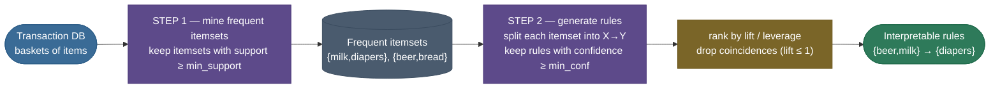
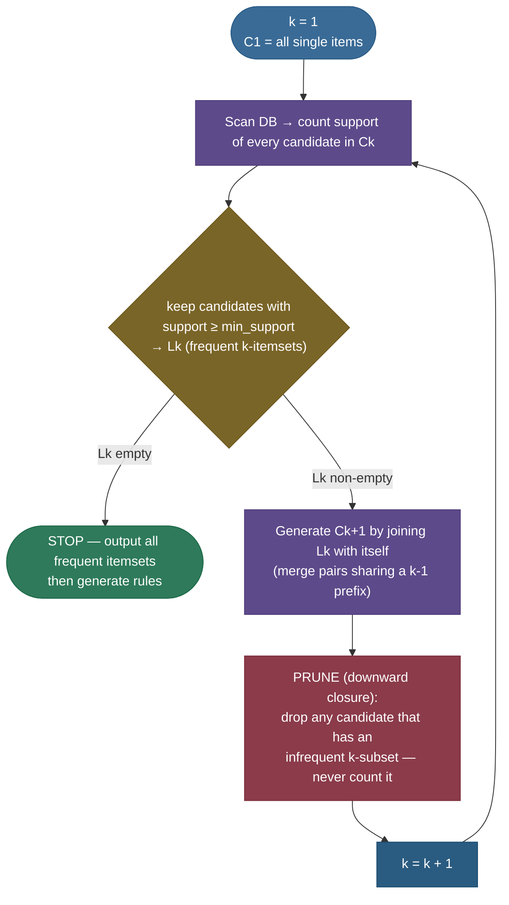

# Association Rule Learning: mining "if-then" patterns from baskets

Walk into any supermarket and you are walking through a dataset. Every checkout is a **transaction** — a set of items someone chose to buy *together*. Stack up a few million of those receipts and a question almost asks itself: *which things go together, and how strongly?* Not "which items are popular" (that's just counting), but **"if a shopper has X in their cart, how much more likely are they to also have Y?"** Answer that well and you can place beer next to the diapers, recommend the jam to the bread-and-butter buyer, and bundle the products that genuinely travel together. That is the entire job of **association rule learning**, and the famous (apocryphal but irresistible) "beer and diapers" story is its mascot.

What makes this topic worth a deep page — and a recurring interview question — is that it is **unsupervised** (no labels, no target column; the structure *is* the data) yet it produces something almost no other unsupervised method does: **human-readable rules**. A cluster is a blob you have to interpret; a rule like `{beer, milk} → {diapers}` is a sentence a category manager can act on this afternoon. The catch is that the space of possible rules is **astronomically large** (a store with 10,000 products has $2^{10000}$ possible itemsets), so the whole field is really about **two intertwined problems**: (1) how do you *measure* whether a pattern is interesting — and not just a coincidence driven by one very popular item — and (2) how do you *find* the interesting ones without enumerating the exponential space. I'm going to build both from the ground up.

By the end of this page you'll be able to:

- define the vocabulary precisely — **transaction, item, itemset, rule** $X \to Y$ — and never confuse a rule with an itemset again;
- **derive** every interestingness metric from probability — **support, confidence, lift, leverage, conviction** — and explain *which one to trust and why*;
- spot the **confidence trap** instantly (and show with numbers why **lift** fixes it);
- prove the **downward-closure / anti-monotonicity** property and explain exactly how **Apriori** uses it to prune the search;
- contrast Apriori with **FP-Growth** (no candidate generation, a compressed tree) and **Eclat** (vertical tid-lists), and say *when* each wins;
- run the whole pipeline in code and rank real rules by lift.

> **Note:** association rule learning finds **correlation, not causation, and not even prediction** in the supervised sense. `{diapers} → {beer}` says these co-occur more than chance — it does *not* say buying diapers *causes* beer purchases, nor is it a trained classifier. It's a descriptive, exploratory tool. Keeping that straight is the single most common thing interviewers probe.

---

## The vocabulary: transactions, items, itemsets, rules

Everything rests on four definitions, so let's pin them down with a tiny concrete database we'll reuse throughout.

Let the universe of **items** be $I = \{\text{bread}, \text{milk}, \text{diapers}, \text{beer}, \text{eggs}, \text{cola}\}$. A **transaction** $t$ is a subset of $I$ — one basket. A **database** $D$ is a multiset of transactions. Here is a 5-transaction database $D_5$ we'll compute on by hand:

| TID | Items in the basket |
|----:|---------------------|
| 1 | bread, milk |
| 2 | bread, diapers, beer, eggs |
| 3 | milk, diapers, beer, cola |
| 4 | bread, milk, diapers, beer |
| 5 | bread, milk, diapers, cola |

An **itemset** is *any* set of items, e.g. $\{\text{milk}, \text{diapers}\}$. A **$k$-itemset** has $k$ items. An itemset is something you *count*; it has no direction.

An **association rule** is an implication $X \to Y$ where $X$ (the **antecedent** / LHS) and $Y$ (the **consequent** / RHS) are **disjoint, non-empty itemsets** ($X \cap Y = \varnothing$). A rule *does* have direction, and that direction matters: `{bread} → {milk}` and `{milk} → {bread}` are different rules with different strengths, exactly as $P(B\mid A) \ne P(A\mid B)$ in general.

> **Gotcha:** an **itemset** and a **rule** are not the same object, and conflating them is the classic beginner error. `{bread, milk}` is an itemset (count it). `{bread} → {milk}` is a rule (a directional claim derived *from* that itemset by splitting it into LHS/RHS). Mining always goes **itemsets first, rules second** — you can't score a rule until you've counted the itemset it came from.



This two-step structure — **find frequent itemsets, then generate rules from them** — is the spine of the entire topic. Hold onto it; every algorithm below is just a different way of doing Step 1 efficiently.

---

## The metrics: turning "interesting" into numbers

The whole game is scoring patterns. Every metric below is a probability quantity in disguise, so I'll define each as a **probability** first (the honest definition), then as a **count ratio** (how you actually compute it), then give the **intuition** and the failure it guards against. Throughout, think of picking a transaction uniformly at random and let $P(X)$ mean "the probability that a random basket *contains* all of $X$."

### Support — how common is the pattern at all?

$$\operatorname{supp}(X) \;=\; P(X) \;=\; \frac{|\{t \in D : X \subseteq t\}|}{|D|}.$$

Support is just the **fraction of baskets that contain the itemset** $X$. For a rule $X \to Y$, the rule's support is the support of the *combined* itemset:

$$\operatorname{supp}(X \to Y) \;=\; P(X \cup Y) \;=\; \frac{|\{t : (X \cup Y) \subseteq t\}|}{|D|}.$$

Support answers *"is this pattern worth caring about at all?"* A rule with support $0.0001$ might be real but it touches one basket in ten thousand — usually not actionable, and statistically shaky. Support is the **frequency floor** we impose to keep the search tractable and the conclusions reliable.

> **Note:** support is **symmetric** — $\operatorname{supp}(X \cup Y)$ doesn't care which side is antecedent. It's a property of the *itemset*, which is exactly why Step 1 (mine frequent itemsets) is direction-free and Step 2 (split into rules) is where direction enters.

### Confidence — given X, how often does Y follow?

$$\operatorname{conf}(X \to Y) \;=\; P(Y \mid X) \;=\; \frac{P(X \cup Y)}{P(X)} \;=\; \frac{\operatorname{supp}(X \cup Y)}{\operatorname{supp}(X)}.$$

Confidence is the **conditional probability of the consequent given the antecedent** — the rule's "accuracy." `conf({beer} → {diapers}) = 0.8` reads "80% of baskets containing beer also contain diapers." This is the metric people reach for first because it sounds like exactly what we want… and it has a treacherous blind spot we'll expose in a moment.

### Lift — is X→Y better than chance?

$$\operatorname{lift}(X \to Y) \;=\; \frac{\operatorname{conf}(X \to Y)}{\operatorname{supp}(Y)} \;=\; \frac{P(Y \mid X)}{P(Y)} \;=\; \frac{P(X \cup Y)}{P(X)\,P(Y)}.$$

Lift compares the rule's confidence against the **baseline rate of $Y$**. Read the last form carefully: $P(X)P(Y)$ is exactly what $P(X \cup Y)$ *would* be if $X$ and $Y$ were **statistically independent**. So lift is the ratio of *observed* co-occurrence to *expected-under-independence* co-occurrence:

- $\operatorname{lift} = 1$ → $X$ and $Y$ are **independent**; the rule carries no information. **This is the baseline.**
- $\operatorname{lift} > 1$ → $X$ and $Y$ are **positively associated**; seeing $X$ makes $Y$ *more* likely than usual. These are the rules you want.
- $\operatorname{lift} < 1$ → **negatively associated** (substitutes); seeing $X$ makes $Y$ *less* likely (e.g. `{Coke} → {Pepsi}` — buy one, you skip the other).

Lift is **symmetric** ($\operatorname{lift}(X\to Y) = \operatorname{lift}(Y \to X)$, since the formula $\frac{P(X\cup Y)}{P(X)P(Y)}$ doesn't distinguish sides) — it measures *association*, not direction. That symmetry is a feature for "do these go together?" and a limitation for "which way does the recommendation point?"

> **Tip:** the single most useful sentence about lift: *"lift is observed co-occurrence divided by what you'd expect if the two were independent."* Memorize the independence baseline of **1**. Everything above 1 is signal; everything at or below is noise or substitution.

### The confidence trap (and why lift rescues you)

Here is the failure that separates people who *know* the metrics from people who *recite* them. **A high-confidence rule can be completely worthless.** Watch.

In our 5-transaction $D_5$: milk appears in baskets 1, 3, 4, 5 → $\operatorname{supp}(\text{milk}) = 4/5 = 0.8$. Milk is just *very popular*. Now consider the rule `{bread} → {milk}`. Bread is in baskets 1, 2, 4, 5 ($\operatorname{supp} = 0.8$); bread-and-milk together is in 1, 4, 5 ($\operatorname{supp} = 0.6$). So:

$$\operatorname{conf}(\text{bread} \to \text{milk}) = \frac{0.6}{0.8} = 0.75.$$

**75% confidence!** Sounds like a strong rule — "buy bread, you'll probably buy milk." But milk is *already* in 80% of all baskets. Does knowing about bread make milk **more** likely? Check the lift:

$$\operatorname{lift}(\text{bread} \to \text{milk}) = \frac{0.75}{0.8} = 0.94 < 1.$$

The lift is **below 1**: a bread-buyer is actually *slightly less* likely to buy milk than a random shopper. The 75% confidence was an illusion manufactured entirely by milk's popularity — any rule pointing *at* milk will have high confidence, because milk is everywhere. **Confidence alone rewards popular consequents.** Lift divides that popularity back out, exposing that the "rule" is worse than chance. This is *the* canonical interview point: **always sanity-check confidence against lift.**

> **Gotcha:** confidence ignores $P(Y)$ entirely — it's blind to how popular the consequent already is. A store could "discover" that everyone who buys anything also buys shopping bags with 99% confidence; lift would (correctly) say ≈1: the bags are just always there. Whenever a high-confidence rule has a very frequent RHS, suspect the trap and look at lift.

### Leverage — the absolute version of lift

Lift is a *ratio*; **leverage** is the same idea as a *difference*:

$$\operatorname{leverage}(X \to Y) \;=\; P(X \cup Y) - P(X)\,P(Y) \;=\; \operatorname{supp}(X \cup Y) - \operatorname{supp}(X)\operatorname{supp}(Y).$$

Leverage measures *"how many more co-occurrences than independence predicts,"* as a fraction of all transactions. It is **0** under independence (the same baseline as lift = 1), positive for positive association. Why bother when we have lift? Because **lift can be huge for tiny, rare itemsets** — two items each appearing in 1% of baskets but always together get a lift of ~100, which looks spectacular but rests on almost no data. Leverage is anchored to *absolute* frequency, so it won't get excited about a pattern that barely exists. Use leverage (or its cousin **conviction**, below) to **rank** rules when you want volume to matter, and lift to measure raw association strength.

### Conviction — directional, and sensitive to wrong predictions

$$\operatorname{conviction}(X \to Y) \;=\; \frac{1 - \operatorname{supp}(Y)}{1 - \operatorname{conf}(X \to Y)} \;=\; \frac{P(\neg Y)}{P(\neg Y \mid X)}.$$

Conviction is the cleverest of the bunch. The numerator $1 - \operatorname{supp}(Y) = P(\neg Y)$ is how often $Y$ is *absent* overall; the denominator $1 - \operatorname{conf} = P(\neg Y \mid X)$ is how often $Y$ is absent *given $X$* — i.e. how often the rule is **violated**. So conviction is the ratio of the expected violation rate (under independence) to the observed violation rate. Reading it:

- $\operatorname{conviction} = 1$ → independence (again the baseline);
- $\operatorname{conviction} \to \infty$ as $\operatorname{conf} \to 1$ → the rule is *never* violated (perfect implication);
- $\operatorname{conviction} < 1$ → the rule is violated *more* than chance (negative association).

Unlike lift, conviction is **directional** ($\operatorname{conviction}(X\to Y) \ne \operatorname{conviction}(Y\to X)$), which makes it better for "does $X$ genuinely imply $Y$?" It also rewards *logical implication* — it shoots up precisely when the rule has few counterexamples, which lift does not capture.

### Symmetric vs directional, made numeric

One more numeric anchor, because "lift is symmetric, conviction is directional" is far stickier as numbers than as words. On $D_5$, take the genuine association `{diapers} → {beer}` and its reverse `{beer} → {diapers}`. Supports: $\operatorname{supp}(\text{diapers})=4/5=0.8$, $\operatorname{supp}(\text{beer})=3/5=0.6$, $\operatorname{supp}(\text{diapers}\cup\text{beer})=3/5=0.6$.

$$\operatorname{lift}(\text{diapers}\to\text{beer}) = \frac{0.6}{0.8 \cdot 0.6} = 1.25, \qquad \operatorname{lift}(\text{beer}\to\text{diapers}) = \frac{0.6}{0.6 \cdot 0.8} = 1.25.$$

**Identical** — lift can't tell the two directions apart. Now conviction:

$$\operatorname{conf}(\text{diapers}\to\text{beer}) = \tfrac{0.6}{0.8} = 0.75 \;\Rightarrow\; \operatorname{conviction} = \tfrac{1-0.6}{1-0.75} = \tfrac{0.4}{0.25} = 1.60,$$
$$\operatorname{conf}(\text{beer}\to\text{diapers}) = \tfrac{0.6}{0.6} = 1.00 \;\Rightarrow\; \operatorname{conviction} = \tfrac{1-0.8}{1-1.00} = \tfrac{0.2}{0} = \infty.$$

**Wildly different.** Conviction says `{beer} → {diapers}` is a *perfect* implication (every beer basket here also has diapers, so it's never violated → ∞), while `{diapers} → {beer}` is merely strong (1.60). That asymmetry — invisible to lift — is exactly what you want when the question is "which direction should the recommendation point?" Lift answers *"are these associated?"*; conviction answers *"does $X$ imply $Y$?"*

> **Note:** there is no single "best" metric — they answer different questions. **Support** = is it frequent? **Confidence** = how reliable, but popularity-biased. **Lift** = how much better than chance (symmetric). **Leverage** = lift's absolute, volume-aware twin. **Conviction** = directional implication strength. A practical pipeline filters on **support + confidence**, then **ranks** the survivors by **lift** (or leverage/conviction). Michael Hahsler's [survey of interestingness measures](https://mhahsler.github.io/arules/docs/measures) catalogs *dozens* more — these five are the load-bearing ones.


---

## The two-step task, stated precisely

We can now state the problem the way every algorithm solves it. Given thresholds `min_support` $\sigma$ and `min_confidence` $\gamma$:

1. **Frequent itemset mining.** Find **all** itemsets $X$ with $\operatorname{supp}(X) \ge \sigma$. This is the hard, expensive part.
2. **Rule generation.** For each frequent itemset $Z$, consider every way to split it into a non-empty antecedent and consequent $X \to (Z \setminus X)$, and keep the rules with $\operatorname{conf} \ge \gamma$. This is comparatively cheap — all the supports it needs were already computed in Step 1.

Why split it this way? Because **confidence needs support**: $\operatorname{conf}(X \to Y) = \operatorname{supp}(X\cup Y)/\operatorname{supp}(X)$, and both supports are itemset supports. Once Step 1 has tabulated the support of every frequent itemset, Step 2 is pure arithmetic. So the entire computational war is fought in Step 1 — and that's where the combinatorial monster lives.

### The combinatorial explosion

With $d$ distinct items there are $2^d - 1$ non-empty itemsets. For $d = 100$ that's $\approx 1.27 \times 10^{30}$ — you cannot enumerate them, let alone scan the database once per itemset. A naive "count the support of every possible itemset" is hopeless. **`min_support` is the lever that tames this**: by demanding $\operatorname{supp}(X) \ge \sigma$, we get to *throw away* the vast majority of itemsets unexamined — *if* we have a property that lets us prune without counting. That property is the heart of Apriori.

---

## Apriori: prune the exponential space with downward closure

[Agrawal & Srikant (1994)](https://www.macs.hw.ac.uk/~dwcorne/Teaching/agrawal94fast.pdf) gave the first practical algorithm, and its engine is one beautiful observation.

### The downward-closure (anti-monotonicity) property

> **The A-priori principle.** *Every subset of a frequent itemset is itself frequent.* Equivalently (contrapositive): *every superset of an infrequent itemset is infrequent.*

**Proof (one line, but worth seeing).** Support is monotone under subset: if $A \subseteq B$ then any transaction containing $B$ also contains $A$, so $\{t : B \subseteq t\} \subseteq \{t : A \subseteq t\}$, hence $\operatorname{supp}(A) \ge \operatorname{supp}(B)$. Now if $B$ is frequent ($\operatorname{supp}(B) \ge \sigma$) then for any subset $A$, $\operatorname{supp}(A) \ge \operatorname{supp}(B) \ge \sigma$, so $A$ is frequent too. Contrapositively, if $A$ is *in*frequent then every superset $B \supseteq A$ has $\operatorname{supp}(B) \le \operatorname{supp}(A) < \sigma$, so $B$ is infrequent. $\;\blacksquare$

This is called **anti-monotonicity** of the "is infrequent" predicate: infrequency only *grows* as you add items. The payoff is enormous: **the moment you discover an itemset is infrequent, you can delete its entire upward cone — all of its supersets — without ever counting them.** That single rule is what turns $2^d$ into something tractable.


### The level-wise algorithm

Apriori exploits the principle by sweeping the lattice **level by level** (by itemset size $k$), generating candidates for level $k{+}1$ only from frequent itemsets at level $k$:



Two sub-steps deserve a closer look:

- **Candidate generation (the join).** To build candidate $(k{+}1)$-itemsets $C_{k+1}$, take pairs of frequent $k$-itemsets in $L_k$ that **share their first $k{-}1$ items** and union them. (Keeping items in a canonical sorted order makes "share the prefix" a cheap check and avoids generating the same candidate twice.)
- **Candidate pruning (the principle).** Before spending a database scan to count a candidate $c$, check that **all** of its $k$-subsets are in $L_k$. If even one is missing (infrequent), $c$ can't be frequent — discard it immediately. This is downward closure doing the heavy lifting *before* any counting.

Then one database scan counts the surviving candidates, the infrequent ones are dropped to form $L_{k+1}$, and the loop repeats until a level produces nothing. The output is the union of all $L_k$ — every frequent itemset.

**What does this cost?** In the worst case Apriori is still exponential — if everything is frequent, the lattice is fully explored and no pruning helps. But on real, sparse data the pruning is dramatic: the number of database passes equals the size of the *longest* frequent itemset (rarely more than a handful), and each pass examines only the surviving candidates. The dominant practical cost is therefore the **repeated I/O** (one pass per level) and, on dense data, the **candidate-set size** at the widest level — a 1-itemset count of $m$ can spawn up to $\binom{m}{2}$ candidate pairs before pruning. Those two costs are exactly what FP-Growth (two scans, no candidates) and Eclat (in-memory intersections) were designed to eliminate.

> **Gotcha:** Apriori's cost is **database scans** — one full pass per level $k$. For a database that doesn't fit in memory, those repeated I/O passes dominate the runtime. That's the weakness FP-Growth was invented to fix (it needs just **two** scans, total), and it's the trade-off interviewers love to surface.

> **Tip:** raising `min_support` shrinks $L_1$, which cascades — fewer frequent singletons means dramatically fewer candidate pairs, triples, and so on. Support is the throttle on the whole combinatorial pipeline; a tiny increase can cut runtime by orders of magnitude. The art is setting it low enough to catch real patterns but high enough to finish.

---

## Generating rules from a frequent itemset (and pruning *those*)

Step 1 hands Step 2 a frequent itemset $Z$ along with its support. Now generate rules. A frequent itemset of size $k$ can be split into $2^k - 2$ candidate rules (every non-empty proper subset as antecedent). For $Z = \{a,b,c\}$ that's six: $\{a,b\}\to\{c\}$, $\{a,c\}\to\{b\}$, $\{b,c\}\to\{a\}$, $\{a\}\to\{b,c\}$, $\{b\}\to\{a,c\}$, $\{c\}\to\{a,b\}$. Keep the ones with $\operatorname{conf} \ge \gamma$.

There's a second anti-monotone trick here, and it's elegant. Fix the itemset $Z$. As you **move items from the antecedent to the consequent** (shrinking the LHS), confidence can only *decrease*:

$$\operatorname{conf}(X \to Z\setminus X) = \frac{\operatorname{supp}(Z)}{\operatorname{supp}(X)},$$

and a smaller $X$ has *larger* support (subset monotonicity again), so the ratio gets smaller. Therefore: **if a rule with consequent $Y$ fails the confidence threshold, every rule whose consequent is a superset of $Y$ also fails** — and can be pruned without checking. So rule generation also proceeds level-wise (by consequent size), pruning whole families of low-confidence rules at once. The supports it needs ($\operatorname{supp}(Z)$ and $\operatorname{supp}(X)$) are already in hand from Step 1, so this stage is fast.

> **Note:** notice every rule out of one frequent itemset $Z$ shares the **same numerator** $\operatorname{supp}(Z)$ — only the antecedent's support changes. That's why all six rules above can be scored instantly from the support table, and why Step 1 is the only place we pay for database access.

### Why we prune on support, not confidence or lift

A subtle but important point that separates a deep answer from a shallow one: **the level-wise pruning works *only* because support is anti-monotone, and most other metrics are not.** Support never *increases* as you add items to an itemset (subset monotonicity), which is precisely what lets us discard supersets of an infrequent itemset. **Confidence has no such structure** — adding an item to the antecedent can raise *or* lower confidence unpredictably, so you cannot prune the rule space by confidence the way you prune the itemset space by support. **Lift is likewise non-monotone.** This is the deep reason the task is split the way it is: do the *prunable* search (frequent itemsets, on the anti-monotone support metric) first and exhaustively, then handle the *non-prunable* metrics (confidence, lift) cheaply afterward on the small surviving set. The architecture of the whole field follows from this single mathematical fact.

> **Note:** "downward closure" and "anti-monotonicity" name the same property: a predicate ("is frequent") that, if it holds for a set, holds for all subsets — equivalently, its negation ("is infrequent") propagates *upward* to all supersets. Any constraint with this shape (e.g. a maximum-size constraint) is prunable the same way; constraints without it (average price within a range) need different machinery. Recognizing which constraints are anti-monotone is the key to extending these algorithms.

---

## FP-Growth: mine frequent patterns without generating candidates

Apriori's two pains — *many* candidates and *many* scans — both come from the same source: it explicitly enumerates and counts candidate itemsets. [Han, Pei & Yin (2000)](https://link.springer.com/article/10.1023/B:DAMI.0000005258.31418.83) asked: what if we never generate candidates at all? Their answer, **FP-Growth**, is usually **an order of magnitude faster** and needs only **two database scans**.

The idea has two moves. **First, compress the database into a tree.** Scan once to count single-item frequencies and drop the infrequent ones. Scan again, and for each transaction, sort its (frequent) items in **descending frequency order** and insert that ordered list as a path into a prefix tree — the **FP-tree** — where transactions sharing a prefix **share a path** and each node carries a count. Frequent items, being common, land near the root and get shared heavily, so the whole database collapses into a compact structure. A **header table** links all nodes of the same item together so you can find every occurrence quickly.


**Second, mine the tree recursively by pattern growth.** For each item (starting from the least frequent in the header table), follow its node-links to gather its **conditional pattern base** — the set of prefix paths that co-occur with it, each weighted by the item's count there. From those paths build a smaller **conditional FP-tree**, and recurse: every frequent itemset is grown by *prefixing* the current item onto the patterns found in its conditional tree. No candidates are ever generated and tested; frequent itemsets emerge directly from the structure of the tree.

> **Tip:** the mental model — **Apriori is breadth-first (level by level across the whole lattice); FP-Growth is depth-first (grow one item's patterns fully, then the next)**. FP-Growth wins big on **dense** data with long frequent patterns and on data that's expensive to scan, because the tree replaces repeated I/O with in-memory traversal. Apriori can still be competitive on **sparse** data with a high support threshold, where few candidates survive and the tree's bookkeeping isn't worth it.

> **Gotcha:** FP-Growth's tree must (ideally) fit in memory. On a database so large and diverse that the FP-tree itself is enormous, the advantage erodes and projection/partitioning variants (or distributed implementations like Spark's **FP-Growth**) come into play. "Faster" is the common case, not a universal law.

### Pattern growth in one trace

Pattern growth is best felt on one item. In the FP-tree above, the header table (descending frequency) is `c:4, f:4, a:3, b:3, m:3, p:3`. Start from the *least* frequent mined item — say **p** — and follow its node-links. The paths ending in `p` are `⟨c, f, a, m, p⟩` (count 2) and `⟨c, b, p⟩` (count 1). Stripping `p` itself, p's **conditional pattern base** is:

$$\{c, f, a, m\}:2, \qquad \{c, b\}:1.$$

Now count items *within this conditional base*: $c$ appears $2+1 = 3$ times, while $f, a, m, b$ each appear at most 2 times — below `min_support_count = 3`. So the only frequent item in p's conditional tree is **c**, giving the frequent pattern $\{c, p\}$ with support count 3. Move to the next header item (**m**) and repeat: m's conditional base is $\{c, f, a\}:2$ and $\{c, f, a, b\}:1$, where $c, f, a$ each appear 3 times — yielding the conditional FP-tree path $c{-}f{-}a$ and the patterns $\{c,m\}, \{f,m\}, \{a,m\}, \{c,f,m\}, \{c,a,m\}, \{f,a,m\}, \{c,f,a,m\}$ (all support 3). **No candidate was ever generated and tested against the database** — every frequent pattern fell straight out of the conditional trees. That is the whole trick: recursion over conditional FP-trees replaces Apriori's generate-and-test.

---

## Eclat: go vertical with tid-lists

[Zaki (2000)](https://www.cs.rpi.edu/~zaki/PaperDir/TKDE00.pdf) attacked the same problem from a different data layout. Instead of the **horizontal** format (TID → items), **Eclat** transposes the database into a **vertical** format: each item maps to its **tid-list** — the set of transaction IDs that contain it. For example $t(\text{milk}) = \{1,3,4,5\}$.

The magic: the support of an itemset is just the **size of the intersection of its items' tid-lists**, and you build bigger itemsets by **intersecting tid-lists**:

$$t(X \cup Y) = t(X) \cap t(Y), \qquad \operatorname{supp}(X \cup Y) = \frac{|t(X) \cap t(Y)|}{|D|}.$$

So Eclat does a **depth-first** search intersecting tid-lists — no candidate-counting passes over the database, no tree to build. It's memory-frugal and cache-friendly, and a refinement called **dEclat** stores **diffsets** (only the *differences* between a child's and parent's tid-lists) to shrink memory further on dense data. Eclat shines when tid-lists are short (sparse data) and the recursion stays shallow.

> **Note:** three algorithms, three representations of the *same* problem: **Apriori** counts over the **horizontal** layout breadth-first; **Eclat** intersects **vertical** tid-lists depth-first; **FP-Growth** grows patterns over a **compressed prefix tree** depth-first. They all return the **identical** set of frequent itemsets — they differ only in *how* they get there and which data shapes they like. Knowing which to reach for (and why) is the senior-level answer.

### Eclat by hand: tid-list intersection

Make it concrete on $D_5$. Build each item's tid-list (the baskets it appears in), then intersect to climb the lattice:

$$t(\text{bread}) = \{1,2,4,5\}, \quad t(\text{milk}) = \{1,3,4,5\}, \quad t(\text{diapers}) = \{2,3,4,5\}, \quad t(\text{beer}) = \{2,3,4\}.$$

To get the support of $\{\text{diapers}, \text{beer}\}$, intersect: $t(\text{diapers}) \cap t(\text{beer}) = \{2,3,4,5\} \cap \{2,3,4\} = \{2,3,4\}$, so support $= 3/5 = 0.6$ — no database rescan, just a set intersection. Go one level deeper: $\{\text{diapers}, \text{beer}, \text{milk}\}$ is $\{2,3,4\} \cap \{1,3,4,5\} = \{3,4\}$, support $2/5 = 0.4$ — exactly the number we computed by hand in Worked Example 1. Eclat's whole runtime is these intersections, and the tid-lists *shrink* as itemsets grow (a superset's tid-list is a subset of each component's), so deep itemsets are cheap. That shrinking is also why the depth-first recursion stays memory-bounded.

### A side-by-side comparison

| | **Apriori** | **FP-Growth** | **Eclat** |
|---|---|---|---|
| Data layout | horizontal (TID → items) | compressed prefix tree | vertical (item → tid-list) |
| Search order | breadth-first (level by level) | depth-first (pattern growth) | depth-first (tid-list intersection) |
| Candidate generation | yes (explicit join + prune) | **none** | none (intersections only) |
| Database scans | one **per level** | **two** total | two (build tid-lists, then intersect in memory) |
| Best when | sparse data, high support, few candidates | **dense** data, long patterns, costly scans | sparse data, short tid-lists |
| Main weakness | repeated I/O; candidate blow-up | FP-tree must fit in memory | intersection cost on dense/long tid-lists |
| Output | identical frequent itemsets | identical frequent itemsets | identical frequent itemsets |

> **Tip:** in interviews the crisp summary is: *"Apriori generates-and-tests candidates breadth-first with one scan per level; FP-Growth eliminates candidates entirely via a prefix tree in two scans; Eclat intersects vertical tid-lists depth-first. Same answer, different cost profiles — pick by data density and how expensive a scan is."*

---

## Closed and maximal itemsets: taming redundancy

A real mine can return a flood of itemsets, many redundant. Two compressions matter:

- An itemset is **closed** if **none** of its immediate supersets has the *same* support. Closed itemsets are a **lossless** summary — from them you can recover the exact support of *every* frequent itemset.
- An itemset is **maximal** if **none** of its supersets is frequent at all. Maximal itemsets are a **lossy** summary — they tell you *which* itemsets are frequent but not their exact supports (you lose the counts of the sub-itemsets).

The containment is $\text{maximal} \subseteq \text{closed} \subseteq \text{frequent}$. Mining only closed (CLOSET, CHARM) or maximal itemsets can shrink the output by orders of magnitude with little or no loss, and is the standard fix when "too many rules" overwhelms the analyst.

> **Tip:** "I'm drowning in thousands of rules" is a real production complaint with three standard answers: **(1)** raise `min_support`/`min_confidence`; **(2)** mine **closed** or **maximal** itemsets to kill redundancy; **(3)** **rank by lift or leverage** and look only at the top. Reach for these before hand-curating.

---

## Choosing thresholds: a practical playbook

The two knobs, `min_support` and `min_confidence`, decide everything — how long the mine takes, how many rules survive, and whether they're trustworthy. Here is how I'd actually set them.

1. **Start with `min_support`, and start data-driven.** Look at item frequencies first. A reasonable opening move is to set support so that a frequent itemset must appear in at least a few *hundred* baskets (absolute count, not fraction), because rules backed by single-digit counts are statistically fragile no matter how high their lift. On a million-transaction log that might be `min_support = 0.0005`; on a 1,000-row dataset it might be `0.05`. **Think in absolute counts, then convert to a fraction.**
2. **Run, measure, adjust.** If the mine is too slow or returns a flood of itemsets, *raise* support (it cascades — fewer singletons means far fewer pairs/triples). If it returns almost nothing, *lower* it. Support is the throttle; sweep it before touching anything else.
3. **Set `min_confidence` as a reliability floor, not a ranker.** A common default is `0.5`–`0.8` to keep only reasonably reliable rules — but never *rank* by confidence (the trap). Use it only to discard obviously weak implications.
4. **Always finish by ranking on lift (or leverage), and filter `lift > 1`.** This is the step that turns "rules that passed the thresholds" into "rules worth acting on." Drop anything with $\operatorname{lift} \le 1$ outright — those are coincidences or substitutes.
5. **Sanity-check the survivors.** For each top rule, glance at *both* support and lift: high lift on tiny support is a false alarm; modest lift on large support is often the genuine, bankable pattern. Leverage captures exactly this balance in one number.

> **Note:** there's an asymmetry worth internalizing: **support is set *before* mining** (it controls the search and must be chosen up front to make it tractable), while **lift, leverage, and conviction are computed *after*** (they rank the survivors and need no rescan, since all supports are already known). Confidence sits in between — a cheap post-filter, but a dangerous ranker.

> **Gotcha:** lowering `min_support` to "not miss anything" is the most common self-inflicted wound. It can turn a seconds-long mine into one that never finishes *and* bury the real rules under millions of spurious ones. If you genuinely need rare-but-valuable itemsets, reach for **multiple-minimum-support** mining (per-item thresholds — a high bar for milk, a low bar for caviar) rather than dropping the global floor.

---

## Worked example 1 — every metric, by hand

Let's nail the metrics on $D_5$ (the 5-transaction table above) for the rule `{diapers, beer} → {milk}`. First gather the raw supports by counting baskets.

- $X = \{\text{diapers}, \text{beer}\}$ appears in baskets **2, 3, 4** → $\operatorname{supp}(X) = 3/5 = 0.6$.
- $Y = \{\text{milk}\}$ appears in **1, 3, 4, 5** → $\operatorname{supp}(Y) = 4/5 = 0.8$.
- $X \cup Y = \{\text{diapers}, \text{beer}, \text{milk}\}$ appears in **3, 4** → $\operatorname{supp}(X \cup Y) = 2/5 = 0.4$.

Now turn the crank:

$$\operatorname{conf} = \frac{\operatorname{supp}(X\cup Y)}{\operatorname{supp}(X)} = \frac{0.4}{0.6} = 0.667, \qquad \operatorname{lift} = \frac{\operatorname{conf}}{\operatorname{supp}(Y)} = \frac{0.667}{0.8} = 0.833.$$

$$\operatorname{leverage} = 0.4 - (0.6)(0.8) = 0.4 - 0.48 = -0.080, \qquad \operatorname{conviction} = \frac{1 - 0.8}{1 - 0.667} = \frac{0.2}{0.333} = 0.60.$$

**Read the verdict.** Confidence 0.667 looks decent, but **lift 0.833 < 1**, **leverage −0.08 < 0**, and **conviction 0.60 < 1** all agree: this is a *negative* association. Diapers-and-beer buyers are *less* likely to also grab milk than the average shopper — because milk is already in 80% of baskets and these beer-stocking trips skew away from it. Three independent metrics, one consistent story: **don't promote this rule, even though its confidence sounded fine.** (These exact numbers are reproduced by the code below — hand and library agree.)

---

## Worked example 2 — a full Apriori pass with anti-monotone pruning

Now Step 1 end to end, on an 8-transaction database over items $\{A, B, C, D\}$ with `min_support = 0.25` (i.e. an itemset must appear in $\ge 2$ of 8 baskets). This is the database behind the lattice diagram, deliberately built so $A$ and $B$ rarely meet.

| TID | Items |  | TID | Items |
|----:|-------|--|----:|-------|
| 1 | A, C, D | | 5 | A, C |
| 2 | B, C | | 6 | A, C, D |
| 3 | A, C, D | | 7 | B, C, D |
| 4 | B, C, D | | 8 | A, B, C |

**Level 1 — count singletons.** $\operatorname{supp}(A)=5/8=0.62$, $\operatorname{supp}(B)=4/8=0.50$, $\operatorname{supp}(C)=8/8=1.00$, $\operatorname{supp}(D)=5/8=0.62$. All $\ge 0.25$, so $L_1 = \{A, B, C, D\}$.

**Level 2 — join $L_1$ with itself → 6 candidate pairs, count them.**

$$\operatorname{supp}(AB) = 1/8 = 0.12, \;\; \operatorname{supp}(AC)=0.62, \;\; \operatorname{supp}(AD)=0.38,$$
$$\operatorname{supp}(BC)=0.50, \;\; \operatorname{supp}(BD)=0.25, \;\; \operatorname{supp}(CD)=0.62.$$

Only $\{A,B\}$ falls below 0.25 (A and B share just basket 8). So $L_2 = \{AC, AD, BC, BD, CD\}$ — and **$\{A,B\}$ is now marked infrequent.**

**Level 3 — here downward closure earns its keep.** Naively there are $\binom{4}{3}=4$ candidate triples: $ABC, ABD, ACD, BCD$. But before counting, we prune: a triple survives only if **all three of its 2-subsets are in $L_2$**.

- $ABC$: its subset $\{A,B\} \notin L_2$ → **PRUNED, never counted.**
- $ABD$: its subset $\{A,B\} \notin L_2$ → **PRUNED, never counted.**
- $ACD$: subsets $\{A,C\},\{A,D\},\{C,D\}$ all in $L_2$ → survives. Count: $\operatorname{supp}(ACD)=2/8=0.38 \ge 0.25$ ✓
- $BCD$: subsets $\{B,C\},\{B,D\},\{C,D\}$ all in $L_2$ → survives. Count: $\operatorname{supp}(BCD)=2/8=0.25 \ge 0.25$ ✓

So $L_3 = \{ACD, BCD\}$. Two of the four candidate triples were **eliminated by the principle alone** — we never scanned the database for them. **Level 4:** the only possible 4-itemset $\{A,B,C,D\}$ needs $\{A,B,C\}$ frequent, which it isn't, so it's pruned and the algorithm stops. Final frequent itemsets: the four singletons, five pairs, and two triples — **11 in total** (verified by the from-scratch code below). On this toy the savings are 2 candidates; on a real database with thousands of items, this same pruning is the difference between *minutes* and *never finishing*.

---

## Worked example 3 — lift and leverage expose a misleading rule (numerically)

Worked example 1 already caught one trap; here's the sharper, **direct** comparison that should live in your head. Take `{bread} → {milk}` on $D_5$ from the confidence-trap section and lay it next to a *genuine* rule, `{diapers} → {beer}`.

| Rule | supp(X∪Y) | conf | supp(Y) | **lift** | leverage | verdict |
|------|:---------:|:----:|:-------:|:--------:|:--------:|--------|
| `{bread} → {milk}` | 0.60 | **0.75** | 0.80 | **0.94** | −0.04 | high conf, **lift < 1 → worthless** |
| `{diapers} → {beer}` | 0.60 | **0.75** | 0.60 | **1.25** | +0.12 | high conf **and** lift > 1 → real |

Both rules have **identical confidence (0.75)** — a confidence-only ranking would treat them as equally good. But the lift tells two opposite stories: `{bread} → {milk}` has lift 0.94 (a bread-buyer is *less* likely than average to buy milk — milk is simply ubiquitous), while `{diapers} → {beer}` has lift 1.25 (a diaper-buyer is genuinely 25% more likely than average to buy beer — the famous association). Leverage confirms it: −0.04 vs +0.12. **This is the whole argument for lift in one table:** confidence cannot distinguish a real pattern from a popularity artifact; lift can. Always rank by lift (or leverage), never by confidence alone.

---

## Worked example 4 — measured Apriori + rules with mlxtend

Now the real thing on a 10-transaction grocery database, with [mlxtend](https://rasbt.github.io/mlxtend/user_guide/frequent_patterns/apriori/). Everything runs on CPU in well under a second.

```python
"""Association rule mining: hand metrics, from-scratch Apriori, and mlxtend.
Verified on Python 3.12 (mlxtend 0.25, pandas 2.x)."""
import pandas as pd
from itertools import combinations
from mlxtend.preprocessing import TransactionEncoder
from mlxtend.frequent_patterns import apriori, association_rules

# ---- (A) Worked example 1: metrics BY HAND on the 5-transaction DB ----
T = [
    {"bread", "milk"},
    {"bread", "diapers", "beer", "eggs"},
    {"milk", "diapers", "beer", "cola"},
    {"bread", "milk", "diapers", "beer"},
    {"bread", "milk", "diapers", "cola"},
]
n = len(T)
def supp(items):                       # support = fraction of baskets containing all items
    items = set(items)
    return sum(1 for t in T if items.issubset(t)) / n

sX, sXY, sY = supp({"diapers","beer"}), supp({"diapers","beer","milk"}), supp({"milk"})
conf = sXY / sX
lift = conf / sY
lev  = sXY - sX * sY
conv = (1 - sY) / (1 - conf)
print("{diapers,beer} -> {milk}:")
print(f"  supp={sXY:.3f} conf={conf:.3f} lift={lift:.3f} leverage={lev:.3f} conviction={conv:.3f}")

# ---- (B) From-scratch Apriori on the 8-transaction lattice DB ----
DB8 = [{"A","C","D"},{"B","C"},{"A","C","D"},{"B","C","D"},
       {"A","C"},{"A","C","D"},{"B","C","D"},{"A","B","C"}]
def support8(s):
    s = set(s); return sum(1 for t in DB8 if s.issubset(t)) / len(DB8)

def apriori_scratch(min_sup):
    items = sorted({i for t in DB8 for i in t})
    L = {frozenset([i]) for i in items if support8([i]) >= min_sup}
    all_freq, k = {s: support8(s) for s in L}, 1
    while L:
        k += 1
        # JOIN: union frequent k-itemsets, keep those of size k+1
        cand = {a | b for a in L for b in L if len(a | b) == k}
        # PRUNE (downward closure): every k-subset must already be frequent
        cand = {c for c in cand if all(frozenset(s) in L for s in combinations(c, k-1))}
        L = {c for c in cand if support8(c) >= min_sup}
        all_freq.update({s: support8(s) for s in L})
    return all_freq

freq8 = apriori_scratch(0.25)
print(f"\nfrom-scratch Apriori found {len(freq8)} frequent itemsets:")
for s in sorted(freq8, key=lambda x: (len(x), sorted(x))):
    print(f"  {{{','.join(sorted(s))}}}  supp={freq8[s]:.2f}")

# ---- (C) Worked example 4: mlxtend on a 10-transaction grocery DB ----
GROCERIES = [
    ["bread","milk"], ["bread","diapers","beer","eggs"],
    ["milk","diapers","beer","cola"], ["bread","milk","diapers","beer"],
    ["bread","milk","diapers","cola"], ["bread","milk","diapers","beer"],
    ["milk","diapers","cola"], ["bread","beer"],
    ["bread","milk","beer","diapers"], ["milk","cola"],
]
te = TransactionEncoder()
df = pd.DataFrame(te.fit(GROCERIES).transform(GROCERIES), columns=te.columns_)
freq = apriori(df, min_support=0.3, use_colnames=True)                    # STEP 1
rules = association_rules(freq, metric="confidence", min_threshold=0.5)   # STEP 2
rules = rules.sort_values(["lift", "confidence"], ascending=False)        # ties broken by conf
fmt = lambda s: "{" + ", ".join(sorted(s)) + "}"
print(f"\nmlxtend: {len(freq)} frequent itemsets, {len(rules)} rules. Top 6 by lift:")
for _, r in rules.head(6).iterrows():
    print(f"  {fmt(r['antecedents'])} -> {fmt(r['consequents'])}: "
          f"supp={r['support']:.2f} conf={r['confidence']:.2f} lift={r['lift']:.2f}")
```

Reproducible output:

```
{diapers,beer} -> {milk}:
  supp=0.400 conf=0.667 lift=0.833 leverage=-0.080 conviction=0.600

from-scratch Apriori found 11 frequent itemsets:
  {A}  supp=0.62
  {B}  supp=0.50
  {C}  supp=1.00
  {D}  supp=0.62
  {A,C}  supp=0.62
  {A,D}  supp=0.38
  {B,C}  supp=0.50
  {B,D}  supp=0.25
  {C,D}  supp=0.62
  {A,C,D}  supp=0.38
  {B,C,D}  supp=0.25

mlxtend: 19 frequent itemsets, 52 rules. Top 6 by lift:
  {beer, milk} -> {bread, diapers}: supp=0.30 conf=0.75 lift=1.50
  {bread, diapers} -> {beer, milk}: supp=0.30 conf=0.60 lift=1.50
  {beer, milk} -> {diapers}: supp=0.40 conf=1.00 lift=1.43
  {beer, bread, milk} -> {diapers}: supp=0.30 conf=1.00 lift=1.43
  {diapers} -> {beer, milk}: supp=0.40 conf=0.57 lift=1.43
  {bread, diapers} -> {beer}: supp=0.40 conf=0.80 lift=1.33
```

Three things to notice. **(1)** The hand-computed metrics in block (A) match what you'd get from the library exactly (`conf=0.667, lift=0.833`) — the formulas *are* the implementation. **(2)** The from-scratch Apriori in block (B) reproduces the lattice diagram: 11 frequent itemsets, with $\{A,B\}$ and all its supersets correctly absent (never counted, thanks to pruning). **(3)** The mlxtend rules in block (C) are sorted by lift, and the top one, `{beer, milk} → {bread, diapers}` at lift 1.50, is a *genuine* positive association — the kind of rule you'd act on.

**Apriori and FP-Growth return the *identical* itemsets — verify it.** The single most important correctness property: the three algorithms differ only in *how* they search, never in *what* they find. We can prove it on a larger synthetic database and time both:

```python
import time, numpy as np, pandas as pd
from mlxtend.preprocessing import TransactionEncoder
from mlxtend.frequent_patterns import apriori, fpgrowth

rng = np.random.default_rng(0)
items = [f"i{j:02d}" for j in range(60)]
pop = rng.dirichlet(np.ones(60) * 0.4)               # a few popular items
txns = [list(rng.choice(items, size=rng.integers(8, 16), replace=False, p=pop))
        for _ in range(8000)]                          # 8,000 baskets
te = TransactionEncoder()
df = pd.DataFrame(te.fit(txns).transform(txns), columns=te.columns_)

def run(fn, reps=2):
    fn(); t0 = time.perf_counter()
    for _ in range(reps): r = fn()
    return (time.perf_counter() - t0) / reps * 1e3, set(map(frozenset, r["itemsets"]))

ms_a, sets_a = run(lambda: apriori(df, min_support=0.02, use_colnames=True))
ms_f, sets_f = run(lambda: fpgrowth(df, min_support=0.02, use_colnames=True))
print(f"frequent itemsets identical: {sets_a == sets_f}  (n = {len(sets_a)})")
print(f"apriori {ms_a:.0f} ms   fpgrowth {ms_f:.0f} ms")
```
```
frequent itemsets identical: True  (n = 15249)
apriori ~240 ms   fpgrowth ~690 ms     # timings vary run to run
```

The itemsets are **bit-for-bit identical** — exactly the guarantee we want. Notice the *timing*, though: here mlxtend's `apriori` is actually *faster* than `fpgrowth`. That's not a contradiction — it's a lesson. mlxtend's Apriori is heavily **vectorized over a dense in-memory boolean matrix**, while its FP-Growth is pure Python; on a small frame that already fits in RAM, the vectorization wins. **FP-Growth's order-of-magnitude advantage materializes on large, sparse, disk-resident data where repeated database I/O — not arithmetic — dominates**, which a toy in-memory demo simply doesn't exercise.

> **Gotcha:** don't over-generalize micro-benchmarks. "FP-Growth is faster than Apriori" is true in the regime FP-Growth was designed for (huge databases, many scans), and can be *false* on small vectorized in-memory cases. Always benchmark on data shaped like your real workload, and remember the correctness guarantee (identical itemsets) holds regardless.


---

## Where it's used — and where it isn't

**Used:** wherever data comes in "baskets" of co-occurring items and you want interpretable patterns.

- **Retail & e-commerce** — the original use: cross-sell, store layout, promotion bundling ("frequently bought together").
- **Recommendation** — a fast, cold-start-friendly complement to collaborative filtering: rules need no user history, just co-purchase patterns.
- **Web-usage & clickstream mining** — pages/features visited in the same session → navigation and UX insight.
- **Bioinformatics** — genes co-expressed across samples, or co-occurring mutations.
- **Healthcare** — symptoms/diagnoses/drugs that co-occur in patient records (with strong causal caveats).
- **Fraud & security** — combinations of transaction attributes or log events that travel together more than chance.

**Less suitable when:** you need **prediction** (use a classifier), **causation** (use a causal model / experiment), **numeric or continuous data** (you must discretize first, which is lossy), or when items are **dense and high-cardinality** with low support everywhere (rules get spurious — see limitations).

### An end-to-end application playbook

Suppose a retailer hands you a year of receipts and asks "what should we cross-sell?" The full workflow:

1. **Shape the data into transactions.** One row per basket (or per customer-session, depending on the question), each a set of item IDs. Decide the granularity deliberately — SKU vs product category changes *every* rule (category-level rules are denser and more stable; SKU-level are more actionable but sparser).
2. **Prune the long tail and encode.** Drop items too rare to ever clear `min_support` (they only slow the mine), then one-hot encode into the boolean basket matrix the algorithm expects.
3. **Mine frequent itemsets** with FP-Growth (faster on dense retail data), at a support chosen from absolute counts per the playbook above.
4. **Generate rules** above a confidence floor, then **rank by lift** and keep `lift > 1`.
5. **Filter for actionability.** Drop trivially obvious rules (`{hot dog buns} → {hot dogs}` — you knew that) and rules whose consequent is a near-universal item (the confidence trap). Surface the *surprising, high-leverage* ones.
6. **Act and measure.** Turn a rule into an intervention — a "frequently bought together" strip, an aisle adjacency, a coupon — and **A/B test it**. The rule is a hypothesis; the experiment is the proof, because the rule is correlational and the lift you observed in history may not survive the intervention.

> **Tip:** the deliverable is rarely "all the rules" — it's the **handful of surprising, high-leverage, actionable** ones. Most of the craft is in step 5: filtering out the obvious and the popularity-driven so a human only ever looks at rules that could change a decision.

### Versus collaborative filtering

A frequent interview pivot. **Collaborative filtering** recommends by learning *user* similarity (users who liked what you liked) or *item* latent factors from a user–item matrix; it personalizes and needs interaction history. **Association rules** are *user-agnostic* — they describe item co-occurrence across the whole population, produce **explainable** "if-then" recommendations, and work from day one with no per-user data (great for **cold start**). The trade-off: CF personalizes and captures latent taste; rules are population-level, transparent, and cheap. Production recommenders often use **both** — rules for explainable "bought together" strips and cold-start fallback, CF/embeddings for personalized ranking.

---

## Beyond market baskets: extensions worth knowing

The basic frequent-itemset machinery generalizes in directions interviewers occasionally probe:

- **Sequential pattern mining** (GSP, SPADE, PrefixSpan) adds *order and time*. Instead of "items bought together" it finds "items bought in sequence" — e.g. *bought a phone, then a case, then a screen protector*. The anti-monotone idea survives (a frequent sequence has frequent subsequences), but the candidates are now ordered sequences, not unordered sets.
- **Multi-level / generalized rules** mine across an item taxonomy: a rule might be strong at the *category* level (`{dairy} → {bread}`) even when no single SKU pair clears the threshold. You mine at multiple abstraction levels, often with level-specific supports.
- **Quantitative rules** handle numeric attributes by discretizing them into ranges (`{age: 30–40} → {income: high}`) — powerful but sensitive to the binning, as noted in the limitations.
- **High-utility itemset mining** drops the "every item counts equally" assumption: a basket with one diamond ring outweighs ten of bread. Utility replaces raw frequency, which breaks plain anti-monotonicity and needs upper-bound tricks (e.g. TWU) to stay prunable.

> **Note:** all of these keep the same two-phase spirit — find the "frequent/high-value" patterns under a prunable constraint, then derive rules — and all trace their lineage to the A-priori principle. Master the basic case and these are variations on a theme, not new subjects.

---

## Limitations and pitfalls

- **The rare-item problem.** A single `min_support` is a blunt instrument: set it high and you miss valuable but infrequent itemsets (caviar, a niche SKU); set it low and you drown in combinatorial noise. Real catalogs have wildly skewed item frequencies, so no single threshold fits all — **multiple-minimum-support** schemes and per-item thresholds exist precisely for this.
- **Spurious rules at low support.** Push support low and you get rules backed by a handful of baskets — high lift, no reliability. Pair a low support with a sanity check on **absolute counts** and **leverage**, not just lift.
- **Correlation, not causation (again).** A rule is co-occurrence. Acting on it as if it were causal — "we'll boost beer sales by selling more diapers" — is a category error. The association might be driven entirely by a confounder (Friday-night shoppers buy both).
- **Spurious correlations from sheer volume.** Mining millions of itemsets is millions of statistical tests; some will look significant by chance. Correct for multiplicity or validate on held-out data before trusting a surprising rule.
- **Direction is not given by lift.** Lift and support are symmetric, so they can't tell you *which way* to recommend. Use confidence/conviction (which are directional) for that, and remember even those are observational.
- **Discretization loss.** Continuous features (age, spend) must be binned into items, and the binning choices silently shape every rule you find.

> **Gotcha:** "this rule has lift 8, ship it" is a trap when the rule's **support** is 0.0005 (five baskets in ten thousand). High lift on low support is the most common false alarm in practice. **Always read lift *and* support (or leverage) together** — strength *and* substance.

---

## Recap and rapid-fire

**If you remember nothing else:** association rule learning mines interpretable `X → Y` rules from transaction baskets in two steps — **(1) find frequent itemsets** (support ≥ threshold), **(2) generate high-confidence rules** from them. Score patterns with **support** (frequency), **confidence** ($P(Y\mid X)$, but biased toward popular consequents), and **lift** ($P(X,Y)/P(X)P(Y)$, the independence baseline of 1 that filters coincidences). The exponential itemset space is tamed by **downward closure** — every superset of an infrequent itemset is infrequent — which powers **Apriori**'s level-wise pruning; **FP-Growth** does the same far faster with a compressed prefix tree and no candidate generation; **Eclat** intersects vertical tid-lists. All three return the identical itemsets.

**Quick-fire — say these out loud:**

- *Itemset vs rule?* Itemset = a set you count (no direction); rule = a directional split `X → Y` derived from an itemset.
- *Define support, confidence, lift.* $P(X\cup Y)$; $P(Y\mid X)$; $P(Y\mid X)/P(Y)$ — ratio of observed to independence-expected co-occurrence.
- *Why isn't high confidence enough?* It's inflated by a popular consequent (the confidence trap); a rule can have 75% confidence and lift < 1. Check lift.
- *What does lift = 1 mean?* $X$ and $Y$ are independent — the rule carries no information. >1 positive, <1 negative association.
- *State the A-priori principle.* Every subset of a frequent itemset is frequent ⇔ every superset of an infrequent itemset is infrequent (anti-monotonicity).
- *How does Apriori use it?* Generate level-$k{+}1$ candidates from frequent level-$k$ itemsets, prune any candidate with an infrequent subset *before* counting, scan once per level.
- *Apriori's main cost?* One database scan per level — repeated I/O. FP-Growth needs just two scans total.
- *Why is FP-Growth faster?* It compresses the DB into a prefix tree and grows patterns recursively — no candidate generation, no per-level scans.
- *Leverage vs lift?* Leverage is the *difference* $P(X,Y)-P(X)P(Y)$ (volume-aware, 0 at independence); lift is the *ratio* (can be huge for rare itemsets).
- *Why prune on support and not confidence?* Only support is anti-monotone; confidence and lift aren't, so the prunable search (frequent itemsets) must come first.
- *Eclat in one line?* Vertical tid-lists; support of an itemset = size of the intersection of its items' tid-lists; depth-first.
- *What is conviction for?* A *directional* metric that rewards few rule violations — shoots to infinity as confidence → 1; 1 means independence.
- *Closed vs maximal itemsets?* Closed = lossless support summary (no superset has equal support); maximal = lossy (no superset is frequent); maximal ⊆ closed ⊆ frequent.
- *Rules vs collaborative filtering?* Rules are population-level, explainable, cold-start-ready; CF is personalized and needs user history. Often used together.

---

## References and further reading

The curated link library for this topic — videos, courses, articles, the original papers (Agrawal–Imieliński–Swami 1993, Apriori 1994, FP-Growth 2000, Eclat 2000), books, and internal cross-links — lives in a companion file so it can be reused as a standalone reference list:

**→ [Association Rule Learning — references and further reading](11-Association-Rule-Learning.references.md)**
