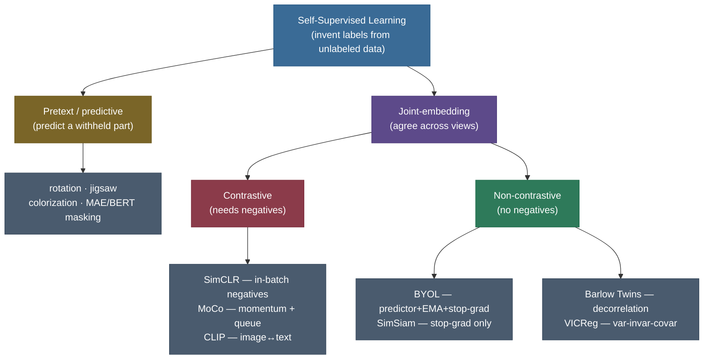
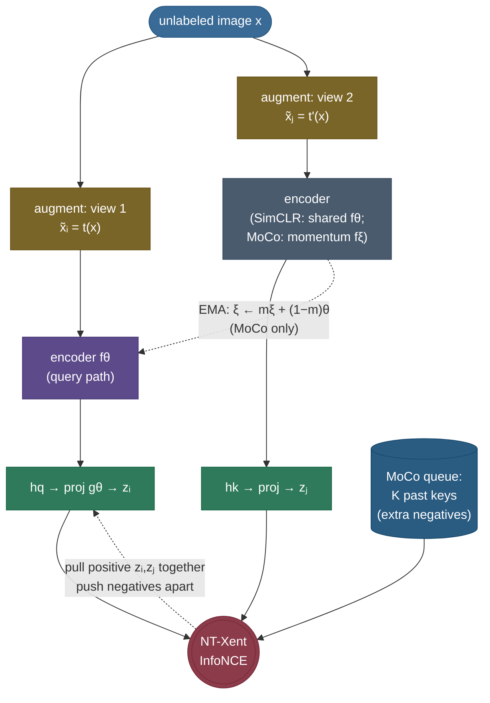

# Contrastive / Self-Supervised Learning: invent the labels

Imagine you have **one billion photos and not a single label.** Hiring people to tag them is hopeless — too slow, too expensive, and for most of the interesting data (medical scans, satellite imagery, the entire web) the "right" label is genuinely unknown. Yet a child learns to *see* long before anyone teaches them the word "dog." They learn that an object seen from the left and the same object seen from the right are **the same thing** — that two glimpses of one cat belong together, and a cat and a fire hydrant do not. That single, label-free signal — *what goes with what* — is enough to build a rich model of the visual world.

**Contrastive self-supervised learning** is the machine version of exactly that idea, and it is the engine underneath modern foundation models. The recipe is almost embarrassingly simple to state: take an unlabeled image, make **two augmented copies** of it, and train an encoder so those two copies land at **nearby points** in embedding space (they are *positives* — pull them together) while **different images** land far apart (they are *negatives* — push them apart). No labels are ever read. The network invents its own supervisory signal from the structure of the data itself. That is what "self-supervised" means: **the supervision comes from the input, for free.**

I'm going to build this the way I'd teach it to a strong ML engineer who's comfortable with neural nets and cross-entropy but has never derived a contrastive loss. We start from *why* labels are the bottleneck, walk the lineage of "pretext tasks" that led here, then derive the **InfoNCE / NT-Xent** loss line by line — including *why* it is secretly a mutual-information bound and what the temperature τ actually does to the gradients. We meet the methods (SimCLR, MoCo, BYOL, SimSiam, Barlow Twins, VICReg), confront the **collapse** problem that haunts all of them, prove the **alignment + uniformity** decomposition, and finish in code that you can run. By the end you'll be able to:

- explain **why self-supervision beats relying on labels**, and trace the pretext-task lineage that led to contrastive learning;
- state the **core idea** — positives attract, negatives repel, on a hypersphere — and why **data augmentation** is the load-bearing ingredient;
- **derive the NT-Xent / InfoNCE loss** from scratch, explain **temperature τ** as a hard-negative weighter, and sketch why InfoNCE is a **lower bound on mutual information**;
- contrast **SimCLR** (big batches), **MoCo** (momentum encoder + queue — derive the EMA update), and the **non-contrastive** family (BYOL/SimSiam/Barlow Twins/VICReg) that drops negatives and how each one **dodges collapse**;
- reason about **alignment vs uniformity**, evaluate representations (linear probe / k-NN / fine-tune), and connect to **SimCSE** and **CLIP**;
- compute NT-Xent **by hand** and confirm it against PyTorch.

> **Note:** "self-supervised" and "contrastive" are not synonyms. Self-supervised is the **umbrella** — any method that invents labels from unlabeled data (masked language modeling, rotation prediction, contrastive). **Contrastive** is one *family* within it, defined by the positives-attract / negatives-repel objective. Keep them distinct in an interview; conflating them is a common tell.

---

## The problem: labels are the bottleneck

Supervised deep learning works spectacularly — *when you have labels*. The catch is that labels are the single most expensive, least scalable ingredient in the whole pipeline. ImageNet's 1.3M labels took years and a small army of annotators. Now scale that to the **billions** of images, audio clips, and documents on the internet, or to domains where the label requires a radiologist, a chemist, or a lawyer, and the economics collapse. **Unlabeled data is effectively infinite and free; labeled data is scarce and costly.** Any method that turns the free thing into useful representations is worth enormous money.

The classic unsupervised answer was **reconstruction**: train an autoencoder to compress and rebuild the input, hoping the bottleneck learns something useful. It often does — but reconstruction wastes capacity modeling **pixel-level detail that nobody cares about** (the exact texture of grass, sensor noise). A model judged on rebuilding every pixel learns to be a good *renderer*, not a good *recognizer*.

The self-supervised insight is to ask for something smarter than reconstruction: design a **pretext task** — a fake supervised problem whose "labels" you can generate automatically from the input — such that *solving it forces the network to understand the content.* If predicting the answer requires recognizing objects, parts, and context, then the features that solve the pretext task are exactly the features you want for the *real* downstream tasks (classification, detection, retrieval) — which you then attack with a tiny amount of labeled data, or none.

> **Note:** the payoff is measured by **label efficiency**. A good self-supervised encoder pretrained on millions of unlabeled images, then fine-tuned on **1% of ImageNet labels**, can match or beat a fully-supervised model trained on 100%. The representation did the heavy lifting; the labels only had to *point* at what was already learned.

---

## The pretext-task lineage: how we got to contrastive

Before contrastive learning won, the field tried a parade of clever pretext tasks. Each one is a puzzle whose answer is free, and each taught the community something:

- **Rotation prediction** (Gidaris et al. 2018). Rotate the image by 0°, 90°, 180°, or 270° and train a 4-way classifier to recover the angle. To know a cat is upright, you must know what a cat *is* — so the features become object-aware. Cheap and surprisingly strong.
- **Jigsaw puzzles** (Noroozi & Favaro 2016). Cut the image into a 3×3 grid, shuffle the tiles, and predict the permutation. Forces the network to learn **part layout** — that a face has eyes above a nose.
- **Colorization** (Zhang et al. 2016). Strip the color, predict it back. To color a banana yellow and grass green, you must recognize bananas and grass.
- **Inpainting / context prediction** — mask a patch and predict it, or predict the relative position of two patches.
- **Masked prediction** — the same idea applied to *tokens*: hide words (**BERT**, Devlin et al. 2018) or image patches (**MAE**, He et al. 2021) and reconstruct them. This is the **predictive** branch of self-supervision and powers all of modern NLP.

The lesson across all of them: **the harder and more semantic the pretext task, the better the features.** But hand-designing tasks is a treadmill, and each one bakes in arbitrary choices (why 4 rotations? why a 3×3 grid?). Contrastive learning replaced the menagerie with **one general principle** that subsumes the intuition behind all of them: *don't predict a specific hand-chosen quantity — just require that different views of the same thing agree, and different things disagree.* That objective is broad, augmentation-driven, and it scaled.



> **Tip:** in an interview, frame contrastive learning as the **generalization** of the pretext-task era, not a competitor to it. Rotation/jigsaw/colorization all secretly say "two views of the same content should be predictable from each other." Contrastive learning makes that the *explicit* objective and lets **augmentation** define the views, rather than hard-coding one puzzle.

---

## The core idea: pull positives, push negatives, on a sphere

Strip everything away and contrastive learning is two forces acting on points on the surface of a hypersphere (we L2-normalize embeddings, so they live on a unit sphere and "similarity" is the cosine):

- **Attraction.** Two augmented views of the *same* image — a **positive pair** — should map to **nearby** points. Pull them together.
- **Repulsion.** Views of *different* images — **negatives** — should map **far apart**. Push them away.

That's it. Run those two forces over a large dataset and the encoder is forced to discover the **invariances** that make two views "the same" (the object's identity survives a crop, a color shift, a blur) while keeping **distinct instances distinguishable** (otherwise everything would collapse to one point — more on that danger soon). The features that survive are exactly the semantic, content-level features we want.

The end-to-end pipeline that operationalizes this (the **SimCLR** template, Chen et al. 2020) has four stages:


1. **Augment.** Sample two random transformations $t, t'$ and produce two views $\tilde x_i = t(x)$, $\tilde x_j = t'(x)$ of the same image.
2. **Encode.** Pass both through a **shared** encoder $f$ (e.g. a ResNet) to get representations $h_i = f(\tilde x_i)$, $h_j = f(\tilde x_j)$. **This $h$ is what you keep for downstream tasks.**
3. **Project.** Map each $h$ through a small **projection head** $g$ (a 2-layer MLP) to get embeddings $z_i = g(h_i)$, $z_j = g(h_j)$, and L2-normalize them onto the sphere. *The contrastive loss acts on $z$, not $h$* — and $g$ is **thrown away at test time** (we'll see why this matters).
4. **Contrast.** Apply the **NT-Xent** loss: make $z_i$ and $z_j$ agree, and disagree with the embeddings of every other image in the batch.

> **Gotcha:** the most-missed detail in interviews is *which vector you keep.* You train on $z = g(h)$ but you **deploy on $h$**. The projection head $g$ is a disposable scaffold that lets the loss live in a space where contrasting is easy, while protecting the representation $h$ from being over-specialized to the contrastive task. Chen et al. found that linear-probe accuracy on $h$ is **substantially higher** than on $z$ — discarding $g$ is not an afterthought, it's a load-bearing design choice.

---

## Data augmentation: the secret that makes it work

Here is the part newcomers underweight and practitioners obsess over: **the augmentations *are* the algorithm.** The positive pair is *defined* by the augmentations — they decide what "the same image, viewed differently" means, and therefore which invariances the encoder is forced to learn. Choose them poorly and contrastive learning quietly fails; choose them well and it shines. SimCLR's central empirical finding was that the **composition** of augmentations matters more than any single one, and that the strength must be **aggressive**.

The workhorse recipe (SimCLR / MoCo-v2):

- **Random resized crop** — the single most important transform. Cropping two different regions and resizing them forces the encoder to recognize the object from a part, and to be **translation/scale invariant**. Without strong cropping, the whole method underperforms badly.
- **Color jitter** (brightness/contrast/saturation/hue) + **random grayscale** — crucial, because otherwise the network cheats: two crops of one image share a color histogram, so the encoder can "match" them on **color statistics alone** without learning anything about shape or content. Jittering color destroys that shortcut and forces semantic features.
- **Gaussian blur** — adds a frequency-domain invariance; meaningfully helps on ImageNet.
- **Horizontal flip** — cheap, mild.

> **Gotcha:** a subtle but devastating failure mode is the **shortcut**. If any low-level cue (color histogram, JPEG artifacts, a watermark, chromatic aberration at the lens edge) is shared between the two views, the network will exploit it to satisfy the loss **without learning semantics**. Strong, well-composed augmentation exists precisely to **break every trivial shortcut**, leaving content as the only thing both views still share. This is why "just crop" is not enough — color jitter is what kills the color-histogram shortcut.

> **Tip:** the augmentation set encodes your **inductive bias about invariance**. Color jitter says "identity is invariant to color" — great for ImageNet objects, **wrong** for a bird-species task where plumage color is the label, or a medical task where a color shift changes the diagnosis. There is no universal augmentation set; you choose the invariances you *want*, and the method bakes them in. Domain-appropriate augmentation is the main knob you tune.

---

## The math: deriving the NT-Xent / InfoNCE loss

Now the heart of it. We'll build the loss from the two-force intuition and arrive at exactly the formula the field uses.

**Setup.** Take a batch of $N$ images. Augment each twice → a batch of $2N$ views. Encode and project each to a normalized embedding $z \in \mathbb{R}^d$, $\lVert z \rVert = 1$. For an **anchor** view $i$, exactly **one** other view $j$ is its **positive** (the other augmentation of the same image); the remaining $2N-2$ views are **negatives**.

**Similarity.** Because embeddings are unit-normalized, the natural similarity is the cosine, which is just the dot product:

$$\text{sim}(z_a, z_b) \;=\; \frac{z_a^\top z_b}{\lVert z_a\rVert\,\lVert z_b\rVert} \;=\; z_a^\top z_b \in [-1, 1].$$

**The loss.** We want the positive to dominate. Frame it as a **classification problem**: among all the other views, *which one is the positive?* That is a softmax over similarities — a $(2N-1)$-way classification where the correct class is the positive. The loss for anchor $i$ with positive $j$ is

$$\boxed{\;\ell_{i,j} \;=\; -\log \frac{\exp\!\big(\text{sim}(z_i, z_j)/\tau\big)}{\displaystyle\sum_{k=1}^{2N} \mathbb{1}_{[k \ne i]}\,\exp\!\big(\text{sim}(z_i, z_k)/\tau\big)}\;}$$

where $\tau > 0$ is the **temperature**. This is the **NT-Xent** loss (Normalized Temperature-scaled Cross-Entropy), and it is the **InfoNCE** loss of Oord et al. (2018) with cosine similarity. The total loss averages $\ell_{i,j}$ over **all $2N$ views** (each view serves once as anchor; both directions $i\!\to\!j$ and $j\!\to\!i$ are counted).

Let's read the formula piece by piece, because every symbol earns its place:

- The **numerator** $\exp(\text{sim}(z_i,z_j)/\tau)$ rewards the positive: raising $z_i^\top z_j$ (pulling the pair together) shrinks the loss.
- The **denominator** sums over the positive **plus all negatives** $z_k$. Lowering $z_i^\top z_k$ for negatives shrinks the denominator and the loss. So the same loss simultaneously **pulls the positive in** and **pushes negatives out** — the two forces fall out of one softmax.
- The $\mathbb{1}_{[k\ne i]}$ excludes the anchor's similarity with **itself** (which would be $1/\tau$ and swamp everything). You compare against everyone *but yourself*.
- $-\log$ turns "make the positive's softmax probability → 1" into a minimization. $\ell = -\log p_{\text{positive}}$; if the positive already wins the softmax, $p\!\to\!1$ and $\ell\!\to\!0$.

> *Where this comes from: the InfoNCE form is **Representation Learning with Contrastive Predictive Coding** (Oord, Li & Vinyals 2018); the cosine-similarity, temperature-scaled, two-views-per-image instantiation named **NT-Xent** is **SimCLR** (Chen, Kornblith, Norouzi & Hinton 2020, Eq. 1). Both are in the references.*

### Why it is a lower bound on mutual information

InfoNCE is not just a convenient softmax — it has a clean information-theoretic meaning, which is *why* it learns good representations. Suppose the anchor's embedding is $z_i$ and we have one positive $z_j$ (drawn from the joint $p(z_i, z_j)$ — they share content) and $K$ negatives drawn from the marginal $p(z)$ (unrelated). Treating the contrastive task as "pick the positive out of the $K+1$ candidates," Oord et al. show the optimal classifier's loss bounds the **mutual information** between the two views:

$$I(z_i; z_j) \;\ge\; \log(K+1) \;-\; \mathcal{L}_{\text{InfoNCE}}.$$

Read it the useful way: **minimizing the InfoNCE loss maximizes a lower bound on the mutual information between the two views.** Since the only thing two augmented views of one image truly share is its **semantic content** (augmentation destroyed everything else), maximizing their mutual information forces the encoder to keep exactly that content. This is the rigorous version of the hand-wavy "make the views agree."

> **Note:** the bound also explains why **more negatives help**: the $\log(K+1)$ term means a larger $K$ permits a tighter bound, so the representation can capture more information. This single inequality is the theoretical reason SimCLR wants big batches and MoCo wants a big queue — both are just ways to grow $K$.

> **Gotcha:** the MI bound is **loose** and the "InfoNCE works *because* it maximizes MI" story is contested — Tschannen et al. (2020) showed you can maximize the same MI bound with representations that are useless downstream, so the *encoder architecture and the augmentation choice* matter at least as much as the MI objective itself. Cite the bound as **motivation**, but don't claim it fully explains the success. The honest summary: InfoNCE *is* an MI lower bound, but good representations come from the **interaction** of that objective with strong augmentations and a constrained encoder.

### Temperature τ: the hard-negative weighter

The temperature $\tau$ is the most important hyperparameter in contrastive learning, and the most asked-about. It divides every similarity before the softmax, so it controls **how sharply the loss focuses on the closest competitors**.

- **Large $\tau$ (e.g. 1.0)** → similarities are squashed toward zero → the softmax is **soft/uniform** → all negatives are weighted roughly equally, and the gradient barely distinguishes a hard negative from an easy one. The loss is gentle but uninformative.
- **Small $\tau$ (e.g. 0.07)** → similarities are amplified → the softmax becomes **peaky** → almost all the loss mass concentrates on the positive and the **few hardest negatives** (the ones the encoder is currently confusing with the anchor). This is implicit **hard-negative mining**: small $\tau$ makes the loss obsess over the most dangerous confusions.

We can make this exact. Let $p_k$ be the softmax weight the loss assigns to candidate $k$. The gradient of the loss with respect to the similarity of a **negative** $k$ is

$$\frac{\partial \ell}{\partial\, \text{sim}(z_i, z_k)} \;=\; \frac{p_k}{\tau}, \qquad p_k = \frac{\exp(\text{sim}(z_i,z_k)/\tau)}{\sum_{m}\exp(\text{sim}(z_i,z_m)/\tau)}.$$

The $1/\tau$ factor means smaller $\tau$ *scales up* the repulsion gradient, and the $p_k$ factor means the repulsion is concentrated on whichever negatives the peaky softmax has singled out — the hard ones. Both effects compound: **small $\tau$ pushes hard negatives away, hard.** The matching gradient on the **positive's** similarity is

$$\frac{\partial \ell}{\partial\, \text{sim}(z_i, z_j)} \;=\; \frac{p_j - 1}{\tau} \;\le\; 0,$$

a negative gradient (we want to *increase* the positive's similarity), whose magnitude $\,(1-p_j)/\tau\,$ is large exactly when the positive is *not yet* winning ($p_j$ small) — so the loss pulls hardest on positives that haven't aligned yet, and eases off once $p_j\to 1$. The two gradients always **balance**: $\sum_k \partial\ell/\partial\,\text{sim}_{ik} = 0$ (the softmax weights sum to one), so every unit of "pull on the positive" is paid for by "push on the negatives" — attraction and repulsion are conserved, which is the algebraic reason the representation can't collapse while negatives are present.

It's worth taking the two limits explicitly, since they're a common follow-up. As $\tau \to \infty$, all $\text{sim}/\tau \to 0$, so $p_k \to 1/(2N-1)$ (uniform) and *every* gradient $\to 0$ — the loss stops discriminating and learning stalls. As $\tau \to 0$, the softmax becomes a hard $\arg\max$: $p \to 1$ on the single most-similar candidate and $0$ on all others, so the loss looks **only** at the one hardest competitor and the gradient on it blows up like $1/\tau$ — informative but unstable. The useful regime ($\tau \approx 0.1$–$0.5$) lives between these, sharp enough to mine hard negatives but smooth enough to stay stable.


> **Gotcha:** τ is **not** a "set and forget" knob. Too small and training is unstable (the loss fixates on a handful of negatives and the gradient explodes); too large and the encoder never sharpens its boundaries (everything stays mushy). The SimCLR sweet spot is **τ ≈ 0.1–0.5** (they use 0.5 for the best ImageNet result with their batch/augmentation setup; many follow-ups use 0.07–0.2). It interacts with the number of negatives and the augmentation strength, so it must be **tuned**, not copied.

---

## The collapse problem and why negatives prevent it

There is a trivial, catastrophic solution lurking in the attraction force. If the loss only said "pull positives together," the encoder would discover the laziest possible answer: **map every input to the same constant vector.** Then every positive pair has cosine 1, the attraction loss is perfectly minimized — and the representation is **completely useless**, carrying zero information about the input. This is **representation collapse**, and it is *the* central failure mode of the entire field.

In a contrastive method, **the negatives are what prevent collapse.** The denominator's repulsion term explicitly punishes mapping different images close together — and "everything to one point" maps *all* images close together, which the negatives forbid. The two forces are in tension: attraction wants to compress, repulsion wants to spread, and the equilibrium is a representation that is **compressed within an instance** (views agree) but **spread across instances** (distinct things stay distinct). That equilibrium is exactly the useful one.

> **Note:** this is why "how do you prevent collapse?" is the single highest-signal contrastive-learning interview question. For **contrastive** methods the answer is "negatives provide the repulsive force." For **non-contrastive** methods (next section) the answer is more subtle and method-specific — and being able to give the *right* answer for each method is what separates a memorized answer from real understanding.


---

## Alignment and uniformity: what the loss really optimizes

Wang & Isola (2020) gave the cleanest theoretical lens on what contrastive learning is *doing*. They proved that as the number of negatives → ∞, the InfoNCE loss decomposes into two interpretable objectives on the hypersphere:

**Alignment** — positive pairs should be close. Define

$$\mathcal{L}_{\text{align}} \;=\; \mathbb{E}_{(x, x^+)}\big[\, \lVert f(x) - f(x^+) \rVert^2 \,\big].$$

This is small when two views of the same image land on top of each other. Alignment is the *attraction* force, isolated.

**Uniformity** — embeddings should spread out to cover the sphere evenly (preserve maximal information). Using a Gaussian potential kernel,

$$\mathcal{L}_{\text{uniform}} \;=\; \log\, \mathbb{E}_{x, y \,\sim\, p_{\text{data}}}\Big[\, e^{-t\,\lVert f(x) - f(y) \rVert^2} \,\Big].$$

This is **minimized when points are spread uniformly** over the sphere (the kernel penalizes any two embeddings being close, so they repel to a uniform distribution). Uniformity is the *repulsion* force, isolated.

The key insight: contrastive learning is the **balance** of these two. A collapsed representation has *perfect* alignment (everything's at one point) but *terrible* uniformity (no spread at all) — so the combined objective rejects it. A random representation has great uniformity but terrible alignment. **Only a representation that is both aligned AND uniform** — views agree, instances spread — minimizes both, and that is precisely a good representation. You can even train directly on $\mathcal{L}_{\text{align}} + \lambda\,\mathcal{L}_{\text{uniform}}$ and recover contrastive-quality features, which is strong evidence the decomposition captures the essence.

> *Where this comes from: **Understanding Contrastive Representation Learning through Alignment and Uniformity on the Hypersphere** (Wang & Isola 2020). The two limiting losses above are their Eq. 3 and Eq. 4.*

> **Tip:** these two metrics are diagnostic gold in practice. If your contrastive model is underperforming, **measure alignment and uniformity separately.** Low alignment + low uniformity = healthy. Low alignment + high uniformity (points bunched) = **collapse**, check your negatives/stop-gradient. High alignment = your positives aren't actually agreeing, check your augmentations or encoder.

---

## Method 1: SimCLR — scale the batch for negatives

**SimCLR** (Chen et al. 2020) is the canonical contrastive recipe and the cleanest to reason about. Its design choices map directly to the theory:

- **In-batch negatives.** SimCLR has no special negative machinery — for each anchor, the *other $2N-2$ views in the same batch* are the negatives. Simple, but it ties the number of negatives to the **batch size**.
- **Big batches.** Because more negatives → a tighter MI bound → better features, SimCLR pushes batch size to **4096–8192** (the negatives scale with it). This is its defining cost: those batches need a **TPU pod or many GPUs**, which is what motivated MoCo.
- **The nonlinear projection head**, discarded at test time (covered above) — a SimCLR contribution that markedly improved linear-probe accuracy.
- **Strong augmentation composition** — crop + color jitter + blur, as derived earlier.
- **LARS optimizer + long training** (often 100s–1000s of epochs) to make the large-batch optimization stable.

The whole of SimCLR is "InfoNCE + great augmentations + a projection head + a big enough batch to have many negatives." Its limitation is equally clean: **you can't always afford an 8192 batch**, and that is exactly the gap MoCo closes.

---

## Method 2: MoCo — a momentum encoder and a queue

**MoCo** (Momentum Contrast, He et al. 2020) asks: *why should the number of negatives be capped by the batch size?* Its answer **decouples** the two with two ideas — a **queue** of past embeddings and a **momentum encoder** to keep that queue consistent.

**The queue (memory bank).** Maintain a FIFO **queue** of the most recent $K$ key embeddings (e.g. $K = 65{,}536$). Each step, the current batch's keys are enqueued and the oldest dequeued. Now an anchor's negatives are *the whole queue* — tens of thousands of them — even though the batch is small (256). The number of negatives is now a **buffer size**, not a batch size. This alone would be wonderful, except for one problem.

**Why a momentum encoder is necessary.** The queue holds keys computed at **earlier** steps by an **older** version of the encoder. If we used the *same* rapidly-updating encoder for both queries and keys, the queue would be a stew of embeddings from many slightly-different encoders — **inconsistent**, and comparing a fresh query against stale, differently-encoded keys gives a noisy, drifting target. MoCo fixes this by using a **separate key encoder** $f_\xi$ whose parameters are an **exponential moving average (EMA)** of the query encoder $f_\theta$:

$$\boxed{\;\xi \;\leftarrow\; m\,\xi \;+\; (1 - m)\,\theta\;}\qquad m \in [0,1),\ \text{typically } m = 0.999.$$

Let's derive what this does. The query encoder $\theta$ is updated by gradient descent (it moves fast). The key encoder $\xi$ only **inches** toward $\theta$ each step — with $m = 0.999$, it moves $0.1\%$ of the way per step. So $\xi$ is a **slow, smoothed average** of the recent history of $\theta$. Because $\xi$ barely changes from step to step, all the keys sitting in the queue were produced by **nearly the same** encoder — they are **consistent** with each other and with the current key encoder, even though they were computed at different times. That consistency is what makes a long queue usable. (And the key encoder gets **no gradient** — only the EMA update — so there's no cost to back-propagating through 65k keys.)



> **Note:** $m$ has to be **large** (0.999, not 0.9). He et al. ablated this: a small $m$ lets the key encoder change too fast, the queue becomes inconsistent, and accuracy craters. The whole trick relies on the key encoder being **slow**. The same "slowly-moving target network" idea reappears in BYOL — and in target networks for deep RL (DQN), for exactly the same reason: a moving target you're chasing must move slowly or learning is unstable.

> **Tip:** SimCLR and MoCo are two answers to *one* question — "how do I get many negatives?" SimCLR: **make the batch huge** (negatives = batch). MoCo: **keep a queue** (negatives = buffer, decoupled from batch, runnable on 8 commodity GPUs). MoCo-v2 then borrowed SimCLR's projection head + stronger augmentation and matched it cheaply. Know this framing — it's the cleanest way to contrast the two.

---

## Method 3: the non-contrastive family — dropping negatives

Then came a genuine surprise. **BYOL** (Grill et al. 2020) showed you can learn contrastive-quality representations with **no negatives at all** — only positive pairs. This *should* collapse (nothing repels!), yet it doesn't. Understanding *why* is one of the most instructive puzzles in the field, and it spawned a whole family.

**BYOL** uses two networks: an **online** network (encoder + projector + an extra **predictor** MLP) and a **target** network (encoder + projector, no predictor). The online network tries to **predict** the target network's embedding of the *other* view. Three ingredients conspire to prevent collapse without negatives:

1. **A predictor** on the online branch only — an asymmetry that breaks the trivial constant solution.
2. **Stop-gradient on the target** — the target provides a *fixed* regression goal each step; no gradient flows into it, so the online net can't "cheat" by dragging both sides to a constant.
3. **EMA target** — the target's weights are an EMA of the online weights (the same $\xi \leftarrow m\xi + (1-m)\theta$ as MoCo). The target is a **slowly-moving** version of the online net.

The intuition for *why this dodges collapse*: the online net chases a target that is its own slowly-moving average. A constant output is **not a stable fixed point** of this dynamical system — the predictor + EMA + stop-gradient combination makes the chase converge to a *non-collapsed* solution. (Grill et al. and later analyses show the EMA + predictor act like an implicit whitening/centering that supplies the missing repulsion.)

**SimSiam** (Chen & He 2021) ran the brilliant ablation: it stripped BYOL down to the bone — **no EMA target, no momentum, the two branches share weights** — and kept only the **predictor + stop-gradient**. It *still* doesn't collapse. The headline result: **stop-gradient is the essential ingredient.** Remove the stop-gradient and SimSiam collapses immediately; keep it and a tiny predictor suffices. SimSiam reframed the whole non-contrastive family as an Expectation-Maximization-like alternating optimization, where stop-gradient implements the "hold one side fixed" step.

> **Gotcha:** the SimSiam ablation is the cleanest interview answer to "why doesn't BYOL collapse without negatives?" The honest, precise answer is: **the stop-gradient** (plus a predictor) is what does it — *not* the momentum encoder, which BYOL has but SimSiam shows is **not required**. If you say "the momentum encoder prevents collapse," SimSiam is the counterexample that proves you wrong.

**Barlow Twins** (Zbontar et al. 2021) attacks collapse from information theory instead. It computes the **cross-correlation matrix** between the (batch-normalized) embeddings of the two views and pushes it toward the **identity**: the diagonal → 1 (each feature **invariant** across views) and the off-diagonal → 0 (features **decorrelated**, i.e. **redundancy reduction**). Decorrelating the features makes collapse impossible — a constant output has zero variance and can't have a unit-diagonal correlation. No negatives, no momentum, no predictor; just "make the feature cross-correlation the identity."

**VICReg** (Bardes et al. 2022) makes the anti-collapse mechanism fully explicit with three additive terms: **Variance** (a hinge keeping each embedding dimension's std above a threshold — directly forbids collapse), **Invariance** (MSE pulling positive pairs together), and **Covariance** (decorrelating dimensions, like Barlow Twins). It's the most modular view: one term per force, easy to reason about.


> **Note:** the family splits cleanly by **how they avoid collapse**: contrastive methods (SimCLR, MoCo) use **explicit negatives** (repulsion); BYOL/SimSiam use **architectural asymmetry** (predictor + stop-gradient); Barlow Twins/VICReg use **statistical constraints** (decorrelation / variance). All four routes reach similar downstream quality — there are many ways to forbid the constant solution.

---

## Evaluation: how you know the representation is good

You trained an encoder on unlabeled data — how do you measure if it learned anything useful? Three standard protocols, in increasing cost:

- **Linear probe.** Freeze the encoder, train a **single linear layer** on top using labels. High linear-probe accuracy means the representation is **linearly separable** — the semantic structure is already laid out, the classifier just reads it off. This is the headline self-supervised benchmark (SimCLR/MoCo report ImageNet linear-probe top-1).
- **k-NN evaluation.** Even simpler — no training at all. Embed the labeled set, classify each test point by a **k-nearest-neighbors** vote in embedding space ([k-NN](../../03.%20Supervised_Learning/concepts/04-k-Nearest-Neighbors.md)). A strong k-NN accuracy proves the geometry itself is meaningful: same-class points are genuinely neighbors.
- **Fine-tuning / transfer.** Unfreeze and fine-tune the whole encoder on a downstream task, often with **few labels** (1%, 10%). This measures real-world transfer and is where self-supervised pretraining shows its **label efficiency** — matching fully-supervised models with a fraction of the labels.

> **Tip:** linear probe and fine-tuning measure *different* things and can disagree. Linear probe rewards representations that are **already** linearly organized (what self-supervision is good at); fine-tuning lets the features **move**, so it can rescue a representation that's informative but tangled. Report both. A big gap (low probe, high fine-tune) means the information is there but not linearly accessible.

---

## Beyond vision: SimCSE, CLIP, and foundation models

The contrastive principle is **modality-agnostic** — "two views of the same thing agree" works wherever you can define a positive pair. Two landmark generalizations:

**SimCSE** (Gao et al. 2021) — contrastive learning for **sentence embeddings**. The clever trick for the *unsupervised* version: the "augmentation" is just **dropout**. Encode the same sentence **twice** with two different dropout masks → two slightly different embeddings → that's a positive pair; other sentences in the batch are negatives. Dropout-as-augmentation is enough to learn excellent sentence representations, and SimCSE became a standard text-embedding recipe.

**CLIP** (Radford et al. 2021) — the bridge to modern multimodal foundation models, and arguably the most consequential contrastive model. Instead of two augmented views of one image, CLIP's positive pair is an **(image, its caption)** pair scraped from the web — 400M of them. It trains an image encoder and a text encoder so that **matched image-text pairs** have high similarity and **mismatched** pairs (every other caption in the batch) have low similarity — **InfoNCE across two modalities** (symmetric, both directions). The result is a shared image-text embedding space that enables **zero-shot classification**: to classify an image, embed candidate labels as text ("a photo of a {dog}") and pick the nearest — no task-specific training. CLIP's contrastive objective is the same NT-Xent we derived; only the definition of "positive pair" changed from *augmented views* to *aligned modalities*.

> **Note:** this is the punchline for *why contrastive learning matters for foundation models.* The same positives-attract / negatives-repel objective, with the positive pair defined appropriately (augmented views → SimCLR; image-text → CLIP; sentence-with-two-dropouts → SimCSE), scales to web-scale unlabeled data and produces **general-purpose embeddings** that transfer everywhere. Contrastive learning is one of the small handful of objectives that genuinely scaled into the foundation-model era. CLIP's image encoder, in particular, became the visual backbone for countless downstream systems (including text-to-image diffusion guidance).

---

## Worked examples: do the numbers by hand

Theory is cheap; let's compute. Each example is verified against PyTorch in the code section.

### Worked example 1 — NT-Xent for a tiny 2-pair batch

Take $N = 2$ images, augmented twice → 4 views. We'll compute the loss for **anchor 0**, whose positive is **view 1**. Place four unit embeddings on the 2-D circle at angles $10°, 25°, 80°, 200°$ (already norm-1, so cosine = dot product). The cosine similarities of anchor 0 to the others:

$$\text{sim}(z_0, z_1) = \cos(15°) = +0.966\ \text{(positive)},\quad \text{sim}(z_0,z_2)=\cos(70°)=+0.342,\quad \text{sim}(z_0,z_3)=\cos(190°)=-0.985.$$

With temperature $\tau = 0.2$, the loss for anchor 0 is

$$\ell_{0} = -\log \frac{e^{0.966/0.2}}{e^{0.966/0.2} + e^{0.342/0.2} + e^{-0.985/0.2}} = -\log \frac{e^{4.83}}{e^{4.83} + e^{1.71} + e^{-4.93}}.$$

Numerically: $e^{4.83} = 125.2$, $e^{1.71} = 5.53$, $e^{-4.93} = 0.0072$. So $\ell_0 = -\log\!\big(125.2 / 130.7\big) = -\log(0.958) = \mathbf{0.043}$. The positive already dominates (it's at 15° apart, way ahead of the negatives), so the loss is tiny. **PyTorch's `F.cross_entropy` on the same setup returns 0.0433 — an exact match.** The full-batch mean NT-Xent (all four anchors) is 1.495.

> **Tip:** notice how the $-0.985$ negative (nearly opposite the anchor) contributes essentially nothing — $e^{-4.93} \approx 0.007$. **Easy negatives are almost free.** The loss is driven by the positive and the *hard* negative (the 0.342 one here). This is the hard-negative-mining behavior, visible even in a 4-point example.

### Worked example 2 — how τ reshapes the softmax and gradient

Fix one anchor with similarities $[0.80, 0.65, 0.40, 0.10, -0.30]$ (positive = 0.80, hard negative = 0.65). Sweep τ:

| τ | $p(\text{pos})$ | $p(\text{hard neg})$ | loss $\ell$ | grad on hard neg $=p_{\text{hn}}/\tau$ |
|---|---|---|---|---|
| 0.5 | 0.393 | 0.291 | 0.935 | 0.582 |
| 0.2 | 0.609 | 0.288 | 0.496 | 1.438 |
| 0.07 | 0.892 | 0.105 | 0.114 | **1.496** |

At τ = 0.5 the positive barely leads (0.393 vs 0.291) — the loss can't tell the positive from the hard negative, and the repulsion gradient is weak (0.58). At τ = 0.07 the positive owns 89% of the mass and the *easy* negatives are starved — but the gradient *magnitude* on the hard negative is **2.6× larger** (1.50 vs 0.58). **Smaller τ → the loss focuses sharply on the positive and pushes the hard negative away harder.** That's hard-negative mining falling out of one scalar.

### Worked example 3 — alignment and uniformity on a few vectors

Take 8 anchor embeddings and their 8 positives on the unit circle, two ways:

- **Collapsed** (all 16 points bunched near one angle): $\mathcal{L}_{\text{align}} = 0.003$ (positives trivially close) but $\mathcal{L}_{\text{uniform}} = -0.03$ — a **high** (bad) uniformity loss, because nothing is spread.
- **Well-trained** (anchors spaced evenly around the circle, positives close to their anchors): $\mathcal{L}_{\text{align}} = 0.005$ (still close) and $\mathcal{L}_{\text{uniform}} = -1.86$ — a **much lower** (good) uniformity loss.

Both have great alignment, but only the well-trained one has good uniformity. **Alignment alone cannot distinguish a collapsed representation from a good one — you need the uniformity term too.** This is the alignment/uniformity decomposition made numeric, and it's exactly why a pure attraction loss (no repulsion) fails.

### Worked example 4 — a measured toy SimCLR step lowers the loss

Initialize 8 instances → 16 random 16-D view embeddings (positive pairs **not** aligned — mean positive cosine ≈ $-0.015$). Optimize the NT-Xent loss with Adam. The loss falls and the positive pairs snap together:

| step | NT-Xent loss | mean positive-pair cosine |
|---|---|---|
| 0 | 3.382 | −0.015 |
| 30 | 0.069 | +0.967 |
| 100 | 0.048 | +0.999 |
| 299 | 0.045 | +1.000 |

The loss drops **75×** and the positive cosine goes from random (≈ 0) to **perfectly aligned (+1.0)** — the embeddings of each instance's two views are pulled on top of each other, exactly as the theory promises. This is contrastive learning in miniature, and the full code is below.

---

## Code: NT-Xent by hand, verified against PyTorch

Everything above, runnable. This computes NT-Xent two ways (closed-form by hand vs `F.cross_entropy`) and confirms they match, sweeps τ, and runs the toy optimization. It's CPU-only and finishes in seconds.

```python
"""Contrastive SSL: NT-Xent by hand vs PyTorch, temperature, and a toy SimCLR step.
Verified on Python 3.12 (torch 2.12), CPU."""
import numpy as np, torch, torch.nn.functional as F

# ---- 1. NT-Xent for a 2-pair batch, BY HAND, matched to PyTorch ----
deg = np.array([10., 25., 80., 200.])                       # 4 views as angles
z = np.stack([np.cos(np.radians(deg)), np.sin(np.radians(deg))], 1)  # unit vectors
tau = 0.2
s01, s02, s03 = z[0]@z[1], z[0]@z[2], z[0]@z[3]             # anchor-0 cosines
num = np.exp(s01/tau)
den = np.exp(s01/tau) + np.exp(s02/tau) + np.exp(s03/tau)   # exclude self
loss0 = -np.log(num/den)
print(f"by hand : sim(pos)={s01:+.3f}  loss(anchor0)={loss0:.4f}")

def ntxent(z, tau):                                          # full SimCLR NT-Xent
    z = F.normalize(z, dim=1)
    sim = z @ z.t() / tau
    sim.fill_diagonal_(-1e9)                                 # exclude self-similarity
    targets = torch.arange(z.shape[0]) ^ 1                   # partner = positive index
    return F.cross_entropy(sim, targets, reduction='none')

per = ntxent(torch.tensor(z, dtype=torch.float64), tau)
print(f"torch   : loss(anchor0)={per[0].item():.4f}  match={abs(per[0].item()-loss0)<1e-9}")
print(f"          full-batch mean NT-Xent={per.mean().item():.4f}")

# ---- 2. Temperature reshapes the softmax + the hard-negative gradient ----
sims = np.array([0.80, 0.65, 0.40, 0.10, -0.30])            # pos + hard neg + 3 easy
for tau in (0.5, 0.2, 0.07):
    p = np.exp(sims/tau); p /= p.sum()
    print(f"tau={tau:<4} p(pos)={p[0]:.3f} p(hardneg)={p[1]:.3f} "
          f"loss={-np.log(p[0]):.3f} grad_hardneg={p[1]/tau:.3f}")

# ---- 3. A toy SimCLR step: random views -> NT-Xent pulls positives together ----
torch.manual_seed(0)
N = 8                                                        # 8 instances -> 16 views
z = torch.randn(2*N, 16, requires_grad=True)                # start RANDOM (unaligned)
opt = torch.optim.Adam([z], lr=0.1)
for step in range(300):
    loss = ntxent(z, 0.2).mean()
    if step in (0, 30, 100, 299):
        with torch.no_grad():
            zn = F.normalize(z, dim=1)
            pos_cos = (zn[0::2] * zn[1::2]).sum(1).mean().item()
        print(f"step {step:3d}: NT-Xent={loss.item():.4f}  positive-pair cos={pos_cos:+.3f}")
    opt.zero_grad(); loss.backward(); opt.step()
```

Output:

```
by hand : sim(pos)=+0.966  loss(anchor0)=0.0433
torch   : loss(anchor0)=0.0433  match=True
          full-batch mean NT-Xent=1.4946
tau=0.5  p(pos)=0.393 p(hardneg)=0.291 loss=0.935 grad_hardneg=0.582
tau=0.2  p(pos)=0.609 p(hardneg)=0.288 loss=0.496 grad_hardneg=1.438
tau=0.07 p(pos)=0.892 p(hardneg)=0.105 loss=0.114 grad_hardneg=1.496
step   0: NT-Xent=3.3824  positive-pair cos=-0.015
step  30: NT-Xent=0.0691  positive-pair cos=+0.967
step 100: NT-Xent=0.0475  positive-pair cos=+0.999
step 299: NT-Xent=0.0451  positive-pair cos=+1.000
```

> **Note:** the headline is **`match=True`** — the hand-derived NT-Xent equals PyTorch's `cross_entropy` to machine precision, because NT-Xent *is* cross-entropy over a softmax of temperature-scaled cosine similarities. And in the toy run the loss falls **75×** while the positive-pair cosine climbs from random (−0.015) to **perfect (+1.000)**: the two views of each instance are pulled on top of each other, the repulsion from the other 14 views keeping the whole thing from collapsing to one point. That is the entire algorithm, working.

> **Tip:** the `targets = arange ^ 1` trick is the standard SimCLR partner-index pattern: XOR-with-1 maps 0↔1, 2↔3, 4↔5… so each row's positive is its batch neighbor. It's the cleanest way to express "each view's positive is the other augmentation of the same image" in one line.

---

## Recap and rapid-fire

**If you remember nothing else:** contrastive self-supervised learning learns representations from **unlabeled** data by inventing the labels — augment one example twice to make a **positive pair**, encode both, and use the **NT-Xent / InfoNCE** loss to **pull the pair together** (numerator) and **push every other example apart** (denominator), all on a unit hypersphere. The **augmentations define the invariances**, the **negatives prevent collapse**, the **temperature τ** controls hard-negative focus, and InfoNCE is a **lower bound on the mutual information** between the views. SimCLR scales the **batch** for negatives; MoCo uses a **queue + momentum encoder**; BYOL/SimSiam drop negatives and dodge collapse with a **predictor + stop-gradient**; Barlow Twins/VICReg use **decorrelation**. The same objective, with the positive pair redefined, becomes **SimCSE** (text) and **CLIP** (image-text) — the contrastive backbone of foundation models.

**Quick-fire — say these out loud:**

- *What's a positive pair?* Two augmented views of the **same** instance. Negatives = views of **different** instances.
- *Write the NT-Xent loss.* $\ell = -\log\big[\exp(\text{sim}(z_i,z_j)/\tau) / \sum_{k\ne i}\exp(\text{sim}(z_i,z_k)/\tau)\big]$, cosine similarity, exclude self.
- *What does τ do?* Sharpens the softmax — **small τ = hard-negative mining** (focuses the gradient on the closest negatives).
- *Why is InfoNCE principled?* It's a **lower bound on mutual information** between the two views; minimizing it maximizes shared (semantic) information.
- *What prevents collapse?* In contrastive methods, the **negatives** (repulsion). In SimSiam/BYOL, the **stop-gradient** (+ predictor) — *not* the momentum encoder.
- *SimCLR vs MoCo?* Both want many negatives: SimCLR uses a **huge batch**; MoCo uses a **queue + momentum (EMA) key encoder** so negatives ≠ batch size.
- *Derive MoCo's EMA.* $\xi \leftarrow m\xi + (1-m)\theta$ with $m\approx0.999$ — the key encoder is a **slow average** of the query encoder, keeping the queue consistent.
- *Why discard the projection head?* You train on $z=g(h)$ but **deploy on $h$**; $h$ has higher linear-probe accuracy because $g$ absorbs contrastive-task specialization.
- *Alignment vs uniformity?* Positives **close** (alignment) + embeddings **spread** on the sphere (uniformity) — a collapsed model has great alignment but terrible uniformity.
- *How is CLIP contrastive?* Same InfoNCE, but the positive pair is a matched **(image, caption)** instead of two augmentations — enabling zero-shot classification.

---

## References and further reading

The curated link library for this topic — videos, courses, articles, the primary papers (Oord, Chen, He, Grill, Chen & He, Zbontar, Wang & Isola, Radford), books, and internal cross-links — lives in a companion file so it can be reused as a standalone reference list:

**→ [Contrastive / Self-Supervised Learning — references and further reading](12-Contrastive-Self-Supervised-Learning.references.md)**
