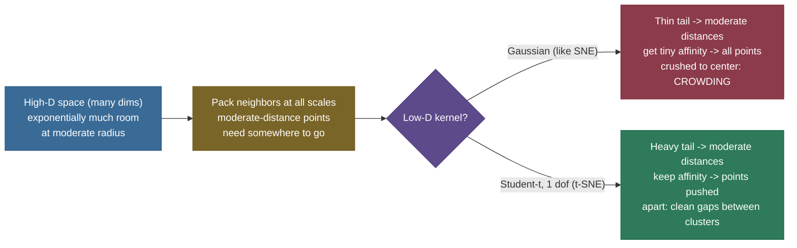
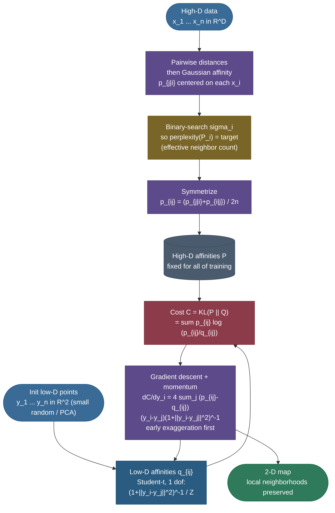

# t-SNE: making high-dimensional neighborhoods visible

You have 1,797 images of handwritten digits. Each is an 8×8 grid, so each lives as a **point in 64-dimensional space**. Somewhere in that space the 0s cluster together, the 1s cluster together, and so on — but you cannot *see* 64 dimensions.

You want a single 2-D scatter plot where each digit becomes a dot, and the 0-dots land near other 0-dots, the 1-dots near 1-dots — a map that makes the hidden structure of the data jump off the page. That is exactly the job **t-SNE** does, and it does it so well that the picture below — generated from those very digits — has become one of the most recognizable images in machine learning.

The trouble is that t-SNE is *also* the single most **misread** tool in the kit. People look at one of its beautiful clustered plots and read meaning into things that carry none: how big the clusters are, how far apart they sit, what the empty space between them means. None of those are reliable.

So this page has two goals that pull in the same direction: teach you *how t-SNE actually works* from first principles — the affinities, the perplexity knob, the heavy-tailed kernel, the KL objective, the gradient — and teach you *how to read its output responsibly*, because the second is impossible without the first.

I'll build it the way I'd explain it to a teammate who just typed `TSNE()` and got a gorgeous plot they don't trust. We start from *why PCA isn't enough* (the linear baseline fails on curved manifolds), then build the method one decision at a time — each piece is a fix for a concrete problem the previous piece left open. By the end you'll be able to:

- explain **why a linear projection (PCA) can't unfold a manifold**, and what "preserve local neighborhoods" means precisely;
- derive the **high-dimensional affinities** $p_{j|i}$ from a Gaussian, and the symmetrized $p_{ij}$;
- explain **perplexity** as a smooth count of effective neighbors, and the **binary search on $\sigma_i$** that sets it;
- derive **why the low-dimensional kernel is a Student-t with one degree of freedom**, and how its heavy tail cures the **crowding problem**;
- write down the cost $C = \mathrm{KL}(P\,\|\,Q)$ and **derive its gradient**;
- describe the optimization tricks — **early exaggeration**, momentum, learning rate — and the **Barnes–Hut $O(n\log n)$** speedup;
- **read a t-SNE plot responsibly** (what cluster size and inter-cluster distance do and don't mean);
- say crisply when to reach for **t-SNE vs PCA vs UMAP**.

**Why it matters (and why interviewers love it):** t-SNE is the most-misused tool in the unsupervised kit, so interviews use it to test whether you understand its caveats — not just its mechanics. The bar is to explain *why the Student-t in low-D fixes the* **crowding problem**, *what* **perplexity** *controls* (effective neighborhood size, via a binary search on each point's $\sigma_i$), and — critically — *why t-SNE is for* **visualization only**: cluster sizes and inter-cluster distances are not meaningful, runs are stochastic, and there's no reusable transform for new points (unlike PCA/UMAP). Knowing *when not to trust the picture* is the whole point.

> **Note:** t-SNE is a **visualization** technique, full stop. It is *not* a general-purpose dimensionality reducer — you do not feed its 2-D output into a downstream model as features, you do not use it to compress data for storage, and (by default) you cannot even apply it to new points. Its one job is to turn high-D structure into a picture a human can read. Keep that framing and most of the "gotchas" below stop being surprising.


---

## The problem: PCA is linear, but data lives on a curved manifold

The reason we need t-SNE at all is a limitation of [PCA](06-Dimensionality-Reduction-Overview.md), the linear workhorse. PCA finds the directions of greatest variance and **projects** the data onto the top two of them. A projection is a *rigid, linear* operation — it is, geometrically, shining a flashlight at the cloud of points and reading the shadow on a wall. That works beautifully when the data's interesting structure is genuinely flat: when the classes are separated by straight lines through the original space.

But high-dimensional data rarely lays itself out flat. The **manifold hypothesis** says real data of dimension $D$ usually concentrates on a much-lower-dimensional, *curved* surface (a manifold) embedded in that $D$-space. The 64-D digit vectors don't fill all of $\mathbb{R}^{64}$; they live on a thin, folded sheet shaped by the few real degrees of freedom in a handwritten digit (slant, stroke width, loop size). When you flatten a curved sheet with a single linear projection, distant parts of the fold land on top of each other — exactly the overlapping smear you see in the PCA panel above.

The classic intuition is the **Swiss roll**: take a 2-D sheet, roll it up in 3-D, and ask PCA to recover the flat sheet. It can't — its best linear shadow squashes the roll, putting points that are *far apart along the sheet* (but *near in 3-D because the roll brought them close*) right next to each other.

To unroll it you need a method that respects **which points are neighbors along the manifold**, not which points are close as the crow flies. That is the entire design goal of t-SNE: **preserve local neighborhood structure**, and let global geometry bend however it must to make that possible in 2-D.

![The manifold motivation, measured. A Swiss roll (left) is a flat 2-D sheet rolled up in 3-D; color encodes position *along* the sheet. PCA (middle) projects linearly and overlays distant strands — points that are far apart along the sheet but near in 3-D land on top of each other, smearing the color gradient. t-SNE (right) follows local neighborhoods and pulls the strands apart into separated bands. (t-SNE doesn't perfectly "unroll" the sheet — that's Isomap/LLE/UMAP's stronger suit — but it cleanly separates by neighborhood where the linear projection cannot.)](images/tsne_swiss_roll.png)

> **Note:** "preserve local structure" is the load-bearing phrase. t-SNE tries hard to keep *each point's near neighbors near* in the map. It makes **no** promise to keep *far things at the right far distance*. That single asymmetry — faithful locally, free to distort globally — explains almost every property and every caveat of the method.

> **Tip:** this is also why t-SNE and PCA are **complements, not competitors**. A very common, very good pipeline is *PCA first* (reduce 784-D or 64-D down to ~30–50 linear components, killing noise and speeding everything up) and *then t-SNE* on those components for the final 2-D picture. scikit-learn's `init="pca"` and many tutorials do exactly this.

---

## From SNE to t-SNE: the lineage in one paragraph

t-SNE didn't appear from nowhere. Its parent is **Stochastic Neighbor Embedding (SNE)**, Hinton & Roweis (2002): the idea of turning distances into *probabilities of being neighbors* and matching those probabilities between high-D and low-D was theirs. SNE had two practical pains. Its gradient was fiddly to optimize, and — more seriously — it suffered badly from the **crowding problem** (defined below), where the map collapses toward the center.

**t-SNE**, van der Maaten & Hinton (2008), fixed both with two changes: (1) a **symmetrized joint** probability that gives a simpler, better-scaled gradient, and (2) — the change it's named after — a **Student-t** distribution in the low-D space instead of a Gaussian, whose heavy tail directly cures crowding.

Later, van der Maaten (2014) added the **Barnes–Hut** tree approximation that dropped the cost from $O(n^2)$ to $O(n\log n)$ and made t-SNE usable on large datasets. Everything below is t-SNE; SNE is the scaffold it was built on.

---

## Intuition: a party, a force field, and a 2-D photograph

Before the formulas, the picture I keep in my head. Imagine every data point is a person at a huge party held in a vast 64-dimensional ballroom. Each person has a **circle of friends** — the people standing closest to them. t-SNE's job is to take a single flat **photograph** (the 2-D plot) of this party such that *every person's circle of friends still appears next to them in the photo*. It doesn't care whether two strangers across the room end up near or far in the photo — only that **friends stay with friends**.

To produce the photo, t-SNE runs a little **force-field simulation**. Two forces act on every pair of people in the photo: an **attraction** that pulls true friends together (strong when the high-D data says they're close but the photo has drifted them apart) and a **repulsion** that pushes everyone else apart (so the photo doesn't collapse into one blob). The simulation runs until the forces balance — and *that* settled arrangement is your t-SNE plot.

Every formula below is just a precise statement of one piece of this story: the **Gaussian affinities** define who counts as a friend (and how close), **perplexity** sets how big each friend-circle is, the **Student-t kernel** is what gives the photo enough room so circles don't crush together, and the **KL gradient** is the force law that runs the simulation.

> **Note:** hold onto two consequences of the "photograph of friend-circles" framing, because they *are* the famous caveats. First, the photo can stretch a small tight circle and shrink a big loose one to fit everyone in — so **circle sizes in the photo are not real**. Second, the photo only guarantees friends-stay-with-friends, not that the distance between two unrelated groups across the room is faithful — so **the gaps between clusters are not real distances** either. The intuition predicts the gotchas.

---

## Step 1 — High-dimensional affinities: distances become probabilities

The first move is to stop thinking about raw distances and start thinking about **the probability that point $j$ is a neighbor of point $i$**. Center a Gaussian (a bell curve) on each point $x_i$. A nearby point gets high density, a far point gets low density. Normalize over all other points and you get a conditional probability — *"if I'm standing at $x_i$ and I pick a neighbor with probability proportional to a Gaussian bump, how likely is it to be $x_j$?"*:

$$
p_{j|i} \;=\; \frac{\exp\!\left(-\,\lVert x_i - x_j\rVert^2 \,/\, 2\sigma_i^2\right)}
{\sum_{k \neq i}\exp\!\left(-\,\lVert x_i - x_k\rVert^2 \,/\, 2\sigma_i^2\right)},
\qquad p_{i|i} = 0.
$$

Every symbol: $\lVert x_i - x_j\rVert^2$ is the squared Euclidean distance between the two points; $\sigma_i$ is the **width of the Gaussian centered on $x_i$** (it gets its own subscript — more on that in Step 2); the denominator just renormalizes so $\sum_{j} p_{j|i} = 1$. We set $p_{i|i}=0$ because a point is not its own neighbor.

> *Where this comes from: the conditional-probability formulation of neighbor affinities is **Stochastic Neighbor Embedding** (Hinton & Roweis 2002, §2). t-SNE inherits the high-D side unchanged from SNE; what it changes is the low-D side (Step 3) and the symmetrization below.*


**Worked example 1 — a conditional probability by hand.** Put three points on a line: $x_1=0,\ x_2=1,\ x_3=3$, and center on $x_1$ with $\sigma_1 = 1$. The squared distances from $x_1$ are $0, 1, 9$. The unnormalized Gaussian affinities are $\exp(0)=1$ (dropped, since $p_{1|1}=0$), $\exp(-1/2)=0.6065$, and $\exp(-9/2)=0.0111$. Normalize over the two real neighbors:

$$
p_{2|1} = \frac{0.6065}{0.6065 + 0.0111} = \mathbf{0.982},
\qquad
p_{3|1} = \frac{0.0111}{0.6065 + 0.0111} = \mathbf{0.018}.
$$

So from $x_1$'s point of view, $x_2$ is overwhelmingly "the neighbor" (98%) and the far point $x_3$ barely registers (2%). That is the whole point of the Gaussian: **it makes near points dominate and far points nearly invisible**, which is what "local" means. (Verified numerically below.)

### Symmetrizing into a joint distribution

There's an asymmetry to clean up. In general $p_{j|i} \neq p_{i|j}$, because each point has its *own* $\sigma_i$ — a point sitting in a dense region and a point in a sparse region will disagree about how strong their mutual neighborliness is. SNE used the conditionals directly; t-SNE instead defines a single **symmetric joint** probability:

$$
p_{ij} \;=\; \frac{p_{j|i} + p_{i|j}}{2n},
$$

where $n$ is the number of points. The $2n$ makes the whole matrix sum to one ($\sum_{i,j} p_{ij}=1$). This symmetrization buys two things: a cleaner gradient (Step 4), and a guarantee that **every point contributes meaningfully to the cost** — even an outlier $x_i$ whose $p_{j|i}$ are all tiny gets a fair share through the $p_{i|j}$ terms of its would-be neighbors, so it isn't simply ignored and dumped at the origin.

> **Gotcha:** the $\sigma_i$ are *not* a single global bandwidth — each point gets its own, chosen so that dense and sparse regions are treated **fairly**. A point in a crowded region gets a small $\sigma_i$ (its neighbors are close), a point in a sparse region gets a large $\sigma_i$. This per-point adaptivity is precisely what lets t-SNE handle clusters of very different densities, and it's set by *perplexity*, which we turn to now.

---

## Step 2 — Perplexity: a smooth count of effective neighbors

How do you choose each $\sigma_i$? You don't, directly. You choose a single number — the **perplexity** — and let a search find the $\sigma_i$ that achieves it at every point. Perplexity is best read as **"how many effective neighbors each point should have."** Typical values are 5–50.

The definition comes from information theory. For point $i$, the conditional distribution $P_i = \{p_{j|i}\}_j$ has a Shannon **entropy**

$$
H(P_i) \;=\; -\sum_{j} p_{j|i}\,\log_2 p_{j|i},
$$

and perplexity is

$$
\mathrm{Perp}(P_i) \;=\; 2^{\,H(P_i)}.
$$

Entropy measures, in bits, how *spread out* $P_i$ is; raising 2 to that power converts it into an **effective count**. The intuition is exact at the extremes: if $P_i$ spreads its mass evenly over exactly $k$ neighbors (each $1/k$), then $H = \log_2 k$ and $\mathrm{Perp} = 2^{\log_2 k} = k$. So perplexity literally *is* the number of neighbors when they're equally weighted, and smoothly interpolates when they're not.

**Worked example 2 — perplexity ↔ entropy.** Take a few tiny distributions and compute $\mathrm{Perp}=2^{H}$:

| distribution $P_i$ | entropy $H$ (bits) | $\mathrm{Perp}=2^H$ |
|---|---|---|
| uniform over 4 neighbors $[.25,.25,.25,.25]$ | $2.000$ | $\mathbf{4.00}$ — exactly 4 effective neighbors |
| $[.5,.25,.25]$ | $1.500$ | $2.83$ — fewer than 3, because it's lopsided |
| $[.97,.01,.01,.01]$ | $0.242$ | $1.18$ — essentially **one** neighbor |
| the $p_{j|1}=[.982,.018]$ from Example 1 | $0.130$ | $1.09$ — one dominant neighbor |

The pattern: **the more concentrated the distribution, the lower the perplexity**; spread it out and perplexity rises toward the count of neighbors. (All four rows verified numerically below.)

### The binary search on $\sigma_i$

Perplexity rises **monotonically** with $\sigma_i$: a wider Gaussian spreads probability over more points, raising entropy and thus perplexity. Monotonic means we can **binary search**. For each point $i$, t-SNE searches for the $\sigma_i$ whose $P_i$ has exactly the requested perplexity:

1. pick a bracket for $\sigma_i$ (low, high);
2. compute $P_i$ at the midpoint, get its perplexity;
3. too low → increase $\sigma_i$; too high → decrease; bisect and repeat (~50 iterations is plenty);
4. converge on the $\sigma_i$ that hits the target.

We verified this directly: with a target perplexity of 15 over a set of 50 points, the binary search converged to $\sigma=0.7035$ and an achieved perplexity of $15.0000$.

**Worked example 2b — same perplexity, different $\sigma$ in dense vs sparse regions.** This is the payoff of per-point $\sigma_i$. Take two points and ask for the *same* perplexity of $3$ at each. The first sits in a **dense** region (its nearest neighbors are at squared distances $0.05,0.08,0.10,\dots$); the second sits in a **sparse** region (neighbors at $2,3,4,\dots$). Binary search gives:

| point | target perplexity | $\sigma_i$ found | achieved perplexity |
|---|---|---|---|
| in a **dense** region | 3 | $\mathbf{0.214}$ | 3.000 |
| in a **sparse** region | 3 | $\mathbf{0.995}$ | 3.000 |

The dense point gets a **tight** Gaussian ($\sigma=0.214$) because its three effective neighbors are already close; the sparse point gets a Gaussian almost **5× wider** ($\sigma=0.995$) to reach far enough to gather three effective neighbors. Both end up with "3 effective neighbors," which is the whole idea: **perplexity equalizes the neighborhood across density**, so a dense cluster and a sparse cluster are both represented fairly rather than the dense one dominating. (Verified numerically below.)

> **Note:** perplexity is **the** parameter of t-SNE, and it changes the picture more than anything else. Small perplexity (≈5) makes the algorithm care only about a few nearest neighbors — you get many small, fragmented clumps. Large perplexity (≈50) considers broad neighborhoods — clusters merge and more global layout appears. There is **no single correct value**; the distill.pub authors are emphatic that you should try several and never trust a single plot.

> **Gotcha:** perplexity must be **meaningfully smaller than $n$**. Ask for perplexity 50 on 40 points and it's incoherent — you're requesting more effective neighbors than there are points. scikit-learn warns and caps it. Rule of thumb: keep perplexity well below $n$, typically $5 \le \mathrm{Perp} \le 50$.

---

## Step 3 — Low-dimensional affinities and the crowding problem

Now build the *same kind* of neighbor-probability in the 2-D map, where the points $y_i$ live. We want a low-D joint $q_{ij}$ that we'll push to match $p_{ij}$. The naive choice is another Gaussian. **That is exactly what fails**, and understanding *why* is the heart of t-SNE.

### Why a Gaussian low-D map crowds

Here is the geometric fact that breaks the Gaussian: **high-dimensional space has vastly more room at moderate distance than 2-D does.** The volume of a thin shell at radius $r$ grows like $r^{D-1}$. In 64-D, the number of points you can pack at "moderate distance" from a center — neither neighbors nor far-aways, just the broad middle band — is *enormous* compared to what fits at the same moderate distance in a 2-D disk.

When you try to lay all those moderate-distance points down in the plane, **there simply isn't enough area** at that radius to hold them. They get squeezed inward, piling on top of the genuine near-neighbors. The clusters implode toward the center and smear together. This is the **crowding problem** — and it's why a naive Gaussian-in-low-D method (SNE) produces a congested blob instead of separated clusters.



### The fix: a Student-t with one degree of freedom

t-SNE swaps the low-D Gaussian for a **Student-t distribution with one degree of freedom** (which is the **Cauchy** distribution). Its kernel is

$$
q_{ij} \;=\; \frac{\left(1 + \lVert y_i - y_j\rVert^2\right)^{-1}}
{\sum_{k \neq l}\left(1 + \lVert y_k - y_l\rVert^2\right)^{-1}},
\qquad q_{ii}=0.
$$

The numerator $(1+d^2)^{-1}$ is the t-kernel; the denominator normalizes over all pairs so $\sum q_{ij}=1$.

> *Where this comes from: the Student-t (1 dof) low-D kernel, the symmetrized $p_{ij}$, the $\mathrm{KL}(P\|Q)$ objective, and the gradient are all from **Visualizing Data using t-SNE** (van der Maaten & Hinton 2008, §3). The crowding argument that motivates the heavy tail is §3.2; the $O(n\log n)$ Barnes–Hut acceleration is van der Maaten (2014); the plot-reading lessons are Wattenberg, Viégas & Johnson, Distill (2016).*

The magic is in the **tail**. A Gaussian's tail decays like $e^{-d^2/2}$ — it dies *extremely* fast. The t-kernel's tail decays only like $1/d^2$ — a **power law**, far heavier. Compare them at the same distances:

**Worked example 3 — the crowding cure, numerically.** Evaluate both kernels (each normalized to 1 at $d=0$) at increasing distance:

| distance $d$ | Gaussian $e^{-d^2/2}$ | Student-t $(1+d^2)^{-1}$ | ratio (t / Gaussian) |
|---|---|---|---|
| 1 | $0.6065$ | $0.5000$ | $0.82\times$ |
| 2 | $0.1353$ | $0.2000$ | $1.48\times$ |
| 3 | $0.0111$ | $0.1000$ | $\mathbf{9.0\times}$ |
| 5 | $0.0000038$ | $0.0385$ | $\mathbf{10{,}320\times}$ |

At $d=3$ the t-distribution assigns **9× more affinity** than the Gaussian; at $d=5$, over **10,000×** more. Read that as a *force*: to give a pair of moderately-distant points the same affinity $q_{ij}$ that their high-D $p_{ij}$ demands, the **Gaussian map must crush them very close together**, while the **t-map is content to leave them comfortably far apart**. The heavy tail buys room. Moderate-distance points in high-D map to *genuinely separated* points in 2-D — which is exactly why t-SNE produces clusters with clean gaps between them instead of one crowded blob.


> **Tip:** there's a second, free benefit. The t-kernel $(1+d^2)^{-1}$ has no $\exp$ and no per-point $\sigma$ in the low-D space — it's algebraically simple, which makes the gradient (next) clean and cheap to evaluate. t-SNE deliberately uses a *fixed* heavy-tailed kernel in 2-D while keeping the adaptive Gaussians only in high-D.

> **Note:** the asymmetry between the two spaces is the design. **High-D: per-point Gaussians** (adaptive, set by perplexity, to fairly capture local neighborhoods at every density). **Low-D: one fixed Student-t** (heavy-tailed, to make room and beat crowding). t-SNE is precisely this mismatched pair, and the mismatch is the feature, not a bug.

---

## Step 4 — The objective and its gradient

We now have two probability distributions over pairs: $P=\{p_{ij}\}$ fixed by the data, and $Q=\{q_{ij}\}$ controlled by the 2-D positions $y_i$ we're free to move. We want $Q$ to *look like* $P$. The natural measure of "one distribution matching another" is the **Kullback–Leibler divergence**, and that is the t-SNE cost:

$$
C \;=\; \mathrm{KL}(P \,\|\, Q) \;=\; \sum_{i \neq j} p_{ij}\,\log\frac{p_{ij}}{q_{ij}}.
$$

> **Note:** KL is **asymmetric**, and t-SNE exploits that on purpose. The cost is large when $p_{ij}$ is large but $q_{ij}$ is small — i.e. when two points are **neighbors in high-D but got placed far apart in the map**. That's a heavy penalty, so t-SNE works hard to keep true neighbors together. The reverse — $p_{ij}$ small but $q_{ij}$ large (non-neighbors placed close) — costs little. The result: t-SNE **prioritizes preserving local structure** and is relatively careless about putting unrelated points near each other. This asymmetry is *why local structure is faithful and global structure isn't*.

### Deriving the gradient

We minimize $C$ by gradient descent on the positions $y_i$. The gradient has a famously clean form:

$$
\frac{\partial C}{\partial y_i} \;=\; 4\sum_{j}\bigl(p_{ij}-q_{ij}\bigr)\bigl(y_i - y_j\bigr)\bigl(1 + \lVert y_i - y_j\rVert^2\bigr)^{-1}.
$$

Here's the shape of the derivation (the full algebra is in van der Maaten & Hinton §3, Appendix A). Write $d_{ij}=\lVert y_i-y_j\rVert$, let $w_{ij}=(1+d_{ij}^2)^{-1}$ be the unnormalized t-kernel, and let $Z=\sum_{k\neq l}w_{kl}$ be the normalizer, so that $q_{ij}=w_{ij}/Z$.

The cost depends on $y_i$ only through the pairwise distances $d_{ij}$ that involve $i$. Apply the chain rule through $d_{ij}^2$:

$$
\frac{\partial C}{\partial y_i} = \sum_{j}\frac{\partial C}{\partial d_{ij}^2}\,\frac{\partial d_{ij}^2}{\partial y_i},
\qquad \frac{\partial d_{ij}^2}{\partial y_i} = 2(y_i - y_j).
$$

Differentiating $C=\sum_{kl}p_{kl}\log p_{kl}-\sum_{kl}p_{kl}\log q_{kl}$ w.r.t. $d_{ij}^2$ requires care because **every** $q_{kl}$ shares the same $Z$, so $d_{ij}^2$ enters both the $(k,l)=(i,j)$ term directly and *all* terms through $Z$. Working that through, the two contributions combine — and crucially, the derivative of the t-kernel $w_{ij}=(1+d_{ij}^2)^{-1}$ is $-w_{ij}^2$, which contributes the extra $(1+d_{ij}^2)^{-1}$ factor — to give $\partial C/\partial d_{ij}^2 = 2(p_{ij}-q_{ij})w_{ij}$. Substituting back (and using $p_{ij}=p_{ji}$ from symmetrization) yields the clean result:

$$
\frac{\partial C}{\partial y_i} = 4\sum_{j}(p_{ij}-q_{ij})(y_i-y_j)\,(1+d_{ij}^2)^{-1}.
$$

The factor $4$ comes from the $2\times 2$ (chain-rule $2$, plus the symmetric double-counting of pairs). The $(1+d_{ij}^2)^{-1}$ tail factor is the *fingerprint of the t-kernel* — had we used a Gaussian in low-D, this factor would be a fast-decaying exponential, and *that* is the algebraic reason crowding returns. The heavy tail is baked into the gradient, not just the probabilities.

### Reading the gradient as physics

The cleanest way to internalize the gradient is as a **system of springs**. The term $(p_{ij}-q_{ij})(y_i-y_j)$ is a force along the line connecting $y_i$ and $y_j$:

- if $p_{ij} > q_{ij}$ — the points are *more* neighborly in high-D than the map currently shows — the force is **attractive**, pulling $y_i$ toward $y_j$;
- if $p_{ij} < q_{ij}$ — the map placed them *too* close — the force is **repulsive**, pushing them apart;
- the $(1+d_{ij}^2)^{-1}$ factor softens the pull for distant pairs (heavy-tail again), so far-apart points don't yank on each other unrealistically.

The map settles when, for every point, the attractive pulls from its true neighbors balance the repulsive pushes from everyone else.

### Why this gradient beats SNE's

It's worth seeing *why* the t-SNE gradient is so much better-behaved than the SNE gradient it replaced — this is the second half of "what t-SNE fixed."

In SNE (Gaussian low-D), the per-pair force carried a factor that **decays exponentially** with distance. So when two genuine neighbors got accidentally placed far apart early in optimization, the restoring force that should pull them back together was **vanishingly small** — the gradient gave up on distant pairs, and the map could get stuck in a tangled local optimum.

t-SNE's $(1+d_{ij}^2)^{-1}$ factor decays only like $1/d^2$. The repulsive force between two non-neighbors that are close behaves like $1/d$ for small separations — strong enough to push them apart — but the attractive force on a mis-placed neighbor stays meaningful even at large distance. The net effect: t-SNE produces **large repulsion between dissimilar points that are too close, without crushing the whole map**, and it doesn't abandon distant true-neighbors. That heavy-tailed force law is *why* t-SNE reliably opens up clean, well-separated clusters where SNE produced a crowded smear — the same heavy tail, viewed now as a force rather than a probability.

> **Note:** so the Student-t earns its keep **twice over** — once in the *forward* model (probabilities: it keeps affinity at moderate distance, beating crowding) and once in the *backward* pass (gradient: its $1/d^2$ force law gives strong, well-scaled repulsion that doesn't collapse the map). One design choice, two payoffs. This is why the method is named for the t-distribution and not for anything else.

**Worked example 4 — one gradient step by hand.** Three points in the map at $y_1=(0,0),\ y_2=(1,0),\ y_3=(0,2)$, with a toy symmetric $P$ (after normalization) of $p_{12}=p_{21}=0.4,\ p_{13}=p_{31}=0.1$, others $0$. Compute the $q_{ij}$ from the t-kernel: squared distances are $d_{12}^2=1,\ d_{13}^2=4$, giving unnormalized affinities $0.5$ and $0.2$ (and $d_{23}^2=5\Rightarrow0.167$); normalizing yields $q_{12}=0.2885,\ q_{13}=0.1154$. The gradient at $y_1$:

$$
\frac{\partial C}{\partial y_1} = 4\Big[(0.4-0.2885)(y_1-y_2)(0.5) + (0.1-0.1154)(y_1-y_3)(0.2)\Big]
= \mathbf{(-0.223,\ +0.025)}.
$$

The negative $x$-component pulls $y_1$ **toward** $y_2$ (because $p_{12}>q_{12}$: they should be closer than the map shows), while the tiny positive $y$-component nudges it slightly **away** from $y_3$ (because $p_{13}<q_{13}$: the map placed them a touch too close). That's the spring system in action. (Computed and verified below.)



---

## Step 5 — The optimization: tricks that make it actually work

KL on point positions is **non-convex**, so plain gradient descent gets stuck. t-SNE leans on a few well-chosen tricks:

- **Initialization.** Start the $y_i$ as small random values near the origin (Gaussian, std $\approx 10^{-4}$), or — better — from a PCA projection (`init="pca"`). PCA-init gives a more stable, more reproducible, and more globally-sensible starting layout, and is now the recommended default.
- **Early exaggeration.** For the first ~250 iterations, **multiply all $p_{ij}$ by a constant** (typically 4–12; scikit-learn uses 12). This inflates the attractive forces, so true neighbors clump *hard* and tight clusters form early, with wide gaps between them. Those gaps give clusters room to migrate past each other to their right places. After the exaggeration phase, $P$ returns to normal and the map fine-tunes. Skipping early exaggeration often leaves clusters tangled together.
- **Momentum.** Standard heavy-ball momentum (≈0.5 early, ≈0.8 later) accelerates descent across the long, flat valleys of the KL landscape and damps oscillation.
- **Learning rate.** Too small and clusters never separate; too large and the map blows apart. scikit-learn's `learning_rate="auto"` sets it to $\max(n/12,\ 50)$, scaling with dataset size — a robust default that replaced years of hand-tuning.

> **Gotcha:** because the cost is non-convex and the init is (partly) random, **different runs give different maps** — rotated, reflected, clusters in different absolute positions. The *relationships* (which points cluster together) are stable; the *absolute layout* is not. Always set `random_state` for reproducibility, and never read meaning into the absolute orientation of a t-SNE plot.

Why does **early exaggeration** matter so much? In the gradient's spring picture, multiplying every $p_{ij}$ by 12 makes all the *attractive* forces 12× stronger while leaving the repulsion as-is. True neighbors snap together into very tight knots almost immediately, and because the knots are so tight they leave **lots of empty space** between them.

That empty space is the point: a cluster that needs to migrate to the far side of the map can travel through the open gaps without colliding with other clusters on the way. Without exaggeration, clusters form loosely and overlap from the start, and the optimizer struggles to disentangle them — you get the merged, tangled maps that early exaggeration was invented to prevent. After ~250 iterations the exaggeration is switched off, $P$ returns to its true scale, and the now-separated clusters relax to their final sizes.

### Complexity and Barnes–Hut

Computed exactly, every gradient step sums over **all pairs** — $O(n^2)$ in both time and memory. That's fine for a few thousand points but hopeless at $10^5$+.

**Barnes–Hut t-SNE** (van der Maaten 2014) borrows a trick from $N$-body astrophysics. Build a **quadtree** over the 2-D points; then, when computing the repulsive force on a point from a distant *group* of points, approximate the whole group by its **center of mass** (a single summary) instead of summing each one. A faraway galaxy can be treated as a single point mass — and so can a faraway cluster of map-points.

Combined with restricting the **attractive** forces to a sparse set of nearest neighbors (only large $p_{ij}$ matter, so the high-D affinities are computed only within an approximate k-NN graph), this drops the cost to $O(n\log n)$ and makes t-SNE practical on hundreds of thousands of points. It's the default in scikit-learn (`method="barnes_hut"`).

> **Tip:** for *very* large or repeated runs, modern alternatives go further: **FFT-accelerated** t-SNE (FIt-SNE) interpolates the repulsive forces on a grid for near-linear scaling, and **openTSNE** / GPU implementations (`tsne-cuda`) push to millions of points in seconds. For datasets that large, though, most practitioners reach for [UMAP](08-UMAP.md) instead.

---

## How to read a t-SNE plot responsibly

This is the section interviewers actually probe, and it's worth as much as all the math above. The lessons come straight from the Distill article *How to Use t-SNE Effectively* (Wattenberg, Viégas & Johnson, 2016) — required reading. Five rules:

1. **Cluster sizes mean nothing.** t-SNE expands dense clusters and contracts sparse ones (the per-point $\sigma_i$ equalize densities). A tight little clump and a big sprawling one in the plot may contain the same number of points at the same true density. **Do not** compare the areas of two clusters.

2. **Distances between clusters mostly mean nothing.** Because t-SNE optimizes *local* structure and the KL asymmetry barely penalizes misplaced far-apart points, the gaps between clusters are not reliable global distances. Two clusters drawn far apart are not necessarily more dissimilar than two drawn close. (UMAP is somewhat better here, but still not fully trustworthy.)

3. **Perplexity changes everything.** The same data at perplexity 5, 30, and 50 can look qualitatively different — more fragments at low perplexity, more merged structure at high. There is no "true" perplexity; **always try several.**

4. **You may need more than one plot.** Random seed, perplexity, and iteration count all shift the picture. A conclusion that survives across several runs/settings is trustworthy; one that appears in a single plot is not.

5. **Random clouds can look structured, and shapes can be artifacts.** t-SNE will happily impose apparent clusters or curves on data that has none. Let it run to convergence (too few iterations leaves "pinched" half-formed blobs), and corroborate any visual finding with a non-visual check.


### Reading our own digit map responsibly

Apply the rules to the headline figure (the t-SNE panel). What you **can** legitimately conclude: there are ten coherent neighborhoods, they correspond to the ten digit classes (we colored by the true label to confirm), and a few classes that *look* alike to a human — 4/9, 3/8, 7/9 — sit adjacent or partly bleed into each other, which is a genuine, reproducible signal about visual confusability.

What you **cannot** conclude from that same picture: that the "1" cluster is more homogeneous than the "0" cluster because it looks tighter (cluster size — meaningless), that "0" and "6" are more similar than "0" and "1" because of how the islands are arranged (inter-cluster distance — meaningless), or that the exact island positions would survive a re-run (they won't — only the groupings are stable). The honest read is "ten well-separated classes, with a handful of expected adjacencies" — and nothing about absolute geometry.

> **Tip:** the single most useful habit is to **run t-SNE at two or three perplexities and look at all of them.** If a cluster is real, it shows up across settings. If it appears at one perplexity and dissolves at another, treat it with suspicion. The picture is a hypothesis generator, not a proof.

### Three classic illusions, concretely

The Distill experiments are worth internalizing because each maps to a specific wrong conclusion a reader might draw:

- **Equal clusters, drawn unequal.** Feed t-SNE two Gaussian blobs with the *same* number of points and the *same* variance. The map can render one noticeably tighter than the other, purely from the per-point $\sigma_i$ normalization and the optimization. *Wrong conclusion to avoid:* "the left group is more homogeneous." It isn't — **don't compare cluster tightness.**

- **Well-separated clusters at meaningless distances.** Place three blobs in high-D so that A and B are close and C is far. t-SNE will happily draw all three roughly equidistant, or even put C between A and B. *Wrong conclusion to avoid:* "A and C are about as related as A and B." The map's inter-cluster gaps don't encode the high-D distances — **don't read between-cluster distance.**

- **Structure conjured from noise.** Hand t-SNE a single uniform cloud (no clusters at all) at low perplexity, and it can carve it into several tidy-looking clumps. *Wrong conclusion to avoid:* "there are sub-populations here." There aren't — at low perplexity t-SNE amplifies tiny random fluctuations into apparent clusters. **Corroborate any clustering claim on the original features.**

---

## Weaknesses and what t-SNE is *not* for

Being honest about the limits is the difference between using t-SNE and misusing it:

- **Visualization only.** t-SNE targets 2-D (or 3-D) for human eyes. It is **not** a feature extractor — don't pipe its output into a classifier. Its objective optimizes a *picture*, not a representation that preserves information for downstream tasks.
- **No out-of-sample transform (by default).** t-SNE places a *fixed* set of points; there is no learned function you can apply to a new point. Add data and you must re-run the whole embedding. (Parametric t-SNE, which trains a neural net to do the mapping, exists but is rarely used; [UMAP](08-UMAP.md) provides a `transform` for new points out of the box.)
- **Non-deterministic.** Different seeds → different maps. Pin `random_state`.
- **Global geometry is unreliable.** Inter-cluster distances and cluster sizes are not faithful (see the reading rules). Use it to see *what groups exist*, not *how far apart* they are.
- **Sensitive to perplexity and to preprocessing.** No single perplexity is right; features should be scaled, and PCA-preprocessing to ~30–50 dims first is usually wise.
- **Slow at scale (without approximations).** Exact t-SNE is $O(n^2)$; even Barnes–Hut is slower than UMAP on big data.

> **Gotcha:** the most common interview trap is *"t-SNE found four clusters — what does that tell you about the data?"* The honest answer: *t-SNE suggests four groups of locally-similar points, but the number, sizes, and separations are all perplexity- and seed-dependent, so I'd confirm with multiple runs and a non-visual method (e.g. clustering metrics on the original features) before claiming there are four real groups.* That answer — not the clusters — is what's being tested.

---

## t-SNE vs PCA vs UMAP

The three live on a spectrum. Know the trade-offs cold:

| Property | **PCA** | **t-SNE** | **UMAP** |
|---|---|---|---|
| Type | Linear projection | Non-linear, probabilistic | Non-linear, graph/topological |
| Optimizes | Variance (reconstruction) | KL(P‖Q) on neighbor probs | Cross-entropy on a fuzzy graph |
| Preserves | Global variance directions | **Local** neighborhoods | Local + **more global** than t-SNE |
| Inter-cluster distance | Meaningful (linear) | **Not** meaningful | Somewhat meaningful |
| Cluster size | Meaningful | **Not** meaningful | **Not** meaningful |
| Out-of-sample transform | Yes (a matrix) | **No** (by default) | **Yes** (`transform`) |
| Deterministic | Yes | No | No (but more stable) |
| Speed / scale | Fastest, millions+ | Slowest ($O(n\log n)$ w/ BH) | Fast, scales to millions |
| Main knob | # components | **perplexity** | `n_neighbors`, `min_dist` |
| Use it for | Compression, denoising, features, a quick linear look | A faithful **local** 2-D picture | The modern default visualization + light preprocessing |

The practical decision tree: need **features or compression or a reusable linear transform** → [PCA](06-Dimensionality-Reduction-Overview.md). Need the **clearest possible local 2-D picture** and you'll read it responsibly → **t-SNE**. Need **speed, scale, a `transform` for new points, or better global structure** → [UMAP](08-UMAP.md). And very often: **PCA → (t-SNE or UMAP)** as a two-stage pipeline.

> **Note:** "t-SNE vs UMAP" is the standard follow-up question. The crisp answer: **UMAP is usually faster, scales better, keeps more global structure, and can transform new points; t-SNE is the older, extremely well-understood method whose *local* fidelity is excellent.** Both share the same humility — don't over-read cluster sizes or distances. UMAP earns its spot as the default; t-SNE remains the canonical teaching example and a superb local visualizer.

---

## Where t-SNE is actually used

t-SNE shows up wherever someone needs to **eyeball the structure of a high-dimensional representation**:

- **Inspecting learned embeddings.** The most common use today: project the embedding layer of a neural net — word embeddings, sentence/document embeddings, the penultimate layer of an image classifier, the latent space of an autoencoder — to 2-D to *see* whether the model has learned to separate classes or concepts. If the classes already cluster in the embedding, t-SNE makes that obvious at a glance.
- **Single-cell genomics.** t-SNE (and now UMAP) is a staple of single-cell RNA-seq analysis: each cell is a point in thousands of gene-expression dimensions, and the 2-D map reveals distinct cell types as separated clusters. This is one of the fields that made t-SNE famous.
- **Quality-checking clusters.** After running [k-means](01-K-Means-Clustering.md) or [DBSCAN](03-DBSCAN.md) on high-D data, color a t-SNE plot by the cluster label to sanity-check whether the clusters look coherent and well-separated in neighborhood space.
- **Debugging and exploration.** Spotting outliers, mislabeled examples (a red dot deep inside a blue cluster), or unexpected sub-structure in a dataset before you model it.

> **Gotcha:** never run t-SNE on **raw pixel/token space** and conclude "the data has no structure" if the plot looks like mush — run it on a **learned representation** (or at least PCA-reduced, scaled features). t-SNE visualizes whatever geometry you hand it; garbage geometry in, garbage picture out. The famous clean digit-clusters above come from 64-D feature vectors, not from a model that failed to learn.

**A typical workflow, concretely.** Say you've trained an image classifier and want to know whether its penultimate layer has learned to separate the classes. You run the validation set through the network, grab the 512-D activation vector for each image, and feed *those vectors* (scaled, optionally PCA-reduced to ~50-D) into t-SNE.

Color the resulting 2-D map by the true class. If the classes form clean islands, the network has learned a well-separated representation; if two classes overlap heavily, those are the ones it confuses — a directly actionable diagnostic.

The *exact same recipe* applies to word embeddings (color by part-of-speech or topic), autoencoder latents (color by a known factor of variation), or sentence embeddings (color by document label). t-SNE is the lens; the learned representation is what you're inspecting through it.

---

## Application: a t-SNE playbook

The end-to-end recipe I actually follow, given "make a 2-D map of this high-D dataset":

1. **Scale and (usually) PCA-reduce first.** Standardize features so no single axis dominates the Euclidean distance. Then run PCA down to ~30–50 components — this kills noise, speeds t-SNE up severalfold, and barely costs accuracy. Feed the PCA output to t-SNE (or just use `init="pca"`).
2. **Pick a perplexity bracket, not a value.** Start at 30 (a good default), and plan to also run 5 and 50. With $n$ points keep perplexity comfortably below $n$.
3. **Use the modern defaults.** `init="pca"`, `learning_rate="auto"`, `method="barnes_hut"` (the scikit-learn default), and **set `random_state`** so the run is reproducible.
4. **Run several plots.** At minimum: perplexity ∈ {5, 30, 50}, and 2–3 random seeds at your chosen perplexity. Lay them side by side.
5. **Read only what's robust.** Trust a cluster that appears across perplexities and seeds. Ignore cluster sizes, inter-cluster distances, and absolute orientation. Color by a known label or by a candidate cluster assignment to interpret.
6. **Confirm before you claim.** If you'll act on "there are $k$ groups," corroborate with a non-visual method on the *original* features (silhouette scores, a clustering algorithm, downstream accuracy) — the t-SNE picture is the hypothesis, not the proof.

> **Tip:** if you need any of {a transform for new points, much larger $n$, more faithful global structure, or to use the embedding as preprocessing for clustering}, switch to [UMAP](08-UMAP.md) — it's a near drop-in (`umap.UMAP().fit_transform(X)`) and was built to address exactly those t-SNE limitations.

---

## Code: run it, measure it, prove the claims

Everything below runs on CPU in under a minute in Python 3.12 (scikit-learn 1.9, numpy 2.4). It (a) reproduces all four worked examples' hand-numbers, (b) embeds the digits with t-SNE and PCA, and (c) **measures** that t-SNE preserves neighborhoods far better than PCA — turning "the plot looks separated" into a number.

```python
"""t-SNE from the page: verify the hand-numbers, then measure separation.
Verified on Python 3.12 (scikit-learn 1.9, numpy 2.4), CPU."""
import numpy as np
from sklearn.datasets import load_digits
from sklearn.decomposition import PCA
from sklearn.manifold import TSNE, trustworthiness
from sklearn.neighbors import KNeighborsClassifier
from sklearn.model_selection import cross_val_score

# --- Example 1: conditional p_{j|i} from a Gaussian centered on x1, sigma=1 ---
x = np.array([0.0, 1.0, 3.0]); sigma = 1.0
d2 = (x - x[0])**2                       # [0, 1, 9]
aff = np.exp(-d2 / (2*sigma**2)); aff[0] = 0.0   # p_{1|1}=0
p = aff / aff.sum()
print("Ex1  p_{j|1} =", np.round(p, 4))          # -> [0.    0.982 0.018]

# --- Example 2: perplexity = 2^H(P) for a few tiny distributions ---
def perplexity(pi):
    pi = pi[pi > 0]; H = -np.sum(pi*np.log2(pi)); return 2**H
for pi in ([.25,.25,.25,.25], [.5,.25,.25], [.97,.01,.01,.01]):
    print(f"Ex2  P={pi} -> perplexity={perplexity(np.array(pi)):.3f}")

# --- Example 2b: same perplexity -> different sigma in dense vs sparse regions ---
def find_sigma(d2_row, target, lo=1e-4, hi=100.0):
    for _ in range(60):
        mid = (lo+hi)/2
        p = np.exp(-d2_row/(2*mid**2)); p /= p.sum()
        if perplexity(p) < target: lo = mid
        else: hi = mid
    p = np.exp(-d2_row/(2*mid**2)); p /= p.sum()
    return mid, perplexity(p)
dense  = np.array([0.05,0.08,0.10,0.5,0.6,2.0,5.0])
sparse = np.array([2.0,3.0,4.0,9.0,12.0,20.0,30.0])
for name, d2r in (("dense ", dense), ("sparse", sparse)):
    s, pp = find_sigma(d2r, 3.0)
    print(f"Ex2b {name} region: sigma={s:.3f}  achieved perp={pp:.3f}")

# --- Example 3: Gaussian vs Student-t(1) tail mass ---
print("Ex3  d  gaussian   student-t   ratio")
for d in (1, 2, 3, 5):
    g, s = np.exp(-(d**2)/2), 1/(1+d**2)
    print(f"     {d}  {g:.6f}  {s:.6f}  {s/g:9.2f}x")

# --- Example 4: one t-SNE gradient term by hand ---
P = np.array([[0,.4,.1],[.4,0,0],[.1,0,0]], float)
Y = np.array([[0.,0.],[1.,0.],[0.,2.]])
d2m = ((Y[:,None,:]-Y[None,:,:])**2).sum(-1)
inv = 1/(1+d2m); np.fill_diagonal(inv, 0); Q = inv/inv.sum()
grad = 4*sum((P[0,j]-Q[0,j])*(Y[0]-Y[j])*inv[0,j] for j in (1,2))
print("Ex4  grad dC/dy_0 =", np.round(grad, 4))   # -> [-0.2231  0.0246]

# --- The headline: embed digits, MEASURE neighborhood preservation ---
digits = load_digits(); X, y = digits.data, digits.target      # 1797 x 64
Ypca  = PCA(2, random_state=0).fit_transform(X)
Ytsne = TSNE(2, perplexity=30, init="pca", learning_rate="auto",
             random_state=42).fit_transform(X)
for name, Z in (("raw 64-D", X), ("PCA 2-D", Ypca), ("t-SNE 2-D", Ytsne)):
    acc = cross_val_score(KNeighborsClassifier(10), Z, y, cv=5).mean()
    print(f"{name:10s} 10-NN 5-fold accuracy = {acc:.4f}")

# trustworthiness: the standard 0..1 score for "are local neighborhoods preserved?"
for name, Z in (("PCA 2-D", Ypca), ("t-SNE 2-D", Ytsne)):
    print(f"{name:10s} trustworthiness@10 = {trustworthiness(X, Z, n_neighbors=10):.4f}")
```

Output (reproducible with the seeds above):

```
Ex1  p_{j|1} = [0.    0.982 0.018]
Ex2  P=[0.25, 0.25, 0.25, 0.25] -> perplexity=4.000
Ex2  P=[0.5, 0.25, 0.25] -> perplexity=2.828
Ex2  P=[0.97, 0.01, 0.01, 0.01] -> perplexity=1.183
Ex2b dense  region: sigma=0.214  achieved perp=3.000
Ex2b sparse region: sigma=0.995  achieved perp=3.000
Ex3  d  gaussian   student-t   ratio
     1  0.606531  0.500000       0.82x
     2  0.135335  0.200000       1.48x
     3  0.011109  0.100000       9.00x
     5  0.000004  0.038462   10320.66x
Ex4  grad dC/dy_0 = [-0.2231  0.0246]
raw 64-D   10-NN 5-fold accuracy = 0.9549
PCA 2-D    10-NN 5-fold accuracy = 0.6127
t-SNE 2-D  10-NN 5-fold accuracy = 0.9739
PCA 2-D    trustworthiness@10 = 0.8300
t-SNE 2-D  trustworthiness@10 = 0.9926
```

> **Note:** the headline is the measured numbers. Squeezing 64-D digits to **PCA-2D** loses huge neighborhood information — 10-NN accuracy collapses from 95% to **61%**, and **trustworthiness** (the standard 0–1 score for how well a 2-D map preserves each point's true neighbors) is only **0.83**. Squeezing them to **t-SNE-2D** *keeps* the neighborhoods — 10-NN accuracy is **97%** (even edging out raw 64-D, because t-SNE concentrates each class), and **trustworthiness is 0.99**. That is the quantitative statement of "t-SNE preserves local neighborhoods and PCA doesn't."

> It is **not** a license to use t-SNE-2D as features in production — it overfits the *training* points and has no transform for new ones — but it proves the local structure is genuinely there in the picture, not a visual illusion.

> **Tip:** to *feel* the caveats, re-run the embedding with `random_state=0,1,2` and with `perplexity=5,30,50` and lay the plots side by side. The clusters persist; their positions, orientations, and sizes do not. That five-minute experiment teaches the "don't over-read it" lesson better than any paragraph.

---

## Common questions and misconceptions

A few that come up constantly, answered tightly:

**"Is a lower KL divergence a better plot?"** No. KL falls as perplexity rises (we saw 0.94 → 0.75 → 0.68 across perplexity 5/30/50), but that does **not** mean perplexity 50 gave a "better" picture — it gave a *different* trade-off (broader neighborhoods, more merging). KL is the training loss, not a quality score you compare across hyperparameters. Judge plots by whether the structure is *robust* across settings, not by the loss value.

**"Why does my t-SNE look completely different every run?"** The cost is non-convex and the initialization has randomness, so absolute orientation, position, and reflection vary run to run. Pin `random_state`, use `init="pca"` for more stability, and remember the *relationships* are what's stable, not the layout. If even the relationships flip wildly, you likely have too few iterations or an unstable perplexity for your data.

**"Can I cluster on the t-SNE 2-D output?"** You *can* (and people do, e.g. running DBSCAN on the embedding), but be careful: t-SNE distorts densities and global distances, so clusters found in the 2-D map may not correspond to clusters in the original space. Prefer clustering on the original (or PCA-reduced) features and *using* t-SNE only to visualize the result. UMAP, which preserves more global structure, is the better choice if you must cluster on an embedding.

**"Why not just use 3-D t-SNE?"** You can (`n_components=3`), and it sometimes reveals structure a 2-D map flattens. But 3-D scatter plots are hard to read on a page, the crowding math is gentler but not gone, and you lose the at-a-glance clarity that makes t-SNE useful. Most people stay in 2-D.

**"Does t-SNE work on any distance, or only Euclidean?"** The standard formulation uses Euclidean distance in the high-D affinities, but the method generalizes to any precomputed distance/affinity matrix (`metric="precomputed"` in scikit-learn) — useful for cosine distances on embeddings or domain-specific similarities.

**"t-SNE vs PCA — which first?"** Both: PCA first to denoise and shrink to ~30–50 dims, then t-SNE for the final 2-D picture. They're a pipeline, not an either/or.

> **Gotcha:** one subtle failure: running t-SNE with **too few iterations** leaves the optimization mid-flight — you get pinched, half-separated "blobs with tails" that look like meaningful sub-structure but are just an unconverged map. If clusters look stringy or partially merged, increase `max_iter` before reading anything into the shape.

---

## Recap and rapid-fire

**If you remember nothing else:** t-SNE turns pairwise distances into **neighbor probabilities** — a per-point **Gaussian** in high-D (width set by **perplexity**) and a fixed **heavy-tailed Student-t** in low-D — then moves the 2-D points by gradient descent to make the low-D probabilities match the high-D ones (minimizing **KL(P‖Q)**). The Student-t's heavy tail is the crucial trick: it cures the **crowding problem** by leaving room for moderate-distance points to spread apart. The result is a picture with faithful **local** neighborhoods — but unreliable cluster sizes, inter-cluster distances, and run-to-run layout. It's for **visualization only**.

**Quick-fire — say these out loud:**

- *What does t-SNE preserve?* **Local** neighborhood structure — near points stay near. Not global distances, not cluster sizes.
- *Why a Student-t in low-D and not a Gaussian?* Its **heavy tail** fixes **crowding** — high-D has far more room at moderate distance than 2-D, so a thin-tailed Gaussian would crush everything to the center.
- *What is perplexity?* A smooth count of **effective neighbors** ($2^{H(P_i)}$); it sets each point's Gaussian width $\sigma_i$ via binary search. Try several (5–50).
- *What's the objective and gradient?* Minimize $\mathrm{KL}(P\|Q)$; gradient $4\sum_j(p_{ij}-q_{ij})(y_i-y_j)(1+\|y_i-y_j\|^2)^{-1}$ — an attract/repel spring system.
- *Why is the KL asymmetry important?* It heavily penalizes putting **true neighbors far apart**, lightly penalizes the reverse — so local structure is faithful and global isn't.
- *What's early exaggeration?* Inflate $p_{ij}$ early so tight clusters form with gaps to migrate through.
- *Complexity?* $O(n^2)$ exact; $O(n\log n)$ with **Barnes–Hut** (quadtree + center-of-mass for far forces).
- *Three things you must NOT read from a t-SNE plot?* Cluster **sizes**, inter-cluster **distances**, and absolute **positions/orientation**.
- *t-SNE vs PCA vs UMAP?* PCA = linear, global, features + transform. t-SNE = best local picture, viz-only, no transform. UMAP = faster, more global, **has** a transform — the modern default.

---

## References and further reading

The curated link library for this topic — videos, courses, articles, papers, books, and internal cross-links — lives in a companion file so it can be reused as a standalone reference list:

**→ [t-SNE — references and further reading](07-t-SNE.references.md)**
