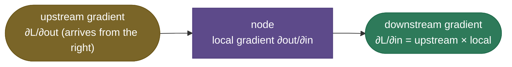
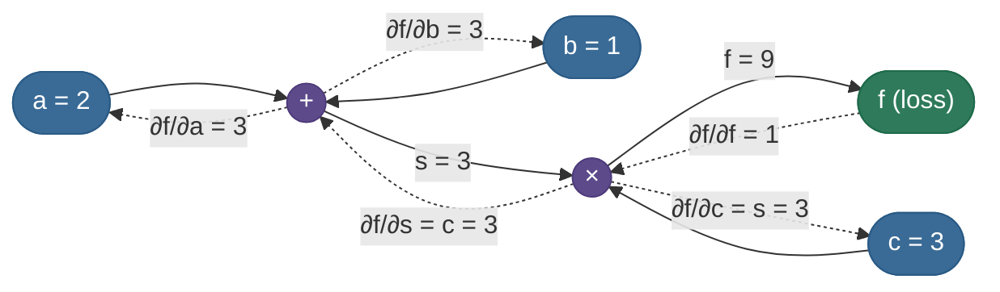
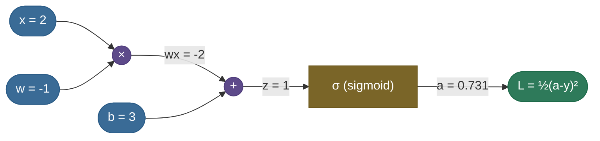
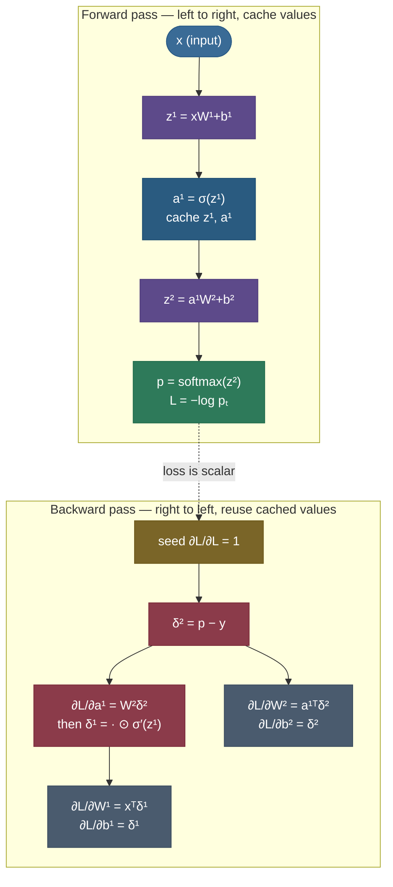
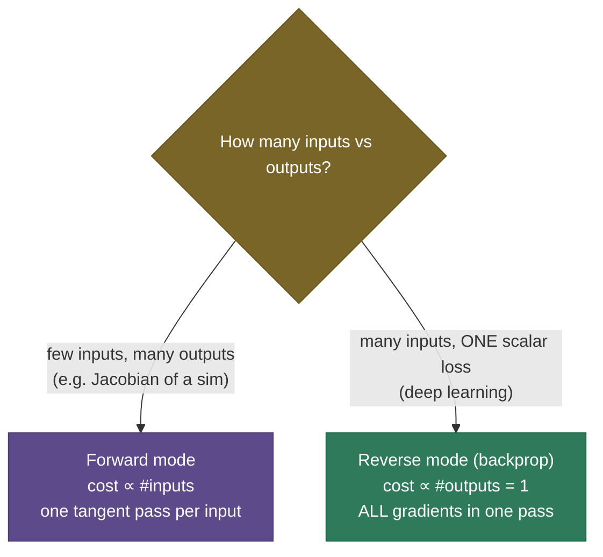
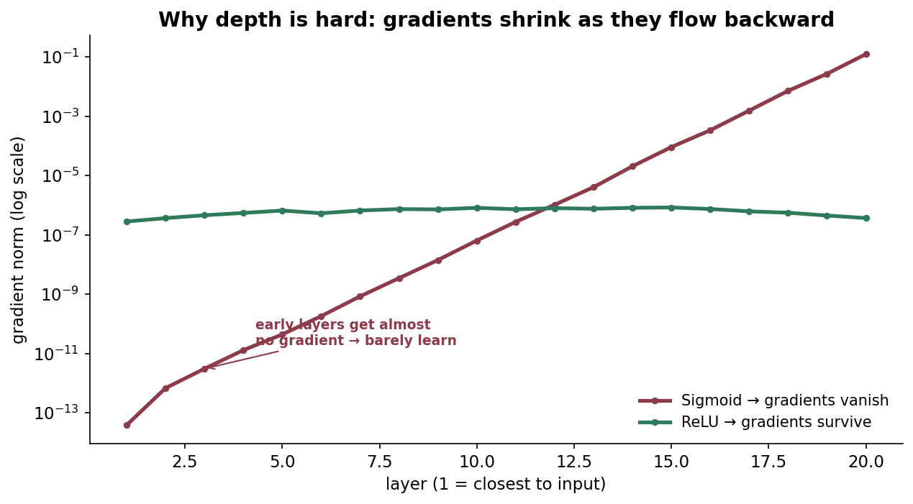
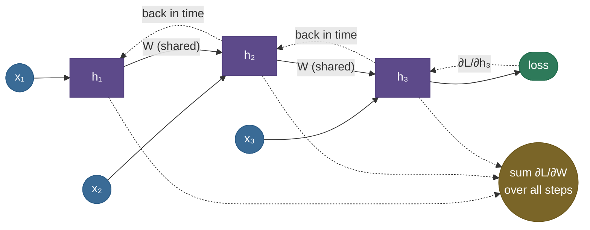

# Backpropagation: every gradient in one backward pass

To train a network you need to know, for each of its millions of weights, *which way to nudge it to lower the loss* — the **gradient** of the loss with respect to every parameter. The naive way is to wiggle each weight a little and watch the loss: change weight $\theta_i$ by a hair, see how much the loss moves, divide. That would take one full forward pass **per parameter** — millions of forward passes for a single training step, and you do thousands of steps. It's not slow, it's *hopeless*: a 7-billion-parameter model would need 7 billion forward passes to get the gradient for one minibatch. **Backpropagation** computes **all** of those gradients in a *single* backward pass that costs about the same as one forward pass. That one fact — all gradients for the price of roughly one extra forward — is why deep learning is computationally possible at all. It is the algorithm running inside every `loss.backward()` call you will ever write.

This page is the complete, worked-from-scratch tour: we feel the waste, build the computational graph, learn the four "gates," derive the matrix and softmax gradients **and the four backprop equations** symbol by symbol, then run a **full numeric forward-and-backward pass by hand** on a tiny net and confirm every number against PyTorch. By the end you'll be able to:

- explain backprop as **reverse-mode automatic differentiation** on a **computational graph**, and why that beats finite differences and symbolic differentiation;
- apply the **chain rule** node by node (upstream × local gradient) and recognize the **gradient "gates"** (add, multiply, max, copy);
- explain the **vector-Jacobian product (VJP)** view — why backprop never materializes a Jacobian;
- **derive** the matmul gradient, the **softmax + cross-entropy** gradient ($\hat y - y$), and the **four backprop equations** for an MLP;
- **work four numeric examples by hand** — a scalar graph, the softmax+CE vector, a *complete 2-layer net forward+backward*, and a gradient-check relative error — each checked against autograd;
- explain **why reverse mode** beats forward mode (outputs ≪ inputs), and why backprop is really **dynamic programming** on the graph;
- diagnose **vanishing/exploding gradients**, verify a backward pass with **gradient checking**, and reason about **autograd**, **compute/memory** cost, and **gradient checkpointing**.

Intuition first, then the graph, the gates, the derivations, the full hand-traced example, and code whose hand-derived gradients match PyTorch to the bit.

> **Note:** "backpropagation" is specifically the *gradient computation* — the backward pass. It is **not** the weight update; that's the [optimizer](../07-Optimizers/07-Optimizers.md)'s job (SGD, Adam…). Backprop produces $\partial L/\partial\theta$; the optimizer decides what to do with it ($\theta \leftarrow \theta - \eta\,\partial L/\partial\theta$ and friends). Keeping these two separate avoids a common interview muddle — *backprop and SGD are not the same thing.*

> **Note:** this page focuses on the algorithm. For the *consequences* of the backward product — why deep nets used to be untrainable — see the sibling [Vanishing & Exploding Gradients](../06-Vanishing-Exploding-Gradients/06-Vanishing-Exploding-Gradients.md); for the activations whose derivatives gate the flow, [Activation Functions](../03-Activation-Functions/03-Activation-Functions.md); for what consumes the gradient, [Optimizers](../07-Optimizers/07-Optimizers.md); and for the network being differentiated, [Perceptron & MLP](../01-Perceptron-and-MLP/01-Perceptron-and-MLP.md). We point to them rather than repeat them.

---

## The problem: we need every gradient, cheaply

Gradient descent needs $\partial L/\partial \theta$ for **every** parameter $\theta$ to take a single step. Two obvious ways to get those derivatives both collapse at scale:

- **Numerical (finite differences).** Perturb each parameter and measure: $\partial L/\partial\theta_i \approx \big(L(\theta + \epsilon e_i) - L(\theta - \epsilon e_i)\big)/2\epsilon$. This is correct and dead simple, but it needs **two forward passes per parameter** — *billions* of forward passes for a large model, *per training step*. Worse, it's only approximate (you pick an $\epsilon$ and eat the error). We keep it for **checking** a backward pass, never for training.
- **Symbolic.** Write out one giant closed-form expression for $\partial L/\partial\theta$ and simplify. For a deep network this expression **explodes in size** (the derivative of a composition of $D$ functions has a product of $D$ Jacobians, expanded over exponentially many paths) and **recomputes shared subexpressions endlessly** — the same intermediate term appears in thousands of places and gets recalculated each time.

Backprop is the third way, and it dodges both failure modes. Treat the network as a **graph of simple operations**; compute the loss **forward**, caching every intermediate value; then sweep **backward** applying the chain rule, **reusing** each cached value and each computed gradient exactly once. The result: **all** gradients, in **one** backward pass, at cost **linear in the size of the graph** — about the same as the forward pass. The genius is not the chain rule (that's freshman calculus); it's the *bookkeeping* — the order of operations that makes the reuse total.

> **Tip:** the mental model for the whole page: **finite differences asks "what if I nudge each input?" one input at a time (forward); backprop asks "how does each input affect the one output?" all inputs at once (backward).** When you have one output (a scalar loss) and millions of inputs (parameters), the second question is the cheap one.

---

## What it is

Backpropagation is **reverse-mode automatic differentiation**. Unpack the name:

- **"Automatic"** — not numerical (no $\epsilon$, no approximation) and not symbolic (no giant expression). It computes *exact* derivatives by composing the *known local derivatives* of each elementary operation. Every op (add, multiply, matmul, ReLU, softmax) ships with a tiny, exact rule for "given the gradient of the loss w.r.t. my output, here's the gradient w.r.t. my inputs." Compose those rules and you get the exact derivative of the whole program.
- **"Reverse-mode"** — it propagates derivatives **from the output (loss) back toward the inputs (weights)**, the opposite direction from the forward computation. For a scalar loss and many parameters, this direction is dramatically cheaper than going forward (we derive *why* below).

The whole algorithm is **two sweeps over the computational graph**:

1. **Forward pass** — compute each node's output from its inputs, in topological order (left to right), and **cache** the intermediate values the backward pass will need.
2. **Backward pass** — starting from $\partial L/\partial L = 1$, visit nodes in **reverse** topological order; at each node multiply the incoming **upstream gradient** (from its consumers) by the node's **local gradient** and pass the product back to its inputs, **summing** where a value fanned out.

That's it. Everything else on this page is (a) what the local gradients of the common ops are, (b) why the reverse direction is efficient, and (c) how to trust your implementation.

---

## Intuition: blame flowing backward

Think of the loss as a number you want to reduce, and every node in the network as a worker who contributed to that number. Backprop is **blame assignment** — its formal name is the *credit-assignment problem*. The loss starts by saying *"you're 1.0 responsible for yourself."* Each node then passes its share of the blame back to whoever fed it, **scaled by how much that input actually moved this node's output.** A node whose output barely depends on a particular input passes back almost no blame; a node whose output is very sensitive to an input passes back a lot. Iterate this from the loss back to every weight, and each weight learns exactly how much it is to blame for the current loss — which is precisely its gradient.

A concrete picture of "blame scaled by influence": suppose the loss is $1.0$ over-budget, and a node's output feeds the loss with sensitivity $0.5$ (a unit change in the node changes the loss by half a unit). Then $0.5$ of the blame reaches that node. If that node's output, in turn, depends on one of its inputs with sensitivity $2.0$, then $0.5\times 2.0 = 1.0$ of blame reaches that input. Multiply the sensitivities along the path — that product *is* the chain rule, and "blame" *is* the gradient. A weight with high total influence on the loss gets a large gradient (a big nudge); one with little influence gets almost none.

That "scaling factor" is the **local gradient** $\partial\text{out}/\partial\text{in}$, and the rule at every single node is just the chain rule:



> **Tip:** the one sentence that captures *all* of backprop: **downstream gradient = upstream gradient × local gradient.** Every node does only this. The "algorithm" is just applying that sentence in reverse topological order and **summing** contributions wherever a value fanned out to several places.

> **See it learn:** [TensorFlow Playground](https://playground.tensorflow.org/) lets you build a small net in the browser and watch it train — the weights and the decision boundary updating each step *are* backprop's gradients at work, made visible. For the mechanics node by node, Karpathy's [micrograd build](https://www.youtube.com/watch?v=VMj-3S1tku0) (in the references) constructs this exact backward pass from scratch in ~100 lines.

---

## The computational graph

Backprop runs on a **computational graph**: a directed acyclic graph where **leaves** are inputs and parameters, **internal nodes** are elementary operations, and the **root** is the scalar loss. Decomposing the computation this way is what makes the chain rule mechanical — each node only needs to know its own local derivative, and the graph structure handles how those derivatives compose.

Take a tiny scalar expression, $f = (a + b)\cdot c$, with $a=2,\ b=1,\ c=3$.

**Forward:** compute $s = a + b = 3$, then $f = s\cdot c = 9$, caching $s$ and $c$ for the backward pass.
**Backward:** seed $\partial f/\partial f = 1$ at the root, then push the gradient back through each op using its local gradient.



Solid arrows carry **values forward**; dashed arrows carry **gradients backward**. The graph makes the crucial reuse explicit: $\partial f/\partial s = 3$ is computed *once* at the multiply node and then feeds *both* $a$ and $b$ through the add node. Nothing is recomputed. That single observation — compute each intermediate gradient once, reuse it for every input that depends on it — is the seed of why backprop is linear-cost, which we make rigorous in the "dynamic programming" section.

> **Note:** the graph is built from **elementary ops** whose local derivatives are trivially known. You never differentiate the whole network as one symbol; you differentiate a thousand `add`s, `matmul`s, and `relu`s, each with a one-line rule, and let the graph compose them. This is exactly what a framework's autograd does — it records the graph of ops as the forward pass runs.

---

## The chain rule and local gradients

Formally, if the loss $L$ depends on $x$ only through an intermediate $y = g(x)$, the chain rule says:

$$\frac{\partial L}{\partial x} = \frac{\partial L}{\partial y}\,\frac{\partial y}{\partial x}$$

— exactly "upstream × local." When a node has multiple inputs or a value reaches the loss along multiple paths, it becomes a **sum over paths** (formally a vector-Jacobian product, below). The local gradients of the common ops are tiny, exact, and endlessly reusable:

| Operation | Local gradient (to each input) |
|---|---|
| add $z = x + y$ | $\partial z/\partial x = 1,\ \partial z/\partial y = 1$ (gradient passes through unchanged) |
| multiply $z = xy$ | $\partial z/\partial x = y,\ \partial z/\partial y = x$ (gradient swaps the inputs) |
| max $z = \max(x,y)$ | gradient routes entirely to the larger input, $0$ to the other |
| matmul $z = Wx$ | $\partial L/\partial W = \delta\,x^\top,\ \partial L/\partial x = W^\top\delta$ (with $\delta = \partial L/\partial z$) |
| ReLU $z = \max(0,x)$ | $\partial z/\partial x = \mathbb{1}[x>0]$ |
| sigmoid $z = \sigma(x)$ | $\partial z/\partial x = z(1-z)$ |
| tanh $z = \tanh(x)$ | $\partial z/\partial x = 1 - z^2$ |
| exp $z = e^{x}$ | $\partial z/\partial x = z$ |
| log $z = \ln x$ | $\partial z/\partial x = 1/x$ |

These are the entire vocabulary. Any deep network's backward pass is a composition of rows from this table (plus a few more for convolutions, attention, etc.), applied in reverse order.

> **Note:** autograd never materializes a layer's full **Jacobian** $\partial\text{out}/\partial\text{in}$ — for a linear layer mapping $\mathbb{R}^{n}\to\mathbb{R}^{m}$ that matrix is $m\times n$, enormous, and full of redundant structure. Instead it computes a **vector-Jacobian product (VJP)**: given the upstream gradient *vector* $\delta = \partial L/\partial\text{out}$, it produces the downstream *vector* $\delta^\top J = \partial L/\partial\text{in}$ directly via the local rule (e.g. matmul's $W^\top\delta$), without ever forming $J$. All of reverse-mode is a chain of VJPs — which is precisely why it stays linear-cost instead of quadratic. We dedicate a section to this view below because it is *the* idea behind autograd.

> **Gotcha:** when a value **fans out** to several consumers (it's used in more than one downstream op), its gradient is the **sum** of the gradients flowing back from each consumer — because each path contributes a term to the total derivative. Forgetting to *add* (and instead overwriting) is a classic from-scratch bug, and it's exactly why autograd **accumulates** into `.grad` rather than assigning.

---

## The four gradient "gates"

Almost every backward pass is built from just four routing patterns. Memorize them and you can read gradient flow off a graph by eye, without writing a single derivative:


- **add = distributor:** copies the upstream gradient to every input unchanged ($\partial(x+y)/\partial x = 1$). A bias add, a residual connection, a skip — all distribute the gradient untouched. This is why **residual connections** create a gradient "highway": the add gate hands the upstream gradient straight back to the early layers.
- **multiply = swapper:** each input's gradient is upstream × *the other* input ($\partial(xy)/\partial x = y$). The gate **swaps** the operands.
- **max / ReLU = router:** the gradient flows only to the input that "won" the max; the loser gets exactly $0$. For ReLU $=\max(0,x)$, a negative pre-activation gets zero gradient — this is precisely the **dead-ReLU** effect (a neuron stuck off learns nothing because no gradient reaches it).
- **copy / fan-out = adder:** a value used in $k$ places receives the **sum** of the $k$ gradients coming back. This is the fan-out rule from the previous section, in gate form.

> **Tip:** the multiply gate is a favorite trick question: *"what's the gradient to $x$ in $z = xy$?"* — it's the upstream gradient times **$y$**, *not* $x$. The gate **swaps**. Candidates who say "$x$" have memorized $\frac{d}{dx}x^2 = 2x$ and over-applied it.

> **Note:** some ops are **non-differentiable** — argmax, rounding, hard thresholding, quantization — so their true local gradient is $0$ almost everywhere or undefined, which would *block learning* through them. The **straight-through estimator (STE)** cheats: use the real (hard) op on the forward pass, but pass the upstream gradient **straight through** on the backward pass *as if the op were the identity*. It's how quantization-aware training and discrete-latent models (VQ-VAE) get a usable gradient through a hard step. The gate view makes the trick obvious: replace the would-be "router that sends 0 everywhere" with a "distributor."

---

## A fan-out worked in numbers (the summing rule)

The fan-out/copy gate is the one beginners drop, so here it is on numbers. Let $f = x\cdot x = x^2$ at $x = 3$, but treat the two $x$'s as the *same* leaf reaching the multiply node along **two** edges. The multiply gate's local grads are "the other input": each edge sends back $x = 3$. Naively that gives $3$ to each edge — but $x$ fans out to both, so its total gradient is the **sum**: $\partial f/\partial x = 3 + 3 = 6$. Check: $\frac{d}{dx}x^2 = 2x = 6$ ✓. The factor of 2 in $2x$ is *literally* the two fan-out edges summing. Now imagine $x$ feeding 50 downstream ops — its gradient is the sum of 50 contributions, and forgetting to add them (overwriting instead) loses 49 of them. That is why autograd accumulates with `+=`, and why this single rule is the difference between a backward pass that works and one that silently trains wrong.

---

## Worked example 1: a scalar expression (warm-up)

Continue $f=(a+b)c$ with $a=2,\,b=1,\,c=3$, and trace the backward pass by hand:

1. **Seed:** $\dfrac{\partial f}{\partial f} = 1$.
2. **Multiply node** $f = s\cdot c$ (local grads: $\partial f/\partial s = c = 3$, $\partial f/\partial c = s = 3$): so $\dfrac{\partial f}{\partial s} = 1\cdot 3 = 3$ and $\dfrac{\partial f}{\partial c} = 1\cdot 3 = 3$.
3. **Add node** $s = a + b$ (local grads both $1$): with upstream $=3$, $\dfrac{\partial f}{\partial a} = 3\cdot 1 = 3$ and $\dfrac{\partial f}{\partial b} = 3\cdot 1 = 3$.

Check against calculus: $f = ac + bc$, so $\partial f/\partial a = c = 3$ ✓, $\partial f/\partial b = c = 3$ ✓, $\partial f/\partial c = a + b = 3$ ✓. Three lines of "upstream × local," summing nowhere because nothing fanned out, and we have every gradient. This is the whole algorithm in miniature; the rest is the same thing on bigger nodes.

---

## Worked example 2: a sigmoid neuron, end to end

Now an actual neuron with an activation and a loss. Inputs $x=2$, weight $w=-1$, bias $b=3$, target $y=0$, with sigmoid $\sigma$ and squared-error loss $L = \tfrac12(a-y)^2$.



**Forward:** $z = wx + b = (-1)(2) + 3 = 1$; $a = \sigma(1) = 0.7311$; $L = \tfrac12(0.7311 - 0)^2 = 0.2672$.

**Backward**, one factor at a time (upstream × local):

1. $\dfrac{\partial L}{\partial a} = (a - y) = 0.7311$.
2. $\dfrac{\partial a}{\partial z} = a(1-a) = 0.7311 \cdot 0.2689 = 0.1966$, so $\dfrac{\partial L}{\partial z} = 0.7311 \cdot 0.1966 = 0.1437$.
3. Through $z = wx + b$ (add then multiply): $\dfrac{\partial L}{\partial w} = \dfrac{\partial L}{\partial z}\cdot x = 0.1437 \cdot 2 = \mathbf{0.2875}$; $\dfrac{\partial L}{\partial b} = 0.1437 \cdot 1 = \mathbf{0.1437}$; $\dfrac{\partial L}{\partial x} = 0.1437 \cdot w = \mathbf{-0.1437}$.

PyTorch's autograd returns exactly `dL/dw = 0.2875, dL/db = 0.1437, dL/dx = -0.1437` — the hand trace is correct. Notice the sigmoid's $a(1-a)$ factor peaks at $0.25$ (when $a=0.5$): every sigmoid a gradient passes through shrinks it by **at most** a quarter. Stack a few of these and the gradient withers — the seed of the [vanishing-gradient](../06-Vanishing-Exploding-Gradients/06-Vanishing-Exploding-Gradients.md) problem, made concrete by a single number.

---

## The vector-Jacobian product (the engine of autograd)

We now make the VJP idea precise, because it is *what reverse-mode actually computes* and it explains the entire efficiency story. Consider a single layer $y = f(x)$ mapping $x \in \mathbb{R}^{n}$ to $y \in \mathbb{R}^{m}$. Its **Jacobian** is the $m\times n$ matrix $J$ with $J_{ij} = \partial y_i/\partial x_j$. The full chain rule for the loss says:

$$\underbrace{\frac{\partial L}{\partial x}}_{1\times n} = \underbrace{\frac{\partial L}{\partial y}}_{1\times m}\cdot \underbrace{J}_{m\times n}.$$

Reverse-mode never forms $J$. It receives the **cotangent vector** $v = \partial L/\partial y$ (the upstream gradient, a row vector of length $m$) and returns $v^\top J$ — the **vector-Jacobian product**, a vector of length $n$ — *directly*, using a closed-form rule that avoids the matrix entirely. For the linear layer $y = Wx$, $J = W$, and the VJP is just $v^\top W = (W^\top v)^\top$: one matrix-vector product, $O(mn)$, never the $O(mn)$-entry matrix materialized and stored. Two reasons this is the whole game:

- **Memory.** Materializing $J$ for, say, a $4096 \times 4096$ linear layer is a 16-million-entry matrix *per example*; the VJP touches the same weight matrix $W$ you already have. No extra storage.
- **Composition.** Stack layers $L = \ell(f_D(\cdots f_1(x)))$. The full Jacobian is the product $J_D J_{D-1}\cdots J_1$. Forward mode would build this product **left-to-right starting from a matrix** (expensive: matrix × matrix). Reverse mode applies it **right-to-left starting from a *vector*** $v$ — $v^\top J_D$, then $(v^\top J_D)J_{D-1}$, and so on — so every step is a *vector × matrix* (a VJP), never *matrix × matrix*. Vector-times-matrix is dramatically cheaper, and it's only possible because the loss is a scalar (so the leftmost "vector" $v = \partial L/\partial L = 1$ is one number).

> **Note:** this is the single deepest sentence on the page: **reverse-mode is efficient because it propagates a vector through a chain of Jacobians instead of building the Jacobian product itself.** "$\partial L/\partial W = \delta x^\top$, $\partial L/\partial x = W^\top\delta$" (next section) are just the two VJP rules of a linear layer written out. Memorize those two and you can backprop any feed-forward net.

---

## Deriving the layer gradient (matmul VJP)

Real layers are matrix multiplies, so the most-used gradient rule is the one for $z = Wx$ (here $z\in\mathbb{R}^m$, $W\in\mathbb{R}^{m\times n}$, $x\in\mathbb{R}^n$). Write it in indices, $z_i = \sum_j W_{ij}\, x_j$, and let $\delta = \partial L/\partial z$ be the upstream gradient (shape $m$). Then, applying the chain rule entry by entry:

$$\frac{\partial L}{\partial W_{ij}} = \frac{\partial L}{\partial z_i}\,\frac{\partial z_i}{\partial W_{ij}} = \delta_i\,x_j \;\Rightarrow\; \boxed{\frac{\partial L}{\partial W} = \delta\,x^\top}\quad (m\times n)$$

$$\frac{\partial L}{\partial x_j} = \sum_i \frac{\partial L}{\partial z_i}\,\frac{\partial z_i}{\partial x_j} = \sum_i \delta_i\, W_{ij} = (W^\top\delta)_j \;\Rightarrow\; \boxed{\frac{\partial L}{\partial x} = W^\top\delta}\quad (n)$$

Two boxed rules — *"outer-product the upstream error with the input to get the weight gradient; multiply by $W^\top$ to pass the error back to the input."* These are the workhorses of every backward pass in a deep net. Note the shapes: $\partial L/\partial W$ must match $W$ ($m\times n$), and $\delta x^\top$ is exactly $(m\times 1)(1\times n) = m\times n$ ✓; $\partial L/\partial x$ must match $x$ ($n$), and $W^\top\delta$ is $(n\times m)(m\times 1) = n$ ✓. Getting these shapes to line up is how you catch a missing transpose. And both are VJPs — no Jacobian, just two matrix-vector products.

> **Tip:** the bias $b$ in $z = Wx + b$ is the easiest of all: $z_i = (Wx)_i + b_i$ so $\partial z_i/\partial b_i = 1$, giving $\boxed{\partial L/\partial b = \delta}$ directly. For a *batch* of examples, the bias receives the **sum** of $\delta$ over the batch (the bias fans out to every example — the copy gate again).

---

## Per-op Jacobians and how they compose

The whole network is a composition of layers, so its backward pass is a composition of per-op VJPs. It helps to have the common ones in one place, each as "given upstream $\delta = \partial L/\partial\text{out}$, here is $\partial L/\partial\text{in}$" — and to see that *composing* them is just chaining these rules right-to-left.

| Layer / op (forward) | Local Jacobian structure | VJP — downstream gradient $\partial L/\partial\text{in}$ |
|---|---|---|
| linear $z = Wx + b$ | $J = W$ (dense) | $W^\top\delta$; plus $\partial L/\partial W = \delta x^\top$, $\partial L/\partial b = \delta$ |
| ReLU $a = \max(0,z)$ | $J = \text{diag}(\mathbb{1}[z>0])$ | $\delta \odot \mathbb{1}[z>0]$ (mask out dead units) |
| sigmoid $a = \sigma(z)$ | $J = \text{diag}(a(1-a))$ | $\delta \odot a(1-a)$ |
| tanh $a = \tanh(z)$ | $J = \text{diag}(1-a^2)$ | $\delta \odot (1-a^2)$ |
| softmax $p = \text{softmax}(z)$ | $J_{ij} = p_i(\delta_{ij}-p_j)$ (dense) | $p \odot (\delta - (p^\top\delta)\mathbf{1})$ |
| softmax + CE (fused) | — | $p - y$ (the Worked-example-3 shortcut) |
| add / residual $y = a + b$ | $J = I$ to each branch | $\delta$ to **both** branches (distributor) |

Two structural facts make backprop cheap and explain why elementwise activations are "free": their Jacobians are **diagonal**, so the VJP is just an elementwise multiply ($O(n)$, not a matmul). Only the *linear* layers carry a dense Jacobian, and even there the VJP is a matrix-vector product, never the materialized matrix. Composing a whole MLP is then: $\delta \to (\text{elementwise }\sigma') \to (\times W^\top) \to (\text{elementwise }\sigma') \to (\times W^\top) \to \cdots$ — alternating cheap diagonal multiplies with the linear-layer matmuls, exactly the four-equation recurrence below.

> **Note:** the **fused softmax+CE** row is why you almost never see the dense softmax Jacobian in practice. On its own, softmax's VJP is $p\odot(\delta - (p^\top\delta)\mathbf{1})$ — correct but needing the upstream $\delta$. Fused with cross-entropy, the upstream is exactly $-1/p_t$ on the true class, the algebra collapses (Worked example 3), and the whole head's gradient is the single elementwise $p - y$. Fusing both saves the dense Jacobian *and* the numerical-stability headache.

---

## The four backprop equations (derived)

Now stack layers into an MLP and derive backprop in its classic form (Nielsen's notation). Define, for layer $l$: pre-activation $z^l = W^l a^{l-1} + b^l$, activation $a^l = \sigma(z^l)$, with $a^0 = x$ the input and $a^L$ the output. The single key quantity is the per-layer **error** $\delta^l \equiv \partial L/\partial z^l$ (the gradient of the loss w.r.t. that layer's pre-activations). Everything follows from chasing $\delta$ backward.

**Output layer.** $L$ depends on $z^L$ only through $a^L = \sigma(z^L)$, so by the chain rule (elementwise, since $\sigma$ acts componentwise):

$$\boxed{\;\delta^L = \nabla_{a^L} L \;\odot\; \sigma'(z^L)\;}\qquad\text{(loss-grad × activation-grad)}$$

**Hidden layers (the recurrence).** $z^l$ influences $L$ only through the next pre-activation $z^{l+1} = W^{l+1} a^l + b^{l+1} = W^{l+1}\sigma(z^l) + b^{l+1}$. Apply the chain rule: the error pulls back through $W^{l+1}$ (the matmul VJP, $W^\top\delta$) and then through the activation ($\odot\,\sigma'$):

$$\boxed{\;\delta^l = \big((W^{l+1})^\top \delta^{l+1}\big) \;\odot\; \sigma'(z^l)\;}$$

**Parameter gradients.** Read them off $\delta^l$ with the outer-product / pass-through rules from the matmul VJP:

$$\boxed{\;\frac{\partial L}{\partial W^l} = \delta^l (a^{l-1})^\top\;}\qquad\qquad \boxed{\;\frac{\partial L}{\partial b^l} = \delta^l\;}$$

The middle equation is the **engine**: $\delta^{l+1}$ becomes $\delta^l$ by a matmul with $(W^{l+1})^\top$ and an elementwise multiply by $\sigma'(z^l)$. Apply it repeatedly from the output layer down to layer 1, reading off $\partial L/\partial W^l$ and $\partial L/\partial b^l$ at each layer as you go. **That is the entire algorithm.** Every term is concrete: $a^{l-1}$ and $z^l$ are cached from the forward pass; $\sigma'$ is the activation's local gradient; $(W^{l+1})^\top$ is the next layer's weights, transposed. Below we run all four equations on real numbers.



> *Where these come from: backprop for neural nets is **Learning representations by back-propagating errors** (Rumelhart, Hinton & Williams 1986); these **four equations** in exactly this $\delta$-form are derived in Michael Nielsen's **Neural Networks and Deep Learning**, Ch. 2; the general reverse-mode-autodiff view (the VJP chain) is **Automatic Differentiation in Machine Learning: a Survey** (Baydin et al. 2015); the computational-graph framing is Olah's **Calculus on Computational Graphs** and **Dive into Deep Learning** §5.3. All in the references.*

---

## Worked example 3: softmax + cross-entropy → ŷ − y

The classifier head — softmax followed by cross-entropy — has the single most elegant gradient in deep learning and is *the* most-asked derivation in interviews. The result, $\partial L/\partial z = \hat y - y$ (predicted probabilities minus the one-hot target), is so clean it looks like magic; here is exactly why it falls out.

With logits $z\in\mathbb{R}^K$, softmax probabilities $p_i = e^{z_i}/\sum_k e^{z_k}$, true class $t$, one-hot target $y$ (so $y_t = 1$), and cross-entropy loss $L = -\log p_t$:

**Step 1 — the softmax Jacobian.** Let $S = \sum_k e^{z_k}$ so $p_i = e^{z_i}/S$. Differentiate $p_i$ w.r.t. $z_j$ with the quotient rule, splitting the two cases (note $\partial S/\partial z_j = e^{z_j}$):

$$i = j:\quad \frac{\partial p_i}{\partial z_i} = \frac{e^{z_i}\,S - e^{z_i}\,e^{z_i}}{S^2} = \frac{e^{z_i}}{S} - \Big(\frac{e^{z_i}}{S}\Big)^2 = p_i - p_i^2 = p_i(1 - p_i)$$

$$i \neq j:\quad \frac{\partial p_i}{\partial z_j} = \frac{0\cdot S - e^{z_i}\,e^{z_j}}{S^2} = -\,p_i\,p_j$$

Both cases collapse into one tidy formula using the Kronecker delta:

$$\frac{\partial p_i}{\partial z_j} = p_i(\delta_{ij} - p_j),\qquad \text{so in particular}\quad \frac{\partial p_t}{\partial z_i} = p_t(\delta_{it} - p_i).$$

**Step 2 — chain through cross-entropy.** $L = -\log p_t$, so $\partial L/\partial p_t = -1/p_t$. Then:

$$\frac{\partial L}{\partial z_i} = \frac{\partial L}{\partial p_t}\,\frac{\partial p_t}{\partial z_i} = -\frac{1}{p_t}\cdot p_t(\delta_{it} - p_i) = p_i - \delta_{it} = \boxed{p_i - y_i}$$

The $p_t$'s cancel, the deltas turn into the one-hot $y$, and you're left with **predicted minus target** — clean, cheap, and beautifully interpretable: *the gradient is exactly how wrong each class probability is.* If the model is perfectly confident and correct ($p = y$), the gradient is zero; the more wrong it is, the bigger the push.

**Numeric check (Worked example 3).** Logits $z = [2,\,1,\,0.1]$, true class $0$:

- softmax: $p = [0.659,\ 0.242,\ 0.099]$;
- gradient: $\hat y - y = p - [1,0,0] = [-0.341,\ 0.242,\ 0.099]$.

PyTorch's `cross_entropy(...).backward()` returns exactly `[-0.341, 0.242, 0.099]` (verified in the code section). The correct class gets a **negative** gradient (push its logit up); the wrong classes get **positive** gradients (push theirs down) — gradient descent does precisely that.

> **Note:** frameworks **fuse** softmax and cross-entropy into one op (`cross_entropy` / `log_softmax + nll_loss`) for two reasons. First, this clean $\hat y - y$ gradient (computed once, without ever forming the softmax Jacobian). Second, **numerical stability**: computing $\log p_t$ directly via the **log-sum-exp** identity, $\log p_t = z_t - \big(m + \log\sum_k e^{z_k - m}\big)$ with $m = \max_k z_k$, avoids exponentiating large logits to $\infty$ and then taking $\log$ of a tiny probability (which underflows to $-\infty$). Always use the fused op rather than a separate `softmax` then `log`.

---

## Worked example 4: a complete 2-layer net, forward AND backward by hand

This is the centerpiece: a full forward pass *and* a full backward pass on a tiny network, every number worked out by hand, then confirmed by autograd. The net is $2 \to 2 \to 2$: input $x\in\mathbb{R}^2$, a tanh hidden layer, a linear output layer, then softmax + cross-entropy. Concrete values:

$$x = [1,\ 2],\quad W^1 = \begin{bmatrix}0.1 & 0.3\\ 0.2 & 0.4\end{bmatrix},\ b^1 = [0.1,\ 0.2],\quad W^2 = \begin{bmatrix}0.5 & 0.1\\ 0.2 & 0.3\end{bmatrix},\ b^2 = [0.1,\ 0.2],\quad t = 0\ (y=[1,0]).$$

We use the row-vector convention $z = xW + b$ (so $W$ is shaped input×output). The annotated graph below has every forward value and every backward gradient on it — refer back to it as we walk through.


**Forward pass.**

1. $z^1 = xW^1 + b^1 = [1\cdot0.1 + 2\cdot0.2,\ \ 1\cdot0.3 + 2\cdot0.4] + [0.1, 0.2] = [0.5, 1.1] + [0.1, 0.2] = [0.6,\ 1.3]$.
2. $a^1 = \tanh(z^1) = [\tanh 0.6,\ \tanh 1.3] = [0.5370,\ 0.8617]$.
3. $z^2 = a^1 W^2 + b^2 = [0.5370\cdot0.5 + 0.8617\cdot0.2,\ \ 0.5370\cdot0.1 + 0.8617\cdot0.3] + [0.1, 0.2] = [0.4409, 0.3122] + [0.1, 0.2] = [0.5409,\ 0.5122]$.
4. $p = \text{softmax}(z^2)$: $e^{0.5409} = 1.7176$, $e^{0.5122} = 1.6690$, sum $= 3.3866$, so $p = [0.5072,\ 0.4928]$.
5. $L = -\log p_0 = -\log 0.5072 = 0.6789$.

**Backward pass** (the four backprop equations, on real numbers).

1. **Output error** (softmax+CE, Worked example 3): $\delta^2 = p - y = [0.5072 - 1,\ 0.4928 - 0] = [-0.4928,\ 0.4928]$.
2. **Output weight grads** (outer-product rule): $\dfrac{\partial L}{\partial W^2} = (a^1)^\top \delta^2 = \begin{bmatrix}0.5370\\0.8617\end{bmatrix}[-0.4928,\ 0.4928] = \begin{bmatrix}-0.2647 & 0.2647\\ -0.4247 & 0.4247\end{bmatrix}$, and $\dfrac{\partial L}{\partial b^2} = \delta^2 = [-0.4928,\ 0.4928]$.
3. **Pull the error back** through $W^2$ (matmul VJP, $W\delta$ for this convention): $\dfrac{\partial L}{\partial a^1} = W^2\delta^2 = \begin{bmatrix}0.5 & 0.1\\0.2 & 0.3\end{bmatrix}\begin{bmatrix}-0.4928\\0.4928\end{bmatrix} = [\,0.5\cdot(-0.4928)+0.1\cdot0.4928,\ \ 0.2\cdot(-0.4928)+0.3\cdot0.4928\,] = [-0.1971,\ 0.0493]$.
4. **Through tanh** (local gradient $1 - a^2$): $\sigma'(z^1) = 1 - (a^1)^2 = [1 - 0.5370^2,\ 1 - 0.8617^2] = [0.7116,\ 0.2574]$, so $\delta^1 = \dfrac{\partial L}{\partial a^1} \odot \sigma'(z^1) = [-0.1971\cdot0.7116,\ 0.0493\cdot0.2574] = [-0.1403,\ 0.0127]$.
5. **Input weight grads** (outer-product rule): $\dfrac{\partial L}{\partial W^1} = x^\top \delta^1 = \begin{bmatrix}1\\2\end{bmatrix}[-0.1403,\ 0.0127] = \begin{bmatrix}-0.1403 & 0.0127\\ -0.2806 & 0.0254\end{bmatrix}$, and $\dfrac{\partial L}{\partial b^1} = \delta^1 = [-0.1403,\ 0.0127]$.

Every one of those numbers is a single application of "upstream × local," and every one matches PyTorch's autograd to machine precision (max abs diff $\approx 10^{-16}$ — see the code section, which runs this exact net). Trace it once by hand and backprop stops being magic: it is just this, scaled to billions of parameters.

> **Tip:** the convention $z = xW + b$ (row vectors) makes "pull back" read as $W\delta$ and the weight grad as $x^\top\delta$; the column convention $z = Wx + b$ makes them $W^\top\delta$ and $\delta x^\top$. They are the same computation — just transposed. In an interview, **state your convention first**, then the shapes police themselves.

---

## Forward mode vs reverse mode

Automatic differentiation comes in two directions, and choosing reverse mode is *the* insight that makes deep learning cheap. Both compute exact derivatives; they differ in *which way* they push them through the Jacobian chain:

- **Forward mode** propagates derivatives input→output, carrying a *tangent* (how the output changes as we perturb one chosen input). Cost scales with the **number of inputs** — one forward sweep per input you want a derivative w.r.t.
- **Reverse mode (backprop)** propagates output→input, carrying a *cotangent* (the upstream gradient $\partial L/\partial\cdot$). Cost scales with the **number of outputs** — one backward sweep per scalar output.

A neural network has **millions of inputs (parameters)** and **one output (the scalar loss)**, so reverse mode gets *all* gradients for the price of roughly one extra pass, while forward mode would need millions of passes. The plot below makes the asymmetry concrete: with a single scalar loss, forward-mode cost grows linearly with parameter count while reverse-mode stays flat at one.




> **Note:** this is also why the loss must be a **scalar** to call `.backward()` directly. Reverse mode seeds the backward pass with $\partial L/\partial L = 1$ at a *single* output. A non-scalar output (a vector or a tensor) has no canonical seed, so PyTorch makes you pass the upstream gradient vector explicitly (`tensor.backward(grad_tensor)`), which is exactly choosing the cotangent $v$ for a VJP. Forward mode is *not* useless — it wins for Jacobian-vector products and for functions with few inputs and many outputs (some physics/ODE settings) — it's just the wrong tool for "many params, one loss."

---

## The two sweeps as an algorithm

It is worth seeing the whole thing as explicit pseudocode, because it makes the "compute once, reuse" structure undeniable. Treat the network as a list of nodes in topological order; each node knows its `forward(inputs)` and its `backward(upstream)` (the VJP rules above).

```
# FORWARD: topological order (inputs -> loss), cache every output
for node in topo_order:
    node.value = node.forward(parent.value for parent in node.inputs)   # cache it
loss = last_node.value

# BACKWARD: reverse topological order (loss -> inputs)
grad = {node: 0 for node in all_nodes}          # accumulate; fan-out -> sum
grad[last_node] = 1.0                            # seed dL/dL = 1
for node in reversed(topo_order):
    upstream = grad[node]                        # already fully summed (DP guarantee)
    for parent, local_vjp in node.backward(upstream):
        grad[parent] += local_vjp                # += because a value can fan out
```

Two invariants do all the work. First, **reverse topological order** guarantees that when we process a node, every consumer that depends on it has *already* added its contribution to `grad[node]` — so the upstream is complete before we use it (this is the dynamic-programming property). Second, the `+=` (not `=`) implements the **fan-out sum**: a value used in several places receives the sum of all the gradients flowing back, which is exactly what PyTorch's `.grad` accumulation does. That is the entire algorithm; the worked examples above are this loop, run by hand.

> **Gotcha:** the `+=` is load-bearing. Initialize gradients to **zero** and **add** into them; if you *assign* instead, a value that fans out to two places keeps only the second contribution and the gradient is silently wrong. This is the from-scratch bug that's hardest to spot because the code "runs" — it just trains badly. (And it's why you `zero_grad()` each step: the accumulator must start clean.)

---

## Backprop is dynamic programming

Why is backprop *linear* in the size of the graph, when the naive chain rule seems to require summing over the **exponentially many paths** from the output to each input? (In a graph with branching, the number of distinct output→input paths can grow exponentially with depth.) Because backprop is **dynamic programming**: the error $\delta$ for a node is computed **once**, stored, and **reused** by every node that feeds into it. Each edge's local gradient is touched exactly one time.

Concretely, the forward pass **memoizes the values** (each node's output, cached); the backward pass **memoizes the gradients** (each node's $\delta$, computed once and reused). Naive symbolic differentiation re-derives the shared subexpression along every path — that's the exponential blow-up. Backprop's reverse-topological order guarantees that by the time you process a node, *all* of its consumers have already deposited their gradient contributions into it, so you sum them once and pass the total back. The backward pass therefore costs the **same order** as the forward pass — it visits each node and each edge a constant number of times. This memoize-and-reuse structure is *the* reason the algorithm is feasible; the chain rule alone, applied naively, is not.

> **Tip:** the interview phrasing: *"backprop is the chain rule plus dynamic programming."* The chain rule says how to combine local gradients; dynamic programming (reverse topological order + memoizing each $\delta$) is what keeps it from re-deriving shared terms and exploding to exponential cost.

> **Note:** to feel the exponential the DP avoids: a graph where every layer's output feeds two paths to the next layer has $2^{D}$ distinct output→input paths at depth $D$ — over a *million* paths at depth 20, a *billion* at depth 30. Naively summing the chain rule over all of them would be hopeless; backprop visits each of the $D$ layers **once**, computing each $\delta$ a single time and reusing it. Same answer, exponentially less work — the textbook payoff of dynamic programming.

---

## The δ recurrence and vanishing/exploding gradients

Look again at the recurrence $\delta^l = \big((W^{l+1})^\top \delta^{l+1}\big)\odot \sigma'(z^l)$. Going from $\delta^{l+1}$ to $\delta^l$ multiplies by a matrix ($(W^{l+1})^\top$) and by an activation-derivative factor ($\sigma'$). Iterate from the output to layer 1 and the input-layer error is a **product of $\sim D$ such factors**:

$$\delta^1 \;\approx\; \Big(\prod_{l=2}^{L}(W^l)^\top\Big)\Big(\prod_{l=1}^{L}\text{diag}\,\sigma'(z^l)\Big)\, \delta^L.$$

Products of many numbers are unstable. If the factors are consistently **less than 1** in magnitude (sigmoid's $\sigma'$ peaks at $0.25$, tanh's at $1$ but typically smaller, and weight matrices with small singular values shrink too), the gradient **shrinks geometrically** toward the early layers — they receive almost nothing and barely learn: **vanishing gradients**. If the factors are consistently **greater than 1**, the product **explodes** to NaN: **exploding gradients**. The two plots below show both effects directly — the $\delta$ magnitude pulled back layer by layer, and the resulting weight-gradient norm per layer.




This single phenomenon — the backward product drifting away from 1 — motivates a huge fraction of deep-learning design: **ReLU**-like activations (local gradient exactly 1 in the active region, so they don't shrink the product), **residual connections** (an additive gradient shortcut — the add gate hands $\delta$ straight back, so the product has a "$+\,1$" path that never vanishes), **normalization** (batch/layer norm, which keeps $z$ in a healthy range so $\sigma'$ stays alive and conditions the weight matrices), careful **initialization** (He/Xavier, which set the weight scale so the product starts near 1), and **gradient clipping** for the exploding side.

> **Tip:** *"why didn't deep networks work before ~2010?"* → vanishing gradients through sigmoids/tanh, compounded by poor initialization. ReLU + better init (He/Xavier) + residual connections + normalization are the fixes that made depth trainable — and they all exist to keep that backward product near 1. The full story is the sibling page, [Vanishing & Exploding Gradients](../06-Vanishing-Exploding-Gradients/06-Vanishing-Exploding-Gradients.md); here the point is just that the recurrence *is* a product, and products are fragile.

---

## Numerical stability in the backward pass

The backward pass inherits the forward pass's numerical hazards and adds a few of its own. Three show up constantly:

- **log-sum-exp / softmax+CE.** A naive softmax exponentiates the logits; a large logit overflows $e^z$ to $\infty$, and a tiny probability underflows so that $\log p$ is $-\infty$ — both produce `NaN` gradients. The fix is the **log-sum-exp** trick (subtract the max before exponentiating) baked into the fused `cross_entropy`. This is a *forward* fix, but it's what keeps $\delta^L = p - y$ finite and well-scaled. **Always use the fused op.**
- **Saturating activations kill the gradient.** sigmoid/tanh have $\sigma'\to 0$ in their tails, so a saturated unit passes back essentially zero — the local gradient *is* the problem (this is half of vanishing gradients). The fix is upstream: ReLU/GELU, normalization to keep pre-activations near zero, and initialization that avoids saturation from step one.
- **Exploding gradients → `NaN` weights.** If the backward product grows (large weights, deep recurrence), $\delta$ can overflow to `inf`, the update sends a weight to `NaN`, and `NaN` then contaminates *everything* downstream on the next forward. The standard guard is **gradient clipping**: before the optimizer step, rescale the whole gradient vector if its norm exceeds a threshold $\tau$:

$$g \leftarrow g\cdot \min\!\Big(1,\ \frac{\tau}{\|g\|}\Big).$$

This caps the *step size* without changing the gradient's *direction* — a cheap, ubiquitous safety net (essential for RNNs/transformers).

> **Gotcha:** once a `NaN` appears in a gradient it propagates everywhere and the run is dead — loss prints `nan` forever. To localize it, register hooks or use `torch.autograd.set_detect_anomaly(True)`, which raises at the *op that first produced* the `NaN` instead of letting it spread. Common culprits: `log(0)` (use a fused/stable loss), `sqrt(0)` or `0/0` in a custom op, and an exploding gradient that wasn't clipped.

> **Tip:** in **mixed-precision** training (fp16/bf16), small gradients can **underflow to zero** in fp16 before the optimizer sees them. The fix is **loss scaling**: multiply the loss by a large constant $S$ before `backward()` (so every gradient is scaled up by $S$ and stays in fp16's representable range), then divide the gradients by $S$ before the step. It's the chain rule's linearity — scaling the loss scales every gradient by the same factor — turned into a numerical trick.

---

## Gradient checking

Backprop is easy to get subtly wrong — a missing transpose, a dropped fan-out sum, an activation derivative evaluated at the wrong tensor. The standard defense is to verify your analytic gradient against the slow-but-trustworthy **numerical** gradient, using the **centered** (two-sided) finite difference:

$$\frac{\partial L}{\partial \theta_i} \approx \frac{L(\theta + \epsilon e_i) - L(\theta - \epsilon e_i)}{2\epsilon}$$

This is accurate to $O(\epsilon^2)$ (the odd-order error terms cancel in the centered version, unlike the one-sided $\big(L(\theta+\epsilon)-L(\theta)\big)/\epsilon$, which is only $O(\epsilon)$). To compare analytic ($g_a$) and numerical ($g_n$) gradients robustly, use **relative error**, not absolute:

$$\text{rel err} = \frac{|g_a - g_n|}{\max(|g_a| + |g_n|,\ \varepsilon)}.$$

A relative error below $\sim 10^{-7}$ is a pass; $10^{-4}$ usually means a bug (or a kink, like ReLU at 0). The scatter below confirms a correct backward pass for every parameter of a small MLP; the U-curve shows why the choice of $\epsilon$ matters.


**Worked example 5 — the ε U-curve.** Take a scalar function $f(w) = \tfrac12(\tanh 3w - 0.5)^2$ at $w = 0.7$, whose analytic derivative is $(\tanh 3w - 0.5)(1 - \tanh^2 3w)\cdot 3 = 0.08217$. Sweep $\epsilon$ and measure the relative error of the centered difference:

| $\epsilon$ | numerical $g_n$ | relative error |
|---|---|---|
| $10^{-1}$ | $0.085764$ | $2.1\times10^{-2}$ (too coarse — truncation) |
| $10^{-2}$ | $0.082210$ | $2.2\times10^{-4}$ |
| $10^{-4}$ | $0.082173$ | $2.2\times10^{-8}$ (sweet spot) |
| $10^{-7}$ | $0.082173$ | $8.4\times10^{-10}$ |
| $10^{-10}$ | $0.082173$ | $6.5\times10^{-8}$ (round-off creeping in) |

The error is a **U**: too-large $\epsilon$ leaves $O(\epsilon^2)$ **truncation error** (the finite difference isn't the true derivative); too-small $\epsilon$ subtracts two nearly equal floats and amplifies floating-point **round-off**. The bottom of the U sits around $\epsilon \approx 10^{-5}$ to $10^{-6}$ for double precision — which is exactly the default you'll see in gradient-check code.


> **Gotcha:** always use the **centered** difference (an order more accurate than one-sided), pick $\epsilon \approx 10^{-5}$, and compare with **relative** error. Also: gradient-check on **double precision** (`float64`) — `float32` has too little mantissa to show a clean pass — and **don't** straddle a kink (ReLU at exactly 0) or a single rare $\epsilon$ will look "wrong" when the code is fine.

---

## Backprop through time (BPTT)

[RNNs](../14-RNN-LSTM-GRU/14-RNN-LSTM-GRU.md) reuse the **same** weight matrix at every timestep. To train them you **unroll** the network over the sequence into a (deep) feed-forward graph and backprop through it — *backprop through time*. Because the weight is shared across steps, its gradient is the **sum** of the per-step contributions (the copy/fan-out gate, applied over time rather than over space):



> **Note:** unrolling over many steps multiplies many copies of (roughly) the **same** factor — the recurrent weight's Jacobian, raised to a high power — so RNNs are the **poster child** for vanishing/exploding gradients. That is exactly why LSTMs/GRUs (gated, additive gradient paths that keep the product near 1) and **truncated BPTT** (unroll only $k$ steps, so the product can't compound indefinitely) exist.

---

## Autograd: what the framework does

You rarely hand-derive gradients in practice; **autograd** does it for you, using exactly the local-gradient rules above. In PyTorch:

- Every tensor with `requires_grad=True` records the ops applied to it, building a **dynamic computational graph** (a "tape") *as the forward pass runs* — PyTorch's *define-by-run* model, where the graph is whatever code actually executed this time (so Python control flow, loops, and conditionals all just work).
- `loss.backward()` walks that graph in **reverse topological order**, computing each tensor's `.grad` via the VJP rules — exactly the two sweeps we've been doing by hand.
- `.grad` **accumulates** (adds) across `backward()` calls — by design, because of the fan-out/copy rule — so you must call `optimizer.zero_grad()` each step or gradients from prior steps pile up.
- `torch.no_grad()` disables graph recording (use it for inference/eval to save memory and time); `.detach()` cuts a tensor out of the graph — a **stop-gradient** — used for target networks, certain GAN/RL losses, and EMA teachers.

> **Gotcha:** the three autograd bugs that bite everyone: (1) forgetting `zero_grad()` so gradients from previous steps accumulate and your updates are wrong; (2) calling `.backward()` twice on the same graph without `retain_graph=True` (the tape is freed after the first call to save memory); (3) an **in-place** op (`x += ...`, `relu_()`) overwriting a value the backward pass still needs, which autograd will (usually) catch and raise on. If training behaves strangely, check these three first.

> **Note:** autograd can differentiate the **backward pass itself** (`create_graph=True`), yielding **higher-order** derivatives — "double backward." The backward pass is just another differentiable graph of ops, so you can backprop through it. Hessian-vector products, gradient-penalty regularizers (WGAN-GP, whose loss contains $\|\nabla\|$), and meta-learning (MAML, which backprops *through* an inner optimization loop) all depend on this.

---

## Complexity and memory

- **Compute.** The backward pass costs roughly **1–2× the forward pass** in FLOPs (a general fact: the gradient of a scalar function costs a small constant times the function itself — the "cheap gradient principle"). So a full training step is about **3× an inference forward** (one forward + a backward worth ~2×). This is the practical payoff of reverse mode: *all* gradients for ~2× one forward, not millions of forwards.
- **Memory.** The backward pass needs the **cached activations** ($a^{l-1}$, $z^l$) from the forward pass to evaluate the local gradients. So activation memory scales with depth × batch × width and is often the **dominant** training-memory cost — frequently *more* than the weights themselves. This is why you can run inference at a large batch but OOM in training at the same batch: training holds the whole forward tape.
- **Gradient checkpointing** trades compute for memory: discard most activations during the forward pass and **recompute** them on the fly during backward. This cuts activation memory from $O(\text{depth})$ toward $O(\sqrt{\text{depth}})$ at the cost of roughly one extra forward pass. It's essential for very deep models and long sequences, and it's why you can fine-tune large models on modest GPUs.

> **Note:** this activation-memory cost is why batch size is capped in training, and why checkpointing, mixed precision, and [LoRA/PEFT](../../09.%20LLMs/12-LoRA-and-PEFT/12-LoRA-and-PEFT.md) all matter — they each attack the memory the backward pass demands (recompute instead of store; fewer bits per activation; far fewer trainable parameters whose gradients and optimizer state you keep).

---

## A short history: why backprop was the breakthrough

The chain rule is centuries old, and reverse-mode automatic differentiation was described in the early 1970s (Linnainmaa's 1970 master's thesis gives the reverse accumulation algorithm; Werbos 1974 applied it to neural-network-like models). What **Rumelhart, Hinton & Williams (1986)** did — in *Learning representations by back-propagating errors* — was show that this efficient gradient, fed to gradient descent, lets a multilayer network *learn useful internal representations* in its hidden layers, solving problems (like XOR) that a single-layer perceptron provably cannot. That reframing — "hidden units learn features automatically, and backprop is how" — is the conceptual hinge the whole field swings on.

It then sat under-used for two decades: the gradients **vanished** through sigmoid/tanh stacks, initialization was poor, data and compute were small, and SVMs/other methods often won. The 2006–2012 revival fixed exactly the things that broke the backward product — **ReLU** (gradient 1 in the active region), **good initialization** (Xavier 2010, He 2015), **GPUs** (the raw FLOPs to train deep nets), big datasets (ImageNet), and later **residual connections** and **normalization**. Backprop itself never changed; the *ecosystem around keeping its product near 1* did. Today every framework ships reverse-mode autodiff as a primitive, and "the algorithm" is a one-liner — `loss.backward()` — precisely because RHW made it the foundation.

> **Note:** the recurring interview framing: *backprop is not new math (it's the chain rule + reverse accumulation, known since the 1970s); the breakthroughs were (1) the 1986 insight that it lets hidden layers learn representations, and (2) the ~2010s fixes — ReLU/init/residuals/norm + GPUs — that finally kept its multiplicative backward signal alive through depth.*

---

## Where it is used

- **Every neural network trained by gradient descent** — [MLPs](../01-Perceptron-and-MLP/01-Perceptron-and-MLP.md), [CNNs](../13-CNNs-and-Convolution/13-CNNs-and-Convolution.md), [RNNs](../14-RNN-LSTM-GRU/14-RNN-LSTM-GRU.md), transformers — uses backprop to get the gradient, then an [optimizer](../07-Optimizers/07-Optimizers.md) to apply it. The same two boxed matmul rules cover the bulk of the work; the rest is per-op VJPs from the table above.
- **Convolutions** are linear, so their backward pass is itself a convolution: the gradient w.r.t. the input is a (full) convolution of the upstream gradient with the **flipped** kernel, and the gradient w.r.t. the kernel is a correlation of the input with the upstream gradient. Frameworks implement these as their own fast kernels, but it's still just the matmul VJP in disguise (a convolution is a structured, weight-shared matrix multiply — so the **shared kernel's** gradient is a *sum* over all spatial positions, the copy gate over space).
- **Attention** (Q·Kᵀ → softmax → ·V) is a composition of matmuls and a softmax, so its backward pass is the matmul VJP plus the softmax VJP from the table; memory-efficient kernels like FlashAttention recompute parts of the forward pass during backward (a fused form of gradient checkpointing) to avoid storing the full attention matrix.
- **Backprop through time (BPTT)** for recurrent nets (above), and its truncated variant for long sequences.
- **Autograd engines** (PyTorch, JAX, TensorFlow) generalize backprop to **arbitrary differentiable programs** — physics simulators, differentiable renderers, optimizers-of-optimizers, even differentiable database queries — far beyond neural nets. Anywhere you can write a differentiable forward computation, reverse-mode autodiff hands you the gradient of any scalar objective w.r.t. all inputs.

---

## Application and common bugs

In practice you write the forward pass and call `.backward()`; the skill is reading what autograd does and avoiding the traps. A short playbook:

1. **Always `zero_grad()`** before `backward()` — gradients accumulate by design (the fan-out rule), so stale gradients corrupt the step.
2. **Keep the loss a scalar** (or pass an explicit upstream gradient to `backward()`) — reverse mode seeds at one scalar output.
3. **Use `no_grad()` for eval/inference** — skip building a tape you won't use, saving memory and time.
4. **Use the fused `cross_entropy`** (not separate `softmax` + `log`) — for the clean $\hat y - y$ gradient and log-sum-exp stability.
5. **Watch gradient norms** — vanishing/exploding signals → reach for ReLU/residuals/normalization/clipping (and read the [sibling page](../06-Vanishing-Exploding-Gradients/06-Vanishing-Exploding-Gradients.md)).
6. **Gradient-check any custom backward** you write — centered difference, $\epsilon\approx10^{-5}$, float64, relative error.
7. **Beware in-place ops** on tensors the backward pass needs — they silently (or loudly) corrupt gradients.

**Common misconceptions, cleared up:**

- *"Backprop updates the weights."* No — backprop only computes $\partial L/\partial\theta$. The optimizer updates the weights. (The two are conflated constantly; keep them separate.)
- *"Backprop needs the network to be linear / convex."* No — it differentiates any composition of differentiable ops, convex or not. Non-convexity affects *optimization* (local minima, saddle points), not the gradient computation.
- *"More layers → more backward passes."* No — it's always **one** backward pass; more layers just make that single pass longer (more nodes), still linear in graph size.
- *"Finite differences and backprop give different gradients."* They give the *same* gradient up to floating-point error — that's the entire premise of gradient checking. Backprop is exact; finite differences approximate the same quantity.
- *"The forward pass can be thrown away before backward."* No — backward **needs** the cached activations. Discarding them is exactly the memory/compute trade that gradient checkpointing makes deliberately (recompute on demand).

---

## Code: hand-derived gradients that match autograd

Two runnable scripts, both verified on Python 3.12 (torch 2.12), CPU, in well under a second. The **first** is the full 2-layer net from Worked example 4 — softmax+CE included — proving the hand-traced gradients match autograd to machine precision and that $\delta^2 = p - y$. The **second** is a generic MLP backward checked against autograd *and* a numerical gradient.

```python
"""Worked example 4, in code: the 2->2->2 net (tanh hidden, softmax+CE head).
Hand-derived forward + backward, checked against torch.autograd to machine precision.
Verified on Python 3.12 (torch 2.12), CPU."""
import numpy as np, torch, torch.nn.functional as F

x  = np.array([1.0, 2.0])
W1 = np.array([[0.1, 0.3], [0.2, 0.4]]); b1 = np.array([0.1, 0.2])
W2 = np.array([[0.5, 0.1], [0.2, 0.3]]); b2 = np.array([0.1, 0.2])
t  = 0;  y = np.array([1.0, 0.0])              # true class 0, one-hot target

# ---- forward (z = x @ W + b ; cache z1, a1 for the backward pass) ----
z1 = x @ W1 + b1                               # [0.6, 1.3]
a1 = np.tanh(z1)                               # [0.5370, 0.8617]
z2 = a1 @ W2 + b2                              # [0.5409, 0.5122]
p  = np.exp(z2 - z2.max()); p /= p.sum()       # softmax -> [0.5072, 0.4928]
L  = -np.log(p[t])                             # 0.6789

# ---- backward (the four backprop equations, by hand) ----
dz2 = p - y                                    # softmax+CE: delta^2 = p - y
dW2 = np.outer(a1, dz2);  db2 = dz2            # outer-product rule
da1 = W2 @ dz2                                 # pull error back through W2
dz1 = da1 * (1 - a1**2)                        # x tanh'(z1) = 1 - a1^2  -> delta^1
dW1 = np.outer(x, dz1);   db1 = dz1

# ---- check against torch.autograd ----
xt = torch.tensor(x)
W1t = torch.tensor(W1, requires_grad=True); b1t = torch.tensor(b1, requires_grad=True)
W2t = torch.tensor(W2, requires_grad=True); b2t = torch.tensor(b2, requires_grad=True)
z2t = torch.tanh(xt @ W1t + b1t) @ W2t + b2t
F.cross_entropy(z2t.unsqueeze(0), torch.tensor([t])).backward()

print(f"L = {L:.4f}   p = {np.round(p,4)}   delta2 = p - y = {np.round(dz2,4)}")
for name, manual, auto in [("W1", dW1, W1t.grad), ("b1", db1, b1t.grad),
                           ("W2", dW2, W2t.grad), ("b2", db2, b2t.grad)]:
    print(f"  {name}: max|manual-autograd| = {np.abs(manual - auto.numpy()).max():.2e}")
```

Output:

```
L = 0.6789   p = [0.5072 0.4928]   delta2 = p - y = [-0.4928  0.4928]
  W1: max|manual-autograd| = 1.11e-16
  b1: max|manual-autograd| = 5.55e-17
  W2: max|manual-autograd| = 1.11e-16
  b2: max|manual-autograd| = 1.11e-16
```

Every hand-derived gradient matches autograd to machine epsilon — because they *are* the same chain-rule computation. The second script confirms a generic backward against both autograd and a finite-difference numerical gradient:

```python
"""Manual backprop through a 2-layer MLP, checked against torch.autograd AND a
numerical gradient. Verified on Python 3.12 (torch 2.12), CPU."""
import torch
torch.manual_seed(0)

# x -> (W1,b1) -> ReLU -> (W2,b2) -> out ,  loss = 1/2 (out - y)^2
n_in, n_h = 4, 5
x, y = torch.randn(1, n_in), torch.tensor([[1.0]])
W1 = torch.randn(n_in, n_h, requires_grad=True); b1 = torch.randn(1, n_h, requires_grad=True)
W2 = torch.randn(n_h, 1,  requires_grad=True); b2 = torch.randn(1, 1,  requires_grad=True)

# forward (cache the activations the backward pass needs)
z1 = x @ W1 + b1
a1 = torch.relu(z1)
out = a1 @ W2 + b2
loss = 0.5 * (out - y).pow(2).sum()

# manual backward: chain rule + the matmul VJP (dL/dW = delta x^T, dL/dx = W^T delta)
dout = (out - y)                       # dL/d out
dW2_m = a1.t() @ dout                   # outer-product rule
db2_m = dout.clone()
da1   = dout @ W2.t()                    # pull through W2  (W^T delta)
dz1   = da1 * (z1 > 0).float()          # ReLU gate (router)
dW1_m = x.t() @ dz1
db1_m = dz1.clone()

loss.backward()                          # autograd does the same
print("manual vs autograd (max abs diff):")
for name, manual, auto in [("W1", dW1_m, W1.grad), ("b1", db1_m, b1.grad),
                           ("W2", dW2_m, W2.grad), ("b2", db2_m, b2.grad)]:
    print(f"  {name}: {(manual - auto).abs().max():.2e}  match={torch.allclose(manual, auto, atol=1e-5)}")

# gradient check on the largest-gradient weight (centered difference)
i, j = divmod(int(dW1_m.abs().argmax()), n_h); eps = 1e-4
with torch.no_grad():
    W1[i, j] += eps; lp = 0.5 * ((torch.relu(x @ W1 + b1) @ W2 + b2) - y).pow(2).sum()
    W1[i, j] -= 2*eps; lm = 0.5 * ((torch.relu(x @ W1 + b1) @ W2 + b2) - y).pow(2).sum()
    W1[i, j] += eps
num = ((lp - lm) / (2 * eps)).item()
print(f"grad check W1[{i},{j}]: analytic={dW1_m[i,j].item():.5f} numerical={num:.5f} diff={abs(dW1_m[i,j].item()-num):.2e}")
```

Output:

```
manual vs autograd (max abs diff):
  W1: 0.00e+00  match=True
  b1: 0.00e+00  match=True
  W2: 0.00e+00  match=True
  b2: 0.00e+00  match=True
grad check W1[2,4]: analytic=-2.84959 numerical=-2.84985 diff=2.58e-04
```

> **Note:** the hand-derived gradients match autograd to the bit (`0.00e+00`) — because they *are* the same chain-rule computation, using the matmul VJP rules we derived. And the analytic gradient matches the finite-difference numerical one — the gradient check that proves the backward pass is correct. Two independent confirmations: autograd (exact, same algorithm) and finite differences (approximate, independent algorithm).

> **Tip:** to *feel* the speed difference reverse mode buys, you'd have to compute every gradient by finite differences — two forward passes per parameter — and watch it crawl. The from-scratch [micrograd](https://www.youtube.com/watch?v=VMj-3S1tku0) build (references) does the opposite end: it implements the *whole* reverse-mode tape in ~100 lines, and seeing `+`, `*`, and `tanh` each carry a `_backward` closure makes the local-gradient rules permanent.

---

## Recap and rapid-fire

**If you remember nothing else:** backprop is reverse-mode autodiff on the computational graph — a forward pass that caches values, then a backward pass where each node sends **upstream × local gradient** to its inputs (summing at fan-outs). It's the chain rule plus **dynamic programming**: each $\delta$ is computed once and reused everywhere, so *all* gradients come out in one pass — because the loss is one scalar (many inputs, one output → reverse mode wins). It computes a chain of **vector-Jacobian products**, never a Jacobian. The softmax+CE gradient is $\hat y - y$; the matmul gradients are $\delta x^\top$ and $W^\top\delta$. And it's the *gradient computation* only — the [optimizer](../07-Optimizers/07-Optimizers.md) does the update.

**Quick-fire — say these out loud:**

- *Backprop in one line?* Downstream gradient = upstream gradient × local gradient, applied in reverse topological order (summing at fan-outs).
- *Backprop vs the optimizer?* Backprop computes the gradient; the optimizer (SGD/Adam) applies it. Different jobs.
- *Why reverse mode, not forward?* Many inputs (params), one scalar output (loss) → reverse gets all gradients in one pass; forward needs one per input.
- *What's a VJP, and why does it matter?* Backprop pushes the upstream gradient *vector* through each layer's Jacobian without forming it ($v^\top J$); that's what keeps it linear-cost.
- *The four gates?* add distributes; multiply swaps; max/ReLU routes to the winner (0 to the loser); copy/fan-out sums.
- *Matmul gradients?* $\partial L/\partial W = \delta x^\top$ (outer product), $\partial L/\partial x = W^\top\delta$; bias $\partial L/\partial b = \delta$.
- *The four backprop equations?* $\delta^L = \nabla_a L \odot \sigma'(z^L)$; $\delta^l = ((W^{l+1})^\top\delta^{l+1})\odot\sigma'(z^l)$; $\partial L/\partial W^l = \delta^l(a^{l-1})^\top$; $\partial L/\partial b^l = \delta^l$.
- *Softmax+CE gradient?* $\hat y - y$ — predicted probabilities minus the one-hot target (the $p_t$'s cancel).
- *What's a fan-out gradient?* The **sum** over consumers — which is why `.grad` accumulates and you call `zero_grad()`.
- *Why vanishing gradients?* The $\delta$ recurrence is a **product** of $\sim D$ factors; consistently $<1$ (sigmoid's $\le 0.25$) shrinks it geometrically toward early layers.
- *How to verify a backward pass?* Gradient check vs a **centered** finite difference, $\epsilon\approx10^{-5}$, float64, relative error $<10^{-7}$.
- *BPTT?* Unroll the RNN over time and **sum** the shared weight's per-step gradients (copy gate over time).
- *Compute & memory?* Backward ≈ 1–2× forward FLOPs (so a step ≈ 3× a forward); must cache activations → checkpointing trades compute for memory.
- *Why is backprop $O(\text{graph})$, not exponential?* Dynamic programming — each node's $\delta$ is computed once and reused, instead of re-summing exponentially many paths.

---

## References and further reading

The curated link library for this topic — videos, courses, articles, papers, books, and internal cross-links — lives in a companion file so it can be reused as a standalone reference list:

**→ [Backpropagation & Computational Graphs — references and further reading](02-Backpropagation-and-Computational-Graphs.references.md)**
