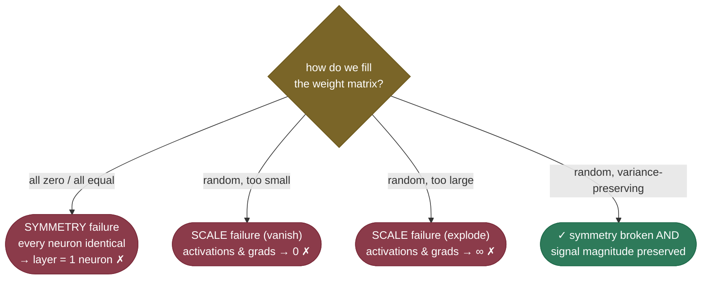
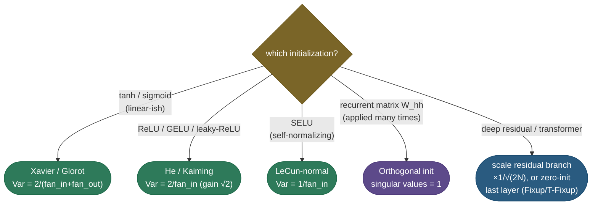

# Weight initialization: the starting point that decides if training works

Before a network takes a single gradient step, you have to fill its weight matrices with *some* numbers — and that seemingly trivial choice can be the difference between a model that trains beautifully and one that never learns at all. It is the most under-appreciated line in a training script: `nn.init.kaiming_normal_(...)` looks like a formality, yet it silently decides whether the signal that enters layer 1 still exists by the time it reaches layer 30, and whether the gradient that leaves the loss still exists by the time it reaches layer 1.

The failure modes are sharp and they come in three flavours. Set the weights **all equal** (including all-zero) and every neuron in a layer computes the same thing forever — the layer collapses to a single neuron. Set them **too small** and the signal shrinks geometrically as it passes through the layers, until activations — and then gradients — vanish to numerical zero. Set them **too large** and the signal blows up to infinity instead. **Xavier/Glorot** and **He/Kaiming** initialization solve all of this with a single, beautiful idea: scale the random initial weights by the layer's width so that the **variance** of the signal stays roughly constant from layer to layer — neither shrinking nor growing. It's a small piece of arithmetic that quietly made deep networks trainable in the first place, and it is still the right default in every framework today.

I'm going to build this the way I'd actually teach it to someone debugging a deep net that "just won't learn." We start by *feeling* the two failures (symmetry, then scale), then **derive** the variance-preservation rule from one line of algebra, then derive Xavier and He as two refinements of that one rule, then walk through the special cases the rule doesn't cover (biases, LSTM forget gates, orthogonal init for RNNs, the residual/transformer scaling tricks, LSUV), and finally prove every claim in measured code. By the end you'll be able to:

- explain the **symmetry** problem and *prove* why you can't initialize weights to zero (or any constant);
- **derive** the variance-preserving rule — why $\text{Var}(W) \approx 1/n$ keeps the signal alive, forward *and* backward;
- **derive** **Xavier/Glorot** ($\tfrac{2}{n_{in}+n_{out}}$, for tanh/linear) and **He/Kaiming** ($\tfrac{2}{n_{in}}$, the extra factor of 2 for ReLU), in normal and uniform forms;
- place **LeCun init**, the **gain** factor, **bias** init, **orthogonal** init, and the **residual/transformer** scaling tricks (Fixup/T-Fixup, the $1/\sqrt{2N}$ trick) in the same framework;
- reason about how **normalization and residual connections** changed how much init matters — and why pretraining is the ultimate init;
- diagnose a "won't-train" net from its per-layer activation-std curve in five minutes.

Intuition and pictures first, then the math (with sources), then runnable code.

> **Note:** initialization, [activation choice](../03-Activation-Functions/03-Activation-Functions.md), [normalization](../11-Normalization/11-Normalization.md), and [residual connections](../18-Residual-Skip-Connections/18-Residual-Skip-Connections.md) all attack the *same* enemy — the [vanishing/exploding signal](../06-Vanishing-Exploding-Gradients/06-Vanishing-Exploding-Gradients.md) that destroys deep networks. Init is the cheapest of the four: it costs **nothing at runtime** and just sets a good *starting* scale so the others have less work to do. The others correct the signal *during* training; init gets it right *before* training even begins.

---

## The problem: two ways naive initialization fails

There are two genuinely distinct failures, and a strong answer names both and keeps them separate, because they have different cures.

1. **The symmetry problem (a *direction* failure).** If you set every weight to the **same** value — and zero is just the most common such value — then every neuron in a layer receives the same inputs *and* the same weights, so they all compute the **identical** activation. During backprop they then all receive the **identical** gradient, so they update identically and *stay* identical forever. The layer has the storage of $H$ neurons but the expressive power of *one*. The cure is **randomness**: you must break the symmetry so the neurons can specialize.

2. **The scale problem (a *magnitude* failure).** Even with perfectly random, symmetry-broken weights, the *magnitude* of the weights matters enormously. Each layer multiplies the signal's variance by a factor that depends on the weight scale and the layer width. If that factor is below 1 the signal **shrinks** geometrically through depth (vanishing); if it is above 1 the signal **explodes**; only when it is exactly 1 does the signal survive arbitrarily deep networks. The cure is **calibration**: pick the variance of the random weights so that per-layer factor is 1.

> **Gotcha:** these two failures are independent, and you need *both* cures. Random-but-badly-scaled weights break symmetry yet still vanish or explode. Perfectly-scaled-but-constant weights have the right magnitude yet never break symmetry. Xavier and He give you the right *magnitude*; the fact that they draw from a random distribution gives you symmetry-breaking for free.



---

## Intuition: the volume knob on a chain of amplifiers

Before the algebra, here's the picture I keep in my head. Think of a deep network as a **chain of identical amplifiers** wired in series — the signal enters the first, its output feeds the second, and so on for 30 stages. Each amplifier has a **gain** set by the weight scale: gain below 1 and it's an *attenuator*; gain above 1 and it *amplifies*.

Now turn the chain on. If every amplifier has gain $0.9$, the signal is multiplied by $0.9$ thirty times — $0.9^{30}\approx0.04$ — and by the end it's a whisper lost in the noise floor (vanishing). If every amplifier has gain $1.1$, it's multiplied by $1.1^{30}\approx17$ — and by the end it's clipping, a screech of feedback (exploding). **Only a gain of exactly 1 lets a signal pass through arbitrarily many stages intact.** Weight initialization is nothing more than *setting the gain of every amplifier to 1* — and "gain 1" turns out to mean "weight variance $\approx 1/\text{fan\_in}$," which is the whole derivation below.

The symmetry problem is a different failure of the same chain: imagine that within each amplifier, every internal component is wired *identically*, so they all do the same thing and the box has the circuitry of many components but the behaviour of one. That's a constant init — lots of neurons, one effective neuron. You fix it by giving each component slightly different (random) parts. So the two requirements — **random** (break symmetry) and **gain 1** (preserve the signal) — are the two things every good initialization must deliver, and Xavier/He deliver both at once.

> **Tip:** this is also the intuition for why the *backward* pass matters equally. The gradient is a second signal travelling the *same* chain in reverse — through the same amplifiers — so it suffers the identical vanish/explode fate. Setting the gain to 1 keeps *both* the forward activation and the backward gradient alive, which is exactly the forward-vs-backward tension Xavier balances.

---

## Deriving the symmetry problem (it really is forever)

People state "don't init to zero" as a rule; let's *prove* it, because the proof is short and it tells you exactly why it's permanent.

Take one hidden layer with weight matrix $W$ (shape $H \times n$) and bias $b$, fed input $x$, with an elementwise activation $\phi$:

$$h_j \;=\; \phi\!\Big(\sum_{i=1}^{n} W_{ji}\,x_i + b_j\Big).$$

Now suppose **every row of $W$ is identical** — call it $w$ — and every bias is the same value $b_0$ (all-zero is the special case $w = 0, b_0 = 0$). Then *every* unit computes the **same** pre-activation $z_j = w^\top x + b_0$, so $h_1 = h_2 = \dots = h_H$. The hidden representation is just **one number, copied $H$ times** — the layer's width is wasted.

The killer is what backprop does next. Let $\delta_j = \partial L / \partial h_j$ be the gradient arriving at unit $j$. Because the units are interchangeable and feed into the next layer through *identical* downstream weights (which are themselves identical by the same argument), every $\delta_j$ is equal — call it $\delta$. The gradient on row $j$ of $W$ is

$$\frac{\partial L}{\partial W_{ji}} \;=\; \delta_j \,\phi'(z_j)\, x_i \;=\; \delta\,\phi'(z)\,x_i,$$

which is **the same for every $j$** — it has no $j$-dependence left. So gradient descent subtracts the *same* update from every row, the rows that started equal **stay equal**, and the symmetry is preserved at every step. No amount of training breaks it; the only escape is to start asymmetric. **Random initialization is therefore not a heuristic — it is mathematically necessary.**

> **Note:** notice the proof never assumed the constant was *zero*. Initializing all weights to $0.3$ is exactly as broken as initializing them to $0$ — both make the rows identical. Zero gets singled out only because it's the tempting "neutral" default and it *also* zeroes the gradient flowing to the previous layer (so the bug is even more total). The general statement is **"don't make the rows identical,"** not "don't use zero."

> **Tip:** this is also *why biases can safely be initialized to a constant* (usually 0). Biases don't create a symmetry problem on their own — the **weights** are what must differ between neurons, and random weights already break the symmetry. A shared bias is fine; shared weights are fatal.

---

## The variance argument: deriving Var(W) = 1/fan_in

Now the scale problem. We want a principled answer to "how big should the random weights be?", and the answer falls out of tracking how **variance** flows through a layer. This is the single most important derivation on the page, so we do every step.

Consider one linear layer with **fan-in** $n$ (each output reads $n$ inputs):

$$y \;=\; \sum_{i=1}^{n} w_i\,x_i.$$

We make the standard initialization-time assumptions — all reasonable at $t=0$ before any training has correlated anything:

- the weights $w_i$ are **iid**, drawn from a symmetric, **zero-mean** distribution, $\mathbb{E}[w_i] = 0$;
- the inputs $x_i$ are iid, **zero-mean**, $\mathbb{E}[x_i] = 0$;
- weights and inputs are **independent** of each other.

Because $y$ is a sum of the products $w_i x_i$, and the terms are independent with zero mean, the variance of the sum is the sum of the variances:

$$\text{Var}(y) \;=\; \sum_{i=1}^{n} \text{Var}(w_i x_i).$$

For two independent zero-mean variables, $\text{Var}(w_i x_i) = \mathbb{E}[w_i^2 x_i^2] - (\mathbb{E}[w_i x_i])^2 = \mathbb{E}[w_i^2]\,\mathbb{E}[x_i^2] - 0 = \text{Var}(w_i)\,\text{Var}(x_i)$. Substituting, and writing $\text{Var}(w)$, $\text{Var}(x)$ for the common (iid) variances:

$$\boxed{\;\text{Var}(y) \;=\; n \cdot \text{Var}(w) \cdot \text{Var}(x)\;}$$

This is the whole game. **Each layer multiplies the signal's variance by the factor $n \cdot \text{Var}(w)$.** Stack $L$ layers and the variance is multiplied by that factor $L$ times — an exponential in depth. To keep the variance **constant** across depth (neither vanishing nor exploding) we need that factor to be exactly **1**:

$$n \cdot \text{Var}(w) = 1 \quad\Longrightarrow\quad \boxed{\;\text{Var}(w) = \dfrac{1}{n} = \dfrac{1}{\text{fan\_in}}\;}$$

That is the variance-preservation principle in one line: **scale the random weights so their variance is $1/\text{fan\_in}$**, and a unit-variance input stays unit-variance no matter how deep the network gets. Everything else on this page is a refinement of this single result for a specific activation or a specific architecture.


> **Note:** the factor compounds *geometrically*, which is why even a tiny miscalibration is catastrophic at depth. If each layer multiplies variance by $0.5$, then after 30 layers the signal is scaled by $0.5^{30} \approx 10^{-9}$ — gone. If by $2$, then $2^{30} \approx 10^{9}$ — overflow. The window of "acceptable" is razor-thin, and only $n\cdot\text{Var}(w)=1$ sits dead-centre in it for every depth.

> **Note (why std scales like $1/\sqrt{n}$, not $1/n$):** a frequent confusion. The *variance* is $1/n$, but the **standard deviation** — the actual scale of the numbers you sample — is $\sqrt{1/n} = 1/\sqrt{n}$. So a layer with fan-in 256 wants weight std $\approx 1/16 \approx 0.06$, and a layer with fan-in 1024 wants std $\approx 1/32 \approx 0.03$. **Wider layers get smaller weights** — which makes intuitive sense: more inputs summing together would individually need to be smaller to keep the sum's magnitude fixed. The $\sqrt{\cdot}$ is the bridge between "we reasoned about variance" and "we sample from a std."

### The backward pass wants 1/fan_out

There's a symmetric story on the **backward** pass that the forward derivation alone misses. During backprop the gradient flows the other direction through $W^\top$, so by the identical argument the gradient's variance is multiplied by $n_{out} \cdot \text{Var}(w)$ at each layer — where $n_{out}$ (**fan-out**) is the number of outputs the layer feeds. Preserving *gradient* variance therefore wants

$$\text{Var}(w) = \frac{1}{n_{out}} = \frac{1}{\text{fan\_out}}.$$

So the forward pass wants $1/\text{fan\_in}$ and the backward pass wants $1/\text{fan\_out}$. Unless the layer is square ($n_{in} = n_{out}$) you cannot satisfy both exactly — and that tension is *exactly* what Xavier resolves.


The figure isn't just qualitative — backprop the gradient through the same 30 layers and *measure* its std at the input side:

| Init | **gradient std at the input after 30 layers** |
|---|---|
| naive small (×0.02) | $1.7\times10^{-15}$ (vanished) |
| naive large (×0.20) | $1.5\times10^{15}$ (exploded) |
| Xavier ($1/\sqrt n$) | $2.7\times10^{-5}$ (slowly decaying) |
| He ($\sqrt{2/n}$) | $\mathbf{1.0}$ (preserved) |

Compare these to the *activation* std table in Example 4: they are nearly identical, which is exactly the mirror-image claim — the same scale that preserves forward activations also preserves backward gradients, and the same miscalibration that vanishes one vanishes the other.

> **Note:** the gradient figure is the forward figure's mirror image, and that symmetry is the whole point. A vanished *activation* and a vanished *gradient* are two faces of the same scale failure. This is why init is so tightly bound to the [vanishing/exploding-gradients](../06-Vanishing-Exploding-Gradients/06-Vanishing-Exploding-Gradients.md) problem — bad init is one of its primary *causes*, and good init is one of its cheapest *cures*.

---

## Xavier / Glorot: a compromise between fan-in and fan-out

Glorot & Bengio (2010) faced the forward-vs-backward tension above and made the natural compromise: instead of choosing $1/\text{fan\_in}$ or $1/\text{fan\_out}$, **average the two constraints**. Setting $n\cdot\text{Var}(w)=1$ on the forward pass and $n_{out}\cdot\text{Var}(w)=1$ on the backward pass and splitting the difference gives

$$\boxed{\;\text{Var}(w) \;=\; \dfrac{2}{n_{in} + n_{out}}\;}$$

The "2" here is just because the average of $\tfrac{1}{n_{in}}$ and $\tfrac{1}{n_{out}}$, cleared of fractions, is $\tfrac{2}{n_{in}+n_{out}}$ — it is **not** the ReLU factor of 2 (that one is coming, and it's a different 2; keeping them straight is a classic interview trap). Xavier targets activations that are roughly **linear near zero and symmetric** — `tanh`, and to a lesser extent `sigmoid` — for which the variance bookkeeping above holds with no extra correction, because near the origin $\tanh(z)\approx z$ so the activation barely changes the variance.

Xavier comes in two equivalent forms; both have variance $\tfrac{2}{n_{in}+n_{out}}$:

- **Normal:** $w \sim \mathcal{N}\!\big(0,\; \tfrac{2}{n_{in}+n_{out}}\big)$, i.e. std $= \sqrt{\tfrac{2}{n_{in}+n_{out}}}$.
- **Uniform:** $w \sim \mathcal{U}[-a, a]$ with $a = \sqrt{\dfrac{6}{n_{in}+n_{out}}}$.

> **Note (deriving the uniform bound):** a uniform distribution $\mathcal{U}[-a,a]$ has variance $\tfrac{a^2}{3}$ (standard result). Set that equal to the target variance $\tfrac{2}{n_{in}+n_{out}}$: $\;\tfrac{a^2}{3} = \tfrac{2}{n_{in}+n_{out}} \Rightarrow a^2 = \tfrac{6}{n_{in}+n_{out}} \Rightarrow a = \sqrt{\tfrac{6}{n_{in}+n_{out}}}$. That is where the "6" in the famous $\pm\sqrt{6/(n_{in}+n_{out})}$ comes from — it's just $3\times2$, the factor-of-3 from the uniform's variance times the factor-of-2 from the fan-in/fan-out average.

---

## He / Kaiming: the extra factor of 2 for ReLU

Xavier assumes a roughly linear, symmetric activation. **ReLU breaks that assumption** by zeroing every negative input — and that single fact is what He et al. (2015) had to correct for.

Here is the derivation. Suppose the pre-activation $z$ is symmetric around zero (true at init, since $w$ and $x$ are zero-mean and symmetric). ReLU outputs $\max(0,z)$, so it keeps the positive half and sets the negative half to zero. For a symmetric zero-mean $z$:

$$\mathbb{E}\big[\text{ReLU}(z)^2\big] \;=\; \mathbb{E}\big[z^2 \cdot \mathbb{1}[z>0]\big] \;=\; \tfrac{1}{2}\,\mathbb{E}[z^2] \;=\; \tfrac{1}{2}\,\text{Var}(z),$$

because by symmetry exactly **half** the probability mass has $z>0$, and on that half $z^2$ has the same average as on the whole line. So passing through a ReLU **halves the variance**: $\text{Var}(\text{ReLU}(z)) \approx \tfrac12 \text{Var}(z)$ (treating the small mean-shift as negligible). To compensate, He init doubles the weight variance so that after the halving the signal is preserved:

$$n \cdot \text{Var}(w) \cdot \tfrac{1}{2} = 1 \quad\Longrightarrow\quad \boxed{\;\text{Var}(w) = \dfrac{2}{n_{in}}\;}$$

That is the entire reason He init has a 2 in the numerator and Xavier (for tanh) does not: **the 2 exactly cancels ReLU's halving.** Use Xavier on a ReLU net and you're missing that factor of 2 — the signal decays by $\tfrac{1}{\sqrt2}$ per layer, slowly but inexorably, which is precisely the gentle Xavier-on-ReLU droop you see in the depth figure.

He, too, has normal and uniform forms (here the relevant fan is **fan-in**, since He optimizes the forward pass for ReLU):

- **Normal:** $w \sim \mathcal{N}\!\big(0,\ \tfrac{2}{n_{in}}\big)$, i.e. std $= \sqrt{2/n_{in}}$.
- **Uniform:** $w \sim \mathcal{U}[-a, a]$ with $a = \sqrt{6/n_{in}}$ (same uniform-variance algebra as above).

The collapse and the cure are both visible directly in the activations of a deep layer:


> *Where these come from: the variance-preserving derivation and Xavier init are **Understanding the difficulty of training deep feedforward networks** (Glorot & Bengio 2010); the ReLU factor-of-2 correction is **Delving Deep into Rectifiers** (He et al. 2015); the original fan-in scaling and the practical advice to normalize inputs are **Efficient BackProp** (LeCun et al. 1998); the symmetry argument is **Deep Learning** (Goodfellow et al.) §8.4. All in the references.*

> **Gotcha (the hidden assumption):** the clean variance algebra assumed inputs are **zero-mean** — but ReLU outputs are **non-negative**, so the input to the *next* layer has a positive mean, and our $\mathbb{E}[x]=0$ assumption is technically violated downstream. He et al. handle this carefully in the paper; the upshot is that the leading-order factor-of-2 correction is what dominates, and the small mean-shift is a second-order effect that the network's biases absorb during training. (Sigmoid is worse on this front: it's *not even centred at zero*, outputting in $(0,1)$ with mean $\approx0.5$, which is one more reason `tanh` — centred at 0 — is preferred over `sigmoid` for hidden layers, and why both are now largely displaced by ReLU/GELU.) The practical takeaway: the formulas are derived under idealized assumptions but are robust enough in practice that they're the universal default — just don't be surprised that real activation means drift slightly from zero.

---

## The saturation failure: too-large init kills the gradient *another* way

The depth figures show too-large init making activations *explode*, but for **bounded** activations (tanh, sigmoid) there's a sneakier, equally fatal failure: **saturation**. tanh squashes its input into $(-1, 1)$; feed it a large pre-activation and the output pins to $\pm1$, where the curve is flat. And a flat curve means a **near-zero derivative**: $\tanh'(z) = 1 - \tanh^2(z) \to 0$ as $|z|\to\infty$. So a saturated unit passes essentially **zero gradient** backward — the chain-rule product gets multiplied by $\approx 0$, and learning stalls for every layer below it.

This is what the *left* panel of the activation-histogram figure shows: too-large tanh init pins all the mass at $\pm1$, and from there the gradient cannot flow. It's the bounded-activation analogue of the dead-ReLU problem — different mechanism (saturation vs. zero-output), identical symptom (a unit that's stuck and can't learn). The cure is the same: calibrate the init so pre-activations land in the **near-linear region** around zero, where $\tanh'(0)=1$ and the gradient flows freely. Xavier's whole job, for tanh, is to keep pre-activations in that sweet spot.

> **Note:** this is the deeper reason init and [activation choice](../03-Activation-Functions/03-Activation-Functions.md) are inseparable. The "right" init is the one that keeps the *next* activation in its well-behaved region: linear-ish near 0 for tanh (Xavier), and not-too-negative for ReLU (He, plus non-negative bias). Get the init wrong and even a perfect activation function saturates or dies.

---

## LeCun init and the gain factor

He and Xavier are the two you'll name in an interview, but the same machinery covers a couple more cases worth knowing.

**LeCun init** ($\text{Var}(w) = 1/n_{in}$) is the *bare* variance-preservation rule with no activation correction — exactly the $1/\text{fan\_in}$ we derived. It is the right choice for activations that are already variance-preserving by construction, most notably **SELU** (the self-normalizing activation), whose whole design assumes LeCun-normal init so that activations converge to zero-mean unit-variance on their own. It predates both Xavier and He (LeCun et al. 1998).

**The gain.** Frameworks generalize all of these through a single **gain** factor $g$, with the rule

$$\text{std}(w) \;=\; g \cdot \sqrt{\frac{1}{\text{fan}}},$$

where $g$ depends on the activation: $g=1$ for linear/identity and tanh-via-Xavier, $g=\sqrt{2}$ for ReLU (recovering He — there's your factor of 2 again, now as $\sqrt2$ on the *std*), and tabulated values for leaky-ReLU ($\sqrt{2/(1+\alpha^2)}$), SELU, etc. This is exactly what `torch.nn.init.calculate_gain("relu")` returns ($\sqrt2 \approx 1.414$). Conceptually there is **one** rule — preserve variance — and the gain is the knob that adapts it to whatever non-linearity you put after the layer.

> **Tip:** the rule of thumb is short — **ReLU/GELU/leaky-ReLU → He (gain $\sqrt2$); tanh/sigmoid → Xavier (gain 1); SELU → LeCun-normal**. Frameworks default sensibly (PyTorch's `nn.Linear` uses a Kaiming-uniform scheme by default), so you rarely set it by hand — but you *do* get asked to explain why, and to recognize "my deep net won't train" as possibly an init problem. GELU and SiLU are close enough to ReLU that He is the standard choice for transformer MLPs.

> **Gotcha:** "fan-in vs fan-out" mode is a real knob (`mode="fan_in"` vs `"fan_out"` in PyTorch). Fan-in preserves the **forward** activation variance; fan-out preserves the **backward** gradient variance. For a plain feed-forward net the difference is usually minor, but for convolutions the fan is `channels × kernel_height × kernel_width`, and the choice can matter — fan-out is the common default for conv layers in some vision codebases. When in doubt, fan-in (the forward pass) is the safe default.

---

## Bias initialization (and the LSTM forget-gate exception)

Biases are simpler than weights — they don't create a symmetry problem, because the random weights already break it — so the default is just **zero**. A few principled exceptions are worth memorizing because interviewers love them:

- **The LSTM forget gate → init bias to 1 (or 2).** An LSTM's forget gate $f_t = \sigma(\dots + b_f)$ controls how much of the previous cell state to keep. With $b_f = 0$ the gate starts at $\sigma(0)=0.5$, so the cell **forgets half its memory every step** — gradients through the cell state decay fast and long-range dependencies never get a chance to form. Initializing $b_f$ to **1** (so the gate starts near $\sigma(1)\approx0.73$, biased toward *remembering*) is a well-known trick (Jozefowicz et al. 2015) that materially improves long-sequence learning. It's the canonical example of init encoding a useful *prior*.
- **ReLU layers → sometimes a small positive bias** (e.g. $0.01$) to nudge units to start *active*, reducing dead-ReLU risk early in training. In practice this is a minor effect and zero bias is the common default; the figure below shows why the *negative*-bias direction is the dangerous one.
- **The final classification layer.** For a heavily imbalanced binary problem, setting the output bias so the initial prediction matches the base rate (e.g. $b = \log(\pi/(1-\pi))$ for positive-class prior $\pi$) gives a much saner starting loss and avoids the network spending its first epochs just learning the prior.


> **Gotcha:** a large *negative* bias is the classic real-world cause of **dead ReLUs** — a unit whose pre-activation is negative for *every* input outputs 0 always, so its gradient is 0 always, so it can never recover. The left panel above shows how fast this spreads with depth. This is also why a too-high learning rate can *create* dead units mid-training: one big update can push a unit's bias permanently negative.

---

## Orthogonal init: for RNNs and very deep linear stacks

The variance argument keeps the *scalar* variance constant, but for a matrix applied **many times** — the recurrent weight $W_{hh}$ in an RNN, applied once per timestep — controlling variance isn't enough; you want the matrix to **not stretch or shrink any direction** of the hidden state. The tool for that is **orthogonal initialization** (Saxe et al. 2013): initialize $W$ to a random orthogonal matrix (e.g. via the QR or SVD decomposition of a random Gaussian matrix), so that $W^\top W = I$.

Why it helps: an orthogonal matrix has **all singular values equal to 1**, so $\|Wx\| = \|x\|$ for every $x$ — it's a pure rotation/reflection that preserves norms *exactly*, in every direction, not just on average. Apply it $T$ times (an RNN over a length-$T$ sequence) and the hidden-state norm is still preserved, instead of decaying like $\sigma_{\max}^T$ or exploding. Saxe et al. further showed that orthogonal init lets even **very deep linear networks** train with depth-independent learning dynamics — the cleanest theoretical demonstration that init controls trainability.

> **Tip:** for RNN/LSTM/GRU recurrent matrices, **orthogonal init of $W_{hh}$ is the standard choice**, often combined with the forget-gate-bias-1 trick. The input-to-hidden weights $W_{xh}$ can use ordinary Xavier/He. PyTorch exposes this as `nn.init.orthogonal_`.

---

## Init for residual networks and transformers

Modern deep nets are not plain feed-forward stacks; they are **residual** networks ($x_{\ell+1} = x_\ell + F(x_\ell)$) tens to hundreds of blocks deep, and there the variance story shifts in an important way. At a residual block the output variance is roughly $\text{Var}(x_\ell) + \text{Var}(F(x_\ell))$ — the residual branch *adds* variance on top of the skip path, so after $N$ blocks the variance has grown by a factor of $\sim N$ even if each block is individually well-initialized. Stack enough blocks and the activations at the top are $\sqrt{N}\times$ larger than at the bottom, which destabilizes early training.

The fix is to **scale down the residual branch** so it doesn't accumulate:

- **The $1/\sqrt{2N}$ trick (GPT-2 style).** Scale the weights of the **last** projection in each residual block by $1/\sqrt{2N}$ (for $N$ residual layers), so the per-block variance contribution shrinks and the total stays $O(1)$ across depth. GPT-2 used exactly this ("we scale the weights of residual layers at initialization by $1/\sqrt{N}$"), and it's standard in large transformers. Intuition: if each of $N$ branches contributes variance $\propto 1/N$, the sum is $O(1)$ regardless of depth.
- **Zero-init the last layer of each block (Fixup / ReZero / SkipInit).** Take it to the limit: initialize the **last** layer of each residual branch to **zero**, so at the start every block is an exact **identity** ($x_{\ell+1} = x_\ell + 0 = x_\ell$). The network begins as a shallow identity map and *gradually* learns to use its depth as the zero-initialized layers move away from zero. **Fixup** (Zhang et al. 2019) showed this lets you train very deep residual nets to full accuracy **without any normalization layers** — a striking demonstration that careful init can *replace* BatchNorm. **T-Fixup** (Huang et al. 2020) is the transformer-specific version that, with the right init scaling, trains transformers stably **without LayerNorm warmup**.

> **Note:** the through-line of Fixup/T-Fixup/ReZero is "**start as identity, then earn your depth.**" Zero-initializing the residual branch makes a 100-layer network behave like a 0-layer network at step 0 — perfectly conditioned — and lets gradient descent *opt in* to depth as it helps. It's the most elegant statement of why deep nets are easier to train when they *begin* shallow.



> **See it interactively:** DeepLearning.AI's [Initializing neural networks](https://www.deeplearning.ai/ai-notes/initialization/index.html) lets you slide the init scale and watch activations collapse to zero (too small) or saturate (too large), with the just-right scale in between — the live, draggable version of the depth figure above.

---

## LSUV: just measure and fix it

Every scheme so far is *analytic* — it predicts the right scale from fan-in and an activation assumption. **LSUV** (Layer-Sequential Unit-Variance, Mishkin & Matas 2015) is the **empirical** alternative: stop predicting, just *measure*. The recipe:

1. Initialize each layer with **orthogonal** weights (a good starting point).
2. Push a single minibatch through the network, **one layer at a time**.
3. At each layer, measure the output variance and **rescale that layer's weights** by $1/\sqrt{\text{measured variance}}$ so its output has unit variance on this batch.
4. Move to the next layer and repeat.

The result is a network where *every* layer empirically outputs unit-variance activations on real data — no assumption about the activation function needed, because you measured the actual effect of whatever non-linearity is there. LSUV is the bridge between "compute the right scale" (He/Xavier) and "let normalization fix it at runtime" (BatchNorm): a **one-time, data-driven** calibration that gets the analytic schemes' benefit even for exotic architectures where the closed-form fan-in rule doesn't quite apply.

> **Tip:** LSUV is a great mental model for what *all* good init is trying to achieve — **unit-variance activations at every layer** — and a practical fallback when you've built something custom and the standard formulas don't obviously apply. It's a handful of lines: init orthogonal, then loop layers rescaling by measured std.

---

## How normalization, residuals, and pretraining changed the story

Init used to be strictly make-or-break; today it matters a bit less, because three other techniques *also* keep the signal healthy — but "less" is not "not at all."

- **Normalization (BatchNorm/LayerNorm)** re-standardizes activations *during* the forward pass, so even imperfect init gets corrected layer by layer. This is the biggest reason you can often get away with the framework default. But normalization **reduces** init sensitivity, it does not **eliminate** it: BatchNorm itself can be unstable with terrible init, very deep nets without normalization still need careful init (that's the whole Fixup result), and the *gradient* path through a normalization layer still depends on the incoming scale.
- **Residual connections** give the signal (and gradient) an identity path that doesn't depend on the weight scale — which is exactly why the residual-branch-scaling tricks above are about *not letting the branch ruin* that clean identity path.
- **Pretraining is the ultimate init.** When you fine-tune a pretrained model, you're starting from weights that already encode enormous structure — a far better "initialization" than any random scheme. The variance-preservation question is essentially *solved* for you by the pretraining run. This is why transfer learning is so robust, and why the only place you still hand-pick init in a fine-tuning workflow is the **new** head you bolt on (which does need sensible random init — e.g. small-scale, or zero for a LoRA $B$ matrix so the adapter starts as a no-op).

> **Note:** the historical arc is worth holding onto. Pre-2010, deep nets were considered hard to train, and **layerwise pretraining** (greedy unsupervised pretraining of each layer) was the workaround. Glorot/He init plus better activations made that unnecessary for *initialization* purposes — you could train deep nets from random init directly. Then BatchNorm/residuals made depth routine. Today, init is a quiet, well-solved default for most workloads — and a critical, hand-tuned concern at the frontier (very deep, normalization-free, or billion-parameter scale).

### Init and the learning-rate / warmup connection

There's a tidy connection that interviewers like to probe: **bad init and learning-rate warmup are addressing overlapping problems.** Early in training, before the network has settled, the activation and gradient statistics are at their most fragile — and a too-large init makes the very first gradients huge, so the first few optimizer steps can blow the weights into a bad region (or, with ReLU, push units permanently dead). **Warmup** — starting with a tiny learning rate and ramping up over a few hundred steps — is partly a hedge against exactly this early instability.

The Fixup/T-Fixup result sharpens the point: with the *right* init (zero-init residual branches, careful scaling), transformers can train **without the usual LayerNorm-warmup crutch** — because the init already made the early-training dynamics well-conditioned. So when you see a recipe with a long warmup, part of what it's compensating for is initialization that doesn't perfectly preserve variance at depth. Better init → shorter (or no) warmup; this is one of the cleaner illustrations that init, normalization, and the optimizer schedule are all attacking the same early-training-stability problem from different angles.

> **Tip:** if a deep model needs a *suspiciously* long warmup to avoid diverging, treat it as a hint that the init (especially residual-branch scaling) is leaving the early dynamics fragile. Tightening the init often lets you shorten warmup and start learning sooner.

---

## Worked examples (increasing in complexity)

Numbers make all of this concrete. Four examples, each a notch harder than the last.

### Example 1 — symmetry-breaking by hand (a 2-neuron layer)

Take a layer of **2 ReLU units** reading a 2-dim input $x = (1, 2)$, with **all weights equal to 0.3** and zero bias:

$$z_1 = 0.3(1) + 0.3(2) = 0.9, \qquad z_2 = 0.3(1) + 0.3(2) = 0.9.$$

Both units fire identically: $h_1 = h_2 = \text{ReLU}(0.9) = 0.9$. Now backprop a loss with $\partial L/\partial h_1 = \partial L/\partial h_2 = \delta$. The gradient on unit 1's weights is $\delta\cdot\phi'(z_1)\cdot x = \delta\cdot 1\cdot(1,2)$, and on unit 2's weights it is $\delta\cdot 1\cdot(1,2)$ — **identical**. After the update both rows are still equal, so $h_1 = h_2$ forever. The layer has two neurons but one degree of freedom. (The code below confirms this exactly with `torch.allclose`.)

### Example 2 — the variance law Var(y) = fan_in·Var(w)·Var(x) by hand

Take **fan-in $n = 256$**, weights with $\text{Var}(w) = 0.05$, inputs with $\text{Var}(x) = 1$. The formula predicts:

$$\text{Var}(y) = n \cdot \text{Var}(w) \cdot \text{Var}(x) = 256 \times 0.05 \times 1 = 12.8.$$

So a single linear layer with these settings amplifies variance by **12.8×** — far from the 1.0 we want. To *preserve* variance we'd need $\text{Var}(w) = 1/256 = 0.0039$ (std $\approx 0.0625$), i.e. LeCun init. The code measures Var(y) over 200,000 random draws and gets **12.795** — confirming the law to three figures.

### Example 3 — He vs Xavier through one ReLU layer

A hidden layer with **fan-in $n = 256$**, ReLU, fed unit-variance activations.

- **Naive** (standard-normal weights, $\text{Var}(w)=1$): pre-activation variance $\approx 256\times1\times1 = 256$ — already 256× too big; after a few layers it overflows.
- **Xavier** ($\text{Var}(w) = \tfrac{2}{256+256} = 0.0039$): pre-activation variance $\approx 256 \times 0.0039 = 1.0$, but then ReLU **halves** it to $\approx 0.5$. Each layer shrinks the signal by $\sqrt{0.5}\approx0.71$ — the slow Xavier-on-ReLU decay.
- **He** ($\text{Var}(w) = \tfrac{2}{256} = 0.0078$, std $\approx 0.088$): pre-activation variance $\approx 256\times0.0078 = 2.0$; ReLU halves it back to $\approx 1.0$. **Preserved** — exactly the goal. The code confirms `kaiming_normal_` produces std $= 0.0884 = \sqrt{2/256}$.

### Example 4 — measured signal flow through a 30-layer deep net

The acid test: forward unit-variance activations through **30 ReLU layers** and measure the final activation std under four inits (this is the depth figure, in numbers):

| Init | per-layer factor | predicted trend | **measured std after 30 layers** |
|---|---|---|---|
| naive small (×0.02) | $256\times0.02^2 \approx 0.1$ | collapse | $\mathbf{1.4\times10^{-15}}$ |
| naive large (×0.20) | $256\times0.20^2 \approx 10$ | explode | $\mathbf{1.1\times10^{15}}$ |
| Xavier ($1/\sqrt n$) | $\approx 0.5$ (missing ×2) | slow decay | $\mathbf{2.4\times10^{-5}}$ |
| He ($\sqrt{2/n}$) | $\approx 1.0$ | preserved | $\mathbf{1.1}$ |

He keeps the signal at std $\approx 1$ across **all 30 layers**; naive-small annihilates it to $10^{-15}$ and naive-large overflows to $10^{15}$ — a forty-order-of-magnitude spread caused by *nothing but the initialization scale*. Xavier on ReLU lands at $10^{-5}$: alive at the start, but the missing factor of 2 has compounded into a real problem by layer 30. This is the entire argument for He init, measured end-to-end.

### Example 5 — does it actually change training? (measured loss curves)

The figures so far are about *signal statistics*; the bottom line is whether the network **learns**. Train the same 8-layer ReLU net (the right panel of the dead-ReLU figure) on a small regression task with three inits and watch the training MSE:

| Init | loss @ epoch 0 | loss @ epoch 10 | **loss @ epoch 59** |
|---|---|---|---|
| naive small (std 0.01) | 0.79 | 0.79 | **0.39** (barely moved) |
| Xavier | 0.79 | 0.20 | **0.011** |
| He / Kaiming | 0.92 | 0.53 | **0.020** |

The naive-small net is **stuck**: after 10 epochs its loss hasn't budged from its starting value (the signal is too weak for useful gradients to flow), and even after 60 epochs it's an order of magnitude worse than the others — it eventually crawls because Adam adapts, but it's wasting most of the run. Xavier and He both train cleanly to near-zero loss. **Same architecture, same data, same optimizer — the only difference is the initialization, and it's the difference between learning and not.** That is the whole reason this "trivial" line of code matters.

---

## Code: prove every claim

Everything above — symmetry, the variance law, depth flow, and that He matches `torch.nn.init` — in one runnable script. Runs on CPU in a second; no GPU needed.

```python
"""Weight init, end to end: symmetry-breaking, the variance law, depth signal
flow, and He vs torch. Verified on Python 3.12 (torch 2.12), CPU."""
import torch, numpy as np
torch.manual_seed(0); rng = np.random.default_rng(0)

# [1] SYMMETRY: constant weights -> identical neurons AND identical gradients, forever
x = torch.randn(1, 4)
W1 = torch.full((4, 5), 0.3, requires_grad=True)          # ALL weights equal
h = torch.relu(x @ W1); h.sum().backward()
print("[1] constant init")
print("    hidden units all equal? ", torch.allclose(h, h[0, 0]))
print("    all weight-grads equal? ", torch.allclose(W1.grad, W1.grad[0, 0]))

# [2] VARIANCE LAW: Var(y) = fan_in * Var(w) * Var(x), measured vs predicted
fan_in, Vw, Vx, N = 256, 0.05, 1.0, 200_000
W = rng.normal(0, np.sqrt(Vw), size=(N, fan_in))
X = rng.normal(0, np.sqrt(Vx), size=(N, fan_in))
y = (W * X).sum(axis=1)                                    # y = sum_i w_i x_i
print(f"\n[2] Var(y) = fan_in*Var(w)*Var(x)")
print(f"    predicted = {fan_in*Vw*Vx:.3f}   measured = {y.var():.3f}")

# [3] DEPTH: activation std after 30 ReLU layers (input std = 1)
def final_std(scale_fn, L=30, W=512):
    a = rng.standard_normal((W, 512))
    for _ in range(L):
        a = np.maximum(0, (rng.standard_normal((W, W)) * scale_fn(W)) @ a)
    return a.std()
print("\n[3] activation std after 30 ReLU layers:")
for name, fn in [("naive small x0.02", lambda n: 0.02), ("naive large x0.20", lambda n: 0.20),
                 ("Xavier 1/sqrt(n)", lambda n: 1/np.sqrt(n)), ("He sqrt(2/n)", lambda n: np.sqrt(2/n))]:
    print(f"    {name:<20} -> std = {final_std(fn):.2e}")

# [4] He matches torch.nn.init exactly; the ReLU gain is sqrt(2)
lin = torch.nn.Linear(256, 512, bias=False)
torch.nn.init.kaiming_normal_(lin.weight, nonlinearity="relu")
print(f"\n[4] torch kaiming_normal_ std = {lin.weight.std().item():.4f}  "
      f"vs sqrt(2/fan_in) = {np.sqrt(2/256):.4f}")
print(f"    calculate_gain('relu') = {torch.nn.init.calculate_gain('relu'):.4f}  (= sqrt(2))")
```

Output (reproducible with the seeds above):

```
[1] constant init
    hidden units all equal?  True
    all weight-grads equal?  True

[2] Var(y) = fan_in*Var(w)*Var(x)
    predicted = 12.800   measured = 12.795

[3] activation std after 30 ReLU layers:
    naive small x0.02    -> std = 1.43e-15
    naive large x0.20    -> std = 1.12e+15
    Xavier 1/sqrt(n)     -> std = 2.44e-05
    He sqrt(2/n)         -> std = 1.11e+00

[4] torch kaiming_normal_ std = 0.0884  vs sqrt(2/fan_in) = 0.0884
    calculate_gain('relu') = 1.4142  (= sqrt(2))
```

Every claim on the page, confirmed: **[1]** constant init gives identical activations *and* identical gradients (symmetry never breaks); **[2]** the variance law is exact (12.795 ≈ 12.8); **[3]** only He keeps std ≈ 1 across 30 layers while the others collapse, explode, or slowly decay; **[4]** He init *is* $\sqrt{2/\text{fan\_in}}$ and the ReLU gain *is* $\sqrt2$ — the framework computes exactly the formula we derived.

> **Tip:** the per-layer activation-std loop in **[3]** is the single most useful diagnostic in this whole topic. Drop it into any from-scratch deep net: log each layer's activation std during the first forward pass. **Shrinking toward deeper layers → init too small** (or you're using Xavier on ReLU — switch to He). **Growing → too large.** It's a five-minute check that catches a surprising fraction of "my network won't train" bugs before you waste a GPU-day on them.

---

## Code: the special cases (orthogonal, conv fan-in, zero-init residual)

The basics are above; this second script confirms the three *special* cases — orthogonal init, convolution fan-in, and the Fixup-style zero-init residual — that the analytic formula doesn't cover directly.

```python
"""The special cases, measured. Verified on Python 3.12 (torch 2.12), CPU."""
import torch, numpy as np
torch.manual_seed(0)

# [A] ORTHOGONAL init preserves the hidden-state norm under MANY applications
#     (the RNN regime), where a variance-preserving Gaussian drifts.
W_orth = torch.empty(128, 128); torch.nn.init.orthogonal_(W_orth)
W_gauss = torch.randn(128, 128) * (1 / np.sqrt(128))     # variance-preserving Gaussian
x = torch.randn(128)
def norm_after(W, T):
    h = x.clone()
    for _ in range(T): h = W @ h
    return h.norm().item()
print("[A] orthogonal: singular values all 1?",
      np.allclose(torch.linalg.svdvals(W_orth).numpy(), 1.0, atol=1e-5))
print(f"    norm after 100 applications: input={x.norm():.1f}  "
      f"orthogonal={norm_after(W_orth,100):.1f}  gaussian={norm_after(W_gauss,100):.0f}")

# [B] CONVOLUTION fan-in is in_channels * kH * kW (not just in_channels)
conv = torch.nn.Conv2d(64, 128, kernel_size=3, bias=False)
torch.nn.init.kaiming_normal_(conv.weight, mode="fan_in", nonlinearity="relu")
fan_in = 64 * 3 * 3
print(f"\n[B] conv fan_in = in_ch*kH*kW = 64*3*3 = {fan_in}")
print(f"    kaiming std = {conv.weight.std():.4f}  vs sqrt(2/{fan_in}) = {np.sqrt(2/fan_in):.4f}")

# [C] ZERO-INIT the last layer -> the residual block is an EXACT identity at init (Fixup)
class Block(torch.nn.Module):
    def __init__(self):
        super().__init__()
        self.f1 = torch.nn.Linear(32, 32); self.f2 = torch.nn.Linear(32, 32)
        torch.nn.init.kaiming_normal_(self.f1.weight, nonlinearity="relu")
        torch.nn.init.zeros_(self.f2.weight); torch.nn.init.zeros_(self.f2.bias)
    def forward(self, x): return x + self.f2(torch.relu(self.f1(x)))
z = torch.randn(4, 32)
print(f"\n[C] zero-init residual block is identity at init? {torch.allclose(Block()(z), z)}")
```

Output:

```
[A] orthogonal: singular values all 1? True
    norm after 100 applications: input=12.4  orthogonal=12.4  gaussian=1909

[B] conv fan_in = in_ch*kH*kW = 64*3*3 = 576
    kaiming std = 0.0590  vs sqrt(2/576) = 0.0589

[C] zero-init residual block is identity at init? True
```

Three lessons, measured: **[A]** orthogonal init keeps the hidden-state norm *exactly* (12.4 → 12.4 after 100 applications) while a per-step-variance-preserving Gaussian still drifts to 1909 — preserving *scalar variance* is not the same as preserving *every direction's norm*, which is why RNNs want orthogonal. **[B]** for a conv layer the fan-in is `in_channels × kernel_height × kernel_width` (here $64\times3\times3 = 576$), and He scales by $\sqrt{2/576}$ accordingly — forget the kernel area and you'll under-scale. **[C]** zero-initializing the *last* layer of a residual branch makes the whole block an **exact identity** at step 0 — the Fixup/ReZero trick, confirmed bit-for-bit.

> **Gotcha:** a frequent bug in from-scratch conv code is initializing as if fan-in were just `in_channels`, ignoring the $k\times k$ kernel. For a $3\times3$ kernel that's a 9× error in the fan and a 3× error in the std — enough to push a deep conv net out of the healthy band. Let the framework compute the fan (it knows the kernel shape); only override `mode` and `nonlinearity`.

---

## Common mistakes (the ones that actually bite)

A short field guide to the init bugs that show up in real "my model won't train" tickets:

- **Xavier on a ReLU net.** The single most common mismatch. It trains, just *worse* — the missing factor of 2 slowly starves the signal with depth (the $10^{-5}$ Xavier line in Example 4). Switch ReLU/GELU layers to He.
- **Forgetting the conv kernel in fan-in** (above) — under-scales conv weights.
- **All-zero init "to be safe."** Symmetry trap; the network never breaks out of computing one value per layer. Zero is fine for *biases*, fatal for *weights*.
- **A large negative bias** (or a learning rate high enough to create one) → dead ReLUs that never recover (the dead-ReLU figure).
- **Re-initializing a pretrained backbone.** Calling `model.apply(init_fn)` after loading a checkpoint silently wipes the pretrained weights — the best init you had — and resets you to random. Only init the *new* layers.
- **Ignoring the residual-branch accumulation at depth.** A 48-block transformer without residual-branch scaling ($1/\sqrt{2N}$ or zero-init) starts with activations $\sqrt{48}\approx7\times$ inflated at the top — unstable early training, often "fixed" by a longer warmup that the right init would have made unnecessary.
- **Trusting a quantized/half-precision init.** Initializing directly in `float16` can underflow tiny He stds; init in `float32` then cast.

---

## Where it matters most

- **Deep networks without normalization** — init is *critical*; the wrong scale means no training at all. This is the regime where Fixup/T-Fixup live.
- **Very deep / large models** — scaled residual-branch init ($1/\sqrt{2N}$, zero-init last layer) keeps variance controlled as depth grows into the hundreds of blocks.
- **RNNs / LSTMs / GRUs** — *highly* sensitive to init because the recurrent matrix is applied once per timestep; orthogonal $W_{hh}$ + forget-gate-bias-1 is the standard recipe.
- **Self-normalizing nets (SELU)** — *require* LeCun-normal init to get their convergence-to-unit-variance property; any other init breaks the guarantee.
- **Transfer / fine-tuning** — the pretrained weights *are* the init; you only hand-pick init for the new head (small-scale random, or zero-init the LoRA $B$ matrix so the adapter starts as a no-op).
- **Self-supervised / from-scratch research** — anywhere you're training a novel deep architecture with no pretrained checkpoint, init is back to being make-or-break.

---

## Init across a transformer's sub-modules

Modern interviews increasingly ask about init in a *transformer* specifically, where different sub-modules want different treatment. Here's the practical map (GPT-2/-3 / Llama-family conventions):

- **Token & positional embeddings** — small-scale normal, e.g. $\mathcal{N}(0, 0.02^2)$. The $0.02$ std is the GPT-2 convention; it's deliberately small so the embedding magnitude doesn't dominate at the start and so the residual stream begins well-scaled.
- **Attention Q/K/V/output projections** and **MLP up/down projections** — normal with std $\approx 0.02$ (or He-style scaled by width). These are the bulk of the weights.
- **The residual-branch output projections** (attention-out and MLP-down, the *last* linear in each block) — **scaled by $1/\sqrt{2N}$** for $N$ layers (GPT-2's explicit trick), so the residual stream's variance doesn't grow with depth. This is the single most important transformer-specific init detail.
- **LayerNorm** — weight (gain) initialized to **1**, bias to **0**, so it starts as an identity transform and learns to deviate.
- **The LM head** — often **tied** to the input embedding (shares the same matrix), so it inherits that init; if untied, small-scale normal.

> **Note:** the through-line is the same variance story: the embedding and projections are scaled so the **residual stream** — the running sum down the middle of the transformer — stays unit-ish variance from the first block to the last. The $1/\sqrt{2N}$ on the block outputs is precisely the residual-accumulation fix from earlier, applied to the two residual branches (attention and MLP) per block, hence the **2** under the root. Get this one number wrong on a deep transformer and early training is unstable no matter how good your data is.

---

## A playbook: initializing a new model, step by step

Here's the decision procedure I actually run when wiring up a fresh architecture, end to end. Each step is one question and one answer.

1. **Am I fine-tuning a pretrained model?** If yes, the pretrained weights *are* your init — leave them alone. Init only the **new** layers you added (a classification head, an adapter): small-scale random for a head, and **zero** for the second LoRA matrix so the adapter starts as a no-op. **Stop here.** Everything below is for training from scratch.

2. **What activation follows each layer?** This picks the scheme via the gain: **ReLU/GELU/SiLU → He** (`kaiming_normal_`/`kaiming_uniform_`, `nonlinearity="relu"`); **tanh/sigmoid → Xavier** (`xavier_normal_`/`xavier_uniform_`); **SELU → LeCun-normal**. This covers the vast majority of layers.

3. **Are there recurrent matrices?** For RNN/LSTM/GRU, init the **recurrent** weight $W_{hh}$ **orthogonal** (`orthogonal_`); input-to-hidden $W_{xh}$ gets He/Xavier per its activation. For LSTM/GRU, set the **forget-gate bias to 1**.

4. **How deep is the residual stack?** For a handful of blocks, the per-block init above is fine. For **tens to hundreds** of residual blocks (deep ResNets, large transformers), add residual-branch control: **scale the last projection in each block by $1/\sqrt{2N}$** (GPT-2 style), or go all the way and **zero-init the last layer** of each block (Fixup/T-Fixup) — especially if you're training *without* normalization.

5. **Biases?** **Zero** everywhere, except: LSTM forget gate → 1; an imbalanced classifier's output bias → the base-rate logit $\log(\pi/(1-\pi))$.

6. **Sanity-check before the expensive run.** Push **one** minibatch forward and **log the per-layer activation std** (the `final_std` loop from the code). You want it hovering near 1 at every layer. Shrinking toward depth → scale up (or you used Xavier on ReLU); growing → scale down. If it's already broken on the first batch, it will only get worse — fix init *now*, not after a wasted GPU-day.

7. **Custom/exotic layer the formulas don't cover?** Fall back to **LSUV**: init orthogonal, then push a batch through layer-by-layer, rescaling each to measured unit variance. It needs no closed-form fan rule.

> **Tip:** in PyTorch the whole thing is usually a short `def init_weights(m): ...` you pass to `model.apply(init_weights)` — *after* construction, *before* the optimizer, and *never* after loading a checkpoint. Match the `nonlinearity` argument to the actual activation, and let the framework compute the fan (it knows conv kernel shapes). Ninety percent of models need only steps 2 and 5.

---

## Recap and rapid-fire

**If you remember nothing else:** initialization must do two independent jobs — **(1)** be **random** so it breaks symmetry (constant weights give identical neurons *and* identical gradients, forever), and **(2)** have the right **variance** so the signal neither vanishes nor explodes through depth. The variance-preservation rule is $\text{Var}(w) \approx 1/\text{fan\_in}$ (so each layer's $n\cdot\text{Var}(w) \approx 1$); **Xavier** ($\tfrac{2}{n_{in}+n_{out}}$) is the fan-in/fan-out compromise for tanh/linear; **He** ($\tfrac{2}{n_{in}}$, the extra ×2 for ReLU's halving) is for ReLU/GELU; **LeCun** ($1/n_{in}$) is for SELU; **orthogonal** is for recurrent matrices; and deep residual/transformer nets **scale down or zero-init** the residual branch (Fixup/T-Fixup, $1/\sqrt{2N}$).

**Quick-fire — say these out loud:**

- *Why not initialize weights to zero?* Symmetry — all neurons compute the same activation *and* get the same gradient, so they update identically and never differentiate. (Any constant, not just zero, is broken.)
- *Why does init scale matter?* Each layer multiplies signal variance by $n\cdot\text{Var}(w)$; off from 1, it vanishes or explodes geometrically with depth.
- *The variance-preserving rule?* $\text{Var}(w) \approx 1/\text{fan\_in}$ (so $n\cdot\text{Var}(w) \approx 1$); the backward pass wants $1/\text{fan\_out}$.
- *Xavier vs He?* Xavier $=\tfrac{2}{n_{in}+n_{out}}$ (tanh/linear); He $=\tfrac{2}{n_{in}}$ (ReLU — the ×2 compensates ReLU zeroing half its inputs).
- *Why does He have the factor of 2?* ReLU sets ~half its outputs to 0, halving variance; the ×2 (or $\sqrt2$ on the std) restores it.
- *Where does the "6" in $\pm\sqrt{6/(n_{in}+n_{out})}$ come from?* Uniform $\mathcal U[-a,a]$ has variance $a^2/3$; set equal to $2/(n_{in}+n_{out})$ → $a=\sqrt{6/(n_{in}+n_{out})}$. The 6 = 3 (uniform) × 2 (fan average).
- *LeCun init and when?* $1/\text{fan\_in}$, the bare rule; used for **SELU** (self-normalizing nets).
- *How are biases initialized?* Usually 0 (random weights already break symmetry) — *except* the **LSTM forget-gate bias → 1** (start biased toward remembering), and imbalanced-classifier output bias to the base rate.
- *Orthogonal init — what and why?* Init $W$ to a random orthogonal matrix (singular values all 1) so it preserves norm in every direction — for **RNN recurrent matrices** and very deep linear nets.
- *Init for deep residual nets / transformers?* Scale the residual branch by $1/\sqrt{2N}$ (GPT-2) or **zero-init the last layer of each block** (Fixup/T-Fixup) so the net starts as identity and earns its depth.
- *What is LSUV?* Layer-Sequential Unit-Variance — init orthogonal, then push a batch through and rescale each layer to measured unit variance. The empirical version of He/Xavier.
- *Does init still matter with BatchNorm/residuals?* Less, but yes — normalization *reduces* sensitivity, doesn't eliminate it; very deep normalization-free nets and large-scale models still need careful init. Pretraining is the ultimate init.
- *Diagnostic?* Log per-layer activation std on the first forward pass; shrinking → too small (or Xavier-on-ReLU), growing → too large.
- *Why std $\propto 1/\sqrt n$ and not $1/n$?* Variance is $1/n$; std is its square root. Wider layers (bigger $n$) → smaller weights.
- *How does too-large init kill a tanh net specifically?* Saturation — pre-activations land in tanh's flat tails where $\tanh'\approx0$, so almost no gradient flows. (Different mechanism from ReLU's dead units, same stalled-learning symptom.)
- *Transformer-specific init?* Embeddings/projections small-normal (std ~0.02); **scale block-output projections by $1/\sqrt{2N}$** so the residual stream stays unit-variance with depth; LayerNorm gain=1, bias=0.
- *Init vs warmup?* Overlapping fixes for early-training instability; better init (e.g. Fixup) can shorten or remove the warmup a deep transformer would otherwise need.

---

## One idea, many faces

Step back and the whole page is *one principle* wearing different costumes. **Keep the variance of the signal — forward activations and backward gradients — at $\approx 1$ at every layer.** That's it. Everything else is that rule, specialized:

- **The bare rule** ($\text{Var}(w)=1/\text{fan\_in}$, LeCun) preserves variance through a linear layer.
- **Xavier** averages the forward ($1/\text{fan\_in}$) and backward ($1/\text{fan\_out}$) versions of the rule for symmetric activations.
- **He** corrects the rule for ReLU's variance-halving with a factor of 2.
- **Orthogonal** strengthens the rule from "variance preserved on average" to "norm preserved in *every* direction," which is what a many-times-applied recurrent matrix needs.
- **Residual-branch scaling / Fixup** applies the rule to the *residual stream* of a deep network, keeping its variance $O(1)$ across hundreds of blocks by shrinking or zeroing each branch's contribution.
- **LSUV** drops the analysis entirely and *measures* the variance, rescaling each layer to unit output — the rule, enforced empirically.
- **Normalization** enforces the rule *during* the forward pass instead of just at init; **pretraining** solves the rule for you by handing over already-well-conditioned weights.

Hold that one sentence — *unit variance at every layer, in both directions* — and you can re-derive any of these on the spot, which is exactly what a good interview answer does. The arithmetic is small; the consequence (whether a deep network trains at all) is enormous.

> **Note:** the reason this is such a beloved interview topic is that it rewards *understanding* over memorization. You can forget whether He is $2/n_{in}$ or $2/n_{out}$, but if you remember "preserve variance, ReLU halves it so multiply by 2, optimize the forward pass so use fan-in," you reconstruct the formula every time. The derivation *is* the mnemonic.

---

## References and further reading

The curated link library for this topic — videos, courses, interactive/visual resources, articles, papers, books, and internal cross-links — lives in a companion file so it can be reused as a standalone reference list:

**→ [Weight Initialization — references and further reading](05-Weight-Initialization.references.md)**
