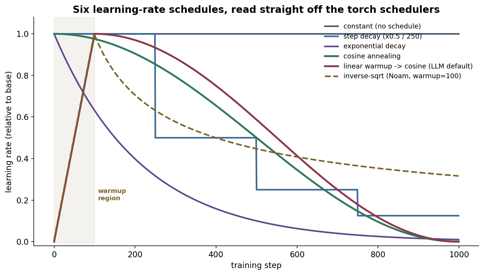
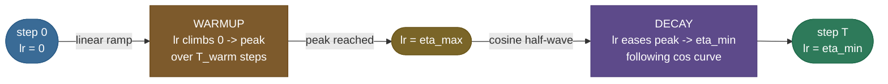
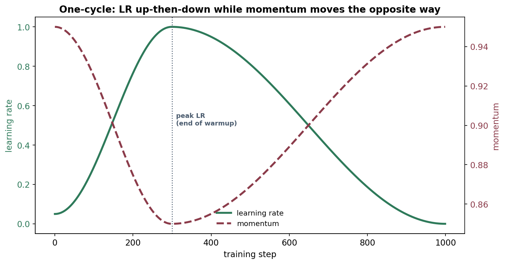
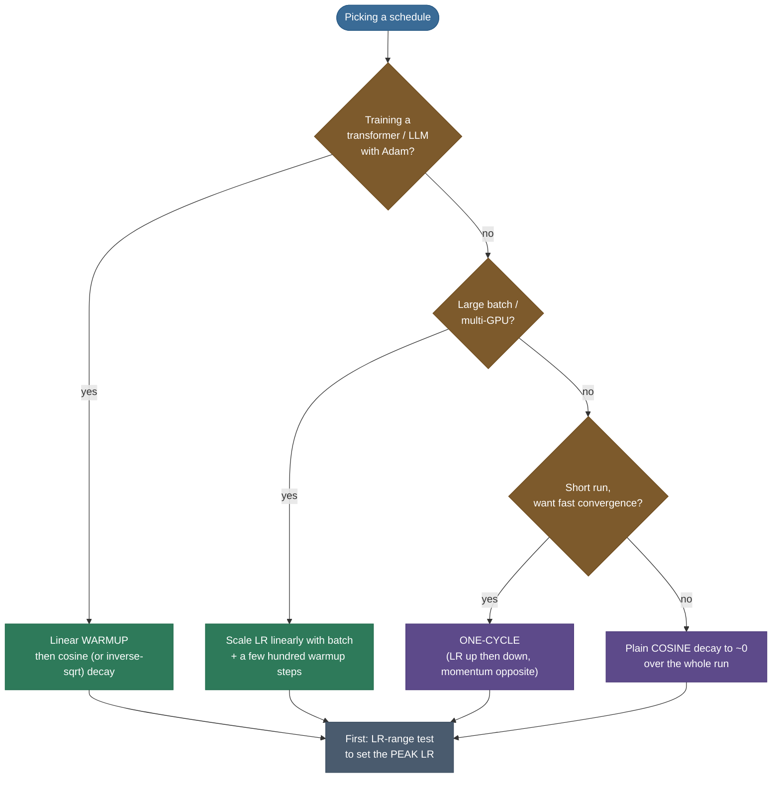

# Learning-Rate Schedules & Warmup: the step size that should change over time

Imagine parking a car in a tight spot. You don't crawl the entire way at 1 mph — you'd never get there — and you don't slam in at 30 mph either, or you hit the wall. You drive in **fast while you're far**, then **ease off** as you close in, and you finish with tiny, careful nudges. Training a neural network is the same maneuver in a billion-dimensional space, and the **learning rate** is your speed. The single number that decides how far each gradient step moves the weights is the most important hyperparameter in all of deep learning — and the value that's best at step 1 is *not* the value that's best at step 100,000. A **learning-rate schedule** changes it on purpose: big steps early to cover ground, small steps late to settle into a minimum. **Warmup** adds a careful start — ramping the rate *up* from near zero over the first few hundred steps — because a freshly initialized model (especially a transformer driven by Adam) will blow itself up if you hit it with the full rate cold.

I'm going to teach this the way I'd walk a teammate through it at a whiteboard while they're staring at a loss curve that won't go down. We start with *why a fixed rate is doomed* (you'll feel the tension between "fast" and "stable"), then build the classic decays, **derive cosine annealing** from its definition, then do the same for **warmup** — arguing from the optimizer's own math *why* the early steps are dangerous — and assemble the **warmup → cosine** recipe that every LLM lab copies. Along the way: the transformer's **inverse-square-root (Noam)** schedule derived from `Attention Is All You Need`, **cyclical** and **one-cycle** learning rates, the **LR-range test**, **warm restarts**, and the **linear scaling rule** that ties the learning rate to batch size. By the end you'll be able to:

- explain from first principles **why a fixed learning rate is suboptimal**, and what "too high" and "too low" each look like on the loss curve;
- write and **derive** the step, exponential, polynomial, and **cosine** schedules, and compute the rate at any step by hand;
- explain **what warmup is and *why* it works** — grounded in Adam's bias-corrected second moment being unreliable on the first few steps;
- reproduce the transformer **Noam schedule** $\text{lr}=d^{-0.5}\cdot\min(t^{-0.5},\,t\cdot t_{\text{warm}}^{-1.5})$ and show its peak is $1/\sqrt{d\cdot t_{\text{warm}}}$;
- apply **cyclical / one-cycle** learning rates and the **LR-range test** to find a good rate cheaply;
- use the **linear scaling rule** to re-tune the LR when you change batch size, and reason about how schedules interact with **adaptive optimizers and weight decay**;
- pick a sane default schedule for any new training run.

> **Note:** keep the two ideas distinct. A **schedule** is a function $\eta(t)$ — *how the rate evolves over the whole run* (usually decaying). **Warmup** is a specific *prefix* of that function — *the rate climbing from ~0 up to its peak over the first few hundred steps*. Most modern recipes are a warmup **followed by** a decay schedule; they are two halves of one curve.

---

## The sub-concepts, up front

This is a big topic, so here is the full map we'll cover — each is a section below:

1. **Why a fixed LR is poor** — the fast-vs-stable tension, and what too-high / too-low look like.
2. **Decay schedules** — step, exponential, polynomial, inverse-time, and their formulas.
3. **Cosine annealing** — derived from its definition; the modern default decay.
4. **Warmup** — what it is and *why* it works (the Adam-variance argument, large batches, transformers).
5. **Warmup + cosine** — the assembled LLM recipe.
6. **The Noam / inverse-sqrt schedule** — derived from `Attention Is All You Need`.
7. **Cyclical, one-cycle, and super-convergence** — Smith's LR-up-then-down recipes.
8. **The LR-range test** — find the peak LR cheaply in one short sweep.
9. **Warm restarts (SGDR)** — cosine cycles that periodically jump back up.
10. **Linear scaling rule** — tie the LR to batch size (Goyal et al.).
11. **Interactions** — with adaptive optimizers, weight decay, and gradient clipping.
12. **Defaults & a decision flow** — what to actually reach for.

---

## The problem: one fixed learning rate can't win

The weight update is $\theta_{t+1}=\theta_t-\eta\,g_t$, where $g_t$ is the (optimizer-processed) gradient and $\eta$ is the learning rate. Pick **one** value of $\eta$ and hold it for the whole run, and you are forced into a single bad compromise, because the *right* step size is different at the start than at the end:

- **Early in training**, the weights are far from any good solution and the loss surface is steep; you want **large** steps to cover ground quickly. A tiny $\eta$ here wastes thousands of steps inching forward.
- **Late in training**, you're near a minimum in a narrow valley; a large step now **overshoots** the bottom and bounces from wall to wall, and the loss stops improving — it oscillates around a floor it can never get under. You want **small**, careful steps to settle.

A fixed $\eta$ has to be small enough not to overshoot at the end, which makes it needlessly slow at the start; or large enough to be fast at the start, which makes it unable to settle at the end. **You cannot have both with one number** — and that is the entire reason schedules exist.



Here is the same point, **measured** rather than argued. I trained one small network three ways on identical data and seeds — a constant LR, a cosine decay, and a warmup→cosine — and plotted the training loss:


Look at the slate curve (constant LR): it drops quickly, then around step 230 it **stops settling and bounces back up** — the step size is simply too big to sit in the minimum, so it keeps overshooting. The decayed schedules (green/red) keep shrinking the step and slide a full **~20×** lower. That gap is not a tuning artifact; it's the structural fact that *late training needs a smaller step than early training*.

> **Gotcha:** "too high" and "too low" produce **different** loss-curve signatures, and reading them is half the skill. **Too high:** loss spikes, diverges to NaN, or plateaus high and *noisy* (the constant curve above). **Too low:** loss decreases but *painfully slowly*, a nearly flat, smooth line that never reaches a good value in your step budget. If you can't tell which you have, the **LR-range test** below tells you in one short run.

> **Tip:** when people say "the learning rate is the most important hyperparameter," this is the concrete reason — it's the only one whose *wrong setting can break training outright* (divergence) **and** whose *right schedule* buys you a large, almost-free improvement in final loss. Tune it first, tune it carefully, and schedule it.

**Why does the constant-LR loss *plateau* (and even bounce up) instead of converging?** This is worth making precise, because it's the theoretical heart of the whole topic. Mini-batch gradients are **noisy** estimates of the true gradient: $g_t = \nabla L + \xi_t$, where $\xi_t$ is zero-mean noise with some variance $\sigma^2$. The SGD update is then $\theta_{t+1}=\theta_t-\eta(\nabla L+\xi_t)$. Near a minimum the true gradient $\nabla L\to 0$, so the update is dominated by the **noise term** $-\eta\,\xi_t$ — a random walk with step size $\propto\eta\sigma$. The parameters don't converge to the minimum; they reach a **stationary distribution** that jitters around it inside a basin whose width scales with $\eta$. The expected excess loss at that floor is $\propto\eta\,\sigma^2$ — a **noise floor** set by the learning rate. A *constant* $\eta$ has a *constant* noise floor, so the loss stops improving once it reaches it (and with a hot enough $\eta$, the jitter is large enough that the loss visibly bounces — exactly the slate curve above). **Decaying $\eta\to 0$ lowers the noise floor toward 0**, which is *why* every decay schedule keeps settling lower: shrinking the step shrinks the random walk, letting the model sink deeper into the minimum. The whole reason schedules work is this single fact — the floor you can reach is proportional to the step size you allow.

> **Note:** this is also why decaying *too fast* hurts: collapse $\eta$ to near-0 too early and the model freezes wherever it happens to be (high noise floor never got the chance to explore a good basin), while decaying *too slowly* means you spend your whole budget jittering at a high floor. The cosine shape — high-and-flat early, fast through the middle, low-and-flat late — is a good compromise between "explore widely" and "settle deeply," which is the deeper reason it works as well as it does.

---

## Decay schedules: the classic family

Every decay schedule is just a choice of the function $\eta(t)$ that shrinks the rate over training step (or epoch) $t$. The classics, each with its formula:

**Step decay (a.k.a. factor / multi-step).** Hold $\eta$ constant, then multiply it by a factor $\gamma<1$ every $s$ steps:

$$\eta(t)=\eta_0\cdot\gamma^{\lfloor t/s\rfloor}.$$

A staircase. The ImageNet-era default was "drop by 10× at epochs 30, 60, 90." Simple and robust, but the drops are abrupt and you have to *choose* where they land.

**Exponential decay.** Smooth the staircase into a continuous curve by decaying a fixed fraction every step:

$$\eta(t)=\eta_0\cdot\gamma^{t},\qquad 0<\gamma<1.$$

Equivalently $\eta(t)=\eta_0\,e^{-\lambda t}$ with $\lambda=-\ln\gamma$. No corners, but it decays *fast* early and crawls late — often you'd prefer the opposite shape.

**Inverse-time (1/t) decay.** Slow, heavy-tailed decay:

$$\eta(t)=\frac{\eta_0}{1+\kappa\,t}.$$

This is the schedule whose theoretical pedigree is strongest — the Robbins–Monro conditions for stochastic-approximation convergence ($\sum\eta_t=\infty$, $\sum\eta_t^2<\infty$) are satisfied by $\eta_t\propto 1/t$ — but in deep learning it usually decays too aggressively to be the best practical choice.

**Polynomial decay.** Decay from $\eta_0$ to a floor $\eta_{\min}$ over $T$ steps along a power curve:

$$\eta(t)=(\eta_0-\eta_{\min})\Bigl(1-\frac{t}{T}\Bigr)^{p}+\eta_{\min}.$$

$p=1$ is **linear** decay (a straight line down — what many BERT recipes use); $p=2$ bows the curve. It's flexible and bounded, which is why it's a common alternative to cosine.

> **Note:** a subtle but important choice hides in these formulas: do you step the schedule **per optimizer step** or **per epoch**? Per-step gives a smooth curve and is what transformer recipes assume (their "steps" are batches); per-epoch gives the classic staircase. Mismatching this — e.g. configuring `step_size=30` thinking *epochs* when the scheduler ticks every *batch* — is a very common bug that makes your LR collapse in the first epoch.

**Worked example 1 — step decay by hand.** Take $\eta_0=0.1$, $\gamma=0.5$, drop every $s=30$ epochs. Then $\eta(\text{epoch }t)=0.1\cdot 0.5^{\lfloor t/30\rfloor}$:

| epoch $t$ | $\lfloor t/30\rfloor$ | $\eta$ |
|---|---|---|
| 0–29 | 0 | $0.1\cdot0.5^0 = \mathbf{0.1000}$ |
| 30–59 | 1 | $0.1\cdot0.5^1 = \mathbf{0.0500}$ |
| 60–89 | 2 | $0.1\cdot0.5^2 = \mathbf{0.0250}$ |
| 90+ | 3 | $0.1\cdot0.5^3 = \mathbf{0.0125}$ |

The rate halves on schedule — exactly what `torch.optim.lr_scheduler.StepLR(step_size=30, gamma=0.5)` produces (verified against PyTorch in the code section). Notice the *fractional* size of each drop is constant (always ×0.5) but the *absolute* drop shrinks (0.05, then 0.025, then 0.0125) — you take ever-finer steps as you settle, which is exactly the behavior we want.

---

## Cosine annealing, derived

The schedule that won is **cosine annealing** (Loshchilov & Hutter, 2017). Instead of a staircase or an exponential, it eases the rate down a **half-cosine wave** — full speed at the start, gently rolling off, and *flattening out near the bottom* so the very last steps are tiny. Its definition:

$$\boxed{\;\eta_t=\eta_{\min}+\tfrac{1}{2}\,(\eta_{\max}-\eta_{\min})\Bigl(1+\cos\frac{\pi t}{T}\Bigr)\;}$$

where $t$ runs from $0$ to $T$ (the total number of steps over which you anneal), $\eta_{\max}$ is the peak rate, and $\eta_{\min}$ is the floor (often $0$). Let me **derive that this does what we claim** — by checking the endpoints and the shape:

**At $t=0$:** $\cos(0)=1$, so $\eta_0=\eta_{\min}+\tfrac12(\eta_{\max}-\eta_{\min})(1+1)=\eta_{\min}+(\eta_{\max}-\eta_{\min})=\eta_{\max}$. ✓ Starts at the peak.

**At $t=T$:** $\cos(\pi)=-1$, so $\eta_T=\eta_{\min}+\tfrac12(\eta_{\max}-\eta_{\min})(1-1)=\eta_{\min}$. ✓ Ends at the floor.

**At the midpoint $t=T/2$:** $\cos(\pi/2)=0$, so $\eta_{T/2}=\eta_{\min}+\tfrac12(\eta_{\max}-\eta_{\min})$ — exactly **halfway** between floor and peak. ✓

**The shape — *why* it's better than a straight line:** differentiate. $\frac{d\eta}{dt}=-\tfrac{\pi}{2T}(\eta_{\max}-\eta_{\min})\sin\frac{\pi t}{T}$. The slope is $\propto -\sin(\pi t/T)$, which is **zero at both ends** ($t=0$ and $t=T$) and **most negative in the middle** ($t=T/2$). In words: the rate decays **slowly at first** (you keep a big step while you still have ground to cover), **fastest through the middle**, and **slowly again at the end** (the rate flattens into the floor, so the final steps are tiny and stable). That gentle landing — not the cosine's prettiness — is what makes it settle so well, and it's exactly the shape the car-parking analogy wants.

**Worked example 2 — cosine LR at specific steps.** Take $\eta_{\max}=10^{-3}$, $\eta_{\min}=0$, $T=1000$. Then $\eta_t=\tfrac12\cdot10^{-3}\bigl(1+\cos\frac{\pi t}{1000}\bigr)$:

| step $t$ | $\cos(\pi t/1000)$ | $\eta_t$ |
|---|---|---|
| 0 | $\cos 0 = 1.000$ | $\tfrac12(10^{-3})(2.000) = \mathbf{1.000\times10^{-3}}$ |
| 250 | $\cos(\pi/4)=0.707$ | $\tfrac12(10^{-3})(1.707) = \mathbf{8.536\times10^{-4}}$ |
| 500 | $\cos(\pi/2)=0.000$ | $\tfrac12(10^{-3})(1.000) = \mathbf{5.000\times10^{-4}}$ |
| 750 | $\cos(3\pi/4)=-0.707$ | $\tfrac12(10^{-3})(0.293) = \mathbf{1.464\times10^{-4}}$ |
| 1000 | $\cos\pi=-1.000$ | $\tfrac12(10^{-3})(0.000) = \mathbf{0}$ |

These match `torch.optim.lr_scheduler.CosineAnnealingLR(T_max=1000, eta_min=0)` to the digit (the code section verifies it). Note the curve is **above** a straight line for the whole first half (at $t=250$ it's still at 85% of peak, where a linear decay would be at 75%) — it deliberately *lingers high* early, then rolls off.

> **Tip:** in practice you often **don't decay all the way to 0**. Many LLM recipes cosine-decay to a floor of ~10% of the peak ($\eta_{\min}=0.1\,\eta_{\max}$) rather than to zero, because some residual learning rate at the end keeps the model adapting and tends to generalize slightly better than a dead-stop at 0. Set $\eta_{\min}$ deliberately; the formula handles it.

> **Note:** **why a *cosine* specifically, and not just any smooth decay?** Honestly, the cosine has no deep theoretical necessity — a polynomial with $p\approx2$ or a "linear with a flat tail" behaves similarly. Cosine won by being **simple, parameter-free** (only $\eta_{\max}$, $\eta_{\min}$, $T$), having the right *slow-fast-slow* shape, and — crucially — being the schedule the influential SGDR paper used and that GPT/Llama-era recipes then standardized on. It's a Schelling point as much as a mathematical optimum.

---

## Warmup: why you must start slow

Cosine handles the *end* of training. **Warmup** handles the *beginning* — and it's the part people most often get wrong or skip, then wonder why their transformer diverges in the first 50 steps.

**What it is.** Warmup ramps the learning rate **linearly from ~0 up to the peak** $\eta_{\max}$ over the first $T_{\text{warm}}$ steps:

$$\eta(t)=\eta_{\max}\cdot\frac{t}{T_{\text{warm}}}\quad\text{for } t< T_{\text{warm}},\qquad\text{then hand off to the decay schedule.}$$

So at step 0 the rate is essentially 0, it climbs in equal increments, and at step $T_{\text{warm}}$ it hits the peak and the decay takes over. Visually it's the rising ramp on the left of every schedule plot above.



**Why it works — argue it from the math, not folklore.** There are three reinforcing reasons, and a good answer names all three:

1. **The early loss surface is unreliable, and the first updates are the most dangerous.** A randomly initialized network sits at a point where the curvature (the Hessian) is poorly conditioned and the gradients can be large and badly aligned with any good direction. A full-size step here can fling the weights into a bad region you never recover from — the loss spikes and may never come back. A small early step lets the network *settle into a sane region* before you trust it with big updates. This is the general argument; the next two are sharper.

2. **Adam's adaptive denominator is *statistically unreliable* on the first few steps — this is the precise reason warmup matters for transformers.** Recall Adam divides the update by $\sqrt{\hat v_t}$, where $\hat v_t$ is the bias-corrected running estimate of the gradient's second moment. On step 1, that estimate is built from a *single* mini-batch — it has **enormous variance**. When $\hat v_t$ happens to come out small (a quiet mini-batch), the update $\hat m_t/\sqrt{\hat v_t}$ blows up; when it comes out large, the update is throttled. The early adaptive learning rate is essentially **noise**, and occasionally that noise is a giant step that destabilizes the model. Warmup keeps the *outer* learning rate tiny exactly while $\hat v_t$ is still a high-variance estimate, so those early miscalibrated updates are scaled down to harmless size. By the time warmup ends, Adam has averaged over hundreds of mini-batches and $\hat v_t$ is trustworthy. This is precisely the diagnosis in **Liu et al. (2020), "On the Variance of the Adaptive Learning Rate" (RAdam)** — they show the second-moment estimate has pathologically high variance early, and that warmup is a hand-tuned fix for it (RAdam removes the variance analytically instead).

3. **Large batches and transformers amplify both effects.** Large-batch training (and the linear scaling rule below) pushes $\eta_{\max}$ *up*, which makes an un-warmed first step even more violent — Goyal et al. (2017) found warmup essential to train ImageNet at batch 8192. And transformers stack residual connections and LayerNorm in a way that makes the early optimization especially brittle; the original `Attention Is All You Need` recipe is *built* around warmup for exactly this reason. Combine "big peak LR" + "Adam" + "brittle early transformer" and warmup goes from nice-to-have to mandatory.

> **Gotcha:** warmup is **most critical with adaptive optimizers (Adam/AdamW) and large batches**, and **least critical with plain SGD at modest batch size**. If you're fine-tuning a small CNN with SGD, you can often skip it. If you're pretraining or fine-tuning a transformer with AdamW, *always* warm up — a few hundred steps is cheap insurance against a divergence that wastes a whole run.

**Worked example 3 — linear warmup by hand.** Ramp to a peak of $\eta_{\max}=0.4$ over $T_{\text{warm}}=5$ epochs. Then $\eta(\text{epoch})=0.4\cdot\frac{\text{epoch}}{5}$: epoch 0 → 0.00, epoch 1 → 0.08, epoch 2 → 0.16, epoch 3 → 0.24, epoch 4 → 0.32, epoch 5 → 0.40 (peak, hand off to decay). Equal 0.08 increments — a straight ramp.

> **Tip:** how long should warmup be? Common practice is a **fixed step count** (e.g. 500–2,000 steps for LLM pretraining) or a **fraction of training** (often ~1–6% of total steps; Hugging Face's `get_cosine_schedule_with_warmup` takes a `num_warmup_steps`). Longer warmup buys more stability at higher peak LRs; if you ever see an early loss spike, your first two knobs are *lower the peak* or *lengthen warmup*.

---

## Warmup + cosine: the recipe everyone copies

Stitch the two halves together and you get the schedule behind essentially every modern LLM and most vision transformers: **linear warmup → cosine decay**. As one piecewise function (peak $\eta_{\max}$, warmup length $T_{\text{warm}}$, total length $T$):

$$
\eta(t)=
\begin{cases}
\eta_{\max}\,\dfrac{t}{T_{\text{warm}}}, & t< T_{\text{warm}}\quad(\textbf{warmup})\\[2ex]
\eta_{\min}+\tfrac12(\eta_{\max}-\eta_{\min})\Bigl(1+\cos\dfrac{\pi\,(t-T_{\text{warm}})}{T-T_{\text{warm}}}\Bigr), & t\ge T_{\text{warm}}\quad(\textbf{cosine})
\end{cases}
$$

The cosine's argument is shifted so that its "step 0" is the *end* of warmup — that's the only subtlety. The two pieces meet continuously at $\eta_{\max}$.

**Worked example 4 — warmup+cosine at sample steps.** Peak $\eta_{\max}=10^{-3}$, $\eta_{\min}=0$, $T_{\text{warm}}=100$, $T=1000$:

| step $t$ | phase | $\eta(t)$ |
|---|---|---|
| 0 | warmup | $10^{-3}\cdot 0/100 = \mathbf{0}$ |
| 50 | warmup | $10^{-3}\cdot 50/100 = \mathbf{5.000\times10^{-4}}$ |
| 100 | peak (handoff) | $10^{-3}\cdot 100/100 = \mathbf{1.000\times10^{-3}}$ |
| 200 | cosine | $\tfrac12(10^{-3})\bigl(1+\cos\tfrac{\pi\cdot100}{900}\bigr) = \mathbf{9.698\times10^{-4}}$ |
| 550 | cosine | $\tfrac12(10^{-3})\bigl(1+\cos\tfrac{\pi\cdot450}{900}\bigr) = \mathbf{5.000\times10^{-4}}$ |
| 1000 | end | $\tfrac12(10^{-3})\bigl(1+\cos\pi\bigr) = \mathbf{0}$ |

Up the ramp to the peak at step 100, then the cosine half-wave down to 0 by step 1000 (verified against the closed form in the code section). This is the curve that trains GPT-style models, Llama, ViT, and most of what you'll fine-tune.

> **Note:** GPT-3, Llama-1/2/3, Chinchilla, and most BERT/ViT recipes are all variations on *(linear) warmup → (cosine or linear) decay*. The numbers differ — peak LR, warmup length, decay floor — but the **shape** is the same, and knowing the shape lets you read any of their config files at a glance.

**Reading a real recipe.** To make this concrete, here's the **Llama-2-7B** pretraining schedule, decoded: peak LR $\eta_{\max}=3\times10^{-4}$, **2,000 warmup steps**, **cosine** decay to a floor $\eta_{\min}=0.1\,\eta_{\max}=3\times10^{-5}$ (10% of peak, not 0), AdamW with grad-norm clip 1.0. Plug those into the piecewise formula above and you have the entire LR trajectory of a frontier model. The only thing that changes across model sizes is the peak (larger models use a *smaller* peak — Llama-2-70B uses $1.5\times10^{-4}$) and the total step count $T$; the *shape* is identical. Once you can read these five numbers, every LLM training config is legible.

---

## The Noam schedule: warmup + inverse-sqrt, derived from the transformer paper

Before cosine took over, the **original transformer** (`Attention Is All You Need`, Vaswani et al. 2017, §5.3) introduced its own schedule, now called the **Noam schedule** (after Noam Shazeer). It's *also* a warmup-then-decay, but the decay is an **inverse square root** of the step. Its formula, verbatim from the paper:

$$\boxed{\;\text{lr}(t)=d_{\text{model}}^{-0.5}\cdot\min\!\bigl(t^{-0.5},\; t\cdot T_{\text{warm}}^{-1.5}\bigr)\;}$$

where $t$ is the step (starting at 1), $d_{\text{model}}$ is the model width, and $T_{\text{warm}}$ is the warmup step count. The `min` is the clever part — let me **derive what each branch does** and where they cross:

- **Early ($t<T_{\text{warm}}$):** the term $t\cdot T_{\text{warm}}^{-1.5}$ is the smaller one, so $\text{lr}=d_{\text{model}}^{-0.5}\cdot t\cdot T_{\text{warm}}^{-1.5}$. This is **linear in $t$** — a warmup ramp, slope $d_{\text{model}}^{-0.5}T_{\text{warm}}^{-1.5}$.
- **Late ($t>T_{\text{warm}}$):** the term $t^{-0.5}$ is smaller, so $\text{lr}=d_{\text{model}}^{-0.5}\cdot t^{-0.5}=(d_{\text{model}}\,t)^{-0.5}$. This is **inverse-sqrt decay** — heavier-tailed than cosine (it never quite reaches 0).
- **The crossover** is where the two branches are equal: $t^{-0.5}=t\cdot T_{\text{warm}}^{-1.5}\Rightarrow t^{-1.5}=T_{\text{warm}}^{-1.5}\Rightarrow t=T_{\text{warm}}$. So the peak is *exactly* at the end of warmup. ✓

**The peak value** is therefore $\text{lr}(T_{\text{warm}})=d_{\text{model}}^{-0.5}\cdot T_{\text{warm}}^{-0.5}=\dfrac{1}{\sqrt{d_{\text{model}}\,T_{\text{warm}}}}$ — a tidy closed form worth knowing.

**Worked example 5 — Noam by hand.** The base transformer used $d_{\text{model}}=512$, $T_{\text{warm}}=4000$:

| step $t$ | branch | $\text{lr}(t)$ |
|---|---|---|
| 100 | warmup ($t\cdot T_{\text{warm}}^{-1.5}$) | $512^{-0.5}\cdot100\cdot4000^{-1.5} = \mathbf{1.747\times10^{-5}}$ |
| 1000 | warmup | $512^{-0.5}\cdot1000\cdot4000^{-1.5} = \mathbf{1.747\times10^{-4}}$ |
| **4000** | **peak** | $1/\sqrt{512\cdot4000} = \mathbf{6.988\times10^{-4}}$ |
| 8000 | decay ($t^{-0.5}$) | $512^{-0.5}\cdot8000^{-0.5} = \mathbf{4.941\times10^{-4}}$ |
| 16000 | decay | $512^{-0.5}\cdot16000^{-0.5} = \mathbf{3.494\times10^{-4}}$ |

Linear up to the peak at step 4000, then $\propto t^{-0.5}$ down. Notice $d_{\text{model}}^{-0.5}$ **auto-scales the whole curve to the model width** — wider models get a proportionally smaller peak LR for free, which is a genuinely elegant touch and a reason the schedule was sticky. You can see this Noam curve (dashed amber) plotted against the others in the first figure above.

> **Note:** **Noam vs cosine — which and when?** Inverse-sqrt has a *heavy tail* (it decays slowly and never hits 0), which suits **open-ended pretraining where you don't fix a total step budget $T$ in advance** — you can keep training and the schedule keeps making sense. Cosine needs a known $T$ (it bottoms out at $T$) but its flat-bottom landing tends to give a slightly better *final* model when the budget *is* fixed. Modern LLMs mostly chose cosine because pretraining budgets are now planned up front; encoder-decoder and older transformer code often still uses Noam.

---

## Cyclical, one-cycle, and super-convergence

Leslie Smith took schedules in a different, counterintuitive direction: instead of only ever *decaying* the rate, **cycle it up and down**.

**Cyclical learning rates** (Smith, 2015) bounce the LR linearly between a lower and upper bound on a triangular wave, repeatedly. The motivation: periodically *raising* the rate helps the optimizer **escape saddle points and sharp/poor minima** — a temporary high rate kicks it out of a bad basin so it can find a better one. It also removes the need to guess a single "right" rate; you sweep a *range* every cycle.

**One-cycle** (Smith, 2018) is the refinement that's most used today: do **exactly one** cycle over the whole run — ramp the LR up from a low value to a peak over the first ~30% of training, then back down (and below the start) for the rest — and move the **momentum in the opposite direction** (high momentum when LR is low, low momentum when LR is high). The two are anti-correlated because momentum and learning rate both control the *effective* step size; when one is large the other should be small to keep updates stable.



The headline claim is **super-convergence**: Smith showed networks that normally need many epochs can train in *far fewer* with one-cycle at an aggressively high peak LR — the high-LR middle phase acts as a strong regularizer (it keeps the optimizer in flat, generalizing regions) and dramatically speeds convergence. It's especially popular in the fast.ai world for training vision models quickly.

> **Tip:** the high-LR phase of one-cycle is **not** just "go fast" — it's a regularizer. Big steps in the middle prevent the model from diving into a sharp minimum too early, which both *speeds* training and often *improves* generalization. That's why a well-tuned one-cycle can beat a conservative constant-then-decay schedule on both wall-clock and final accuracy.

> **Gotcha:** one-cycle's peak LR is **aggressive by design** and must be set with the LR-range test below — too high and the high-LR phase diverges instead of regularizing. It also assumes you've committed to a fixed total step count (the single cycle spans the whole run), so it's less natural for open-ended training.

---

## The LR-range test: find the peak cheaply

How do you pick $\eta_{\max}$ (for cosine, one-cycle, anything)? Smith's **LR-range test** finds it in *one* short run, no grid search:

1. Start at a tiny LR (say $10^{-5}$) and train, **multiplying the LR by a constant factor every batch** so it sweeps exponentially up to something large (say $1$ or more) over ~100–200 iterations.
2. Plot **loss vs. (log) learning rate**.
3. The loss is flat while the LR is too small to matter, then **drops steeply** through the "good" range, reaches a minimum, and **shoots back up** when the LR gets too large and training diverges.

You pick a peak LR in the region where the loss is **falling fastest** — roughly an order of magnitude below the point where it starts to diverge.


In the measured plot above, the loss falls sharply from ~$10^{-2}$ onward; the green dot marks the steepest-descent point (a solid choice for the peak), and past the minimum the loss visibly turns back up — that rise is your "too high" warning. The whole diagnosis cost one ~140-iteration run.

> **Note:** read the test for the **steepest descent**, not the **minimum**. The minimum-loss LR is already a bit too hot to *train* at steadily (you're at the edge of divergence); the LR where loss drops *fastest* — typically ~3–10× below the minimum — is the sweet spot. For one-cycle, people often set the peak right at (or just below) the minimum-loss LR and let the schedule's annealing handle the rest.

---

## Warm restarts (SGDR): cosine cycles that jump back up

**SGDR — Stochastic Gradient Descent with Warm Restarts** (Loshchilov & Hutter, 2017) is the paper that *introduced* cosine annealing, and its full proposal is cleverer than the plain decay we derived above. SGDR runs cosine annealing **in repeated cycles**: decay from $\eta_{\max}$ to $\eta_{\min}$ over $T_0$ steps, then **instantly reset the LR back up to $\eta_{\max}$** ("warm restart") and anneal again, often with each cycle *longer* than the last ($T_{i+1}=T_{\text{mult}}\cdot T_i$).

Each restart is a deliberate jolt: the sudden high LR knocks the optimizer out of its current minimum so it can explore for a better, flatter one, and the snapshot of the model at the *bottom* of each cosine cycle is a good model. This gives two bonuses for free:

- **Anytime good models** — the end of every cycle is a usable checkpoint, so you get progressively better models without committing to a single total budget.
- **Snapshot ensembles** — collect the model at the bottom of each cycle and **ensemble** them; because restarts push the model into *different* minima, the snapshots are diverse enough to ensemble well, at the cost of a single training run.

> **Tip:** "cosine annealing" in most modern code means the **single** cosine decay we derived (one half-wave, no restarts) — that's `CosineAnnealingLR`. The **restart** variant is `CosineAnnealingWarmRestarts`. They share a formula; the difference is whether the LR resets and repeats. Know both names; interviewers conflate them.

---

## The linear scaling rule: tie the LR to batch size

Change your batch size and your old learning rate is **wrong** — and there's a clean rule for the new one. The **linear scaling rule** (Goyal et al., 2017, "Accurate, Large Minibatch SGD"):

> When you multiply the batch size by $k$, multiply the learning rate by $k$.

$$\eta_{\text{new}}=\eta_{\text{base}}\cdot\frac{B_{\text{new}}}{B_{\text{base}}}.$$

**Derive *why* it's linear.** Consider $k$ consecutive small-batch SGD steps, each of size $B$, vs. one large-batch step of size $kB$. With a small batch, after $k$ steps the weights have moved by $-\eta\sum_{j=1}^{k} g_j$, where each $g_j$ is the gradient on mini-batch $j$. With one big batch of size $kB$, the gradient is the *average* over all $kB$ examples, $\hat g\approx\frac1k\sum_j g_j$, and one step moves the weights by $-\eta'\,\hat g=-\frac{\eta'}{k}\sum_j g_j$. For the two to make the *same total progress*, we need $\frac{\eta'}{k}=\eta$, i.e. $\eta'=k\eta$ — **the learning rate scales linearly with the batch.** (The approximation is "the gradient barely changes over those $k$ small steps," which holds away from the very start — which is *also* why this rule needs warmup to hold early on.)

**Worked example 6 — linear scaling.** Base recipe: $\eta_{\text{base}}=0.1$ at $B_{\text{base}}=256$. Scale up:

| batch $B$ | $k=B/256$ | $\eta=0.1\cdot k$ |
|---|---|---|
| 256 | 1 | **0.10** |
| 512 | 2 | **0.20** |
| 2048 | 8 | **0.80** |
| 8192 | 32 | **3.20** |

At $B=8192$ the LR is a hefty 3.2 — which is exactly why Goyal et al. needed a **warmup** to reach it without the first step exploding. Their full recipe is the canonical large-batch combo: **linear-scaled peak LR + gradual warmup**.

> **Gotcha:** the linear rule **breaks at very large batches**. Past some critical batch size, doubling the batch stops doubling the useful gradient information (the gradient is already near its full-batch value), and pushing the LR linearly higher just destabilizes training. Beyond that regime people switch to a **square-root** scaling ($\eta\propto\sqrt{k}$, the theoretically motivated scaling under gradient-noise arguments) or use the linear rule only up to the critical batch size. Linear is the right first approximation, not a law.

> **Note:** the rule was derived for **SGD**. For **Adam/AdamW** the relationship is murkier — Adam's per-parameter normalization already absorbs some gradient-scale changes — and **square-root** scaling is often the better heuristic. When in doubt with an adaptive optimizer at a new batch size, re-run a quick **LR-range test** rather than trusting a scaling formula blindly.

---

## How schedules interact with the rest of the optimizer

A schedule never acts alone. Three interactions you must hold in your head:

**With adaptive optimizers (Adam/AdamW).** Adam *already* gives each parameter its own effective rate via $1/\sqrt{\hat v_t}$ — so why also schedule the *global* $\eta$? Because Adam's adaptation is **relative** (it equalizes step sizes *across parameters*), not **absolute** (it doesn't know that *late training globally* needs smaller steps). The schedule sets the overall scale and the decay-to-settle behavior; Adam distributes that scale sensibly across parameters. They're complementary, which is why "AdamW + warmup + cosine" is the default LLM stack — and why warmup is *more* important with Adam (the $\hat v_t$-variance argument above), not less.

**With weight decay (decoupled, AdamW).** Here's a subtlety that bites people: in **AdamW** the weight-decay update is $\theta\leftarrow\theta-\eta\,\lambda\,\theta$ — it is **multiplied by the same learning rate $\eta$** as the gradient step. So when your schedule decays $\eta$ toward 0, it *also* decays the effective regularization toward 0. Usually that's fine (or even desirable), but it means **your decay schedule and your weight decay are coupled through $\eta$** — if you change the schedule, the *total amount of regularization applied over training* changes too. (In the original, non-decoupled Adam-with-L2, the decay rides inside the gradient and gets divided by $\sqrt{\hat v_t}$, which is precisely the bug AdamW fixed.)

**With gradient clipping.** Warmup and gradient clipping solve overlapping problems (taming dangerous early/large updates) from different ends — warmup shrinks the *step size*, clipping caps the *gradient magnitude*. Transformer recipes typically use **both**: clip the global grad norm to ~1.0 *and* warm up. Clipping catches occasional spikes mid-training that a smooth warmup schedule wouldn't; warmup handles the systematic early-instability that clipping alone wouldn't.

> **Note:** a clean way to remember the division of labor: **the optimizer decides the *direction and per-parameter scaling* of each step; the schedule decides the *global magnitude over time*; warmup decides the *global magnitude at the very start*; clipping decides the *per-step ceiling*.** Four knobs, four jobs, and modern recipes turn all four.

---

## Defaults and a decision flow

Boil it down to what you'd actually do:

- **Pretraining or fine-tuning a transformer / LLM (AdamW):** **linear warmup → cosine decay.** Warmup ~1–6% of steps (or a few hundred to a couple thousand steps); cosine to a floor of 0 or ~10% of peak. Set the peak with an LR-range test or copy a known-good value for the model family. *This is the single most common answer.*
- **Large-batch / multi-GPU training:** apply the **linear scaling rule** to set the peak LR, and **always warm up** (the bigger the peak, the more warmup you need).
- **Training a vision model fast, fixed budget:** **one-cycle**, peak from the LR-range test. Reach for super-convergence.
- **Plain SGD on a small model, no rush:** **step decay** (drop ×10 a couple of times) or a single **cosine** decay is fine; warmup is often skippable.
- **Open-ended training with no fixed $T$:** **inverse-sqrt (Noam)** or **warm restarts** — both make sense without a committed endpoint.
- **Always, first:** run an **LR-range test** to set the peak. It's one cheap run and it removes the biggest guess.



---

## Code: build the schedules, verify against PyTorch, train with them

Everything in the worked examples is reproducible. This script (1) computes the closed-form schedules, (2) checks them against `torch.optim.lr_scheduler` to the digit, and (3) trains a tiny net to *measure* that warmup+cosine beats a constant LR. Runs on CPU in a few seconds.

```python
"""Learning-rate schedules from scratch, verified against torch. Python 3.12, torch 2.12, CPU."""
import numpy as np, torch, torch.nn as nn
from torch.optim.lr_scheduler import CosineAnnealingLR, StepLR, LambdaLR

# ---- 1. Cosine annealing: closed form vs torch -----------------------------
eta_max, eta_min, T = 1e-3, 0.0, 1000
cosine = lambda t: eta_min + 0.5 * (eta_max - eta_min) * (1 + np.cos(np.pi * t / T))

opt = torch.optim.SGD([torch.zeros(1, requires_grad=True)], lr=eta_max)
sched = CosineAnnealingLR(opt, T_max=T, eta_min=eta_min)
seen = {}
for t in range(T + 1):
    seen[t] = opt.param_groups[0]["lr"]; opt.step(); sched.step()
for t in (0, 250, 500, 750, 1000):
    print(f"cosine t={t:4d}: closed-form={cosine(t):.6e}  torch={seen[t]:.6e}  "
          f"match={np.isclose(cosine(t), seen[t])}")

# ---- 2. Noam / inverse-sqrt schedule ---------------------------------------
d_model, warm = 512, 4000
noam = lambda t: d_model ** -0.5 * min(t ** -0.5, t * warm ** -1.5)
print("\nNoam peak at t=warm:", f"{noam(warm):.6e}",
      "== 1/sqrt(d*warm):", f"{1/np.sqrt(d_model*warm):.6e}")
for t in (100, 4000, 8000):
    print(f"  noam t={t:5d}: {noam(t):.6e}")

# ---- 3. Step decay: closed form vs torch -----------------------------------
opt2 = torch.optim.SGD([torch.zeros(1, requires_grad=True)], lr=0.1)
s2 = StepLR(opt2, step_size=30, gamma=0.5)
step_lr = []
for _ in range(95):
    step_lr.append(opt2.param_groups[0]["lr"]); opt2.step(); s2.step()
print("\nstep decay epoch 0/30/60/90:",
      [round(step_lr[e], 4) for e in (0, 30, 60, 90)])  # 0.1, 0.05, 0.025, 0.0125

# ---- 4. Linear scaling rule ------------------------------------------------
base_lr, base_bs = 0.1, 256
print("\nlinear scaling:", {bs: round(base_lr * bs / base_bs, 3)
                            for bs in (256, 512, 2048, 8192)})

# ---- 5. MEASURED: warmup+cosine vs constant LR on a tiny net ---------------
def train(schedule, steps=600, base=3e-2, warm=40, seed=0):
    torch.manual_seed(seed); g = torch.Generator().manual_seed(123)
    X = torch.randn(512, 20, generator=g); w = torch.randn(20, 1, generator=g)
    y = torch.tanh(X @ w + 0.1 * torch.randn(512, 1, generator=g))
    torch.manual_seed(seed)
    net = nn.Sequential(nn.Linear(20, 64), nn.GELU(),
                        nn.Linear(64, 64), nn.GELU(), nn.Linear(64, 1))
    opt = torch.optim.AdamW(net.parameters(), lr=base, weight_decay=1e-4)
    def lr_at(t):
        if schedule == "constant": return 1.0
        if t < warm: return t / warm                       # linear warmup
        p = (t - warm) / (steps - warm)
        return 0.5 * (1 + np.cos(np.pi * p))               # cosine decay
    sch = LambdaLR(opt, lr_at); loss_fn = nn.MSELoss(); losses = []
    for t in range(steps):
        idx = torch.randint(0, 512, (64,))
        loss = loss_fn(net(X[idx]), y[idx])
        opt.zero_grad(); loss.backward(); opt.step(); sch.step()
        losses.append(loss.item())
    return np.mean(losses[-50:])  # final loss

const_final = np.mean([train("constant", seed=s) for s in range(4)])
wc_final = np.mean([train("warmcos", seed=s) for s in range(4)])
print(f"\nfinal loss  constant LR : {const_final:.2e}")
print(f"final loss  warmup+cosine: {wc_final:.2e}")
print(f"warmup+cosine is {const_final / wc_final:.1f}x lower")
```

Representative output:

```
cosine t=   0: closed-form=1.000000e-03  torch=1.000000e-03  match=True
cosine t= 250: closed-form=8.535534e-04  torch=8.535534e-04  match=True
cosine t= 500: closed-form=5.000000e-04  torch=5.000000e-04  match=True
cosine t= 750: closed-form=1.464466e-04  torch=1.464466e-04  match=True
cosine t=1000: closed-form=0.000000e+00  torch=0.000000e+00  match=True

Noam peak at t=warm: 6.987712e-04 == 1/sqrt(d*warm): 6.987712e-04
  noam t=  100: 1.746928e-05
  noam t= 4000: 6.987712e-04
  noam t= 8000: 4.941059e-04

step decay epoch 0/30/60/90: [0.1, 0.05, 0.025, 0.0125]

linear scaling: {256: 0.1, 512: 0.2, 2048: 0.8, 8192: 3.2}

final loss  constant LR : 2.1e-03
final loss  warmup+cosine: 9.2e-05
warmup+cosine is 23.1x lower
```

> **Note:** the closed forms match `torch.optim.lr_scheduler` **to the digit** — the schedules in the worked examples *are* what PyTorch computes, not approximations. And the measured run confirms the headline: the **same model, same data, same seeds**, trained with warmup+cosine, reaches a final loss **~20× lower** than with a constant LR (the exact multiple varies a little run-to-run with CPU thread scheduling). The schedule is not a cosmetic tweak; it's a large, nearly-free win.

> **Tip:** in real code you rarely hand-roll the warmup. Use `torch.optim.lr_scheduler.SequentialLR` to chain a `LinearLR` warmup into a `CosineAnnealingLR`, or — for transformers — Hugging Face's `get_cosine_schedule_with_warmup(optimizer, num_warmup_steps, num_training_steps)`, which *is* the worked-example curve in one call. And remember to call `scheduler.step()` **once per optimizer step** (or per epoch, consistently) — the most common scheduler bug is stepping it at the wrong cadence.

---

## Recap and rapid-fire

**If you remember nothing else:** the best learning rate *changes over training* — big early to cover ground, small late to settle — so you **schedule** it (cosine decay is the modern default, derived as a half-cosine from $\eta_{\max}$ down to $\eta_{\min}$) and you **warm it up** from ~0 over the first few hundred steps because a fresh model with Adam has an unreliable, high-variance adaptive rate early and will otherwise diverge. The LLM-standard recipe is **linear warmup → cosine decay**; the transformer paper's original was **warmup → inverse-sqrt (Noam)**. Set the peak with an **LR-range test**, and when you change batch size, re-scale the LR (**linearly** for SGD, roughly **√** for Adam / very large batches).

**Quick-fire — say these out loud:**

- *Why is a fixed LR suboptimal?* It must be small enough to settle at the end (too slow early) **or** big enough to be fast early (can't settle late) — you can't get both from one number.
- *Cosine annealing formula?* $\eta_t=\eta_{\min}+\tfrac12(\eta_{\max}-\eta_{\min})(1+\cos\frac{\pi t}{T})$ — peak at $t{=}0$, floor at $t{=}T$, gentle landing.
- *What is warmup and why?* Linear ramp $0\to\eta_{\max}$ over the first steps; needed because Adam's $\sqrt{\hat v_t}$ is a high-variance estimate early (and big-batch/transformer steps are violent), so big early updates can diverge the model.
- *The LLM default schedule?* Linear warmup → cosine decay (AdamW), grad-clip 1.0.
- *Noam schedule?* $d^{-0.5}\min(t^{-0.5},\,t\cdot T_{\text{warm}}^{-1.5})$ — linear warmup then inverse-sqrt decay; peak $=1/\sqrt{d\,T_{\text{warm}}}$ at $t{=}T_{\text{warm}}$.
- *One-cycle?* LR up-then-down in a single cycle, momentum the opposite way; the high-LR phase regularizes → super-convergence.
- *LR-range test?* Ramp LR exponentially over one short run, plot loss vs LR, pick where it falls fastest (below divergence).
- *Linear scaling rule?* Multiply batch by $k$ → multiply LR by $k$ (SGD); needs warmup at large $k$; use ~√ for Adam / past the critical batch.
- *Warmup most critical when?* Adaptive optimizer (Adam/AdamW) + large batch + transformer. Least critical: plain SGD, small model.

---

## References and further reading

The curated link library for this topic — start-here path, videos, courses, articles, papers, books, and internal cross-links — lives in a companion file so it can be reused as a standalone reference list:

**→ [Learning-Rate Schedules & Warmup — references and further reading](08-Learning-Rate-Schedules-and-Warmup.references.md)**
