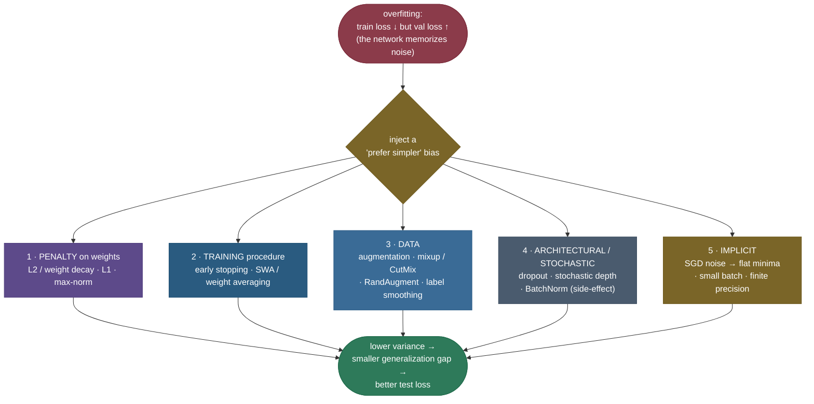
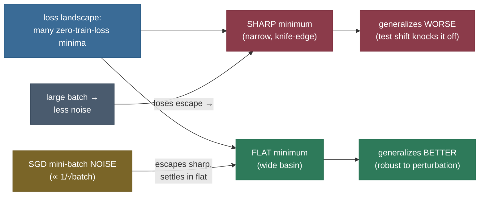

# Regularization: making a deep network generalize instead of memorize

A modern neural network is almost always **over-parameterized** — it has far more weights than it has training examples. A ResNet-50 has 25 million parameters; ImageNet has ~1.3 million images. A 7B language model has billions of weights and is trained on a corpus that, token for token, it could in principle store. So here is the unsettling fact that Zhang et al. proved in 2017: a standard image network can fit a training set whose labels have been **randomly shuffled** — it will drive training error to zero on pure noise. Capacity is not the bottleneck; *what the network chooses to do with that capacity* is. Left alone, it will happily memorize the training set — the signal *and* the noise — and then fail on anything it hasn't seen.

You watch this happen as the tell-tale **generalization gap**: training loss keeps falling toward zero while validation loss flattens and then climbs. That is **overfitting**, and **regularization** is the entire family of techniques that fight it. The common thread is a deliberate trade — *give up a little fit on the training set in exchange for a simpler model that generalizes*. "Simpler" takes many forms: smaller weights, fewer active features, a shorter training run, a noisier forward pass, a richer effective dataset, a less over-confident output. Regularization is how you move along the **bias–variance** trade-off [on purpose](../../03.%20Supervised_Learning/concepts/12-Bias-Variance-Tradeoff.md).

I'm going to walk this the way I'd teach it to someone who has a model that won't generalize and needs to know *which* lever to pull and *why*. We'll start by feeling the problem (over-parameterized nets memorize), lay out a **taxonomy** so every technique has a place, then derive each lever from first principles — penalty-based (L2/weight decay, L1), training-procedure (early stopping), data-based (augmentation, mixup, RandAugment, label smoothing), architectural/stochastic (dropout, stochastic depth, BatchNorm's side-effect), and **implicit** (SGD's own bias toward flat minima) — and finish with how to *choose and combine* them, the double-descent caveat, four worked examples, and runnable code. By the end you'll be able to:

- explain **why over-parameterized nets overfit**, and what every regularizer trades (bias for variance);
- place any technique in a **five-branch taxonomy** and say which term of the problem it attacks;
- **derive** L2 weight decay's multiplicative shrink $\theta \leftarrow (1-\eta\lambda)\theta - \eta\nabla L$, its **Gaussian-prior MAP** reading, and why **decoupled** decay (AdamW) ≠ L2-in-the-gradient for adaptive optimizers;
- argue that **early stopping ≈ L2** via the trajectory-length / eigen-decomposition argument;
- derive the **mixup** loss and the **label-smoothing** target $y_{\text{LS}}=(1-\varepsilon)y+\varepsilon/K$ and its effect on the cross-entropy gradient;
- explain **implicit** regularization — why SGD noise finds **flat minima**, and the large-batch sharp-minima caveat;
- **choose and combine** regularizers in practice, and demonstrate all of it in measured code.

> **Note:** every regularizer is a way of saying *"prefer a simpler explanation."* L2 prefers small weights; L1 prefers few weights; early stopping prefers a model that hasn't trained long enough to memorize; dropout prefers a network that doesn't rely on any single neuron; augmentation prefers a model that's invariant to label-preserving changes; label smoothing prefers a model that isn't pathologically over-confident. Different biases toward simplicity — same goal: **don't memorize the noise.**

---

## The problem: over-parameterized networks memorize

To see why regularization is non-negotiable in deep learning, you have to feel *why* the problem is so acute here and not, say, in a small linear model.

A high-capacity model trained long enough drives **training** loss toward zero by fitting every quirk of the sample — including the noise that won't recur. The framing interviewers want is **bias–variance**:

- **High bias (underfitting):** the model is too simple — it misses real structure; train *and* test loss are both high.
- **High variance (overfitting):** the model is too flexible — it fits noise; train loss is low, test loss is high. The difference, train vs. test, is the **generalization gap**.

Regularization deliberately **adds a little bias to cut variance**, landing at a lower *total* error. The art is tuning *how much*: too little and you still overfit; too much and you underfit.

Two facts make this the central problem of deep learning rather than a footnote:

1. **The networks can memorize.** Zhang et al. (2017), *Understanding deep learning requires rethinking generalization*, showed a standard CNN reaches **0% training error on randomly-labeled ImageNet** — it has the raw capacity to store arbitrary label assignments. So classical "the model class is too small to overfit" guarantees simply don't apply. Generalization in deep nets is *not* explained by limited capacity; it's explained by the **inductive biases** of the architecture and the optimizer — and the regularizers we add.
2. **There is no free lunch from more parameters alone.** A bigger network can fit the noise *better*, so without regularization, scaling capacity can make generalization worse before it gets better (the double-descent curve — see the caveat near the end).

> **See it interactively:** in [TensorFlow Playground](https://playground.tensorflow.org/) switch the **Regularization** dropdown between None / L1 / L2 and watch the decision boundary go from a jagged, noise-fitting shape to a smooth one — overfitting cured in real time, in your browser.

Here is that gap, **measured** on a small over-parameterized MLP fitting 18 noisy points: with no regularization the network drives training loss to ~0 (it memorizes the noisy targets) while validation loss against the clean signal stays stuck high; turn on weight decay + dropout and the two curves track each other.


> **Gotcha:** "0 training loss" is **not** the goal and is often the warning sign. A model at exactly zero training error has almost certainly fit the noise. The number you actually care about is **validation** loss; training loss only tells you the model *can* fit — capacity, not generalization.

---

## Intuition: the over-eager student

Picture a student cramming for an exam from a 30-question practice set. A *lazy* student learns the underlying concepts — they'll do fine on the real exam (new questions). An *over-eager* student with a photographic memory instead **memorizes all 30 answers verbatim**, including the two questions that had **typos in the answer key**. They score 100% on the practice set and then fail the real exam, confidently writing the typo'd answers — they fit the noise. That gap between practice-set perfection and exam failure is *exactly* the generalization gap, and the typos are the label noise.

Regularization is every technique a good tutor would use to stop the cramming:

- **Weight decay / L2** — "don't write essays longer than they need to be" (keep the explanation small/simple).
- **Dropout** — "I'll randomly cover up parts of the practice questions so you can't lean on any single memorized cue."
- **Data augmentation** — "here are the same questions reworded, reordered, with the numbers changed" (more variety, can't memorize the surface form).
- **Label smoothing** — "don't be 100% certain; the answer key isn't perfect either" (curb over-confidence).
- **Early stopping** — "stop studying once you start memorizing typos instead of learning concepts."
- **SGD's implicit bias** — even the *way* they study (in noisy bursts) nudges them toward robust understanding over brittle memorization.

Every one of them trades a little practice-set performance for real-exam performance. Hold that picture; the math below is just making each tutor's instruction precise.

**Why this matters in practice.** Regularization is rarely the *flashy* part of a project, but it is almost always the **highest-leverage** one. The difference between a model that ships and one that doesn't is usually not a cleverer architecture — it's whether the train/val gap was closed. In interviews, "the model overfits — what do you do?" is one of the most common questions precisely because the answer reveals whether you understand the bias–variance trade-off operationally, not just in theory. And at the frontier, the entire reason a billion-parameter model trained on a finite dataset generalizes at all is a *combination* of explicit regularizers and the implicit bias of the optimizer — get either wrong and the model memorizes. So this is not a bag of tricks to bolt on at the end; it's the lever that decides whether learning happened.

---

## A taxonomy: five ways to inject a "prefer simple" bias

Before the derivations, here is the map. Every regularizer in deep learning fits one of five branches, distinguished by *where* in the training pipeline it injects its bias. Keeping this taxonomy in mind stops the toolkit from feeling like a grab-bag.



| Branch | Mechanism | Examples | What it constrains |
|---|---|---|---|
| **Penalty** | add a term to the loss | L2 / weight decay, L1, max-norm | weight **magnitude** / **sparsity** |
| **Training-procedure** | change *how long / how* you optimize | early stopping, SWA | the **trajectory** in weight space |
| **Data** | change the data or the targets | augmentation, mixup/CutMix, RandAugment, label smoothing | **invariances** + target **confidence** |
| **Architectural / stochastic** | inject noise into the forward pass | dropout, stochastic depth, BatchNorm | **co-adaptation** of units |
| **Implicit** | a side-effect of SGD itself | mini-batch noise, small batch, finite precision | which **minimum** SGD lands in |

> **Note:** the branches are not exclusive — a real recipe stacks one from several (e.g. weight decay + augmentation + dropout + label smoothing + the implicit decay of SGD). They compose because each attacks a *different* term: penalties bound weight size, data methods add information/soften targets, stochastic methods break co-adaptation, and the optimizer quietly biases the whole thing toward flat solutions.

> **Note on scope:** this is the **deep-learning** regularization page — it covers the whole toolkit. The Ridge / Lasso / Elastic-Net *geometry and closed-form* for **linear** models (the iconic diamond-vs-circle picture, the bias formula, why Lasso zeros coefficients) is derived in detail on its own page, [Regularization for Linear Models](../../03.%20Supervised_Learning/concepts/03-Regularization-Linear-Models.md). Here we reuse those results and focus on what changes when the model is a deep network.

---

## Branch 1 — penalty methods: L2 weight decay

L2 adds a penalty proportional to the **squared magnitude** of the weights to the loss:

$$L_{\text{total}}(\theta) = L_{\text{data}}(\theta) + \frac{\lambda}{2}\sum_i \theta_i^2 = L_{\text{data}}(\theta) + \frac{\lambda}{2}\lVert \theta\rVert_2^2$$

The strength $\lambda$ is a hyperparameter (the leading $\tfrac12$ is a convention that cleans up the gradient). Now derive what it does to the gradient update. The penalty's gradient is $\nabla_\theta\big(\tfrac{\lambda}{2}\lVert\theta\rVert_2^2\big) = \lambda\theta$, so a plain SGD step becomes:

$$\theta \leftarrow \theta - \eta\big(\nabla L_{\text{data}} + \lambda\theta\big) = \underbrace{(1 - \eta\lambda)\,\theta}_{\text{shrink first}} - \eta\,\nabla L_{\text{data}}$$

Every step, each weight is first **multiplied by $(1 - \eta\lambda) < 1$** — pulled a little toward zero — *then* takes the usual data-gradient step. That multiplicative shrink is literally why L2 is called **weight decay**: for plain SGD the two are *identical* (the code below confirms it to $10^{-7}$).

To make the shrink tangible, here is the pure decay dynamics — set the data gradient to zero and watch $\lVert\theta\rVert$ collapse geometrically at rate $(1-\eta\lambda)$ per step, faster for larger $\lambda$:


**Why does shrinking weights help generalization?** Smaller weights mean a **smoother, lower-curvature function**. A network can only produce sharp, wiggly decision boundaries — the kind needed to thread through individual noisy points — by using large weights to make activations swing hard. Cap the weights and you cap the curvature, so the network is *forced* toward functions that vary gently between training points, which is exactly what generalizes. In the bias–variance language: the penalty shrinks the **variance** of the fitted function at the cost of a little **bias**.

### The Gaussian-prior MAP view

There's a deeper, Bayesian reading that explains *why squared* magnitude. Suppose you place an independent **zero-mean Gaussian prior** on each weight, $\theta_i \sim \mathcal{N}(0, \tau^2)$ — a statement of belief that weights are *a priori* small. The **maximum a posteriori (MAP)** estimate maximizes the posterior $\propto$ likelihood $\times$ prior, equivalently *minimizes* the negative log-posterior:

$$-\log p(\theta\mid \text{data}) = \underbrace{-\log p(\text{data}\mid\theta)}_{=\,L_{\text{data}}} \;\underbrace{-\sum_i \log p(\theta_i)}_{=\,\frac{1}{2\tau^2}\sum_i \theta_i^2 + \text{const}}$$

because $-\log \mathcal{N}(\theta_i;0,\tau^2) = \frac{\theta_i^2}{2\tau^2} + \text{const}$. Identifying $\lambda = 1/\tau^2$, the second term is *exactly* the L2 penalty. So **L2 regularization is MAP estimation under a Gaussian weight prior**, and $\lambda$ is the prior's inverse variance: large $\lambda$ ⇔ tight prior (strong belief weights are near zero) ⇔ heavy shrinkage. (The parallel result is that **L1 is MAP under a Laplace prior**, whose sharp peak at zero is what produces sparsity — derived on the linear page.)

> *Where this comes from: weight decay / L2 as a gradient shrink and the MAP-prior view are **Deep Learning** (Goodfellow, Bengio & Courville) §7.1.1 & §5.6.1; the classic generalization analysis is **A Simple Weight Decay Can Improve Generalization** (Krogh & Hertz 1992) — both in the references.*

### What L2 does to the solution: directional shrinkage

It's worth seeing *exactly which* directions L2 shrinks, because it explains why it's so gentle and why it almost never hurts. Take the quadratic model of the data loss near its optimum $w^*$, with Hessian $H = Q\Lambda Q^\top$ (eigenvalues $\lambda_i^H$). Adding the L2 penalty $\tfrac{\alpha}{2}\lVert w\rVert^2$ and solving $\nabla L_{\text{total}}=0$ gives, in the eigenbasis,

$$\hat w_i = \frac{\lambda_i^H}{\lambda_i^H + \alpha}\,w^*_i.$$

Read off the behavior: a **high-curvature** direction ($\lambda_i^H \gg \alpha$) is left almost untouched ($\frac{\lambda_i^H}{\lambda_i^H+\alpha}\approx 1$) — the data "cares" about it, so L2 barely touches it. A **low-curvature** direction ($\lambda_i^H \ll \alpha$) is **shrunk toward zero** ($\frac{\lambda_i^H}{\lambda_i^H+\alpha}\approx 0$) — the data barely constrains it, so L2 zeroes out the unconstrained wiggle that would otherwise fit noise. L2 is therefore **selective**: it leaves the directions the data determines and squashes the directions it doesn't. The sum $\sum_i \frac{\lambda_i^H}{\lambda_i^H+\alpha}$ is the **effective number of parameters** — fewer than the raw count, which is the formal sense in which L2 "simplifies" the model. (This is the *same* per-direction shrinkage early stopping produces by a different route, which is why the two are equivalent — Branch 2.)

> **Tip:** typical $\lambda$ (the `weight_decay` argument) sits around **0.01–0.1** for transformers with AdamW and **1e-4–5e-4** for vision CNNs with SGD — but it's a per-recipe knob; tune it on the validation curve. **Don't decay the bias and normalization (γ, β) parameters** — they have no business being pulled to zero (a bias near zero isn't "simpler," and shrinking BatchNorm's scale just fights the normalization). Every good training script excludes them from weight decay.

### The AdamW subtlety: L2 penalty ≠ weight decay under Adam

For plain SGD, "add an L2 penalty" and "decay the weights" are identical — we just derived it. For **adaptive** optimizers like Adam, they are **not**. Adam divides the gradient by a per-parameter running scale $\hat v$ (a second-moment estimate), so if you fold the L2 term *into the gradient* it gets divided too:

$$\theta \leftarrow \theta - \eta\,\frac{\nabla L_{\text{data}} + \lambda\theta}{\sqrt{\hat v} + \epsilon}$$

Now the *effective* decay on weight $i$ is $\eta\lambda\theta_i / \sqrt{\hat v_i}$ — **weights with large gradient history ($\hat v_i$ large) get *less* decay**, which is backwards: those are often exactly the weights you'd want to keep in check. The intended "shrink everything by the same multiplicative factor" is destroyed by the per-parameter rescaling.

**AdamW** fixes this by **decoupling** weight decay from the gradient — applying the $(1-\eta\lambda)\theta$ shrink *directly*, outside the adaptive step:

$$\theta \leftarrow (1-\eta\lambda)\,\theta \;-\; \eta\,\frac{\nabla L_{\text{data}}}{\sqrt{\hat v} + \epsilon}$$

Now every weight decays by the same factor regardless of its gradient scale — the behavior you actually wanted. This single fix measurably improves generalization and decouples the optimal $\lambda$ from the optimal learning rate, which is why **AdamW is the standard optimizer for transformers**. See [Optimizers](../07-Optimizers/07-Optimizers.md) for the full Adam/AdamW derivation.

> *Where this comes from: **Decoupled Weight Decay Regularization** (Loshchilov & Hutter 2019, ICLR) — the AdamW paper; in the references.*

> **Gotcha:** if you ever see someone "add weight decay" to Adam by writing an L2 term in the loss, that's the *buggy* version — it's the thing AdamW was invented to fix. In PyTorch, `torch.optim.Adam(weight_decay=...)` does the coupled (L2-in-gradient) thing; `torch.optim.AdamW(weight_decay=...)` does the decoupled thing. For transformers, you want **AdamW**.

---

## Branch 1, continued — L1 and max-norm

**L1 (Lasso)** penalizes the **absolute** value of the weights, $L_{\text{total}} = L_{\text{data}} + \lambda\lVert\theta\rVert_1$. Its gradient is $\lambda\,\text{sign}(\theta)$ — a **constant pull toward zero** regardless of how small $\theta$ already is (L2's pull *fades* as $\theta\to0$). That constant pull is strong enough to push small weights **exactly to zero**, so L1 produces **sparse** models — it effectively performs feature selection. The cleanest way to see *why* is the diamond-vs-circle geometry: L1's constraint region is a diamond with **corners on the axes**, and loss contours tend to first touch a corner, where one coordinate is exactly zero.

That geometry, the closed-form, and the bias each penalty introduces are derived in full on the linear-models page — **[Regularization for Linear Models — Ridge · Lasso · Elastic-Net](../../03.%20Supervised_Learning/concepts/03-Regularization-Linear-Models.md)**. In *deep* learning L1 is used far less than L2: dense weight matrices rarely benefit from element-wise sparsity (you can't easily exploit it on a GPU), and the smooth L2 penalty interacts better with gradient descent. L1 (and structured/group-L1) shows up mainly when you explicitly want **pruning** or interpretable sparse features.

**Max-norm constraints** are a different penalty-flavored idea: rather than penalize $\lVert w\rVert$ in the loss, **hard-clip** each neuron's incoming weight vector so $\lVert w\rVert_2 \le c$ after every update (project back onto the ball if it exceeds $c$). This caps how large any single unit's weights can grow, which pairs especially well with dropout (it lets you use a high learning rate without weights exploding). It's the "constraint" twin of weight decay's "penalty."

**Spectral / Lipschitz control** is a fourth member of this family worth naming. Instead of bounding the *sum* of squared weights, **spectral normalization** divides each weight matrix by its largest singular value, bounding its **spectral norm** and hence the layer's **Lipschitz constant** (how much the output can change per unit input change). A bounded Lipschitz constant is a direct smoothness guarantee — it caps the steepest slope the function can have — which is why spectral norm regularizes GANs (stabilizing the discriminator) and improves adversarial robustness. **Gradient penalties** (penalize $\lVert\nabla_x f\rVert$, as in WGAN-GP) target the same quantity from the input side. These are more specialized than weight decay but share its goal: bound how *fast* the function is allowed to vary.

> **Tip:** the one-liner — **L2 makes weights small; L1 makes weights zero; max-norm caps them hard; spectral norm caps the function's slope.** In deep nets, reach for **L2/weight decay by default**; use L1/group-sparsity when you specifically want pruning or feature selection; use max-norm with aggressive dropout; use spectral norm / gradient penalties for GANs and certified robustness.

---

## Branch 2 — training-procedure: early stopping, and why it ≈ L2

Watch training and validation loss as optimization proceeds: training loss falls (nearly) monotonically, but validation loss is **U-shaped** — it improves, bottoms out, then climbs as the model starts memorizing. **Early stopping** simply halts at that validation minimum. It's almost free (you're already computing validation loss) and is one of the most reliable regularizers there is.


In practice you keep a **patience** counter — stop if validation hasn't improved for $k$ epochs — and **restore the best checkpoint**, not the last one. That's the whole algorithm:

```python
best_val, best_state, wait, patience = float("inf"), None, 0, 10
for epoch in range(max_epochs):
    train_one_epoch(model)
    v = evaluate(model, val_loader)            # validation loss this epoch
    if v < best_val - 1e-4:                    # improved (with a min-delta)
        best_val, best_state, wait = v, copy.deepcopy(model.state_dict()), 0
    else:
        wait += 1
        if wait >= patience:                   # no improvement for `patience` epochs
            break
model.load_state_dict(best_state)              # restore the BEST, not the last
```

The deep result, worth being able to argue in an interview, is that **early stopping approximately implements L2 regularization**. Here is the argument, the way Goodfellow et al. (§7.8) present it.

Consider gradient descent on a loss that, near the optimum $\theta^*$, is approximately quadratic with Hessian $H$ (positive semi-definite). Diagonalize $H = Q\Lambda Q^\top$ with eigenvalues $\lambda_i$ and eigenvectors the columns of $Q$. Starting from $\theta_0 = 0$, the gradient-descent iterate after $t$ steps with learning rate $\eta$, expressed in the eigenbasis (coordinate $i$ being the projection onto eigenvector $i$), is:

$$\theta^{(t)}_i = \big(1 - (1-\eta\lambda_i)^t\big)\,\theta^*_i$$

Each coordinate approaches its optimum $\theta^*_i$ **geometrically**, at a rate set by its eigenvalue: **high-curvature directions ($\lambda_i$ large) converge fast; low-curvature directions ($\lambda_i$ small) converge slowly.** Stop at finite $t$ and the slow (small-$\lambda_i$) directions are still far short of $\theta^*$ — they've been *held near zero*. Compare this to the L2 solution, which (in the same quadratic model) scales each coordinate by $\frac{\lambda_i}{\lambda_i + \alpha}$ for penalty strength $\alpha$ — also shrinking small-$\lambda_i$ directions most. Matching the two gives the correspondence

$$t \approx \frac{1}{\eta\,\alpha} \qquad\Longleftrightarrow\qquad \alpha \approx \frac{1}{\eta\,t},$$

so **fewer training steps ⇔ stronger L2 penalty**. The intuition without the algebra: gradient descent starting from small weights only has time to *grow* the weights so far, and it grows the directions that matter (high curvature) first; stopping early **bounds the trajectory length**, which bounds the weight norm — exactly what an L2 constraint does. Early stopping is L2 with $\alpha$ controlled by *when you quit* instead of by a coefficient.

> **Note:** early stopping has a real advantage over L2: it finds the right amount of regularization in a **single training run** (just watch the validation curve), whereas tuning $\lambda$ needs a search over many runs. Its disadvantage: it couples regularization strength to the optimization trajectory, so it interacts with the learning-rate schedule. Many recipes use **both** — weight decay for steady pressure, early stopping (or best-checkpoint selection) as the final guard.

> **Gotcha:** early-stop on a **held-out validation set**, never on the training loss (which only falls) and never on the test set (that leaks test information into model selection). And restore the **best** checkpoint — "stop training" and "use the last weights" are different; you want the weights *at* the minimum.

---

## Branch 3 — data methods: augmentation, the most effective lever

The single most effective regularizer, when you can do it, is **more data** — and the cheapest way to get "more data" is **data augmentation**: expand the training set with **label-preserving transforms** of the inputs. A cat rotated 10°, flipped horizontally, slightly brighter, or cropped is *still a cat* — so you can show the network all of those variants under the same label, for free.

Why this is so powerful: augmentation **injects invariances** as hard information about the task. It tells the network, *"the answer does not change under these transformations,"* which is real, correct knowledge about the world that the raw dataset only weakly implies. The network can no longer memorize "this exact pixel array → cat"; it has to find features that survive flips, crops, and color jitter — i.e., features that **generalize**. Unlike a weight penalty (which only says "be smooth"), augmentation says *which* directions to be invariant in, which is far more targeted.

Standard vision augmentations, roughly in order of importance:

- **Random crop + resize** and **horizontal flip** — the workhorses; nearly every ImageNet recipe uses them.
- **Color jitter** (brightness/contrast/saturation/hue), **random grayscale**, slight **rotation**.
- **Cutout / random erasing** — mask out a random patch, forcing the network to use the whole object rather than one discriminative part.
- **AutoAugment / RandAugment** (below) — *learned or randomized* policies that compose many of these.

> **Gotcha:** augmentations must be **label-preserving** for *your* task, and that's domain-dependent. A horizontal flip is fine for "cat vs dog" but **wrong** for reading text or recognizing the digit 6 vs a flipped 9, or for a left-vs-right medical finding. Vertical flips are fine for satellite imagery but absurd for natural photos. **Augment with the symmetries the label actually has — no more.** The wrong augmentation injects a *false* invariance and hurts.

> **Tip:** augmentation is **train-time only**. At test time you use the clean input (optionally **test-time augmentation**: average predictions over a few augmented copies for a small accuracy bump). And augmentation works for more than vision — token dropout/masking and back-translation in NLP, SpecAugment (time/frequency masking) in speech, are the same idea.

There's a clean way to see *why* augmentation reduces variance rather than just adding examples: training on all transforms $T$ of an input $x$ with the same label is equivalent to minimizing the loss **marginalized over the transformation distribution**, $\mathbb{E}_{T}\big[L(f(T(x)), y)\big]$. You're no longer asking the network to fit $f(x)$ at isolated points; you're asking it to fit the *average over a whole orbit* of label-preserving variations — a far more constrained, lower-variance target that the network can only satisfy with genuinely invariant features. For a small (e.g. additive-Gaussian-noise) augmentation, a Taylor expansion shows this marginalized loss equals the clean loss **plus a penalty on the gradient/curvature of $f$ w.r.t. the input** — i.e. noise augmentation is, to first order, a **smoothness penalty on the function**. That is the formal bridge between "augment the data" and "regularize the model."

### RandAugment

Early learned-augmentation methods (AutoAugment) searched, with expensive reinforcement learning, for the *best policy* of which transforms to apply — a separate, costly optimization per dataset. **RandAugment** (Cubuk et al. 2020) collapses that search to **two scalar hyperparameters**: $N$ (how many transforms to apply per image, sampled uniformly from a fixed set of ~14) and $M$ (a single global *magnitude* for all of them). No proxy task, no policy search — just grid-search $N$ and $M$. It matches or beats AutoAugment at a tiny fraction of the cost, which is why it became the default strong augmentation in modern vision recipes.

### Mixup and CutMix: augmenting the *labels* too

Standard augmentation transforms inputs while keeping labels intact. **Mixup** (Zhang et al. 2018) does something stranger and surprisingly powerful: it trains on **convex combinations of pairs of examples** — mixing the *inputs and the labels together*. Given two training pairs $(x_a, y_a)$ and $(x_b, y_b)$ (labels as one-hot vectors) and a mixing coefficient $\lambda \sim \text{Beta}(\alpha,\alpha)$:

$$\tilde x = \lambda x_a + (1-\lambda)x_b, \qquad \tilde y = \lambda y_a + (1-\lambda)y_b$$

and the network is trained to predict the **soft** label $\tilde y$ on the blended input $\tilde x$. Because cross-entropy is linear in the (one-hot/soft) target, the **mixup loss decomposes** cleanly:

$$L_{\text{mixup}} = \text{CE}\big(f(\tilde x),\, \tilde y\big) = \lambda\,\text{CE}\big(f(\tilde x),\, y_a\big) + (1-\lambda)\,\text{CE}\big(f(\tilde x),\, y_b\big)$$

— "predict class $a$ with weight $\lambda$ and class $b$ with weight $1-\lambda$." (The code below verifies this identity numerically.)

**Why it regularizes:** mixup forces the model to behave **linearly between training examples** — if the input is 70% cat / 30% dog, the prediction should be 70/30, not a confident 100% guess. This smooths the decision boundary, discourages the sharp, over-confident regions that overfit, and makes the model dramatically more robust to label noise and adversarial perturbations. It also improves **calibration** (predicted probabilities match actual accuracy). **CutMix** (Yun et al. 2019) is a spatial cousin: instead of blending pixels (which produces ghostly images), it **pastes a rectangular patch** of image $b$ into image $a$ and sets the label proportion to the **patch area** — keeping every pixel a real pixel while still mixing labels.

**The deeper framing — vicinal risk.** Ordinary training minimizes *empirical* risk: the average loss on the exact $N$ training points (the data distribution approximated by spikes at each example). Mixup minimizes a **vicinal** risk: it replaces each spike with a *neighborhood* (the line segments connecting examples), training on samples drawn from that fatter, smoother distribution. By defining the data distribution to include the in-between points and demanding linear label behavior there, mixup hands the model a *generic prior* — "interpolate, don't extrapolate wildly" — that holds even where you have no real data. That's why it helps with **label noise** (a mislabeled point's influence is diluted by mixing) and **adversarial robustness** (the boundary is pushed away from the data and made smoother), not just clean accuracy.

> **Note:** mixup's hyperparameter is the Beta distribution's $\alpha$. Small $\alpha$ (e.g. 0.2) draws $\lambda$ near 0 or 1 — mostly clean examples with occasional gentle mixing; large $\alpha$ pushes toward $\lambda\approx0.5$ — heavy mixing. Vision recipes commonly use $\alpha=0.2$; too large can underfit. A worked mixup blend is **Example 3** below.

### Label smoothing

A subtler data-side regularizer changes only the **targets**, not the inputs. Ordinary classification trains against **one-hot** targets: the correct class should get probability 1, everything else 0. But the softmax can only output a hard 1 by sending the correct **logit to $+\infty$** relative to the others — so the cross-entropy gradient *never stops* pushing the correct logit up and the rest down. The network becomes **pathologically over-confident**, its logits grow without bound, and its predicted probabilities stop meaning anything (poor calibration).

**Label smoothing** (Szegedy et al. 2016) fixes this by softening the target. With $K$ classes and smoothing strength $\varepsilon$ (typically 0.1):

$$y_{\text{LS}} = (1-\varepsilon)\,y_{\text{one-hot}} + \frac{\varepsilon}{K}\,\mathbf{1}$$

so the correct class target becomes $1-\varepsilon + \tfrac{\varepsilon}{K}$ and every other class becomes $\tfrac{\varepsilon}{K}$ instead of 0. To make the next step self-contained, recall **why the softmax-cross-entropy gradient is $p_i - t_i$**. With logits $z$, softmax $p_i = e^{z_i}/\sum_j e^{z_j}$, and CE $L = -\sum_k t_k \log p_k$, differentiate using $\partial \log p_k/\partial z_i = \mathbb{1}[i{=}k] - p_i$:

$$\frac{\partial L}{\partial z_i} = -\sum_k t_k\big(\mathbb{1}[i{=}k] - p_i\big) = -t_i + p_i\sum_k t_k = p_i - t_i$$

(using $\sum_k t_k = 1$). So **the gradient on each logit is just "predicted minus target"** — beautifully simple, and it holds for *any* target distribution $t$, one-hot or smoothed. Applying it to the smoothed target, the gradient on each logit $z_i$ becomes:

$$\frac{\partial L_{\text{LS}}}{\partial z_i} = p_i - y_{\text{LS},i} = \begin{cases} p_c - \big(1-\varepsilon + \tfrac{\varepsilon}{K}\big) & i = c \text{ (correct)}\\[2pt] p_i - \tfrac{\varepsilon}{K} & i \neq c \end{cases}$$

The crucial consequence: the gradient on the correct logit is now **zero when $p_c = 1-\varepsilon+\tfrac{\varepsilon}{K} < 1$** — a *finite* target — instead of only at $p_c=1$. The optimizer **stops pushing the logit toward infinity**; it settles at a finite, calibrated confidence. The CE loss also can't reach 0 (its minimum is the entropy of the smoothed target), so there's always a small gradient keeping the model honest.


> *Where this comes from: label smoothing is **Rethinking the Inception Architecture** (Szegedy et al. 2016, §7); the calibration analysis is **When Does Label Smoothing Help?** (Müller, Kornblith & Hinton 2019) — references.*

> **Tip:** label smoothing is nearly standard in modern classification and is even used in LLM pretraining. Typical $\varepsilon=0.1$. It improves accuracy *and* calibration — but **distillation caveat** (Müller et al.): a label-smoothed *teacher* transfers worse to a student, because smoothing collapses the inter-class similarity structure the student would otherwise learn from. If you're going to distill from a model, consider training the teacher *without* smoothing.

---

## Branch 4 — architectural / stochastic: dropout, stochastic depth, BatchNorm

**[Dropout](../10-Dropout/10-Dropout.md)** randomly zeros a fraction $p$ of activations on each forward pass (and rescales the survivors by $1/(1-p)$ so the expected sum is preserved — *inverted dropout*). Because any unit might vanish on any step, no unit can rely on a specific other unit being present, so the network can't build fragile **co-adaptations** — chains of neurons that only work in concert. It's also read as training an **exponential ensemble** of sub-networks that share weights, then averaging them at test time (where dropout is off). Dropout is covered in full on its own page; the one-line summary is: *inject multiplicative noise into the activations so the network learns redundant, robust features.* It's most useful in large fully-connected layers; in convolutional and transformer stacks it's used more sparingly (often only on the final classifier, or as attention/residual dropout).

> *Where this comes from: **Dropout: A Simple Way to Prevent Neural Networks from Overfitting** (Srivastava, Hinton, Krizhevsky, Sutskever & Salakhutdinov 2014, JMLR) — references; full treatment on the [Dropout](../10-Dropout/10-Dropout.md) page.*

The **ensemble reading**, in one line of math: with $n$ droppable units there are $2^n$ possible sub-networks (each unit on/off), and dropout trains a random one of them per step, all sharing the same underlying weights. At test time you want the *ensemble average* over all $2^n$ — intractable to compute exactly — but the **weight-scaling inference rule** (multiply each unit's outgoing weight by its keep probability $1-p$, equivalently divide activations by $1-p$ during training) makes a single forward pass with all units present a fast, accurate **approximation of the geometric-mean prediction** of that exponential ensemble. So dropout is "train $2^n$ networks for the price of one, then average them" — and ensembling is the most reliable variance reducer there is, which is the deeper reason it regularizes.

**Stochastic depth** (Huang et al. 2016) is "dropout for whole layers": during training, each residual block is **randomly skipped** (its output replaced by the identity) with some probability that grows with depth. A very deep network (a ResNet with 100+ blocks) thus trains as an *ensemble of shallower networks*, gets stronger gradient flow (shorter effective paths), trains faster, and regularizes — at test time all blocks are kept and scaled. It's a key ingredient in training extremely deep residual nets and vision transformers (where it appears as **DropPath**). See [Residual / Skip Connections](../18-Residual-Skip-Connections/18-Residual-Skip-Connections.md) for why the identity path makes this work.

**[BatchNorm](../11-Normalization/11-Normalization.md)'s regularizing side-effect.** Batch normalization's *job* is to stabilize and speed up training by normalizing each layer's activations to zero mean / unit variance using **batch statistics**. But because those statistics are computed over a *random mini-batch*, each example is normalized by slightly different (noisy) mean/variance depending on which other examples it's batched with — injecting a small amount of stochasticity into every forward pass. That noise acts as a mild regularizer, which is part of why heavily batch-normalized networks sometimes need *less* dropout. It's a side-effect, not the goal — and it's why very small batch sizes (noisier statistics) and large batch sizes (less noise) change BatchNorm's behavior.

> **Gotcha:** dropout and BatchNorm interact badly when stacked naively — dropout changes the activation statistics that BatchNorm just normalized, and the train/test mismatch (dropout's rescaling vs BatchNorm's running stats) can hurt. Common practice: put dropout *after* the normalized block, or prefer one or the other in a given layer. Modern CNNs lean on BatchNorm + augmentation and use little dropout; transformers use LayerNorm + dropout (which don't have the batch-statistics interaction).

### Noise injection: the unifying lens

Step back and several of these methods are the **same idea applied at different points** in the computation: *inject noise during training so the model can't depend on any precise value, then remove the noise at test time.* Where you inject it names the method:

- **Noise on the inputs** → data augmentation (additive noise, jitter) — and, as derived above, ≈ a smoothness penalty on $f$.
- **Noise on the activations** → dropout.
- **Noise on the labels** → label smoothing (deterministic) and mixup (stochastic).
- **Noise on the weights** → weight noise / variational methods; and crucially the **mini-batch noise** SGD already has (Branch 5).
- **Noise on whole layers** → stochastic depth.

The common mathematical effect is that minimizing the *expected* loss over the injected noise is equivalent to minimizing the clean loss **plus a penalty on the model's sensitivity** (its gradient/curvature) in the noised direction. So "add noise here" and "penalize sensitivity there" are two faces of one coin — which is why these methods feel interchangeable and why stacking too many can over-regularize. Pick the injection point that matches the invariance you want (inputs for input-robustness, labels for confidence, weights for parameter-robustness).

> **Note:** this lens also explains **why noise has to be removed at test time**. Training-time noise defines the *expectation* you're optimizing; at inference you want the *mean* prediction of that distribution, which is the clean (noise-off) forward pass — exactly why dropout is disabled, augmentation isn't applied, and BatchNorm switches to running statistics at eval.

---

## Branch 5 — implicit regularization: SGD's own bias toward flat minima

Here is the branch that explains the Zhang et al. puzzle — *why do over-parameterized nets, which **can** memorize, usually **don't**?* A large part of the answer is that **stochastic gradient descent itself is a regularizer**, even with no explicit penalty at all.

The loss landscape of an over-parameterized net has many global minima with **zero training loss** — but they are not equally good. Some sit in **sharp** valleys (the loss shoots up the moment you perturb the weights); others sit in **flat, wide** basins (the loss barely changes under small weight perturbations). The empirical and theoretical finding (Keskar et al. 2017, Hochreiter & Schmidhuber 1997) is that **flat minima generalize better**: a flat minimum means the function is insensitive to small weight changes, which correlates with insensitivity to the small input/distribution shifts you see at test time. (Intuitively: a flat solution is "robust"; a sharp one is balanced on a knife-edge that test data knocks it off of.)

**Why does SGD prefer flat minima?** Because of its **noise**. SGD estimates the gradient from a random mini-batch, so each step is the true gradient plus a noise term. In a *sharp* minimum that noise constantly kicks the weights up the steep walls — the iterate can't settle there; it gets bounced out. In a *flat* basin the walls are gentle, the noise can't escape, and SGD settles in. So mini-batch noise acts like a force that **filters out sharp minima and lands in flat ones** — implicit regularization, paid for by the stochasticity that was already there for computational reasons.

This has a famous, practical consequence — the **large-batch sharp-minima caveat** (Keskar et al. 2017): as you **increase the batch size**, you **reduce the gradient noise** (the noise scales like $1/\sqrt{B}$), so SGD loses its escape mechanism and tends to converge to **sharper** minima that **generalize worse** — the "generalization gap" of large-batch training. This is why naively cranking the batch size to use a big cluster can *hurt* test accuracy unless you compensate (scale the learning rate, add warmup, use techniques like LARS/LAMB, or inject noise back).



> **Note:** other implicit regularizers ride along for free: gradient descent on separable data converges to the **max-margin** solution (an implicit bias toward large margins); finite numerical precision adds noise; and even the *order* of mini-batches matters. The headline for an interview: **the optimizer is not a neutral solver — it has a strong inductive bias, and that bias (toward flat, large-margin, small-norm solutions) is a big part of why deep nets generalize at all.**

This connects back to *why weight decay works* at a deeper level. Classical generalization bounds (VC-dimension) are vacuous for deep nets — they depend on parameter *count*, which is astronomical. The modern view is that the right complexity measure is not the number of parameters but the **norm of the weights** (and the **margin** they achieve): generalization bounds that scale with $\lVert\theta\rVert$ rather than the parameter count are non-vacuous even for over-parameterized nets. So a network with billions of weights but a *small norm* is effectively simple — and that is exactly what weight decay (small norm directly), the max-margin implicit bias (large margin), and flat minima (small curvature) all deliver. The threads converge: **explicit regularization, the optimizer's implicit bias, and modern generalization theory all point at the same quantity — keep the weight norm small and the margin large — which is why over-parameterized nets generalize despite being able to memorize.**

> **Note (a striking modern result — grokking):** the interplay of weight decay and the implicit bias produces genuinely surprising behavior. In *grokking* (Power et al. 2022), a network trained on a small algorithmic task first **memorizes** the training set (train accuracy 100%, validation near chance) and *then*, after many thousands of *further* steps with weight decay still pulling, suddenly **generalizes** — validation accuracy jumps to 100% long after training accuracy saturated. The accepted explanation is that weight decay slowly drives the network from a high-norm *memorizing* solution to a low-norm *generalizing* one; the generalization is the weight-norm regularizer winning a slow tug-of-war. It's a vivid demonstration that **the regularizer, not just the fit, determines what the network ultimately learns.**

### Ensembling and weight averaging (SWA)

A flat minimum is good; *averaging* toward the center of a flat basin is even better. **Stochastic Weight Averaging (SWA)** (Izmailov et al. 2018) exploits this: in the late phase of training, run SGD with a high or cyclic learning rate so it bounces around the rim of a wide minimum, and **average the weights** it visits. The averaged weights sit closer to the *center* of the flat basin than any single iterate — a flatter, better-generalizing solution — at essentially no extra cost. (Full **ensembling** — training several independent models and averaging their *predictions* — is the strongest variance-reducer of all, but $N\times$ the compute; SWA is a cheap one-model approximation of part of that benefit.) Exponential moving averages of weights (EMA), ubiquitous in diffusion and self-supervised training, are the same idea.

---

## The double-descent caveat

Classical bias–variance says test error is **U-shaped** in model capacity: too small underfits, too large overfits, with a sweet spot in between. Deep learning broke this picture. As you grow capacity *past* the point where the model can exactly fit the training set (the **interpolation threshold**), test error often **rises, peaks, and then falls again** — and the huge, over-parameterized model on the far right can generalize *better* than the "optimal-capacity" classical model. This is **double descent** (Belkin et al. 2019, Nakkiran et al. 2019), and it appears in model size, training time ("epoch-wise" double descent), and dataset size.

The reconciliation: past the interpolation threshold there are *many* zero-training-error solutions, and the **implicit bias of SGD** (Branch 5) selects a low-norm, smooth one among them — so more capacity gives the optimizer more "room" to find a simple interpolant. The practical upshot for regularization: **the conventional advice "smaller model = more regularization" can be exactly wrong** in the over-parameterized regime. Sometimes the fix for a model overfitting near the interpolation peak is to make it *bigger* (or train it longer), not smaller — and good explicit regularization can flatten the peak entirely. The full curve and its mechanics are derived on the [Bias–Variance Tradeoff](../../03.%20Supervised_Learning/concepts/12-Bias-Variance-Tradeoff.md) page; the takeaway here is that **regularization choices interact with the over-parameterized regime in non-classical ways** — measure, don't assume.

> **Gotcha:** don't over-fit (pun intended) to the classical U-curve in an interview about deep nets. If asked "you're overfitting — what do you do?", the *complete* answer is "first add data/augmentation and explicit regularization (weight decay, dropout, label smoothing) and tune the validation curve — but be aware that in the over-parameterized regime, shrinking the model isn't guaranteed to help and can hurt; double descent is real."

---

## Choosing and combining regularizers in practice

A practical recipe, in the spirit of Karpathy's *A Recipe for Training Neural Networks*:

1. **First, overfit.** Get a model that *can* drive training loss to ~0 with **no** regularization. This proves your architecture, data pipeline, and loss are correct and that you have enough capacity. Regularizing a model that can't even fit the training set just hides a bug.
2. **Then regularize it back down,** roughly in this order of bang-for-buck:
   - **More / augmented data** first — it adds real information (invariances), the highest-value regularizer when available.
   - **Weight decay** (AdamW) — cheap, always-on baseline pressure; tune $\lambda$.
   - **Label smoothing** ($\varepsilon=0.1$) for classification — near-free accuracy + calibration.
   - **Dropout / stochastic depth** — for the layers that overfit (big FC layers, deep residual stacks).
   - **Mixup / CutMix** — strong for vision, especially with limited data or label noise.
   - **Early stopping / best-checkpoint** — the final guard, free.
3. **Tune on the validation curve.** It's your instrument: **if train ≪ val, regularize more**; **if train ≈ val and both are high, regularize less (or add capacity)**.

| Symptom | Likely diagnosis | First moves |
|---|---|---|
| train loss → 0, val loss high & rising | classic overfitting (high variance) | augmentation → weight decay → dropout → early stop |
| train and val both high, both flat | underfitting (high bias) | *reduce* regularization, add capacity, train longer |
| val accuracy fine but probabilities mis-calibrated | over-confident logits | label smoothing, temperature scaling |
| large-batch training generalizes worse than small-batch | sharp minima (lost SGD noise) | LR scaling + warmup, SWA, smaller batch |
| limited data, label noise | over-confident memorization | mixup/CutMix, label smoothing, stronger augmentation |

> **Tip:** regularization strength is one of the **highest-leverage hyperparameters** you tune — and the levers **stack** (weight decay + augmentation + dropout + label smoothing is a perfectly normal combination). Change one at a time and read the validation gap; don't bolt on five at once and lose the ability to attribute the effect.

### Reading the validation curve — your instrument

The train/validation curve tells you *which way to move* better than any rule of thumb. Four shapes and what they mean:

1. **Train falls to ~0, val falls then rises** (the classic U) → **overfitting**. Add regularization; early-stop at the val minimum. (This is the measured curve at the top of the page.)
2. **Train and val both high, both flat** → **underfitting / high bias**. *Reduce* regularization, add capacity, train longer, raise the learning rate.
3. **Train and val both fall and stay close together** → **healthy**. You're in the sweet spot; you might gently *reduce* regularization to squeeze a bit more if there's headroom.
4. **Val is noisy / jumps around** → too-high learning rate, too-small validation set, or a batch-statistics problem (BatchNorm with tiny batches) — fix the *measurement* before trusting the curve.

The single most useful number is the **gap** (val − train): a large gap means high variance (regularize more); a near-zero gap with high loss means high bias (regularize less). Tune toward the smallest *validation* loss, not the smallest gap — a tiny gap at high loss is just a uniformly bad model.

---

## Regularization when fine-tuning a pretrained model

Fine-tuning is the regime where regularization matters *most* and where the defaults change. You're adapting a model with millions/billions of parameters to a small downstream dataset — the most extreme over-parameterized-relative-to-data setting there is — so without care it will overfit (or **catastrophically forget** what pretraining taught it) almost immediately. The toolkit shifts:

- **Stay near the pretrained weights.** The pretrained checkpoint is a strong prior — "the answer is probably close to here." Standard weight decay shrinks toward **zero**, which fights that. **L2-SP** (L2 toward the *starting parameters*, $\tfrac{\lambda}{2}\lVert\theta - \theta_{\text{pretrained}}\rVert^2$) instead pulls toward the pretrained weights, regularizing without erasing prior knowledge.
- **Smaller learning rate + fewer steps** — themselves regularizers (early stopping by another name), and the main guard against forgetting.
- **Freeze or layer-wise decay.** Freezing early layers (or applying a *smaller* learning rate to them — discriminative/layer-wise LR decay) keeps the general low-level features and only adapts the task-specific top — a structural form of regularization.
- **Parameter-efficient fine-tuning (LoRA, adapters)** is regularization by *architecture*: you only train a tiny low-rank update, so the model literally cannot move far from the pretrained function — drastically fewer effective parameters, drastically less overfitting.

> **Gotcha:** the classic fine-tuning failure is **too-high learning rate + too-long training + plain weight-decay-to-zero**, which overwrites the pretrained features the model was supposed to leverage. On small data, *less* training and staying close to the prior beats more training every time.

---

## In practice: where each lever lives in PyTorch

Knowing the API turns the theory into a training loop. Here's the mapping, with the subtleties that trip people up:

```python
import torch, torch.nn as nn
from torchvision import transforms

# 1. WEIGHT DECAY — use AdamW (decoupled), and EXCLUDE bias + norm params from decay.
decay, no_decay = [], []
for name, p in model.named_parameters():
    if p.ndim == 1 or name.endswith(".bias"):   # biases, LayerNorm/BatchNorm gamma & beta
        no_decay.append(p)
    else:
        decay.append(p)
opt = torch.optim.AdamW([
    {"params": decay,    "weight_decay": 0.1},
    {"params": no_decay, "weight_decay": 0.0},   # <-- the bit most people forget
], lr=3e-4)

# 2. LABEL SMOOTHING — built into the loss, one argument:
criterion = nn.CrossEntropyLoss(label_smoothing=0.1)

# 3. DROPOUT — a layer you place in the module (active in .train(), off in .eval()):
classifier = nn.Sequential(nn.Linear(512, 256), nn.ReLU(), nn.Dropout(0.3), nn.Linear(256, 10))

# 4. DATA AUGMENTATION — a transform pipeline applied only to the train set:
train_tf = transforms.Compose([
    transforms.RandomResizedCrop(224),
    transforms.RandomHorizontalFlip(),
    transforms.RandAugment(num_ops=2, magnitude=9),   # the N, M of RandAugment
    transforms.ToTensor(),
    transforms.RandomErasing(p=0.25),                 # cutout
])

# 5. MIXUP — mix a batch and use the soft-label loss (two CE calls, by the decomposition):
def mixup(x, y, alpha=0.2):
    lam = torch.distributions.Beta(alpha, alpha).sample().item()
    idx = torch.randperm(x.size(0))
    return lam * x + (1 - lam) * x[idx], y, y[idx], lam
# loss = lam * criterion(logits, y_a) + (1 - lam) * criterion(logits, y_b)
```

Two things that bite people: (a) **`Adam(weight_decay=...)` is the coupled, buggy version** — use **`AdamW`**; (b) **dropout and augmentation must be off at eval** — `model.eval()` handles dropout, and you simply use the clean (non-augmented) transform for validation/test. Everything else is tuning the strengths on the validation curve.

---

## Where regularization is used

- **Everywhere in training** — weight decay is on by default in essentially every modern recipe (AdamW); augmentation and label smoothing are standard for vision; dropout for the layers that need it.
- **Small-data / high-capacity regimes** — the more parameters relative to data, the more regularization matters (fine-tuning a big model on a small dataset, medical/scientific data, few-shot settings).
- **LLM pretraining** — weight decay (AdamW), dropout (often small or zero at the largest scales, where the **sheer data scale** is itself a dominant implicit regularizer), and sometimes label smoothing; the data is so large relative to even a billion-parameter model that explicit regularization is *less* critical than in the small-data regime.
- **Feature selection / pruning** — L1 / group-sparsity when you want a sparse, deployable subset of weights or features.
- **Robustness & calibration** — mixup/CutMix and label smoothing specifically when you care about calibrated probabilities or robustness to noise and distribution shift.

### A note on the LLM regime: data scale as the real regularizer

It's worth dwelling on why the regularization story *flips* at LLM scale, because it's a common point of confusion. In the **small-data** regime (a CNN on a few thousand medical images), explicit regularization is load-bearing — drop weight decay or augmentation and the model overfits immediately. In **LLM pretraining**, the dataset is so enormous relative to even a multi-billion-parameter model (trillions of tokens, each seen roughly once) that the model **never gets to see the same example twice** — there is almost nothing to memorize, so the dominant regularizer is simply the **scale and diversity of the data itself**. That's why frontier LLMs often use **little or no dropout** during pretraining, keep weight decay modest (AdamW, λ≈0.1), and lean on the implicit regularization of SGD + the data distribution. The explicit toolkit reappears at **fine-tuning** time (the next section), where the data is small again and overfitting/forgetting return as real risks. The takeaway: *regularization need scales inversely with the data-to-parameter ratio* — measure where you are on that axis before reaching for a lever.

### One table to compare them all

| Technique | Branch | What it constrains | Best when | Typical setting |
|---|---|---|---|---|
| L2 / weight decay | penalty | weight magnitude (smoothness) | always-on default | λ ≈ 0.01–0.1 (AdamW) |
| L1 / group-sparsity | penalty | number of nonzero weights | want pruning / interpretability | small λ; rarely in deep nets |
| Max-norm | penalty (hard) | per-unit weight norm | paired with aggressive dropout | ‖w‖ ≤ c ≈ 3–4 |
| Early stopping | training | trajectory length (≈ L2) | free guard, single run | patience k ≈ 5–20 epochs |
| Data augmentation | data | input invariances | vision/audio, the #1 lever | flips, crops, RandAugment |
| Mixup / CutMix | data | linearity between examples | vision, label noise, calibration | Beta(α), α ≈ 0.2 |
| Label smoothing | data (target) | output confidence | classification, calibration | ε ≈ 0.1 |
| Dropout | stochastic | unit co-adaptation | big FC layers, transformers | p ≈ 0.1–0.5 |
| Stochastic depth | stochastic | residual-block reliance | very deep / ViT | survival prob ↓ with depth |
| SWA / EMA | training | flatness (basin center) | late training, free | average late iterates |
| (implicit) SGD noise | implicit | which minimum is chosen | inherent — manage via batch/LR | small-ish batch + warmup |

---

## Common misconceptions and interview traps

- **"Regularization = adding a penalty to the loss."** Too narrow — that's *one* of five branches. Augmentation, dropout, early stopping, and SGD's own noise are all regularization with no loss penalty in sight.
- **"L2 and weight decay are always the same."** True for SGD, **false for Adam** — that gap is exactly why AdamW exists.
- **"More regularization is always safer."** No — too much causes *underfitting* (train and val both high). The validation gap, not raw caution, tells you which way to move.
- **"Dropout at test time."** Dropout is **off** at inference (you use the full ensemble); leaving it on is a real bug that injects noise into predictions.
- **"Overfitting? Make the model smaller."** Often right, but **double descent** means a bigger model (or longer training) can generalize better in the over-parameterized regime; add data/explicit regularization first.
- **"Augment everything."** Only **label-preserving** transforms for *your* task — a wrong augmentation injects a false invariance and hurts.
- **"Label smoothing is free."** It improves accuracy + calibration but makes a model a **worse teacher** for distillation (Müller et al.) — know that caveat.
- **"Big batches just train faster."** They also lose SGD's noise and can land in **sharper, worse-generalizing** minima unless you compensate (LR scaling, warmup, SWA).

---

## Four worked examples, increasing in complexity

### Example 1 — one L2 / weight-decay step, by hand

Weight $\theta = 2.0$, learning rate $\eta = 0.1$, L2 strength $\lambda = 0.5$, data gradient $\nabla L_{\text{data}} = 0.4$ at this point.

- **Shrink factor:** $(1 - \eta\lambda) = 1 - 0.1\cdot0.5 = \mathbf{0.95}$.
- **Update:** $\theta \leftarrow 0.95\cdot2.0 - 0.1\cdot0.4 = 1.90 - 0.04 = \mathbf{1.86}$.

Without regularization the update would be $2.0 - 0.04 = 1.96$. The extra pull of $0.10$ toward zero **is** the weight decay — applied every step. With $\nabla L_{\text{data}}=0$ the weight just decays geometrically: $2.0 \to 1.90 \to 1.805 \to \dots \to 0$ at rate $0.95$ per step (this is exactly the $\lambda=0.5$ curve in the shrink figure above).

### Example 2 — label-smoothing cross-entropy, numerically

Logits $z = [3.0,\,0.5,\,0.2,\,-0.4,\,-1.0]$, correct class $c=0$, $K=5$, $\varepsilon=0.1$. Softmax gives $p \approx [0.837,\,0.069,\,0.051,\,0.028,\,0.015]$.

- **Smoothed target:** correct class $1-\varepsilon+\tfrac{\varepsilon}{K} = 0.9 + 0.02 = \mathbf{0.92}$; each other class $\tfrac{\varepsilon}{K} = \mathbf{0.02}$.
- **Hard CE** $= -\log p_0 = -\log 0.837 = \mathbf{0.178}$. **Smoothed CE** $= -\sum_i t_i\log p_i = \mathbf{0.432}$ (higher — the model is "penalized" for being more confident than the soft target allows).
- **Gradient on the correct logit:** $p_0 - t_0 = 0.837 - 0.92 = \mathbf{-0.083}$ — still slightly negative (push $z_0$ up a touch), but it would reach **zero at $p_0 = 0.92$**, a finite confidence. Under a one-hot target ($t_0=1$) the gradient is $0.837 - 1 = -0.163$ and never hits zero until $p_0 = 1$, i.e. $z_0\to+\infty$. **That capping of the target is the whole mechanism.**

### Example 3 — mixing two examples with mixup

Two pairs: $(x_a,y_a)$ with $x_a=[1,0,2]$, class 0 (so $y_a=[1,0,0]$), and $(x_b,y_b)$ with $x_b=[0,4,0]$, class 2 ($y_b=[0,0,1]$). Mixing coefficient $\lambda=0.7$:

- **Blended input:** $\tilde x = 0.7\,[1,0,2] + 0.3\,[0,4,0] = \mathbf{[0.7,\,1.2,\,1.4]}$.
- **Soft label:** $\tilde y = 0.7\,[1,0,0] + 0.3\,[0,0,1] = \mathbf{[0.7,\,0,\,0.3]}$ — 70% class 0, 30% class 2.
- **The loss decomposes:** for any prediction, $\text{CE}(f(\tilde x),\tilde y) = 0.7\,\text{CE}(f(\tilde x),y_a) + 0.3\,\text{CE}(f(\tilde x),y_b)$ — verified to floating-point in the code. The network is asked to be 70% confident it's a class-0 and 30% a class-2 on this in-between input, which is exactly the linear-interpolation behavior mixup wants between examples.

### Example 4 — the measured overfit-to-regularized gap

This is the end-to-end one (the figure that opened the page). Same wide MLP (three 256-unit Tanh layers), same 18 noisy points:

| Run | final **train** MSE | final **val** MSE | best-ever val | what happened |
|---|---|---|---|---|
| **No regularization** | **0.000** | 0.206 | 0.105 @ epoch 90 | memorized the noise; val then *rose* to 0.21 |
| **Weight decay (0.08) + dropout (0.15)** | 0.014 | 0.193 | **0.061** | couldn't memorize; train≈val, best val nearly halved |

The unregularized run is the textbook failure: training loss reaches *exactly zero* (it has the capacity to store all 18 noisy targets), but validation against the clean signal **rises** after epoch ~90 — the U-curve that early stopping catches. The regularized run can't drive training to zero (good — it's not allowed to fit the noise), keeps train and val locked together, and reaches a **lower best validation loss**. Three regularizers (weight decay, dropout, *and* implicitly early-stopping at the val min) acting on the same model, measured.

### Example 5 — early stopping ≈ L2, numerically

Put numbers on the equivalence. Take a single weight direction with curvature $\lambda^H = 4$, learning rate $\eta = 0.1$, optimum $w^* = 1.0$, starting from $w_0 = 0$. After $t$ steps the iterate is $w^{(t)} = (1-(1-\eta\lambda^H)^t)\,w^* = (1 - 0.6^t)\cdot 1.0$.

- After $t = 5$ steps: $w \approx 1 - 0.6^5 = 1 - 0.078 = \mathbf{0.922}$ — still 8% short of $w^*$.
- The matching L2 penalty (same shrink $\frac{\lambda^H}{\lambda^H+\alpha} = 0.922$) needs $\alpha = \lambda^H\big(\tfrac{1}{0.922}-1\big) = 4\cdot0.0846 = \mathbf{0.338}$.
- The rule of thumb $\alpha \approx \frac{1}{\eta t} = \frac{1}{0.1\cdot5} = 2.0$ is the right *order* but loose here because $t$ is tiny; for a **low-curvature** direction ($\lambda^H \ll 1/(\eta t)$) the approximation becomes tight — and those are precisely the directions both methods shrink most. **Stopping earlier (smaller $t$) ⇔ larger $\alpha$ ⇔ stronger shrinkage**, exactly as the theory says.

### Example 6 — the "effective number of parameters" under L2

A model has three weight directions with curvatures $\lambda^H = [100,\ 10,\ 0.1]$ (one well-determined by data, one moderate, one barely constrained), and you apply L2 with $\alpha = 1$. The per-direction shrink factor $\frac{\lambda^H_i}{\lambda^H_i + \alpha}$ is:

$$\frac{100}{101} = 0.990, \quad \frac{10}{11} = 0.909, \quad \frac{0.1}{1.1} = 0.091.$$

The **effective number of parameters** is the sum $0.990 + 0.909 + 0.091 = \mathbf{1.99}$ — the model behaves like it has ~2 free parameters, not 3. L2 left the data-determined direction essentially intact, lightly trimmed the moderate one, and **almost entirely zeroed the unconstrained direction** (the one that would otherwise fit noise). That selective shrinkage — keep what the data pins down, kill what it doesn't — is the whole point.

---

## Code: weight decay, label smoothing, mixup — proven

Every quantity in the worked examples is reproduced below; it runs on CPU in a second.

```python
"""Regularization, proven: (1) L2 penalty IS weight decay; (2) the weight-decay shrink;
(3) label-smoothing CE loss + gradient; (4) the mixup loss decomposition.
Verified on Python 3.12 (torch 2.12), CPU."""
import torch, torch.nn.functional as F
torch.manual_seed(0)

# (1) L2 penalty gradient == decoupled weight decay (for plain SGD)
w = torch.randn(5); g = torch.randn(5); lr, lam = 0.1, 0.5
upd_penalty = w - lr * (g + lam * w)         # minimize L + (lam/2)||w||^2
upd_decay   = (1 - lr * lam) * w - lr * g    # "shrink then step"
print(f"(1) L2 penalty == weight decay?  max diff = {(upd_penalty - upd_decay).abs().max():.2e}")

# (2) the multiplicative shrink, by hand
w0, eta, lam, gdata = 2.0, 0.1, 0.5, 0.4
shrink = 1 - eta * lam
w1 = shrink * w0 - eta * gdata
print(f"(2) shrink (1-eta*lam) = {shrink:.2f};  w: {w0} -> {w1:.4f}  (no-reg: {w0 - eta*gdata:.4f})")

# (3) label smoothing: CE loss + gradient on the logits
K, eps = 5, 0.1
logits = torch.tensor([3.0, 0.5, 0.2, -0.4, -1.0], requires_grad=True)
logp = F.log_softmax(logits, dim=0); p = logp.exp()
onehot = torch.zeros(K); onehot[0] = 1.0
soft = (1 - eps) * onehot + eps / K          # smoothed target: correct=0.92, others=0.02
ce_hard = -(onehot * logp).sum()
ce_soft = -(soft * logp).sum()
ce_soft.backward()
print(f"(3) hard CE = {ce_hard.item():.4f} | smoothed CE = {ce_soft.item():.4f}")
print(f"    grad on correct logit = p0 - soft0 = {p[0].item():.3f} - {soft[0].item():.2f} "
      f"= {(p[0]-soft[0]).item():.4f}  (zero at p0=0.92, NOT p0=1)")

# (4) mixup: the loss decomposes linearly in the two labels
lam_m = 0.7
xa, ya = torch.tensor([1., 0., 2.]), torch.tensor([1., 0., 0.])   # class 0
xb, yb = torch.tensor([0., 4., 0.]), torch.tensor([0., 0., 1.])   # class 2
x_mix = lam_m * xa + (1 - lam_m) * xb
y_mix = lam_m * ya + (1 - lam_m) * yb
pred = torch.tensor([0.6, 0.1, 1.2]); lp = F.log_softmax(pred, dim=0)
loss_mix    = -(y_mix * lp).sum()
loss_decomp = lam_m * -(ya * lp).sum() + (1 - lam_m) * -(yb * lp).sum()
print(f"(4) x_mix = {[round(v,2) for v in x_mix.tolist()]}, y_mix = {[round(v,1) for v in y_mix.tolist()]}")
print(f"    CE(.,y_mix) = {loss_mix.item():.4f} == lam*CE(.,ya)+(1-lam)*CE(.,yb) = {loss_decomp.item():.4f}")

# (5) early stopping == L2: matched per-direction shrinkage
lh, eta, t = 4.0, 0.1, 5
shrink_es = 1 - (1 - eta * lh) ** t           # gradient-descent shrink after t steps
alpha_match = lh * (1 / shrink_es - 1)        # L2 alpha giving the SAME shrink
print(f"(5) early-stop shrink @ t={t}: {shrink_es:.3f}  ->  matching L2 alpha = {alpha_match:.3f}  "
      f"(rule 1/(eta*t) = {1/(eta*t):.1f})")

# (6) L2's "effective number of parameters" = sum of per-direction shrink factors
import numpy as np
curv = np.array([100., 10., 0.1]); alpha = 1.0
shrinks = curv / (curv + alpha)
print(f"(6) per-direction shrink {np.round(shrinks,3).tolist()}  ->  effective params = {shrinks.sum():.2f} of 3")
```

Output:

```
(1) L2 penalty == weight decay?  max diff = 2.38e-07
(2) shrink (1-eta*lam) = 0.95;  w: 2.0 -> 1.8600  (no-reg: 1.9600)
(3) hard CE = 0.1778 | smoothed CE = 0.4318
    grad on correct logit = p0 - soft0 = 0.837 - 0.92 = -0.0829  (zero at p0=0.92, NOT p0=1)
(4) x_mix = [0.7, 1.2, 1.4], y_mix = [0.7, 0.0, 0.3]
    CE(.,y_mix) = 1.0522 == lam*CE(.,ya)+(1-lam)*CE(.,yb) = 1.0522
(5) early-stop shrink @ t=5: 0.922  ->  matching L2 alpha = 0.337  (rule 1/(eta*t) = 2.0)
(6) per-direction shrink [0.99, 0.909, 0.091]  ->  effective params = 1.99 of 3
```

> **Note:** line (1) confirms the algebra — an L2 penalty *is* multiplicative weight decay to floating-point precision. Line (3) shows the label-smoothing mechanism: the correct-logit gradient hits zero at $p_0 = 0.92$ (a finite confidence) instead of being pushed toward $p_0 = 1$ ($z_0\to\infty$). Line (4) confirms the mixup loss decomposes *exactly* into the weighted sum of the two single-label cross-entropies — the property that lets you implement mixup with two ordinary CE calls.

> **Tip:** to see weight decay and dropout *generalize* a real network — the measured curves at the top — run `tools/gen_dl_regularization_diagrams.py` (Python 3.12, torch): it trains the over-parameterized MLP with and without regularization and plots the gap closing.

---

## Recap and rapid-fire

**If you remember nothing else:** over-parameterized nets *can* memorize their training data (random labels and all), so generalization comes from **inductive biases** — and **regularization** is how you add them on purpose, trading a little training fit for lower variance. The five branches: **penalties** (L2/weight decay shrinks weights via $\theta\leftarrow(1-\eta\lambda)\theta-\eta\nabla L$; L1 for sparsity), **training-procedure** (early stopping ≈ L2 by bounding the trajectory), **data** (augmentation injects invariances; mixup/label smoothing soften inputs/targets), **stochastic/architectural** (dropout, stochastic depth, BatchNorm's noise break co-adaptation), and **implicit** (SGD noise lands in flat, generalizing minima — and large batches lose that). Stack them, tune on the validation gap, and remember double descent: in the over-parameterized regime, smaller isn't always more-regularized.

**Quick-fire — say these out loud:**

- *Why do deep nets need regularization so badly?* They're over-parameterized — they can fit random labels (Zhang et al. 2017), so capacity doesn't prevent memorizing noise; bias must come from regularization + inductive bias.
- *L2 / weight-decay update?* $\theta \leftarrow (1-\eta\lambda)\theta - \eta\nabla L_{\text{data}}$ — shrink then step; that shrink **is** weight decay.
- *L2 as a prior?* MAP estimation under a zero-mean **Gaussian** prior with $\lambda = 1/\tau^2$ (L1 ⇔ Laplace prior).
- *AdamW vs Adam + L2?* AdamW **decouples** the decay from the adaptive rescaling; L2-in-the-gradient gets divided by $\sqrt{\hat v}$, so heavily-updated weights wrongly decay less.
- *Why is early stopping ≈ L2?* It bounds the trajectory length; in the quadratic model $\alpha \approx 1/(\eta t)$ — fewer steps ⇔ stronger penalty.
- *Most effective regularizer when available?* More / **augmented** data — it injects real invariances.
- *Mixup loss?* $\text{CE}(f(\tilde x),\tilde y) = \lambda\,\text{CE}(\cdot,y_a)+(1-\lambda)\,\text{CE}(\cdot,y_b)$; forces linear behavior between examples.
- *Label smoothing — target & effect?* $y_{\text{LS}}=(1-\varepsilon)y+\varepsilon/K$; the correct-logit gradient zeros at a **finite** confidence, so logits stay finite → better calibration.
- *Why does SGD generalize (implicit reg)?* Mini-batch noise escapes **sharp** minima and settles in **flat** ones, which generalize better; large batches lose the noise → sharper minima → worse generalization.
- *Double descent?* Past the interpolation threshold, more capacity can *lower* test error — so "shrink the model" isn't a universal cure for overfitting.

---

## References and further reading

The curated link library for this topic — videos, courses, interactive/visual resources, articles, papers, books, and internal cross-links — lives in a companion file so it can be reused as a standalone reference list:

**→ [Regularization — references and further reading](09-Regularization.references.md)**
