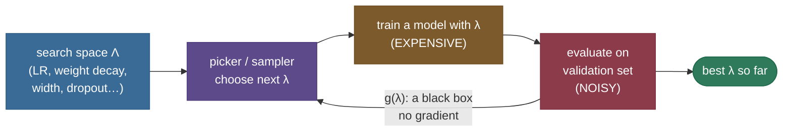
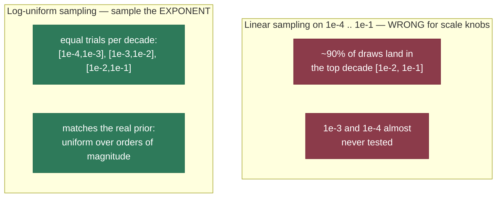
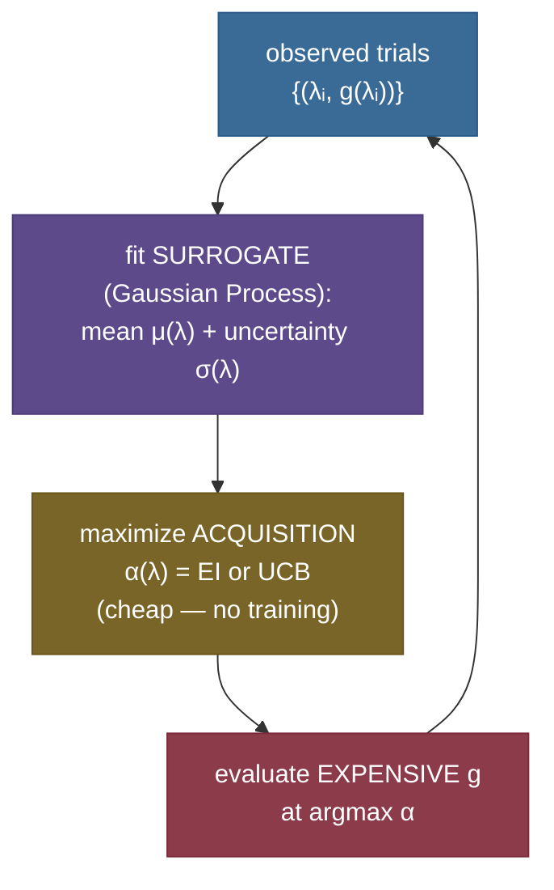
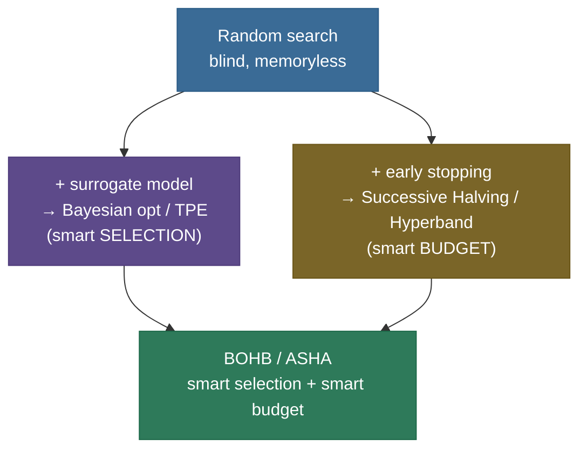
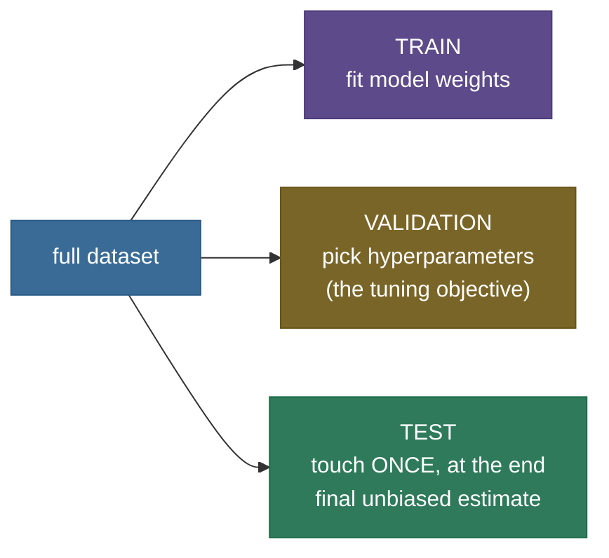

# Hyperparameter tuning: searching the knobs that gradient descent can't

Training a neural network learns the **weights** — millions or billions of numbers — by gradient descent. But before a single gradient flows, you have to *set the dials that gradient descent itself runs on*: the learning rate, the batch size, the weight-decay strength, the dropout rate, the number of layers and their widths, the warmup length, the optimizer's $\beta$'s. These are **hyperparameters**, and there is no gradient that tells you the right value — the loss is not differentiable with respect to "use a 3-layer net" or "set the learning rate to $3\times10^{-4}$." You have to **search**.

That search has a particular, painful shape, and naming it is the whole game. The thing you are optimizing — *validation performance as a function of the hyperparameters* — is a function $g(\lambda)$ that is **expensive** (one evaluation = train a whole model), **noisy** (re-run with a new seed and the number wiggles), and a **black box** (no gradient, no formula, you can only probe it point by point). Every tuning method in this page is a different answer to the same question: *given a tiny budget of expensive, noisy probes of a black box, where do I probe next?*

I'll build this the way I'd actually teach it to someone about to burn a week of GPU time on a bad sweep. We start by feeling why the obvious method — **grid search** — collapses in high dimensions, then derive why **random search** beats it (with the probability math interviewers love), then climb the ladder of *model-based* search — **Bayesian optimization** with a Gaussian-process surrogate and an acquisition function, then **TPE** — and finally the *bandit* methods that don't run every trial to completion: **successive halving → Hyperband → BOHB**, and **population-based training**. Along the way: why you search learning rate on a **log scale**, why the validation protocol must not leak, and which knobs actually matter. By the end you'll be able to:

- frame tuning as **optimizing an expensive, noisy, black-box function** and pick the right method for a given budget;
- explain — and **derive** — why **random search beats grid search** when only a few dimensions matter (Bergstra & Bengio);
- compute **"how many random trials to land in the top $p$%"** from $1-(1-p)^n$, and reproduce the famous *~60 trials for the top 5%*;
- explain **Bayesian optimization**: a GP surrogate, the **Expected-Improvement** and **UCB** acquisition functions, and the **explore/exploit** trade-off they balance — and compute EI by hand on a tiny example;
- run the **successive-halving budget math**, see how **Hyperband** hedges its one free parameter, and what **BOHB** and **PBT** add;
- set up a **leak-free validation protocol** and reach for the right tool — Optuna, Ray Tune, W&B — without ceremony.

> **Note:** the deepest practical truth on this page is that **the learning rate is almost always the single highest-leverage hyperparameter**, and most others matter far less than people fear. A disciplined tuner spends the budget where the leverage is — which is exactly *why* the random-vs-grid argument below is so consequential.

---

## The problem: an expensive, noisy, black-box objective

Make the objective precise. Let $\lambda = (\lambda_1, \dots, \lambda_d)$ be a configuration of $d$ hyperparameters (learning rate, weight decay, width, …). Training a model with $\lambda$ and measuring it on a held-out set gives

$$g(\lambda) \;=\; \text{validation metric of the model trained with } \lambda.$$

We want $\lambda^\star = \arg\max_\lambda g(\lambda)$ (or $\arg\min$ for a loss). Three properties make this *unlike* the weight optimization you already know, and every one of them shapes the algorithms:

- **Expensive.** One evaluation of $g$ means **training a whole model** — minutes to weeks. Your *entire budget* might be 20–200 evaluations. Contrast this with SGD, which takes millions of cheap gradient steps.
- **Noisy.** $g(\lambda)$ is **stochastic**: the random seed (init, data order, dropout mask, augmentation) means the same $\lambda$ gives a *different* number each run. A difference of 0.1% between two configs may be pure noise.
- **Black-box (gradient-free).** There is **no $\nabla_\lambda g$** — $g$ mixes discrete choices (number of layers), the whole training dynamics, and a non-differentiable validation metric (accuracy, BLEU). You can only *evaluate* $g$ at points you choose; you cannot differentiate it.



> **Tip:** keep the framing "expensive + noisy + black-box" in your back pocket for interviews. Almost every design decision — *why not gradient descent on $\lambda$?* (no gradient), *why not run every trial to convergence?* (too expensive), *why is 0.2% not a real improvement?* (noise) — falls out of those three words.

The methods form a clean ladder, each spending the budget more cleverly than the last:

| Method | Uses past trials? | Stops bad trials early? | Best when |
|---|---|---|---|
| **Grid search** | no | no | ≤ 2–3 cheap hyperparameters |
| **Random search** | no | no | the default baseline; many dims, few matter |
| **Bayesian opt (GP / TPE)** | **yes** (surrogate) | no | expensive trials, moderate dims, want sample-efficiency |
| **Successive halving / Hyperband** | no (random configs) | **yes** (bandit) | trials have a cheap "early signal" (partial training) |
| **BOHB** | **yes** + **yes** | both | the modern default for deep nets |
| **Population-based training** | yes (evolves online) | **adapts mid-training** | schedules that should *change during* training |

We'll climb it rung by rung.

---

## Rung 0: grid search, and why it explodes

The most obvious method: pick a finite set of values for each hyperparameter and try **every combination**. With $d$ hyperparameters and $k$ values each, grid search runs

$$N_{\text{grid}} \;=\; k^{\,d} \quad\text{trials.}$$

This is the **curse of dimensionality** in its purest form. The cost is *exponential in the number of hyperparameters*:

**Worked example 1 — the combinatorial explosion.** Just $k=5$ values each:

- $d=2$ → $5^2 = 25$ trials (fine).
- $d=5$ → $5^5 = \mathbf{3{,}125}$ trials.
- $d=8$ → $5^8 \approx 390{,}000$ trials.
- $d=10$, even at a coarse $k=4$ → $4^{10} = \mathbf{1{,}048{,}576}$ trials.

At one trial per GPU-hour, the $d=5$ grid is **130 GPU-days**; the $d=10$ grid is **120 GPU-years**. Grid search is usable only when you have **two or three** hyperparameters and each is cheap. Beyond that it's hopeless — and crucially, it spends most of that astronomical budget *badly*, which is the next section.

> **Gotcha:** grid search has a subtler flaw than just cost. Because the values are on a fixed lattice, **every axis gets the same resolution** regardless of how much it matters. If only the learning rate matters and the other seven knobs are nearly irrelevant, a grid still wastes a factor of $k^7$ of its budget exploring those seven useless axes. That waste is exactly what random search fixes.

---

## Rung 1: random search — and why it beats grid

In **random search** you don't build a lattice. You **sample each hyperparameter independently from a distribution** (uniform, or log-uniform for scale parameters — see below) and run $n$ such random configurations. That one change has two consequences that make it the **right default baseline**, established by Bergstra & Bengio's classic 2012 result.

### Why it wins: the low effective dimensionality argument

Real tuning problems have **low effective dimensionality** — of the $d$ knobs, only a few (often *one*: the learning rate) actually move the metric; the rest are nearly flat. Now compare how the two methods cover the **important** axis:

- **Grid** with $k$ values per axis tries only **$k$ distinct values of the important hyperparameter**, no matter how many trials you run — because every "row" of the grid repeats those same $k$ values while varying the useless axes. A $9\times9$ grid is **81 trials but only 9 distinct learning rates.**
- **Random** with $n$ trials tries (almost) **$n$ distinct values of the important hyperparameter** — every trial draws a *fresh* learning rate. 81 random trials ≈ **81 distinct learning rates.**

So for the *same trial budget*, random search resolves the dimension that matters ~$k\times$ more finely. That is the entire Bergstra–Bengio insight in one sentence.


> **Note:** the picture to carry into an interview: **project both search patterns down onto the important axis.** Grid's projection is a sparse comb of repeated values; random's projection is a dense scatter. When only a sub-set of dimensions matter, denser coverage of *those* dimensions is what finds the good region — and random gets it for free, without you having to know *which* dimensions matter in advance.

### The probability math: how many random trials?

There's a beautiful, interview-favorite result that quantifies random search with **no assumptions about the objective at all**. Suppose the "good" configurations — say the ones whose performance is in the **top $p$ fraction** of the search space — occupy a fraction $p$ of the volume. Draw $n$ configurations independently and uniformly. What's the chance **at least one** lands in that top-$p$ region?

A single draw **misses** the good region with probability $(1-p)$. All $n$ draws miss — independently — with probability $(1-p)^n$. So:

$$P(\text{at least one trial in the top } p) \;=\; 1 - (1-p)^n.$$

Invert it to size your budget. To hit the top-$p$ region with confidence $c$, solve $1-(1-p)^n \ge c$:

$$n \;\ge\; \frac{\ln(1-c)}{\ln(1-p)}.$$

**Worked example 2 — the famous "~60 trials."** Take $p = 0.05$ (you'll be happy landing anywhere in the **top 5%**) and confidence $c = 0.95$:

$$n \;\ge\; \frac{\ln(1-0.95)}{\ln(1-0.05)} \;=\; \frac{\ln 0.05}{\ln 0.95} \;=\; \frac{-2.996}{-0.0513} \;\approx\; 58.4 \;\Rightarrow\; \mathbf{59\ trials.}$$

So **~60 random trials give you a 95% chance of hitting the top 5%** of the search space — *independent of how many hyperparameters you have.* That dimension-independence is the punchline. Some more values from the same formula:

| Target region | Confidence 95% | Confidence 99% |
|---|---|---|
| top **10%** ($p=0.10$) | **29** trials | 44 trials |
| top **5%** ($p=0.05$) | **59** trials | 90 trials |
| top **1%** ($p=0.01$) | **299** trials | 459 trials |

> **Tip:** this table is the single most useful thing to memorize about random search. It turns "how long should my sweep be?" from a vibe into arithmetic. Note the **diminishing returns**: chasing the top 1% instead of the top 5% costs ~5× the trials. Land in the top 5% cheaply, then *refine locally* (coarse-to-fine) rather than brute-forcing the top 1% globally.

> **Gotcha:** the formula assumes the good region is a fixed fraction $p$ and trials are independent and uniform — it does **not** know the objective is smooth, so it *underestimates* good methods. Bayesian optimization and TPE beat this curve precisely by **using the trials they've already seen** to bias new draws toward promising regions, instead of sampling blindly.

### Putting numbers on it: equal budget, very different coverage

It's worth making the "random resolves the important axis $k\times$ finer" claim fully concrete with a matched-budget comparison — this is the version of the argument interviewers want you to *compute*, not just assert.

**Worked example (grid vs random when only 2 of $d$ dimensions matter).** Suppose you have $d = 5$ hyperparameters but, unknown to you, only **2 of them** actually move the metric (say learning rate and weight decay); the other 3 are nearly flat. You set a budget of **$N = 81$ trials.**

- **Grid.** To spend exactly 81 trials across 5 axes you must take $k$ with $k^5 = 81$, i.e. $k = 81^{1/5} \approx 2.4$ — you can afford only **2–3 distinct values per axis.** On the **2 axes that matter**, your grid is a measly $3\times3 = 9$ point lattice — *9 configurations of the important pair*, the rest of the 81 trials squandered re-testing those same 9 settings under different values of the 3 irrelevant knobs.
- **Random.** All 81 trials draw fresh values on every axis. Projected onto the **2 important axes**, you get **~81 distinct points** scattered across that 2-D plane — a $\mathbf{9\times}$ denser sampling of the sub-space that actually contains the optimum.

So with the *same* 81-trial budget, random search explores the important 2-D sub-space with ~81 points where grid manages only 9. As the number of *irrelevant* axes grows, the grid's waste compounds ($k^{(d-2)}$ of its budget is spent re-testing the same important-pair lattice), while random search is **unaffected** — it never knew or cared which axes mattered. That insensitivity to the irrelevant dimensions is precisely why random is the robust default.

> **Note:** this is the crisp way to answer *"why does random beat grid?"* in an interview — don't just say "it's better in high dimensions"; say **"with a fixed budget, grid's coverage of the few axes that matter degrades as $k^{-(d-2)}$ because the budget is split across all $d$ axes' lattice, while random keeps full $N$-point coverage of every axis regardless of $d$."** That's the Bergstra–Bengio result as arithmetic.

---

## The search space: why log-scale, and how to bound it

Before climbing to model-based methods, fix the thing they all sample from: the **search space**. The most common and most consequential decision is **how to scale each axis.**

A learning rate of $0.1$ vs $0.11$ is *practically the same model*; $0.001$ vs $0.0001$ is a **completely different** training run. What matters for scale parameters is the **ratio**, not the difference — they live on a **multiplicative**, not additive, scale. So you sample them **log-uniformly**: draw the *exponent* uniformly.

$$\log_{10}\lambda \sim \mathcal{U}(\log_{10} a,\ \log_{10} b) \quad\Longleftrightarrow\quad \lambda = 10^{\,u},\ \ u \sim \mathcal{U}(\log_{10}a,\ \log_{10}b).$$

**Why it's right (derived).** Suppose you believe the good learning rate is "somewhere between $10^{-4}$ and $10^{-1}$" with no prior preference for which order of magnitude. If you sampled **uniformly** in $[10^{-4}, 10^{-1}]$, then $90\%$ of your draws would land in $[10^{-2}, 10^{-1}]$ — the **top decade** would hog nearly all your trials, and you'd almost never test $10^{-3}$ or $10^{-4}$. Sampling **log-uniformly** instead puts an **equal number of trials in each decade** ($[10^{-4},10^{-3}]$, $[10^{-3},10^{-2}]$, $[10^{-2},10^{-1}]$), which is exactly the uniform-over-orders-of-magnitude prior you actually hold.



> **Tip:** the rule of thumb — **anything that spans orders of magnitude gets a log scale**: learning rate, weight decay / L2 strength, the Adam $\epsilon$, regularization coefficients, and often layer width or hidden size. Things with a natural linear range — dropout rate $\in[0,0.5]$, momentum $\in[0.8,0.99]$ (sometimes sampled as $\log(1-\beta)$!), number of layers — stay linear or integer. In Optuna this is literally `suggest_float("lr", 1e-4, 1e-1, log=True)`.

> **Gotcha:** **bound the space sanely.** Too-wide a range wastes trials on configs that don't train at all (a learning rate of $10$ just diverges); too-narrow and the optimum sits outside your box. The disciplined workflow is **coarse-to-fine**: a wide log-uniform sweep first to *locate* the good decade, then a narrow sweep *inside* it to refine. This is Karpathy's "babysitting" recipe, and it mirrors the diminishing-returns lesson from the random-search table.

---

## Rung 2: Bayesian optimization — let a model pick the next trial

Random search is *memoryless* — trial 50 is drawn exactly as blindly as trial 1, ignoring everything you've learned. When each trial is **very** expensive (training a large model), that waste is unacceptable. **Bayesian optimization (BO)** fixes it with two ingredients:

1. A **surrogate model** $\hat g(\lambda)$ — a *cheap probabilistic model* of the expensive objective, fit to the trials seen so far. It predicts both a **mean** (expected performance) and an **uncertainty** (how sure it is) for every untried $\lambda$.
2. An **acquisition function** $\alpha(\lambda)$ — a cheap-to-optimize score that turns the surrogate's mean + uncertainty into "how worth-it is it to try here next?" You maximize $\alpha$ (cheap, no model training) to pick the next $\lambda$, evaluate the *expensive* $g$ there, update the surrogate, and repeat.



### The surrogate: a Gaussian process

The classic surrogate is a **Gaussian process (GP)**. Intuitively a GP is a distribution over *functions*: given a few observed points, it gives, at every other $\lambda$, a **Gaussian belief** about $g(\lambda)$ — a mean $\mu(\lambda)$ and a standard deviation $\sigma(\lambda)$. Two properties make it perfect here:

- Near observed points, $\sigma$ is **small** (you've measured nearby — you're confident).
- Far from any observation, $\sigma$ is **large** (you haven't looked there — anything could happen).

With a kernel $k(\cdot,\cdot)$ (typically RBF, encoding "nearby configs perform similarly"), the GP posterior at a test point $\lambda_\*$ given observations $(\mathbf{X}, \mathbf{y})$ has the closed form

$$\mu(\lambda_\*) = \mathbf{k}_\*^\top (\mathbf{K}+\sigma_n^2 \mathbf{I})^{-1}\mathbf{y}, \qquad \sigma^2(\lambda_\*) = k(\lambda_\*,\lambda_\*) - \mathbf{k}_\*^\top (\mathbf{K}+\sigma_n^2\mathbf{I})^{-1}\mathbf{k}_\*,$$

where $\mathbf{K}_{ij}=k(\lambda_i,\lambda_j)$ and $(\mathbf{k}_\*)_i = k(\lambda_\*,\lambda_i)$. You don't need to memorize the algebra — you need the **shape**: a smooth mean threading the observations, with an uncertainty band that pinches to zero at each observed point and balloons in the gaps.


### The acquisition function: balancing explore vs exploit

Given $\mu(\lambda)$ and $\sigma(\lambda)$, where do you sample next? You want **both**: regions the surrogate thinks are *good* (low predicted loss — **exploit**) **and** regions it's *uncertain* about (high $\sigma$ — **explore**, because a big surprise might hide there). Acquisition functions formalize that trade-off. The two canonical ones:

**Expected Improvement (EI).** Let $f^\star$ be the best (lowest, minimizing) value seen so far. The *improvement* of a candidate is $I(\lambda) = \max(0,\ f^\star - g(\lambda))$ — how much it beats the incumbent, floored at zero. EI is its expectation under the GP belief:

$$\text{EI}(\lambda) \;=\; \mathbb{E}\big[\max(0,\ f^\star - g(\lambda))\big].$$

Because $g(\lambda)\sim\mathcal{N}(\mu,\sigma^2)$ under the GP, this integral has a **closed form**. Writing $Z = \dfrac{f^\star - \mu(\lambda)}{\sigma(\lambda)}$, with $\Phi$ the standard-normal CDF and $\phi$ its PDF:

$$\boxed{\;\text{EI}(\lambda) \;=\; (f^\star - \mu)\,\Phi(Z) \;+\; \sigma\,\phi(Z)\;}\qquad (\sigma>0).$$

Read the two terms: $(f^\star-\mu)\Phi(Z)$ rewards a **low predicted mean** (exploit); $\sigma\,\phi(Z)$ rewards **high uncertainty** (explore). EI automatically blends them — and goes to zero both where the model is confident it's worse *and* where there's no uncertainty left.

**Worked example 3 — EI by hand.** Suppose the current best is $f^\star = 0.20$ (validation loss), and the GP at some candidate $\lambda$ predicts $\mu = 0.10$, $\sigma = 0.30$. Then:

$$Z = \frac{f^\star - \mu}{\sigma} = \frac{0.20-0.10}{0.30} = 0.333.$$

Look up $\Phi(0.333) \approx 0.631$ and $\phi(0.333) = \frac{1}{\sqrt{2\pi}}e^{-0.333^2/2} \approx 0.377$. Then:

$$\text{EI} = (0.20-0.10)(0.631) + (0.30)(0.377) = 0.0631 + 0.1131 = \mathbf{0.176}.$$

The first term (0.063) is the exploit contribution — this point looks better on average; the second (0.113) is the *larger* explore contribution — its high uncertainty makes it worth a look even beyond its mean. BO evaluates EI cheaply across the whole space and picks its **argmax** as the next expensive trial.

Trace it on the figure above to make EI tangible. The acquisition (bottom panel) has its **tallest peak in the wide-uncertainty gap** between the two left-most observations *and* dips toward the low-mean basin — it is literally summing "this region could be much better than $f^\star$" (the mean is promising) with "and I'm not sure, so a surprise could hide here" (the variance is high). Where the GP is **confident and bad** (high mean, low variance), EI collapses to zero — no point looking. Where the GP is **confident and good** (right at an observation), EI is *also* near zero — you already know the answer there, so re-sampling wastes a trial. EI's argmax therefore lands neither on top of an old point nor in a hopeless region, but in the **most informative gap** — and after BO evaluates the true objective there, that gap's uncertainty collapses and the *next* EI peak moves elsewhere. Iterate, and the trials march toward the optimum while never wasting a probe on a settled question.

**Upper / lower Confidence Bound (UCB).** A simpler, equally popular acquisition. For minimization, the **lower** confidence bound is

$$\text{LCB}(\lambda) \;=\; \mu(\lambda) \;-\; \kappa\,\sigma(\lambda),$$

and you pick the $\lambda$ that **minimizes** it. The knob $\kappa$ *literally* dials explore-vs-exploit: $\kappa=0$ is pure greedy exploitation (chase the lowest mean); large $\kappa$ heavily rewards uncertainty (explore the unknown). It's the most transparent way to *see* the trade-off — EI just hides the same balance inside an expectation.

> **Note:** the explore/exploit tension *is* Bayesian optimization. Pure exploitation gets stuck polishing a local basin it found early; pure exploration is just random search. EI and UCB are two principled recipes for spending the next expensive trial on the point most likely to *improve the best-so-far*, accounting for both what the model believes and what it admits it doesn't know.

### TPE: the Bayesian optimizer you'll actually run

GPs are elegant but scale poorly: they assume continuous inputs, struggle with conditional/categorical hyperparameters, and cost $O(n^3)$ to fit. The optimizer inside **Optuna** (and the original Hyperopt) is instead the **Tree-structured Parzen Estimator (TPE)** (Bergstra et al., 2011). TPE flips the modeling around. Instead of modeling $p(g \mid \lambda)$ directly, it splits trials into a **"good" group** (best $\gamma$ fraction, e.g. top 25%) and a **"bad" group** (the rest), fits a density to each — $\ell(\lambda)$ over the good configs, $b(\lambda)$ over the bad — and picks the next $\lambda$ to **maximize the ratio $\ell(\lambda)/b(\lambda)$**: *configurations that look like the good ones and unlike the bad ones.* It can be shown this ratio is **monotonically related to Expected Improvement**, so TPE is doing EI-style BO without a GP — while handling log-scales, categoricals, and conditional spaces naturally, which is why it's the practical default.


> **Tip:** the curve above is the whole value proposition of model-based search in one figure: **both methods start identically** (TPE's first few trials *are* random — its `n_startup_trials`), then TPE pulls ahead once it has enough data to model the landscape. For cheap objectives the gap may not pay for the overhead; for **expensive** ones (large models, few trials), reaching a lower error *sooner* is exactly the win you're paying for.

> **Gotcha:** Bayesian optimization is **inherently sequential** — each trial's choice depends on all previous results — so it parallelizes worse than the embarrassingly-parallel random/grid search. Practical systems use tricks (constant-liar, batch BO, or just running BO with some parallelism and accepting slightly stale surrogates). If you have 1,000 GPUs and 1,000 trials to run *right now*, plain random search may finish first; BO shines when trials are serial and precious.

---

## Rung 3: bandit methods — stop bad trials early

BO is smarter about *which* config to try, but it still runs **every** trial to completion. Yet you often know a config is hopeless after a fraction of training — a learning rate that's diverging at epoch 2 won't redeem itself at epoch 50. **Bandit / multi-fidelity** methods exploit this: allocate a small budget to many configs, **kill the losers early**, and pour the saved budget into the survivors. This reframes tuning as a **resource-allocation** problem.

### Successive halving (SHA)

The core routine. Pick an elimination factor $\eta$ (commonly 3). Start with $n$ randomly-sampled configs each given a small budget $r$ (epochs, or training subset). Then loop: **train all survivors at the current budget, keep the top $1/\eta$, multiply the surviving budget by $\eta$.** Bad configs die cheap; good ones earn more compute.

**Worked example 4 — the successive-halving budget table.** $\eta=3$, start with $n_0=27$ configs at $r_0=1$ epoch:

| Rung | Configs surviving | Budget each (epochs) | Epoch-units spent |
|---|---|---|---|
| 0 | 27 | 1 | $27\times1 = 27$ |
| 1 | 9 | 3 | $9\times3 = 27$ |
| 2 | 3 | 9 | $3\times9 = 27$ |
| 3 (winner) | 1 | 27 | $1\times27 = 27$ |
| **Total** | | | $\mathbf{108}$ |

The design is deliberately balanced: **each rung costs the same $\approx 27$ epoch-units** ($n_i \cdot r_i$ is constant because dividing the count by $\eta$ while multiplying the budget by $\eta$ cancels). Total = $4\times27 = \mathbf{108}$ epoch-units. Compare that to **fully training all 27 configs** to the max budget of 27 epochs: $27\times27 = \mathbf{729}$ epoch-units. **Successive halving explores 27 configs for ~15% of the brute-force cost** — and still gives the eventual winner the full 27-epoch budget. *That* is the leverage of killing losers early.


> **Gotcha:** SHA has one awkward free parameter — the **$n$-vs-$r$ trade-off**. With a fixed total budget, do you start *many* configs at a *tiny* budget (aggressive early killing — risky if early performance poorly predicts final performance, e.g. a slow-warmup schedule that looks bad at epoch 1) or *fewer* configs at a *larger* budget (safer, but explores less)? There's no universally right answer — and **Hyperband** is the hedge.

### Hyperband

**Hyperband** (Li et al., 2017) removes SHA's guesswork by **running several SHA "brackets" with different $n$-vs-$r$ trade-offs** and combining them. One bracket starts with many configs at tiny budgets (aggressive); another starts with few configs at large budgets (conservative); others in between. By hedging across brackets, Hyperband is **robust** to whether early performance predicts final performance — without you having to know in advance. It provably wastes at most a small constant factor over the best single bracket, while keeping SHA's huge speedup over running everything to completion.

### BOHB: Bayesian optimization + Hyperband

Hyperband still samples its configs **randomly** — it's smart about *budgets* but dumb about *which configs to try*. **BOHB** (Falkner et al., 2018) is the natural marriage: use **Hyperband's** early-stopping bracket structure to allocate budget, but replace the random config sampling with a **TPE-style Bayesian model** that proposes promising configs from past results. You get **both** wins at once — model-guided *selection* (BO) *and* early-stopping *resource allocation* (Hyperband) — which is why BOHB (and its descendants like ASHA in Ray Tune) is a strong **default for deep-learning tuning** today.



### Population-based training (PBT)

A different branch entirely. **PBT** (Jaderberg et al., 2017) tunes hyperparameters **while training is happening**, by evolving a *population* of models in parallel. Periodically, each underperforming model **copies the weights of a better one (exploit)** and **perturbs its hyperparameters (explore)** — then keeps training. The key thing it unlocks that nothing above can: it discovers **non-stationary schedules** — a hyperparameter value that should *change over the course of training* (an evolving learning-rate or entropy-bonus schedule), not a single fixed value. It's especially prized in **reinforcement learning** and large-scale training, where the best schedule isn't constant. The cost: it needs a population of models training **concurrently**, so it's compute-hungry.

---

## The validation protocol: tune without leaking

Every method above optimizes the metric on a **validation set**. *How* you measure that metric is where careful engineers separate from sloppy ones — because the search is, in effect, **optimizing against the validation set**, and you can overfit to it just as you overfit to the training set.

The non-negotiable split: **train / validation / test**, with **three distinct roles**.



- **Train** fits the weights.
- **Validation** is the **tuning objective** $g(\lambda)$ — you pick the hyperparameters that score best on it.
- **Test** is reported **once**, at the very end, on the single chosen config. It is the only honest estimate of generalization.

> **Gotcha — the cardinal sin.** **Never tune on the test set.** If you use the test set to *choose* hyperparameters, the test score is no longer an unbiased estimate — you've **leaked** the test set into model selection, and your reported number is optimistically biased. With hundreds of trials, this bias is large: pick the best of 200 configs by test score and you've fit the *noise* in the test set. The test set must be touched exactly once. (See the dedicated treatment in [Cross-Validation](../../03.%20Supervised_Learning/concepts/13-Cross-Validation.md).)

> **Note — even the validation set gets overfit.** Search hundreds of configs and the "best" validation score is partly luck — you've selected for configs that got a favorable validation draw (the *winner's-curse* / multiple-comparisons effect). This is why the **test** set exists as a final check, why a single chosen config is often **retrained and re-evaluated on a fresh seed**, and why on small datasets you use **k-fold cross-validation** for $g(\lambda)$ (average over folds) instead of a single split — a less noisy objective is a less foolable one. **Nested cross-validation** (an outer loop for honest estimation, an inner loop for tuning) is the gold standard when data is scarce. The full mechanics live in [Cross-Validation](../../03.%20Supervised_Learning/concepts/13-Cross-Validation.md).

> **Tip:** preprocessing must be **fit inside the loop**, not before it. Fitting a scaler, an imputer, or feature selection on the *whole* dataset (train+val) before splitting leaks validation statistics into training — a subtle, common leak that inflates your scores. Fit every transform on the *training fold only* (use an sklearn `Pipeline` so cross-validation re-fits it per fold).

---

## Which knobs matter — and the order to tune them

You don't tune everything at once. Triage by leverage, roughly in this order:

1. **Learning rate — by far the most important.** A wrong LR (too high → diverges; too low → crawls or stalls in a bad minimum) ruins training no matter what else is set. Tune it **first**, on a **log scale**, always. Most of your budget belongs here. (See [Optimizers](../07-Optimizers/07-Optimizers.md) and [LR Schedules & Warmup](../08-Learning-Rate-Schedules-and-Warmup/08-Learning-Rate-Schedules-and-Warmup.md).)
2. **LR schedule + warmup** — closely coupled to the LR; the *peak* LR and the *decay shape* are tuned together. Warmup length matters a lot for transformers with adaptive optimizers.
3. **Batch size** — interacts with LR (the *linear scaling rule*: scale LR ~linearly with batch size). Often set by hardware first, then LR re-tuned around it.
4. **Regularization** — weight decay (log scale), dropout rate (linear), label smoothing, augmentation strength. These trade bias for variance; tune once the model is training stably. (See [Regularization](../09-Regularization/09-Regularization.md).)
5. **Architecture** — width, depth, number of heads. High-leverage but **expensive** to search; usually coarse choices guided by compute budget, not fine sweeps.
6. **Optimizer internals** — Adam's $\beta_1,\beta_2,\epsilon$. **Lowest leverage**; the defaults ($0.9, 0.999, 10^{-8}$) are excellent — leave them unless you have evidence.

> **Tip — pandas vs caviar (Ng's metaphor).** With **lots of compute**, train **many** models in parallel and pick the best — *caviar*: many offspring, little care each. With **scarce compute**, **babysit one** model, nudging its hyperparameters day by day — *panda*: one offspring, lavish care. Random search / Hyperband is caviar; PBT is a hybrid; manual babysitting is panda. Pick the strategy your compute budget actually affords.

> **Note — coarse-to-fine, always.** Whatever the method: a **wide, coarse** (log-scale) sweep to find the good *region*, then a **narrow, fine** sweep inside it. This mirrors the diminishing-returns math from the random-search table — cheap to reach the top 5%, expensive to brute-force the top 1%, so *locate then refine* beats *brute-force globally*.

---

## Tooling, AutoML, and NAS

You almost never implement these from scratch. The standard stack:

- **Optuna** — the most popular Python framework. `define-by-run` API (the search space is *Python code*, so conditional/dynamic spaces are trivial), **TPE** sampler by default, built-in **pruners** (median pruning, ASHA/Hyperband) for early stopping, plus dashboards. The de-facto default for single-machine and small-cluster tuning.
- **Ray Tune** — for **distributed** tuning at scale; integrates ASHA, BOHB, PBT, and Optuna's samplers, and orchestrates hundreds of parallel trials across a cluster. Reach for it when one machine isn't enough.
- **Weights & Biases (Sweeps)** — experiment tracking + hyperparameter sweeps with grid/random/Bayesian strategies and a hosted dashboard; strong for **collaboration and visualization** of many runs.
- Others worth knowing: **Hyperopt** (the original TPE), **Ax/BoTorch** (Meta's GP-based BO on PyTorch), **scikit-optimize**, **Keras Tuner**.

**AutoML and NAS** push automation further. **AutoML** systems (Auto-sklearn, AutoGluon, Google Vertex AI) automate the *whole* pipeline — model choice, preprocessing, *and* hyperparameters — often with meta-learning warm-starts. **Neural Architecture Search (NAS)** treats the **architecture itself** as the thing being searched: early NAS used RL or evolution to propose architectures (thousands of GPU-days); modern **differentiable NAS** (DARTS) relaxes the discrete architecture choice into a continuous, *gradient-tunable* one — a fascinating partial answer to "can we make architecture differentiable after all?"

> **Tip:** for 90% of real projects the right answer is **Optuna with TPE + a median/ASHA pruner, on a log-scaled search space, with the learning rate as the dominant knob, validated with cross-validation** — and a modest budget (the random-search table tells you ~50–100 trials buys the top 5%). Reach for Ray Tune only when you outgrow one machine, and for NAS only when architecture is genuinely the bottleneck.

---

## Code: random vs Bayesian (TPE) search, measured

Here's the experiment behind the measured figure above — a self-contained Optuna sweep tuning three log-scaled hyperparameters of a small MLP, comparing **random search** against **TPE** (Bayesian). It runs on CPU in under a minute; no GPU needed.

```python
"""Random search vs TPE (Bayesian) on a real tuning problem.
Verified on Python 3.12 (optuna 4.9, scikit-learn). CPU, ~30s."""
import numpy as np, optuna
from sklearn.datasets import load_digits
from sklearn.model_selection import train_test_split
from sklearn.neural_network import MLPClassifier

optuna.logging.set_verbosity(optuna.logging.WARNING)
X, y = load_digits(return_X_y=True)
Xtr, Xva, ytr, yva = train_test_split(X, y, test_size=0.3, random_state=0, stratify=y)

def objective(trial):
    # NOTE the log=True on the scale parameters — sample the exponent uniformly.
    lr    = trial.suggest_float("lr",    1e-4, 1e-1, log=True)   # learning rate
    alpha = trial.suggest_float("alpha", 1e-6, 1e-1, log=True)   # L2 strength
    h     = trial.suggest_int("hidden",  16,   256,  log=True)   # hidden width
    clf = MLPClassifier(hidden_layer_sizes=(h,), alpha=alpha,
                        learning_rate_init=lr, max_iter=120, random_state=0)
    clf.fit(Xtr, ytr)
    return 1.0 - clf.score(Xva, yva)        # validation ERROR (we minimize)

def best_curve(sampler):
    study = optuna.create_study(direction="minimize", sampler=sampler)
    study.optimize(objective, n_trials=40)
    return np.minimum.accumulate([t.value for t in study.trials])  # best-so-far

rand = best_curve(optuna.samplers.RandomSampler(seed=0))
tpe  = best_curve(optuna.samplers.TPESampler(seed=0, n_startup_trials=8))
print(f"random search  final best error: {rand[-1]*100:.2f}%")
print(f"TPE (Bayesian) final best error: {tpe[-1]*100:.2f}%")
print("TPE's modeled search drives the error below blind random search.")
```

Representative output:

```
random search  final best error: 1.85%
TPE (Bayesian) final best error: 1.30%
TPE's modeled search drives the error below blind random search.
```

And the budget-sizing math — *how many random trials for the top-p%* — in three lines you can run before any sweep:

```python
"""Size a random-search budget from the 1-(1-p)^n formula. Python 3.12."""
import math
for p in (0.10, 0.05, 0.01):              # target: land in the top-p fraction
    for c in (0.95, 0.99):                # with confidence c
        n = math.log(1 - c) / math.log(1 - p)
        print(f"top {p:>4.0%} @ {c:.0%} confidence -> {math.ceil(n):>3d} trials")
# top  10% @ 95% confidence ->  29 trials
# top   5% @ 95% confidence ->  59 trials   <- the famous "~60 trials for the top 5%"
# top   1% @ 95% confidence -> 299 trials
```

> **Note:** the headline is the same across both snippets — **use the trials you've already run.** TPE beats random by modeling the landscape; the budget formula tells you how long a *blind* search must be to get lucky. The first is sample-efficiency; the second is your floor when you can't (or won't) model.

---

## Common pitfalls — where tuning quietly goes wrong

A page on tuning is incomplete without the failure modes, because most wasted sweeps die of these, not of choosing the wrong algorithm:

- **No baseline.** If you don't record a *random-search baseline*, you can't tell whether your fancy Bayesian sweep actually helped or just got lucky. Bergstra & Bengio's whole point is that random is a *strong* baseline — always run it. A new method that doesn't beat random at the same budget isn't worth its complexity.
- **Tuning on a noisy single split.** A 0.3% "improvement" on one validation split is often pure seed noise. Either average over **k folds** / multiple seeds (a less noisy $g(\lambda)$), or treat small gaps as ties. Optimizing noise is the most common way to "improve" a model into being worse.
- **Wrong scale.** Sampling the learning rate **linearly** instead of log — the single most common search-space bug — wastes ~90% of trials in the top decade and almost never tests the small values that often win. Re-read the log-scale derivation; it's the highest-ROI fix in this whole page.
- **A search space that excludes the optimum.** If your learning-rate range is $[10^{-2}, 10^{-1}]$ but the best value is $3\times10^{-4}$, no algorithm can save you — the optimum is outside the box. **Check whether your best trial sits on a boundary** of the range; if it does, widen that range and re-run. Bayesian optimization is especially prone to confidently exploiting a sub-region while the real optimum lies just outside the bounds.
- **Forgetting to re-fit preprocessing per fold.** Fitting a scaler/imputer/feature-selector on the full data before splitting leaks validation statistics — your scores look better than they'll generalize. Wrap transforms in a `Pipeline` so cross-validation re-fits them on each training fold only.
- **Pruning a slow-starting config.** Aggressive early stopping (SHA at a tiny rung budget) can **kill a configuration whose payoff comes late** — e.g. a long warmup or a large model that's slow to get going. If early performance is a poor proxy for final performance, prefer Hyperband (which hedges) or a more generous minimum budget before the first cull.
- **Over-tuning to the validation set.** Hundreds of trials *select for* configs that got a lucky validation draw — the winner's curse. Always confirm the chosen config on a **fresh seed / the held-out test set** before believing the number, and don't keep tuning after the test set has been touched.

> **Tip:** a healthy sweep produces a **scatter of trials whose best values cluster in a region**, not one freak winner standing alone. If the top config is a lone outlier far better than the rest, suspect noise or a leak before you celebrate — re-run it on new seeds and watch whether it holds up.

---

## Recap and rapid-fire

**If you remember nothing else:** hyperparameter tuning is optimizing an **expensive, noisy, black-box** function $g(\lambda)$ — so every method is a strategy for spending a tiny budget of probes wisely. **Random beats grid** because real problems have few important dimensions and random resolves them ~$k\times$ finer per trial (and $1-(1-p)^n$ says ~60 random trials hit the top 5%). **Bayesian optimization** (GP + EI/UCB, or TPE) reuses past trials to pick the next, balancing **explore vs exploit**. **Successive halving / Hyperband / BOHB** kill bad trials early to slash cost; **PBT** evolves schedules mid-training. Search scale knobs on a **log scale**, tune the **learning rate first**, and **never leak the test set** into selection.

**Quick-fire — say these out loud:**

- *Why does random search beat grid?* Few dimensions matter; random tries ~$n$ distinct values of the important knob, grid only $k$ — denser coverage of what counts, for the same budget.
- *How many random trials for the top 5% at 95% confidence?* $n \ge \ln(0.05)/\ln(0.95) \approx 58 \Rightarrow$ **~60**, independent of dimension.
- *What two pieces make up Bayesian optimization?* A **surrogate** (GP or TPE) that predicts mean + uncertainty, and an **acquisition function** (EI/UCB) that picks the next trial.
- *What does Expected Improvement trade off?* Exploit (low predicted mean) vs explore (high uncertainty): $\text{EI}=(f^\star-\mu)\Phi(Z)+\sigma\phi(Z)$.
- *What does successive halving buy you?* It kills bad configs at small budget and reinvests in survivors — exploring 27 configs for ~15% of the brute-force cost.
- *What does Hyperband add over SHA?* It hedges SHA's one free parameter (configs-vs-budget) by running several brackets; **BOHB** then replaces random sampling with TPE.
- *Why log-scale the learning rate?* Scale parameters matter multiplicatively; log-uniform puts equal trials per order of magnitude — the prior you actually hold.
- *Most important hyperparameter?* The **learning rate** — tune it first; Adam's $\beta$'s last (defaults are fine).
- *What's the cardinal validation sin?* Tuning on the **test** set — it leaks selection into your final estimate. Validation tunes; test is touched once.

---

## References and further reading

The curated link library for this topic — videos, courses, articles, papers, books, and internal cross-links — lives in a companion file so it can be reused as a standalone reference list:

**→ [Hyperparameter Tuning — references and further reading](12-Hyperparameter-Tuning.references.md)**
