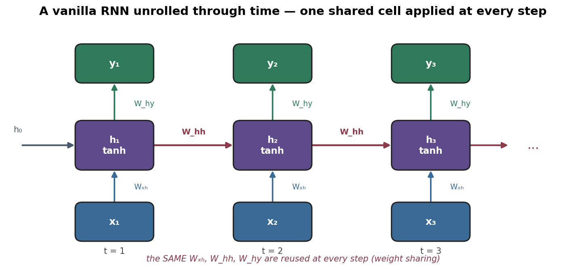
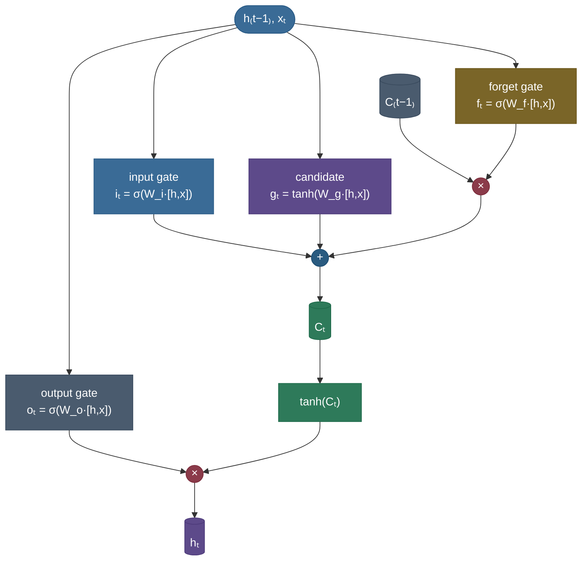
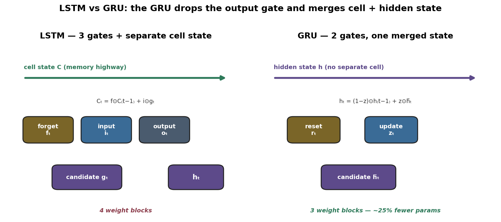
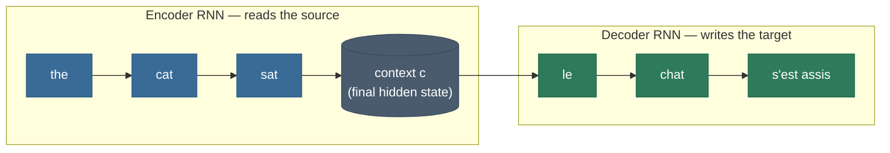
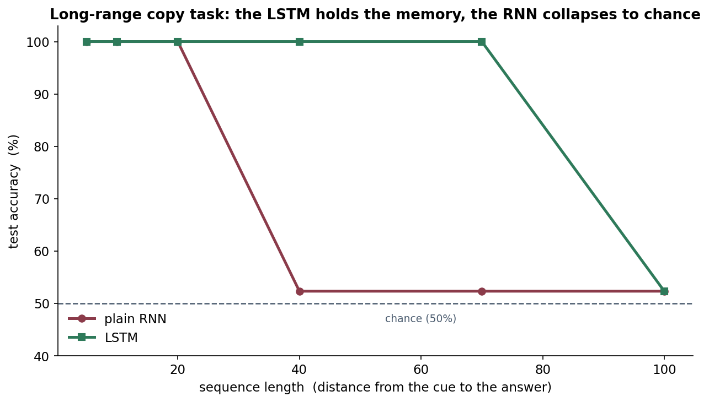

# RNNs, LSTMs, and GRUs: networks with memory

Imagine reading a mystery novel one word at a time through a slot in a door — you can see exactly one word, and the only thing you may carry forward is whatever you can scribble on a single index card. To understand the sentence "the **detective** who interviewed the suspects last week finally **confessed**," by the time you reach *confessed* you must still have, on that card, the fact that the subject was *detective* — even though many words went by in between. A **recurrent neural network** is exactly this: a small network that walks a sequence one element at a time, carrying a fixed-size "index card" — its **hidden state** — that it rewrites at every step. The whole story of this page is about how good that card is at holding a fact across a long gap, and the surprisingly deep reason a *plain* RNN's card smears to nothing after a dozen words while an **LSTM**'s card can hold a fact for hundreds.

A feedforward network sees a fixed-size input all at once and has no notion of *order* or *history*. But language, speech, time series, sensor streams, and DNA are **sequences** — the meaning of each element depends on what came before, and the sequences come in *different lengths*. RNNs handle this by adding the one thing feedforward nets lack: **a memory that persists across time, with weights shared across every step.** The catch is that plain RNNs *forget*: the same repeated multiplication that powers them makes gradients vanish over long ranges, so they cannot connect distant events. **LSTMs** and **GRUs** fix this with **gated memory** — learnable valves that decide what to keep, forget, and output — and that gating is what let recurrent nets dominate sequence modeling from the mid-1990s until transformers arrived in 2017.

I'm going to teach this the way I'd actually explain it to a teammate who knows feedforward nets and backprop but has never traced a recurrence: feel the *problem* first (why sequences break a normal net), build the **vanilla RNN** and its **unrolled graph**, *derive* **backpropagation through time** and from it *derive* exactly **why gradients vanish or explode through time** (this is the heart of the topic), then build the **LSTM** gate by gate and *derive* the **constant error carousel** that fixes it, simplify to the **GRU**, and finish with the architectures built on top (bidirectional, stacked, seq2seq), why transformers replaced RNNs, and the modern recurrent revival (Mamba). By the end you'll be able to:

- write the RNN recurrence with correct **shapes**, and explain **weight sharing** across time and the **unrolled** computational graph;
- **derive BPTT** — the gradient of the loss w.r.t. the shared $W_{hh}$ as a sum over timesteps with the through-time product $\partial h_t/\partial h_k = \prod W_{hh}^\top \mathrm{diag}(\tanh')$;
- **derive** the vanishing/exploding-gradient-through-time result from that product (spectral radius × tanh-derivative bound), and explain why it caps a vanilla RNN's effective memory;
- explain **truncated BPTT** and **gradient clipping**, and *which* problem each solves;
- derive every **LSTM gate** and the **cell-state update**, and *derive* why the **additive** cell path ($\partial c_t/\partial c_{t-1}\approx f_t$, not a repeated matmul) is a gradient highway;
- derive the **GRU** and compare LSTM vs GRU (params, speed, performance);
- explain **bidirectional**, **stacked**, and **seq2seq** RNNs, **teacher forcing / exposure bias**, and the **fixed-context bottleneck** that motivated [attention](../15-Attention-Mechanism/15-Attention-Mechanism.md);
- reason about **RNN vs transformer** trade-offs and the **state-space-model** (S4/Mamba) revival;
- implement an RNN/LSTM/GRU cell from scratch (matching PyTorch to ~1e-8) and **measure** the long-range gradient and a copy-task gap in code.

Intuition and pictures first, then the math (derived, with sources), then runnable, verified code.

> **Note:** the single idea that connects all of this to the rest of deep learning is **repeated multiplication**. An RNN applies the *same* recurrent weight matrix at every time step, so processing a length-$T$ sequence is exactly like a $T$-layer-deep network with **shared** weights — and it inherits the [vanishing/exploding gradient](../06-Vanishing-Exploding-Gradients/06-Vanishing-Exploding-Gradients.md) problem, just along the **time** axis. LSTMs solve it the same way [residual connections](../18-Residual-Skip-Connections/18-Residual-Skip-Connections.md) do: with an **additive** path instead of a multiplicative one. Hold onto that — half this page is one theme stated three ways.

---

## The problem: sequences need order, memory, and length-independence

Why not just flatten a sequence and feed it to a feedforward net, or slide a [CNN](../13-CNNs-and-Convolution/13-CNNs-and-Convolution.md) over it? Three reasons, and an RNN is built to answer all three at once:

- **Variable length.** Sentences, audio clips, and time series differ in length. A dense layer has a *fixed* input width; you'd have to pad/truncate to a maximum and waste capacity, and you still couldn't gracefully handle a sequence longer than the max. An RNN processes **one element per step for as many steps as there are**, so length is a non-issue.
- **Order matters.** "dog bites man" $\neq$ "man bites dog." A bag-of-words representation throws order away; the model's representation must *depend on the sequence order*. An RNN reads left-to-right, so order is baked into the computation.
- **Long-range memory.** The subject of a sentence can determine a verb 20 words later; a stock's level today depends on a shock last month. The model must **carry** information across the gap. An RNN's hidden state is precisely that carrier — and how far it can carry is the central question of this page.

A CNN does share weights and handles some locality, but its receptive field is fixed and local; to reach 50 tokens back you need many layers. An RNN gives **unbounded context in principle** through a single recurrent state — which is elegant, and also exactly where the trouble starts.

---

## What an RNN is

At each time step $t$, an RNN combines the current input $x_t$ with the previous hidden state $h_{t-1}$ to produce a new hidden state, and (optionally) an output:

$$h_t = \tanh\!\big(W_{hh}\,h_{t-1} + W_{xh}\,x_t + b_h\big), \qquad y_t = W_{hy}\,h_t + b_y$$

Read it plainly: **the new memory is a squashed mix of the old memory and the new input.** The $\tanh$ keeps the state bounded in $(-1,1)$ so it can't blow up just from being iterated. Three weight matrices and two biases are *the entire model* — and crucially they are **the same at every time step**.

**Shapes (the part interviews probe).** Let $x_t\in\mathbb{R}^{d_x}$ (input dim) and $h_t\in\mathbb{R}^{d_h}$ (hidden dim, a.k.a. number of units). Then:

| symbol | shape | role |
|---|---|---|
| $W_{xh}$ | $d_h \times d_x$ | maps input → hidden |
| $W_{hh}$ | $d_h \times d_h$ | maps previous hidden → hidden (the **recurrent** matrix) |
| $W_{hy}$ | $d_y \times d_h$ | maps hidden → output |
| $b_h$ | $d_h$ | hidden bias |
| $h_t$ | $d_h$ | the state carried forward |

The recurrent matrix $W_{hh}$ is **square** ($d_h\times d_h$) — that squareness is what lets the state feed back into itself, and it's also the matrix whose repeated multiplication causes vanishing/exploding gradients. The total parameter count, $d_h d_x + d_h^2 + d_y d_h + d_h + d_y$, is **independent of sequence length** — that's weight sharing buying you length-independence.

> **Note:** $h_0$ (the initial state) is usually set to zeros, but it can be learned or supplied. In a [seq2seq](#seq2seq-the-encoderdecoder-and-the-bottleneck-that-birthed-attention) decoder, $h_0$ is the encoder's final state — that's literally how the encoder hands the decoder its summary of the input.

### Weight sharing and the unrolled graph

The same $W_{xh}, W_{hh}, W_{hy}$ are applied at **every** step. "Unrolling" the recurrence over time turns the loop into a feedforward-looking chain — one *layer* per time step, but all layers **tied** to the same weights:



This picture is the key mental model for everything that follows. Two consequences fall right out of it:

1. **Training is just backprop on this unrolled graph** — that's [BPTT](#the-math-derived-bptt-and-why-rnns-forget), below.
2. **Depth equals sequence length.** A 100-token sequence is a 100-layer-deep tied network. Everything you know about deep nets being hard to train — [vanishing/exploding gradients](../06-Vanishing-Exploding-Gradients/06-Vanishing-Exploding-Gradients.md) — applies, *amplified*, because the same matrix is reused at every "layer."

> **Tip:** the **same** cell is drawn three times in the figure on purpose — there is physically one set of weights. "Unrolling" is a *bookkeeping* device for backprop, not three separate networks. In code, you write the cell once and call it in a Python loop.

> *Where this comes from: the Elman RNN — hidden state recurrence with shared weights — is **Finding Structure in Time** (Elman 1990). Jordan's earlier net fed the *output* back; Elman fed the *hidden state* back, which is the form universally used today. See references.*

---

## Intuition: the index card you keep rewriting

Picture the **index card** from the opening. At each word you (a) read the card (the old state $h_{t-1}$), (b) read the new word ($x_t$), (c) tear up the card and write a fresh summary that blends the two, and (d) optionally announce a prediction $y_t$. The catch is *how* you blend: a vanilla RNN **multiplies the old card by $W_{hh}$ and squashes** every single step. If $W_{hh}$ shrinks things (the typical case), then a fact written 20 cards ago has been multiplied-and-squashed 20 times — it's a faint smudge, and the gradient that would teach the network to *preserve* it is an even fainter smudge. The LSTM's trick, foreshadowing the math, is to give the card a **protected region that is updated by erase-and-add rather than multiply-and-squash** — so a fact can sit there untouched for hundreds of steps.

A second classic intuition (from Karpathy's *Unreasonable Effectiveness of RNNs*): an RNN is a **program with a fixed-size scratchpad** that runs one step per input symbol. Trained on text, the scratchpad spontaneously learns counters — e.g. a neuron that tracks "am I inside a quote/parenthesis?" — because the loss rewards predicting the matching close-symbol. That's memory being *used*, not just stored.

---

## Why it matters

For two decades, "model a sequence" essentially meant "use a gated RNN." LSTMs powered Google's machine translation, speech recognition (the acoustic models behind Siri and Google Voice), handwriting recognition, and image captioning. Even now that transformers dominate NLP, the *concepts* here are load-bearing interview material and recur everywhere: the **additive-memory / gradient-highway** idea reappears in [residual connections](../18-Residual-Skip-Connections/18-Residual-Skip-Connections.md), [normalization](../11-Normalization/11-Normalization.md), and modern **state-space models** (Mamba). And RNNs' **$O(1)$-per-step state** keeps them genuinely competitive for *streaming*, *on-device*, and *very-long-sequence* settings where a transformer's growing [KV cache](../../09.%20LLMs/05-KV-Cache/05-KV-Cache.md) is too expensive. Understanding *why* RNNs forget — and *how* gating fixes it — is understanding a recurring pattern of deep learning, not a museum piece.

---

## How it works: one step, then the loop

Concretely, here is one step for a vanilla RNN, with shapes annotated:

1. **Affine combine** the previous state and current input: $a_t = W_{hh}h_{t-1} + W_{xh}x_t + b_h \in \mathbb{R}^{d_h}$.
2. **Squash**: $h_t = \tanh(a_t)$ — elementwise, keeps the state bounded.
3. **Read out** (if this step produces an output): $\hat y_t = \text{softmax}(W_{hy}h_t + b_y)$ for classification, or just the affine for regression.
4. **Carry** $h_t$ to the next step and repeat.

The output pattern depends on the task — RNNs are flexible about *when* they read out:

| pattern | reads out | example |
|---|---|---|
| **one-to-many** | one input → sequence of outputs | image captioning (image → words) |
| **many-to-one** | sequence → one output | sentiment classification (review → label) |
| **many-to-many (aligned)** | output at every step | part-of-speech tagging, language modeling |
| **many-to-many (seq2seq)** | input seq → output seq, different lengths | translation (encoder–decoder) |

That flexibility is the same cell wired differently; the recurrence never changes.

### Language modeling: the many-to-many readout, concretely

The aligned many-to-many pattern is worth tracing because it's how RNNs *generate* text (Karpathy's char-RNN) and it's the direct ancestor of how LLMs decode. Train the RNN to predict the **next** token at every position: feed $x_t$, read out $\hat y_t = \text{softmax}(W_{hy}h_t + b_y)$ — a distribution over the vocabulary — and apply cross-entropy against the true next token $x_{t+1}$. At **training** time you feed the real sequence (teacher forcing). At **generation** time you run a loop: feed a token, sample from $\hat y_t$ (greedy, or with a temperature), feed the sampled token back as the next input, and repeat — the hidden state carries the entire generated context forward in a fixed-size vector. That sample-and-feed-back loop is *exactly* the autoregressive decode loop a modern LLM runs; the only thing that changed is the cell (RNN → transformer block) and the addition of a [KV cache](../../09.%20LLMs/05-KV-Cache/05-KV-Cache.md) to avoid recomputing the past. Understanding the RNN version makes the transformer version obvious.

> **Note:** because the RNN's context lives entirely in the $O(1)$-size hidden state, generation is *constant memory per step* — no growing cache. That's the streaming advantage the RNN-vs-transformer table below makes precise.

---

## The math, derived: BPTT and why RNNs forget

This is the section that *is* the topic. We'll derive backpropagation through time, then squeeze the vanishing/exploding-gradient result directly out of it.

### BPTT (backpropagation through time), derived

Training minimizes a total loss summed over the output steps: $\mathcal{L} = \sum_{t} \mathcal{L}_t(\hat y_t, y_t)$. "BPTT" is nothing more exotic than **ordinary backprop applied to the unrolled graph** — but because $W_{hh}$ is *shared* across all steps, its gradient is a **sum of contributions from every step**.

Focus on the recurrent matrix $W_{hh}$ (the interesting one). The hidden state $h_t$ depends on $W_{hh}$ **directly** (the $W_{hh}h_{t-1}$ term at step $t$) and **indirectly** (through $h_{t-1}$, which depended on $W_{hh}$ too, and so on back to $h_1$). Apply the multivariate chain rule across all the paths and you get the canonical BPTT formula:

$$\frac{\partial \mathcal{L}}{\partial W_{hh}} \;=\; \sum_{t=1}^{T} \sum_{k=1}^{t} \frac{\partial \mathcal{L}_t}{\partial h_t}\,\underbrace{\frac{\partial h_t}{\partial h_k}}_{\text{through time}}\,\frac{\partial^{+} h_k}{\partial W_{hh}}$$

where $\partial^{+} h_k/\partial W_{hh}$ is the **immediate** (direct) dependence of $h_k$ on $W_{hh}$ holding $h_{k-1}$ fixed. The middle factor $\partial h_t/\partial h_k$ — how a *late* state depends on an *early* state — is where everything happens, because it is itself a **product over the intervening steps**:

$$\frac{\partial h_t}{\partial h_k} \;=\; \prod_{j=k+1}^{t} \frac{\partial h_j}{\partial h_{j-1}} \;=\; \prod_{j=k+1}^{t} \underbrace{W_{hh}^{\top}\,\mathrm{diag}\!\big(\tanh'(a_j)\big)}_{\text{the recurrent Jacobian } J_j}$$

Each factor is the **Jacobian of one step**: differentiate $h_j=\tanh(W_{hh}h_{j-1}+\dots)$ w.r.t. $h_{j-1}$ and you get $\mathrm{diag}(\tanh'(a_j))\,W_{hh}$ (transposed when we propagate gradients backward). So the gradient that flows from step $t$ back to step $k$ is multiplied by **$(t-k)$ copies of essentially the same matrix.** That product is the villain.

> **Gotcha:** people loosely say "the gradient gets multiplied by $W_{hh}$ many times." Be precise in an interview: it's multiplied by $W_{hh}^\top \mathrm{diag}(\tanh'(a_j))$ each step — the **tanh derivative** matters as much as the matrix. Since $\tanh'(\cdot)=1-\tanh^2(\cdot)\in(0,1]$ and is $\ll 1$ whenever the unit is saturated, the diagonal factor *also* shrinks the gradient. Both terms push toward vanishing.

### Why the gradient vanishes or explodes through time, derived

Take norms of the through-time product. Using the submultiplicative property $\|AB\|\le\|A\|\,\|B\|$:

$$\left\|\frac{\partial h_t}{\partial h_k}\right\| \;\le\; \prod_{j=k+1}^{t} \big\|W_{hh}^{\top}\big\|\,\big\|\mathrm{diag}(\tanh'(a_j))\big\| \;\le\; \big(\,\gamma\,\sigma_{\max}\,\big)^{\,t-k}$$

where $\sigma_{\max}$ is the **largest singular value** (spectral norm) of $W_{hh}$ and $\gamma=\max_j\|\tanh'(a_j)\|\le 1$. Let $\rho$ denote the controlling factor (essentially the spectral radius of $W_{hh}$ scaled by the tanh-derivative bound). Then the gradient over a lag of $\Delta = t-k$ steps scales like:

$$\left\|\frac{\partial h_t}{\partial h_k}\right\| \sim \rho^{\,\Delta}$$

and there are the two regimes Bengio/Pascanu pinned down:

- **$\rho < 1$ → vanishing.** $\rho^\Delta \to 0$ **exponentially** in the lag. A gradient that should teach the network "the word 40 steps ago matters" arrives as $\sim \rho^{40}\approx 0$ — no learning signal survives. This is the **common case**, because $\tanh' \le 1$ and a well-conditioned $W_{hh}$ has $\sigma_{\max}\approx 1$, so the product drifts below 1 and decays. **This is why vanilla RNNs forget.**
- **$\rho > 1$ → exploding.** $\rho^\Delta \to \infty$. Gradients blow up, weights take a giant step, the loss goes to NaN. Less common than vanishing but more dramatic — and, mercifully, easier to fix (clip it; see below).

The effect on *modeling*, not just optimization: a vanishing through-time gradient means the network **cannot learn dependencies longer than its effective memory horizon** — empirically only ~10–20 steps for a vanilla $\tanh$ RNN. It's not that the forward pass *can't* carry information that far in principle; it's that **gradient descent never gets a usable signal to set the weights that would carry it.**


> *Where this comes from: the vanishing/exploding-gradient-through-time analysis is **Learning long-term dependencies with gradient descent is difficult** (Bengio et al. 1994); the singular-value / spectral-radius characterization and the gradient-clipping fix are **On the difficulty of training recurrent neural networks** (Pascanu et al. 2013); **Deep Learning** (Goodfellow et al.) Ch. 10 is the textbook treatment. See references.*

> **Note:** the *forward* signal and the *backward* gradient share the same fate but they are distinct claims. Forward: the contribution of $x_k$ to $h_t$ is also $\sim\rho^\Delta$, so distant inputs barely move the late state. Backward: the gradient is $\sim\rho^\Delta$, so distant inputs barely get trained. Interviewers like you to name both.

### Truncated BPTT and gradient clipping — two fixes for two problems

These are commonly confused; keep them straight:

- **Truncated BPTT** is about **cost, not vanishing.** Backpropagating through a 10,000-step sequence is expensive and memory-heavy, so you process the sequence in chunks of, say, $k$ steps: carry the hidden state *forward* across chunks, but only backpropagate gradients $k$ steps back, then detach. It bounds compute and memory and *incidentally* sidesteps the worst of vanishing (you weren't going to learn 10k-step dependencies anyway), but it does **not** create long-range memory — it just stops pretending to.
- **Gradient clipping** is the fix for the **exploding** side. If $\|g\| > \tau$, rescale $g \leftarrow \tau\,g/\|g\|$ (clip by *norm*, the Pascanu recipe). It caps the step size so a single large recurrent Jacobian product can't NaN your training. It does **nothing** for vanishing — clipping a tiny gradient leaves it tiny.

> **Gotcha:** clipping fixes explosion, **gating** (LSTM/GRU) fixes vanishing. They attack opposite ends and are routinely used *together*: an LSTM trained with gradient clipping is a perfectly standard setup (and exactly what the copy-task code below does).

---

## A worked example: the lag kills it (by hand)

Make the abstract product concrete. Suppose the recurrent Jacobian has typical magnitude $\rho \approx 0.8$ per step (a contractive RNN). The through-time gradient over a lag $\Delta$ scales like $0.8^{\Delta}$:

- lag $\Delta = 5$: $0.8^{5} \approx 0.33$ — still a usable signal.
- lag $\Delta = 20$: $0.8^{20} \approx 0.012$ — barely a whisper.
- lag $\Delta = 50$: $0.8^{50} \approx 1.4\times10^{-5}$ — **gone**; no learning of a dependency this long.

An LSTM with forget gate $f\approx 1$ instead keeps $\partial c_t/\partial c_{t-1}\approx 1$, so the product is $1^{50}=1$ — the gradient survives intact. *Same sequence, opposite ability to remember.* The runnable version below (Worked Example 3) measures this on real matrices and confirms $\|J^\Delta g\|\approx \rho^\Delta$ at every lag.

---

## LSTM: a gated memory cell

The **Long Short-Term Memory** unit fixes forgetting with two ideas working together: a separate **cell state** $c_t$ that runs straight down the timeline as a protected memory (the *constant error carousel*), and **gates** — sigmoid-valued valves in $(0,1)$ that learn, per-dimension, how much to let through. Here is the full cell:


The same cell as a data-flow graph (gates feed the cell-state highway, which feeds the gated output):



### The gates, derived one by one

Write $[h_{t-1}, x_t]$ for the concatenation of the previous hidden state and the current input. Each gate is an affine map of that concatenation followed by a nonlinearity. There are four such maps:

$$
\begin{aligned}
f_t &= \sigma\big(W_f\,[h_{t-1}, x_t] + b_f\big) && \textbf{forget gate} \;\;(\text{how much old memory to keep})\\
i_t &= \sigma\big(W_i\,[h_{t-1}, x_t] + b_i\big) && \textbf{input gate} \;\;(\text{how much new content to write})\\
g_t &= \tanh\big(W_g\,[h_{t-1}, x_t] + b_g\big) && \textbf{candidate} \;\;(\text{the new content itself}, \in(-1,1))\\
o_t &= \sigma\big(W_o\,[h_{t-1}, x_t] + b_o\big) && \textbf{output gate} \;\;(\text{how much of the cell to expose})
\end{aligned}
$$

The three **gates** ($f,i,o$) use $\sigma$ so they live in $(0,1)$ — they are soft, differentiable on/off switches, applied **elementwise**, so each of the $d_h$ memory cells is gated independently. The **candidate** $g_t$ uses $\tanh$ because it's *content* (a signed value to maybe store), not a gate. These drive the two updates that are the whole point:

$$\boxed{\,c_t = f_t \odot c_{t-1} \;+\; i_t \odot g_t\,} \qquad\qquad h_t = o_t \odot \tanh(c_t)$$

where $\odot$ is elementwise (Hadamard) product. Read the cell update as **English**: "*keep $f_t$ of what I had, add $i_t$ of what's new.*" The hidden output is "*expose $o_t$ of the (squashed) cell.*" If $f_t=1, i_t=0$ for some dimension, that memory cell is **copied forward untouched** — a perfect 1-step memory. If $f_t=0$, it's wiped. The gates *learn*, from data, when to do which.

> **Note:** the cell state $c_t$ is the long-term memory (it can hold a value for hundreds of steps); the hidden state $h_t$ is the **filtered view** of it that the rest of the network (and the next step's gates) sees. Two states is the defining feature of an LSTM versus an RNN or GRU.

### The constant error carousel, derived

Here is the derivation that justifies the entire architecture. Differentiate the cell update w.r.t. the previous cell state:

$$\frac{\partial c_t}{\partial c_{t-1}} \;=\; \mathrm{diag}(f_t)$$

— because $c_t = f_t\odot c_{t-1} + (\text{stuff not involving } c_{t-1})$, and the derivative of the elementwise product $f_t\odot c_{t-1}$ w.r.t. $c_{t-1}$ is just $\mathrm{diag}(f_t)$. (To be exact, $f_t,i_t,g_t$ *also* depend on $c_{t-1}$ through $h_{t-1}$, giving small extra terms; the **dominant** path — the one the architecture is designed around — is this direct $\mathrm{diag}(f_t)$.) Now chain it across a lag:

$$\frac{\partial c_t}{\partial c_k} \;\approx\; \prod_{j=k+1}^{t} \mathrm{diag}(f_j)$$

**Compare to the vanilla RNN's $\prod W_{hh}^\top\mathrm{diag}(\tanh')$.** The LSTM's through-time product is **elementwise multiplication by forget gates** — *no repeated matrix multiply, no tanh-derivative squashing.* If the forget gate stays near 1 (the network has learned to *remember* this dimension), then $\prod f_j \approx 1$ and the gradient flows back across **arbitrarily many steps without vanishing.** That additive-update-with-a-near-identity-Jacobian is the **constant error carousel** (CEC) — Hochreiter & Schmidhuber's name for the protected path where error (gradient) circulates without decay.

This is *exactly* the residual-connection $+1$ trick, on the time axis: an additive skip path whose Jacobian is (near) identity, so gradients have an unobstructed highway. The flat LSTM curve in the gradient-vs-lag figure above is this derivation, measured.

> **Tip:** initialize the **forget-gate bias to ~1** (so $f_t$ starts near 1, since $\sigma(\text{large})\approx 1$). This makes the LSTM *remember by default* at the start of training, before it has learned anything — a standard, free win (Jozefowicz et al. 2015). It is exactly what makes the LSTM curve in the figures flat. Worth volunteering in an interview.

> **Gotcha:** the LSTM does **not** make vanishing impossible — it makes it **learnable**. If the data wants a dimension to forget, the network sets $f_t<1$ there and that memory *does* decay (correctly). The win is that the network can *choose* a near-1 forget gate where long memory is needed — selectively, per-dimension, per-step — which a vanilla RNN's single shared $W_{hh}$ cannot do.

> *Where this comes from: the LSTM cell and the constant-error-carousel argument are **Long Short-Term Memory** (Hochreiter & Schmidhuber 1997); the now-standard forget gate was added by **Gers et al. 2000**; Chris Olah's "Understanding LSTM Networks" is the canonical illustrated walk-through. See references.*

---

## GRU: a lighter gated unit

The **Gated Recurrent Unit** (Cho et al. 2014) asks: do we need *two* states and *three* gates? It merges the cell and hidden states into one $h_t$, and uses just **two** gates:

$$
\begin{aligned}
r_t &= \sigma\big(W_r\,[h_{t-1}, x_t]\big) && \textbf{reset gate} \;\;(\text{how much past to use when forming the candidate})\\
z_t &= \sigma\big(W_z\,[h_{t-1}, x_t]\big) && \textbf{update gate} \;\;(\text{how much to keep vs. overwrite})\\
\tilde h_t &= \tanh\big(W_h\,[\,r_t \odot h_{t-1},\; x_t\,]\big) && \textbf{candidate} \;\;(\text{reset applied inside})\\
h_t &= (1 - z_t)\odot h_{t-1} \;+\; z_t \odot \tilde h_t && \textbf{convex blend of old and new}
\end{aligned}
$$

The final line is the crucial one — and notice it's still **additive**: $h_t$ is a *convex combination* of the old state and the new candidate, weighted by the update gate. Its through-time Jacobian is $\partial h_t/\partial h_{t-1}\approx \mathrm{diag}(1-z_t)$ (plus candidate terms), so when $z_t\approx 0$ the state is carried forward nearly unchanged — the **same gradient-highway mechanism** as the LSTM, achieved with one fewer gate. The **reset gate** $r_t$ lets the candidate *ignore* the past when forming new content (useful at sequence boundaries). The single $z$ does the job the LSTM splits between $f$ and $i$: keeping $z$ small keeps memory; large $z$ overwrites it.



### LSTM vs GRU

| | **LSTM** | **GRU** |
|---|---|---|
| **Gates** | 3 (forget, input, output) | 2 (reset, update) |
| **States** | 2 (cell $c$ + hidden $h$) | 1 (hidden $h$) |
| **Weight blocks** | 4 ($W_f,W_i,W_g,W_o$) | 3 ($W_r,W_z,W_h$) |
| **Params (≈)** | $4 d_h(d_h+d_x)$ | $3 d_h(d_h+d_x)$ — **~25% fewer** |
| **Speed** | slower (more compute/step) | faster |
| **Expressiveness** | slightly higher (separate cell, output gate) | slightly lower |
| **When to reach for it** | long, complex dependencies; when you can afford it | default for speed / smaller data; often matches LSTM |

Empirically they're close. Chung et al. (2014) found neither dominates across tasks; GRUs often train a bit faster and do as well, especially on smaller datasets, while LSTMs occasionally edge ahead on very long, complex dependencies. **One-line answer:** *GRU is the lighter default (2 gates, fewer params, faster); LSTM is marginally more expressive (3 gates, separate cell). Try GRU first; reach for LSTM if you need the extra capacity.*

> *Where this comes from: the GRU is **Learning Phrase Representations using RNN Encoder–Decoder** (Cho et al. 2014); the LSTM-vs-GRU head-to-head is **Empirical Evaluation of Gated RNNs** (Chung et al. 2014). See references.*

---

## What the gates actually learn, and which variants survived

It's tempting to think the four LSTM gates are interchangeable knobs, but **ablation studies pin down what each contributes** — and the answer is sharp. Greff et al. (2017), "LSTM: A Search Space Odyssey," systematically removed and modified pieces of the LSTM across many tasks. The verdict:

- **The forget gate is the most important component** — removing it (or its bias init) hurts the most. This is the gradient-highway gate; without it the cell either never forgets (saturates) or can't hold memory, exactly as the CEC derivation predicts.
- **The output gate is second** — it controls what the rest of the network sees and lets the cell hold a value that is *not* yet exposed.
- **The input/forget coupling** (as in the GRU's single $z$, or "coupled input-forget" LSTM variants) barely changes performance — which is precisely why the GRU's merge of $i$ and $f$ into one update gate works so well.
- Several "obvious" additions — **peephole connections** (let the gates also see $c_{t-1}$ directly) and various nonlinearity swaps — **don't reliably help.** The vanilla 1997-plus-forget-gate LSTM is hard to beat.

So the standard LSTM you'd implement today is, essentially, the *result of those ablations* — the parts that earn their place. A few variants are worth knowing by name:

| variant | change | when it matters |
|---|---|---|
| **Vanilla LSTM (+ forget gate)** | the standard 4-gate cell above | the default; what `nn.LSTM` gives you |
| **Peephole LSTM** | gates also read $c_{t-1}$ | precise timing tasks (rarely needed) |
| **Coupled input–forget** | $i_t = 1 - f_t$ (one gate) | a step toward the GRU; fewer params |
| **GRU** | merge cell+hidden, 2 gates | speed / smaller data — covered above |
| **ConvLSTM** | replace the matmuls with **convolutions** | spatiotemporal data (video, radar, weather) — keeps spatial structure in the state |

> **Note:** the empirical lesson generalizes beyond LSTMs: **the additive-memory path is the load-bearing idea, and the exact gating recipe is forgiving.** That's why the GRU (fewer gates) and even highway/residual nets (gated/ungated additive skips) all work — they share the highway, and differ only in the (less critical) gating details.

> **Gotcha:** a subtle real-world bug — `nn.LSTM` does **not** apply the forget-bias-init-to-1 trick by default (it initializes biases to 0). If your LSTM is slow to learn long dependencies, manually setting the forget-gate slice of the bias to ~1 (as the copy-task code does) is often the fix. Some frameworks bake it in; PyTorch doesn't.

---

## Stacking, direction, and sequence-to-sequence

The cell is a building block; three standard ways to wire many of them together:

### Bidirectional RNNs

A plain RNN reads left-to-right, so $h_t$ summarizes only the **past**. But for many tasks (tagging, NER, speech) the *future* disambiguates the present — "I read a **book**" vs "I want to **book** a flight" needs the words after *book*. A **bidirectional RNN** runs **two** RNNs, one forward and one backward, and concatenates their states: $h_t = [\overrightarrow{h_t};\, \overleftarrow{h_t}]$. Now each position sees the **whole** sequence. The cost: you need the full sequence up front, so bidirectional RNNs are for **offline** tasks — you can't run them in a streaming/online setting where the future hasn't arrived yet. (BERT's bidirectionality is the transformer analogue of this idea.)

### Stacked / deep RNNs

Just as you stack dense layers, you stack recurrent layers: layer 1's output sequence $h^{(1)}_{1:T}$ becomes layer 2's input sequence, and so on. Lower layers tend to learn local/short-range features, higher layers longer-range structure — depth in the *feature* hierarchy, on top of depth in *time*. Two to four layers is typical; more rarely helps and compounds the vanishing problem (now along **both** axes), so deep RNNs lean heavily on gating and sometimes residual connections between layers.

### Seq2seq: the encoder–decoder, and the bottleneck that birthed attention

For tasks where input and output are **different-length sequences** — translation, summarization, speech-to-text — Sutskever et al. (2014) introduced **sequence-to-sequence**: an **encoder** RNN reads the whole input and compresses it into its **final hidden state**, a single fixed-size vector $c$; a **decoder** RNN is initialized from $c$ and generates the output one token at a time, feeding each emitted token back as the next input.



This worked remarkably well — and exposed a glaring weakness. **The entire source sentence, however long, must be squeezed through one fixed-size vector $c$.** For a 40-word sentence, that's an information bottleneck: the decoder has to reconstruct everything from a single vector, and (because of the same vanishing dynamics) early source words are the first to be lost. Performance dropped sharply with input length.

The fix was **[attention](../15-Attention-Mechanism/15-Attention-Mechanism.md)** (Bahdanau et al. 2014): instead of one fixed $c$, let the decoder **look back at *all* the encoder states** at each output step and take a learned weighted average — a soft, content-based lookup over the whole source. That removed the bottleneck, and a few years later [the transformer](../16-Transformer-Architecture/16-Transformer-Architecture.md) dropped recurrence entirely and kept **only** attention. So this RNN bottleneck is, quite literally, the problem attention was invented to solve — the bridge from this page to the next two. (We don't re-derive attention here; see the [Attention Mechanism](../15-Attention-Mechanism/15-Attention-Mechanism.md) and [Transformer Architecture](../16-Transformer-Architecture/16-Transformer-Architecture.md) pages.)

### Teacher forcing and exposure bias

How do you *train* the decoder? At each step it should predict the next target token. **Teacher forcing** feeds the **ground-truth** previous token as input during training (rather than the model's own, possibly wrong, prediction). This stabilizes and speeds up training — every step gets a correct prefix to condition on. But it creates **exposure bias**: at inference the model must feed *its own* predictions back, a distribution it never saw in training, so one early mistake can compound (the model wanders into territory it was never taught to recover from). Mitigations include **scheduled sampling** (mix in the model's own predictions during training with growing probability) and sequence-level training objectives. The same teacher-forcing idea trains autoregressive transformers today — it's why training is one parallel pass but generation is a sequential loop.

> **Note:** teacher forcing is also *why a [KV cache](../../09.%20LLMs/05-KV-Cache/05-KV-Cache.md) isn't needed in training but is in generation* — training feeds the whole known target at once; generation feeds tokens back one at a time. The RNN-era distinction carries straight into modern LLMs.

---

## Where RNNs are used

- **Historically dominant (pre-2017).** Machine translation (seq2seq + attention powered Google Translate's 2016 neural system), speech recognition (LSTM acoustic models), handwriting recognition and generation (Graves 2013), image captioning (CNN encoder → LSTM decoder), and language modeling — the application that gave us Karpathy's char-RNN demos.
- **Time-series forecasting.** Demand, energy load, sensor, and financial series — LSTMs/GRUs remain common baselines, often competitive with fancier models on modest data.
- **Streaming / low-latency / on-device.** An RNN keeps an **$O(1)$-per-step** state; a transformer's [KV cache](../../09.%20LLMs/05-KV-Cache/05-KV-Cache.md) grows with context. For real-time speech, keyword spotting, and edge inference, that constant-memory recurrence is a real advantage.
- **Modern revival — state-space models.** The recurrent idea is back: **S4** (Gu et al. 2021) and **Mamba** (Gu & Dao 2023) are *linear* recurrences with a **selective** state that can be computed by a **parallel scan** — so training parallelizes like a transformer, *unlike* a classic RNN — while keeping **$O(1)$-per-step, linear-time** inference and very long effective context. They are, in spirit, RNNs that fixed both of the RNN's historical problems (the lack of training parallelism *and* the limited memory), and they're competitive with transformers on long-sequence tasks. If you understand "additive state + gating," you're most of the way to understanding why Mamba works.

> **Tip:** you won't reach for a vanilla RNN over a transformer for most NLP today, but the *concepts* are core interview material — BPTT, why RNNs forget (derive it!), the LSTM gates and CEC, the seq2seq bottleneck → attention story, and the RNN-vs-transformer trade-off. And the **gating / additive-memory** motif recurs everywhere modern.

---

## Why transformers replaced RNNs (and where RNNs still win)

The trade-off interviewers want, stated precisely:

| | RNN / LSTM / GRU | Transformer |
|---|---|---|
| **Parallelism over the sequence** | **none** — step $t$ needs step $t-1$ (inherently sequential) | full — all positions processed at once |
| **Training speed** | slow (can't parallelize the time loop) | fast — *the decisive advantage at scale* |
| **Long-range dependency** | hard (gradient still decays; gating only partly helps) | easy — direct attention to any position, $O(1)$ path length |
| **Compute / sequence length** | $O(n)$ (one step each) | $O(n^2)$ (attention over all pairs) |
| **Memory per step at inference** | **$O(1)$** state — cheap streaming | $O(n)$ [KV cache](../../09.%20LLMs/05-KV-Cache/05-KV-Cache.md), grows with context |
| **Path length between two tokens** | $O(n)$ (through the recurrence) | $O(1)$ (direct attention) |

Transformers won primarily because they **parallelize training** (you can throw a GPU cluster at one big matmul instead of a serial loop) and give **$O(1)$ path length** between any two tokens (direct long-range modeling). RNNs' remaining edges are **$O(1)$-per-step inference memory** (great for streaming/edge) and **$O(n)$ compute** vs. attention's $O(n^2)$ (which is why long-context efficiency is a whole research area). State-space models (Mamba) are the attempt to keep the RNN's inference advantages while recovering training parallelism via the parallel scan — the best of both, on the tasks where it works.

---

## The recurrent revival: state-space models and Mamba

The RNN had two fatal flaws — *no training parallelism* (the serial time loop) and *limited memory* (vanishing gradients). For a few years everyone assumed both were intrinsic to recurrence and switched to transformers. **State-space models (SSMs)** showed they aren't. The trick is to make the recurrence **linear**:

$$h_t = A\,h_{t-1} + B\,x_t, \qquad y_t = C\,h_t$$

No $\tanh$, no per-step nonlinearity inside the recurrence — just a linear map. Two payoffs fall out of linearity that a classic RNN cannot have:

1. **It's trainable in parallel via a scan.** A linear recurrence is an *associative* operation, so the whole sequence of states can be computed with a **parallel prefix scan** in $O(\log n)$ depth (like a parallel cumulative-sum) instead of a serial loop — training parallelizes like a transformer's matmul. The vanilla RNN's $\tanh$ is exactly what blocks this.
2. **Memory is controllable by design.** Choosing $A$'s eigenvalues sets the decay rate of memory analytically (the **HiPPO** initialization in **S4** picks $A$ so the state optimally compresses the whole history), so long-range memory is a *design choice*, not something gradient descent has to luckily discover.

**S4** (Gu et al. 2021) made this practical for very long sequences; **Mamba** (Gu & Dao 2023) added the missing piece: **selectivity.** Plain SSMs have *fixed* $A,B,C$ (the dynamics don't depend on the input), which limits them on content-dependent tasks like language. Mamba makes $B,C$ (and the step size) **functions of the input** — an input-dependent gate, in the same spirit as the LSTM's gates — recovering the ability to *selectively* remember or ignore tokens, while keeping a hardware-aware parallel scan. The result: **linear-time** training and **$O(1)$-per-step** inference (no growing KV cache) with context lengths that rival or exceed transformers on long-sequence tasks.

> **Note:** the through-line of this whole page lands here. Vanilla RNN: multiplicative, $\tanh$, vanishes. LSTM/GRU: **additive + input-dependent gates**, gradient highway. Mamba: **linear recurrence + input-dependent (selective) gates**, parallelizable highway. Each generation kept the additive/selective-memory idea and removed one more limitation. If you understand the LSTM's cell-state update, Mamba is the same idea with the nonlinearity moved *outside* the recurrence so it can be scanned.

> **Tip:** the interview-ready framing — *"SSMs are RNNs that dropped the in-recurrence nonlinearity so the recurrence becomes a parallel scan (fixing training speed), then added input-dependent selection (Mamba) to fix memory — keeping $O(1)$ streaming inference the whole time."* See **Mamba** (Gu & Dao 2023) in the references.

**The whole page in one table** — the through-time Jacobian $\partial(\text{state}_t)/\partial(\text{state}_{t-1})$ is what decides whether gradients survive, and it's the single line that distinguishes every model here:

| model | state update | through-time Jacobian | gradient survives long range? |
|---|---|---|---|
| **Vanilla RNN** | $h_t=\tanh(W_{hh}h_{t-1}+W_{xh}x_t)$ | $W_{hh}^\top\mathrm{diag}(\tanh')$ — **repeated matmul** | no — $\sim\rho^\Delta$, vanishes |
| **LSTM** | $c_t=f_t\odot c_{t-1}+i_t\odot g_t$ | $\mathrm{diag}(f_t)\approx I$ — **elementwise, additive** | yes — when $f\approx1$ (the CEC) |
| **GRU** | $h_t=(1{-}z_t)\odot h_{t-1}+z_t\odot\tilde h_t$ | $\mathrm{diag}(1{-}z_t)\approx I$ — **additive** | yes — when $z\approx0$ |
| **Mamba / SSM** | $h_t=A\,h_{t-1}+B x_t$ (linear, selective) | $A$ — **linear, no nonlinearity → scannable** | yes — by design ($A$'s spectrum), parallel-scan trainable |

Every row after the first replaced the vanilla RNN's *repeated matrix multiply through a nonlinearity* with an *additive / near-identity* path — that is the one idea this whole page is about, stated four ways.

---

## Application: choosing and training an RNN in practice

A short playbook for when you *do* reach for a recurrent model (streaming, on-device, small-data time series, or just an interview "how would you build it").

1. **Pick the cell.** Default to **GRU** (fewer params, faster, usually matches LSTM); switch to **LSTM** for long/complex dependencies or if you have data to spare. Use a plain RNN only as a teaching baseline. For spatiotemporal grids (video, weather), use **ConvLSTM**.
2. **Size it.** Choose hidden size $d_h$ (64–512 is typical) and **1–3 stacked layers** — more depth rarely pays and compounds vanishing. Use **bidirectional** *only* for offline tasks (tagging, classification), never for streaming or autoregressive generation.
3. **Initialize for memory.** Set the **forget-gate bias ≈ 1** (LSTM) so it remembers from step one. Initialize $W_{hh}$ orthogonally (helps keep $\rho\approx 1$ early). Apply **dropout between layers / on non-recurrent connections** (recurrent dropout needs the variational/locked variant — don't drop a fresh mask every step).
4. **Stabilize training.** **Clip gradients by norm** (e.g. $\tau=1$–$5$) — essential, since the exploding side is always one bad batch away. Use **Adam** or RMSProp. **Truncate BPTT** for very long sequences (process in windows, carry state forward, detach).
5. **Train with teacher forcing**, and if exposure bias hurts at inference, add **scheduled sampling**. **Pack/pad** variable-length batches (`pack_padded_sequence` in PyTorch) so the RNN skips padding.
6. **When to *not* use an RNN.** If the task is offline NLP with plenty of compute, a **transformer** will almost always train faster and model long range better. If you need long context *and* cheap streaming inference, look at **Mamba/SSMs**. The RNN's niche is genuine $O(1)$-memory streaming and small-data sequence problems.

> **Gotcha:** the single most common RNN training failure is a **NaN loss a few hundred steps in** — that's the exploding gradient. The fix is almost always **gradient clipping** (and sometimes lowering the learning rate). If instead the loss plateaus and the model ignores distant inputs, that's **vanishing** — switch to a gated cell and set the forget-bias.

---

## Worked examples, in runnable code

Five examples of increasing complexity, all verified in Python 3.12 (torch 2.x) on CPU. Outputs are pasted below each block from a real run.

### Worked Example 1 — a vanilla RNN single step, by hand vs torch

```python
"""WE1: a vanilla RNN single step BY HAND, matched to torch.RNNCell.
Verified on Python 3.12 (torch 2.x), CPU."""
import torch, torch.nn as nn
torch.manual_seed(0)

H, D = 2, 2                                # tiny dims so we can read every number
cell = nn.RNNCell(D, H, nonlinearity="tanh")
x  = torch.tensor([[1.0, -1.0]])           # one input vector
h0 = torch.tensor([[0.5, -0.5]])           # previous hidden state

# from scratch:  h1 = tanh(W_xh x + W_hh h0 + b)
Wxh, Whh = cell.weight_ih, cell.weight_hh
b = cell.bias_ih + cell.bias_hh
pre = x @ Wxh.T + h0 @ Whh.T + b
h1  = torch.tanh(pre)

h_ref = cell(x, h0)
print("pre-activation  :", pre.detach().numpy().round(4))
print("h1 from scratch :", h1.detach().numpy().round(6))
print("h1 from torch   :", h_ref.detach().numpy().round(6))
print(f"max|h1 - h_ref| : {(h1 - h_ref).abs().max():.2e}")
```

```
pre-activation  : [[-0.892  -0.3008]]
h1 from scratch : [[-0.712403 -0.292054]]
h1 from torch   : [[-0.712403 -0.292054]]
max|h1 - h_ref| : 2.98e-08
```

The from-scratch recurrence matches PyTorch to $\sim 10^{-8}$ — confirming that $h_t=\tanh(W_{xh}x_t + W_{hh}h_{t-1}+b)$ is exactly what `nn.RNNCell` computes. (The $10^{-8}$ gap is float32 rounding, nothing more.)

### Worked Example 2 — BPTT by hand: the through-time sum, verified against autograd

Now the BPTT formula made of numbers. Use a 1-D hidden state (so every quantity is a scalar you can read), unroll 3 steps, and compute $\partial\mathcal{L}/\partial W_{hh}$ **by hand** as the through-time sum — then check it against autograd:

```python
"""WE2: a 3-step BPTT trace BY HAND vs autograd. 1-D hidden so every number is
readable; verifies the through-time product and the summed W_hh gradient.
Verified on Python 3.12 (torch), CPU."""
import torch
torch.manual_seed(0)

Whh = torch.tensor(0.5, requires_grad=True)
Wxh = torch.tensor(0.8, requires_grad=True)
xs  = [torch.tensor(1.0), torch.tensor(1.0), torch.tensor(1.0)]

h = torch.tensor(0.0); hs = [h]                 # forward, h0 = 0
for t in range(3):
    h = torch.tanh(Whh * h + Wxh * xs[t]); hs.append(h)
L = hs[-1]; L.backward()                         # loss = h3, so dL/dh3 = 1
print("forward states:", [round(float(hh.detach()), 5) for hh in hs[1:]])
print("autograd dL/dWhh =", round(float(Whh.grad), 6))
print("autograd dL/dWxh =", round(float(Wxh.grad), 6))

# --- by hand: h_t=tanh(a_t),  tanh'(a)=1-h^2 ---
h1, h2, h3 = [float(x.detach()) for x in hs[1:]]
d1, d2, d3 = 1 - h1**2, 1 - h2**2, 1 - h3**2     # tanh' at each step
W = float(Whh.detach())
dh3_dh2 = d3 * W                                  # one through-time factor
dh3_dh1 = d3 * W * d2 * W                         # two factors (the product!)
# dL/dWhh = sum_t (dL/dh3)(dh3/dh_t)(immediate dh_t/dWhh = d_t * h_{t-1})
g_whh = d3 * h2 + dh3_dh2 * (d2 * h1) + dh3_dh1 * (d1 * 0.0)
g_wxh = d3 * xs[2].item() + dh3_dh2 * (d2 * xs[1].item()) + dh3_dh1 * (d1 * xs[0].item())
print("by-hand  dL/dWhh =", round(g_whh, 6), " (through-time sum)")
print("by-hand  dL/dWxh =", round(g_wxh, 6))
```

```
forward states: [0.66404, 0.81171, 0.83543]
autograd dL/dWhh = 0.279391
autograd dL/dWxh = 0.367975
by-hand  dL/dWhh = 0.279391  (through-time sum)
by-hand  dL/dWxh = 0.367975
```

The by-hand value matches autograd to the last digit. Read the structure: $\partial\mathcal{L}/\partial W_{hh}$ is a **sum of three terms**, one per timestep, and the term for the earliest step carries the **two-factor product** $d_3 W \cdot d_2 W$ (the through-time Jacobian, $\prod W_{hh}^\top\mathrm{diag}(\tanh')$, with exactly two factors here). That product is the BPTT formula and the vanishing-gradient mechanism in miniature — scale the unroll to 40 steps and that earliest term's product is $\sim\rho^{40}$, the next example's punchline.

### Worked Example 3 — vanishing gradient through time, numerically

```python
"""WE3: vanishing gradient through time, by repeated multiplication of a
contractive recurrent Jacobian. Verified on Python 3.12 (numpy), CPU."""
import numpy as np
np.set_printoptions(precision=4, suppress=True)

# J = W_hh^T diag(tanh').  Use a contractive W_hh and a representative tanh'=0.9.
W = np.array([[0.6, 0.1],
              [0.2, 0.5]])
J = W.T @ np.diag([0.9, 0.9])
rho = max(abs(np.linalg.eigvals(J)))
print(f"spectral radius rho(J) = {rho:.4f}  (<1 -> gradients vanish)\n")

g = np.array([1.0, 1.0])                        # an upstream gradient at the output
for k in (1, 5, 10, 20, 40):
    Jk = np.linalg.matrix_power(J, k)           # gradient k steps back ~ (J^k) g
    print(f"  k={k:2d} steps back : ||J^k g|| = {np.linalg.norm(Jk @ g):.3e}   (rho^k = {rho**k:.3e})")
```

```
spectral radius rho(J) = 0.6300  (<1 -> gradients vanish)

  k= 1 steps back : ||J^k g|| = 9.000e-01   (rho^k = 6.300e-01)
  k= 5 steps back : ||J^k g|| = 1.471e-01   (rho^k = 9.924e-02)
  k=10 steps back : ||J^k g|| = 1.468e-02   (rho^k = 9.849e-03)
  k=20 steps back : ||J^k g|| = 1.446e-04   (rho^k = 9.701e-05)
  k=40 steps back : ||J^k g|| = 1.403e-08   (rho^k = 9.411e-09)
```

This **is** the derivation, made of numbers: the through-time gradient $\|J^\Delta g\|$ decays like $\rho^\Delta$, hitting $\sim 10^{-8}$ at a lag of 40. The signal that would teach a 40-step dependency has effectively vanished. (Flip a weight up so $\rho>1$ and the same loop *explodes* instead — that's the exploding side, fixed by clipping.)

### Worked Example 4 — an LSTM cell forward, by hand (the gate gating memory)

```python
"""WE4: an LSTM cell forward BY HAND, matched to torch.LSTMCell, plus a GRU
cell by hand. Verified on Python 3.12 (torch 2.x), CPU."""
import torch, torch.nn as nn
torch.manual_seed(0)

H, D = 4, 3
cell = nn.LSTMCell(D, H)
x = torch.randn(1, D); h0 = torch.randn(1, H); c0 = torch.randn(1, H)

# torch packs gate pre-activations as [input, forget, candidate(g), output]
gates = x @ cell.weight_ih.T + cell.bias_ih + h0 @ cell.weight_hh.T + cell.bias_hh
i, f, g, o = gates.chunk(4, dim=1)
i, f, o, g = torch.sigmoid(i), torch.sigmoid(f), torch.sigmoid(o), torch.tanh(g)
c1 = f * c0 + i * g                                  # the ADDITIVE cell update
h1 = o * torch.tanh(c1)                              # the gated, squashed readout
h_ref, c_ref = cell(x, (h0, c0))
print("forget gate f :", f.detach().numpy().round(3))
print("input  gate i :", i.detach().numpy().round(3))
print(f"max|c-c_ref|  : {(c1-c_ref).abs().max():.2e}   max|h-h_ref| : {(h1-h_ref).abs().max():.2e}")

# the gate GATING memory: force forget=1, input=0 -> cell carried forward untouched
c_keep = 1.0 * c0 + 0.0 * g
print("forget=1,input=0 -> cell unchanged? ", torch.allclose(c_keep, c0))

# --- GRU cell by hand (torch gate order: reset, update, new) ---
gru = nn.GRUCell(D, H)
xr, hr = torch.randn(1, D), torch.randn(1, H)
gi = xr @ gru.weight_ih.T + gru.bias_ih
gh = hr @ gru.weight_hh.T + gru.bias_hh
ir, iz, in_ = gi.chunk(3, 1); hrr, hz, hn = gh.chunk(3, 1)
r = torch.sigmoid(ir + hrr)                          # reset gate
z = torch.sigmoid(iz + hz)                           # update gate
n = torch.tanh(in_ + r * hn)                         # candidate (reset applied inside)
h_new = (1 - z) * n + z * hr                         # GRU convex combination
print(f"GRU max|h-h_ref| : {(h_new - gru(xr, hr)).abs().max():.2e}")
```

```
forget gate f : [[0.421 0.598 0.715 0.456]]
input  gate i : [[0.336 0.7   0.609 0.29 ]]
max|c-c_ref|  : 1.49e-08   max|h-h_ref| : 7.45e-09
forget=1,input=0 -> cell unchanged?  True
GRU max|h-h_ref| : 8.94e-08
```

Two takeaways. First, the by-hand LSTM **and** GRU match PyTorch to $\sim 10^{-8}$, confirming every gate equation above (note PyTorch's gate-packing order — a classic implementation gotcha). Second, the line `forget=1,input=0 -> cell unchanged? True` is the **constant error carousel in one assert**: when the forget gate is open and the input gate closed, the cell state is *literally copied forward* — perfect memory, identity Jacobian, no decay.

### Worked Example 5 — measured: RNN forgets, LSTM remembers (long-range copy task)

```python
"""WE5: a measured long-range memorization task. Plant a single +-1 cue at
position 0 of an otherwise-zero length-T sequence; the model must reproduce it
at the LAST step. Pure long-range memory; chance = 50%. RNN vs LSTM.
Verified on Python 3.12 (torch 2.x), CPU."""
import torch, torch.nn as nn

def copy_acc(T, kind, H=48, n_tr=3000, n_te=600, epochs=120, seed=0):
    torch.manual_seed(seed)
    def make(n):
        xx = torch.zeros(n, T, 1)
        bit = (torch.rand(n, 1) > 0.5).float()
        xx[:, 0, 0] = bit[:, 0] * 2 - 1                 # +-1 cue at t=0, noise (0) elsewhere
        return xx, bit
    Xtr, ytr = make(n_tr); Xte, yte = make(n_te)
    rnn = (nn.LSTM(1, H, batch_first=True) if kind == "LSTM"
           else nn.RNN(1, H, batch_first=True, nonlinearity="tanh"))
    if kind == "LSTM":
        for nm, p in rnn.named_parameters():
            if "bias" in nm: p.data[H:2*H].fill_(1.0)   # forget-bias init
    head = nn.Linear(H, 1)
    params = list(rnn.parameters()) + list(head.parameters())
    opt = torch.optim.Adam(params, lr=3e-3); lf = nn.BCEWithLogitsLoss()
    for _ in range(epochs):
        opt.zero_grad()
        out, _ = rnn(Xtr)
        lf(head(out[:, -1, :]), ytr).backward()
        torch.nn.utils.clip_grad_norm_(params, 1.0)     # clip the exploding side
        opt.step()
    with torch.no_grad():
        out, _ = rnn(Xte)
        return ((torch.sigmoid(head(out[:, -1, :])) > 0.5).float() == yte).float().mean().item()

print(f"{'T':>4} {'RNN':>6} {'LSTM':>6}")
for T in (10, 30, 50):
    print(f"{T:>4} {copy_acc(T,'RNN'):>6.2f} {copy_acc(T,'LSTM'):>6.2f}")
```

```
   T    RNN   LSTM
  10   1.00   1.00
  30   0.52   1.00
  50   0.52   1.00
```

The story in three rows: at a 10-step gap both models nail it. At **30 and 50 steps the plain RNN collapses to chance (0.52)** — it cannot carry one bit that far — while the **LSTM stays perfect (1.00)**. This is the gradient-through-time derivation showing up as *task accuracy*: the LSTM's additive cell-state highway lets gradient (and information) cross the gap; the RNN's multiplicative recurrence does not. The full sweep (in `tools/gen_rnn_diagrams.py`) extends this to length 100 and renders the figure below.



> **Gotcha:** even the LSTM eventually struggles at very long ranges on a hard task — it makes long memory *learnable*, not *infinite*. Real long-range modeling at scale is why attention/transformers (and now state-space models) took over. The LSTM's win here is *relative*: it learns dependencies a plain RNN simply cannot.

---

## Recap and rapid-fire

**If you remember nothing else:** an RNN carries a **hidden state** across a sequence with **shared weights**, but [BPTT](#the-math-derived-bptt-and-why-rnns-forget) multiplies the gradient by the recurrent Jacobian $W_{hh}^\top\mathrm{diag}(\tanh')$ once per step, so over a lag $\Delta$ it scales like $\rho^\Delta$ — **vanishing** ($\rho<1$, the common case → RNNs forget) or **exploding** ($\rho>1$, fixed by **clipping**). The **LSTM** adds a **cell state** with **forget/input/output gates**; its **additive** update $c_t = f_t\odot c_{t-1} + i_t\odot g_t$ has Jacobian $\mathrm{diag}(f_t)\approx I$ — the **constant error carousel**, a gradient highway. The **GRU** does the same with two gates (reset, update), a merged state, and ~25% fewer params. **Seq2seq** RNNs forced the whole input through one fixed vector — a **bottleneck that motivated [attention](../15-Attention-Mechanism/15-Attention-Mechanism.md)** — and **transformers** later won by parallelizing training and giving $O(1)$ path length, though RNNs (and **Mamba**) keep $O(1)$-per-step streaming inference.

**Quick-fire — say these out loud:**

- *What does an RNN's hidden state do?* Carries a fixed-size summary of the sequence so far, updated each step with **shared** weights — so any sequence length uses the same parameters.
- *What is BPTT, in one sentence?* Ordinary backprop on the time-unrolled graph; because $W_{hh}$ is shared, its gradient is a **sum over all timesteps**.
- *Why do plain RNNs forget? (derive it)* The through-time factor is $\partial h_t/\partial h_k=\prod W_{hh}^\top\mathrm{diag}(\tanh')\sim\rho^{t-k}$; $\rho<1$ makes it vanish exponentially in the lag, so distant dependencies get no gradient.
- *Vanishing vs exploding — fixes?* Vanishing → **gating** (LSTM/GRU). Exploding → **gradient clipping** (rescale to a norm cap). Truncated BPTT bounds *cost*, not vanishing.
- *Name the three LSTM gates and the cell update.* Forget $f$ (keep old), input $i$ (write new), output $o$ (expose); $c_t=f\odot c_{t-1}+i\odot g$, $h_t=o\odot\tanh(c_t)$.
- *Why is the LSTM a gradient highway? (derive)* $\partial c_t/\partial c_{t-1}=\mathrm{diag}(f_t)$ — elementwise, no repeated matmul; $f\approx1\Rightarrow$ identity Jacobian $\Rightarrow$ gradient flows without decay (the CEC).
- *GRU vs LSTM?* GRU = 2 gates (update, reset), one state, fewer params, faster; LSTM = 3 gates + separate cell, slightly more expressive; close in practice — try GRU first.
- *A practical LSTM trick?* Initialize the **forget-gate bias to ~1** so it remembers from the start of training.
- *What was the seq2seq bottleneck, and what fixed it?* One fixed-size context vector for the whole input; **attention** (look back at all encoder states) fixed it, then transformers dropped recurrence.
- *RNN vs transformer?* RNN: sequential, $O(1)$-per-step streaming, $O(n)$ compute. Transformer: parallel training, $O(1)$ path length, $O(n^2)$ compute + growing KV cache — which is why it won at scale.
- *What's the modern recurrent revival?* State-space models (S4, **Mamba**) — linear recurrences with a selective state, trainable via parallel scan, $O(1)$-per-step inference, long context.

---

## References and further reading

The curated link library for this topic — videos, courses, interactive/visual resources, articles, papers, books, and internal cross-links — lives in a companion file so it can be reused as a standalone reference list:

**→ [RNN / LSTM / GRU — references and further reading](14-RNN-LSTM-GRU.references.md)**
