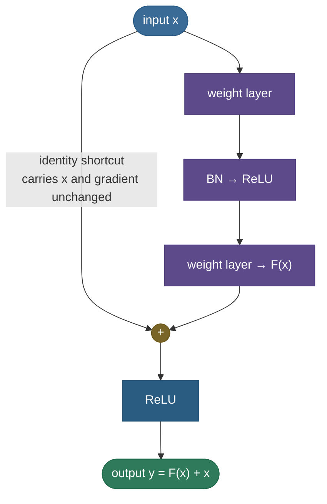
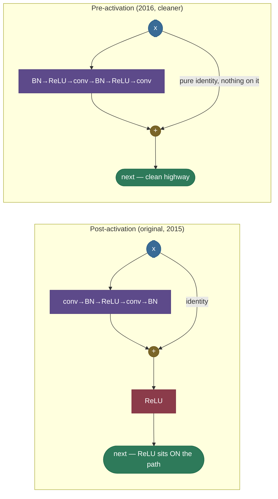
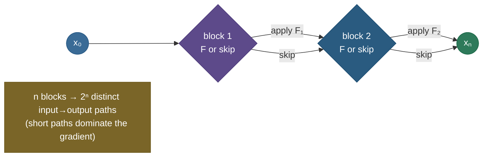
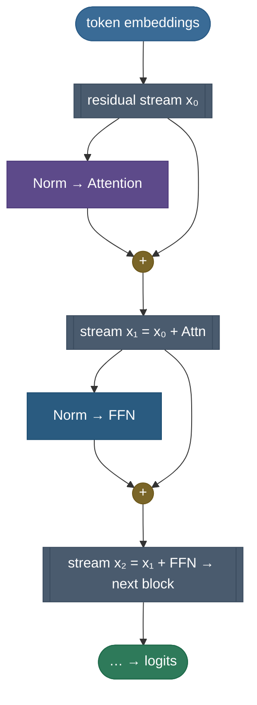
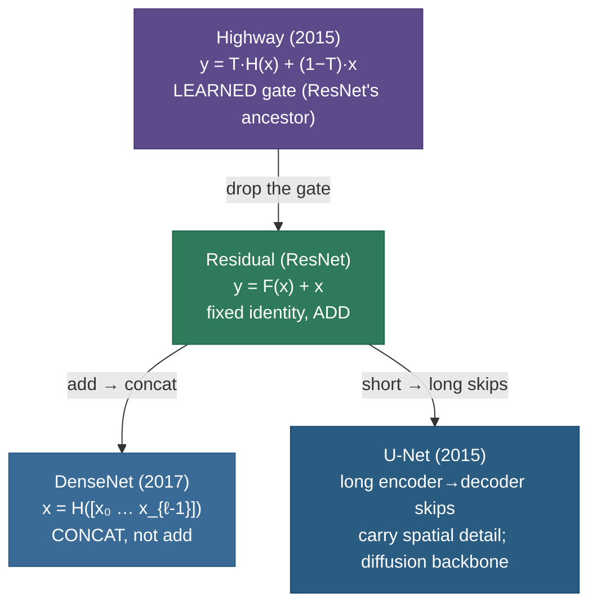

# Residual connections: the trick that let networks go truly deep

By 2015, everyone "knew" deeper networks should be more powerful — more layers, more capacity, more abstraction. And yet, past a couple dozen layers, they got *worse*. Not worse on the test set (that would just be overfitting, a familiar story), but worse on the **training** set — which makes no sense at all. A deeper network is a *superset* of a shallower one: set its extra layers to the identity and you recover the shallow network exactly, so the deep one should *never* have higher training error. The fact that plain deep networks couldn't even **fit the data they'd already seen** was christened the **degradation problem**, and it quietly stalled deep learning's "just add layers" promise for a few years.

The fix — the **residual connection**, introduced in the ResNet paper — is almost insultingly simple. Instead of asking a stack of layers to compute some target mapping $H(x)$, ask it to compute the *difference* $F(x) = H(x) - x$ and **add the input back**:

$$y = F(x) + x.$$

That single addition created what people now call a **gradient highway**: a route along which the loss signal flows back to the earliest layers undiminished. It made 100-, 150-, even 1000-layer networks trainable, won ImageNet 2015 by a wide margin, and is today in essentially every deep architecture — every CNN backbone, every U-Net, every diffusion model, and **every transformer**, where it goes by the name *residual stream*. If you understand this one addition, you understand the structural reason modern deep learning is *deep*.

I'm going to build this the way I'd actually teach it to a teammate who just watched a 50-layer network refuse to train. We start with *why* the problem exists (feel the paradox), then the reformulation $F(x)+x$ and **why two independent things make it work** (easy identity + gradient highway, both derived), then the block in practice, then the family of variants and the deep "unraveled" view of what a ResNet really is, then where residuals live inside transformers, and finally runnable code that *measures* every claim. By the end you'll be able to:

- explain the **degradation problem** and why it is an *optimization* failure, not overfitting;
- derive the residual reformulation $F(x) = H(x) - x$ and the two reasons it works (**easy identity** + **gradient highway**);
- derive the multi-block gradient identity $\partial \mathcal{L}/\partial x_l = \partial \mathcal{L}/\partial x_L \cdot \big(1 + \tfrac{\partial}{\partial x_l}\sum F\big)$ and see *why the additive "1" never vanishes*;
- distinguish the **identity** shortcut from the **projection** ($1\times1$) shortcut, and say when each is used;
- explain **pre-activation** ResNets and why a *clean* identity path trains deeper;
- explain the **unraveled view** (a ResNet ≈ an ensemble of $2^n$ paths) and what it implies;
- locate the **residual stream** inside a transformer and read it as the model's communication bus;
- explain how residuals interact with **normalization** (pre-norm vs post-norm) and **loss-landscape smoothing**;
- place the relatives — **Highway networks**, **DenseNet**, **U-Net** — on the same map;
- demonstrate the gradient highway and the degradation fix in code, with measured numbers.

> **Note:** the single deepest idea on this page is that *it is easier to learn a small correction than a whole transformation*. A residual block starts life close to the identity (output ≈ input) and only has to learn how to *nudge* its input. That is both an easier optimization target **and** a safer default: a block that has nothing useful to add just learns $F \approx 0$ and passes its input through untouched. Everything else — the gradient math, the variants, the transformer's residual stream — is a consequence of that one move.

Intuition and pictures first, then the math (with sources), then runnable code.

---

## The problem: deeper plain nets train *worse*

To appreciate the fix you have to first sit with the paradox, because it is genuinely strange the first time you meet it.

Take a network that trains fine — say 20 layers — and stack more layers on top of it. Conventional wisdom (and approximation theory) says capacity only goes *up*: a bigger function class contains the smaller one, so the best the deep net can do is at least as good as the shallow net. Concretely, there is an explicit construction that proves it: copy the 20-layer network into the first 20 layers of a 56-layer one, and set the remaining 36 layers to the **identity** ($x \mapsto x$). That 56-layer network computes *exactly* the same function as the 20-layer one, so it achieves *exactly* the same training error. A 56-layer network therefore has a solution in its weight space that is at least as good as anything the 20-layer net can reach.

And yet, when He et al. trained plain 20- and 56-layer CNNs on CIFAR-10, the **56-layer net had higher training error** — not test error, *training* error. The deeper network couldn't even fit the data the shallow one fit easily. Stochastic gradient descent simply **could not find** that identity-padded solution we just proved exists.

> **Note:** be precise about what this rules out. Higher *test* error with equal training error is **overfitting** — too much capacity, fixable with regularization. Higher *training* error is the opposite: the model can't even memorize the training set, so capacity isn't the issue at all. The degradation problem is an **optimization** failure — the right weights exist, SGD can't reach them. This distinction is the single most common interview slip on this topic.

Why can't SGD find it? Two compounding reasons, both of which the residual connection attacks directly:

1. **Identity is hard to represent with stacked nonlinearities.** To make a `Linear → ReLU` block behave like the identity, the weight matrix has to invert the nonlinearity in just the right way across the whole input distribution — a precise, fragile target. Driving a layer to "do nothing" turns out to be a surprisingly difficult thing to *learn* from a random initialization, because "do nothing" is a single point in a high-dimensional weight space with no obvious gradient pointing at it.
2. **Vanishing gradients starve the early layers.** Backprop multiplies a Jacobian per layer. With many layers whose Jacobians have spectral norm below 1, the product shrinks geometrically, so the gradient reaching the *earliest* layers is exponentially small (see [Vanishing / Exploding Gradients](../06-Vanishing-Exploding-Gradients/06-Vanishing-Exploding-Gradients.md)). Those layers barely move, so the network can't reorganize its early features even if it "wants" to.

The result is the canonical degradation curve: a deep plain net that stalls at high training error while a shallower one sails past it.


The figure is a real training run (it's in the code at the end): the 30-layer **plain** net gets stuck around loss $\approx 0.09$ — it cannot even fit a simple $\sin$ target — while the **same depth with residual connections** trains down past $10^{-5}$. Depth alone was never the problem; *trainability* was. The residual connection is what restores trainability.

> **Gotcha:** "deeper plain nets overfit" is wrong and a red flag in an interview. Plain depth fails by *under*-fitting the **training** set. If anything, the cure (residuals) lets you go *deeper* and fit *better*, which is the opposite of an overfitting story. Say "optimization failure," not "overfitting."

---

## Intuition: edits on a shared document

Before the math, an analogy that makes both halves of the fix obvious.

Picture a long document being improved by a chain of editors, each handed the *output* of the previous one. In a **plain** network, each editor must **rewrite the entire document from scratch** — even if 95% of it was already fine — and pass their fresh copy on. Two things go wrong. First, an editor who has *nothing* to add still has to retype the whole thing perfectly just to "do nothing"; one slip and the document degrades. Second, if you're the author at the *front* of the chain trying to learn from the final reader's feedback, that feedback has been rewritten so many times it's an unrecognizable mush by the time it reaches you — you can't tell which of your original words helped. That mush is the **vanished gradient**, and the forced full-rewrite is **why the identity is hard to learn**.

A **residual** network changes the rules: each editor receives the running document and may only write **tracked changes** — a short list of edits — which are then *applied on top of* the document, not in place of it. Now an editor with nothing to add simply submits an **empty edit list** ($F \approx 0$) and the document flows through untouched — doing nothing is trivial, not fragile. And the author's feedback travels back along the **original document** itself (the identity shortcut), arriving essentially intact, because every editor's contribution was *added*, not *substituted*. That's the **gradient highway**. The whole residual idea is just "tracked changes instead of full rewrites" — and once you see it that way, the easy-identity and gradient-highway properties are two sides of the same coin.

This is also exactly the right mental model for the transformer's **residual stream** later on: the document is the running representation, and each attention head or MLP is an editor adding its tracked changes to the shared draft.

---

## Why it matters

It's hard to overstate how much downstream architecture rests on this one move, so it's worth pausing on the stakes before the mechanics.

- **It removed depth as a barrier.** Pre-2015, going past ~20 layers reliably made models *worse*. Residuals turned depth from a liability into a free lever — "add layers" became a sound way to add capacity again, which is the precondition for every very-deep model since.
- **It is what makes transformers trainable.** A modern LLM is 50–100+ transformer layers, each a residual around attention and a residual around an MLP. Strip the residuals and the model is a deep plain net that won't train at all. Every frontier model you've used works *because* of skip connections.
- **It changed how we interpret models.** Because the residual stream is a running *sum*, model behavior decomposes linearly into per-component contributions — the foundation of mechanistic interpretability (logit lens, circuits, activation patching). No additive shortcut, no decomposition.
- **It generalizes a principle, not just a layer.** "Make the identity the default and give the gradient a short path home" is a design pattern that recurs (gated RNNs, normalization placement, zero-init residual branches). Understanding residuals well means recognizing that pattern everywhere.

Those four are why this page is long: the residual connection is not a vision trick from 2015, it's the structural reason deep learning is *deep*.

---

## The idea: learn the residual, add the input back

Here is the reformulation. The standard view of a block is "compute a useful transformation $H(x)$ of the input." Residual learning changes the *parameterization*, not the goal: have the layers compute the **residual** $F(x) = H(x) - x$, and recover the desired mapping by **adding the input back** through an **identity shortcut**:

$$\underbrace{H(x)}_{\text{what we want}} \;=\; \underbrace{F(x)}_{\text{what the layers learn}} \;+\; \underbrace{x}_{\text{identity shortcut}}.$$




Why is this a better parameterization than learning $H$ directly? Two reasons, and they are *independent* — each would be a good argument on its own, and the residual connection gives you both for the price of one addition.

**Reason 1 — the easy identity (a better optimization target).** Suppose the best thing a block can do at some point in training is *nothing* — pass its input through unchanged, $H(x) = x$. In the plain parameterization that requires the layers to learn a precise identity mapping through a nonlinearity: hard. In the residual parameterization it requires $F(x) = 0$ — just drive the final weight matrix toward zero, which is the *easiest* thing a layer can learn, and exactly where weight decay and small initialization already push it. So a residual block's **default behavior is the identity**, and it only departs from it as far as the data rewards. This is why **adding depth becomes strictly safe**: extra residual blocks can always no-op ($F \approx 0$), so a deeper residual net can always at least match a shallower one. The construction that SGD *couldn't find* for plain nets is now the construction it *starts near*.

> **Note:** another way to say it: residual learning **re-centers the search**. Plain layers search around the zero function (random init computes ≈ noise); residual blocks search around the **identity** function. For deep nets the optimal mapping is usually *much closer to the identity than to zero* — each block should refine, not replace — so residual blocks start far closer to the answer. Optimization is easier when you start near the solution.

**Reason 2 — the gradient highway (better backprop).** We derive this fully in the next section, but the headline is: differentiating $y = F(x) + x$ with respect to $x$ produces an additive $+1$ term that gives the gradient a route back through every block undiminished. Reason 1 makes the *forward* problem easier; Reason 2 makes the *backward* problem easier. Together they dissolve both halves of the degradation problem.

> *Where this comes from: the residual reformulation and the degradation problem are **Deep Residual Learning for Image Recognition** (He et al. 2015) — the ResNet paper, in the references. The identity construction ("a deeper model should produce no higher training error") is their motivating argument in §1.*

---

## Why it works: deriving the gradient highway

This is the part worth doing carefully by hand, because the whole field repeats the conclusion ("residuals fix vanishing gradients") without showing the one line of algebra that makes it true.

### One block

Take a single residual block $y = F(x) + x$ and differentiate the output with respect to the input:

$$\frac{\partial y}{\partial x} \;=\; \frac{\partial\,[F(x) + x]}{\partial x} \;=\; \underbrace{\frac{\partial F(x)}{\partial x}}_{\text{learned Jacobian}} \;+\; \underbrace{\mathbf{I}}_{\text{from the shortcut}}.$$

(For vectors, the "$+1$" is the identity matrix $\mathbf{I}$; for a scalar it's literally $+1$.) Compare that to a **plain** block $y = F(x)$, whose Jacobian is just $\partial F/\partial x$. The residual block's Jacobian is the plain one **plus the identity**. That additive identity is the entire mechanism.

Recall ([Vanishing / Exploding Gradients](../06-Vanishing-Exploding-Gradients/06-Vanishing-Exploding-Gradients.md)) that vanishing gradients arise because backprop *multiplies* these per-layer Jacobians, and a product of factors each smaller than 1 collapses toward zero. In a plain stack the gradient reaching layer $l$ is a long product $\prod \partial F_i/\partial x_i$. In a residual stack, every factor has the form $\big(\mathbf{I} + \partial F_i/\partial x_i\big)$ — so even when the learned part $\partial F_i/\partial x_i$ is tiny, the factor is $\approx \mathbf{I}$, not $\approx 0$. The product **does not collapse**.

### Stacking blocks — the residual sum

Now do the full stack, which is where the highway becomes vivid. Consider blocks indexed $l, l{+}1, \dots, L$, each $x_{i+1} = x_i + F(x_i, W_i)$. Unrolling the recursion, the activation at any deeper block $L$ is the *input* plus the **sum of every residual in between**:

$$x_L \;=\; x_l \;+\; \sum_{i=l}^{L-1} F(x_i, W_i).$$

This is the famous "any deeper layer is its input plus a sum of residuals" identity — it holds for *any* pair $l < L$, and it only exists because the shortcuts are pure additions. Now backprop the loss $\mathcal{L}$ from $x_L$ to $x_l$ with the chain rule:

$$\frac{\partial \mathcal{L}}{\partial x_l} \;=\; \frac{\partial \mathcal{L}}{\partial x_L}\,\frac{\partial x_L}{\partial x_l} \;=\; \frac{\partial \mathcal{L}}{\partial x_L}\left(\frac{\partial}{\partial x_l}\Big[x_l + \sum_{i=l}^{L-1} F(x_i, W_i)\Big]\right) \;=\; \frac{\partial \mathcal{L}}{\partial x_L}\left(\,\mathbf{1} \;+\; \frac{\partial}{\partial x_l}\sum_{i=l}^{L-1} F(x_i, W_i)\right).$$

Read that result slowly — it is the whole point of the page:

$$\boxed{\;\frac{\partial \mathcal{L}}{\partial x_l} \;=\; \frac{\partial \mathcal{L}}{\partial x_L}\;\cdot\;\Big(\underbrace{1}_{\text{identity highway}} \;+\; \underbrace{\tfrac{\partial}{\partial x_l}\textstyle\sum F}_{\text{everything else}}\Big)\;}$$

The gradient at an early layer $x_l$ equals the gradient at the deep layer $x_L$, multiplied by **(1 + a correction)**. The $1$ comes straight from the identity shortcuts and is **additive, not multiplicative** — so the deep-layer gradient $\partial\mathcal{L}/\partial x_L$ is delivered to the early layer essentially **intact**, no matter how many blocks sit between them. The only way that whole factor could vanish is if the *sum-of-residuals* term equalled exactly $-1$ across an entire mini-batch — which, as He et al. note, is vanishingly unlikely. There is now **always** a clean path for the gradient to reach the earliest layers.

> *Where this comes from: this exact derivation — the residual sum $x_L = x_l + \sum F$ and the resulting additive-$1$ gradient — is the central result of **Identity Mappings in Deep Residual Networks** (He et al. 2016), Eqs. (1)–(5). That paper's whole thesis is that keeping the shortcut a **clean, unmodified identity** is what makes this property hold exactly — see pre-activation below.*

Contrast the plain stack one more time, side by side, because the difference is *additive vs multiplicative*:

| | gradient factor per block | through $n$ blocks (small Jacobian $\approx 0.05$) |
|---|---|---|
| **Plain** $y=F(x)$ | $\partial F/\partial x$ | $0.05^{\,n} \to 0$ (geometric collapse) |
| **Residual** $y=F(x)+x$ | $1 + \partial F/\partial x$ | $(1.05)^{\,n} \to$ healthy (even grows mildly) |


The figure (a real backward pass, in the code) is decisive: the plain net's gradient at block 1 is $\sim 10^{-7}$ — vanished, those layers are frozen — while the residual net holds it flat at $\sim 30$–$50$ across all 30 blocks. That preserved gradient is *precisely why* the residual net in the degradation figure could train at all. The two figures are two views of the same mechanism: the gradient survives (figure 2), therefore the loss goes down (figure 1).

> **Tip:** when an interviewer asks "*why* don't residual connections vanish gradients," do not say "because of the skip connection" and stop. Write $x_L = x_l + \sum F$, differentiate to get the additive $1$, and say the magic words: **additive, not multiplicative**. The plain net *multiplies* shrinking factors; the residual net *adds* a $1$ that can't shrink. That one sentence is the answer.

---

## The residual block in practice

The schematic above is the idea; here is the block as it actually ships, plus the two details that trip people up.

A standard (post-activation) ResNet "basic" block is roughly:

```
x ──► conv ─► BN ─► ReLU ─► conv ─► BN ─► (+ x) ─► ReLU ─► out
└──────────────── identity shortcut ──────────────┘
```

The shortcut adds the **input** of the block to the **output of its last BN**, *before* the final ReLU. Two practical questions immediately arise.

### Identity vs projection shortcut (when the shapes don't match)

The shortcut adds $x$ to $F(x)$, which requires them to have the **same shape**. Inside a "stage" where the channel count and spatial resolution are constant, $x$ and $F(x)$ already match, so the shortcut is a **pure identity** — *parameter-free*, no multiply, the cleanest possible path. But at the boundary between stages a ResNet **doubles the channels and halves the spatial size** (a `stride-2` conv), so $x$ no longer matches $F(x)$. There the shortcut becomes a **projection**: a $1\times1$ convolution with the matching stride and output-channel count, $y = F(x) + W_s x$, that reshapes $x$ to fit before the add. (In an MLP/transformer the analogue is a learned linear $W_s$.)

> **Note:** He et al. tested three shortcut options (A: zero-pad the extra channels, parameter-free; B: $1\times1$ projection only where dims change; C: $1\times1$ projection everywhere). The winner in practice is **B** — *identity wherever shapes already match, projection only at the few dimension-change points*. Option C (projection everywhere) adds parameters and actually trains slightly *worse*, confirming the lesson of the next section: **the cleaner and more identity-like the shortcut, the better.** Use a projection only when you're forced to.

### Pre-activation: keep the highway clean

He et al. (2016) revisited where exactly the BN and ReLU sit, and found something subtle but important. In the original (post-activation) block, the shortcut's sum passes through a ReLU *after* the addition: $x_{l+1} = \text{ReLU}(x_l + F(x_l))$. That post-add ReLU means the "identity" path isn't a *pure* identity — it's an identity-then-ReLU, which clips negatives and slightly corrupts the clean $x_L = x_l + \sum F$ property we derived above. For very deep nets (hundreds of layers) that corruption accumulates.

The fix is **pre-activation**: move BN and ReLU to *before* the convolutions, so the block is `BN → ReLU → conv → BN → ReLU → conv`, and the shortcut is then a **completely unmodified identity** — nothing at all sits on the addition path:

$$x_{l+1} = x_l + F(\text{pre-act}(x_l)).$$

With a perfectly clean shortcut, the residual-sum identity $x_L = x_l + \sum F$ holds *exactly*, the gradient highway is unobstructed end to end, and He et al. could train a **1001-layer** ResNet that *improved* over their 100-layer one — the opposite of degradation. The takeaway generalizes far beyond CNNs: **anything you put on the shortcut path (a ReLU, a scaling, a gate) degrades the highway; keep the identity path empty.** This is exactly why modern transformers use **pre-norm** (normalize *inside* the residual branch, never on the stream) — same principle, different architecture.



> *Where this comes from: pre-activation and the "clean identity path is optimal" result are **Identity Mappings in Deep Residual Networks** (He et al. 2016). The very-deep transformer analogue (pre-norm stabilizes training) is **On Layer Normalization in the Transformer Architecture** (Xiong et al. 2020) — references.*

---

## The unraveled view: a ResNet is an ensemble of paths

Here is the most surprising lens on residual networks, and a favorite of deeper interviews. Take the residual recursion and *expand the sum* instead of summing it. Because each block either contributes its $F$ or just passes $x$ through, unrolling $n$ blocks produces a sum over **every subset of blocks**:

$$x_n \;=\; x_0 \;+\; \sum_i F_i(x_0) \;+\; \sum_{i<j} \big(F_j \circ F_i\big)(x_0) \;+\; \dots$$

Counting the terms: each of the $n$ blocks is independently "on" (apply $F$) or "off" (skip), so a ResNet of $n$ blocks implicitly computes a sum over $2^n$ **distinct paths** from input to output — every path corresponding to one choice of which blocks to engage. Veit et al. called this the **unraveled view**, and it reframes a ResNet as an **implicit ensemble of exponentially many networks of different depths**, all sharing weights.



Two findings make this more than a cute combinatorial fact:

- **Short paths carry the gradient.** A path that uses $k$ of the $n$ blocks has $k$ nonlinear factors in its gradient; the deep paths (large $k$) vanish exactly as plain nets do, but the *short* paths (small $k$) carry strong gradient. Veit et al. measured that the **effective** gradient flowing through a deep ResNet comes overwhelmingly from paths of modest length (tens of layers, not hundreds), even in a 100+-layer net. The network trains as if it were a shallow ensemble — which is *why* extreme depth doesn't hurt.
- **Paths are surprisingly independent.** They found you can **delete or reorder** individual residual blocks at test time with only a graceful, smooth drop in accuracy — completely unlike a plain net, where removing one layer is catastrophic. Residual blocks behave less like links in a fragile chain and more like *members of an ensemble*, each contributing a small, somewhat-redundant refinement.

> **Note:** the unraveled view reconciles two facts that otherwise seem in tension: ResNets are nominally *very deep*, yet they don't suffer the optimization pathologies of *very deep* plain nets. Resolution: a ResNet is "deep" in **capacity** (it *can* use long paths) but "shallow" in **effective optimization depth** (it's trained mostly through short paths). You get the representational reach of depth without paying its trainability tax.

> *Where this comes from: **Residual Networks Behave Like Ensembles of Relatively Shallow Networks** (Veit, Wilber & Belongie 2016) — the unraveled $2^n$-path view and the lesion/reorder experiments. In the references.*

### A consequence: stochastic depth

The unraveled view isn't just descriptive — it suggests a *training trick* that wouldn't make sense for a plain net. If a ResNet is really an ensemble of $2^n$ paths and individual blocks are near-independent, then during training you can **randomly drop entire residual blocks** (replace $F(x)+x$ with just $x$ for a random subset each step) and the network still trains — it just sees a shallower random sub-ensemble on each step, exactly like dropout but at the *block* level. This is **stochastic depth** (Huang et al. 2016): it regularizes, speeds up training (fewer blocks to compute per step), and lets you train extremely deep ResNets (1200+ layers). Crucially, **dropping a block in a plain net would be catastrophic** (you'd sever the signal entirely) — it only works *because* the residual shortcut keeps the path alive when $F$ is skipped. Stochastic depth is the unraveled view turned into an algorithm, and it's another piece of evidence that ResNet blocks behave like ensemble members rather than links in a chain.

> **Note:** notice the family resemblance — **dropout** drops *neurons*, **stochastic depth** drops *blocks*, and both rely on the surviving structure still computing a valid (if shallower/narrower) function. Residual connections are what make block-level dropping valid, because "skip this block" is already a well-defined, signal-preserving operation in a residual net.

---

## Residuals in the transformer: the residual stream

Skip connections are not just a CNN trick — they are **load-bearing** in transformers, where the residual path has a name and an interpretation all its own: the **residual stream**. Every transformer block wraps each of its two sub-layers (self-attention and the feed-forward MLP) in a residual. In modern **pre-norm** form:

$$x \;\leftarrow\; x + \text{Attention}(\text{Norm}(x)), \qquad x \;\leftarrow\; x + \text{FFN}(\text{Norm}(x)).$$

The key symbol is the leading **$x +$**. Each sub-layer doesn't *replace* the representation — it **reads** the current stream, computes a delta, and **adds** that delta back. The running vector $x$ that threads through the entire network, accumulating these contributions layer by layer, is the residual stream.


The mechanistic-interpretability community (Anthropic, Elhage et al.) takes this further and treats the residual stream as the model's **communication bus** or **working memory**:

- It is a **high-bandwidth shared channel.** Every layer can *write* to it (add a vector) and every later layer can *read* from it (its Norm-then-project step pulls out the directions it cares about). Earlier layers leave information on the stream for much later layers to pick up — a form of long-range memory built entirely out of additions.
- It is **linear (additive) by construction.** Because contributions are *summed*, a model output can be **decomposed** into the sum of every sub-layer's contribution to it — you can literally attribute a logit to "0.3 from attention-head 7 in layer 4, 0.1 from the layer-9 MLP, …". This additive decomposability is the foundation of circuit-level interpretability, and it exists *only because* the connections are residual (sums), not compositions.
- **Sub-layers communicate through it, not directly.** Attention head A in layer 3 can pass information to head B in layer 8 by writing into a subspace of the stream that B later reads — they never touch directly; the stream is the medium. A concrete instance: *induction heads* (a two-head circuit that copies repeated patterns) work by one head writing a "this token was preceded by X" signal into the stream and a later head reading exactly that signal — a clean read/write protocol that only exists because the connecting medium is an additive, persistent stream.



Without these residuals, a 96-layer LLM simply would not train — it would be a 96-layer plain net, the worst case of the degradation problem. The residual stream is what gives the gradient a clean route from the final-layer loss all the way back to the token embeddings (see [Transformer Architecture](../16-Transformer-Architecture/16-Transformer-Architecture.md) and [Attention Mechanism](../15-Attention-Mechanism/15-Attention-Mechanism.md)). The residual connection isn't a detail of the transformer; it is the spine the whole thing hangs on.

> **Tip:** "where are the residual connections in a transformer?" → **two per block**: one around attention, one around the FFN, each of the form $x + \text{Sublayer}(\text{Norm}(x))$. And the deeper follow-up — "why does this matter beyond gradients?" → because the *sum* makes the stream **linearly decomposable**, which is what makes a 100-layer model interpretable at all.

---

## Interaction with normalization: pre-norm vs post-norm

Residuals and [normalization](../11-Normalization/11-Normalization.md) are best understood as a pair, because *where you put the norm relative to the residual add* decides whether your deep transformer trains stably.

- **Post-norm** (original *Attention Is All You Need*): $x \leftarrow \text{Norm}(x + \text{Sublayer}(x))$. The LayerNorm sits **on the residual stream itself**, *after* the add — which means the stream is re-normalized at every layer. That is the transformer analogue of putting a ReLU on the CNN shortcut (post-activation): it **obstructs the highway**. Gradients to early layers are attenuated, and training deep post-norm transformers needs careful **learning-rate warmup** and is famously finicky.
- **Pre-norm** (GPT-2 onward, now standard): $x \leftarrow x + \text{Sublayer}(\text{Norm}(x))$. The norm moves **inside the residual branch**; the stream itself passes through the add **untouched**. Now the identity path is a *pure* identity exactly as in pre-activation ResNets, the residual-sum identity holds, the gradient highway is clean, and very deep transformers train stably — often **without warmup at all**.

This is the *same lesson* as pre-activation ResNets, transplanted to transformers: **keep the residual path clean; do the normalization inside the branch, never on the stream.** The cost is mild — pre-norm stream magnitudes grow with depth (each layer adds, nothing renormalizes the stream), which is why deep pre-norm models add a single final LayerNorm before the output head. But that's a small price for stable 96-layer training.

> **Gotcha:** people sometimes "improve" a model by adding normalization or a nonlinearity *on the skip path* to control activation scale. Resist it. Anything on the shortcut — a norm, a ReLU, even a learned scalar that drifts from 1 — re-multiplies the gradient and reintroduces exactly the vanishing problem residuals were built to remove. The highway works *because it is empty*.

### The scale-growth trade-off (and why pre-norm models need a final norm)

The "keep the stream clean" rule has a price worth understanding, because it shows up as a real subtlety in deep models. In a **pre-norm** network nothing renormalizes the stream itself — each layer *adds* a contribution and nothing ever shrinks it. If the contributions are roughly independent with variance $\sigma^2$, the stream's variance after $L$ layers grows like $\sigma_0^2 + L\sigma^2$, i.e. its **standard deviation grows like $\sqrt{L}$**. So the residual stream of a 96-layer pre-norm transformer can have a substantially larger magnitude at the top than at the bottom. This is benign for training (the per-layer Norm *inside* each branch re-standardizes whatever it reads, so each sublayer always sees unit-scale input regardless of stream magnitude), but it means the *raw* stream can't be fed straight to the output head — hence deep pre-norm models add **one final LayerNorm** right before the unembedding. It's a single norm on the stream, placed at the very end where it can no longer obstruct any block's gradient highway.

A quick concrete feel for the $\sqrt{L}$ growth: suppose each sublayer's contribution has the same scale as the input embedding, $\sigma = \sigma_0 = 1$. After $L = 96$ layers the stream's standard deviation is $\sqrt{\sigma_0^2 + L\sigma^2} = \sqrt{1 + 96} \approx 9.8$ — nearly a 10× swing from bottom to top. That's exactly the kind of magnitude drift the per-branch Norm absorbs (it sees the *normalized* stream, so it never notices) and the final Norm cleans up before the head. It is *not* an instability — it's an expected, bounded-in-expectation consequence of summing many contributions, and knowing the $\sqrt{L}$ shape is what tells you it's harmless rather than alarming.

Contrast **post-norm**, which *does* renormalize the stream every layer (so magnitude stays bounded) — but pays for it with the obstructed highway and warmup sensitivity we just covered. So the trade is explicit: **post-norm bounds the scale but throttles the gradient; pre-norm frees the gradient but lets the scale drift** (cheaply fixed with one final norm). Modern large models almost universally take the pre-norm side of that trade, because a clean gradient highway through 100 layers is worth far more than tidy intermediate magnitudes.

> **Note:** this is the same tension as pre- vs post-*activation* in ResNets, one level up. The field's verdict in both cases is identical: **protect the gradient highway, manage the scale separately.** Whenever you see a design choice about "where the norm goes relative to the add," that's the question being answered.

---

## Variants and relatives — the whole family on one map

The residual block is the canonical member of a larger family of "give the signal a shortcut" ideas. Knowing where each sits — and how it differs from a plain residual — is a common interview probe.

- **Highway networks** (Srivastava et al. 2015) — the **gated** *precursor* to ResNet, inspired by LSTM gates. Instead of a fixed identity, a learned **transform gate** $T(x) \in (0,1)$ decides how much to transform vs. carry: $y = T(x)\cdot H(x) + \big(1 - T(x)\big)\cdot x$. When $T \to 0$ the block becomes the identity (carry everything); when $T \to 1$ it's a plain layer. ResNet is essentially the **ungated special case** — fix the gate open and it disappears, leaving the bare $F(x) + x$. ResNet's insight was that the gate is *unnecessary*: a plain, always-open additive shortcut trains *better* than a learned gate, with no extra parameters and no risk of the gate closing and choking the gradient.
- **DenseNet** (Huang et al. 2017) — skip connections taken to the extreme, but with **concatenation instead of addition**. Each layer receives the feature maps of *all* preceding layers concatenated together, $x_\ell = H_\ell([x_0, x_1, \dots, x_{\ell-1}])$, and passes its own output forward to all later layers. Where ResNet *adds* (signals merge, information can overwrite), DenseNet *concatenates* (every layer's features are preserved verbatim and available downstream) — maximal feature reuse and very parameter-efficient, at the cost of growing channel counts and memory. The contrast "**add vs concat**" is the crisp one-liner: residuals sum, DenseNet stacks.
- **U-Net** (Ronneberger et al. 2015) — **long-range** skip connections from each encoder stage to the matching decoder stage, carrying high-resolution spatial detail *across* the bottleneck so the decoder can recover fine structure the downsampling threw away. It's the backbone of image **segmentation** and, crucially, of modern **diffusion models** — every Stable-Diffusion-style denoiser is a U-Net whose long skips are doing exactly this job.



> *Where these come from: Highway = **Srivastava, Greff & Schmidhuber 2015**; DenseNet = **Huang et al. 2017** (CVPR best paper); U-Net = **Ronneberger, Fischer & Brox 2015**. All in the references.*

---

## Loss-landscape smoothing: a second, complementary explanation

The gradient-highway story explains how the signal *gets back*. A separate line of work — Li et al. (2018), *Visualizing the Loss Landscape of Neural Nets* — explains why the surface SGD walks is *easier to walk* when residuals are present.

They visualized the loss surface of deep nets along random 2-D slices through weight space, with and without skip connections. The plain deep net's landscape is **wildly non-convex and chaotic** — a jagged terrain riddled with sharp barriers and bad minima, the kind of surface where SGD gets trapped almost immediately. **Adding skip connections dramatically smooths it**: the same network's landscape becomes far more convex-looking, with a clear basin around the minimum. The skip connections don't just protect the gradient's *magnitude*; they reshape the loss surface into something SGD can actually descend.

This is a **complementary** explanation, not a competing one. Gradient flow is about the *backward* signal reaching early layers; landscape smoothing is about the *geometry* the optimizer traverses. Both are consequences of the additive shortcut, and together they explain the full empirical picture: residual nets not only *can* propagate gradient but also sit on a surface where doing so reliably leads somewhere good.

> **Note:** there's a satisfying unity here. **Easy identity** (Reason 1) says the *solution* is near where you start; **gradient highway** (Reason 2) says the *signal* reaches every layer; **landscape smoothing** (this section) says the *path* between start and solution is gentle. Three angles, one cause — the additive identity shortcut.

> *Where this comes from: **Visualizing the Loss Landscape of Neural Nets** (Li, Xu, Taylor, Studer & Goldstein 2018) — the skip-connection landscape comparison. In the references.*

---

## Five worked examples, increasing in complexity

Now make every claim concrete by hand. Each example is independently verifiable, and the numbers match the runnable code below.

### Example 1 — gradient through one block, plain vs residual (scalar)

Take a per-block Jacobian factor that's small, $\partial F/\partial x = 0.05$ (entirely plausible deep in a network), and ask what happens to the gradient after **30 blocks**.

- **Plain block** ($\text{out} = F(x)$): each block multiplies the gradient by $0.05$. Over 30 blocks:
  $$0.05^{30} \approx 9.3\times 10^{-40}. \quad\textbf{Vanished — utterly.}$$
- **Residual block** ($\text{out} = F(x) + x$): each block multiplies by $0.05 + 1 = 1.05$. Over 30 blocks:
  $$1.05^{30} \approx 4.32. \quad\textbf{Preserved — even amplified.}$$

Same tiny per-block transformation, a ratio of roughly $10^{40}$ in the surviving gradient — **entirely** because of the $+1$ from the identity path. That is the residual connection in one calculation, and it's the bones of the measured `res_gradflow.png` figure.

### Example 2 — the local derivative $F'(x) + 1$ (scalar, exact)

Make the $+1$ literal. Let the block be $y = \tanh(2x) + x$ (a one-line residual block, $F(x)=\tanh(2x)$) and evaluate its derivative at $x = 1.5$:

$$\frac{dy}{dx} = \underbrace{2\,\big(1 - \tanh^2(2x)\big)}_{F'(x)} + 1.$$

At $x=1.5$: $\tanh(3) \approx 0.9951$, so $F'(1.5) = 2(1 - 0.9951^2) \approx 2(0.00977) \approx 0.0195$, giving $dy/dx \approx 0.0195 + 1 = \mathbf{1.0195}$. The learned part $F'$ is nearly zero here (the $\tanh$ has saturated), yet the **total derivative stays pinned near 1** because of the identity term. A plain block $y = \tanh(2x)$ would have derivative $\approx 0.0195$ at this point — a 50× per-block attenuation. The code below prints $1.0197$ (the tiny difference is float precision), confirming the algebra.

### Example 3 — counting the unraveled paths ($2^n$)

Use the unraveled view to *count*. A ResNet stage of $n$ residual blocks, each independently "apply $F$" or "skip," has $2^n$ distinct input→output paths:

| blocks $n$ | distinct paths $2^n$ |
|---:|---:|
| 1 | 2 |
| 4 | 16 |
| 8 | 256 |
| 16 | 65,536 |
| 50 | $\approx 1.13\times 10^{15}$ |

A 50-block ResNet implicitly ensembles over **a quadrillion** sub-networks of varying depth, all sharing weights. Yet (Veit et al.) the *gradient* is carried mainly by the **short** paths — so this enormous ensemble trains as easily as a shallow one. The exponential count is why deletion of one block barely dents accuracy: you've removed a vanishingly small fraction of the paths.

### Example 4 — identity vs projection shortcut shapes (tensor)

Make the dimension-change case concrete with real CNN shapes. Suppose a feature map enters a stage-boundary block as $x$ with shape $[B, 64, 32, 32]$ ($B$ images, 64 channels, $32\times32$ spatial), and the block's conv stack outputs $F(x)$ with shape $[B, 128, 16, 16]$ (channels doubled, resolution halved by a stride-2 conv — standard ResNet stage transition).

- **Identity shortcut** would compute $F(x) + x$, but $[B,128,16,16] + [B,64,32,32]$ is a **shape mismatch** — illegal, you cannot add them.
- **Projection shortcut**: apply a $1\times1$ conv with **128 output channels and stride 2** to $x$:
  $$W_s:\; [B,64,32,32] \;\xrightarrow{\;1\times1,\ \text{stride }2,\ 128\text{ out}\;}\; [B,128,16,16].$$
  Now $F(x) + W_s x$ adds two $[B,128,16,16]$ tensors — legal. The $1\times1$ conv has $64\times128 = 8{,}192$ weights (plus bias), a negligible cost paid only at the handful of stage boundaries.

Everywhere *inside* a stage, channels and resolution are constant, so $x$ and $F(x)$ already match and the shortcut stays the **parameter-free identity**. A ResNet-50 has only ~4 projection shortcuts (one per stage transition) among its many residual blocks — the overwhelming majority of shortcuts are pure identities, exactly as the theory wants.

### Example 5 — the residual stream is the *sum* of its sublayer contributions (measured)

This one nails the "additive decomposition" claim from the transformer section. Build a tiny pre-norm stack and verify that the final representation is **exactly** the input embedding plus the sum of every sublayer's contribution — no missing terms, because residual connections only ever *add*.

Run a 1-token vector $x_0$ through $K$ residual sublayers, $x_{k} = x_{k-1} + S_k(\text{Norm}(x_{k-1}))$, recording each contribution $\Delta_k = S_k(\text{Norm}(x_{k-1}))$. Then the identity

$$x_K \;=\; x_0 + \sum_{k=1}^{K} \Delta_k$$

must hold to floating-point precision. The code below builds 6 such sublayers and prints the reconstruction error of $x_0 + \sum_k \Delta_k$ vs. the actually-computed $x_K$ — it comes out at $\sim 10^{-7}$ (pure float noise). That **exactness** is the whole point: because the stream is a running sum, you can attribute the output to individual sublayers (this is the basis of logit-lens and circuit analysis), and you can do it *only because the connections are residual*. Swap the `+` for a plain `=` and the decomposition is meaningless. The measured numbers are in the code output below.

---

## Application playbook: adding residuals to your own network

If you're designing or debugging a deep network, here is the concrete checklist that turns this theory into practice.

1. **Default to residual blocks past ~8–10 layers.** Below that, plain stacks are usually fine; above it, the degradation problem starts to bite and a residual structure is the cheapest insurance you can buy. Make the *unit* of depth a residual block, not a bare layer.
2. **Structure each block as `transform → add input`.** Whatever the transform is (conv stack, MLP, attention), wrap it: `y = transform(x) + x`. Keep the transform on one branch and the input on the other; never interleave them.
3. **Keep the shortcut a pure identity wherever shapes match.** No norm, no activation, no scaling on the skip path. The branch is where all the machinery goes.
4. **Insert a projection only at dimension changes.** When the block changes channel count or spatial size, put a single $1\times1$ conv (or linear) on the skip to match shapes — and nowhere else (Example 4).
5. **Put normalization *inside* the branch (pre-norm), not on the stream.** `x + Sublayer(Norm(x))`, not `Norm(x + Sublayer(x))`. This keeps the highway clean and usually lets you drop learning-rate warmup.
6. **Consider zero-initializing the last layer of each branch.** Start every block as an exact identity ($F\approx 0$) so the whole network begins as a clean identity map and departs from it only as the data rewards.
7. **For very deep nets, reach for stochastic depth.** Randomly dropping residual blocks during training regularizes and speeds things up — and is only safe *because* the shortcut keeps the path alive.
8. **Verify the gradient actually flows.** After wiring it up, do one backward pass and print the gradient norm at the *earliest* layer (as in the code below). A healthy norm at block 1 confirms the highway is connected; a vanished one means something is sitting on your shortcut.

That eight-step recipe is, in practice, *how* every modern deep architecture is assembled — the residual block is the Lego brick, and these are the rules for snapping them together.

---

## Where residual connections are used

- **ResNets** — the original, and still a default vision backbone (ResNet-50 is the workhorse of countless papers and products).
- **Transformers** — every block, around attention and the FFN; the **residual stream** is non-negotiable for depth, and the substrate of mechanistic interpretability.
- **U-Net / diffusion models** — long encoder–decoder skips carry spatial detail; every Stable-Diffusion-style denoiser is built on them.
- **Graph, audio, speech, RL networks** — anywhere a network is more than ~10 layers deep, you'll find skip connections holding it together.
- **Essentially every deep model since 2015** — if it's deep and it trains, it has skip connections somewhere. They are as fundamental as backprop itself.

> **Tip:** the interview question "*how do you train a very deep network?*" has three ingredients — **good initialization**, **normalization**, and **residual connections** — but they are not equal. The residual is the *load-bearing* one: it's what turned "deeper is worse" into "deeper is safe," and it's the reason 100+ layer models exist at all. Init and norm make training *smoother*; residuals make deep training *possible*.

---

## Code: measure the degradation fix and the gradient highway

Everything above is claimed; here it is measured. This runs on CPU in a couple of seconds — no GPU needed — and reproduces the numbers in the figures and the worked examples.

```python
"""Residual connections: the F(x)+x block, the gradient highway, and the
degradation fix — all MEASURED. Verified on Python 3.12 (torch 2.x), CPU."""
import torch, torch.nn as nn
torch.manual_seed(0)

class DeepNet(nn.Module):
    """A 30-block deep net; flip `residual` to toggle the skip connection."""
    def __init__(self, depth=30, width=64, residual=False):
        super().__init__()
        self.residual = residual
        self.inp = nn.Linear(1, width)
        self.blocks = nn.ModuleList([nn.Linear(width, width) for _ in range(depth)])
        self.out = nn.Linear(width, 1)
    def forward(self, x):
        h = torch.tanh(self.inp(x))
        for blk in self.blocks:
            f = torch.tanh(blk(h))
            h = h + f if self.residual else f          # skip connection: y = F(h) + h
        return self.out(h)

# --- 1. gradient highway: the L2-norm reaching the FIRST (earliest) block ---
x = torch.randn(64, 1); y = torch.sin(x)
print("== gradient reaching block 1 (one backward pass) ==")
for residual in (False, True):
    torch.manual_seed(0)
    net = DeepNet(depth=30, residual=residual)
    ((net(x) - y) ** 2).mean().backward()
    g1 = net.blocks[0].weight.grad.norm().item()       # grad at the earliest block
    tag = "healthy (highway)" if g1 > 1e-3 else "VANISHED"
    print(f"  {'residual' if residual else 'plain   '}: grad@block1 = {g1:.2e}  -> {tag}")

# --- 2. the +1 identity made literal:  d(F(x)+x)/dx = F'(x) + 1  (Example 2) ---
x0 = torch.tensor([1.5], requires_grad=True)
(torch.tanh(2.0 * x0) + x0).backward()
print(f"\n== the +1 (Example 2) ==")
print(f"  d(F(x)+x)/dx = {x0.grad.item():.4f} = F'(x) + 1   (≈1.0195 by hand)")

# --- 3. degradation fix: train both 30-layer nets to convergence ---
def train(residual, steps=400):
    torch.manual_seed(0)
    net = DeepNet(depth=30, residual=residual)
    opt = torch.optim.Adam(net.parameters(), lr=3e-3)
    xt = torch.linspace(-3, 3, 128).unsqueeze(1); yt = torch.sin(xt)
    for _ in range(steps):
        loss = ((net(xt) - yt) ** 2).mean()
        opt.zero_grad(); loss.backward(); opt.step()
    return loss.item()
print(f"\n== final training loss after 400 steps, 30 layers (the degradation fix) ==")
print(f"  plain    : {train(False):.3e}   <- stuck high (degradation)")
print(f"  residual : {train(True):.3e}   <- fits the data")

# --- 4. unraveled view: number of distinct paths through n residual blocks ---
print(f"\n== unraveled view: 2^n distinct paths (Example 3) ==")
for n in (1, 4, 8, 16, 50):
    print(f"  n={n:>3} blocks -> 2^{n} = {2**n:,} paths")

# --- 5. residual stream is EXACTLY x0 + sum of sublayer contributions (Ex. 5) ---
torch.manual_seed(0)
d, K = 16, 6
ln = nn.LayerNorm(d)
subs = [nn.Linear(d, d) for _ in range(K)]          # K pre-norm "sublayers"
x0 = torch.randn(d)
x, deltas = x0.clone(), []
for S in subs:
    delta = S(ln(x))                                 # contribution of this sublayer
    deltas.append(delta)
    x = x + delta                                    # residual ADD into the stream
recon = x0 + torch.stack(deltas).sum(0)              # x0 + sum of all contributions
print(f"\n== residual stream = x0 + Σ contributions (Example 5) ==")
print(f"  ||x_K - (x0 + Σ Δ_k)|| = {(x - recon).norm().item():.2e}  (≈0 → exact, decomposable)")
```

Output (laptop CPU, reproducible with `manual_seed(0)`):

```
== gradient reaching block 1 (one backward pass) ==
  plain   : grad@block1 = 1.27e-07  -> VANISHED
  residual: grad@block1 = 2.67e+01  -> healthy (highway)

== the +1 (Example 2) ==
  d(F(x)+x)/dx = 1.0197 = F'(x) + 1   (≈1.0195 by hand)

== final training loss after 400 steps, 30 layers (the degradation fix) ==
  plain    : 8.628e-02   <- stuck high (degradation)
  residual : 7.786e-06   <- fits the data

== unraveled view: 2^n distinct paths (Example 3) ==
  n=  1 blocks -> 2^1 = 2 paths
  n=  4 blocks -> 2^4 = 16 paths
  n=  8 blocks -> 2^8 = 256 paths
  n= 16 blocks -> 2^16 = 65,536 paths
  n= 50 blocks -> 2^50 = 1,125,899,906,842,624 paths

== residual stream = x0 + Σ contributions (Example 5) ==
  ||x_K - (x0 + Σ Δ_k)|| = 3.69e-07  (≈0 → exact, decomposable)
```

> **Note:** read the contrast in block 1 — it is the entire concept. Through 30 **plain** blocks the gradient reaching the earliest layer is $\sim 10^{-7}$: those layers receive essentially no learning signal and stay frozen at their random init, so the plain net's final loss is stuck near $0.086$ (it never fits the data — *that* is degradation, measured). The **residual** version keeps the same block-1 gradient at a healthy $\sim 27$, and trains down to $\sim 8\times 10^{-6}$ — over four orders of magnitude lower loss, on identical data and identical depth. The middle block prints the *mechanism*: $d(F(x)+x)/dx \approx 1.02$, i.e. $F'(x) + 1$, and that $+1$ is why the gradient never collapsed.

> **Tip:** to see the same effect at scale, ablate the residuals in a real model (fork a Hugging Face block and drop the `+ residual`) and watch the deep version diverge — but the toy above already shows the *shape* of the curve, which is what matters. The conceptual claim is the $O(\text{product}) \to O(\text{sum})$ change in how gradients compose, not any single number.

### The real thing: a ResNet basic block with a projection shortcut

The toy above uses one-line skips to expose the mechanism. Here is the block as it actually appears in a CNN — `conv → BN → ReLU → conv → BN`, identity shortcut when shapes match, $1\times1$ **projection** when they don't (Example 4), final ReLU after the add. It runs and shows both shortcut paths producing the right output shapes.

```python
"""A real ResNet basic block: identity shortcut, or 1x1 projection on a
dimension change. Verified on Python 3.12 (torch 2.x), CPU."""
import torch, torch.nn as nn

class ResidualBlock(nn.Module):
    def __init__(self, in_ch, out_ch, stride=1):
        super().__init__()
        self.conv1 = nn.Conv2d(in_ch, out_ch, 3, stride=stride, padding=1, bias=False)
        self.bn1   = nn.BatchNorm2d(out_ch)
        self.conv2 = nn.Conv2d(out_ch, out_ch, 3, stride=1, padding=1, bias=False)
        self.bn2   = nn.BatchNorm2d(out_ch)
        # identity if shapes already match; else a 1x1 stride-s projection W_s
        if stride != 1 or in_ch != out_ch:
            self.shortcut = nn.Sequential(
                nn.Conv2d(in_ch, out_ch, 1, stride=stride, bias=False),
                nn.BatchNorm2d(out_ch))               # the PROJECTION shortcut
        else:
            self.shortcut = nn.Identity()             # the parameter-free IDENTITY
    def forward(self, x):
        f = self.bn2(self.conv2(torch.relu(self.bn1(self.conv1(x)))))  # F(x)
        return torch.relu(f + self.shortcut(x))       # y = ReLU( F(x) + x )

x = torch.randn(2, 64, 32, 32)
same = ResidualBlock(64, 64, stride=1)                # shapes match -> identity skip
down = ResidualBlock(64, 128, stride=2)               # channels x2, H/W /2 -> projection
print("identity block  :", tuple(same(x).shape), "| shortcut =", type(same.shortcut).__name__)
print("projection block:", tuple(down(x).shape), "| shortcut =", type(down.shortcut[0]).__name__)
```

Output:

```
identity block  : (2, 64, 32, 32) | shortcut = Identity
projection block: (2, 128, 16, 16) | shortcut = Conv2d
```

The identity block keeps $[2,64,32,32]$ and uses a parameter-free `Identity` skip; the down-sampling block maps $[2,64,32,32]\to[2,128,16,16]$ and is *forced* onto a $1\times1$ `Conv2d` projection so the add is legal — exactly the identity-vs-projection rule from Example 4, in 15 lines of real code.

---

## Common pitfalls and gotchas

A grab-bag of the mistakes that actually come up — in interviews and in code review.

> **Gotcha:** **putting anything on the shortcut path.** A ReLU, a BatchNorm, a dropout, or a learned scale on the *identity* branch all re-multiply the gradient and partially undo the highway. Keep the shortcut a pure identity (or, when forced by a shape change, a single linear projection — and nothing else).

> **Gotcha:** **forgetting the projection at a dimension change.** $F(x) + x$ silently broadcasts or errors when channels/resolution differ. At every stage boundary you need the $1\times1$ projection on the skip; omitting it is a classic shape-mismatch bug.

> **Gotcha:** **claiming residuals "increase capacity."** They don't add representational power in the approximation-theory sense — a plain deep net is at least as expressive. Residuals improve **optimization** (trainability), not capacity. The whole point is that the capacity was always there; SGD just couldn't reach it.

> **Gotcha:** **post-norm by accident in a deep transformer.** Writing `x = Norm(x + Sublayer(x))` (norm on the stream) instead of `x = x + Sublayer(Norm(x))` (norm in the branch) puts the LayerNorm on the highway and reintroduces the warmup-sensitive, hard-to-train behavior pre-norm was meant to fix. For deep models, **norm inside the branch**.

> **Tip:** **initialize the last layer of each residual branch near zero** (e.g. zero-init the final BN $\gamma$, as in "ResNet with zero-init residual" / Fixup / ReZero). Then every block *starts* as an exact identity ($F \approx 0$), the whole network starts as a clean identity map, and training begins from the safest possible point. Many SOTA recipes do exactly this — it's the "easy identity" principle turned into an init trick.

---

## Plain vs residual: the whole story in one table

| Aspect | Plain deep net ($y = F(x)$) | Residual net ($y = F(x) + x$) |
|---|---|---|
| What a block learns | the full mapping $H(x)$ | the **residual** $F(x) = H(x) - x$ |
| "Do nothing" requires | learning a precise identity (hard) | $F \approx 0$ (trivial) — **identity is the default** |
| Adding depth | can *hurt* training (degradation) | **strictly safe** — extra blocks can no-op |
| Gradient composition | **multiplies** Jacobians → geometric collapse | **adds** a $1$ → undiminished highway |
| Grad at the earliest layer (30 blocks, measured) | $\sim 10^{-7}$ (vanished) | $\sim 27$ (healthy) |
| Final training loss (30 layers, measured) | $\approx 0.086$ (stuck) | $\approx 8\times10^{-6}$ (fits) |
| Loss landscape | jagged, many barriers | smoothed, clear basin |
| Effective depth | the literal depth (fragile chain) | short paths dominate (shallow ensemble) |
| Delete one block at test time | catastrophic | graceful — ensemble-like |
| Max trainable depth (in practice) | a few tens of layers | hundreds to 1000+ |
| Where it lives | mostly historical | every CNN, U-Net, diffusion model, transformer |

Every row is a different face of the same coin: turning a *product* of shrinking factors into a *sum* with a guaranteed $1$ in it.

---

## History and impact: why this one addition mattered so much

It's worth a paragraph on *why* such a tiny idea is so consequential, because the story explains the shape of modern deep learning.

Before 2015, "deep" meant ~20 layers; the degradation problem was a hard ceiling that init tricks and normalization (BatchNorm, 2015) had pushed up but not removed. ResNet (He et al., late 2015) shattered the ceiling overnight: it trained **152-layer** networks, won **ImageNet 2015** classification, detection, and localization simultaneously, and dropped top-5 error to 3.57% — below human-level on that benchmark. Within months the identity-mappings follow-up trained **1001 layers**. The lesson — *additive shortcuts make depth safe* — generalized far past vision: it is exactly what let the **transformer** (2017) stack dozens of layers, then what let GPT-style models stack *96+*. There is a direct line from "add the input back" to every large language model in production today; the residual stream is that line made literal.

The deeper reason the idea endures is that it solved the right problem at the right level. It didn't add capacity or a clever nonlinearity — it changed the **parameterization** so that optimization, the actual bottleneck, became easy. That kind of fix (re-center the search near the identity; give the gradient a clean route) tends to compose with everything else, which is why residuals coexist happily with every optimizer, normalizer, and architecture invented since. He et al.'s ResNet paper is, by citation count, among the most influential papers in all of science — a remarkable status for "$y = F(x) + x$."

> **Note:** the meta-lesson for designing deep systems: when a deeper model trains *worse*, suspect **optimization**, not capacity, and look for a way to make the **identity the default**. Residuals are the canonical instance, but the principle — *parameterize so that "do nothing" is easy and the gradient has a short path home* — recurs in gated RNNs (LSTM's cell-state highway), in normalization, and in modern init schemes.

---

## Recap and rapid-fire

**If you remember nothing else:** plain deep nets suffer the **degradation problem** — deeper nets train to *worse training* error — because stacked layers can't easily learn the identity and gradients vanish multiplicatively. A **residual connection** has a block learn $F(x) = H(x) - x$ and output $F(x) + x$, which fixes both halves at once: (1) a useless block just learns $F \approx 0$, so the **identity is the easy default** and depth becomes *strictly safe*; and (2) backprop through $x_L = x_l + \sum F$ gives $\partial\mathcal{L}/\partial x_l = \partial\mathcal{L}/\partial x_L\,(1 + \cdots)$ — an **additive $1$** that delivers the gradient to the earliest layers undiminished (the **gradient highway**). That one addition made 100-to-1000-layer CNNs, every U-Net/diffusion model, and **every transformer** (the residual stream) trainable.

**Quick-fire — say these out loud:**

- *What is the degradation problem?* Deeper **plain** nets reach *higher training* error — an optimization failure, not overfitting; the identity-padded solution exists but SGD can't find it.
- *What does a residual block compute?* $y = F(x) + x$ — the layers learn the residual $F$, the input is added back via an identity shortcut.
- *Why is that easier to learn?* A no-op block needs only $F \approx 0$; learning a small correction beats learning a full mapping, and depth becomes strictly safe.
- *Why doesn't the gradient vanish? (derive it)* $x_L = x_l + \sum F \Rightarrow \partial\mathcal{L}/\partial x_l = \partial\mathcal{L}/\partial x_L\,(1 + \partial\sum F/\partial x_l)$; the $1$ is **additive**, so it can't shrink to zero like a multiplicative product.
- *Identity vs projection shortcut?* Identity (parameter-free) when shapes match; a $1\times1$ conv/linear projection only where channels/resolution change.
- *What is pre-activation / pre-norm for?* Keep the shortcut a **pure identity** (nothing on the stream) so the highway is unobstructed — enables 1000-layer ResNets and stable deep pre-norm transformers.
- *What is the unraveled view?* A ResNet of $n$ blocks $\approx$ an ensemble of $2^n$ paths; short paths carry the gradient, so it trains like a shallow ensemble and tolerates block deletion.
- *Where are residuals in a transformer?* Two per block ($x + \text{Attn}(\text{Norm}\,x)$, $x + \text{FFN}(\text{Norm}\,x)$); the running sum is the **residual stream** — the model's additive, decomposable communication bus.
- *ResNet vs Highway vs DenseNet?* Highway = *gated* (ancestor); ResNet = ungated *add*; DenseNet = *concat*. ResNet dropped the gate and won.
- *Most important of init / norm / residual for depth?* Residual connections — they turned "deeper is worse" into "deeper is safe."

---

## References and further reading

The curated link library for this topic — videos, courses, interactive/visual resources, articles, papers, books, and internal cross-links — lives in a companion file so it can be reused as a standalone reference list:

**→ [Residual / Skip Connections — references and further reading](18-Residual-Skip-Connections.references.md)**
