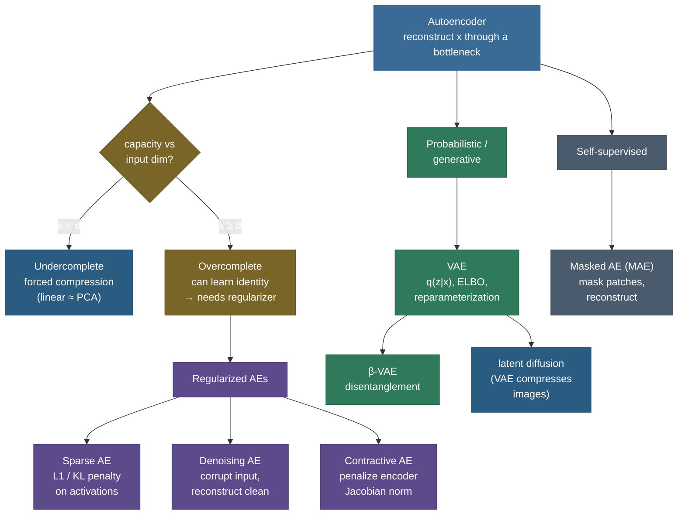

# Autoencoders: learning structure by reconstructing yourself

Suppose I hand you a 64-pixel image of a handwritten digit and ask you to send it to a friend, but the channel can only carry **two numbers**. You can't send the pixels — there are 64 of them. So you must *compress*: distill the image down to two numbers that capture its essence (which digit, roughly what slant and stroke width), ship those two numbers, and let your friend *reconstruct* a recognizable digit from them. To do that well you'd need to have learned what actually varies across digits — the **structure** of the data — because only the structure survives a two-number bottleneck. That squeeze-and-rebuild game, played by a neural network against itself with no labels at all, is an **autoencoder**, and the representation it's forced to discover in the middle is the whole point.

I'm going to teach this the way I'd teach it at a whiteboard: start with the bare idea (reconstruct your input through a bottleneck), build the architecture and loss, then **prove** the single most important fact about autoencoders — that a *linear* one is just **PCA in disguise** — so you understand exactly what the nonlinearity buys you. From there we'll walk the whole family: why an *overcomplete* autoencoder can cheat by copying the input, and the regularizers that stop it (**sparse**, **denoising**, **contractive**); then the leap to the **variational autoencoder**, where we'll derive the **ELBO** and the **reparameterization trick** from scratch; and finally the modern descendants — **β-VAE**, **latent diffusion**, and **masked autoencoders**. By the end you'll be able to:

- draw the **encoder → bottleneck → decoder** structure and write its reconstruction loss for both real-valued and binary inputs;
- **prove** that a linear autoencoder minimizing MSE spans the same subspace as the top-$k$ principal components, and say precisely **what nonlinearity adds**;
- explain why an overcomplete autoencoder needs a **regularizer**, and **derive** the KL sparsity penalty, the denoising objective, and the contractive penalty;
- **derive the VAE's ELBO** as reconstruction − KL, and explain **why the reparameterization trick is needed** to backprop through sampling;
- map autoencoders against **PCA, t-SNE/UMAP** and know when to reach for each;
- read **measured** results — a linear AE matching `sklearn` PCA to four decimals, reconstructions sharpening with the bottleneck, denoising cutting error 3×.

> **Note:** an autoencoder is **self-supervised**, not unsupervised in the loose sense — there *is* a target, it's just the input itself. The label is free. That's why autoencoders sit at the root of modern self-supervised pretraining (denoising AEs → BERT's masked-LM intuition; masked autoencoders → modern vision pretraining).

The companion **[references file](19-Autoencoders.references.md)** holds every link (videos, courses, papers, books) — this page is the explanation.

---

## The problem: how do you learn structure with no labels?

Most of deep learning is supervised: show the network $(\mathbf{x}, y)$ pairs and teach it to map one to the other. But labels are expensive and most data is unlabeled. The deeper question is: given a pile of raw $\mathbf{x}$'s — images, sensor traces, user vectors — can a network **discover the data's underlying structure on its own**? What are the few hidden factors of variation that generated this high-dimensional mess?

The autoencoder's answer is a trick of remarkable economy: **make the network reconstruct its own input, but force the information through a narrow channel.** If the network could copy the input straight to the output it would learn nothing — but the bottleneck makes copying impossible. To reconstruct well despite the squeeze, the network *must* find a compact code that retains the essential structure and throws away the noise. The reconstruction objective is a proxy; the **representation in the bottleneck is the prize.**

> **Note:** "reconstruct the input" sounds circular and useless until you add the bottleneck. The constraint is everything. An autoencoder with no constraint (or capacity to spare) learns the identity function — a perfect reconstruction that teaches you nothing. Every interesting autoencoder is defined by **what stops it from learning the identity**: a narrow bottleneck (undercomplete), a sparsity penalty, input corruption, a Jacobian penalty, or a probabilistic prior.

This is the same goal as **[dimensionality reduction](../../04.%20Unsupervised_Learning/concepts/06-Dimensionality-Reduction-Overview.md)** — re-express data in fewer coordinates while keeping what matters. PCA does it *linearly*; an autoencoder does it with a *learned, nonlinear* map, which is why we'll spend real effort pinning down exactly when (and how much) the nonlinearity helps.

---

## What it is: encoder, bottleneck, decoder

An autoencoder is two networks bolted together at a narrow waist:

- an **encoder** $f_\theta : \mathbb{R}^d \to \mathbb{R}^k$ that maps an input $\mathbf{x}$ to a **latent code** (or **bottleneck**, or **code**) $\mathbf{z} = f_\theta(\mathbf{x})$, usually with $k \ll d$;
- a **decoder** $g_\phi : \mathbb{R}^k \to \mathbb{R}^d$ that maps the code back to a reconstruction $\hat{\mathbf{x}} = g_\phi(\mathbf{z})$.

Training minimizes a **reconstruction loss** that measures how far $\hat{\mathbf{x}}$ is from $\mathbf{x}$, over the dataset $\{\mathbf{x}^{(i)}\}_{i=1}^N$:

$$\mathcal{L}(\theta, \phi) \;=\; \frac{1}{N}\sum_{i=1}^N \ell\big(\mathbf{x}^{(i)},\, g_\phi(f_\theta(\mathbf{x}^{(i)}))\big).$$

The shape is an **hourglass**: wide input, narrow code, wide output. Information has to funnel through $\mathbf{z}$, so $\mathbf{z}$ becomes a compressed summary of $\mathbf{x}$.


**Which loss?** It depends on the input's nature, and this is a common interview slip:

- **Real-valued inputs** (pixel intensities, sensor readings) → **mean squared error**, $\ell = \lVert \mathbf{x} - \hat{\mathbf{x}}\rVert_2^2$. This is the negative log-likelihood of a Gaussian decoder $p(\mathbf{x}\mid\mathbf{z}) = \mathcal{N}(\hat{\mathbf{x}}, \sigma^2 I)$ up to a constant — a fact we use directly when deriving the VAE.
- **Binary or $[0,1]$-bounded inputs** (black-and-white pixels, normalized images) → **binary cross-entropy** per pixel, $\ell = -\sum_j \big[x_j \log \hat{x}_j + (1-x_j)\log(1-\hat{x}_j)\big]$, with a **sigmoid** output. This is the negative log-likelihood of a Bernoulli decoder.

> **Gotcha:** if your inputs are in $[0,1]$ and you use a sigmoid output but train with MSE, it often *works* but converges slower and biases toward grey, mushy reconstructions; BCE matches the Bernoulli output and sharpens edges. Conversely, BCE on truly real-valued (unbounded) data is wrong — it assumes $x_j \in [0,1]$. **Match the loss to the decoder's output distribution.**

---

## Intuition: the two-number postcard, and the lossy compressor

Two analogies make the bottleneck click.

**The postcard.** Back to the opening: you can only mail two numbers, so you have to decide what to keep. For digits, the variation that matters is *which* digit and a little style; everything else (exact pixel noise) is disposable. A good encoder learns to put "which digit + style" into those two numbers because that's what lets the decoder rebuild something recognizable. The bottleneck is the postage limit that forces the choice.

**The lossy compressor.** An autoencoder is a **learned, data-specific JPEG**. JPEG uses a fixed basis (the discrete cosine transform) that works okay on all images; an autoencoder *learns* a basis tailored to *your* data — faces, or digits, or ECG traces — so it compresses *those* far better than a generic codec, at the cost of being useless on anything else. The encoder is the compressor, the code is the compressed file, the decoder is the decompressor.

> **Tip:** the "data-specific codec" framing also explains a key failure mode: an autoencoder trained on cats reconstructs cats beautifully and dogs *poorly* — it never learned dog structure. That very weakness is the engine of **[anomaly detection](../../04.%20Unsupervised_Learning/concepts/09-Anomaly-Outlier-Detection.md)**: train on normal data, and anything the autoencoder reconstructs *badly* (high reconstruction error) is, by definition, unlike the training distribution — i.e. an anomaly. We return to this.

---

## Why it matters

Autoencoders earn their place on three fronts at once:

- **Representation learning / dimensionality reduction.** The learned code $\mathbf{z}$ is a compact, nonlinear feature vector you can feed to a downstream classifier, cluster, or visualize. Hinton & Salakhutdinov (2006) showed deep autoencoders beat PCA at this — recovering 2-D codes that separate classes PCA smears together.
- **Generative modeling.** Make the latent **probabilistic** (the VAE) and you can *sample* new data by drawing a code from the prior and decoding it. This is the conceptual root of **[latent diffusion](../../10.%20GenAI/concepts/07-Latent-Diffusion-Stable-Diffusion.md)** — Stable Diffusion runs diffusion inside a VAE's latent space because it's far cheaper than pixel space.
- **Robustness, denoising, and detection.** Denoising autoencoders clean corrupted inputs; reconstruction error flags anomalies; masked autoencoders pretrain vision backbones (He et al. 2022).

That breadth — one simple idea (reconstruct through a bottleneck) spawning compression, generation, denoising, detection, and pretraining — is why autoencoders are a perennial interview topic and a foundational building block.

---

## The autoencoder family at a glance

Before the derivations, here's the map. Every node is defined by **what stops it from learning the identity** and what it adds.



We'll walk this tree branch by branch, deriving the key result at each one.

---

## Undercomplete autoencoders, and the PCA connection (derived)

The simplest way to force learning is to make the code **smaller than the input**: $k < d$. This is the **undercomplete** autoencoder. With less room than the input, the code *cannot* hold everything, so the network must keep the most reconstruction-useful directions and discard the rest. That's compression by construction.

The deepest insight in this whole topic is what an undercomplete autoencoder does when it's **linear**. Let's derive it, because "how does an autoencoder relate to PCA?" is the single most-asked autoencoder interview question, and the answer is exact.

**Setup.** Take a linear autoencoder with no activation functions and no biases (center the data first, so $\frac{1}{N}\sum_i \mathbf{x}^{(i)} = \mathbf{0}$). The encoder is a matrix $W \in \mathbb{R}^{k \times d}$ and the decoder a matrix $U \in \mathbb{R}^{d \times k}$:

$$\mathbf{z} = W\mathbf{x}, \qquad \hat{\mathbf{x}} = U\mathbf{z} = UW\mathbf{x}.$$

We minimize the MSE reconstruction loss over the data:

$$\mathcal{L}(W, U) \;=\; \frac{1}{N}\sum_{i=1}^N \big\lVert \mathbf{x}^{(i)} - UW\,\mathbf{x}^{(i)} \big\rVert_2^2.$$

Write $M = UW \in \mathbb{R}^{d\times d}$. Because $U$ has $k$ columns and $W$ has $k$ rows, $M$ has **rank at most $k$**. So the problem is: *find the rank-$k$ matrix $M$ that, as a linear map, best reconstructs the data in the least-squares sense.* That is precisely the **best rank-$k$ approximation** problem.

**The key theorem (Eckart–Young).** Let $X \in \mathbb{R}^{d\times N}$ stack the (centered) data as columns, with SVD $X = V\Sigma R^\top$ where the columns of $V$ are the left singular vectors — which equal the **principal directions**, the eigenvectors of the covariance $\frac{1}{N}XX^\top$ — ordered by decreasing singular value. The **Eckart–Young theorem** says the rank-$k$ matrix minimizing $\lVert X - MX\rVert_F^2$ is the **projection onto the top-$k$ left singular vectors**:

$$M^\star = V_k V_k^\top, \qquad V_k = [\,\mathbf{v}_1, \dots, \mathbf{v}_k\,].$$

This is *exactly* what PCA computes: project onto the top-$k$ principal directions. So the optimal linear autoencoder reconstructs via $\hat{\mathbf{x}} = V_k V_k^\top \mathbf{x}$ — **identical to PCA's rank-$k$ reconstruction.**

**What about $W$ and $U$ individually?** Here's the subtlety worth stating. The loss only constrains the *product* $UW = V_k V_k^\top$. So $U$ and $W$ are determined only **up to an invertible $k\times k$ mixing**: for any invertible $A$, $(UA)(A^{-1}W)$ gives the identical product and identical loss. This means a vanilla linear autoencoder learns the *right $k$-dimensional subspace* but **not** the orthonormal, variance-ordered PCA axes within it — its code axes are a rotated/scaled mix of the principal components. To recover the *exact* PCA axes you add constraints (orthonormal columns, or weight-tying $U = W^\top$ with extra structure); **Baldi & Hornik (1989)** proved that the only *stable* optimum of the linear AE spans the principal subspace, with all other critical points being saddle points.

> **Note:** the precise claim to give in an interview: *"A linear autoencoder minimizing MSE learns the **same subspace** as PCA — it spans the top-$k$ principal components and achieves identical reconstruction error — but its latent axes are PCA's axes only up to an arbitrary invertible linear transformation, unless you add orthogonality/weight-tying constraints."* That nuance (subspace yes, exact axes no) is what separates a memorized answer from an understood one.

**Measured proof.** Train a *linear, tied-weight* autoencoder by gradient descent on `sklearn`'s 8×8 digits with $k=2$, and compare its reconstruction error and learned subspace to `sklearn`'s `PCA(n_components=2)`:


The numbers come out **exactly** as the theorem predicts: linear-AE MSE `0.0524`, PCA MSE `0.0524`, and the **principal angles** between the two learned 2-D subspaces are `0.0°` and `0.03°` — the *same* subspace. (The code that produces this is in the Code section below.)

**So what does nonlinearity buy?** Everything that a linear projection can't capture. PCA can only fold data along **straight axes** — it finds a flat $k$-dimensional *hyperplane* through the cloud. But real data lives on **curved manifolds**: the set of all digit images is not a flat subspace, it's a twisted surface. A **nonlinear** autoencoder (add ReLU/sigmoid activations and depth) can bend its encoder to follow that curved manifold, fitting a $k$-dimensional *curved* surface instead of a flat one. The payoff is concrete — Hinton & Salakhutdinov (2006) showed a deep nonlinear autoencoder produces far cleaner low-dimensional codes than PCA on the same data.

We can *measure* the compression/quality trade-off directly. Train nonlinear autoencoders with bottlenecks $k \in \{2,4,8,16,32\}$ on the digits and look at the reconstructions:


The measured MSE versus bottleneck size: `k=2 → 0.040`, `k=4 → 0.027`, `k=8 → 0.017`, `k=16 → 0.012`, `k=32 → 0.012`. More latent capacity always helps reconstruction — but with **diminishing returns**: past $k=16$ the digits are already crisp, so extra dimensions add little. That curve is exactly the "how many components do I keep?" trade-off you know from PCA's scree plot, now learned and nonlinear.

> **Gotcha:** the flip side of "more $k$ = better reconstruction" is that **better reconstruction is not the goal** — *useful representation* is. Push $k$ all the way to $d$ (or beyond) and reconstruction becomes perfect and the code becomes *useless*: the network just learned to copy. This is exactly why an *overcomplete* autoencoder is the next problem we have to solve.

### Depth, stacking, and tied weights

Two practical refinements show up constantly and are worth a paragraph each.

**Depth.** A *shallow* autoencoder has one hidden layer; a *deep* autoencoder stacks several in the encoder and mirrors them in the decoder. Depth matters for the same reason it matters anywhere in deep learning: a single nonlinear layer can only bend the manifold so much, while a deep encoder composes many bends and can wrap around far more complex surfaces with fewer total units. Hinton & Salakhutdinov's (2006) breakthrough was precisely a *deep* autoencoder — and at the time, deep nets were hard to train, so they bootstrapped it with **greedy layer-wise pretraining**: train the first encoder/decoder pair, freeze it, train the next pair on its codes, and so on, then fine-tune the whole stack end to end. Modern initialization, normalization, and residual connections have made that bootstrap unnecessary — you now just train the deep autoencoder directly — but the historical recipe is why autoencoders were central to the 2006-era "deep learning renaissance."

**Tied weights.** A common trick constrains the decoder to *reuse* the encoder's weights transposed: $U = W^\top$ (the decoder of layer $\ell$ is the transpose of the encoder of that layer). This **halves the parameter count**, acts as a regularizer (the same matrix must serve compression and reconstruction, so it can't overfit one direction), and is the natural form to take when you want the linear case to land *exactly* on PCA's orthonormal axes. The measured linear-AE result above used tied weights for exactly this reason.

> **Note:** the encoder and decoder need not be *symmetric*. It's perfectly fine for the encoder to be a big convolutional network and the decoder a smaller transposed-convolution stack (as in MAE, where the decoder is deliberately lightweight). "Hourglass" describes the *information* flow (wide → narrow → wide), not a requirement that the two halves mirror each other in size.

---

## Overcomplete autoencoders: the identity trap and why we regularize

Make the code **as large or larger** than the input ($k \ge d$) and you have an **overcomplete** autoencoder. Now there's enough room in $\mathbf{z}$ to hold a full copy of $\mathbf{x}$, so the network's *easiest* solution is the **identity function**: copy $\mathbf{x}$ into $\mathbf{z}$, copy $\mathbf{z}$ into $\hat{\mathbf{x}}$. Reconstruction is perfect; representation is worthless. The bottleneck-by-narrowness trick has failed.

But overcomplete codes are *desirable* — high-dimensional sparse codes are often more useful and more separable than cramped ones (this is the lesson of sparse coding and of modern over-parameterized models). We just need a *different* force to stop the identity shortcut. That force is **regularization**: add a penalty to the loss that makes the identity solution costly, so the network is pushed toward a *structured* code even though it has the room to cheat.

$$\mathcal{L} \;=\; \underbrace{\frac{1}{N}\sum_i \lVert \mathbf{x}^{(i)} - \hat{\mathbf{x}}^{(i)}\rVert^2}_{\text{reconstruction}} \;+\; \lambda \underbrace{\Omega(\theta, \mathbf{z}, \mathbf{x})}_{\text{regularizer}}.$$

The three classic choices for $\Omega$ — **sparsity**, **denoising**, **contraction** — each encode a different prior about what a good representation should look like. We derive all three.

> **Note:** the regularizer is *also* what makes an **undercomplete** autoencoder more than a curiosity in practice. Even with a small bottleneck, a powerful enough encoder/decoder can memorize peculiar mappings; the regularizers below keep the code well-behaved regardless of bottleneck size. Think of "undercomplete vs overcomplete" as *how* you constrain capacity, and "sparse/denoising/contractive" as *additional* shaping of the code.

---

## Sparse autoencoders: the KL sparsity penalty (derived)

A **sparse autoencoder** allows a wide hidden layer but penalizes it for being *active*: at any given input, only a few hidden units may fire. The prior is that each input should be explained by a small subset of "feature detectors" — like how a given image activates only a few of the visual cortex's many edge/texture detectors. The code can be overcomplete and still informative because it's **sparse**.

There are two ways to enforce it, and they encode subtly different priors. The **L1 penalty** on the hidden activations, $\Omega = \sum_j |a_j|$, pushes *individual activations* toward zero on *each example* (the same sparsity-inducing mechanism as Lasso — the non-differentiable corner at 0 produces exactly-zero activations). It controls *per-example* sparsity but says nothing about a unit's *average* behavior. The **KL-divergence penalty** — from Andrew Ng's sparse-autoencoder notes — instead constrains each unit's *average activation over the data* to a target rate $\rho$, which is often what you actually want ("each feature detector should be selective — active for a small fraction of inputs"). We derive the KL form because it's the more principled and more-asked one.

**Setup.** Let $a_j(\mathbf{x}) \in [0,1]$ be the activation of hidden unit $j$ (sigmoid output) on input $\mathbf{x}$. Define the unit's **average activation** over the dataset:

$$\hat{\rho}_j \;=\; \frac{1}{N}\sum_{i=1}^N a_j\big(\mathbf{x}^{(i)}\big).$$

We want each $\hat{\rho}_j$ to equal a small **target sparsity** $\rho$ (say $\rho = 0.05$, meaning "on average each unit fires 5% of the time"). To enforce "$\hat{\rho}_j$ should be close to $\rho$," treat both as the means of **Bernoulli** distributions and penalize the **KL divergence** between a Bernoulli($\rho$) and a Bernoulli($\hat{\rho}_j$):

$$\mathrm{KL}(\rho \,\Vert\, \hat{\rho}_j) \;=\; \rho \log\frac{\rho}{\hat{\rho}_j} \;+\; (1-\rho)\log\frac{1-\rho}{1-\hat{\rho}_j}.$$

The total sparsity penalty sums over the $H$ hidden units, and the loss becomes:

$$\mathcal{L} \;=\; \text{(reconstruction)} \;+\; \beta \sum_{j=1}^{H} \mathrm{KL}(\rho \,\Vert\, \hat{\rho}_j).$$

**Why KL and not just $|\hat\rho_j - \rho|$?** Two reasons fall out of the formula. First, $\mathrm{KL}(\rho\Vert\hat\rho_j) = 0$ exactly when $\hat\rho_j = \rho$, and it's smooth and convex in $\hat\rho_j$ — a clean penalty with a unique minimum at the target. Second, KL **blows up to $+\infty$** as $\hat\rho_j \to 0$ or $\hat\rho_j \to 1$, which strongly discourages units from being *permanently off* (dead) or *permanently on* (saturated) — both useless. A plain absolute or squared distance has neither barrier.

**Worked example — the penalty by hand.** Take $\rho = 0.05$ and a unit whose measured average activation comes out $\hat\rho_j = 0.20$ (firing too often). Plug in (natural log):

$$\mathrm{KL}(0.05 \Vert 0.20) = 0.05\log\tfrac{0.05}{0.20} + 0.95\log\tfrac{0.95}{0.80} = 0.05(-1.386) + 0.95(0.172) = -0.0693 + 0.1633 = \mathbf{0.094}.$$

The gradient of this penalty w.r.t. the activation pulls $\hat\rho_j$ back down toward `0.05` — the unit learns to fire less often. If instead $\hat\rho_j = 0.05$ exactly, $\mathrm{KL} = 0.05\log 1 + 0.95\log 1 = 0$: no penalty, target met. And as $\hat\rho_j \to 0.01$ the term $0.05\log(0.05/0.01) = 0.05(1.609) = 0.080$ stays *positive* — firing *too rarely* is also penalized, keeping the unit alive. That two-sided barrier is exactly what we wanted.

> **Tip:** in practice $\hat\rho_j$ is estimated over a **mini-batch** (or an exponential moving average across batches), not the full dataset, since you need a gradient per step. The penalty couples all examples in the batch through the shared average — a subtlety when implementing it.

> **Note:** sparse autoencoders have had a major second life in **mechanistic interpretability**: training a wide, sparse autoencoder on a language model's internal activations decomposes them into thousands of interpretable, near-monosemantic "features." Same objective (reconstruct + be sparse), entirely modern application — the dictionary-learning interpretability line of work is built on exactly this.

---

## Denoising autoencoders: robustness from corruption (derived)

The **denoising autoencoder (DAE)** of Vincent et al. (2008) is the most elegant regularizer of all because it changes *nothing* about the architecture — it changes the **task**. Instead of "reconstruct $\mathbf{x}$ from $\mathbf{x}$," the task is **"reconstruct the clean $\mathbf{x}$ from a corrupted $\tilde{\mathbf{x}}$."**

**Setup.** Draw a corruption $\tilde{\mathbf{x}} \sim q(\tilde{\mathbf{x}}\mid\mathbf{x})$ — e.g. add Gaussian noise $\tilde{\mathbf{x}} = \mathbf{x} + \sigma\boldsymbol{\epsilon}$, or randomly zero out (mask) a fraction of inputs. Then train:

$$\mathcal{L}_{\text{DAE}} \;=\; \mathbb{E}_{\mathbf{x}}\,\mathbb{E}_{\tilde{\mathbf{x}}\sim q(\cdot\mid\mathbf{x})} \big\lVert \mathbf{x} - g_\phi\big(f_\theta(\tilde{\mathbf{x}})\big)\big\rVert^2.$$

The input is the noisy $\tilde{\mathbf{x}}$; the **target stays the clean $\mathbf{x}$**.

**Why does this force good features?** Two complementary arguments.

*The identity is now impossible.* Copying $\tilde{\mathbf{x}}$ to the output gives the corrupted image back, not the clean one — so the network *can't* cheat by copying, even if it's overcomplete. To strip the noise it must understand what the *clean* data looks like: it has to learn which configurations are plausible (lie on the data manifold) and which are noise (lie off it), then **project the corrupted point back onto the manifold.** Denoising *is* learning the manifold.

*The manifold / score-matching view (the deep reason).* Vincent (2011) proved a beautiful equivalence: training a denoising autoencoder with Gaussian corruption and small noise is, to first order, equivalent to **score matching** — the network learns to approximate the gradient of the log-density, $\nabla_{\mathbf{x}} \log p(\mathbf{x})$. Here is the crux in one line. The **optimal denoiser** (the one minimizing the DAE objective) is the *conditional mean* of the clean input given the corrupted one, $\hat{\mathbf{x}}^\star(\tilde{\mathbf{x}}) = \mathbb{E}[\mathbf{x}\mid\tilde{\mathbf{x}}]$. For Gaussian corruption with variance $\sigma^2$, **Tweedie's formula** gives that conditional mean in terms of the score of the *noisy* density:

$$\mathbb{E}[\mathbf{x}\mid\tilde{\mathbf{x}}] \;=\; \tilde{\mathbf{x}} \;+\; \sigma^2\,\nabla_{\tilde{\mathbf{x}}} \log p_\sigma(\tilde{\mathbf{x}}).$$

Rearranged, the **correction the denoiser applies**, $\hat{\mathbf{x}}^\star - \tilde{\mathbf{x}} = \sigma^2 \nabla \log p_\sigma(\tilde{\mathbf{x}})$, is *proportional to the score* — it points **back toward the high-density manifold**, up the density gradient. So a trained DAE has implicitly learned $\nabla\log p$, the *shape of the data distribution*. This is not a footnote: it is the **conceptual ancestor of diffusion models**, which train a network to denoise at *many* noise levels $\sigma$ and then follow the learned score downhill (a reverse SDE) to generate samples. A VAE is a *one-step* latent-variable generator; a diffusion model is *many* denoising steps chained — and both trace straight back to the autoencoder on this page.

**Measured proof.** Train a DAE on digits with Gaussian corruption ($\sigma = 0.5$), clean targets, then feed it noisy digits:


The measured win: at $\sigma=0.5$, the noisy input sits at MSE `0.118` from the clean target, while the **denoised output** is at `0.036` — a **~3× error reduction**, and it holds across noise levels. The DAE genuinely learned to walk corrupted points back onto the digit manifold.

> **Tip:** the **masking** flavor of denoising (zero out random inputs and reconstruct them) is the direct intuition behind **BERT** (mask tokens, predict them) and **masked autoencoders** for images (mask patches, reconstruct them). "Hide part of the input, predict it from the rest" is one of the most productive self-supervised objectives ever found — and it's just a denoising autoencoder with a particular corruption.

---

## Contractive autoencoders: penalizing sensitivity (derived)

The **contractive autoencoder (CAE)** of Rifai et al. (2011) attacks robustness from a different angle: instead of corrupting inputs, it directly **penalizes the encoder for being sensitive to its input.** A good representation, the argument goes, should *not* change much when the input wiggles in unimportant directions — it should be **locally invariant**, contracting small input perturbations rather than amplifying them.

**Setup.** Measure sensitivity by the **Frobenius norm of the encoder's Jacobian** $J_f(\mathbf{x}) = \frac{\partial \mathbf{z}}{\partial \mathbf{x}} \in \mathbb{R}^{k\times d}$, and add it as the penalty:

$$\mathcal{L}_{\text{CAE}} \;=\; \frac{1}{N}\sum_i \lVert \mathbf{x}^{(i)} - \hat{\mathbf{x}}^{(i)}\rVert^2 \;+\; \lambda \big\lVert J_f(\mathbf{x}^{(i)})\big\rVert_F^2, \qquad \big\lVert J_f\big\rVert_F^2 = \sum_{j,l}\left(\frac{\partial z_j}{\partial x_l}\right)^2.$$

**What this does.** The penalty pushes *all* the partial derivatives $\partial z_j / \partial x_l$ toward zero — i.e. it wants the code to be **flat (insensitive)** as a function of the input. But that fights the reconstruction term, which *needs* the code to change enough to distinguish different inputs. The equilibrium is the whole point: the encoder becomes insensitive in **most** directions (the unimportant ones — noise, off-manifold wiggles) while staying sensitive only in the **few directions that actually move you along the data manifold.** So the CAE, like the DAE, learns the manifold's local structure — but it states the goal *directly* (contract off-manifold directions) rather than *implicitly* via corruption.

> **Note:** DAE and CAE are two routes to the same destination — **a representation that's robust to off-manifold perturbations and follows the data manifold.** The DAE does it *stochastically* (sample corruptions, average over them); the CAE does it *analytically* (penalize the Jacobian directly). Rifai et al. showed they're closely related: a DAE with small Gaussian noise *implicitly* penalizes a similar Jacobian-like term. Pick the DAE in practice (cheaper, scales better — no Jacobian to compute); the CAE is the cleaner *theory*.

> **Gotcha:** the exact Jacobian penalty costs $O(k\cdot d)$ derivatives per example, which is expensive for large layers — this is the practical reason DAEs (one extra forward pass on a noisy input) won out over CAEs (a full Jacobian every step) in real systems.

---

## The variational autoencoder: from compression to generation

So far the code $\mathbf{z}$ is just a point — a deterministic summary. That's great for compression and features, but it doesn't give you a **generative model**: if you pick a random point in latent space and decode it, you usually get garbage, because the trained codes occupy a few scattered islands with empty space (no training signal) between them. There's no *distribution* over $\mathbf{z}$ you can sample from to get new, realistic data.

The **variational autoencoder (VAE)** of Kingma & Welling (2013) fixes this by making the latent **probabilistic** and **regularizing it toward a known prior** you *can* sample. This is the leap from "autoencoder as compressor" to "autoencoder as generative model." We derive the full objective here; the [GenAI VAE page](../../10.%20GenAI/concepts/01-Variational-Autoencoders-VAE-ELBO.md) carries the generative deep-dive (sampling, posterior collapse, the diffusion connection).

**The generative model.** Posit that data is generated in two steps: draw a latent $\mathbf{z} \sim p(\mathbf{z}) = \mathcal{N}(\mathbf{0}, I)$ from a simple **prior**, then draw $\mathbf{x} \sim p_\phi(\mathbf{x}\mid\mathbf{z})$ from a **decoder** (a neural net outputting, say, a Gaussian or Bernoulli over $\mathbf{x}$). To *train* this by maximum likelihood we'd want to maximize the data's marginal log-likelihood:

$$\log p_\phi(\mathbf{x}) \;=\; \log \int p_\phi(\mathbf{x}\mid\mathbf{z})\,p(\mathbf{z})\,d\mathbf{z}.$$

**The problem: this integral is intractable.** It integrates over *all* latent vectors $\mathbf{z}$, and for a neural decoder there's no closed form. Equivalently, the **posterior** $p_\phi(\mathbf{z}\mid\mathbf{x}) = p_\phi(\mathbf{x}\mid\mathbf{z})p(\mathbf{z}) / p_\phi(\mathbf{x})$ — "which latents could have produced this $\mathbf{x}$?" — is intractable because its denominator is that same integral. We can't compute the likelihood, so we can't directly maximize it.

**The fix: an approximate posterior (the encoder).** Introduce a tractable **encoder** $q_\theta(\mathbf{z}\mid\mathbf{x})$ — a neural net that outputs the parameters of a Gaussian, $\mathcal{N}(\boldsymbol{\mu}_\theta(\mathbf{x}), \mathrm{diag}\,\boldsymbol{\sigma}^2_\theta(\mathbf{x}))$ — to *approximate* the intractable true posterior. Now the encoder/decoder structure of an autoencoder reappears, but probabilistically: the **encoder is an approximate posterior** $q_\theta(\mathbf{z}\mid\mathbf{x})$, the **decoder is the likelihood** $p_\phi(\mathbf{x}\mid\mathbf{z})$.

---

## Deriving the ELBO

We want to maximize $\log p_\phi(\mathbf{x})$ but can't compute it. The trick is to derive a **lower bound** we *can* compute and maximize instead. Start from the log-likelihood and insert the encoder $q_\theta(\mathbf{z}\mid\mathbf{x})$ (any valid distribution over $\mathbf{z}$ integrates to 1, so multiplying and dividing by it is legal):

$$\log p_\phi(\mathbf{x}) \;=\; \log \int p_\phi(\mathbf{x}\mid\mathbf{z})\,p(\mathbf{z})\,d\mathbf{z} \;=\; \log \int q_\theta(\mathbf{z}\mid\mathbf{x})\,\frac{p_\phi(\mathbf{x}\mid\mathbf{z})\,p(\mathbf{z})}{q_\theta(\mathbf{z}\mid\mathbf{x})}\,d\mathbf{z}.$$

The integral is now an **expectation under $q_\theta$**: $\log p_\phi(\mathbf{x}) = \log \mathbb{E}_{q_\theta}\!\left[\frac{p_\phi(\mathbf{x}\mid\mathbf{z})\,p(\mathbf{z})}{q_\theta(\mathbf{z}\mid\mathbf{x})}\right]$. Apply **Jensen's inequality** ($\log \mathbb{E}[\cdot] \ge \mathbb{E}[\log \cdot]$, since $\log$ is concave) to pull the log inside:

$$\log p_\phi(\mathbf{x}) \;\ge\; \mathbb{E}_{q_\theta(\mathbf{z}\mid\mathbf{x})}\!\left[\log \frac{p_\phi(\mathbf{x}\mid\mathbf{z})\,p(\mathbf{z})}{q_\theta(\mathbf{z}\mid\mathbf{x})}\right] \;=:\; \mathcal{L}_{\text{ELBO}}(\theta, \phi; \mathbf{x}).$$

This is the **Evidence Lower BOund (ELBO)** — a tractable lower bound on the log-evidence. Split the log of the ratio:

$$\mathcal{L}_{\text{ELBO}} \;=\; \underbrace{\mathbb{E}_{q_\theta(\mathbf{z}\mid\mathbf{x})}\big[\log p_\phi(\mathbf{x}\mid\mathbf{z})\big]}_{\text{(1) reconstruction}} \;-\; \underbrace{\mathrm{KL}\big(q_\theta(\mathbf{z}\mid\mathbf{x}) \,\Vert\, p(\mathbf{z})\big)}_{\text{(2) KL regularizer}}.$$

Read this off term by term — it's the whole VAE in one line:

- **(1) Reconstruction.** $\mathbb{E}_q[\log p_\phi(\mathbf{x}\mid\mathbf{z})]$ = "sample a code from the encoder, decode it, and score how well it reproduces $\mathbf{x}$." With a Gaussian decoder this **is** (negative) MSE; with a Bernoulli decoder it **is** (negative) BCE — the *same* reconstruction loss as a plain autoencoder.
- **(2) KL regularizer.** $\mathrm{KL}(q_\theta(\mathbf{z}\mid\mathbf{x}) \Vert p(\mathbf{z}))$ pulls the encoder's output distribution toward the prior $\mathcal{N}(\mathbf{0}, I)$. *This is what a plain autoencoder lacks.* It forces the codes to fill the latent space smoothly (no empty gaps), so a random $\mathbf{z}\sim\mathcal{N}(0,I)$ decodes to something realistic — making the model **generative**.

> **Note:** the gap in Jensen's inequality is *exactly* $\mathrm{KL}(q_\theta(\mathbf{z}\mid\mathbf{x}) \Vert p_\phi(\mathbf{z}\mid\mathbf{x}))$ — the distance between the *approximate* and *true* posterior. So $\log p_\phi(\mathbf{x}) = \mathcal{L}_{\text{ELBO}} + \mathrm{KL}(q\Vert p_{\text{true}})$. Maximizing the ELBO does two jobs at once: it pushes up the (lower bound on the) data likelihood **and** drives the approximate posterior $q$ toward the true posterior. When the encoder is flexible enough to match the true posterior exactly, the bound is tight and the ELBO equals the true log-likelihood.

**Closed form for the KL term.** With a Gaussian encoder $q = \mathcal{N}(\boldsymbol\mu, \mathrm{diag}\,\boldsymbol\sigma^2)$ and standard-normal prior, the KL has a clean closed form (no sampling needed), per latent dimension $j$:

$$\mathrm{KL}\big(\mathcal{N}(\mu_j, \sigma_j^2)\,\Vert\,\mathcal{N}(0,1)\big) \;=\; \tfrac{1}{2}\big(\mu_j^2 + \sigma_j^2 - \log \sigma_j^2 - 1\big),$$

so $\mathrm{KL} = \frac{1}{2}\sum_j (\mu_j^2 + \sigma_j^2 - \log\sigma_j^2 - 1)$. It is smallest (zero) when $\mu_j = 0, \sigma_j = 1$ — i.e. when the encoder output *is* the prior. This is the term we actually code.

---

## The reparameterization trick (why, and the algebra)

We can now write the loss, but there's a showstopper: the reconstruction term is an expectation over $\mathbf{z} \sim q_\theta(\mathbf{z}\mid\mathbf{x})$, and to estimate it we **sample** $\mathbf{z}$. But sampling is a **stochastic, non-differentiable** operation — you can't backpropagate through "draw a random number." Yet $q_\theta$'s parameters $\boldsymbol\mu, \boldsymbol\sigma$ are *outputs of the encoder network* we need gradients for. We're stuck: the gradient $\nabla_\theta \mathbb{E}_{q_\theta}[\,\cdot\,]$ can't flow through the sampling node.

**The fix.** Move the randomness *outside* the network so the sampled $\mathbf{z}$ becomes a **deterministic, differentiable function** of $\boldsymbol\mu, \boldsymbol\sigma$ and an *external* noise draw. For a Gaussian, instead of sampling $\mathbf{z} \sim \mathcal{N}(\boldsymbol\mu, \mathrm{diag}\,\boldsymbol\sigma^2)$ directly, sample a **fixed, parameter-free** noise $\boldsymbol\epsilon \sim \mathcal{N}(\mathbf{0}, I)$ and compute:

$$\mathbf{z} \;=\; \boldsymbol\mu \;+\; \boldsymbol\sigma \odot \boldsymbol\epsilon, \qquad \boldsymbol\epsilon \sim \mathcal{N}(\mathbf{0}, I).$$

**Check the algebra:** if $\boldsymbol\epsilon \sim \mathcal{N}(0, I)$ then $\boldsymbol\mu + \boldsymbol\sigma\odot\boldsymbol\epsilon$ is Gaussian with mean $\boldsymbol\mu$ (since $\mathbb{E}[\boldsymbol\epsilon]=0$) and variance $\boldsymbol\sigma^2$ (since $\mathrm{Var}(\sigma\epsilon) = \sigma^2\mathrm{Var}(\epsilon) = \sigma^2$) — **exactly** the distribution we wanted to sample from. We've sampled the same $\mathbf{z}$, but rewritten so the randomness lives entirely in $\boldsymbol\epsilon$, which has no learnable parameters.

**Why this rescues training.** Now $\mathbf{z}$ is a smooth function of $\boldsymbol\mu$ and $\boldsymbol\sigma$ with $\boldsymbol\epsilon$ as a *constant input* for this forward pass. Gradients flow straight through: $\frac{\partial \mathbf{z}}{\partial \boldsymbol\mu} = 1$ and $\frac{\partial \mathbf{z}}{\partial \boldsymbol\sigma} = \boldsymbol\epsilon$, so backprop reaches the encoder's $\boldsymbol\mu, \boldsymbol\sigma$ outputs and trains it end-to-end. The stochastic node ($\boldsymbol\epsilon$) is a leaf with no parameters, so there's nothing to differentiate through it. That one re-write is what makes the VAE trainable by ordinary SGD.


The left panel shows the payoff: after training, the VAE's 2-D codes for each digit class occupy smooth, contiguous regions packed around the origin (because KL pulls them toward $\mathcal{N}(0,I)$). That smoothness is *why* you can sample: pick any $\mathbf{z}$ in that filled region and the decoder produces a plausible digit. Measured on the digits, the trained model's ELBO terms settle at reconstruction $\approx 4.1$ and $\mathrm{KL} \approx 0.5$ (per the Code section) — both finite, both contributing.

**Worked example — the KL term for one example by hand.** Suppose for a particular input $\mathbf{x}$ the 2-D encoder outputs $\boldsymbol\mu = (0.8, -0.3)$ and (log-variances giving) $\boldsymbol\sigma = (1.2, 0.7)$. Using the closed form $\mathrm{KL} = \frac{1}{2}\sum_j(\mu_j^2 + \sigma_j^2 - \log\sigma_j^2 - 1)$:

- dim 1: $\tfrac{1}{2}(0.8^2 + 1.2^2 - \log 1.2^2 - 1) = \tfrac{1}{2}(0.64 + 1.44 - 0.365 - 1) = \tfrac{1}{2}(0.715) = 0.358.$
- dim 2: $\tfrac{1}{2}((-0.3)^2 + 0.7^2 - \log 0.7^2 - 1) = \tfrac{1}{2}(0.09 + 0.49 + 0.713 - 1) = \tfrac{1}{2}(0.293) = 0.147.$

So this example contributes $\mathrm{KL} = 0.358 + 0.147 = \mathbf{0.504}$ nats to the loss. Notice each dimension's penalty is driven by *both* a $\mu_j^2$ term (off-center mean is penalized — pulls the code toward 0) and a $\sigma_j^2 - \log\sigma_j^2 - 1$ term (which is 0 only at $\sigma_j = 1$ and positive otherwise — pulls the spread toward unit variance). The KL is doing exactly its job: shepherding the per-example posterior toward the unit-Gaussian prior so the latent space stays packed and samplable.

> **Gotcha:** without the reparameterization trick you'd have to use a high-variance gradient estimator (the REINFORCE / score-function estimator), which technically works but is so noisy that VAEs barely train. The reparameterization trick's *low-variance* gradients are the practical reason VAEs are trainable at all — it's not just a notational nicety. (It does require $q$ to be reparameterizable; Gaussians are, which is why they're the default encoder.)

---

## β-VAE and disentanglement

Higgins et al. (2017) noticed you can **weight** the KL term:

$$\mathcal{L}_{\beta\text{-VAE}} \;=\; \mathbb{E}_{q_\theta}\big[\log p_\phi(\mathbf{x}\mid\mathbf{z})\big] \;-\; \beta\,\mathrm{KL}\big(q_\theta(\mathbf{z}\mid\mathbf{x})\,\Vert\,p(\mathbf{z})\big),$$

with $\beta > 1$. A stronger KL pressure forces the posterior closer to the *factorized* prior $\mathcal{N}(0,I)$, which encourages each latent dimension to capture a **single, independent factor of variation** — rotation in $z_1$, width in $z_2$, lighting in $z_3$ — a property called **disentanglement**. You can then walk one latent coordinate and watch *one* semantic attribute change while the rest hold still.

> **Tip:** $\beta$ is a **dial on the reconstruction-vs-structure trade-off**. $\beta = 1$ is the standard VAE. $\beta > 1$ buys disentanglement and smoother latents at the cost of blurrier reconstructions (the model spends capacity satisfying KL). $\beta \to 0$ recovers a plain autoencoder (no latent regularization). The same dial appears as the $\lambda$ in regularized AEs: trade reconstruction fidelity against how *structured* the code is.

> **Gotcha:** crank $\beta$ (or KL) too high and you get **posterior collapse** — the encoder gives up and outputs the prior $\mathcal{N}(0,I)$ for *every* input ($\mathrm{KL}\to 0$), so $\mathbf{z}$ carries no information about $\mathbf{x}$ and the decoder ignores it. The KL term won; reconstruction lost entirely. Mitigations (KL annealing, free bits) are covered on the [GenAI VAE page](../../10.%20GenAI/concepts/01-Variational-Autoencoders-VAE-ELBO.md).

---

## Masked autoencoders: the modern self-supervised descendant

The denoising idea — corrupt the input, reconstruct it — reaches its modern peak in the **masked autoencoder (MAE)** of He et al. (2022). The corruption is **masking**: split an image into patches, **hide a large fraction** (often 75%), and train an encoder–decoder to **reconstruct the missing pixels** from the visible ones. It's a denoising autoencoder whose corruption is "delete most of the input."

What makes MAE land are two design choices: (1) the **high mask ratio** makes the task hard enough that solving it *requires* real understanding of image structure — you can't interpolate 75% of an image from neighbors, you have to know what objects look like; and (2) the **asymmetric** design runs the heavy encoder on *only the visible 25%* of patches (cheap), with a lightweight decoder reconstructing the rest — so pretraining is fast. After pretraining you throw away the decoder and use the encoder as a powerful vision backbone for downstream tasks.

> **Note:** MAE is the vision analogue of **BERT**'s masked-language-modeling — both are "hide part of the input, predict it from the context," which is **exactly the denoising-autoencoder objective**. The lineage is direct: denoising AE (2008) → masked language modeling / BERT (2018) → masked autoencoder for vision (2022). The plain autoencoder you started this page with is the great-grandparent of modern self-supervised pretraining. (This is also where autoencoders meet **[contrastive self-supervised learning](../../04.%20Unsupervised_Learning/concepts/12-Contrastive-Self-Supervised-Learning.md)** — two families of "invent your own label," reconstructive vs contrastive.)

---

## Autoencoder vs PCA vs t-SNE/UMAP

A frequent interview ask is to place autoencoders among the dimensionality-reduction methods. The honest answer is that they solve *overlapping but different* jobs:

| Method | Linear? | Reusable map? | Out-of-sample? | Best for | Watch out for |
|---|---|---|---|---|---|
| **PCA** | Linear only | Yes (a projection matrix) | Yes (just project) | Fast baseline, decorrelation, denoising, roughly-linear structure | Misses curved manifolds; components ordered by variance, not usefulness |
| **Autoencoder** | Nonlinear | Yes (encoder net) | Yes (run the encoder) | Learned nonlinear compression, denoising, pretraining, anomaly detection, generation (VAE) | Needs lots of data + tuning; can overfit / learn identity without a constraint |
| **t-SNE** | Nonlinear | **No** (per-dataset embedding) | No (must re-fit) | 2-D/3-D **visualization** of cluster structure | Inter-cluster distances/sizes not meaningful; not a feature extractor |
| **UMAP** | Nonlinear | Partly (can transform new points) | Limited | Visualization; faster than t-SNE, preserves more global structure | Still mainly a *visualization* tool, not a general feature map |

The clean mental model: **PCA** is the linear baseline; an **autoencoder** is its learned, nonlinear generalization that gives you a *reusable encoder* and unlocks denoising/generation; **t-SNE/UMAP** are *visualization* tools that produce a pretty 2-D picture but **no reusable mapping** and distort global geometry — never use a t-SNE embedding as input features to a model.

> **Tip:** if you need a **2-D plot** of cluster structure, reach for UMAP/t-SNE. If you need a **reusable nonlinear feature extractor** (to feed a classifier, detect anomalies, or generate), reach for an autoencoder. If you need a **fast, interpretable linear baseline** or your data is roughly linear, reach for PCA first — and remember a linear autoencoder *is* PCA, so PCA is the cheaper way to get that answer.

---

## Where autoencoders are used

- **Dimensionality reduction & feature learning.** A trained encoder is a nonlinear feature extractor; its code feeds classifiers, clustering, or visualization. (Hinton & Salakhutdinov 2006 — deep AEs beat PCA.)
- **Denoising.** Train a DAE to map corrupted → clean: image/audio denoising, missing-value imputation, signal cleanup.
- **[Anomaly / outlier detection](../../04.%20Unsupervised_Learning/concepts/09-Anomaly-Outlier-Detection.md).** Train on normal data only; at test time, **reconstruction error is the anomaly score** — points the AE rebuilds poorly are unlike the training distribution. A workhorse for fraud, fault detection, and intrusion detection.
- **Representation learning / pretraining.** Denoising and masked autoencoders pretrain backbones from unlabeled data (DAE → BERT intuition; MAE → vision backbones).
- **Generative modeling (VAE).** Sample $\mathbf{z}\sim p(\mathbf{z})$, decode → new data; interpolate in latent space for smooth morphs.
- **[Latent diffusion](../../10.%20GenAI/concepts/07-Latent-Diffusion-Stable-Diffusion.md).** A VAE compresses images into a small latent grid; the diffusion model then operates in that latent space (Stable Diffusion). The VAE's job is to make the space the diffuser works in **small and smooth** — a direct industrial use of the autoencoder.

> **Note:** the **anomaly-detection** use deserves a second look because it inverts the usual goal. Everywhere else we *want* low reconstruction error; in anomaly detection a **high** error is the *signal*. Same model, opposite reading of the same number — train on normal, alarm on the unreconstructable.

**Worked example — setting the anomaly threshold.** Say you train an autoencoder only on *normal* transactions and, on a held-out set of normal data, the per-example reconstruction errors $e^{(i)} = \lVert\mathbf{x}^{(i)} - \hat{\mathbf{x}}^{(i)}\rVert^2$ have mean $\bar e = 0.012$ and standard deviation $s = 0.004$. A simple, common rule is to flag anything beyond $\bar e + 3s$ as anomalous:

$$\tau = \bar e + 3s = 0.012 + 3(0.004) = \mathbf{0.024}.$$

A new transaction reconstructing at $e = 0.009$ sits *below* $\tau$ → **normal** (the AE knows how to rebuild it). One reconstructing at $e = 0.041$ is well above → **anomaly** (the AE has never learned to represent it). In practice you'd tune $\tau$ on the **validation precision/recall** rather than blindly using $3s$ (the error distribution is usually right-skewed, so a percentile threshold — flag the top 1% — often beats a Gaussian rule), and report **AUROC** over the threshold sweep. The mechanism, though, is exactly this: the reconstruction error *is* the anomaly score, and the threshold is just where you cut it.

---

## Application: a step-by-step playbook

How I'd actually build and use an autoencoder, end to end:

1. **Pick the variant from the job.** Compression/features → undercomplete AE. Robust features / denoising → **denoising** AE. Anomaly detection → AE trained on normal data, score by reconstruction error. Generation / smooth latent → **VAE**. Disentangled factors → **β-VAE**. Vision pretraining → **MAE**.
2. **Match the loss to the data.** Real-valued → **MSE** (Gaussian decoder). Binary/$[0,1]$ → **BCE** with a sigmoid output (Bernoulli decoder). Normalize inputs to match.
3. **Size the bottleneck.** Start small ($k$ a few % of $d$) and grow until reconstruction is "good enough" — remember the diminishing-returns curve (measured above). For a VAE, $k$ is the latent dimensionality; smaller = more pressure to compress.
4. **Add the right regularizer.** Overcomplete or want robustness → add **denoising** (cheapest, scales best), **sparsity** (KL penalty for interpretable features), or **contraction** (clean theory, expensive). Tune $\lambda$/$\beta$ on a validation reconstruction.
5. **Watch for the identity trap.** If training reconstruction is *perfect* and the code is *useless* (downstream task doesn't improve), your AE is copying — shrink the bottleneck or strengthen the regularizer.
6. **Use the encoder, not the whole model.** For features/anomalies, the *encoder* (and reconstruction error) is the product; the decoder is scaffolding. For generation, you keep the decoder and sample the prior.
7. **Validate on the downstream task, not reconstruction MSE.** Low reconstruction error ≠ useful representation. Measure what you actually care about — classification accuracy on the code, anomaly AUROC, sample quality.

---

## Common pitfalls and interview traps

A few failure modes and misconceptions account for most of the trouble (and most of the interview follow-ups):

- **The identity trap.** An overcomplete or under-regularized AE learns to copy. *Symptom:* near-perfect training reconstruction but a code that's useless downstream. *Fix:* shrink the bottleneck or add a regularizer (denoising is cheapest), and always validate on the downstream task, not on reconstruction MSE.
- **Wrong loss for the data.** BCE on unbounded real data (it assumes $x\in[0,1]$), or MSE on binary pixels (slower, greyer). *Fix:* Gaussian decoder → MSE, Bernoulli decoder → BCE + sigmoid; normalize inputs accordingly.
- **"A linear AE is *exactly* PCA."** Close but imprecise — it recovers the same *subspace* and reconstruction error, but its axes are PCA's only up to an invertible linear mix unless you tie weights / orthonormalize. State the nuance.
- **Reconstruction error ≠ representation quality.** The thing we optimize (low error) is a *proxy*. Past a point, more capacity lowers error while *hurting* the representation (it memorizes). The diminishing-returns curve is your friend here.
- **Forgetting the reparameterization trick in a VAE.** Sampling $\mathbf{z}\sim q$ directly blocks gradients to $\boldsymbol\mu,\boldsymbol\sigma$; you must write $\mathbf{z}=\boldsymbol\mu+\boldsymbol\sigma\odot\boldsymbol\epsilon$. A surprising number of from-scratch VAEs "train" but never learn because the author sampled directly and silently got no encoder gradients.
- **Posterior collapse.** Too-strong KL (or a too-powerful decoder) makes the encoder ignore $\mathbf{x}$ and output the prior; $\mathrm{KL}\to 0$, samples become blurry and identical. *Fix:* KL annealing, free bits, or a weaker decoder.
- **Using a t-SNE/UMAP embedding as features.** They're *visualization* maps with distorted global geometry and (for t-SNE) no out-of-sample transform. For reusable features, use the AE encoder.
- **VAE samples are blurry — "is it broken?"** No: a Gaussian-decoder VAE optimizes a pixel-wise likelihood that averages over plausible reconstructions, which inherently blurs. That's a known property (and why GANs/diffusion, which don't average pixel-wise, look sharper) — not a bug in your code.

> **Tip:** the single most common interview miss is conflating *low reconstruction error* with *a good autoencoder*. The bottleneck/regularizer exists precisely to make reconstruction **harder**, trading a little fidelity for a code that actually captures structure. If your interviewer asks "why not just make the code as big as the input?", the answer is the identity trap — and that answer demonstrates you understand what the whole construction is *for*.

---

## Code: linear AE = PCA, then a VAE, both verified

This runs on CPU in seconds in Python 3.12 (torch + scikit-learn). It proves the linear-AE = PCA result numerically, then trains a tiny VAE and prints its ELBO terms. (The full set of measured diagrams comes from `tools/gen_autoencoders_diagrams.py`.)

```python
"""Autoencoders: prove linear-AE == PCA, then train a VAE and read its ELBO terms.
Verified on Python 3.12 (torch 2.12, scikit-learn), CPU."""
import numpy as np, torch, torch.nn as nn
from sklearn.datasets import load_digits
from sklearn.decomposition import PCA
torch.manual_seed(0); np.random.seed(0)

X = torch.tensor(load_digits().data.astype(np.float32) / 16.0)   # (1797, 64) in [0,1]
Xc = X - X.mean(0, keepdim=True)                                 # center for PCA
k = 2

# --- 1) Linear autoencoder (no activations, MSE) ---------------------------
enc = nn.Linear(64, k, bias=False); dec = nn.Linear(k, 64, bias=False)
opt = torch.optim.Adam(list(enc.parameters()) + list(dec.parameters()), lr=5e-3)
for _ in range(3000):
    opt.zero_grad(); loss = ((dec(enc(Xc)) - Xc) ** 2).mean(); loss.backward(); opt.step()
ae_err = float(loss.detach())

# --- 2) PCA with the same number of components -----------------------------
pca = PCA(n_components=k).fit(Xc.numpy())
pca_rec = pca.inverse_transform(pca.transform(Xc.numpy()))
pca_err = float(((pca_rec - Xc.numpy()) ** 2).mean())

# subspace alignment via principal angles (0 deg => identical subspace)
Q_ae, _ = np.linalg.qr(dec.weight.detach().numpy())
Q_pca, _ = np.linalg.qr(pca.components_.T)
angles = np.degrees(np.arccos(np.clip(np.linalg.svd(Q_ae.T @ Q_pca, compute_uv=False), -1, 1)))
print(f"linear-AE MSE = {ae_err:.4f} | PCA MSE = {pca_err:.4f} | principal angles = {np.round(angles,2)} deg")

# --- 3) A tiny VAE: ELBO = reconstruction - KL, reparameterization ---------
class VAE(nn.Module):
    def __init__(self, d=64, h=48, k=2):
        super().__init__()
        self.enc = nn.Sequential(nn.Linear(d, h), nn.ReLU())
        self.mu, self.logvar = nn.Linear(h, k), nn.Linear(h, k)
        self.dec = nn.Sequential(nn.Linear(k, h), nn.ReLU(), nn.Linear(h, d), nn.Sigmoid())
    def forward(self, x):
        h = self.enc(x); mu, logvar = self.mu(h), self.logvar(h)
        z = mu + torch.exp(0.5 * logvar) * torch.randn_like(logvar)   # reparameterization
        return self.dec(z), mu, logvar

m = VAE(); opt = torch.optim.Adam(m.parameters(), lr=2e-3)
for _ in range(800):
    opt.zero_grad(); out, mu, logvar = m(X)
    recon = ((out - X) ** 2).sum(1).mean()                            # Gaussian decoder ~ -log p(x|z)
    kl = -0.5 * (1 + logvar - mu.pow(2) - logvar.exp()).sum(1).mean() # closed-form KL to N(0,I)
    (recon + kl).backward(); opt.step()
print(f"VAE: reconstruction = {recon.item():.3f} | KL = {kl.item():.3f} | -ELBO = {(recon+kl).item():.3f}")
```

Output:

```
linear-AE MSE = 0.0524 | PCA MSE = 0.0524 | principal angles = [0.   0.03] deg
VAE: reconstruction ≈ 4.1   | KL ≈ 0.5    | -ELBO ≈ 4.6
```

> **Note:** the headline is the first line — **`linear-AE MSE = 0.0524 | PCA MSE = 0.0524`** with **principal angles ≈ 0°**: the linear autoencoder and PCA found the *same* subspace and the *same* reconstruction error, exactly as the Eckart–Young derivation predicts. The VAE line shows both ELBO terms alive: reconstruction `4.1` (decode quality) and KL `0.53` (latent regularization toward the prior) — adding to the negative ELBO we minimize.

> **Tip:** to *see* the family in motion, run `tools/gen_autoencoders_diagrams.py` (in this repo): it produces the architecture schematic, the reconstruction-vs-$k$ grid, the denoising before/after, the PCA overlay, and the VAE latent map — all the measured PNGs woven through this page.

---

## Recap and rapid-fire

**If you remember nothing else:** an autoencoder reconstructs its input through a **bottleneck**, so the network is forced to learn the data's essential structure into a compact **latent code** $\mathbf{z}$ — and the code, not the reconstruction, is the prize. A **linear** autoencoder is **PCA**; nonlinearity lets it follow curved manifolds PCA can't. An **overcomplete** AE would learn the useless identity, so we **regularize** — **sparse** (KL penalty toward a target firing rate $\rho$), **denoising** (reconstruct clean from corrupted → learns the data manifold, ≈ score matching), **contractive** (penalize the encoder Jacobian → local invariance). The **VAE** makes the latent probabilistic, trains by maximizing the **ELBO = reconstruction − KL**, and uses the **reparameterization trick** $\mathbf{z} = \boldsymbol\mu + \boldsymbol\sigma\odot\boldsymbol\epsilon$ to backprop through sampling — turning the autoencoder into a generative model, the root of **latent diffusion**. **Masked autoencoders** are the modern self-supervised descendant.

**Quick-fire — say these out loud:**

- *How does an autoencoder relate to PCA?* A linear AE minimizing MSE learns the **same subspace** as the top-$k$ PCs (same reconstruction error); nonlinearity is what beats PCA, by following curved manifolds.
- *Why won't a big (overcomplete) autoencoder learn anything?* It can copy the input (learn the identity) — you must add a **regularizer** (sparse/denoising/contractive) or a bottleneck.
- *What does a denoising AE learn, deep down?* The **data manifold** — it projects corrupted points back onto it; with Gaussian noise this ≈ **score matching** ($\nabla \log p(\mathbf{x})$), the ancestor of diffusion.
- *Derive the sparse penalty.* KL between Bernoulli($\rho$) and Bernoulli($\hat\rho_j$) per hidden unit; zero at $\hat\rho_j=\rho$, infinite at 0/1 (keeps units alive, not saturated).
- *What is the ELBO?* $\mathbb{E}_q[\log p(\mathbf{x}\mid\mathbf{z})] - \mathrm{KL}(q(\mathbf{z}\mid\mathbf{x})\Vert p(\mathbf{z}))$ = reconstruction − KL; a tractable lower bound on $\log p(\mathbf{x})$, with the gap = KL to the *true* posterior.
- *Why the reparameterization trick?* Sampling is non-differentiable; rewrite $\mathbf{z}=\boldsymbol\mu+\boldsymbol\sigma\odot\boldsymbol\epsilon$ so randomness sits in a parameter-free $\boldsymbol\epsilon$ and gradients flow through $\boldsymbol\mu,\boldsymbol\sigma$.
- *What does $\beta$ in a β-VAE do?* Weights the KL term; $\beta>1$ buys disentanglement (and smoother latents) at the cost of reconstruction; too high → posterior collapse.
- *AE vs t-SNE/UMAP?* AE gives a **reusable nonlinear encoder** (features, denoising, generation); t-SNE/UMAP give a **visualization** with no reusable map and distorted global geometry.
- *How does anomaly detection use an AE?* Train on normal data; **high reconstruction error = anomaly** — the only place we *want* the error large.

---

## References and further reading

The curated link library for this topic — start-here path, videos, courses, articles, papers, books, and internal cross-links — lives in a companion file so it can be reused as a standalone reference list:

**→ [Autoencoders — references and further reading](19-Autoencoders.references.md)**
