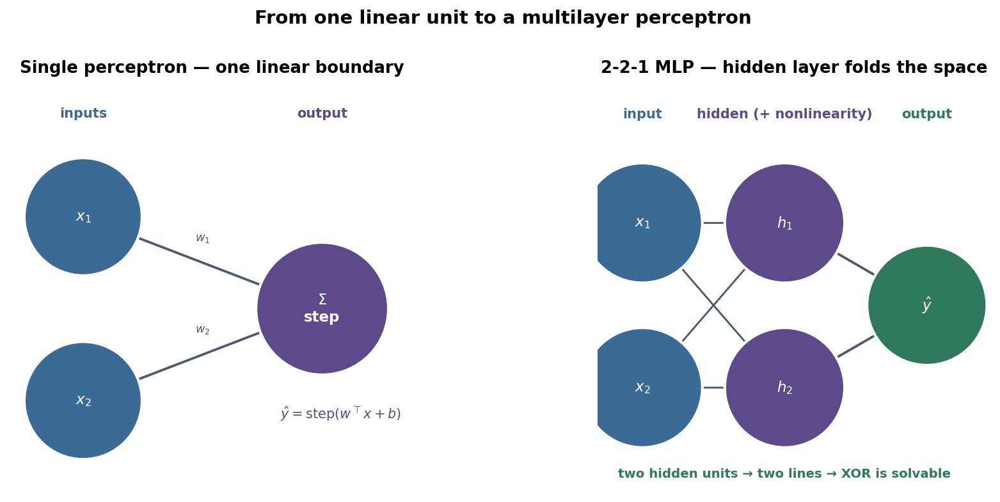
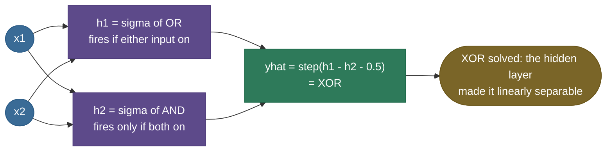

# Perceptron and MLP: from one neuron to a universal function approximator

Deep learning has exactly one origin story, and it starts with a single artificial neuron. In 1958 a psychologist named Frank Rosenblatt wired up a machine that could *learn* to tell two classes of input apart by adjusting its own weights — the **perceptron** — and the New York Times reported the Navy expected it to "walk, talk, see, write, reproduce itself and be conscious of its existence." It could do none of those things. A decade later Marvin Minsky and Seymour Papert proved, with a single devastating example, that one perceptron cannot even compute **XOR** — and the field collapsed into its first winter. Then the same fix that had been hiding in plain sight all along brought it roaring back: **stack the neurons in layers, with a nonlinearity in between**, and the thing that couldn't do XOR can approximate *any* continuous function at all. That stacked network is the **multilayer perceptron (MLP)**, and it is the single most important building block in all of deep learning — the [transformer's](16-Transformer-Architecture.md) feed-forward block *is* an MLP, every classification head *is* a perceptron-with-a-sigmoid.

This page is the complete tour, derived from scratch. By the end you'll be able to:

- define a **perceptron** as a linear threshold unit $\hat y = \text{step}(w^\top x + b)$ and explain each symbol;
- run the **perceptron learning rule** $w \leftarrow w + \eta(y-\hat y)x$ by hand and explain *geometrically why* it works;
- state the **perceptron convergence theorem** and the margin/radius bound behind it;
- **prove** — geometrically and algebraically — that a single perceptron *cannot* represent XOR, and explain the Minsky–Papert critique;
- **solve XOR explicitly** with a 2-2-1 MLP, reading off how the hidden layer builds a new, separable representation;
- state the **universal approximation theorem** precisely, see the bump-construction intuition, and explain its caveats (*existence ≠ learnability*; width can be exponential → why **depth** helps);
- run a forward pass through an MLP **with shapes**, and explain why the **nonlinearity** is non-negotiable;
- connect the step-function perceptron to its smooth cousin [logistic regression](../../03.%20Supervised_Learning/concepts/02-Logistic-Regression.md) and to gradient-descent training via [backprop](02-Backpropagation-and-Computational-Graphs.md).

We'll move in the order the *history* moved: the biological inspiration, the perceptron and its learning rule, the convergence theorem, the XOR catastrophe, the multilayer fix, the universal approximation theorem, and finally the forward pass and code. Intuition first, then the algebra, then runnable proof.

> **Note:** vocabulary that trips people up. A **perceptron** historically means the *linear threshold unit* with a hard step. A **"multilayer perceptron"** confusingly does **not** stack hard-step perceptrons (those can't be trained by gradient descent) — it stacks *smooth* neurons (sigmoid/tanh/ReLU). The name stuck for historical reasons. So "MLP" = a fully-connected feedforward net; "perceptron" = the single hard-threshold unit. We'll keep them distinct throughout.

---

## The problem: can a machine learn to classify on its own?

Before 1958, a "learning machine" meant a human hand-tuning coefficients. The question Rosenblatt asked was sharper: *given labeled examples, can a device adjust its own parameters until it classifies them correctly — with no human in the loop?* That is the seed of all of supervised learning, and the perceptron was the first device to do it with a convergence guarantee.

The setup is the simplest possible classifier. You have input vectors $x \in \mathbb{R}^d$ (say, pixel intensities) each carrying a label $y \in \{0,1\}$ (cat / not-cat). You want a rule that, shown a new $x$, outputs the right label. The perceptron's bet is that a **straight cut** through the input space — a hyperplane — can separate the two classes, and that the machine can *find that cut by itself* from examples. When that bet holds (the data is **linearly separable**), the perceptron is guaranteed to succeed. When it doesn't — XOR — the whole edifice cracks, and that crack is what forced the invention of deep networks.

---

## Biological inspiration: neuron → McCulloch-Pitts → Rosenblatt

The artificial neuron is a deliberate caricature of the biological one, and the caricature is worth seeing because every term in the perceptron equation maps to a piece of it.

A **biological neuron** receives signals at its **dendrites**, each connection having a **synaptic strength** (some excitatory, some inhibitory). The cell body **sums** the weighted incoming signals; if the total crosses a **threshold**, the neuron **fires** an all-or-nothing spike down its axon; otherwise it stays silent. Three features carry over directly: signals are **weighted**, they are **summed**, and the output is a **thresholded** all-or-nothing decision.

The first formalization was the **McCulloch–Pitts neuron** (1943). Warren McCulloch (a neurophysiologist) and Walter Pitts (a logician) showed that a unit which sums binary inputs and fires if the sum exceeds a threshold can implement the logical primitives **AND**, **OR**, and **NOT** — and therefore, wired together, *any* Boolean function. It was a profound claim: networks of simple threshold units are universal for logic. But the M-P neuron had **no learning** — the weights were fixed by hand (typically all +1, with a hand-chosen threshold).

Rosenblatt's leap (1958) was to make the weights **learnable**. He kept the threshold unit but added (a) **real-valued, adjustable weights** and (b) a **learning rule** that nudges those weights from labeled examples. That combination — a thresholded weighted sum *plus* a procedure to learn the weights — is the **perceptron**, and it is the direct ancestor of every neuron in every network today.

> **Note:** the modern artificial neuron drops the biological literalism almost entirely — real neurons spike in time, have complex dendritic computation, and don't do clean backprop. The point of the analogy is *historical and motivational*, not a claim that networks are brains. "Neural network" is a name, not a mechanism.

---

## The perceptron: a linear threshold unit

Strip it to the math. A perceptron has a weight vector $w \in \mathbb{R}^d$, a bias $b \in \mathbb{R}$, and computes:

$$z = w^\top x + b = \sum_{i=1}^{d} w_i x_i + b, \qquad \hat y = \text{step}(z) = \begin{cases} 1 & z \ge 0 \\ 0 & z < 0 \end{cases}$$

Every symbol: $x$ is the input (the dendrites' signals), $w_i$ is the strength of input $i$ (the synaptic weight), $z$ is the **pre-activation** or weighted sum (the cell body's total), $b$ is the **bias** — it shifts the firing threshold (fires when $z\ge 0$, i.e. when $w^\top x \ge -b$, so $-b$ *is* the threshold), and $\text{step}(\cdot)$ is the **Heaviside step** that turns the continuous score into an all-or-nothing decision $\hat y$.

**The geometry — this is the whole story.** The set of points where $z=0$, namely $w^\top x + b = 0$, is a **hyperplane** (a line in 2-D, a plane in 3-D). On one side $z>0$ and the perceptron says 1; on the other $z<0$ and it says 0. So a perceptron is **exactly a linear decision boundary**: a single straight cut. The weight vector $w$ is the **normal** to that hyperplane (it points toward the positive class), and $b$ slides the hyperplane along that normal. Learning a perceptron *is* positioning this one hyperplane.

> **Tip:** the **bias absorption trick** simplifies everything. Append a constant $1$ to every input ($\tilde x = [x; 1]$) and a $b$ to the weights ($\tilde w = [w; b]$); then $\tilde w^\top \tilde x = w^\top x + b$, and you can treat the bias as just another weight on a dummy "always-on" input. We use this silently in most derivations so the bias never needs special handling.

> **Gotcha:** the step is **not differentiable** at $z=0$ and has **zero gradient everywhere else**. That single fact is why you *cannot* train a perceptron with gradient descent (the gradient signal is always zero) — and why the perceptron has its *own* special learning rule, and why MLPs later replace the step with a smooth activation. Hold that thought; it's the bridge to backprop at the end.



---

## The perceptron learning rule, and why it works

Here is the rule Rosenblatt gave for adjusting the weights, applied **one example at a time**:

$$w \leftarrow w + \eta\,(y - \hat y)\,x, \qquad b \leftarrow b + \eta\,(y - \hat y)$$

where $\eta>0$ is the **learning rate** (step size), $y$ is the true label, and $\hat y$ is the perceptron's current prediction. Walk through the three cases of the **error** term $(y-\hat y)$, which can only be $0$, $+1$, or $-1$:

- **Correct ($\hat y = y$):** $(y-\hat y)=0$, so $w$ doesn't move. The rule only touches weights when it makes a mistake. This is its defining property — it is **mistake-driven**.
- **Predicted 0, true 1 ($y-\hat y = +1$):** update is $w \leftarrow w + \eta x$. We *add* the input to the weight vector.
- **Predicted 1, true 0 ($y-\hat y = -1$):** update is $w \leftarrow w - \eta x$. We *subtract* the input.

**Why does adding $x$ on a false-negative fix it?** Look at what happens to the score on that exact example after the update. Before: $z = w^\top x + b$. After adding $\eta x$ to $w$ (and $\eta$ to $b$): the new score is

$$z' = (w + \eta x)^\top x + (b + \eta) = w^\top x + b + \eta(x^\top x + 1) = z + \eta(\|x\|^2 + 1).$$

Since $\eta>0$ and $\|x\|^2 + 1 > 0$, we have $z' > z$ — the score moves **up**, toward the $\ge 0$ region that predicts 1, which is the label we wanted. We didn't necessarily fix it in one step, but we *pushed it in the right direction*. By symmetry, on a false-positive we subtract $x$ and push the score **down**. Geometrically: $w$ is the normal to the boundary, so adding a positive example's $x$ **rotates and shifts the hyperplane toward classifying that point as positive**. The rule literally drags the boundary toward the points it's getting wrong.

> **Note:** the perceptron rule looks almost identical to a gradient-descent step, but it is **not** derived from minimizing a smooth loss (the step's gradient is zero, remember). It's better understood as **stochastic gradient descent on the *perceptron criterion*** $\max(0, -y_{\pm}\, z)$ (with labels coded as $\pm 1$) — a hinge-like loss that is zero on correctly-classified points and linear in the score on mistakes. That's why only misclassified points contribute an update.

**Worked example 1 — run the rule to convergence on AND, by hand.** Inputs and labels for logical AND: $(0,0)\!\to\!0,\ (0,1)\!\to\!0,\ (1,0)\!\to\!0,\ (1,1)\!\to\!1$. Start with $w=(0,0)$, $b=0$, learning rate $\eta=1$, step fires on $z\ge 0$. Sweep the four examples in order; I'll show every update.

| step | $x$ | $z=w^\top x+b$ | $\hat y$ | $y$ | $y-\hat y$ | update | new $(w,b)$ |
|---|---|---|---|---|---|---|---|
| init | — | — | — | — | — | — | $w=(0,0),\,b=0$ |
| 1 | $(0,0)$ | $0$ | $1$ | $0$ | $-1$ | $b\!-\!1$ | $w=(0,0),\,b=-1$ |
| 2 | $(0,1)$ | $-1$ | $0$ | $0$ | $0$ | none | $w=(0,0),\,b=-1$ |
| 3 | $(1,0)$ | $-1$ | $0$ | $0$ | $0$ | none | $w=(0,0),\,b=-1$ |
| 4 | $(1,1)$ | $-1$ | $0$ | $1$ | $+1$ | $w\!+\!x,\,b\!+\!1$ | $w=(1,1),\,b=0$ |

After epoch 1 we have $w=(1,1),\,b=0$. Check all four again: $(0,0)\!\to\!z=0\!\to\!\hat y=1$ but $y=0$ — still a mistake, so it keeps going. Continuing (epoch 2): on $(0,0)$, $z=0,\hat y=1,y=0$, error $-1$ → $b\to -1$, giving $w=(1,1),b=-1$; then $(0,1)\!\to\!0\!\to\!1$ but $y=0$ ✗ → error $-1$, $w\to(1,0),b\to -2$… and so on. After a few more mistake-driven nudges it settles at a separating solution such as $w=(2,1),\,b=-3$: then $(1,1)\!\to\!0\!\to\!1$ ✓ and the three zeros all give $z<0\!\to\!0$ ✓. **Zero mistakes in a full sweep ⇒ converged.** The point of doing it by hand is to *feel* that every weight change is triggered by a specific misclassified point, and always pushes that point's score the right way. (The code below runs this loop and prints the converged weights — $w=(2,1),b=-3$ in 6 epochs.)

> **Gotcha:** the perceptron stops the instant it makes **zero mistakes on a full pass** — it does **not** find the *best* (maximum-margin) separator, just *a* separator. Two runs with different initialization or example order can land on different valid boundaries. If you want the *widest-margin* line, that's the **SVM**, a different objective. The perceptron is "first solution wins."

---

## The perceptron convergence theorem

Rosenblatt's headline result is a genuine guarantee, and interviewers love it because it's a rare case where a learning algorithm comes with a proof of success.

> **Perceptron Convergence Theorem (Novikoff, 1962).** If the training data is **linearly separable** — i.e. there exists a unit weight vector $w^\star$ ($\|w^\star\|=1$) and a margin $\gamma>0$ such that every example satisfies $y_i (w^{\star\top} x_i) \ge \gamma$ (labels coded as $\pm 1$) — and all inputs are bounded by $\|x_i\| \le R$, then the perceptron learning rule makes **at most $\left(\dfrac{R}{\gamma}\right)^2$ mistakes** before converging to a separating solution, regardless of the order of examples.

The bound is beautiful: the number of updates depends only on the **radius** $R$ of the data and the **margin** $\gamma$ of the best separator — *not* on the number of examples or the dimension. Two competing forces drive the proof, and the intuition is worth carrying even if you don't memorize the algebra:

- **Every mistake makes progress toward $w^\star$.** When the rule updates on a misclassified point, the dot product $w^\top w^\star$ grows by at least $\gamma$ each time. After $k$ mistakes, $w^\top w^\star \ge k\gamma$ — the weight vector aligns ever more with the true separator, linearly in the number of mistakes.
- **But the weight vector can't grow too fast.** Each update adds a misclassified $x$ (bounded by $R$) to $w$, and because the point was misclassified, $\|w\|^2$ grows by at most $R^2$ per mistake. After $k$ mistakes, $\|w\|^2 \le kR^2$, so $\|w\| \le \sqrt{k}\,R$.

Combine them: $k\gamma \le w^\top w^\star \le \|w\|\,\|w^\star\| = \|w\| \le \sqrt{k}\,R$. Dividing, $k\gamma \le \sqrt{k}\,R \Rightarrow \sqrt{k} \le R/\gamma \Rightarrow k \le (R/\gamma)^2$. The alignment grows like $k$ but the norm only like $\sqrt{k}$; they can't both keep going, so the mistakes must stop. **The wider the margin (bigger $\gamma$), the fewer mistakes** — separable data with a comfortable gap is learned almost instantly.

**Worked example 2 — put numbers in the bound.** Take a separable 2-D set whose points all lie within radius $R = 2$ of the origin, and whose best separator leaves a margin $\gamma = 0.5$. The theorem guarantees the perceptron makes at most $(R/\gamma)^2 = (2/0.5)^2 = 16$ mistakes total — *no matter how many training points you have or in what order they arrive.* Now widen the gap to $\gamma = 1$ (the classes are more comfortably separated): the bound drops to $(2/1)^2 = 4$ mistakes. Halve the gap to $\gamma = 0.25$ (the classes nearly touch): it jumps to $(2/0.25)^2 = 64$. The bound is **quadratic in $1/\gamma$** — a separator squeezed into a narrow margin can cost dramatically more updates, which is exactly the intuition the SVM later formalizes by *maximizing* the margin on purpose.

> **Note:** the **margin** $\gamma$ has a clean geometric meaning: the signed distance from a point $x$ to the hyperplane $w^\top x + b = 0$ is $\dfrac{w^\top x + b}{\|w\|}$, so $\gamma$ (for the unit-norm $w^\star$) is the distance from the *closest* correctly-classified point to the boundary — the width of the "no-man's-land" gap. A wide gap means the data is easy to separate robustly; a sliver of a gap means the boundary is precariously placed. The perceptron only needs *some* gap to exist; the SVM goes further and finds the boundary that makes the gap as wide as possible.

> **Gotcha:** the theorem's hypothesis is **linear separability**. If the data is *not* linearly separable — and XOR is the smallest example — the perceptron **never converges**; it cycles forever, weights oscillating, because there's always at least one point on the wrong side. There's no "it'll get close": the hard step gives no notion of *almost* right. This non-convergence on XOR is exactly the wall the next section hits.

---

## The XOR problem: where one perceptron dies

XOR (exclusive-or) is the function $(0,0)\!\to\!0,\ (0,1)\!\to\!1,\ (1,0)\!\to\!1,\ (1,1)\!\to\!0$ — "true when the inputs differ." It is the smallest function a single perceptron cannot compute, and showing *why* is the most important exercise on this page.

**Geometric proof.** Plot the four points on the unit square and color by label. The two **1**s sit at opposite corners $(0,1)$ and $(1,0)$; the two **0**s sit at the other diagonal, $(0,0)$ and $(1,1)$. A perceptron can only draw **one straight line**, with all 1s on one side and all 0s on the other. But the 1s are on *opposite* corners — any line that puts both 1-corners on the same side is forced to put at least one 0-corner there too. The classes interlock diagonally; **no single straight line can separate them.** (Compare the AND and OR panels below, where the single odd-one-out corner *is* cleanly cut off by a line — those are separable, XOR is not.)


**Worked example 3 — the algebraic impossibility proof.** Suppose, for contradiction, some $(w_1, w_2, b)$ computes XOR with the step firing on $z\ge 0$. Writing out the four required inequalities:

$$\begin{aligned}
(0,0)\to 0:\quad & w_1\cdot 0 + w_2\cdot 0 + b < 0 &&\Rightarrow\quad b < 0 \\
(0,1)\to 1:\quad & w_1\cdot 0 + w_2\cdot 1 + b \ge 0 &&\Rightarrow\quad w_2 \ge -b \\
(1,0)\to 1:\quad & w_1\cdot 1 + w_2\cdot 0 + b \ge 0 &&\Rightarrow\quad w_1 \ge -b \\
(1,1)\to 0:\quad & w_1 + w_2 + b < 0 &&\Rightarrow\quad w_1 + w_2 < -b
\end{aligned}$$

From the second and third inequalities, $w_1 \ge -b$ and $w_2 \ge -b$, so $w_1 + w_2 \ge -2b$. Now use the first inequality, $b<0$, so $-2b>0$. Combine with the fourth: we need $w_1 + w_2 < -b$ **and** $w_1 + w_2 \ge -2b$. Together they force $-2b \le w_1+w_2 < -b$, i.e. $-2b < -b$, i.e. $-b < 0$, i.e. $b > 0$. But the first inequality demanded $b<0$. **Contradiction.** No $(w_1,w_2,b)$ exists. XOR is provably beyond a single perceptron — not "hard to learn," but *impossible to represent*.

> **Note:** the deeper statement: a single perceptron can represent **exactly** the **linearly separable** Boolean functions. Of the 16 two-input Boolean functions, 14 are linearly separable (AND, OR, NAND, NOR, the projections, constants…) and exactly **two are not — XOR and XNOR**. Those two are precisely the ones whose true-set is a diagonal pair.

### Minsky, Papert, and the first AI winter

In 1969 Marvin Minsky and Seymour Papert published *Perceptrons*, a rigorous book whose central result was this XOR-style limitation, generalized: single-layer perceptrons cannot compute functions that aren't linearly separable (and they analyzed a "parity"/"connectedness" family that single-layer units provably can't capture without exploding resources). They *also* noted that multilayer networks could in principle overcome this — but that **no learning algorithm was known to train the hidden layers**. That caveat, fairly or not, was read as a verdict on the whole approach. Funding dried up, researchers left the field, and neural networks entered the **first AI winter** — roughly a decade and a half of dormancy. The thaw came in **1986**, when Rumelhart, Hinton, and Williams popularized **backpropagation**, finally giving a practical way to train the hidden layers Minsky and Papert had said no one knew how to train. The very limitation that killed the field defined the problem whose solution revived it.

> **Tip:** the lasting lesson is not "perceptrons are bad" — it's that **representational power and learnability are different questions**, and that **a linear model has a hard ceiling no amount of data or training removes**. The fix was never more data; it was more *expressive structure* — a hidden layer and a nonlinearity. That same lesson recurs everywhere in deep learning.

---

## The multilayer perceptron: stack layers, add a nonlinearity

The fix is to put a **hidden layer** between input and output, and — crucially — a **nonlinearity** after it. An MLP with one hidden layer computes:

$$h = \phi(W_1 x + b_1), \qquad \hat y = \psi(W_2 h + b_2)$$

where $W_1 \in \mathbb{R}^{H\times d}$ maps the $d$-dim input to $H$ hidden units, $\phi$ is a nonlinear **activation** (sigmoid, tanh, ReLU) applied elementwise, $W_2 \in \mathbb{R}^{1\times H}$ maps the hidden units to the output, and $\psi$ is the output activation. The pattern is **affine → activation → affine → activation**, and you can stack as many `affine → activation` blocks as you like to go deeper.

**Why the nonlinearity is non-negotiable.** Suppose you drop $\phi$ (use identity). Then $\hat y = W_2(W_1 x + b_1) + b_2 = (W_2 W_1)x + (W_2 b_1 + b_2)$ — which is *just another affine map* $W'x + b'$. Two stacked linear layers collapse into **one** linear layer; ten layers collapse into one; a billion collapse into one. Without a nonlinearity, depth buys you **nothing** — the whole network can only ever draw a single straight boundary, exactly like one perceptron. The activation $\phi$ is what prevents the collapse and lets each layer **bend** the space. (This is developed in full in [Activation Functions](03-Activation-Functions.md) — the takeaway here is that the nonlinearity is what *makes the MLP more than a perceptron*.)

> **Note:** the hidden layer's real job is **representation learning**. Each hidden unit is its own little perceptron computing a feature ("is the input in this half-space?"); the output layer then works not on the raw input but on these *learned features*. Deep learning is, in one sentence, *automatically learning the features that make the final decision linearly separable* — which is exactly what we'll watch happen for XOR.

**What one hidden unit computes, geometrically.** A single hidden unit $h_j = \phi(w_j^\top x + b_j)$ carves the input space with **one hyperplane** and reports (softly) which side of it you're on. So a hidden layer of $H$ units draws $H$ hyperplanes, slicing the input space into a patchwork of polytope regions; the activation makes the report graded rather than binary. The output layer then takes a weighted vote over these $H$ "which-side-am-I-on?" signals. This is why **two** hidden units suffice for XOR: two lines cut the plane into four regions, and the two diagonal corners can be isolated by a vote over which-side-of-line-1 and which-side-of-line-2 each lands on. Stack more units and more layers and the regions multiply combinatorially — *that* is where a deep net's representational richness comes from: not from any single neuron being clever, but from many simple half-space cuts composing into intricate decision regions.

### Solving XOR explicitly with a 2-2-1 MLP

Let's actually solve XOR by hand and read off *how* the hidden layer rescues it. Use two hidden units, each a perceptron, computing two simple features of the input:

- **$h_1 = \text{OR}(x_1, x_2)$** — fires if *either* input is on. Realize it with $w = (20, 20),\ b = -10$ (so $z\ge 0 \Leftrightarrow x_1+x_2 \ge 0.5$, i.e. at least one input is 1). After a sigmoid this is ≈1 for OR-true inputs, ≈0 for $(0,0)$.
- **$h_2 = \text{AND}(x_1, x_2)$** — fires only if *both* are on. Realize it with $w = (20, 20),\ b = -30$ (so $z\ge 0 \Leftrightarrow x_1+x_2 \ge 1.5$, i.e. both are 1). Sigmoid ≈1 only for $(1,1)$.

Now the magic identity: **XOR = OR AND (NOT AND)** — "at least one is on, but not both." So the output unit needs to fire when $h_1$ is high *and* $h_2$ is low, i.e. compute $h_1 - h_2 > \tfrac12$. Realize it with $w_{\text{out}} = (20, -20),\ b_{\text{out}} = -10$. **Worked example 4 — trace all four inputs through the 2-2-1 MLP** (using the hard-threshold approximation $\sigma(\text{big}+)\approx 1,\ \sigma(\text{big}-)\approx 0$ for clarity; the code below uses real sigmoids and reproduces this table to three decimals):

| $x=(x_1,x_2)$ | $h_1=\text{OR}$ | $h_2=\text{AND}$ | $z_{\text{out}} = 20h_1 - 20h_2 - 10$ | $\hat y = \text{step}$ | XOR target |
|---|---|---|---|---|---|
| $(0,0)$ | 0 | 0 | $-10$ | **0** | 0 ✓ |
| $(0,1)$ | 1 | 0 | $+10$ | **1** | 1 ✓ |
| $(1,0)$ | 1 | 0 | $+10$ | **1** | 1 ✓ |
| $(1,1)$ | 1 | 1 | $-10$ | **0** | 0 ✓ |

All four correct. **One perceptron failed; a 2-2-1 MLP nails it.** And here's the punchline: look at the hidden representation $(h_1, h_2)$. The four inputs map to $(0,0)\!\to\!(0,0)$, $(0,1)\!\to\!(1,0)$, $(1,0)\!\to\!(1,0)$, $(1,1)\!\to\!(1,1)$. In that new $(h_1,h_2)$ space, the two class-1 points both land at $(1,0)$ while the class-0 points sit at $(0,0)$ and $(1,1)$ — and *a single straight line now separates them* (the output unit's line $h_1 - h_2 = \tfrac12$). The hidden layer didn't "memorize" XOR; it **transformed the input into a space where the problem is linearly separable**, and then the output unit does exactly what one perceptron always could — draw one line.


> **Tip:** this is *the* mental model to keep for all of deep learning: **early layers warp the input space until the final layer's job becomes a simple linear separation.** "Deep learning learns representations" is not a slogan — it's literally what the hidden layer did to XOR, and what every hidden layer of a giant network is doing at scale.



---

## The universal approximation theorem

The XOR fix raises a bigger question: *how much* can a one-hidden-layer MLP represent? The astonishing answer, proved independently around 1989–1991, is **essentially everything**.

> **Universal Approximation Theorem (Cybenko 1989; Hornik, Stinchcombe & White 1989; Hornik 1991).** Let $\sigma$ be any non-polynomial (e.g. sigmoidal, or more generally non-constant, bounded, continuous) activation. Then for any continuous function $f$ on a compact set $K \subset \mathbb{R}^d$ and any tolerance $\varepsilon > 0$, there exists a **single-hidden-layer** network $g(x) = \sum_{j=1}^{H} v_j\,\sigma(w_j^\top x + b_j)$ with **finitely many** hidden units $H$ such that $\sup_{x\in K}|f(x) - g(x)| < \varepsilon$.

In words: **a single hidden layer, with enough units, can approximate any continuous function to any accuracy you like.** No restriction on the function's shape; sigmoid (or tanh, ReLU, GELU…) all work. The MLP is a *universal* function approximator. This theorem is *why* neural networks are a reasonable thing to try on any problem at all — there's no continuous target they're fundamentally incapable of fitting.

**The bump-construction intuition.** Why is it true? Build it from pieces. A single sigmoid $\sigma(w(x-c))$ is a smooth step at location $c$; make $w$ large and it's a sharp step. **Subtract two steps** at nearby locations $c$ and $c+\delta$ and you get a localized **bump** — a tower of height $\approx 1$ between $c$ and $c+\delta$, zero elsewhere. Now you have a "brick." Any continuous curve can be approximated as a **sum of many narrow bricks** of the right heights — exactly like a Riemann sum approximates an area with rectangles. Each brick costs two hidden units; pile up enough bricks and you trace any curve. In higher dimensions the same idea builds localized bumps in $\mathbb{R}^d$ and tiles the function. That's the whole proof idea: *the hidden layer manufactures a basis of bumps, and the output layer takes a weighted sum of them.*


**The three caveats that matter — and lead straight to deep learning.** The theorem is a statement of *possibility*, and reading its fine print is what separates a textbook answer from an interview-winning one:

- **Existence, not learnability.** It says a good network *exists*; it says **nothing** about whether **gradient descent will find it** from data, or how many examples you'd need. In practice, finding the right weights is the hard part — the theorem is silent on it.
- **Width can be exponential.** "Enough units" can mean a number of hidden units that grows **exponentially** with input dimension or with how wiggly $f$ is. A shallow net *can* fit anything, but might need an astronomically wide hidden layer to do so. It's existence, not efficiency.
- **Depth is exponentially more efficient — this is why we go deep.** For many natural functions, a **deep** network represents them with **exponentially fewer units** than any shallow one (Telgarsky 2016; Eldan & Shamir 2016 made this precise). Compositional, hierarchical structure — edges → shapes → objects, characters → words → meaning — is captured far more cheaply by *composing* layers than by one enormous flat layer. The universal approximation theorem says one layer is *enough in principle*; the depth-separation results say *more layers are dramatically cheaper in practice*. That gap is the entire reason modern networks are deep, not just wide.

> **Note:** so the honest one-line summary is: **"a single hidden layer is a universal approximator, but depth is what makes that approximation *practical* — fewer parameters, easier optimization, better structure-matching."** State the theorem *and* its caveats; the caveats are where the real understanding lives.

---

## The forward pass, with shapes

In practice you push a **batch** of inputs through the network at once. Let $B$ = batch size, $d$ = input dim, $H$ = hidden width, $C$ = output dim. Stack the batch as rows of $X \in \mathbb{R}^{B\times d}$. A two-layer MLP's forward pass:

$$
\underbrace{X}_{B\times d}\ \xrightarrow{\ W_1^\top,\,b_1\ }\ \underbrace{Z_1 = XW_1^\top + b_1}_{B\times H}\ \xrightarrow{\ \phi\ }\ \underbrace{H_1 = \phi(Z_1)}_{B\times H}\ \xrightarrow{\ W_2^\top,\,b_2\ }\ \underbrace{Z_2 = H_1 W_2^\top + b_2}_{B\times C}\ \xrightarrow{\ \psi\ }\ \underbrace{\hat Y}_{B\times C}
$$

with $W_1\in\mathbb{R}^{H\times d}$, $W_2\in\mathbb{R}^{C\times H}$, biases broadcast across the batch. Every layer is one **matrix multiply** plus a bias plus an elementwise activation — which is exactly why GPUs (built for dense matmuls) make MLPs fast. Two rules of thumb for sanity-checking shapes: (1) a `Linear(in, out)` holds a weight of shape `(out, in)`; (2) the batch dimension $B$ rides along untouched the whole way through.

> **Tip:** parameter count is worth being able to reckon instantly: a `Linear(in, out)` has $\text{in}\times\text{out}$ weights $+\ \text{out}$ biases. A 784→256→10 MLP (MNIST-sized) therefore has $(784\cdot256+256) + (256\cdot10+10) = 200{,}960 + 2{,}570 \approx 203\text{k}$ parameters — small by modern standards, but already far past what any human would hand-tune. *Most of the parameters live in the widest matmul.*

> **Note:** the **transformer's feed-forward block is exactly this MLP** — `Linear(d, 4d) → GELU → Linear(4d, d)`, applied independently at every position. It typically holds **~two-thirds of a transformer's parameters**. So when you study attention in the [transformer](16-Transformer-Architecture.md), remember the FFN sitting beside it *is the humble MLP from this page*, just very wide. The perceptron never left; it became the workhorse inside the most important architecture in AI.

### Depth vs width

Given a fixed parameter budget, do you spend it on **wider** layers or **more** layers? The trade-off, in practice:

- **Width** adds capacity to each transformation — more features per layer, more bumps in the universal-approximation sense. Wide-but-shallow nets can fit anything in principle (UAT) but may need exponentially many units and tend to **memorize** rather than build reusable structure.
- **Depth** composes transformations — each layer's features become the next layer's inputs, building a *hierarchy*. Depth gives exponential representational efficiency for compositional functions, but stacking many layers makes **gradients harder to propagate** (the [vanishing/exploding-gradient](06-Vanishing-Exploding-Gradients.md) problem), which is what residual connections, normalization, and good initialization later fix.

The modern consensus, earned empirically: **depth wins for structured data** (images, language, audio), where the world *is* compositional — but only once the training-stability machinery (good init, normalization, skip connections) makes deep nets trainable. The MLP gave us the *what* (stack nonlinear layers); the rest of this Deep Learning section is the *how* (make the stack actually trainable).

---

## From the step function to gradient descent: the bridge to backprop

One loose thread remains. The classical perceptron uses a **hard step**, whose gradient is zero everywhere — so an MLP of hard-step units **cannot be trained by gradient descent**, and the perceptron rule doesn't generalize to hidden layers (you'd have no error signal to propagate back through a step). This is precisely the obstacle Minsky and Papert flagged.

The escape is to **replace the step with a smooth activation**. Swap $\text{step}$ for the **sigmoid** $\sigma(z) = \tfrac{1}{1+e^{-z}}$ — an "S"-shaped curve that looks like a soft step but is **differentiable everywhere**, with a clean derivative $\sigma'(z) = \sigma(z)(1-\sigma(z))$. Now the whole network is a smooth, differentiable function of its weights, you can define a smooth loss, and you can compute $\partial L/\partial w$ for **every** weight — including the hidden ones — by the chain rule. That gradient-routing algorithm is **[backpropagation](02-Backpropagation-and-Computational-Graphs.md)**, and it's how MLPs (and all deep nets) actually learn. A single sigmoid neuron trained by gradient descent on cross-entropy *is* [logistic regression](../../03.%20Supervised_Learning/concepts/02-Logistic-Regression.md) — the perceptron's smooth, probabilistic cousin: same linear boundary, but it outputs a **calibrated probability** instead of a hard 0/1, and it's trainable by descent.

> **Note:** the cleanest way to see the lineage: **perceptron (hard step, mistake-driven rule) → sigmoid neuron / logistic regression (smooth step, gradient descent on log-loss) → MLP (stacked sigmoid neurons, gradient descent via backprop) → modern deep nets (ReLU/GELU activations, the same backprop, plus stabilization tricks)**. Every step keeps the "weighted sum then squash" neuron; what changes is the squash function and how the weights are learned. You are looking at the entire genealogy of deep learning in one sentence.

---

## Code: prove every claim, end to end

This runs the perceptron rule to convergence on AND, demonstrates a single linear unit getting **stuck on XOR**, shows a 2-2-1 MLP **solving** XOR to 100%, and verifies the by-hand forward pass through the hand-set XOR weights. It runs on CPU in a couple of seconds — no GPU needed.

```python
"""Perceptron & MLP, from scratch: convergence on AND, XOR failure vs MLP success,
and a by-hand forward-pass check. Verified on Python 3.12 (numpy 2.x, torch 2.x), CPU."""
import numpy as np, torch, torch.nn as nn

# ---------------------------------------------------------------------------
# 1) Perceptron learning rule converges on AND (linearly separable)
# ---------------------------------------------------------------------------
def step(z): return (z >= 0).astype(float)

def train_perceptron(X, y, eta=1.0, max_epochs=20):
    w, b = np.zeros(X.shape[1]), 0.0
    for epoch in range(max_epochs):
        mistakes = 0
        for xi, yi in zip(X, y):
            yhat = step(np.array([w @ xi + b]))[0]
            err = yi - yhat
            if err != 0:
                w += eta * err * xi; b += eta * err; mistakes += 1
        if mistakes == 0:
            return w, b, epoch + 1
    return w, b, max_epochs

X = np.array([[0,0],[0,1],[1,0],[1,1]], float)
y_and = np.array([0,0,0,1.0])
w, b, ep = train_perceptron(X, y_and)
preds = step(X @ w + b)
print(f"[AND] converged in {ep} epochs | w={np.round(w,2)} b={b:.2f} | "
      f"preds={preds.astype(int).tolist()} target={y_and.astype(int).tolist()} "
      f"| acc={(preds==y_and).mean():.0%}")

# ---------------------------------------------------------------------------
# 2) A single linear unit (one perceptron) CANNOT fit XOR — it never converges
# ---------------------------------------------------------------------------
y_xor = np.array([0,1,1,0.0])
w, b, ep = train_perceptron(X, y_xor, max_epochs=1000)
preds = step(X @ w + b)
print(f"[XOR · 1 perceptron] ran {ep} epochs (hit cap = never converged) | "
      f"acc={(preds==y_xor).mean():.0%}  <-- stuck, can't separate")

# ---------------------------------------------------------------------------
# 3) A 2-2-1 MLP (trained by gradient descent) SOLVES XOR -> 100%
#    NOTE: the tiny 2-2-1 net has known local minima (it gets stuck ~60% of
#    random inits at 75% acc), so we use a few random RESTARTS and keep the
#    best — exactly what a practitioner does for such a small, finicky net.
# ---------------------------------------------------------------------------
Xt = torch.tensor(X, dtype=torch.float32)
yt = torch.tensor(y_xor, dtype=torch.float32).unsqueeze(1)

def train_xor_mlp(seed):
    torch.manual_seed(seed)
    mlp = nn.Sequential(nn.Linear(2,2), nn.Tanh(), nn.Linear(2,1), nn.Sigmoid())
    opt, lossfn = torch.optim.Adam(mlp.parameters(), lr=0.1), nn.BCELoss()
    for _ in range(5000):
        opt.zero_grad(); loss = lossfn(mlp(Xt), yt); loss.backward(); opt.step()
    return mlp, loss.item()

best, best_loss = None, float("inf")
for seed in range(10):                      # restart until one escapes the saddle
    mlp, l = train_xor_mlp(seed)
    if l < best_loss: best, best_loss = mlp, l
    if best_loss < 1e-3: break
mlp_preds = (best(Xt) > 0.5).float()
print(f"[XOR · 2-2-1 MLP] best-of-restarts loss={best_loss:.4f} | "
      f"preds={mlp_preds.squeeze().int().tolist()} target={y_xor.astype(int).tolist()} "
      f"| acc={(mlp_preds.squeeze().numpy()==y_xor).mean():.0%}  <-- solved!")

# ---------------------------------------------------------------------------
# 4) By-hand forward pass through the hand-set XOR weights (h1=OR, h2=AND)
# ---------------------------------------------------------------------------
def sigmoid(z): return 1/(1+np.exp(-z))
W1 = np.array([[20.,20.],[20.,20.]]); b1 = np.array([-10.,-30.])   # OR, AND
W2 = np.array([[20.,-20.]]);         b2 = np.array([-10.])         # OR AND NOT-AND
H  = sigmoid(X @ W1.T + b1)
out = sigmoid(H @ W2.T + b2)
print("[XOR · hand-set 2-2-1] (h1=OR, h2=AND) per input, then output:")
for xi, hi, oi in zip(X, H, out):
    print(f"   x={xi.astype(int).tolist()}  h=({hi[0]:.3f},{hi[1]:.3f})  "
          f"yhat={oi[0]:.3f} -> {int(oi[0]>0.5)}  (XOR={int(xi[0]!=xi[1])})")
```

Reproducible output (run in Python 3.12):

```
[AND] converged in 6 epochs | w=[2. 1.] b=-3.00 | preds=[0, 0, 0, 1] target=[0, 0, 0, 1] | acc=100%
[XOR · 1 perceptron] ran 1000 epochs (hit cap = never converged) | acc=50%  <-- stuck, can't separate
[XOR · 2-2-1 MLP] best-of-restarts loss=0.0000 | preds=[0, 1, 1, 0] target=[0, 1, 1, 0] | acc=100%  <-- solved!
[XOR · hand-set 2-2-1] (h1=OR, h2=AND) per input, then output:
   x=[0, 0]  h=(0.000,0.000)  yhat=0.000 -> 0  (XOR=0)
   x=[0, 1]  h=(1.000,0.000)  yhat=1.000 -> 1  (XOR=1)
   x=[1, 0]  h=(1.000,0.000)  yhat=1.000 -> 1  (XOR=1)
   x=[1, 1]  h=(1.000,1.000)  yhat=0.000 -> 0  (XOR=0)
```

Read the four blocks against the theory: **(1)** the perceptron rule converges on AND in a handful of epochs to a clean separator $w=(2,1), b=-3$ — exactly the by-hand result; **(2)** a single linear unit on XOR runs to the epoch cap and is stuck at **50%** — it provably can't separate, matching our algebraic proof; **(3)** a 2-2-1 MLP trained by gradient descent reaches **100%** (loss $\to 0$); **(4)** the hand-set weights reproduce the by-hand table exactly — the hidden units compute OR and AND, and the output computes "OR and not AND" = XOR. The geometry, the algebra, and the code agree.

> **Gotcha:** notice block 3 uses **random restarts**. The 2-2-1 net is so small that gradient descent gets stuck in a **local minimum** — predicting three of four points right (75%) — for a large fraction of random initializations. This is a famous quirk of the XOR net: *representability does not imply easy optimization* (the universal-approximation caveat made concrete on the smallest possible example). Practitioners handle it with restarts, a slightly wider hidden layer (2→4 units), or better initialization. The MLP *can* solve XOR; whether a given training run *does* is a separate, real concern — which is the whole reason the rest of this Deep Learning section exists.

> **Tip:** to *watch* this happen interactively, open [TensorFlow Playground](https://playground.tensorflow.org/), select the XOR ("exclusive or") dataset, and train a model with **no hidden layer** — it can't separate the regions. Add **one hidden layer with a nonlinearity** and watch the background separate cleanly. It's the same experiment as block 2 vs block 3 above, animated.

---

## Recap and rapid-fire

**If you remember nothing else:** a **perceptron** is a single linear threshold unit $\hat y=\text{step}(w^\top x+b)$ — one straight decision boundary, learnable by the mistake-driven rule $w\leftarrow w+\eta(y-\hat y)x$, guaranteed to converge **iff** the data is linearly separable. It provably **cannot** compute **XOR** (not linearly separable). The fix is the **MLP**: stack a hidden layer with a **nonlinearity**, which learns a new representation where the problem *becomes* separable. With one hidden layer and enough units an MLP is a **universal approximator** of continuous functions — but that's *existence*, and **depth** is what makes good approximations cheap and trainable. Swap the step for a smooth activation and the whole thing trains by **gradient descent via backprop**. The MLP is the foundational feedforward block of every deep net, including the transformer's FFN.

**Quick-fire — say these out loud:**

- *What is a perceptron?* A linear threshold unit: $\hat y=\text{step}(w^\top x+b)$ — one hyperplane separating two classes.
- *Why can't one perceptron do XOR?* XOR's two classes sit on opposite diagonals of the square; no single straight line separates them (provable geometrically and algebraically).
- *What does the perceptron learning rule do, and when does it converge?* $w\leftarrow w+\eta(y-\hat y)x$ — only updates on mistakes, pushing the boundary toward misclassified points; converges in $\le(R/\gamma)^2$ steps **iff** the data is linearly separable.
- *How does an MLP solve XOR?* A hidden layer (e.g. OR and AND units) maps the inputs into a new space where class-1 and class-0 points are linearly separable; the output unit then draws one line.
- *Why is the nonlinearity essential?* Without it, stacked linear layers collapse to a single linear map — depth buys nothing, and you're back to one perceptron.
- *State the universal approximation theorem.* One hidden layer with a non-polynomial activation and enough units approximates any continuous function on a compact set to any $\varepsilon$.
- *Then why go deep?* UAT gives existence, not efficiency: deep nets need exponentially fewer units for compositional functions and learn better-structured features.
- *How does an MLP relate to logistic regression and the transformer?* A single sigmoid neuron trained by gradient descent **is** logistic regression; the transformer's feed-forward block **is** an MLP (~2/3 of its parameters).
- *Why can't a hard-step MLP train by gradient descent?* The step's gradient is zero everywhere — no signal. Replace it with a smooth activation (sigmoid/ReLU) and backprop works.

---

## References and further reading

The curated link library for this topic — videos, courses, articles, the foundational papers (McCulloch–Pitts, Rosenblatt, Minsky–Papert, Cybenko/Hornik, Rumelhart et al.), books, and internal cross-links — lives in a companion file so it can be reused as a standalone reference list:

**→ [Perceptron and MLP — references and further reading](01-Perceptron-and-MLP.references.md)**
