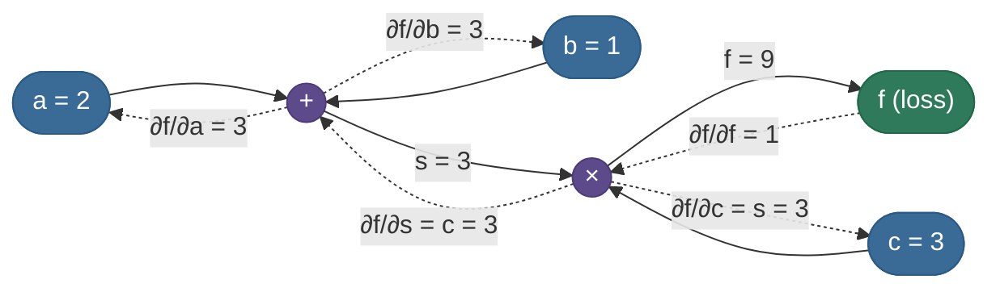
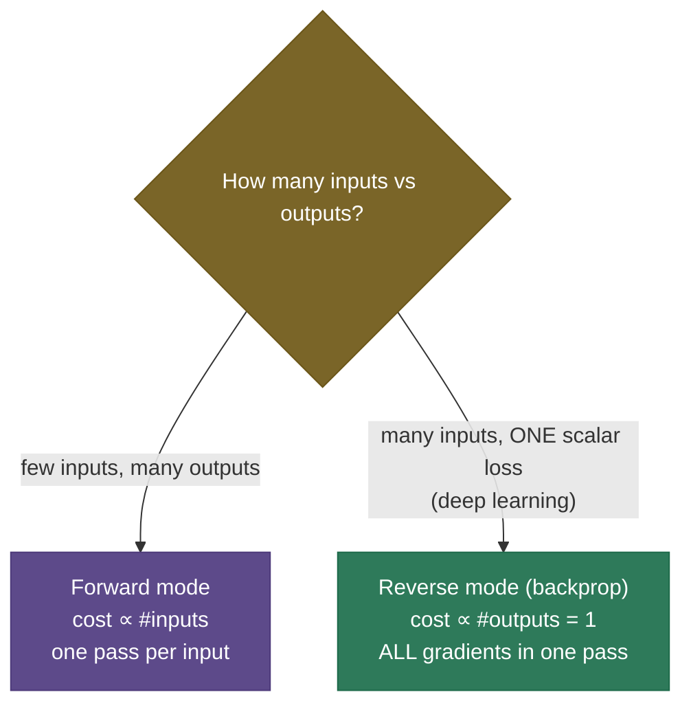

# Backpropagation: every gradient in one backward pass

To train a network you need to know, for each of its millions of weights, *which way to nudge it to lower the loss* — that is, the **gradient** of the loss with respect to every parameter. The naive way to get those gradients (wiggle each weight, see how the loss changes) would take one full forward pass **per parameter** — millions of passes per step, hopelessly slow. **Backpropagation** computes **all** of those gradients in a *single* backward pass that costs about the same as one forward pass. That efficiency is the reason deep learning is possible at all; it is the algorithm running inside every `.backward()` call.

This page is the complete tour. By the end you'll be able to:

- explain backprop as **reverse-mode automatic differentiation** on a **computational graph**;
- apply the **chain rule** node by node (upstream × local gradient);
- walk a **worked numeric example** and the **four backprop equations** for an MLP;
- say **why reverse mode** (not forward mode) is the right choice for deep learning;
- diagnose **vanishing / exploding gradients** and verify a backward pass with **gradient checking**;
- explain what **autograd** does under the hood, the **compute/memory** cost, and **gradient checkpointing**.

Intuition first, then the graph and the math, then code whose hand-derived gradients match PyTorch exactly.

> **Note:** "backpropagation" is specifically the *gradient computation* — the backward pass. It is **not** the weight update; that's the [optimizer](07-Optimizers.md)'s job (SGD, Adam…). Backprop produces the gradient; the optimizer decides what to do with it. Keeping these separate avoids a common interview muddle.

---

## The problem: we need every gradient, cheaply

Gradient descent needs $\partial L/\partial \theta$ for **every** parameter $\theta$. Two obvious approaches both fail at scale:

- **Numerical (finite differences):** $\partial L/\partial\theta_i \approx \big(L(\theta + \epsilon e_i) - L(\theta - \epsilon e_i)\big)/2\epsilon$. Correct, but it needs **two forward passes per parameter** — billions of passes for a large model. (We'll keep it for *checking*, not training.)
- **Symbolic:** writing out one giant closed-form derivative explodes in size and recomputes shared subexpressions endlessly.

Backprop is the third way: treat the network as a **graph of simple operations**, compute the loss **forward** (caching intermediate values), then sweep **backward** applying the chain rule, **reusing** each intermediate result exactly once. Result: all gradients, one pass, linear in the size of the network.

---

## What it is

Backpropagation is **reverse-mode automatic differentiation**. "Automatic" (not numerical or symbolic): it computes exact derivatives by composing the known local derivatives of each elementary operation. "Reverse-mode": it propagates derivatives **from the output (loss) back toward the inputs (weights)**, which — for a scalar loss and many parameters — is dramatically cheaper than going forward.

The whole algorithm is two sweeps over the computational graph:

1. **Forward pass** — compute each node's output from its inputs, left to right, and **cache** the values needed later.
2. **Backward pass** — starting from $\partial L/\partial L = 1$, visit nodes in reverse topological order; at each node multiply the incoming **upstream gradient** by the node's **local gradient** and pass the result to its inputs.

---

## Intuition: blame flowing backward

Think of the loss as a number you want to reduce, and every node in the network as a worker who contributed to it. Backprop is **blame assignment** (its formal name is the *credit-assignment problem*): the loss says "you're 1.0 responsible for yourself," and each node passes its share of the blame back to whoever fed it — scaled by *how much that input actually moved this node's output*. A node whose output barely depends on an input passes back almost no blame; a node whose output is highly sensitive passes back a lot.

That "scaling" is the **local gradient**, and the rule at every node is just the chain rule:


> **Tip:** the one sentence that captures backprop: **downstream gradient = upstream gradient × local gradient.** Every node does only this. The "algorithm" is just applying it in reverse order and **summing** contributions where a value fanned out to several places.

---

## The computational graph

Represent the computation as a directed graph: leaves are inputs/parameters, internal nodes are operations, the root is the loss. Take $f = (a + b)\cdot c$ with $a=2, b=1, c=3$.

**Forward:** $s = a + b = 3$, then $f = s\cdot c = 9$ (cache $s$ and $c$).
**Backward:** seed $\partial f/\partial f = 1$, then push gradients back through each op using its local derivative.



Solid arrows are the forward pass; dashed arrows are the backward pass carrying gradients. Notice the **multiply node** routes gradient by *swapping* inputs (the gradient to $c$ is $s$, and vice versa), while the **add node** passes the upstream gradient through unchanged to both inputs — two local-gradient patterns worth memorizing.

---

## The chain rule and local gradients

Formally, if $L$ depends on $x$ only through an intermediate $y = g(x)$, the chain rule is:

$$\frac{\partial L}{\partial x} = \frac{\partial L}{\partial y}\,\frac{\partial y}{\partial x}$$

— exactly "upstream ($\partial L/\partial y$) × local ($\partial y/\partial x$)". For multivariable nodes it's a sum over paths (a vector-Jacobian product). The local gradients of the common ops are tiny and reusable:

| Operation | Local gradient (to each input) |
|---|---|
| add $z = x + y$ | $\partial z/\partial x = 1,\ \partial z/\partial y = 1$ (gradient passes through) |
| multiply $z = xy$ | $\partial z/\partial x = y,\ \partial z/\partial y = x$ (gradient swaps) |
| matmul $z = Wx$ | $\partial L/\partial W = (\partial L/\partial z)\,x^\top,\ \partial L/\partial x = W^\top(\partial L/\partial z)$ |
| ReLU $z = \max(0,x)$ | $\partial z/\partial x = \mathbb{1}[x>0]$ |
| sigmoid $z = \sigma(x)$ | $\partial z/\partial x = z(1-z)$ |

> **Note:** autograd never materializes a layer's full **Jacobian** (it would be enormous — e.g. $\text{outputs}\times\text{inputs}$). It computes a **vector-Jacobian product (VJP)**: given the upstream gradient *vector*, it produces the downstream *vector* directly via the local rule (e.g. matmul's $W^\top(\partial L/\partial z)$). All of reverse-mode is a chain of VJPs — which is exactly why it stays linear-cost instead of quadratic.

> **Gotcha:** when a value **fans out** to several consumers (used in more than one place), its gradient is the **sum** of the gradients flowing back from each consumer. Forgetting to add (instead overwriting) is a classic from-scratch bug — and it's why autograd *accumulates* into `.grad`.

---

## A worked example, by hand

Continue $f=(a+b)c$ with $a=2,b=1,c=3$:

1. **Seed:** $\dfrac{\partial f}{\partial f} = 1$.
2. **Multiply node** $f = s\cdot c$: local grads $\partial f/\partial s = c = 3$, $\partial f/\partial c = s = 3$. So $\dfrac{\partial f}{\partial s} = 1\cdot 3 = 3$ and $\dfrac{\partial f}{\partial c} = 1\cdot 3 = 3$.
3. **Add node** $s = a + b$: local grads both 1. Upstream is $\partial f/\partial s = 3$, so $\dfrac{\partial f}{\partial a} = 3\cdot 1 = 3$ and $\dfrac{\partial f}{\partial b} = 3$.

Check against intuition: $f = (a+b)c$, so analytically $\partial f/\partial a = c = 3$ ✓, $\partial f/\partial c = a+b = 3$ ✓. Three multiplications, no wasted work — that is backprop in miniature.

---

## Forward mode vs reverse mode

Automatic differentiation comes in two directions, and choosing reverse mode is *the* insight that makes deep learning cheap:

- **Forward mode** propagates derivatives input→output; its cost scales with the **number of inputs**. Efficient when you have few inputs, many outputs.
- **Reverse mode (backprop)** propagates output→input; its cost scales with the **number of outputs**. A neural network has **millions of inputs (parameters)** and **one output (the scalar loss)** — so reverse mode gets *all* parameter gradients for the price of ~one extra pass.



> **Note:** this is why the loss must be a **scalar** to call `.backward()` directly. Reverse mode seeds the backward pass with $\partial L/\partial L = 1$ at a single output; a non-scalar output needs you to supply the upstream gradient vector explicitly.

---

## The four backprop equations (for an MLP)

For a layered network with pre-activations $z^l = W^l a^{l-1} + b^l$ and activations $a^l = \sigma(z^l)$, define the per-layer **error** $\delta^l = \partial L/\partial z^l$. Backprop is four equations:

$$\delta^L = \nabla_a L \odot \sigma'(z^L) \quad\text{(output layer)}$$
$$\delta^l = \big((W^{l+1})^\top \delta^{l+1}\big) \odot \sigma'(z^l) \quad\text{(propagate backward)}$$
$$\frac{\partial L}{\partial b^l} = \delta^l, \qquad \frac{\partial L}{\partial W^l} = \delta^l (a^{l-1})^\top$$

Read them as the same "upstream × local" rule in matrix form: the middle equation pulls the error back through the next layer's weights ($W^\top$) and through the activation's local gradient ($\sigma'$); the last two read the weight/bias gradients off that error.

> **Note:** the most elegant special case in all of backprop: for **softmax followed by cross-entropy** (the standard classifier head), the messy chain rule collapses to $\partial L/\partial z = p - y$ — the predicted probabilities minus the one-hot target. Frameworks fuse the two ops, partly because this combined gradient is so clean *and* numerically stable (no dividing by tiny softmax outputs). Expect to be asked to derive it.

---

## Vanishing and exploding gradients

Because the backward pass **multiplies** local gradients layer after layer, those factors compound. If they're consistently $<1$ (e.g. sigmoid, whose derivative peaks at $0.25$), the gradient **shrinks geometrically** toward the input layers — they barely learn. If consistently $>1$, it **explodes** to NaN.


This single phenomenon motivates a huge fraction of deep-learning design: **ReLU**-like activations (local gradient 1 in the active region), **residual connections** (a gradient shortcut), **normalization** (batch/layer), careful **initialization** (He/Xavier), and **gradient clipping** for the exploding side.

> **Tip:** "why did deep networks not work before ~2010?" → vanishing gradients through sigmoids/tanh, plus poor initialization. ReLU + better init + residuals + normalization are the fixes that made depth trainable — and they all exist to keep that backward product near 1.

---

## Gradient checking

Since backprop is easy to get subtly wrong (a missing transpose, a dropped fan-out sum), you verify an implementation against the slow-but-trustworthy **numerical** gradient:

$$\frac{\partial L}{\partial \theta_i} \approx \frac{L(\theta + \epsilon e_i) - L(\theta - \epsilon e_i)}{2\epsilon}$$

(the **centered** difference, accurate to $O(\epsilon^2)$). If analytic and numerical agree to ~$10^{-6}$, your backward pass is correct.


> **Gotcha:** use the **centered** difference, not the one-sided $\big(L(\theta+\epsilon)-L(\theta)\big)/\epsilon$ — the centered version is an order more accurate. And pick $\epsilon \approx 10^{-5}$: too large and the approximation is poor, too small and floating-point round-off dominates.

---

## Autograd: what the framework does

You rarely hand-derive gradients; **autograd** does it. In PyTorch:

- Every tensor with `requires_grad=True` records the ops applied to it, building a **dynamic computational graph** (a "tape") *as the forward pass runs*.
- `loss.backward()` walks that graph in reverse, computing each `.grad` via the local-gradient rules above.
- `.grad` **accumulates** across `backward()` calls — so you must call `optimizer.zero_grad()` each step.
- `torch.no_grad()` disables graph recording (for inference/eval); `.detach()` cuts a tensor out of the graph.

> **Gotcha:** the three autograd bugs that bite everyone: (1) forgetting `zero_grad()` so gradients from previous steps pile up; (2) calling `.backward()` twice on the same graph without `retain_graph=True`; (3) an **in-place** op overwriting a value the backward pass still needs. If training behaves strangely, check these first.

---

## Complexity and memory

- **Compute:** the backward pass costs roughly **1–2× the forward pass** in FLOPs (a deep result: the gradient of a scalar function costs a constant factor times the function itself). So a training step is ~3× an inference forward.
- **Memory:** the backward pass needs the **cached activations** from the forward pass, so activation memory scales with depth × batch × width — often the dominant memory cost in training, *more* than the weights.
- **Gradient checkpointing** trades compute for memory: discard most activations on the forward pass and **recompute** them during the backward pass, cutting activation memory from $O(\text{depth})$ toward $O(\sqrt{\text{depth}})$ at the cost of one extra forward. Essential for training very deep models / long sequences.

> **Note:** this activation-memory cost is why batch size is capped in training and why techniques like checkpointing, mixed precision, and [LoRA/PEFT](../../09.%20LLMs/concepts/12-LoRA-and-PEFT.md) matter — they all attack the memory the backward pass demands.

---

## Where it is used

- **Every neural network trained by gradient descent** — MLPs, [CNNs](13-CNNs-and-Convolution.md), [RNNs](14-RNN-LSTM-GRU.md), transformers — uses backprop to get gradients, then an [optimizer](07-Optimizers.md) to update.
- **Backprop through time (BPTT)** unrolls an RNN over the sequence and backprops through the unrolled graph.
- **Autograd engines** (PyTorch, JAX, TensorFlow) generalize backprop to arbitrary differentiable programs, well beyond neural nets.

---

## Application and common bugs

In practice you write the forward pass and call `.backward()`; the skill is reading what autograd is doing and avoiding the traps:

1. **Always `zero_grad()`** before `backward()` (gradients accumulate by design).
2. **Keep the loss a scalar** (or pass an explicit gradient to `backward()`).
3. **Use `no_grad()` for eval** to save memory and avoid building a graph you won't use.
4. **Watch for vanishing/exploding** — monitor gradient norms; reach for ReLU/residuals/norm/clipping.
5. **Gradient-check** any custom backward you write.

---

## Code: hand-derived gradients that match autograd

Manual backprop through a 2-layer MLP, verified against `torch.autograd` and against a numerical gradient. Runs on CPU in a second.

```python
"""Manual backprop through a 2-layer MLP, checked against torch.autograd and a
numerical gradient. Verified on ml-py312 (torch 2.12), CPU."""
import torch
torch.manual_seed(0)

# x -> (W1,b1) -> ReLU -> (W2,b2) -> out ,  loss = 1/2 (out - y)^2
n_in, n_h = 4, 5
x, y = torch.randn(1, n_in), torch.tensor([[1.0]])
W1 = torch.randn(n_in, n_h, requires_grad=True); b1 = torch.randn(1, n_h, requires_grad=True)
W2 = torch.randn(n_h, 1,  requires_grad=True); b2 = torch.randn(1, 1,  requires_grad=True)

# forward (cache the activations the backward pass needs)
z1 = x @ W1 + b1
a1 = torch.relu(z1)
out = a1 @ W2 + b2
loss = 0.5 * (out - y).pow(2).sum()

# manual backward: chain rule, node by node, right to left
dout = (out - y)                       # dL/d out
dW2_m = a1.t() @ dout                   # dL/dW2 = a1^T · dout
db2_m = dout.clone()
da1   = dout @ W2.t()                    # pull through W2
dz1   = da1 * (z1 > 0).float()          # ReLU local gradient
dW1_m = x.t() @ dz1                      # dL/dW1 = x^T · dz1
db1_m = dz1.clone()

# autograd does the same — compare
loss.backward()
print("manual vs autograd (max abs diff):")
for name, manual, auto in [("W1", dW1_m, W1.grad), ("b1", db1_m, b1.grad),
                           ("W2", dW2_m, W2.grad), ("b2", db2_m, b2.grad)]:
    print(f"  {name}: {(manual - auto).abs().max():.2e}  match={torch.allclose(manual, auto, atol=1e-5)}")

# gradient check on the largest-gradient weight
i, j = divmod(int(dW1_m.abs().argmax()), n_h)
eps = 1e-4
with torch.no_grad():
    W1[i, j] += eps; lp = 0.5 * ((torch.relu(x @ W1 + b1) @ W2 + b2) - y).pow(2).sum()
    W1[i, j] -= 2*eps; lm = 0.5 * ((torch.relu(x @ W1 + b1) @ W2 + b2) - y).pow(2).sum()
    W1[i, j] += eps
num = ((lp - lm) / (2 * eps)).item()
print(f"grad check W1[{i},{j}]: analytic={dW1_m[i,j].item():.5f} numerical={num:.5f} diff={abs(dW1_m[i,j].item()-num):.2e}")
```

Output:

```
manual vs autograd (max abs diff):
  W1: 0.00e+00  match=True
  b1: 0.00e+00  match=True
  W2: 0.00e+00  match=True
  b2: 0.00e+00  match=True
grad check W1[2,4]: analytic=-2.84959 numerical=-2.84985 diff=2.58e-04
```

> **Note:** the hand-derived gradients match autograd to the bit (`0.00e+00`) — because they *are* the same chain-rule computation. And the analytic gradient matches the finite-difference numerical one — the gradient check that proves the backward pass is correct.

---

## Recap and rapid-fire

**If you remember nothing else:** backprop is reverse-mode autodiff on the computational graph — a forward pass that caches values, then a backward pass where each node sends **upstream × local gradient** to its inputs (summing at fan-outs). It gets *all* parameter gradients in one pass because the loss is a single scalar. It's the gradient computation; the [optimizer](07-Optimizers.md) does the update.

**Quick-fire — say these out loud:**

- *Backprop in one line?* downstream gradient = upstream gradient × local gradient, applied in reverse topological order.
- *Backprop vs the optimizer?* Backprop computes the gradient; the optimizer (SGD/Adam) applies it.
- *Why reverse mode, not forward?* Many inputs (params), one scalar output — reverse mode gets all gradients in one pass.
- *Local gradient of add? multiply? ReLU?* Add: passes through (1,1). Multiply: swaps inputs (y, x). ReLU: 1 if x>0 else 0.
- *What happens at a fan-out?* Gradients from all consumers are **summed** (why autograd accumulates).
- *Why vanishing gradients?* Multiplying many <1 local gradients (sigmoid) shrinks the gradient toward early layers.
- *How to verify a backward pass?* Gradient check against a centered finite difference.
- *Compute & memory cost?* Backward ≈ 1–2× forward FLOPs; must cache activations → checkpointing trades compute for memory.
- *What does `.backward()` do?* Walks the recorded graph in reverse, accumulating each tensor's `.grad`.

---

## References and further reading

The curated link library for this topic — videos, courses, articles, papers, books, and internal cross-links — lives in a companion file so it can be reused as a standalone reference list:

**→ [Backpropagation & Computational Graphs — references and further reading](02-Backpropagation-and-Computational-Graphs.references.md)**
