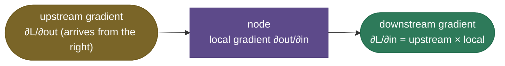
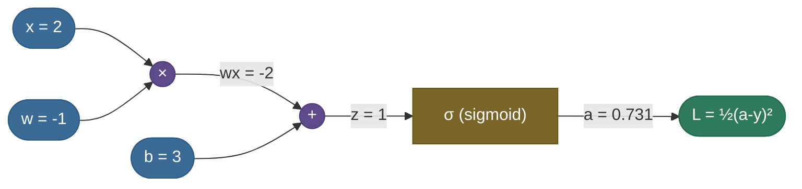
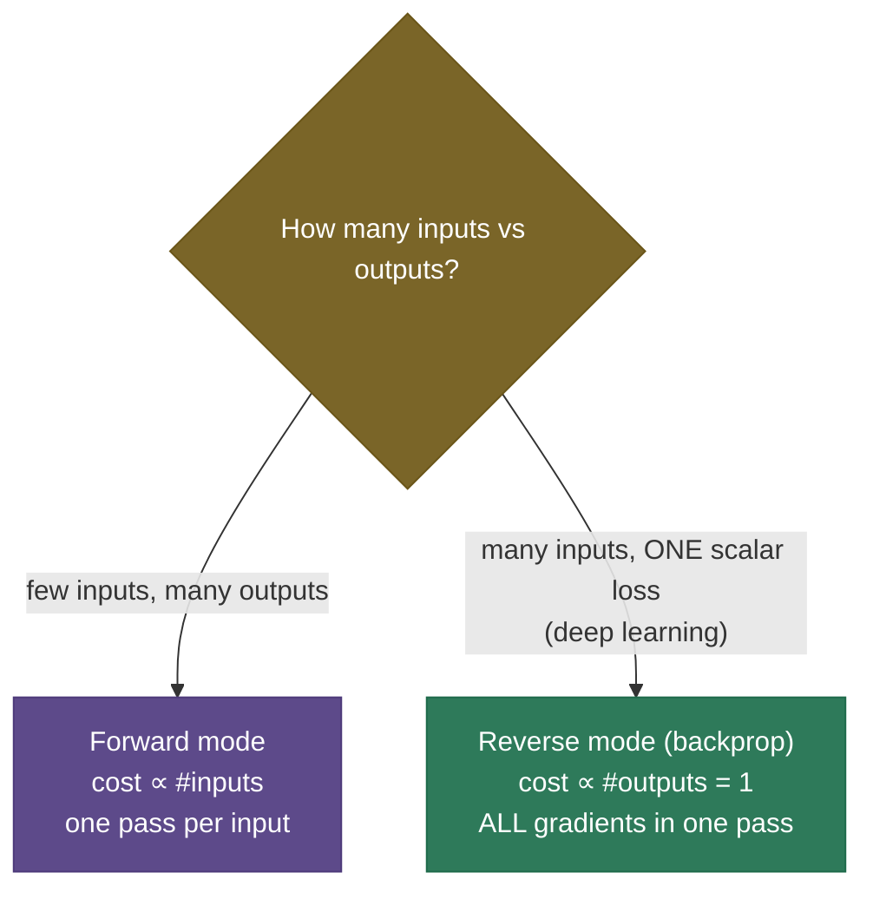
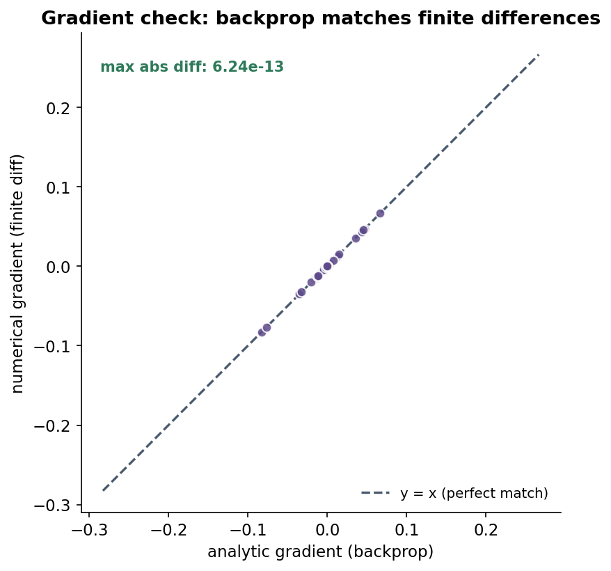
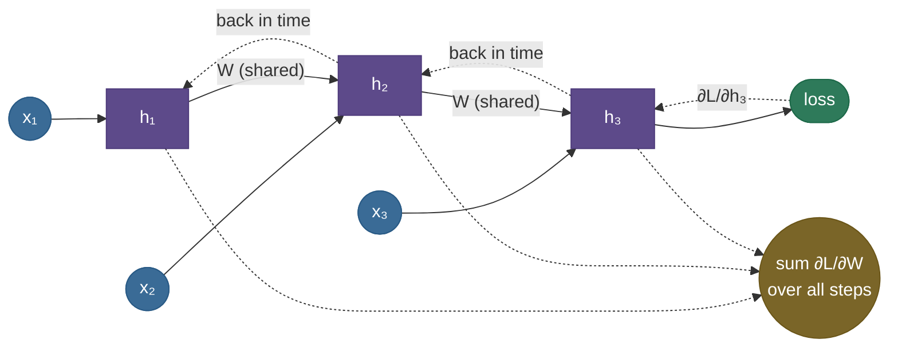

# Backpropagation: every gradient in one backward pass

To train a network you need to know, for each of its millions of weights, *which way to nudge it to lower the loss* — the **gradient** of the loss with respect to every parameter. The naive way (wiggle each weight, see how the loss changes) would take one full forward pass **per parameter** — millions of passes per step, hopelessly slow. **Backpropagation** computes **all** of those gradients in a *single* backward pass that costs about the same as one forward pass. That efficiency is why deep learning is possible at all; it is the algorithm running inside every `.backward()` call.

This page is the complete, worked-from-scratch tour. By the end you'll be able to:

- explain backprop as **reverse-mode automatic differentiation** on a **computational graph**;
- apply the **chain rule** node by node (upstream × local gradient) and recognize the **gradient "gates"** (add, multiply, max, copy);
- **work three numeric examples by hand** — a scalar expression, a sigmoid neuron, and softmax+cross-entropy — and check each against PyTorch;
- **derive** the matrix/layer gradient and the **four backprop equations** for an MLP;
- explain **why reverse mode** beats forward mode, and why backprop is really **dynamic programming** on the graph;
- diagnose **vanishing/exploding gradients**, verify a backward pass with **gradient checking**, and handle **backprop through time**;
- explain what **autograd** does under the hood, the **compute/memory** cost, and **gradient checkpointing**.

Intuition first, then the graph, the gates, three worked examples, the derivations, and code whose hand-derived gradients match PyTorch to the bit.

> **Note:** "backpropagation" is specifically the *gradient computation* — the backward pass. It is **not** the weight update; that's the [optimizer](07-Optimizers.md)'s job (SGD, Adam…). Backprop produces the gradient; the optimizer decides what to do with it. Keeping these separate avoids a common interview muddle.

---

## The problem: we need every gradient, cheaply

Gradient descent needs $\partial L/\partial \theta$ for **every** parameter $\theta$. Two obvious approaches both fail at scale:

- **Numerical (finite differences):** $\partial L/\partial\theta_i \approx \big(L(\theta + \epsilon e_i) - L(\theta - \epsilon e_i)\big)/2\epsilon$. Correct, but it needs **two forward passes per parameter** — billions of passes for a large model. (We keep it for *checking*, not training.)
- **Symbolic:** writing out one giant closed-form derivative explodes in size and recomputes shared subexpressions endlessly.

Backprop is the third way: treat the network as a **graph of simple operations**, compute the loss **forward** (caching intermediate values), then sweep **backward** applying the chain rule, **reusing** each intermediate result exactly once. Result: all gradients, one pass, linear in the size of the network.

---

## What it is

Backpropagation is **reverse-mode automatic differentiation**. "Automatic" (not numerical or symbolic): it computes exact derivatives by composing the known local derivatives of each elementary operation. "Reverse-mode": it propagates derivatives **from the output (loss) back toward the inputs (weights)** — which, for a scalar loss and many parameters, is dramatically cheaper than going forward.

The whole algorithm is two sweeps over the computational graph:

1. **Forward pass** — compute each node's output from its inputs, left to right, and **cache** the values needed later.
2. **Backward pass** — starting from $\partial L/\partial L = 1$, visit nodes in reverse topological order; at each node multiply the incoming **upstream gradient** by the node's **local gradient** and pass the result to its inputs.

---

## Intuition: blame flowing backward

Think of the loss as a number you want to reduce, and every node as a worker who contributed to it. Backprop is **blame assignment** (its formal name is the *credit-assignment problem*): the loss says "you're 1.0 responsible for yourself," and each node passes its share of the blame back to whoever fed it — scaled by *how much that input actually moved this node's output*. A node whose output barely depends on an input passes back almost no blame; a node whose output is highly sensitive passes back a lot.

> **See it learn:** [TensorFlow Playground](https://playground.tensorflow.org/) lets you build a small net in the browser and watch it train — the weights and decision boundary updating each step *are* backprop's gradients at work. For the mechanics node-by-node, Karpathy's [micrograd build](https://www.youtube.com/watch?v=VMj-3S1tku0) (in the references) constructs this exact backward pass from scratch.

That "scaling" is the **local gradient**, and the rule at every node is just the chain rule:



> **Tip:** the one sentence that captures backprop: **downstream gradient = upstream gradient × local gradient.** Every node does only this. The "algorithm" is just applying it in reverse order and **summing** contributions where a value fanned out to several places.

---

## The computational graph

Represent the computation as a directed graph: leaves are inputs/parameters, internal nodes are operations, the root is the loss. Take $f = (a + b)\cdot c$ with $a=2, b=1, c=3$.

**Forward:** $s = a + b = 3$, then $f = s\cdot c = 9$ (cache $s$ and $c$).
**Backward:** seed $\partial f/\partial f = 1$, then push gradients back through each op.


Solid arrows are the forward pass; dashed arrows carry gradients backward. The graph makes the reuse explicit: $\partial f/\partial s$ is computed once and feeds *both* $a$ and $b$.

---

## The chain rule and local gradients

Formally, if $L$ depends on $x$ only through an intermediate $y = g(x)$:

$$\frac{\partial L}{\partial x} = \frac{\partial L}{\partial y}\,\frac{\partial y}{\partial x}$$

— exactly "upstream × local". For multivariable nodes it's a sum over paths (a vector-Jacobian product, below). The local gradients of the common ops are tiny and reusable:

| Operation | Local gradient (to each input) |
|---|---|
| add $z = x + y$ | $\partial z/\partial x = 1,\ \partial z/\partial y = 1$ (gradient passes through) |
| multiply $z = xy$ | $\partial z/\partial x = y,\ \partial z/\partial y = x$ (gradient swaps) |
| max $z = \max(x,y)$ | gradient routes entirely to the larger input, 0 to the other |
| matmul $z = Wx$ | $\partial L/\partial W = \delta\,x^\top,\ \partial L/\partial x = W^\top\delta$ (with $\delta = \partial L/\partial z$) |
| ReLU $z = \max(0,x)$ | $\partial z/\partial x = \mathbb{1}[x>0]$ |
| sigmoid $z = \sigma(x)$ | $\partial z/\partial x = z(1-z)$ |

> **Note:** autograd never materializes a layer's full **Jacobian** (it would be $\text{outputs}\times\text{inputs}$ — enormous). It computes a **vector-Jacobian product (VJP)**: given the upstream gradient *vector*, it produces the downstream *vector* directly via the local rule (e.g. matmul's $W^\top\delta$). All of reverse-mode is a chain of VJPs — which is why it stays linear-cost instead of quadratic.

> **Gotcha:** when a value **fans out** to several consumers, its gradient is the **sum** of the gradients flowing back from each consumer. Forgetting to add (instead overwriting) is a classic from-scratch bug — and it's why autograd *accumulates* into `.grad`.

---

## The four gradient "gates"

Almost every backward pass is built from four routing patterns. Memorize them and you can read gradient flow off a graph by eye:


- **add = distributor:** copies the upstream gradient to every input unchanged.
- **multiply = swapper:** each input's gradient is upstream × *the other* input.
- **max / ReLU = router:** the gradient flows only to the input that "won" the max; the rest get 0 (this is exactly the dead-ReLU effect).
- **copy / fan-out = adder:** a value used in $k$ places receives the **sum** of the $k$ gradients.

> **Tip:** the multiply gate is a favorite trick question: "what's the gradient to $x$ in $z = xy$?" — it's the upstream gradient times **$y$**, *not* $x$. The gate swaps.

> **Note:** some ops are **non-differentiable** — argmax, rounding, quantization — so their true local gradient is 0 or undefined, which would block learning. The **straight-through estimator (STE)** cheats: use the real op on the forward pass, but pass the upstream gradient **straight through** (as if the op were the identity) on the backward pass. It's how quantization-aware training and discrete-latent models (VQ-VAE) get a usable gradient through a hard step.

---

## Worked example 1: a scalar expression

Continue $f=(a+b)c$ with $a=2,b=1,c=3$:

1. **Seed:** $\dfrac{\partial f}{\partial f} = 1$.
2. **Multiply node** $f = s\cdot c$: local grads $\partial f/\partial s = c = 3$, $\partial f/\partial c = s = 3$. So $\dfrac{\partial f}{\partial s} = 1\cdot 3 = 3$, $\dfrac{\partial f}{\partial c} = 1\cdot 3 = 3$.
3. **Add node** $s = a + b$: local grads both 1. Upstream $= 3$, so $\dfrac{\partial f}{\partial a} = 3$, $\dfrac{\partial f}{\partial b} = 3$.

Check: analytically $\partial f/\partial a = c = 3$ ✓ and $\partial f/\partial c = a+b = 3$ ✓.

---

## Worked example 2: a sigmoid neuron, end to end

Now an actual neuron with an activation and a loss. Inputs $x=2$, weight $w=-1$, bias $b=3$, target $y=0$, with sigmoid $\sigma$ and squared-error loss $L = \tfrac12(a-y)^2$.



**Forward:** $z = wx + b = (-1)(2) + 3 = 1$; $a = \sigma(1) = 0.7311$; $L = \tfrac12(0.7311)^2 = 0.2672$.

**Backward**, one factor at a time (upstream × local):

1. $\dfrac{\partial L}{\partial a} = (a - y) = 0.7311$.
2. $\dfrac{\partial a}{\partial z} = a(1-a) = 0.7311 \cdot 0.2689 = 0.1966$, so $\dfrac{\partial L}{\partial z} = 0.7311 \cdot 0.1966 = 0.1437$.
3. Through $z = wx + b$ (add then multiply): $\dfrac{\partial L}{\partial w} = \dfrac{\partial L}{\partial z}\cdot x = 0.1437 \cdot 2 = \mathbf{0.2875}$; $\dfrac{\partial L}{\partial b} = 0.1437 \cdot 1 = \mathbf{0.1437}$; $\dfrac{\partial L}{\partial x} = 0.1437 \cdot w = \mathbf{-0.1437}$.

PyTorch's autograd returns exactly `dL/dw = 0.2875, dL/db = 0.1437, dL/dx = -0.1437` — the hand trace is correct. Notice the sigmoid's $a(1-a)$ factor peaks at $0.25$: every sigmoid a gradient passes through shrinks it by **at most** a quarter, the seed of the vanishing-gradient problem.

---

## Deriving the layer gradient (matmul VJP)

Real layers are matrix multiplies, so the most-used gradient rule is the one for $z = Wx$. Write it in indices, $z_i = \sum_j W_{ij} x_j$, and let $\delta = \partial L/\partial z$ (the upstream gradient). Then:

$$\frac{\partial L}{\partial W_{ij}} = \frac{\partial L}{\partial z_i}\frac{\partial z_i}{\partial W_{ij}} = \delta_i\,x_j \;\Rightarrow\; \boxed{\frac{\partial L}{\partial W} = \delta\,x^\top}$$

$$\frac{\partial L}{\partial x_j} = \sum_i \frac{\partial L}{\partial z_i}\frac{\partial z_i}{\partial x_j} = \sum_i \delta_i W_{ij} = (W^\top\delta)_j \;\Rightarrow\; \boxed{\frac{\partial L}{\partial x} = W^\top\delta}$$

These two boxed rules — "outer-product with the input for the weight, multiply by $W^\top$ to pass the gradient back" — are the workhorses of every backward pass in a deep net. Note they're VJPs: no full Jacobian, just two matrix multiplies.

---

## The four backprop equations (derived)

Stack layers: pre-activation $z^l = W^l a^{l-1} + b^l$, activation $a^l = \sigma(z^l)$, and define the per-layer **error** $\delta^l = \partial L/\partial z^l$. Applying the chain rule and the matmul VJP gives backprop as four equations:

$$\delta^L = \nabla_a L \odot \sigma'(z^L) \quad\text{(output layer: loss-grad × activation-grad)}$$
$$\delta^l = \big((W^{l+1})^\top \delta^{l+1}\big) \odot \sigma'(z^l) \quad\text{(pull error back through the next layer, then the activation)}$$
$$\frac{\partial L}{\partial W^l} = \delta^l (a^{l-1})^\top, \qquad \frac{\partial L}{\partial b^l} = \delta^l$$

The middle equation is the engine: $\delta^{l+1}$ becomes $\delta^l$ by a matmul with $(W^{l+1})^\top$ (the matmul VJP) and an elementwise multiply by $\sigma'(z^l)$ (the activation's local gradient). The last two read the weight/bias gradients off that error using the outer-product rule. **That is the entire algorithm** — repeat the middle equation from the output layer down to the input.

> *Where these come from: backprop for neural nets is **Learning representations by back-propagating errors** (Rumelhart, Hinton & Williams 1986); these **four equations** in exactly this $\delta$-form are derived in Michael Nielsen's **Neural Networks and Deep Learning**, Ch. 2; the general reverse-mode-autodiff view is **Automatic Differentiation in Machine Learning: a Survey** (Baydin et al. 2015). All in the references.*

---

## Worked example 3: softmax + cross-entropy → p − y

The classifier head (softmax then cross-entropy) has the most elegant gradient in deep learning, and you should be able to derive it. With logits $z$, probabilities $p_i = e^{z_i}/\sum_k e^{z_k}$, true class $t$, and loss $L = -\log p_t$:

First the **softmax Jacobian**. With $S = \sum_k e^{z_k}$ so $p_i = e^{z_i}/S$, differentiate using the quotient rule for the two cases:

$$i = j:\quad \frac{\partial p_i}{\partial z_i} = \frac{e^{z_i}S - e^{z_i}e^{z_i}}{S^2} = p_i - p_i^2 = p_i(1 - p_i)$$
$$i \neq j:\quad \frac{\partial p_i}{\partial z_j} = \frac{0 - e^{z_i}e^{z_j}}{S^2} = -p_i p_j$$

Both cases collapse to one tidy formula, $\dfrac{\partial p_i}{\partial z_j} = p_i(\delta_{ij} - p_j)$, so in particular $\dfrac{\partial p_t}{\partial z_i} = p_t(\delta_{it} - p_i)$. Now the cross-entropy:

$$\frac{\partial L}{\partial z_i} = -\frac{1}{p_t}\frac{\partial p_t}{\partial z_i} = -\frac{1}{p_t}\,p_t(\delta_{it} - p_i) = p_i - \delta_{it} = \boxed{p_i - y_i}$$

where $y$ is the one-hot target. So the gradient is simply **predicted minus target**. For logits $[2, 1, 0.1]$ with true class 0: $p = [0.659, 0.242, 0.099]$, and the gradient is $p - y = [-0.341, 0.242, 0.099]$ — exactly what autograd returns.

> **Note:** frameworks **fuse** softmax and cross-entropy into one op (`cross_entropy` / `log_softmax`) partly for this clean gradient and partly for **numerical stability**: computing $\log p$ directly avoids exponentiating large logits and then taking the log of a tiny probability. Always use the fused op rather than a separate softmax + log.

---

## Forward mode vs reverse mode

Automatic differentiation comes in two directions, and choosing reverse mode is *the* insight that makes deep learning cheap:

- **Forward mode** propagates derivatives input→output; cost scales with the **number of inputs**.
- **Reverse mode (backprop)** propagates output→input; cost scales with the **number of outputs**. A network has **millions of inputs (parameters)** and **one output (scalar loss)**, so reverse mode gets *all* gradients for the price of ~one extra pass.



> **Note:** this is why the loss must be a **scalar** to call `.backward()` directly. Reverse mode seeds the backward pass with $\partial L/\partial L = 1$ at a single output; a non-scalar output needs you to supply the upstream gradient vector explicitly.

---

## Backprop is dynamic programming

Why is backprop *linear* in the size of the graph when the naive chain rule seems to require summing over exponentially many paths from output to each input? Because backprop is **dynamic programming**: $\delta$ for a node is computed **once**, stored, and **reused** by every node that feeds into it. Each edge's local gradient is touched exactly one time. The forward pass memoizes the values; the backward pass memoizes the gradients. Without this reuse (e.g. naive symbolic differentiation) the cost would blow up; with it, the backward pass is the same order of cost as the forward.

---

## Vanishing and exploding gradients

Because the backward pass **multiplies** local gradients layer after layer, those factors compound. If they're consistently $<1$ (sigmoid's $\sigma'$ peaks at $0.25$, as we saw), the gradient **shrinks geometrically** toward the input layers — they barely learn. If consistently $>1$, it **explodes** to NaN.


This single phenomenon motivates a huge fraction of deep-learning design: **ReLU**-like activations (local gradient 1 in the active region), **residual connections** (a gradient shortcut), **normalization** (batch/layer), careful **initialization** (He/Xavier), and **gradient clipping** for the exploding side.

> **Tip:** "why did deep networks not work before ~2010?" → vanishing gradients through sigmoids/tanh, plus poor initialization. ReLU + better init + residuals + normalization are the fixes that made depth trainable — and they all exist to keep that backward product near 1.

---

## Gradient checking

Because backprop is easy to get subtly wrong (a missing transpose, a dropped fan-out sum), you verify an implementation against the slow-but-trustworthy **numerical** gradient:

$$\frac{\partial L}{\partial \theta_i} \approx \frac{L(\theta + \epsilon e_i) - L(\theta - \epsilon e_i)}{2\epsilon}$$

(the **centered** difference, accurate to $O(\epsilon^2)$). If analytic and numerical agree to ~$10^{-6}$, your backward pass is correct.



> **Gotcha:** use the **centered** difference, not the one-sided $\big(L(\theta+\epsilon)-L(\theta)\big)/\epsilon$ — the centered version is an order more accurate. And pick $\epsilon \approx 10^{-5}$: too large and the approximation is poor, too small and floating-point round-off dominates.

---

## Backprop through time (BPTT)

[RNNs](14-RNN-LSTM-GRU.md) reuse the **same** weight matrix at every timestep. To train them you **unroll** the network over the sequence into a (deep) feed-forward graph and backprop through it — *backprop through time*. Because the weight is shared, its gradient is the **sum** of the per-step contributions (the copy/fan-out gate, over time):



> **Note:** unrolling over many steps multiplies many copies of (roughly) the same factor, so RNNs are the **poster child** for vanishing/exploding gradients — which is exactly why LSTMs/GRUs (gated gradient paths) and **truncated BPTT** (unroll only $k$ steps) exist.

---

## Autograd: what the framework does

You rarely hand-derive gradients; **autograd** does it. In PyTorch:

- Every tensor with `requires_grad=True` records the ops applied to it, building a **dynamic computational graph** (a "tape") *as the forward pass runs*.
- `loss.backward()` walks that graph in reverse, computing each `.grad` via the local-gradient rules above.
- `.grad` **accumulates** across `backward()` calls — so you must call `optimizer.zero_grad()` each step.
- `torch.no_grad()` disables graph recording (inference/eval); `.detach()` cuts a tensor out of the graph (a **stop-gradient**, used for things like target networks and certain GAN/RL losses).

> **Gotcha:** the three autograd bugs that bite everyone: (1) forgetting `zero_grad()` so gradients from previous steps pile up; (2) calling `.backward()` twice on the same graph without `retain_graph=True`; (3) an **in-place** op overwriting a value the backward pass still needs. If training behaves strangely, check these first.

> **Note:** autograd can differentiate the **backward pass itself** (`create_graph=True`), yielding **higher-order** derivatives — "double backward." Hessian-vector products, gradient-penalty regularizers (WGAN-GP), and meta-learning (MAML, which backprops *through* an inner optimization) all depend on it. The graph of the backward pass is just another differentiable graph.

---

## Complexity and memory

- **Compute:** the backward pass costs roughly **1–2× the forward pass** in FLOPs (the gradient of a scalar function costs a constant factor times the function itself). So a training step is ~3× an inference forward.
- **Memory:** the backward pass needs the **cached activations** from the forward pass, so activation memory scales with depth × batch × width — often the **dominant** training memory cost, *more* than the weights.
- **Gradient checkpointing** trades compute for memory: discard most activations on the forward pass and **recompute** them during backward, cutting activation memory from $O(\text{depth})$ toward $O(\sqrt{\text{depth}})$ at the cost of one extra forward. Essential for very deep models / long sequences.

> **Note:** this activation-memory cost is why batch size is capped in training and why checkpointing, mixed precision, and [LoRA/PEFT](../../09.%20LLMs/concepts/12-LoRA-and-PEFT.md) matter — they all attack the memory the backward pass demands.

---

## Where it is used

- **Every neural network trained by gradient descent** — MLPs, [CNNs](13-CNNs-and-Convolution.md), [RNNs](14-RNN-LSTM-GRU.md), transformers — uses backprop to get gradients, then an [optimizer](07-Optimizers.md) to update.
- **Backprop through time (BPTT)** for recurrent nets (above).
- **Autograd engines** (PyTorch, JAX, TensorFlow) generalize backprop to arbitrary differentiable programs — physics simulators, renderers, optimizers-of-optimizers — far beyond neural nets.

---

## Application and common bugs

You write the forward pass and call `.backward()`; the skill is reading what autograd does and avoiding the traps:

1. **Always `zero_grad()`** before `backward()` (gradients accumulate by design).
2. **Keep the loss a scalar** (or pass an explicit gradient to `backward()`).
3. **Use `no_grad()` for eval** to save memory and skip building a graph you won't use.
4. **Use the fused `cross_entropy`** (not separate softmax + log) for the clean, stable gradient.
5. **Watch gradient norms** — vanishing/exploding → reach for ReLU/residuals/norm/clipping.
6. **Gradient-check** any custom backward you write.

---

## Code: hand-derived gradients that match autograd

Manual backprop through a 2-layer MLP, verified against `torch.autograd` and against a numerical gradient. Runs on CPU in a second.

```python
"""Manual backprop through a 2-layer MLP, checked against torch.autograd and a
numerical gradient. Verified on Python 3.12 (torch 2.12), CPU."""
import torch
torch.manual_seed(0)

# x -> (W1,b1) -> ReLU -> (W2,b2) -> out ,  loss = 1/2 (out - y)^2
n_in, n_h = 4, 5
x, y = torch.randn(1, n_in), torch.tensor([[1.0]])
W1 = torch.randn(n_in, n_h, requires_grad=True); b1 = torch.randn(1, n_h, requires_grad=True)
W2 = torch.randn(n_h, 1,  requires_grad=True); b2 = torch.randn(1, 1,  requires_grad=True)

# forward (cache the activations the backward pass needs)
z1 = x @ W1 + b1
a1 = torch.relu(z1)
out = a1 @ W2 + b2
loss = 0.5 * (out - y).pow(2).sum()

# manual backward: chain rule + the matmul VJP (dL/dW = delta x^T, dL/dx = W^T delta)
dout = (out - y)                       # dL/d out
dW2_m = a1.t() @ dout                   # outer-product rule
db2_m = dout.clone()
da1   = dout @ W2.t()                    # pull through W2  (W^T delta)
dz1   = da1 * (z1 > 0).float()          # ReLU gate
dW1_m = x.t() @ dz1
db1_m = dz1.clone()

loss.backward()                          # autograd does the same
print("manual vs autograd (max abs diff):")
for name, manual, auto in [("W1", dW1_m, W1.grad), ("b1", db1_m, b1.grad),
                           ("W2", dW2_m, W2.grad), ("b2", db2_m, b2.grad)]:
    print(f"  {name}: {(manual - auto).abs().max():.2e}  match={torch.allclose(manual, auto, atol=1e-5)}")

# gradient check on the largest-gradient weight
i, j = divmod(int(dW1_m.abs().argmax()), n_h); eps = 1e-4
with torch.no_grad():
    W1[i, j] += eps; lp = 0.5 * ((torch.relu(x @ W1 + b1) @ W2 + b2) - y).pow(2).sum()
    W1[i, j] -= 2*eps; lm = 0.5 * ((torch.relu(x @ W1 + b1) @ W2 + b2) - y).pow(2).sum()
    W1[i, j] += eps
num = ((lp - lm) / (2 * eps)).item()
print(f"grad check W1[{i},{j}]: analytic={dW1_m[i,j].item():.5f} numerical={num:.5f} diff={abs(dW1_m[i,j].item()-num):.2e}")
```

Output:

```
manual vs autograd (max abs diff):
  W1: 0.00e+00  match=True
  b1: 0.00e+00  match=True
  W2: 0.00e+00  match=True
  b2: 0.00e+00  match=True
grad check W1[2,4]: analytic=-2.84959 numerical=-2.84985 diff=2.58e-04
```

> **Note:** the hand-derived gradients match autograd to the bit (`0.00e+00`) — because they *are* the same chain-rule computation, using the matmul VJP rules we derived. And the analytic gradient matches the finite-difference numerical one — the gradient check that proves the backward pass is correct.

---

## Recap and rapid-fire

**If you remember nothing else:** backprop is reverse-mode autodiff on the computational graph — a forward pass that caches values, then a backward pass where each node sends **upstream × local gradient** to its inputs (summing at fan-outs). It's dynamic programming: each $\delta$ computed once, reused everywhere, so *all* gradients come out in one pass because the loss is one scalar. It's the gradient computation; the [optimizer](07-Optimizers.md) does the update.

**Quick-fire — say these out loud:**

- *Backprop in one line?* downstream gradient = upstream gradient × local gradient, in reverse topological order.
- *Backprop vs the optimizer?* Backprop computes the gradient; the optimizer (SGD/Adam) applies it.
- *Why reverse mode?* Many inputs, one scalar output — all gradients in one pass.
- *The four gates?* add distributes; multiply swaps; max/ReLU routes to the winner; copy/fan-out sums.
- *Matmul gradients?* $\partial L/\partial W = \delta x^\top$ (outer product), $\partial L/\partial x = W^\top\delta$.
- *Softmax+CE gradient?* $p - y$ — predicted minus one-hot target.
- *What's a fan-out gradient?* The **sum** over consumers (why `.grad` accumulates).
- *Why vanishing gradients?* Multiplying many $<1$ local gradients (sigmoid's $\le 0.25$) shrinks it toward early layers.
- *How to verify a backward pass?* Gradient check vs a centered finite difference.
- *BPTT?* Unroll the RNN over time and sum the shared weight's per-step gradients.
- *Compute & memory?* Backward ≈ 1–2× forward FLOPs; must cache activations → checkpointing trades compute for memory.
- *Why is backprop O(graph), not exponential?* Dynamic programming — each node's gradient is computed once and reused.

---

## References and further reading

The curated link library for this topic — videos, courses, articles, papers, books, and internal cross-links — lives in a companion file so it can be reused as a standalone reference list:

**→ [Backpropagation & Computational Graphs — references and further reading](02-Backpropagation-and-Computational-Graphs.references.md)**
