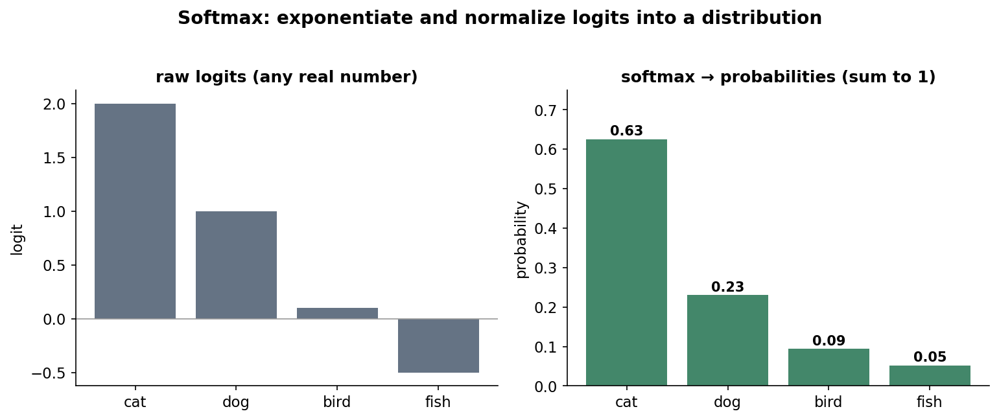
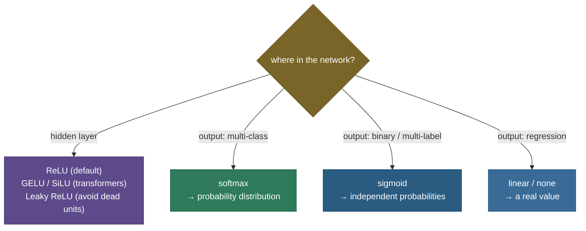

# Activation functions: the nonlinearity that makes a network a network

Here is a fact that surprises people: a deep neural network *without* activation functions isn't deep at all — it's a single linear layer wearing a disguise. Stack two linear maps and you get $W_2(W_1 x) = (W_2 W_1)x$, which is just *another* linear map. No matter how many layers you pile on, with no nonlinearity in between, the whole thing collapses to one matrix multiply that can only draw straight decision boundaries. The **activation function** — a simple nonlinear squish applied after each layer — is what breaks that collapse and lets a network bend, fold, and curve its way to representing genuinely complex functions. Which activation you choose then controls *how well gradients flow* during training, and that choice has quietly driven a lot of deep learning's progress (sigmoid → ReLU → GELU).

By the end of this page you'll be able to:

- explain *why* a nonlinearity is mathematically **required**, not optional;
- compare **sigmoid / tanh / ReLU / GELU** on saturation and the **vanishing-gradient** problem;
- explain the **dead-ReLU** problem and its fixes (Leaky ReLU, PReLU, ELU);
- derive **softmax**, why it's the output activation for classification, and how to compute it stably;
- choose the right activation for hidden layers vs each kind of output;
- implement them and their derivatives and match PyTorch.

Pictures and intuition first, then the math (with sources), then runnable code.

> **Note:** keep two questions separate. *Does the activation let the network represent curves?* — any nonlinearity does. *Does it let gradients flow so the network can actually be trained?* — this is where sigmoid fails and ReLU wins. Most of the history of activation functions is the second question, not the first.

---

## The problem: without nonlinearity, depth is an illusion

A layer computes an affine transform $z = Wx + b$ followed by an activation $a = \phi(z)$. Drop $\phi$ (i.e. make it the identity) and stack layers:

$$a = W_2(W_1 x + b_1) + b_2 = (W_2 W_1)x + (W_2 b_1 + b_2)$$

— a single linear map. A hundred such layers still only produce a linear function, which can't separate classes that aren't linearly separable (the classic **XOR** problem). The nonlinear $\phi$ between layers is precisely what gives the network the capacity to compose simple pieces into arbitrarily complex, curved functions (the universal approximation property depends on it).

---

## The classics: sigmoid and tanh (and why they fell out of favour)

The original activations squashed inputs into a bounded range:

- **Sigmoid** $\sigma(x) = \frac{1}{1+e^{-x}}$ — squashes to $(0,1)$. Interpretable as a probability, but with two flaws.
- **Tanh** $\tanh(x)$ — squashes to $(-1,1)$; **zero-centered** (an improvement over sigmoid), but shares sigmoid's core problem.


That core problem is **saturation → vanishing gradients**. Look at the right panel: where sigmoid/tanh flatten, their *derivative* goes to zero. In backprop, the gradient is multiplied by these derivatives layer after layer, so a chain of saturated sigmoids multiplies many near-zero numbers together and the gradient reaching the early layers **vanishes** — those layers barely learn. Sigmoid has a second flaw too: it's **not zero-centered** (always positive), which makes the gradients of a layer's weights all share a sign and zig-zag. These two issues made training deep sigmoid networks notoriously hard.

> *Where this comes from: the saturation / vanishing-gradient analysis of sigmoid/tanh and why it cripples deep nets is **Understanding the difficulty of training deep feedforward neural networks** (Glorot & Bengio 2010) — in the references; see also [Vanishing / Exploding Gradients](06-Vanishing-Exploding-Gradients.md).*

---

## ReLU: the activation that unlocked deep learning

**ReLU** (Rectified Linear Unit) is almost embarrassingly simple: $\text{ReLU}(x) = \max(0, x)$. Pass positives through unchanged, zero out negatives. Yet it fixed the things sigmoid broke:

- **No saturation for positive inputs** — its derivative is exactly **1** for $x > 0$ (right panel), so gradients flow back undiminished through active units. This is the single biggest reason deep networks became trainable.
- **Cheap** — a comparison and a max; no exponentials.
- **Sparse activations** — about half the units output exactly 0, which is efficient and can aid representation.

ReLU became the default hidden-layer activation, and still is for CNNs.

> **Gotcha — the dead-ReLU problem.** ReLU's derivative is **0** for $x < 0$. If a unit's input is pushed negative for *every* example (often by a too-large gradient step), it outputs 0, gets **zero gradient**, and can **never update again** — it's permanently dead. A network can silently lose a chunk of its capacity this way. The code demonstrates the zero gradient at a negative input.

> *Where this comes from: ReLU for deep nets is **Rectified Linear Units Improve Restricted Boltzmann Machines** (Nair & Hinton 2010) and **Deep Sparse Rectifier Neural Networks** (Glorot et al. 2011); the initialization tuned for ReLU is **Delving Deep into Rectifiers** (He et al. 2015) — references.*

---

## Fixing dead ReLUs, and the modern smooth activations

**Leaky ReLU** ($\max(0.01x, x)$) and **PReLU** (learnable slope) give negative inputs a small nonzero gradient so units can recover. **ELU** smooths the negative side with an exponential. All address the dead-unit problem.

The current frontier is **smooth** activations that look like ReLU but curve gently near zero:

- **GELU** (Gaussian Error Linear Unit) — $x\,\Phi(x)$, weighting the input by the probability a Gaussian is below it. Smooth, slightly negative for small negatives. **The activation in BERT, GPT, and most transformers.**
- **Swish / SiLU** — $x\,\sigma(x)$ — a learned-then-popularized smooth activation that often edges out ReLU.

Their smoothness gives a nonzero gradient almost everywhere (no hard dead zone) and empirically trains transformers a bit better.

> *Where this comes from: **GELU** is Hendrycks & Gimpel (2016); **Swish/SiLU** is Ramachandran, Zoph & Le (2017) — references.*

---

## Softmax: the output activation for classification

The activations above go in **hidden** layers. At the **output** of a multi-class classifier you need something different: turn a vector of raw scores (**logits**, any real numbers) into a **probability distribution**. That's **softmax**:

$$\text{softmax}(z)_i = \frac{e^{z_i}}{\sum_j e^{z_j}}$$

Exponentiate each logit (making everything positive and amplifying differences), then normalize so they sum to 1.



Softmax is the natural partner of **cross-entropy** loss — together they give the clean gradient $(\hat y - y)$ (derived in [Loss Functions](04-Loss-Functions.md)). Two notes: softmax is *invariant to adding a constant* to all logits, and you must compute it **stably** by subtracting the max logit first (otherwise $e^{z}$ overflows). For **binary** or **multi-label** outputs you use **sigmoid** per class instead (independent probabilities), not softmax (which forces them to compete).

> *Where this comes from: softmax and its Jacobian are derived in **d2l.ai** Ch. 4 and Brandon Rohrer's "Softmax from scratch" (references); the numerical-stability shift is the log-sum-exp trick.*

---

## Choosing an activation



> **See it interactively:** in [TensorFlow Playground](https://playground.tensorflow.org/) switch the **Activation** dropdown between ReLU / Tanh / Sigmoid / Linear and watch the network's ability to carve a curved boundary change — pick **Linear** and it can only draw a straight line, exactly the "depth is an illusion" point.

> **Tip:** the default recipe — **ReLU** (or **GELU** in transformers) for every hidden layer; **softmax** for multi-class output; **sigmoid** for binary/multi-label; **no activation** (linear) for regression output. If ReLUs are dying, switch to **Leaky ReLU / GELU**.

---

## Worked example

Take the vector $z = [2.0,\, 1.0,\, 0.1,\, -0.5]$ (the figure's logits).

- **ReLU:** $\max(0,z) = [2.0,\, 1.0,\, 0.1,\, 0]$ — the negative is clipped.
- **Sigmoid** of the first element: $\sigma(2.0) = 1/(1+e^{-2}) = 0.881$.
- **Softmax:** exponentiate — $e^{2.0}=7.39,\ e^{1.0}=2.72,\ e^{0.1}=1.11,\ e^{-0.5}=0.61$ — sum $= 11.82$; divide — $[0.625,\, 0.230,\, 0.094,\, 0.051]$, which sums to 1. The largest logit gets the largest probability, but the others still get a share (softmax is "soft," not winner-take-all).

---

## Code: activations and their derivatives (match PyTorch)

```python
"""Activations from scratch vs torch, and why sigmoid saturates but ReLU doesn't.
Verified on ml-py312 (torch 2.12), CPU."""
import torch, torch.nn.functional as F
torch.manual_seed(0)
x = torch.randn(6)

sig  = 1 / (1 + torch.exp(-x))
relu = torch.clamp(x, min=0)
gelu = 0.5 * x * (1 + torch.erf(x / 2**0.5))                 # exact GELU
print(f"sigmoid max|ours-torch| = {(sig  - torch.sigmoid(x)).abs().max():.2e}")
print(f"ReLU    max|ours-torch| = {(relu - F.relu(x)).abs().max():.2e}")
print(f"GELU    max|ours-torch| = {(gelu - F.gelu(x)).abs().max():.2e}")

logits = torch.tensor([2.0, 1.0, 0.1, -0.5])                 # softmax: stable, sums to 1
e = torch.exp(logits - logits.max()); probs = e / e.sum()
print(f"softmax = {probs.numpy().round(3)}  sum={probs.sum():.3f}")

print("\ngradient that flows back (the vanishing-gradient story):")
for z in [0.0, 2.0, 6.0]:
    s = torch.sigmoid(torch.tensor(z)); sig_grad = (s * (1 - s)).item()
    print(f"  input={z:>4}: sigmoid'={sig_grad:.4f}  ReLU'={1.0 if z>0 else 0.0:.1f}"
          f"  {'<- sigmoid SATURATED' if sig_grad < 0.05 else ''}")
```

Output:

```
sigmoid max|ours-torch| = 7.45e-09
ReLU    max|ours-torch| = 0.00e+00
GELU    max|ours-torch| = 8.20e-08
softmax = [0.625 0.23  0.094 0.051]  sum=1.000

gradient that flows back (the vanishing-gradient story):
  input= 0.0: sigmoid'=0.2500  ReLU'=0.0
  input= 2.0: sigmoid'=0.1050  ReLU'=1.0
  input= 6.0: sigmoid'=0.0025  ReLU'=1.0  <- sigmoid SATURATED
```

> **Note:** the implementations match PyTorch to floating-point precision. The last block is the whole reason ReLU replaced sigmoid: at an input of 6, sigmoid passes back a gradient of **0.0025** (essentially nothing — multiply a few of those and the signal vanishes), while ReLU passes back a full **1.0**. That single difference is what let networks get deep.

---

## Where activations are used

- **ReLU** — the default in CNNs and most feedforward nets.
- **GELU / SiLU** — transformers (BERT, GPT, ViT) and many modern architectures.
- **Sigmoid** — binary classification heads, and **gates** in LSTMs/GRUs (where the $(0,1)$ range means "how much to let through").
- **Tanh** — RNN hidden states and some generative models, where a zero-centered bounded output helps.
- **Softmax** — the output of every multi-class classifier, including the next-token head of every LLM.

> **Tip:** activation choice interacts with **initialization** and **normalization**. ReLU pairs with **He initialization** (variance scaled for the rectifier); tanh/sigmoid with **Xavier/Glorot**. Get the pairing wrong and you re-introduce the vanishing/exploding-gradient problem the activation was meant to avoid.

---

## Recap and rapid-fire

**If you remember nothing else:** activations are the nonlinearity that stops a deep network from collapsing to a single linear map. **Sigmoid/tanh** saturate, so their gradients vanish in deep nets; **ReLU** ($\max(0,x)$) has gradient 1 for positive inputs and unlocked deep learning, at the cost of the **dead-ReLU** problem (fixed by Leaky ReLU/GELU); **softmax** turns logits into a probability distribution at the output and pairs with cross-entropy.

**Quick-fire — say these out loud:**

- *Why do we need an activation at all?* Without a nonlinearity, stacked layers collapse to one linear map (can't fit curves / XOR).
- *Why did ReLU replace sigmoid?* No saturation for $x>0$ (derivative = 1), so gradients don't vanish; also cheap and sparse.
- *What's the vanishing-gradient link?* Sigmoid/tanh derivatives → 0 in saturation; multiplied across layers, the gradient dies.
- *What is the dead-ReLU problem and a fix?* A unit stuck at $x<0$ gets zero gradient forever; fix with Leaky ReLU / PReLU / GELU.
- *What is GELU and where is it used?* A smooth $x\Phi(x)$ activation; the default in transformers (BERT/GPT).
- *What does softmax do, and its partner loss?* Exponentiate-and-normalize logits → probabilities; pairs with cross-entropy.
- *Softmax vs sigmoid at the output?* Softmax for mutually-exclusive multi-class; sigmoid-per-class for binary/multi-label.
- *Numerical stability of softmax?* Subtract the max logit before exponentiating (avoid overflow).
- *Activation for a regression output?* None — linear output.
- *Pairing with init?* ReLU ↔ He init; tanh/sigmoid ↔ Xavier/Glorot.

---

## References and further reading

The curated link library for this topic — videos, courses, interactive/visual resources, articles, papers, books, and internal cross-links — lives in a companion file so it can be reused as a standalone reference list:

**→ [Activation Functions — references and further reading](03-Activation-Functions.references.md)**
