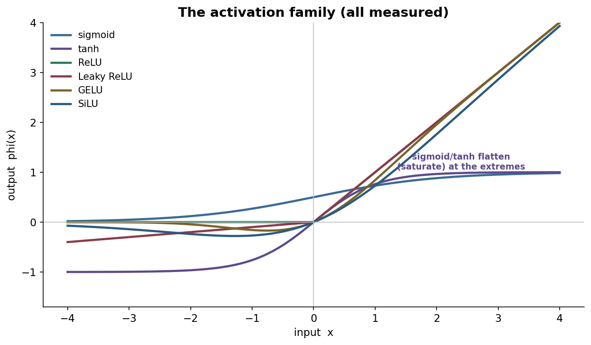
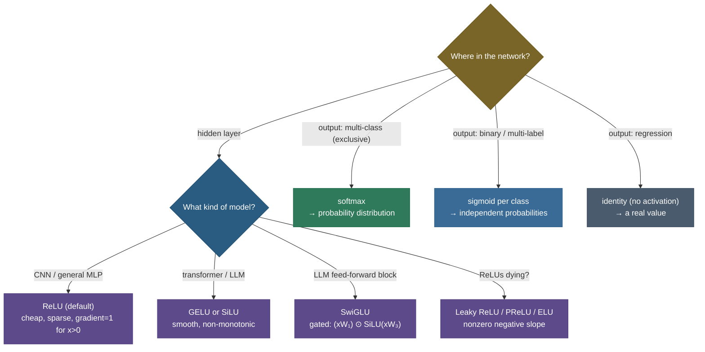
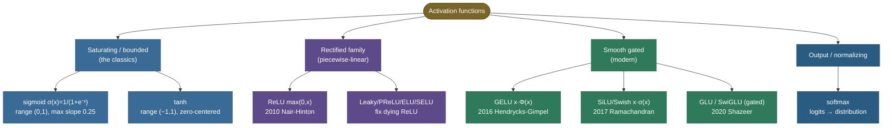

# Activation functions: the nonlinearity that makes a network a network

Here is a fact that surprises people the first time they meet it: a deep neural network *without* activation functions isn't deep at all — it's a single linear layer wearing a very elaborate disguise. Stack two linear maps and you get $W_2(W_1 x) = (W_2 W_1)x$, which is just *another* linear map. Pile on a hundred layers and, with no nonlinearity in between, the whole tower still collapses to one matrix multiply that can only draw straight decision boundaries. The **activation function** — a simple nonlinear squish applied after each layer — is the thing that breaks that collapse and lets a network bend, fold, and curve its way into representing genuinely complex functions. *Which* activation you then choose quietly controls how well gradients flow during training, and that single choice has driven a surprising amount of deep learning's progress: the field's history reads almost like a relay race of activations — sigmoid handed off to ReLU, ReLU handed off to GELU/SiLU, and the gating idea (GLU → SwiGLU) now powering the feed-forward blocks of every frontier LLM.

I'm going to teach this the way I'd actually walk a teammate through it at a whiteboard. First we'll *prove* — with two lines of algebra — why a nonlinearity is mathematically non-negotiable. Then we'll lay out **what makes a good activation** so the zoo of functions stops feeling arbitrary. Then we'll go through the family one at a time — each with its **formula, its derivative, and its tradeoffs** — deriving the saturation problem, the dying-ReLU problem, the self-normalizing fixed point of SELU, the Gaussian gate inside GELU, and the gating trick inside SwiGLU. We'll derive **softmax** end to end, including its **Jacobian** and the **log-sum-exp** numerical-stability trick. And we'll close with **five worked examples of rising difficulty** — by-hand values that match PyTorch, a numerically demonstrated dying ReLU, softmax with temperature plus the stable form, and a **measured** training run where sigmoid, ReLU, and GELU visibly diverge. By the end you'll be able to:

- **prove** why a nonlinearity is *required*, not a stylistic choice;
- state the **formula and derivative** of sigmoid, tanh, ReLU, Leaky ReLU/PReLU, ELU, SELU, GELU, SiLU/Swish, GLU/SwiGLU, and softmax — and reason about each from its derivative;
- explain **saturation → vanishing gradients** and the **dying-ReLU** problem from first principles, and the fixes for each;
- derive **softmax**, its **Jacobian** $\partial s_i/\partial z_j = s_i(\delta_{ij}-s_j)$, **temperature**, and the **log-sum-exp** stability shift;
- **choose** the right activation for hidden layers vs each kind of output head;
- implement them and their derivatives and **match PyTorch to floating-point precision.**

> **Note:** keep two questions separate, because they're constantly conflated. *Does the activation let the network represent curves?* — **any** nonlinearity does that; that's the universal-approximation half. *Does it let gradients flow so the network can actually be **trained**?* — this is where sigmoid fails and ReLU wins. Most of the history of activation functions is about the *second* question, not the first. Hold onto that distinction; it organizes the whole topic.

---

## The problem: without nonlinearity, depth is an illusion

To feel why activations exist, you have to watch depth *evaporate* when you remove them.

A single layer computes an affine transform $z = Wx + b$ followed by an activation $a = \phi(z)$. Suppose we drop $\phi$ — i.e. make it the identity, $\phi(z)=z$ — and stack two layers:

$$a = W_2\big(W_1 x + b_1\big) + b_2 = \underbrace{(W_2 W_1)}_{\textstyle W'}\,x + \underbrace{(W_2 b_1 + b_2)}_{\textstyle b'} = W'x + b'.$$

The composition of two affine maps is **one** affine map. Induct on this and a stack of $L$ linear layers,

$$a = W_L\big(W_{L-1}(\cdots(W_1 x + b_1)\cdots) + b_{L-1}\big) + b_L = \Big(\textstyle\prod_{\ell} W_\ell\Big)x + b',$$

is *still* a single affine map $W'x + b'$. A hundred such layers, a million parameters — it can only ever produce a **linear** function of $x$. And a linear function cannot separate classes that aren't linearly separable. The textbook witness is **XOR**: four points, $(0,0)\!\to\!0$, $(1,1)\!\to\!0$, $(0,1)\!\to\!1$, $(1,0)\!\to\!1$. No straight line puts the two 0-points on one side and the two 1-points on the other — try it, it's impossible — yet a *two*-layer network with a single nonlinearity in the middle solves it trivially by folding the input space. The nonlinear $\phi$ between layers is **precisely** what buys you the composition of simple pieces into arbitrarily complex, curved functions; it is the reason the **universal approximation theorem** holds for finite networks at all.

> **Note:** "linear can't fit XOR" is the *minimal* witness, but the real point is geometric. Each ReLU unit contributes one **hinge** — a fold line in input space. Stack and combine enough hinges and you can tile any continuous function with piecewise-linear facets to arbitrary accuracy. Depth without a nonlinearity has **zero** hinges, so it has exactly the expressive power of $y = Wx+b$, no matter how many parameters you spend.

> **Tip:** see this live in [TensorFlow Playground](https://playground.tensorflow.org/) — set the Activation dropdown to **Linear** on the two-spirals or circle dataset and watch the boundary stay obstinately straight no matter how many layers/neurons you add; flip it to **ReLU** and the curve snaps into place. That's "depth is an illusion" made visual.

---

## What makes a good activation

Before meeting the functions, fix the **criteria** they're judged on. Every activation is a set of tradeoffs against this checklist, and once you internalize it the zoo organizes itself:

1. **Nonlinear.** Non-negotiable, per the derivation above — a linear $\phi$ buys no depth.
2. **Differentiable (almost everywhere).** Backprop needs a gradient. It's fine to be non-differentiable at isolated points (ReLU's kink at $0$) as long as we can assign a **subgradient** there; what's fatal is being flat over a *region*, because flat means **zero gradient** means **no learning** for any unit living there.
3. **Good gradient behavior — the derivative should not systematically vanish or explode.** The backward pass multiplies these derivatives **layer after layer**. If $|\phi'|$ is reliably $\ll 1$ (saturating activations), the product over many layers decays toward zero and early layers stop learning — **vanishing gradients**. If $|\phi'|$ is reliably $\gg 1$, the product blows up — **exploding gradients**. The sweet spot keeps $\phi'$ near $1$ for the inputs the network actually sees.
4. **Roughly zero-centered output.** If a layer's outputs are all the same sign (sigmoid is always positive), the gradients of the *next* layer's weights all share a sign, forcing inefficient **zig-zag** updates (more below).
5. **Output range.** Bounded ranges (sigmoid $(0,1)$, tanh $(-1,1)$) are useful for **gates** and **probabilities** but invite saturation; unbounded-above ranges (ReLU, GELU) avoid positive saturation and keep gradients alive.
6. **(Near-)monotonic** is the historical default (more input → more output), though the best modern activations (GELU, SiLU) are deliberately **non-monotonic** near zero — a small, useful violation we'll derive.
7. **Cheap.** It runs on *every* unit on *every* forward and backward pass of *every* batch. A `max` (ReLU) is nearly free; an `exp` (sigmoid, softmax) costs more; this is why ReLU's frugality mattered for scaling.

> **Note:** criteria **3 and 4** are the ones that decide whether a deep network *trains*, and they're exactly where the classics fail and the modern functions win. Keep them front of mind as we go — almost every design choice below is chasing "keep $\phi'$ near 1, and keep the outputs roughly centered."

---

## Intuition: a network of dimmer switches, not on/off switches

Here's the picture I keep in my head. A neuron computes a weighted vote $z = Wx+b$ — "given my inputs, how strongly do I fire?" The activation is the **knob** that converts that vote into an output, and the *shape* of the knob is everything.

A **linear** knob is no knob at all — the output is just the vote, scaled. Chain a thousand such "knobs" and you've only ever rescaled the original inputs once (that's the $W_2W_1x = W'x$ collapse). To build something interesting you need a knob whose response *bends*.

The **classics** (sigmoid/tanh) are knobs that **clamp at both ends** — like an old dimmer that's already at full-bright or full-dark over most of its travel, with only a narrow band in the middle where turning it does anything. That clamping is the saturation: once a unit's vote is even moderately large, nudging the upstream weights barely changes its output, so backprop reports "your change did almost nothing" (gradient ≈ 0) and learning stalls.

**ReLU** is a knob that's **off below zero and a perfect 1:1 dimmer above it** — turn it past the threshold and every bit of extra vote shows up exactly in the output (gradient 1). That faithful pass-through is why gradients survive depth. The cost: below the threshold it's not just off, it's *unresponsive* — turn it down there and nothing happens ever again (the dead unit).

The **smooth gates** (GELU/SiLU) are the refined version: a dimmer that fades on gently around zero, lets a *whisper* of small-negative votes through, and is faithful (≈1:1) for clearly-positive votes — best of both, with no perfectly-dead region. And **SwiGLU** adds a *second* knob that watches the same input and decides how far to open the first — a learned, input-dependent gate, like a smart dimmer that brightens the room more when it senses you're reading. Hold this image; each function below is just a different knob shape chasing the same goal: **respond faithfully where it matters, so the gradient survives.**

---

## The classics: sigmoid and tanh (and why they fell out of favour)

The original activations *squashed* an unbounded input into a bounded range.

**Sigmoid** (the logistic function):

$$\sigma(x) = \frac{1}{1+e^{-x}}, \qquad \text{range } (0,1).$$

Its derivative has a famously clean closed form. Differentiate $\sigma = (1+e^{-x})^{-1}$:

$$\sigma'(x) = -\big(1+e^{-x}\big)^{-2}\cdot(-e^{-x}) = \frac{e^{-x}}{(1+e^{-x})^2}.$$

Now the trick — rewrite $e^{-x} = \frac{1-\sigma}{\sigma}$ (since $\sigma = \frac{1}{1+e^{-x}} \Rightarrow 1+e^{-x} = 1/\sigma \Rightarrow e^{-x} = 1/\sigma - 1 = \frac{1-\sigma}{\sigma}$) and substitute:

$$\boxed{\;\sigma'(x) = \sigma(x)\,\big(1-\sigma(x)\big).\;}$$

This is the identity worth memorizing. It immediately tells you the worst-case gradient: $\sigma(1-\sigma)$ is a downward parabola in $\sigma\in(0,1)$, **maximized at $\sigma=0.5$** (i.e. $x=0$) where it equals $0.5\cdot0.5 = \mathbf{0.25}$, and decaying to $0$ as $\sigma\to0$ or $\sigma\to1$. So **the largest gradient sigmoid can ever pass back is $0.25$** — and in the saturated tails it's essentially $0$.

**Tanh** is sigmoid's zero-centered cousin:

$$\tanh(x) = \frac{e^{x}-e^{-x}}{e^{x}+e^{-x}} = 2\sigma(2x)-1, \qquad \text{range } (-1,1), \qquad \tanh'(x) = 1-\tanh^2(x).$$

Its derivative peaks at $1$ (at $x=0$), so tanh starts off four times "stronger" than sigmoid, and being **zero-centered** fixes sigmoid's sign problem. But the shape is the same: it still saturates, so $\tanh'\to0$ in the tails just as badly.



That shared shape is the whole problem: **saturation → vanishing gradients.** Look at the derivative panel below. Where sigmoid/tanh flatten, their *derivative* collapses to zero. In backprop the upstream gradient is **multiplied** by these derivatives at every layer, so a chain of saturated sigmoids multiplies a string of numbers each $\le 0.25$ — and $0.25^{10}\approx 10^{-6}$. The gradient reaching the early layers **vanishes**, and those layers barely move. This is the precise mechanism that made deep sigmoid networks notoriously untrainable before ~2010.


Sigmoid carries a **second**, subtler flaw: it is **not zero-centered** — its output is always positive. Why does that hurt? Consider a neuron $z = \sum_i w_i a_i + b$ where every input $a_i$ comes from a previous sigmoid, so every $a_i > 0$. During backprop, $\partial L/\partial w_i = (\partial L/\partial z)\cdot a_i$. Since all $a_i$ share the same (positive) sign, the gradients of **all** the incoming weights share the sign of the single scalar $\partial L/\partial z$ — they must **all** increase together or **all** decrease together. The optimizer can't move them in mixed directions in one step, so it has to take a **zig-zag** staircase toward the optimum instead of a straight line. Tanh, being centered on $0$, lets activations be positive *or* negative and fixes exactly this. Both flaws — saturation and the positivity bias — are why these two squashing functions were eventually retired from hidden layers.

> *Where this comes from: the saturation / vanishing-gradient analysis of sigmoid/tanh — and why it cripples deep nets — is **Understanding the difficulty of training deep feedforward neural networks** (Glorot & Bengio 2010), which also gave us Xavier/Glorot initialization. The zig-zag argument for zero-centering appears in **CS231n**. Both are in the references; see also our [Vanishing / Exploding Gradients](06-Vanishing-Exploding-Gradients.md) page for the layer-by-layer product in full.*

---

## ReLU: the activation that unlocked deep learning

**ReLU** (Rectified Linear Unit, Nair & Hinton 2010) is almost embarrassingly simple:

$$\text{ReLU}(x) = \max(0, x), \qquad \text{ReLU}'(x) = \begin{cases}1 & x>0\\ 0 & x<0\end{cases}\quad(\text{subgradient }0\text{ at }x{=}0).$$

Pass positives through unchanged; zero out negatives. Yet this trivial function fixed nearly everything sigmoid broke:

- **No saturation for positive inputs.** Its derivative is **exactly 1** for $x>0$, so the upstream gradient flows back **undiminished** through every active unit — multiply a chain of $1$s and you still have $1$. This is the single biggest reason very deep networks suddenly became trainable around 2011–2012 (AlexNet rode it to the ImageNet breakthrough).
- **Cheap.** A comparison and a `max`; no `exp`, no division. On the scale of a large model that frugality is real money.
- **Sparse activations.** For a roughly zero-mean pre-activation, about **half** the units output exactly $0$ at any moment. Sparse codes are efficient and can aid representation — only the relevant features fire.

ReLU became the default hidden-layer activation overnight, and it is *still* the default for CNNs and most plain feed-forward nets.

But there is no free lunch. ReLU's flat-zero negative half hides a real failure mode:

> **Gotcha — the dying-ReLU problem (derived).** ReLU's derivative is **0** for $x<0$. Now suppose a unit's pre-activation is pushed negative for *every* training example — say a large gradient step drives its bias very negative. Then for **all** inputs it outputs $0$, so its gradient $\partial L/\partial z = (\partial L/\partial a)\cdot\text{ReLU}'(z) = (\partial L/\partial a)\cdot 0 = 0$. With zero gradient, the optimizer **never updates that unit's weights**, so its pre-activation stays negative, so it stays at $0$ — **forever**. The neuron is permanently dead; the network silently loses a chunk of its capacity, and you'll see it as a layer where a suspicious fraction of units are always-zero. (Worked example 3 shows this gradient hitting exactly $0$ in code.) The cure: give the negative side a **nonzero slope** so a dead unit still receives a trickle of gradient and can climb back — which is exactly what Leaky ReLU and friends do.

> *Where this comes from: ReLU for deep nets is **Rectified Linear Units Improve Restricted Boltzmann Machines** (Nair & Hinton 2010) and **Deep Sparse Rectifier Neural Networks** (Glorot, Bordes & Bengio 2011); the initialization tuned for ReLU's halved variance is **Delving Deep into Rectifiers** (He et al. 2015) — all in the references.*

---

## Fixing dying ReLUs: Leaky ReLU, PReLU, ELU, SELU

The fixes all share one move: **don't let the negative side be perfectly flat.**

**Leaky ReLU** (Maas et al. 2013) gives negatives a small fixed slope $\alpha$ (typically $0.01$):

$$\text{LeakyReLU}(x) = \max(\alpha x, x) = \begin{cases}x & x>0\\ \alpha x & x\le0\end{cases}, \qquad \text{slope }= \begin{cases}1 & x>0\\ \alpha & x<0\end{cases}.$$

Now a unit at $x<0$ still has gradient $\alpha\neq0$ and can recover — dying ReLU solved by construction.

**PReLU** (He et al. 2015) makes that slope a **learnable parameter** $\alpha$ instead of a hand-set constant — the network decides per-channel how leaky to be (and it's trained by ordinary backprop, since $\partial\,\text{PReLU}/\partial\alpha = \min(0,x)$).

**ELU** (Exponential Linear Unit, Clevert et al. 2015) smooths the negative side with a saturating exponential:

$$\text{ELU}(x) = \begin{cases}x & x>0\\ \alpha\,(e^{x}-1) & x\le0\end{cases}.$$

Unlike Leaky ReLU's straight negative ray, ELU's negative branch **saturates toward $-\alpha$**, which pushes the mean activation closer to zero (helping with the zero-centering criterion) while keeping a nonzero gradient near the origin.

**SELU** (Scaled ELU, Klambauer et al. 2017) is ELU times a precise scale, with two "magic" constants:

$$\text{SELU}(x) = \lambda\begin{cases}x & x>0\\ \alpha\,(e^{x}-1) & x\le0\end{cases}, \qquad \alpha\approx1.6733,\ \ \lambda\approx1.0507.$$

Those constants aren't arbitrary — they're the solution to a **fixed-point** condition. The idea of **self-normalizing networks (SNNs)** is that if your inputs to a layer have mean $0$ and variance $1$, you want the *outputs* of SELU to **also** have mean $0$ and variance $1$, so activations stay normalized as they propagate through depth, *without* an explicit BatchNorm/LayerNorm. Klambauer et al. solve for the $(\alpha,\lambda)$ that make $(\mu,\nu)=(0,1)$ a **stable attracting fixed point** of the layer-to-layer map on $(\text{mean},\text{variance})$; any layer whose statistics drift away gets pulled back toward $(0,1)$. It's an elegant idea — normalization baked into the activation itself — though in practice explicit normalization layers (and ReLU/GELU) proved more robust, so SELU is more a beautiful special case than a default.

> **Tip:** SELU's self-normalizing guarantee only holds under its **own** assumptions — inputs standardized to $(0,1)$, a specific **LeCun-normal** weight init, the matching **AlphaDropout**, and feed-forward (not conv/residual) topology. Break any of those and the fixed point no longer holds. That fragility, more than the math, is why SELU never displaced ReLU/GELU as a default.

> *Where this comes from: Leaky ReLU is **Rectifier Nonlinearities Improve Neural Network Acoustic Models** (Maas, Hannun & Ng 2013); PReLU + He-init is **Delving Deep into Rectifiers** (He et al. 2015); ELU is **Fast and Accurate Deep Network Learning by Exponential Linear Units** (Clevert, Unterthiner & Hochreiter 2015); SELU/SNNs is **Self-Normalizing Neural Networks** (Klambauer et al. 2017) — references.*

---

## The modern smooth activations: GELU and SiLU/Swish

ReLU's hard kink at $0$ is non-differentiable and its negative half is dead. The current frontier is **smooth, non-monotonic** activations that look like ReLU for large $x$ but curve gently — and dip slightly negative — near zero.

**GELU** (Gaussian Error Linear Unit, Hendrycks & Gimpel 2016) is **the** activation in BERT, GPT, and most transformers. Its definition:

$$\text{GELU}(x) = x\cdot\Phi(x), \qquad \Phi(x) = P(Z\le x),\ Z\sim\mathcal N(0,1) = \tfrac12\Big(1+\text{erf}\big(\tfrac{x}{\sqrt2}\big)\Big).$$

The story is a **stochastic gate**. ReLU multiplies the input by a hard $0/1$ mask ($\mathbb 1[x>0]$). GELU instead multiplies $x$ by the **probability that a standard Gaussian falls below $x$** — a *soft*, smoothly-increasing gate. Large positive $x$ → $\Phi(x)\approx1$ → passes through (≈ identity); large negative $x$ → $\Phi(x)\approx0$ → suppressed (≈ $0$); and near zero you get a smooth blend that lets a *little* of small negatives through. Equivalently, GELU is the expected value of an input that is randomly zeroed with probability $1-\Phi(x)$ — a deterministic version of dropping units by their magnitude.

Because the exact $\Phi$ needs an `erf`, GELU is often shipped via a cheaper **tanh approximation**:

$$\text{GELU}(x) \approx \tfrac12\,x\Big(1+\tanh\!\Big[\sqrt{\tfrac{2}{\pi}}\big(x + 0.044715\,x^3\big)\Big]\Big).$$

This matches the exact form to a few parts in a thousand and was the version used in the original BERT/GPT-2 code; modern frameworks default to the exact `erf` form (PyTorch's `F.gelu(approximate="none")`).

**SiLU / Swish** (Ramachandran, Zoph & Le 2017 — found by an automated activation search, and independently the "SiLU" of Elfwing et al. 2017) is the **self-gated** sibling:

$$\text{SiLU}(x) = x\cdot\sigma(x) = \frac{x}{1+e^{-x}}.$$

Same shape of idea as GELU — multiply $x$ by a smooth $(0,1)$ gate — but the gate is the **sigmoid of $x$ itself** rather than the Gaussian CDF. It's cheaper than exact GELU (no `erf`), nearly as good, and is the hidden activation inside many vision and LLM stacks.


Two properties pay off in practice. **Smoothness**: $\phi'$ exists and is continuous everywhere, with no hard dead zone, so there's always *some* gradient — no permanent death. **Non-monotonicity**: both functions dip slightly below zero for small negatives (the dips in the figure), which gives the network a gentle way to represent "small negative" features distinctly from "zero," and empirically trains transformers a touch better. Notice in the derivative figure that $\text{GELU}'$ and $\text{SiLU}'$ even **overshoot above 1** near $x\approx1.5$ — a mild gradient amplification in the active region that ReLU's flat 1 doesn't provide.

> *Where this comes from: **GELU** is **Gaussian Error Linear Units** (Hendrycks & Gimpel 2016); **Swish** is **Searching for Activation Functions** (Ramachandran, Zoph & Le 2017), with the **SiLU** name and reinforcement-learning origin in Elfwing, Uchibe & Doya (2017) — references.*

---

## Gated linear units: GLU and SwiGLU (the LLM feed-forward block)

The newest twist isn't a pointwise activation at all — it's an **activation built into the layer**. A standard transformer feed-forward block (FFN) is $\text{FFN}(x) = \phi(xW_1)\,W_2$ with $\phi$ = ReLU or GELU. **Gated Linear Units** restructure that block so part of it acts as a learned, multiplicative **gate**.

The original **GLU** (Dauphin et al. 2017) is:

$$\text{GLU}(x) = (xW + b)\;\odot\;\sigma(xV + c),$$

where $\odot$ is elementwise product. The input is projected **two** ways: one branch is the "content" $(xW+b)$, the other is a **gate** $\sigma(xV+c)\in(0,1)$ that decides, per-coordinate, **how much of the content to let through**. It's the same "let-through" intuition as an LSTM gate, generalized to a feed-forward layer.

Shazeer (2020) swept the activation in the gate and found the best variant replaces the sigmoid gate with a **SiLU/Swish** gate — **SwiGLU**:

$$\text{SwiGLU}(x) = \big(xW_1\big)\;\odot\;\text{SiLU}\!\big(xW_3\big), \qquad \text{FFN}_{\text{SwiGLU}}(x) = \Big[\big(xW_1\big)\odot\text{SiLU}\big(xW_3\big)\Big]W_2.$$

This is the FFN used in **LLaMA, PaLM, Mistral, and most modern LLMs**. Two practical notes. First, it uses **three** weight matrices ($W_1, W_3$ for the two input projections, $W_2$ for the output) instead of the usual two, so to keep the parameter count fixed papers shrink the hidden width by $\tfrac23$ (e.g. $d_{\text{ff}} = \tfrac83 d$ instead of $4d$). Second, *why does gating help?* The multiplicative interaction lets the layer compute **input-dependent, second-order** features — the gate can suppress or amplify the content based on the same input — which a single pointwise nonlinearity can't express as cheaply. Shazeer's own verdict was famously dry: these variants work better, and *"we offer no explanation as to why... and attribute their success, as all else, to divine benevolence."* The empirical win, replicated across labs, is what made SwiGLU standard.

> **Tip:** when an interviewer asks "what activation does LLaMA use?", the precise answer is **SwiGLU in the FFN** (a gated SiLU), **not** a plain pointwise activation — and the attention sublayer has no activation between Q·Kᵀ and the softmax. Conflating "the model's activation" with a single function is a common slip.

> *Where this comes from: GLU is **Language Modeling with Gated Convolutional Networks** (Dauphin et al. 2017); the SwiGLU result is **GLU Variants Improve Transformer** (Shazeer 2020) — references.*

---

## Softmax: the output activation for classification

The activations above belong in **hidden** layers. At the **output** of a multi-class classifier you need something categorically different: turn a vector of raw scores (**logits**, any real numbers) into a **probability distribution** over $K$ mutually-exclusive classes. That's **softmax**:

$$\text{softmax}(z)_i = \frac{e^{z_i}}{\sum_{j=1}^{K} e^{z_j}}.$$

Exponentiate each logit (making everything positive and amplifying differences multiplicatively), then normalize by the sum so the outputs are all in $(0,1)$ and **sum to exactly 1** — a valid distribution. The largest logit gets the largest share, but every class keeps a nonzero slice (softmax is "soft," not winner-take-all — that's the point of the name).


**Temperature.** A scalar $T>0$ rescales the logits before softmax:

$$\text{softmax}(z/T)_i = \frac{e^{z_i/T}}{\sum_j e^{z_j/T}}.$$

As $T\to0^+$ the distribution sharpens to a one-hot on the argmax (deterministic, "greedy"); as $T\to\infty$ it flattens to uniform $1/K$ (maximum randomness); $T=1$ is plain softmax. This is the **sampling temperature** every LLM exposes, and the temperature in knowledge **distillation** (a high $T$ softens the teacher's targets so the student learns the relative class similarities, not just the argmax).

**Numerical stability — the log-sum-exp shift (derived).** Computed naively, $e^{z_i}$ **overflows** to `inf` for large logits ($e^{1000} = \infty$ in float32), and the result is `nan`. The fix exploits softmax's **shift-invariance**: subtract any constant $c$ from every logit and the output is *unchanged*, because the constant factors cancel,

$$\text{softmax}(z - c)_i = \frac{e^{z_i - c}}{\sum_j e^{z_j - c}} = \frac{e^{z_i}e^{-c}}{e^{-c}\sum_j e^{z_j}} = \frac{e^{z_i}}{\sum_j e^{z_j}} = \text{softmax}(z)_i.$$

Choosing $c = \max_j z_j$ makes the largest exponent exactly $e^0 = 1$ and all others $\le 1$, so **nothing overflows** (the worst case underflows harmlessly to $0$). Worked example 4 shows the naive form producing `nan` on `[1000, 1001, 1002]` while the shifted form returns the correct `[0.09, 0.24, 0.67]`. In practice you usually want **log-softmax** directly (it pairs with cross-entropy), computed via the **log-sum-exp** identity:

$$\log\text{softmax}(z)_i = z_i - \log\!\sum_j e^{z_j} = (z_i - c) - \log\!\sum_j e^{z_j - c}, \qquad c=\max_j z_j.$$

This is why frameworks expose `log_softmax` and `cross_entropy` as **fused** ops — they apply this shift internally so you never overflow and never lose precision taking a log of a tiny softmax output.

**For binary or multi-label outputs**, use **sigmoid per class** instead of softmax. Softmax forces the classes to **compete** (they must sum to 1 — more "cat" means less "dog"); a multi-label image that is *both* "beach" and "sunset" needs **independent** probabilities, which is exactly $K$ independent sigmoids.

> *Where this comes from: softmax, its Jacobian, and the cross-entropy pairing are derived in **d2l.ai** Ch. 4 and Brandon Rohrer's "Softmax from scratch" (references); the max-subtraction is the standard **log-sum-exp** trick. The clean softmax+cross-entropy gradient $(\hat y - y)$ is derived on our [Loss Functions](04-Loss-Functions.md) page.*

### The Jacobian of softmax (derived)

Softmax maps a vector to a vector, so its derivative is a **$K\times K$ Jacobian** $J_{ij} = \partial s_i/\partial z_j$ where $s = \text{softmax}(z)$. Deriving it is a classic interview question; do it with the quotient rule on $s_i = e^{z_i}/S$ where $S=\sum_k e^{z_k}$, noting $\partial S/\partial z_j = e^{z_j}$.

**Case $i=j$:**

$$\frac{\partial s_i}{\partial z_i} = \frac{e^{z_i}\,S - e^{z_i}\,e^{z_i}}{S^2} = \frac{e^{z_i}}{S}\cdot\frac{S - e^{z_i}}{S} = s_i(1 - s_i).$$

**Case $i\neq j$:** the numerator $e^{z_i}$ doesn't depend on $z_j$, so only the denominator's $S$ contributes:

$$\frac{\partial s_i}{\partial z_j} = \frac{0\cdot S - e^{z_i}\,e^{z_j}}{S^2} = -\frac{e^{z_i}}{S}\cdot\frac{e^{z_j}}{S} = -\,s_i\,s_j.$$

Both cases collapse into one compact formula using the Kronecker delta $\delta_{ij}$ ($1$ if $i{=}j$, else $0$):

$$\boxed{\;\frac{\partial s_i}{\partial z_j} = s_i\big(\delta_{ij} - s_j\big),\qquad J = \text{diag}(s) - s\,s^{\top}.\;}$$

Worked example 5 confirms this $\text{diag}(s)-ss^\top$ matrix matches autograd to $10^{-8}$. The diagonal $s_i(1-s_i)$ is always positive (raising a logit raises its own probability); the off-diagonals $-s_is_j$ are always negative (raising one logit *steals* probability from every other class — they compete). This $-ss^\top$ coupling is exactly what makes softmax a *distribution* rather than $K$ independent outputs, and it's what collapses, beautifully, into the simple $(\hat y - y)$ gradient when softmax is paired with cross-entropy.

---

## The family at a glance

One table to hold the whole zoo against the checklist. "Saturates?" means the derivative collapses to ~0 over a region (the vanishing-gradient risk); "zero-centered?" is criterion 4; "dead units?" is whether a unit can get permanently stuck at zero gradient.

| Activation | Formula | Derivative | Range | Saturates? | Zero-centered? | Dead units? | Cost | Typical use |
|---|---|---|---|---|---|---|---|---|
| Sigmoid | $\frac{1}{1+e^{-x}}$ | $\sigma(1-\sigma)$, max $0.25$ | $(0,1)$ | yes (both tails) | no | no | `exp` | binary head, gates |
| Tanh | $\tanh x$ | $1-\tanh^2$, max $1$ | $(-1,1)$ | yes (both tails) | **yes** | no | `exp` | RNN states |
| ReLU | $\max(0,x)$ | $\mathbb 1[x>0]$ | $[0,\infty)$ | no (positive side) | no | **yes** | `max` (cheapest) | CNN/MLP default |
| Leaky ReLU | $\max(\alpha x,x)$ | $1$ or $\alpha$ | $(-\infty,\infty)$ | no | ~ | no | `max` | dying-ReLU fix |
| PReLU | $\max(\alpha x,x)$, $\alpha$ learned | $1$ or $\alpha$ | $(-\infty,\infty)$ | no | ~ | no | `max` | learned leak |
| ELU | $x$ or $\alpha(e^x{-}1)$ | $1$ or $\alpha e^x$ | $(-\alpha,\infty)$ | left-saturates | ~yes | no | `exp` (neg) | centered alt |
| SELU | $\lambda\cdot\text{ELU}$ | $\lambda$-scaled | $(-\lambda\alpha,\infty)$ | left-saturates | ~yes | no | `exp` (neg) | self-normalizing nets |
| GELU | $x\,\Phi(x)$ | $\Phi(x)+x\phi(x)$ | $\approx[-0.17,\infty)$ | no | ~yes | no | `erf` | transformers |
| SiLU/Swish | $x\,\sigma(x)$ | $\sigma(x)(1+x(1-\sigma(x)))$ | $\approx[-0.28,\infty)$ | no | ~yes | no | `exp` | transformers/vision |
| SwiGLU | $(xW_1)\odot\text{SiLU}(xW_3)$ | (gated) | $(-\infty,\infty)$ | no | ~yes | no | `exp`+matmul | LLM FFN |
| Softmax | $\frac{e^{z_i}}{\sum_j e^{z_j}}$ | $s_i(\delta_{ij}-s_j)$ | $(0,1)$, sums to 1 | — | — | — | `exp`+norm | multi-class output |

Reading down the "Dead units?" and "Saturates?" columns tells the whole evolutionary story: the classics saturate, ReLU fixed saturation but introduced death, and the leaky/smooth families fixed death while keeping ReLU's healthy positive-side gradient.

---

## Choosing an activation



The family, organized by lineage — saturating classics, the rectified family, the smooth gated moderns, and the output/normalizing functions, with provenance:



> **Tip:** the default recipe to memorize — **ReLU** for hidden layers (CNNs/MLPs), **GELU or SiLU** for transformer hidden layers, **SwiGLU** for an LLM feed-forward block; **softmax** for mutually-exclusive multi-class output, **sigmoid-per-class** for binary/multi-label, **no activation (identity)** for a regression output. If ReLUs are dying, switch to **Leaky ReLU / PReLU / GELU**. When in doubt for a new architecture, start with ReLU (simplest, robust) and try GELU/SiLU if you want the last percent.

> **Note:** activation choice is coupled to **initialization** and **normalization** — get the pairing wrong and you re-introduce the very vanishing/exploding-gradient problem the activation was meant to dodge. ReLU pairs with **He (Kaiming) init** (variance scaled by $2/n_{\text{in}}$ to compensate for ReLU zeroing half its inputs); tanh/sigmoid pair with **Xavier/Glorot init**; SELU demands **LeCun-normal**. See [Vanishing / Exploding Gradients](06-Vanishing-Exploding-Gradients.md).

---

## Worked examples

Five examples of rising difficulty. Every number below is reproduced by the verification script in the code section — by-hand values match PyTorch to floating-point precision.

### Example 1 — evaluate the functions by hand

Take a few inputs and compute each activation. Sigmoid $\sigma(x)=1/(1+e^{-x})$, tanh, $\text{ReLU}=\max(0,x)$, exact $\text{GELU}=x\cdot\tfrac12(1+\text{erf}(x/\sqrt2))$:

| $x$ | $\sigma(x)$ | $\tanh(x)$ | $\text{ReLU}(x)$ | $\text{GELU}(x)$ |
|---|---|---|---|---|
| $-2.0$ | $0.1192$ | $-0.9640$ | $0.00$ | $-0.0455$ |
| $-0.5$ | $0.3775$ | $-0.4621$ | $0.00$ | $-0.1543$ |
| $0.0$ | $0.5000$ | $0.0000$ | $0.00$ | $0.0000$ |
| $1.0$ | $0.7311$ | $0.7616$ | $1.00$ | $0.8413$ |
| $2.0$ | $0.8808$ | $0.9640$ | $2.00$ | $1.9545$ |

Read the patterns: sigmoid is always in $(0,1)$ and crosses $0.5$ at $x=0$; tanh is zero-centered and crosses $0$ at $0$; ReLU clips the negatives flat; GELU passes positives almost intact ($\text{GELU}(2.0)=1.95\approx2$) but lets a *little* of small negatives through ($\text{GELU}(-0.5)=-0.15$, the non-monotonic dip).

### Example 2 — evaluate the *derivatives* by hand

Now the gradients, using $\sigma'=\sigma(1-\sigma)$, $\tanh'=1-\tanh^2$, $\text{ReLU}'=\mathbb 1[x>0]$:

| $x$ | $\sigma'(x)$ | $\tanh'(x)$ | $\text{ReLU}'(x)$ |
|---|---|---|---|
| $-2.0$ | $0.1192(1-0.1192)=0.1050$ | $1-0.9640^2=0.0707$ | $0$ |
| $0.0$ | $0.5(1-0.5)=0.2500$ | $1-0^2=1.0000$ | $0$ (subgrad) |
| $2.0$ | $0.8808(1-0.8808)=0.1050$ | $0.0707$ | $1$ |

This **is** the vanishing-gradient story in three rows. At $x=2$ (a perfectly ordinary input), sigmoid passes back only $0.105$ and tanh only $0.071$, while ReLU passes back the full $1.0$. Stack ten sigmoid layers and the backward signal is scaled by $\approx0.1^{10}=10^{-10}$ — gone. Stack ten ReLU layers (active units) and it's scaled by $1^{10}=1$ — intact. *That single contrast is why ReLU replaced sigmoid in deep nets.*

### Example 3 — the dying ReLU, shown numerically

Push a unit's pre-activation negative and watch its gradient vanish to **exactly** zero:

```text
ReLU(-3.0) = 0.0
dReLU/dz at z = -3.0  =  0.0   ← zero gradient → the weights feeding this unit get no update → it can never climb back
```

The gradient isn't "small," it's **identically 0**. Backprop multiplies the upstream gradient by this $0$, so $\partial L/\partial w = 0$ for every weight feeding the unit, the optimizer leaves them untouched, the pre-activation stays negative, and the unit is dead for the rest of training. Swap in Leaky ReLU and the gradient at $z=-3$ becomes $\alpha=0.1\neq0$ — a lifeline.

### Example 4 — softmax, temperature, and the stable form

Logits $z=[2.0,\,1.0,\,0.1,\,-0.5]$. Plain softmax: exponentiate — $e^{2.0}=7.389$, $e^{1.0}=2.718$, $e^{0.1}=1.105$, $e^{-0.5}=0.607$ — sum $=11.819$; divide:

$$\text{softmax}(z) = [0.6252,\ 0.2300,\ 0.0935,\ 0.0513], \qquad \textstyle\sum_i = 1.000.$$

The largest logit takes $63\%$, but the others keep real mass. Now temperature on $[2.0, 1.0, 0.1]$:

| $T$ | softmax$(z/T)$ | effect |
|---|---|---|
| $0.5$ | $[0.864,\ 0.117,\ 0.019]$ | sharper — toward the argmax |
| $1.0$ | $[0.659,\ 0.242,\ 0.099]$ | plain softmax |
| $2.0$ | $[0.502,\ 0.304,\ 0.194]$ | flatter — toward uniform |

And the **stability** payoff on a dangerous input $[1000, 1001, 1002]$:

```text
naive   exp(z)/Σexp(z)             = [nan, nan, nan]      ← e^1000 overflows float32 to inf
stable  exp(z−max)/Σexp(z−max)     = [0.0900, 0.2447, 0.6652]   ← correct
torch   F.softmax(z)               = [0.0900, 0.2447, 0.6652]   ← matches the stable form
```

On *safe* inputs the naive and stable forms agree to $6\times10^{-8}$ (they're algebraically identical); on *unsafe* inputs the naive form is `nan` and the stable form is correct. Always subtract the max.

### Example 5 — the softmax Jacobian, verified

For $z=[2.0,1.0,0.1]$ with $s=\text{softmax}(z)=[0.6590,0.2424,0.0986]$, the formula $J=\text{diag}(s)-ss^\top$ gives:

$$J = \begin{bmatrix} 0.2247 & -0.1598 & -0.0650 \\ -0.1598 & 0.1837 & -0.0239 \\ -0.0650 & -0.0239 & 0.0889 \end{bmatrix}.$$

This matches PyTorch autograd to $1.5\times10^{-8}$. Note the structure the derivation predicted: positive diagonal (each logit raises its own probability), negative off-diagonals (each logit steals from the others), and **every row sums to 0** (raising one logit can't change the total probability, which is pinned at 1) — a quick correctness check you can do by eye.

### Example 6 — a *measured* training comparison

Numbers and plots are nice; a trained network is proof. We train the **same** 4-layer MLP (64-wide, He-style init, identical seed and data — a two-spirals classification task) three times, changing **only** the hidden activation: sigmoid, ReLU, GELU. The measured outcome:

| activation | final loss (400 steps) | layer-1 gradient norm at step 0 |
|---|---|---|
| sigmoid | $0.6906$ (stuck near chance) | $3.87\times10^{-4}$ |
| ReLU | $\mathbf{0.2645}$ (learned the spirals) | $7.22\times10^{-3}$ |
| GELU | $0.5964$ | $4.29\times10^{-3}$ |


The right panel is the whole lesson, **measured**: sigmoid delivers a first-layer gradient norm of $\sim4\times10^{-4}$ — roughly **20× weaker** than ReLU's — because four stacked sigmoid derivatives ($\le0.25$ each) multiply down to almost nothing before the signal reaches the early weights. With so little gradient, those early layers barely move and the loss flatlines at chance. ReLU's flat-1 derivative passes the signal through, so the early layer learns and the loss collapses. GELU lands in between on this small task (it shines more at transformer scale). This is not a toy claim about a graph — it's the gradient norm printed straight from `torch`, the abstract "vanishing gradient" turned into a number you can watch.

> **Gotcha:** don't over-read the *exact* ranking on one tiny task — on a different dataset/seed GELU often matches or beats ReLU, and tuning (init, learning rate) shifts all three. What's robust is the **gradient-flow story**: sigmoid systematically starves the early layers; ReLU/GELU don't. That ordering reproduces; the precise final-loss gap doesn't have to.

---

## Code: activations, their derivatives, softmax, and the measured run (match PyTorch)

Every value below is what the worked examples quote. Runs on CPU in a couple of seconds; no GPU needed.

```python
"""Activations from scratch vs torch: values, derivatives, dying ReLU,
softmax (stability + Jacobian + temperature). Verified on Python 3.12 (torch 2.x), CPU."""
import math, torch, torch.nn.functional as F
torch.manual_seed(0)

# --- 1. by-hand values match torch ---
for x in [-2.0, -0.5, 0.0, 1.0, 2.0]:
    xt = torch.tensor(x)
    sig  = 1 / (1 + math.exp(-x))
    gelu = 0.5 * x * (1 + math.erf(x / math.sqrt(2)))        # exact GELU
    assert abs(sig  - torch.sigmoid(xt).item()) < 1e-6
    assert abs(gelu - F.gelu(xt).item())        < 1e-6
print("values match torch ✓")

# --- 2. derivatives by hand vs autograd ---
for x in [-2.0, 0.0, 2.0]:
    xt = torch.tensor(x, requires_grad=True)
    y = torch.sigmoid(xt); g, = torch.autograd.grad(y, xt)
    s = 1 / (1 + math.exp(-x))
    assert abs(g.item() - s * (1 - s)) < 1e-6            # σ' = σ(1-σ)
print("derivatives match σ(1-σ), 1-tanh², 1[x>0] ✓")

# --- 3. dying ReLU: gradient at a negative pre-activation is exactly 0 ---
z = torch.tensor(-3.0, requires_grad=True)
g, = torch.autograd.grad(F.relu(z), z)
print(f"dReLU/dz at z=-3.0 = {g.item():.1f}   (zero -> neuron can never update)")

# --- 4. softmax: stable form, overflow, temperature ---
z = torch.tensor([2.0, 1.0, 0.1, -0.5])
stable = torch.exp(z - z.max()) / torch.exp(z - z.max()).sum()
print("softmax       =", stable.numpy().round(4), " sum =", round(stable.sum().item(), 3))
big = torch.tensor([1000., 1001., 1002.])
naive  = torch.exp(big) / torch.exp(big).sum()              # overflows -> nan
stable = torch.exp(big - big.max()) / torch.exp(big - big.max()).sum()
print("naive(big)    =", naive.numpy(), "  stable(big) =", stable.numpy().round(4))
for T in (0.5, 1.0, 2.0):
    print(f"  T={T}: {F.softmax(z[:3] / T, -1).numpy().round(3)}")

# --- 5. softmax Jacobian: diag(s) - s sᵀ  vs autograd ---
z = torch.tensor([2.0, 1.0, 0.1], requires_grad=True)
s = F.softmax(z, -1)
J_auto = torch.stack([torch.autograd.grad(s[i], z, retain_graph=True)[0] for i in range(3)])
sv = s.detach()
J_formula = torch.diag(sv) - sv.outer(sv)
print("Jacobian max |auto - formula| =", (J_auto - J_formula).abs().max().item())

# --- 6. MEASURED: sigmoid vs ReLU vs GELU on two-spirals (gradient flow) ---
import torch.nn as nn, numpy as np
def spirals(n=600, seed=0):
    rng = np.random.RandomState(seed); n2 = n // 2
    th = np.sqrt(rng.rand(n2)) * 3.5 * np.pi
    a = np.stack([th*np.cos(th), th*np.sin(th)], 1)
    b = np.stack([-th*np.cos(th), -th*np.sin(th)], 1)
    X = (np.concatenate([a, b]) / 11.0 + rng.randn(n, 2) * 0.04)
    y = np.concatenate([np.zeros(n2), np.ones(n2)]).astype(np.int64)
    return torch.tensor(X, dtype=torch.float32), torch.tensor(y)
X, y = spirals()
def run(act):
    torch.manual_seed(0)
    net = nn.Sequential(nn.Linear(2,64), Act(act), nn.Linear(64,64), Act(act),
                        nn.Linear(64,64), Act(act), nn.Linear(64,2))
    opt = torch.optim.SGD(net.parameters(), lr=0.3); g0 = None
    for i in range(400):
        opt.zero_grad(); loss = F.cross_entropy(net(X), y); loss.backward()
        if i == 0: g0 = net[0].weight.grad.norm().item()
        opt.step()
    return loss.item(), g0
class Act(nn.Module):
    def __init__(self, f): super().__init__(); self.f = f
    def forward(self, x): return self.f(x)
for name, f in [("sigmoid", torch.sigmoid), ("ReLU", F.relu), ("GELU", F.gelu)]:
    fl, g0 = run(f); print(f"  {name:8s} final_loss={fl:.4f}  layer1_grad@0={g0:.3e}")
```

Output:

```text
values match torch ✓
derivatives match σ(1-σ), 1-tanh², 1[x>0] ✓
dReLU/dz at z=-3.0 = 0.0   (zero -> neuron can never update)
softmax       = [0.6252 0.23   0.0935 0.0513]  sum = 1.0
naive(big)    = [nan nan nan]   stable(big) = [0.09   0.2447 0.6652]
  T=0.5: [0.864 0.117 0.019]
  T=1.0: [0.659 0.242 0.099]
  T=2.0: [0.502 0.304 0.194]
Jacobian max |auto - formula| = 1.49e-08
  sigmoid  final_loss=0.6906  layer1_grad@0=3.870e-04
  ReLU     final_loss=0.2645  layer1_grad@0=7.217e-03
  GELU     final_loss=0.5964  layer1_grad@0=4.293e-03
```

> **Note:** the by-hand activations and derivatives match PyTorch to floating-point precision; the softmax Jacobian matches autograd to $1.5\times10^{-8}$; the stable softmax survives an input that makes the naive form `nan`; and the dying-ReLU gradient is **exactly** `0.0`. The measured run is the headline: sigmoid's first-layer gradient is ~20× smaller than ReLU's, and its loss never leaves chance — the vanishing-gradient story, printed as numbers.

> **Tip:** to feel the same story at real scale, take any Hugging Face model and replace its GELU FFN activation with sigmoid for a few steps — training loss stalls almost immediately. You don't have to; the spirals run above already shows the mechanism in two seconds on CPU.

---

## Where activations are used

- **ReLU** — the default in CNNs (ResNet, etc.) and most plain feed-forward nets; cheap, robust, still the right first choice.
- **GELU / SiLU** — transformer and modern-vision hidden layers (BERT, GPT-2/3, ViT). Smooth, non-monotonic, a touch better than ReLU at scale.
- **SwiGLU** — the **feed-forward block** of frontier LLMs (LLaMA, PaLM, Mistral): a gated SiLU, not a pointwise activation.
- **Sigmoid** — binary-classification heads, multi-label heads (one per class), and **gates** in LSTMs/GRUs, where the $(0,1)$ range literally means "how much to let through."
- **Tanh** — RNN hidden states and some generative models, where a zero-centered bounded output helps; also the inner nonlinearity of the GELU tanh-approximation.
- **Softmax** — the output of every multi-class classifier, and the **next-token head** of every LLM (with temperature for sampling).
- **Identity (no activation)** — regression output heads, and the value branch inside attention (no activation between the scores' softmax and the value mix).

> **Gotcha:** "what activation does the transformer use?" has **two** answers and people give one. The **FFN** uses GELU/SiLU/SwiGLU; the **attention** sublayer uses **softmax** (over the scores) and has **no** pointwise activation between $QK^\top$ and the value product. Naming only one misses half the architecture. See [Transformer Architecture](16-Transformer-Architecture.md) for where each sits.

---

## Practical pitfalls (the bugs that actually bite)

The theory is clean; the bugs are sneaky. These are the activation-related mistakes that cost real debugging hours:

- **Double-applying softmax.** PyTorch's `nn.CrossEntropyLoss` (and `F.cross_entropy`) expect **raw logits** — they apply `log_softmax` internally. If you put a `softmax` on your output *and* use cross-entropy, you softmax twice: the gradients shrink toward zero and training crawls or stalls. **Output logits; let the loss do the softmax.** (Mirror bug: `F.nll_loss` expects `log_softmax`, not raw logits — feed it the wrong one and the loss is silently wrong.)

- **Sigmoid + MSE for classification.** Pairing a sigmoid output with mean-squared-error loss re-creates the vanishing gradient at the loss boundary: when the model is confidently *wrong* (output saturated near 0 or 1), $\sigma'$ is ~0, so MSE delivers almost no gradient exactly when you need the most. **Use sigmoid + binary cross-entropy** (or `BCEWithLogitsLoss` on logits), whose gradient stays healthy.

- **Wrong init for the activation.** ReLU halves the variance of its inputs (it zeros ~half of them), so you need **He init** ($\text{Var}=2/n_{\text{in}}$) to keep activation variance stable through depth; use Xavier (tuned for tanh/sigmoid) with ReLU and deep nets quietly vanish/explode. The activation and the init are a **matched pair**.

- **A wall of dead ReLUs from too-high a learning rate.** A large LR can knock a big fraction of ReLU units permanently negative in the first few steps. Symptom: a layer where most activations are exactly 0 and stay that way. Fixes: lower the LR, switch to Leaky ReLU/GELU, or add normalization.

- **Forgetting the GELU variant.** Exact GELU (`erf`) and the `tanh` approximation differ by a few parts per thousand — usually harmless, but when **porting weights** between a model trained with one and served with the other, that mismatch can subtly shift outputs. Match the variant the checkpoint was trained with.

- **Softmax over the wrong axis.** `F.softmax(x)` without `dim=` (or with the wrong `dim`) normalizes across the wrong dimension — e.g. across the batch instead of across classes — and trains to garbage with no error thrown. Always pin `dim=-1` (or the explicit class axis).

- **Saturated-gate LSTMs/GRUs.** The sigmoid/tanh *gates* in recurrent cells can saturate too; a forget gate stuck at 1 (or 0) is a vanishing/exploding-gradient generator through time. This is one reason transformers (softmax attention, no recurrent gates) train more stably on long sequences.

> **Tip:** a fast health check for any trained net — log the **fraction of zero activations per ReLU layer** and the **per-layer gradient norm**. A layer that's ≳40% dead, or whose gradient norm is orders of magnitude below its neighbors, is your activation/init problem made visible (exactly the right-panel signal from Example 6).

---

## Recap and rapid-fire

**If you remember nothing else:** activations are the nonlinearity that stops a deep network from collapsing to one linear map ($W_2W_1x = W'x$). The job of a *good* one is to keep $\phi'$ near 1 so gradients flow. **Sigmoid/tanh** saturate ($\sigma'\le0.25$), so deep stacks suffer vanishing gradients; **ReLU** ($\max(0,x)$, derivative 1 for $x>0$) unlocked deep learning but can **die** on its flat negative half (fixed by Leaky ReLU/PReLU/ELU/SELU's nonzero slope); **GELU/SiLU** are smooth, non-monotonic gates ($x\Phi(x)$, $x\sigma(x)$) that power transformers; **SwiGLU** wraps a SiLU gate into the LLM feed-forward block; and **softmax** turns logits into a competing distribution (Jacobian $\text{diag}(s)-ss^\top$), paired with cross-entropy and computed stably by subtracting the max logit.

**Quick-fire — say these out loud:**

- *Why do we need an activation at all?* Without a nonlinearity, stacked layers collapse to one linear map $W'x+b'$ (can't fit XOR / curved boundaries).
- *Sigmoid's derivative and its max?* $\sigma'=\sigma(1-\sigma)$, max $0.25$ at $x=0$.
- *Why did ReLU replace sigmoid?* Derivative is 1 for $x>0$ (no saturation → no vanishing gradient), plus cheap and sparse.
- *The dying-ReLU problem and a fix?* A unit stuck at $x<0$ has gradient 0 forever; fix with Leaky ReLU / PReLU / ELU (nonzero negative slope).
- *What is GELU, and the gate intuition?* $x\Phi(x)$ — multiply $x$ by the probability a Gaussian is below it (a soft, smooth gate); the default in BERT/GPT.
- *SiLU/Swish?* $x\sigma(x)$ — self-gated, cheaper than exact GELU.
- *What does SwiGLU do and who uses it?* Gated FFN $(xW_1)\odot\text{SiLU}(xW_3)$; LLaMA/PaLM/Mistral. Three matrices, hidden width scaled by $\tfrac23$.
- *Softmax and its partner loss?* Exponentiate-and-normalize logits → distribution; pairs with cross-entropy for the clean $(\hat y - y)$ gradient.
- *Softmax Jacobian?* $\partial s_i/\partial z_j = s_i(\delta_{ij}-s_j)$, i.e. $\text{diag}(s)-ss^\top$; rows sum to 0.
- *Softmax numerical stability?* Subtract $\max_j z_j$ before exponentiating (shift-invariant; prevents overflow); use log-sum-exp / `log_softmax`.
- *Temperature?* $\text{softmax}(z/T)$; low $T$ → peakier (greedy), high $T$ → flatter (random).
- *Softmax vs sigmoid at the output?* Softmax for mutually-exclusive multi-class (classes compete); sigmoid-per-class for binary/multi-label (independent).
- *Activation for a regression output?* None — identity/linear.
- *Pairing with init?* ReLU ↔ He/Kaiming; tanh/sigmoid ↔ Xavier/Glorot; SELU ↔ LeCun-normal.

---

## References and further reading

The curated link library for this topic — videos, courses, interactive/visual resources, articles, papers, books, and internal cross-links — lives in a companion file so it can be reused as a standalone reference list:

**→ [Activation Functions — references and further reading](03-Activation-Functions.references.md)**
